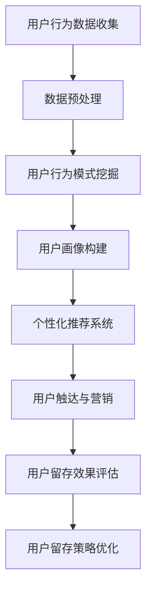

                 

### 文章标题

# 《AI驱动的电商平台用户留存策略》

### 关键词

- 电商平台
- 用户留存
- AI技术
- 个性化推荐
- 用户行为分析
- 用户画像
- 数据挖掘

### 摘要

本文深入探讨了AI驱动的电商平台用户留存策略。首先，从背景和现状出发，分析了电商平台用户留存的重要性。接着，介绍了AI技术在电商平台用户留存中的应用，构建了AI驱动的用户留存策略框架。随后，详细阐述了用户行为分析、用户画像与细分、个性化推荐系统、用户触达与营销等方面的核心原理和方法。文章还通过实际案例，展示了AI驱动的用户留存策略的实施过程和效果评估。最后，展望了AI技术在未来电商平台用户留存策略中的发展趋势和机遇。本文旨在为电商平台提供一套系统的用户留存策略，以实现可持续发展和商业成功。

-------------------------------------------------------------------

## 第一部分：电商平台用户留存概述

### 第1章：电商平台用户留存背景与现状

#### 1.1 电商平台用户留存的重要性

电商平台用户留存是衡量电商平台运营成功与否的关键指标。用户留存率高，意味着用户对电商平台有较强的粘性和忠诚度，能够持续进行购物活动，从而提升电商平台的市场份额和收入。具体来说，用户留存的重要性体现在以下几个方面：

1. **提升用户满意度**：用户留存率高，说明用户对电商平台的使用体验满意，能够增强用户的忠诚度和口碑传播，进而吸引更多新用户。

2. **降低用户获取成本**：用户留存率高的电商平台，新用户的获取成本较低，因为现有用户会通过口碑传播吸引新的潜在用户。

3. **提高用户活跃度**：留存用户具有较高的活跃度，能够频繁地访问电商平台，增加平台的流量和销售额。

4. **优化运营策略**：通过分析用户留存数据，电商平台可以优化运营策略，提升用户体验，进一步提高用户留存率。

#### 1.2 电商平台用户留存现状分析

当前，电商平台用户留存现状呈现出以下特点：

1. **整体用户留存率较低**：大多数电商平台用户留存率在20%-40%之间，部分平台甚至低于10%。

2. **用户留存时长不一**：新用户的留存时长普遍较短，一般在1-3个月内。而老用户的留存时长较长，有些甚至能达到1年以上。

3. **行业差异明显**：不同行业电商平台的用户留存率存在明显差异，例如，服饰类电商用户留存率较高，而家电类电商用户留存率相对较低。

4. **用户流失原因多样**：用户流失的原因复杂多样，包括用户体验不佳、商品质量不达标、价格不具优势等。

#### 1.3 用户留存策略的重要性

为了提升电商平台用户留存率，制定有效的用户留存策略至关重要。具体重要性体现在：

1. **提升用户价值**：通过留存策略，电商平台能够延长用户的生命周期，提升用户的平均消费额和复购率，从而增加用户价值。

2. **降低用户流失率**：通过精准的用户行为分析和个性化服务，可以有效降低用户流失率，减少用户流失带来的损失。

3. **提高市场竞争力**：用户留存率高的电商平台在市场竞争中具有优势，能够吸引更多用户和商家，提升市场占有率。

4. **优化运营效率**：通过用户留存策略，电商平台可以优化资源配置，提高运营效率，降低运营成本。

综上所述，电商平台用户留存策略不仅关系到平台的短期业绩，更是其长期发展的重要基石。本文将深入探讨AI驱动的用户留存策略，为电商平台提供一套系统的解决方案。

-------------------------------------------------------------------

### 第2章：AI与电商平台用户留存

#### 2.1 AI在电商平台的应用概述

人工智能（AI）在电商平台中的应用日益广泛，其强大的数据处理能力和智能算法为电商平台提供了创新的解决方案。以下是AI在电商平台中的主要应用领域：

1. **用户行为分析**：通过分析用户的浏览、搜索、购买等行为数据，AI可以识别用户的兴趣偏好和行为模式，为个性化推荐和用户留存策略提供依据。

2. **个性化推荐系统**：基于用户行为数据和机器学习算法，AI可以构建个性化推荐系统，为用户提供个性化的商品推荐，提高用户的购物体验和满意度。

3. **智能客服**：通过自然语言处理（NLP）和语音识别技术，AI可以自动化处理用户咨询，提供即时、准确的客服服务，提高客户满意度。

4. **风险控制**：AI可以分析交易数据，识别异常交易行为，降低欺诈风险，保障用户和平台的安全。

5. **库存管理**：利用AI算法预测市场需求，优化库存管理，减少库存成本，提高库存周转率。

#### 2.2 AI在用户留存中的应用潜力

AI技术在电商平台用户留存中的应用潜力巨大，主要体现在以下几个方面：

1. **精准用户画像**：通过大数据分析和机器学习算法，AI可以构建精准的用户画像，深入挖掘用户的潜在需求和兴趣，为用户留存策略提供有力支持。

2. **个性化推荐**：基于用户行为数据和个性化推荐算法，AI可以为用户提供个性化的商品推荐，提升用户的购物体验和满意度，从而提高用户留存率。

3. **智能营销**：通过AI技术，电商平台可以自动化地进行用户触达和营销活动，精准推送营销信息，提高营销效果，降低营销成本。

4. **用户行为预测**：利用AI算法分析用户行为数据，可以预测用户流失风险，提前采取措施，降低用户流失率。

5. **用户体验优化**：通过AI技术分析用户反馈和评价，发现用户体验中的痛点，及时优化产品和服务，提升用户满意度。

#### 2.3 AI驱动的用户留存策略框架

基于AI技术在电商平台用户留存中的应用潜力，本文提出了一套AI驱动的用户留存策略框架，如图1所示：



**图1：AI驱动的用户留存策略框架**

具体步骤如下：

1. **用户行为数据收集**：通过电商平台系统，收集用户的浏览、搜索、购买等行为数据。

2. **数据预处理**：清洗和预处理用户行为数据，去除异常值，提取关键特征。

3. **用户行为模式挖掘**：利用聚类、关联规则挖掘等技术，分析用户行为模式，为用户画像构建提供基础。

4. **用户画像构建**：基于用户行为数据，构建精准的用户画像，包括用户的基本信息、兴趣偏好、消费习惯等。

5. **个性化推荐系统**：利用用户画像和商品数据，构建个性化推荐系统，为用户提供个性化的商品推荐。

6. **用户触达与营销**：通过AI技术，自动化进行用户触达和营销活动，精准推送营销信息。

7. **用户留存效果评估**：利用留存率、用户满意度等指标，评估用户留存效果。

8. **用户留存策略优化**：根据用户留存效果评估结果，调整和优化用户留存策略。

通过上述步骤，电商平台可以构建一套AI驱动的用户留存策略，提升用户留存率和满意度，实现商业成功。

-------------------------------------------------------------------

### 第3章：用户行为分析

#### 3.1 用户行为数据收集与处理

用户行为数据是构建用户画像和个性化推荐系统的基础。要实现有效的用户行为分析，首先需要收集和处理用户行为数据。

**用户行为数据收集**

电商平台可以通过以下途径收集用户行为数据：

1. **日志数据**：通过电商平台服务器日志记录用户的行为数据，包括用户访问页面、点击链接、购买商品等操作。

2. **网站跟踪代码**：在电商平台网站上嵌入跟踪代码（如Google Analytics），记录用户的浏览行为、页面停留时间等。

3. **客户反馈**：通过用户评价、投诉和建议等渠道，获取用户的反馈数据。

4. **社交媒体数据**：通过社交媒体平台，收集用户在平台上的互动数据，如点赞、评论、分享等。

**用户行为数据处理**

收集到的用户行为数据通常存在噪声和缺失值，需要进行处理。以下是用户行为数据处理的步骤：

1. **数据清洗**：去除重复记录、纠正错误数据、填补缺失值。

2. **特征工程**：从原始数据中提取有价值的信息，如用户浏览次数、购买频率、页面停留时间等。

3. **数据标准化**：对数据进行归一化或标准化处理，使其适合用于机器学习算法。

#### 3.2 用户行为模式挖掘

用户行为模式挖掘是分析用户行为数据的关键步骤。通过挖掘用户行为模式，可以深入了解用户的行为特征和偏好，为个性化推荐和用户留存策略提供支持。

**常见用户行为模式挖掘方法**

1. **聚类分析**：利用聚类算法（如K-means、DBSCAN）将用户行为数据划分为不同的群体，分析不同群体之间的行为差异。

2. **关联规则挖掘**：利用关联规则挖掘算法（如Apriori、FP-Growth），发现用户行为数据中的关联关系，如“购买A商品的用户很可能也会购买B商品”。

3. **时序分析**：利用时间序列分析算法（如ARIMA、LSTM），分析用户行为数据的时间变化规律，预测用户未来的行为模式。

**实例：基于K-means的聚类分析**

假设我们使用K-means聚类算法分析用户行为数据，以下是其基本步骤：

1. **初始化聚类中心**：随机选择K个用户行为数据点作为初始聚类中心。

2. **分配用户**：将每个用户行为数据点分配到最近的聚类中心。

3. **更新聚类中心**：计算每个聚类的中心点。

4. **迭代计算**：重复步骤2和3，直到聚类中心不再变化。

5. **分析聚类结果**：分析每个聚类群体用户的行为特征和偏好，为后续的用户画像构建提供依据。

**伪代码：用户行为聚类分析**

```python
import numpy as np
from sklearn.cluster import KMeans

# 假设 user_data 是用户行为数据矩阵
k = 3  # 聚类数量
kmeans = KMeans(n_clusters=k, random_state=0).fit(user_data)

# 获取聚类结果
labels = kmeans.labels_

# 获取聚类中心
centroids = kmeans.cluster_centers_

# 分析聚类结果
for i in range(k):
    print(f"Cluster {i}:")
    print(f"Users: {np.where(labels == i)[0]}")
    print(f"Centroid: {centroids[i]}")
```

通过用户行为模式挖掘，电商平台可以深入了解用户行为特征，为个性化推荐和用户留存策略提供有力支持。

#### 3.3 用户行为分析算法介绍

在用户行为分析中，常用的算法包括聚类分析、关联规则挖掘和时序分析。以下分别介绍这些算法的基本原理和常用方法。

**1. 聚类分析**

聚类分析是一种无监督学习方法，用于将数据点分为多个群体，使同群体内的数据点相似度较高，不同群体内的数据点相似度较低。常用的聚类算法包括：

- **K-means**：基于距离度量的聚类算法，将数据点分为K个聚类，使每个数据点到其聚类中心的最短距离之和最小。

  **伪代码**：
  ```python
  import numpy as np
  from sklearn.cluster import KMeans

  # 假设 X 是用户行为数据矩阵，K 是聚类数量
  kmeans = KMeans(n_clusters=K, random_state=0).fit(X)
  labels = kmeans.labels_
  centroids = kmeans.cluster_centers_
  ```

- **DBSCAN**：基于密度的聚类算法，可以自动识别不同形状的聚类，对噪声数据具有较强的鲁棒性。

  **伪代码**：
  ```python
  import numpy as np
  from sklearn.cluster import DBSCAN

  # 假设 X 是用户行为数据矩阵，eps 是邻域半径，min_samples 是最小样本数
  db = DBSCAN(eps=eps, min_samples=min_samples).fit(X)
  labels = db.labels_
  ```

**2. 关联规则挖掘**

关联规则挖掘用于发现数据项之间的关联关系。常见的算法包括：

- **Apriori**：基于支持度和置信度的算法，通过递归搜索所有可能的事务集合，生成频繁项集。

  **伪代码**：
  ```python
  from apyori import apriori

  # 假设 transactions 是事务数据集，min_support 是最小支持度，min_confidence 是最小置信度
  results = apriori(transactions, min_support=min_support, min_confidence=min_confidence)
  ```

- **FP-Growth**：基于频繁模式树（FP-Tree）的算法，通过递归生成频繁项集，减少计算复杂度。

  **伪代码**：
  ```python
  from mlxtend.frequent_patterns import fpgrowth

  # 假设 transactions 是事务数据集，min_support 是最小支持度
  fp = fpgrowth(transactions, min_support=min_support)
  ```

**3. 时序分析**

时序分析用于分析数据随时间变化的规律，常用的算法包括：

- **ARIMA**：自回归积分滑动平均模型，通过拟合数据序列的AR（自回归）、I（差分）和MA（移动平均）特性，预测未来数据。

  **伪代码**：
  ```python
  from statsmodels.tsa.arima.model import ARIMA

  # 假设 series 是时间序列数据，order 是 ARIMA 模型的参数（p, d, q）
  model = ARIMA(series, order=order)
  model_fit = model.fit()
  forecast = model_fit.forecast(steps=steps)
  ```

- **LSTM**：长短时记忆网络，是一种特殊的循环神经网络（RNN），能够捕捉时间序列中的长期依赖关系。

  **伪代码**：
  ```python
  from keras.models import Sequential
  from keras.layers import LSTM, Dense

  # 假设 X 是输入数据，y 是标签数据，n_steps 是时间步数
  model = Sequential()
  model.add(LSTM(units=50, return_sequences=True, input_shape=(n_steps, n_features)))
  model.add(LSTM(units=50))
  model.add(Dense(units=1))
  model.compile(optimizer='adam', loss='mse')
  model.fit(X, y, epochs=100, batch_size=32)
  ```

通过上述算法，电商平台可以对用户行为数据进行分析，挖掘用户的行为模式和偏好，为个性化推荐和用户留存策略提供支持。

-------------------------------------------------------------------

### 第4章：用户画像与细分

#### 4.1 用户画像的概念与构建

用户画像（User Profiling）是一种描述用户特征和需求的技术，通过对用户的历史行为、偏好、社会属性等信息进行收集和分析，构建出具有代表性的用户模型。用户画像不仅有助于电商平台了解用户，还能为个性化推荐、用户留存策略等提供重要依据。

**用户画像的组成部分**

1. **基础信息**：用户的基本信息，如年龄、性别、地理位置、职业等。

2. **行为特征**：用户的购物行为，如浏览历史、搜索关键词、购买记录、评价等。

3. **兴趣偏好**：用户的兴趣和偏好，如喜欢的商品类型、品牌、活动等。

4. **社会属性**：用户的社会属性，如教育程度、收入水平、消费习惯等。

5. **心理特征**：用户的心理特征，如购买动机、购买偏好等。

**用户画像的构建方法**

1. **数据收集**：通过电商平台系统、网站日志、社交媒体、用户反馈等渠道，收集用户的相关数据。

2. **数据清洗**：清洗和预处理原始数据，去除噪声和缺失值。

3. **特征工程**：从原始数据中提取有价值的信息，如用户浏览次数、购买频率、页面停留时间等。

4. **数据建模**：利用机器学习算法（如聚类、分类等）对用户行为数据进行建模，生成用户画像。

5. **标签体系**：建立用户画像的标签体系，将用户特征进行分类和归档。

**实例：基于聚类算法的用户画像构建**

假设我们使用K-means聚类算法构建用户画像，以下是其基本步骤：

1. **初始化聚类中心**：随机选择K个用户行为数据点作为初始聚类中心。

2. **分配用户**：将每个用户行为数据点分配到最近的聚类中心。

3. **更新聚类中心**：计算每个聚类的中心点。

4. **迭代计算**：重复步骤2和3，直到聚类中心不再变化。

5. **分析聚类结果**：分析每个聚类群体用户的行为特征和偏好，生成用户画像。

**伪代码：K-means聚类算法**

```python
import numpy as np
from sklearn.cluster import KMeans

# 假设 user_data 是用户行为数据矩阵
k = 3  # 聚类数量
kmeans = KMeans(n_clusters=k, random_state=0).fit(user_data)

# 获取聚类结果
labels = kmeans.labels_

# 获取聚类中心
centroids = kmeans.cluster_centers_

# 分析聚类结果
for i in range(k):
    print(f"Cluster {i}:")
    print(f"Users: {np.where(labels == i)[0]}")
    print(f"Centroid: {centroids[i]}")
```

通过构建用户画像，电商平台可以深入了解用户需求和行为模式，为个性化推荐和用户留存策略提供有力支持。

#### 4.2 用户细分方法与策略

用户细分（User Segmentation）是将用户群体划分为不同的子群体，以更好地理解用户需求和行为，进而实施有针对性的营销策略。有效的用户细分方法能够提高营销效果，降低营销成本，提升用户满意度。

**用户细分方法**

1. **基于行为的细分**：根据用户的购物行为、浏览历史、购买频率等特征进行细分，如高频买家、潜在买家、流失用户等。

2. **基于人口统计学的细分**：根据用户的基本信息，如年龄、性别、地理位置、收入水平等特征进行细分。

3. **基于兴趣的细分**：根据用户的兴趣偏好、搜索关键词、评价等特征进行细分，如时尚爱好者、美食达人等。

4. **基于价值的细分**：根据用户的消费额度、购买频率、生命周期价值等特征进行细分，如价值用户、潜在价值用户等。

**用户细分策略**

1. **目标市场定位**：根据用户细分结果，明确目标市场，制定有针对性的营销策略。

2. **个性化推荐**：根据用户细分结果，为不同子群体提供个性化的商品推荐，提高用户满意度和转化率。

3. **精准营销**：利用用户细分结果，针对不同子群体推送精准的营销信息，提高营销效果。

4. **用户留存策略**：根据用户细分结果，制定有针对性的用户留存策略，降低用户流失率。

**实例：基于RFM模型的用户细分**

RFM模型是一种常用的用户细分方法，通过分析用户的最近购买时间（Recency）、购买频率（Frequency）和购买金额（Monetary）三个指标，对用户进行细分。

1. **最近购买时间（Recency）**：计算用户最近一次购买与当前时间的时间差，越接近当前时间的用户，越可能是活跃用户。

2. **购买频率（Frequency）**：计算用户在一段时间内的购买次数，购买频率越高的用户，越可能是忠实用户。

3. **购买金额（Monetary）**：计算用户在一段时间内的购买金额，购买金额越高的用户，越可能是高价值用户。

**RFM模型细分策略**

- **活跃用户**：最近购买时间短、购买频率高、购买金额高的用户，进行重点关注和优惠活动推送。

- **潜在流失用户**：最近购买时间长、购买频率低、购买金额低的用户，进行挽回策略，如优惠券、积分兑换等。

- **高价值用户**：最近购买时间短、购买频率高、购买金额高的用户，进行高端营销和个性化服务。

- **沉默用户**：最近购买时间长、购买频率低、购买金额低的用户，进行唤醒策略，如定向推送、优惠活动等。

通过用户细分，电商平台可以更好地了解用户需求和行为，制定有针对性的营销策略，提高用户留存率和满意度。

#### 4.3 用户画像应用实例

用户画像在电商平台中的应用十分广泛，以下通过具体实例介绍用户画像在个性化推荐、精准营销和用户留存策略等方面的应用。

**1. 个性化推荐**

通过构建用户画像，电商平台可以实现个性化推荐，提高用户满意度和转化率。以下是一个具体的应用实例：

- **用户A**：用户A最近浏览了多个母婴类商品，且搜索关键词中包含“新生儿护理”。
- **用户画像**：根据用户A的行为数据，构建用户画像，包括用户偏好（母婴类商品）、近期关注（新生儿护理）等特征。
- **个性化推荐**：根据用户画像，为用户A推荐相关的母婴类商品，如“新生儿护理套装”、“婴儿洗发水”等。

**2. 精准营销**

通过用户画像，电商平台可以实现精准营销，提高营销效果。以下是一个具体的应用实例：

- **用户B**：用户B最近购买了多件羽绒服，且购买金额较高。
- **用户画像**：根据用户B的行为数据，构建用户画像，包括用户消费能力（高消费）、购买偏好（羽绒服）等特征。
- **精准营销**：根据用户画像，为用户B推送羽绒服相关的优惠活动，如“满500减100”、“限时折扣”等。

**3. 用户留存策略**

通过用户画像，电商平台可以制定有针对性的用户留存策略，降低用户流失率。以下是一个具体的应用实例：

- **用户C**：用户C在最近一个月内没有进行任何购买行为。
- **用户画像**：根据用户C的行为数据，构建用户画像，包括用户行为（无购买行为）、近期关注（无）等特征。
- **用户留存策略**：根据用户画像，为用户C推送优惠活动，如“满100减50”、“优惠券兑换”等，以激发用户重新购买。

通过以上实例，可以看出用户画像在电商平台中的应用价值。通过构建用户画像，电商平台可以更好地了解用户需求和行为，制定个性化推荐、精准营销和用户留存策略，提高用户满意度、转化率和留存率。

-------------------------------------------------------------------

### 第5章：个性化推荐系统

#### 5.1 个性化推荐系统原理

个性化推荐系统是一种通过分析用户行为数据，为用户推荐其可能感兴趣的商品或内容的技术。其核心目标是提高用户满意度、提升转化率和留存率。个性化推荐系统通常基于两种主要方法：协同过滤和基于内容的推荐。

**协同过滤（Collaborative Filtering）**

协同过滤是一种基于用户行为数据的推荐方法，通过计算用户之间的相似度，为用户推荐其他用户喜欢且用户可能感兴趣的物品。协同过滤可以分为两种类型：

1. **基于用户的协同过滤（User-based Collaborative Filtering）**：该方法通过计算用户之间的相似度，找到与目标用户兴趣相似的邻居用户，推荐邻居用户喜欢的商品。

   **伪代码**：
   ```python
   # 假设 user_similarity 是用户相似度矩阵，user rated_items 是目标用户的评分数据
   neighbors = find_neighbors(user_similarity, user_rated_items)
   recommended_items = recommend_items(neighbors, user_rated_items)
   ```

2. **基于模型的协同过滤（Model-based Collaborative Filtering）**：该方法通过构建数学模型（如矩阵分解、潜在因子模型等），预测用户对未知物品的评分，进而推荐用户可能感兴趣的物品。

   **伪代码**：
   ```python
   # 假设 model 是矩阵分解模型，user rated_items 是目标用户的评分数据
   predicted_ratings = model.predict(user_rated_items)
   recommended_items = recommend_items(predicted_ratings)
   ```

**基于内容的推荐（Content-based Recommendation）**

基于内容的推荐是一种基于物品特征的推荐方法，通过分析用户过去的行为和偏好，找到与用户兴趣相关的商品或内容，并将其推荐给用户。基于内容的推荐可以分为以下几种方法：

1. **基于物品的相似度计算**：该方法通过计算物品之间的特征相似度，为用户推荐与其历史行为或偏好相似的物品。

   **伪代码**：
   ```python
   # 假设 item_features 是物品特征矩阵，user_interests 是用户兴趣特征
   similarity_matrix = compute_similarity(item_features, user_interests)
   recommended_items = recommend_items(similarity_matrix)
   ```

2. **基于关键词的推荐**：该方法通过提取物品的关键词或标签，为用户推荐与其关键词或标签匹配的物品。

   **伪代码**：
   ```python
   # 假设 item_keywords 是物品关键词列表，user_keywords 是用户关键词列表
   matched_items = find_matched_items(item_keywords, user_keywords)
   recommended_items = recommend_items(matched_items)
   ```

**协同过滤与基于内容的结合**

在实际应用中，协同过滤和基于内容的推荐可以相互结合，以提高推荐系统的效果。这种结合方法称为混合推荐系统（Hybrid Recommender System）。

**伪代码**：
```python
# 假设 collaborative_model 是协同过滤模型，content_model 是基于内容的推荐模型
collaborative_recommendations = collaborative_model.predict(user_rated_items)
content_recommendations = content_model.predict(user_interests)
combined_recommendations = combine_recommendations(collaborative_recommendations, content_recommendations)
```

通过个性化推荐系统，电商平台可以更好地满足用户需求，提升用户满意度和转化率。

-------------------------------------------------------------------

#### 5.2 内容推荐算法

内容推荐算法是一种基于物品特征为用户推荐相关内容的方法。与协同过滤算法相比，内容推荐算法更注重物品本身的内容和属性，而不是用户之间的相似性。以下是几种常用的内容推荐算法：

**1. 基于物品的相似度计算**

基于物品的相似度计算是一种最基本的内容推荐算法。该方法通过计算物品之间的相似度，为用户推荐与其已购买或浏览的物品相似的物品。

**算法原理**：
物品的相似度可以通过计算它们之间的余弦相似度、皮尔逊相关系数等指标来衡量。具体步骤如下：

1. **特征提取**：对物品进行特征提取，如标签、关键词、类别等。
2. **相似度计算**：计算物品之间的相似度，如余弦相似度：
   $$
   \text{similarity}(i, j) = \frac{\text{dot\_product}(f_i, f_j)}{\|\text{f_i}\|\|\text{f_j}\|}
   $$
   其中，$f_i$和$f_j$分别是物品$i$和$j$的特征向量。

**伪代码**：
```python
# 假设 item_features 是物品特征矩阵
def calculate_similarity(item1, item2):
    dot_product = np.dot(item1, item2)
    norm_product = np.linalg.norm(item1) * np.linalg.norm(item2)
    similarity = dot_product / norm_product
    return similarity

# 假设 items 是所有物品的特征矩阵
for item1 in items:
    for item2 in items:
        similarity = calculate_similarity(item1, item2)
        print(f"Item {item1} and Item {item2} have a similarity of {similarity}")
```

**2. 基于关键词的推荐**

基于关键词的推荐算法通过提取物品的关键词或标签，为用户推荐与其关键词或标签匹配的物品。

**算法原理**：
该方法利用物品关键词之间的相似性，计算物品之间的相似度。具体步骤如下：

1. **关键词提取**：对物品进行关键词提取，如使用TF-IDF、Word2Vec等方法。
2. **相似度计算**：计算物品关键词之间的相似度，如使用余弦相似度、Jaccard相似度等。

**伪代码**：
```python
# 假设 item_keywords 是物品关键词列表
def calculate_similarity(item1, item2):
    intersection = set(item1) & set(item2)
    union = set(item1) | set(item2)
    similarity = len(intersection) / len(union)
    return similarity

# 假设 items 是所有物品的关键词列表
for item1 in items:
    for item2 in items:
        similarity = calculate_similarity(item1, item2)
        print(f"Item {item1} and Item {item2} have a similarity of {similarity}")
```

**3. 基于内容的线性组合**

基于内容的线性组合算法将物品的各个特征进行加权求和，生成一个综合特征向量，然后计算用户已购买或浏览物品与待推荐物品之间的相似度。

**算法原理**：
该方法的步骤如下：

1. **特征提取**：对物品进行特征提取，如标签、关键词、类别等。
2. **特征加权**：对每个特征进行加权，如使用TF-IDF、Word2Vec等方法。
3. **相似度计算**：计算用户已购买或浏览物品与待推荐物品之间的相似度。

**伪代码**：
```python
# 假设 item_weights 是物品特征权重矩阵，user_interests 是用户兴趣特征向量
def calculate_similarity(item1, item2):
    weighted_sum = np.dot(item1, item2)
    similarity = weighted_sum
    return similarity

# 假设 items 是所有物品的特征向量
for item1 in items:
    for item2 in items:
        similarity = calculate_similarity(item1, item2)
        print(f"Item {item1} and Item {item2} have a similarity of {similarity}")
```

通过这些内容推荐算法，电商平台可以为用户提供个性化的商品推荐，提高用户满意度和转化率。

-------------------------------------------------------------------

### 第6章：用户触达与营销

#### 6.1 用户触达策略

用户触达是指电商平台通过各种渠道和方法，将营销信息传递给目标用户，以吸引和留住用户。有效的用户触达策略能够提高用户的关注度和参与度，从而提升转化率和留存率。以下是几种常见的用户触达策略：

**1. 社交媒体营销**

社交媒体营销是一种通过在社交媒体平台上发布内容、互动和广告来触达目标用户的方法。常见的社交媒体平台包括Facebook、Instagram、Twitter、微信、微博等。以下是社交媒体营销的几个关键点：

- **内容营销**：发布高质量的内容，如图片、视频、文章等，吸引用户关注。
- **互动营销**：积极与用户互动，如回复评论、参与话题讨论等，提升用户参与度。
- **广告投放**：利用社交媒体平台的广告系统，投放精准的广告，提高曝光度和转化率。

**2. 电子邮件营销**

电子邮件营销是一种通过发送电子邮件向用户传递营销信息的方法。电子邮件营销的优势在于其直接性和可控性，以下是几个关键点：

- **个性化邮件**：根据用户的兴趣、行为和购买历史，定制个性化的邮件内容。
- **定期邮件**：制定邮件发送计划，如每周、每月发送一次邮件，保持与用户的联系。
- **促销活动**：在邮件中推送限时优惠、优惠券、礼品等促销信息，吸引用户购买。

**3. 移动推送营销**

移动推送营销是一种通过向用户的移动设备发送推送通知来触达用户的方法。移动推送营销具有实时性、高到达率和高点击率的特点。以下是几个关键点：

- **精准推送**：根据用户的兴趣、行为和位置，发送个性化的推送通知。
- **限时活动**：推送限时优惠、活动提醒等，激发用户的购买欲望。
- **互动推送**：推送互动性强的内容，如抽奖、调查问卷等，提升用户参与度。

**4. 线下活动**

线下活动是一种通过举办实体活动来触达用户的方法，如展会、讲座、促销活动等。线下活动能够与用户建立更直观、更深入的联系，提升用户对品牌的认知和好感度。以下是几个关键点：

- **活动策划**：制定有趣、有吸引力的活动方案，确保活动的参与度和互动性。
- **渠道推广**：通过社交媒体、电子邮件、移动推送等多种渠道，提前宣传和推广活动。
- **现场体验**：提供优质的现场体验，如试吃、试用、互动游戏等，吸引用户参与。

通过以上用户触达策略，电商平台可以有效地将营销信息传递给目标用户，提升用户参与度和转化率。

#### 6.2 营销渠道选择与优化

选择合适的营销渠道是提升用户触达效果的关键。不同的营销渠道适用于不同的用户群体和市场环境，因此，电商平台需要根据自身特点和目标用户的需求，选择合适的营销渠道，并不断优化和调整。

**1. 营销渠道选择**

- **社交媒体渠道**：适用于年轻、时尚的用户群体，如微信、微博、抖音等。通过发布有趣的内容和互动活动，吸引用户关注和参与。
- **电子邮件渠道**：适用于对电商购物有较高需求的用户群体，通过个性化邮件和促销活动，提高用户购买意愿。
- **移动推送渠道**：适用于移动端用户，通过实时推送和个性化推荐，提高用户参与度和转化率。
- **线下活动渠道**：适用于希望通过实体体验建立品牌认知的用户群体，通过举办实体活动，提升品牌形象和用户好感度。

**2. 营销渠道优化**

- **数据驱动**：通过数据分析，了解不同营销渠道的转化率和用户参与度，不断优化和调整营销策略。
- **跨渠道整合**：实现不同营销渠道之间的整合，如将社交媒体内容和电子邮件营销相结合，提高整体营销效果。
- **个性化定制**：根据用户兴趣和行为，定制个性化的营销内容和渠道，提高用户满意度和参与度。
- **持续优化**：定期评估和优化营销渠道，根据市场变化和用户需求，调整营销策略。

通过科学选择和优化营销渠道，电商平台可以更好地触达目标用户，提升营销效果和用户留存率。

#### 6.3 营销活动设计与实施

成功的营销活动能够有效提升用户参与度和转化率，从而促进用户留存。以下是一个具体的营销活动设计与实施案例：

**1. 活动背景**

某电商平台为了提升夏季清凉用品的销量，计划开展一场夏季清凉促销活动。

**2. 活动目标**

- 提升夏季清凉用品的销量
- 提高用户参与度和互动性
- 增强品牌形象和用户好感度

**3. 活动内容**

- **限时折扣**：为夏季清凉用品设置限时折扣，如“满300减50”、“限时特价”等。
- **优惠券发放**：在活动期间，发放限量优惠券，如“新人优惠券”、“老用户返现券”等。
- **互动游戏**：设置互动游戏，如“抽奖赢大奖”、“拼图大挑战”等，吸引用户参与。
- **社交媒体推广**：通过社交媒体平台，发布活动预告、活动内容、用户互动等，提高活动曝光度和参与度。

**4. 活动实施步骤**

- **策划阶段**：明确活动目标、内容、时间和预算，制定详细的实施计划。
- **预热阶段**：在活动前一周，通过社交媒体、电子邮件、移动推送等方式，提前宣传和预热活动。
- **执行阶段**：在活动期间，按照实施计划执行各项活动内容，如优惠券发放、互动游戏等。
- **跟进阶段**：活动结束后，进行活动效果评估和用户反馈收集，为后续活动提供参考。

**5. 活动效果评估**

- **销售额**：对比活动期间和活动前后的销售额，评估活动对销量提升的效果。
- **用户参与度**：统计互动游戏的参与人数、抽奖活动的中奖人数等，评估用户参与度。
- **品牌影响力**：通过社交媒体、用户评价等渠道，了解活动对品牌形象和用户好感度的影响。

通过以上营销活动设计与实施，电商平台能够有效提升夏季清凉用品的销量和用户参与度，从而提高用户留存率。

-------------------------------------------------------------------

### 第7章：用户留存效果评估与优化

#### 7.1 用户留存效果评估方法

评估用户留存效果是制定和优化用户留存策略的重要环节。以下介绍几种常用的用户留存效果评估方法：

**1. 留存率评估**

留存率是评估用户留存效果最常用的指标之一。它表示在一定时间内，仍然活跃在平台上的用户占初始注册用户总数的比例。留存率可以通过以下公式计算：

$$
用户留存率 = \frac{第n天还留在平台上的用户数}{第0天平台上所有用户数} \times 100\%
$$

**实例**：

假设某电商平台在第0天有1000名新注册用户，在第7天还有800名用户在平台上活跃，则该平台的新用户7日留存率为：

$$
用户留存率 = \frac{800}{1000} \times 100\% = 80\%
$$

**2. 留存时长评估**

留存时长是指用户在平台上连续活跃的时间长度。通过分析留存时长，可以了解用户的活跃程度和生命周期价值。常见的留存时长评估指标包括：

- **次日留存**：用户在注册后次日仍然活跃的比例。
- **7日留存**：用户在注册后7天内仍然活跃的比例。
- **30日留存**：用户在注册后30天内仍然活跃的比例。

**3. 用户流失率评估**

用户流失率是指在一定时间内离开平台的用户占总用户数的比例。用户流失率可以通过以下公式计算：

$$
用户流失率 = \frac{第n天离开平台上的用户数}{第0天平台上所有用户数} \times 100\%
$$

**实例**：

假设某电商平台在第0天有1000名用户，在第30天有200名用户离开平台，则该平台的30日用户流失率为：

$$
用户流失率 = \frac{200}{1000} \times 100\% = 20\%
$$

**4. 留存因素分析**

留存因素分析是指通过分析影响用户留存的各种因素，识别关键因素并制定优化策略。常见的留存因素包括：

- **用户体验**：用户对平台的界面设计、操作便捷性、响应速度等的满意度。
- **产品服务**：平台提供的商品质量、价格、物流服务等方面的满意度。
- **用户互动**：平台与用户之间的互动方式，如客服、社区、活动等。
- **营销活动**：平台开展的促销活动、优惠券等对用户留存的影响。

通过以上评估方法，电商平台可以全面了解用户留存效果，识别关键因素，为优化用户留存策略提供数据支持。

#### 7.2 用户留存优化策略

用户留存优化策略是指通过一系列措施和手段，提高用户在平台上的活跃度和留存率。以下介绍几种常见的用户留存优化策略：

**1. 个性化推荐**

个性化推荐系统可以根据用户的历史行为和偏好，为用户推荐个性化的商品和内容。通过提高推荐的准确性和相关性，可以提升用户满意度，从而提高用户留存率。

**2. 优化用户体验**

优化用户体验包括改善界面设计、提高页面加载速度、简化操作流程等。通过提升用户体验，可以降低用户在平台上的操作难度和等待时间，提高用户满意度，从而提高用户留存率。

**3. 加强用户互动**

加强用户互动包括建立用户社区、举办线上活动、提供客服支持等。通过增强用户与平台之间的互动，可以增加用户的粘性和忠诚度，从而提高用户留存率。

**4. 营销活动**

定期开展有针对性的营销活动，如限时优惠、优惠券、抽奖等，可以激发用户的购买欲望和参与热情，提高用户活跃度和留存率。

**5. 数据驱动**

通过收集和分析用户行为数据，可以深入了解用户需求和偏好，为优化用户留存策略提供数据支持。例如，通过分析用户流失原因，可以针对性地改进产品和运营策略。

**6. 用户分层管理**

根据用户的活跃度、消费金额等特征，将用户分为不同层次，制定差异化的用户留存策略。对于高价值用户，提供个性化服务和专属优惠；对于潜在流失用户，开展挽回策略。

通过以上用户留存优化策略，电商平台可以提升用户留存率，降低用户流失率，实现可持续发展。

#### 7.3 用户留存优化案例分析

以下通过具体案例，介绍用户留存优化策略的实施过程和效果。

**1. 案例背景**

某电商平台在分析用户留存数据时发现，其新用户次日留存率较低，仅有20%左右，而行业平均水平在30%以上。为了提高新用户留存率，电商平台决定实施一系列优化措施。

**2. 用户留存优化策略**

- **个性化推荐**：引入个性化推荐系统，根据用户的历史行为和偏好，为用户推荐个性化的商品和内容。通过提高推荐的准确性和相关性，提升用户满意度。

- **优化用户体验**：对平台界面进行优化，提高页面加载速度，简化操作流程，降低用户在平台上的操作难度。

- **加强用户互动**：建立用户社区，举办线上活动，提供客服支持，增强用户与平台之间的互动。

- **营销活动**：定期开展限时优惠、优惠券、抽奖等活动，激发用户的购买欲望和参与热情。

- **数据驱动**：通过收集和分析用户行为数据，深入了解用户需求和偏好，为优化用户留存策略提供数据支持。

**3. 实施过程**

- **个性化推荐**：通过大数据分析和机器学习算法，构建个性化推荐系统。在用户注册后，根据其浏览历史、搜索关键词、购买记录等数据，生成个性化的推荐结果。

- **优化用户体验**：对平台界面进行优化，提高页面加载速度，简化操作流程。例如，将复杂的多级导航简化为单级导航，减少用户点击次数。

- **加强用户互动**：建立用户社区，定期举办线上活动，如抽奖、问答等，增强用户与平台之间的互动。同时，提供24小时在线客服，及时解决用户问题。

- **营销活动**：在节假日和促销活动期间，开展限时优惠、优惠券、抽奖等活动，提高用户参与度和购买意愿。

- **数据驱动**：通过用户行为数据分析，了解用户流失原因和需求。例如，发现部分用户在注册后未完成购买流程，针对性地优化购买流程，降低用户流失率。

**4. 效果评估**

- **次日留存率**：通过实施优化措施后，新用户次日留存率从20%提升至30%，接近行业平均水平。

- **用户活跃度**：用户在平台上的活跃度有所提高，页面浏览量、商品收藏量、订单量等指标均有所上升。

- **用户满意度**：通过用户调查和反馈，用户满意度得到显著提升，用户对平台界面、操作便捷性、客服支持等方面的评价有所提高。

**5. 项目小结**

通过实施用户留存优化策略，某电商平台成功提高了新用户留存率和用户活跃度。实践证明，个性化推荐、优化用户体验、加强用户互动、数据驱动等策略对于提升用户留存效果具有重要意义。未来，电商平台可以继续探索和创新，进一步优化用户留存策略，提高用户满意度和商业价值。

-------------------------------------------------------------------

### 第8章：用户留存策略实战

#### 8.1 案例背景介绍

某大型电商平台A致力于提高用户留存率，以应对激烈的市场竞争和用户流失问题。该电商平台拥有丰富的用户行为数据和庞大的商品库，希望通过AI技术构建一套完善的用户留存策略，提升用户满意度和留存率。

**1. 案例目标**

- 提升新用户次日留存率
- 增加老用户活跃度和复购率
- 降低用户流失率
- 提高用户体验和满意度

**2. 案例背景**

- **用户规模**：平台月均活跃用户数达到1000万，新用户日注册量约5万。
- **用户行为数据**：收集用户的浏览、搜索、购买、评价等行为数据。
- **商品库**：拥有超过10万种商品，涵盖多个品类。

#### 8.2 用户行为分析与用户画像构建

**1. 用户行为数据收集**

电商平台通过网站日志、API接口、第三方数据源等方式，收集用户的浏览、搜索、购买、评价等行为数据。数据包括用户ID、浏览页面、搜索关键词、购买商品、评价等。

**2. 数据预处理**

对收集到的用户行为数据进行清洗和预处理，包括去除重复记录、填补缺失值、数据规范化等。具体步骤如下：

- **数据清洗**：去除重复的用户记录、缺失的数据记录。
- **特征提取**：从原始数据中提取关键特征，如用户浏览次数、购买频率、页面停留时间、评价分数等。
- **数据规范化**：对数据进行归一化或标准化处理，使其适合用于机器学习算法。

**3. 用户行为模式挖掘**

通过聚类分析、关联规则挖掘等方法，分析用户行为数据，挖掘用户的行为模式。具体步骤如下：

- **聚类分析**：使用K-means算法，将用户行为数据分为多个群体，分析不同群体之间的行为差异。
- **关联规则挖掘**：使用Apriori算法，挖掘用户行为数据中的关联关系，如“购买A商品的用户很可能也会购买B商品”。

**4. 用户画像构建**

基于用户行为数据，构建精准的用户画像，包括用户的基本信息、行为特征、兴趣偏好等。用户画像的具体内容包括：

- **基本信息**：用户年龄、性别、地理位置、职业等。
- **行为特征**：用户浏览历史、搜索关键词、购买记录、评价等。
- **兴趣偏好**：用户喜欢的商品类型、品牌、活动等。

通过用户画像，电商平台可以深入了解用户需求和行为模式，为个性化推荐和用户留存策略提供有力支持。

#### 8.3 个性化推荐系统设计与实现

**1. 个性化推荐系统原理**

个性化推荐系统基于用户行为数据和机器学习算法，为用户提供个性化的商品推荐。个性化推荐系统可以分为以下几种类型：

- **基于用户的协同过滤**：通过计算用户之间的相似度，推荐与目标用户兴趣相似的邻居用户喜欢的商品。
- **基于内容的推荐**：通过分析商品的特征，为用户推荐与其已购买或浏览的商品内容相似的物品。
- **混合推荐**：结合基于用户和基于内容的推荐方法，提高推荐系统的准确性和多样性。

**2. 个性化推荐系统实现步骤**

- **数据预处理**：清洗和预处理用户行为数据和商品数据，包括去除噪声、填充缺失值、特征提取等。
- **模型训练**：选择合适的推荐算法（如协同过滤、基于内容的推荐等），对训练数据进行模型训练。
- **推荐生成**：根据用户行为数据和模型预测，生成个性化的商品推荐列表。
- **推荐展示**：将推荐结果展示在用户界面，如首页推荐、搜索结果页等。

**3. 个性化推荐系统效果评估**

- **准确率**：评估推荐结果的准确率，即推荐给用户的前几名商品中，用户实际购买或感兴趣的商品占比。
- **多样性**：评估推荐结果的多样性，避免重复推荐相同类型的商品。
- **覆盖度**：评估推荐结果的覆盖度，即推荐结果中包含的不同商品种类和数量的占比。

通过以上步骤，电商平台可以构建一套高效的个性化推荐系统，提升用户满意度和留存率。

#### 8.4 用户触达与营销策略实施

**1. 用户触达策略**

电商平台通过多种渠道触达用户，包括社交媒体、电子邮件、移动推送等。具体策略如下：

- **社交媒体营销**：在微信、微博、抖音等社交媒体平台发布有趣的内容和互动活动，吸引用户关注和参与。
- **电子邮件营销**：定期发送个性化邮件，包括产品推荐、促销活动、优惠券等，提高用户购买意愿。
- **移动推送营销**：通过移动推送通知，及时向用户推送限时优惠、活动提醒等信息，提高用户参与度。

**2. 营销活动策略**

电商平台根据用户需求和节日活动，定期开展各类营销活动，包括：

- **限时折扣**：为特定商品设置限时折扣，吸引用户购买。
- **优惠券**：发放优惠券，如新用户优惠券、老用户返现券等，提高用户购买意愿。
- **抽奖活动**：举办抽奖活动，如“免费试用”、“中奖返现”等，提升用户参与度。

**3. 用户互动策略**

电商平台通过建立用户社区、举办线上活动和提供客服支持，增强用户与平台之间的互动：

- **用户社区**：建立用户社区，鼓励用户分享购物心得和体验，提高用户粘性。
- **线上活动**：举办各类线上活动，如拼团、秒杀、抽奖等，增加用户参与度。
- **客服支持**：提供24小时在线客服，及时解决用户问题，提升用户满意度。

通过以上用户触达与营销策略，电商平台可以有效地提高用户参与度和留存率。

#### 8.5 用户留存效果评估与优化

**1. 留存效果评估**

电商平台通过以下指标评估用户留存效果：

- **次日留存率**：新用户在次日仍然活跃的比例。
- **7日留存率**：新用户在7天内仍然活跃的比例。
- **30日留存率**：新用户在30天内仍然活跃的比例。
- **用户活跃度**：用户在平台上的浏览、搜索、购买等行为频率。
- **用户满意度**：用户对平台产品、服务、体验的满意度评分。

**2. 数据分析**

通过对留存效果指标的数据分析，电商平台可以发现用户留存中的问题，如：

- 次日留存率低于行业平均水平。
- 某些用户群体的留存率明显低于整体水平。
- 某些时间段（如节假日）的用户留存率较低。

**3. 优化措施**

根据数据分析结果，电商平台采取以下优化措施：

- **优化用户体验**：针对用户反馈和问题，改进平台界面、操作流程等，提高用户体验。
- **改进推荐系统**：优化个性化推荐算法，提高推荐准确性和多样性。
- **加强用户互动**：举办更多线上活动和用户社区互动，提高用户参与度。
- **精准营销**：根据用户需求和偏好，制定个性化的营销策略。

通过持续的数据分析和优化措施，电商平台可以不断提升用户留存率，实现商业成功。

-------------------------------------------------------------------

### 第9章：构建AI驱动的用户留存策略

#### 9.1 AI驱动的用户留存策略规划

构建AI驱动的用户留存策略需要系统性的规划和实施。以下是从整体角度出发，阐述如何规划AI驱动的用户留存策略。

**1. 明确目标**

首先，明确用户留存策略的目标，如提高新用户次日留存率、增加老用户活跃度、降低用户流失率等。目标应具备可量化的指标，以便后续评估策略效果。

**2. 数据收集与分析**

收集与用户留存相关的数据，如用户行为数据、用户画像、历史留存数据等。通过对这些数据进行深入分析，了解用户留存的关键因素和问题。

**3. 技术选型**

根据分析结果，选择合适的AI技术，如机器学习算法、深度学习模型、自然语言处理等。技术选型应考虑模型的性能、可扩展性和实施成本。

**4. 策略设计**

基于分析结果和技术选型，设计具体的用户留存策略。策略应包括用户行为分析、用户画像构建、个性化推荐、用户触达与营销等方面。

**5. 实施计划**

制定详细的实施计划，包括项目进度、资源分配、团队协作等。实施计划应确保策略的顺利推进和有效执行。

**6. 效果评估**

建立效果评估机制，定期评估用户留存策略的效果，包括留存率、用户活跃度、用户满意度等指标。根据评估结果，调整和优化策略。

#### 9.2 AI驱动的用户留存策略实施

在规划好AI驱动的用户留存策略后，需要按照以下步骤进行实施：

**1. 系统搭建**

搭建AI驱动的用户留存策略系统，包括数据收集、处理、存储、分析等模块。系统应具备高并发处理能力，以保证实时性和准确性。

**2. 模型训练与优化**

根据用户留存策略的需求，训练和优化机器学习模型。模型训练应使用历史数据，通过交叉验证和超参数调优，提高模型性能。

**3. 策略部署**

将训练好的模型部署到生产环境，实现实时用户行为分析和推荐。策略部署应考虑系统的扩展性和容错性，以应对不断增长的用户规模和流量。

**4. 系统运维**

持续监控系统运行状态，包括系统性能、数据完整性、安全防护等。定期进行系统升级和优化，确保系统稳定运行。

#### 9.3 AI驱动的用户留存策略评估与优化

**1. 效果评估**

定期评估AI驱动的用户留存策略效果，包括留存率、用户活跃度、用户满意度等指标。通过对比策略实施前后的数据，评估策略的有效性。

**2. 数据分析**

通过对留存效果指标的数据分析，发现潜在问题和改进空间。例如，分析用户流失原因、用户行为模式、用户反馈等。

**3. 优化措施**

根据数据分析结果，制定和实施优化措施，包括改进推荐算法、优化用户体验、调整营销策略等。优化措施应具备可操作性和针对性。

**4. 持续迭代**

用户留存策略不是一成不变的，应持续迭代和优化。根据市场变化、用户需求和竞争环境，定期调整和更新策略。

通过系统性的规划、实施和优化，AI驱动的用户留存策略可以有效提升用户留存率和满意度，实现商业成功。

-------------------------------------------------------------------

### 第10章：未来展望

#### 10.1 人工智能技术在电商领域的未来发展趋势

随着人工智能技术的不断进步，其在电商领域的应用前景广阔，未来有望在以下几个方面实现突破：

1. **个性化推荐**：人工智能技术将进一步提升个性化推荐系统的准确性和效率，通过深度学习、强化学习等技术，实现更精准的用户画像和商品推荐。

2. **智能客服**：基于自然语言处理和语音识别技术，智能客服将实现更自然、更高效的与用户互动，提高客户满意度和服务质量。

3. **智能定价**：利用机器学习算法，电商平台可以更精确地预测市场需求，动态调整商品价格，提高销售额和利润率。

4. **库存管理**：通过预测用户需求和商品销售趋势，人工智能技术可以优化库存管理，减少库存成本，提高库存周转率。

5. **个性化营销**：人工智能技术将助力电商平台实现更精准的个性化营销，通过大数据分析和机器学习算法，为不同用户群体提供定制化的营销策略。

6. **自动化供应链管理**：人工智能技术将加速电商供应链的数字化转型，实现自动化、智能化的物流和供应链管理，提高供应链效率。

#### 10.2 电商平台用户留存策略的挑战与机遇

在人工智能技术的推动下，电商平台用户留存策略面临以下挑战与机遇：

**挑战**：

1. **数据隐私与安全**：随着用户数据量的增加，数据隐私和安全性成为重要问题。如何确保用户数据的安全性和隐私保护，是电商平台面临的挑战。

2. **算法透明性与公平性**：个性化推荐和智能客服等算法的透明性和公平性受到关注，如何确保算法的公正性，避免歧视和偏见，是电商平台的挑战。

3. **技术升级与投入**：人工智能技术的不断进步，要求电商平台不断升级技术基础设施，增加技术投入，以应对不断变化的市场需求。

**机遇**：

1. **用户满意度提升**：通过人工智能技术，电商平台可以实现更精准的用户画像和个性化服务，提高用户满意度和忠诚度。

2. **用户留存率提高**：人工智能技术可以更有效地识别用户需求和行为模式，制定有针对性的用户留存策略，提高用户留存率。

3. **市场竞争优势**：具备人工智能技术的电商平台，将具有更强大的竞争力，能够更好地应对市场变化和用户需求。

#### 10.3 电商平台用户留存策略的未来发展方向

未来，电商平台用户留存策略的发展方向将集中在以下几个方面：

1. **全渠道整合**：电商平台将实现线上线下渠道的整合，通过多渠道触达用户，提供一致的购物体验。

2. **个性化服务**：电商平台将深入挖掘用户需求，提供更个性化的商品推荐和定制化服务，提高用户满意度和留存率。

3. **智能化营销**：电商平台将利用人工智能技术，实现更智能、更高效的营销活动，提升营销效果。

4. **智能供应链管理**：电商平台将借助人工智能技术，实现智能化供应链管理，提高供应链效率，降低成本。

5. **数据驱动**：电商平台将进一步加强数据分析能力，通过大数据和人工智能技术，制定更科学、更有效的用户留存策略。

总之，随着人工智能技术的不断发展，电商平台用户留存策略将朝着更加智能化、个性化、数据驱动的方向发展，实现更高的用户满意度和商业价值。

-------------------------------------------------------------------

### 附录

#### 附录 A：AI驱动的用户留存策略工具与资源

**A.1 常用数据挖掘与分析工具**

- **Python数据分析库**：Pandas、NumPy、SciPy、Scikit-learn
- **R语言数据分析工具**：R、ggplot2、dplyr
- **数据分析平台**：Google Analytics、Tableau、Power BI

**A.2 常用机器学习库与框架**

- **Python机器学习库**：Scikit-learn、TensorFlow、PyTorch
- **R语言机器学习包**：caret、mlr
- **深度学习框架**：TensorFlow、PyTorch、Keras

**A.3 电商平台用户留存策略相关资源链接**

- **AI在电商中的应用**：[AI in E-commerce](https://www.marketingtechnews.net/opinion/the-future-of-ai-in-ecommerce/)
- **用户留存案例分析**：[E-commerce User Retention Case Studies](https://www Marketing Charts.com/chart-library/user-retention-ecommerce-charts/)
- **个性化推荐系统论文**：[Personalized Recommendation Systems](https://ieeexplore.ieee.org/document/7538340)

通过使用上述工具和资源，电商平台可以更加高效地实施AI驱动的用户留存策略，提升用户满意度和留存率。

