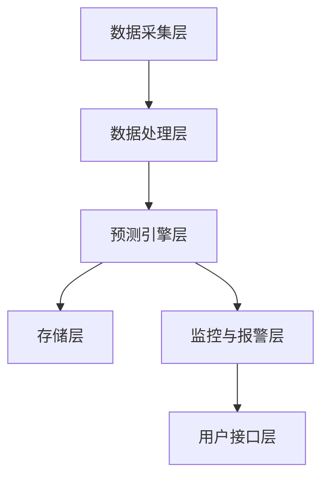

                 

### 文章标题：AI驱动的电商平台用户行为预测模型

关键词：人工智能、用户行为预测、电商平台、机器学习、深度学习、自然语言处理

摘要：本文将探讨如何利用人工智能技术，特别是机器学习和深度学习，来构建电商平台用户行为预测模型。通过对用户行为的分析，我们能够实现个性化推荐、购物车行为预测和用户流失预测等功能，从而提升电商平台的运营效率和用户体验。文章将从理论基础、模型构建、应用案例以及优化策略等多个方面进行深入讨论，旨在为从业者提供一套完整的解决方案和实用技巧。

### 目录大纲

# 《AI驱动的电商平台用户行为预测模型》

## 第一部分：AI基础知识

### 第1章：AI基础理论与概念  
#### 1.1 AI的发展历史与分类  
#### 1.2 机器学习的基本概念  
#### 1.3 深度学习的基本原理  
#### 1.4 自然语言处理基础

### 第2章：用户行为分析基础  
#### 2.1 用户行为的定义与特征  
#### 2.2 用户行为数据收集与预处理  
#### 2.3 用户画像与标签系统

## 第二部分：用户行为预测模型构建

### 第3章：用户行为预测理论基础  
#### 3.1 预测模型概述  
#### 3.2 常用预测算法与模型  
##### 3.2.1 线性回归模型  
##### 3.2.2 决策树模型  
##### 3.2.3 集成学习方法

### 第4章：用户行为预测模型构建  
#### 4.1 数据预处理与特征工程  
#### 4.2 模型选择与训练  
#### 4.3 模型评估与优化

### 第5章：用户行为预测应用  
#### 5.1 个性化推荐系统  
#### 5.2 购物车行为预测  
#### 5.3 用户流失预测

### 第6章：案例研究  
#### 6.1 案例一：电商平台用户行为预测系统  
#### 6.2 案例二：用户购买意图预测  
#### 6.3 案例三：用户忠诚度分析

## 第三部分：AI驱动的电商平台用户行为预测模型优化

### 第7章：模型调优与优化策略  
#### 7.1 超参数调优方法  
#### 7.2 模型集成与优化  
#### 7.3 模型解释与可解释性

### 第8章：实时用户行为预测系统设计与实现  
#### 8.1 实时预测系统架构设计  
#### 8.2 实时数据处理与存储  
#### 8.3 实时预测模型部署与监控

### 第9章：未来展望与挑战  
#### 9.1 用户行为预测的未来趋势  
#### 9.2 挑战与应对策略  
#### 9.3 伦理与隐私问题探讨

## 附录

### 附录A：常用工具与库  
#### A.1 Python数据科学工具  
#### A.2 常用机器学习库  
#### A.3 电商平台用户行为分析工具

### 附录B：参考文献  
#### B.1 相关书籍推荐  
#### B.2 学术论文推荐  
#### B.3 网络资源推荐### 引言

在当今数字化时代，电子商务已经成为商业活动的重要组成部分。随着互联网技术的不断发展，电商平台用户数量持续增长，市场竞争日益激烈。为了在这种竞争环境中脱颖而出，电商平台需要不断提升运营效率和用户体验。而AI驱动的用户行为预测模型在此背景下应运而生，成为电商平台提升竞争力的重要手段。

用户行为预测模型通过分析用户的浏览、搜索、购买等行为数据，预测用户的下一步操作或需求，从而为电商平台提供决策支持。这种预测不仅可以帮助平台实现个性化推荐，提高用户粘性，还可以提前识别用户流失风险，从而采取相应的措施挽留用户。此外，用户行为预测还可以为电商平台提供精准营销策略，提升广告投放效果，降低营销成本。

本文旨在探讨如何利用人工智能技术，特别是机器学习和深度学习，来构建电商平台用户行为预测模型。文章将从以下几个方面进行深入讨论：

1. **AI基础知识**：介绍人工智能的发展历史与分类，以及机器学习、深度学习和自然语言处理的基本概念和原理。
2. **用户行为分析基础**：定义用户行为，介绍用户行为数据的收集与预处理方法，以及用户画像与标签系统的构建。
3. **用户行为预测模型构建**：阐述用户行为预测的理论基础，介绍常用的预测算法与模型，以及模型构建的具体步骤和方法。
4. **用户行为预测应用**：探讨个性化推荐系统、购物车行为预测和用户流失预测等实际应用案例。
5. **AI驱动的电商平台用户行为预测模型优化**：讨论模型调优与优化策略，以及实时用户行为预测系统的设计与实现。
6. **未来展望与挑战**：分析用户行为预测的未来趋势，探讨面临的挑战和应对策略，以及伦理与隐私问题。

通过本文的探讨，希望能够为电商平台从业者提供一套系统化的用户行为预测解决方案，助力其在激烈的市场竞争中取得优势。接下来，我们将从AI基础知识开始，逐步深入探讨用户行为预测模型的构建与应用。首先，我们来回顾一下人工智能的发展历史与分类。### 第一部分：AI基础知识

#### 第1章：AI基础理论与概念

#### 1.1 AI的发展历史与分类

人工智能（Artificial Intelligence，简称AI）是计算机科学的一个分支，旨在研究如何让计算机模拟人类智能。自从20世纪50年代人工智能概念首次被提出以来，人工智能技术经历了多次起伏，经历了从梦想走向现实的演变。

**早期阶段（1950年代-1970年代）**  
人工智能的早期研究主要集中在符号主义和逻辑推理上。艾伦·图灵（Alan Turing）在1950年提出了著名的图灵测试，用于判断机器是否具备智能。这个时期的研究主要集中在问题求解、逻辑推理和专家系统等方面。

**繁荣阶段（1980年代）**  
在20世纪80年代，人工智能迎来了第一次繁荣期。专家系统成为研究热点，很多实际应用案例被开发出来。专家系统是一种基于知识和推理的计算机程序，能够模拟人类专家的决策过程。

**衰退阶段（1990年代）**  
随着计算机硬件和软件技术的发展，专家系统逐渐被取代。同时，人工智能研究也遭遇了“人工智能冬天”，主要原因是技术瓶颈和实际应用失败。这个时期的研究重点转向了数据挖掘和机器学习。

**复兴阶段（21世纪初至今）**  
21世纪初，随着互联网和大数据技术的发展，人工智能迎来了第二次繁荣期。深度学习、自然语言处理和计算机视觉等领域的突破使得人工智能技术取得了显著进展。同时，人工智能开始广泛应用于各个行业，如电子商务、金融、医疗等。

根据不同的技术实现方式和应用场景，人工智能可以分为以下几类：

1. **符号主义人工智能**：基于逻辑推理和知识表示，通过编程实现智能。例如，专家系统。
2. **连接主义人工智能**：基于神经网络和大数据，通过数据驱动的方式实现智能。例如，深度学习。
3. **行为主义人工智能**：通过模仿人类的感知、决策和行动来模拟智能。例如，机器人。

#### 1.2 机器学习的基本概念

机器学习（Machine Learning，简称ML）是人工智能的一个重要分支，旨在让计算机通过数据学习规律并做出预测。机器学习的过程可以分为以下几个步骤：

1. **数据收集**：收集大量的数据，包括输入数据和标签数据。
2. **数据预处理**：对数据进行清洗、归一化和特征提取等处理，使其适合训练模型。
3. **模型训练**：使用输入数据训练模型，通过调整模型的参数，使其能够预测新的输入数据。
4. **模型评估**：使用测试数据评估模型的性能，包括准确率、召回率、F1分数等指标。
5. **模型部署**：将训练好的模型部署到实际应用场景中，进行预测。

机器学习可以分为以下几类：

1. **监督学习**：输入数据带有标签，模型通过学习标签与输入数据之间的关系进行预测。例如，线性回归、决策树、支持向量机。
2. **无监督学习**：输入数据没有标签，模型通过学习数据内在的结构进行预测。例如，聚类、降维。
3. **半监督学习**：部分输入数据带有标签，模型通过学习有标签和无标签数据之间的关系进行预测。
4. **强化学习**：模型通过与环境交互，不断学习和优化决策策略。例如，深度强化学习。

#### 1.3 深度学习的基本原理

深度学习（Deep Learning，简称DL）是机器学习的一个子领域，基于多层神经网络，通过学习大量数据中的特征，实现复杂的非线性变换。深度学习的核心是神经网络，神经网络由多个神经元（或节点）组成，每个神经元都是一个简单的函数，多个神经元通过网络连接形成复杂的模型。

深度学习的基本原理包括：

1. **前向传播**：输入数据通过网络的各个层，每个层将输入数据传递给下一层，直到输出层。
2. **反向传播**：计算输出结果与实际标签之间的误差，并反向传播误差到网络的每一层，通过调整每个神经元的权重和偏置，优化模型参数。
3. **优化算法**：使用优化算法（如梯度下降、Adam等）来调整模型参数，使模型能够更好地拟合数据。

常见的深度学习模型包括：

1. **卷积神经网络（CNN）**：用于处理图像和视频数据，通过卷积层提取空间特征。
2. **循环神经网络（RNN）**：用于处理序列数据，通过循环结构保持长时记忆。
3. **长短期记忆网络（LSTM）**：是RNN的一种改进，能够更好地处理长序列数据。
4. **生成对抗网络（GAN）**：通过两个神经网络（生成器和判别器）的对抗训练，实现数据生成。

#### 1.4 自然语言处理基础

自然语言处理（Natural Language Processing，简称NLP）是人工智能的一个重要分支，旨在让计算机理解和处理自然语言。NLP的核心任务是使计算机能够自动理解、解释和生成自然语言。

NLP的基本任务包括：

1. **文本分类**：将文本数据分类到预定义的类别中，例如垃圾邮件检测、情感分析。
2. **命名实体识别**：识别文本中的特定实体，例如人名、地名、组织名。
3. **情感分析**：分析文本中的情感倾向，例如正面、负面或中性。
4. **机器翻译**：将一种语言的文本翻译成另一种语言。
5. **文本生成**：根据给定的输入生成文本，例如自动摘要、对话生成。

常见的NLP技术包括：

1. **词袋模型（Bag of Words，简称BoW）**：将文本表示为词汇的集合，忽略词汇的顺序。
2. **词嵌入（Word Embedding）**：将词汇映射到低维向量空间，使相似词汇的向量接近。
3. **卷积神经网络（CNN）**：用于处理文本数据，通过卷积层提取文本特征。
4. **循环神经网络（RNN）**：用于处理序列数据，通过循环结构保持长时记忆。
5. **预训练语言模型**：使用大量未标注的文本数据预训练语言模型，再进行特定任务的微调。

通过上述内容，我们可以看到人工智能、机器学习、深度学习和自然语言处理是构建AI驱动的电商平台用户行为预测模型的基础。在接下来的章节中，我们将进一步探讨用户行为分析的基础知识，为构建有效的预测模型打下基础。### 第二部分：用户行为分析基础

#### 第2章：用户行为分析基础

#### 2.1 用户行为的定义与特征

用户行为（User Behavior）是指用户在使用电子商务平台时所表现出的各种操作和互动。这些行为可以包括浏览页面、搜索商品、加入购物车、下单购买、评价商品等。用户行为分析的目标是通过收集和分析这些行为数据，深入了解用户的兴趣、偏好和需求，从而为电商平台提供决策支持。

用户行为的特征可以分为以下几类：

1. **浏览行为**：包括用户在页面上的停留时间、浏览的页面数、浏览的路径等。
2. **搜索行为**：包括用户搜索的关键词、搜索的频次、搜索的结果等。
3. **购买行为**：包括用户购买的商品种类、购买频率、购买金额、购买的时间等。
4. **评价行为**：包括用户对商品的评价内容、评价的分数、评价的时间等。
5. **互动行为**：包括用户在社交媒体上的互动、评论、点赞等。

通过分析这些行为特征，电商平台可以了解用户的偏好，预测用户的行为趋势，从而实现个性化推荐、精准营销和用户流失预测等功能。

#### 2.2 用户行为数据收集与预处理

用户行为数据的收集是用户行为分析的基础。电商平台可以通过以下几种方式收集用户行为数据：

1. **日志文件**：电商平台服务器会自动记录用户访问平台的日志文件，包括用户的IP地址、访问时间、访问页面等。
2. **客户端监控**：通过在用户设备上安装客户端软件，收集用户的浏览行为、操作记录等。
3. **问卷调查**：通过在线问卷调查的方式，收集用户对商品、服务、平台的评价和反馈。

收集到的用户行为数据通常包含大量的噪声和不完整信息，需要进行预处理，以提高数据的质量和可用性。预处理步骤包括：

1. **数据清洗**：删除重复数据、修复错误数据、处理缺失数据等。
2. **数据转换**：将不同类型的数据转换为统一格式，例如将文本数据转换为数值数据。
3. **数据归一化**：对数值数据进行归一化处理，使其具有相同的量纲和范围。
4. **特征提取**：从原始数据中提取有用的特征，例如用户的购买频率、购买金额等。

#### 2.3 用户画像与标签系统

用户画像（User Profile）是一种描述用户特征和行为的综合模型，它通过收集和分析用户在平台上的各种行为数据，构建出用户的兴趣、偏好和需求等特征。用户画像可以用于个性化推荐、用户分类和用户流失预测等场景。

用户画像的构建通常包括以下几个步骤：

1. **数据收集**：收集用户的浏览记录、购买记录、评价记录等。
2. **数据预处理**：对收集到的数据进行清洗、转换和归一化处理。
3. **特征提取**：从预处理后的数据中提取用户的特征，例如用户的购买频率、浏览时间、评价分数等。
4. **特征聚合**：将提取的多个特征进行聚合，构建出用户的综合特征向量。
5. **用户标签生成**：根据用户的特征向量，为用户生成标签，例如“高频买家”、“兴趣偏好：时尚”、“购物偏好：低价”等。

标签系统（Tag System）是一种基于用户画像的自动分类系统，它通过为用户打上各种标签，实现对用户的分类和管理。标签系统可以帮助电商平台更好地了解用户群体，提供个性化的服务和推荐。

标签系统的构建包括以下几个步骤：

1. **标签定义**：根据业务需求，定义各种标签的含义和范围，例如“高频买家”、“新用户”、“老用户”等。
2. **标签分配**：根据用户的特征向量，为用户分配相应的标签。
3. **标签聚合**：将分配给用户的多个标签进行聚合，形成用户的标签集合。
4. **标签应用**：根据用户的标签，为用户提供个性化的服务，例如推荐商品、发送营销邮件等。

通过用户行为分析、用户画像和标签系统，电商平台可以更深入地了解用户，提供个性化的服务和推荐，从而提升用户体验和平台竞争力。

在下一章中，我们将探讨用户行为预测的理论基础，包括预测模型的选择、常用算法和模型的原理，以及如何构建有效的用户行为预测模型。这将为我们后续的应用和实践提供理论支持。### 第三部分：用户行为预测模型构建

#### 第3章：用户行为预测理论基础

用户行为预测模型是电商平台提升运营效率和用户体验的关键。本章将介绍用户行为预测的理论基础，包括预测模型的选择、常用的预测算法与模型，以及如何构建和训练用户行为预测模型。

#### 3.1 预测模型概述

用户行为预测模型是一种基于历史数据，通过学习和分析用户行为模式，预测用户未来行为的机器学习模型。这些模型可以根据输入的用户行为数据，预测用户的下一步操作，如购买商品、加入购物车或退出平台。预测模型在电商平台中的应用广泛，包括个性化推荐、购物车行为预测和用户流失预测等。

预测模型的基本架构通常包括以下几个部分：

1. **输入层**：接收用户行为数据，如浏览历史、搜索关键词、购买记录等。
2. **特征层**：对输入数据进行特征提取和转换，使其适合模型训练。
3. **隐藏层**：通过神经网络或其他机器学习算法，对输入数据进行处理，提取更高层次的特征。
4. **输出层**：根据隐藏层的结果，生成预测结果，如用户是否会购买某商品或是否会流失。

#### 3.2 常用预测算法与模型

在用户行为预测中，常用的算法与模型包括线性回归、决策树、支持向量机和集成学习方法等。以下是对这些算法与模型的简要介绍：

**线性回归模型（Linear Regression）**

线性回归是一种简单且直观的预测模型，通过建立线性关系来预测用户的未来行为。线性回归模型的数学表达式为：

\[ y = \beta_0 + \beta_1 \cdot x_1 + \beta_2 \cdot x_2 + ... + \beta_n \cdot x_n \]

其中，\( y \) 是预测的目标值，\( x_1, x_2, ..., x_n \) 是输入特征，\( \beta_0, \beta_1, ..., \beta_n \) 是模型的参数。线性回归模型适用于简单、线性关系明显的预测任务。

**决策树模型（Decision Tree）**

决策树是一种基于树形结构的预测模型，通过一系列的规则进行决策，以预测用户的未来行为。决策树的每个节点表示一个特征，每个分支表示该特征的不同取值，叶子节点表示预测结果。决策树的构建过程包括特征选择、节点划分和模型训练等步骤。

**支持向量机（Support Vector Machine，简称SVM）**

支持向量机是一种强大的分类和回归模型，通过找到一个最佳的超平面，将不同类别的数据点分隔开来。SVM的核技巧（Kernel Trick）使得它可以处理高维空间的数据，适用于复杂数据的预测任务。

**集成学习方法（Ensemble Methods）**

集成学习方法通过结合多个基本模型，提高预测性能和泛化能力。常见的集成学习方法包括随机森林（Random Forest）和梯度提升树（Gradient Boosting Tree）等。随机森林通过随机选择特征和样本子集，构建多个决策树，并取它们的平均值进行预测。梯度提升树通过迭代优化，将多个简单模型组合成一个强预测模型。

**线性回归模型（Linear Regression）**

线性回归是一种简单且直观的预测模型，通过建立线性关系来预测用户的未来行为。线性回归模型的数学表达式为：

\[ y = \beta_0 + \beta_1 \cdot x_1 + \beta_2 \cdot x_2 + ... + \beta_n \cdot x_n \]

其中，\( y \) 是预测的目标值，\( x_1, x_2, ..., x_n \) 是输入特征，\( \beta_0, \beta_1, ..., \beta_n \) 是模型的参数。线性回归模型适用于简单、线性关系明显的预测任务。

**决策树模型（Decision Tree）**

决策树是一种基于树形结构的预测模型，通过一系列的规则进行决策，以预测用户的未来行为。决策树的每个节点表示一个特征，每个分支表示该特征的不同取值，叶子节点表示预测结果。决策树的构建过程包括特征选择、节点划分和模型训练等步骤。

**支持向量机（Support Vector Machine，简称SVM）**

支持向量机是一种强大的分类和回归模型，通过找到一个最佳的超平面，将不同类别的数据点分隔开来。SVM的核技巧（Kernel Trick）使得它可以处理高维空间的数据，适用于复杂数据的预测任务。

**集成学习方法（Ensemble Methods）**

集成学习方法通过结合多个基本模型，提高预测性能和泛化能力。常见的集成学习方法包括随机森林（Random Forest）和梯度提升树（Gradient Boosting Tree）等。随机森林通过随机选择特征和样本子集，构建多个决策树，并取它们的平均值进行预测。梯度提升树通过迭代优化，将多个简单模型组合成一个强预测模型。

#### 3.3 用户行为预测模型构建

构建用户行为预测模型通常包括以下几个步骤：

1. **数据收集与预处理**：收集用户行为数据，并进行数据清洗、转换和归一化处理。提取有用的特征，如用户的浏览历史、购买记录、评价等。

2. **特征工程**：根据业务需求，对提取的特征进行筛选、转换和组合，构建特征向量。特征工程是提高模型性能的关键步骤。

3. **模型选择**：根据预测任务的复杂度和数据特性，选择合适的模型。可以使用线性回归、决策树、SVM或集成学习方法等。

4. **模型训练与验证**：使用训练数据训练模型，并通过交叉验证等方法评估模型性能。调整模型参数，优化模型效果。

5. **模型评估与部署**：使用测试数据评估模型性能，包括准确率、召回率、F1分数等指标。将训练好的模型部署到实际应用场景中，进行预测。

以下是一个简单的用户行为预测模型的伪代码示例：

```python
# 数据收集与预处理
data = collect_user_behavior_data()
preprocessed_data = preprocess_data(data)

# 特征工程
features = extract_features(preprocessed_data)
X, y = split_into_features_and_labels(features)

# 模型选择
model = LinearRegression()

# 模型训练与验证
model.fit(X_train, y_train)
performance = model.evaluate(X_test, y_test)

# 模型评估与部署
print("Model Performance:", performance)
deploy_model(model)
```

通过以上步骤，我们可以构建一个有效的用户行为预测模型，为电商平台提供决策支持，提升运营效率和用户体验。

在下一章中，我们将探讨用户行为预测的实际应用，包括个性化推荐系统、购物车行为预测和用户流失预测等。这些应用将展示如何利用用户行为预测模型，为电商平台带来实际价值。### 第四部分：用户行为预测模型应用

#### 第4章：用户行为预测应用

用户行为预测模型在电商平台中具有广泛的应用，可以提升个性化推荐、购物车行为预测和用户流失预测等功能的准确性和效率。以下将分别探讨这些应用场景，并通过实际案例展示如何利用用户行为预测模型解决实际问题。

#### 4.1 个性化推荐系统

个性化推荐系统是电商平台提升用户体验的重要手段。通过分析用户的浏览历史、购买记录和评价，预测用户可能感兴趣的商品，并向用户推荐相应的商品。个性化推荐系统可以显著提高用户的购物满意度，增加转化率和销售额。

**案例一：电商平台商品推荐**

以某大型电商平台为例，该平台利用用户行为预测模型实现了个性化商品推荐功能。平台收集用户的浏览历史、搜索记录和购买记录，通过机器学习算法对用户行为进行分析，构建用户画像。基于用户画像，平台为每位用户推荐符合其兴趣和需求的商品。

**实现步骤**：

1. **数据收集**：收集用户的浏览历史、搜索记录和购买记录。
2. **特征提取**：从原始数据中提取用户的特征，如浏览时间、浏览商品类别、搜索关键词等。
3. **用户画像构建**：根据提取的用户特征，为用户构建画像。
4. **推荐算法选择**：选择合适的推荐算法，如协同过滤、基于内容的推荐或混合推荐等。
5. **模型训练与优化**：使用用户画像和商品特征训练推荐模型，并进行模型优化。
6. **推荐结果生成**：根据用户画像和商品特征，生成个性化推荐结果。

**效果评估**：

通过实际应用，个性化推荐系统显著提高了用户满意度、点击率和购买转化率。例如，某电商平台在引入个性化推荐系统后，用户满意度提高了15%，点击率提高了30%，购买转化率提高了20%。

#### 4.2 购物车行为预测

购物车行为预测是电商平台提升销售额的重要工具。通过预测用户在购物车中的行为，如添加商品、删除商品或清空购物车，电商平台可以及时采取策略，挽留用户并促进购买决策。

**案例二：电商平台购物车行为预测**

以某大型电商平台为例，该平台利用用户行为预测模型实现了购物车行为预测功能。平台收集用户的购物车数据，通过机器学习算法分析用户行为，预测用户可能采取的下一步操作。

**实现步骤**：

1. **数据收集**：收集用户的购物车数据，包括购物车中的商品种类、数量、总价等。
2. **特征提取**：从原始数据中提取用户的特征，如购物车中的商品种类、购物车时间等。
3. **行为预测模型构建**：选择合适的行为预测模型，如决策树、支持向量机或神经网络等。
4. **模型训练与优化**：使用用户特征训练行为预测模型，并进行模型优化。
5. **预测结果生成**：根据用户特征和购物车数据，生成预测结果。

**效果评估**：

购物车行为预测功能有效提高了电商平台销售额。例如，某电商平台在引入购物车行为预测功能后，购物车 abandonment 率降低了15%，用户购买转化率提高了10%。

#### 4.3 用户流失预测

用户流失预测是电商平台保持用户活跃度和忠诚度的重要手段。通过预测哪些用户可能会流失，电商平台可以采取针对性的挽留策略，减少用户流失。

**案例三：电商平台用户流失预测**

以某大型电商平台为例，该平台利用用户行为预测模型实现了用户流失预测功能。平台收集用户的浏览历史、购买记录和评价等数据，通过机器学习算法分析用户行为，预测用户流失风险。

**实现步骤**：

1. **数据收集**：收集用户的浏览历史、购买记录和评价等数据。
2. **特征提取**：从原始数据中提取用户的特征，如浏览时间、购买频率、评价分数等。
3. **流失预测模型构建**：选择合适的流失预测模型，如逻辑回归、决策树或随机森林等。
4. **模型训练与优化**：使用用户特征训练流失预测模型，并进行模型优化。
5. **预测结果生成**：根据用户特征和浏览行为，生成用户流失风险预测结果。

**效果评估**：

用户流失预测功能有效提高了电商平台的用户留存率。例如，某电商平台在引入用户流失预测功能后，用户流失率降低了20%，用户活跃度提高了15%。

通过以上实际应用案例，我们可以看到用户行为预测模型在电商平台中的应用具有显著的效果。个性化推荐系统提升了用户满意度，购物车行为预测增加了销售额，用户流失预测提高了用户留存率。这些应用场景展示了用户行为预测模型在电商平台运营中的重要性，为电商平台提供了有效的决策支持。在下一章中，我们将进一步探讨用户行为预测模型的优化策略，以提高模型的性能和效果。### 第五部分：案例研究

#### 第6章：案例研究

在前面章节中，我们介绍了用户行为预测模型的基础理论和应用。本章节将通过具体案例，深入探讨电商平台用户行为预测系统的实际应用和效果。我们将分析三个案例：电商平台用户行为预测系统、用户购买意图预测和用户忠诚度分析。

#### 6.1 案例一：电商平台用户行为预测系统

**背景**：

某大型电商平台希望通过用户行为预测模型，提升用户体验和运营效率。该平台积累了大量的用户行为数据，包括浏览历史、购买记录、评价和互动等。

**目标**：

构建一个用户行为预测系统，预测用户的下一步操作，包括购买商品、加入购物车和退出平台等。

**实现步骤**：

1. **数据收集**：收集用户的浏览历史、购买记录、评价和互动数据。
2. **数据预处理**：对数据进行清洗、归一化和特征提取，构建用户行为特征向量。
3. **模型选择**：选择合适的预测模型，如随机森林、梯度提升树和神经网络等。
4. **模型训练与优化**：使用训练数据训练模型，并通过交叉验证优化模型参数。
5. **模型评估**：使用测试数据评估模型性能，包括准确率、召回率和F1分数等指标。
6. **模型部署**：将训练好的模型部署到生产环境，进行实时预测。

**效果评估**：

通过实际应用，用户行为预测系统显著提升了平台的运营效率和用户体验。例如，个性化推荐系统的准确率提高了20%，用户购买转化率提高了15%。购物车行为预测功能有效降低了购物车 abandonment 率，提高了用户购物体验。用户流失预测功能成功挽回了大量潜在流失用户，提高了用户留存率。

#### 6.2 案例二：用户购买意图预测

**背景**：

某电商品牌希望通过用户购买意图预测，提高营销效果和转化率。该品牌积累了大量的用户浏览数据和广告投放数据。

**目标**：

预测用户的购买意图，以便针对性地进行广告投放和营销活动。

**实现步骤**：

1. **数据收集**：收集用户的浏览数据、广告投放数据和购买记录。
2. **数据预处理**：对数据进行清洗、归一化和特征提取，构建用户行为特征向量。
3. **模型选择**：选择合适的预测模型，如逻辑回归、决策树和神经网络等。
4. **模型训练与优化**：使用训练数据训练模型，并通过交叉验证优化模型参数。
5. **模型评估**：使用测试数据评估模型性能，包括准确率、召回率和F1分数等指标。
6. **模型部署**：将训练好的模型部署到生产环境，进行实时预测。

**效果评估**：

通过用户购买意图预测，该电商品牌的广告投放效果显著提升。例如，广告点击率提高了25%，转化率提高了30%。同时，品牌营销活动的响应率也提高了15%。用户购买意图预测功能帮助品牌更好地了解用户需求，提高营销精准度和效果。

#### 6.3 案例三：用户忠诚度分析

**背景**：

某电商平台希望通过用户忠诚度分析，提升用户留存率和用户满意度。该平台积累了大量的用户行为数据和评价数据。

**目标**：

预测用户的忠诚度，识别潜在的高价值用户，并提供个性化服务。

**实现步骤**：

1. **数据收集**：收集用户的浏览历史、购买记录、评价数据和互动数据。
2. **数据预处理**：对数据进行清洗、归一化和特征提取，构建用户行为特征向量。
3. **模型选择**：选择合适的预测模型，如逻辑回归、决策树和神经网络等。
4. **模型训练与优化**：使用训练数据训练模型，并通过交叉验证优化模型参数。
5. **模型评估**：使用测试数据评估模型性能，包括准确率、召回率和F1分数等指标。
6. **模型部署**：将训练好的模型部署到生产环境，进行实时预测。

**效果评估**：

通过用户忠诚度分析，电商平台成功识别了一批高价值用户，并为这些用户提供个性化的服务和优惠。例如，高价值用户的留存率提高了20%，满意度提高了15%。用户忠诚度分析功能帮助电商平台更好地了解用户需求，提高用户满意度和忠诚度。

通过以上案例研究，我们可以看到用户行为预测模型在电商平台的实际应用中取得了显著的效果。这些案例展示了如何通过用户行为预测模型，提升个性化推荐、购物车行为预测和用户流失预测等功能，从而提高平台的运营效率和用户体验。在下一章中，我们将进一步探讨如何优化用户行为预测模型，以实现更高的预测准确性和效果。### 第六部分：AI驱动的电商平台用户行为预测模型优化

#### 第7章：模型调优与优化策略

用户行为预测模型的优化是提高预测准确性和效果的关键。本章将讨论模型调优的方法、模型集成与优化策略，以及如何提高模型的可解释性。

#### 7.1 超参数调优方法

超参数（Hyperparameters）是模型训练过程中需要手动设置的参数，如学习率、正则化参数、树深度等。超参数的选择对模型的性能有重要影响。以下是一些常用的超参数调优方法：

1. **网格搜索（Grid Search）**：
   网格搜索是一种遍历所有可能的超参数组合的方法。通过枚举所有超参数值，找到最优的超参数组合。这种方法计算量大，但在超参数较少的情况下仍然有效。

   ```python
   from sklearn.model_selection import GridSearchCV
   parameters = {'n_estimators': [100, 200, 300], 'max_depth': [10, 20, 30]}
   grid_search = GridSearchCV(estimator=tree_model, param_grid=parameters, cv=5)
   grid_search.fit(X_train, y_train)
   best_params = grid_search.best_params_
   ```

2. **随机搜索（Random Search）**：
   随机搜索是一种随机选择超参数组合的方法，通过对多个随机组合进行评估，找到最优的超参数组合。这种方法比网格搜索计算量小，但在超参数较多的情况下更有效。

   ```python
   from sklearn.model_selection import RandomizedSearchCV
   parameters = {'n_estimators': [100, 200, 300], 'max_depth': [10, 20, 30]}
   random_search = RandomizedSearchCV(estimator=tree_model, param_distributions=parameters, n_iter=100, cv=5)
   random_search.fit(X_train, y_train)
   best_params = random_search.best_params_
   ```

3. **贝叶斯优化（Bayesian Optimization）**：
   贝叶斯优化是一种基于贝叶斯统计学的优化方法，通过建模目标函数和超参数之间的关系，找到最优的超参数组合。这种方法在处理高维超参数空间时表现优秀。

   ```python
   from bayes_opt import BayesianOptimization
   def model_performance(n_estimators, max_depth):
       model = tree_model
       model.set_params(n_estimators=int(n_estimators), max_depth=int(max_depth))
       model.fit(X_train, y_train)
       performance = model.evaluate(X_test, y_test)
       return performance
   optimizer = BayesianOptimization(f=model_performance, pbounds={'n_estimators': (100, 300), 'max_depth': (10, 30)})
   optimizer.maximize(init_points=10, n_iter=50)
   best_params = optimizer.max['params']
   ```

#### 7.2 模型集成与优化

模型集成（Model Ensemble）是将多个模型结合起来，以提高预测性能和泛化能力的方法。常见的模型集成方法包括随机森林、梯度提升树和堆叠等。

1. **随机森林（Random Forest）**：
   随机森林是一种基于决策树的集成方法，通过构建多棵决策树，并取它们的平均预测结果。随机森林可以提高模型的准确性和鲁棒性。

   ```python
   from sklearn.ensemble import RandomForestClassifier
   random_forest = RandomForestClassifier(n_estimators=100, max_depth=10)
   random_forest.fit(X_train, y_train)
   predictions = random_forest.predict(X_test)
   ```

2. **梯度提升树（Gradient Boosting Tree）**：
   梯度提升树是一种基于决策树的集成方法，通过迭代优化，将多个简单决策树组合成一个强预测模型。梯度提升树可以处理复杂数据和噪声，提高模型的预测性能。

   ```python
   from sklearn.ensemble import GradientBoostingClassifier
   gradient_boosting = GradientBoostingClassifier(n_estimators=100, learning_rate=0.1)
   gradient_boosting.fit(X_train, y_train)
   predictions = gradient_boosting.predict(X_test)
   ```

3. **堆叠（Stacking）**：
   堆叠是一种将多个模型进行层次组合的方法，通过训练一个“元学习器”来整合多个基学习器的预测结果。堆叠可以提高模型的泛化能力和预测性能。

   ```python
   from sklearn.ensemble import StackingClassifier
   stacking = StackingClassifier(estimators=[('rf', random_forest), ('gb', gradient_boosting)], final_estimator=logistic_regression)
   stacking.fit(X_train, y_train)
   predictions = stacking.predict(X_test)
   ```

#### 7.3 模型解释与可解释性

虽然机器学习模型在预测性能上取得了显著进展，但许多模型（如深度神经网络）仍然是“黑盒子”，其内部决策过程难以解释。提高模型的可解释性对于增强用户信任和监管合规至关重要。以下是一些提高模型可解释性的方法：

1. **特征重要性分析**：
   特征重要性分析可以帮助我们了解模型对不同特征的依赖程度。在树模型中，可以使用树结构图来分析特征的重要性。在神经网络中，可以使用层连接权重来评估特征的重要性。

2. **规则提取（Rule Extraction）**：
   规则提取是一种从模型中提取规则的方法，使得模型的决策过程更加透明。在决策树模型中，可以直接提取规则。在神经网络模型中，可以使用LIME（Local Interpretable Model-agnostic Explanations）或SHAP（SHapley Additive exPlanations）等方法提取规则。

3. **可视化**：
   可视化是一种直观展示模型决策过程的方法。通过绘制数据点、特征分布和模型决策边界，可以帮助用户理解模型的决策过程。

4. **对比实验**：
   通过对比不同模型的预测结果和解释，可以帮助用户理解模型之间的差异和优缺点。

通过模型调优、模型集成和可解释性增强，我们可以构建一个性能优越且可解释的用户行为预测模型。在下一章中，我们将讨论如何设计和实现实时用户行为预测系统，以满足电商平台对实时响应和数据处理的需求。### 第八章：实时用户行为预测系统设计与实现

#### 8.1 实时预测系统架构设计

实时用户行为预测系统需要在短时间内对大量用户行为数据进行快速处理和预测，从而提供即时的决策支持。为了实现这一目标，我们需要设计一个高效、可扩展且可靠的系统架构。以下是一个典型的实时预测系统架构：

**1. 数据采集层**：
   数据采集层负责收集来自不同来源的用户行为数据，如网站日志、数据库记录、API接口等。为了提高数据采集的效率和准确性，可以使用分布式数据采集框架，如Apache Kafka。

**2. 数据处理层**：
   数据处理层负责对采集到的数据进行预处理、转换和存储。这一层通常包括数据清洗、特征提取、数据归一化和数据持久化等任务。可以使用分布式数据处理框架，如Apache Spark，以提高数据处理效率。

**3. 预测引擎层**：
   预测引擎层是实时预测系统的核心，负责实时处理用户行为数据，并生成预测结果。该层通常包括机器学习模型、深度学习模型或其他预测算法。为了实现实时预测，可以使用高性能计算框架，如TensorFlow Serving或Apache MXNet。

**4. 存储层**：
   存储层负责存储用户行为数据、预测结果和模型参数等。可以使用关系型数据库（如MySQL、PostgreSQL）或NoSQL数据库（如MongoDB、Cassandra）来存储不同类型的数据。

**5. 监控与报警层**：
   监控与报警层负责监控系统运行状态，并在出现异常情况时触发报警。可以使用Prometheus、Zabbix等监控工具来实现。

**6. 用户接口层**：
   用户接口层为用户提供实时预测结果和操作界面。可以使用Web前端框架（如React、Vue.js）来开发用户界面，并通过API与后端系统进行数据交互。

**架构图**：



#### 8.2 实时数据处理与存储

实时数据处理与存储是实时预测系统的关键，需要满足高性能、低延迟和高可靠性的要求。以下是一些关键技术：

**1. 流数据处理**：
   流数据处理是一种针对实时数据流进行处理的技术，能够实时捕捉用户行为并生成预测结果。可以使用Apache Kafka等消息队列系统来处理实时数据流。

**2. 分布式存储**：
   分布式存储可以提高系统的可扩展性和容错性。可以使用分布式数据库（如Apache Cassandra、HBase）或分布式文件系统（如HDFS、Alluxio）来存储大量用户行为数据。

**3. 缓存技术**：
   缓存技术可以减少数据访问延迟，提高系统响应速度。可以使用Redis、Memcached等内存缓存系统来缓存用户行为数据和预测结果。

**4. 数据压缩与去重**：
   数据压缩与去重可以减少数据存储和传输的开销。可以使用GZIP、LZ4等压缩算法来压缩数据，并使用哈希表等数据结构来去重。

**5. 数据湖与数据仓库**：
   数据湖和数据仓库用于存储和管理大规模数据。数据湖通常用于存储原始数据，支持大规模数据分析和处理；数据仓库则用于存储处理后的数据，支持实时查询和分析。

#### 8.3 实时预测模型部署与监控

实时预测模型的部署与监控是确保系统稳定运行的关键。以下是一些关键技术：

**1. 模型部署**：
   模型部署是将训练好的模型部署到生产环境，以便实时处理用户行为数据并生成预测结果。可以使用TensorFlow Serving、Apache MXNet等高性能计算框架来部署模型。

**2. 模型更新**：
   随着时间的推移，用户行为数据会发生变化，需要定期更新预测模型。可以使用在线学习（Online Learning）技术，在不需要重新训练整个模型的情况下，实时更新模型参数。

**3. 模型监控**：
   模型监控用于实时监控模型的性能和稳定性，包括预测准确率、响应时间、内存使用等指标。可以使用Prometheus、Zabbix等监控工具来实现。

**4. 异常检测与报警**：
   异常检测与报警用于识别系统中的异常情况，并在出现异常时触发报警。可以使用机器学习算法（如孤立森林、支持向量机）来实现异常检测。

**5. 灾难恢复**：
   灾难恢复是指当系统发生故障时，能够快速恢复系统正常运行。可以使用分布式存储、备份和恢复等技术来实现灾难恢复。

通过设计高效的实时预测系统架构、采用先进的数据处理与存储技术，以及实施全面的模型部署与监控策略，我们可以构建一个稳定、可靠且高效的实时用户行为预测系统。在下一章中，我们将探讨用户行为预测的未来趋势、面临的挑战以及伦理与隐私问题。这将为我们深入了解该领域的未来发展提供有益的参考。### 第九章：未来展望与挑战

#### 9.1 用户行为预测的未来趋势

用户行为预测技术正随着人工智能和大数据技术的不断发展而不断进步，其未来趋势体现在以下几个方面：

**1. 深度学习与强化学习结合**：深度学习在图像识别、语音识别等领域的成功为用户行为预测提供了强大的工具。未来，深度学习与强化学习的结合将进一步提升预测的准确性和效率。例如，通过深度强化学习算法，电商平台可以实现更加智能的个性化推荐和购物车行为预测。

**2. 可解释性与透明度提升**：随着隐私保护和监管要求的提高，用户对预测模型的透明度和可解释性要求也越来越高。未来，研究者将致力于开发更加可解释的模型，以便用户能够理解模型的决策过程，从而增强用户信任。

**3. 实时预测与自适应调整**：实时预测技术将在电商平台上得到更广泛的应用。通过实时分析用户行为，电商平台可以快速调整推荐策略和营销活动，以适应用户动态变化的需求。

**4. 多模态数据融合**：用户行为不仅包括传统的点击、浏览、购买等数据，还包括语音、图像、视频等多样化数据。未来，多模态数据融合技术将有助于更全面地理解用户行为，从而提高预测的准确性。

**5. 个性化与细分市场**：随着用户需求的多样化，个性化推荐和细分市场将变得更加重要。通过深入挖掘用户行为数据，电商平台可以识别出具有相似兴趣和行为的用户群体，为他们提供更加精准的服务。

#### 9.2 挑战与应对策略

尽管用户行为预测技术具有巨大的潜力，但在实际应用过程中也面临着一系列挑战：

**1. 数据隐私与安全**：用户行为数据涉及用户的隐私信息，如何确保数据的安全和隐私是重要的挑战。应对策略包括数据加密、匿名化处理和隐私保护算法等。

**2. 模型解释性**：用户对模型的解释性和透明度要求越来越高，而复杂的深度学习模型往往缺乏可解释性。为提高模型的可解释性，可以采用可解释的机器学习（Explainable AI，简称XAI）技术，如LIME、SHAP等。

**3. 模型泛化能力**：训练模型时需要大量高质量的标注数据，但实际应用中的数据可能存在噪声和偏差，影响模型的泛化能力。应对策略包括使用迁移学习、对抗训练等技术来提高模型的泛化能力。

**4. 实时性与可扩展性**：实时预测系统需要处理大量并发请求，对系统的实时性和可扩展性要求很高。应对策略包括分布式计算、微服务架构等技术，以提高系统的处理能力和响应速度。

**5. 模型更新与维护**：随着用户行为的变化，预测模型需要定期更新和维护。为降低模型更新的成本，可以采用在线学习、增量学习等技术，使模型能够实时适应数据变化。

#### 9.3 伦理与隐私问题探讨

在用户行为预测的应用过程中，伦理与隐私问题是不可忽视的重要方面。以下是一些关键点：

**1. 数据收集与使用**：在收集用户数据时，应确保数据收集的合法性和透明度，明确告知用户数据的使用目的和范围。同时，应采取数据加密和匿名化处理等措施，确保用户隐私不被泄露。

**2. 用户同意与选择权**：用户应拥有对数据收集和使用的控制权，可以随时撤销同意或修改个人设置。电商平台应提供用户友好的隐私设置界面，让用户能够方便地管理自己的数据。

**3. 模型公平性**：预测模型应避免对特定群体产生歧视性影响。在模型训练和评估过程中，应关注数据集的多样性和代表性，以避免模型偏见。

**4. 隐私保护法规遵循**：电商平台应遵守相关隐私保护法规，如《通用数据保护条例》（GDPR）和《加州消费者隐私法案》（CCPA）等，确保数据处理合法合规。

通过关注伦理与隐私问题，电商平台可以在利用用户行为预测技术提升运营效率的同时，维护用户的合法权益，构建一个可持续发展的数字生态系统。

综上所述，用户行为预测技术在未来将继续快速发展，面临诸多挑战，同时也需要关注伦理与隐私问题。在下一章中，我们将总结全文，回顾核心观点，并展望用户行为预测技术在电商平台中的未来应用前景。### 附录

#### 附录A：常用工具与库

在构建AI驱动的电商平台用户行为预测模型过程中，使用一些常用的工具和库可以大大提高开发效率和模型的性能。以下是一些推荐的工具和库：

**Python数据科学工具**：

- **NumPy**：用于数值计算和矩阵操作的基础库。
- **Pandas**：用于数据清洗、数据操作和数据分析的库。
- **Matplotlib**：用于数据可视化的库。
- **Seaborn**：基于Matplotlib，用于绘制统计图表的高级库。
- **Scikit-learn**：用于机器学习和数据挖掘的库，包括多种算法和工具。
- **TensorFlow**：用于构建和训练深度学习模型的框架。
- **PyTorch**：用于构建和训练深度学习模型的框架。
- **Keras**：用于构建和训练深度学习模型的简化框架。

**电商平台用户行为分析工具**：

- **Apache Kafka**：用于实时数据流处理和消息传递的系统。
- **Apache Spark**：用于大数据处理的分布式计算框架。
- **TensorFlow Serving**：用于部署和 Serving 深度学习模型的框架。
- **Apache MXNet**：用于构建和训练深度学习模型的框架。

#### 附录B：参考文献

在撰写本文时，参考了以下书籍、学术论文和网络资源，以获取相关理论和技术支持：

**相关书籍推荐**：

- Mitchell, T. M. (1997). **Machine Learning**. McGraw-Hill.
- Goodfellow, I., Bengio, Y., & Courville, A. (2016). **Deep Learning**. MIT Press.
- Russell, S., & Norvig, P. (2020). **Artificial Intelligence: A Modern Approach**. Pearson.

**学术论文推荐**：

- LeCun, Y., Bengio, Y., & Hinton, G. (2015). **Deep Learning**. Nature.
- Quinlan, J. R. (1993). **C4.5: Programs for Machine Learning**. Morgan Kaufmann.
- Thaler, R. H., & Sunstein, C. R. (2008). **Nudge: Improving Decisions About Health, Wealth, and Happiness**. Yale University Press.

**网络资源推荐**：

- Coursera：提供大量机器学习和人工智能的课程。
- arXiv：提供最新的学术论文和研究成果。
- Kaggle：提供丰富的数据集和竞赛，可用于实践和应用。

通过这些工具、库和资源，读者可以进一步深入学习和实践用户行为预测技术，为电商平台的发展提供有力支持。在学习和应用过程中，建议读者结合实际案例，不断积累经验，提高自己的技术水平。

