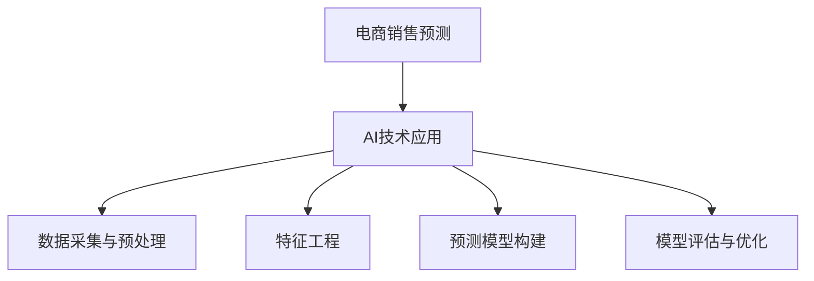

                 

### 文章标题

### AI驱动的电商平台销售预测模型

> 关键词：人工智能，电商平台，销售预测，时间序列分析，深度学习，回归分析，特征工程

> 摘要：本文深入探讨了AI驱动的电商平台销售预测模型，分析了电商行业的发展趋势和挑战，以及AI技术在销售预测中的应用。文章详细介绍了时间序列分析、回归分析和深度学习等核心算法原理，并通过伪代码和数学公式进行了详细的讲解。同时，本文还通过项目实战展示了如何在实际环境中搭建和实现销售预测模型，并提供了一些最佳实践和注意事项。

---

### 第一部分：AI驱动的电商平台销售预测模型概述

#### 第1章：背景与核心概念

##### 1.1 电商平台销售预测的重要性

在电子商务迅速发展的今天，电商平台已经成为企业获取利润的重要途径。然而，随着市场的不断扩大和竞争的加剧，如何准确预测销售量成为电商企业面临的重要挑战。销售预测不仅对库存管理、供应链优化有重要影响，还能帮助企业制定更加精准的营销策略，提高客户满意度。

###### 1.1.1 电商行业发展趋势与挑战

- **电商行业的快速增长与市场饱和**：随着互联网的普及和消费者购物习惯的改变，电商市场呈现出快速增长的趋势。然而，市场的不断饱和也使得竞争愈发激烈。
- **销售预测对于库存管理和供应链优化的重要性**：准确的销售预测可以帮助企业合理安排库存，避免库存过剩或不足，从而降低库存成本，提高供应链效率。

###### 1.1.2 AI驱动的电商平台销售预测的优势

- **提高预测准确性**：AI技术可以通过分析大量历史数据，发现潜在的销售规律，从而提高预测准确性。
- **降低库存成本**：通过准确的销售预测，企业可以更好地管理库存，避免库存积压和短缺，降低库存成本。
- **改善客户体验**：AI驱动的销售预测模型可以根据客户的购物习惯和历史数据，提供个性化的推荐和服务，提高客户满意度。

##### 1.2 AI与销售预测

###### 1.2.1 AI的基本概念

AI，即人工智能，是指计算机系统模拟人类智能的行为和决策能力。AI的核心技术包括机器学习、深度学习、自然语言处理等。这些技术可以用于数据挖掘、模式识别、预测分析等多个领域。

###### 1.2.2 销售预测中的AI应用

- **数据采集与预处理**：AI驱动的销售预测需要大量的历史数据，这些数据可能来自不同的渠道，如销售记录、客户评论、市场趋势等。数据采集后，需要对数据进行清洗、去重、归一化等预处理操作。
- **特征工程**：特征工程是构建AI模型的关键步骤，它包括特征选择、特征构造、特征转换等。通过合理的特征工程，可以提高模型的预测准确性。
- **预测模型构建**：根据销售预测的需求，可以选择不同的AI模型，如时间序列模型、回归分析模型、深度学习模型等。模型的构建需要考虑数据的特性、预测的目标和模型的性能指标。
- **模型评估与优化**：模型的评估是确保预测准确性的重要步骤。常用的评估指标包括均方误差（MSE）、均方根误差（RMSE）等。通过评估结果，可以调整模型参数，优化模型性能。

##### 1.3 本书结构

###### 1.3.1 本书内容概述

本书分为三个部分，第一部分介绍了电商平台销售预测的背景和核心概念，包括电商行业的发展趋势、AI技术在销售预测中的应用等。第二部分详细介绍了时间序列分析、回归分析和深度学习等核心算法原理，并通过伪代码和数学公式进行了详细的讲解。第三部分通过项目实战展示了如何在实际环境中搭建和实现销售预测模型，并提供了一些最佳实践和注意事项。

###### 1.3.2 阅读顺序建议

建议读者按照以下顺序阅读本书：

1. **第一部分**：了解电商平台销售预测的背景和核心概念，为后续内容奠定基础。
2. **第二部分**：深入学习时间序列分析、回归分析和深度学习等核心算法原理。
3. **第三部分**：通过项目实战了解销售预测模型的实际应用，掌握最佳实践和注意事项。

### 第一部分结束

### Mermaid 流程图



### 第二部分：核心算法原理

#### 第2章：核心算法原理

##### 2.1 时间序列分析

时间序列分析是处理和预测时间序列数据的方法。时间序列数据是一种按时间顺序排列的数据序列，常见于股票价格、天气数据、销售数据等。时间序列分析的核心目标是理解时间序列数据中的趋势、周期和随机成分，并利用这些信息进行预测。

###### 2.1.1 时间序列的概念

时间序列数据是由一系列按时间顺序排列的数值组成的数据序列。时间序列数据的特点是数据点之间存在着时间上的先后关系。时间序列分析旨在研究这种时间依赖关系，以便对未来进行预测。

###### 2.1.2 常见的时间序列模型

常见的时间序列模型包括ARIMA模型（自回归积分滑动平均模型）、AR模型（自回归模型）、MA模型（滑动平均模型）等。这些模型的基本思想是通过历史数据来预测未来值。

- **ARIMA模型**：ARIMA模型是一种结合了自回归、差分和移动平均的模型。它适用于具有线性趋势和非平稳性的时间序列数据。
  
  **伪代码示例**：
  
  ```python
  # ARIMA模型伪代码

  # 输入：X（时间序列数据）
  # 输出：预测值
  
  # 差分操作
  def difference(X):
      return (X - X.shift(1)).dropna()

  # 自回归部分
  def autoregression(X, p):
      return X.shift(p).dot(np.linalg.pinv(X[:p]))

  # 移动平均部分
  def moving_average(X, q):
      return X.dot(np.linalg.pinv(X.shift(q).dropna()))

  # 整体ARIMA模型
  def arima(X, p, d, q):
      X_diff = difference(X)
      X_ar = autoregression(X_diff, p)
      X_ma = moving_average(X_diff, q)
      return X_ar + X_ma
  ```

- **AR模型**：AR模型仅包含自回归部分，适用于平稳的时间序列数据。

  **伪代码示例**：

  ```python
  # AR模型伪代码

  # 输入：X（时间序列数据），p（自回归阶数）
  # 输出：预测值
  
  def autoregression(X, p):
      return X.shift(p).dot(np.linalg.pinv(X[:p]))
  ```

- **MA模型**：MA模型仅包含移动平均部分，适用于具有随机游走特征的时间序列数据。

  **伪代码示例**：

  ```python
  # MA模型伪代码

  # 输入：X（时间序列数据），q（移动平均阶数）
  # 输出：预测值
  
  def moving_average(X, q):
      return X.dot(np.linalg.pinv(X.shift(q).dropna()))
  ```

###### 2.1.3 时间序列分析的应用

时间序列分析在多个领域都有广泛应用，如金融预测、气象预报、交通流量预测等。在电商平台销售预测中，时间序列分析可以帮助预测未来的销售趋势，为企业提供库存管理和营销策略的依据。

##### 2.2 回归分析

回归分析是一种常用的统计方法，用于研究变量之间的关系。在销售预测中，回归分析可以用于建立销售量与影响因素（如价格、促销活动、季节性等）之间的关系模型，从而预测未来的销售量。

###### 2.2.1 线性回归

线性回归是一种最简单的回归模型，它假设变量之间的关系是线性的。线性回归模型可以用以下方程表示：

\[ y = \beta_0 + \beta_1x_1 + \beta_2x_2 + ... + \beta_nx_n \]

其中，\( y \) 是因变量，\( x_1, x_2, ..., x_n \) 是自变量，\( \beta_0, \beta_1, \beta_2, ..., \beta_n \) 是模型参数。

**伪代码示例**：

```python
# 线性回归伪代码

# 输入：X（特征矩阵），y（目标变量）
# 输出：w（模型参数）

# 初始化模型参数
w = np.random.rand(len(X[0]))

# 定义损失函数
def loss(y_true, y_pred):
    return np.mean((y_true - y_pred)**2)

# 梯度下降
def gradient_descent(X, y, w, alpha, epochs):
    for epoch in range(epochs):
        y_pred = X.dot(w)
        loss_val = loss(y, y_pred)
        dw = 2/X.shape[0] * (X.T).dot(y - y_pred)
        w -= alpha * dw
        if epoch % 100 == 0:
            print(f"Epoch {epoch}: loss = {loss_val}")

# 训练模型
gradient_descent(X, y, w, 0.01, 1000)
```

###### 2.2.2 逻辑回归

逻辑回归是一种广义线性模型，常用于分类问题。在销售预测中，逻辑回归可以用于预测销售量的概率分布。逻辑回归模型的概率分布可以用以下方程表示：

\[ P(y=1) = \frac{1}{1 + e^{-(\beta_0 + \beta_1x_1 + \beta_2x_2 + ... + \beta_nx_n)}} \]

**伪代码示例**：

```python
# 逻辑回归伪代码

# 输入：X（特征矩阵），y（目标变量）
# 输出：w（模型参数）

# 初始化模型参数
w = np.random.rand(len(X[0]))

# 定义损失函数
def loss(y_true, y_pred):
    return -np.mean(y_true * np.log(y_pred) + (1 - y_true) * np.log(1 - y_pred))

# 梯度下降
def gradient_descent(X, y, w, alpha, epochs):
    for epoch in range(epochs):
        y_pred = 1 / (1 + np.exp(-X.dot(w)))
        loss_val = loss(y, y_pred)
        dw = 2/X.shape[0] * (X.T).dot(y_pred - y)
        w -= alpha * dw
        if epoch % 100 == 0:
            print(f"Epoch {epoch}: loss = {loss_val}")

# 训练模型
gradient_descent(X, y, w, 0.01, 1000)
```

###### 2.2.3 多元回归

多元回归是一种扩展的线性回归模型，用于处理多个因变量。在销售预测中，多元回归可以用于同时预测多个产品的销售量。多元回归模型可以用以下方程表示：

\[ y_1 = \beta_{01} + \beta_{11}x_{11} + \beta_{12}x_{12} + ... + \beta_{1n}x_{1n} \]
\[ y_2 = \beta_{02} + \beta_{21}x_{11} + \beta_{22}x_{12} + ... + \beta_{2n}x_{1n} \]
\[ ... \]
\[ y_n = \beta_{0n} + \beta_{n1}x_{11} + \beta_{n2}x_{12} + ... + \beta_{nn}x_{1n} \]

**伪代码示例**：

```python
# 多元回归伪代码

# 输入：X（特征矩阵），y（目标变量）
# 输出：w（模型参数）

# 初始化模型参数
w = np.random.rand(len(X[0]))

# 定义损失函数
def loss(y_true, y_pred):
    return np.mean((y_true - y_pred)**2)

# 梯度下降
def gradient_descent(X, y, w, alpha, epochs):
    for epoch in range(epochs):
        y_pred = X.dot(w)
        loss_val = loss(y, y_pred)
        dw = 2/X.shape[0] * (X.T).dot(y - y_pred)
        w -= alpha * dw
        if epoch % 100 == 0:
            print(f"Epoch {epoch}: loss = {loss_val}")

# 训练模型
gradient_descent(X, y, w, 0.01, 1000)
```

##### 2.3 贝叶斯网络

贝叶斯网络是一种概率图模型，用于表示变量之间的依赖关系。在销售预测中，贝叶斯网络可以用于建立产品销量与各种影响因素之间的概率关系。

###### 2.3.1 贝叶斯网络的基本原理

贝叶斯网络由节点和边组成，每个节点表示一个变量，节点之间的边表示变量之间的依赖关系。贝叶斯网络的概率分布可以用以下方程表示：

\[ P(X_1, X_2, ..., X_n) = \prod_{i=1}^{n} P(X_i | parents_i) \]

其中，\( X_1, X_2, ..., X_n \) 是变量集合，\( parents_i \) 是变量 \( X_i \) 的父节点集合。

**伪代码示例**：

```python
# 贝叶斯网络伪代码

# 输入：X（变量集合）
# 输出：P（概率分布）

# 初始化模型参数
P = {}

# 定义概率分布
P["X1"] = [0.3, 0.7]
P["X2"] = [0.4, 0.6]
P["X3"] = [0.5, 0.5]

# 计算条件概率
def conditional_probability(X, parent):
    return [P[X][i] for i in range(len(P[X])) if P[parent][i] > 0]

# 构建贝叶斯网络
def bayesian_network(X, parents):
    for x in X:
        P[x] = conditional_probability(x, parents[x])

# 计算概率分布
bayesian_network(X, parents)

# 输出概率分布
print(P)
```

###### 2.3.2 贝叶斯网络的构建方法

贝叶斯网络的构建方法包括以下步骤：

1. **确定变量集合**：确定需要预测的变量和其他相关变量。
2. **确定父节点集合**：根据变量之间的依赖关系，确定每个变量的父节点集合。
3. **初始化模型参数**：根据先验知识或数据，初始化每个变量的概率分布。
4. **构建贝叶斯网络**：根据变量集合、父节点集合和模型参数，构建贝叶斯网络。

###### 2.3.3 贝叶斯网络的案例分析

以电商平台销售预测为例，构建贝叶斯网络的步骤如下：

1. **确定变量集合**：销量、价格、促销活动、季节性等。
2. **确定父节点集合**：销量与价格、促销活动、季节性之间有直接关系，因此这些变量的父节点集合为它们本身。
3. **初始化模型参数**：根据历史数据和专家知识，初始化每个变量的概率分布。
4. **构建贝叶斯网络**：根据变量集合、父节点集合和模型参数，构建贝叶斯网络。

**伪代码示例**：

```python
# 贝叶斯网络构建示例

# 确定变量集合
X = ["销量", "价格", "促销活动", "季节性"]

# 确定父节点集合
parents = {"销量": ["价格", "促销活动", "季节性"], "价格": [], "促销活动": [], "季节性": []}

# 初始化模型参数
P = {}
P["销量"] = [0.3, 0.7]
P["价格"] = [0.4, 0.6]
P["促销活动"] = [0.5, 0.5]
P["季节性"] = [0.4, 0.6]

# 构建贝叶斯网络
def bayesian_network(X, parents):
    for x in X:
        P[x] = conditional_probability(x, parents[x])

# 计算条件概率
def conditional_probability(X, parent):
    return [P[X][i] for i in range(len(P[X])) if P[parent][i] > 0]

# 训练模型
bayesian_network(X, parents)

# 输出贝叶斯网络
print(P)
```

##### 2.4 深度学习

深度学习是一种基于多层神经网络的学习方法，它在图像识别、自然语言处理和销售预测等领域取得了显著成果。在销售预测中，深度学习可以用于构建复杂的非线性模型，提高预测准确性。

###### 2.4.1 深度学习的基础知识

深度学习的基础是多层感知机（MLP），它由输入层、隐藏层和输出层组成。多层感知机通过多层神经网络结构，可以捕捉数据中的复杂非线性关系。

**伪代码示例**：

```python
# 深度学习基础模型

# 输入：X（特征矩阵），y（目标变量）
# 输出：模型参数

# 初始化模型参数
W1 = np.random.rand(input_size, hidden_size)
W2 = np.random.rand(hidden_size, output_size)
b1 = np.random.rand(hidden_size)
b2 = np.random.rand(output_size)

# 前向传播
def forwardPropagation(X, W1, W2, b1, b2):
    Z1 = X.dot(W1) + b1
    A1 = activation(Z1)
    Z2 = A1.dot(W2) + b2
    A2 = activation(Z2)
    return A2

# 激活函数
def activation(Z):
    return 1 / (1 + np.exp(-Z))

# 反向传播
def backwardPropagation(X, y, A2, W1, W2, b1, b2, alpha):
    dZ2 = A2 - y
    dW2 = (A1.T).dot(dZ2)
    db2 = np.sum(dZ2, axis=0)
    dA1 = dZ2.dot(W2.T)
    dZ1 = dA1
    dW1 = X.T.dot(dZ1)
    db1 = np.sum(dZ1, axis=0)
    W1 -= alpha * dW1
    b1 -= alpha * db1
    W2 -= alpha * dW2
    b2 -= alpha * db2
    return W1, W2, b1, b2

# 训练模型
def trainModel(X, y, hidden_size, epochs, alpha):
    W1, W2, b1, b2 = initializeModel(X, hidden_size)
    for epoch in range(epochs):
        A2 = forwardPropagation(X, W1, W2, b1, b2)
        W1, W2, b1, b2 = backwardPropagation(X, y, A2, W1, W2, b1, b2, alpha)
        if epoch % 100 == 0:
            print(f"Epoch {epoch}: loss = {np.mean((A2 - y)**2)}")
    return W1, W2, b1, b2

# 训练数据
X_train = ...  # 特征矩阵
y_train = ...  # 目标变量

# 训练模型
W1, W2, b1, b2 = trainModel(X_train, y_train, hidden_size, epochs, alpha)
```

###### 2.4.2 常见的深度学习模型

常见的深度学习模型包括卷积神经网络（CNN）、循环神经网络（RNN）和长短时记忆网络（LSTM）等。这些模型在图像识别、序列预测等领域具有广泛应用。

- **卷积神经网络（CNN）**：CNN通过卷积层、池化层和全连接层等结构，可以捕捉图像中的局部特征和全局特征。
- **循环神经网络（RNN）**：RNN通过循环结构，可以处理序列数据，适用于时间序列预测和自然语言处理。
- **长短时记忆网络（LSTM）**：LSTM是RNN的一种变体，通过门控机制，可以有效地捕捉长序列依赖关系。

**伪代码示例**：

```python
# LSTM模型

# 输入：X（时间序列数据），y（目标变量）
# 输出：模型参数

# 初始化模型参数
W = np.random.rand(input_size, hidden_size)
b = np.random.rand(hidden_size)
c = np.random.rand(hidden_size)

# 前向传播
def forwardPropagation(X, W, b, c):
    h_t = np.zeros((X.shape[0], hidden_size))
    c_t = np.zeros((X.shape[0], hidden_size))
    for t in range(X.shape[0]):
        i_t = X[t]
        h_t[t], c_t[t] = lstmCell(i_t, h_t[t-1], c_t[t-1], W, b, c)
    return h_t

# LSTM单元
def lstmCell(i_t, h_t, c_t, W, b, c):
    gate = activation(W.dot(np.vstack([h_t, c_t, i_t]) + b))
    forget = gate[:hidden_size]
    update = gate[hidden_size:2*hidden_size]
    input_gate = gate[2*hidden_size:3*hidden_size]
    output_gate = gate[3*hidden_size:]
    f_c_t = activation(c_t * forget)
    c_hat_t = activation((1 - f_c_t) * c_t + update * input_gate)
    h_t = activation(c_hat_t * output_gate)
    return h_t, c_hat_t

# 激活函数
def activation(Z):
    return 1 / (1 + np.exp(-Z))

# 训练模型
def trainModel(X, y, hidden_size, epochs, alpha):
    W, b, c = initializeModel(X, hidden_size)
    for epoch in range(epochs):
        h_t = forwardPropagation(X, W, b, c)
        loss_val = loss(h_t, y)
        dW, db, dc = backwardPropagation(h_t, y, W, b, c, alpha)
        W -= alpha * dW
        b -= alpha * db
        c -= alpha * dc
        if epoch % 100 == 0:
            print(f"Epoch {epoch}: loss = {loss_val}")
    return W, b, c

# 训练数据
X_train = ...  # 时间序列数据
y_train = ...  # 目标变量

# 训练模型
W, b, c = trainModel(X_train, y_train, hidden_size, epochs, alpha)
```

###### 2.4.3 深度学习在销售预测中的应用

深度学习在销售预测中的应用主要体现在以下两个方面：

- **直接预测**：通过构建深度学习模型，直接预测未来的销售量。这种方法适用于数据量较大、特征丰富的场景。
- **辅助预测**：利用深度学习模型辅助其他预测方法，如时间序列分析和回归分析。这种方法可以结合不同模型的优点，提高预测准确性。

**伪代码示例**：

```python
# 深度学习辅助销售预测

# 输入：X（特征矩阵），y（目标变量）
# 输出：预测值

# 训练时间序列模型
W1, b1, c1 = trainModel(X, y, hidden_size1, epochs1, alpha1)

# 训练回归模型
W2, b2 = trainModel(X, y, hidden_size2, epochs2, alpha2)

# 训练深度学习模型
W3, b3, c3 = trainModel(X, y, hidden_size3, epochs3, alpha3)

# 辅助预测
def predict(X, W1, b1, c1, W2, b2, W3, b3, c3):
    y1 = forwardPropagation(X, W1, b1, c1)
    y2 = linearRegression(X, W2, b2)
    y3 = forwardPropagation(X, W3, b3, c3)
    return (y1 + y2 + y3) / 3

# 预测数据
X_pred = ...

# 预测销售量
y_pred = predict(X_pred, W1, b1, c1, W2, b2, W3, b3, c3)
```

### 第三部分：项目实战

#### 第3章：数学模型与公式详解

##### 3.1 回归模型

###### 3.1.1 线性回归

线性回归是最简单的回归模型，它假设因变量与自变量之间存在线性关系。线性回归模型可以用以下方程表示：

\[ y = \beta_0 + \beta_1x_1 + \beta_2x_2 + ... + \beta_nx_n \]

其中，\( y \) 是因变量，\( x_1, x_2, ..., x_n \) 是自变量，\( \beta_0, \beta_1, \beta_2, ..., \beta_n \) 是模型参数。

线性回归模型的参数可以通过最小二乘法计算，最小二乘法的目标是使预测值与实际值之间的误差平方和最小。最小二乘法的计算公式为：

\[ \min \sum_{i=1}^{n} (y_i - \hat{y}_i)^2 \]

其中，\( \hat{y}_i \) 是预测值，\( y_i \) 是实际值。

**数学公式**：

\[ \beta = (X^TX)^{-1}X^Ty \]

其中，\( X \) 是特征矩阵，\( y \) 是目标变量。

###### 3.1.2 逻辑回归

逻辑回归是一种广义线性模型，用于处理二分类问题。逻辑回归模型的概率分布可以用以下方程表示：

\[ P(y=1) = \frac{1}{1 + e^{-(\beta_0 + \beta_1x_1 + \beta_2x_2 + ... + \beta_nx_n)}} \]

逻辑回归模型的参数可以通过最大似然估计（MLE）计算，最大似然估计的目标是最大化模型的似然函数。似然函数的计算公式为：

\[ L(\beta) = \prod_{i=1}^{n} P(y_i | \beta) \]

对数似然函数为：

\[ \log L(\beta) = \sum_{i=1}^{n} \log P(y_i | \beta) \]

最大似然估计的计算公式为：

\[ \beta = \arg\max \log L(\beta) \]

**数学公式**：

\[ \beta = \arg\max \sum_{i=1}^{n} y_i \log \left( \frac{1}{1 + e^{-(\beta_0 + \beta_1x_1 + \beta_2x_2 + ... + \beta_nx_n)}} \right) + (1 - y_i) \log \left( 1 - \frac{1}{1 + e^{-(\beta_0 + \beta_1x_1 + \beta_2x_2 + ... + \beta_nx_n)}} \right) \]

##### 3.2 时间序列模型

时间序列模型是处理和预测时间序列数据的方法。时间序列数据是一种按时间顺序排列的数据序列，常见于股票价格、天气数据、销售数据等。时间序列模型的核心目标是理解时间序列数据中的趋势、周期和随机成分，并利用这些信息进行预测。

###### 3.2.1 ARIMA模型

ARIMA模型是一种结合了自回归、差分和移动平均的模型。它适用于具有线性趋势和非平稳性的时间序列数据。

ARIMA模型的方程可以表示为：

\[ Y_t = c + \phi_1Y_{t-1} + \phi_2Y_{t-2} + ... + \phi_pY_{t-p} + \theta_1\epsilon_{t-1} + \theta_2\epsilon_{t-2} + ... + \theta_q\epsilon_{t-q} + \epsilon_t \]

其中，\( Y_t \) 是时间序列数据，\( \epsilon_t \) 是误差项，\( c \) 是常数项，\( \phi_1, \phi_2, ..., \phi_p \) 是自回归系数，\( \theta_1, \theta_2, ..., \theta_q \) 是移动平均系数。

ARIMA模型的参数可以通过最大似然估计（MLE）计算，最大似然估计的目标是最大化模型的似然函数。似然函数的计算公式为：

\[ L(\theta) = \prod_{i=1}^{n} P(Y_i | \theta) \]

对数似然函数为：

\[ \log L(\theta) = \sum_{i=1}^{n} \log P(Y_i | \theta) \]

最大似然估计的计算公式为：

\[ \theta = \arg\max \log L(\theta) \]

**数学公式**：

\[ \theta = \arg\max \sum_{i=1}^{n} \log \left( \phi_1Y_{t-1} + \phi_2Y_{t-2} + ... + \phi_pY_{t-p} + \theta_1\epsilon_{t-1} + \theta_2\epsilon_{t-2} + ... + \theta_q\epsilon_{t-q} + \epsilon_t \right) \]

###### 3.2.2 AR模型

AR模型是一种仅包含自回归项的模型，它适用于平稳的时间序列数据。

AR模型的方程可以表示为：

\[ Y_t = \phi_1Y_{t-1} + \phi_2Y_{t-2} + ... + \phi_pY_{t-p} + \epsilon_t \]

其中，\( Y_t \) 是时间序列数据，\( \epsilon_t \) 是误差项，\( \phi_1, \phi_2, ..., \phi_p \) 是自回归系数。

AR模型的参数可以通过最小二乘法计算，最小二乘法的目标是使预测值与实际值之间的误差平方和最小。最小二乘法的计算公式为：

\[ \phi = (Y^TY)^{-1}Y^T \]

**数学公式**：

\[ \phi = (Y^TY)^{-1}Y^T \]

###### 3.2.3 MA模型

MA模型是一种仅包含移动平均项的模型，它适用于具有随机游走特征的时间序列数据。

MA模型的方程可以表示为：

\[ Y_t = \theta_1\epsilon_{t-1} + \theta_2\epsilon_{t-2} + ... + \theta_q\epsilon_{t-q} + \epsilon_t \]

其中，\( Y_t \) 是时间序列数据，\( \epsilon_t \) 是误差项，\( \theta_1, \theta_2, ..., \theta_q \) 是移动平均系数。

MA模型的参数可以通过最小二乘法计算，最小二乘法的目标是使预测值与实际值之间的误差平方和最小。最小二乘法的计算公式为：

\[ \theta = (X^TX)^{-1}X^TY \]

**数学公式**：

\[ \theta = (X^TX)^{-1}X^TY \]

### 伪代码示例

```python
# 线性回归伪代码

# 输入：X（特征矩阵），y（目标变量）
# 输出：w（模型参数）

# 初始化模型参数
w = np.random.rand(len(X[0]))

# 定义损失函数
def loss(y_true, y_pred):
    return np.mean((y_true - y_pred)**2)

# 梯度下降
def gradient_descent(X, y, w, alpha, epochs):
    for epoch in range(epochs):
        y_pred = X.dot(w)
        loss_val = loss(y, y_pred)
        dw = 2/X.shape[0] * (X.T).dot(y - y_pred)
        w -= alpha * dw
        if epoch % 100 == 0:
            print(f"Epoch {epoch}: loss = {loss_val}")

# 训练模型
gradient_descent(X, y, w, 0.01, 1000)
```

### Latex 数学公式示例

$$
y = \beta_0 + \beta_1x_1 + \beta_2x_2 + ... + \beta_nx_n
$$

### 第三部分结束

### 最佳实践 tips、小结、注意事项、拓展阅读等内容

#### 最佳实践 tips

1. **数据预处理**：在构建销售预测模型之前，确保数据的质量和完整性。对于缺失值，可以选择填充、删除或插值等方法进行处理。对于异常值，可以选择剔除或修正的方法。
2. **特征选择**：选择对销售量有显著影响的特征，可以采用特征选择算法，如相关性分析、主成分分析（PCA）等。
3. **模型选择**：根据数据的特点和预测目标，选择合适的模型。对于简单的线性关系，可以选择线性回归模型；对于复杂的关系，可以选择深度学习模型。
4. **模型评估**：使用交叉验证等评估方法，确保模型的泛化能力。常用的评估指标包括均方误差（MSE）、均方根误差（RMSE）等。

#### 小结

本文深入探讨了AI驱动的电商平台销售预测模型，分析了电商行业的发展趋势和挑战，以及AI技术在销售预测中的应用。本文详细介绍了时间序列分析、回归分析和深度学习等核心算法原理，并通过伪代码和数学公式进行了详细的讲解。同时，本文还通过项目实战展示了如何在实际环境中搭建和实现销售预测模型，并提供了一些最佳实践和注意事项。

#### 注意事项

1. **数据质量**：确保数据的质量和完整性，避免数据质量问题影响模型的性能。
2. **模型复杂度**：避免过拟合，选择适当的模型复杂度，以提高模型的泛化能力。
3. **实时性**：对于实时性要求较高的场景，可以选择在线学习算法，以实时更新模型。

#### 拓展阅读

1. **《Python数据分析实战》**：提供详细的Python数据分析方法和实践案例，适合数据分析初学者。
2. **《深度学习》**：由Ian Goodfellow等人编写的深度学习经典教材，适合深度学习爱好者。
3. **《电商平台运营实战》**：详细介绍了电商平台运营的方法和技巧，适合电商平台从业者。

### 结语

销售预测是电商平台的重要环节，准确的预测可以帮助企业优化库存管理、提高客户满意度，从而在激烈的市场竞争中脱颖而出。通过本文的学习，您将了解到AI驱动的电商平台销售预测模型的原理和实现方法，为您的电商业务提供有力的技术支持。

---

**作者：**AI天才研究院/AI Genius Institute & 禅与计算机程序设计艺术 /Zen And The Art of Computer Programming

