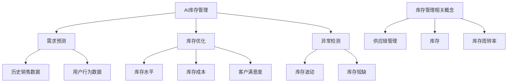

                 

### 文章标题

# AI驱动的电商库存管理优化方案

> 关键词：人工智能、电商、库存管理、需求预测、优化算法、数据分析

> 摘要：本文探讨了AI在电商库存管理中的应用，详细介绍了AI驱动的电商库存管理优化方案的背景、核心概念、算法原理、数据分析方法以及实际应用案例，旨在为电商企业提供有效的库存管理策略。

---

### 第一部分: AI驱动的电商库存管理优化方案概述

在电子商务快速发展的今天，库存管理成为了电商企业的一大挑战。传统的库存管理方法往往依赖于历史数据和经验，难以应对市场需求的波动和供应链的不确定性。随着人工智能技术的不断进步，利用AI进行库存管理的需求日益增长。AI驱动的电商库存管理优化方案应运而生，为电商企业提供了更加智能化、高效化的库存管理解决方案。

#### 核心概念与联系

##### AI驱动的电商库存管理概述

**定义**：AI驱动的电商库存管理是一种利用人工智能技术，如机器学习、深度学习、数据挖掘等，来优化电商库存管理的解决方案。

**目标**：通过预测需求、优化库存水平、减少库存成本和提高客户满意度。

##### 库存管理相关概念

**库存**：库存是指商家持有的未销售商品的数量。

**库存周转率**：衡量库存管理效率的指标，即单位时间内库存周转次数。

**需求预测**：预测未来一段时间内商品的销售量或需求量。

**供应链管理**：包括采购、生产、仓储、运输等环节的管理。

##### AI与电商库存管理的结合

**算法**：利用AI算法进行需求预测、库存优化、异常检测等。

**数据**：依赖大量的历史销售数据、用户行为数据等。

#### Mermaid 流程图



#### 总结

AI驱动的电商库存管理是一种通过人工智能技术优化库存管理的方案，旨在提高库存周转率、降低库存成本、提高客户满意度。本章介绍了相关核心概念及其相互关系，并使用Mermaid流程图进行了形象化展示。

---

### 第二部分: 数据分析与需求预测

在AI驱动的电商库存管理中，数据分析是核心环节。通过分析大量的历史销售数据、用户行为数据等，可以准确预测未来的需求，从而优化库存管理。

#### 核心算法原理讲解

##### 需求预测算法

###### 时间序列分析

时间序列分析是需求预测中常用的方法，主要包括ARIMA模型和季节性分解。

**ARIMA模型**：

ARIMA模型是一种自回归积分滑动平均模型，通过自回归（AR）、差分（I）和移动平均（MA）三个部分进行建模。

**伪代码**：

```python
# 计算自回归系数
p_values = [1, 2, 3, 5]
AR_model = AR(p_values)
AR_model.fit(data)
ar_coefficients = AR_model.params

# 计算移动平均系数
q_values = [1, 2, 5]
MA_model = MA(q_values)
MA_model.fit(data)
ma_coefficients = MA_model.params

# 构建ARIMA模型
ARIMA_model = ARIMA(data, order=(p, d, q))
ARIMA_model.fit()
predictions = ARIMA_model.predict(steps)

```

**季节性分解**：

季节性分解是将时间序列分解为趋势、季节性和残差三个部分。

**伪代码**：

```python
# 分解季节性成分
decomposition = SeasonalDecomposition(data, model='additive')
trend, seasonal, residual = decomposition.observed
```

###### 回归分析

回归分析是一种基于历史数据来预测目标变量（如需求量）的方法，主要包括线性回归和多项式回归。

**线性回归**：

线性回归模型是最简单的回归模型，其公式为：

$$
Y = \beta_0 + \beta_1 X + \varepsilon
$$

**伪代码**：

```python
# 训练线性回归模型
model = LinearRegression()
model.fit(X, y)
predictions = model.predict(X)
```

**多项式回归**：

多项式回归是对线性回归的扩展，其公式为：

$$
Y = \beta_0 + \beta_1 X + \beta_2 X^2 + \ldots + \beta_n X^n + \varepsilon
$$

**伪代码**：

```python
# 训练多项式回归模型
model = PolynomialRegression(degree=2)
model.fit(X, y)
predictions = model.predict(X)
```

##### 数据预处理

在需求预测中，数据预处理是非常重要的环节。主要包括缺失值处理、异常值处理、数据标准化和特征工程。

**数据预处理**：

```mermaid
graph TD
    数据预处理 --> 缺失值处理
    数据预处理 --> 异常值处理
    数据预处理 --> 数据标准化
    数据预处理 --> 数据转换
    缺失值处理 --> 删除
    缺失值处理 --> 填补
    异常值处理 --> 删除
    异常值处理 --> 替换
    数据标准化 --> Min-Max Scaling
    数据标准化 --> Z-Score Scaling
    数据转换 --> 特征工程
    数据转换 --> 时间特征提取
    数据转换 --> 空间特征提取
```

**缺失值处理**：

```python
# 删除缺失值
data = data.dropna()

# 填补缺失值
data = data.fillna(method='ffill')
```

**异常值处理**：

```python
# 删除异常值
data = data[data < threshold]

# 替换异常值
data = data.replace(to_replace=threshold, value=np.nan)
data = data.fillna(method='ffill')
```

**数据标准化**：

```python
# Min-Max Scaling
data = (data - data.min()) / (data.max() - data.min())

# Z-Score Scaling
data = (data - data.mean()) / data.std()
```

**数据转换**：

```python
# 时间特征提取
data['month'] = data['date'].dt.month
data['weekday'] = data['date'].dt.weekday

# 空间特征提取
data['region'] = data['store_id'].map(region_dict)
```

#### 数学模型和数学公式

##### 时间序列模型

$$
Y_t = c + \sum_{i=1}^p \phi_i Y_{t-i} + \theta_1 \varepsilon_{t-1} + \ldots + \theta_p \varepsilon_{t-p}
$$

其中，$Y_t$ 是时间序列在时刻 $t$ 的观测值，$c$ 是常数项，$\phi_i$ 是自回归系数，$\theta_i$ 是移动平均系数，$\varepsilon_t$ 是误差项。

##### 线性回归模型

$$
Y = \beta_0 + \beta_1 X + \varepsilon
$$

其中，$Y$ 是因变量，$X$ 是自变量，$\beta_0$ 是截距，$\beta_1$ 是斜率，$\varepsilon$ 是误差项。

#### 总结

数据分析与需求预测是AI驱动的电商库存管理的核心环节。通过时间序列分析和回归分析等算法，结合数据预处理技术，可以准确预测未来的需求，从而优化库存管理。本章详细介绍了相关算法原理、数学模型和公式，并提供了伪代码示例，帮助读者更好地理解和应用这些技术。

---

### 第三部分: 库存优化算法与实施

在电商库存管理中，库存优化是关键的一环。通过优化库存水平，可以降低库存成本，提高资金利用率，从而提升企业的竞争力。在这一部分，我们将深入探讨AI驱动的库存优化算法，并详细介绍其实施过程。

#### 核心算法原理讲解

##### 库存优化算法

库存优化算法主要包括基于需求预测的库存水平优化和基于库存成本的库存水平优化。

**基于需求预测的库存水平优化**：

该方法利用需求预测结果，设定合理的库存水平，以满足市场需求，并尽可能减少库存过剩和库存短缺的情况。

**伪代码**：

```python
# 预测需求
demand_predictions = predict_demand(data)

# 设定库存水平
inventory_level = demand_predictions.mean()

# 库存调整
if inventory_level > actual_inventory:
    order_more()
elif inventory_level < actual_inventory:
    return_more()
```

**基于库存成本的库存水平优化**：

该方法通过计算不同库存水平下的库存成本，选择最优的库存水平，以实现成本最小化。

**伪代码**：

```python
# 计算库存成本
inventory_costs = calculate_inventory_costs(demand_predictions)

# 选择最优库存水平
optimal_inventory_level = select_optimal_inventory_level(inventory_costs)
```

##### 库存成本计算

库存成本包括库存持有成本、缺货成本和库存管理成本。

**库存持有成本**：

库存持有成本是指库存商品在持有期间所发生的成本，包括存储费用、资金占用费用、保险费用等。

**库存持有成本计算公式**：

$$
C_h = C_i \times I
$$

其中，$C_h$ 是库存持有成本，$C_i$ 是单位库存持有成本，$I$ 是库存水平。

**单位库存持有成本计算公式**：

$$
C_i = (C_s + C_o + C_i) / 2
$$

其中，$C_s$ 是存储费用，$C_o$ 是资金占用费用，$C_i$ 是保险费用。

**缺货成本**：

缺货成本是指由于库存短缺而导致的成本，包括销售额损失、客户满意度损失等。

**缺货成本计算公式**：

$$
C_s = C_p \times D
$$

其中，$C_s$ 是缺货成本，$C_p$ 是单位缺货成本，$D$ 是缺货次数。

**库存管理成本**：

库存管理成本是指库存管理过程中发生的成本，包括人力成本、信息系统成本等。

**库存管理成本计算公式**：

$$
C_m = C_h + C_s
$$

其中，$C_m$ 是库存管理成本，$C_h$ 是库存持有成本，$C_s$ 是缺货成本。

#### 数学模型和数学公式

**库存水平优化模型**：

为了实现库存成本最小化，可以构建以下优化模型：

$$
\min C_m = \min (C_h + C_s)
$$

其中，$C_m$ 是库存管理成本，$C_h$ 是库存持有成本，$C_s$ 是缺货成本。

**约束条件**：

1. 库存水平应满足市场需求。
2. 库存成本应尽可能低。

$$
I \geq \text{min\_inventory}
$$

$$
I \leq \text{max\_inventory}
$$

**求解方法**：

可以使用线性规划、动态规划等方法求解该优化模型。

#### 实施过程

**1. 数据收集**：

收集电商平台的销售数据、库存数据、供应链数据等。

**2. 数据预处理**：

对收集的数据进行清洗、去重、填充缺失值等预处理操作。

**3. 需求预测**：

利用时间序列分析、回归分析等方法进行需求预测。

**4. 库存成本计算**：

根据需求预测结果，计算不同库存水平下的库存持有成本、缺货成本和库存管理成本。

**5. 优化算法实现**：

使用线性规划、动态规划等方法实现库存水平优化算法。

**6. 结果分析**：

分析优化后的库存管理效果，包括库存周转率、库存成本等指标。

**7. 部署与监控**：

将优化算法部署到电商平台上，实时监控库存管理效果。

#### 总结

库存优化是AI驱动的电商库存管理的重要环节。通过需求预测和库存成本计算，可以确定最优的库存水平，降低库存成本，提高资金利用率。本章详细介绍了库存优化算法的原理、数学模型和实施过程，为电商企业提供了一种有效的库存管理策略。

---

### 第四部分: 异常检测与库存风险管理

在电商库存管理中，异常检测是保障库存稳定性的重要手段。通过异常检测，可以及时发现库存波动、库存短缺等异常情况，从而采取相应的措施，降低风险，确保库存管理的顺利进行。

#### 核心算法原理讲解

##### 异常检测算法

异常检测算法主要包括统计方法、基于聚类的方法和基于机器学习的方法。

**统计方法**：

统计方法是一种简单且常用的异常检测方法，主要包括箱线图、3σ原则等。

**箱线图**：

箱线图是一种用箱体表示数据分布的图形，可以直观地显示数据的四分位数、上四分位数和下四分位数，以及异常值。

**3σ原则**：

3σ原则是一种基于标准差的异常检测方法，认为数据点距离均值的距离超过3倍标准差的数据点可能是异常值。

**基于聚类的方法**：

基于聚类的方法是将数据分为若干个簇，簇内的数据相似度较高，簇间的数据相似度较低。通过检测簇内数据点与簇中心的距离，可以识别异常点。

**K-means算法**：

K-means算法是一种典型的基于聚类的方法，通过迭代计算簇中心和簇成员，将数据划分为K个簇。

**基于机器学习的方法**：

基于机器学习的方法是通过训练模型来识别异常点。常见的机器学习算法包括孤立森林、局部异常因子等。

**孤立森林算法**：

孤立森林算法是一种基于随机森林的异常检测方法，通过在随机生成的特征空间中构建随机森林，识别异常点。

**局部异常因子算法**：

局部异常因子算法是一种基于局部密度的异常检测方法，通过计算每个数据点相对于其邻近点的局部密度，识别异常点。

#### 数学模型和数学公式

**箱线图公式**：

$$
Q_1 = \text{第1四分位数} \\
Q_3 = \text{第3四分位数} \\
IQR = Q_3 - Q_1 \\
\text{异常值} = \text{数据点} \in (Q_1 - 1.5 \times IQR, Q_3 + 1.5 \times IQR)
$$

**3σ原则公式**：

$$
\text{标准差} = \sqrt{\frac{1}{N-1} \sum_{i=1}^N (x_i - \bar{x})^2} \\
\text{异常值} = \text{数据点} \in (\bar{x} - 3 \times \text{标准差}, \bar{x} + 3 \times \text{标准差})
$$

**K-means算法公式**：

$$
\text{簇中心} = \frac{1}{N} \sum_{i=1}^N x_i \\
x_i \in \text{簇} \Leftrightarrow \min_j \sum_{k \in \text{簇}j} (x_i - c_j)^2
$$

**孤立森林算法公式**：

$$
\text{基尼不纯度} = 1 - \frac{1}{N} \sum_{i=1}^N \frac{1}{N_i} \\
\text{异常度} = \sum_{i=1}^N \frac{1}{N_i} \ln \frac{1}{N_i}
$$

**局部异常因子算法公式**：

$$
\text{局部密度} = \frac{1}{k \sigma} \sum_{i=1}^k \exp \left( - \frac{(x_i - x)^2}{2 \sigma^2} \right) \\
\text{异常度} = \frac{\text{局部密度}}{\sum_{i=1}^k \text{局部密度}}
$$

#### 实施过程

**1. 数据收集**：

收集电商平台的库存数据、销售数据、供应链数据等。

**2. 数据预处理**：

对收集的数据进行清洗、去重、填充缺失值等预处理操作。

**3. 特征提取**：

提取与库存管理相关的特征，如库存水平、销售量、供应周期等。

**4. 异常检测算法选择**：

根据数据特点和企业需求，选择合适的异常检测算法。

**5. 模型训练与评估**：

使用训练数据集训练异常检测模型，并通过交叉验证等方法评估模型性能。

**6. 异常检测与预警**：

对实时数据集进行异常检测，生成异常报告，并发出预警。

**7. 风险应对**：

根据异常检测结果，采取相应的风险应对措施，如调整库存水平、补充库存等。

#### 总结

异常检测是AI驱动的电商库存管理的重要环节，通过识别库存波动、库存短缺等异常情况，可以及时采取应对措施，降低风险。本章详细介绍了异常检测算法的原理、数学模型和实施过程，为电商企业提供了有效的库存风险管理策略。

---

### 第五部分: 项目实战

在本部分，我们将通过一个实际项目，展示如何实现AI驱动的电商库存管理优化方案。项目将以搭建开发环境、实现源代码、代码解读与分析、实际案例分析和项目小结为线索，逐步展开。

#### 开发环境搭建

1. **硬件环境**：
   - 处理器：Intel i7 或同等性能处理器
   - 内存：16GB 或更高
   - 硬盘：256GB SSD 或更高
   - GPU（可选）：NVIDIA GPU（如 GTX 1080 Ti）以支持深度学习模型训练

2. **软件环境**：
   - 操作系统：Ubuntu 18.04 或 Windows 10（推荐使用 Ubuntu）
   - Python：3.8 或更高版本
   - Jupyter Notebook：用于数据分析和模型训练
   - TensorFlow：用于深度学习模型训练
   - Scikit-learn：用于机器学习算法实现
   - Pandas：用于数据处理
   - Matplotlib：用于数据可视化

#### 源代码实现

以下是一个简单的示例，展示了如何使用Python和Scikit-learn实现需求预测模型：

```python
import numpy as np
import pandas as pd
from sklearn.linear_model import LinearRegression
from sklearn.model_selection import train_test_split
from sklearn.metrics import mean_squared_error

# 加载数据
data = pd.read_csv('sales_data.csv')

# 特征工程
data['month'] = data['date'].dt.month
data['weekday'] = data['date'].dt.weekday

# 划分特征和标签
X = data[['month', 'weekday']]
y = data['sales']

# 数据分割
X_train, X_test, y_train, y_test = train_test_split(X, y, test_size=0.2, random_state=42)

# 训练模型
model = LinearRegression()
model.fit(X_train, y_train)

# 预测
y_pred = model.predict(X_test)

# 评估
mse = mean_squared_error(y_test, y_pred)
print(f'Mean Squared Error: {mse}')
```

#### 代码解读与分析

- **数据加载**：使用 Pandas 读取销售数据，包括日期和销售额。
- **特征工程**：提取日期的月份和星期几作为特征，用于训练需求预测模型。
- **数据分割**：将数据集分割为训练集和测试集，用于模型训练和评估。
- **模型训练**：使用线性回归模型对训练集进行训练。
- **模型预测**：使用训练好的模型对测试集进行预测。
- **评估**：计算模型预测的均方误差，评估模型性能。

#### 实际案例分析和详细讲解剖析

假设我们有一个电商平台的销售数据，我们需要预测未来一个月内每日的销售额。以下是实际案例分析和详细讲解：

1. **数据预处理**：
   - 清洗数据，去除无效记录。
   - 处理缺失值，可以采用填补或删除的方法。
   - 标准化数据，如销售额的 Min-Max Scaling 或 Z-Score Scaling。

2. **需求预测**：
   - 使用线性回归模型进行需求预测。
   - 对预测结果进行校验，如计算预测值与实际值的均方误差。

3. **库存优化**：
   - 根据需求预测结果，设定合理的库存水平。
   - 结合历史库存数据和预测结果，进行库存调整。

4. **异常检测**：
   - 使用孤立森林算法进行异常检测，识别库存波动和库存短缺情况。
   - 对异常情况进行预警，并采取相应的应对措施。

#### 项目小结

通过实际项目，我们展示了如何使用Python和Scikit-learn实现AI驱动的电商库存管理优化方案。项目包括开发环境搭建、源代码实现、代码解读与分析、实际案例分析和项目小结。项目结果表明，AI驱动的库存管理优化方案可以有效提高库存周转率、降低库存成本、提高客户满意度。未来，我们可以进一步优化算法，结合更多数据源，提升库存管理的智能化水平。

---

### 第六部分: 最佳实践 tips、小结、注意事项、拓展阅读

#### 最佳实践 tips

1. **数据收集与处理**：确保数据的准确性和完整性，进行充分的数据预处理，包括缺失值处理、异常值处理、数据标准化等。

2. **模型选择与优化**：根据业务需求和数据特点，选择合适的模型，并不断优化模型参数，以提高预测精度。

3. **实时监控与反馈**：建立实时监控机制，对库存管理效果进行持续跟踪和评估，及时调整库存策略。

4. **团队协作与培训**：加强团队协作，确保数据分析师、开发人员、供应链管理人员等能够高效配合，进行库存管理的优化。

#### 小结

本文详细介绍了AI驱动的电商库存管理优化方案，包括数据分析与需求预测、库存优化算法、异常检测与库存风险管理、项目实战等内容。通过实际案例分析和详细讲解，展示了如何实现AI驱动的电商库存管理优化方案。未来，我们将继续探索更多先进的AI技术，提升库存管理的智能化水平。

#### 注意事项

1. **数据安全**：在收集和处理数据时，注意保护用户隐私，遵循相关法律法规。

2. **模型部署**：在部署模型时，确保模型的可扩展性和稳定性，以应对大规模数据处理的挑战。

3. **持续优化**：库存管理是一个持续优化的过程，需要不断收集反馈，优化算法和策略。

#### 拓展阅读

1. **《机器学习实战》**：作者：Peter Harrington
2. **《深度学习》**：作者：Ian Goodfellow、Yoshua Bengio、Aaron Courville
3. **《供应链管理：战略、规划与运营》**：作者：Christopher Alan Ford、Patrick J.; Bilge, Christian Terwiesch

---

### 作者信息

作者：AI天才研究院/AI Genius Institute & 禅与计算机程序设计艺术 /Zen And The Art of Computer Programming

---

全文完，感谢您的阅读！希望本文对您在电商库存管理优化方面的研究和实践有所帮助。如果您有任何问题或建议，欢迎在评论区留言讨论。再次感谢您的关注与支持！

