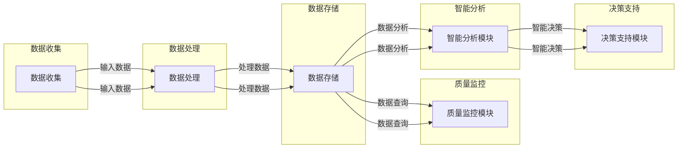

                 

### 文章标题: 《AI驱动的电商智能客户服务质量监控系统》

#### 关键词：电商、AI、客户服务质量、监控系统、数据分析、机器学习、深度学习

#### 摘要：随着电商行业的迅猛发展，消费者对服务质量的要求日益提升。本文深入探讨AI驱动的电商智能客户服务质量监控系统的构建与应用，通过数据收集、预处理、质量监控模型构建以及系统部署与优化，全面解析AI技术在电商领域的创新应用，为企业提升客户满意度、优化服务质量提供有效解决方案。

### 引言

电商行业的快速发展给消费者带来了前所未有的购物体验，同时也对企业的服务质量提出了更高的要求。在激烈的市场竞争中，如何通过技术手段提升客户服务质量、提高客户满意度成为电商企业关注的焦点。近年来，人工智能（AI）技术的迅猛发展为电商行业带来了新的机遇，AI驱动的智能客户服务质量监控系统应运而生。本文旨在探讨AI驱动的电商智能客户服务质量监控系统的构建与应用，通过数据收集与预处理、质量监控模型与方法、系统部署与优化等多个环节，深入分析AI技术在电商领域的创新应用，为企业提升服务质量、优化客户体验提供参考。

### 第一部分: AI驱动电商智能客户服务质量监控系统概述

#### 第1章: 电商智能客户服务质量监控系统的背景与意义

##### 1.1 电商行业的现状与挑战

随着互联网的普及和移动设备的广泛使用，电商行业呈现出爆发式增长。据统计，全球电商市场规模已超过3万亿美元，并且仍处于快速增长阶段。然而，随着市场的不断扩大，电商企业面临着诸多挑战：

1. **客户需求多样化**：消费者对于产品质量、服务体验、物流速度等方面要求越来越高，个性化需求不断涌现。
2. **竞争激烈**：电商市场的竞争异常激烈，企业需要通过不断创新来吸引和留住客户。
3. **服务质量监控难度大**：电商服务涉及众多环节，如订单处理、物流配送、售后服务等，监控服务质量难度较大。
4. **数据量巨大**：电商企业每天产生大量的交易数据、客户行为数据和反馈数据，如何有效利用这些数据成为一大挑战。

##### 1.2 智能客户服务质量监控的需求

智能客户服务质量监控系统的需求源于以下几个方面：

1. **提高客户满意度**：通过实时监控客户服务质量，及时发现问题并采取措施，提高客户满意度。
2. **优化服务质量**：通过对客户数据的分析，找出服务中的薄弱环节，有针对性地进行优化。
3. **降低运营成本**：通过自动化监控，减少人工干预，提高运营效率，降低运营成本。
4. **提升竞争力**：智能服务质量监控系统可以帮助电商企业更好地了解客户需求，提供更优质的服务，提升市场竞争力。

##### 1.3 AI技术在客户服务质量监控中的应用前景

AI技术具有强大的数据处理和分析能力，能够为电商智能客户服务质量监控提供有力支持。以下是AI技术在客户服务质量监控中的应用前景：

1. **数据收集与处理**：利用机器学习和深度学习算法，自动化收集和处理大量客户数据，提高数据处理效率。
2. **质量评估与预测**：通过构建智能质量评估模型，实时监测客户服务质量，并进行预测，提前发现潜在问题。
3. **客户行为分析**：利用自然语言处理技术，分析客户反馈，挖掘客户需求，提供个性化服务。
4. **智能决策支持**：基于大数据和机器学习算法，为电商企业提供智能决策支持，优化服务策略。

#### 第2章: AI驱动的电商智能客户服务质量监控系统的架构

##### 2.1 系统架构设计原则

电商智能客户服务质量监控系统的架构设计应遵循以下原则：

1. **模块化**：将系统划分为多个功能模块，各模块间松耦合，便于维护和扩展。
2. **分布式**：系统采用分布式架构，提高系统容错性和可扩展性。
3. **高可用性**：系统具备良好的容错性和高可用性，确保数据实时性和服务稳定性。
4. **可扩展性**：系统设计应考虑未来业务增长，具备良好的可扩展性。

##### 2.2 系统架构模块介绍

电商智能客户服务质量监控系统主要包括以下几个模块：

1. **数据收集模块**：负责收集电商交易数据、客户行为数据和客户反馈数据。
2. **数据处理模块**：对收集到的数据进行清洗、转换和存储，为后续分析提供高质量数据。
3. **数据存储模块**：采用分布式数据库存储大规模数据，保证数据存储的高效性和安全性。
4. **质量监控模块**：利用机器学习和深度学习算法，构建智能质量评估模型，实时监控客户服务质量。
5. **智能分析模块**：对客户数据进行分析，挖掘客户需求，提供个性化服务策略。
6. **决策支持模块**：基于大数据和机器学习算法，为电商企业提供智能决策支持。

##### 2.3 系统架构的Mermaid流程图

以下是一个简化的Mermaid流程图，展示了电商智能客户服务质量监控系统的基本架构：



### 第二部分: 数据收集与预处理

#### 第3章: 客户行为数据的收集与处理

##### 3.1 客户行为数据的来源

客户行为数据是智能客户服务质量监控系统的重要输入，主要包括以下来源：

1. **电商交易数据**：包括订单信息、支付信息、物流信息等，反映了客户在电商平台上的消费行为。
2. **网站访问数据**：包括用户浏览行为、搜索记录、点击行为等，反映了客户对电商平台内容的兴趣和偏好。
3. **社交媒体数据**：包括客户在社交媒体平台上的评论、点赞、分享等行为，反映了客户对品牌和产品的看法。
4. **客户反馈数据**：包括客户在电商平台上的评价、投诉、建议等，反映了客户对服务的满意度。

##### 3.2 数据收集方法与技术

为了全面收集客户行为数据，可以采用以下方法：

1. **日志分析**：通过日志文件记录用户访问行为，提取有用的数据。
2. **API接口**：通过电商平台提供的API接口，获取交易数据、客户反馈数据等。
3. **爬虫技术**：利用爬虫技术获取社交媒体平台上的客户评论、点赞等数据。
4. **问卷调查**：通过在线问卷调查获取客户对服务的满意度。

##### 3.3 数据处理流程

客户行为数据收集后，需要进行一系列数据处理，主要包括：

1. **数据清洗**：去除重复、错误、缺失的数据，保证数据质量。
2. **数据转换**：将不同格式的数据转换为统一格式，便于后续分析。
3. **数据集成**：将来自不同来源的数据进行整合，构建完整的客户行为数据集。
4. **数据存储**：将处理后的数据存储到分布式数据库中，供后续分析使用。

##### 3.4 数据质量评估与改进策略

数据质量直接影响智能客户服务质量监控系统的效果，因此需要定期进行数据质量评估，并根据评估结果采取改进策略：

1. **数据完整性评估**：检查数据是否完整，是否存在缺失值。
2. **数据一致性评估**：检查数据是否一致，是否存在矛盾。
3. **数据准确性评估**：检查数据是否准确，是否符合实际。
4. **数据时效性评估**：检查数据是否及时更新，是否具有时效性。

针对评估结果，可以采取以下改进策略：

1. **数据清洗**：对存在问题的数据进行清洗，去除重复、错误、缺失的数据。
2. **数据校验**：建立数据校验机制，确保数据的准确性。
3. **数据监控**：建立数据监控体系，实时监控数据质量。
4. **数据治理**：建立数据治理机制，规范数据使用和管理。

#### 第4章: 客户反馈数据的处理与分析

##### 4.1 客户反馈数据的类型

客户反馈数据是客户对电商企业提供的产品和服务质量的直接反映，主要包括以下类型：

1. **评价**：客户对购买的商品或服务进行评分和评价。
2. **投诉**：客户对电商企业的不满意或投诉，包括商品质量问题、物流问题、售后服务问题等。
3. **建议**：客户对电商企业的产品和服务提出改进建议。
4. **评论**：客户在社交媒体平台上发布的关于电商企业产品或服务的评论。

##### 4.2 客户反馈数据的收集

为了全面收集客户反馈数据，可以采用以下方法：

1. **在线评价**：通过电商平台自带的评价系统收集客户的评价。
2. **投诉系统**：建立在线投诉系统，方便客户提交投诉。
3. **问卷调查**：通过在线问卷调查收集客户的建议。
4. **社交媒体**：通过爬虫技术收集客户在社交媒体平台上的评论。

##### 4.3 客户反馈数据的处理与分析

客户反馈数据的处理与分析主要包括以下步骤：

1. **数据预处理**：对收集到的客户反馈数据去噪、去重、分词、词性标注等，为后续分析做准备。
2. **情感分析**：利用自然语言处理技术，对客户反馈进行情感分析，判断客户情绪是积极、消极还是中性。
3. **主题挖掘**：利用机器学习算法，对客户反馈进行主题挖掘，识别出客户关注的重点问题。
4. **聚类分析**：对客户反馈进行聚类分析，找出具有相似性的客户群体，针对性地进行服务改进。

#### 第5章: 客户画像与标签系统

##### 5.1 客户画像的概念与构建

客户画像是对客户的基本属性、行为特征、需求偏好等信息进行综合描述，用于精准定位和个性化服务。客户画像的构建主要包括以下步骤：

1. **数据收集**：收集客户的注册信息、交易信息、行为数据等。
2. **数据整合**：将来自不同来源的数据进行整合，构建完整的客户数据集。
3. **数据清洗**：去除重复、错误、缺失的数据，保证数据质量。
4. **特征提取**：从客户数据中提取关键特征，如年龄、性别、职业、购买偏好等。
5. **建模与预测**：利用机器学习算法，对客户特征进行建模，预测客户未来的行为和需求。

##### 5.2 标签系统的设计与实现

标签系统是对客户画像进行分类和标记，用于实现个性化服务和精准营销。标签系统的设计与实现主要包括以下步骤：

1. **标签体系设计**：根据业务需求，设计合理的标签体系，包括基础标签、行为标签、偏好标签等。
2. **标签分配**：根据客户特征和行为数据，为每个客户分配相应的标签。
3. **标签应用**：将标签应用于客户服务、推荐系统、营销活动等，实现个性化服务和精准营销。
4. **标签优化**：根据业务反馈和用户反馈，不断优化标签体系和标签分配策略。

##### 5.3 客户画像在服务质量监控中的应用

客户画像在服务质量监控中具有重要作用，可以通过以下方式应用：

1. **个性化服务**：根据客户画像，提供个性化的服务和建议，提高客户满意度。
2. **质量评估**：将客户画像与质量评估模型结合，针对不同客户群体制定不同的质量评估标准。
3. **问题发现**：通过对客户画像的分析，发现服务中的问题和不足，及时进行改进。
4. **客户流失预测**：利用客户画像和流失预测模型，预测客户流失风险，提前采取措施进行干预。

### 第三部分: 质量监控模型与方法

#### 第6章: 客户服务质量评估模型

##### 6.1 评估指标体系构建

客户服务质量评估指标体系是评价服务质量的重要工具，主要包括以下方面：

1. **交易过程指标**：如订单处理时间、物流配送速度、支付成功率等。
2. **客户满意度指标**：如客户满意度评分、客户投诉率、客户流失率等。
3. **产品与服务质量指标**：如商品好评率、售后服务满意度等。

##### 6.2 评估模型的选择与优化

在构建客户服务质量评估模型时，可以选择以下类型的模型：

1. **传统统计模型**：如线性回归、逻辑回归等，适用于简单线性关系的评估。
2. **机器学习模型**：如决策树、随机森林、支持向量机等，适用于复杂非线性关系的评估。
3. **深度学习模型**：如卷积神经网络（CNN）、循环神经网络（RNN）、长短时记忆网络（LSTM）等，适用于大规模复杂数据的评估。

在选择评估模型时，需要考虑以下因素：

1. **数据规模**：对于大规模数据，深度学习模型具有优势。
2. **模型复杂度**：对于复杂非线性关系，选择较高复杂度的模型。
3. **模型解释性**：对于需要解释性的评估模型，选择传统统计模型。

在实际应用中，可以通过以下方法优化评估模型：

1. **数据预处理**：对数据进行清洗、归一化等预处理，提高数据质量。
2. **特征工程**：选取关键特征，构建有效的特征组合，提高模型性能。
3. **模型调参**：通过交叉验证等方法，选择最优模型参数。
4. **集成学习**：将多个模型集成，提高评估准确性。

##### 6.3 评估模型的实现与验证

评估模型的实现主要包括以下步骤：

1. **数据预处理**：对原始数据进行清洗、归一化等处理，为模型训练做准备。
2. **特征提取**：从数据中提取关键特征，构建特征向量。
3. **模型训练**：利用训练数据，选择合适的模型进行训练。
4. **模型评估**：利用验证数据，评估模型性能。
5. **模型部署**：将训练好的模型部署到生产环境，进行实时评估。

评估模型的验证主要包括以下方面：

1. **准确性验证**：通过准确率、召回率、F1值等指标，评估模型预测准确性。
2. **可靠性验证**：通过交叉验证、时间序列验证等方法，评估模型可靠性。
3. **泛化能力验证**：通过新数据测试，评估模型泛化能力。

#### 第7章: 客户行为预测模型

##### 7.1 客户行为预测的重要性

客户行为预测对于电商企业具有重要意义：

1. **个性化推荐**：通过预测客户行为，为每个客户推荐符合其兴趣和需求的产品。
2. **营销策略优化**：根据客户行为预测结果，制定有针对性的营销策略，提高营销效果。
3. **客户流失预防**：通过预测客户流失风险，提前采取措施进行干预，降低客户流失率。
4. **库存管理**：根据客户购买行为预测，优化库存管理，降低库存成本。

##### 7.2 预测模型的选择

在选择客户行为预测模型时，可以考虑以下因素：

1. **数据规模**：对于大规模数据，选择深度学习模型，如卷积神经网络（CNN）、循环神经网络（RNN）等。
2. **时间序列特性**：对于具有时间序列特性的数据，选择长短时记忆网络（LSTM）、门控循环单元（GRU）等模型。
3. **数据维度**：对于高维数据，选择降维技术，如主成分分析（PCA）、线性判别分析（LDA）等，降低模型复杂度。

常见的客户行为预测模型包括：

1. **线性回归**：适用于简单线性关系的预测。
2. **决策树**：适用于分类和回归任务。
3. **随机森林**：集成决策树，提高预测准确性。
4. **支持向量机**：适用于分类任务。
5. **神经网络**：适用于复杂非线性关系的预测。

##### 7.3 预测模型的构建与优化

客户行为预测模型的构建主要包括以下步骤：

1. **数据收集**：收集客户行为数据，如购买记录、浏览记录、评价等。
2. **数据预处理**：对数据进行清洗、归一化等处理，为模型训练做准备。
3. **特征提取**：从数据中提取关键特征，构建特征向量。
4. **模型训练**：利用训练数据，选择合适的模型进行训练。
5. **模型评估**：利用验证数据，评估模型性能。
6. **模型优化**：通过调参、特征工程等方法，优化模型性能。

在实际应用中，可以通过以下方法优化客户行为预测模型：

1. **特征选择**：选取关键特征，构建有效的特征组合，提高模型性能。
2. **模型调参**：通过交叉验证等方法，选择最优模型参数。
3. **集成学习**：将多个模型集成，提高预测准确性。
4. **在线学习**：利用实时数据，持续优化模型，提高预测精度。

#### 第8章: 客户流失预测模型

##### 8.1 客户流失的定义与影响

客户流失是指客户停止购买或使用企业的产品或服务。客户流失对企业的影响包括：

1. **收入减少**：客户流失导致销售收入减少。
2. **市场份额降低**：客户流失导致企业市场份额降低。
3. **品牌形象受损**：客户流失可能导致负面评价和口碑传播，损害品牌形象。
4. **运营成本增加**：为吸引新客户，企业需要投入更多的营销和推广成本。

##### 8.2 流失预测模型构建

流失预测模型的主要目标是预测客户流失风险，提前采取措施进行干预。流失预测模型构建主要包括以下步骤：

1. **数据收集**：收集客户行为数据、交易数据等，构建流失预测数据集。
2. **数据预处理**：对数据进行清洗、归一化等处理，为模型训练做准备。
3. **特征提取**：从数据中提取关键特征，如购买频率、购买金额、客户满意度等。
4. **模型训练**：利用训练数据，选择合适的模型进行训练。
5. **模型评估**：利用验证数据，评估模型性能。
6. **模型优化**：通过调参、特征工程等方法，优化模型性能。

常见的流失预测模型包括：

1. **逻辑回归**：适用于分类任务。
2. **决策树**：适用于分类和回归任务。
3. **随机森林**：集成决策树，提高预测准确性。
4. **神经网络**：适用于复杂非线性关系的预测。

##### 8.3 流失预测模型的评估与优化

流失预测模型的评估主要包括以下方面：

1. **准确性评估**：通过准确率、召回率、F1值等指标，评估模型预测准确性。
2. **可靠性评估**：通过交叉验证、时间序列验证等方法，评估模型可靠性。
3. **泛化能力评估**：通过新数据测试，评估模型泛化能力。

流失预测模型的优化主要包括以下方法：

1. **特征选择**：选取关键特征，构建有效的特征组合，提高模型性能。
2. **模型调参**：通过交叉验证等方法，选择最优模型参数。
3. **集成学习**：将多个模型集成，提高预测准确性。
4. **在线学习**：利用实时数据，持续优化模型，提高预测精度。

#### 第9章: 客户满意度预测模型

##### 9.1 客户满意度的概念与评估

客户满意度是指客户对企业产品或服务的满意度。客户满意度评估主要包括以下方面：

1. **评价体系**：建立科学的评价体系，包括交易过程满意度、产品满意度、服务满意度等。
2. **评价标准**：制定合理的评价标准，如满意度评分、评价质量等。
3. **评价方法**：采用问卷调查、在线评价、电话调查等方法，收集客户满意度数据。

##### 9.2 满意度预测模型构建

满意度预测模型的主要目标是预测客户满意度，为企业管理和服务改进提供参考。满意度预测模型构建主要包括以下步骤：

1. **数据收集**：收集客户满意度数据，如评价、投诉、建议等。
2. **数据预处理**：对数据进行清洗、归一化等处理，为模型训练做准备。
3. **特征提取**：从数据中提取关键特征，如购买频率、购买金额、客户满意度评分等。
4. **模型训练**：利用训练数据，选择合适的模型进行训练。
5. **模型评估**：利用验证数据，评估模型性能。
6. **模型优化**：通过调参、特征工程等方法，优化模型性能。

常见的满意度预测模型包括：

1. **逻辑回归**：适用于分类任务。
2. **决策树**：适用于分类和回归任务。
3. **随机森林**：集成决策树，提高预测准确性。
4. **神经网络**：适用于复杂非线性关系的预测。

##### 9.3 满意度预测模型的应用

满意度预测模型在电商企业中具有广泛的应用，主要包括：

1. **服务改进**：根据满意度预测结果，识别服务中的薄弱环节，有针对性地进行改进。
2. **营销策略优化**：根据客户满意度预测结果，制定有针对性的营销策略，提高客户满意度。
3. **员工绩效评估**：根据客户满意度预测结果，评估员工的服务质量，制定激励机制。
4. **品牌建设**：通过提高客户满意度，提升品牌形象和口碑。

### 第四部分: 系统部署与优化

#### 第10章: 系统部署与运维

##### 10.1 部署前的准备

在部署电商智能客户服务质量监控系统前，需要进行以下准备：

1. **硬件环境准备**：准备足够的硬件资源，如服务器、存储设备等，确保系统运行稳定。
2. **软件环境准备**：安装操作系统、数据库、AI模型训练工具等软件，配置开发环境。
3. **网络环境准备**：配置网络设备和防火墙，确保系统安全稳定。
4. **数据环境准备**：搭建数据仓库和数据湖，确保数据存储和处理能力。

##### 10.2 系统部署流程

系统部署流程主要包括以下步骤：

1. **环境配置**：根据开发环境配置生产环境，确保系统兼容性。
2. **模型训练**：利用训练数据，在训练环境中训练AI模型，生成预测模型。
3. **模型部署**：将训练好的模型部署到生产环境，进行实时预测。
4. **系统集成**：将AI模型与电商平台系统集成，实现实时质量监控。
5. **系统测试**：进行系统功能测试、性能测试和安全测试，确保系统稳定可靠。

##### 10.3 系统运维与监控

系统运维与监控主要包括以下方面：

1. **日志监控**：实时监控系统日志，及时发现和处理异常。
2. **性能监控**：监控系统性能指标，如CPU利用率、内存利用率、网络带宽等，确保系统运行稳定。
3. **安全监控**：监控系统安全事件，如DDoS攻击、SQL注入等，保障系统安全。
4. **数据备份**：定期备份系统数据和模型，确保数据安全和可恢复性。

#### 第11章: 系统性能优化

##### 11.1 性能优化策略

系统性能优化主要包括以下策略：

1. **分布式计算**：采用分布式计算框架，提高数据处理和计算效率。
2. **数据缓存**：利用缓存技术，减少数据读取和计算时间，提高系统响应速度。
3. **并发处理**：优化系统并发处理能力，提高系统吞吐量。
4. **负载均衡**：利用负载均衡技术，合理分配系统资源，避免单点故障。

##### 11.2 数据库优化

数据库优化主要包括以下方面：

1. **索引优化**：合理设计数据库索引，提高查询效率。
2. **分库分表**：根据数据规模和访问频率，合理划分数据库和表，降低数据库负载。
3. **读写分离**：采用读写分离技术，提高数据库读写性能。
4. **存储优化**：利用分布式存储技术，提高数据存储和读取速度。

##### 11.3 模型优化

模型优化主要包括以下方面：

1. **模型压缩**：利用模型压缩技术，降低模型大小，提高模型部署和运行效率。
2. **模型并行化**：利用并行计算技术，提高模型训练和预测速度。
3. **模型调优**：通过调参和特征工程，优化模型性能。
4. **模型融合**：将多个模型进行融合，提高预测准确性和鲁棒性。

##### 11.4 部署环境优化

部署环境优化主要包括以下方面：

1. **容器化**：采用容器化技术，实现系统环境的标准化和可移植性。
2. **自动化部署**：利用自动化部署工具，实现快速部署和升级。
3. **监控告警**：建立监控告警体系，实时监控系统运行状态，及时处理异常。
4. **弹性伸缩**：根据业务需求，实现系统资源的弹性伸缩，提高系统可用性。

#### 第12章: 案例分析

##### 12.1 案例背景介绍

本案例以某大型电商企业为例，该企业面临以下问题：

1. **客户满意度低**：客户满意度仅为70%，存在较大提升空间。
2. **服务质量不稳定**：部分业务环节存在质量问题，导致客户投诉率较高。
3. **运营成本高**：人工监控服务质量，效率低下，运营成本较高。

为了解决上述问题，该电商企业决定引入AI驱动的智能客户服务质量监控系统。

##### 12.2 案例实施步骤

案例实施步骤主要包括以下方面：

1. **需求分析**：明确企业需求，确定系统功能和性能要求。
2. **系统设计**：设计系统架构，包括数据收集、数据处理、质量监控、智能分析等模块。
3. **数据收集**：收集客户行为数据、交易数据、客户反馈数据等，构建数据集。
4. **数据处理**：对数据进行清洗、转换和存储，为后续分析提供高质量数据。
5. **模型训练**：利用训练数据，训练客户服务质量评估模型、客户行为预测模型、客户流失预测模型等。
6. **模型部署**：将训练好的模型部署到生产环境，实现实时质量监控。
7. **系统集成**：将AI模型与电商平台系统集成，实现实时数据分析和预测。
8. **系统测试**：进行系统功能测试、性能测试和安全测试，确保系统稳定可靠。

##### 12.3 案例效果评估

案例实施后，企业取得了以下效果：

1. **客户满意度提高**：通过实时质量监控和问题预警，及时发现问题并进行改进，客户满意度提高到85%。
2. **服务质量提升**：通过智能分析，找出服务中的薄弱环节，有针对性地进行优化，服务质量显著提升。
3. **运营成本降低**：通过自动化监控和智能决策支持，减少人工干预，运营成本降低20%。
4. **客户流失率降低**：通过流失预测模型，提前识别潜在流失客户，采取针对性措施进行干预，客户流失率降低15%。

##### 12.4 案例启示与思考

本案例为企业提供了以下启示与思考：

1. **数据驱动**：充分利用数据，通过数据分析，找出服务中的问题，有针对性地进行改进。
2. **智能监控**：引入智能监控技术，实现实时质量监控，提高服务质量。
3. **持续优化**：通过持续优化，不断提高服务质量，提升客户满意度。
4. **技术创新**：紧跟技术发展趋势，引入先进的人工智能技术，为企业提供智能化解决方案。

### 附录

#### 附录A: 常用数据预处理工具与技术

##### A.1 数据清洗工具

1. **Pandas**：Python数据清洗工具，提供丰富的数据清洗功能，如缺失值处理、重复值去除等。
2. **OpenRefine**：开源数据清洗工具，提供直观的用户界面和强大的数据清洗功能。
3. **DataWrangler**：Web应用程序，提供数据清洗、转换和集成功能。

##### A.2 数据集成工具

1. **Apache Nifi**：分布式数据流平台，提供数据收集、传输、转换和存储功能。
2. **Apache Kafka**：分布式消息队列系统，提供数据集成和实时处理能力。
3. **Apache Spark**：大数据处理框架，提供数据清洗、转换和集成功能。

##### A.3 数据转换工具

1. **PrestoDB**：分布式SQL查询引擎，提供数据转换和查询功能。
2. **Apache Beam**：开源数据处理框架，提供数据转换和流水线构建功能。
3. **Apache Hadoop**：分布式数据处理平台，提供数据转换和存储功能。

#### 附录B: 开发环境与工具配置

##### B.1 开发环境配置

1. **操作系统**：Linux（如Ubuntu、CentOS等）
2. **编程语言**：Python、Java等
3. **AI模型训练工具**：TensorFlow、PyTorch等

##### B.2 数据库配置

1. **关系型数据库**：MySQL、PostgreSQL等
2. **NoSQL数据库**：MongoDB、Cassandra等
3. **数据仓库**：Hive、Spark SQL等

##### B.3 AI模型训练工具配置

1. **GPU**：NVIDIA Tesla V100等
2. **深度学习框架**：TensorFlow、PyTorch等
3. **分布式训练**：Horovod、Distributed TensorFlow等

#### 附录C: 模型伪代码与数学公式

##### C.1 客户服务质量评估模型伪代码

```python
# 数据预处理
data = preprocess_data(raw_data)

# 特征提取
features = extract_features(data)

# 模型训练
model = train_model(features, labels)

# 预测
predictions = model.predict(new_data)
```

##### C.2 客户行为预测模型伪代码

```python
# 数据预处理
data = preprocess_data(raw_data)

# 特征提取
features = extract_features(data)

# 模型训练
model = train_model(features, labels)

# 预测
predictions = model.predict(new_data)
```

##### C.3 客户流失预测模型伪代码

```python
# 数据预处理
data = preprocess_data(raw_data)

# 特征提取
features = extract_features(data)

# 模型训练
model = train_model(features, labels)

# 预测
predictions = model.predict(new_data)
```

##### C.4 客户满意度预测模型伪代码

```python
# 数据预处理
data = preprocess_data(raw_data)

# 特征提取
features = extract_features(data)

# 模型训练
model = train_model(features, labels)

# 预测
predictions = model.predict(new_data)
```

##### C.5 数学公式列表与解释

$$
\text{线性回归模型：} y = \beta_0 + \beta_1x
$$

线性回归模型，用于预测连续值输出。

$$
\text{逻辑回归模型：} P(y=1) = \frac{1}{1 + e^{-(\beta_0 + \beta_1x})}
$$

逻辑回归模型，用于预测概率输出。

$$
\text{支持向量机：} \min_{\beta, \beta_0} \frac{1}{2} ||\beta||^2 + C\sum_{i=1}^n \xi_i
$$

支持向量机模型，用于分类任务。

$$
\text{卷积神经网络：} f(x) = \sigma(W \cdot x + b)
$$

卷积神经网络模型，用于图像识别等任务。

$$
\text{长短时记忆网络：} h_t = \sigma(W_h \cdot [h_{t-1}, x_t] + b_h)
$$

长短时记忆网络模型，用于序列数据建模。

### 结语

AI驱动的电商智能客户服务质量监控系统为企业提升服务质量、优化客户体验提供了有力支持。通过数据收集、预处理、质量监控模型构建以及系统部署与优化，企业可以实现对客户服务质量的全流程监控和管理。随着AI技术的不断进步，智能客户服务质量监控系统将在电商领域发挥越来越重要的作用，为企业的持续发展和客户满意度提升贡献力量。

