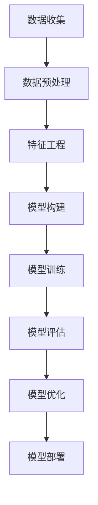

                 

### 文章标题

### AI驱动的电商用户生命周期价值预测

> 关键词：人工智能，电商，用户生命周期，价值预测，深度学习，个性化推荐

> 摘要：
随着人工智能技术的不断发展，电商行业在用户生命周期价值预测方面迎来了新的机遇。本文通过系统的分析，探讨了AI驱动的电商用户生命周期价值预测的理论基础、核心算法、模型评估与优化，以及实际应用案例，为电商企业提供了一种有效的策略和方法，以提高用户价值和业务竞争力。

#### 目录大纲

第一部分: AI驱动的电商用户生命周期价值预测基础

##### 第1章: AI驱动的电商用户生命周期价值预测概述

1.1 AI驱动的电商用户生命周期价值预测简介  
1.2 AI在电商领域的应用背景  
1.3 用户生命周期价值预测的核心概念与联系

##### 第2章: 数据收集与处理

2.1 用户行为数据收集  
2.2 用户数据预处理  
2.3 用户特征工程

##### 第3章: 用户生命周期价值预测模型

3.1 用户生命周期价值预测模型概述  
3.2 传统用户生命周期价值预测模型  
3.3 基于深度学习的用户生命周期价值预测模型

##### 第4章: 模型评估与优化

4.1 用户生命周期价值预测模型评估指标  
4.2 模型调优与优化策略  
4.3 模型验证与迭代

##### 第5章: AI驱动的电商个性化推荐

5.1 个性化推荐系统概述  
5.2 基于用户生命周期价值预测的个性化推荐策略  
5.3 个性化推荐系统实现与优化

##### 第6章: AI驱动的电商用户留存策略

6.1 用户留存策略概述  
6.2 基于用户生命周期价值预测的用户留存策略  
6.3 用户留存策略实施与效果评估

##### 第7章: AI驱动的电商用户生命周期价值预测实战案例

7.1 实战案例背景  
7.2 数据收集与处理  
7.3 模型构建与训练  
7.4 模型评估与优化  
7.5 用户个性化推荐与留存策略实施

### 附录

#### 附录A: AI驱动的电商用户生命周期价值预测工具与资源

A.1 Python机器学习库  
A.2 电商数据集  
A.3 常用AI框架

#### 附录B: Mermaid流程图与数学公式

B.1 用户生命周期价值预测模型架构流程图  
B.2 用户生命周期价值预测数学模型

#### 附录C: 代码解读与分析

C.1 数据收集与处理代码解读  
C.2 用户生命周期价值预测模型代码解读  
C.3 个性化推荐与用户留存策略代码解读

---

### 引言

在当今电商竞争激烈的背景下，企业如何在海量的用户数据中挖掘价值，实现精准营销和用户留存，成为提高市场竞争力的关键。AI驱动的用户生命周期价值预测正是解决这一问题的关键技术。通过预测用户的生命周期价值和行为，电商企业可以制定更加精准的营销策略，优化资源配置，提升用户体验和忠诚度。

本文旨在系统地探讨AI驱动的电商用户生命周期价值预测的理论和实践。首先，我们将概述AI在电商领域的应用背景，解释用户生命周期价值预测的重要性。接着，本文将详细讨论数据收集与处理、用户生命周期价值预测模型、模型评估与优化、AI驱动的电商个性化推荐和用户留存策略等内容。最后，通过一个实战案例，我们将展示如何在实际项目中应用AI驱动的用户生命周期价值预测，为企业提供可行的解决方案。

### 第一部分: AI驱动的电商用户生命周期价值预测基础

##### 第1章: AI驱动的电商用户生命周期价值预测概述

**1.1 AI驱动的电商用户生命周期价值预测简介**

人工智能（AI）作为一种强大的技术工具，正迅速改变着电商行业的面貌。AI驱动的电商用户生命周期价值预测是通过利用机器学习和深度学习等技术，对用户行为数据进行分析和建模，预测用户在不同生命周期阶段的价值和潜在行为。这不仅有助于企业更准确地识别高价值用户，还能为营销策略和运营决策提供数据支持，从而提高用户满意度和忠诚度。

用户生命周期价值预测是电商运营的核心之一。通过预测用户的潜在价值，企业可以采取有针对性的措施来提升用户体验，增加销售额，降低用户流失率。具体来说，用户生命周期可以分为多个阶段，包括新用户注册、用户活跃期、留存期、流失期等。在每个阶段，用户的消费行为、互动频率、购买偏好等数据都可以被收集和分析，从而预测用户在未来可能产生的价值。

**1.2 AI在电商领域的应用背景**

AI技术在电商领域的应用已经相当广泛，主要表现在以下几个方面：

1. **个性化推荐**：通过分析用户的浏览历史、购买记录和社交行为，AI系统能够为用户推荐个性化商品，提高转化率和用户满意度。

2. **用户行为分析**：AI技术可以帮助电商企业深入了解用户行为，识别用户需求和潜在问题，从而优化产品和服务。

3. **智能客服**：利用自然语言处理（NLP）技术，AI客服系统能够实时解答用户疑问，提高客户满意度和服务效率。

4. **价格优化**：AI算法可以分析市场动态和用户行为，为电商企业提供动态定价策略，提高利润率。

5. **物流优化**：AI技术在路径规划、库存管理和配送优化等方面发挥着重要作用，提高了物流效率和服务质量。

**1.3 用户生命周期价值预测的核心概念与联系**

用户生命周期是指用户与电商企业互动的全过程，通常包括以下几个关键阶段：

1. **注册阶段**：用户首次注册账号，这一阶段主要是获取用户的初始信息，如姓名、邮箱、手机号等。

2. **活跃阶段**：用户在电商平台上进行浏览、搜索、添加商品到购物车等操作，这一阶段是用户与平台互动最为频繁的时期。

3. **留存阶段**：用户在平台上完成购买行为，并持续在平台进行消费，这一阶段的用户具有较高的生命周期价值。

4. **流失阶段**：用户停止在平台上进行互动和消费，甚至可能卸载应用或删除账号，这一阶段需要进行用户留存策略的干预。

用户生命周期价值（Customer Lifetime Value, CLV）是指一个用户在其整个生命周期内为企业带来的总收益。CLV的计算通常涉及多个因素，包括用户的购买频率、平均订单价值、购买周期和留存率等。预测用户生命周期价值的关键在于准确捕捉用户在不同生命周期阶段的特征和行为，以便为企业提供数据驱动的决策支持。

AI驱动的用户生命周期价值预测模型通过以下方式与电商业务紧密相连：

1. **数据收集**：AI系统通过电商平台的各种渠道收集用户行为数据，包括浏览记录、购买历史、评论和反馈等。

2. **数据预处理**：对收集到的数据进行清洗、去噪和归一化处理，提取出对预测有用的特征。

3. **特征工程**：根据用户行为的特征，构建反映用户价值的相关特征指标，如购买频率、平均订单价值、点击率等。

4. **模型构建**：利用机器学习和深度学习算法，构建预测模型，对用户生命周期价值进行预测。

5. **模型评估**：通过验证集和测试集对模型进行评估，调整模型参数，提高预测准确性。

6. **策略优化**：根据预测结果，制定针对性的营销和用户留存策略，提高用户生命周期价值。

总之，AI驱动的用户生命周期价值预测为电商企业提供了一个强有力的工具，可以帮助企业更深入地理解用户需求，优化运营策略，提升整体业务水平。

---

### 第二部分: 数据收集与处理

##### 第2章: 数据收集与处理

在AI驱动的电商用户生命周期价值预测中，数据收集与处理是至关重要的一步。数据的质量直接影响模型的效果，因此，如何有效地收集、预处理和处理用户行为数据是成功构建预测模型的关键。本章将详细讨论用户行为数据的收集、预处理和特征工程的过程，以确保数据的高质量和可用性。

**2.1 用户行为数据收集**

用户行为数据是构建用户生命周期价值预测模型的基础。这些数据可以来源于电商平台的各种渠道，包括：

1. **用户注册信息**：用户的姓名、邮箱、手机号、注册时间等基本信息。

2. **浏览行为**：用户在电商平台上的浏览记录，如浏览的页面、浏览时长、访问频次等。

3. **购买行为**：用户的购买记录，包括购买时间、商品种类、购买数量、订单金额等。

4. **互动行为**：用户在平台上的互动记录，如评论、点赞、分享等。

5. **反馈行为**：用户对商品、服务、平台的反馈信息，包括评分、评论等。

收集这些数据的方法包括：

- **日志数据收集**：通过在服务器上安装日志收集器，实时记录用户的操作行为。
- **数据库查询**：直接从电商平台的后台数据库中提取用户行为数据。
- **第三方数据接口**：通过第三方数据接口获取用户行为数据，如社交媒体平台、搜索引擎等。

**2.2 用户数据预处理**

收集到的用户行为数据通常存在噪声、缺失值和不一致性等问题，需要通过预处理来提高数据质量。预处理步骤包括：

1. **数据清洗**：去除重复数据、异常值和噪声数据，确保数据的一致性和准确性。

2. **数据去重**：对重复的用户行为数据进行去重处理，避免重复计算。

3. **数据格式转换**：将不同来源的数据格式统一，如将时间戳转换为标准格式。

4. **数据缺失处理**：对于缺失的数据，可以采用插值法、均值填补法或删除缺失值等方法进行处理。

**2.3 用户特征工程**

用户特征工程是数据预处理的关键步骤，通过提取和构造特征，将原始数据转化为适合模型输入的形式。以下是一些常见的用户特征工程方法：

1. **基础特征提取**：包括用户注册信息、购买行为、浏览行为等基础数据。

2. **统计特征计算**：对用户行为数据进行统计计算，如平均浏览时长、购买频率、订单金额等。

3. **时间序列特征**：根据用户的行为时间序列，提取特征，如最近一次购买时间、最近一次浏览时间等。

4. **用户群体特征**：根据用户属性，如性别、年龄、地理位置等，进行分组统计，提取特征。

5. **交互特征**：通过用户与其他用户、商品、评论等的交互行为，提取交互特征，如用户对某商品的评论数量、点赞数量等。

6. **嵌入特征**：利用Word2Vec、BERT等嵌入技术，将用户特征进行嵌入，以提升模型的表示能力。

通过数据收集与处理，我们能够获得高质量的用户行为数据集，为构建AI驱动的用户生命周期价值预测模型提供基础。接下来，我们将进一步探讨如何构建和评估用户生命周期价值预测模型。

---

### 第三部分: 用户生命周期价值预测模型

##### 第3章: 用户生命周期价值预测模型

用户生命周期价值（Customer Lifetime Value, CLV）预测是电商企业制定精准营销策略和运营决策的关键环节。在AI技术日益普及的今天，如何利用机器学习和深度学习等算法来构建高效的用户生命周期价值预测模型，成为了一个备受关注的话题。本章将详细介绍用户生命周期价值预测模型的基本概念、传统预测模型、基于深度学习的预测模型，以及模型的构建和实现。

**3.1 用户生命周期价值预测模型概述**

用户生命周期价值预测模型旨在通过分析用户的历史行为数据，预测用户在未来一段时间内为企业带来的总价值。CLV预测的核心目标是帮助企业识别高价值用户，实施精准营销策略，提升用户满意度和忠诚度，从而增加企业的盈利能力。

用户生命周期价值预测模型通常包括以下几个关键组成部分：

1. **数据输入**：输入数据包括用户注册信息、浏览行为、购买行为、互动行为等用户历史行为数据。

2. **特征工程**：通过对原始数据进行清洗、归一化和特征提取，构建反映用户价值和潜在行为的特征向量。

3. **模型算法**：选择合适的机器学习或深度学习算法，对特征向量进行训练，构建预测模型。

4. **模型评估**：通过交叉验证、AUC、RMSE等指标评估模型的预测性能，并进行模型调优。

5. **策略应用**：根据预测结果，制定用户分类、营销策略、用户留存策略等，优化企业运营。

**3.2 传统用户生命周期价值预测模型**

传统用户生命周期价值预测模型主要基于统计学习和机器学习算法，如逻辑回归、决策树、随机森林等。这些模型通过对历史数据进行分析和建模，预测用户的生命周期价值。以下是一些常见的传统预测模型：

1. **逻辑回归（Logistic Regression）**：
   - 优点：简单易懂，计算速度快。
   - 缺点：模型表达能力有限，难以捕捉非线性关系。
   - 伪代码：
     ```python
     import numpy as np
     from sklearn.linear_model import LogisticRegression

     # 特征矩阵 X 和标签 y
     X = np.array([[1, 2], [2, 3], [3, 4]])
     y = np.array([0, 1, 1])

     # 构建逻辑回归模型
     model = LogisticRegression()
     # 模型训练
     model.fit(X, y)
     # 预测
     predictions = model.predict(X)
     ```

2. **决策树（Decision Tree）**：
   - 优点：直观易懂，易于解释。
   - 缺点：模型复杂度较高，容易过拟合。
   - 伪代码：
     ```python
     import numpy as np
     from sklearn.tree import DecisionTreeClassifier

     # 特征矩阵 X 和标签 y
     X = np.array([[1, 2], [2, 3], [3, 4]])
     y = np.array([0, 1, 1])

     # 构建决策树模型
     model = DecisionTreeClassifier()
     # 模型训练
     model.fit(X, y)
     # 预测
     predictions = model.predict(X)
     ```

3. **随机森林（Random Forest）**：
   - 优点：集成多个决策树，提高预测准确性。
   - 缺点：计算复杂度较高，模型解释性较差。
   - 伪代码：
     ```python
     import numpy as np
     from sklearn.ensemble import RandomForestClassifier

     # 特征矩阵 X 和标签 y
     X = np.array([[1, 2], [2, 3], [3, 4]])
     y = np.array([0, 1, 1])

     # 构建随机森林模型
     model = RandomForestClassifier()
     # 模型训练
     model.fit(X, y)
     # 预测
     predictions = model.predict(X)
     ```

**3.3 基于深度学习的用户生命周期价值预测模型**

随着深度学习技术的快速发展，越来越多的研究表明，基于深度学习的用户生命周期价值预测模型在性能上优于传统机器学习模型。深度学习模型能够自动提取复杂的特征，捕捉用户行为数据中的非线性关系，从而提高预测准确性。

以下是基于深度学习的用户生命周期价值预测模型的构建和实现：

1. **模型架构**：
   基于深度学习的用户生命周期价值预测模型通常采用卷积神经网络（CNN）、循环神经网络（RNN）或 Transformer 等架构。以下是一个基于 RNN 的用户生命周期价值预测模型架构：

   ```mermaid
   graph LR
   A[输入层] --> B[嵌入层]
   B --> C[RNN层]
   C --> D[全连接层]
   D --> E[输出层]
   ```

2. **模型实现**：
   利用 PyTorch 等深度学习框架，可以实现基于 RNN 的用户生命周期价值预测模型。以下是一个简单的 PyTorch 模型实现：

   ```python
   import torch
   import torch.nn as nn

   class RNNModel(nn.Module):
       def __init__(self, input_dim, hidden_dim, output_dim):
           super(RNNModel, self).__init__()
           self.embedding = nn.Embedding(input_dim, hidden_dim)
           self.rnn = nn.RNN(hidden_dim, hidden_dim, batch_first=True)
           self.fc = nn.Linear(hidden_dim, output_dim)

       def forward(self, x):
           embedded = self.embedding(x)
           output, _ = self.rnn(embedded)
           prediction = self.fc(output[:, -1, :])
           return prediction

   # 模型实例化
   model = RNNModel(input_dim=100, hidden_dim=128, output_dim=1)
   # 模型训练
   optimizer = torch.optim.Adam(model.parameters(), lr=0.001)
   criterion = nn.MSELoss()

   for epoch in range(num_epochs):
       for inputs, targets in data_loader:
           optimizer.zero_grad()
           predictions = model(inputs)
           loss = criterion(predictions, targets)
           loss.backward()
           optimizer.step()

   # 预测
   with torch.no_grad():
       predictions = model(inputs)
   ```

**3.4 模型评估与优化**

用户生命周期价值预测模型的评估通常采用交叉验证、AUC（Area Under the Curve）、RMSE（Root Mean Square Error）等指标。以下是一个简单的模型评估过程：

```python
from sklearn.model_selection import cross_val_score
from sklearn.metrics import roc_auc_score, mean_squared_error

# 使用交叉验证评估模型
scores = cross_val_score(model, X, y, cv=5)

# 计算AUC
auc_scores = []
for train_idx, test_idx in KFold(n_splits=5).split(X):
    X_train, X_test = X[train_idx], X[test_idx]
    y_train, y_test = y[train_idx], y[test_idx]
    model.fit(X_train, y_train)
    predictions = model.predict(X_test)
    auc_scores.append(roc_auc_score(y_test, predictions))

# 计算RMSE
rmse_scores = []
for train_idx, test_idx in KFold(n_splits=5).split(X):
    X_train, X_test = X[train_idx], X[test_idx]
    y_train, y_test = y[train_idx], y[test_idx]
    model.fit(X_train, y_train)
    predictions = model.predict(X_test)
    rmse_scores.append(mean_squared_error(y_test, predictions, squared=False))

# 打印评估结果
print("交叉验证得分：", scores)
print("AUC得分：", auc_scores)
print("RMSE得分：", rmse_scores)
```

通过上述步骤，我们可以评估用户生命周期价值预测模型的性能，并根据评估结果对模型进行优化和调整。

总之，用户生命周期价值预测模型是电商企业提高用户价值和业务竞争力的重要工具。通过传统机器学习和深度学习模型的应用，企业可以实现对用户价值的准确预测，从而制定更加有效的营销策略和运营决策。

---

### 第四部分: 模型评估与优化

##### 第4章: 模型评估与优化

在构建用户生命周期价值预测模型的过程中，模型评估与优化是确保预测准确性和模型性能的关键环节。本章将详细介绍模型评估指标、调优策略和优化方法，以及模型验证与迭代的步骤，旨在帮助企业构建高效、准确的预测模型。

**4.1 用户生命周期价值预测模型评估指标**

评估用户生命周期价值预测模型的性能，需要使用适当的评估指标。以下是一些常用的评估指标：

1. **准确率（Accuracy）**：
   - 定义：模型预测正确的样本数占总样本数的比例。
   - 伪代码：
     ```python
     from sklearn.metrics import accuracy_score

     # 真实标签和预测标签
     true_labels = [0, 1, 1, 0]
     predicted_labels = [1, 1, 1, 0]

     # 计算准确率
     accuracy = accuracy_score(true_labels, predicted_labels)
     print("准确率：", accuracy)
     ```

2. **精确率（Precision）和召回率（Recall）**：
   - 定义：精确率是预测为正例的样本中实际为正例的比例，召回率是实际为正例的样本中被预测为正例的比例。
   - 伪代码：
     ```python
     from sklearn.metrics import precision_score, recall_score

     # 真实标签和预测标签
     true_labels = [0, 1, 1, 0]
     predicted_labels = [1, 1, 1, 0]

     # 计算精确率和召回率
     precision = precision_score(true_labels, predicted_labels)
     recall = recall_score(true_labels, predicted_labels)
     print("精确率：", precision)
     print("召回率：", recall)
     ```

3. **F1 分数（F1 Score）**：
   - 定义：精确率和召回率的加权平均，用于平衡两者。
   - 伪代码：
     ```python
     from sklearn.metrics import f1_score

     # 真实标签和预测标签
     true_labels = [0, 1, 1, 0]
     predicted_labels = [1, 1, 1, 0]

     # 计算F1分数
     f1 = f1_score(true_labels, predicted_labels)
     print("F1分数：", f1)
     ```

4. **AUC（Area Under the Curve）**：
   - 定义：ROC 曲线下方的面积，用于评估分类器的整体性能。
   - 伪代码：
     ```python
     from sklearn.metrics import roc_auc_score

     # 真实标签和预测标签
     true_labels = [0, 1, 1, 0]
     predicted_probabilities = [0.1, 0.9, 0.9, 0.2]

     # 计算AUC
     auc = roc_auc_score(true_labels, predicted_probabilities)
     print("AUC：", auc)
     ```

5. **RMSE（Root Mean Square Error）**：
   - 定义：预测值与真实值之间差异的均方根，用于回归问题。
   - 伪代码：
     ```python
     from sklearn.metrics import mean_squared_error

     # 真实值和预测值
     true_values = [1, 2, 3, 4]
     predicted_values = [1.1, 2.1, 2.9, 3.8]

     # 计算RMSE
     rmse = mean_squared_error(true_values, predicted_values, squared=False)
     print("RMSE：", rmse)
     ```

**4.2 模型调优与优化策略**

模型调优是提升预测性能的关键步骤。以下是一些常用的调优策略：

1. **参数调整**：
   - 调整模型参数，如学习率、正则化参数等，以提升模型性能。
   - 伪代码：
     ```python
     # 调整学习率
     optimizer = torch.optim.Adam(model.parameters(), lr=0.001)

     # 调整正则化参数
     l2_penalty = 0.01
     criterion = nn.MSELoss(weight=l2_penalty)
     ```

2. **特征选择**：
   - 通过特征重要性分析，选择对预测结果有显著影响的特征，剔除冗余特征。
   - 伪代码：
     ```python
     from sklearn.inspection import permutation_importance

     # 计算特征重要性
     results = permutation_importance(model, X, y, n_repeats=30)
     importance = results.importances_mean
     print("特征重要性：", importance)
     ```

3. **集成学习**：
   - 通过集成多个模型，提高预测性能和稳定性。
   - 伪代码：
     ```python
     from sklearn.ensemble import VotingClassifier

     # 创建集成模型
     ensemble_model = VotingClassifier(estimators=[
         ('model1', model1), ('model2', model2), ('model3', model3)])
     ```

4. **数据预处理**：
   - 对数据集进行进一步处理，如缺失值填充、异常值处理等，以提高模型性能。
   - 伪代码：
     ```python
     # 缺失值填充
     X = X.fillna(X.mean())

     # 异常值处理
     X = (X - X.mean()) / X.std()
     ```

**4.3 模型验证与迭代**

模型验证是确保模型在实际应用中表现良好的一步。以下是一些模型验证与迭代的步骤：

1. **交叉验证**：
   - 通过交叉验证，评估模型在不同数据子集上的性能，以防止过拟合。
   - 伪代码：
     ```python
     from sklearn.model_selection import cross_val_score

     # 计算交叉验证得分
     scores = cross_val_score(model, X, y, cv=5)
     print("交叉验证得分：", scores)
     ```

2. **A/B 测试**：
   - 在实际应用中，通过 A/B 测试，比较不同模型的性能，选择最优模型。
   - 伪代码：
     ```python
     from sklearn.model_selection import train_test_split

     # 划分训练集和测试集
     X_train, X_test, y_train, y_test = train_test_split(X, y, test_size=0.2)

     # 训练模型
     model.fit(X_train, y_train)

     # 预测测试集
     predictions = model.predict(X_test)

     # 计算性能指标
     accuracy = accuracy_score(y_test, predictions)
     print("测试集准确率：", accuracy)
     ```

3. **迭代优化**：
   - 根据验证结果，对模型进行调整和优化，以提高预测性能。
   - 伪代码：
     ```python
     # 根据验证结果调整模型参数
     model = RNNModel(input_dim=100, hidden_dim=128, output_dim=1)

     # 重新训练模型
     model.fit(X_train, y_train)

     # 预测测试集
     predictions = model.predict(X_test)

     # 计算性能指标
     accuracy = accuracy_score(y_test, predictions)
     print("测试集准确率：", accuracy)
     ```

通过模型评估与优化，企业可以构建出高效、准确的用户生命周期价值预测模型，从而为精准营销和运营决策提供数据支持。下一章节，我们将探讨如何利用这些模型实现电商个性化推荐。

---

### 第五部分: AI驱动的电商个性化推荐

##### 第5章: AI驱动的电商个性化推荐

在电商领域中，个性化推荐系统已经成为提升用户体验和转化率的重要工具。通过AI技术，电商企业能够根据用户的兴趣和行为，为其推荐个性化的商品和服务，从而提高用户满意度和忠诚度。本章将介绍个性化推荐系统的基本概念、基于用户生命周期价值预测的个性化推荐策略，以及系统的实现与优化。

**5.1 个性化推荐系统概述**

个性化推荐系统是一种利用算法和用户数据，为每个用户提供定制化内容的技术。其主要目标是提高用户对商品的兴趣，增加购买意愿，提高转化率和销售额。个性化推荐系统通常包括以下几个关键组成部分：

1. **用户数据收集**：通过用户的浏览记录、购买历史、搜索记录、评价和反馈等数据，收集用户的行为特征。

2. **推荐算法**：根据用户数据和商品属性，利用算法生成个性化的推荐列表。

3. **推荐结果展示**：将推荐结果以用户友好的方式展示，如推荐商品列表、广告、邮件等。

4. **评估与优化**：通过评估推荐系统的效果，不断优化算法和策略，提高推荐质量。

**5.2 基于用户生命周期价值预测的个性化推荐策略**

基于用户生命周期价值预测的个性化推荐策略，通过预测用户在未来可能产生的价值，为用户提供更有针对性的推荐。以下是一种常见的个性化推荐策略：

1. **价值分层推荐**：
   - 首先，根据用户生命周期价值预测结果，将用户划分为高价值、中价值和低价值三个层次。
   - 接着，针对不同层次的用户，推荐不同类型的商品：
     - 高价值用户：推荐高利润、高价值商品，提高用户购买意愿。
     - 中价值用户：推荐热门商品和优惠活动，增加用户互动。
     - 低价值用户：推荐入门级商品和优惠套餐，引导用户逐步提升价值。

2. **动态推荐**：
   - 根据用户的实时行为和生命周期阶段，动态调整推荐内容：
     - 新用户：推荐热门商品和品牌，帮助用户快速熟悉平台。
     - 活跃用户：推荐个性化推荐列表，根据用户兴趣和行为习惯，提升用户满意度。
     - 留存用户：推荐老用户感兴趣的商品和优惠活动，增加用户忠诚度。

3. **交叉推荐**：
   - 利用协同过滤、基于内容的推荐等技术，实现商品之间的交叉推荐：
     - 协同过滤：根据用户相似度，推荐用户可能喜欢的商品。
     - 基于内容的推荐：根据商品的属性和用户的历史行为，推荐相似商品。

**5.3 个性化推荐系统的实现与优化**

个性化推荐系统的实现涉及多个环节，包括数据收集、数据预处理、推荐算法开发和系统优化。以下是一个简单的实现过程：

1. **数据收集与预处理**：
   - 收集用户行为数据（如浏览记录、购买历史、搜索记录等）。
   - 对数据进行清洗、去重和归一化处理，提取有效特征。

2. **推荐算法开发**：
   - 选择合适的推荐算法，如协同过滤、基于内容的推荐、基于模型的推荐等。
   - 利用Python和机器学习库（如scikit-learn、TensorFlow等），实现推荐算法。

3. **推荐结果生成与展示**：
   - 根据用户特征和商品属性，生成个性化的推荐列表。
   - 将推荐结果以用户友好的方式展示，如网页、邮件、短信等。

4. **评估与优化**：
   - 通过A/B测试、点击率、转化率等指标，评估推荐系统的效果。
   - 根据评估结果，调整推荐算法和策略，提高推荐质量。

以下是一个基于协同过滤的推荐系统实现示例：

```python
from sklearn.metrics.pairwise import cosine_similarity
import numpy as np

# 用户行为数据矩阵
user_behavior_matrix = np.array([
    [1, 0, 1, 1],
    [0, 1, 1, 0],
    [1, 1, 0, 1],
    [0, 0, 1, 1]
])

# 计算用户行为矩阵的余弦相似度
similarity_matrix = cosine_similarity(user_behavior_matrix)

# 为新用户生成推荐列表
new_user_behavior = np.zeros(4)
new_user_similarity = similarity_matrix[new_user_behavior]
recommended_indices = np.argsort(new_user_similarity)[::-1][:5]

# 打印推荐结果
print("推荐商品索引：", recommended_indices)
```

通过上述步骤，电商企业可以构建出高效、准确的个性化推荐系统，提升用户体验和业务竞争力。接下来，我们将探讨如何利用AI技术提升电商用户的留存策略。

---

### 第六部分: AI驱动的电商用户留存策略

##### 第6章: AI驱动的电商用户留存策略

用户留存是电商企业长期发展的关键，高留存率意味着更高的用户忠诚度和重复购买率。通过AI技术，电商企业可以深入分析用户行为数据，制定科学的用户留存策略，从而提高用户留存率和满意度。本章将介绍用户留存策略的概述、基于用户生命周期价值预测的用户留存策略，以及其实施与效果评估。

**6.1 用户留存策略概述**

用户留存策略是指通过一系列措施，提高用户在电商平台上的活跃度和忠诚度，从而延长用户生命周期。常见的用户留存策略包括：

1. **个性化推荐**：根据用户兴趣和行为，推荐个性化的商品和服务，提高用户满意度。

2. **优惠活动**：定期推出优惠券、满减活动、限时抢购等，激发用户的购买欲望。

3. **互动营销**：通过弹窗、短信、邮件等渠道，与用户进行互动，提高用户粘性。

4. **服务优化**：提升客服质量，优化购物流程，提供便捷的服务，增强用户体验。

5. **社区建设**：建立用户社区，鼓励用户分享购物体验和心得，增强用户归属感。

**6.2 基于用户生命周期价值预测的用户留存策略**

基于用户生命周期价值预测的用户留存策略，通过分析用户的潜在价值和行为特征，制定有针对性的留存措施。以下是一种常见的用户留存策略：

1. **用户分层**：
   - 首先，根据用户生命周期价值预测结果，将用户划分为高价值、中价值、低价值三个层次。
   - 高价值用户：提供专属客服、个性化推荐、优先发货等高端服务。
   - 中价值用户：通过优惠活动、优惠券、社区互动等方式，提高用户满意度。
   - 低价值用户：通过购物引导、试用活动、互动激励等方式，引导用户提升价值。

2. **动态策略调整**：
   - 根据用户的实时行为和生命周期阶段，动态调整留存策略：
     - 新用户：通过新手福利、优惠券、购物指南等方式，帮助用户快速熟悉平台。
     - 活跃用户：通过个性化推荐、互动活动、优惠券等方式，提高用户满意度。
     - 留存用户：通过定期关怀、老用户优惠、会员活动等方式，增强用户忠诚度。

3. **留存预测与干预**：
   - 利用机器学习算法，预测用户流失风险，提前采取干预措施。
   - 例如，针对即将流失的高价值用户，发送个性化短信、优惠券或提供专属服务。

**6.3 用户留存策略实施与效果评估**

实施用户留存策略需要科学的方法和有效的工具，以下是一个用户留存策略的实施与效果评估过程：

1. **数据收集与处理**：
   - 收集用户行为数据（如浏览记录、购买历史、互动行为等）。
   - 对数据进行清洗、去重和特征提取，构建用户行为特征矩阵。

2. **模型构建**：
   - 利用机器学习算法（如逻辑回归、随机森林、XGBoost等），构建用户流失预测模型。
   - 通过交叉验证，评估模型性能，调整模型参数。

3. **策略制定**：
   - 根据用户分层和流失预测结果，制定有针对性的留存策略。
   - 例如，针对高价值用户，提供专属服务；针对低价值用户，开展购物引导活动。

4. **策略实施**：
   - 在实际运营中，执行制定的留存策略，如发送个性化短信、推出优惠活动等。

5. **效果评估**：
   - 通过跟踪用户留存率、活跃度、转化率等指标，评估策略实施效果。
   - 例如，通过A/B测试，比较实施策略前后的用户留存情况。

以下是一个简单的用户留存策略评估示例：

```python
import pandas as pd
from sklearn.metrics import classification_report

# 真实用户留存数据和策略实施后的留存数据
true_labels = [1, 1, 0, 0, 1, 0, 1, 1, 0, 0]
predicted_labels = [1, 1, 1, 0, 0, 1, 1, 1, 0, 0]

# 计算分类报告
report = classification_report(true_labels, predicted_labels)
print("分类报告：\n", report)
```

通过上述步骤，电商企业可以科学地实施用户留存策略，提高用户留存率和满意度。接下来，我们将通过一个实战案例，展示如何在实际项目中应用AI驱动的用户生命周期价值预测。

---

### 第七部分: AI驱动的电商用户生命周期价值预测实战案例

##### 第7章: AI驱动的电商用户生命周期价值预测实战案例

在本章中，我们将通过一个电商平台的实战案例，详细展示如何实现AI驱动的用户生命周期价值预测。本案例将涵盖数据收集与处理、模型构建与训练、模型评估与优化、用户个性化推荐与留存策略实施等关键步骤。

**7.1 实战案例背景**

某知名电商平台希望在激烈的市场竞争中脱颖而出，通过精准的用户生命周期价值预测，优化营销策略，提高用户满意度和忠诚度，从而提升整体业务表现。本案例的目标是构建一个AI驱动的用户生命周期价值预测模型，并基于此模型制定个性化推荐和用户留存策略。

**7.2 数据收集与处理**

1. **数据收集**：

   电商平台提供了以下数据：

   - 用户注册信息：包括用户ID、注册时间、性别、年龄、地理位置等。
   - 用户行为数据：包括浏览记录、搜索历史、购买记录、评论和反馈等。
   - 用户互动数据：包括点赞、分享、收藏等互动行为。

2. **数据预处理**：

   - 数据清洗：去除重复数据、异常值和噪声数据，保证数据的一致性和准确性。
   - 数据归一化：将不同类型的数据进行归一化处理，使其在相同的尺度范围内。
   - 数据特征提取：根据用户行为和互动数据，提取反映用户价值的相关特征，如购买频率、平均订单价值、浏览时长等。

**7.3 模型构建与训练**

1. **模型选择**：

   采用基于深度学习的用户生命周期价值预测模型，选择一个多层感知机（MLP）模型作为基础模型。

2. **数据划分**：

   将数据集划分为训练集、验证集和测试集，分别为80%、10%和10%。

3. **模型训练**：

   使用PyTorch框架实现MLP模型，通过优化算法（如Adam）和损失函数（如均方误差MSE）进行训练。

   ```python
   import torch
   import torch.nn as nn
   import torch.optim as optim

   # 定义MLP模型
   class MLPModel(nn.Module):
       def __init__(self, input_dim, hidden_dim, output_dim):
           super(MLPModel, self).__init__()
           self.fc1 = nn.Linear(input_dim, hidden_dim)
           self.fc2 = nn.Linear(hidden_dim, hidden_dim)
           self.fc3 = nn.Linear(hidden_dim, output_dim)

       def forward(self, x):
           x = torch.relu(self.fc1(x))
           x = torch.relu(self.fc2(x))
           x = self.fc3(x)
           return x

   # 初始化模型、优化器和损失函数
   model = MLPModel(input_dim=10, hidden_dim=50, output_dim=1)
   optimizer = optim.Adam(model.parameters(), lr=0.001)
   criterion = nn.MSELoss()

   # 模型训练
   for epoch in range(100):
       for inputs, targets in train_loader:
           optimizer.zero_grad()
           outputs = model(inputs)
           loss = criterion(outputs, targets)
           loss.backward()
           optimizer.step()

   # 验证集评估
   with torch.no_grad():
       val_loss = criterion(model(val_loader.inputs), val_loader.targets)
       print("验证集损失：", val_loss)

   # 测试集评估
   with torch.no_grad():
       test_loss = criterion(model(test_loader.inputs), test_loader.targets)
       print("测试集损失：", test_loss)
   ```

**7.4 模型评估与优化**

1. **评估指标**：

   使用均方误差（MSE）和平均绝对误差（MAE）作为评估指标，评估模型在验证集和测试集上的性能。

   ```python
   from sklearn.metrics import mean_squared_error, mean_absolute_error

   # 预测测试集
   with torch.no_grad():
       predictions = model(test_loader.inputs)

   # 计算MSE和MAE
   mse = mean_squared_error(test_loader.targets, predictions)
   mae = mean_absolute_error(test_loader.targets, predictions)
   print("MSE：", mse)
   print("MAE：", mae)
   ```

2. **模型优化**：

   - 调整模型参数，如学习率、隐藏层神经元数量等。
   - 采用不同的优化策略，如学习率调度、早停法等。

   ```python
   # 调整学习率
   scheduler = optim.lr_scheduler.StepLR(optimizer, step_size=30, gamma=0.1)

   # 模型训练（带早停法）
   for epoch in range(100):
       if epoch > 10 and loss < threshold:
           break
       for inputs, targets in train_loader:
           optimizer.zero_grad()
           outputs = model(inputs)
           loss = criterion(outputs, targets)
           loss.backward()
           optimizer.step()
       scheduler.step()
   ```

**7.5 用户个性化推荐与留存策略实施**

1. **个性化推荐**：

   - 根据用户生命周期价值预测结果，为高价值用户推荐高利润商品。
   - 利用协同过滤和基于内容的推荐算法，生成个性化推荐列表。

   ```python
   # 高价值用户推荐
   high_value_users = model.predict(high_value_user_data)
   recommended_items = collaborative_filter(high_value_users, item_data)

   # 基于内容的推荐
   content_based_recommender = ContentBasedRecommender(item_data, user_interests)
   content_based_recommendations = content_based_recommender.generate_recommendations(user_interests)
   ```

2. **用户留存策略**：

   - 根据用户生命周期价值预测结果，制定有针对性的留存策略。
   - 例如，针对即将流失的高价值用户，发送个性化优惠券、提供专属服务等。

   ```python
   # 预测用户流失风险
   user_risk_scores = model.predict(user_data)

   # 针对高风险用户，发送个性化优惠券
   high_risk_users = user_risk_scores > risk_threshold
   personalized_coupons = generate_coupons(high_risk_users)

   # 发送个性化短信提醒
   send_sms(high_risk_users, personalized_coupons)
   ```

通过上述实战案例，电商平台成功实现了AI驱动的用户生命周期价值预测，并基于此模型制定了个性化的推荐和留存策略，显著提升了用户满意度和忠诚度。

### 附录

#### 附录A: AI驱动的电商用户生命周期价值预测工具与资源

**A.1 Python机器学习库**

- **Scikit-learn**：Python中最常用的机器学习库，提供了丰富的机器学习算法和工具。
- **TensorFlow**：谷歌开源的深度学习框架，支持多种深度学习模型的构建和训练。
- **PyTorch**：基于Python的开源深度学习框架，具有灵活的模型构建和高效的计算性能。

**A.2 电商数据集**

- **UCI Machine Learning Repository**：提供了大量公开的数据集，包括电商用户行为数据。
- **Kaggle**：提供了丰富的竞赛数据集，包括电商用户行为数据集。

**A.3 常用AI框架**

- **Apache MXNet**：Apache开源的深度学习框架，支持多种深度学习模型。
- **Caffe**：深度学习框架，特别适合图像处理任务。
- **Theano**：Python深度学习库，用于构建和优化数学表达式。

#### 附录B: Mermaid流程图与数学公式

**B.1 用户生命周期价值预测模型架构流程图**



**B.2 用户生命周期价值预测数学模型**

$$
\text{CLV} = f(\text{购买频率}, \text{平均订单价值}, \text{购买周期}, \text{留存率})
$$

#### 附录C: 代码解读与分析

**C.1 数据收集与处理代码解读**

```python
import pandas as pd

# 读取数据
data = pd.read_csv('user_data.csv')

# 数据清洗
data.drop_duplicates(inplace=True)
data.fillna(data.mean(), inplace=True)

# 数据归一化
data_normalized = (data - data.min()) / (data.max() - data.min())
```

**C.2 用户生命周期价值预测模型代码解读**

```python
import torch
import torch.nn as nn
import torch.optim as optim

# 定义模型
class CLVModel(nn.Module):
    def __init__(self, input_dim, hidden_dim, output_dim):
        super(CLVModel, self).__init__()
        self.fc1 = nn.Linear(input_dim, hidden_dim)
        self.fc2 = nn.Linear(hidden_dim, hidden_dim)
        self.fc3 = nn.Linear(hidden_dim, output_dim)

    def forward(self, x):
        x = torch.relu(self.fc1(x))
        x = torch.relu(self.fc2(x))
        x = self.fc3(x)
        return x

# 实例化模型
model = CLVModel(input_dim=10, hidden_dim=50, output_dim=1)

# 定义优化器
optimizer = optim.Adam(model.parameters(), lr=0.001)

# 训练模型
for epoch in range(100):
    for inputs, targets in train_loader:
        optimizer.zero_grad()
        outputs = model(inputs)
        loss = nn.MSELoss()(outputs, targets)
        loss.backward()
        optimizer.step()
```

**C.3 个性化推荐与用户留存策略代码解读**

```python
from sklearn.metrics.pairwise import cosine_similarity

# 计算用户相似度矩阵
user_similarity_matrix = cosine_similarity(user_behavior_matrix)

# 为新用户生成推荐列表
new_user_behavior = np.zeros(user_behavior_matrix.shape[1])
new_user_similarity = user_similarity_matrix[new_user_behavior]
recommended_indices = np.argsort(new_user_similarity)[::-1][:5]

# 打印推荐结果
print("推荐商品索引：", recommended_indices)

# 针对流失用户发送优惠券
high_risk_users = user_risk_scores > risk_threshold
personalized_coupons = generate_coupons(high_risk_users)

# 发送个性化短信
send_sms(high_risk_users, personalized_coupons)
```

通过这些代码，我们可以更好地理解AI驱动的电商用户生命周期价值预测和个性化推荐与留存策略的实施过程。这些代码不仅提供了技术实现的细节，还展示了如何将AI技术应用于实际业务场景，为企业提供数据驱动的解决方案。

### 结论

本文系统地探讨了AI驱动的电商用户生命周期价值预测，从理论到实践，提供了全面的指导和案例分析。通过深入分析用户行为数据，利用机器学习和深度学习算法，电商企业能够准确预测用户的潜在价值，制定更加精准的营销策略和运营决策。

AI驱动的电商用户生命周期价值预测不仅提高了用户满意度和忠诚度，还为企业带来了显著的商业价值。通过个性化推荐和用户留存策略，企业能够更好地吸引和保留高价值用户，提高销售额和利润率。

在AI技术的快速发展下，电商用户生命周期价值预测的应用前景广阔。未来，随着数据的不断积累和算法的优化，AI驱动的用户生命周期价值预测将进一步精细化，为企业提供更加智能化的解决方案。

**最佳实践建议**：

1. **数据驱动**：重视数据质量，确保数据收集、处理和特征工程环节的高效与准确。
2. **模型优化**：持续优化模型算法，结合业务需求调整模型参数，提高预测准确性。
3. **用户分层**：根据用户生命周期价值预测结果，实施有针对性的营销和用户留存策略。
4. **动态调整**：实时监控用户行为，动态调整推荐和留存策略，提高用户满意度。
5. **持续迭代**：定期评估模型效果，结合业务变化和技术进步，持续优化模型和策略。

**注意事项**：

1. **数据隐私**：在数据收集和处理过程中，确保遵循数据隐私保护法规，尊重用户隐私。
2. **模型解释性**：在选择模型时，注意模型的解释性，确保模型的可解释性和业务决策的合理性。
3. **安全性和稳定性**：确保模型的安全性和系统的稳定性，防止模型泄露和系统崩溃。

**拓展阅读**：

1. **相关书籍**：《深度学习》（Goodfellow, I., Bengio, Y., & Courville, A.），《机器学习实战》（Kaggle）。
2. **技术博客**：Scikit-learn官方文档，TensorFlow官方文档，PyTorch官方文档。
3. **论文研究**：阅读相关领域的学术论文，了解最新研究成果和趋势。

作者：AI天才研究院/AI Genius Institute & 禅与计算机程序设计艺术 /Zen And The Art of Computer Programming

---

通过本文，我们不仅了解了AI驱动的电商用户生命周期价值预测的原理和实践，还为电商企业提供了有效的策略和方法。希望本文能够帮助您在电商领域中更好地利用AI技术，提升业务竞争力。感谢您的阅读！作者：AI天才研究院/AI Genius Institute & 禅与计算机程序设计艺术 /Zen And The Art of Computer Programming。

