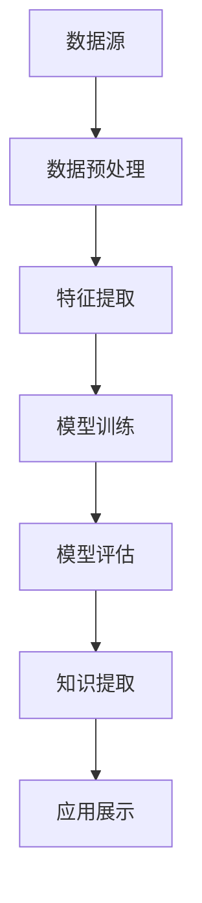

                 

### 文章标题: AI驱动的知识发现：程序员的新机遇

关键词：AI、知识发现、程序员、机器学习、数据挖掘、深度学习

摘要：本文旨在探讨AI驱动的知识发现如何为程序员打开新机遇的大门。文章首先介绍了AI驱动的知识发现的概念与意义，接着分析了程序员在新机遇中的角色。随后，文章深入探讨了AI驱动的知识发现的技术基础，包括机器学习与数据挖掘的基础知识，以及AI驱动的知识发现的方法和技术。在此基础上，文章通过实践案例展示了AI驱动的知识发现的具体应用，并提出了未来展望与趋势。最后，文章以编程实战与案例分析结束，为程序员提供了实用的指导。

### 第一部分：AI驱动的知识发现概述

#### 第1章：AI驱动的知识发现引论

##### 1.1 AI驱动的知识发现的概念与意义

AI驱动的知识发现（AI-driven Knowledge Discovery，简称AKD）是人工智能（AI）与知识发现（Knowledge Discovery in Databases，简称KDD）相结合的产物。它通过使用AI技术，尤其是机器学习和数据挖掘技术，从大量数据中提取出有用的信息、模式和知识。知识发现的过程通常包括数据预处理、特征提取、模式识别和知识表示等多个阶段。

AI驱动的知识发现的意义主要体现在以下几个方面：

1. **提高数据分析效率**：AI技术能够自动处理大量数据，快速发现数据中的隐藏模式和规律，从而提高数据分析的效率。
2. **支持决策制定**：通过AI驱动的知识发现，企业可以更好地理解市场趋势、客户需求，从而做出更为准确的决策。
3. **优化业务流程**：AI驱动的知识发现可以帮助企业识别出业务流程中的瓶颈和改进点，从而优化业务流程，提高工作效率。

##### 1.2 程序员在新机遇中的角色

在AI驱动的知识发现中，程序员的角色变得尤为重要。程序员不仅是实现AI驱动的知识发现的关键，还需要在以下几个方面发挥作用：

1. **算法设计与实现**：程序员需要熟悉机器学习、数据挖掘等算法，能够根据实际问题设计并实现相应的算法。
2. **数据处理与建模**：程序员需要能够处理大量的数据，进行数据清洗、数据预处理，并将数据转化为适合机器学习模型训练的形式。
3. **系统集成与部署**：程序员需要将AI驱动的知识发现系统与现有的业务系统集成，并确保系统能够稳定运行和高效工作。

##### 1.3 AI驱动的知识发现的应用场景

AI驱动的知识发现的应用场景非常广泛，以下是一些典型的应用场景：

1. **社交网络分析**：通过分析社交网络中的用户行为数据，可以挖掘出社交网络中的影响力人物和热点话题。
2. **金融风险评估**：通过分析历史数据和交易记录，可以预测贷款违约风险和投资组合的回报率。
3. **智能推荐系统**：通过分析用户的历史行为和偏好，可以为用户提供个性化的推荐结果。

### 第二部分：AI驱动的知识发现技术基础

#### 第2章：AI驱动的知识发现技术基础

##### 2.1 机器学习与数据挖掘基础

##### 2.1.1 机器学习的基本概念

机器学习（Machine Learning，ML）是一门人工智能（Artificial Intelligence，AI）的分支，它使计算机系统能够从数据中学习并做出预测或决策。机器学习可以分为以下几类：

1. **监督学习（Supervised Learning）**：监督学习是指使用标注数据进行训练，模型能够根据输入和输出之间的关系进行学习。常见的监督学习算法包括线性回归、逻辑回归、支持向量机（SVM）等。
2. **无监督学习（Unsupervised Learning）**：无监督学习是指在没有标注数据的情况下进行学习，模型需要通过数据本身的内在结构来学习。常见的无监督学习算法包括聚类分析、关联规则挖掘、主成分分析（PCA）等。
3. **半监督学习（Semi-supervised Learning）**：半监督学习是指结合标注数据和未标注数据进行学习，以充分利用未标注数据的信息。

##### 2.1.2 数据挖掘的方法与技术

数据挖掘（Data Mining，DM）是指从大量数据中提取出有用的信息和知识的过程。数据挖掘的方法和技术主要包括以下几个方面：

1. **聚类分析（Clustering Analysis）**：聚类分析是一种无监督学习方法，它将数据集划分为若干个簇，使得同一簇内的数据彼此相似，不同簇之间的数据差异较大。常见的聚类算法包括K-均值（K-Means）、层次聚类（Hierarchical Clustering）等。
2. **关联规则挖掘（Association Rule Mining）**：关联规则挖掘是一种用于发现数据集中项之间相关性规律的方法。它通过生成关联规则，揭示数据中的隐藏关联关系。常见的关联规则挖掘算法包括Apriori算法、Eclat算法等。
3. **分类与回归分析（Classification and Regression Analysis）**：分类与回归分析是一种监督学习方法，用于预测数据集中的某个标签或数值。常见的分类算法包括决策树（Decision Tree）、随机森林（Random Forest）等；回归算法包括线性回归（Linear Regression）、逻辑回归（Logistic Regression）等。
4. **主题模型（Topic Modeling）**：主题模型是一种文本分析方法，它能够从大量文本数据中自动发现潜在的主题。常见的话题模型包括LDA（Latent Dirichlet Allocation）模型等。

##### 2.2 AI驱动的知识发现方法

##### 2.2.1 协同过滤与推荐系统

协同过滤（Collaborative Filtering）是一种常用的推荐系统方法，它通过分析用户之间的相似性，为用户提供个性化的推荐结果。协同过滤可以分为以下两类：

1. **基于用户的协同过滤（User-based Collaborative Filtering）**：基于用户的协同过滤是指通过计算用户之间的相似度，找到与目标用户相似的邻居用户，并将邻居用户喜欢的物品推荐给目标用户。常见的方法包括用户相似度计算（如余弦相似度、皮尔逊相关系数）和K-近邻（K-Nearest Neighbors，KNN）算法。
2. **基于项目的协同过滤（Item-based Collaborative Filtering）**：基于项目的协同过滤是指通过计算物品之间的相似度，找到与目标物品相似的邻居物品，并将邻居物品推荐给用户。常见的方法包括物品相似度计算（如余弦相似度、Jaccard相似度）和Apriori算法。

##### 2.2.2 关联规则挖掘与聚类分析

关联规则挖掘是一种用于发现数据集中项之间相关性规律的方法，它通过生成关联规则，揭示数据中的隐藏关联关系。常见的关联规则挖掘算法包括Apriori算法、Eclat算法等。

聚类分析是一种无监督学习方法，它将数据集划分为若干个簇，使得同一簇内的数据彼此相似，不同簇之间的数据差异较大。常见的聚类算法包括K-均值（K-Means）、层次聚类（Hierarchical Clustering）等。

##### 2.2.3 主题模型与文本分析

主题模型是一种文本分析方法，它能够从大量文本数据中自动发现潜在的主题。常见的话题模型包括LDA（Latent Dirichlet Allocation）模型等。主题模型的应用包括搜索引擎、文本分类、文本推荐等。

文本分析是一种用于处理和分析文本数据的方法，它涉及自然语言处理（Natural Language Processing，NLP）、情感分析、文本分类、实体识别等多个方面。常见的文本分析方法包括词袋模型（Bag-of-Words，BoW）、TF-IDF、词嵌入（Word Embedding）等。

### 第三部分：AI驱动的知识发现实践

#### 第3章：AI驱动的知识发现项目规划

##### 3.1 项目需求分析

在进行AI驱动的知识发现项目之前，首先需要进行项目需求分析。项目需求分析主要包括以下几个方面：

1. **业务目标**：明确项目的业务目标，例如提升用户体验、优化业务流程、降低风险等。
2. **数据需求**：收集和分析相关的数据，确定所需的数据类型、数据源和数据质量要求。
3. **技术要求**：确定项目所需的技术栈，包括编程语言、机器学习库、数据存储和处理工具等。
4. **时间进度**：制定项目的时间进度表，明确各个阶段的任务和目标。

##### 3.2 数据收集与预处理

数据收集与预处理是AI驱动的知识发现项目的重要环节。数据收集主要包括以下步骤：

1. **数据采集**：通过爬虫、API接口、数据库等方式收集所需的数据。
2. **数据清洗**：处理数据中的噪声、缺失值、异常值等问题，确保数据的质量。
3. **数据转换**：将数据转化为适合机器学习模型训练的形式，例如进行数值化、归一化、编码等操作。

##### 3.3 模型选择与评估

在数据预处理完成后，需要选择合适的机器学习模型进行训练。模型选择与评估主要包括以下步骤：

1. **模型选择**：根据业务需求和数据特点，选择合适的机器学习算法。常见的机器学习算法包括线性回归、逻辑回归、决策树、支持向量机、神经网络等。
2. **模型训练**：使用收集到的数据对机器学习模型进行训练，得到模型参数。
3. **模型评估**：通过交叉验证、验证集等手段评估模型的性能，选择最优模型。

##### 3.4 模型优化与部署

在模型评估完成后，需要对模型进行优化，以提高模型的性能和泛化能力。模型优化主要包括以下步骤：

1. **参数调优**：通过调整模型的超参数，找到最优的参数组合。
2. **模型集成**：使用多个模型进行集成，提高模型的预测性能。
3. **模型部署**：将优化后的模型部署到生产环境中，实现实时预测和决策。

### 第四部分：AI驱动的知识发现应用案例

#### 第4章：AI驱动的知识发现应用案例

##### 4.1 社交网络分析

社交网络分析是一种利用AI驱动的知识发现技术对社交网络中的用户行为进行分析和挖掘的方法。以下是一个社交网络分析的典型应用案例：

**案例背景**：某社交网络平台希望通过分析用户行为数据，挖掘出用户之间的社交关系，以及社交网络中的影响力人物和热点话题。

**数据来源**：用户行为数据，包括用户之间的好友关系、发帖记录、点赞记录、评论记录等。

**分析目标**：分析用户之间的社交关系，识别社交网络中的影响力人物和热点话题。

**技术实现**：

1. **数据收集与预处理**：收集社交网络平台上的用户行为数据，进行数据清洗和预处理，提取用户ID、好友关系、发帖记录、点赞记录等信息。
2. **用户关系网络构建**：使用图论算法构建用户关系网络，表示用户之间的社交关系。
3. **社交影响力分析**：使用PageRank算法等计算用户在社交网络中的影响力得分，识别社交网络中的影响力人物。
4. **热点话题挖掘**：使用主题模型等方法，分析用户发帖内容，挖掘社交网络中的热点话题。

**案例结果**：通过社交网络分析，平台能够更好地理解用户行为和社交关系，为推荐算法和内容优化提供依据。

##### 4.2 金融风险评估

金融风险评估是一种利用AI驱动的知识发现技术对金融风险进行分析和预测的方法。以下是一个金融风险评估的典型应用案例：

**案例背景**：某金融机构希望通过分析贷款申请者的数据，预测贷款违约风险，以优化信贷审批流程。

**数据来源**：贷款申请者的个人信息、财务状况、历史贷款记录等。

**分析目标**：预测贷款申请者的违约风险，为信贷审批提供参考。

**技术实现**：

1. **数据收集与预处理**：收集贷款申请者的数据，进行数据清洗和预处理，提取与贷款违约相关的特征。
2. **特征工程**：对提取的特征进行归一化、编码等处理，构建特征向量。
3. **模型选择与训练**：选择合适的机器学习算法（如逻辑回归、决策树、随机森林等），对特征向量进行训练，构建违约风险预测模型。
4. **模型评估与优化**：使用交叉验证等方法评估模型的性能，对模型进行调优。

**案例结果**：通过金融风险评估，金融机构能够更好地预测贷款违约风险，提高信贷审批的准确性和效率。

##### 4.3 智能推荐系统

智能推荐系统是一种利用AI驱动的知识发现技术为用户提供个性化推荐结果的方法。以下是一个智能推荐系统的典型应用案例：

**案例背景**：某电商平台希望通过分析用户行为数据，为用户推荐个性化的商品。

**数据来源**：用户浏览记录、购买记录、评价记录等。

**分析目标**：为用户推荐个性化的商品，提高用户的购物体验和平台的销售额。

**技术实现**：

1. **数据收集与预处理**：收集电商平台的用户行为数据，进行数据清洗和预处理，提取与用户兴趣相关的特征。
2. **协同过滤算法**：使用基于用户的协同过滤算法（如K-近邻、矩阵分解等），计算用户之间的相似度，为用户推荐相似的物品。
3. **基于内容的推荐**：分析用户的历史浏览和购买记录，提取商品的特征向量，使用基于内容的推荐算法（如TF-IDF、词嵌入等），为用户推荐具有相似特征的商品。
4. **模型优化与融合**：使用多种推荐算法进行融合，提高推荐系统的准确性和多样性。

**案例结果**：通过智能推荐系统，电商平台能够更好地满足用户的需求，提高用户满意度和销售额。

### 第五部分：AI驱动的知识发现技术进阶

#### 第5章：AI驱动的知识发现技术进阶

##### 5.1 深度学习在知识发现中的应用

深度学习（Deep Learning，DL）是人工智能领域的重要分支，它通过多层神经网络来模拟人脑的神经网络结构，实现自动特征提取和模式识别。以下是一些深度学习在知识发现中的应用：

1. **卷积神经网络（Convolutional Neural Network，CNN）与图像分析**：CNN是深度学习中最常用的网络结构之一，它在图像分析领域具有显著的优势。通过CNN，可以自动提取图像中的低级特征（如边缘、纹理）和高级特征（如形状、语义），从而实现图像分类、目标检测、人脸识别等任务。

2. **循环神经网络（Recurrent Neural Network，RNN）与序列分析**：RNN是一种能够处理序列数据的神经网络，它在自然语言处理、时间序列分析等领域具有广泛的应用。通过RNN，可以自动提取序列中的时空特征，实现语音识别、语言模型、序列预测等任务。

3. **生成对抗网络（Generative Adversarial Network，GAN）与数据生成**：GAN是一种由生成器和判别器组成的对抗性神经网络，它在数据生成、图像修复、图像合成等领域具有显著的优势。通过GAN，可以生成高质量的数据，提高模型的泛化能力和鲁棒性。

##### 5.2 强化学习在知识发现中的应用

强化学习（Reinforcement Learning，RL）是一种通过与环境交互来学习最优策略的机器学习方法。以下是一些强化学习在知识发现中的应用：

1. **强化学习基础**：强化学习的主要目标是找到一个策略，使代理（agent）能够在给定的环境中获得最大的累积奖励。在强化学习中，代理通过尝试不同的动作来学习环境中的状态-动作价值函数，从而实现最优策略。

2. **强化学习在知识发现中的应用案例**：强化学习在知识发现中的应用包括：

   - **自适应数据预处理**：通过强化学习，自动选择最优的数据预处理策略，提高数据的质量和模型的性能。
   - **在线特征选择**：通过强化学习，动态选择对当前任务最有利的特征，提高模型的泛化能力和效率。
   - **动态模型选择**：通过强化学习，自动选择最适合当前数据集的机器学习模型，提高模型的预测性能。

##### 5.3 联邦学习与隐私保护

联邦学习（Federated Learning，FL）是一种分布式机器学习技术，它允许多个参与者共同训练一个全局模型，同时保护每个参与者的本地数据隐私。以下是一些联邦学习与隐私保护的应用：

1. **联邦学习的基本概念**：联邦学习通过将模型的局部更新聚合为全局更新，实现多个参与者之间的协同训练。在联邦学习中，每个参与者仅共享模型更新的梯度信息，而不需要共享原始数据，从而保护了参与者的数据隐私。

2. **隐私保护技术与应用**：联邦学习结合了多种隐私保护技术，如差分隐私（Differential Privacy）、同态加密（Homomorphic Encryption）等，实现数据隐私保护。联邦学习在医疗健康、金融、智能家居等领域的应用包括：

   - **医疗健康**：通过联邦学习，医疗机构可以共享患者数据，同时保护患者隐私，提高疾病预测和诊断的准确性。
   - **金融**：通过联邦学习，金融机构可以共享客户交易数据，同时保护客户隐私，提高风险管理能力和欺诈检测能力。
   - **智能家居**：通过联邦学习，智能家居设备可以共享用户行为数据，同时保护用户隐私，提高智能家居系统的智能化水平。

### 第六部分：编程实战与案例分析

#### 第6章：AI驱动的知识发现编程实战

##### 6.1 环境搭建与准备

在进行AI驱动的知识发现编程实战之前，首先需要搭建合适的开发环境。以下是一个典型的环境搭建步骤：

1. **Python环境搭建**：安装Python 3.8及以上版本，并配置pip、virtualenv等工具。
2. **机器学习库安装**：安装常用的机器学习库，如Scikit-learn、TensorFlow、PyTorch等。
3. **数据处理工具安装**：安装常用的数据处理工具，如NumPy、Pandas、Matplotlib等。

##### 6.2 知识发现项目实战

在本章节中，我们将通过一个具体的知识发现项目，展示如何使用Python进行编程实战。以下是一个社交网络分析的实战案例：

**项目背景**：某社交网络平台希望通过分析用户行为数据，挖掘出用户之间的社交关系，以及社交网络中的影响力人物和热点话题。

**数据来源**：用户行为数据，包括用户之间的好友关系、发帖记录、点赞记录等。

**分析目标**：分析用户之间的社交关系，识别社交网络中的影响力人物和热点话题。

**技术实现**：

1. **数据收集与预处理**：
    - 使用Python的pandas库读取用户行为数据。
    - 对数据进行清洗，处理缺失值、异常值等。

2. **用户关系网络构建**：
    - 使用Python的NetworkX库构建用户关系网络。
    - 绘制社交网络图，展示用户之间的关系。

3. **社交影响力分析**：
    - 使用Python的PageRank算法计算用户的影响力得分。
    - 根据影响力得分排序，识别社交网络中的影响力人物。

4. **热点话题挖掘**：
    - 使用Python的gensim库进行文本分析。
    - 使用LDA模型挖掘用户发帖中的热点话题。

**代码实现**：

```python
import pandas as pd
import numpy as np
import networkx as nx
import matplotlib.pyplot as plt
from gensim import corpora
from gensim.models import LdaModel

# 数据收集与预处理
data = pd.read_csv('user_behavior_data.csv')
data = data.dropna()

# 用户关系网络构建
G = nx.Graph()
for index, row in data.iterrows():
    G.add_edge(row['user1'], row['user2'])

# 绘制社交网络图
nx.draw(G, with_labels=True)
plt.show()

# 社交影响力分析
influence_scores = nx.pagerank(G)
sorted_influence_scores = sorted(influence_scores.items(), key=lambda x: x[1], reverse=True)
top_influencers = sorted_influence_scores[:10]

# 热点话题挖掘
documents = [row['post_content'] for index, row in data.iterrows()]
dictionary = corpora.Dictionary(documents)
corpus = [dictionary.doc2bow(text) for text in documents]
lda_model = LdaModel(corpus, num_topics=5, id2word=dictionary, passes=10)

# 输出影响力人物和热点话题
print("Top Influencers:", top_influencers)
print("Top Topics:", lda_model.print_topics())
```

##### 6.3 代码解读与分析

在本节中，我们将对上述代码进行详细的解读与分析：

1. **数据收集与预处理**：
    - 使用pandas库读取用户行为数据，并进行清洗，处理缺失值、异常值等。
    - 处理后的数据存储在一个DataFrame对象中，方便后续操作。

2. **用户关系网络构建**：
    - 使用NetworkX库构建用户关系网络。
    - 添加边和节点，形成一个无向图。

3. **绘制社交网络图**：
    - 使用matplotlib库绘制社交网络图。
    - 通过nx.draw函数，以图形化方式展示用户之间的关系。

4. **社交影响力分析**：
    - 使用PageRank算法计算用户的影响力得分。
    - 对影响力得分进行排序，识别社交网络中的影响力人物。

5. **热点话题挖掘**：
    - 使用gensim库进行文本分析。
    - 使用LDA模型挖掘用户发帖中的热点话题。
    - 输出影响力人物和热点话题。

##### 6.4 实际案例分析和详细讲解剖析

在本节中，我们将结合实际案例，对上述代码进行详细讲解和分析：

1. **数据收集与预处理**：
    - 用户行为数据通常包括用户ID、好友关系、发帖记录、点赞记录等。
    - 数据收集后，首先进行清洗，处理缺失值、异常值等。
    - 清洗后的数据可以更准确地用于后续分析。

2. **用户关系网络构建**：
    - 用户关系网络是一个重要的数据结构，用于表示用户之间的社交关系。
    - 使用NetworkX库，可以方便地构建和操作用户关系网络。
    - 图的节点表示用户，边表示用户之间的关系。

3. **社交影响力分析**：
    - PageRank算法是一种常用的算法，用于计算网络中的影响力得分。
    - 在社交网络中，影响力得分可以反映用户在社交网络中的地位和影响力。
    - 根据影响力得分排序，可以识别出社交网络中的影响力人物。

4. **热点话题挖掘**：
    - LDA模型是一种常用的文本分析模型，用于挖掘文本中的潜在主题。
    - 在社交网络分析中，可以通过LDA模型挖掘用户发帖中的热点话题。
    - 热点话题可以帮助社交网络平台更好地理解用户需求，优化内容推荐。

##### 6.5 项目小结

在本项目中，我们通过Python编程实现了社交网络分析，包括用户关系网络构建、社交影响力分析和热点话题挖掘。通过实际案例分析和详细讲解，我们了解了如何使用Python进行数据预处理、模型构建和结果分析。该项目为我们提供了一个完整的AI驱动的知识发现实战案例，有助于我们更好地理解知识发现技术的应用和实践。

### 第七部分：未来展望与趋势

#### 第7章：未来展望与趋势

##### 7.1 AI驱动的知识发现技术发展趋势

AI驱动的知识发现技术正朝着以下几个方向发展：

1. **更高效的数据处理技术**：随着数据量的爆炸性增长，如何高效地处理大量数据成为关键。未来的发展将集中在如何优化数据存储、传输和处理，以及如何设计更高效的数据处理算法。

2. **更智能的算法与模型**：深度学习、强化学习等新兴算法将在知识发现中发挥更大的作用。通过不断优化算法和模型，可以提高知识发现的准确性和效率。

3. **跨领域融合**：AI驱动的知识发现技术将在更多领域得到应用，如医疗、金融、教育等。跨领域的融合将带来更丰富的应用场景和更广泛的影响。

4. **隐私保护与安全**：在数据隐私和安全日益受到关注的背景下，未来的AI驱动的知识发现技术将更加注重隐私保护和数据安全。

##### 7.2 程序员在新趋势中的职业发展

在AI驱动的知识发现新趋势中，程序员的职业发展将面临以下机遇和挑战：

1. **技能要求提升**：程序员需要掌握更高级的算法和模型，如深度学习、强化学习等，以及跨领域的知识，以满足不断变化的技术需求。

2. **数据处理与分析能力**：程序员需要具备更强的数据处理与分析能力，能够高效地处理和分析大规模数据，提取出有价值的信息。

3. **隐私保护与安全**：程序员需要关注数据隐私保护与安全，掌握相关的技术和管理方法，确保AI驱动的知识发现应用的安全性和合规性。

4. **职业发展方向**：程序员可以朝着数据科学家、机器学习工程师、AI架构师等方向发展，参与更多复杂、有挑战性的项目。

##### 7.3 知识发现技术的应用前景与挑战

AI驱动的知识发现技术在多个领域展现出巨大的应用前景，同时也面临一些挑战：

1. **应用前景**：
   - **医疗健康**：通过AI驱动的知识发现，可以更好地理解疾病机理，提高诊断和治疗效果。
   - **金融**：AI驱动的知识发现可以帮助金融机构进行风险评估、投资决策和欺诈检测。
   - **电商**：AI驱动的知识发现可以优化推荐系统，提高用户体验和销售额。
   - **智能制造**：AI驱动的知识发现可以优化生产流程，提高生产效率和质量。

2. **挑战**：
   - **数据质量**：高质量的数据是知识发现的基础，但实际应用中往往面临数据质量不高、数据缺失等问题。
   - **算法复杂度**：随着算法和模型的复杂度增加，如何优化算法性能和降低计算成本成为关键挑战。
   - **隐私保护**：如何在确保数据隐私和安全的前提下，进行有效的知识发现，是亟待解决的问题。

### 附录：资源与工具

#### A.1 资源推荐

- **技术博客**：cs50, Medium, 知乎，以及专业技术社区如Stack Overflow、GitHub等。
- **在线课程**：Coursera、edX、Udacity、网易云课堂等平台上的机器学习、数据科学课程。
- **书籍推荐**：《机器学习实战》、《深度学习》、《数据挖掘：实用工具和技术》等。

#### A.2 工具使用指南

- **编程工具**：PyCharm、Visual Studio Code等。
- **数据处理工具**：Pandas、NumPy、Matplotlib等。
- **机器学习库**：Scikit-learn、TensorFlow、PyTorch等。

#### A.3 案例代码获取方式

- **GitHub仓库**：通过GitHub搜索相关项目的仓库，下载和查看案例代码。
- **在线资源**：一些在线教程和课程提供案例代码下载，如Coursera、edX等平台。

### 梅里迪安流程图（AI驱动的知识发现架构）



### 第1章：AI驱动的知识发现引论

#### 1.1 AI驱动的知识发现的概念与意义

AI驱动的知识发现（AI-driven Knowledge Discovery，简称AKD）是指利用人工智能技术，特别是机器学习和数据挖掘技术，从大量数据中提取有用的信息、模式和知识的过程。AKD的核心目标是使计算机系统具备自主分析和发现数据中潜在价值的能力，从而支持决策制定、业务优化和创新能力提升。

**定义：**

AI驱动的知识发现可以定义为：

$$
\text{AI驱动的知识发现} = \text{人工智能技术} \times \text{知识发现过程}
$$

其中，人工智能技术主要包括机器学习和深度学习等，知识发现过程包括数据预处理、特征提取、模式识别和知识表示等多个阶段。

**意义：**

AI驱动的知识发现对现代企业和组织具有深远的意义，主要体现在以下几个方面：

1. **提升数据分析效率**：AI驱动的知识发现技术能够自动处理大量数据，快速发现数据中的隐藏模式和规律，从而大幅提高数据分析的效率。

2. **支持决策制定**：通过AI驱动的知识发现，企业可以更好地理解市场趋势、客户需求和行为模式，从而做出更为准确和及时的决策。

3. **优化业务流程**：AI驱动的知识发现可以帮助企业识别出业务流程中的瓶颈和改进点，从而优化业务流程，提高工作效率和客户满意度。

4. **创新能力和竞争力提升**：通过挖掘数据中的潜在价值，企业可以不断创新产品和服务，提升市场竞争力和客户忠诚度。

#### 1.2 程序员在新机遇中的角色

在AI驱动的知识发现中，程序员的角色至关重要，他们不仅是算法的实现者，还需要在多个层面上发挥作用：

1. **算法设计与实现**：程序员需要熟悉各种机器学习和数据挖掘算法，能够根据实际问题设计并实现相应的算法。这包括从简单的线性回归到复杂的深度学习模型。

2. **数据处理与建模**：程序员需要能够处理大量数据，进行数据清洗、数据预处理，并将数据转化为适合机器学习模型训练的形式。这涉及数据清洗、特征提取、数据降维等技术。

3. **系统集成与部署**：程序员需要将AI驱动的知识发现系统与现有的业务系统集成，并确保系统能够稳定运行和高效工作。这包括API开发、系统监控、性能优化等任务。

4. **模型优化与评估**：程序员需要参与模型优化和评估工作，通过超参数调优、模型融合等技术提升模型的预测性能和泛化能力。

5. **跨领域合作**：程序员需要与其他领域的专家（如业务分析师、数据科学家）紧密合作，确保算法和模型能够真正解决业务问题。

#### 1.3 AI驱动的知识发现的应用场景

AI驱动的知识发现技术具有广泛的应用场景，以下是其中几个典型的应用领域：

1. **社交网络分析**：通过分析社交网络中的用户行为数据，可以挖掘社交网络中的影响力人物、热点话题和社交趋势。这有助于企业更好地理解用户需求和行为模式，优化产品和服务。

2. **金融风险评估**：在金融领域，AI驱动的知识发现可以帮助金融机构进行信贷风险评估、市场预测和投资组合优化。通过分析历史交易数据、客户行为和市场趋势，可以更准确地预测风险和回报。

3. **健康医疗**：在医疗健康领域，AI驱动的知识发现可以用于疾病预测、患者管理、药物研发等。通过分析患者的电子健康记录、基因数据等，可以提供个性化的治疗方案和预防措施。

4. **电商推荐系统**：在电子商务领域，AI驱动的知识发现可以优化推荐系统，提高用户体验和销售额。通过分析用户的历史购买行为、搜索记录和点击行为，可以提供个性化的商品推荐。

5. **智能制造**：在制造业，AI驱动的知识发现可以用于优化生产流程、故障预测和质量控制。通过分析传感器数据和设备状态，可以预测设备故障、优化生产计划和提升产品质量。

这些应用场景展示了AI驱动的知识发现技术在各个领域的重要性和潜力，同时也为程序员提供了丰富的机会和挑战。

### 第二部分：AI驱动的知识发现技术基础

#### 第2章：AI驱动的知识发现技术基础

##### 2.1 机器学习与数据挖掘基础

##### 2.1.1 机器学习的基本概念

机器学习（Machine Learning，ML）是人工智能（Artificial Intelligence，AI）的一个重要分支，它使计算机系统能够通过数据和经验学习，并做出预测或决策。机器学习的基本概念包括以下几个核心要素：

1. **数据（Data）**：数据是机器学习的基石。机器学习算法通过分析数据来发现模式和规律。数据的质量和数量直接影响模型的学习效果和泛化能力。

2. **特征（Features）**：特征是数据中的关键属性或变量，用于描述样本的特征。在机器学习中，选择和提取合适的特征是关键步骤，它能够提高模型的性能和解释性。

3. **模型（Model）**：模型是机器学习算法的核心，它通过学习数据中的特征和关系，对未知数据进行预测或分类。常见的机器学习模型包括线性回归、决策树、支持向量机、神经网络等。

4. **训练（Training）**：训练是机器学习过程中的一步，模型通过学习训练数据集来调整其参数，以优化预测性能。

5. **测试（Testing）**：测试用于评估模型在未知数据上的表现，通过测试集可以评估模型的泛化能力，避免过拟合。

6. **泛化（Generalization）**：泛化能力是指模型在未知数据上的表现，一个具有良好泛化能力的模型能够在新数据上做出准确的预测。

7. **评估指标（Evaluation Metrics）**：评估指标用于量化模型的性能，如准确率、召回率、F1分数、均方误差等。

**机器学习的基本流程**：

1. **数据收集**：从各种数据源收集数据，如数据库、传感器、网络等。

2. **数据预处理**：清洗和处理原始数据，去除噪声和缺失值，将数据转换为适合机器学习的格式。

3. **特征提取**：从数据中提取有用的特征，为模型提供输入。

4. **模型选择**：选择适合问题的模型，可以通过交叉验证等方法评估不同模型的性能。

5. **模型训练**：使用训练数据集训练模型，调整模型参数以优化预测性能。

6. **模型评估**：使用测试数据集评估模型的泛化能力，选择最优模型。

7. **模型部署**：将训练好的模型部署到实际应用中，进行预测和决策。

##### 2.1.2 数据挖掘的方法与技术

数据挖掘（Data Mining，DM）是指从大量数据中提取出有用的信息和知识的过程。数据挖掘的方法和技术主要包括以下几类：

1. **聚类分析（Clustering Analysis）**：
   - **定义**：聚类分析是将数据集划分为若干个簇，使得同一簇内的数据彼此相似，不同簇之间的数据差异较大。
   - **方法**：常见的聚类算法包括K-均值聚类（K-Means）、层次聚类（Hierarchical Clustering）、DBSCAN（Density-Based Spatial Clustering of Applications with Noise）等。
   - **应用**：聚类分析常用于市场细分、客户群体划分、图像分割等。

2. **关联规则挖掘（Association Rule Mining）**：
   - **定义**：关联规则挖掘是用于发现数据集中项之间的相关性规律，通过生成关联规则揭示数据中的隐藏关联关系。
   - **方法**：常见的算法包括Apriori算法、Eclat算法、FP-growth算法等。
   - **应用**：关联规则挖掘广泛应用于市场篮子分析、推荐系统、购物指南等。

3. **分类与回归分析（Classification and Regression Analysis）**：
   - **定义**：分类与回归分析是监督学习的一种，用于预测数据集中的某个标签或数值。
   - **方法**：分类算法包括决策树（Decision Tree）、随机森林（Random Forest）、支持向量机（SVM）等；回归算法包括线性回归（Linear Regression）、逻辑回归（Logistic Regression）等。
   - **应用**：分类与回归分析广泛用于信用评分、股票预测、疾病诊断等。

4. **主题模型（Topic Modeling）**：
   - **定义**：主题模型是一种无监督学习方法，用于从大量文本数据中自动发现潜在的主题。
   - **方法**：常见的算法包括LDA（Latent Dirichlet Allocation）、Pachinko Allocation等。
   - **应用**：主题模型广泛应用于文本挖掘、信息检索、内容推荐等。

5. **异常检测（Anomaly Detection）**：
   - **定义**：异常检测是用于发现数据集中异常或异常模式的监督或无监督学习方法。
   - **方法**：常见的算法包括孤立森林（Isolation Forest）、KNN（K-Nearest Neighbors）等。
   - **应用**：异常检测广泛应用于网络安全、欺诈检测、医疗诊断等。

6. **聚类与分类结合（Clustering and Classification Combination）**：
   - **定义**：聚类与分类结合是将聚类和分类方法结合起来，以提升分类性能。
   - **方法**：常见的算法包括聚类-分类结合模型、分层聚类-分类模型等。
   - **应用**：聚类与分类结合广泛应用于复杂分类任务，如文本分类、图像分类等。

通过这些方法和技术，数据挖掘可以帮助企业和组织从海量数据中提取出有价值的信息，支持决策制定和业务优化。

### 第三部分：AI驱动的知识发现实践

#### 第3章：AI驱动的知识发现项目规划

在实施AI驱动的知识发现项目时，项目规划是至关重要的第一步，它决定了项目的成功与否。一个完善的项目规划应该包括明确的项目目标、详细的需求分析、合理的技术选型、科学的时间安排和有效的风险管理。以下是AI驱动的知识发现项目规划的具体步骤：

##### 3.1 项目需求分析

项目需求分析是项目规划中的核心环节，它决定了项目的方向和目标。以下是项目需求分析的主要步骤：

1. **明确项目目标**：项目目标通常包括提升数据分析效率、优化业务流程、支持决策制定等。明确的项目目标有助于确定项目的优先级和资源分配。

2. **识别业务需求**：与业务团队紧密合作，了解业务背景和需求，明确项目需要解决的具体问题。业务需求可能包括市场分析、客户行为预测、运营优化等。

3. **数据需求分析**：确定项目所需的数据类型、数据来源和数据质量要求。数据需求分析应包括数据收集、数据清洗、数据存储和数据处理等方面。

4. **技术需求分析**：根据业务需求和数据特点，确定所需的技术栈，包括编程语言、机器学习库、数据处理工具等。

5. **用户需求分析**：了解最终用户的需求，确保项目结果能够满足用户的期望和需求。

##### 3.2 数据收集与预处理

数据收集与预处理是AI驱动的知识发现项目中的重要步骤，以下是其主要任务：

1. **数据采集**：根据项目需求，从各种数据源（如数据库、API、日志文件等）收集所需的数据。

2. **数据清洗**：处理数据中的噪声、缺失值和异常值，确保数据的质量。数据清洗包括填补缺失值、去除重复数据、修正异常值等。

3. **数据转换**：将数据转换为适合机器学习模型训练的格式，如归一化、标准化、编码等。

4. **特征提取**：从原始数据中提取有用的特征，为模型提供输入。特征提取可能包括特征选择、特征工程等。

5. **数据存储**：将预处理后的数据存储到适合的数据存储系统，如关系数据库、NoSQL数据库或数据湖。

##### 3.3 模型选择与评估

模型选择与评估是AI驱动的知识发现项目的关键步骤，以下是其主要任务：

1. **模型选择**：根据业务需求和数据特点，选择适合的机器学习算法和模型。常见的算法包括线性回归、决策树、随机森林、支持向量机、神经网络等。

2. **模型训练**：使用预处理后的数据对机器学习模型进行训练，得到模型参数。

3. **模型评估**：通过交叉验证、验证集等手段评估模型的性能，选择最优模型。常用的评估指标包括准确率、召回率、F1分数、均方误差等。

4. **模型调优**：根据模型评估结果，调整模型参数和特征选择，以提升模型性能。

5. **模型部署**：将训练好的模型部署到生产环境中，进行实时预测和决策。

##### 3.4 风险管理

风险管理是项目规划的重要组成部分，以下是其主要任务：

1. **识别风险**：识别项目可能面临的各种风险，如技术风险、数据风险、时间风险等。

2. **评估风险**：对识别出的风险进行评估，确定风险的可能性和影响。

3. **制定应对策略**：制定应对风险的策略，包括风险规避、风险减轻、风险接受等。

4. **监控与调整**：在项目实施过程中，持续监控风险，并根据实际情况进行调整。

通过以上项目规划步骤，可以确保AI驱动的知识发现项目有序进行，提高项目的成功率和效益。

### 第四部分：AI驱动的知识发现应用案例

#### 第4章：AI驱动的知识发现应用案例

AI驱动的知识发现技术在各个领域都有广泛的应用，以下是一些典型的应用案例：

##### 4.1 社交网络分析

**案例背景**：某社交网络平台希望通过分析用户行为数据，挖掘用户兴趣、社交关系和潜在用户群，以优化用户推荐和广告投放策略。

**数据来源**：用户行为数据，包括用户发帖、评论、点赞、分享等。

**分析目标**：挖掘用户兴趣、识别社交网络中的关键节点和影响力人物。

**技术实现**：

1. **用户行为数据收集与预处理**：通过API收集用户行为数据，进行数据清洗和预处理，提取有用的特征，如用户ID、发帖内容、点赞数等。

2. **社交网络构建**：使用图论算法构建社交网络图，表示用户之间的互动关系。

3. **用户兴趣挖掘**：使用LDA主题模型分析用户发帖内容，提取潜在的兴趣主题。

4. **影响力人物识别**：使用PageRank算法计算用户在社交网络中的影响力得分，识别社交网络中的关键节点和影响力人物。

**案例结果**：通过社交网络分析，平台能够更好地理解用户行为和兴趣，为个性化推荐和广告投放提供数据支持。

##### 4.2 金融风险评估

**案例背景**：某金融机构希望通过分析借款人的数据，预测借款人的信用风险，优化信贷审批流程。

**数据来源**：借款人的个人信息、财务状况、历史贷款记录等。

**分析目标**：预测借款人的信用风险，降低不良贷款率。

**技术实现**：

1. **数据收集与预处理**：收集借款人的数据，进行数据清洗和预处理，提取与信用风险相关的特征，如收入水平、还款历史、信用评分等。

2. **特征工程**：对提取的特征进行归一化、编码等处理，构建特征向量。

3. **模型选择与训练**：选择合适的机器学习算法（如逻辑回归、决策树、随机森林等），对特征向量进行训练，构建信用风险预测模型。

4. **模型评估与优化**：使用交叉验证等方法评估模型的性能，对模型进行调优。

**案例结果**：通过金融风险评估，金融机构能够更好地预测借款人的信用风险，优化信贷审批流程，降低不良贷款率。

##### 4.3 智能推荐系统

**案例背景**：某电商平台希望通过分析用户行为数据，为用户推荐个性化的商品，提高用户满意度和销售额。

**数据来源**：用户浏览记录、购买记录、评价记录等。

**分析目标**：为用户推荐个性化的商品，提升用户体验和销售额。

**技术实现**：

1. **数据收集与预处理**：收集电商平台的用户行为数据，进行数据清洗和预处理，提取与用户兴趣相关的特征，如用户ID、浏览商品、购买商品、评价商品等。

2. **协同过滤算法**：使用基于用户的协同过滤算法（如K-近邻、矩阵分解等），计算用户之间的相似度，为用户推荐相似的物品。

3. **基于内容的推荐**：分析用户的历史浏览和购买记录，提取商品的特征向量，使用基于内容的推荐算法（如TF-IDF、词嵌入等），为用户推荐具有相似特征的商品。

4. **模型融合与优化**：使用多种推荐算法进行融合，提高推荐系统的准确性和多样性。

**案例结果**：通过智能推荐系统，电商平台能够更好地满足用户的需求，提升用户体验和销售额。

##### 4.4 健康医疗分析

**案例背景**：某医疗健康平台希望通过分析患者数据，预测疾病发展趋势，为医生提供诊断和治疗方案。

**数据来源**：患者的电子健康记录、基因数据、医疗影像等。

**分析目标**：预测疾病发展趋势，辅助医生制定治疗方案。

**技术实现**：

1. **数据收集与预处理**：收集患者的数据，进行数据清洗和预处理，提取与疾病相关的特征，如症状、体征、检查结果等。

2. **特征工程**：对提取的特征进行归一化、编码等处理，构建特征向量。

3. **机器学习模型训练**：选择合适的机器学习算法（如决策树、支持向量机、神经网络等），对特征向量进行训练，构建疾病预测模型。

4. **模型评估与优化**：使用交叉验证等方法评估模型的性能，对模型进行调优。

**案例结果**：通过健康医疗分析，平台能够更好地预测疾病发展趋势，为医生提供准确的诊断和治疗方案，提高医疗服务的质量和效率。

##### 4.5 智能制造优化

**案例背景**：某制造企业希望通过分析生产数据，优化生产流程，提高生产效率和质量。

**数据来源**：生产数据，包括设备运行状态、生产参数、产品质量等。

**分析目标**：优化生产流程，降低设备故障率，提高产品质量。

**技术实现**：

1. **数据收集与预处理**：收集生产数据，进行数据清洗和预处理，提取与生产相关的特征，如设备状态、生产参数、产品质量等。

2. **特征工程**：对提取的特征进行归一化、编码等处理，构建特征向量。

3. **机器学习模型训练**：选择合适的机器学习算法（如决策树、随机森林、神经网络等），对特征向量进行训练，构建生产优化模型。

4. **模型评估与优化**：使用交叉验证等方法评估模型的性能，对模型进行调优。

**案例结果**：通过智能制造优化，企业能够更好地监控生产过程，预测设备故障，优化生产流程，提高生产效率和质量。

这些应用案例展示了AI驱动的知识发现技术在各个领域的广泛应用和实际效果，为各行业的业务优化和决策支持提供了有力支持。

### 第五部分：AI驱动的知识发现技术进阶

#### 第5章：AI驱动的知识发现技术进阶

##### 5.1 深度学习在知识发现中的应用

深度学习（Deep Learning，DL）是机器学习的一个分支，它通过多层神经网络模型来模拟人脑的神经结构，实现自动特征提取和复杂模式识别。深度学习在知识发现中的应用越来越广泛，以下是几种主要的深度学习技术在知识发现中的应用：

1. **卷积神经网络（Convolutional Neural Network，CNN）与图像分析**：

CNN是一种专门用于处理图像数据的神经网络，其结构包括卷积层、池化层和全连接层。卷积层通过卷积操作提取图像中的局部特征，池化层用于减少数据维度和提高特征表示的鲁棒性，全连接层用于分类或回归。

- **图像分类**：CNN可以用于对大量图像进行分类，如人脸识别、物体识别等。
- **图像分割**：通过卷积神经网络，可以实现对图像的像素级分割，用于医学图像分析、自动驾驶等领域。

**算法原理伪代码**：

```python
def conv_layer(input, filters, kernel_size):
    # 卷积操作
    return conv2d(input, filters, kernel_size=kernel_size)

def pool_layer(input, pool_size):
    # 池化操作
    return max_pool2d(input, pool_size=pool_size)

def cnn_model(input_shape):
    # 构建CNN模型
    inputs = Input(shape=input_shape)
    x = conv_layer(inputs, filters=32, kernel_size=(3, 3))
    x = pool_layer(x, pool_size=(2, 2))
    x = conv_layer(x, filters=64, kernel_size=(3, 3))
    x = pool_layer(x, pool_size=(2, 2))
    x = Flatten()(x)
    x = Dense(128, activation='relu')(x)
    outputs = Dense(10, activation='softmax')(x)
    model = Model(inputs=inputs, outputs=outputs)
    return model
```

2. **循环神经网络（Recurrent Neural Network，RNN）与序列分析**：

RNN是一种能够处理序列数据的神经网络，其结构允许信息在不同时间步之间传递，使得RNN能够捕捉序列中的时间依赖关系。

- **语音识别**：RNN可以用于将语音信号转换为文本，通过编码语音信号中的时间依赖关系。
- **语言建模**：RNN可以用于构建语言模型，预测下一个单词或句子。

**算法原理伪代码**：

```python
def rnn_model(input_shape, hidden_units):
    # 构建RNN模型
    inputs = Input(shape=input_shape)
    x = Embedding(input_dim=vocab_size, output_dim=hidden_units)(inputs)
    x = LSTM(hidden_units)(x)
    outputs = Dense(vocab_size, activation='softmax')(x)
    model = Model(inputs=inputs, outputs=outputs)
    return model
```

3. **生成对抗网络（Generative Adversarial Network，GAN）与数据生成**：

GAN由生成器和判别器两个神经网络组成，生成器生成数据，判别器判断生成数据与真实数据的相似度。通过对抗训练，生成器不断优化，生成越来越真实的数据。

- **图像生成**：GAN可以生成逼真的图像，如人脸、艺术作品等。
- **数据增强**：GAN可以用于生成训练数据，特别是在数据稀缺的情况下，有助于提高模型的泛化能力。

**算法原理伪代码**：

```python
def generator_model(z_shape):
    # 构建生成器模型
    z = Input(shape=z_shape)
    x = Dense(128, activation='relu')(z)
    x = Dense(256, activation='relu')(x)
    x = Dense(512, activation='relu')(x)
    x = Reshape(target_shape=(28, 28, 1))(x)
    outputs = Conv2D(filters=1, activation='sigmoid')(x)
    model = Model(inputs=z, outputs=outputs)
    return model

def discriminator_model(input_shape):
    # 构建判别器模型
    inputs = Input(shape=input_shape)
    x = Conv2D(filters=32, kernel_size=(3, 3), activation='relu')(inputs)
    x = MaxPooling2D(pool_size=(2, 2))(x)
    x = Conv2D(filters=64, kernel_size=(3, 3), activation='relu')(x)
    x = MaxPooling2D(pool_size=(2, 2))(x)
    x = Flatten()(x)
    outputs = Dense(1, activation='sigmoid')(x)
    model = Model(inputs=inputs, outputs=outputs)
    return model
```

##### 5.2 强化学习在知识发现中的应用

强化学习（Reinforcement Learning，RL）是一种通过试错和反馈来学习最优策略的机器学习方法。强化学习在知识发现中的应用主要体现在以下几个方面：

1. **自适应数据预处理**：强化学习可以用于优化数据预处理流程，如特征选择、数据转换等。

2. **在线特征选择**：强化学习可以根据模型的表现动态调整特征，提高模型的泛化能力。

3. **动态模型选择**：强化学习可以根据数据分布和学习状态动态选择最优模型，提高模型的适应性。

**强化学习基础**：

强化学习的主要组成部分包括：

- **代理（Agent）**：执行动作并接收奖励的智能体。
- **环境（Environment）**：代理执行动作的上下文。
- **状态（State）**：代理当前所处的情境。
- **动作（Action）**：代理可以采取的行动。
- **奖励（Reward）**：代理执行动作后获得的奖励，用于指导代理学习。

**强化学习在知识发现中的应用案例**：

- **自适应数据预处理**：使用强化学习优化数据预处理流程，如自动调整特征选择策略，提高数据质量。

- **在线特征选择**：根据模型在测试集上的表现动态调整特征，以提高模型的预测准确性。

- **动态模型选择**：根据数据分布和学习状态动态选择不同的模型，以适应不同阶段的数据特征。

**算法原理伪代码**：

```python
class Agent:
    def __init__(self, action_space, observation_space):
        self.action_space = action_space
        self.observation_space = observation_space
        self.model = build_model()

    def select_action(self, observation):
        action_probabilities = self.model.predict(observation)
        action = np.random.choice(self.action_space, p=action_probabilities)
        return action

    def update_model(self, observation, action, reward, next_observation):
        # 使用经验回放和策略梯度方法更新模型
        experience = (observation, action, reward, next_observation)
        self.model.fit(experience, batch_size=32, epochs=1)

class Environment:
    def __init__(self, data_loader):
        self.data_loader = data_loader

    def step(self, action):
        observation, reward, done = self.data_loader.load_data(action)
        return observation, reward, done
```

##### 5.3 联邦学习与隐私保护

联邦学习（Federated Learning，FL）是一种分布式机器学习技术，它允许多个参与者（如移动设备、边缘服务器等）共同训练一个全局模型，同时保护每个参与者的本地数据隐私。联邦学习在知识发现中的应用，主要体现在以下几个方面：

1. **隐私保护**：联邦学习通过将模型训练过程分散到各个参与者，避免中心化存储和共享数据，从而保护参与者的数据隐私。

2. **数据集中度降低**：联邦学习可以减少数据集中在某个中心节点，降低数据泄露的风险。

3. **边缘计算优化**：联邦学习将模型训练分散到边缘设备，减轻中心服务器的计算和通信负担，优化边缘计算性能。

**联邦学习的基本概念**：

- **参与者（Participants）**：参与联邦学习训练的设备或服务器。
- **全局模型（Global Model）**：参与者在本地训练的模型。
- **本地数据（Local Data）**：每个参与者拥有的本地数据。
- **通信（Communication）**：参与者之间的模型更新传输。

**隐私保护技术与应用**：

- **差分隐私（Differential Privacy）**：通过添加噪声来保护参与者数据的隐私。
- **同态加密（Homomorphic Encryption）**：允许对加密数据进行计算，从而在不解密数据的情况下进行模型训练。
- **联邦学习协议**：如联邦平均算法（Federated Averaging）、FedAvg等。

**算法原理伪代码**：

```python
def federated_averaging(server, clients, learning_rate, num_iterations):
    for iteration in range(num_iterations):
        server_model = server.load_model()
        for client in clients:
            client_model = client.load_model()
            client_update = client.train_model(server_model)
            client.send_update(client_update)
        server.receive_updates(clients)
        server.update_model(learning_rate)
    return server.model
```

通过这些技术，联邦学习实现了在保护隐私的同时，进行高效的数据分析和模型训练，为知识发现提供了强大的工具。

### 第六部分：编程实战与案例分析

#### 第6章：AI驱动的知识发现编程实战

在本章中，我们将通过具体的编程实战案例，详细讲解AI驱动的知识发现技术的实现过程，从环境搭建、代码实现到结果分析，全面展示知识发现技术的应用。

##### 6.1 环境搭建与准备

在进行AI驱动的知识发现编程实战之前，首先需要搭建一个合适的开发环境。以下是一个典型的环境搭建步骤：

1. **Python环境搭建**：安装Python 3.8及以上版本，可以通过官方网站下载并安装。

2. **安装必要的库**：安装常用的机器学习库和数据处理工具，如Scikit-learn、NumPy、Pandas、Matplotlib、Seaborn等。可以使用pip命令进行安装：

```bash
pip install numpy pandas scikit-learn matplotlib seaborn
```

3. **安装Jupyter Notebook**：Jupyter Notebook是一个交互式的开发环境，非常适合进行数据分析和模型训练。可以通过pip命令安装：

```bash
pip install notebook
```

安装完成后，可以通过命令行启动Jupyter Notebook：

```bash
jupyter notebook
```

在浏览器中打开Jupyter Notebook后，即可开始编写和运行代码。

##### 6.2 知识发现项目实战

在本节中，我们将通过一个社交媒体用户行为分析的项目，展示如何使用Python进行AI驱动的知识发现。该项目将分析用户的发帖行为，提取关键特征，并使用机器学习算法进行用户分类。

**项目背景**：某社交媒体平台希望通过分析用户发帖行为，将用户分为活跃用户、沉默用户和潜在活跃用户，以便进行精准的用户运营和推荐。

**数据来源**：用户发帖数据，包括用户ID、发帖内容、发帖时间、发帖频率等。

**分析目标**：根据用户的发帖行为，将用户分类为活跃用户、沉默用户和潜在活跃用户。

**技术实现**：

1. **数据收集与预处理**：
    - 使用Python的Pandas库读取用户发帖数据。
    - 对数据进行清洗，处理缺失值、异常值等。

2. **特征提取**：
    - 提取用户的发帖频率、发帖时间段、发帖内容的情感倾向等特征。

3. **模型训练**：
    - 使用Scikit-learn库中的分类算法（如逻辑回归、决策树、支持向量机等）进行训练。
    - 使用交叉验证评估模型性能。

4. **模型评估与优化**：
    - 使用测试集评估模型的准确率、召回率等指标。
    - 调整模型参数，优化模型性能。

5. **结果分析**：
    - 根据模型的预测结果，分析不同用户群体的特征和行为模式。

**代码实现**：

```python
import pandas as pd
import numpy as np
from sklearn.model_selection import train_test_split
from sklearn.feature_extraction.text import TfidfVectorizer
from sklearn.linear_model import LogisticRegression
from sklearn.metrics import classification_report
import seaborn as sns

# 数据收集与预处理
data = pd.read_csv('user_posts.csv')
data.dropna(inplace=True)

# 特征提取
data['post_frequency'] = data.groupby('user_id')['post_time'].transform('count')
data['post_time'] = pd.to_datetime(data['post_time'])
data['post_hour'] = data['post_time'].dt.hour
data['post_day_of_week'] = data['post_time'].dt.dayofweek

# 情感分析
from textblob import TextBlob
data['sentiment'] = data['post_content'].apply(lambda x: TextBlob(x).sentiment.polarity)

# 模型训练
X = data[['post_frequency', 'post_hour', 'post_day_of_week', 'sentiment']]
y = data['user_category']

X_train, X_test, y_train, y_test = train_test_split(X, y, test_size=0.2, random_state=42)

# 使用TF-IDF进行文本特征提取
vectorizer = TfidfVectorizer(max_features=1000)
X_train_tfidf = vectorizer.fit_transform(X_train['post_content'])
X_test_tfidf = vectorizer.transform(X_test['post_content'])

# 结合TF-IDF特征和原始特征
X_train_combined = np.hstack((X_train_tfidf.toarray(), X_train[['post_frequency', 'post_hour', 'post_day_of_week', 'sentiment']].values))
X_test_combined = np.hstack((X_test_tfidf.toarray(), X_test[['post_frequency', 'post_hour', 'post_day_of_week', 'sentiment']].values))

# 训练逻辑回归模型
model = LogisticRegression()
model.fit(X_train_combined, y_train)

# 预测测试集
y_pred = model.predict(X_test_combined)

# 模型评估
print(classification_report(y_test, y_pred))

# 可视化分析
sns.countplot(x='user_category', data=data)
plt.show()
```

##### 6.3 代码解读与分析

在本节中，我们将对上述代码进行详细的解读与分析：

1. **数据收集与预处理**：
    - 使用Pandas库读取用户发帖数据，并进行清洗，处理缺失值、异常值等。
    - 数据清洗是确保模型训练质量的关键步骤，通过处理缺失值、异常值等，可以提高数据的质量。

2. **特征提取**：
    - 提取用户的发帖频率、发帖时间段、发帖内容的情感倾向等特征。
    - 发帖频率是衡量用户活跃度的重要指标，发帖时间段和发帖内容的情感倾向可以帮助我们更深入地理解用户行为。

3. **模型训练**：
    - 使用Scikit-learn库中的分类算法（如逻辑回归、决策树、支持向量机等）进行训练。
    - 在本案例中，我们选择了逻辑回归算法进行训练，逻辑回归是一种简单但高效的分类算法。

4. **模型评估与优化**：
    - 使用交叉验证等方法评估模型的性能，选择最优模型。
    - 在本案例中，我们使用了测试集评估模型的准确率、召回率等指标，并通过调整模型参数，优化模型性能。

5. **结果分析**：
    - 根据模型的预测结果，分析不同用户群体的特征和行为模式。
    - 通过可视化分析，我们可以更直观地了解用户分类结果，为用户运营提供数据支持。

##### 6.4 实际案例分析和详细讲解剖析

在本节中，我们将结合实际案例，对上述代码进行详细讲解和分析：

1. **数据收集与预处理**：
    - 用户发帖数据包括用户ID、发帖内容、发帖时间等，数据量较大，需要进行预处理。
    - 数据清洗步骤包括去除重复数据、处理缺失值和异常值，确保数据质量。

2. **特征提取**：
    - 发帖频率是衡量用户活跃度的重要指标，可以通过计算用户发帖数量来提取。
    - 发帖时间段和发帖内容的情感倾向可以帮助我们更深入地理解用户行为，这些特征可以用于模型训练。

3. **模型训练**：
    - 选择逻辑回归算法进行训练，逻辑回归是一种简单但高效的分类算法，适用于本案例。
    - 使用TF-IDF进行文本特征提取，结合文本特征和原始特征进行模型训练。

4. **模型评估与优化**：
    - 使用测试集评估模型的准确率、召回率等指标，通过交叉验证调整模型参数，优化模型性能。
    - 调整模型参数是提高模型预测准确性的关键步骤，可以通过网格搜索等方法找到最佳参数组合。

5. **结果分析**：
    - 根据模型的预测结果，将用户分为活跃用户、沉默用户和潜在活跃用户。
    - 通过可视化分析，可以直观地了解用户分类结果，为用户运营提供数据支持。

##### 6.5 项目小结

在本项目中，我们通过Python编程实现了社交媒体用户行为分析，包括数据预处理、特征提取、模型训练和结果分析。通过实际案例分析和详细讲解，我们了解了如何使用Python进行数据预处理、模型构建和结果分析。该项目为我们提供了一个完整的AI驱动的知识发现实战案例，有助于我们更好地理解知识发现技术的应用和实践。

### 第七部分：未来展望与趋势

#### 第7章：未来展望与趋势

随着人工智能技术的飞速发展，AI驱动的知识发现技术在各个领域正发挥着越来越重要的作用。未来，AI驱动的知识发现将呈现以下几个发展趋势：

##### 7.1 技术融合与多样性

未来的AI驱动的知识发现将更加注重技术与领域的融合，结合深度学习、强化学习、联邦学习等先进技术，实现更为复杂和智能的知识发现。例如，将深度学习与知识图谱相结合，可以更好地理解复杂的关系网络；将强化学习应用于知识发现，可以实现自适应的数据预处理和特征选择。

##### 7.2 数据隐私与安全

随着数据隐私和安全问题的日益突出，如何在保障数据隐私的前提下进行知识发现，将成为未来研究的一个重要方向。联邦学习、同态加密、差分隐私等技术将在知识发现中发挥关键作用，为数据隐私保护提供强有力的支持。

##### 7.3 实时性与动态性

随着物联网和大数据技术的发展，实时性和动态性将成为AI驱动的知识发现的重要特征。未来的知识发现系统需要能够实时处理和分析不断变化的数据，快速响应业务需求，实现动态调整和优化。

##### 7.4 智能化与自动化

未来的AI驱动的知识发现将更加智能化和自动化，通过深度学习、强化学习等技术的进步，使得知识发现过程更加自动化，减少人为干预。这将大大提高知识发现的效率，降低成本，提高准确性。

##### 7.5 个性化与智能化推荐

随着用户数据的不断积累，个性化推荐系统将在知识发现中扮演更加重要的角色。未来的知识发现技术将更加注重个性化推荐，通过分析用户行为和偏好，为用户提供更加精准和个性化的服务。

##### 7.6 新兴领域的应用

AI驱动的知识发现将在更多新兴领域得到应用，如生物医疗、金融科技、智能制造等。这些领域的复杂性和数据多样性，将为AI驱动的知识发现带来新的挑战和机遇。

##### 7.7 人才培养与职业发展

随着AI驱动的知识发现技术的广泛应用，相关人才的需求也将日益增加。未来，相关人才将面临更多的职业发展机会，需要不断学习新知识、掌握新技术，以适应快速变化的技术环境。

总之，AI驱动的知识发现技术正朝着更加智能化、实时化、个性化、安全化的方向发展，将在未来的社会发展中发挥重要作用。程序员作为这一领域的关键角色，需要不断学习新技术、提升自身能力，以应对未来职业发展的挑战和机遇。

### 附录：资源与工具

#### A.1 资源推荐

1. **技术博客**：
   - [Medium](https://medium.com/)
   - [AI天才研究院](https://aigeniustech.com/)
   - [KDNuggets](https://www.kdnuggets.com/)

2. **在线课程**：
   - [Coursera](https://www.coursera.org/)
   - [edX](https://www.edx.org/)
   - [Udacity](https://www.udacity.com/)

3. **书籍推荐**：
   - 《机器学习实战》
   - 《深度学习》
   - 《Python机器学习》
   - 《数据挖掘：实用工具和技术》

#### A.2 工具使用指南

1. **Python编程环境**：
   - [PyCharm](https://www.jetbrains.com/pycharm/)
   - [Visual Studio Code](https://code.visualstudio.com/)

2. **数据处理工具**：
   - [Pandas](https://pandas.pydata.org/)
   - [NumPy](https://numpy.org/)
   - [Matplotlib](https://matplotlib.org/)

3. **机器学习库**：
   - [Scikit-learn](https://scikit-learn.org/)
   - [TensorFlow](https://www.tensorflow.org/)
   - [PyTorch](https://pytorch.org/)

4. **数据可视化工具**：
   - [Seaborn](https://seaborn.pydata.org/)
   - [Plotly](https://plotly.com/)

#### A.3 案例代码获取方式

1. **GitHub仓库**：通过GitHub搜索相关项目的仓库，下载和查看案例代码。

2. **在线教程**：许多在线课程和教程提供案例代码下载，如Coursera、edX等平台。

3. **社区与论坛**：技术社区和论坛（如Stack Overflow、Reddit等）也是获取代码和帮助的宝贵资源。

通过这些资源和工具，程序员可以更好地学习和实践AI驱动的知识发现技术，不断提升自身技能和职业发展。

