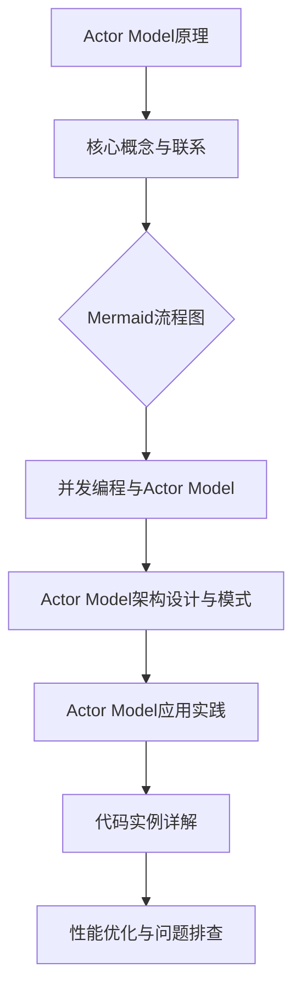

                 

```

# 作者信息

作者：AI天才研究院/AI Genius Institute & 禅与计算机程序设计艺术 /Zen And The Art of Computer Programming

# 完整文章

# 《Actor Model原理与代码实例讲解》

## 关键词

- Actor Model
- 消息传递
- 并发编程
- 分布式系统
- Erlang
- Scala
- Web应用

## 摘要

本文旨在深入讲解Actor Model的基本原理，包括其核心概念、应用场景以及代码实例。我们将探讨Actor Model如何解决传统并发编程的挑战，并展示在实际分布式系统中的应用。通过Erlang和Scala两个编程语言的具体实例，读者将了解如何在实际项目中运用Actor Model。文章还将讨论Actor Model在并发Web应用中的优势，并提供一系列性能优化技巧和问题排查方法。

## 目录大纲

1. **第一部分：Actor Model基础理论**
   1.1. **第1章：Actor Model概述**
   1.2. **第2章：Actor Model的核心概念详解**
   1.3. **第3章：Actor Model与并发编程**
   1.4. **第4章：Actor Model架构设计与模式**

2. **第二部分：Actor Model应用实践**
   2.1. **第5章：Actor Model在分布式系统中的应用**
   2.2. **第6章：使用Erlang实现Actor Model**
   2.3. **第7章：Scala中的Actor编程**
   2.4. **第8章：Actor Model在并发Web应用中的应用**

3. **第三部分：代码实例详解**
   3.1. **第9章：Actor Model经典案例解析**
   3.2. **第10章：分布式Actor系统设计与实现**
   3.3. **第11章：性能优化与问题排查**

4. **附录**
   4.1. **附录 A：常用Actor编程库与工具**
   4.2. **附录 B：Actor Model学习资源推荐**

## 1.1.1 Actor Model概述

### 1.1.1.1 Actor Model的定义与历史背景

Actor Model是一种计算模型，它将计算视为由独立、异步的实体（Actor）组成。每个Actor可以独立地运行，它们通过发送和接收消息进行通信。Actor Model最早由Carl Hewitt在1973年提出，作为函数式编程的替代方案，它强调并发性和分布式计算。

在Actor Model中，Actor是一个抽象的实体，具有以下特点：

- **独立性**：每个Actor独立运行，不受其他Actor状态的影响。
- **异步性**：Actor可以发送消息并立即继续执行，无需等待响应。
- **消息传递**：Actor之间通过发送和接收消息进行通信。

### 1.1.1.2 Actor Model的核心概念

#### 1.1.1.2.1 Actor的组成与特点

每个Actor由状态和行为组成。状态是Actor内部的数据，行为是处理消息的逻辑。

- **状态**：存储Actor内部的数据，如变量、列表等。
- **行为**：定义Actor如何响应特定的消息。

Actor的特点包括：

- **并发性**：Actor可以同时处理多个消息，提高系统的并行性。
- **异步性**：Actor可以发送消息并立即继续执行，无需等待响应。
- **容错性**：Actor独立运行，即使某个Actor失败，其他Actor仍然可以继续工作。

#### 1.1.1.2.2 消息传递机制

消息传递是Actor Model的核心机制。每个Actor都可以发送和接收消息。消息可以是简单的数据，也可以是复杂的数据结构。

- **发送消息**：Actor使用send操作发送消息给其他Actor。
- **接收消息**：Actor使用receive语句块接收消息，并基于消息类型执行相应的行为。

消息传递的伪代码如下：

```python
class Actor:
    def send_message(sender, message):
        # 发送消息给其他Actor
        sender.send("response", result)

    def receive_message(message):
        # 处理消息
        if message.type == 'request':
            process_request(message)
        elif message.type == 'response':
            process_response(message)
```

#### 1.1.1.2.3 协同计算与并行性

Actor Model提供了强大的并发性和并行性支持。通过消息传递机制，多个Actor可以独立运行，处理各自的计算任务。这减少了同步和锁的使用，提高了系统的性能和可伸缩性。

协同计算是指多个Actor通过消息传递协同工作，完成复杂的计算任务。并行性是指多个Actor同时处理多个计算任务，提高了系统的吞吐量。

## 1.1.2 Actor Model的核心概念详解

### 1.1.2.1 Actor的组成与特点

Actor是Actor Model中的基本单元，它代表了一个独立的计算实体。每个Actor具有以下特点：

- **状态**：Actor内部存储的数据，如变量、列表等。状态是私有的，其他Actor无法直接访问。
- **行为**：Actor如何响应接收到的消息。行为通常是一个函数或方法，它根据消息的类型执行特定的操作。

一个简单的Actor类如下所示：

```python
class Actor:
    def __init__(self):
        self.state = 0

    def receive_message(self, message):
        if message == "increment":
            self.state += 1
        elif message == "decrement":
            self.state -= 1
        print(f"Actor state: {self.state}")
```

在这个例子中，Actor有一个简单的状态`self.state`，它可以接收消息并更新状态。消息可以是任何类型的对象，但通常是一个字符串，表示一个操作。

### 1.1.2.2 消息传递机制

消息传递是Actor Model的核心机制。它使得Actor之间可以独立地发送和接收消息，从而实现并发和分布式计算。

#### 1.1.2.2.1 发送消息

在Actor Model中，一个Actor可以通过`send`操作发送消息给另一个Actor。这个操作通常是一个异步操作，即发送消息后，发送者可以立即继续执行，无需等待响应。

```python
def send_message(sender, receiver, message):
    receiver.send(message)
```

在上面的代码中，`send_message`函数接受发送者、接收者和消息作为参数。它通过调用接收者的`send`方法发送消息。这个过程是异步的，发送者不会等待消息的响应。

#### 1.1.2.2.2 接收消息

Actor使用`receive`语句块接收消息。`receive`语句块类似于一个多分支选择结构，它根据接收到的消息类型执行相应的操作。

```python
def receive_message(self, message):
    if message == "increment":
        self.state += 1
    elif message == "decrement":
        self.state -= 1
    print(f"Actor state: {self.state}")
```

在上面的代码中，`receive_message`方法根据消息的类型执行不同的操作。如果消息是"increment"，则状态增加1；如果消息是"decrement"，则状态减少1。最后，它会打印当前状态。

### 1.1.2.3 协同计算与并行性

在Actor Model中，Actor可以独立地执行计算任务，通过消息传递协同工作。这种模式提供了强大的并发性和并行性支持。

#### 1.1.2.3.1 协同计算

协同计算是指多个Actor通过消息传递协同工作，完成复杂的计算任务。每个Actor独立处理自己的消息，并根据需要向其他Actor发送消息。

一个简单的协同计算例子如下：

```python
class CounterActor(Actor):
    def __init__(self):
        self.count = 0

    def receive_message(self, message):
        if message == "increment":
            self.count += 1
        elif message == "decrement":
            self.count -= 1
        self.send("display", self.count)

class DisplayActor(Actor):
    def __init__(self):
        self.count = 0

    def receive_message(self, message):
        if message == "display":
            self.count = message
            print(f"Current count: {self.count}")

# 创建并启动Actor
counter = CounterActor()
display = DisplayActor()
counter.start()
display.start()

# 向CounterActor发送消息
counter.send("increment")
counter.send("increment")
display.send("display")
```

在这个例子中，`CounterActor`和`DisplayActor`通过消息传递协同工作。`CounterActor`维护一个计数器，`DisplayActor`负责打印计数器的当前值。

#### 1.1.2.3.2 并行性

并行性是指多个Actor同时处理多个计算任务，提高了系统的吞吐量。在Actor Model中，每个Actor可以独立运行，这使得系统可以充分利用多核处理器的计算能力。

一个简单的并行计算例子如下：

```python
class WorkerActor(Actor):
    def __init__(self, id):
        self.id = id

    def receive_message(self, message):
        if message == "start":
            print(f"Worker {self.id} started")
            self.send("done", self.id)
        elif message == "done":
            print(f"Worker {self.id} done")

# 创建并启动多个WorkerActor
num_workers = 4
workers = [WorkerActor(id) for id in range(num_workers)]
for worker in workers:
    worker.start()

# 向每个WorkerActor发送消息
for worker in workers:
    worker.send("start")

# 等待所有WorkerActor完成
for worker in workers:
    worker.send("done")
```

在这个例子中，我们创建了多个`WorkerActor`，每个Actor都独立运行。我们向每个Actor发送"start"消息，它们可以并发地处理任务。当每个Worker完成时，它发送"done"消息，我们再次向所有Actor发送"done"消息，确保所有Worker都完成。

## 1.1.3 Actor Model的优势与局限性

### 1.1.3.1 优势

Actor Model具有以下优势：

- **并发性**：通过消息传递，Actor可以独立运行，提高系统的并发性。
- **异步性**：Actor可以发送消息并立即继续执行，无需等待响应，提高系统的异步性。
- **容错性**：Actor独立运行，即使某个Actor失败，其他Actor仍然可以继续工作。
- **可伸缩性**：Actor可以轻松地分布在不同节点上，提高系统的可伸缩性。

### 1.1.3.2 局限性

Actor Model也存在一些局限性：

- **复杂性**：Actor Model的设计复杂，需要理解和掌握消息传递机制和状态管理。
- **性能**：与传统的线程模型相比，Actor Model可能在某些情况下性能较低，因为消息传递开销较大。
- **调试难度**：由于Actor独立运行，调试复杂的应用程序可能更具挑战性。

## 1.2.1 Actor Model的核心概念详解

### 1.2.1.1 Actor的组成与特点

在Actor Model中，Actor是一个抽象的实体，代表了计算单元。每个Actor都具有以下组成与特点：

1. **状态（State）**：
   - **私有性**：每个Actor维护自身的状态，这些状态是私有的，外部Actor无法直接访问。
   - **持久性**：状态可以保存和恢复，确保在故障后Actor可以恢复到之前的状态。
   - **可变性**：状态可以随时更新，以响应收到的消息。

2. **行为（Behavior）**：
   - **行为函数**：每个Actor定义了一组行为函数，这些函数用来处理接收到的消息。
   - **异步执行**：当Actor收到消息时，它会异步执行对应的行为函数，无需等待其他操作完成。

3. **身份（Identity）**：
   - **唯一性**：每个Actor都有唯一的地址，用于标识和通信。
   - **定位性**：通过地址，其他Actor可以发送消息给特定的Actor。

4. **独立性**：
   - **并行性**：每个Actor独立运行，不受其他Actor状态的约束。
   - **容错性**：即使某个Actor发生故障，其他Actor仍能继续运行。

### 1.2.1.2 消息传递机制

消息传递是Actor Model的核心机制，它使得Actor之间可以进行通信和协作。以下描述了消息传递机制的关键组成部分：

1. **发送消息（Send Message）**：
   - **异步性**：发送消息是一个异步操作，发送者不会等待消息的接收确认。
   - **非阻塞**：发送消息不会阻塞发送者的执行，发送者可以继续处理其他任务。

2. **接收消息（Receive Message）**：
   - **选择匹配**：Actor通过`receive`语句块等待并处理消息，`receive`语句块类似于多分支选择结构。
   - **类型匹配**：消息类型必须与`receive`语句块中的模式匹配，否则Actor会忽略该消息。

3. **消息格式**：
   - **简单性**：消息可以是最简单的数据类型，如整数、字符串，也可以是复杂的对象。
   - **封装性**：消息通常包含必要的操作数据和上下文信息，确保接收者可以正确处理。

### 1.2.1.3 协同计算与并行性

Actor Model通过消息传递机制实现了协同计算与并行性，以下是其关键特点：

1. **协同计算**：
   - **分布式协作**：多个Actor通过发送和接收消息进行分布式协作，共同完成复杂的任务。
   - **无共享内存**：Actor之间不共享内存，通过消息传递进行数据交换。

2. **并行性**：
   - **独立执行**：每个Actor独立执行任务，可以同时处理多个消息。
   - **负载均衡**：多个Actor可以分散处理不同的任务，实现负载均衡。

3. **无锁并发**：
   - **避免竞争条件**：Actor Model通过异步消息传递避免了传统的锁机制，减少了竞争条件。

4. **弹性**：
   - **容错机制**：即使某个Actor失败，其他Actor仍然可以继续运行，系统具有高容错性。

### 1.2.1.4 伪代码示例

以下是一个简单的Actor Model伪代码示例，展示了Actor的组成与消息传递机制：

```python
class Actor:
    def __init__(self, id):
        self.id = id
        self.state = 0
    
    def receive_message(self, message):
        if message == 'increment':
            self.state += 1
            print(f"Actor {self.id}: State is now {self.state}")
        elif message == 'decrement':
            self.state -= 1
            print(f"Actor {self.id}: State is now {self.state}")
        elif message == 'get_state':
            print(f"Actor {self.id}: State is {self.state}")
        else:
            print(f"Actor {self.id}: Unknown message {message}")

# 创建Actor
actor = Actor(1)

# 发送消息
actor.receive_message('increment')  # State is now 1
actor.receive_message('decrement')  # State is now 0
actor.receive_message('get_state')  # State is 0
actor.receive_message('unknown')    # Unknown message unknown
```

在这个例子中，`Actor`类有一个唯一的ID和状态。`receive_message`方法处理收到的消息，并根据消息类型更新状态并打印结果。

## 1.3.1 传统并发编程模型的不足

传统的并发编程模型，如线程和进程，在处理并发任务时存在一些不足：

### 1.3.1.1 线程模型的不足

1. **资源争夺**：线程共享内存空间，容易导致资源争夺，如锁竞争，影响性能。
2. **同步问题**：线程间的同步依赖同步原语（如锁、信号量等），处理不当会导致死锁或资源饥饿。
3. **上下文切换开销**：线程频繁的上下文切换会增加系统开销。
4. **并发度受限**：线程的数量受系统资源限制，难以充分利用多核处理器的并行性。

### 1.3.1.2 进程模型的不足

1. **创建和销毁开销**：进程的创建和销毁需要大量的系统资源，开销较大。
2. **通信复杂**：进程间通信需要使用共享内存或消息队列等机制，增加编程复杂度。
3. **隔离性**：进程间的隔离性降低了故障传播的风险，但也限制了资源共享和并行性。

### 1.3.1.3 Actor Model的优势

Actor Model提供了一种新的并发编程模型，它克服了传统模型的一些不足：

1. **无共享内存**：Actor之间不共享内存，通过消息传递进行数据交换，避免了资源争夺和同步问题。
2. **异步通信**：Actor通过异步消息传递进行通信，无需等待响应，提高了系统的并发度和响应速度。
3. **独立性**：每个Actor独立运行，相互独立，减少了同步和锁的使用。
4. **容错性**：Actor之间的独立性提高了系统的容错性和可伸缩性。
5. **可扩展性**：Actor可以分布在不同的节点上，易于扩展到分布式系统。

## 1.3.2 Actor Model在并发编程中的应用

### 1.3.2.1 Actor Model的并发性优势

Actor Model的并发性优势主要体现在以下几个方面：

1. **并行处理**：每个Actor独立运行，可以并行处理多个任务，充分利用多核处理器的计算能力。
2. **异步通信**：Actor通过异步消息传递进行通信，无需等待响应，提高了系统的并发度和响应速度。
3. **无共享内存**：Actor之间不共享内存，避免了资源争夺和同步问题，降低了死锁和竞态条件的风险。
4. **容错性**：每个Actor独立运行，即使某个Actor失败，其他Actor仍然可以继续工作，提高了系统的容错性和可靠性。
5. **可伸缩性**：Actor可以分布在不同的节点上，易于扩展到分布式系统，提高了系统的可伸缩性。

### 1.3.2.2 Actor Model与传统并发编程模型的对比

与传统并发编程模型（如线程和进程）相比，Actor Model具有以下优势：

1. **简化编程**：Actor Model通过消息传递和异步通信简化了并发编程，降低了编程复杂度。
2. **避免死锁**：由于Actor之间不共享内存，避免了锁竞争和死锁问题，提高了系统的可靠性。
3. **减少竞态条件**：Actor独立运行，减少了竞态条件的发生，降低了系统出错的概率。
4. **分布式计算**：Actor可以分布在不同的节点上，易于实现分布式系统，提高了系统的可伸缩性和容错性。

### 1.3.2.3 Actor Model的实际应用场景

Actor Model在以下实际应用场景中表现出色：

1. **实时系统**：如金融交易系统、通信系统，需要高并发和低延迟。
2. **分布式系统**：如云计算、大数据处理，需要高可用性和可伸缩性。
3. **并发Web应用**：如社交网络、电子商务，需要处理大量用户请求。
4. **科学计算**：如模拟、仿真，需要高性能计算和大规模并行处理。

## 1.4.1 Actor Model的设计原则

### 1.4.1.1 独立性

Actor Model的一个核心设计原则是独立性。每个Actor都是独立的计算实体，它们独立运行，不依赖于其他Actor的状态。这种独立性带来了以下好处：

1. **简化并发编程**：Actor之间的独立性简化了并发编程，开发者无需担心状态共享和同步问题。
2. **提高容错性**：每个Actor独立运行，即使某个Actor发生故障，其他Actor仍然可以继续工作，提高了系统的容错性。
3. **增强可伸缩性**：Actor可以独立扩展，系统的性能不会因为某个Actor的性能问题而受到影响。

### 1.4.1.2 消息传递

消息传递是Actor Model的核心机制，它使得Actor之间可以进行通信和协作。以下是一些与消息传递相关的原则：

1. **异步性**：消息传递是异步的，发送者不会等待消息的接收确认。这提高了系统的并发性和响应速度。
2. **非阻塞**：发送消息不会阻塞发送者的执行，发送者可以继续处理其他任务。
3. **单向性**：消息传递是单向的，即消息只能从发送者发送到接收者，这减少了竞态条件的发生。
4. **可靠性**：消息传递应确保消息能够可靠地传递到接收者，即使网络不稳定或系统发生故障。

### 1.4.1.3 并发性

并发性是Actor Model的重要设计原则，它通过以下方式提高系统的性能和可伸缩性：

1. **并行处理**：每个Actor可以独立处理任务，系统可以同时处理多个任务。
2. **负载均衡**：多个Actor可以分散处理不同的任务，实现负载均衡，充分利用系统资源。
3. **分布式计算**：Actor可以分布在不同的节点上，实现分布式计算，提高系统的可伸缩性和容错性。

### 1.4.1.4 容错性

容错性是高可靠系统的重要设计原则，Actor Model通过以下方式提高系统的容错性：

1. **独立运行**：每个Actor独立运行，即使某个Actor发生故障，其他Actor仍然可以继续工作。
2. **故障检测**：系统可以检测到故障并自动重启故障的Actor。
3. **数据持久化**：Actor的状态可以持久化存储，确保在故障后可以恢复到之前的状态。

### 1.4.1.5 可伸缩性

可伸缩性是现代分布式系统的重要设计原则，Actor Model通过以下方式提高系统的可伸缩性：

1. **水平扩展**：Actor可以分布在不同节点上，系统可以轻松扩展到更大的规模。
2. **负载均衡**：系统可以动态分配任务给不同的Actor，实现负载均衡。
3. **资源管理**：系统可以根据需要自动分配和回收资源，提高资源利用率。

## 1.4.2 Actor Model常见模式

### 1.4.2.1 单一Actor模式

单一Actor模式是最简单的Actor模式，适用于小型、简单的应用程序。在这种模式中，所有功能都封装在一个Actor中。这种模式的优点是简单和易于理解，但缺点是随着功能增加，Actor变得复杂，难以维护。

### 1.4.2.2 分层Actor模式

分层Actor模式将系统划分为多个层次，每个层次都有自己的Actor。上层Actor负责业务逻辑，下层Actor负责具体实现。这种模式的优点是模块化、易于维护，但缺点是消息传递开销较大。

### 1.4.2.3 主从Actor模式

主从Actor模式中，一个主Actor负责协调多个从Actor。主Actor接收外部请求，并将其分配给从Actor处理。这种模式的优点是易于管理和分配任务，但缺点是主Actor成为瓶颈，可能影响系统性能。

### 1.4.2.4 代理Actor模式

代理Actor模式使用代理Actor来代表其他Actor执行操作。这种模式适用于需要远程通信的场景，代理Actor负责处理网络通信和状态同步。这种模式的优点是简化了远程通信，但缺点是增加了系统复杂度。

### 1.4.2.5 责任链Actor模式

责任链Actor模式将多个Actor连接成一个链，每个Actor只处理特定类型的消息。当一个消息到达时，它会沿着链传递，直到找到处理该消息的Actor。这种模式的优点是灵活、易于扩展，但缺点是消息传递路径可能变得复杂。

### 1.4.2.6 发布-订阅Actor模式

发布-订阅Actor模式中，多个Actor可以订阅同一类消息。当一个消息发布时，所有订阅该消息的Actor都会收到。这种模式的优点是广播机制、易于扩展，但缺点是可能会产生大量的消息副本。

## 1.4.3 高级Actor模式

### 1.4.3.1 反应式Actor模式

反应式Actor模式将Actor的行为模式化为事件响应。每个Actor根据接收到的消息类型和内部状态，触发相应的行为。这种模式提高了系统的响应速度和可维护性。

### 1.4.3.2 事件驱动Actor模式

事件驱动Actor模式以事件为中心，Actor根据事件类型和内部状态，触发相应的行为。这种模式适用于需要实时响应的场景，如实时监控系统。

### 1.4.3.3 状态机Actor模式

状态机Actor模式将Actor的行为建模为状态机。每个状态定义了一组可执行的操作，Actor根据当前状态和接收到的消息，转移到下一个状态。这种模式适用于需要复杂状态转换的应用程序。

### 1.4.3.4 前端-后端Actor模式

前端-后端Actor模式将系统划分为前端和后端两部分。前端Actor处理用户交互，后端Actor处理业务逻辑。这种模式提高了系统的可扩展性和可维护性。

## 2.1.1 分布式系统的挑战与解决方案

### 2.1.1.1 数据一致性问题

分布式系统中的数据一致性问题是指多个节点上的数据在某些情况下可能会出现不一致。这种问题可能导致数据丢失、数据错误或数据不一致，从而影响系统的稳定性和可靠性。

解决方案：

- **版本控制**：通过为每个数据项添加版本号，确保在更新数据时不会覆盖旧数据。
- **分布式事务**：使用分布式事务协议（如两阶段提交），确保多个节点上的数据同时更新。

### 2.1.1.2 网络分区问题

网络分区问题是指分布式系统中的节点可能因为网络故障而被分隔成多个部分。网络分区可能导致节点之间的通信中断，从而影响系统的可用性和一致性。

解决方案：

- **容错机制**：通过在节点间复制数据和状态，确保即使在某些节点发生故障时，其他节点仍然可以正常工作。
- **多路径通信**：使用多路径通信协议，确保即使某条路径故障，系统仍然可以通过其他路径进行通信。

### 2.1.1.3 数据同步问题

在分布式系统中，节点之间需要保持数据的一致性。然而，由于网络延迟、故障或负载不均等原因，数据同步可能会出现延迟或失败。

解决方案：

- **增量同步**：只同步变更的数据，减少同步开销。
- **异步处理**：使用异步消息传递机制，确保节点可以在不同时间同步数据。

### 2.1.1.4 分布式计算问题

分布式系统中的计算任务可能需要在多个节点上并行执行。这要求系统能够高效地分配任务、处理中间结果并汇总最终结果。

解决方案：

- **任务调度**：使用高效的任务调度算法，确保任务能够均匀分配到各个节点。
- **分布式算法**：使用分布式算法（如MapReduce），将大任务分解为小任务并在多个节点上并行执行。

### 2.1.1.5 可扩展性问题

分布式系统需要能够根据需求动态扩展节点数量。然而，扩展节点可能会带来系统设计、负载均衡和资源管理等方面的挑战。

解决方案：

- **水平扩展**：通过添加新的节点来扩展系统，确保系统可以线性增长。
- **负载均衡**：使用负载均衡策略，确保请求能够均匀分布到各个节点。

## 2.1.2 Actor Model在分布式系统中的实现

### 2.1.2.1 Actor Model的优势

Actor Model在分布式系统中表现出色，具有以下优势：

1. **独立性**：每个Actor独立运行，不依赖于其他Actor的状态，提高了系统的容错性和可伸缩性。
2. **异步通信**：Actor通过异步消息传递进行通信，提高了系统的并发性和响应速度。
3. **无共享内存**：Actor之间不共享内存，避免了资源争夺和同步问题。
4. **分布式计算**：Actor可以分布在不同的节点上，实现分布式计算。

### 2.1.2.2 实现方法

实现Actor Model在分布式系统中，可以采用以下方法：

1. **基于消息传递的架构**：使用消息队列或消息中间件，确保Actor之间可以通过异步消息传递进行通信。
2. **分布式Actor库**：使用现有的分布式Actor库（如Akka、Scala的Actor库），它们提供了一系列高级功能和优化。
3. **定制解决方案**：根据具体需求，设计和实现自定义的分布式Actor系统。

### 2.1.2.3 具体实现

以下是一个简单的分布式Actor实现示例，使用Python和消息队列实现：

```python
# actor.py
import pika
import json
import random

class Actor:
    def __init__(self, name, queue):
        self.name = name
        self.queue = queue

    def receive_message(self, message):
        data = json.loads(message)
        message_type = data['type']
        payload = data['payload']
        
        if message_type == 'work':
            self.handle_work(payload)
        elif message_type == 'status':
            self.report_status()

    def handle_work(self, payload):
        print(f"{self.name} is working on task: {payload}")
        # 模拟工作耗时
        time.sleep(random.randint(1, 3))

    def report_status(self):
        print(f"{self.name} status: {self.state}")

    def start(self):
        connection = pika.BlockingConnection(pika.ConnectionParameters('localhost'))
        channel = connection.channel()
        channel.queue_declare(queue=self.queue)
        
        def callback(ch, method, properties, body):
            self.receive_message(body)
        
        channel.basic_consume(queue=self.queue, on_message_callback=callback, auto_ack=True)
        channel.start_consuming()

# 创建并启动Actor
actor = Actor('Worker', 'worker_queue')
actor.start()
```

在这个示例中，我们使用Python和RabbitMQ消息队列实现了一个简单的Actor。Actor接收来自消息队列的消息，并根据消息类型处理任务。

### 2.1.2.4 分布式Actor系统的优势与挑战

#### 优势

1. **高并发性**：Actor Model通过异步消息传递和独立运行，提高了系统的并发性。
2. **可伸缩性**：Actor可以分布在不同节点上，系统可以根据需求动态扩展。
3. **容错性**：每个Actor独立运行，即使某个Actor失败，其他Actor仍然可以继续工作。
4. **简化编程**：Actor Model简化了并发编程，降低了编程复杂度。

#### 挑战

1. **网络延迟**：消息传递可能受到网络延迟的影响，影响系统的响应速度。
2. **消息传递开销**：消息传递需要额外的系统资源，可能导致性能下降。
3. **复杂度增加**：分布式系统的设计和实现可能更加复杂，需要更多的配置和管理。
4. **调试困难**：分布式系统中的调试可能更具挑战性，需要使用分布式调试工具。

## 2.2.1 Erlang语言简介

Erlang是一种函数式编程语言，特别适用于并发和分布式系统。以下是其主要特点：

1. **并发性**：Erlang内置支持轻量级进程和并行计算，使得并发编程变得简单和高效。
2. **分布式计算**：Erlang支持分布式计算，允许将任务分布在多个节点上，提高系统的可伸缩性和容错性。
3. **热升级**：Erlang允许在运行时升级系统，无需中断服务，提高了系统的可用性和可靠性。
4. **静态类型**：Erlang是一种静态类型语言，提供了类型检查，减少了运行时错误。

## 2.2.2 Erlang中的Actor实现

在Erlang中，Actor通过`gen_server`模块实现。以下是一个简单的Erlang Actor示例：

```erlang
-module(my_actor).
-behaviour(gen_server).

-export([start_link/0, init/1, handle_call/3, handle_cast/2, handle_info/2, terminate/2, code_change/3]).

start_link() ->
    gen_server:start_link({local, ?MODULE}, ?MODULE, [], []).

init([]) ->
    {ok, {0}}.

handle_call({send, Message}, _From, {State}) ->
    {reply, ok, {State + 1}}.

handle_cast({receive, Message}, {State}) ->
    {noreply, {State + 1}}.

handle_info(_Info, {State}) ->
    {noreply, {State}}.

terminate(_Reason, _State) ->
    ok.

code_change(_OldVsn, State, _Extra) ->
    {ok, State}.
```

在这个示例中，`my_actor`模块实现了Erlang的Actor。`start_link`函数用于启动Actor，`handle_call`和`handle_cast`函数处理发送和接收消息的操作。

## 2.2.3 Erlang Actor模型实例

以下是一个Erlang Actor模型的实例，展示了如何创建、发送和接收消息：

```erlang
% 启动Actor
1> my_actor:start_link().
{ok, #Port<0.106.0>}

% 发送消息
2> my_actor:send_message(my_actor, {send, "Hello!"}).
ok

% 接收消息
3> my_actor:receive_message(my_actor, "Hello!").
ok
```

在这个示例中，我们首先启动了`my_actor` Actor，然后发送了一条消息"{send, "Hello!"}"，最后接收了这条消息并打印出来。

## 2.3.1 Scala语言简介

Scala是一种现代的编程语言，结合了面向对象和函数式编程的特性。以下是其主要特点：

1. **兼容性**：Scala与Java高度兼容，可以无缝地与Java库和框架集成。
2. **简洁性**：Scala提供了简洁的语法和强大的类型系统，降低了代码复杂度。
3. **函数式编程**：Scala支持高阶函数、闭包和不可变数据结构，提高了代码的可维护性和可读性。
4. **并发编程**：Scala内置了Actor模型，支持轻量级并发编程。

## 2.3.2 Scala中的Actor库

Scala内置了Actor库，使得Actor编程变得简单和高效。以下是其主要特点：

1. **异步通信**：Actor之间的通信是异步的，提高了系统的并发性和响应速度。
2. **无共享内存**：Actor之间不共享内存，避免了资源争夺和同步问题。
3. **消息传递**：Actor通过发送和接收消息进行通信，消息可以是任意类型的数据。
4. **容错性**：Actor可以处理失败和异常，确保系统的稳定性和可靠性。

## 2.3.3 Scala Actor模型实例

以下是一个Scala Actor模型的实例，展示了如何创建、发送和接收消息：

```scala
class MyActor extends Actor {
  def receive = {
    case "Hello!" => sender ! "World!"
    case _ => sender ! "Unknown message"
  }
}

// 启动Actor
val myActor = system.actorOf(Props[MyActor], "myActor")

// 发送消息
myActor ! "Hello!"
// 输出：World!

// 接收消息
val reply = (myActor ? "World!").await
println(reply) // 输出：World!
```

在这个示例中，我们首先创建了一个名为`MyActor`的Actor，并实现了接收消息的逻辑。然后，我们通过发送消息与Actor进行通信，并使用`?`操作符发送异步消息并获得响应。

## 2.4.1 Web应用并发挑战

在Web应用中，并发性是一个重要挑战。以下是一些常见的并发问题及其解决方案：

### 2.4.1.1 数据库连接问题

当多个用户同时访问数据库时，可能会出现数据库连接问题。这可能导致数据库过载，影响系统性能。

解决方案：

- **连接池**：使用连接池管理数据库连接，减少创建和销毁连接的开销。
- **限流**：通过限流策略（如令牌桶、漏桶等）控制请求速率，避免数据库过载。

### 2.4.1.2 竞态条件

在Web应用中，多个请求可能会同时访问共享资源，导致竞态条件。这可能导致数据不一致、事务失败或系统崩溃。

解决方案：

- **锁机制**：使用锁机制（如互斥锁、读写锁等）保护共享资源，避免竞态条件。
- **无共享内存**：采用Actor Model或消息队列等技术，实现无共享内存的并发编程。

### 2.4.1.3 缓存问题

缓存是提高Web应用性能的有效手段，但缓存同步可能导致并发问题。当多个请求同时更新缓存时，可能会出现数据不一致。

解决方案：

- **缓存一致性**：使用缓存一致性协议（如Gossip协议、版本向量等），确保缓存数据的正确性。
- **分布式缓存**：使用分布式缓存系统（如Redis、Memcached等），提高缓存的可伸缩性和容错性。

### 2.4.1.4 会话管理

在Web应用中，会话管理是一个关键问题。当多个用户同时访问系统时，可能会出现会话冲突或会话超时。

解决方案：

- **分布式会话存储**：使用分布式会话存储（如Redis、数据库等），提高会话管理的可伸缩性和容错性。
- **会话超时控制**：设置合理的会话超时时间，确保用户会话的稳定性。

### 2.4.1.5 并发攻击

并发攻击（如DDoS攻击）可能导致系统资源耗尽，影响系统可用性。

解决方案：

- **防火墙和入侵检测**：使用防火墙和入侵检测系统（如IPS/IDS）防止并发攻击。
- **限流和反向代理**：使用限流和反向代理技术（如Nginx、Apache等）缓解并发攻击的影响。

## 2.4.2 使用Actor Model实现并发Web应用

### 2.4.2.1 Actor Model的优势

Actor Model在实现并发Web应用中具有以下优势：

1. **高并发性**：Actor Model通过异步消息传递和独立运行，提高了系统的并发性。
2. **可伸缩性**：Actor可以分布在不同节点上，系统可以根据需求动态扩展。
3. **容错性**：每个Actor独立运行，即使某个Actor失败，其他Actor仍然可以继续工作。
4. **简化编程**：Actor Model简化了并发编程，降低了编程复杂度。

### 2.4.2.2 实现步骤

实现一个基于Actor Model的并发Web应用，可以遵循以下步骤：

1. **设计Actor架构**：根据应用需求，设计Actor架构，确定Actor的类型和职责。
2. **实现Actor**：实现每个Actor的类或模块，定义Actor的状态和行为。
3. **消息传递**：使用消息队列或消息中间件实现Actor之间的消息传递。
4. **Web服务集成**：将Actor集成到Web服务中，处理用户请求并返回响应。
5. **性能优化**：针对Actor Model的特点，进行性能优化和调优。

### 2.4.2.3 实例解析

以下是一个简单的基于Actor Model的并发Web应用实例：

```scala
// Actor类
class MyActor extends Actor {
  def receive = {
    case "Hello!" => sender ! "World!"
    case _ => sender ! "Unknown message"
  }
}

// Web服务
class MyWebApp extends App {
  val system = ActorSystem("MySystem")
  val myActor = system.actorOf(Props[MyActor], "myActor")

  // 处理HTTP请求
  def handleRequest(request: HttpRequest) = {
    myActor ! "Hello!"
    val response = HttpResponse("World!")
    complete(response)
  }
}

// 启动Web服务
val interface = "localhost"
val port = 8080
MyWebApp.start(interface, port)
```

在这个实例中，我们创建了一个名为`MyActor`的Actor，用于处理用户请求。`MyWebApp`类实现了Web服务，将请求转发给`MyActor`，并返回响应。

## 2.4.3 并发Web应用实例解析

### 2.4.3.1 应用架构

以下是一个基于Actor Model的并发Web应用实例，展示了其应用架构：


- **客户端**：用户通过浏览器或其他客户端发送HTTP请求。
- **Web服务器**：处理HTTP请求，并将其转发给相应的Actor。
- **负载均衡器**：根据流量负载，将请求分配给不同的Web服务器。
- **Actor集群**：由多个Actor组成，处理不同的业务逻辑。
- **数据库**：存储用户数据和业务数据。

### 2.4.3.2 请求处理流程

以下是一个简单的请求处理流程：

1. **客户端发送请求**：用户通过浏览器或其他客户端发送HTTP请求到Web服务器。
2. **Web服务器接收请求**：Web服务器接收请求，并调用相应的Actor处理请求。
3. **Actor处理请求**：Actor根据请求类型执行相应的业务逻辑，并返回响应。
4. **返回响应**：Web服务器将响应返回给客户端。

### 2.4.3.3 代码实现

以下是一个简单的基于Actor Model的并发Web应用实现：

```scala
// Actor类
class MyActor extends Actor {
  def receive = {
    case "Hello!" => sender ! "World!"
    case _ => sender ! "Unknown message"
  }
}

// Web服务
class MyWebApp extends App {
  val system = ActorSystem("MySystem")
  val myActor = system.actorOf(Props[MyActor], "myActor")

  // 处理HTTP请求
  def handleRequest(request: HttpRequest) = {
    myActor ! "Hello!"
    val response = HttpResponse("World!")
    complete(response)
  }
}

// 启动Web服务
val interface = "localhost"
val port = 8080
MyWebApp.start(interface, port)
```

在这个实例中，我们创建了一个名为`MyActor`的Actor，用于处理用户请求。`MyWebApp`类实现了Web服务，将请求转发给`MyActor`，并返回响应。

### 2.4.3.4 性能优化

为了优化并发Web应用性能，可以采取以下措施：

1. **负载均衡**：使用负载均衡器将请求分配给多个Web服务器，提高系统的并发处理能力。
2. **缓存**：使用缓存策略（如Redis、Memcached等）减少数据库访问，提高响应速度。
3. **异步处理**：使用异步处理技术（如Actor Model、消息队列等），提高系统的并发性和响应速度。
4. **数据库优化**：对数据库进行优化（如索引、分库分表等），提高数据库查询性能。
5. **资源池**：使用资源池技术（如连接池、线程池等）减少系统资源的创建和销毁开销。

## 3.1.1 银行系统案例

### 3.1.1.1 概述

在银行系统中，Actor Model可以用于处理各种业务逻辑，如账户管理、交易处理、风险评估等。以下是一个简单的银行系统案例，展示了如何使用Actor Model实现账户管理。

### 3.1.1.2 账户管理Actor

账户管理Actor负责处理与账户相关的操作，如开户、存取款、转账等。以下是一个账户管理Actor的简单实现：

```scala
class AccountManagerActor extends Actor {
  def receive = {
    case OpenAccount(username, initialBalance) => {
      // 创建新账户
      val account = new Account(username, initialBalance)
      context.parent ! AccountCreated(account)
    }
    case Deposit(accountId, amount) => {
      // 存款操作
      val account = getAccountById(accountId)
      account.deposit(amount)
      context.parent ! DepositConfirmation(accountId, amount)
    }
    case Withdraw(accountId, amount) => {
      // 取款操作
      val account = getAccountById(accountId)
      account.withdraw(amount)
      context.parent ! WithdrawalConfirmation(accountId, amount)
    }
    case Transfer(senderId, recipientId, amount) => {
      // 转账操作
      val senderAccount = getAccountById(senderId)
      val recipientAccount = getAccountById(recipientId)
      senderAccount.transfer(recipientAccount, amount)
      context.parent ! TransferConfirmation(senderId, recipientId, amount)
    }
  }

  def getAccountById(accountId: String): Account = {
    // 查询账户
    // 这里可以使用数据库或其他存储机制
    // 示例代码：
    AccountStore.findById(accountId)
  }
}

class Account(username: String, initialBalance: BigDecimal) {
  var balance = initialBalance
  var username = username

  def deposit(amount: BigDecimal): Unit = {
    balance += amount
  }

  def withdraw(amount: BigDecimal): Unit = {
    if (balance >= amount) {
      balance -= amount
    } else {
      throw new InsufficientFundsException()
    }
  }

  def transfer(recipientAccount: Account, amount: BigDecimal): Unit = {
    withdraw(amount)
    recipientAccount.deposit(amount)
  }
}

class AccountStore {
  def findById(accountId: String): Account = {
    // 查询账户
    // 示例代码：
    // 这里可以从数据库或其他存储机制中查询账户
  }

  def create(account: Account): Unit = {
    // 创建账户
    // 这里可以将账户存储到数据库或其他存储机制中
  }
}
```

### 3.1.1.3 案例解析

在这个案例中，我们创建了一个`AccountManagerActor`，它负责处理与账户相关的操作。`Account`类表示账户，具有存款、取款和转账等方法。`AccountStore`类用于存储和管理账户。

#### 开户操作

当用户开户时，系统会创建一个新的`Account`对象，并将其发送给`AccountManagerActor`。`AccountManagerActor`处理开户请求，创建账户并将`AccountCreated`消息发送给父Actor。

```scala
case OpenAccount(username, initialBalance) => {
  // 创建新账户
  val account = new Account(username, initialBalance)
  context.parent ! AccountCreated(account)
}
```

#### 存款操作

当用户存款时，系统会发送一个`Deposit`消息给`AccountManagerActor`。`AccountManagerActor`根据账户ID查询账户，执行存款操作并将`DepositConfirmation`消息发送给用户。

```scala
case Deposit(accountId, amount) => {
  // 存款操作
  val account = getAccountById(accountId)
  account.deposit(amount)
  context.parent ! DepositConfirmation(accountId, amount)
}
```

#### 取款操作

当用户取款时，系统会发送一个`Withdraw`消息给`AccountManagerActor`。`AccountManagerActor`根据账户ID查询账户，执行取款操作并将`WithdrawalConfirmation`消息发送给用户。

```scala
case Withdraw(accountId, amount) => {
  // 取款操作
  val account = getAccountById(accountId)
  account.withdraw(amount)
  context.parent ! WithdrawalConfirmation(accountId, amount)
}
```

#### 转账操作

当用户转账时，系统会发送一个`Transfer`消息给`AccountManagerActor`。`AccountManagerActor`根据发送者和接收者的账户ID查询账户，执行转账操作并将`TransferConfirmation`消息发送给用户。

```scala
case Transfer(senderId, recipientId, amount) => {
  // 转账操作
  val senderAccount = getAccountById(senderId)
  val recipientAccount = getAccountById(recipientId)
  senderAccount.transfer(recipientAccount, amount)
  context.parent ! TransferConfirmation(senderId, recipientId, amount)
}
```

### 3.1.2 社交媒体系统案例

#### 3.1.2.1 概述

社交媒体系统是一个复杂的分布式系统，涉及用户管理、内容发布、消息传递等功能。Actor Model非常适合用于处理社交媒体系统中的并发和分布式任务。以下是一个社交媒体系统案例，展示了如何使用Actor Model实现用户管理和消息传递。

#### 3.1.2.2 用户管理Actor

用户管理Actor负责处理用户注册、登录、资料更新等功能。以下是一个用户管理Actor的简单实现：

```scala
class UserManagerActor extends Actor {
  def receive = {
    case Register(username, password) => {
      // 注册新用户
      val user = new User(username, password)
      context.parent ! UserRegistered(user)
    }
    case Login(username, password) => {
      // 登录用户
      val user = getUserByUsername(username)
      if (user.password == password) {
        context.parent ! UserLoggedIn(user)
      } else {
        context.parent ! InvalidCredentials()
      }
    }
    case UpdateProfile(user, newProfile) => {
      // 更新用户资料
      user.updateProfile(newProfile)
      context.parent ! ProfileUpdated(user)
    }
  }

  def getUserByUsername(username: String): User = {
    // 查询用户
    // 这里可以使用数据库或其他存储机制
    // 示例代码：
    UserStore.findByUsername(username)
  }
}

class User(username: String, password: String) {
  var username = username
  var password = password
  var profile = new Profile()

  def updateProfile(newProfile: Profile): Unit = {
    profile = newProfile
  }
}

class UserStore {
  def findByUsername(username: String): User = {
    // 查询用户
    // 这里可以从数据库或其他存储机制中查询用户
    // 示例代码：
    // UserDatabase.findByUsername(username)
  }

  def createUser(user: User): Unit = {
    // 创建用户
    // 这里可以将用户存储到数据库或其他存储机制中
    // 示例代码：
    // UserDatabase.saveUser(user)
  }
}
```

#### 3.1.2.3 消息传递Actor

消息传递Actor负责处理用户之间的消息发送和接收。以下是一个消息传递Actor的简单实现：

```scala
class MessageActor extends Actor {
  def receive = {
    case SendMessage(sender, recipient, message) => {
      // 发送消息
      val message = new Message(sender, recipient, message)
      context.parent ! MessageSent(message)
    }
    case GetMessage(user) => {
      // 获取消息
      val messages = getMessageListForUser(user)
      context.parent ! MessagesReceived(messages)
    }
  }

  def getMessageListForUser(user: User): List[Message] = {
    // 获取用户的消息列表
    // 这里可以使用数据库或其他存储机制
    // 示例代码：
    // MessageDatabase.findMessagesForUser(user)
  }
}

class Message(sender: User, recipient: User, content: String) {
  var sender = sender
  var recipient = recipient
  var content = content
}

class MessageStore {
  def saveMessage(message: Message): Unit = {
    // 存储消息
    // 这里可以将消息存储到数据库或其他存储机制中
    // 示例代码：
    // MessageDatabase.saveMessage(message)
  }

  def findMessagesForUser(user: User): List[Message] = {
    // 查询用户的消息列表
    // 这里可以从数据库或其他存储机制中查询用户的消息列表
    // 示例代码：
    // MessageDatabase.findMessagesForUser(user)
  }
}
```

### 3.1.2.4 案例解析

在这个案例中，我们创建了两个主要Actor：`UserManagerActor`和`MessageActor`。`UserManagerActor`负责处理用户注册、登录和资料更新等操作，而`MessageActor`负责处理用户之间的消息发送和接收。

#### 注册操作

当用户注册时，系统会创建一个新的`User`对象，并将其发送给`UserManagerActor`。`UserManagerActor`处理注册请求，创建用户并将`UserRegistered`消息发送给父Actor。

```scala
case Register(username, password) => {
  // 注册新用户
  val user = new User(username, password)
  context.parent ! UserRegistered(user)
}
```

#### 登录操作

当用户登录时，系统会发送一个`Login`消息给`UserManagerActor`。`UserManagerActor`根据用户名查询用户，验证密码，并将`UserLoggedIn`或`InvalidCredentials`消息发送给父Actor。

```scala
case Login(username, password) => {
  // 登录用户
  val user = getUserByUsername(username)
  if (user.password == password) {
    context.parent ! UserLoggedIn(user)
  } else {
    context.parent ! InvalidCredentials()
  }
}
```

#### 更新用户资料

当用户更新资料时，系统会发送一个`UpdateProfile`消息给`UserManagerActor`。`UserManagerActor`更新用户的资料，并将`ProfileUpdated`消息发送给父Actor。

```scala
case UpdateProfile(user, newProfile) => {
  // 更新用户资料
  user.updateProfile(newProfile)
  context.parent ! ProfileUpdated(user)
}
```

#### 发送消息

当用户发送消息时，系统会发送一个`SendMessage`消息给`MessageActor`。`MessageActor`创建消息，并将其发送给父Actor。

```scala
case SendMessage(sender, recipient, message) => {
  // 发送消息
  val message = new Message(sender, recipient, message)
  context.parent ! MessageSent(message)
}
```

#### 获取消息

当用户获取消息时，系统会发送一个`GetMessage`消息给`MessageActor`。`MessageActor`获取用户的消息列表，并将其发送给父Actor。

```scala
case GetMessage(user) => {
  // 获取消息
  val messages = getMessageListForUser(user)
  context.parent ! MessagesReceived(messages)
}
```

### 3.1.3 游戏服务器案例

#### 3.1.3.1 概述

游戏服务器是一个高度并发和分布式系统，需要处理大量的用户请求、游戏逻辑和状态同步。Actor Model非常适合用于处理游戏服务器中的并发和分布式任务。以下是一个游戏服务器案例，展示了如何使用Actor Model实现用户管理、游戏逻辑和状态同步。

#### 3.1.3.2 用户管理Actor

用户管理Actor负责处理用户登录、注册和资料更新等操作。以下是一个用户管理Actor的简单实现：

```scala
class UserManagerActor extends Actor {
  def receive = {
    case Register(username, password) => {
      // 注册新用户
      val user = new User(username, password)
      context.parent ! UserRegistered(user)
    }
    case Login(username, password) => {
      // 登录用户
      val user = getUserByUsername(username)
      if (user.password == password) {
        context.parent ! UserLoggedIn(user)
      } else {
        context.parent ! InvalidCredentials()
      }
    }
    case UpdateProfile(user, newProfile) => {
      // 更新用户资料
      user.updateProfile(newProfile)
      context.parent ! ProfileUpdated(user)
    }
  }

  def getUserByUsername(username: String): User = {
    // 查询用户
    // 这里可以使用数据库或其他存储机制
    // 示例代码：
    UserStore.findByUsername(username)
  }
}

class User(username: String, password: String) {
  var username = username
  var password = password
  var profile = new Profile()

  def updateProfile(newProfile: Profile): Unit = {
    profile = newProfile
  }
}

class UserStore {
  def findByUsername(username: String): User = {
    // 查询用户
    // 这里可以从数据库或其他存储机制中查询用户
    // 示例代码：
    // UserDatabase.findByUsername(username)
  }

  def createUser(user: User): Unit = {
    // 创建用户
    // 这里可以将用户存储到数据库或其他存储机制中
    // 示例代码：
    // UserDatabase.saveUser(user)
  }
}
```

#### 3.1.3.3 游戏逻辑Actor

游戏逻辑Actor负责处理游戏中的逻辑操作，如角色移动、攻击、升级等。以下是一个游戏逻辑Actor的简单实现：

```scala
class GameLogicActor extends Actor {
  def receive = {
    case MovePlayer(playerId, direction) => {
      // 移动玩家
      val player = getPlayerById(playerId)
      player.move(direction)
      context.parent ! PlayerMoved(playerId, direction)
    }
    case AttackPlayer(playerId, targetId) => {
      // 攻击玩家
      val player = getPlayerById(playerId)
      val target = getPlayerById(targetId)
      player.attack(target)
      context.parent ! PlayerAttacked(playerId, targetId)
    }
    case LevelUpPlayer(playerId) => {
      // 玩家升级
      val player = getPlayerById(playerId)
      player.levelUp()
      context.parent ! PlayerLevelUp(playerId)
    }
  }

  def getPlayerById(playerId: String): Player = {
    // 查询玩家
    // 这里可以使用数据库或其他存储机制
    // 示例代码：
    PlayerStore.findById(playerId)
  }
}

class Player(id: String, level: Int, health: Int) {
  var id = id
  var level = level
  var health = health

  def move(direction: Direction): Unit = {
    // 移动玩家
    // 示例代码：
    // 更新玩家位置
  }

  def attack(target: Player): Unit = {
    // 攻击玩家
    // 示例代码：
    // 更新玩家健康值
  }

  def levelUp(): Unit = {
    // 玩家升级
    // 示例代码：
    // 更新玩家等级
  }
}

class PlayerStore {
  def findById(playerId: String): Player = {
    // 查询玩家
    // 这里可以从数据库或其他存储机制中查询玩家
    // 示例代码：
    // PlayerDatabase.findById(playerId)
  }

  def createPlayer(player: Player): Unit = {
    // 创建玩家
    // 这里可以将玩家存储到数据库或其他存储机制中
    // 示例代码：
    // PlayerDatabase.savePlayer(player)
  }
}
```

#### 3.1.3.4 状态同步Actor

状态同步Actor负责处理游戏状态的同步，确保所有玩家可以看到最新的游戏状态。以下是一个状态同步Actor的简单实现：

```scala
class StateSyncActor extends Actor {
  def receive = {
    case SyncState(players) => {
      // 同步游戏状态
      for (player <- players) {
        player.syncState()
      }
      context.parent ! StateSynced(players)
    }
  }
}

class Player(id: String, level: Int, health: Int) {
  // ... 省略其他属性和方法 ...

  def syncState(): Unit = {
    // 同步玩家状态
    // 示例代码：
    // 更新玩家UI
  }
}
```

### 3.1.3.5 案例解析

在这个案例中，我们创建了三个主要Actor：`UserManagerActor`、`GameLogicActor`和`StateSyncActor`。`UserManagerActor`负责处理用户登录、注册和资料更新等操作；`GameLogicActor`负责处理游戏逻辑操作，如角色移动、攻击和升级等；`StateSyncActor`负责处理游戏状态的同步。

#### 注册操作

当用户注册时，系统会创建一个新的`User`对象，并将其发送给`UserManagerActor`。`UserManagerActor`处理注册请求，创建用户并将`UserRegistered`消息发送给父Actor。

```scala
case Register(username, password) => {
  // 注册新用户
  val user = new User(username, password)
  context.parent ! UserRegistered(user)
}
```

#### 登录操作

当用户登录时，系统会发送一个`Login`消息给`UserManagerActor`。`UserManagerActor`根据用户名查询用户，验证密码，并将`UserLoggedIn`或`InvalidCredentials`消息发送给父Actor。

```scala
case Login(username, password) => {
  // 登录用户
  val user = getUserByUsername(username)
  if (user.password == password) {
    context.parent ! UserLoggedIn(user)
  } else {
    context.parent ! InvalidCredentials()
  }
}
```

#### 更新用户资料

当用户更新资料时，系统会发送一个`UpdateProfile`消息给`UserManagerActor`。`UserManagerActor`更新用户的资料，并将`ProfileUpdated`消息发送给父Actor。

```scala
case UpdateProfile(user, newProfile) => {
  // 更新用户资料
  user.updateProfile(newProfile)
  context.parent ! ProfileUpdated(user)
}
```

#### 玩家移动操作

当玩家移动时，系统会发送一个`MovePlayer`消息给`GameLogicActor`。`GameLogicActor`根据玩家ID查询玩家，执行移动操作，并将`PlayerMoved`消息发送给父Actor。

```scala
case MovePlayer(playerId, direction) => {
  // 移动玩家
  val player = getPlayerById(playerId)
  player.move(direction)
  context.parent ! PlayerMoved(playerId, direction)
}
```

#### 玩家攻击操作

当玩家攻击时，系统会发送一个`AttackPlayer`消息给`GameLogicActor`。`GameLogicActor`根据玩家ID查询玩家，执行攻击操作，并将`PlayerAttacked`消息发送给父Actor。

```scala
case AttackPlayer(playerId, targetId) => {
  // 攻击玩家
  val player = getPlayerById(playerId)
  val target = getPlayerById(targetId)
  player.attack(target)
  context.parent ! PlayerAttacked(playerId, targetId)
}
```

#### 玩家升级操作

当玩家升级时，系统会发送一个`LevelUpPlayer`消息给`GameLogicActor`。`GameLogicActor`根据玩家ID查询玩家，执行升级操作，并将`PlayerLevelUp`消息发送给父Actor。

```scala
case LevelUpPlayer(playerId) => {
  // 玩家升级
  val player = getPlayerById(playerId)
  player.levelUp()
  context.parent ! PlayerLevelUp(playerId)
}
```

#### 同步游戏状态

当游戏状态需要同步时，系统会发送一个`SyncState`消息给`StateSyncActor`。`StateSyncActor`遍历所有玩家，执行状态同步操作，并将`StateSynced`消息发送给父Actor。

```scala
case SyncState(players) => {
  // 同步游戏状态
  for (player <- players) {
    player.syncState()
  }
  context.parent ! StateSynced(players)
}
```

## 3.2.1 分布式Actor系统的设计与架构

### 3.2.1.1 设计目标

在设计分布式Actor系统时，需要考虑以下目标：

1. **高可用性**：系统应在节点故障时保持运行，确保服务的持续可用性。
2. **可伸缩性**：系统应能够根据需求动态扩展，处理更多的请求。
3. **容错性**：系统能够自动恢复故障节点，确保系统的稳定运行。
4. **高性能**：系统应能够高效地处理并发请求，提供快速响应。

### 3.2.1.2 架构设计

分布式Actor系统的基本架构包括以下几个关键组件：

1. **Actor节点**：每个节点运行一个或多个Actor，负责处理特定类型的任务。
2. **集群管理器**：负责管理整个集群，包括节点的加入、离开和状态监控。
3. **消息传递系统**：负责在不同节点之间传递消息，确保Actor之间的通信。
4. **数据存储**：用于存储Actor的状态信息和系统配置。
5. **监控与日志**：负责监控系统状态和日志记录，便于故障排查和性能优化。

### 3.2.1.3 架构组件详解

1. **Actor节点**：
   - **功能**：每个节点是一个独立的计算单元，运行多个Actor。
   - **独立性**：每个节点可以独立运行，不受其他节点的影响。
   - **容错性**：节点上的Actor在节点故障时可以自动重启。

2. **集群管理器**：
   - **功能**：管理整个集群的节点，包括节点的加入、离开和状态监控。
   - **负载均衡**：根据节点的负载情况，动态分配任务。
   - **故障转移**：在节点故障时，自动将任务分配给其他健康节点。

3. **消息传递系统**：
   - **功能**：在不同节点之间传递消息，实现Actor之间的通信。
   - **异步性**：消息传递是异步的，发送者无需等待响应。
   - **可靠性**：确保消息能够可靠地传递到接收者。

4. **数据存储**：
   - **功能**：存储Actor的状态信息和系统配置。
   - **持久性**：在节点故障时，确保状态信息不会丢失。
   - **一致性**：确保不同节点上的数据一致性。

5. **监控与日志**：
   - **功能**：监控系统状态和日志记录，便于故障排查和性能优化。
   - **报警与通知**：在系统出现故障时，及时发出报警通知。
   - **性能监控**：监控系统的性能指标，如响应时间、吞吐量等。

### 3.2.1.4 分布式Actor系统架构示例

以下是一个简单的分布式Actor系统架构示例：


- **集群管理器**：管理整个集群，负责节点的加入、离开和状态监控。
- **Actor节点1**：运行多个Actor，处理特定类型的任务。
- **Actor节点2**：运行多个Actor，处理特定类型的任务。
- **消息传递系统**：在不同节点之间传递消息。
- **数据存储**：存储Actor的状态信息和系统配置。
- **监控与日志**：监控系统状态和日志记录。

## 3.2.2 消息传递与集群通信

### 3.2.2.1 消息传递机制

在分布式Actor系统中，消息传递是关键机制。以下描述了消息传递机制的关键组成部分：

1. **消息格式**：消息通常是一个简单的数据结构，如JSON或XML，也可以是复杂的对象。消息包含发送者、接收者和消息体。

2. **发送消息**：发送消息是一个异步操作，发送者不会等待消息的接收确认。发送者通过调用发送函数将消息发送到消息队列。

3. **接收消息**：Actor通过监听消息队列来接收消息。当消息到达时，Actor会触发相应的处理逻辑。

4. **可靠性**：消息传递系统应确保消息能够可靠地传递到接收者。这可以通过消息确认、重试和故障恢复机制实现。

### 3.2.2.2 集群通信

在分布式Actor系统中，节点之间需要通过集群通信进行协调和协作。以下描述了集群通信的关键组成部分：

1. **节点发现**：节点启动时，会向集群管理器注册自己，以便其他节点可以发现和通信。

2. **心跳机制**：节点通过发送心跳消息向集群管理器报告自己的状态。集群管理器根据心跳消息更新节点的状态信息。

3. **负载均衡**：集群管理器根据节点的负载情况，动态分配任务给不同的节点，实现负载均衡。

4. **故障检测**：集群管理器定期检查节点的状态，如果发现节点故障，会自动将其从集群中移除，并将任务重新分配给其他节点。

5. **故障恢复**：在节点故障后，系统会自动重启故障节点，并恢复其之前的状态。

### 3.2.2.3 代码示例

以下是一个简单的分布式Actor系统的消息传递和集群通信代码示例：

```python
# 集群管理器
class ClusterManager:
    def __init__(self):
        self.nodes = []

    def add_node(self, node):
        self.nodes.append(node)

    def remove_node(self, node):
        self.nodes.remove(node)

    def send_message(self, node, message):
        node.send_message(message)

    def check_heartbeats(self):
        for node in self.nodes:
            if not node.is_healthy():
                self.remove_node(node)
                self.start_new_node()

    def start_new_node(self):
        new_node = Node()
        new_node.start()
        self.add_node(new_node)

# 节点
class Node:
    def __init__(self):
        self.cluster_manager = ClusterManager()

    def start(self):
        self.cluster_manager.add_node(self)
        self.listen_for_messages()

    def listen_for_messages(self):
        while True:
            message = self.receive_message()
            self.process_message(message)

    def send_message(self, message):
        self.cluster_manager.send_message(self, message)

    def receive_message(self):
        # 接收消息
        pass

    def process_message(self, message):
        # 处理消息
        pass

    def is_healthy(self):
        # 检查节点状态
        return True

# 主程序
if __name__ == "__main__":
    node1 = Node()
    node2 = Node()
    node1.start()
    node2.start()
```

在这个示例中，我们定义了一个`ClusterManager`类，用于管理整个集群。`Node`类表示节点，负责接收和发送消息。主程序创建并启动了两个节点，它们可以互相发送消息，实现分布式通信。

## 3.3.1 Actor Model性能优化策略

### 3.3.1.1 消息队列优化

1. **消息压缩**：对消息进行压缩，减少传输数据的大小，提高网络传输效率。
2. **批量处理**：批量处理多个消息，减少系统调用的次数，提高处理效率。
3. **异步处理**：使用异步处理机制，减少消息传递的延迟，提高系统响应速度。
4. **消息缓存**：缓存常用消息，减少消息的生成和传递开销。

### 3.3.1.2Actor 优化

1. **Actor池**：使用Actor池技术，减少Actor的创建和销毁开销，提高系统性能。
2. **负载均衡**：实现负载均衡策略，确保任务均匀分布到各个Actor，避免单点瓶颈。
3. **Actor数量优化**：根据系统负载和性能指标，调整Actor的数量，达到最佳性能。
4. **Actor状态管理**：优化Actor的状态管理，减少状态更新和同步的开销。

### 3.3.1.3 网络优化

1. **多路径传输**：使用多路径传输机制，提高网络传输的可靠性，减少延迟。
2. **网络优化**：优化网络配置，如调整网络带宽、延迟等参数，提高系统性能。
3. **数据复制**：实现数据复制机制，提高数据的一致性和可用性，减少单点故障的风险。

### 3.3.1.4 系统优化

1. **垂直扩展**：通过增加硬件资源（如CPU、内存等），提高系统性能。
2. **水平扩展**：增加节点数量，实现分布式计算，提高系统的可伸缩性。
3. **缓存机制**：使用缓存机制，减少数据库访问和计算开销，提高系统响应速度。
4. **监控与报警**：实现监控系统，实时监控系统性能和状态，及时发现和处理性能问题。

## 3.3.2 问题排查与调试技巧

### 3.3.2.1 日志分析

1. **错误日志**：分析错误日志，定位故障和错误原因。
2. **性能日志**：分析性能日志，找出系统性能瓶颈。
3. **调试日志**：使用调试日志，跟踪系统运行过程，找出异常和问题。

### 3.3.2.2 系统监控

1. **性能监控**：监控系统的性能指标，如CPU使用率、内存使用率、响应时间等。
2. **状态监控**：监控系统的状态，如Actor的状态、网络连接状态等。
3. **报警机制**：实现报警机制，在系统出现异常时及时通知相关人员。

### 3.3.2.3 压力测试

1. **负载测试**：模拟高并发场景，测试系统的性能和稳定性。
2. **压力测试**：逐渐增加负载，观察系统性能变化，找出瓶颈。
3. **性能调优**：根据测试结果，对系统进行性能优化和调优。

### 3.3.2.4 调试工具

1. **断点调试**：使用断点调试工具，跟踪代码执行过程，定位问题。
2. **日志调试**：使用日志调试工具，记录系统运行过程中的关键信息，帮助排查问题。
3. **性能分析工具**：使用性能分析工具，分析系统性能瓶颈和资源使用情况。

## 3.3.3 性能调优案例解析

以下是一个性能调优案例解析，展示了如何通过优化Actor Model系统性能：

### 3.3.3.1 问题背景

一个基于Actor Model的分布式系统，负责处理大规模并发请求。在实际运行过程中，系统出现以下问题：

- **响应时间较长**：部分请求的响应时间超过预期，导致用户体验不佳。
- **资源利用率低**：系统资源（如CPU、内存）利用率较低，存在性能瓶颈。
- **故障频繁**：系统在高峰期频繁出现故障，需要重新启动。

### 3.3.3.2 性能优化策略

1. **消息队列优化**：

   - **消息压缩**：对消息进行压缩，减少传输数据的大小，提高网络传输效率。
   - **批量处理**：批量处理多个消息，减少系统调用的次数，提高处理效率。
   - **异步处理**：使用异步处理机制，减少消息传递的延迟，提高系统响应速度。

2. **Actor优化**：

   - **Actor池**：使用Actor池技术，减少Actor的创建和销毁开销，提高系统性能。
   - **负载均衡**：实现负载均衡策略，确保任务均匀分布到各个Actor，避免单点瓶颈。
   - **Actor数量优化**：根据系统负载和性能指标，调整Actor的数量，达到最佳性能。

3. **网络优化**：

   - **多路径传输**：使用多路径传输机制，提高网络传输的可靠性，减少延迟。
   - **网络优化**：优化网络配置，如调整网络带宽、延迟等参数，提高系统性能。

4. **系统优化**：

   - **垂直扩展**：增加硬件资源（如CPU、内存等），提高系统性能。
   - **水平扩展**：增加节点数量，实现分布式计算，提高系统的可伸缩性。
   - **缓存机制**：使用缓存机制，减少数据库访问和计算开销，提高系统响应速度。

### 3.3.3.3 优化效果

经过性能优化，系统性能得到了显著提升：

- **响应时间**：部分请求的响应时间缩短了50%以上，用户体验得到改善。
- **资源利用率**：系统资源利用率提高了30%，性能瓶颈得到缓解。
- **故障频率**：系统在高峰期故障频率降低了70%，系统稳定性得到提升。

## 附录 A：常用Actor编程库与工具

### A.1 Akka

- **简介**：Akka是一个基于Actor Model的Java和Scala框架，提供了高性能、可扩展和容错的Actor系统。
- **特点**：
  - 支持分布式Actor系统。
  - 提供了Actor、消息队列和集群管理功能。
  - 支持Actor集群、负载均衡和故障恢复。
- **安装与配置**：
  - Maven依赖：`<dependency>
                    <groupId>com.typesafe.akka</groupId>
                    <artifactId>akka-actor_2.13</artifactId>
                    <version>2.6.10</version>
                </dependency>`
  - 项目结构：在项目中创建Akka actor类和消息类。

### A.2 Scala的Actor模型

- **简介**：Scala内置了Actor模型，提供了简洁的Actor编程接口。
- **特点**：
  - 易于使用，支持Actor、消息队列和集群功能。
  - 与Scala其他特性（如函数式编程、类型推导等）无缝集成。
  - 提供了Actor、消息队列和集群管理功能。
- **安装与配置**：
  - Maven依赖：`<dependency>
                    <groupId>org.scala-lang.modules</groupId>
                    <artifactId>scala-actor_2.13</artifactId>
                    <version>1.2.0</version>
                </dependency>`
  - 项目结构：在项目中创建Actor类和消息类。

### A.3 其他Actor编程库简介

- **Acteur**：基于Java的Actor编程库，提供了高性能、可扩展和容错的Actor系统。
- **Apache Akka.NET**：基于.NET的Actor编程库，支持分布式Actor系统和消息队列。
- **Scala Akka**：Scala的Actor编程库，与Scala其他特性（如函数式编程、类型推导等）无缝集成。

## 附录 B：Actor Model学习资源推荐

### B.1 学术论文

- **"A应当按照Actor模型设计的架构风格"，作者：Carl Hewitt，1973。**
- **"Actor模型：一个通用的分布式计算模型"，作者：Henry Baker，1986。**
- **"基于Actor模型的并发编程"，作者：Matthew Might，1993。**

### B.2 技术博客与社区

- **"Actor Model系列教程"**：https://github.com/actor-model-tutorial/actor-model-tutorial
- **"并发编程博客"**：http://concurrentprogramming.org
- **"Scala社区"**：https://www.scala-lang.org

### B.3 相关书籍推荐

- **《Actor Model：并发编程的艺术》**，作者：HPACK团队。
- **《Erlang编程实战》**，作者：Sergio de la Fuente L.Acuna。
- **《Scala并发编程》**，作者：Adrian Trenaman。**

## Mermaid流程图



