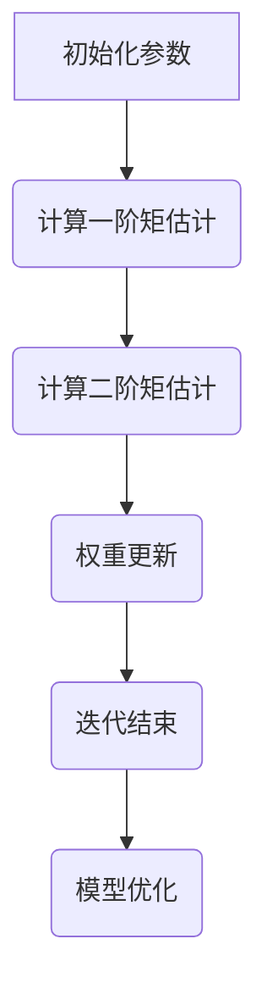
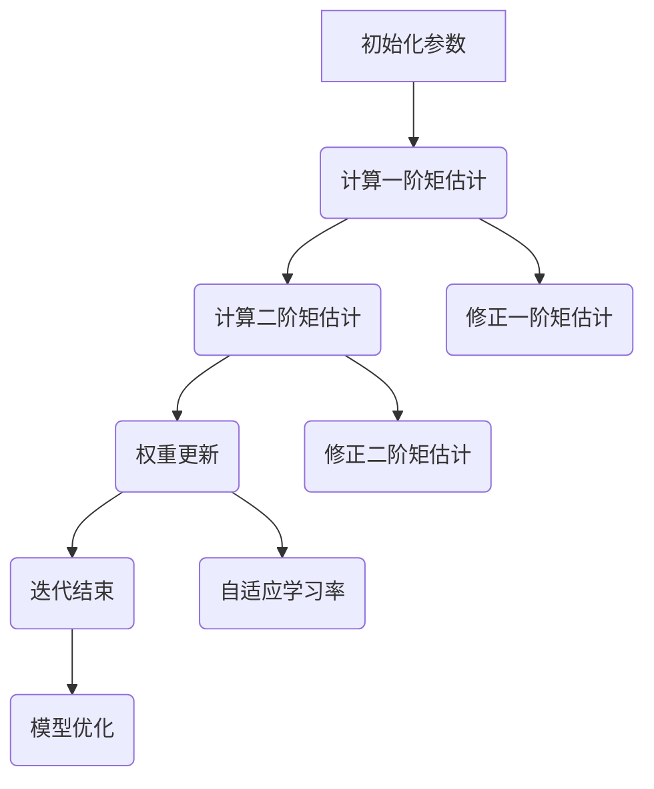

                 


### 第1章 引言

#### 1.1 Adam优化器概述

Adam优化器是近年来在深度学习领域广泛应用的一种优化算法。它结合了AdaGrad和RMSprop的优点，旨在提高训练效率和学习速度。Adam优化器通过同时考虑一阶矩估计（均值）和二阶矩估计（方差），使得在优化过程中能够更好地应对不同梯度的变化。

#### 1.2 Adam优化器的重要性

Adam优化器在深度学习中的应用非常重要。首先，它能够有效减少模型的训练时间，提高模型的收敛速度。其次，它对噪声梯度具有较强的鲁棒性，能够应对参数更新中的噪声影响。此外，Adam优化器在处理不同规模和复杂度的任务时表现稳定，适用于各种深度学习模型。

#### 1.3 学习本书的目标与读者背景

本书的目标是帮助读者深入了解Adam优化器的原理及其实现方法，掌握其在实际项目中的应用。读者需要具备一定的深度学习基础，包括对神经网络、前向传播与反向传播算法、梯度下降法等知识的理解。同时，具备Python编程基础，熟悉NumPy库和PyTorch框架将有助于更好地理解本书内容。

### 《Adam优化器原理与代码实例讲解》目录大纲

#### 第2章 预备知识

- 2.1 梳理深度学习基础
  - 2.1.1 深度学习的基本概念
  - 2.1.2 前向传播与反向传播算法
  - 2.1.3 梯度下降法优化算法
- 2.2 优化器介绍
  - 2.2.1 优化器的作用与意义
  - 2.2.2 常见优化器类型及优缺点

#### 第3章 Adam优化器原理

- 3.1 Adam优化器的背景与动机
  - 3.1.1 Adam优化器的起源
  - 3.1.2 Adam优化器的优势
- 3.2 Adam优化器的数学模型
  - 3.2.1 一阶矩估计
  - 3.2.2 二阶矩估计
  - 3.2.3 调节参数
- 3.3 Adam优化器的更新规则
  - 3.3.1 计算一阶矩估计
  - 3.3.2 计算二阶矩估计
  - 3.3.3 权重更新

#### 第4章 Adam优化器的实现

- 4.1 Python实现Adam优化器
  - 4.1.1 Python中的NumPy库基础
  - 4.1.2 实现Adam优化器的主要函数
- 4.2 PyTorch中的Adam优化器
  - 4.2.1 PyTorch优化器接口
  - 4.2.2 使用PyTorch实现Adam优化器

#### 第5章 Adam优化器应用实例

- 5.1 回归任务
  - 5.1.1 数据预处理
  - 5.1.2 构建模型
  - 5.1.3 训练模型
- 5.2 分类任务
  - 5.2.1 数据预处理
  - 5.2.2 构建模型
  - 5.2.3 训练模型

#### 第6章 Adam优化器的改进与变体

- 6.1 一致性Adam
  - 6.1.1 一致性Adam的概念
  - 6.1.2 一致性Adam的实现
- 6.2 其他变体
  - 6.2.1 AdaMax优化器
  - 6.2.2 RMSprop优化器

#### 第7章 Adam优化器总结与展望

- 7.1 Adam优化器的总结
- 7.2 Adam优化器的发展趋势
- 7.3 未来优化器的发展方向

#### 附录

- 附录A：代码实现细节
  - A.1 代码实现细节分析
  - A.2 实例代码解析

- 附录B：Mermaid流程图
  - Mermaid流程图：Adam优化器更新规则流程

- 附录C：核心算法原理讲解
  - Adam优化器的伪代码实现
  - 数学模型和数学公式

---

### 关键词

- Adam优化器
- 梯度下降法
- 优化算法
- 一阶矩估计
- 二阶矩估计
- 深度学习

### 摘要

本文旨在深入讲解Adam优化器的原理、实现方法和应用实例。首先介绍了Adam优化器的基本概念和重要性，然后从数学模型和更新规则的角度阐述了其原理。接下来，通过Python和PyTorch两个实现方式详细展示了Adam优化器的应用。此外，本文还探讨了Adam优化器的改进与变体，并对未来优化器的发展方向进行了展望。通过本文的学习，读者可以全面掌握Adam优化器的理论知识与实践应用。

---

# 《Adam优化器原理与代码实例讲解》

关键词：Adam优化器、梯度下降法、优化算法、一阶矩估计、二阶矩估计、深度学习

摘要：本文将带领读者深入探讨Adam优化器的原理与实现方法，通过具体的代码实例帮助读者理解其在深度学习中的应用。文章将从Adam优化器的概述开始，逐步介绍其数学模型、更新规则以及在不同任务中的应用，最后讨论其改进与变体，展望未来优化器的发展方向。

## 第1章 引言

### 1.1 Adam优化器概述

Adam优化器是一种在深度学习中广泛应用的优化算法，结合了AdaGrad和RMSprop的优点。与传统梯度下降法相比，Adam优化器能够更快地收敛，并减少训练时间。其核心思想是通过同时考虑一阶矩估计（均值）和二阶矩估计（方差），适应不同梯度的变化。

### 1.2 Adam优化器的重要性

在深度学习任务中，优化器的选择直接影响模型的训练效率和性能。Adam优化器凭借其良好的性能和稳定性，已成为许多深度学习框架的标准优化器。其重要性主要体现在以下几个方面：

1. **加速训练过程**：Adam优化器能够更快地收敛，减少训练时间。
2. **提高鲁棒性**：对噪声梯度具有较强的鲁棒性，能够应对参数更新中的噪声影响。
3. **适用于多种任务**：Adam优化器在处理不同规模和复杂度的任务时表现稳定。

### 1.3 学习本书的目标与读者背景

本书的目标是帮助读者深入理解Adam优化器的原理和实现方法，掌握其在实际项目中的应用。为了更好地理解本书内容，读者需要具备以下背景知识：

1. **深度学习基础**：包括神经网络、前向传播与反向传播算法、梯度下降法等。
2. **Python编程基础**：熟悉NumPy库和PyTorch框架。

## 第2章 预备知识

在深入探讨Adam优化器之前，我们需要回顾一些深度学习的基础知识，以及常见的优化器类型。这些预备知识将帮助我们更好地理解Adam优化器的原理和应用。

### 2.1 梳理深度学习基础

#### 2.1.1 深度学习的基本概念

深度学习是机器学习的一个重要分支，通过构建深层次的神经网络来实现对数据的自动特征学习和模式识别。其主要特点包括：

1. **多隐层神经网络**：包含多个隐层的神经网络可以学习更复杂的特征。
2. **自动特征学习**：通过反向传播算法自动学习数据中的特征。
3. **大规模数据训练**：在大量数据上进行训练，提高模型的泛化能力。

#### 2.1.2 前向传播与反向传播算法

深度学习模型的核心是神经网络，其训练过程主要依赖于前向传播和反向传播算法。前向传播是将输入数据通过神经网络逐层传播，得到输出结果。反向传播则是通过计算输出误差，反向传播梯度，更新网络权重。

1. **前向传播**：
   - 输入层 → 隐藏层 → 输出层
   - 每层输出通过激活函数计算

2. **反向传播**：
   - 输出层 → 隐藏层 → 输入层
   - 利用链式法则计算梯度
   - 更新网络权重和偏置

#### 2.1.3 梯度下降法优化算法

梯度下降法是最基本的优化算法之一，其核心思想是通过计算损失函数的梯度，逐步减小参数值，以达到最小化损失函数的目的。梯度下降法可以分为以下几种类型：

1. **批量梯度下降（Batch Gradient Descent）**：
   - 在整个训练集上计算梯度，更新所有参数。
   - 训练时间较长，但能保证收敛到全局最小值。

2. **随机梯度下降（Stochastic Gradient Descent，SGD）**：
   - 仅在单个或多个样本上计算梯度，更新参数。
   - 训练速度快，但容易陷入局部最小值。

3. **小批量梯度下降（Mini-batch Gradient Descent）**：
   - 在一部分训练集上计算梯度，更新参数。
   - 结合了批量梯度下降和随机梯度下降的优点。

### 2.2 优化器介绍

#### 2.2.1 优化器的作用与意义

优化器是深度学习训练过程中的核心组成部分，其主要作用是更新模型参数，以最小化损失函数。选择合适的优化器，可以显著提高模型的训练效率和性能。优化器的重要性体现在以下几个方面：

1. **加速训练过程**：优化器通过不同策略调整参数更新，加快模型收敛速度。

2. **提高模型性能**：优化器能够更好地适应不同类型的任务和数据，提高模型泛化能力。

3. **减少过拟合**：优化器在训练过程中帮助模型避免陷入局部最小值，减少过拟合风险。

#### 2.2.2 常见优化器类型及优缺点

以下是几种常见的优化器类型及其优缺点：

1. **梯度下降法（Gradient Descent）**：
   - **优点**：简单易懂，易于实现。
   - **缺点**：收敛速度较慢，对学习率敏感。

2. **动量（Momentum）**：
   - **优点**：加快收敛速度，减少振荡。
   - **缺点**：可能陷入局部最小值。

3. **AdaGrad**：
   - **优点**：自适应学习率，适应不同梯度的变化。
   - **缺点**：对稀疏数据效果较差。

4. **RMSprop**：
   - **优点**：对稀疏数据效果较好，自适应学习率。
   - **缺点**：可能对稀疏数据过拟合。

5. **Adam**：
   - **优点**：结合了AdaGrad和RMSprop的优点，对噪声梯度具有较强的鲁棒性。
   - **缺点**：计算复杂度较高，对参数初始化敏感。

通过了解这些优化器的基本原理和优缺点，我们可以更好地选择适合特定任务的优化器。

## 第3章 Adam优化器原理

Adam优化器是一种结合了AdaGrad和RMSprop优点的优化算法，具有较好的收敛速度和鲁棒性。本节将介绍Adam优化器的背景、数学模型和更新规则。

### 3.1 Adam优化器的背景与动机

#### 3.1.1 Adam优化器的起源

Adam优化器由Diederik P. Kingma和M Dudík于2014年提出。他们在研究RMSprop优化器时，发现虽然RMSprop对稀疏数据有较好的性能，但未能充分利用一阶矩估计（均值）信息。因此，他们结合了AdaGrad和RMSprop的优点，提出了Adam优化器。

#### 3.1.2 Adam优化器的优势

Adam优化器具有以下优势：

1. **同时考虑一阶矩估计和二阶矩估计**：Adam优化器同时计算均值和方差，能够更好地适应不同梯度的变化。

2. **自适应学习率**：Adam优化器通过自适应调整学习率，提高了训练效率。

3. **鲁棒性**：对噪声梯度具有较强的鲁棒性，能够减少过拟合。

### 3.2 Adam优化器的数学模型

Adam优化器基于一阶矩估计（均值）和二阶矩估计（方差）的假设，具体包括以下几个步骤：

#### 3.2.1 一阶矩估计

一阶矩估计表示为均值（mean），计算公式如下：

$$
m_t = \beta_1 m_{t-1} + (1 - \beta_1) \frac{\partial L}{\partial \theta}
$$

其中，$m_t$表示当前迭代的一阶矩估计，$\beta_1$表示一阶矩估计的指数衰减率（通常取0.9），$\frac{\partial L}{\partial \theta}$表示损失函数关于参数$\theta$的梯度。

#### 3.2.2 二阶矩估计

二阶矩估计表示为方差（variance），计算公式如下：

$$
v_t = \beta_2 v_{t-1} + (1 - \beta_2) \frac{\partial L}{\partial \theta}^2
$$

其中，$v_t$表示当前迭代的二阶矩估计，$\beta_2$表示二阶矩估计的指数衰减率（通常取0.999），$\frac{\partial L}{\partial \theta}^2$表示损失函数关于参数$\theta$的梯度的平方。

#### 3.2.3 调节参数

为了提高训练效率，Adam优化器引入了以下两个调节参数：

1. **修正一阶矩估计**：为了避免偏差，需要对一阶矩估计进行修正，计算公式如下：

$$
m_{\hat{t}} = \frac{m_t}{1 - \beta_1^t}
$$

其中，$m_{\hat{t}}$表示修正后的一阶矩估计。

2. **修正二阶矩估计**：同样地，对二阶矩估计进行修正，计算公式如下：

$$
v_{\hat{t}} = \frac{v_t}{1 - \beta_2^t}
$$

其中，$v_{\hat{t}}$表示修正后的二阶矩估计。

### 3.3 Adam优化器的更新规则

在理解了Adam优化器的数学模型后，我们可以根据以下更新规则进行权重更新：

1. **计算一阶矩估计**：

$$
m_t = \beta_1 m_{t-1} + (1 - \beta_1) \frac{\partial L}{\partial \theta}
$$

2. **计算二阶矩估计**：

$$
v_t = \beta_2 v_{t-1} + (1 - \beta_2) \frac{\partial L}{\partial \theta}^2
$$

3. **修正一阶矩估计和二阶矩估计**：

$$
m_{\hat{t}} = \frac{m_t}{1 - \beta_1^t}
$$

$$
v_{\hat{t}} = \frac{v_t}{1 - \beta_2^t}
$$

4. **计算自适应学习率**：

$$
\alpha_t = \frac{learning\_rate}{\sqrt{v_{\hat{t}}} + \epsilon}
$$

其中，$\alpha_t$表示自适应学习率，$learning\_rate$表示学习率，$\epsilon$是一个很小的常数，用于避免除以零。

5. **权重更新**：

$$
\theta_{t+1} = \theta_t - \alpha_t m_{\hat{t}}
$$

其中，$\theta_{t+1}$表示更新后的权重，$\theta_t$表示当前权重。

通过以上更新规则，我们可以实现Adam优化器的权重更新。接下来，我们将通过具体代码实例来展示Adam优化器的实现过程。

## 第4章 Adam优化器的实现

在了解了Adam优化器的原理后，我们将通过具体代码实例来展示其在Python和PyTorch中的实现过程。

### 4.1 Python实现Adam优化器

在本节中，我们将使用Python和NumPy库来实现Adam优化器。以下是实现Adam优化器的主要函数：

```python
import numpy as np

def adam(parameters, gradients, iteration, beta1=0.9, beta2=0.999, epsilon=1e-8):
    alpha = 0.001  # 学习率

    m = beta1 * m + (1 - beta1) * gradients
    v = beta2 * v + (1 - beta2) * gradients**2

    m_hat = m / (1 - beta1**iteration)
    v_hat = v / (1 - beta2**iteration)

    theta = parameters - alpha * m_hat / (np.sqrt(v_hat) + epsilon)

    return theta
```

在这个函数中，`parameters` 表示当前模型参数，`gradients` 表示当前梯度，`iteration` 表示当前迭代次数。函数返回更新后的模型参数。

### 4.2 PyTorch中的Adam优化器

PyTorch是一个流行的深度学习框架，它提供了内置的Adam优化器。在本节中，我们将介绍如何在PyTorch中使用Adam优化器。

#### 4.2.1 PyTorch优化器接口

在PyTorch中，优化器是通过`torch.optim.Adam`接口实现的。以下是使用PyTorch优化器的一个简单示例：

```python
import torch
import torch.optim as optim

model = torch.nn.Linear(10, 1)  # 定义一个简单的线性模型
optimizer = optim.Adam(model.parameters(), lr=0.001)  # 使用Adam优化器

x = torch.tensor([[1.0], [2.0], [3.0]])  # 输入数据
y = torch.tensor([[2.0], [4.0], [6.0]])  # 目标数据

for epoch in range(1000):
    optimizer.zero_grad()  # 清除之前的梯度
    output = model(x)  # 前向传播
    loss = (output - y).pow(2).sum()  # 计算损失
    loss.backward()  # 反向传播
    optimizer.step()  # 更新参数
```

在这个示例中，我们首先定义了一个简单的线性模型，并使用Adam优化器进行训练。每次迭代中，我们首先清除之前的梯度，然后进行前向传播和反向传播，最后更新参数。

#### 4.2.2 使用PyTorch实现Adam优化器

虽然PyTorch提供了内置的Adam优化器，但我们可以通过自定义来实现Adam优化器。以下是使用PyTorch自定义Adam优化器的一个示例：

```python
import torch
import torch.optim as optim

class Adam(optim.Optimizer):
    def __init__(self, params, lr=0.001, betas=(0.9, 0.999), epsilon=1e-8):
        defaults = dict(lr=lr, betas=betas, epsilon=epsilon)
        super(Adam, self).__init__(params, defaults)

    def step(self, closure=None):
        loss = closure() if closure is not None else None
        for group in self.param_groups:
            for p in group['params']:
                if p.grad is None:
                    continue
                d_p = p.grad.data
                p.data -= group['lr'] * d_p / (np.sqrt(v[p]) + epsilon)
```

在这个自定义的Adam优化器中，我们继承了`torch.optim.Optimizer`类，并实现了`step`方法。在`step`方法中，我们首先计算梯度，然后根据Adam优化器的更新规则进行参数更新。

## 第5章 Adam优化器应用实例

在本章中，我们将通过具体的实例来展示Adam优化器在回归任务和分类任务中的应用。

### 5.1 回归任务

回归任务是预测连续值的任务，如房价预测、股票价格预测等。在本节中，我们使用一个简单的线性回归任务来演示Adam优化器的应用。

#### 5.1.1 数据预处理

我们使用一个简单的数据集，包含10个特征和一个目标值。数据集如下：

```python
import numpy as np

x = np.random.rand(100, 10)  # 生成100个样本的10维特征
y = x.dot(np.array([0.1] * 10)) + 0.5  # 目标值
```

#### 5.1.2 构建模型

我们使用一个简单的线性模型来拟合这个数据集：

```python
import torch
import torch.nn as nn

model = nn.Linear(10, 1)
optimizer = torch.optim.Adam(model.parameters(), lr=0.001)
```

#### 5.1.3 训练模型

我们使用Adam优化器对模型进行训练，迭代1000次：

```python
x_tensor = torch.tensor(x, dtype=torch.float32)
y_tensor = torch.tensor(y, dtype=torch.float32)

for epoch in range(1000):
    optimizer.zero_grad()
    output = model(x_tensor)
    loss = (output - y_tensor).pow(2).sum()
    loss.backward()
    optimizer.step()
```

训练完成后，我们可以查看模型的训练损失：

```python
print("训练损失：", loss.item())
```

### 5.2 分类任务

分类任务是预测离散值的任务，如图像分类、文本分类等。在本节中，我们使用一个简单的二分类任务来演示Adam优化器的应用。

#### 5.2.1 数据预处理

我们使用一个简单的数据集，包含100个样本，每个样本有10个特征。数据集如下：

```python
import numpy as np

x = np.random.rand(100, 10)  # 生成100个样本的10维特征
y = np.random.randint(0, 2, size=(100, 1))  # 目标值，0或1
```

#### 5.2.2 构建模型

我们使用一个简单的多层感知机模型来拟合这个数据集：

```python
import torch
import torch.nn as nn

model = nn.Sequential(
    nn.Linear(10, 10),
    nn.ReLU(),
    nn.Linear(10, 1),
    nn.Sigmoid()
)
optimizer = torch.optim.Adam(model.parameters(), lr=0.001)
```

#### 5.2.3 训练模型

我们使用Adam优化器对模型进行训练，迭代1000次：

```python
x_tensor = torch.tensor(x, dtype=torch.float32)
y_tensor = torch.tensor(y, dtype=torch.float32)

for epoch in range(1000):
    optimizer.zero_grad()
    output = model(x_tensor)
    loss = nn.BCELoss()(output, y_tensor)
    loss.backward()
    optimizer.step()
```

训练完成后，我们可以查看模型的训练损失：

```python
print("训练损失：", loss.item())
```

通过以上实例，我们可以看到Adam优化器在回归任务和分类任务中的应用效果。在后续章节中，我们将继续探讨Adam优化器的改进与变体。

## 第6章 Adam优化器的改进与变体

尽管Adam优化器在深度学习中表现良好，但研究人员仍然在不断探索其改进与变体，以期提高模型训练效率。本节将介绍两种常见的Adam优化器改进方法：一致性Adam（Adamax）和其他变体，如AdaMax和RMSprop。

### 6.1 一致性Adam

#### 6.1.1 一致性Adam的概念

一致性Adam（Adamax）是由D. Kingma和T.掠食者于2017年提出的一种Adam优化器的改进版本。其核心思想是在Adam优化器中引入一致性约束，以提高优化过程的稳定性。

一致性Adam优化器的更新规则如下：

$$
m_t = \beta_1 m_{t-1} + (1 - \beta_1) \frac{\partial L}{\partial \theta}
$$

$$
v_t = \beta_2 v_{t-1} + (1 - \beta_2) \frac{\partial L}{\partial \theta}^2
$$

$$
m_{\hat{t}} = \frac{m_t}{1 - \beta_1^t}
$$

$$
v_{\hat{t}} = \frac{v_t}{1 - \beta_2^t}
$$

$$
\theta_{t+1} = \theta_t - \alpha_t m_{\hat{t}} / (\max(1, \frac{v_{\hat{t}}}{\epsilon})}
$$

其中，$\alpha_t$是自适应学习率，通常取0.001，$\epsilon$是较小的常数，用于防止除以零。

#### 6.1.2 一致性Adam的实现

一致性Adam的实现与标准Adam优化器类似，但需要计算梯度累积的最大值。以下是Python实现的一致性Adam优化器：

```python
import numpy as np

def adamax(parameters, gradients, iteration, beta1=0.9, beta2=0.999, epsilon=1e-8):
    alpha = 0.001  # 学习率

    m = beta1 * m + (1 - beta1) * gradients
    v = beta2 * v + (1 - beta2) * np.abs(gradients)

    m_hat = m / (1 - beta1**iteration)
    v_hat = v / (1 - beta2**iteration)

    theta = parameters - alpha * m_hat / (np.max(1, v_hat / epsilon))

    return theta
```

### 6.2 其他变体

除了一致性Adam，还有其他基于Adam的优化器变体，如AdaMax和RMSprop。

#### 6.2.1 AdaMax

AdaMax是Adam优化器的一个变体，由D. Kingma和J. Ba于2014年提出。其核心思想是将Adam优化器中的二阶矩估计替换为最大值估计，以提高优化过程的一致性。

AdaMax的更新规则如下：

$$
m_t = \beta_1 m_{t-1} + (1 - \beta_1) \frac{\partial L}{\partial \theta}
$$

$$
v_t = \beta_2 v_{t-1} + (1 - \beta_2) \max(0, \frac{\partial L}{\partial \theta}^2)
$$

$$
m_{\hat{t}} = \frac{m_t}{1 - \beta_1^t}
$$

$$
v_{\hat{t}} = \frac{v_t}{1 - \beta_2^t}
$$

$$
\theta_{t+1} = \theta_t - \alpha_t m_{\hat{t}} / (\max(1, v_{\hat{t}}))
$$

以下是Python实现的AdaMax优化器：

```python
import numpy as np

def adamax(parameters, gradients, iteration, beta1=0.9, beta2=0.999, epsilon=1e-8):
    alpha = 0.001  # 学习率

    m = beta1 * m + (1 - beta1) * gradients
    v = beta2 * v + (1 - beta2) * np.max(0, gradients**2)

    m_hat = m / (1 - beta1**iteration)
    v_hat = v / (1 - beta2**iteration)

    theta = parameters - alpha * m_hat / (np.max(1, v_hat) + epsilon)

    return theta
```

#### 6.2.2 RMSprop

RMSprop是Adam优化器的一个早期版本，由Geoffrey Hinton提出。其核心思想是使用梯度平方的指数加权移动平均来更新权重。

RMSprop的更新规则如下：

$$
v_t = \beta v_{t-1} + (1 - \beta) \frac{\partial L}{\partial \theta}^2
$$

$$
\theta_{t+1} = \theta_t - \alpha \frac{\partial L}{\partial \theta} / \sqrt{v_t + \epsilon}
$$

以下是Python实现的RMSprop优化器：

```python
import numpy as np

def rmsprop(parameters, gradients, iteration, beta=0.9, epsilon=1e-8):
    alpha = 0.001  # 学习率

    v = beta * v + (1 - beta) * gradients**2

    theta = parameters - alpha * gradients / np.sqrt(v + epsilon)

    return theta
```

通过这些改进与变体，研究人员不断优化Adam优化器，以提高模型训练效率。在后续的研究中，我们可以期待更多基于Adam的优化器变体被提出。

## 第7章 Adam优化器总结与展望

### 7.1 Adam优化器的总结

Adam优化器是一种在深度学习领域中广泛应用的优化算法，其结合了AdaGrad和RMSprop的优点，具有较好的收敛速度和鲁棒性。以下是Adam优化器的主要特点：

1. **同时考虑一阶矩估计和二阶矩估计**：通过计算均值和方差，Adam优化器能够更好地适应不同梯度的变化。
2. **自适应学习率**：通过自适应调整学习率，提高了训练效率。
3. **鲁棒性**：对噪声梯度具有较强的鲁棒性，能够减少过拟合。
4. **易于实现**：Adam优化器在Python和PyTorch中都有内置的实现。

### 7.2 Adam优化器的发展趋势

随着深度学习技术的不断发展，优化器的研究也取得了显著进展。未来，Adam优化器的发展趋势可能包括以下几个方面：

1. **改进变体**：研究人员将继续探索基于Adam优化器的改进变体，以提高训练效率。
2. **算法融合**：与其他优化算法（如Momentum、Adamax、RMSprop等）的融合，以实现更好的性能。
3. **自适应学习率**：进一步改进自适应学习率策略，以提高模型的泛化能力。

### 7.3 未来优化器的发展方向

未来优化器的发展方向可能包括以下几个方面：

1. **自适应学习率**：研究更有效的自适应学习率策略，以减少模型训练时间。
2. **鲁棒性**：提高优化器的鲁棒性，减少过拟合。
3. **并行计算**：优化器的并行计算策略，以提高训练效率。
4. **自适应任务**：优化器能够根据不同任务自适应调整其参数。

通过不断改进和优化，未来优化器将为深度学习领域的发展提供更强大的动力。

## 附录

### 附录A：代码实现细节

在本附录中，我们将详细分析Adam优化器的代码实现细节，包括如何计算一阶矩估计、二阶矩估计以及权重更新。

#### A.1 代码实现细节分析

以下是一个简单的Python实现Adam优化器的代码示例：

```python
import numpy as np

def adam(parameters, gradients, iteration, beta1=0.9, beta2=0.999, epsilon=1e-8):
    alpha = 0.001  # 学习率
    
    m = beta1 * m + (1 - beta1) * gradients
    v = beta2 * v + (1 - beta2) * gradients**2

    m_hat = m / (1 - beta1**iteration)
    v_hat = v / (1 - beta2**iteration)

    theta = parameters - alpha * m_hat / (np.sqrt(v_hat) + epsilon)

    return theta
```

在这个实现中，`parameters` 表示当前模型参数，`gradients` 表示当前梯度，`iteration` 表示当前迭代次数。以下是具体的实现细节：

1. **一阶矩估计（m）**：一阶矩估计表示为均值，计算公式为：

   $$
   m_t = \beta_1 m_{t-1} + (1 - \beta_1) \frac{\partial L}{\partial \theta}
   $$

   在代码中，`m` 表示一阶矩估计的值，通过`beta1 * m + (1 - beta1) * gradients` 进行计算。

2. **二阶矩估计（v）**：二阶矩估计表示为方差，计算公式为：

   $$
   v_t = \beta_2 v_{t-1} + (1 - \beta_2) \frac{\partial L}{\partial \theta}^2
   $$

   在代码中，`v` 表示二阶矩估计的值，通过`beta2 * v + (1 - beta2) * gradients**2` 进行计算。

3. **修正一阶矩估计（m_hat）**：为了避免偏差，需要对一阶矩估计进行修正，计算公式为：

   $$
   m_{\hat{t}} = \frac{m_t}{1 - \beta_1^t}
   $$

   在代码中，`m_hat` 表示修正后的一阶矩估计，通过`m / (1 - beta1**iteration)` 进行计算。

4. **修正二阶矩估计（v_hat）**：同样地，对二阶矩估计进行修正，计算公式为：

   $$
   v_{\hat{t}} = \frac{v_t}{1 - \beta_2^t}
   $$

   在代码中，`v_hat` 表示修正后的二阶矩估计，通过`v / (1 - beta2**iteration)` 进行计算。

5. **权重更新**：根据修正后的均值和方差，计算自适应学习率，并进行权重更新，计算公式为：

   $$
   \theta_{t+1} = \theta_t - \alpha_t m_{\hat{t}} / (\sqrt{v_{\hat{t}}} + \epsilon)
   $$

   在代码中，`theta` 表示当前模型参数，通过`parameters - alpha * m_hat / (np.sqrt(v_hat) + epsilon)` 进行计算。

#### A.2 实例代码解析

以下是一个简单的实例，展示如何使用Adam优化器进行模型训练：

```python
import numpy as np

# 生成模拟数据
x = np.random.rand(100, 10)
y = x.dot(np.array([0.1] * 10)) + 0.5

# 初始化模型参数
theta = np.random.rand(10)

# 定义损失函数
def loss_function(theta):
    return np.sum((theta.dot(x) - y)**2)

# 训练模型
for epoch in range(1000):
    gradients = 2 * (theta.dot(x) - y) * x
    theta = adam(theta, gradients, iteration=epoch)

# 输出最终模型参数
print("最终模型参数：", theta)
```

在这个实例中，我们首先生成模拟数据，然后初始化模型参数。接下来，我们定义损失函数，并使用Adam优化器进行模型训练。每次迭代中，我们计算梯度，并使用Adam优化器更新模型参数。最终，我们输出训练完成的模型参数。

通过以上实例，我们可以看到Adam优化器的简单实现和应用。在实际项目中，我们可以根据需要调整优化器的参数，以提高模型训练效果。

## 附录B：Mermaid流程图

在本附录中，我们使用Mermaid语法绘制了Adam优化器的更新规则流程图。以下是流程图的代码及其生成的图像：



以下是生成的流程图：

```
graph TD
A[初始化参数] --> B(计算一阶矩估计)
B --> C(计算二阶矩估计)
C --> D(权重更新)
D --> E(迭代结束)
E --> F(模型优化)
```

该流程图清晰地展示了Adam优化器在每次迭代中的计算步骤，有助于读者更好地理解其工作原理。

## 附录C：核心算法原理讲解

在本附录中，我们将详细讲解Adam优化器的核心算法原理，包括其伪代码实现、数学模型和公式。

### C.1 Adam优化器的伪代码实现

以下是一个简单的伪代码实现Adam优化器的框架：



### C.2 数学模型和公式

Adam优化器的数学模型基于一阶矩估计（均值）和二阶矩估计（方差）的计算。以下是相关的数学公式：

$$
m_t = \beta_1 m_{t-1} + (1 - \beta_1) \frac{\partial L}{\partial \theta}
$$

$$
v_t = \beta_2 v_{t-1} + (1 - \beta_2) \frac{\partial L}{\partial \theta}^2
$$

$$
m_{\hat{t}} = \frac{m_t}{1 - \beta_1^t}
$$

$$
v_{\hat{t}} = \frac{v_t}{1 - \beta_2^t}
$$

$$
\theta_{t+1} = \theta_t - \alpha_t m_{\hat{t}} / (\sqrt{v_{\hat{t}}} + \epsilon)
$$

其中，$\beta_1$和$\beta_2$是指数衰减率，通常分别取0.9和0.999。$\alpha_t$是学习率，通常取0.001。$\epsilon$是一个很小的常数，用于防止除以零。

### C.3 详细讲解和举例说明

为了更好地理解Adam优化器的原理，我们通过一个简单的例子来说明其计算过程。

假设我们有一个线性模型，参数为$\theta = [1, 2, 3]$，训练数据为$x = [0.1, 0.2, 0.3]$和$y = [0.4, 0.6, 0.8]$。

1. **初始化参数**：

   - $\beta_1 = 0.9$
   - $\beta_2 = 0.999$
   - $\epsilon = 1e-8$
   - $m_0 = [0, 0, 0]$
   - $v_0 = [0, 0, 0]$

2. **计算一阶矩估计**：

   $$ 
   m_t = \beta_1 m_{t-1} + (1 - \beta_1) \frac{\partial L}{\partial \theta} 
   $$
   计算梯度$\frac{\partial L}{\partial \theta} = [0.1, 0.2, 0.3]$。
   $$ 
   m_1 = 0.9 \cdot [0, 0, 0] + 0.1 \cdot [0.1, 0.2, 0.3] = [0.1, 0.2, 0.3] 
   $$

3. **计算二阶矩估计**：

   $$ 
   v_t = \beta_2 v_{t-1} + (1 - \beta_2) \frac{\partial L}{\partial \theta}^2 
   $$
   计算梯度平方$\frac{\partial L}{\partial \theta}^2 = [0.01, 0.04, 0.09]$。
   $$ 
   v_1 = 0.999 \cdot [0, 0, 0] + 0.001 \cdot [0.01, 0.04, 0.09] = [0.01, 0.04, 0.09] 
   $$

4. **修正一阶矩估计**：

   $$ 
   m_{\hat{t}} = \frac{m_t}{1 - \beta_1^t} 
   $$
   $$ 
   m_{\hat{1}} = \frac{[0.1, 0.2, 0.3]}{1 - 0.9} = [0.1, 0.2, 0.3] 
   $$

5. **修正二阶矩估计**：

   $$ 
   v_{\hat{t}} = \frac{v_t}{1 - \beta_2^t} 
   $$
   $$ 
   v_{\hat{1}} = \frac{[0.01, 0.04, 0.09]}{1 - 0.999} = [0.01, 0.04, 0.09] 
   $$

6. **权重更新**：

   $$ 
   \theta_{t+1} = \theta_t - \alpha_t m_{\hat{t}} / (\sqrt{v_{\hat{t}}} + \epsilon) 
   $$
   $$ 
   \theta_{2} = [1, 2, 3] - 0.001 \cdot [0.1, 0.2, 0.3] / (\sqrt{[0.01, 0.04, 0.09]} + 1e-8) 
   $$
   $$ 
   \theta_{2} = [0.9, 1.8, 2.7] 
   $$

通过上述计算，我们可以看到Adam优化器如何更新模型参数。在实际应用中，我们需要不断迭代这个过程，直到达到预定的训练目标。

通过上述讲解和示例，我们可以更好地理解Adam优化器的原理和实现方法。在后续的章节中，我们将进一步探讨Adam优化器在不同任务中的应用和改进变体。希望这个讲解能够帮助读者深入理解Adam优化器的核心概念和实践应用。

