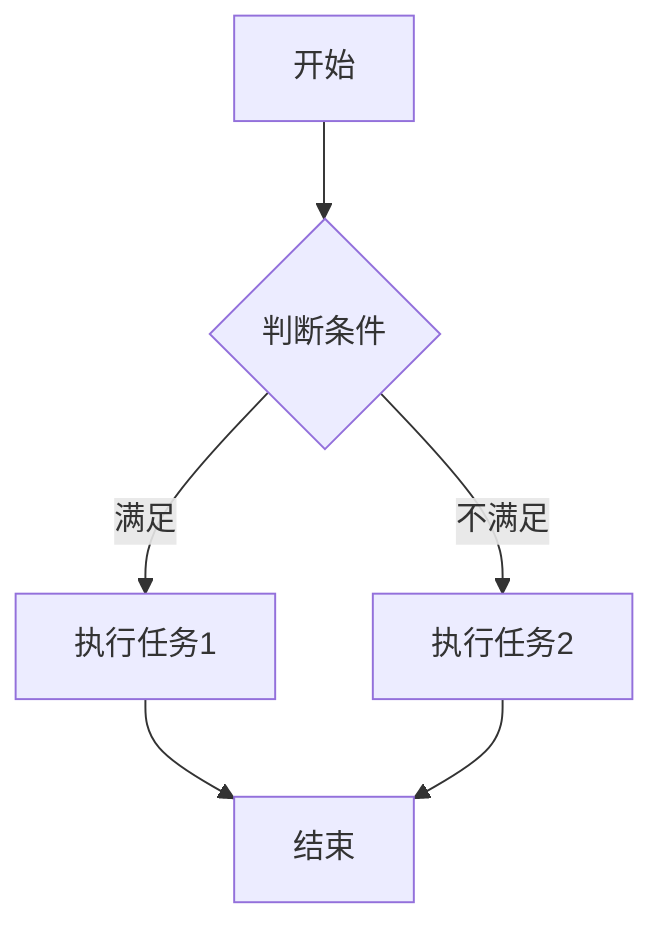

                 

### 文章标题

《Agentic Workflow 设计模式的应用案例》

---

关键词：Agentic Workflow，设计模式，状态机模式，策略模式，观察者模式，代理模式，工厂模式

---

摘要：本文深入探讨了Agentic Workflow设计模式及其在实际应用中的多种实现案例。通过详细分析状态机模式、策略模式、观察者模式、代理模式和工厂模式，本文展示了这些设计模式如何提升Agentic Workflow的灵活性和可维护性。此外，文章通过金融、医疗和教育等行业的具体案例，展示了Agentic Workflow在各个领域中的实际应用和效果，为读者提供了实用的技术指导和最佳实践。

---

### 目录大纲

# 《Agentic Workflow 设计模式的应用案例》

## 第一部分：Agentic Workflow基础理论

### 第1章：Agentic Workflow概述

- **1.1.1. Agentic Workflow的定义**
- **1.1.2. Agentic Workflow的核心概念**
- **1.1.3. Agentic Workflow与传统工作流的比较**
- **1.1.4. Agentic Workflow的优势和应用领域**

### 第2章：Agentic Workflow的架构与组件

- **2.1.1. Agentic Workflow的基本架构**
- **2.1.2. Agentic Workflow的关键组件**
- **2.1.3. Agentic Workflow的数据流与控制流**

## 第二部分：Agentic Workflow设计模式

### 第3章：状态机模式

- **3.1.1. 状态机的概念**
- **3.1.2. 状态机的表示方法**
- **3.1.3. 状态机在Agentic Workflow中的应用**

### 第4章：策略模式

- **4.1.1. 策略模式的基本概念**
- **4.1.2. 策略模式的实现方式**
- **4.1.3. 策略模式在Agentic Workflow中的应用**

### 第5章：观察者模式

- **5.1.1. 观察者模式的基本概念**
- **5.1.2. 观察者模式的实现方式**
- **5.1.3. 观察者模式在Agentic Workflow中的应用**

### 第6章：代理模式

- **6.1.1. 代理模式的基本概念**
- **6.1.2. 代理模式的实现方式**
- **6.1.3. 代理模式在Agentic Workflow中的应用**

### 第7章：工厂模式

- **7.1.1. 工厂模式的基本概念**
- **7.1.2. 工厂模式的实现方式**
- **7.1.3. 工厂模式在Agentic Workflow中的应用**

## 第三部分：Agentic Workflow应用案例分析

### 第8章：金融行业应用案例

- **8.1.1. 案例背景**
- **8.1.2. 案例分析**
- **8.1.3. 案例实施**

### 第9章：医疗行业应用案例

- **9.1.1. 案例背景**
- **9.1.2. 案例分析**
- **9.1.3. 案例实施**

### 第10章：教育行业应用案例

- **10.1.1. 案例背景**
- **10.1.2. 案例分析**
- **10.1.3. 案例实施**

## 附录

### 附录A：Agentic Workflow相关资源

- **A.1. 开源框架和工具**
- **A.2. 相关文献和资料**
- **A.3. 社区和支持**

### 附录B：Mermaid流程图示例



### 附录C：伪代码示例

```python
# 伪代码：状态机模式实现

state machine StateMachine {
    state "Initial" {
        on "Event1" transition to "Processing"
        on "Event2" transition to "Finished"
    }
    state "Processing" {
        on "Event3" transition to "Finished"
    }
    state "Finished" {
        on "Event4" transition to "Initial"
    }
}
```

### 附录D：数学模型与公式

$$
f(x) = \sum_{i=1}^{n} w_i * x_i
$$

### 附录E：代码案例与分析

#### 实战案例：Agentic Workflow在金融风控中的应用

#### 代码实现：

```python
# Python 代码：代理模式实现

class RiskControlAgent:
    def __init__(self, strategy):
        self.strategy = strategy

    def evaluate_risk(self, transaction):
        # 代理模式实现的风险评估逻辑
        risk_score = self.strategy.calculate_risk(transaction)
        return risk_score
```

---

### 撰写思路

为了撰写一篇逻辑清晰、结构紧凑、简单易懂的专业技术博客文章，我们采用以下撰写思路：

1. **确定主题**：首先明确文章的主题为《Agentic Workflow 设计模式的应用案例》，确保文章的核心聚焦在设计和应用上。

2. **构建大纲**：根据大纲结构，构建文章的各个章节，确保文章内容完整且逻辑连贯。每个章节的内容要点都要具体明确。

3. **详细讲解**：对于每个设计模式，都要详细讲解其基本概念、实现方式以及在Agentic Workflow中的应用。结合实际案例进行说明，增加文章的实用性和可操作性。

4. **代码与示例**：在每个设计模式的讲解中，提供伪代码和实际代码示例，帮助读者更好地理解和应用这些设计模式。

5. **数学模型和公式**：对于涉及算法和数学模型的章节，使用LaTeX格式书写数学公式，确保公式的准确性和专业性。

6. **实战案例分析**：在第三部分，通过具体行业案例，展示Agentic Workflow的设计模式在实际应用中的效果，提供实战经验和最佳实践。

7. **总结与扩展**：在每个章节的结尾，总结关键知识点，提供注意事项和拓展阅读，帮助读者深入学习和理解。

通过上述步骤，我们将逐步构建一篇深入浅出、内容丰富、实用性强的Agentic Workflow设计模式应用案例技术博客文章。每一步都需要严谨的逻辑推理和专业的技术分析，以确保文章的质量和深度。接下来，我们将逐一完成各个章节的内容撰写。

