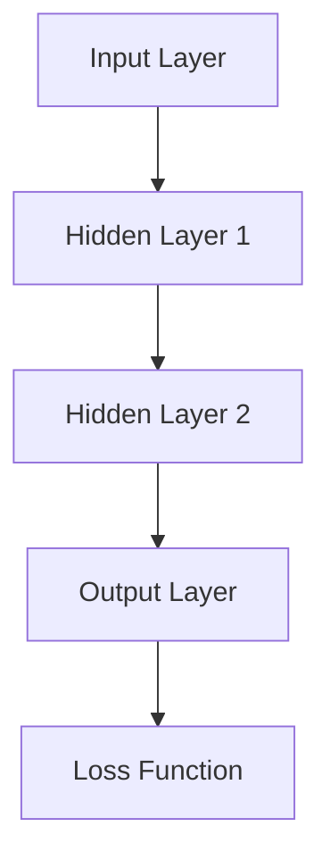
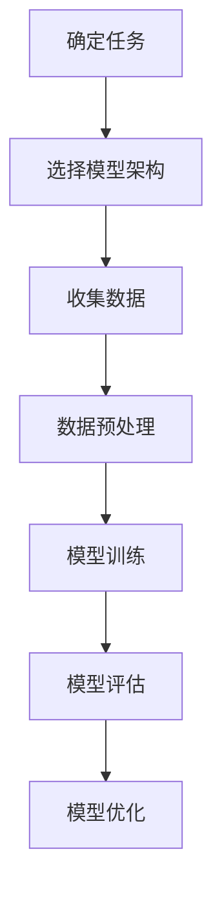

                 

# Andrej Karpathy：人工智能的未来发展趋势

## 关键词
- 人工智能
- 未来发展
- 深度学习
- 自然语言处理
- 社会影响

## 摘要
本文将探讨人工智能领域的未来发展趋势，特别关注Andrej Karpathy对人工智能发展的独到见解。文章分为三个主要部分：第一部分回顾人工智能的基础与历史背景，第二部分深入Andrej Karpathy的研究与观点，第三部分讨论人工智能的深入理解和未来挑战。通过本文，读者将全面了解人工智能的当前状态和未来可能的方向。

---

## 第一部分：人工智能的基础与历史背景

### 第1章：人工智能的起源与发展历程

#### 1.1 人工智能的概念与定义
人工智能（AI）是指由计算机系统执行的、通常需要人类智能来完成的各种任务。这些任务包括逻辑推理、知识表示、问题解决、学习和视觉识别等。

#### 1.2 人工智能的历史阶段
人工智能的发展可以分为几个阶段：
1. **初始阶段（1950-1969）**：人工智能的概念被提出，早期的AI系统主要基于规则和逻辑。
2. **繁荣期（1970-1989）**：专家系统和知识表示方法成为主流，但受限于计算能力和算法复杂性。
3. **低谷期（1990-2000）**：由于性能不佳和过度承诺，人工智能研究进入低谷。
4. **复兴期（2000-2010）**：深度学习的兴起带来了新的突破。
5. **加速期（2010至今）**：随着大数据和计算能力的提升，人工智能应用变得广泛。

#### 1.3 人工智能的重要里程碑
- 1956年：约翰·麦卡锡等人提出“人工智能”概念。
- 1969年：第一台机器人Shakey被开发。
- 1997年：IBM的深蓝击败国际象棋世界冠军加里·卡斯帕罗夫。
- 2012年：AlexNet在ImageNet大赛中取得突破性成绩。
- 2016年：AlphaGo击败世界围棋冠军李世石。

### 第2章：人工智能的核心技术

#### 2.1 机器学习基础
机器学习是人工智能的核心技术之一，通过数据训练模型来实现任务。主要算法包括：
- **监督学习**：有标签数据进行训练，如分类和回归。
- **无监督学习**：没有标签数据，如聚类和降维。
- **半监督学习和增强学习**：结合有标签和无标签数据或与环境的交互进行学习。

#### 2.2 深度学习原理
深度学习是机器学习的一个子领域，通过多层神经网络进行训练，以模拟人类大脑处理信息的方式。深度学习在图像识别、自然语言处理和语音识别等领域取得了显著成果。

##### Mermaid流程图：深度学习模型的基本结构



#### 2.3 自然语言处理技术
自然语言处理（NLP）是人工智能在语言领域的应用，旨在让计算机理解和处理自然语言。关键技术包括：
- **词向量表示**：将单词转换为向量表示，如Word2Vec和GloVe。
- **语言模型**：训练模型来预测下一个单词或句子，如RNN、LSTM和Transformer。
- **机器翻译**：将一种语言的文本翻译成另一种语言，如Google翻译和DeepL。

#### 2.4 计算机视觉技术
计算机视觉是人工智能在图像和视频领域的应用，旨在让计算机“看到”和理解图像内容。关键技术包括：
- **图像识别**：识别图像中的对象和场景。
- **目标检测**：检测图像中的多个对象。
- **图像生成**：生成新的图像内容，如GAN（生成对抗网络）。

### 第3章：人工智能的应用领域

#### 3.1 自动驾驶
自动驾驶技术利用人工智能进行车辆的控制和导航，以实现无人驾驶。关键挑战包括：
- **感知环境**：通过传感器（如摄像头、激光雷达）获取周围信息。
- **决策制定**：根据感知信息进行路径规划和障碍物避让。
- **实时响应**：快速响应突发情况。

#### 3.2 医疗健康
人工智能在医疗健康领域的应用包括疾病诊断、药物发现和个性化治疗。关键优势包括：
- **数据分析**：从大量医疗数据中提取有用信息。
- **辅助诊断**：提供准确的疾病预测和诊断。
- **药物开发**：加速新药发现和临床试验。

#### 3.3 金融科技
人工智能在金融科技领域的应用包括风险管理、欺诈检测和投资策略。关键优势包括：
- **预测分析**：预测市场走势和客户行为。
- **自动化交易**：实现高效和精确的交易。
- **客户服务**：通过聊天机器人提供个性化的客户服务。

#### 3.4 教育领域
人工智能在教育领域的应用包括智能辅导、在线学习和教育数据分析。关键优势包括：
- **个性化学习**：根据学生的学习习惯和进度提供定制化内容。
- **资源优化**：自动分配教学资源和课程。
- **学习评估**：通过数据分析提供学习成果评估。

### 第4章：人工智能的社会影响与伦理问题

#### 4.1 人工智能对社会的影响
人工智能对社会带来了深远的影响，包括：
- **就业变革**：自动化技术可能导致某些职业的减少，同时也创造了新的工作机会。
- **经济发展**：人工智能技术推动了新的产业和商业模式。
- **社会服务**：人工智能提高了公共服务的效率和可及性。

#### 4.2 人工智能的伦理问题
人工智能的伦理问题包括：
- **隐私保护**：如何保护个人数据隐私。
- **算法偏见**：如何确保算法的公平性和透明度。
- **责任归属**：当人工智能系统造成损害时，责任应如何归属。

#### 4.3 人工智能的政策与监管
为了应对人工智能的挑战，各国政府开始制定相应的政策和监管框架，以促进技术创新和保障社会福祉。

### 第5章：人工智能的未来发展趋势

#### 5.1 人工智能的发展趋势
人工智能的未来发展趋势包括：
- **更加智能化**：人工智能系统将具备更复杂的任务处理能力。
- **更广泛的领域**：人工智能将应用于更多的行业和领域。
- **更高的性能**：随着计算能力的提升，人工智能系统的性能将进一步提高。

#### 5.2 人工智能的未来预测
人工智能的未来预测包括：
- **全面自动化**：许多传统工作将被自动化系统取代。
- **超级智能**：理论上，人工智能系统可能达到超越人类智能的水平。
- **人机融合**：人工智能将与人类更紧密地融合，实现更高效的协作。

#### 5.3 人工智能对人类未来的影响
人工智能对人类未来的影响包括：
- **生活方式**：人工智能将改变人们的生活方式和工作模式。
- **社会结构**：人工智能将重塑社会结构和经济模式。
- **伦理道德**：人工智能带来的挑战将引发关于人类价值观和伦理道德的深刻讨论。

---

## 第二部分：Andrej Karpathy对人工智能未来发展的观点

### 第6章：Andrej Karpathy的研究与贡献

#### 6.1 Andrej Karpathy的学术背景
Andrej Karpathy是一位知名的人工智能研究者，他在深度学习和自然语言处理领域取得了显著的成就。他曾在斯坦福大学攻读博士学位，并在多家顶级科技公司担任人工智能研究员。

#### 6.2 Andrej Karpathy的重要研究
Andrej Karpathy在深度学习领域的研究涵盖了多个重要方向，包括：
- **自然语言处理**：他在生成文本、机器翻译和对话系统等方面取得了突破性成果。
- **计算机视觉**：他在图像识别、目标检测和图像生成等方面做出了贡献。
- **强化学习**：他研究了如何将深度学习与强化学习相结合，以解决复杂决策问题。

#### 6.3 Andrej Karpathy的观点与理念
Andrej Karpathy认为，人工智能的发展将带来巨大的变革，但同时也伴随着风险和挑战。他强调人工智能应遵循以下原则：
- **透明性和可解释性**：确保人工智能系统的决策过程是透明和可解释的。
- **公平性和包容性**：避免算法偏见，确保人工智能系统对所有人群都是公平的。
- **责任和道德**：明确人工智能系统的责任归属，并确保其符合道德标准。

### 第7章：Andrej Karpathy对人工智能未来发展的看法

#### 7.1 人工智能的技术趋势
Andrej Karpathy认为，人工智能的技术发展趋势将包括：
- **更加智能化和自适应**：人工智能系统将能够更好地理解和适应复杂环境。
- **跨学科融合**：人工智能与其他领域的融合将带来更多创新。
- **更多自主决策**：人工智能系统将在更多场景下实现自主决策。

#### 7.2 人工智能的社会影响
Andrej Karpathy认为，人工智能将对社会产生深远影响，包括：
- **经济转型**：人工智能将推动经济模式的转变，创造新的就业机会。
- **社会结构变革**：人工智能将改变社会结构和人际关系。
- **教育变革**：人工智能将改变教育和学习方式。

#### 7.3 人工智能的伦理与道德
Andrej Karpathy强调，人工智能的伦理与道德问题至关重要。他提出以下观点：
- **责任归属**：明确人工智能系统的责任归属，避免道德责任真空。
- **伦理审查**：建立人工智能伦理审查机制，确保系统符合伦理标准。
- **公众参与**：鼓励公众参与人工智能的讨论和决策，确保技术的可持续发展。

### 第8章：Andrej Karpathy对人工智能从业者的建议

#### 8.1 成为人工智能专家的路径
Andrej Karpathy建议，要成为人工智能专家，应遵循以下路径：
- **基础知识**：掌握计算机科学、数学和统计学的基础知识。
- **专业学习**：深入学习深度学习、自然语言处理和计算机视觉等领域的知识。
- **实践经验**：通过实际项目积累经验，解决真实世界的问题。
- **持续学习**：人工智能领域发展迅速，要持续学习和跟进最新研究。

#### 8.2 人工智能项目的实践建议
Andrej Karpathy提出了以下人工智能项目实践建议：
- **问题定义**：明确项目目标，确保项目有明确的方向。
- **数据收集**：确保数据质量，合理利用数据资源。
- **模型选择**：根据项目需求选择合适的模型，并考虑模型的性能和复杂性。
- **优化调参**：通过调整模型参数，提高模型性能。

#### 8.3 人工智能未来职业发展的趋势
Andrej Karpathy认为，人工智能未来的职业发展趋势包括：
- **跨学科融合**：人工智能与生物医学、心理学、社会学等领域的融合，将创造新的职业机会。
- **自动化技术**：自动化技术的发展将带来更多高效和精确的工作。
- **新兴领域**：随着新技术的出现，将涌现出更多新兴的领域和职业。

---

## 第三部分：深入理解人工智能

### 第9章：深度学习模型的设计与优化

#### 9.1 深度学习模型的架构设计
深度学习模型的架构设计是深度学习成功的关键之一。以下是几种常见的深度学习模型架构：
- **卷积神经网络（CNN）**：适用于图像识别和图像处理。
- **循环神经网络（RNN）**：适用于序列数据，如文本和语音。
- **变换器模型（Transformer）**：在自然语言处理领域取得了突破性成果。
- **生成对抗网络（GAN）**：适用于图像生成和强化学习。

##### Mermaid流程图：深度学习模型的设计流程



#### 9.2 深度学习模型的优化策略
深度学习模型的优化策略包括：
- **损失函数**：用于评估模型预测与真实值之间的差距，如交叉熵损失函数。
- **优化算法**：用于更新模型参数，如随机梯度下降（SGD）和Adam优化器。
- **正则化技术**：用于防止过拟合，如L1和L2正则化。

##### 伪代码：深度学习模型的优化过程

```python
function optimize_model(model, data, labels, epochs):
    for epoch in 1 to epochs:
        for each sample in data:
            predict = forward_pass(sample)
            loss = compute_loss(predict, labels)
            backward_pass(predict, labels)
            update_model_weight(model)
```

#### 9.3 深度学习模型的调参技巧
深度学习模型的调参是提高模型性能的关键步骤。以下是一些调参技巧：
- **学习率**：调整学习率以避免过拟合或过快收敛。
- **批次大小**：选择合适的批次大小以平衡计算效率和模型性能。
- **激活函数**：选择合适的激活函数，如ReLU、Sigmoid和Tanh。
- **正则化参数**：调整L1和L2正则化参数以平衡模型复杂性和泛化能力。

### 第10章：人工智能项目的实际案例研究

#### 10.1 自动驾驶项目案例
自动驾驶项目涉及到多个领域的技术，包括计算机视觉、深度学习和传感器融合。以下是一个简单的自动驾驶项目案例：

##### 开发环境搭建
- **硬件**：使用 NVIDIA Tesla V100 GPU 进行深度学习训练。
- **软件**：使用 TensorFlow 和 Keras 进行模型训练和优化。

##### 源代码详细实现和代码解读
```python
# 导入所需库
import tensorflow as tf
import numpy as np

# 定义卷积神经网络模型
model = tf.keras.Sequential([
    tf.keras.layers.Conv2D(32, (3, 3), activation='relu', input_shape=(128, 128, 3)),
    tf.keras.layers.MaxPooling2D((2, 2)),
    tf.keras.layers.Conv2D(64, (3, 3), activation='relu'),
    tf.keras.layers.MaxPooling2D((2, 2)),
    tf.keras.layers.Conv2D(128, (3, 3), activation='relu'),
    tf.keras.layers.Flatten(),
    tf.keras.layers.Dense(128, activation='relu'),
    tf.keras.layers.Dense(64, activation='relu'),
    tf.keras.layers.Dense(2, activation='softmax')
])

# 编译模型
model.compile(optimizer='adam', loss='categorical_crossentropy', metrics=['accuracy'])

# 训练模型
model.fit(x_train, y_train, epochs=10, batch_size=32, validation_data=(x_val, y_val))

# 评估模型
test_loss, test_accuracy = model.evaluate(x_test, y_test)
print(f"Test accuracy: {test_accuracy}")
```

##### 代码应用解读与分析
上述代码定义了一个简单的卷积神经网络（CNN）模型，用于自动驾驶中的道路标识识别任务。模型经过训练和评估后，可以用于实际道路场景中的标识识别。

##### 实际案例分析和详细讲解剖析
在实际项目中，自动驾驶系统需要处理各种复杂和不确定的环境。通过使用深度学习模型，可以实现对道路标识的自动识别，从而提高自动驾驶系统的安全性和可靠性。

##### 项目小结
自动驾驶项目案例展示了如何使用深度学习技术解决实际问题。通过合理的设计和优化，可以实现高效和准确的自动驾驶系统。

#### 10.2 医疗诊断项目案例
医疗诊断项目利用深度学习技术进行疾病检测和诊断。以下是一个简单的医疗诊断项目案例：

##### 开发环境搭建
- **硬件**：使用高性能服务器进行深度学习训练。
- **软件**：使用 PyTorch 进行模型训练和优化。

##### 源代码详细实现和代码解读
```python
# 导入所需库
import torch
import torchvision
import torchvision.transforms as transforms
import torch.nn as nn
import torch.optim as optim

# 加载预处理后的数据集
train_set = torchvision.datasets.MNIST(
    root='./data', 
    train=True, 
    transform=transforms.ToTensor(), 
    download=True)

test_set = torchvision.datasets.MNIST(
    root='./data', 
    train=False, 
    transform=transforms.ToTensor())

# 定义卷积神经网络模型
model = torch.nn.Sequential(
    torch.nn.Conv2d(1, 20, 5),
    torch.nn.ReLU(),
    torch.nn.Conv2d(20, 64, 5),
    torch.nn.ReLU(),
    torch.nn.Linear(1024, 10)
)

# 编译模型
criterion = nn.CrossEntropyLoss()
optimizer = optim.SGD(model.parameters(), lr=0.01)

# 训练模型
for epoch in range(num_epochs):
    running_loss = 0.0
    for i, data in enumerate(train_loader, 0):
        inputs, labels = data
        optimizer.zero_grad()
        outputs = model(inputs)
        loss = criterion(outputs, labels)
        loss.backward()
        optimizer.step()
        running_loss += loss.item()
    print(f"Epoch {epoch+1}, Loss: {running_loss/len(train_loader)}")

# 评估模型
correct = 0
total = 0
with torch.no_grad():
    for data in test_loader:
        images, labels = data
        outputs = model(images)
        _, predicted = torch.max(outputs.data, 1)
        total += labels.size(0)
        correct += (predicted == labels).sum().item()

print(f"Accuracy: {100 * correct / total}")

```

##### 代码应用解读与分析
上述代码定义了一个简单的卷积神经网络（CNN）模型，用于手写数字识别任务。模型经过训练和评估后，可以用于实际医疗诊断中的疾病检测。

##### 实际案例分析和详细讲解剖析
在实际医疗诊断项目中，深度学习模型可以帮助医生快速准确地诊断疾病。通过训练和优化模型，可以实现对各种疾病的高效识别。

##### 项目小结
医疗诊断项目案例展示了如何使用深度学习技术进行疾病检测。通过合理的设计和优化，可以实现高效和准确的医疗诊断系统。

### 第11章：人工智能的未来：机遇与挑战

#### 11.1 人工智能带来的机遇
人工智能的发展为人类社会带来了巨大的机遇，包括：
- **提高生产效率**：人工智能技术可以提高生产效率，降低成本。
- **创新医疗技术**：人工智能在医疗领域的应用可以加速疾病研究和治疗。
- **智能教育**：人工智能可以个性化教育，提高教育质量和效果。
- **智慧城市**：人工智能技术可以提升城市管理效率，提高居民生活质量。

#### 11.2 人工智能面临的挑战
人工智能的发展也面临着一些挑战，包括：
- **伦理道德问题**：人工智能的决策过程可能涉及伦理和道德问题，需要建立相应的规范和监管。
- **隐私保护**：人工智能系统可能涉及大量个人数据，需要加强隐私保护。
- **就业变革**：人工智能可能导致某些职业的减少，需要关注就业结构和就业机会的变化。
- **技术滥用**：人工智能技术可能被滥用，需要建立相应的法律和道德框架。

#### 11.3 应对人工智能挑战的策略
为了应对人工智能的挑战，可以采取以下策略：
- **加强伦理道德教育**：培养人工智能从业者的伦理道德意识，建立人工智能伦理规范。
- **加强隐私保护**：制定隐私保护法律和政策，确保人工智能系统的数据安全。
- **推动就业转型**：提供培训和教育，帮助劳动力适应人工智能时代的需求。
- **加强国际合作**：建立全球合作机制，共同应对人工智能带来的挑战。

---

## 附录

### 附录A：人工智能资源与工具指南

#### A.1 人工智能研究资源
- **学术期刊和会议**：如《Neural Networks》、《Journal of Artificial Intelligence Research》等。
- **开源代码和框架**：如 TensorFlow、PyTorch、Keras 等。
- **在线课程和教程**：如 Coursera、Udacity、edX 等。

#### A.2 人工智能开发工具
- **编程语言**：Python、R、Julia 等。
- **深度学习框架**：TensorFlow、PyTorch、Caffe、Theano 等。
- **数据预处理工具**：NumPy、Pandas、Scikit-learn 等。

#### A.3 人工智能社区与平台
- **技术论坛和社区**：如 Stack Overflow、GitHub、Reddit 等。
- **人工智能协会和组织**：如 IEEE 计算机学会人工智能分会、AAAI 等。
- **人工智能会议和展览**：如 NeurIPS、ICML、CVPR 等。

---

**作者：AI天才研究院/AI Genius Institute & 禅与计算机程序设计艺术 /Zen And The Art of Computer Programming**

