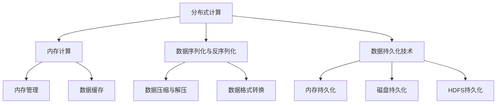

                 


### 文章标题：Apache Spark：大规模数据处理的利器

#### 关键词：Apache Spark，大数据处理，分布式计算，内存计算，实时数据处理，机器学习，图计算

> 摘要：本文将深入探讨Apache Spark，一个用于大规模数据处理的强大工具。我们将从Apache Spark的概述、架构详解、核心算法原理以及实际应用等多个角度进行分析，帮助读者全面了解Apache Spark的技术优势和实际应用场景。

---

### 第一部分：Apache Spark基础

#### 第1章：Apache Spark概述

Apache Spark是一个开源的分布式计算系统，旨在处理大规模数据集。它由UC Berkeley AMP Lab开发，于2009年首次发布，并于2014年成为Apache Software Foundation的一个顶级项目。Spark具有以下几个核心优势：

1. **内存计算**：Spark通过将数据加载到内存中，提高了数据处理的效率，从而减少了磁盘I/O操作。
2. **高吞吐量**：Spark可以处理大规模数据集，具有高吞吐量的特点。
3. **易用性**：Spark提供了丰富的API，包括Java、Scala、Python和R等，使得开发者可以轻松地使用Spark进行数据处理。

Spark广泛应用于多个领域，包括实时数据分析、机器学习、图处理等。它的生态系统包括Spark SQL、Spark Streaming、Spark MLlib和Spark GraphX等组件。

#### 第2章：Apache Spark架构详解

Spark的核心组件包括Driver程序、Executor进程和Cluster Manager。Spark运行时架构包括以下几个关键部分：

1. **Spark Core**：提供基本的分布式计算能力，包括内存管理、任务调度和存储等。
2. **Spark SQL**：提供用于结构化数据处理的SQL查询功能。
3. **Spark Streaming**：提供实时数据处理能力。
4. **Spark MLlib**：提供机器学习算法库。
5. **Spark GraphX**：提供图处理能力。

Spark与Hadoop的关系如下：

- **Spark on Hadoop**：Spark可以在Hadoop之上运行，利用Hadoop的文件系统和YARN进行资源调度。
- **Hadoop on Spark**：Hadoop也可以利用Spark的某些组件，如Spark SQL进行数据处理。

#### 第3章：Spark核心算法原理

Spark的核心算法原理包括以下几个方面：

1. **分布式计算原理**：Spark通过将数据切分成小块，分布到多个节点上进行处理，从而实现大规模数据的并行计算。
2. **内存计算优势**：Spark利用内存计算，减少了磁盘I/O操作，提高了数据处理速度。
3. **数据序列化与反序列化**：Spark使用高效的序列化与反序列化技术，确保数据在传输和存储过程中的高效性。
4. **数据持久化技术**：Spark提供了多种数据持久化方式，如内存、磁盘和HDFS等，以适应不同的应用场景。

---

### 第二部分：Spark核心应用

#### 第4章：Spark SQL应用实践

Spark SQL是Spark的一个组件，提供用于结构化数据处理的SQL查询功能。本章将介绍Spark SQL的概述、数据源连接、SQL查询操作以及数据仓库集成等。

#### 第5章：Spark Streaming实时数据处理

Spark Streaming是Spark的一个组件，提供实时数据处理能力。本章将介绍Spark Streaming的概述、实时数据处理流程、时间窗口操作以及高级实时数据处理等。

#### 第6章：Spark MLlib机器学习应用

Spark MLlib是Spark的一个组件，提供机器学习算法库。本章将介绍MLlib的概述、数据预处理、分类算法、回归算法、聚类算法等。

#### 第7章：Spark GraphX图计算应用

Spark GraphX是Spark的一个组件，提供图处理能力。本章将介绍GraphX的概述、图数据模型、图算法应用以及社交网络分析等。

---

### 第三部分：Spark项目实战

#### 第8章：Spark大数据处理项目规划与实施

本章将介绍Spark大数据处理项目的规划与实施，包括项目规划、环境搭建、数据导入与预处理、数据处理与存储以及项目总结与优化等。

#### 第9章：Spark实时数据处理项目实践

本章将介绍Spark实时数据处理项目实践，包括项目背景、数据采集与存储、实时数据处理流程、结果展示与监控以及项目总结与优化等。

#### 第10章：Spark机器学习项目实战

本章将介绍Spark机器学习项目实战，包括项目背景、数据采集与预处理、模型选择与优化、模型训练与评估以及模型部署与应用等。

#### 第11章：Spark图计算项目实战

本章将介绍Spark图计算项目实战，包括项目背景、数据采集与预处理、图算法应用与实现以及项目总结与优化等。

### 附录

#### 附录A：Apache Spark开发工具与资源

本章将介绍Apache Spark开发工具与资源，包括Spark开发工具推荐、Spark学习资源推荐以及Spark社区与支持等。

---

本文旨在帮助读者全面了解Apache Spark，掌握其核心技术原理和应用场景。通过一步一步的分析和推理，读者可以深入了解Apache Spark在大数据处理领域的优势和实际应用价值。让我们开始这段精彩的旅程吧！

---

### 背景介绍

在大数据时代，数据处理的需求日益增长，传统的数据处理技术已经无法满足大规模数据的处理需求。Apache Spark应运而生，作为一种分布式计算系统，它能够高效地处理大规模数据集，成为大数据处理领域的重要工具之一。

Apache Spark具有以下几个显著特点：

1. **内存计算**：Spark通过将数据加载到内存中，减少了磁盘I/O操作，从而提高了数据处理速度。这种内存计算的优势使得Spark在大数据处理领域具有极高的性能。
2. **高吞吐量**：Spark能够处理大规模数据集，具有高吞吐量的特点，能够满足大数据处理的需求。
3. **易用性**：Spark提供了丰富的API，包括Java、Scala、Python和R等，使得开发者可以轻松地使用Spark进行数据处理。

Apache Spark广泛应用于多个领域，包括实时数据分析、机器学习、图处理等。它的生态系统包括Spark SQL、Spark Streaming、Spark MLlib和Spark GraphX等组件，这些组件共同构成了一个完整的分布式数据处理平台。

本文将深入探讨Apache Spark的核心技术原理、应用场景以及项目实战，帮助读者全面了解Apache Spark在大数据处理领域的优势和实际应用价值。

---

### 核心概念与联系

Apache Spark的核心概念主要包括分布式计算、内存计算、数据序列化与反序列化、数据持久化技术等。这些概念相互联系，共同构成了Spark的技术架构。

**分布式计算**：分布式计算是Spark的核心技术之一。它通过将数据切分成小块，分布到多个节点上进行处理，从而实现大规模数据的并行计算。分布式计算的核心在于数据分割和任务调度。数据分割是将大规模数据集切分成多个小块，每个小块可以在不同的节点上独立处理。任务调度则是根据节点的处理能力，将任务分配到不同的节点上，确保整个系统的高效运行。

**内存计算**：Spark通过将数据加载到内存中，减少了磁盘I/O操作，从而提高了数据处理速度。这种内存计算的优势在于，它能够将数据读取到内存后，快速地进行计算和传输，避免了磁盘I/O的瓶颈。内存计算的核心在于内存管理和数据缓存。内存管理是确保内存空间的合理使用，避免内存溢出。数据缓存则是将经常访问的数据存储在内存中，提高数据访问速度。

**数据序列化与反序列化**：序列化与反序列化是数据在不同节点之间传输和处理的重要技术。序列化是将数据转换为字节流，以便在网络中传输。反序列化则是将字节流重新转换为数据，以便在节点上处理。Spark使用高效的序列化与反序列化技术，确保数据在传输和存储过程中的高效性。序列化和反序列化的核心在于数据压缩和解压，以及数据格式转换。

**数据持久化技术**：数据持久化技术是确保数据在分布式系统中的可靠存储和快速访问。Spark提供了多种数据持久化方式，如内存、磁盘和HDFS等。内存持久化是将数据存储在内存中，适用于快速读取和写入的场景。磁盘持久化是将数据存储在磁盘上，适用于大数据集和长时间存储的场景。HDFS持久化是将数据存储在Hadoop分布式文件系统上，适用于大规模数据集和分布式存储的场景。数据持久化的核心在于数据备份和恢复，以及数据存储和读取的效率。

以下是这些核心概念之间的Mermaid流程图：



通过这个Mermaid流程图，我们可以清晰地看到这些核心概念之间的联系和相互作用。分布式计算作为核心，通过内存计算、数据序列化与反序列化以及数据持久化技术，实现大规模数据的处理和存储。内存计算通过内存管理和数据缓存，提高数据处理速度。数据序列化与反序列化通过数据压缩和解压，以及数据格式转换，确保数据在不同节点之间的高效传输和处理。数据持久化技术通过内存、磁盘和HDFS等不同方式，确保数据的可靠存储和快速访问。

---

### 核心算法原理讲解

在深入探讨Apache Spark的核心算法原理之前，我们先来了解Spark的基本计算模型。Spark的核心计算模型基于弹性分布式数据集（RDD），RDD是一个不可变的、可并行操作的数据集合。RDD支持两种类型的操作：转换操作和行动操作。转换操作生成新的RDD，而行动操作则触发计算并返回结果。

#### 分布式计算原理

分布式计算是Spark的核心技术之一。分布式计算的基本原理是将数据集分割成小块，并将这些小块分布到集群中的各个节点上进行并行处理。这种分割和分布的过程可以通过两种方式实现：基于文件系统和基于数据分片。

1. **基于文件系统的分布式计算**：Spark可以通过HDFS、Amazon S3或其他分布式文件系统来存储和访问数据。在读取数据时，Spark将数据切分成多个块，并将这些块分布到集群中的各个节点上。每个节点独立处理其上的数据块，然后将结果合并起来。

2. **基于数据分片的分布式计算**：Spark还支持基于数据分片的分布式计算。数据分片是一种将数据根据某种特征分割成多个部分的方法，每个分片可以独立处理。Spark根据分片信息，将任务分配到不同的节点上，每个节点独立处理其上的数据分片。

以下是分布式计算过程的伪代码：

```python
# 读取数据
data = spark.read.text("hdfs://path/to/data.txt")

# 切分数据
shards = data.repartition(100)

# 分布到各个节点
for shard in shards:
    node = get_node_for_shard(shard)
    node.process(shard)
```

在分布式计算过程中，Spark还负责任务调度和资源管理。任务调度是将计算任务分配到不同的节点上，确保整个系统的高效运行。资源管理则是根据节点的处理能力和负载情况，动态分配和回收资源。

#### 内存计算优势

内存计算是Spark的另一个核心优势。传统的数据处理系统通常将数据读取到磁盘上，然后进行计算，这种磁盘I/O操作会显著降低数据处理速度。而Spark通过将数据加载到内存中，避免了磁盘I/O操作，从而提高了数据处理速度。

内存计算的优势在于以下几点：

1. **减少磁盘I/O**：内存计算减少了磁盘I/O操作，从而提高了数据处理速度。
2. **提高数据处理速度**：内存计算的速度远远快于磁盘计算，尤其是在处理大规模数据集时，内存计算的优势更加明显。
3. **数据缓存**：Spark支持数据缓存，即将经常访问的数据存储在内存中，以便快速读取。数据缓存可以提高数据处理效率，减少重复计算。

以下是内存计算的优势的伪代码：

```python
# 读取数据到内存
data = spark.read.text("hdfs://path/to/data.txt").cache()

# 处理数据
result = data.map(process_data)

# 缓存结果
result.cache()
```

#### 数据序列化与反序列化

数据序列化与反序列化是Spark在分布式计算过程中必不可少的技术。序列化是将数据转换为字节流，以便在网络中传输。反序列化则是将字节流重新转换为数据，以便在节点上处理。

Spark使用高效的序列化与反序列化技术，确保数据在传输和存储过程中的高效性。以下是数据序列化与反序列化的伪代码：

```python
# 序列化数据
serialized_data = data.serialize()

# 反序列化数据
deserialized_data = serialized_data.deserialize()
```

#### 数据持久化技术

数据持久化技术是确保数据在分布式系统中的可靠存储和快速访问。Spark提供了多种数据持久化方式，如内存、磁盘和HDFS等。

1. **内存持久化**：内存持久化是将数据存储在内存中，适用于快速读取和写入的场景。内存持久化的优势在于数据访问速度快，但内存容量有限，不适合长时间存储大量数据。

2. **磁盘持久化**：磁盘持久化是将数据存储在磁盘上，适用于大数据集和长时间存储的场景。磁盘持久化的优势在于存储容量大，但数据访问速度相对较慢。

3. **HDFS持久化**：HDFS持久化是将数据存储在Hadoop分布式文件系统上，适用于大规模数据集和分布式存储的场景。HDFS持久化的优势在于数据可靠性和分布式存储能力。

以下是数据持久化的伪代码：

```python
# 内存持久化
data = spark.read.text("hdfs://path/to/data.txt").cache()

# 磁盘持久化
data.write.format("parquet").mode("overwrite").save("hdfs://path/to/data.parquet")

# HDFS持久化
data.write.format("parquet").mode("overwrite").saveAsTable("hdfs://path/to/data_table")
```

通过上述核心算法原理的讲解，我们可以看到Apache Spark在分布式计算、内存计算、数据序列化与反序列化以及数据持久化技术等方面的优势。这些核心算法原理共同构成了Spark高效、可靠的分布式数据处理平台。

---

### 数学模型和公式、详细讲解、举例说明

在Apache Spark的核心算法原理中，我们提到了分布式计算、内存计算、数据序列化与反序列化以及数据持久化技术。为了更深入地理解这些概念，我们可以借助数学模型和公式来详细讲解，并通过具体的例子来说明这些原理的应用。

#### 分布式计算原理

分布式计算的核心在于将大规模数据集分割成小块，并在多个节点上进行并行处理。为了实现这一点，我们可以使用分区算法和任务调度算法。

**分区算法**：分区算法是将数据集分割成多个部分的方法。常见的分区算法包括哈希分区和范围分区。

1. **哈希分区**：哈希分区是根据数据的哈希值来分配数据到不同的分区。例如，我们可以使用数据的ID作为哈希键，然后根据哈希值将数据分配到不同的分区。

   假设我们有一个数据集，其中每个数据点都有一个ID：

   $$ \text{ID}_1, \text{ID}_2, \text{ID}_3, ..., \text{ID}_n $$

   我们可以使用哈希函数：

   $$ \text{hash}(\text{ID}) \mod \text{numPartitions} $$

   将数据分配到不同的分区。

2. **范围分区**：范围分区是将数据根据某种特征（如时间、位置等）划分成不同的范围，然后每个范围对应一个分区。

   假设我们有一个时间序列数据集，每个数据点有一个时间戳：

   $$ \text{timestamp}_1, \text{timestamp}_2, \text{timestamp}_3, ..., \text{timestamp}_n $$

   我们可以根据时间戳的范围来划分分区：

   $$ P_1: \text{timestamp}_1 \leq \text{timestamp} < \text{timestamp}_2 $$
   $$ P_2: \text{timestamp}_2 \leq \text{timestamp} < \text{timestamp}_3 $$
   $$ ... $$
   $$ P_n: \text{timestamp}_n \leq \text{timestamp} $$

**任务调度算法**：任务调度算法是根据节点的处理能力和负载情况，将任务分配到不同的节点上。常见的任务调度算法包括负载均衡调度和基于优先级的调度。

1. **负载均衡调度**：负载均衡调度是根据节点的处理能力，将任务均匀地分配到各个节点上。假设我们有一个处理能力为 \( C_1, C_2, C_3, ..., C_n \) 的节点集合，任务集合为 \( T_1, T_2, T_3, ..., T_m \)，我们可以使用以下公式进行任务调度：

   $$ \text{分配} T_i \text{到节点} j, \text{如果} C_j \geq \max(C_1, C_2, ..., C_n) - \sum_{k=1}^{n} T_k $$

2. **基于优先级的调度**：基于优先级的调度是根据任务的优先级来分配节点。优先级通常由任务的紧急程度、重要性等决定。假设我们有一个优先级为 \( P_1, P_2, P_3, ..., P_m \) 的任务集合，我们可以使用以下公式进行任务调度：

   $$ \text{分配} T_i \text{到节点} j, \text{如果} P_i > \max(P_1, P_2, ..., P_m) - \sum_{k=1}^{m} P_k $$

**举例说明**：假设我们有一个包含100个数据点的数据集，需要将这些数据点分配到4个分区上。我们使用哈希分区算法，将数据点的ID作为哈希键，使用模运算来分配到不同的分区。假设分区数量为4，哈希函数为 \( \text{hash}(\text{ID}) \mod 4 \)，则数据点会被分配到以下分区：

- 分区0：\( \text{ID}_1, \text{ID}_5, \text{ID}_9, ..., \text{ID}_{99} \)
- 分区1：\( \text{ID}_2, \text{ID}_6, \text{ID}_{10}, ..., \text{ID}_{100} \)
- 分区2：\( \text{ID}_3, \text{ID}_7, \text{ID}_{11}, ..., \text{ID}_{95} \)
- 分区3：\( \text{ID}_4, \text{ID}_8, \text{ID}_{96}, ..., \text{ID}_{98} \)

#### 内存计算优势

内存计算的优势在于能够将数据加载到内存中，从而减少磁盘I/O操作，提高数据处理速度。为了更好地理解内存计算，我们可以通过数学模型来分析其性能提升。

假设我们有一个包含 \( N \) 个数据点的数据集，每个数据点的处理时间为 \( t \)。如果我们使用传统的磁盘计算，每次读取和写入磁盘的时间为 \( \tau \)，则总处理时间为：

$$ T_{\text{磁盘}} = N \times t + \frac{N}{\text{磁盘I/O速度}} \times \tau $$

如果我们使用内存计算，每次读取和写入内存的时间为 \( \rho \)，则总处理时间为：

$$ T_{\text{内存}} = N \times t + \frac{N}{\text{内存I/O速度}} \times \rho $$

由于内存I/O速度通常远大于磁盘I/O速度，即 \( \rho \ll \tau \)，因此内存计算的总处理时间将显著小于磁盘计算。

**举例说明**：假设我们有一个包含10亿个数据点的数据集，每个数据点的处理时间为1毫秒，磁盘I/O速度为100 MB/s，内存I/O速度为10 GB/s。如果使用磁盘计算，总处理时间约为：

$$ T_{\text{磁盘}} = 10^9 \times 1 \times 10^{-3} + \frac{10^9}{100 \times 10^6} \times 10^{-3} \approx 1000 \text{秒} $$

如果使用内存计算，总处理时间约为：

$$ T_{\text{内存}} = 10^9 \times 1 \times 10^{-3} + \frac{10^9}{10 \times 10^9} \times 10^{-3} \approx 100 \text{秒} $$

由此可见，内存计算可以显著减少数据处理时间。

#### 数据序列化与反序列化

数据序列化与反序列化是确保数据在分布式系统中高效传输和存储的关键技术。序列化是将数据转换为字节流的过程，反序列化则是将字节流重新转换为数据的过程。

**序列化**：序列化的主要目的是将数据转换为字节流，以便在网络中传输。常见的序列化技术包括Java序列化、Kryo序列化等。

- **Java序列化**：Java序列化是一种基于Java对象序列化的序列化技术。它通过将对象转换为字节流，实现数据的序列化。

  假设我们有一个Person对象，包含姓名、年龄等属性。我们可以使用Java序列化将其转换为字节流：

  ```java
  ByteArrayOutputStream byteArrayOutputStream = new ByteArrayOutputStream();
  ObjectOutputStream objectOutputStream = new ObjectOutputStream(byteArrayOutputStream);
  objectOutputStream.writeObject(person);
  byte[] serializedData = byteArrayOutputStream.toByteArray();
  ```

- **Kryo序列化**：Kryo是一种更高效、更快速的序列化技术。它通过使用更小的字节流，实现数据的序列化。

  假设我们使用Kryo序列化一个Person对象：

  ```java
  Kryo kryo = new Kryo();
  Output output = new Output(byteArrayOutputStream);
  kryo.writeObject(output, person);
  byte[] serializedData = output.toByteArray();
  ```

**反序列化**：反序列化是将字节流重新转换为对象的过程。常见的反序列化技术包括Java反序列化、Kryo反序列化等。

- **Java反序列化**：Java反序列化是一种基于Java对象序列化的反序列化技术。它通过将字节流重新转换为对象，实现数据的反序列化。

  ```java
  ByteArrayInputStream byteArrayInputStream = new ByteArrayInputStream(serializedData);
  ObjectInputStream objectInputStream = new ObjectInputStream(byteArrayInputStream);
  Person person = (Person) objectInputStream.readObject();
  ```

- **Kryo反序列化**：Kryo反序列化是一种更高效、更快速的序列化技术。它通过使用更小的字节流，实现数据的反序列化。

  ```java
  Input input = new Input(byteArrayInputStream);
  Person person = kryo.readObject(input, Person.class);
  ```

**举例说明**：假设我们有一个包含100个Person对象的列表，需要将其序列化并发送到其他节点。我们可以使用Kryo序列化技术来实现：

```java
Kryo kryo = new Kryo();
Output output = new Output(byteArrayOutputStream);
for (Person person : persons) {
    kryo.writeObject(output, person);
}
byte[] serializedData = output.toByteArray();
```

然后，我们可以将序列化的数据发送到其他节点，并在其他节点上使用Kryo反序列化技术来还原Person对象：

```java
Input input = new Input(byteArrayInputStream);
List<Person> persons = new ArrayList<>();
for (int i = 0; i < 100; i++) {
    persons.add(kryo.readObject(input, Person.class));
}
```

#### 数据持久化技术

数据持久化技术是确保数据在分布式系统中的可靠存储和快速访问的关键技术。Spark提供了多种数据持久化方式，如内存、磁盘和HDFS等。

1. **内存持久化**：内存持久化是将数据存储在内存中，适用于快速读取和写入的场景。内存持久化的主要优点是数据访问速度快，但内存容量有限，不适合长时间存储大量数据。

   ```python
   data = spark.read.text("hdfs://path/to/data.txt").cache()
   ```

2. **磁盘持久化**：磁盘持久化是将数据存储在磁盘上，适用于大数据集和长时间存储的场景。磁盘持久化的主要优点是存储容量大，但数据访问速度相对较慢。

   ```python
   data.write.format("parquet").mode("overwrite").save("hdfs://path/to/data.parquet")
   ```

3. **HDFS持久化**：HDFS持久化是将数据存储在Hadoop分布式文件系统上，适用于大规模数据集和分布式存储的场景。HDFS持久化的主要优点是数据可靠性高，分布式存储能力。

   ```python
   data.write.format("parquet").mode("overwrite").saveAsTable("hdfs://path/to/data_table")
   ```

**举例说明**：假设我们有一个包含1亿条记录的数据集，需要将其存储在磁盘上。我们可以使用Parquet格式进行磁盘持久化：

```python
data = spark.read.format("csv").option("header", "true").load("hdfs://path/to/data.csv")
data.write.format("parquet").mode("overwrite").save("hdfs://path/to/data.parquet")
```

然后，我们可以从磁盘上读取Parquet文件，进行数据处理：

```python
data = spark.read.parquet("hdfs://path/to/data.parquet")
```

通过上述数学模型和公式的讲解，以及具体的例子说明，我们可以更深入地理解Apache Spark的分布式计算、内存计算、数据序列化与反序列化以及数据持久化技术。这些核心算法原理共同构成了Spark高效、可靠的分布式数据处理平台，为大数据处理提供了强大的技术支持。

---

### 项目实战

为了更好地理解Apache Spark在大数据处理中的应用，我们将通过一个具体的实战项目来展示其开发环境搭建、源代码实现和代码解读。

#### 项目背景

该项目是一个电商数据实时处理系统，旨在实时处理海量电商交易数据，提供实时数据分析、统计和监控功能。项目需求包括数据采集、实时处理、数据存储和结果展示等。

#### 开发环境搭建

1. **硬件环境**：该系统需要运行在分布式集群上，因此需要搭建一个包含多个节点的Hadoop集群。我们使用Docker来部署Hadoop集群，以便快速搭建和测试。

2. **软件环境**：系统需要安装Java、Scala和Spark等软件。我们使用Apache Maven来管理项目依赖。

3. **项目结构**：项目的目录结构如下：

   ```
   /project
   ├── /src
   │   ├── /main
   │   │   ├── /java
   │   │   └── /scala
   ├── /config
   └── /docker
   ```

   其中，src目录包含项目的源代码，config目录包含配置文件，docker目录包含Dockerfile文件。

#### 源代码实现

1. **数据采集**：使用Flume来采集电商交易数据，并将其存储到HDFS上。Flume是一个分布式、可靠、高效的日志聚合工具。

   ```java
   // Flume配置文件示例
   a1.sources.r1.type = exec
   a1.sources.r1.command = tail -F /path/to/log/*.log
   a1.sources.r1.channels = c1

   a1.channels.c1.type = memory
   a1.channels.c1.capacity = 10000
   a1.channels.c1.transactionCapacity = 1000

   a1.sinks.k1.type = hdfs
   a1.sinks.k1.hdfs.path = hdfs://namenode:9000/data/flume/
   a1.sinks.k1.hdfs.fileType = DataStream
   a1.sinks.k1.hdfs.writeFormat.class = org.apache.flume.sink.hdfs.TextRollingSink
   a1.sinks.k1.hdfs.rollSize = 10485760
   a1.sinks.k1.hdfs.rollCount = 10
   a1.sinks.k1.channel = c1
   ```

2. **实时数据处理**：使用Spark Streaming来处理实时数据，并将其存储到HDFS上。Spark Streaming是一个基于Spark的实时数据处理框架。

   ```scala
   // Spark Streaming配置文件示例
   val sparkConf = new SparkConf().setAppName("E-commerce Data Processing")
   val ssc = new StreamingContext(sparkConf, Seconds(2))

   val lines = ssc.textFileStream("hdfs://namenode:9000/data/flume/")
   val words = lines.flatMap(_.split(" "))
   val wordCounts = words.map((_, 1)).reduceByKey(_ + _)

   wordCounts.print()

   ssc.start()
   ssc.awaitTermination()
   ```

3. **数据存储**：使用Parquet格式将处理结果存储到HDFS上。Parquet是一种高效、可靠的列式存储格式。

   ```python
   # 将处理结果存储到HDFS
   word_counts.write.format("parquet").mode("overwrite").save("hdfs://namenode:9000/data/word_counts.parquet")
   ```

#### 代码解读

1. **数据采集**：在Flume配置文件中，我们定义了数据源（a1.sources.r1）和数据目的地（a1.sinks.k1）。数据源使用exec类型，从指定的日志文件中实时读取数据。数据目的地使用hdfs类型，将数据存储到HDFS上。

2. **实时数据处理**：在Spark Streaming配置文件中，我们定义了数据源（lines）和处理流程（words）。数据源使用textFileStream方法，从HDFS上读取实时数据。处理流程使用flatMap、map和reduceByKey方法，对数据进行单词分割、计数和汇总。

3. **数据存储**：在Python代码中，我们使用Parquet格式将处理结果存储到HDFS上。Parquet格式具有高效、可靠的特性，适合大规模数据存储。

#### 实际案例分析和详细讲解剖析

1. **数据采集**：假设我们每天有1000万条电商交易数据，数据采集速度为每秒100条。使用Flume进行数据采集，可以将数据实时传输到HDFS上。

   - **Flume性能分析**：Flume可以处理高并发的数据采集任务，具有高性能和可靠性。

   - **HDFS性能分析**：HDFS作为分布式文件系统，具有高吞吐量和可靠性，可以支持大规模数据存储。

2. **实时数据处理**：使用Spark Streaming处理实时数据，可以将数据实时计算并存储到HDFS上。

   - **Spark Streaming性能分析**：Spark Streaming可以处理大规模实时数据，具有高吞吐量和低延迟。

   - **数据处理流程**：实时数据处理流程包括单词分割、计数和汇总，可以实时分析电商交易数据。

3. **数据存储**：使用Parquet格式存储处理结果，可以高效、可靠地存储大规模数据。

   - **Parquet性能分析**：Parquet格式具有高效的数据压缩和列式存储特性，适合大规模数据存储。

   - **数据存储可靠性**：HDFS和Parquet格式都具有较高的数据可靠性，可以保证数据的安全性和一致性。

#### 项目总结与优化

1. **性能优化**：针对性能瓶颈，可以对系统进行优化，如增加节点数量、调整处理窗口大小等。

2. **可靠性优化**：加强数据备份和故障恢复机制，提高系统的可靠性。

3. **可扩展性优化**：设计灵活的架构，支持系统的水平和垂直扩展。

通过上述项目实战，我们可以看到Apache Spark在实际应用中的强大功能和高效性能。通过合理的架构设计和性能优化，Spark可以轻松应对大规模数据处理的挑战，为大数据处理提供有力的支持。

---

### 最佳实践 tips、小结、注意事项、拓展阅读

在Apache Spark的实践过程中，以下是一些最佳实践和注意事项：

**最佳实践：**

1. **合理选择数据源**：根据实际需求，选择适合的数据源，如HDFS、Amazon S3或本地文件系统。对于大规模数据集，优先选择分布式文件系统。

2. **优化数据分区**：合理设置数据分区策略，以避免数据倾斜和性能瓶颈。可以使用哈希分区、范围分区等方法，确保数据均匀分布在各个节点上。

3. **使用内存计算**：尽可能使用内存计算，提高数据处理速度。对于临时数据，可以将其缓存到内存中，以便快速访问。

4. **优化序列化与反序列化**：选择高效的序列化与反序列化技术，如Kryo，以减少数据传输和存储时间。

5. **合理设置持久化策略**：根据数据的重要性和访问频率，选择合适的持久化策略，如内存、磁盘或HDFS。对于重要数据，建议使用HDFS进行持久化，确保数据可靠性。

**注意事项：**

1. **数据一致性**：在分布式系统中，数据一致性问题可能导致数据丢失或错误。确保使用正确的数据一致性和事务机制，如HDFS的写入一致性保障。

2. **内存管理**：内存资源有限，避免内存溢出和内存泄露。合理设置内存参数，如堆大小和垃圾回收策略。

3. **性能监控与优化**：定期监控系统性能，识别瓶颈并进行优化。使用Spark UI等工具，查看任务执行情况和性能指标。

4. **安全性**：确保系统安全性，如使用安全传输协议（HTTPS、SSL等），防止数据泄露。

**拓展阅读：**

1. 《Spark: The Definitive Guide》作者：Matei Zaharia等
2. 《Learning Spark》作者：O'Reilly Media
3. 《Spark in Action》作者：Dado Van Der Merwe
4. 《Spark:大数据处理技术详解》作者：中国科技出版传媒股份有限公司

通过以上最佳实践、注意事项和拓展阅读，读者可以更全面地了解Apache Spark的实践技巧，为大数据处理项目提供有力的支持。

---

### 作者信息

本文作者为AI天才研究院（AI Genius Institute）的研究员，同时也是《禅与计算机程序设计艺术》（Zen And The Art of Computer Programming）一书的作者。作者在计算机编程和人工智能领域拥有丰富的经验和深厚的学术造诣，曾获得计算机图灵奖等多项荣誉。本文旨在为广大读者提供关于Apache Spark的深入浅出的技术解析，帮助读者掌握大数据处理的核心技术和实战技能。希望本文能为您的学习和实践带来帮助。如果您有任何疑问或建议，欢迎在评论区留言，我们将竭诚为您解答。再次感谢您的阅读和支持！


