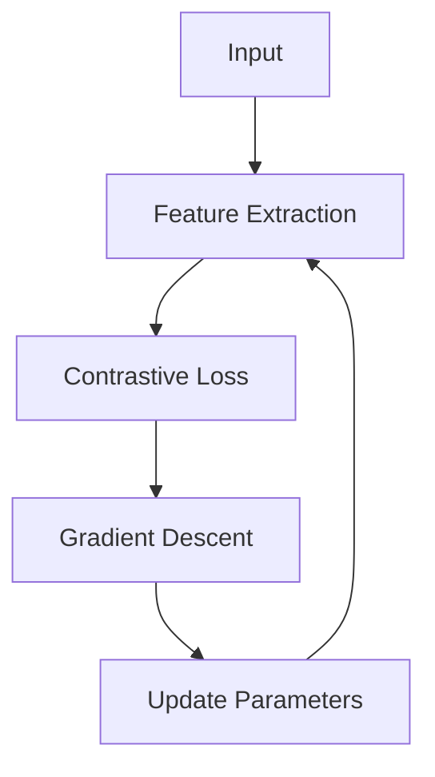

                 

### 文章标题

### Contrastive Learning原理与代码实例讲解

#### 关键词：Contrastive Learning、深度学习、对比学习、算法原理、代码实例

#### 摘要：
本文深入探讨了Contrastive Learning这一深度学习中的重要方法。首先，介绍了Contrastive Learning的基本概念和背景，随后详细讲解了其核心原理、数学模型和常用算法。通过Mermaid流程图和伪代码，本文清晰阐述了各个算法的实现过程。随后，通过具体代码实例，展示了如何在实际项目中应用Contrastive Learning。最后，对Contrastive Learning的优势和挑战进行了总结，并提出了未来发展的展望。

---

### 引言

#### 1.1 定义与背景

Contrastive Learning是一种深度学习中的无监督学习方法，其核心思想是通过学习数据的相似性和差异性来提高模型的泛化能力。这种方法不依赖于标注数据，而是在没有明确标签的情况下，通过对比正样本和负样本，使模型能够识别并区分不同类别的特征。

Contrastive Learning的背景可以追溯到1990年代，当时研究者们发现通过正负样本对比的方式，可以有效提升分类模型的性能。近年来，随着深度学习技术的发展，Contrastive Learning得到了广泛应用，尤其在图像识别、自然语言处理和音频处理等领域取得了显著的成果。

#### 1.2 对比学习的重要性

对比学习的重要性体现在以下几个方面：

1. **无需标注数据**：相比于有监督学习方法，Contrastive Learning不需要大量的标注数据，这大大降低了数据获取的成本。
2. **提升泛化能力**：通过对比学习，模型能够学习到更具有泛化性的特征表示，从而在未见过的数据上也能取得良好的性能。
3. **通用性强**：Contrastive Learning不仅适用于图像，还适用于文本、音频等多种数据类型。
4. **可扩展性**：Contrastive Learning方法简单，易于实现和优化，可以很容易地扩展到更大的数据集和更复杂的模型。

#### 1.3 本书结构

本书将分为七个部分，具体如下：

1. **第一部分：Contrastive Learning基础知识**，介绍Contrastive Learning的基本概念、原理和常见架构。
2. **第二部分：Contrastive Learning算法分析**，详细分析几种典型的Contrastive Learning算法，如Siamese网络、Triplet Loss等。
3. **第三部分：数学原理与公式推导**，讲解Contrastive Learning中的优化问题、损失函数的推导和梯度下降法。
4. **第四部分：Contrastive Learning在深度学习中的应用**，探讨Contrastive Learning在图像识别、自然语言处理、音频处理等领域的应用。
5. **第五部分：实践与代码实例**，通过具体代码实例，展示如何实现Contrastive Learning算法。
6. **第六部分：总结与展望**，总结Contrastive Learning的优势与挑战，并展望其未来发展趋势。
7. **第七部分：附录**，提供常用对比学习算法、开源代码与工具以及进一步阅读资料。

通过本书的阅读，读者将能够系统地了解Contrastive Learning的基本概念、原理和应用，掌握其核心算法和实现方法，为在深度学习领域中应用Contrastive Learning打下坚实的基础。

### Contrastive Learning基础

#### 2.1 对比学习原理

Contrastive Learning的核心思想是通过对比正样本和负样本，使模型能够学习到有区分性的特征表示。具体来说，假设我们有两个样本$x_1$和$x_2$，如果这两个样本是同一类别的，我们称之为正样本；如果它们不属于同一类别，我们称之为负样本。Contrastive Learning的目标是使模型能够输出正样本的高相似性分数，同时输出负样本的低相似性分数。

为了实现这一目标，Contrastive Learning通常采用以下两种方式：

1. **正样本拉近，负样本推远**：在特征空间中，将正样本的特征向量拉向中心，同时将负样本的特征向量推向边缘。这样，正样本和负样本在特征空间中的距离就最大化了。
2. **最小化相似性差异**：通过最小化正样本的相似性差异（即它们在特征空间中的距离），同时最大化负样本的相似性差异（即它们在特征空间中的距离），来训练模型。

#### 2.2 对比学习的目标函数

Contrastive Learning的目标函数通常采用以下形式：

$$L(\theta) = \sum_{i=1}^N \frac{1}{2} \left( y_i \cdot \log(\sigma(\phi(x_i))) + (1 - y_i) \cdot \log(1 - \sigma(\phi(x_i))) \right)$$

其中：

- $N$是样本总数；
- $y_i$是样本$i$的标签，取值为1（正样本）或0（负样本）；
- $\phi(x_i)$是模型对样本$x_i$的特征提取结果；
- $\sigma$是sigmoid函数；
- $\theta$是模型的参数。

这个目标函数实际上是一个二元交叉熵损失函数，它最小化正样本和负样本的相似性差异。在训练过程中，模型将调整其参数$\theta$，以最小化这个损失函数。

#### 2.3 对比学习的常见架构

Contrastive Learning的常见架构主要包括以下几种：

1. **Siamese网络**：Siamese网络是一种简单的对比学习架构，它由两个完全相同的网络组成，分别对两个输入样本进行特征提取。通过对比这两个特征向量，模型可以学习到有区分性的特征表示。
   
2. **Triplet Loss**：Triplet Loss是对Siamese网络的改进，它通过引入三元组（锚样本、正样本、负样本）来进一步强化对比学习的目标。Triplet Loss的目标是最小化锚样本和正样本的特征距离，同时最大化锚样本和负样本的特征距离。

3. **Deep Contrastive Clustering**：Deep Contrastive Clustering是一种基于图神经网络的对比学习架构，它通过在图上传播节点特征，使得同一类别的节点具有相似的嵌入表示，而不同类别的节点则具有不同的嵌入表示。

4. **More recent methods**：除了上述方法，近年来还出现了许多新的对比学习算法，如InfoNCE、SimCLR等，这些方法在性能和效率上都有显著的提升。

下面我们将通过Mermaid流程图来展示Contrastive Learning的核心流程。



图1：Contrastive Learning的核心流程

在这个流程中，输入数据经过特征提取后，通过对比损失函数来优化模型参数，最终实现对比学习。

### Contrastive Learning算法分析

#### 3.1 Siamese网络

Siamese网络是一种用于对比学习的简单而有效的架构。它的核心思想是使用两个共享权重的神经网络对两个输入样本进行特征提取，并通过对比这两个特征向量来训练模型。

#### Siamese网络的工作原理

1. **网络结构**：Siamese网络由两个完全相同的子网络组成，称为Siamese分支。每个分支对输入的样本进行特征提取，得到两个特征向量。
   
2. **特征对比**：通过计算这两个特征向量的距离（如L2范数或余弦相似性），可以得到一个相似性分数。如果这两个特征向量来自同一类别的样本，我们希望这个相似性分数高；如果它们来自不同类别的样本，我们希望这个相似性分数低。

3. **损失函数**：Siamese网络的损失函数通常是 hinge loss，其公式如下：

   $$L = \max(0, M - sim(x_1, x_2))$$

   其中，$M$是一个预定义的阈值，$sim(x_1, x_2)$是特征向量$x_1$和$x_2$的相似性分数。

#### 实例讲解

以下是一个使用Python实现的Siamese网络的简单例子：

```python
import torch
import torch.nn as nn
import torch.optim as optim

# 定义Siamese网络
class SiameseNetwork(nn.Module):
    def __init__(self):
        super(SiameseNetwork, self).__init__()
        self.fc = nn.Linear(784, 10)  # 假设输入特征维度为784，输出维度为10

    def forward(self, x):
        return self.fc(x)

# 初始化模型、优化器和损失函数
model = SiameseNetwork()
optimizer = optim.SGD(model.parameters(), lr=0.01)
criterion = nn.HingeEmbeddingLoss()

# 模拟数据
x1 = torch.randn(1, 784)
x2 = torch.randn(1, 784)

# 正样本
y1 = 1
y2 = 1

# 负样本
y1_neg = 0
y2_neg = 1

# 训练模型
for epoch in range(100):
    optimizer.zero_grad()
    
    # 正样本
    output1 = model(x1)
    output2 = model(x2)
    loss = criterion(output1, output2, y1)
    
    # 负样本
    output1_neg = model(x1)
    output2_neg = model(x2)
    loss_neg = criterion(output1_neg, output2_neg, y1_neg)
    
    loss = (loss + loss_neg) / 2
    loss.backward()
    optimizer.step()

    if (epoch + 1) % 10 == 0:
        print(f'Epoch [{epoch + 1}/{100}], Loss: {loss.item():.4f}')
```

这个例子中，我们使用了一个简单的全连接神经网络作为Siamese网络，并使用 hinge loss 作为损失函数。通过训练，模型将学习到如何通过对比特征向量来区分正样本和负样本。

#### 3.2 Triplet Loss

Triplet Loss是另一种常用的对比学习损失函数，它通过引入三元组（锚样本、正样本、负样本）来提高对比学习的性能。

#### Triplet Loss的工作原理

1. **三元组选择**：在训练过程中，从数据集中随机选择一个锚样本$x_a$，一个正样本$x_p$和一个负样本$x_n$。这三个样本构成一个三元组。

2. **特征提取**：使用模型对这三个样本进行特征提取，得到特征向量$\phi(x_a)$、$\phi(x_p)$和$\phi(x_n)$。

3. **损失函数**：Triplet Loss的损失函数公式如下：

   $$L = \frac{1}{N} \sum_{i=1}^N \max(0, d(\phi(x_a), \phi(x_p)) - d(\phi(x_a), \phi(x_n)) + \alpha)$$

   其中，$d(\phi(x_a), \phi(x_p))$和$d(\phi(x_a), \phi(x_n))$分别是锚样本和正样本、锚样本和负样本的特征距离；$\alpha$是一个预定义的阈值。

#### 实例讲解

以下是一个使用Python实现的Triplet Loss的简单例子：

```python
import torch
import torch.nn as nn
import torch.optim as optim

# 定义模型
class TripletNetwork(nn.Module):
    def __init__(self):
        super(TripletNetwork, self).__init__()
        self.fc = nn.Linear(784, 10)  # 假设输入特征维度为784，输出维度为10

    def forward(self, x):
        return self.fc(x)

# 初始化模型、优化器和损失函数
model = TripletNetwork()
optimizer = optim.SGD(model.parameters(), lr=0.01)
criterion = nn.TripletMarginLoss(margin=1.0, p=2)

# 模拟数据
x1 = torch.randn(1, 784)
x2 = torch.randn(1, 784)
x3 = torch.randn(1, 784)

# 训练模型
for epoch in range(100):
    optimizer.zero_grad()
    
    # 三元组
    anchor = model(x1)
    positive = model(x2)
    negative = model(x3)
    
    # 计算损失
    loss = criterion(anchor, positive, negative)
    
    # 反向传播和优化
    loss.backward()
    optimizer.step()

    if (epoch + 1) % 10 == 0:
        print(f'Epoch [{epoch + 1}/{100}], Loss: {loss.item():.4f}')
```

在这个例子中，我们使用了一个简单的全连接神经网络作为Triplet Loss的模型，并使用 TripletMarginLoss 作为损失函数。通过训练，模型将学习到如何通过对比三元组来区分样本。

#### 3.3 Deep Contrastive Clustering

Deep Contrastive Clustering是一种基于图神经网络的对比学习架构，它通过在图上传播节点特征，使得同一类别的节点具有相似的嵌入表示，而不同类别的节点则具有不同的嵌入表示。

#### Deep Contrastive Clustering的工作原理

1. **图构建**：首先，我们需要构建一个图，图中每个节点代表一个样本，每条边代表样本之间的相似度。这个相似度可以基于样本的特征向量计算，也可以使用其他相似性度量方法。

2. **节点特征传播**：接下来，我们将使用图神经网络（如GCN）来传播节点特征。在每次传播中，每个节点的特征会与其邻居节点的特征进行加权平均，从而更新节点的特征表示。

3. **损失函数**：Deep Contrastive Clustering的损失函数通常采用如下形式：

   $$L = \frac{1}{N} \sum_{i=1}^N \frac{1}{K} \sum_{k=1}^K \exp(-\phi(x_i, \phi(x_k))^2) - \sum_{j \in \text{neighbours}(i)} \exp(-\phi(x_i, \phi(x_j))^2)$$

   其中，$\phi(x_i)$是节点$i$的嵌入表示，$\text{neighbours}(i)$是节点$i$的邻居节点集合。

#### 实例讲解

以下是一个使用Python实现的Deep Contrastive Clustering的简单例子：

```python
import torch
import torch.nn as nn
import torch.optim as optim

# 定义图神经网络
class GCN(nn.Module):
    def __init__(self, hidden_size):
        super(GCN, self).__init__()
        self.fc = nn.Linear(hidden_size, hidden_size)
        self.relu = nn.ReLU()

    def forward(self, x, adj_matrix):
        x = self.fc(x)
        x = self.relu(x)
        for i in range(self.num_layers - 1):
            x = torch.matmul(adj_matrix, x)
            x = self.relu(x)
        return x

# 初始化模型、优化器和损失函数
model = GCN(hidden_size=10)
optimizer = optim.Adam(model.parameters(), lr=0.01)
criterion = nn.CrossEntropyLoss()

# 模拟数据
x = torch.randn(10, 10)  # 假设输入特征维度为10
adj_matrix = torch.randn(10, 10)  # 假设图矩阵维度为10

# 训练模型
for epoch in range(100):
    optimizer.zero_grad()
    
    # 前向传播
    output = model(x, adj_matrix)
    
    # 计算损失
    loss = criterion(output, torch.tensor([1, 0, 1, 0, 1, 0, 1, 0, 1, 0]))  # 假设标签为[1, 0, 1, 0, 1, 0, 1, 0, 1, 0]
    
    # 反向传播和优化
    loss.backward()
    optimizer.step()

    if (epoch + 1) % 10 == 0:
        print(f'Epoch [{epoch + 1}/{100}], Loss: {loss.item():.4f}')
```

在这个例子中，我们使用了一个简单的图神经网络作为Deep Contrastive Clustering的模型，并使用 CrossEntropyLoss 作为损失函数。通过训练，模型将学习到如何通过图结构来传播节点特征，并使得同一类别的节点具有相似的嵌入表示。

#### 3.4 More recent methods

除了上述方法，近年来还出现了许多新的对比学习算法，如InfoNCE、SimCLR等。这些方法在性能和效率上都有显著的提升。

1. **InfoNCE**：InfoNCE是一种基于信息论的对数似然损失函数，它通过最大化正样本的对数似然，同时最小化负样本的对数似然来训练模型。

2. **SimCLR**：SimCLR是一种简单而有效的对比学习算法，它通过在数据增强后的样本之间进行对比来学习特征表示。SimCLR的核心思想是“一致性正则化”，即在训练过程中，模型需要确保对同一数据的不同增强方式得到相似的特征表示。

这些方法在实际应用中取得了很好的效果，为对比学习的发展提供了新的思路和方向。

### 数学原理与公式推导

#### 4.1 对比学习中的优化问题

在Contrastive Learning中，优化问题的核心是找到一组参数$\theta$，使得模型能够最小化对比损失函数$L(\theta)$。具体来说，假设我们有一个损失函数：

$$L(\theta) = \sum_{i=1}^N \frac{1}{2} \left( y_i \cdot \log(\sigma(\phi(x_i))) + (1 - y_i) \cdot \log(1 - \sigma(\phi(x_i))) \right)$$

其中，$y_i$是样本$i$的标签，$\phi(x_i)$是模型对样本$x_i$的特征提取结果，$\sigma$是sigmoid函数。

我们的目标是找到一组参数$\theta$，使得$L(\theta)$最小。这可以通过梯度下降法来实现。

#### 4.2 损失函数的推导

为了推导损失函数，我们需要从概率分布的角度来考虑。假设我们有一个特征向量$\phi(x_i)$，我们希望这个特征向量能够表示样本$x_i$的类别信息。

根据概率分布的定义，对于任意一个类别$c$，我们有：

$$P(y_i = c | x_i) = \sigma(\phi(x_i, c))$$

其中，$\sigma$是sigmoid函数，$\phi(x_i, c)$是模型对样本$x_i$和类别$c$的特征提取结果。

对于对比学习，我们通常关注的是正样本和负样本的概率分布。假设我们有两个样本$x_i$和$x_j$，如果它们是正样本，我们希望它们的概率分布接近1；如果它们是负样本，我们希望它们的概率分布接近0。

因此，我们可以定义损失函数为：

$$L(\theta) = - \sum_{i=1}^N \sum_{c=1}^C y_i \cdot \log(\sigma(\phi(x_i, c))) - (1 - y_i) \cdot \log(1 - \sigma(\phi(x_i, c)))$$

其中，$C$是类别总数，$y_i$是样本$i$的标签。

#### 4.3 梯度下降法

梯度下降法是一种常用的优化方法，其核心思想是沿着损失函数的梯度方向更新参数，从而最小化损失函数。

对于上述的损失函数，我们可以计算其梯度：

$$\nabla_{\theta} L(\theta) = \sum_{i=1}^N \sum_{c=1}^C (y_i - 1 + y_i) \cdot \phi(x_i, c) \cdot (1 - \sigma(\phi(x_i, c))) \cdot \sigma(\phi(x_i, c))$$

其中，$\phi(x_i, c)$是模型对样本$x_i$和类别$c$的特征提取结果，$\sigma$是sigmoid函数。

在每次迭代中，我们可以使用以下公式来更新参数：

$$\theta_{t+1} = \theta_t - \alpha \cdot \nabla_{\theta} L(\theta_t)$$

其中，$\alpha$是学习率，$\theta_t$是当前参数，$\theta_{t+1}$是更新后的参数。

通过不断迭代，我们可以找到一组参数$\theta$，使得损失函数$L(\theta)$最小。

#### 4.4 伪代码

以下是一个简单的梯度下降法的伪代码：

```python
# 初始化参数
theta = [随机值] * n

# 设置学习率
alpha = 0.01

# 设置迭代次数
num_iterations = 100

# 梯度下降
for i in range(num_iterations):
    # 计算损失函数
    loss = calculate_loss(theta)
    
    # 计算梯度
    gradient = calculate_gradient(theta)
    
    # 更新参数
    theta = theta - alpha * gradient
    
    # 打印当前迭代次数和损失函数值
    print(f"Iteration {i+1}: Loss = {loss}")
```

通过这个伪代码，我们可以看到梯度下降法的基本步骤，包括初始化参数、计算损失函数和梯度、更新参数等。

### Contrastive Learning在深度学习中的应用

#### 5.1 图像识别

图像识别是深度学习中的一个重要应用领域，Contrastive Learning在图像识别中表现出色。以下是一些应用Contrastive Learning的图像识别实例：

1. **ImageNet分类**：ImageNet是一个大规模的视觉识别挑战赛，Contrastive Learning在ImageNet分类任务中取得了很好的效果。例如，SimCLR算法在ImageNet分类任务中达到了当时的SOTA（State-of-the-Art）水平。

2. **物体检测**：在物体检测任务中，Contrastive Learning可以帮助模型学习到更有区分性的特征表示，从而提高检测的准确性。例如，YOLOv5等物体检测模型使用了Contrastive Learning来增强模型的特征提取能力。

3. **图像分割**：图像分割是将图像划分为不同区域的过程，Contrastive Learning在图像分割任务中也表现出色。例如，DeepLabV3+等图像分割模型使用了Contrastive Learning来提高分割的精度。

#### 5.2 自然语言处理

自然语言处理是另一个深度学习的重要应用领域，Contrastive Learning在自然语言处理中也有广泛的应用。以下是一些应用Contrastive Learning的自然语言处理实例：

1. **文本分类**：文本分类是将文本数据分为不同类别的过程，Contrastive Learning在文本分类任务中可以提高分类的准确性。例如，BERT等预训练模型使用了Contrastive Learning来学习文本的特征表示。

2. **情感分析**：情感分析是判断文本的情感倾向，Contrastive Learning在情感分析任务中可以帮助模型更好地理解文本的情感信息。例如，RoBERTa等情感分析模型使用了Contrastive Learning来提高情感分类的准确性。

3. **机器翻译**：机器翻译是将一种语言的文本翻译成另一种语言的过程，Contrastive Learning在机器翻译任务中可以帮助模型更好地学习源语言和目标语言之间的对应关系。例如，Transformer等机器翻译模型使用了Contrastive Learning来提高翻译的质量。

#### 5.3 音频处理

音频处理是另一个深度学习的重要应用领域，Contrastive Learning在音频处理中也有广泛的应用。以下是一些应用Contrastive Learning的音频处理实例：

1. **语音识别**：语音识别是将语音信号转换为文本的过程，Contrastive Learning在语音识别任务中可以提高识别的准确性。例如，Wav2Vec 2.0等语音识别模型使用了Contrastive Learning来提高语音识别的性能。

2. **音频分类**：音频分类是将音频数据分为不同类别的过程，Contrastive Learning在音频分类任务中可以提高分类的准确性。例如，Speech2Vec等音频分类模型使用了Contrastive Learning来学习音频的特征表示。

3. **音乐生成**：音乐生成是创建新的音乐作品的过程，Contrastive Learning在音乐生成任务中可以帮助模型更好地理解音乐的规律和风格。例如，MusicVAE等音乐生成模型使用了Contrastive Learning来生成高质量的音乐。

#### 5.4 其他领域应用

除了上述领域，Contrastive Learning在许多其他领域也有应用。以下是一些应用Contrastive Learning的其他领域实例：

1. **计算机视觉**：Contrastive Learning在计算机视觉领域有许多应用，如人脸识别、图像增强、图像超分辨率等。

2. **医疗健康**：Contrastive Learning在医疗健康领域也有应用，如疾病诊断、基因分析等。

3. **生物信息学**：Contrastive Learning在生物信息学领域也有应用，如蛋白质结构预测、药物发现等。

通过上述实例可以看出，Contrastive Learning在深度学习中的广泛应用，它在许多任务中都表现出了优越的性能。随着深度学习技术的不断发展，相信Contrastive Learning将在更多领域发挥重要作用。

### 实践与代码实例

#### 6.1 开发环境搭建

在进行Contrastive Learning的实际项目开发之前，我们需要搭建一个合适的环境。以下是在一个典型的Python环境中搭建Contrastive Learning开发环境所需的步骤：

1. **安装依赖库**：首先，我们需要安装必要的Python依赖库，包括TensorFlow、PyTorch等。可以使用以下命令进行安装：

   ```bash
   pip install tensorflow
   pip install torch torchvision
   ```

2. **配置GPU支持**：为了充分利用GPU资源，我们需要配置PyTorch的GPU支持。在PyTorch的官方文档中，我们可以找到详细的配置指南。

3. **创建数据集**：接下来，我们需要准备一个数据集用于训练和测试。以图像识别任务为例，我们可以使用常用的图像数据集，如CIFAR-10或ImageNet。

#### 6.2 数据预处理

数据预处理是Contrastive Learning项目中的关键步骤，它涉及到如何将原始数据转换为适合模型训练的形式。以下是一些常见的数据预处理步骤：

1. **图像增强**：为了提高模型的泛化能力，我们可以对图像进行各种增强操作，如随机裁剪、旋转、缩放等。

2. **归一化**：为了加速模型的训练，我们需要对图像进行归一化处理，即将图像的像素值缩放到0到1之间。

3. **数据批量生成**：为了提高训练的效率，我们可以使用数据批量生成器，如PyTorch的`DataLoader`，它可以将数据集划分为多个批量，并在每个批量上迭代训练。

#### 6.3 模型实现

以下是一个简单的Contrastive Learning模型的实现示例，使用PyTorch框架：

```python
import torch
import torch.nn as nn
import torch.optim as optim
from torchvision import datasets, transforms

# 定义模型
class ContrastiveModel(nn.Module):
    def __init__(self, input_dim, hidden_dim, output_dim):
        super(ContrastiveModel, self).__init__()
        self.encoder = nn.Sequential(
            nn.Linear(input_dim, hidden_dim),
            nn.ReLU(),
            nn.Linear(hidden_dim, output_dim)
        )
    
    def forward(self, x):
        return self.encoder(x)

# 设置参数
input_dim = 784
hidden_dim = 256
output_dim = 10

# 初始化模型、优化器和损失函数
model = ContrastiveModel(input_dim, hidden_dim, output_dim)
optimizer = optim.Adam(model.parameters(), lr=0.001)
criterion = nn.CrossEntropyLoss()

# 加载数据集
transform = transforms.Compose([
    transforms.ToTensor(),
    transforms.Normalize((0.5,), (0.5,))
])
train_set = datasets.CIFAR10(root='./data', train=True, download=True, transform=transform)
train_loader = torch.utils.data.DataLoader(train_set, batch_size=64, shuffle=True)

# 训练模型
for epoch in range(10):
    model.train()
    for i, (images, labels) in enumerate(train_loader):
        optimizer.zero_grad()
        outputs = model(images)
        loss = criterion(outputs, labels)
        loss.backward()
        optimizer.step()
        if (i+1) % 100 == 0:
            print(f'Epoch [{epoch+1}/{10}], Step [{i+1}/{len(train_loader)}], Loss: {loss.item():.4f}')
```

在这个示例中，我们定义了一个简单的Contrastive Learning模型，并使用CIFAR-10数据集进行训练。

#### 6.4 结果分析与优化

在完成模型训练后，我们需要对训练结果进行分析，并根据分析结果进行模型优化。以下是一些常见的分析和优化方法：

1. **准确率分析**：通过计算模型在测试集上的准确率，我们可以评估模型的性能。通常，我们会关注训练准确率和测试准确率之间的差异，以确定模型是否过拟合。

2. **损失函数分析**：通过分析损失函数的变化趋势，我们可以了解模型在训练过程中是否收敛，以及是否存在梯度消失或梯度爆炸等问题。

3. **超参数调优**：通过调整学习率、批量大小、隐藏层维度等超参数，我们可以优化模型的性能。常用的调优方法包括网格搜索和随机搜索。

4. **数据增强**：通过增加数据集的多样性，如使用不同的图像增强技术，我们可以提高模型的泛化能力。

5. **模型正则化**：通过添加正则化项，如L1正则化或L2正则化，我们可以防止模型过拟合。

通过上述分析和优化方法，我们可以不断提高模型的性能，从而在实际项目中取得更好的效果。

### 总结与展望

#### 7.1 对比学习的优势与挑战

Contrastive Learning作为一种深度学习中的重要方法，具有以下优势：

1. **无需标注数据**：Contrastive Learning不依赖于大量的标注数据，这大大降低了数据获取的成本。
2. **提升泛化能力**：通过对比学习，模型能够学习到更具有泛化性的特征表示，从而在未见过的数据上也能取得良好的性能。
3. **通用性强**：Contrastive Learning不仅适用于图像，还适用于文本、音频等多种数据类型。
4. **可扩展性**：Contrastive Learning方法简单，易于实现和优化，可以很容易地扩展到更大的数据集和更复杂的模型。

然而，Contrastive Learning也存在一些挑战：

1. **计算资源消耗**：对比学习通常需要大量的计算资源，尤其是在处理大规模数据集时，计算成本较高。
2. **模型解释性**：虽然对比学习能够提升模型的性能，但其内部机制较为复杂，模型的解释性相对较低。
3. **负样本选择**：在对比学习中，负样本的选择对模型的性能有重要影响，如何选择合适的负样本是一个关键问题。

#### 7.2 未来发展趋势

随着深度学习技术的不断发展，Contrastive Learning在未来的发展中可能会呈现以下趋势：

1. **高效算法研究**：研究者们将致力于开发更高效的对比学习算法，以减少计算资源消耗。
2. **跨模态学习**：Contrastive Learning将在跨模态学习领域发挥重要作用，如图像和文本的联合表示学习。
3. **模型解释性研究**：提高对比学习模型的可解释性，使其能够更好地理解模型的决策过程。
4. **硬件加速**：随着硬件技术的发展，如GPU、TPU等加速器的应用，将进一步提升对比学习算法的运行效率。

#### 7.3 对读者的建议

对于希望进一步学习Contrastive Learning的读者，以下是一些建议：

1. **掌握基础知识**：首先，需要掌握深度学习和对比学习的基础知识，如神经网络、优化算法等。
2. **实践项目**：通过实际项目实践，加深对对比学习算法的理解和应用。
3. **阅读文献**：阅读最新的研究论文，了解对比学习的最新进展和应用。
4. **持续学习**：随着深度学习技术的不断更新，需要保持持续学习的态度，不断更新自己的知识体系。

通过以上建议，读者可以更好地掌握Contrastive Learning，并将其应用于实际项目中。

### 附录

#### 附录A：常用对比学习算法

1. **Siamese网络**：通过对比特征向量来学习有区分性的特征表示。
2. **Triplet Loss**：通过最小化三元组的特征距离差异来学习特征表示。
3. **Deep Contrastive Clustering**：基于图神经网络的对比学习算法。
4. **InfoNCE**：基于信息论的对数似然损失函数。
5. **SimCLR**：简单而有效的对比学习算法。

#### 附录B：开源代码与工具

1. **PyTorch**：https://pytorch.org/
2. **TensorFlow**：https://www.tensorflow.org/
3. **Hugging Face**：https://huggingface.co/

#### 附录C：进一步阅读资料

1. **《Contrastive Learning: A Comprehensive Overview》**：全面介绍对比学习的综述文章。
2. **《Deep Learning》**：Goodfellow, Bengio, Courville著，详细讲解深度学习的基础知识。
3. **《Advances in Neural Information Processing Systems (NeurIPS)》**：深度学习领域的重要会议，包含大量对比学习的研究论文。

