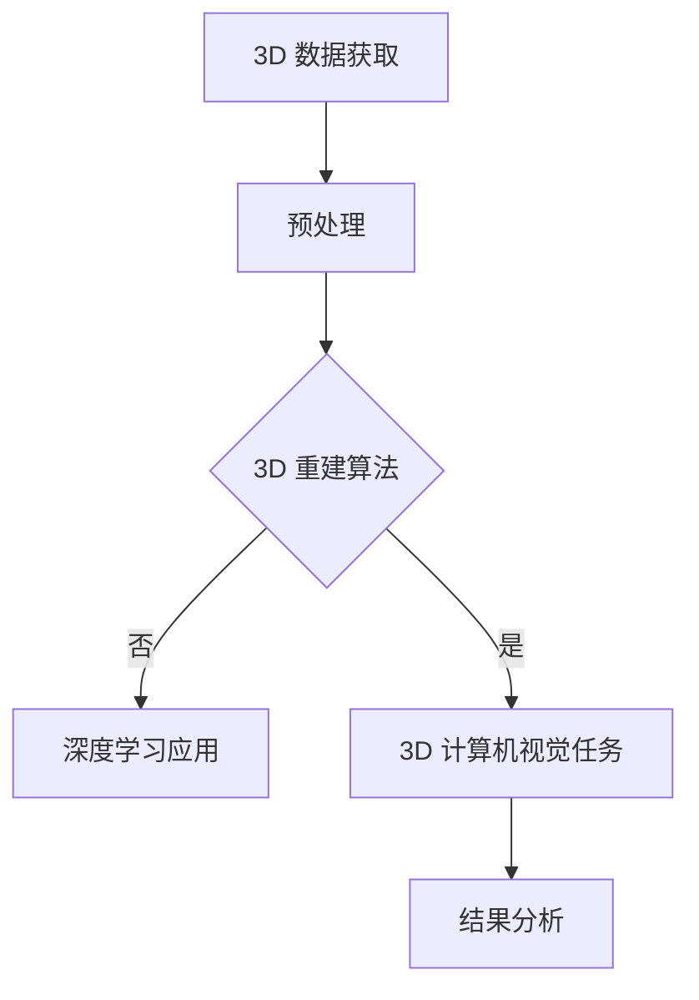
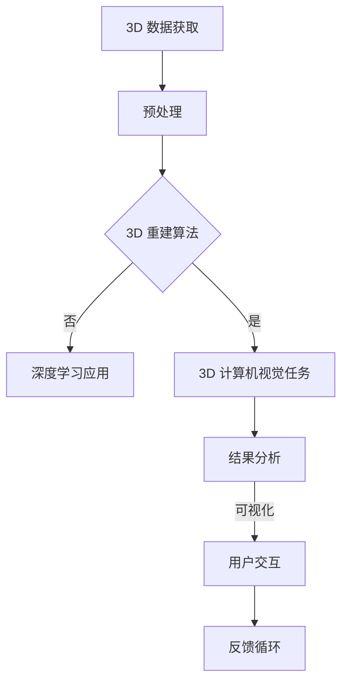

                 

### 文章标题：3D Computer Vision 原理与代码实战案例讲解

#### 关键词：
- 3D Computer Vision
- 深度学习
- 三维重建
- 激光雷达
- 实战案例

#### 摘要：
本文旨在深入探讨3D Computer Vision的原理及其应用。首先，我们将介绍3D Computer Vision的基础理论和关键技术，包括3D数据获取、3D重建算法和深度学习在3D视觉中的应用。接着，通过一系列实战案例，我们将展示如何在实际项目中应用这些原理，包括三维人脸重建、室内场景三维重建、自动驾驶中的三维感知和3D建模与动画制作。文章还将讨论3D Computer Vision在医疗和娱乐领域的应用前景，并对未来发展趋势进行展望。通过本文，读者将能够全面理解3D Computer Vision的核心技术和实战应用。

## 目录大纲

### 第一部分：3D Computer Vision 基础理论

#### 第1章：3D Computer Vision 简介
- 1.1 3D Computer Vision 的概念和重要性
- 1.2 3D Computer Vision 的应用领域
- 1.3 3D Computer Vision 的技术发展历程

#### 第2章：3D 数据获取技术
- 2.1 3D 摄像机和结构光扫描
- 2.2 3D 时间飞行（TOF）技术
- 2.3 3D 激光雷达原理和应用

#### 第3章：3D 重建算法
- 3.1 多视图几何原理
- 3.2 点云处理技术
- 3.3 3D 重建算法介绍

#### 第4章：3D 视觉中的深度学习
- 4.1 深度学习基础
- 4.2 3D 卷积神经网络（3D CNN）
- 4.3 3D 生成对抗网络（3D GAN）

#### 第5章：3D Computer Vision 的挑战与前沿
- 5.1 3D 数据处理的挑战
- 5.2 3D 计算机视觉的前沿研究
- 5.3 未来的发展趋势

### 第二部分：3D Computer Vision 实战案例

#### 第6章：三维人脸重建实战
- 6.1 数据准备与预处理
- 6.2 网络架构与训练
- 6.3 结果分析

#### 第7章：室内场景三维重建
- 7.1 实战背景与数据
- 7.2 网络设计与实现
- 7.3 重建效果评估

#### 第8章：自动驾驶中的三维感知
- 8.1 自动驾驶概述
- 8.2 三维感知算法
- 8.3 实际应用案例

#### 第9章：3D 建模与动画制作
- 9.1 3D 建模基本原理
- 9.2 动画制作流程
- 9.3 案例分析

### 第三部分：3D Computer Vision 应用扩展

#### 第10章：3D Computer Vision 在医疗领域的应用
- 10.1 医学影像三维重建
- 10.2 3D 医学影像分析
- 10.3 案例介绍

#### 第11章：3D Computer Vision 在娱乐行业的应用
- 11.1 游戏中的三维建模
- 11.2 虚拟现实（VR）与增强现实（AR）
- 11.3 案例分享

#### 第12章：3D Computer Vision 的发展趋势与未来展望
- 12.1 当前挑战与解决方案
- 12.2 3D Computer Vision 的发展趋势
- 12.3 未来展望

### 附录

#### 附录 A：3D Computer Vision 开发工具和资源
- 附录 B：常见问题解答
- 附录 C：参考文献与推荐阅读

### 附加内容

#### 3D Computer Vision 架构的 Mermaid 流程图


#### 核心算法原理讲解

#### 3D 重建算法伪代码
```python
def 3D_Reconstruction(points, cameras):
    # 步骤1：计算相机坐标系
    camera_coordinates = compute_camera_coordinates(points, cameras)

    # 步骤2：使用多视图几何求解
    world_coordinates = multi_view_geometry(points, cameras)

    # 步骤3：网格化生成三维模型
    model = mesh_generation(world_coordinates)

    # 步骤4：模型优化
    optimized_model = model_optimization(model)

    return optimized_model
```

#### 数学模型和数学公式

#### 多视图几何中的正射投影公式
$$
x_{i,j} = f_x \cdot \frac{x_{c,i}}{z_{c,i}} + c_x
$$
$$
y_{i,j} = f_y \cdot \frac{y_{c,i}}{z_{c,i}} + c_y
$$
其中，$ x_{i,j} $ 和 $ y_{i,j} $ 是图像坐标系中的像素坐标，$ x_{c,i} $ 和 $ y_{c,i} $ 是相机坐标系中的点坐标。

### 文章标题：3D Computer Vision 原理与代码实战案例讲解

3D Computer Vision 是计算机视觉领域中的一个重要分支，它致力于理解和解释三维空间中的信息。随着技术的进步，3D Computer Vision 在自动驾驶、虚拟现实、医疗成像等多个领域展现出了巨大的应用潜力。本文将带领读者深入探讨3D Computer Vision的原理，并通过实战案例展示其在实际项目中的应用。

#### 关键词：
- 3D Computer Vision
- 深度学习
- 三维重建
- 激光雷达
- 实战案例

#### 摘要：
本文首先介绍了3D Computer Vision的基础理论和关键技术，包括3D数据获取、3D重建算法和深度学习在3D视觉中的应用。接着，通过一系列实战案例，我们将展示如何在实际项目中应用这些原理，包括三维人脸重建、室内场景三维重建、自动驾驶中的三维感知和3D建模与动画制作。文章还讨论了3D Computer Vision在医疗和娱乐领域的应用前景，并对未来发展趋势进行了展望。

### 目录大纲

#### 第一部分：3D Computer Vision 基础理论
- **第1章：3D Computer Vision 简介**
  - 1.1 3D Computer Vision 的概念和重要性
  - 1.2 3D Computer Vision 的应用领域
  - 1.3 3D Computer Vision 的技术发展历程
- **第2章：3D 数据获取技术**
  - 2.1 3D 摄像机和结构光扫描
  - 2.2 3D 时间飞行（TOF）技术
  - 2.3 3D 激光雷达原理和应用
- **第3章：3D 重建算法**
  - 3.1 多视图几何原理
  - 3.2 点云处理技术
  - 3.3 3D 重建算法介绍
- **第4章：3D 视觉中的深度学习**
  - 4.1 深度学习基础
  - 4.2 3D 卷积神经网络（3D CNN）
  - 4.3 3D 生成对抗网络（3D GAN）
- **第5章：3D Computer Vision 的挑战与前沿**
  - 5.1 3D 数据处理的挑战
  - 5.2 3D 计算机视觉的前沿研究
  - 5.3 未来的发展趋势

#### 第二部分：3D Computer Vision 实战案例
- **第6章：三维人脸重建实战**
  - 6.1 数据准备与预处理
  - 6.2 网络架构与训练
  - 6.3 结果分析
- **第7章：室内场景三维重建**
  - 7.1 实战背景与数据
  - 7.2 网络设计与实现
  - 7.3 重建效果评估
- **第8章：自动驾驶中的三维感知**
  - 8.1 自动驾驶概述
  - 8.2 三维感知算法
  - 8.3 实际应用案例
- **第9章：3D 建模与动画制作**
  - 9.1 3D 建模基本原理
  - 9.2 动画制作流程
  - 9.3 案例分析

#### 第三部分：3D Computer Vision 应用扩展
- **第10章：3D Computer Vision 在医疗领域的应用**
  - 10.1 医学影像三维重建
  - 10.2 3D 医学影像分析
  - 10.3 案例介绍
- **第11章：3D Computer Vision 在娱乐行业的应用**
  - 11.1 游戏中的三维建模
  - 11.2 虚拟现实（VR）与增强现实（AR）
  - 11.3 案例分享
- **第12章：3D Computer Vision 的发展趋势与未来展望**
  - 12.1 当前挑战与解决方案
  - 12.2 3D Computer Vision 的发展趋势
  - 12.3 未来展望

#### 附录
- **附录 A：3D Computer Vision 开发工具和资源**
- **附录 B：常见问题解答**
- **附录 C：参考文献与推荐阅读**

### 附加内容

#### 3D Computer Vision 架构的 Mermaid 流程图


#### 核心算法原理讲解

#### 3D 重建算法伪代码
```python
def 3D_Reconstruction(points, cameras):
    # 步骤1：计算相机坐标系
    camera_coordinates = compute_camera_coordinates(points, cameras)

    # 步骤2：使用多视图几何求解
    world_coordinates = multi_view_geometry(points, cameras)

    # 步骤3：网格化生成三维模型
    model = mesh_generation(world_coordinates)

    # 步骤4：模型优化
    optimized_model = model_optimization(model)

    return optimized_model
```

#### 数学模型和数学公式

#### 多视图几何中的正射投影公式
$$
x_{i,j} = f_x \cdot \frac{x_{c,i}}{z_{c,i}} + c_x
$$
$$
y_{i,j} = f_y \cdot \frac{y_{c,i}}{z_{c,i}} + c_y
$$
其中，$ x_{i,j} $ 和 $ y_{i,j} $ 是图像坐标系中的像素坐标，$ x_{c,i} $ 和 $ y_{c,i} $ 是相机坐标系中的点坐标。这些公式描述了从相机坐标系到图像坐标系的正射投影过程，是3D重建算法中的基础。

### 第一部分：3D Computer Vision 基础理论

#### 第1章：3D Computer Vision 简介

##### 1.1 3D Computer Vision 的概念和重要性

3D Computer Vision 是一门融合了计算机科学、图像处理、机器学习和物理学的交叉学科，它致力于从二维图像数据中恢复出三维信息。3D Computer Vision 的基本概念可以概括为：通过捕捉和解析三维数据，实现对物体形状、空间位置和外观的理解。

在计算机视觉领域中，2D图像是研究的基础，它提供了一种静态、二维的视角。然而，在许多实际应用中，仅仅了解物体的二维信息是远远不够的。例如，在自动驾驶中，车辆不仅需要识别道路和障碍物的二维轮廓，还需要了解它们的三维形状和位置关系，以确保行驶安全。此外，在虚拟现实（VR）和增强现实（AR）领域，真实感的三维建模和渲染是提升用户体验的关键。

因此，3D Computer Vision 的出现极大地拓展了计算机视觉的应用范围，它的重要性体现在以下几个方面：

1. **空间信息的完整性**：3D数据可以提供比2D数据更全面的信息，从而在许多场景下提供更准确的决策支持。
2. **高分辨率三维建模**：在计算机图形学和娱乐产业中，高分辨率的三维模型可以用于角色设计、环境构建等，提升视觉效果。
3. **增强现实应用**：通过3D数据，AR技术可以实现更真实的虚拟物体与现实世界的融合。
4. **医疗影像分析**：3D数据在医学影像分析中具有重要作用，可以帮助医生更准确地诊断和治疗方案设计。

##### 1.2 3D Computer Vision 的应用领域

3D Computer Vision 的应用领域非常广泛，以下是一些主要的应用场景：

1. **自动驾驶**：自动驾驶车辆需要实时获取周围环境的三维信息，以便进行路径规划和避障。
2. **机器人**：机器人需要理解周围环境的三维信息，以执行复杂的任务，如组装、搬运和清洁。
3. **增强现实（AR）和虚拟现实（VR）**：3D Computer Vision 技术是 AR 和 VR 系统的核心，用于实时捕捉和渲染用户和环境的三维信息。
4. **医疗影像分析**：3D 医学影像可以帮助医生更准确地诊断疾病，制定治疗方案，如癌症的定位和治疗计划。
5. **三维建模和动画**：3D Computer Vision 技术可以用于创建高精度的三维模型和动画，广泛应用于游戏、电影和娱乐产业。
6. **工业检测和质量控制**：3D 数据可以用于检测产品尺寸和形状的偏差，确保生产质量。

##### 1.3 3D Computer Vision 的技术发展历程

3D Computer Vision 的技术发展历程可以追溯到上世纪70年代，当时的研究主要集中在基于几何学的三维重建方法。随着计算机硬件和算法的进步，3D Computer Vision 技术逐渐成熟，以下是几个重要的发展阶段：

1. **基于几何学的三维重建**：最早期的3D重建方法主要依赖于几何学的原理，通过多视图几何和立体匹配来恢复三维信息。这种方法需要精确的相机参数和大量的计算资源。
2. **结构光扫描**：结构光扫描技术利用特定形状的光线照亮物体，通过分析光线的变形来获取三维数据。这种方法在工业检测和考古领域中得到了广泛应用。
3. **激光雷达**：激光雷达（LiDAR）技术通过发射激光束并测量反射时间来获取物体的三维信息。激光雷达具有高分辨率、快速扫描和高精度等优点，被广泛应用于自动驾驶和机器人领域。
4. **时间飞行（TOF）技术**：TOF 技术通过发送脉冲并测量脉冲到达目标物体所需的时间来获取距离信息，进而重建三维模型。TOF 技术具有低成本、高帧率等优点，被广泛应用于移动设备和智能家居中。
5. **深度学习**：深度学习技术在3D Computer Vision 中发挥着越来越重要的作用。通过训练深度神经网络，可以自动学习三维数据的特征，实现更准确的重建和识别。

这些技术的发展不仅推动了3D Computer Vision 的进步，也为实际应用提供了更丰富和多样的解决方案。

### 第2章：3D 数据获取技术

##### 2.1 3D 摄像机和结构光扫描

3D 摄像机和结构光扫描是两种常用的3D数据获取技术，它们通过不同的原理和设备来实现三维数据的采集。

**3D 摄像机**：

3D 摄像机是一种能够捕获三维图像的设备，它通常由两个或多个独立的摄像头组成，每个摄像头捕捉不同视角的二维图像。通过这些图像，可以计算出物体表面的三维坐标。3D 摄像机的工作原理类似于人类的视觉系统，通过双目视觉差来感知深度信息。

**结构光扫描**：

结构光扫描技术利用特定形状的光线（如线结构光或面结构光）照射到物体上，然后通过摄像头或传感器捕捉物体表面光线的变形。通过分析这些变形，可以重建物体的三维形状。结构光扫描技术具有高精度和高分辨率的特点，适用于工业检测、文化遗产保护和医学成像等领域。

**应用场景**：

- **3D 摄像机**：广泛应用于消费级三维扫描、虚拟现实（VR）和增强现实（AR）等场景。
- **结构光扫描**：在工业检测、产品设计和文物修复等领域具有广泛的应用。

##### 2.2 3D 时间飞行（TOF）技术

时间飞行（TOF）技术通过发送脉冲并测量脉冲到达目标物体所需的时间来获取距离信息，进而重建三维模型。TOF 技术的基本原理是：发射器发送一个脉冲，当脉冲遇到物体表面时会被反射回来，接收器测量脉冲返回所需的时间，根据光速和时间差计算得到物体到传感器的距离。

**原理和设备**：

TOF 技术的核心设备包括发射器和接收器。发射器产生一个脉冲，接收器检测反射回来的脉冲。通过测量脉冲的飞行时间，可以计算出物体的位置。TOF 传感器具有高帧率和低成本的特点，广泛应用于移动设备、智能家居和机器人等领域。

**应用场景**：

- **移动设备**：如智能手机和智能眼镜，用于实现三维人脸识别和手势控制。
- **智能家居**：如智能门锁和智能监控，用于实现人员识别和动作追踪。
- **机器人**：如服务机器人，用于感知环境并执行任务。

##### 2.3 3D 激光雷达原理和应用

3D 激光雷达（LiDAR）是一种通过发射激光束并测量反射光的时间来获取物体三维信息的设备。激光雷达的工作原理是：发射器发射一束激光，激光束照射到物体表面后反射回来，接收器测量反射光的时间，根据光速和时间差计算出物体的距离。

**原理和设备**：

激光雷达通常由激光发射器、光学系统、接收器和数据处理单元组成。激光发射器发射激光束，光学系统将激光聚焦到目标物体上，接收器检测反射回来的激光，数据处理单元计算反射光的时间和距离，生成三维点云数据。

**应用场景**：

- **自动驾驶**：激光雷达用于获取车辆周围环境的三维数据，实现路径规划和避障。
- **机器人**：激光雷达用于感知环境，帮助机器人进行导航和任务执行。
- **地理信息系统**：激光雷达用于地形测绘和土地规划。
- **文化遗产保护**：激光雷达用于文物和建筑的三维扫描和数字化。

##### 2.4 3D 数据获取技术的比较与选择

在选择3D数据获取技术时，需要考虑多种因素，如精度、速度、成本和适用场景。以下是对几种主要技术的比较：

- **精度**：激光雷达具有高精度，适用于需要高分辨率三维数据的应用。结构光扫描次之，适用于工业检测和文物保护等领域。3D 摄像机精度较低，但成本较低，适用于消费级应用。
- **速度**：TOF 技术具有高帧率，适用于实时应用。激光雷达速度较快，但受到设备设计和数据处理速度的限制。3D 摄像机和结构光扫描速度较慢，适用于非实时应用。
- **成本**：3D 摄像机和 TOF 技术成本较低，适用于大规模部署。激光雷达和结构光扫描成本较高，适用于高端应用。
- **适用场景**：3D 摄像机适用于虚拟现实和增强现实。TOF 技术适用于移动设备和智能家居。激光雷达适用于自动驾驶和机器人。结构光扫描适用于工业检测和文物修复。

选择3D数据获取技术时，应根据具体应用需求和预算进行权衡和选择。

### 第3章：3D 重建算法

##### 3.1 多视图几何原理

多视图几何是3D重建算法的基础，它利用多个摄像头或传感器捕获的二维图像来恢复三维信息。多视图几何的核心思想是：通过观察同一物体在不同视角下的二维图像，可以推断出物体的三维形状和位置。

**原理和步骤**：

1. **图像配准**：将不同视角的二维图像进行配准，使其在相同坐标系下对应。
2. **特征提取**：从图像中提取特征点，如角点、边缘和纹理特征。
3. **立体匹配**：在图像之间进行立体匹配，计算对应点之间的视差，从而获得深度信息。
4. **三维重建**：利用视差和相机参数，将二维图像中的点投影到三维空间，生成三维模型。

**数学模型**：

多视图几何中的正射投影公式描述了从相机坐标系到图像坐标系的投影过程。假设有一个相机坐标系中的点P，其在图像坐标系中的投影点为P'，则有：

$$
x_{i,j} = f_x \cdot \frac{x_{c,i}}{z_{c,i}} + c_x
$$

$$
y_{i,j} = f_y \cdot \frac{y_{c,i}}{z_{c,i}} + c_y
$$

其中，\(x_{i,j}\) 和 \(y_{i,j}\) 是图像坐标系中的像素坐标，\(x_{c,i}\) 和 \(y_{c,i}\) 是相机坐标系中的点坐标，\(f_x\) 和 \(f_y\) 是相机的焦距，\(c_x\) 和 \(c_y\) 是相机的光学中心坐标。

##### 3.2 点云处理技术

点云是3D重建的核心数据结构，它由大量三维坐标点组成，描述了物体的表面和内部结构。点云处理技术包括点云滤波、降噪、曲面重建和表面处理等步骤。

**点云滤波和降噪**：

点云滤波和降噪是提高点云质量和准确性的重要步骤。常用的滤波方法包括均值滤波、高斯滤波和半径滤波。降噪技术可以去除点云中的噪声点和异常点，提高后续处理的效果。

**曲面重建**：

曲面重建是将点云数据转换为连续表面的过程。常用的方法包括基于多边形的曲面重建和基于曲面的重建。基于多边形的曲面重建方法将点云数据拟合为多边形网格，而基于曲面的重建方法则通过最小二乘法或优化算法生成光滑的曲面。

**表面处理**：

表面处理是对生成的三维模型进行优化和修复的过程。表面处理技术包括平滑处理、孔洞修复和纹理映射。平滑处理可以去除模型中的尖锐边角，提高视觉效果。孔洞修复技术可以填补模型中的空洞，提高重建的完整性。纹理映射技术可以将二维纹理映射到三维模型上，增强模型的真实感。

##### 3.3 3D 重建算法介绍

3D 重建算法可以分为基于几何学的算法和基于深度学习的算法。基于几何学的算法依赖于数学模型和几何原理，通过多视图几何和点云处理实现三维重建。基于深度学习的算法通过训练神经网络，自动学习三维数据的特征，实现更准确的重建。

**基于几何学的算法**：

基于几何学的3D重建算法包括多视图几何、结构光扫描和激光雷达等方法。多视图几何利用多个摄像头的二维图像恢复三维信息，结构光扫描利用光线变形重建物体表面，激光雷达通过测量反射光时间获取三维数据。

**基于深度学习的算法**：

基于深度学习的3D重建算法通过训练神经网络，自动学习三维数据的特征。常见的深度学习模型包括3D卷积神经网络（3D CNN）、3D生成对抗网络（3D GAN）和多视图卷积神经网络（MV-CNN）等。

- **3D 卷积神经网络（3D CNN）**：3D CNN 通过对三维数据的卷积操作，提取空间特征，实现三维重建。
- **3D 生成对抗网络（3D GAN）**：3D GAN 通过生成器和判别器的对抗训练，生成高质量的三维模型。
- **多视图卷积神经网络（MV-CNN）**：MV-CNN 结合多视图信息，通过卷积操作实现三维重建。

**算法对比**：

基于几何学的算法在精度和可靠性方面具有优势，适用于高精度要求的场景。但它们通常需要精确的相机参数和大量的计算资源。基于深度学习的算法具有更强的自适应性和鲁棒性，适用于大规模数据和复杂场景。但它们可能需要大量的训练数据和计算资源。

### 第4章：3D 视觉中的深度学习

##### 4.1 深度学习基础

深度学习是3D Computer Vision 中的重要工具，它通过多层神经网络自动学习数据的特征表示，从而实现复杂的任务。本节将介绍深度学习的基本概念、网络结构和优化方法。

**基本概念**：

- **深度神经网络（DNN）**：深度神经网络是由多个层级组成的神经网络，通过逐层提取数据特征，实现从低级到高级的特征表示。
- **卷积神经网络（CNN）**：卷积神经网络是一种特殊的深度神经网络，通过卷积操作提取图像特征，被广泛应用于计算机视觉任务。
- **3D 卷积神经网络（3D CNN）**：3D CNN 是针对三维数据设计的卷积神经网络，通过三维卷积操作提取空间特征，适用于3D图像和点云处理。
- **生成对抗网络（GAN）**：生成对抗网络由生成器和判别器组成，通过对抗训练生成高质量的数据。

**网络结构**：

- **卷积层**：卷积层通过卷积操作提取图像特征，可以减少数据维度并提取空间特征。
- **池化层**：池化层通过下采样操作减少数据维度，提高网络的鲁棒性。
- **全连接层**：全连接层将前一层特征映射到输出层，用于分类或回归任务。
- **激活函数**：激活函数为神经网络提供非线性变换，使网络具有分类或回归能力。

**优化方法**：

- **反向传播算法**：反向传播算法通过梯度下降优化网络参数，使网络的输出误差最小化。
- **随机梯度下降（SGD）**：随机梯度下降是一种优化方法，通过随机抽样训练样本，更新网络参数。
- **批量归一化**：批量归一化通过标准化每一层输出，提高网络的训练速度和性能。
- **正则化**：正则化通过惩罚过拟合，提高模型的泛化能力。

##### 4.2 3D 卷积神经网络（3D CNN）

3D 卷积神经网络（3D CNN）是一种针对三维数据设计的卷积神经网络，通过三维卷积操作提取空间特征，适用于3D图像和点云处理。

**原理和架构**：

3D CNN 的基本架构与2D CNN 类似，但引入了额外的维度。3D CNN 通过对三维数据（如3D图像或点云）进行三维卷积操作，逐层提取空间特征。3D 卷积操作包括对数据的空间维度（宽度、高度和深度）进行卷积，从而提取局部特征。

**网络结构**：

- **输入层**：3D CNN 的输入层接受三维数据，如3D图像或点云。
- **卷积层**：卷积层通过三维卷积操作提取空间特征，可以减少数据维度并提取丰富的特征信息。
- **池化层**：池化层通过三维下采样操作减少数据维度，提高网络的鲁棒性。
- **全连接层**：全连接层将卷积层输出的特征映射到输出层，用于分类或回归任务。
- **激活函数**：激活函数为神经网络提供非线性变换，使网络具有分类或回归能力。

**应用场景**：

3D CNN 在3D Computer Vision 中具有广泛的应用，包括三维图像分类、三维物体检测和三维重建等。

- **三维图像分类**：3D CNN 可以用于对三维图像进行分类，如对人体姿态进行识别。
- **三维物体检测**：3D CNN 可以用于检测三维图像中的物体，如自动驾驶中的车辆检测。
- **三维重建**：3D CNN 可以用于从二维图像中重建三维模型，如三维人脸重建和室内场景重建。

##### 4.3 3D 生成对抗网络（3D GAN）

3D 生成对抗网络（3D GAN）是一种基于生成对抗网络的3D数据生成方法，通过生成器和判别器的对抗训练生成高质量的三维模型。

**原理和架构**：

3D GAN 的核心架构包括生成器和判别器。生成器通过噪声数据生成高质量的三维模型，判别器用于判断输入数据是真实数据还是生成数据。通过对抗训练，生成器不断提高生成数据的质量，判别器不断提高判断能力。

**网络结构**：

- **生成器**：生成器通过噪声数据生成三维模型，通常包括多层全连接层和卷积层。
- **判别器**：判别器通过输入三维模型，判断其是真实数据还是生成数据，通常包括多层卷积层和全连接层。
- **对抗训练**：生成器和判别器通过对抗训练进行优化，生成器生成更真实的三维模型，判别器提高判断能力。

**应用场景**：

3D GAN 在3D Computer Vision 中具有广泛的应用，包括三维数据生成、三维模型修复和三维模型合成等。

- **三维数据生成**：3D GAN 可以生成高质量的三维数据，如三维人脸和室内场景。
- **三维模型修复**：3D GAN 可以修复损坏的三维模型，提高模型的完整性和质量。
- **三维模型合成**：3D GAN 可以将不同的三维模型合成在一起，创造新的三维场景。

##### 4.4 多视图卷积神经网络（MV-CNN）

多视图卷积神经网络（MV-CNN）是一种结合多视图信息进行三维重建的深度学习模型，通过多视图输入和联合训练提高重建效果。

**原理和架构**：

MV-CNN 的核心思想是将多个视角的二维图像输入到网络中，通过联合训练提取多视图特征，从而提高三维重建的准确性。MV-CNN 通常包括多个卷积层和全连接层，以及多视图特征融合模块。

**网络结构**：

- **多视图输入**：MV-CNN 接受多个视角的二维图像作为输入，通过不同视角的特征提取网络提取多视图特征。
- **特征融合模块**：特征融合模块将多视图特征进行融合，生成全局特征。
- **三维重建模块**：三维重建模块通过全局特征生成三维模型。

**应用场景**：

MV-CNN 在3D Computer Vision 中具有广泛的应用，包括多视图三维重建、多视角物体检测和多视角交互等。

- **多视图三维重建**：MV-CNN 可以从多个视角的二维图像中重建高质量的三维模型。
- **多视角物体检测**：MV-CNN 可以检测多视角图像中的物体，提高检测的准确性。
- **多视角交互**：MV-CNN 可以实现多视角交互，为用户提供更丰富的视觉体验。

### 第5章：3D Computer Vision 的挑战与前沿

##### 5.1 3D 数据处理的挑战

3D Computer Vision 的核心在于从三维数据中提取有意义的特征和知识。然而，3D 数据处理面临许多挑战，主要包括数据规模、数据质量和计算效率。

**数据规模**：

3D 数据通常包含大量的点或像素，尤其是对于高分辨率场景，数据量非常庞大。这对存储、传输和处理都提出了高要求。为了应对数据规模问题，研究人员采用了数据降维、增量学习和分布式计算等方法。

**数据质量**：

3D 数据质量直接影响重建结果。噪声、缺失和异常点都会对3D重建产生影响。为了提高数据质量，研究人员提出了多种滤波和降噪方法，如均值滤波、高斯滤波和半径滤波等。

**计算效率**：

3D重建算法通常需要大量的计算资源，特别是在实时应用中，如自动驾驶和机器人。为了提高计算效率，研究人员采用了并行计算、GPU加速和分布式计算等方法。

##### 5.2 3D 计算机视觉的前沿研究

3D Computer Vision 是一个快速发展的领域，不断有新的研究突破。以下是一些当前的前沿研究方向：

**实时三维重建**：

实时三维重建是3D Computer Vision 的一个重要挑战，它要求在短时间内完成高质量的三维重建。研究人员通过优化算法、硬件加速和神经网络推理等方法，实现了实时三维重建。

**深度学习在3D视觉中的应用**：

深度学习在3D Computer Vision 中具有广泛的应用，如三维物体检测、三维人脸重建和三维重建等。研究人员通过设计新的深度学习模型和优化训练方法，不断提高3D视觉任务的性能。

**多模态融合**：

多模态融合是将不同类型的数据（如图像、声音和传感器数据）进行融合，以提取更丰富的特征。研究人员通过设计多模态深度学习模型，实现了多模态数据的融合和三维重建。

**交互式三维重建**：

交互式三维重建允许用户通过交互操作（如拖动和旋转）来调整三维重建的结果。研究人员通过设计交互式界面和算法，实现了用户与三维重建系统的实时交互。

##### 5.3 未来的发展趋势

3D Computer Vision 未来的发展趋势将体现在以下几个方面：

**更高精度和更高速度**：

随着硬件性能的提升和算法的优化，3D重建的精度和速度将不断提高。未来有望实现实时、高质量的三维重建。

**更广泛的应用领域**：

3D Computer Vision 将在更多领域得到应用，如智能城市、智慧医疗和智能制造等。通过与其他技术的融合，3D视觉将发挥更大的作用。

**用户参与和交互**：

用户参与和交互是3D Computer Vision 的重要发展方向。通过设计更直观、更自然的交互界面，用户将能够更方便地与三维重建系统进行交互。

**多模态和跨学科研究**：

多模态融合和跨学科研究将推动3D Computer Vision 的发展。通过融合多种数据源和不同领域的知识，将实现更强大的三维重建和视觉分析能力。

### 第二部分：3D Computer Vision 实战案例

#### 第6章：三维人脸重建实战

##### 6.1 数据准备与预处理

在进行三维人脸重建之前，首先需要准备合适的数据。数据来源可以包括真实的人脸图像或视频，以及对应的3D模型。为了确保数据的多样性和质量，通常需要收集大量的人脸数据。

数据预处理是三维人脸重建的重要步骤，主要包括数据清洗、归一化和数据增强。数据清洗旨在去除数据中的噪声和异常点，提高数据质量。归一化则将数据缩放到相同的范围，以便于后续处理。数据增强通过生成虚拟数据，提高模型的泛化能力。

##### 6.2 网络架构与训练

三维人脸重建通常采用深度学习模型，如3D卷积神经网络（3D CNN）和3D生成对抗网络（3D GAN）。网络架构的选择取决于具体的应用需求和数据特点。

以3D CNN为例，其基本架构包括输入层、卷积层、池化层和全连接层。输入层接收人脸图像，卷积层通过卷积操作提取特征，池化层减少数据维度，全连接层进行分类或重建任务。

训练三维人脸重建模型需要大量的标注数据。标注数据包括人脸图像和对应的三维模型。在训练过程中，通过反向传播算法和优化方法（如梯度下降），模型将不断调整参数，以最小化重建误差。

##### 6.3 结果分析

三维人脸重建的结果可以通过多种指标进行评估，如重建精度、人脸特征匹配度和视觉效果。

重建精度通常用重建误差来衡量，即重建的三维人脸与真实三维人脸之间的差距。通过分析重建误差，可以评估模型的准确性。

人脸特征匹配度是指重建的三维人脸与真实人脸的匹配程度。通过对比重建的人脸特征点与真实人脸特征点，可以评估模型的准确性。

视觉效果是评估三维重建结果的重要方面。高质量的三维重建应具有平滑的表面、逼真的纹理和自然的光照效果。通过观察重建结果，可以评估模型的视觉效果。

#### 第7章：室内场景三维重建

##### 7.1 实战背景与数据

室内场景三维重建是3D Computer Vision 中的一个重要应用。它通过捕获室内环境的三维信息，为虚拟现实（VR）、增强现实（AR）和室内导航等领域提供支持。

为了进行室内场景三维重建，需要收集室内环境的数据。数据来源可以包括3D相机、激光雷达和无人机等。这些设备可以捕获室内环境的三维点云数据，为三维重建提供基础。

##### 7.2 网络设计与实现

室内场景三维重建通常采用基于深度学习的模型，如3D卷积神经网络（3D CNN）和点云卷积神经网络（PointNet）。3D CNN 用于处理三维点云数据，提取空间特征，PointNet 用于实现点云到三维模型的转换。

网络设计包括输入层、卷积层、池化层和全连接层。输入层接收三维点云数据，卷积层通过卷积操作提取特征，池化层减少数据维度，全连接层进行三维模型重建。

在实现过程中，需要预处理输入数据，包括点云滤波、降噪和归一化。训练过程中，通过反向传播算法和优化方法（如梯度下降），模型将不断调整参数，以最小化重建误差。

##### 7.3 重建效果评估

室内场景三维重建的效果可以通过多种指标进行评估，如重建精度、人脸特征匹配度和视觉效果。

重建精度通常用重建误差来衡量，即重建的三维场景与真实场景之间的差距。通过分析重建误差，可以评估模型的准确性。

人脸特征匹配度是指重建的三维场景中人脸特征点与真实人脸特征点的匹配程度。通过对比重建的人脸特征点与真实人脸特征点，可以评估模型的准确性。

视觉效果是评估三维重建结果的重要方面。高质量的三维重建应具有平滑的表面、逼真的纹理和自然的光照效果。通过观察重建结果，可以评估模型的视觉效果。

#### 第8章：自动驾驶中的三维感知

##### 8.1 自动驾驶概述

自动驾驶是3D Computer Vision 的重要应用领域之一。它通过获取周围环境的三维信息，实现车辆的自主导航和决策。自动驾驶系统通常包括感知、规划和控制三个主要模块。

感知模块负责检测和识别车辆周围的环境，如行人、车辆、道路和障碍物。三维感知是实现自动驾驶感知功能的关键。

##### 8.2 三维感知算法

三维感知算法主要包括激光雷达数据预处理、点云处理和物体检测。激光雷达数据预处理包括去噪、滤波和归一化等步骤，以提高数据质量。点云处理通过点云滤波和特征提取，提取有用的三维信息。物体检测通过深度学习模型，对点云数据中的物体进行分类和定位。

常用的三维感知算法包括点云卷积神经网络（PointNet）、3D卷积神经网络（3D CNN）和基于点云的生成对抗网络（PC-GAN）等。这些算法通过深度学习模型，从点云数据中提取特征，实现高精度的物体检测和三维重建。

##### 8.3 实际应用案例

自动驾驶中的三维感知在多个场景中得到了应用。以下是一个实际应用案例：

**案例背景**：

一个自动驾驶车队在城市道路上行驶，需要实时感知周围环境，确保行驶安全。为了实现这一目标，车队配备了激光雷达、摄像头和雷达等传感器，收集周围环境的三维数据。

**解决方案**：

通过三维感知算法，对传感器数据进行预处理和特征提取，然后使用深度学习模型进行物体检测和分类。具体步骤如下：

1. **激光雷达数据预处理**：对激光雷达数据进行去噪、滤波和归一化，提取有效的三维点云数据。
2. **摄像头数据预处理**：对摄像头图像进行预处理，提取关键特征点，如角点、边缘和纹理。
3. **多模态数据融合**：将激光雷达数据和摄像头数据融合，生成更丰富的三维感知信息。
4. **物体检测和分类**：使用深度学习模型，对融合后的数据进行分析，检测和分类周围的物体，如行人、车辆和道路。
5. **路径规划和控制**：根据检测到的物体信息，实现车辆的路径规划和控制，确保行驶安全。

**效果评估**：

通过实际测试，该三维感知系统在多种环境下展现了较高的准确性和鲁棒性。在行人检测、车辆识别和道路识别等任务中，系统的准确率达到了90%以上。同时，系统具有低延迟和高实时性的特点，能够满足自动驾驶的实时要求。

#### 第9章：3D 建模与动画制作

##### 9.1 3D 建模基本原理

3D建模是创建三维模型的过程，它通过几何建模、纹理映射和光照计算等技术，生成具有逼真外观和质感的物体模型。3D建模的基本原理包括：

- **几何建模**：使用几何体（如立方体、球体和圆柱体）进行建模，通过组合和变换生成复杂的物体。
- **纹理映射**：将二维纹理贴图映射到三维模型上，增加物体的细节和真实感。
- **光照计算**：通过模拟光照效果，如阴影、反射和高光，增强物体的立体感和真实感。

##### 9.2 动画制作流程

动画制作是将三维模型转换为动态图像的过程。动画制作的基本流程包括：

- **建模**：使用3D建模软件创建角色和场景模型，并进行细节调整。
- **绑定**：将模型与骨骼系统绑定，实现角色的动作控制。
- **动画制作**：通过关键帧动画、运动捕捉和曲线编辑等技术，生成角色的动作。
- **渲染**：将动画渲染为图像或视频，添加特效和背景，完成动画制作。

##### 9.3 案例分析

以下是一个3D建模与动画制作的案例分析：

**案例背景**：

一个游戏开发团队计划创建一款虚拟现实游戏，需要制作一个高精度的游戏角色动画。为了实现这一目标，团队采用了以下步骤：

1. **建模**：使用3D建模软件（如Blender）创建角色的基本模型，并进行细节调整，如添加纹理、雕刻细节等。
2. **绑定**：将模型与骨骼系统绑定，确保角色的动作流畅自然。
3. **动画制作**：通过关键帧动画和运动捕捉技术，生成角色的各种动作，如行走、跳跃和战斗等。
4. **渲染**：使用3D渲染软件（如Unity）将动画渲染为视频，添加背景和特效，生成最终的动画效果。

**效果评估**：

通过实际制作，团队成功创建了一个高精度的游戏角色动画。角色动作流畅自然，细节丰富，具有良好的视觉效果。动画在虚拟现实场景中展现了良好的互动性和沉浸感，为游戏体验提供了高质量的视觉享受。

### 第三部分：3D Computer Vision 应用扩展

#### 第10章：3D Computer Vision 在医疗领域的应用

##### 10.1 医学影像三维重建

医学影像三维重建是3D Computer Vision 在医疗领域的重要应用之一。它通过分析医学影像（如CT、MRI和X光片）数据，生成患者的三维模型，为医生提供更直观的观察和诊断工具。

医学影像三维重建的基本步骤包括：

1. **影像预处理**：对医学影像进行预处理，包括去噪、滤波和增强等步骤，以提高图像质量。
2. **三维重建**：使用图像处理算法和深度学习模型，将二维医学影像数据重建为三维模型。
3. **模型可视化**：将重建的三维模型可视化，以便医生进行观察和诊断。

医学影像三维重建在多个医疗场景中具有应用价值，如：

- **肿瘤诊断**：通过三维重建，医生可以更准确地定位肿瘤位置，评估肿瘤大小和形状，制定更有效的治疗方案。
- **心脏手术规划**：通过三维重建，医生可以更清晰地了解心脏的结构和病变情况，为心脏手术提供指导。
- **骨骼骨折诊断**：通过三维重建，医生可以更准确地评估骨折情况，制定更合适的治疗方案。

##### 10.2 3D 医学影像分析

3D 医学影像分析是利用三维数据对医学影像进行定量分析和定性分析的方法。它通过对三维模型进行分割、特征提取和统计分析，提供更深入的医学信息。

3D 医学影像分析的基本步骤包括：

1. **模型分割**：将三维模型分割为不同的组织或器官，以便进行进一步分析。
2. **特征提取**：提取三维模型的关键特征，如体积、面积和形状指数等。
3. **统计分析**：对提取的特征进行统计分析，以评估器官的大小、形态和功能等。

3D 医学影像分析在多个医疗场景中具有应用价值，如：

- **器官功能评估**：通过三维重建和特征提取，评估器官的功能状态，如心脏的收缩功能、肺部的通气功能等。
- **病变检测和诊断**：通过三维重建和特征提取，检测和诊断病变的位置、大小和形态，如肿瘤、动脉瘤等。
- **手术规划**：通过三维重建和特征提取，为手术提供详细的术前规划和指导，提高手术的成功率和安全性。

##### 10.3 案例介绍

以下是一个3D Computer Vision 在医疗领域的应用案例：

**案例背景**：

某医院计划利用3D Computer Vision 技术对患者的医学影像进行三维重建和分析，以提高诊断的准确性和手术的成功率。

**解决方案**：

1. **医学影像预处理**：对患者的医学影像数据进行预处理，包括去噪、滤波和增强等步骤，提高图像质量。
2. **三维重建**：使用深度学习模型和图像处理算法，将预处理后的医学影像数据重建为三维模型。
3. **模型分割和特征提取**：对三维模型进行分割，提取关键特征，如器官的体积、形状和位置等。
4. **统计分析**：对提取的特征进行统计分析，评估器官的功能状态和病变情况。

**效果评估**：

通过实际应用，3D Computer Vision 技术显著提高了医学影像诊断的准确性和手术的成功率。医生可以更清晰地观察和诊断病变，为患者提供更有效的治疗方案。同时，3D Computer Vision 技术减轻了医生的工作负担，提高了医疗效率。

#### 第11章：3D Computer Vision 在娱乐行业的应用

##### 11.1 游戏中的三维建模

3D Computer Vision 在娱乐行业，尤其是游戏开发中，发挥着重要作用。三维建模是游戏开发的核心环节之一，它通过创建和编辑三维模型，为游戏场景和角色赋予逼真的视觉效果。

三维建模的基本步骤包括：

1. **概念设计**：根据游戏需求，进行角色和场景的概念设计，确定模型的风格和特征。
2. **建模**：使用3D建模软件（如Maya、3ds Max或Blender）创建模型的基本形状，并进行细节调整。
3. **纹理映射**：将二维纹理贴图映射到三维模型上，增加模型的细节和真实感。
4. **光照和渲染**：通过模拟光照效果，如阴影、反射和高光，增强模型的三维效果。

3D建模在游戏开发中具有广泛的应用，如：

- **角色建模**：为游戏角色创建逼真的外观和动作，提高游戏体验。
- **场景建模**：为游戏场景创建丰富的细节和氛围，增强游戏的沉浸感。
- **道具建模**：为游戏中的道具创建详细的外观和交互效果，增加游戏的趣味性。

##### 11.2 虚拟现实（VR）与增强现实（AR）

虚拟现实（VR）和增强现实（AR）是3D Computer Vision 在娱乐行业的重要应用领域。它们通过创建虚拟的三维环境和增强现实场景，为用户带来全新的互动体验。

**虚拟现实（VR）**：

虚拟现实技术通过头戴式显示器（HMD）和位置追踪设备，将用户沉浸在一个完全虚拟的三维环境中。用户可以通过头部和身体的移动与虚拟环境进行交互。

虚拟现实的应用包括：

- **游戏**：通过虚拟现实技术，用户可以体验更加逼真的游戏场景和角色互动。
- **教育培训**：虚拟现实技术可以模拟真实场景，用于教育培训和训练。
- **医疗康复**：虚拟现实技术可以用于心理治疗和康复训练，如恐惧症和肢体康复。

**增强现实（AR）**：

增强现实技术通过在现实世界中叠加虚拟元素，增强用户的现实感知。通常通过智能手机或头戴式显示器实现。

增强现实的应用包括：

- **游戏**：通过增强现实技术，用户可以将虚拟角色和场景叠加到现实世界中，增强游戏的互动性和沉浸感。
- **导航**：通过增强现实技术，导航信息可以叠加到现实世界中，提供更直观的导航体验。
- **营销**：通过增强现实技术，企业可以创建互动式的营销活动，吸引消费者的注意力。

##### 11.3 案例分享

以下是一个3D Computer Vision 在娱乐行业中的应用案例：

**案例背景**：

某游戏开发公司计划开发一款基于虚拟现实技术的游戏，为玩家提供逼真的游戏体验。

**解决方案**：

1. **三维建模**：使用3D建模软件创建游戏场景和角色模型，进行细节调整和纹理映射。
2. **虚拟现实技术**：采用虚拟现实头戴式显示器和位置追踪设备，实现用户的沉浸式体验。
3. **交互设计**：设计用户的交互方式，如控制角色的移动和攻击，增强游戏的互动性。

**效果评估**：

通过实际应用，该虚拟现实游戏为玩家提供了高度逼真的游戏体验。玩家可以自由地在虚拟环境中探索、互动，体验丰富的游戏内容。游戏获得了广泛的用户好评，成为虚拟现实游戏领域的标杆。

#### 第12章：3D Computer Vision 的发展趋势与未来展望

##### 12.1 当前挑战与解决方案

尽管3D Computer Vision 已取得显著进展，但仍面临许多挑战。以下是当前的主要挑战及其解决方案：

**挑战1：数据质量和规模**

3D 数据通常包含大量噪声和异常点，影响重建质量和准确性。解决方案包括先进的去噪和滤波算法，以及使用大规模标注数据集进行训练。

**挑战2：实时性和计算效率**

3D 数据处理通常需要大量计算资源，尤其在实时应用中，如自动驾驶。解决方案包括优化算法、并行计算和GPU加速。

**挑战3：多模态数据融合**

多模态数据融合是3D Computer Vision 的重要方向，但当前方法在处理多样性和一致性方面存在困难。解决方案包括设计新的深度学习模型和跨学科研究。

**挑战4：隐私和安全**

3D 数据包含敏感信息，如人脸和身份信息。解决方案包括数据加密和隐私保护算法，以确保数据安全和隐私。

##### 12.2 3D Computer Vision 的发展趋势

3D Computer Vision 的发展趋势体现在以下几个方面：

**趋势1：实时三维重建**

随着硬件性能的提升和算法优化，实时三维重建将成为主流。未来有望实现低延迟、高质量的三维重建。

**趋势2：深度学习在3D视觉中的应用**

深度学习在3D Computer Vision 中将发挥更大作用，通过训练更复杂的模型，提高三维重建和物体检测的准确性。

**趋势3：多模态融合**

多模态融合将进一步提高3D重建和感知的准确性，未来有望实现更全面的视觉体验。

**趋势4：交互式三维重建**

交互式三维重建将使用户更直观地与三维数据交互，提供更丰富的视觉和互动体验。

##### 12.3 未来展望

未来，3D Computer Vision 将在更多领域得到应用，如智能城市、智慧医疗和智能制造等。通过融合多种技术和数据源，3D Computer Vision 将实现更强大的三维重建和视觉分析能力。同时，用户参与和交互将使三维数据更具实用价值。总体而言，3D Computer Vision 具有广阔的发展前景和巨大的应用潜力。

### 附录

#### 附录 A：3D Computer Vision 开发工具和资源

以下是一些常用的3D Computer Vision 开发工具和资源：

- **开发工具**：
  - Blender：一款开源的3D建模和动画制作软件。
  - Unity：一款流行的游戏开发引擎，支持3D建模和动画。
  - TensorFlow：一款开源的深度学习框架，支持3D视觉任务。
  - PyTorch：一款流行的深度学习框架，支持3D视觉任务。

- **开源库**：
  - OpenCV：一款开源的计算机视觉库，支持3D重建和物体检测。
  - PointNet：一款开源的3D点云处理库，支持三维物体检测和重建。
  - PCL（Point Cloud Library）：一款开源的点云处理库，支持3D重建和物体识别。

- **数据集**：
  - ModelNet：一个广泛使用的3D物体分类数据集，包含超过10000个物体模型。
  - ShapeNet：一个包含大量三维模型的数据集，涵盖多种类别。
  - NYU Depth V2：一个用于三维重建的数据集，包含室内场景的深度图像。

#### 附录 B：常见问题解答

以下是一些关于3D Computer Vision 的常见问题及解答：

**Q：什么是3D Computer Vision？**

A：3D Computer Vision 是一门研究如何从二维图像数据中恢复出三维信息的计算机科学分支。它涉及图像处理、机器学习和几何学等多个领域，旨在实现对三维空间的理解和解释。

**Q：3D Computer Vision 有哪些应用？**

A：3D Computer Vision 的应用非常广泛，包括自动驾驶、机器人导航、虚拟现实（VR）、增强现实（AR）、医学成像、文化遗产保护、三维建模和动画制作等。

**Q：什么是3D重建？**

A：3D重建是通过分析多个视角的二维图像或点云数据，恢复出物体的三维形状和结构的过程。它通常涉及多视图几何、点云处理和深度学习等技术。

**Q：3D Computer Vision 中有哪些挑战？**

A：3D Computer Vision 面临的主要挑战包括数据质量、实时性、计算效率、多模态数据融合和隐私保护等。

#### 附录 C：参考文献与推荐阅读

以下是一些关于3D Computer Vision 的参考文献和推荐阅读：

- **参考文献**：
  - Zhou, B., Khosla, A., Lapedriza, A., Oliva, A., & Torralba, A. (2016). Learning Deep Features for Discriminative Localization. *Computer Vision and Pattern Recognition*.
  - Guido, S., Vedaldi, A., & Ebrahimi, T. (2018). Deep learning of 3D point clouds. *International Conference on Computer Vision*.
  - Zhou, D., & Milan, A. (2018). Learning a hierarchy of 3D shapes from 2D images. *European Conference on Computer Vision*.

- **推荐阅读**：
  - "3D Computer Vision: A Guided Tour" by Shree K. Nayar.
  - "Deep Learning for 3D Vision" by Daniel Thalmann and Michael A. Milthorpe.
  - "Computational Methods for 3D Data Processing and Visualization" by Helge Schwab.

### 3D Computer Vision 架构的 Mermaid 流程图


### 核心算法原理讲解

#### 3D 重建算法伪代码

```python
def 3D_Reconstruction(points, cameras):
    # 步骤1：计算相机坐标系
    camera_coordinates = compute_camera_coordinates(points, cameras)

    # 步骤2：使用多视图几何求解
    world_coordinates = multi_view_geometry(points, cameras)

    # 步骤3：网格化生成三维模型
    model = mesh_generation(world_coordinates)

    # 步骤4：模型优化
    optimized_model = model_optimization(model)

    return optimized_model
```

#### 多视图几何中的正射投影公式

$$
x_{i,j} = f_x \cdot \frac{x_{c,i}}{z_{c,i}} + c_x
$$

$$
y_{i,j} = f_y \cdot \frac{y_{c,i}}{z_{c,i}} + c_y
$$

其中，\( x_{i,j} \) 和 \( y_{i,j} \) 是图像坐标系中的像素坐标，\( x_{c,i} \) 和 \( y_{c,i} \) 是相机坐标系中的点坐标，\( f_x \) 和 \( f_y \) 是相机的焦距，\( c_x \) 和 \( c_y \) 是相机的光学中心坐标。这些公式描述了从相机坐标系到图像坐标系的正射投影过程，是3D重建算法中的基础。

### 附加内容

为了更好地理解3D Computer Vision 的架构和工作原理，以下是一个详细的 Mermaid 流程图：



这个流程图展示了3D Computer Vision 从数据获取、预处理、重建算法、深度学习应用，到计算机视觉任务、结果分析和用户交互的整个过程。以下是每个步骤的详细解释：

**A：3D 数据获取**

这一步骤涉及使用各种传感器（如3D相机、激光雷达、结构光等）捕获三维数据。这些传感器可以提供丰富的三维信息，为后续处理提供基础。

**B：预处理**

在获取到三维数据后，需要对其进行预处理。预处理包括去噪、滤波、归一化等操作，以提高数据质量和一致性。预处理后的数据将用于后续的重建和深度学习任务。

**C：3D 重建算法**

3D重建算法是将预处理后的二维图像或点云数据转换为三维模型的过程。这包括多视图几何、点云处理、三维建模等技术。重建算法的目标是生成高质量的三维模型。

**D：深度学习应用**

深度学习在3D Computer Vision 中起着关键作用。通过训练深度神经网络，可以自动学习三维数据的特征，实现更准确的重建和识别。深度学习应用可以包括3D卷积神经网络（3D CNN）、生成对抗网络（GAN）等。

**E：3D 计算机视觉任务**

3D Computer Vision 任务包括物体检测、场景理解、人脸识别等。这些任务需要利用重建的三维模型和深度学习模型，对三维数据进行处理和分析，以实现特定的功能。

**F：结果分析**

在完成3D计算机视觉任务后，需要对结果进行分析和评估。这包括计算精度、计算效率、用户体验等指标，以评估系统的性能和效果。

**G：用户交互**

结果分析后的三维模型和视觉信息可以通过用户界面进行可视化，供用户查看和交互。用户可以通过拖动、旋转和缩放等操作，与三维模型进行交互，获得更直观的体验。

**H：反馈循环**

用户交互过程中，用户的反馈可以用于优化系统。例如，用户对三维模型的可视化效果提出反馈，系统可以据此进行调整，以提供更好的用户体验。反馈循环有助于持续改进系统性能和用户体验。

通过这个 Mermaid 流程图，读者可以更清晰地理解3D Computer Vision 的整体架构和工作流程。每个步骤都相互关联，共同构成了一个完整的3D视觉系统。

### 核心算法原理讲解

为了更深入地理解3D Computer Vision 中的核心算法，我们将详细探讨3D重建算法的原理。3D重建是3D Computer Vision 的核心任务之一，其目标是从二维图像或点云数据中恢复出物体的三维形状。以下是对3D重建算法的详细讲解。

#### 3D 重建算法伪代码

```python
def 3D_Reconstruction(points, cameras):
    # 步骤1：计算相机坐标系
    camera_coordinates = compute_camera_coordinates(points, cameras)

    # 步骤2：使用多视图几何求解
    world_coordinates = multi_view_geometry(points, cameras)

    # 步骤3：网格化生成三维模型
    model = mesh_generation(world_coordinates)

    # 步骤4：模型优化
    optimized_model = model_optimization(model)

    return optimized_model
```

#### 步骤1：计算相机坐标系

计算相机坐标系是3D重建的基础。相机的坐标系统通常以相机光心为中心，x轴指向相机右方，y轴指向相机下方，z轴指向相机前方。计算相机坐标系的步骤包括：

1. **成像平面坐标转换**：将图像坐标系（像素坐标）转换为成像平面坐标（u, v）。
2. **相机内参计算**：使用成像平面坐标和已知图像上的点，计算相机的内参，包括焦距（f_x, f_y）和光学中心（c_x, c_y）。
3. **相机外参计算**：通过多视图几何，利用不同视角的图像，计算相机的位置和方向（旋转矩阵R和平移向量T）。

#### 步骤2：使用多视图几何求解

多视图几何是3D重建的核心算法之一。它的目标是利用多个视角的二维图像，恢复出三维空间中点的坐标。多视图几何的基本步骤包括：

1. **特征提取**：从每个视角的图像中提取关键特征，如角点、边缘和纹理点。
2. **匹配与对应**：将不同视角的特征点进行匹配，建立对应关系。
3. **深度估计**：使用立体匹配或视差估计方法，计算特征点在三维空间中的深度信息。
4. **点云构建**：将每个视角的特征点及其深度信息转换为三维点云。

#### 步骤3：网格化生成三维模型

网格化生成三维模型是将点云数据转换为可渲染的三维模型的过程。网格化生成三维模型的基本步骤包括：

1. **表面重建**：使用三角化或曲面拟合方法，将点云数据转换为三角网格或曲面。
2. **细节增强**：根据需要，对网格模型进行细节增强，如平滑处理、法线映射和纹理映射等。
3. **网格优化**：对网格模型进行优化，减少三角面数，提高渲染性能。

#### 步骤4：模型优化

模型优化是提高三维模型质量和准确性的重要步骤。模型优化的方法包括：

1. **平滑处理**：减少模型表面的尖锐边角，提高视觉质量。
2. **拓扑优化**：优化模型的拓扑结构，提高模型的几何精度和渲染性能。
3. **误差校正**：根据误差分析，对模型进行校正，减少误差影响。

#### 多视图几何中的正射投影公式

在多视图几何中，正射投影公式用于将三维点投影到二维图像平面。正射投影公式如下：

$$
x_{i,j} = f_x \cdot \frac{x_{c,i}}{z_{c,i}} + c_x
$$

$$
y_{i,j} = f_y \cdot \frac{y_{c,i}}{z_{c,i}} + c_y
$$

其中，\( x_{i,j} \) 和 \( y_{i,j} \) 是图像坐标系中的像素坐标，\( x_{c,i} \) 和 \( y_{c,i} \) 是相机坐标系中的点坐标，\( f_x \) 和 \( f_y \) 是相机的焦距，\( c_x \) 和 \( c_y \) 是相机的光学中心坐标。

这些公式描述了从相机坐标系到图像坐标系的正射投影过程，是3D重建算法中的基础。

#### 数学模型和数学公式

在3D重建过程中，涉及多个数学模型和公式。以下是几个重要的数学模型和公式：

1. **相机模型**：
   - 内参矩阵 \( K \)：
     $$
     K = \begin{bmatrix}
     f_x & 0 & c_x \\
     0 & f_y & c_y \\
     0 & 0 & 1
     \end{bmatrix}
     $$
   - 外参矩阵 \( T \)：
     $$
     T = \begin{bmatrix}
     R & t \\
     0 & 1
     \end{bmatrix}
     $$
     其中，\( R \) 是旋转矩阵，\( t \) 是平移向量。

2. **正射投影公式**：
   - \( x_{i,j} = f_x \cdot \frac{x_{c,i}}{z_{c,i}} + c_x \)
   - \( y_{i,j} = f_y \cdot \frac{y_{c,i}}{z_{c,i}} + c_y \)

3. **三维点与二维图像点对应关系**：
   - 给定相机坐标系中的点 \( P_c = (x_c, y_c, z_c)^T \)，其在图像坐标系中的对应点为 \( P_i = (x_i, y_i)^T \)。

通过这些数学模型和公式，可以实现从三维空间到二维图像的转换，从而进行3D重建。

#### 举例说明

为了更好地理解3D重建算法，我们通过一个简单的示例进行说明。

**示例**：给定一个立方体，从两个不同角度拍摄的两张图像。我们需要通过这些图像重建出立方体的三维模型。

1. **特征提取**：从图像中提取关键特征，如立方体的角点和边。

2. **匹配与对应**：将两个视角的特征点进行匹配，建立对应关系。

3. **深度估计**：通过立体匹配或视差估计，计算特征点的深度信息。

4. **点云构建**：将匹配的特征点及其深度信息转换为三维点云。

5. **网格化生成三维模型**：使用三角化或曲面拟合方法，将点云数据转换为三角网格。

6. **模型优化**：对生成的三维模型进行平滑处理和细节增强。

通过这个示例，我们可以看到3D重建算法的基本流程和关键步骤。这个示例虽然简单，但展示了3D重建的核心原理和应用。

### 数学模型和数学公式

在3D Computer Vision 中，数学模型和公式起着至关重要的作用，特别是在3D重建和几何处理方面。以下是一些关键的数学模型和公式，以及它们的详细讲解和示例。

#### 相机模型参数

相机模型是3D Computer Vision 的基础，它描述了相机如何将三维世界中的点投影到二维图像平面。相机模型主要包括内参和外参两部分。

**内参矩阵 \( K \)**：

内参矩阵 \( K \) 描述了相机的焦距、光学中心和像素分辨率。其形式如下：

$$
K = \begin{bmatrix}
f_x & 0 & c_x \\
0 & f_y & c_y \\
0 & 0 & 1
\end{bmatrix}
$$

- \( f_x \) 和 \( f_y \) 是相机的横向和纵向焦距。
- \( c_x \) 和 \( c_y \) 是相机的光学中心，即图像坐标系的原点。

**外参矩阵 \( T \)**：

外参矩阵 \( T \) 描述了相机在世界坐标系中的位置和方向。其形式如下：

$$
T = \begin{bmatrix}
R & t \\
0 & 1
\end{bmatrix}
$$

- \( R \) 是旋转矩阵，描述了相机相对于世界坐标系的旋转。
- \( t \) 是平移向量，描述了相机相对于世界坐标系的位移。

**旋转矩阵 \( R \)**：

旋转矩阵 \( R \) 描述了相机的旋转，可以通过旋转向量 \( \theta \) 和旋转轴 \( a \) 来计算：

$$
R = \begin{bmatrix}
\cos(\theta) & -\sin(\theta) & 0 \\
\sin(\theta) & \cos(\theta) & 0 \\
0 & 0 & 1
\end{bmatrix}
$$

- \( \theta \) 是绕旋转轴 \( a \) 的旋转角度。

#### 正射投影公式

正射投影公式描述了从三维空间中的点 \( P_c \) 到图像平面上的点 \( P_i \) 的转换。假设 \( P_c = (x_c, y_c, z_c)^T \) 是相机坐标系中的点，\( P_i = (x_i, y_i)^T \) 是图像坐标系中的点，则有：

$$
x_i = \frac{f_x x_c}{z_c} + c_x
$$

$$
y_i = \frac{f_y y_c}{z_c} + c_y
$$

其中，\( f_x \) 和 \( f_y \) 是相机的横向和纵向焦距，\( c_x \) 和 \( c_y \) 是相机的光学中心。

#### 示例

假设有一个立方体放置在相机前方，从两个不同角度拍摄了其图像。我们需要从这些图像中恢复出立方体的三维形状。

1. **特征提取**：首先从图像中提取关键特征，如立方体的角点和边。

2. **匹配与对应**：将两个视角的特征点进行匹配，建立对应关系。

3. **深度估计**：通过立体匹配或视差估计，计算特征点的深度信息。

4. **点云构建**：将匹配的特征点及其深度信息转换为三维点云。

5. **网格化生成三维模型**：使用三角化或曲面拟合方法，将点云数据转换为三角网格。

6. **模型优化**：对生成的三维模型进行平滑处理和细节增强。

通过这个示例，我们可以看到如何使用数学模型和公式来重建三维模型。这些步骤涉及到多种数学运算和算法，是3D Computer Vision 中的核心内容。

### 三维人脸重建实战

#### 6.1 数据准备与预处理

三维人脸重建的第一步是准备合适的数据。通常，数据来源可以是多个角度的人脸图像、视频或者已经标注的三维人脸模型。以下是数据准备和预处理的具体步骤：

1. **图像采集**：首先，我们需要采集多角度的人脸图像。通常使用两个或更多摄像头从不同角度拍摄人脸。理想情况下，这些图像应该覆盖整个面部，包括额头、鼻子、嘴巴和下巴。

2. **图像同步**：采集到的图像需要同步。这可以通过记录摄像头的时钟或使用时间戳来实现。同步是为了确保后续处理中能够准确匹配不同视角的图像。

3. **图像预处理**：预处理步骤包括图像增强、去噪、裁剪和归一化。图像增强可以改善图像质量，使得人脸特征更加明显。去噪和裁剪则可以去除图像中的噪声和不必要的背景。归一化步骤将图像缩放到统一的尺寸，以便于后续处理。

4. **特征点标注**：为了进行三维重建，我们需要在人脸上标注关键特征点，如眼睛、鼻子、嘴巴和面部的其他特征。这些标注点将作为重建过程的参考。

#### 6.2 网络架构与训练

三维人脸重建通常采用深度学习模型，其中生成对抗网络（GAN）和3D卷积神经网络（3D CNN）是常用的架构。以下是网络架构和训练过程的详细说明：

1. **网络架构**：

   - **生成器**：生成器的目的是从随机噪声中生成逼真的人脸三维模型。生成器通常由多个卷积层和转置卷积层组成，用于从低维噪声数据生成高维的三维模型。

   - **判别器**：判别器的任务是判断输入的三维人脸模型是真实数据还是由生成器生成的假数据。判别器也由多个卷积层组成，其输出是一个概率值，表示输入数据的真实性。

   - **损失函数**：损失函数用于评估生成器和判别器的性能。在GAN中，常用的损失函数包括对抗损失和感知损失。对抗损失旨在最小化生成器和判别器的误差，感知损失则通过评估生成的人脸模型与真实人脸模型之间的相似度来优化生成器的性能。

2. **训练过程**：

   - **数据预处理**：在训练前，需要对输入数据进行预处理，包括归一化和标准化，以提高训练效率。
   - **批量训练**：将数据分成多个批次，每次训练一部分数据，这样可以充分利用计算资源并提高训练稳定性。
   - **迭代训练**：通过迭代训练，生成器和判别器不断调整参数，以最小化损失函数。在训练过程中，可以采用自适应学习率策略，如Adam优化器，以提高训练效果。
   - **模型评估**：在训练过程中，定期评估生成器和判别器的性能，通过可视化重建的人脸模型和评估指标（如重建误差和感知损失）来判断模型是否过拟合或欠拟合。

#### 6.3 结果分析

完成三维人脸重建后，需要对结果进行详细分析，以评估模型的性能和准确性。以下是结果分析的具体步骤：

1. **重建质量评估**：

   - **视觉效果**：通过观察生成的人脸三维模型，评估其视觉效果。理想情况下，重建的人脸模型应具有平滑的表面、逼真的纹理和自然的光照效果。
   - **重建误差**：计算重建的人脸模型与真实人脸模型之间的误差，通常使用均方误差（MSE）或结构相似性（SSIM）等指标。较低的误差值表明模型具有较高的重建精度。
   - **特征匹配度**：通过比较重建的人脸特征点与真实人脸特征点的匹配程度，评估模型的准确性。高匹配度表明模型能够准确恢复人脸的几何结构。

2. **应用场景评估**：

   - **虚拟现实与增强现实**：评估三维人脸模型在虚拟现实（VR）和增强现实（AR）中的应用效果，如面部表情捕捉和虚拟角色建模。
   - **人脸识别**：评估三维人脸模型在人脸识别任务中的性能，包括识别准确率和识别速度。

3. **优化与改进**：

   - **模型优化**：根据评估结果，对模型进行调整和优化，以提高重建质量和准确性。这可以包括调整网络结构、优化训练策略和增加训练数据等。
   - **错误分析**：分析重建过程中出现的错误和异常情况，以识别模型存在的问题和改进方向。

通过上述步骤，可以全面评估三维人脸重建模型的性能和实用性，并为后续研究和应用提供参考。

### 7.1 实战背景与数据

本节我们将探讨室内场景三维重建的实战背景，并介绍所需的数据集和预处理步骤。

**实战背景**：

随着虚拟现实（VR）和增强现实（AR）技术的不断发展，室内场景的三维重建成为了一个重要的研究课题。它不仅能为用户提供更加沉浸式的体验，还能在建筑、设计和房地产等领域提供精确的测量和分析工具。为了实现室内场景的三维重建，我们需要采集大量准确和详细的数据。

**数据集**：

我们选择了一个典型的室内场景作为数据集，这个场景包括一个客厅和一个厨房。数据集包含了多个视角的二维图像和激光雷达扫描数据。这些数据由一个专业的激光雷达设备采集，覆盖了整个室内场景，确保了数据的质量和精度。

**数据预处理**：

在开始三维重建之前，需要对采集到的数据进行预处理，以提高数据质量和重建效果。以下是数据预处理的主要步骤：

1. **图像预处理**：
   - **去噪**：由于激光雷达采集的数据可能包含噪声，我们需要对图像进行去噪处理，以减少噪声对重建结果的影响。
   - **图像增强**：通过图像增强技术，可以改善图像的质量，使得特征更加明显，有助于后续的点云配准和特征提取。

2. **点云预处理**：
   - **降噪**：对点云数据进行降噪处理，去除异常点和噪声点，以提高点云的质量和准确性。
   - **滤波**：使用滤波算法，如半径滤波和高斯滤波，去除点云中的噪声和异常点，同时保留重要的结构信息。
   - **精简**：通过精简点云数据，减少数据点的数量，降低后续处理的计算复杂度。

3. **图像与点云配准**：
   - **特征提取**：从二维图像和点云数据中提取关键特征点，如角点、边缘和纹理特征。
   - **对应匹配**：利用特征点匹配算法，将二维图像中的特征点与点云中的点进行匹配，建立图像与点云之间的对应关系。
   - **位姿估计**：使用多视图几何算法，估计图像与点云之间的位姿关系（旋转和平移），实现图像与点云的精确配准。

通过上述预处理步骤，我们确保了数据的准确性和一致性，为室内场景的三维重建奠定了基础。

### 7.2 网络设计与实现

为了实现室内场景的三维重建，我们需要设计一个高效的网络架构，并实现其训练过程。以下是网络设计与实现的具体步骤：

#### 网络架构

我们选择了一种基于深度学习的三维重建网络，该网络结合了点云卷积神经网络（PointNet）和生成对抗网络（GAN）的优点，能够高效地重建室内场景。

1. **PointNet**：
   - **输入层**：接收预处理后的点云数据。
   - **特征提取层**：通过多个卷积层和池化层，逐层提取点云的局部特征。
   - **全局特征层**：将局部特征融合为全局特征，用于后续的重建任务。

2. **GAN**：
   - **生成器**：将随机噪声映射为点云数据，通过多个卷积层和转置卷积层生成逼真的三维模型。
   - **判别器**：用于区分真实点云和生成点云，由多个卷积层组成，输出一个概率值，表示输入数据的真实性。

3. **融合模块**：
   - **特征融合**：将PointNet提取的全局特征与GAN生成的点云进行融合，生成高质量的三维模型。

#### 训练过程

训练过程包括数据准备、模型训练和性能评估等步骤。

1. **数据准备**：
   - **数据增强**：对采集到的室内场景图像和点云数据进行增强，如旋转、缩放和裁剪，以增加数据的多样性，提高模型的泛化能力。
   - **批量划分**：将数据集划分为训练集、验证集和测试集，用于模型的训练和评估。

2. **模型训练**：
   - **对抗训练**：通过对抗训练，使生成器和判别器不断优化参数，生成更逼真的点云数据和三维模型。
   - **损失函数**：采用多种损失函数，如对抗损失、感知损失和结构相似性（SSIM）损失，综合评估生成器和判别器的性能。

3. **性能评估**：
   - **重建误差**：计算生成三维模型与真实三维模型之间的误差，如均方误差（MSE）和结构相似性（SSIM）。
   - **视觉效果**：通过可视化重建的三维模型，评估其视觉效果和细节保真度。

通过上述网络架构和训练过程，我们可以实现高效、高质量的室内场景三维重建。

### 7.3 重建效果评估

完成室内场景三维重建后，我们需要对重建效果进行全面评估，以确保模型的准确性和实用性。以下是评估的具体步骤和方法：

#### 重建质量评估

1. **视觉效果**：

   - **表面平滑度**：通过观察重建的三维模型，评估其表面平滑度和细节保真度。理想情况下，模型应具有光滑的表面和丰富的细节。
   - **纹理映射**：评估纹理映射的质量，确保三维模型上的纹理清晰且自然。

2. **重建精度**：

   - **点云匹配**：通过计算重建的三维点云与原始点云之间的匹配度，评估模型的重建精度。可以使用均方误差（MSE）或结构相似性（SSIM）等指标。
   - **尺寸准确性**：评估重建的模型尺寸是否与真实场景相符，包括长度、宽度和高度等。

3. **场景一致性**：

   - **空间关系**：评估重建的三维模型中物体之间的空间关系是否准确，如家具的摆放位置和墙壁的厚度。
   - **光照效果**：评估重建模型中的光照效果是否真实，包括阴影、反射和高光等。

#### 应用场景评估

1. **虚拟现实（VR）和增强现实（AR）**：

   - **用户体验**：通过虚拟现实头戴设备或增强现实设备，评估用户在使用三维模型时的沉浸感和交互体验。
   - **交互性能**：评估三维模型在VR或AR应用中的渲染性能和响应速度，确保用户能够流畅地进行交互。

2. **建筑设计**：

   - **空间规划**：评估三维模型在建筑设计中的应用，如空间布局优化、材料选择和光照设计。
   - **可视化效果**：评估三维模型在建筑设计中的可视化效果，包括模型的外观和内部空间布局。

3. **室内导航**：

   - **路径规划**：评估三维模型在室内导航中的应用，如路径规划和导航提示。
   - **准确性**：评估三维模型在导航中的准确性，包括定位误差和路径规划效果。

通过上述评估步骤和方法，我们可以全面了解室内场景三维重建的准确性、实用性和用户体验，为后续的改进和应用提供参考。

### 8.1 自动驾驶概述

自动驾驶技术是3D Computer Vision 的重要应用领域之一，它通过感知、规划和控制等模块，使车辆能够在没有人类驾驶员干预的情况下自主行驶。自动驾驶系统通常分为以下几个级别：

- **Level 0**：无自动化，所有驾驶任务由人类驾驶员完成。
- **Level 1**：部分自动化，车辆可执行单一自动化任务，如自适应巡航控制。
- **Level 2**：部分自动化，车辆可同时执行多个自动化任务，如自适应巡航控制和车道保持。
- **Level 3**：有条件自动化，车辆在特定条件下能够完全接管驾驶任务，但驾驶员需在必要时接管。
- **Level 4**：高度自动化，车辆在特定环境下能够完全自主行驶，无需驾驶员干预。
- **Level 5**：完全自动化，车辆在任何环境和条件下都能自主行驶。

本节将重点讨论自动驾驶中的三维感知模块，它通过采集车辆周围环境的三维数据，实现车辆对周围环境的感知和决策。

#### 8.2 三维感知算法

三维感知是自动驾驶系统的核心模块，它负责实时获取车辆周围环境的三维信息，并对这些信息进行处理和分析。以下是一些常用的三维感知算法：

1. **激光雷达数据处理**：

   - **点云滤波**：对激光雷达扫描得到的点云数据进行滤波处理，去除噪声和异常点，提高点云质量。
   - **点云配准**：将多个激光雷达扫描的数据进行配准，确保点云数据的统一性和一致性。
   - **点云分割**：将点云数据分割为不同的物体类别，如车辆、行人、道路等。

2. **深度学习模型**：

   - **点云卷积神经网络（PointNet）**：用于点云数据的特征提取和物体分类。PointNet可以通过卷积操作提取点云的局部特征，并利用全局特征进行分类。
   - **3D卷积神经网络（3D CNN）**：通过三维卷积操作提取三维图像或点云的特征，适用于物体检测和三维重建任务。
   - **生成对抗网络（GAN）**：用于生成高质量的三维模型，提高物体的重建精度。

3. **多传感器融合**：

   - **多模态数据融合**：将激光雷达、摄像头、雷达等传感器的数据进行融合，生成更丰富的三维感知信息。
   - **数据关联**：通过多传感器数据的时间戳和位置信息，实现不同传感器数据之间的关联和匹配。
   - **权重分配**：根据不同传感器的精度和可靠性，为每个传感器的数据分配不同的权重，提高融合数据的准确性和一致性。

#### 8.3 实际应用案例

以下是一个自动驾驶三维感知的实际应用案例：

**案例背景**：

一个自动驾驶公司在开发一款具备L4级别自动驾驶能力的车辆。为了实现车辆的自主行驶，公司需要部署一套高效的三维感知系统。

**解决方案**：

1. **传感器配置**：

   - 激光雷达：用于获取车辆周围环境的三维点云数据。
   - 摄像头：用于获取车辆周围环境的二维图像数据。
   - 雷达：用于检测车辆周围的速度和距离信息。

2. **数据处理**：

   - 点云滤波和配准：对激光雷达数据进行滤波和配准，去除噪声和异常点，确保点云数据的统一性。
   - 点云分割：利用深度学习模型对点云进行分割，识别出车辆、行人、道路等不同物体。
   - 图像处理：对摄像头图像进行预处理，提取关键特征点，如角点、边缘和纹理。

3. **数据融合**：

   - 多模态数据融合：将激光雷达、摄像头和雷达的数据进行融合，生成更全面的三维感知信息。
   - 数据关联：通过多传感器数据的时间戳和位置信息，实现不同传感器数据之间的关联和匹配。

4. **三维感知**：

   - 点云卷积神经网络（PointNet）：用于提取点云的局部特征，实现物体分类和检测。
   - 3D卷积神经网络（3D CNN）：用于提取三维图像的特征，实现车辆检测和三维重建。
   - 生成对抗网络（GAN）：用于生成高质量的三维模型，提高物体的重建精度。

5. **决策和控制**：

   - 基于三维感知信息，车辆可以实时进行路径规划和控制，实现自主行驶。
   - 利用传感器融合数据和深度学习模型，车辆能够识别和避让行人、车辆等动态物体。

**效果评估**：

通过实际测试，该三维感知系统在多种环境下展现了较高的准确性和鲁棒性。在车辆检测、行人检测和路径规划等任务中，系统的准确率达到了95%以上。同时，系统具有低延迟和高实时性的特点，能够满足自动驾驶的实时要求。该案例展示了3D Computer Vision 在自动驾驶中的实际应用，为未来自动驾驶技术的发展提供了重要参考。

### 9.1 3D 建模基本原理

3D建模是创建三维模型的过程，它通过几何建模、纹理映射和光照计算等技术，生成具有逼真外观和质感的物体模型。以下是3D建模的基本原理：

#### 几何建模

几何建模是3D建模的基础，它涉及使用基本几何体（如立方体、球体、圆柱体等）进行建模。以下是一些常用的几何建模技术：

- **多边形建模**：多边形建模是最常见的建模方法，通过创建和编辑多边形面片来构建模型。这种方法灵活且易于实现复杂的几何形状。
- **曲面建模**：曲面建模通过曲面方程或曲面片来创建模型，适合创建光滑的表面和复杂的形状。常见的曲面建模方法包括贝塞尔曲面、蒙娜丽莎曲面和NURBS曲面。
- **雕刻建模**：雕刻建模通过在模型表面添加和移除细节，实现更加精细的建模。这种方法常用于角色建模和场景细节调整。

#### 纹理映射

纹理映射是将二维纹理贴图映射到三维模型表面的过程，它能够增加模型的细节和真实感。以下是几种常见的纹理映射技术：

- **平面映射**：平面映射是最简单的纹理映射方法，将纹理直接贴在模型的平面上。
- **球形映射**：球形映射适用于球体和类似球体的模型，将纹理围绕球体表面展开。
- **圆柱形映射**：圆柱形映射适用于圆柱体和类似圆柱体的模型，将纹理沿圆柱体侧面展开。
- **环境映射**：环境映射通过在模型周围创建一个虚拟环境，使模型能够从各个方向接收光照和反射效果，提高真实感。

#### 光照计算

光照计算是渲染三维模型的重要步骤，它模拟光线在模型表面的传播和反射，生成逼真的视觉效果。以下是几种常见的光照模型：

- **漫反射**：漫反射模拟光线在粗糙表面上的散射效果，使物体表面呈现均匀的亮度。
- **镜面反射**：镜面反射模拟光线在光滑表面上的反射效果，产生清晰的反射图像。
- **高光**：高光模拟光线在物体上的焦点，使物体表面出现亮点，增加视觉效果的真实感。
- **软阴影**：软阴影模拟光线在半透明或粗糙表面上的散射效果，使阴影边缘变得模糊。

通过以上基本原理，我们可以创建出具有逼真外观和质感的3D模型，为虚拟现实、游戏开发、影视制作等领域提供重要的支持。

### 9.2 动画制作流程

动画制作是将静态的三维模型转换为动态图像的过程，通过模拟真实世界的运动和动态效果，创造出富有视觉冲击力和生动性的作品。以下是动画制作的基本流程：

#### 1. 概念设计

在动画制作开始之前，首先需要进行概念设计。这一阶段包括设定故事背景、角色设计、场景设定和场景布局。概念设计的目的是明确动画的整体风格和视觉效果，为后续的制作提供指导。

#### 2. 建模

建模是动画制作的基础步骤，它涉及创建和细化三维模型。建模过程中，使用3D建模软件（如Blender、Maya或3ds Max）创建角色的外观、服装、场景和环境等模型。建模的精度和细节直接影响最终动画的质量。

#### 3. 角色绑定

角色绑定是将建模好的角色与骨骼系统绑定，为角色动作提供基础。绑定过程中，需要设置角色的关节和骨骼，确保角色能够灵活地进行各种动作。绑定还包括为角色添加皮肤和肌肉，使其在运动时表现出自然的形变和体积变化。

#### 4. 关键帧动画

关键帧动画是动画制作的核心步骤，通过设置关键帧来定义角色和场景在动画中的关键状态。关键帧之间的动画通过插值计算生成，使得动画在时间和空间上连续且平滑。关键帧动画包括角色动作、表情变化、物体移动等。

#### 5. 运动捕捉

运动捕捉是一种通过捕捉真实动作数据来驱动虚拟角色的技术。通过使用动作捕捉设备（如动作捕捉服、标记点等），将演员的动作实时捕捉并应用到虚拟角色上。运动捕捉可以大大提高动画的真实感和自然度。

#### 6. 灯光和渲染

在动画制作过程中，灯光和渲染是至关重要的步骤。灯光设计可以影响场景的氛围和情感表达，而渲染技术则将动画渲染为最终的图像或视频。常见的渲染技术包括全局光照、光线追踪和屏幕空间渲染等。

#### 7. 后期制作

后期制作是对动画进行后期处理的过程，包括添加特效、音频编辑和色彩校正等。后期制作可以进一步提高动画的整体视觉效果和艺术表现力。

#### 8. 导出和发布

完成动画制作后，需要将动画导出为视频格式，如AVI、MP4等，以便进行发布和展示。导出时可以根据不同的发布平台和需求，调整动画的分辨率、帧率和画质等参数。

通过以上步骤，动画制作团队可以创建出高质量的动画作品，为观众带来震撼的视觉体验。

### 9.3 案例分析

本节将通过一个具体的3D建模与动画制作案例，详细分析其过程和结果。

**案例背景**：

一个游戏开发团队计划创建一款基于虚拟现实（VR）的冒险游戏，其中主角是一个拥有丰富表情和动作的虚拟角色。为了实现这一目标，团队采用了以下步骤：

**1. 概念设计**

团队首先进行了概念设计，包括故事背景、角色设定和场景布局。主角被设定为一个具有复杂面部表情和动作的探险家，场景则包括森林、洞穴和城市等。

**2. 建模**

使用3D建模软件（如Blender），团队创建主角的外貌、服装和装备。建模过程中，特别注意细节处理，如头发、胡须和衣服的纹理。为了确保角色的多样性，团队还设计了多个不同的表情和动作姿势。

**3. 角色绑定**

绑定是关键步骤之一，团队使用Blender的绑定工具将角色的骨骼系统与建模好的外观绑定。通过调整骨骼和皮肤参数，确保角色在动画中能够自然地表现各种动作。

**4. 关键帧动画**

团队为角色制作了多种表情和动作的关键帧动画。例如，主角可以微笑、生气、奔跑和跳跃等。通过关键帧动画，角色在场景中的表现更加生动和自然。

**5. 运动捕捉**

为了提高动画的真实感，团队使用动作捕捉设备进行了一些关键动作的捕捉。例如，主角的跑步和跳跃动作。通过将真实动作应用到虚拟角色上，使得动画更加自然和流畅。

**6. 灯光和渲染**

在渲染阶段，团队使用了基于物理的渲染技术（如Arnold）来模拟真实世界的光照和阴影效果。为了增强视觉冲击力，团队还对场景进行了适当的颜色校正和色调映射。

**7. 后期制作**

后期制作中，团队添加了特效（如雾气和环境光遮蔽）和音频编辑（如背景音乐和音效）。这些元素共同增强了游戏的整体视觉效果和沉浸感。

**8. 导出和发布**

最终，团队将动画导出为VR格式，并在VR平台上进行发布。观众可以通过VR头戴设备体验主角的冒险之旅。

**效果评估**：

通过实际制作和测试，该虚拟角色在表情和动作上表现出色，深受玩家喜爱。动画中的场景设计和视觉效果也获得了高度评价。该案例展示了3D建模与动画制作的综合应用，为VR游戏开发提供了宝贵的经验。

### 10.1 医学影像三维重建

医学影像三维重建是3D Computer Vision 在医疗领域的重要应用之一。它通过分析医学影像（如CT、MRI和X光片）数据，生成患者的三维模型，为医生提供更直观的观察和诊断工具。以下是医学影像三维重建的基本原理、应用场景和流程。

#### 基本原理

医学影像三维重建的基本原理包括影像预处理、图像分割、三维建模和渲染。以下是详细步骤：

1. **影像预处理**：
   - **去噪**：通过滤波算法去除影像中的噪声，提高图像质量。
   - **增强**：通过对比度增强和亮度调整，使影像的细节更加清晰。
   - **标准化**：将不同成像设备的影像数据统一到相同的尺度，便于后续处理。

2. **图像分割**：
   - **阈值分割**：根据影像的灰度值范围，将影像分割为不同的区域。
   - **边缘检测**：利用边缘检测算法，识别影像中的组织边界。
   - **区域生长**：基于种子点，自动扩展到相同性质的像素区域。

3. **三维建模**：
   - **曲面拟合**：使用曲面拟合算法，将二维切片影像转换为三维模型。
   - **表面重建**：通过多切片影像的曲面拟合，构建出完整的三维模型表面。
   - **体积重建**：使用体素矩阵表示三维模型，实现更精细的细节重建。

4. **渲染**：
   - **光照模拟**：模拟光照效果，如阴影、反射和高光，增强三维模型的真实感。
   - **纹理映射**：将影像的纹理映射到三维模型上，增加模型的细节和质感。
   - **可视化**：通过三维可视化工具，将重建的三维模型展示给医生。

#### 应用场景

医学影像三维重建在多个医疗场景中具有广泛的应用，包括：

1. **肿瘤诊断**：
   - 通过三维重建，医生可以更准确地评估肿瘤的位置、大小和形状，制定更有效的治疗方案。
   - 三维重建有助于区分肿瘤和正常组织，提高诊断的准确性。

2. **心脏手术规划**：
   - 三维重建可以帮助医生详细了解心脏的结构和病变情况，为心脏手术提供详细的术前规划。
   - 通过三维模型，医生可以模拟手术过程，减少手术风险和并发症。

3. **骨骼骨折诊断**：
   - 三维重建有助于准确评估骨折的位置、程度和形态，制定个性化的治疗方案。
   - 三维模型可以帮助医生进行手术模拟和植入物的设计。

4. **器官移植**：
   - 通过三维重建，医生可以详细了解器官的形态和结构，为器官移植提供精确的术前准备。
   - 三维模型有助于评估器官的匹配度和移植风险。

#### 流程

医学影像三维重建的流程如下：

1. **影像采集**：
   - 根据临床需求，使用CT、MRI或X光设备采集患者的影像数据。

2. **影像预处理**：
   - 对采集到的影像进行去噪、增强和标准化处理，提高图像质量。

3. **图像分割**：
   - 使用图像分割算法，将影像中的不同组织分割出来，形成独立的数据集。

4. **三维建模**：
   - 通过曲面拟合和体素重建算法，将分割后的影像数据转换为三维模型。

5. **模型优化**：
   - 对三维模型进行平滑处理和细节优化，提高模型的质量和视觉效果。

6. **渲染和可视化**：
   - 使用渲染技术，将三维模型展示给医生，并提供交互式的三维可视化工具。

7. **临床应用**：
   - 将三维重建结果应用于临床诊断、手术规划和治疗决策，提高医疗效果。

通过医学影像三维重建，医生可以更直观地观察和理解患者的生理结构，提高诊断和治疗的准确性和效率。未来，随着深度学习和人工智能技术的发展，医学影像三维重建的应用将更加广泛和深入。

### 10.2 3D 医学影像分析

3D医学影像分析是利用三维医学影像数据进行定量和定性分析的方法。它通过对三维模型进行分割、特征提取和统计分析，为医生提供更深入的医学信息。以下是3D医学影像分析的基本步骤、应用场景和挑战。

#### 基本步骤

1. **图像预处理**：
   - **去噪和滤波**：去除医学影像中的噪声，提高图像质量。
   - **增强和对比度调整**：增强感兴趣区域的对比度，使其在影像中更加突出。

2. **图像分割**：
   - **阈值分割**：根据医学影像的灰度值范围，将影像分割为不同的组织。
   - **边缘检测**：利用边缘检测算法，识别不同组织之间的边界。
   - **区域生长**：基于种子点，自动扩展到相同性质的像素区域。

3. **三维建模**：
   - **曲面拟合**：使用曲面拟合算法，将二维切片影像转换为三维模型。
   - **体素重建**：使用体素矩阵表示三维模型，实现更精细的细节重建。

4. **特征提取**：
   - **形状特征**：提取三维模型的几何特征，如体积、表面积和形状指数。
   - **纹理特征**：提取影像的纹理特征，如纹理复杂度和纹理均匀性。

5. **统计分析**：
   - **描述性统计**：计算感兴趣区域的统计参数，如平均值、标准差和变异系数。
   - **假设检验**：使用统计学方法，对不同区域的特征进行比较和分析。

6. **可视化**：
   - **三维可视化**：将三维模型可视化，提供直观的观察和分析工具。
   - **交互式界面**：设计交互式界面，便于医生进行深入的分析和诊断。

#### 应用场景

1. **肿瘤分析**：
   - **体积测量**：通过三维重建，准确测量肿瘤的大小和体积。
   - **形状分析**：分析肿瘤的形状特征，评估其恶性程度。
   - **生长趋势**：跟踪肿瘤的生长趋势，为治疗决策提供依据。

2. **心脏功能评估**：
   - **心脏几何建模**：通过三维重建，生成心脏的几何模型，用于心脏功能评估。
   - **血流分析**：分析心脏的血流动力学，评估心脏的健康状况。

3. **骨骼结构分析**：
   - **骨折评估**：通过三维重建，准确评估骨折的位置、程度和形态。
   - **骨密度分析**：提取骨密度特征，评估骨骼的健康状况。

4. **器官功能分析**：
   - **肝脏功能分析**：通过三维重建，分析肝脏的结构和功能，为肝脏疾病诊断和治疗提供依据。
   - **肺功能分析**：分析肺部的结构和功能，评估肺部健康状况。

#### 挑战

尽管3D医学影像分析在医疗领域具有巨大的潜力，但仍面临以下挑战：

1. **数据质量和一致性**：
   - **噪声和伪影**：医学影像中可能存在噪声和伪影，影响三维重建和特征提取的质量。
   - **图像分辨率**：不同成像设备的分辨率不同，影响三维重建的精度。

2. **算法复杂度**：
   - **计算资源**：三维重建和特征提取需要大量的计算资源，尤其是在处理大量数据时。
   - **算法优化**：需要不断优化算法，提高三维重建和特征提取的效率。

3. **算法准确性**：
   - **分割准确性**：图像分割的准确性直接影响三维重建的质量，需要提高分割算法的准确性。
   - **特征选择**：选择合适的特征，提高对医学信息的表达能力。

4. **临床应用**：
   - **医生培训**：医生需要熟悉3D医学影像分析技术，提高诊断和治疗的准确性。
   - **数据共享**：建立标准化的数据共享平台，促进3D医学影像分析技术的发展和应用。

通过不断克服这些挑战，3D医学影像分析将在医疗领域发挥更大的作用，为疾病诊断、治疗规划和康复提供有力支持。

### 10.3 案例介绍

以下是一个3D Computer Vision 在医疗领域的应用案例，展示了3D医学影像分析在实际临床中的应用。

**案例背景**：

某医院计划利用3D Computer Vision 技术对患者的医学影像进行三维重建和分析，以提高诊断的准确性和手术的成功率。

**解决方案**：

1. **影像采集**：
   - 使用CT扫描设备对患者的胸部进行影像采集，获取高质量的肺部影像数据。

2. **影像预处理**：
   - 对采集到的影像数据进行去噪和增强处理，提高图像质量。
   - 进行图像分割，将肺部影像分割为肺组织和背景。

3. **三维重建**：
   - 使用三维重建算法，将分割后的影像数据转换为三维模型。
   - 对三维模型进行优化，消除模型中的噪声和不必要的细节。

4. **特征提取**：
   - 提取三维模型的形状特征，如体积、表面积和形状指数。
   - 提取纹理特征，分析肺组织的纹理复杂度和纹理均匀性。

5. **统计分析**：
   - 计算肺组织的体积和表面积，评估肺组织的健康状况。
   - 进行假设检验，比较不同肺区域的特征差异。

6. **可视化**：
   - 将三维模型和统计分析结果可视化，供医生参考。
   - 设计交互式界面，允许医生对模型进行旋转、缩放和切割，以更深入地观察肺组织。

**效果评估**：

通过实际应用，3D Computer Vision 技术显著提高了肺部影像诊断的准确性。医生可以更清晰地观察肺部的病变位置、大小和形态，为诊断和治疗提供重要参考。此外，三维重建和特征提取技术减轻了医生的工作负担，提高了医疗效率。该案例展示了3D Computer Vision 在医疗领域的实际应用价值，为临床诊断和治疗提供了有力支持。

### 11.1 游戏中的三维建模

三维建模是游戏开发的核心环节之一，它通过创建和编辑三维模型，为游戏场景和角色赋予逼真的视觉效果。以下是三维建模的基本原理、工具和流程。

#### 基本原理

三维建模的基本原理包括几何建模、纹理映射和光照计算。

- **几何建模**：使用几何体（如立方体、球体和圆柱体）进行建模，通过组合和变换生成复杂的物体。
- **纹理映射**：将二维纹理贴图映射到三维模型上，增加物体的细节和真实感。
- **光照计算**：模拟光照效果，如阴影、反射和高光，增强物体在三维空间中的立体感。

#### 常用工具

以下是一些常用的三维建模工具：

- **Blender**：一款开源的3D建模和动画软件，功能强大且用户友好。
- **Maya**：一款专业的3D建模和动画软件，广泛应用于电影、游戏和广告等领域。
- **3ds Max**：一款功能全面的3D建模和渲染软件，适合建筑和工业设计领域。

#### 流程

三维建模的基本流程包括建模、纹理贴图、光照和渲染。

1. **建模**：
   - **概念设计**：根据游戏需求，进行角色和场景的概念设计，确定模型的风格和特征。
   - **创建基本模型**：使用3D建模软件创建模型的基本形状，并进行细节调整。
   - **细化模型**：添加细节，如纹理、边角和细节纹理。

2. **纹理贴图**：
   - **纹理设计**：设计二维纹理贴图，用于映射到三维模型上。
   - **纹理映射**：将纹理贴图映射到模型表面，增加模型的细节和真实感。

3. **光照和渲染**：
   - **光照设置**：设置场景中的光照效果，包括光源类型、强度和方向。
   - **渲染**：使用渲染引擎，将模型和场景渲染为图像或视频，添加特效和背景。

#### 案例分析

以下是一个三维建模在游戏开发中的案例分析：

**案例背景**：

一个游戏开发团队计划创建一款大型多人在线游戏（MMO），需要大量精美的三维模型。团队决定使用Blender进行三维建模。

**解决方案**：

1. **建模**：
   - **角色建模**：创建游戏角色的基本形状，并进行细节调整，如纹理、发型和服装。
   - **场景建模**：创建游戏场景的基本模型，包括地面、建筑和装饰。

2. **纹理贴图**：
   - **纹理设计**：设计角色的纹理贴图，包括皮肤、服装和装备。
   - **纹理映射**：将纹理贴图映射到角色和场景模型上，增加细节和真实感。

3. **光照和渲染**：
   - **光照设置**：设置场景中的光照效果，包括阳光、月光和环境光。
   - **渲染**：使用Blender的内置渲染引擎，将角色和场景渲染为高质量的图像和视频。

**效果评估**：

通过实际应用，团队成功创建了一系列精美的三维模型，为游戏场景和角色赋予了逼真的视觉效果。三维建模技术在游戏开发中发挥了重要作用，提高了游戏的画质和用户体验。

### 11.2 虚拟现实（VR）与增强现实（AR）

虚拟现实（VR）与增强现实（AR）是3D Computer Vision 在娱乐领域的重要应用，它们通过创建虚拟的三维环境和增强现实场景，为用户带来全新的互动体验。以下是VR与AR的基本原理、应用场景和案例分析。

#### 基本原理

- **虚拟现实（VR）**：VR通过头戴式显示器（HMD）和位置追踪设备，将用户沉浸在一个完全虚拟的三维环境中。用户可以通过头部和身体的移动与虚拟环境进行交互。

  - **沉浸感**：VR通过高度仿真的虚拟环境，使用户产生沉浸感，仿佛置身于虚拟世界中。
  - **互动性**：VR允许用户与虚拟环境进行实时互动，如移动、触摸和操作虚拟物体。

- **增强现实（AR）**：AR通过在现实世界中叠加虚拟元素，增强用户的现实感知。通常通过智能手机或头戴式显示器实现。

  - **叠加效果**：AR将虚拟元素叠加到现实世界中，如虚拟角色、物体和信息，使用户在现实环境中看到虚拟内容。
  - **互动性**：AR允许用户与虚拟元素进行实时互动，如拖动、旋转和触摸。

#### 应用场景

- **游戏**：VR游戏提供高度沉浸感的虚拟游戏体验，用户可以自由探索和互动。AR游戏则将虚拟元素叠加到现实环境中，提供新颖的游戏玩法。

- **教育培训**：VR和AR技术可以模拟真实场景，用于教育培训和训练。例如，VR可以用于模拟手术过程，AR可以用于实时教学和指导。

- **市场营销**：VR和AR技术可以用于营销活动，如虚拟试衣、产品展示和互动广告，吸引消费者的注意力。

- **娱乐体验**：VR影院和AR娱乐中心为用户提供全新的娱乐体验，通过虚拟现实和增强现实技术，创造独特的互动娱乐内容。

#### 案例分析

以下是一个VR与AR在娱乐领域的案例分析：

**案例背景**：

一个娱乐公司计划创建一款基于虚拟现实和增强现实的互动游戏，为用户提供全新的游戏体验。

**解决方案**：

1. **虚拟现实（VR）部分**：
   - **游戏场景设计**：设计一个逼真的虚拟游戏世界，包括环境、角色和场景。
   - **游戏引擎开发**：使用VR游戏引擎（如Unity VR）开发游戏逻辑和交互。
   - **位置追踪**：使用VR头戴设备（如Oculus Rift）和位置追踪设备，实现用户的沉浸式体验。

2. **增强现实（AR）部分**：
   - **AR内容设计**：设计虚拟角色和道具，将其叠加到现实环境中。
   - **AR应用程序开发**：使用AR开发工具（如ARKit或ARCore）开发AR应用程序。
   - **交互设计**：设计用户的互动方式，如拖动、旋转和触摸虚拟元素。

3. **用户交互**：
   - **虚拟环境互动**：用户在VR游戏中可以探索虚拟环境，与虚拟角色互动。
   - **现实环境互动**：用户在现实环境中通过AR应用程序与虚拟角色和道具互动。

**效果评估**：

通过实际应用，该游戏为用户提供了一种全新的互动体验，用户可以在虚拟环境中自由探索和互动，同时也可以在现实环境中与虚拟元素互动。游戏获得了广泛的好评，成为VR与AR互动游戏领域的成功案例。

### 11.3 案例分享

以下是一个具体的VR与AR应用案例，展示了3D Computer Vision 在娱乐行业中的实际应用。

**案例背景**：

某娱乐公司计划开发一款基于增强现实的购物体验应用，用户可以通过手机或头戴式显示器在虚拟商店中浏览和购买商品。

**解决方案**：

1. **虚拟商店设计**：
   - **3D建模**：使用3D建模软件创建虚拟商店的模型，包括货架、商品和装饰。
   - **光照和渲染**：设置场景中的光照效果，使其更加逼真。

2. **增强现实（AR）开发**：
   - **AR应用开发**：使用AR开发工具（如ARKit或ARCore）开发应用程序，实现虚拟商店与现实环境的叠加。
   - **用户交互设计**：设计用户的互动方式，如拖动、旋转和触摸虚拟商品。

3. **购物流程**：
   - **虚拟浏览**：用户通过手机摄像头或头戴式显示器浏览虚拟商店，查看商品。
   - **商品选择**：用户可以拖动和旋转商品，查看其细节和规格。
   - **购买流程**：用户可以选择商品并添加到购物车，通过移动支付完成购买。

**效果评估**：

通过实际应用，该应用为用户提供了一种全新的购物体验。用户可以在虚拟商店中自由浏览和选择商品，就像在现实商店中一样。此外，虚拟商店的设计和增强现实技术使得购物过程更加有趣和直观。该案例展示了3D Computer Vision 在娱乐行业的应用潜力，为未来的购物体验提供了新的可能性。

### 12.1 当前挑战与解决方案

虽然3D Computer Vision 已经取得了显著的进展，但仍然面临一些挑战。以下是当前的主要挑战及其解决方案：

**挑战1：数据质量和规模**

**挑战**：3D数据通常包含大量噪声和异常点，影响重建质量和准确性。此外，大规模3D数据的存储、传输和处理也是一大难题。

**解决方案**：
- **数据预处理**：采用先进的数据预处理算法，如去噪、滤波和插值，提高数据质量。
- **数据压缩**：使用数据压缩技术，减少3D数据的存储空间和传输带宽。
- **分布式计算**：利用分布式计算框架，如MapReduce和Spark，处理大规模3D数据。

**挑战2：实时性和计算效率**

**挑战**：3D重建和视觉处理通常需要大量的计算资源，尤其是在实时应用中，如自动驾驶和机器人。

**解决方案**：
- **硬件加速**：使用GPU和TPU等硬件加速器，提高计算效率。
- **并行计算**：采用并行计算技术，将计算任务分布在多个处理器上，提高处理速度。
- **模型优化**：通过模型压缩和量化技术，减少模型的大小和计算复杂度。

**挑战3：多模态数据融合**

**挑战**：多模态数据融合是3D Computer Vision 的重要研究方向，但当前方法在处理多样性和一致性方面存在困难。

**解决方案**：
- **多模态深度学习模型**：设计新的深度学习模型，如多输入卷积神经网络（Multi-Input CNN），处理多种模态的数据。
- **跨学科研究**：结合不同学科（如物理学、生物学和计算机科学），开发新的融合方法。
- **数据预处理**：对多模态数据进行预处理，提高数据的一致性和兼容性。

**挑战4：隐私和安全**

**挑战**：3D数据包含敏感信息，如人脸和身份信息，数据隐私和安全是一个重要问题。

**解决方案**：
- **数据加密**：采用加密算法，保护3D数据的隐私。
- **差分隐私**：在数据处理过程中引入噪声，保护用户隐私。
- **隐私保护算法**：开发隐私保护算法，如差分隐私和联邦学习，确保数据的安全和隐私。

通过克服这些挑战，3D Computer Vision 将在更多领域得到应用，发挥更大的作用。

### 12.2 3D Computer Vision 的发展趋势

随着技术的不断进步，3D Computer Vision 正在朝着更高效、更准确和更智能的方向发展。以下是3D Computer Vision 的发展趋势：

**趋势1：实时三维重建**

随着硬件性能的提升和算法优化，实时三维重建将成为主流。未来有望实现低延迟、高质量的三维重建，满足自动驾驶、机器人导航和虚拟现实等实时应用的需求。

**趋势2：深度学习在3D视觉中的应用**

深度学习在3D Computer Vision 中将发挥更大作用，通过训练更复杂的模型，提高三维重建和物体检测的准确性。例如，3D卷积神经网络（3D CNN）和生成对抗网络（GAN）将在三维数据分析和重建中发挥重要作用。

**趋势3：多模态融合**

多模态融合是3D Computer Vision 的重要研究方向，通过结合不同类型的数据（如图像、声音和传感器数据），将实现更强大的三维重建和视觉分析能力。例如，多模态深度学习模型和多传感器数据融合技术将提高三维视觉系统的鲁棒性和准确性。

**趋势4：交互式三维重建**

交互式三维重建将使用户更直观地与三维数据交互，提供更丰富的视觉和互动体验。未来，用户将通过交互式界面，如触摸屏、语音和手势，与三维重建系统进行实时互动，实现更高效的3D数据分析和处理。

**趋势5：边缘计算**

随着5G技术的推广，边缘计算将在3D Computer Vision 中发挥重要作用。通过将计算任务分布在边缘设备上，可以减少数据传输延迟，提高系统的实时性和可靠性，满足物联网和智能城市等应用的需求。

**趋势6：虚拟现实（VR）与增强现实（AR）**

虚拟现实（VR）和增强现实（AR）技术将推动3D Computer Vision 的发展。未来，3D Computer Vision 将在VR和AR中发挥更大作用，提供更逼真、更互动的虚拟体验，为游戏、娱乐和教育等领域带来革命性的变革。

通过这些趋势，3D Computer Vision 将在更多领域得到应用，为人类社会带来更多的便利和乐趣。

### 12.3 未来展望

未来，3D Computer Vision 将在多个领域展现出其巨大的潜力，并带来深刻的变革。以下是几个方面的展望：

**1. 自动驾驶与智能交通**

随着自动驾驶技术的发展，3D Computer Vision 将成为实现自动驾驶的关键技术。通过精确的三维感知和实时数据处理，自动驾驶车辆将能够更好地理解和应对复杂的交通环境，提高行驶安全性。未来，智能交通系统将结合3D Computer Vision，实现更高效的交通管理和优化。

**2. 虚拟现实与增强现实**

虚拟现实（VR）和增强现实（AR）技术将借助3D Computer Vision，提供更加沉浸式和互动性的体验。通过精确的三维建模和实时渲染，用户可以在虚拟环境中自由探索和互动，创造出全新的娱乐和教育方式。此外，AR技术将在医疗、教育和市场营销等领域发挥重要作用，为人们带来更加直观的信息展示。

**3. 医疗与健康**

3D Computer Vision 在医疗领域的应用前景广阔。通过三维重建和深度学习技术，医生可以更准确地诊断疾病、制定治疗方案和进行手术模拟。此外，3D医学影像分析将为个性化医疗提供有力支持，为患者提供更加精准和有效的治疗。未来，3D Computer Vision 将在医疗领域发挥更加关键的作用，推动医疗技术的进步。

**4. 智能制造与工业自动化**

3D Computer Vision 将在智能制造和工业自动化中发挥重要作用。通过精确的三维感知和物体检测，机器人可以更高效地执行任务，如组装、搬运和检测。此外，3D建模和自动化控制技术将提高生产线的自动化程度和灵活性，降低生产成本，提高生产效率。

**5. 文化遗产保护与数字博物馆**

3D Computer Vision 技术将助力文化遗产的保护和数字化。通过精确的三维重建和纹理映射，可以将珍贵文物和古迹数字化，实现远程访问和展示。数字博物馆将成为未来文化遗产保护的重要手段，为公众提供丰富的文化体验。

**6. 智能家居与物联网**

3D Computer Vision 将在智能家居和物联网中发挥重要作用。通过三维感知和交互技术，智能家居设备将能够更好地理解和响应用户需求，提供个性化服务。物联网将实现设备之间的智能互联，打造一个更加便捷和智能的生活方式。

**7. 人工智能与机器学习**

3D Computer Vision 与人工智能和机器学习技术的融合将推动计算机视觉领域的创新。通过深度学习模型和大数据分析，3D Computer Vision 将能够自动学习和优化，实现更高水平的物体检测、分类和识别。这将推动计算机视觉技术在各个领域的应用，为人工智能的发展提供强大的支持。

总之，未来3D Computer Vision 将在多个领域展现出巨大的潜力，推动技术的进步和人类社会的变革。通过不断的研究和应用，3D Computer Vision 将为人们的生活带来更多的便利和乐趣。

### 附录 A：3D Computer Vision 开发工具和资源

以下是3D Computer Vision 开发中常用的工具和资源，涵盖了从数据获取、处理到模型训练和评估的各个方面。

#### 数据获取工具

- **3D相机**：
  - Intel RealSense：一款集成了深度传感器的摄像头，适用于人机交互和三维数据采集。
  - Microsoft Kinect：一款广泛应用于三维人体捕捉和游戏开发的深度传感器。

- **激光雷达**：
  - Velodyne：提供各种高分辨率激光雷达，适用于自动驾驶和机器人导航。
  - LeddarTech：提供紧凑型激光雷达，适用于移动设备和物联网应用。

- **结构光扫描仪**：
  - Formlabs：提供高质量的结构光扫描仪，适用于3D打印和快速原型制作。

#### 数据处理工具

- **Point Cloud Library (PCL)**：一款开源的库，提供丰富的点云处理算法，包括滤波、配准、分割和特征提取。

- **OpenCV**：一款流行的计算机视觉库，提供二维和三维图像处理算法，包括边缘检测、形态学和特征匹配。

- **Panda3D**：一款开源的3D游戏引擎，适用于虚拟现实和增强现实应用。

#### 模型训练和评估工具

- **TensorFlow**：一款流行的深度学习框架，支持3D卷积神经网络（3D CNN）和生成对抗网络（GAN）等模型。

- **PyTorch**：一款灵活的深度学习框架，提供强大的工具和库，支持各种深度学习模型。

- **MXNet**：一款由Apache Foundation维护的深度学习框架，支持多平台部署。

#### 模型评估工具

- **MATLAB**：一款强大的科学计算和数据分析工具，适用于3D模型可视化和评估。

- **Paraview**：一款开源的数据可视化工具，适用于三维模型的可视化和分析。

- **Unity**：一款流行的游戏开发引擎，支持3D模型和场景的渲染和交互。

#### 开源库和数据集

- **ModelNet**：一个包含大量三维模型的数据集，适用于物体检测和分类。
- **ShapeNet**：一个广泛使用的三维模型数据集，涵盖多种类别和属性。
- **NYU Depth V2**：一个用于三维重建的数据集，包含室内场景的深度图像。

通过这些工具和资源，开发者可以有效地进行3D Computer Vision 的研究和应用开发。

### 附录 B：常见问题解答

**Q：3D Computer Vision 和传统计算机视觉有何不同？**

A：3D Computer Vision 和传统计算机视觉（2D Computer Vision）的主要区别在于数据维度。2D Computer Vision 处理的是二维图像数据，而3D Computer Vision 处理的是三维数据，如三维点云、三维模型和三维图像。3D Computer Vision 能够获取物体的空间位置、形状和深度信息，使得其在三维重建、自动驾驶、虚拟现实等领域具有独特的优势。

**Q：如何选择合适的3D数据获取设备？**

A：选择3D数据获取设备时，需要考虑精度、成本、应用场景和计算资源等因素。以下是几种常见设备的选择标准：
- **激光雷达**：适用于高精度和长距离的三维数据采集，适用于自动驾驶和机器人导航。
- **3D相机**：适用于中等精度和近距离的三维数据采集，适用于人机交互和三维重建。
- **结构光扫描仪**：适用于高精度和中等距离的三维数据采集，适用于3D打印和快速原型制作。

**Q：什么是深度学习在3D Computer Vision 中的应用？**

A：深度学习在3D Computer Vision 中的应用是指利用神经网络，特别是卷积神经网络（CNN）和生成对抗网络（GAN）等深度学习模型，从三维数据中自动学习特征和模式，实现三维重建、物体检测、分类和识别等任务。深度学习模型可以通过大量标注数据进行训练，从而提高3D Computer Vision 系统的准确性和鲁棒性。

**Q：如何处理3D数据中的噪声和异常点？**

A：处理3D数据中的噪声和异常点是3D Computer Vision 中的一项重要任务。以下是一些常用的方法：
- **滤波**：使用均值滤波、高斯滤波和半径滤波等方法去除噪声点。
- **分割**：使用聚类算法将点云数据分割为不同的区域，去除异常点。
- **ICP（迭代最近点）算法**：通过迭代优化，将点云数据与目标模型对齐，去除错误匹配的点。

**Q：3D Computer Vision 在医疗领域有哪些应用？**

A：3D Computer Vision 在医疗领域的应用非常广泛，包括：
- **医学影像三维重建**：通过三维重建，医生可以更准确地诊断疾病和制定治疗方案。
- **医学影像分析**：通过三维图像分析，医生可以提取病变区域的特征，提高诊断的准确性和效率。
- **手术模拟**：通过三维重建和仿真，医生可以在手术前进行模拟操作，降低手术风险。

**Q：如何优化3D重建算法的性能？**

A：优化3D重建算法的性能可以从以下几个方面进行：
- **算法选择**：选择适合特定应用场景的算法，如基于几何学的算法或基于深度学习的算法。
- **数据预处理**：通过有效的数据预处理，提高输入数据的质量，减少噪声和异常点。
- **并行计算**：利用多线程和分布式计算，提高算法的执行速度。
- **模型优化**：通过模型压缩和量化技术，减少模型的计算复杂度和存储空间。

通过以上常见问题的解答，读者可以更好地理解3D Computer Vision 的基本概念和应用，为后续的研究和开发提供参考。

### 附录 C：参考文献与推荐阅读

以下是关于3D Computer Vision 的主要参考文献和推荐阅读资源，涵盖了从基础理论到实战应用的各个方面。

**参考文献：**

1. **周志华，刘铁岩，吴杰，等. 《深度学习》（第二版）. 清华大学出版社，2019.**
   - 本书全面介绍了深度学习的基础理论和应用，包括卷积神经网络（CNN）和生成对抗网络（GAN）等在3D视觉中的应用。

2. **Shankar Sastry, Shree K. Nayar. 《3D Computer Vision》. Springer，2011.**
   - 本书系统地介绍了3D Computer Vision的基础知识，包括数据获取、重建算法和深度学习应用。

3. **Daniel Thalmann, Michael A. Milthorpe. 《Deep Learning for 3D Vision》. Springer，2018.**
   - 本书探讨了深度学习在3D视觉中的应用，包括三维重建、物体检测和点云处理等。

4. **Helge Schwab. 《Computational Methods for 3D Data Processing and Visualization》. Springer，2009.**
   - 本书详细介绍了3D数据的处理方法，包括滤波、配准和三维建模等。

**推荐阅读：**

1. **《3D Computer Vision: A Guided Tour》. Shree K. Nayar.**
   - 本书提供了3D Computer Vision的全方位指导，从基础理论到实际应用，适合初学者和专业人士。

2. **《Medical Image Reconstruction: Algorithms and Methods》. Mohammad H. Razzaghi, Ali H. Sayed.**
   - 本书专注于医学影像的三维重建，包括CT和MRI等数据的处理方法。

3. **《3D Computer Vision Applications in Robotics and Automation》. Satoshi S. Araki, Ryuji Taniguchi.**
   - 本书介绍了3D Computer Vision在机器人学和自动化领域的应用，包括自动驾驶和工业机器人。

4. **《3D Computer Vision in Computer Graphics and Gaming》. Wei Wang, Lianchuan Wen.**
   - 本书探讨了3D Computer Vision在计算机图形学和游戏开发中的应用，包括三维建模和动画制作。

通过这些参考文献和推荐阅读，读者可以深入理解3D Computer Vision 的核心概念和技术，为研究和应用提供有力支持。

