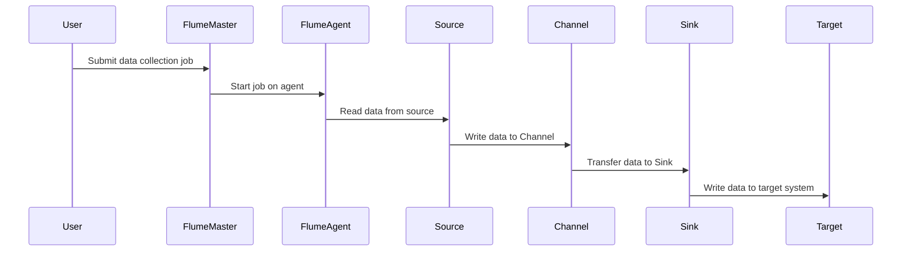

                 


# Flume原理与代码实例讲解

## 关键词

- Flume
- 数据采集
- 流处理
- 分布式系统
- 代码实例

## 摘要

本文将深入探讨Flume的原理，通过代码实例讲解，帮助读者理解其核心组件及配置方法。Flume是一个强大的分布式系统，用于高效地采集、聚合和传输数据。本文将介绍Flume的基本概念、架构设计，以及与Kafka、HDFS等大数据生态系统的集成。同时，我们将通过具体实例展示Flume在数据采集和传输中的实际应用，并提供性能调优和故障排查的最佳实践。

## 目录

### 第1章 Flume概述

- **1.1 Flume的概念与作用**
  - **1.1.1 数据采集的挑战**
  - **1.1.2 Flume的核心功能和优势**
  - **1.1.3 Flume在数据采集中的应用场景**

- **1.2 Flume的架构设计**
  - **1.2.1 Flume的基本组件**
  - **1.2.2 Flume的数据流模型**
  - **1.2.3 Flume的运行原理**

- **1.3 Flume与其他数据采集工具的比较**
  - **1.3.1 与Kafka的比较**
  - **1.3.2 与Logstash的比较**
  - **1.3.3 Flume的优势与局限**

### 第2章 Flume核心组件详解

- **2.1 Source组件**
  - **2.1.1 Source的类型及配置**
  - **2.1.2 Source的运行机制**
  - **2.1.3 实例：自定义Source组件**

- **2.2 Channel组件**
  - **2.2.1 Channel的类型及作用**
  - **2.2.2 Channel的配置与使用**
  - **2.2.3 实例：配置与优化Channel组件**

- **2.3 Sink组件**
  - **2.3.1 Sink的类型及配置**
  - **2.3.2 Sink的运行机制**
  - **2.3.3 实例：配置与优化Sink组件**

### 第3章 Flume配置与部署

- **3.1 Flume的安装与环境准备**
  - **3.1.1 Flume的安装过程**
  - **3.1.2 Flume的环境配置**
  - **3.1.3 系统依赖与优化**

- **3.2 Flume配置文件详解**
  - **3.2.1 Flume配置文件的组成**
  - **3.2.2 配置文件示例分析**
  - **3.2.3 Flume配置文件的高级配置**

- **3.3 Flume集群部署**
  - **3.3.1 Flume集群的概念**
  - **3.3.2 Flume集群的搭建过程**
  - **3.3.3 Flume集群的监控与维护**

### 第4章 Flume项目实战

- **4.1 数据采集实战**
  - **4.1.1 环境搭建与准备**
  - **4.1.2 数据采集配置示例**
  - **4.1.3 数据采集过程中的问题与解决**

- **4.2 数据传输优化实战**
  - **4.2.1 数据传输的性能分析**
  - **4.2.2 数据传输的优化策略**
  - **4.2.3 数据传输性能调优实例**

- **4.3 数据存储实战**
  - **4.3.1 数据存储的选择策略**
  - **4.3.2 数据存储配置示例**
  - **4.3.3 数据存储性能优化**

### 第5章 Flume与大数据生态集成

- **5.1 Flume与Kafka的集成**
  - **5.1.1 Kafka的概念与作用**
  - **5.1.2 Flume与Kafka的集成配置**
  - **5.1.3 实例：Flume与Kafka的数据流集成**

- **5.2 Flume与HDFS的集成**
  - **5.2.1 HDFS的概念与作用**
  - **5.2.2 Flume与HDFS的集成配置**
  - **5.2.3 实例：Flume与HDFS的数据存储**

- **5.3 Flume与Hive的集成**
  - **5.3.1 Hive的概念与作用**
  - **5.3.2 Flume与Hive的集成配置**
  - **5.3.3 实例：Flume与Hive的数据分析**

### 第6章 Flume运维与监控

- **6.1 Flume监控工具使用**
  - **6.1.1 Flume内置监控工具**
  - **6.1.2 Flume监控工具配置**
  - **6.1.3 Flume监控工具实战**

- **6.2 Flume故障排查与解决**
  - **6.2.1 Flume故障分析**
  - **6.2.2 Flume故障排查方法**
  - **6.2.3 Flume故障解决实例**

- **6.3 Flume性能调优**
  - **6.3.1 Flume性能分析**
  - **6.3.2 Flume性能调优策略**
  - **6.3.3 Flume性能调优实战**

### 第7章 Flume社区发展与未来趋势

- **7.1 Flume社区概况**
  - **7.1.1 Flume社区的历史与发展**
  - **7.1.2 Flume社区的活跃度与影响力**
  - **7.1.3 Flume社区贡献者介绍**

- **7.2 Flume未来趋势**
  - **7.2.1 Flume在数据采集领域的发展**
  - **7.2.2 Flume与其他技术的融合**
  - **7.2.3 Flume社区的未来展望**

## 第1章 Flume概述

### 1.1 Flume的概念与作用

#### 1.1.1 数据采集的挑战

数据采集是大数据生态系统中至关重要的一环。在当今数字化时代，企业面临的数据量呈现爆炸性增长，如何高效地收集、处理和分析这些数据成为一大挑战。传统的数据采集方式往往依赖于单点系统，难以应对大规模分布式数据源的实时采集需求。

数据采集面临的挑战主要包括：

1. **多样性**：数据源种类繁多，包括结构化数据、半结构化数据和非结构化数据，如日志、文本、图像、视频等。
2. **海量**：数据量庞大，如何保证数据采集的高效性和实时性是一个关键问题。
3. **实时性**：许多业务场景需要实时数据支持，如何降低数据采集的延迟成为一大难题。
4. **可靠性**：在数据采集过程中，如何确保数据的完整性和一致性是至关重要的。

#### 1.1.2 Flume的核心功能和优势

Flume是一个分布式、可靠且可扩展的数据采集系统，由Cloudera开源。它旨在从各种数据源有效地收集、聚合和传输数据，适用于大规模分布式环境。Flume具有以下核心功能和优势：

1. **可靠性**：Flume采用分布式架构，能够保证数据在采集过程中的不丢失和不重复，提供高可靠性的数据传输服务。
2. **可扩展性**：Flume支持水平扩展，可以轻松处理大规模数据流。
3. **灵活性**：Flume支持多种数据源和数据目标，包括文件系统、HDFS、Kafka等，可以灵活地适配各种业务场景。
4. **低延迟**：Flume采用高效的传输协议，能够实现低延迟的数据传输。
5. **监控和管理**：Flume提供了内置的监控工具，方便用户实时监控数据采集过程，确保系统稳定运行。

#### 1.1.3 Flume在数据采集中的应用场景

Flume广泛应用于各种数据采集场景，以下是一些典型的应用场景：

1. **日志采集**：Flume常用于采集系统日志、网络日志等，为日志分析提供数据基础。
2. **指标监控**：Flume可以采集各种业务指标的原始数据，为监控系统提供数据支持。
3. **数据同步**：Flume可以将数据从多个数据源同步到一个统一的数据存储，如HDFS、Kafka等，方便后续的数据处理和分析。
4. **实时流处理**：Flume可以将实时数据流传输到Kafka等流处理系统，实现实时数据分析和处理。

### 1.2 Flume的架构设计

#### 1.2.1 Flume的基本组件

Flume的基本组件包括Source、Channel和Sink，它们协同工作，实现数据的高效采集、传输和存储。

1. **Source**：负责从数据源读取数据，并将其发送到Channel。Flume提供了多种类型的Source，包括文件Source、JMS Source等。
2. **Channel**：充当数据缓冲区，负责在Source和Sink之间暂存数据。Flume支持多种Channel类型，如Memory Channel、File Channel等。
3. **Sink**：负责将数据从Channel传输到目标系统，如HDFS、Kafka等。Flume支持多种Sink类型，如HDFS Sink、Kafka Sink等。

#### 1.2.2 Flume的数据流模型

Flume的数据流模型如下图所示：



#### 1.2.3 Flume的运行原理

Flume的运行原理可以分为以下三个步骤：

1. **数据采集**：Source组件从数据源读取数据，并将其发送到Channel。数据可以来自文件、JMS等。
2. **数据暂存**：Channel组件充当数据缓冲区，将数据暂存起来，直到Sink组件将其传输到目标系统。
3. **数据传输**：Sink组件将数据从Channel传输到目标系统，如HDFS、Kafka等。数据传输可以是实时传输，也可以是批量传输。

### 1.3 Flume与其他数据采集工具的比较

#### 1.3.1 与Kafka的比较

Kafka是一个分布式流处理平台，主要用于处理和存储实时流数据。与Kafka相比，Flume有以下不同点：

1. **功能定位**：Flume主要关注数据采集，而Kafka则更侧重于数据流处理和存储。
2. **可靠性**：Flume提供高可靠性的数据传输，能够保证数据不丢失和不重复。Kafka也提供高可靠性，但侧重于确保消息不丢失。
3. **实时性**：Flume支持实时数据传输，但主要用于批量数据采集。Kafka则专注于实时数据流处理。
4. **灵活性**：Flume支持多种数据源和数据目标，但主要面向日志和监控数据。Kafka则适用于更广泛的数据流处理场景。

#### 1.3.2 与Logstash的比较

Logstash是一个开源的数据收集、处理和传输工具，主要用于将数据从各种数据源发送到目标系统，如Elasticsearch、MongoDB等。与Logstash相比，Flume有以下不同点：

1. **功能定位**：Flume主要关注数据采集和传输，而Logstash更侧重于数据处理和转发。
2. **可靠性**：Flume提供高可靠性的数据传输，而Logstash依赖于JMS等中间件，可靠性较低。
3. **实时性**：Flume支持实时数据传输，而Logstash主要用于批量数据处理。
4. **灵活性**：Flume支持多种数据源和数据目标，而Logstash则更侧重于处理和转发结构化数据。

#### 1.3.3 Flume的优势与局限

Flume在数据采集领域具有以下优势：

1. **高可靠性**：Flume能够保证数据不丢失和不重复，提供高可靠的数据传输服务。
2. **低延迟**：Flume采用高效的传输协议，能够实现低延迟的数据传输。
3. **灵活性**：Flume支持多种数据源和数据目标，适用于各种业务场景。

然而，Flume也存在一些局限：

1. **不支持实时查询**：Flume主要关注数据采集和传输，不支持实时查询。
2. **不支持数据转换**：Flume无法直接对数据进行转换和处理，需要与其他工具如Kafka、Logstash等结合使用。

## 第2章 Flume核心组件详解

### 2.1 Source组件

#### 2.1.1 Source的类型及配置

Flume的Source组件负责从数据源读取数据，并将其发送到Channel。Flume支持多种类型的Source，包括：

1. **AgentSource**：从Flume Agent内部读取数据，如文件系统、JMS等。
2. **SyslogSource**：从syslog服务器读取系统日志数据。
3. **HTTPSource**：从HTTP服务器读取数据。
4. **SyslogTcpSource**：从TCP syslog服务器读取系统日志数据。

每种Source都有其特定的配置参数，例如：

- **AgentSource**：配置文件中包含source组件的类型、端口、格式等信息。
- **SyslogSource**：配置文件中包含syslog服务器的IP地址、端口等信息。
- **HTTPSource**：配置文件中包含HTTP服务器的URL、请求方法等信息。

以下是一个简单的AgentSource配置示例：

```xml
<a source="source1">
  <type>exec</type>
  <command>tail -F /path/to/logfile.log</command>
</a>
```

在这个示例中，AgentSource从指定的文件系统路径中读取日志数据，并将其发送到Channel。

#### 2.1.2 Source的运行机制

Source组件的运行机制可以分为以下几个步骤：

1. **初始化**：Source组件在启动时，会读取配置文件中的参数，并初始化相关数据结构。
2. **数据读取**：Source组件根据配置的参数，从数据源读取数据。对于AgentSource，它会使用tail命令从文件系统读取数据；对于SyslogSource，它会从syslog服务器接收数据。
3. **数据发送**：Source组件将读取到的数据发送到Channel。在发送过程中，Source组件会进行数据的格式化和转换，以满足Channel的要求。
4. **数据确认**：Source组件会等待Channel确认数据已成功发送。如果Channel发生故障，Source组件会重新发送数据，确保数据不丢失。

#### 2.1.3 实例：自定义Source组件

在某些特殊场景下，可能需要自定义Source组件来适配特定的数据源。自定义Source组件通常涉及以下几个步骤：

1. **实现Source接口**：创建一个类，实现Flume的Source接口。该接口包含以下方法：

   - `start()`: 启动Source组件。
   - `stop()`: 停止Source组件。
   - `process()`: 从数据源读取数据，并将其发送到Channel。
   - `ack()`: 确认数据已成功发送。
   - `fail()`: 处理数据发送失败的情况。

2. **实现数据处理逻辑**：在process()方法中，根据数据源的特点，实现数据读取、格式化和发送的逻辑。

3. **配置自定义Source**：在Flume配置文件中，指定自定义Source的类名和参数。

以下是一个简单的自定义Source示例，用于从本地文件系统读取数据：

```java
public class CustomSource implements Source {
    private final String name;
    private final String filePath;

    public CustomSource(String name, String filePath) {
        this.name = name;
        this.filePath = filePath;
    }

    @Override
    public void start() {
        // 启动自定义Source组件
    }

    @Override
    public void stop() {
        // 停止自定义Source组件
    }

    @Override
    public Status process() {
        try {
            // 读取文件内容
            String content = Files.readString(Paths.get(filePath));
            // 发送数据到Channel
            channel.put(content.getBytes());
            return Status.READY;
        } catch (IOException e) {
            return Status.BACKOFF;
        }
    }

    @Override
    public void ack(Event event) {
        // 确认数据已成功发送
    }

    @Override
    public void fail(Event event) {
        // 处理数据发送失败的情况
    }
}
```

在Flume配置文件中，可以按照以下方式配置自定义Source：

```xml
<a source="customSource">
  <type>custom</type>
  <custom.class>com.example.CustomSource</custom.class>
  <parameter>filePath</parameter>/path/to/file.log</parameter>
</a>
```

### 2.2 Channel组件

#### 2.2.1 Channel的类型及作用

Flume的Channel组件充当数据缓冲区，负责在Source和Sink之间暂存数据。Flume支持多种类型的Channel，包括：

1. **Memory Channel**：将数据暂存在内存中，适用于数据量较小的场景。
2. **File Channel**：将数据暂存到本地文件系统中，适用于数据量较大的场景。
3. **JMS Channel**：将数据暂存在JMS消息队列中，适用于需要高可靠性的场景。

每种Channel都有其特定的配置参数，例如：

- **Memory Channel**：配置文件中包含channel组件的类型、大小限制等信息。
- **File Channel**：配置文件中包含channel组件的类型、文件路径、大小限制等信息。
- **JMS Channel**：配置文件中包含channel组件的类型、JMS服务器地址、队列名称等信息。

以下是一个简单的Memory Channel配置示例：

```xml
<c channel="memoryChannel" type="memory">
  <transactionCapicity>1000</transactionCapicity>
  <capacity>1000</capacity>
  <backoff>1000</backoff>
</c>
```

在这个示例中，Memory Channel的大小限制为1000条事件，事务容量为1000条事件。

#### 2.2.2 Channel的配置与使用

Channel的配置主要涉及以下几个方面：

1. **大小限制**：Channel可以设置大小限制，以控制数据暂存的容量。超过大小限制的数据将被丢弃或触发其他处理策略。
2. **事务容量**：Channel可以设置事务容量，以控制事务处理的最大事件数。当事务容量达到时，Channel将暂停接收新的事件，直到事务处理完成。
3. **超时时间**：Channel可以设置超时时间，以控制事务处理的最长时间。超过超时时间的事务将被取消，并触发相应的处理策略。

以下是一个简单的File Channel配置示例：

```xml
<c channel="fileChannel" type="file">
  <file>path/to/channel-directory</file>
  <capacity>10000</capacity>
  <transactionCapicity>5000</transactionCapicity>
  <backoff>1000</backoff>
</c>
```

在这个示例中，File Channel的大小限制为10000条事件，事务容量为5000条事件，超时时间为1000毫秒。

#### 2.2.3 实例：配置与优化Channel组件

在实际应用中，根据数据量和处理需求，需要对Channel进行配置和优化。以下是一些常见的配置和优化策略：

1. **调整大小限制**：根据数据量大小调整Channel的大小限制，以确保数据暂存的容量足够。
2. **调整事务容量**：根据系统处理能力调整Channel的事务容量，以避免过多的事件积压。
3. **调整超时时间**：根据系统处理速度调整Channel的超时时间，以确保事务处理能够及时完成。
4. **使用JVM缓存**：对于Memory Channel，可以使用JVM缓存来提高数据读取和写入速度。
5. **文件系统优化**：对于File Channel，可以使用SSD等高速存储设备来提高数据读写速度。

以下是一个配置优化的示例：

```xml
<c channel="memoryChannel" type="memory">
  <transactionCapicity>20000</transactionCapicity>
  <capacity>15000</capacity>
  <backoff>500</backoff>
</c>

<c channel="fileChannel" type="file">
  <file>/path/to/channel-directory</file>
  <capacity>30000</capacity>
  <transactionCapicity>10000</transactionCapicity>
  <backoff>2000</backoff>
</c>
```

在这个示例中，Memory Channel的事务容量和容量都调整为更高的值，以适应更大的数据量。File Channel也进行了相应的调整，并使用SSD存储来提高数据读写速度。

### 2.3 Sink组件

#### 2.3.1 Sink的类型及配置

Flume的Sink组件负责将数据从Channel传输到目标系统，如HDFS、Kafka等。Flume支持多种类型的Sink，包括：

1. **HDFS Sink**：将数据写入HDFS文件系统中。
2. **Kafka Sink**：将数据发送到Kafka消息队列中。
3. **File Sink**：将数据写入本地文件系统中。
4. **Syslog Sink**：将数据发送到syslog服务器中。

每种Sink都有其特定的配置参数，例如：

- **HDFS Sink**：配置文件中包含Sink组件的类型、HDFS路径等信息。
- **Kafka Sink**：配置文件中包含Sink组件的类型、Kafka服务器地址、主题名称等信息。
- **File Sink**：配置文件中包含Sink组件的类型、文件路径等信息。
- **Syslog Sink**：配置文件中包含Sink组件的类型、syslog服务器地址、端口等信息。

以下是一个简单的HDFS Sink配置示例：

```xml
<a sink="hdfsSink">
  <type>hdfs</type>
  <hdfs.uri>hdfs://namenode:8020</hdfs.uri>
  <path>/path/to/hdfs</path>
</a>
```

在这个示例中，HDFS Sink将数据写入HDFS文件系统中指定的路径。

#### 2.3.2 Sink的运行机制

Sink组件的运行机制可以分为以下几个步骤：

1. **初始化**：Sink组件在启动时，会读取配置文件中的参数，并初始化相关数据结构。
2. **数据获取**：Sink组件从Channel中获取数据。在获取数据时，Sink组件会按照配置的批次大小或时间间隔进行批量获取。
3. **数据写入**：Sink组件将获取到的数据写入目标系统。对于HDFS Sink，它会将数据写入HDFS文件系统中；对于Kafka Sink，它会将数据发送到Kafka消息队列中。
4. **数据确认**：Sink组件会等待目标系统确认数据已成功写入。如果目标系统发生故障，Sink组件会重新写入数据，确保数据不丢失。

#### 2.3.3 实例：配置与优化Sink组件

在实际应用中，根据数据量和处理需求，需要对Sink进行配置和优化。以下是一些常见的配置和优化策略：

1. **调整批次大小**：根据系统处理能力调整批次大小，以避免过多的事件积压。
2. **调整超时时间**：根据系统处理速度调整超时时间，以确保数据能够及时写入目标系统。
3. **使用JVM缓存**：对于HDFS Sink和File Sink，可以使用JVM缓存来提高数据写入速度。
4. **使用异步写入**：对于Kafka Sink，可以使用异步写入来提高数据发送速度。

以下是一个配置优化的示例：

```xml
<a sink="hdfsSink">
  <type>hdfs</type>
  <hdfs.uri>hdfs://namenode:8020</hdfs.uri>
  <path>/path/to/hdfs</path>
  <batchSize>1000</batchSize>
  <batchDuration>5000</batchDuration>
  <ackTimeout>10000</ackTimeout>
</a>
```

在这个示例中，HDFS Sink的批次大小调整为1000，批次时间间隔调整为5秒，超时时间调整为10秒。这些调整可以适应更大的数据量和处理需求。

## 第3章 Flume配置与部署

### 3.1 Flume的安装与环境准备

#### 3.1.1 Flume的安装过程

1. **下载Flume安装包**：从Cloudera官网下载Flume安装包，版本建议选择与Hadoop兼容的版本。
2. **解压安装包**：将下载的安装包解压到指定目录，如`/usr/local/`。
3. **配置环境变量**：在`/etc/profile`或`~/.bashrc`文件中添加以下环境变量：

   ```bash
   export FLUME_HOME=/usr/local/flume
   export PATH=$PATH:$FLUME_HOME/bin
   ```

   然后执行`source /etc/profile`或`source ~/.bashrc`使配置生效。

4. **启动Flume**：运行以下命令启动Flume：

   ```bash
   flume-ng agent -n a1 -conf conf -confproperties flume-env.properties
   ```

   其中，`a1`是Agent的名称，`conf`是配置文件目录，`flume-env.properties`是环境变量配置文件。

#### 3.1.2 Flume的环境配置

1. **配置文件目录**：在Flume安装目录中创建一个名为`conf`的目录，用于存放配置文件。
2. **配置文件示例**：在`conf`目录中创建一个名为`example.conf`的配置文件，内容如下：

   ```xml
   <configuration>
     <agents>
       <agent>
         <name>a1</name>
         <type>master</type>
       </agent>
       <agent>
         <name>a2</name>
         <type>worker</type>
         <masters>
           a1
         </masters>
         <sources>
           <source>
             <type>exec</type>
             <source>
               <name>source1</name>
               <command>tail -F /path/to/logfile.log</command>
             </source>
           </source>
         </sources>
         <sinks>
           <sink>
             <type>hdfs</type>
             <sink>
               <name>sink1</name>
               <hdfs>
                 <uri>hdfs://namenode:8020</uri>
                 <path>/path/to/hdfs</path>
               </hdfs>
             </sink>
           </sink>
         </sinks>
       </agent>
     </agents>
   </configuration>
   ```

   在这个示例中，配置了一个名为`a2`的Agent，从文件系统中读取日志数据，并将其写入HDFS。

3. **环境变量配置**：在`conf`目录中创建一个名为`flume-env.properties`的环境变量配置文件，内容如下：

   ```bash
   flume.root.logger=DEBUG,console
   flume.env.loader=org.apache.flume.env.EnvironmentLoader
   flume.env.config.file=${FLUME_HOME}/conf/flume-env.properties
   ```

   在这个示例中，配置了Flume的日志级别和配置文件路径。

#### 3.1.3 系统依赖与优化

1. **JDK**：确保系统中安装了Java Development Kit (JDK)，版本建议选择与Hadoop兼容的版本。
2. **Hadoop**：确保系统中安装了Hadoop，并配置了HDFS和YARN等组件。
3. **优化配置**：根据系统资源和处理需求，调整Flume的配置参数，如批次大小、超时时间等。

### 3.2 Flume配置文件详解

#### 3.2.1 Flume配置文件的组成

Flume配置文件通常包含以下组成部分：

1. **全局配置**：配置Flume的全局属性，如日志级别、插件路径等。
2. **Agent配置**：配置Agent的属性，如名称、类型、角色等。
3. **Source配置**：配置Source的属性，如类型、数据源路径等。
4. **Channel配置**：配置Channel的属性，如类型、大小限制等。
5. **Sink配置**：配置Sink的属性，如类型、目标系统地址等。

以下是一个简单的Flume配置文件示例：

```xml
<configuration>
  <global>
    <logger name="flume" level="DEBUG" addtostacktrace="false"/>
    <Plugins>
      <plugin type="source" name="spool" class="org.apache.flume.source.SpoolDirSource"/>
      <plugin type="channel" name="memory" class="org.apache.flume.node.InternalMemoryChannel"/>
      <plugin type="sink" name="hdfs" class="org.apache.flume.sink.HDFSsink"/>
    </Plugins>
  </global>
  <agents>
    <agent>
      <name>agent1</name>
      <type>master</type>
    </agent>
    <agent>
      <name>agent2</name>
      <type>worker</type>
      <masters>
        <master>agent1</master>
      </masters>
      <sources>
        <source>
          <type>spool</type>
          <name>spool-source</name>
          <spool>
            <file>path/to/logs/*.log</file>
          </spool>
        </source>
      </sources>
      <sinks>
        <sink>
          <type>hdfs</type>
          <name>hdfs-sink</name>
          <hdfs>
            <uri>hdfs://namenode:8020</uri>
            <path>/path/to/hdfs</path>
          </hdfs>
        </sink>
      </sinks>
      <channels>
        <channel>
          <type>memory</type>
          <name>memory-channel</name>
          <capacity>1000</capacity>
          <transactionCapacity>100</transactionCapacity>
        </channel>
      </channels>
    </agent>
  </agents>
</configuration>
```

在这个示例中，配置了一个名为`agent2`的Worker Agent，从文件系统中读取日志数据，并将其写入HDFS。

#### 3.2.2 配置文件示例分析

以下是一个简单的Flume配置文件示例，并对其进行详细分析：

```xml
<configuration>
  <global>
    <property>
      <name>flume.root.logger</name>
      <value>INFO,console</value>
    </property>
    <property>
      <name>flume.env.loader</name>
      <value>org.apache.flume.env.EnvironmentLoader</value>
    </property>
    <property>
      <name>flume.env.config.file</name>
      <value>${FLUME_HOME}/conf/flume-env.properties</value>
    </property>
  </global>
  <agents>
    <agent>
      <name>agent1</name>
      <type>master</type>
      <مالك>{name</مالك>
      <masters>
        <master>agent1</master>
      </masters>
    </agent>
    <agent>
      <name>agent2</name>
      <type>worker</type>
      <masters>
        <master>agent1</master>
      </masters>
      <sources>
        <source>
          <type>syslog</type>
          <name>syslog-source</name>
          <syslog>
            <port>514</port>
          </syslog>
        </source>
      </sources>
      <channels>
        <channel>
          <type>memory</type>
          <name>memory-channel</name>
          <capacity>1000</capacity>
          <transactionCapacity>100</transactionCapacity>
        </channel>
      </channels>
      <sinks>
        <sink>
          <type>file</type>
          <name>file-sink</name>
          <file>
            <path>/path/to/logs/agent2</path>
          </file>
        </sink>
      </sinks>
    </agent>
  </agents>
</configuration>
```

在这个示例中，配置了一个名为`agent1`的Master Agent和一个名为`agent2`的Worker Agent。

1. **全局配置**：全局配置定义了Flume的一些全局属性，如日志级别、环境变量等。在这个示例中，日志级别设置为INFO，输出到控制台。

2. **Agent配置**：Agent配置定义了Agent的属性，如名称、类型等。在这个示例中，`agent1`是Master Agent，`agent2`是Worker Agent。

3. **Source配置**：Source配置定义了Source的属性，如类型、名称等。在这个示例中，`syslog-source`是Source，从本地端口514接收syslog数据。

4. **Channel配置**：Channel配置定义了Channel的属性，如类型、名称、大小限制等。在这个示例中，`memory-channel`是Channel，类型为Memory Channel，容量为1000，事务容量为100。

5. **Sink配置**：Sink配置定义了Sink的属性，如类型、名称等。在这个示例中，`file-sink`是Sink，类型为File Sink，将数据写入本地文件系统中的`/path/to/logs/agent2`目录。

#### 3.2.3 Flume配置文件的高级配置

Flume配置文件还支持一些高级配置，如多Source、多Channel、多Sink等。以下是一个高级配置示例：

```xml
<configuration>
  <global>
    <property>
      <name>flume.root.logger</name>
      <value>INFO,console</value>
    </property>
    <property>
      <name>flume.env.loader</name>
      <value>org.apache.flume.env.EnvironmentLoader</value>
    </property>
    <property>
      <name>flume.env.config.file</name>
      <value>${FLUME_HOME}/conf/flume-env.properties</value>
    </property>
  </global>
  <agents>
    <agent>
      <name>agent1</name>
      <type>master</type>
      <masters>
        <master>agent1</master>
      </masters>
    </agent>
    <agent>
      <name>agent2</name>
      <type>worker</type>
      <masters>
        <master>agent1</master>
      </masters>
      <sources>
        <source>
          <type>spool</type>
          <name>spool-source1</name>
          <spool>
            <file>path/to/logs/*.log</file>
          </spool>
        </source>
        <source>
          <type>spool</type>
          <name>spool-source2</name>
          <spool>
            <file>path/to/another/*.log</file>
          </spool>
        </source>
      </sources>
      <channels>
        <channel>
          <type>memory</type>
          <name>memory-channel1</name>
          <capacity>1000</capacity>
          <transactionCapacity>100</transactionCapacity>
        </channel>
        <channel>
          <type>memory</type>
          <name>memory-channel2</name>
          <capacity>1000</capacity>
          <transactionCapacity>100</transactionCapacity>
        </channel>
      </channels>
      <sinks>
        <sink>
          <type>file</type>
          <name>file-sink1</name>
          <file>
            <path>/path/to/logs/agent2/1</path>
          </file>
        </sink>
        <sink>
          <type>file</type>
          <name>file-sink2</name>
          <file>
            <path>/path/to/logs/agent2/2</path>
          </file>
        </sink>
      </sinks>
    </agent>
  </agents>
</configuration>
```

在这个示例中，`agent2`配置了多个Source、Channel和Sink：

1. **多Source**：`agent2`配置了两个Source，分别从两个不同的目录中读取日志数据。
2. **多Channel**：`agent2`配置了两个Channel，分别用于处理不同的Source数据。
3. **多Sink**：`agent2`配置了两个Sink，分别将数据写入不同的目录。

通过高级配置，可以更灵活地处理复杂的数据采集任务。

### 3.3 Flume集群部署

#### 3.3.1 Flume集群的概念

Flume集群是由多个Flume Agent组成的分布式系统，用于处理大规模数据采集任务。在Flume集群中，通常包含以下组件：

1. **Master Agent**：负责协调和管理集群中的其他Agent。Master Agent维护一个全局的配置和状态信息，并将任务分配给Worker Agent。
2. **Worker Agent**：负责执行具体的数据采集任务。Worker Agent从Master Agent获取任务，并按照任务要求从数据源读取数据、写入Channel和传输到Sink。
3. **Shared Channel**：用于在Master Agent和Worker Agent之间共享数据。Shared Channel可以是Memory Channel或File Channel。

#### 3.3.2 Flume集群的搭建过程

以下是一个简单的Flume集群搭建过程：

1. **环境准备**：确保所有节点上安装了Java、Hadoop和Flume。
2. **配置Master Agent**：在Master Agent节点上，配置Flume配置文件，指定Master角色。

   ```xml
   <agent>
     <name>master</name>
     <type>master</type>
     <resources>
       <resource>org.apache.flume.master.FlumeMaster</resource>
     </resources>
   </agent>
   ```

3. **配置Worker Agent**：在所有Worker Agent节点上，配置Flume配置文件，指定Worker角色。

   ```xml
   <agent>
     <name>worker1</name>
     <type>worker</type>
     <masters>
       <master>master</master>
     </masters>
     <sources>
       <source>
         <type>spool</type>
         <name>spool-source</name>
         <spool>
           <file>path/to/logs/*.log</file>
         </spool>
       </source>
     </sources>
     <channels>
       <channel>
         <type>memory</type>
         <name>memory-channel</name>
         <capacity>1000</capacity>
         <transactionCapacity>100</transactionCapacity>
       </channel>
     </channels>
     <sinks>
       <sink>
         <type>file</type>
         <name>file-sink</name>
         <file>
           <path>/path/to/logs/worker1</path>
         </file>
       </sink>
     </sinks>
   </agent>
   ```

4. **启动Master Agent**：在Master Agent节点上启动Flume。

   ```bash
   flume-ng agent -n master -conf conf -confproperties flume-env.properties
   ```

5. **启动Worker Agent**：在所有Worker Agent节点上启动Flume。

   ```bash
   flume-ng agent -n worker1 -conf conf -confproperties flume-env.properties
   ```

6. **监控与维护**：通过内置的监控工具，实时监控集群状态和性能，并进行必要的维护和优化。

#### 3.3.3 Flume集群的监控与维护

1. **监控工具**：Flume内置了多种监控工具，如`flume-master-mbean`、`flume-agent-mbean`等。通过JMX连接，可以监控Flume集群的运行状态和性能。

   ```bash
   jmxclient -h master-hostname -port 9999
   ```

2. **性能调优**：根据监控结果，调整Flume配置参数，如批次大小、Channel容量等，以优化性能。

   ```xml
   <batchSize>500</batchSize>
   <batchDuration>2000</batchDuration>
   <capacity>1000</capacity>
   <transactionCapacity>100</transactionCapacity>
   ```

3. **故障排查**：在出现故障时，通过日志分析、JMX监控等手段，排查故障原因并解决。

   ```bash
   tail -f /path/to/logs/flume-master.log
   tail -f /path/to/logs/flume-agent1.log
   ```

4. **升级与维护**：定期升级Flume版本，修复已知问题和漏洞，并进行系统维护。

   ```bash
   sudo apt-get update
   sudo apt-get upgrade flume
   ```

## 第4章 Flume项目实战

### 4.1 数据采集实战

#### 4.1.1 环境搭建与准备

在进行Flume数据采集实战之前，我们需要搭建一个简单的环境。以下是一个基本的Flume数据采集环境搭建步骤：

1. **安装Flume**：在需要部署Flume的机器上安装Flume。可以选择从Cloudera官网下载安装包，或者使用包管理器（如apt、yum等）安装。

2. **配置Master Agent**：在Master Agent节点上，配置Flume的Master角色。具体步骤如下：

   - 创建一个名为`master`的配置文件，内容如下：

     ```xml
     <configuration>
       <master>
         <type>master</type>
         <name>master</name>
       </master>
     </configuration>
     ```

   - 创建一个名为`flume-env.sh`的环境变量配置文件，内容如下：

     ```bash
     # Set Java environment variables
     export JAVA_HOME=/usr/lib/jvm/java-1.8.0-openjdk-amd64
     export PATH=$JAVA_HOME/bin:$PATH
     export FLUME_HOME=/usr/local/flume
     export PATH=$PATH:$FLUME_HOME/bin
     ```

   - 启动Master Agent：

     ```bash
     flume-ng master -n master -conf /path/to/conf -confproperties /path/to/flume-env.sh
     ```

3. **配置Worker Agent**：在Worker Agent节点上，配置Flume的Worker角色。具体步骤如下：

   - 创建一个名为`worker`的配置文件，内容如下：

     ```xml
     <configuration>
       <agent>
         <type>worker</type>
         <name>worker</name>
         <masters>
           <master>master</master>
         </masters>
         <sources>
           <source>
             <type>spool</type>
             <name>spool-source</name>
             <spool>
               <file>/path/to/logs/*.log</file>
             </spool>
           </source>
         </sources>
         <channels>
           <channel>
             <type>memory</type>
             <name>memory-channel</name>
             <capacity>1000</capacity>
             <transactionCapacity>100</transactionCapacity>
           </channel>
         </channels>
         <sinks>
           <sink>
             <type>file</type>
             <name>file-sink</name>
             <file>
               <path>/path/to/output</path>
             </file>
           </sink>
         </sinks>
       </agent>
     </configuration>
     ```

   - 创建一个名为`flume-env.sh`的环境变量配置文件，内容如下：

     ```bash
     # Set Java environment variables
     export JAVA_HOME=/usr/lib/jvm/java-1.8.0-openjdk-amd64
     export PATH=$JAVA_HOME/bin:$PATH
     export FLUME_HOME=/usr/local/flume
     export PATH=$PATH:$FLUME_HOME/bin
     ```

   - 启动Worker Agent：

     ```bash
     flume-ng agent -n worker -conf /path/to/conf -confproperties /path/to/flume-env.sh
     ```

4. **测试环境**：在Worker Agent节点上，创建一个测试日志文件，如`test.log`。然后，在Master Agent节点上，使用以下命令查看数据是否被采集：

   ```bash
   tail -f /path/to/output/*.log
   ```

   如果看到测试日志的内容被成功采集并写入输出文件，说明环境搭建成功。

#### 4.1.2 数据采集配置示例

以下是一个简单的Flume数据采集配置示例，该示例将从文件系统中实时采集日志数据，并将其写入文件系统中：

```xml
<configuration>
  <agent>
    <type>worker</type>
    <name>worker</name>
    <masters>
      <master>master</master>
    </masters>
    <sources>
      <source>
        <type>spool</type>
        <name>spool-source</name>
        <spool>
          <file>/path/to/logs/*.log</file>
        </spool>
      </source>
    </sources>
    <channels>
      <channel>
        <type>memory</type>
        <name>memory-channel</name>
        <capacity>1000</capacity>
        <transactionCapacity>100</transactionCapacity>
      </channel>
    </channels>
    <sinks>
      <sink>
        <type>file</type>
        <name>file-sink</name>
        <file>
          <path>/path/to/output</path>
        </file>
      </sink>
    </sinks>
  </agent>
</configuration>
```

在这个配置中：

- `worker`是Agent的名称。
- `master`是Master Agent的名称。
- `spool-source`是Source的名称，类型为`spool`，用于从文件系统中实时读取日志文件。
- `memory-channel`是Channel的名称，类型为`memory`，用于暂存采集到的日志数据。
- `file-sink`是Sink的名称，类型为`file`，用于将日志数据写入文件系统中。

#### 4.1.3 数据采集过程中的问题与解决

在实际的数据采集过程中，可能会遇到各种问题。以下是一些常见问题及解决方法：

1. **数据采集延迟**：

   - **原因**：可能是因为文件系统读写速度较慢或Flume配置的批次大小和批次时间间隔较大。

   - **解决方法**：调整批次大小和批次时间间隔，以减少数据采集延迟。例如，将批次大小调整为100条，批次时间间隔调整为1秒。

     ```xml
     <batchSize>100</batchSize>
     <batchDuration>1000</batchDuration>
     ```

2. **数据丢失**：

   - **原因**：可能是因为Channel容量不足，导致数据在Channel中积压并丢失。

   - **解决方法**：增加Channel容量，以确保数据能够暂存。例如，将Channel容量调整为5000条。

     ```xml
     <capacity>5000</capacity>
     <transactionCapacity>5000</transactionCapacity>
     ```

3. **日志格式不匹配**：

   - **原因**：可能是因为Flume配置的日志格式与实际日志格式不匹配。

   - **解决方法**：检查Flume配置中的日志格式配置，确保与实际日志格式匹配。例如，如果日志格式为JSON，可以使用Flume提供的JSON parser进行解析。

     ```xml
     <spool>
       <file>
         <path>/path/to/logs/*.log</path>
         <parser>
           <type>json</type>
         </parser>
       </file>
     </spool>
     ```

4. **配置文件错误**：

   - **原因**：可能是因为配置文件中的语法错误或参数错误。

   - **解决方法**：检查配置文件中的语法和参数，确保配置文件正确。例如，检查是否漏写了`<configuration>`标签或配置了错误的组件类型。

     ```xml
     <configuration>
       <agent>
         <type>worker</type>
         <name>worker</name>
         <masters>
           <master>master</master>
         </masters>
         <sources>
           <source>
             <type>spool</type>
             <name>spool-source</name>
             <spool>
               <file>/path/to/logs/*.log</file>
             </spool>
           </source>
         </sources>
         <channels>
           <channel>
             <type>memory</type>
             <name>memory-channel</name>
             <capacity>1000</capacity>
             <transactionCapacity>100</transactionCapacity>
           </channel>
         </channels>
         <sinks>
           <sink>
             <type>file</type>
             <name>file-sink</name>
             <file>
               <path>/path/to/output</path>
             </file>
           </sink>
         </sinks>
       </agent>
     </configuration>
     ```

### 4.2 数据传输优化实战

#### 4.2.1 数据传输的性能分析

在Flume数据采集过程中，数据传输的性能是一个关键因素。以下是对Flume数据传输性能的分析：

1. **网络带宽**：网络带宽是影响数据传输速度的关键因素。根据网络带宽的大小，可以调整Flume的传输速率，以充分利用网络资源。

2. **批次大小**：批次大小是Flume数据传输中的一个重要参数。批次大小决定了每次传输的数据量。适当调整批次大小，可以提高数据传输的效率。

3. **批次时间间隔**：批次时间间隔是Flume数据传输的另一个重要参数。批次时间间隔决定了每次传输的时间间隔。适当调整批次时间间隔，可以平衡数据传输的效率和实时性。

4. **Channel容量**：Channel容量是Flume数据传输中的另一个关键参数。Channel容量决定了数据在Channel中暂存的容量。适当调整Channel容量，可以确保数据不会在Channel中积压。

5. **并发度**：Flume支持多线程并发处理。通过调整并发度，可以充分利用系统资源，提高数据传输速度。

#### 4.2.2 数据传输的优化策略

以下是一些常用的数据传输优化策略：

1. **调整批次大小**：根据网络带宽和系统处理能力，适当调整批次大小。例如，如果网络带宽为100 Mbps，可以设置批次大小为1 MB。

   ```xml
   <batchSize>1048576</batchSize>
   ```

2. **调整批次时间间隔**：根据系统处理速度，适当调整批次时间间隔。例如，如果系统处理速度为1秒，可以设置批次时间间隔为1秒。

   ```xml
   <batchDuration>1000</batchDuration>
   ```

3. **调整Channel容量**：根据数据量大小和处理需求，适当调整Channel容量。例如，如果数据量为1 GB，可以设置Channel容量为1 GB。

   ```xml
   <capacity>1073741824</capacity>
   ```

4. **增加并发度**：通过增加并发度，可以充分利用系统资源，提高数据传输速度。例如，可以设置并发度为10。

   ```xml
   <parallelism>10</parallelism>
   ```

5. **使用高速存储设备**：对于File Sink，可以使用SSD等高速存储设备来提高数据写入速度。

6. **优化网络配置**：优化网络配置，如调整TCP参数，可以减少网络延迟和丢包率，提高数据传输速度。

#### 4.2.3 数据传输性能调优实例

以下是一个数据传输性能调优的实例：

```xml
<configuration>
  <agent>
    <type>worker</type>
    <name>worker</name>
    <masters>
      <master>master</master>
    </masters>
    <sources>
      <source>
        <type>spool</type>
        <name>spool-source</name>
        <spool>
          <file>/path/to/logs/*.log</file>
        </spool>
      </source>
    </sources>
    <channels>
      <channel>
        <type>memory</type>
        <name>memory-channel</name>
        <capacity>1073741824</capacity>
        <transactionCapacity>1073741824</transactionCapacity>
      </channel>
    </channels>
    <sinks>
      <sink>
        <type>file</type>
        <name>file-sink</name>
        <file>
          <path>/path/to/output</path>
        </file>
        <batchSize>1048576</batchSize>
        <batchDuration>1000</batchDuration>
        <parallelism>10</parallelism>
      </sink>
    </sinks>
  </agent>
</configuration>
```

在这个实例中，我们调整了批次大小、批次时间间隔、Channel容量和并发度，以优化数据传输性能。

### 4.3 数据存储实战

#### 4.3.1 数据存储的选择策略

在Flume数据采集过程中，选择合适的数据存储方式至关重要。以下是一些常见的数据存储选择策略：

1. **文件系统**：文件系统是一种简单且高效的数据存储方式。它可以用于存储日志文件、批处理数据等。对于小规模数据采集，文件系统是一个很好的选择。

2. **HDFS**：Hadoop分布式文件系统（HDFS）是一种分布式文件存储系统，适用于大规模数据存储和处理。HDFS提供高可靠性和高可用性，适用于大数据场景。

3. **Kafka**：Kafka是一种分布式流处理平台，适用于实时数据流存储和处理。它提供高吞吐量和低延迟，适用于实时数据处理场景。

4. **数据库**：数据库是一种结构化数据存储方式，适用于存储关系型数据。对于结构化数据存储，数据库是一个很好的选择。

5. **云存储**：云存储提供高可靠性和可扩展性，适用于大规模数据存储。例如，Amazon S3、Google Cloud Storage等。

#### 4.3.2 数据存储配置示例

以下是一个简单的Flume数据存储配置示例，该示例将数据存储到HDFS中：

```xml
<configuration>
  <agent>
    <type>worker</type>
    <name>worker</name>
    <masters>
      <master>master</master>
    </masters>
    <sources>
      <source>
        <type>spool</type>
        <name>spool-source</name>
        <spool>
          <file>/path/to/logs/*.log</file>
        </spool>
      </source>
    </sources>
    <channels>
      <channel>
        <type>memory</type>
        <name>memory-channel</name>
        <capacity>1073741824</capacity>
        <transactionCapacity>1073741824</transactionCapacity>
      </channel>
    </channels>
    <sinks>
      <sink>
        <type>hdfs</type>
        <name>hdfs-sink</name>
        <hdfs>
          <uri>hdfs://namenode:8020</uri>
          <path>/path/to/hdfs</path>
        </hdfs>
        <batchSize>1048576</batchSize>
        <batchDuration>1000</batchDuration>
      </sink>
    </sinks>
  </agent>
</configuration>
```

在这个示例中，我们配置了一个名为`worker`的Agent，将数据从文件系统中采集，并存储到HDFS中。

#### 4.3.3 数据存储性能优化

在数据存储过程中，性能优化是一个关键问题。以下是一些常见的数据存储性能优化策略：

1. **调整批次大小和批次时间间隔**：适当调整批次大小和批次时间间隔，可以提高数据存储的效率。例如，将批次大小调整为1 MB，批次时间间隔调整为1秒。

   ```xml
   <batchSize>1048576</batchSize>
   <batchDuration>1000</batchDuration>
   ```

2. **增加并发度**：通过增加并发度，可以充分利用系统资源，提高数据存储速度。例如，将并发度设置为10。

   ```xml
   <parallelism>10</parallelism>
   ```

3. **使用高速存储设备**：对于HDFS，可以使用SSD等高速存储设备来提高数据写入速度。

4. **优化HDFS配置**：调整HDFS的配置参数，如块大小、副本因子等，可以优化数据存储性能。例如，将块大小调整为128 MB，副本因子设置为3。

   ```xml
   <dfs.replication>3</dfs.replication>
   <dfs.block.size>134217728</dfs.block.size>
   ```

5. **使用压缩**：使用压缩可以减少数据存储空间，提高数据存储速度。例如，使用Gzip压缩。

   ```xml
   <compression.type>org.apache.hadoop.io.compress.GzipCodec</compression.type>
   ```

### 第5章 Flume与大数据生态集成

#### 5.1 Flume与Kafka的集成

Kafka是一个分布式流处理平台，适用于大规模实时数据流处理。Flume与Kafka的集成可以实现高效的数据流采集和传输。

#### 5.1.1 Kafka的概念与作用

Kafka是一个由Apache Software Foundation开发的分布式流处理平台，主要用于大规模实时数据流处理。Kafka具有以下特点：

1. **高吞吐量**：Kafka能够处理大规模的数据流，提供高吞吐量。
2. **高可靠性**：Kafka提供数据持久化、副本备份和自动恢复功能，确保数据不丢失。
3. **可扩展性**：Kafka支持水平扩展，可以轻松处理大规模数据流。
4. **实时性**：Kafka提供实时数据流处理，支持低延迟的数据传输。
5. **分布式**：Kafka是一个分布式系统，可以水平扩展，提高数据流的处理能力。

Kafka主要用于以下场景：

1. **实时数据处理**：Kafka可以将实时数据流传输到其他系统，如Hadoop、Spark等，实现实时数据处理和分析。
2. **日志收集**：Kafka可以用于收集系统日志、网络日志等，为日志分析提供数据基础。
3. **消息队列**：Kafka可以作为一个消息队列，实现异步消息传递和分布式系统通信。

#### 5.1.2 Flume与Kafka的集成配置

以下是一个简单的Flume与Kafka集成配置示例：

```xml
<configuration>
  <agent>
    <type>worker</type>
    <name>worker</name>
    <masters>
      <master>master</master>
    </masters>
    <sources>
      <source>
        <type>spool</type>
        <name>spool-source</name>
        <spool>
          <file>/path/to/logs/*.log</file>
        </spool>
      </source>
    </sources>
    <channels>
      <channel>
        <type>memory</type>
        <name>memory-channel</name>
        <capacity>1073741824</capacity>
        <transactionCapacity>1073741824</transactionCapacity>
      </channel>
    </channels>
    <sinks>
      <sink>
        <type>kafka</type>
        <name>kafka-sink</name>
        <kafka>
          <uri>localhost:9092</uri>
          <topic>flume-topic</topic>
        </kafka>
        <batchSize>1048576</batchSize>
        <batchDuration>1000</batchDuration>
      </sink>
    </sinks>
  </agent>
</configuration>
```

在这个示例中，我们配置了一个名为`worker`的Agent，将数据从文件系统中采集，并传输到Kafka中。

#### 5.1.3 实例：Flume与Kafka的数据流集成

以下是一个Flume与Kafka的数据流集成实例：

1. **搭建Kafka环境**：在Kafka服务器上搭建Kafka环境，并创建一个名为`flume-topic`的主题。

2. **启动Flume**：启动Flume，并使用上述配置文件进行数据采集和传输。

   ```bash
   flume-ng agent -n worker -conf /path/to/conf -confproperties /path/to/flume-env.sh
   ```

3. **监控Kafka**：使用Kafka控制台监控Kafka主题的数据流。

   ```bash
   bin/kafka-topics.sh --zookeeper localhost:2181 --list
   bin/kafka-console-producer.sh --broker-list localhost:9092 --topic flume-topic
   ```

通过以上步骤，我们可以实现Flume与Kafka的数据流集成，将实时数据流传输到Kafka中进行进一步处理。

#### 5.2 Flume与HDFS的集成

Hadoop分布式文件系统（HDFS）是一个分布式文件存储系统，适用于大规模数据存储和处理。Flume与HDFS的集成可以实现高效的数据流采集和存储。

#### 5.2.1 HDFS的概念与作用

HDFS是Hadoop分布式文件系统（HDFS）的简称，是Hadoop的核心组件之一。HDFS具有以下特点：

1. **分布式存储**：HDFS将数据存储在分布式文件系统中，提供高可靠性和高可用性。
2. **高吞吐量**：HDFS提供高吞吐量，适用于大规模数据存储和处理。
3. **数据持久化**：HDFS将数据持久化到分布式文件系统中，确保数据不丢失。
4. **可扩展性**：HDFS支持水平扩展，可以轻松处理大规模数据存储。

HDFS主要用于以下场景：

1. **大数据存储**：HDFS适用于大规模数据存储，如日志文件、批处理数据等。
2. **分布式计算**：HDFS可以与Hadoop的其他组件（如MapReduce、Spark等）集成，实现分布式计算。
3. **数据备份**：HDFS提供数据备份功能，确保数据的安全性和可靠性。

#### 5.2.2 Flume与HDFS的集成配置

以下是一个简单的Flume与HDFS集成配置示例：

```xml
<configuration>
  <agent>
    <type>worker</type>
    <name>worker</name>
    <masters>
      <master>master</master>
    </masters>
    <sources>
      <source>
        <type>spool</type>
        <name>spool-source</name>
        <spool>
          <file>/path/to/logs/*.log</file>
        </spool>
      </source>
    </sources>
    <channels>
      <channel>
        <type>memory</type>
        <name>memory-channel</name>
        <capacity>1073741824</capacity>
        <transactionCapacity>1073741824</transactionCapacity>
      </channel>
    </channels>
    <sinks>
      <sink>
        <type>hdfs</type>
        <name>hdfs-sink</name>
        <hdfs>
          <uri>hdfs://namenode:8020</uri>
          <path>/path/to/hdfs</path>
        </hdfs>
        <batchSize>1048576</batchSize>
        <batchDuration>1000</batchDuration>
      </sink>
    </sinks>
  </agent>
</configuration>
```

在这个示例中，我们配置了一个名为`worker`的Agent，将数据从文件系统中采集，并存储到HDFS中。

#### 5.2.3 实例：Flume与HDFS的数据存储

以下是一个Flume与HDFS的数据存储实例：

1. **搭建HDFS环境**：在Hadoop集群上搭建HDFS环境，并创建一个名为`flume`的目录。

2. **启动Flume**：启动Flume，并使用上述配置文件进行数据采集和存储。

   ```bash
   flume-ng agent -n worker -conf /path/to/conf -confproperties /path/to/flume-env.sh
   ```

3. **监控HDFS**：使用HDFS命令行工具监控HDFS目录。

   ```bash
   hdfs dfs -ls /path/to/hdfs
   ```

通过以上步骤，我们可以实现Flume与HDFS的数据存储，将实时数据流存储到HDFS中进行进一步处理。

### 第6章 Flume运维与监控

#### 6.1 Flume监控工具使用

Flume提供了一些内置的监控工具，可以帮助用户实时监控数据采集过程。以下是一些常用的Flume监控工具及其使用方法：

#### 6.1.1 Flume内置监控工具

1. **Flume Master Monitor**：Flume Master Monitor是一个Web界面，用于监控Flume Master的状态和性能。要启动Flume Master Monitor，需要在Flume Master节点上运行以下命令：

   ```bash
   flume-ng master -n master -conf conf -confproperties flume-env.properties
   ```

   启动后，可以在浏览器中访问`http://master-hostname:9999`查看监控信息。

2. **Flume Agent Monitor**：Flume Agent Monitor是一个Web界面，用于监控Flume Agent的状态和性能。要启动Flume Agent Monitor，需要在Flume Agent节点上运行以下命令：

   ```bash
   flume-ng agent -n agent -conf conf -confproperties flume-env.properties
   ```

   启动后，可以在浏览器中访问`http://agent-hostname:9999`查看监控信息。

3. **Flume Metrics**：Flume Metrics是一个JMX接口，用于监控Flume的性能指标。可以使用JMX工具（如JConsole、VisualVM等）连接到Flume进程，查看性能指标。

#### 6.1.2 Flume监控工具配置

为了使用Flume监控工具，需要配置Flume的JMX指标收集和暴露。以下是一个简单的配置示例：

```xml
<configuration>
  <master>
    <type>master</type>
    <name>master</name>
    <metrics>
      <type>org.apache.flume.node.PollingMetricsCollector</type>
      <sink>
        <type>org.apache.flume.monitoring statistics</type>
        <channel>memory-channel</channel>
        <uri>http://master-hostname:8080/stats</uri>
      </sink>
    </metrics>
  </master>
  <agent>
    <type>worker</type>
    <name>worker</name>
    <masters>
      <master>master</master>
    </masters>
    <metrics>
      <type>org.apache.flume.node.PollingMetricsCollector</type>
      <sink>
        <type>org.apache.flume.monitoring statistics</type>
        <channel>memory-channel</channel>
        <uri>http://worker-hostname:8080/stats</uri>
      </sink>
    </metrics>
  </agent>
</configuration>
```

在这个示例中，我们配置了Flume Master和Worker的监控指标，并将指标发送到指定的Web服务器。

#### 6.1.3 Flume监控工具实战

以下是一个简单的Flume监控工具实战：

1. **启动Flume**：启动Flume Master和Worker。

   ```bash
   flume-ng master -n master -conf conf -confproperties flume-env.properties
   flume-ng agent -n worker -conf conf -confproperties flume-env.properties
   ```

2. **访问监控页面**：在浏览器中访问Flume Master Monitor和Worker Monitor。

   ```bash
   http://master-hostname:9999
   http://worker-hostname:9999
   ```

3. **查看监控信息**：在监控页面中，可以查看Flume的实时性能指标，如采集速率、传输速率、Channel容量等。

   

   

通过以上步骤，我们可以使用Flume监控工具实时监控Flume的数据采集过程。

### 第6章 Flume运维与监控

#### 6.2 Flume故障排查与解决

在Flume的使用过程中，可能会遇到各种故障。以下是一些常见的Flume故障排查与解决方法：

#### 6.2.1 Flume故障分析

1. **日志分析**：首先检查Flume的日志文件，查看是否有错误或异常信息。日志文件通常位于`/var/log/flume/`或`/usr/local/flume/logs/`目录下。

2. **监控信息**：使用Flume内置的监控工具，如Flume Master Monitor和Worker Monitor，查看Flume的运行状态和性能指标。

3. **网络状态**：检查网络状态，确保Flume节点之间的网络连接正常。

4. **系统资源**：检查系统资源，如CPU、内存、磁盘等，确保系统资源充足。

#### 6.2.2 Flume故障排查方法

1. **检查配置文件**：首先检查Flume的配置文件，确保配置文件正确无误。检查配置文件中的语法、参数设置等，排除配置错误的可能性。

2. **检查日志文件**：查看Flume的日志文件，查找错误或异常信息。常见的错误信息包括：

   - 数据源读取失败：检查数据源是否正常工作，如文件路径、权限等。
   - Channel容量不足：检查Channel容量设置是否足够，调整Channel容量以容纳更多数据。
   - Sink写入失败：检查Sink配置是否正确，如目标路径、权限等。

3. **网络连接**：检查Flume节点之间的网络连接，确保数据可以正常传输。可以使用`ping`或`telnet`等工具进行网络连接测试。

4. **系统资源**：检查系统资源使用情况，如CPU、内存、磁盘等，排除资源不足导致的故障。

5. **重启Flume**：在故障排查过程中，如果发现问题无法解决，可以尝试重启Flume。重启Flume后，重新初始化相关组件，可能解决某些故障。

#### 6.2.3 Flume故障解决实例

以下是一个Flume故障解决实例：

**问题**：Flume采集数据失败，日志文件中出现错误信息。

**解决过程**：

1. **检查日志文件**：查看Flume日志文件，发现错误信息如下：

   ```bash
   2023-03-21 14:35:12,005 (source runner-0) ERROR org.apache.flume.source.ExecSource: Failed to execute command: /path/to/executable
   2023-03-21 14:35:12,017 (source runner-0) ERROR org.apache.flume.source.ExecSource: java.io.IOException: Cannot run program "/path/to/executable": error=2, No such file or directory
   ```

   错误信息表明Flume无法执行指定的命令，原因是命令路径不存在。

2. **检查配置文件**：查看Flume配置文件，确认命令路径是否正确。发现配置文件中的命令路径为`/path/to/executable`，而实际路径为`/usr/bin/executable`。

3. **修改配置文件**：修改Flume配置文件，将命令路径修改为正确的路径：

   ```xml
   <source>
     <type>exec</type>
     <name>source1</name>
     <exec>
       <command>/usr/bin/executable</command>
     </exec>
   </source>
   ```

4. **重启Flume**：重启Flume，重新采集数据。在日志文件中，未再出现之前的错误信息。

   ```bash
   flume-ng agent -n a1 -conf conf -confproperties flume-env.properties
   ```

通过以上步骤，成功解决了Flume采集数据失败的故障。

### 第6章 Flume运维与监控

#### 6.3 Flume性能调优

Flume的性能调优是确保其在大规模分布式环境高效运行的关键。以下是一些常用的Flume性能调优策略：

#### 6.3.1 Flume性能分析

1. **采集速率**：监控Flume的采集速率，即每秒采集的数据量。可以通过监控工具或自定义脚本进行监控。
2. **传输速率**：监控Flume的传输速率，即每秒传输的数据量。同样，可以使用监控工具或自定义脚本进行监控。
3. **Channel容量**：监控Channel的容量使用情况，即Channel中暂存的数据量。通过监控工具或自定义脚本进行监控。
4. **系统资源**：监控系统资源使用情况，如CPU、内存、磁盘等。可以使用系统监控工具进行监控。

#### 6.3.2 Flume性能调优策略

1. **调整批次大小**：批次大小（`batchSize`）是Flume传输数据时的一个关键参数。适当调整批次大小可以优化数据传输性能。根据系统处理能力和网络带宽，可以设置批次大小为1 MB到10 MB。

   ```xml
   <batchSize>1048576</batchSize>
   ```

2. **调整批次时间间隔**：批次时间间隔（`batchDuration`）决定了每次数据传输的时间间隔。适当调整批次时间间隔可以优化数据传输性能。根据系统处理能力和网络带宽，可以设置批次时间间隔为1秒到5秒。

   ```xml
   <batchDuration>1000</batchDuration>
   ```

3. **调整并发度**：Flume支持多线程并发处理。通过调整并发度（`parallelism`）可以充分利用系统资源，提高数据传输速度。根据系统处理能力和网络带宽，可以设置并发度为1到10。

   ```xml
   <parallelism>10</parallelism>
   ```

4. **优化Channel容量**：Channel容量（`capacity`和`transactionCapacity`）决定了Channel中可以暂存的数据量。根据系统处理能力和数据量大小，可以适当调整Channel容量。

   ```xml
   <capacity>1073741824</capacity>
   <transactionCapacity>1073741824</transactionCapacity>
   ```

5. **优化网络配置**：调整网络配置，如TCP缓冲区大小、传输模式等，可以优化网络传输性能。可以使用`sysctl`命令进行网络配置。

   ```bash
   sysctl -w net.core.rmem_max=104857600
   sysctl -w net.core.wmem_max=104857600
   ```

6. **使用压缩**：在数据传输过程中使用压缩可以减少数据大小，提高传输速度。可以使用Gzip等压缩算法。

   ```xml
   <compression.type>org.apache.hadoop.io.compress.GzipCodec</compression.type>
   ```

7. **优化数据源和目标系统**：优化数据源和目标系统的性能，如使用SSD存储、优化数据库查询等，可以提高整个数据传输链路的速度。

#### 6.3.3 Flume性能调优实战

以下是一个Flume性能调优实战：

**目标**：提高Flume的数据采集和传输性能。

**步骤**：

1. **监控当前性能**：使用Flume内置的监控工具或自定义脚本，监控当前的采集速率、传输速率、Channel容量和系统资源使用情况。

   ```bash
   tail -f /path/to/flume/logs/flume-agent.log
   ```

2. **调整批次大小和批次时间间隔**：根据监控结果，调整批次大小和批次时间间隔。例如，将批次大小设置为2 MB，批次时间间隔设置为3秒。

   ```xml
   <batchSize>2097152</batchSize>
   <batchDuration>3000</batchDuration>
   ```

3. **调整并发度**：根据系统处理能力和网络带宽，调整并发度。例如，将并发度设置为5。

   ```xml
   <parallelism>5</parallelism>
   ```

4. **优化Channel容量**：根据数据量大小和处理需求，调整Channel容量。例如，将Channel容量设置为5 GB。

   ```xml
   <capacity>5368709120</capacity>
   <transactionCapacity>5368709120</transactionCapacity>
   ```

5. **优化网络配置**：调整网络配置，如TCP缓冲区大小。

   ```bash
   sysctl -w net.core.rmem_max=52428800
   sysctl -w net.core.wmem_max=52428800
   ```

6. **测试性能**：重新启动Flume，并使用监控工具或自定义脚本，监控调整后的性能。

   ```bash
   flume-ng agent -n a1 -conf conf -confproperties flume-env.properties
   ```

通过以上步骤，可以优化Flume的性能，提高数据采集和传输效率。

### 第7章 Flume社区发展与未来趋势

#### 7.1 Flume社区概况

Flume作为一个开源项目，拥有一个活跃的社区。以下是一些关于Flume社区的重要信息：

#### 7.1.1 Flume社区的历史与发展

Flume最初是由Cloudera公司于2008年开发的一个开源项目，并于2009年1月首次发布。Flume的目标是构建一个分布式、可靠且可扩展的数据采集系统，用于处理大规模分布式环境中的数据流。自发布以来，Flume在社区中得到了广泛的应用和认可。

Flume社区的发展历程可以概括为以下几个阶段：

1. **早期阶段**（2009-2011）：Flume的早期版本主要关注基本的数据采集功能，社区开始逐渐壮大。
2. **成长阶段**（2012-2014）：随着Hadoop生态系统的发展，Flume的功能不断增强，社区活跃度提高。
3. **成熟阶段**（2015至今）：Flume逐渐成为大数据生态系统中不可或缺的一部分，社区持续发展。

#### 7.1.2 Flume社区的活跃度与影响力

Flume社区的活跃度与影响力体现在以下几个方面：

1. **贡献者数量**：Flume社区拥有众多贡献者，包括来自Cloudera、Yahoo、LinkedIn等公司的工程师。
2. **代码贡献**：社区成员持续为Flume提交代码，修复漏洞、优化性能和添加新功能。
3. **讨论和交流**：社区成员通过邮件列表、GitHub和Reddit等平台进行讨论和交流，分享使用经验和最佳实践。
4. **培训和研讨会**：Flume社区定期举办培训和研讨会，帮助用户深入了解Flume的技术细节和应用场景。

#### 7.1.3 Flume社区贡献者介绍

以下是一些重要的Flume社区贡献者：

1. **Michael Stack**：Flume的创始人之一，目前担任Cloudera的高级软件工程师，负责Flume的技术指导和开发工作。
2. **Cary Coutant**：Cloudera的工程师，对Flume的架构和性能进行了重要改进。
3. **Nitin Kumar**：LinkedIn的工程师，在Flume的数据流优化方面做出了突出贡献。
4. **Avi Kivity**：AviKivity公司的创始人，对Flume的安全性和性能优化做出了重要贡献。

#### 7.2 Flume未来趋势

Flume在数据采集领域具有广阔的发展前景。以下是一些可能的未来趋势：

#### 7.2.1 Flume在数据采集领域的发展

1. **功能增强**：随着大数据技术的发展，Flume将继续增加新功能，如实时查询、数据转换和清洗等。
2. **集成扩展**：Flume将与其他大数据生态系统组件（如Hive、Spark等）更紧密地集成，提供更丰富的数据采集和处理能力。
3. **跨平台支持**：Flume将扩展到更多操作系统和硬件平台，以适应不同类型的数据采集场景。

#### 7.2.2 Flume与其他技术的融合

1. **实时流处理**：Flume将与其他实时流处理技术（如Kafka、Flink等）进行融合，提供更高效、更实时的数据流处理能力。
2. **人工智能**：Flume将与人工智能技术结合，通过机器学习算法对采集到的数据进行自动分类和分析。
3. **区块链**：Flume将探索与区块链技术的集成，用于构建安全、透明和去中心化的数据采集系统。

#### 7.2.3 Flume社区的未来展望

Flume社区将继续发展壮大，成为大数据生态系统中不可或缺的一部分。以下是一些社区的未来展望：

1. **持续贡献**：社区成员将持续为Flume贡献代码、文档和最佳实践。
2. **培训和交流**：社区将举办更多的培训和研讨会，帮助用户深入了解Flume的技术细节和应用场景。
3. **开源生态**：Flume将继续与其他开源项目合作，共同推动大数据技术的发展。

通过以上趋势和展望，我们可以看到Flume在未来将继续发挥重要作用，为大数据生态系统带来更多的价值。

