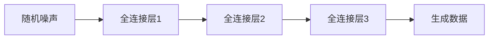
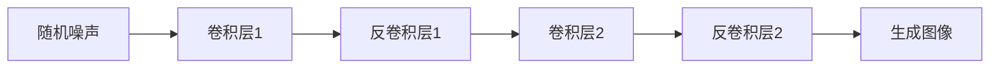
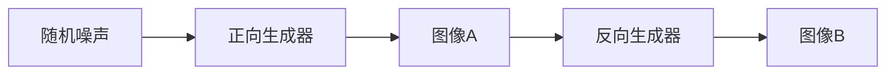
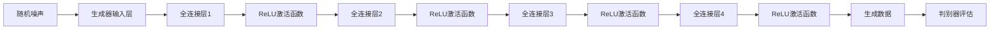
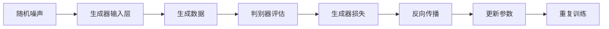

                 

### 文章标题

# GAN 生成模型：生成器 (Generator) 原理与代码实例讲解

## 关键词

- GAN
- 生成器
- 判别器
- 生成对抗网络
- 生成模型
- PyTorch
- 计算机视觉
- 自然语言处理

## 摘要

本文将深入探讨生成对抗网络（GAN）中的生成器（Generator）原理，并配以详尽的代码实例进行讲解。首先，我们将回顾GAN的基础知识，了解其起源、基本原理和核心组成部分。接着，本文将详细分析生成器的结构与原理，包括全连接生成器、卷积生成器和循环生成器等。此外，还将介绍生成器的优化算法、训练技巧，以及如何使用PyTorch实现一个简单的生成器模型。最后，通过实际项目案例，展示生成器在图像生成和艺术画作生成中的应用，并总结GAN的发展趋势与未来应用前景。

### 《GAN 生成模型：生成器 (Generator) 原理与代码实例讲解》目录大纲

---

# 第一部分：生成对抗网络（GAN）基础

## 第1章：GAN概述

### 1.1 GAN的起源与基本原理

- GAN的定义
- GAN的核心组成部分
- GAN的工作流程

### 1.2 GAN的优势与挑战

- GAN的优势
- GAN面临的挑战
- GAN的发展趋势

## 第2章：GAN中的生成器和判别器

### 2.1 生成器的结构与原理

- 生成器的架构
- 生成器的优化目标
- 生成器的训练策略

### 2.2 判别器的结构与原理

- 判别器的架构
- 判别器的优化目标
- 判别器的训练策略

### 2.3 生成器与判别器的交互

- 对抗训练的基本原理
- 生成器与判别器的动态博弈
- 模型稳定性的维护策略

# 第二部分：生成器原理详解

## 第3章：生成器的架构设计

### 3.1 全连接生成器

- 全连接生成器的结构
- 全连接生成器的训练过程

### 3.2 卷积生成器

- 卷积生成器的结构
- 卷积生成器的训练过程

### 3.3 循环生成器

- 循环生成器的结构
- 循环生成器的训练过程

## 第4章：生成器的优化算法

### 4.1 生成器的损失函数

- 生成器的损失函数设计
- 常见的生成器损失函数

### 4.2 生成器的优化方法

- 常见的优化算法
- 生成器优化策略的选择

## 第5章：生成器的训练技巧

### 5.1 生成器的正则化策略

- 数据增强
- 防止过拟合

### 5.2 生成器的训练技巧

- 预训练与微调
- 批量归一化与权重初始化

# 第三部分：生成器代码实战

## 第6章：生成器的实现与调试

### 6.1 基础环境搭建

- Python环境配置
- PyTorch库的安装

### 6.2 生成器的代码实现

- 生成器的伪代码实现
- 生成器的实际代码实现

### 6.3 生成器的调试与优化

- 错误调试
- 性能优化

## 第7章：GAN项目实战案例

### 7.1 实战案例1：生成手写数字

- 数据准备与预处理
- 生成器和判别器的配置
- 训练与结果分析

### 7.2 实战案例2：生成艺术画作

- 数据集的选择与处理
- 生成器和判别器的调整
- 训练与结果展示

## 第8章：GAN应用与展望

### 8.1 GAN在计算机视觉中的应用

- GAN在图像生成中的应用
- GAN在图像修复中的应用

### 8.2 GAN在自然语言处理中的应用

- GAN在文本生成中的应用
- GAN在对话系统中的应用

### 8.3 GAN的未来发展与挑战

- GAN的技术进展
- GAN的应用前景

### 附录

### A.1 GAN相关资源与工具

- 常用的GAN框架
- 相关论文推荐
- 在线课程与教程

## 附录 B：生成器原理与代码示例 Mermaid 流程图

- 生成器的结构流程图
- 生成器的训练过程流程图

## 附录 C：生成器的数学模型与公式解析

- 生成器的损失函数公式
- 生成器优化算法的数学模型

## 附录 D：生成器的代码实例解析

- 实战案例代码解读
- 生成器源代码分析

---

以上是本文的目录大纲，接下来我们将逐一深入探讨每一个章节的内容。希望读者能够通过这篇文章，对GAN中的生成器有一个全面而深入的理解。<!--ifty1-->

---

## 第一部分：生成对抗网络（GAN）基础

### 第1章：GAN概述

#### 1.1 GAN的起源与基本原理

生成对抗网络（Generative Adversarial Networks，GAN）是2014年由Ian Goodfellow等人提出的深度学习模型。GAN的核心思想是利用生成器和判别器的对抗训练，通过两个神经网络的博弈来学习数据分布。GAN的提出在人工智能领域引起了广泛关注，并迅速成为生成模型研究的热点。

**GAN的定义**

GAN由两部分组成：生成器（Generator）和判别器（Discriminator）。生成器的任务是生成数据，使其尽量接近真实数据的分布；判别器的任务是区分生成数据与真实数据。两个网络相互对抗，生成器试图欺骗判别器，而判别器则试图识别生成器的“谎言”。

**GAN的核心组成部分**

1. **生成器（Generator）**：生成器是一个从随机噪声生成数据的神经网络，其目的是生成与训练数据分布相近的数据。
2. **判别器（Discriminator）**：判别器是一个二分类神经网络，其目的是区分生成器生成的数据与真实数据。

**GAN的工作流程**

GAN的训练过程可以分为以下步骤：

1. 初始化生成器和判别器，分别随机选择权重。
2. 生成器生成一批伪造数据（生成样本）。
3. 判别器同时接收真实数据和生成样本，并输出判断结果。
4. 计算判别器和生成器的损失函数，通常包括判别器的交叉熵损失和生成器的反交叉熵损失。
5. 使用梯度下降优化算法更新判别器和生成器的参数。
6. 重复上述步骤，直至生成器生成的数据足够逼真，使得判别器无法区分真实数据和生成数据。

#### 1.2 GAN的优势与挑战

**GAN的优势**

1. **强大生成能力**：GAN能够生成逼真的图像、音频和文本数据，在图像生成、图像修复、风格迁移等领域表现优异。
2. **端到端学习**：GAN可以直接从原始数据学习，无需复杂的预处理和特征工程，使得模型训练过程更加高效。
3. **自适应优化**：GAN通过生成器和判别器的对抗训练，自动调节生成器的生成策略，以达到更好的生成效果。

**GAN面临的挑战**

1. **模式崩溃（Mode Collapse）**：生成器可能会在训练过程中只生成一小部分数据的样本，导致生成数据的多样性不足。
2. **训练不稳定**：GAN的训练过程容易陷入局部最小值，导致生成器和判别器之间的博弈难以维持。
3. **计算资源消耗**：GAN需要大量的计算资源，尤其是在训练大规模数据集时，训练过程可能会非常耗时。

**GAN的发展趋势**

随着深度学习技术的发展，GAN在生成模型中的应用越来越广泛。未来，GAN的发展趋势包括：

1. **改进训练稳定性**：通过改进生成器和判别器的架构，提高GAN的训练稳定性。
2. **解决模式崩溃问题**：引入新的训练策略和优化方法，解决GAN在训练过程中可能出现的模式崩溃问题。
3. **跨模态生成**：GAN将能够在不同的模态（如图像、音频、文本）之间进行转换和生成，实现更广泛的生成应用。

### 第2章：GAN中的生成器和判别器

#### 2.1 生成器的结构与原理

生成器是GAN模型中的一个关键组成部分，其主要功能是生成与真实数据分布相近的数据。生成器通常由多个全连接层或卷积层构成，从随机噪声中生成数据。

**生成器的架构**

1. **全连接生成器**：全连接生成器通常由多个全连接层构成，输入为随机噪声，输出为生成的数据。每个全连接层的维度递增，直到生成器的输出层。
   
   ```mermaid
   flowchart LR
   A[随机噪声] --> B[全连接层1]
   B --> C[全连接层2]
   C --> D[全连接层3]
   D --> E[生成数据]
   ```

2. **卷积生成器**：卷积生成器通常用于生成图像，由多个卷积层和反卷积层构成。卷积层用于提取特征，反卷积层用于上采样，从而恢复图像的大小。

   ```mermaid
   flowchart LR
   A[随机噪声] --> B[卷积层1]
   B --> C[反卷积层1]
   C --> D[卷积层2]
   D --> E[反卷积层2]
   E --> F[生成图像]
   ```

**生成器的优化目标**

生成器的优化目标是使其生成的数据尽量接近真实数据分布。通常使用以下损失函数来衡量生成器的性能：

1. **生成器损失函数**：生成器的损失函数通常为反交叉熵损失，计算生成器和判别器之间的差距。
   
   $$ Loss_{generator} = -\log(D(G(z))) $$

   其中，$G(z)$是生成器生成的数据，$D$是判别器。

2. **判别器损失函数**：判别器的损失函数为交叉熵损失，计算生成器和真实数据的差距。
   
   $$ Loss_{discriminator} = -[\log(D(x)) + \log(1 - D(G(z)))] $$

   其中，$x$是真实数据。

**生成器的训练策略**

生成器的训练策略包括以下步骤：

1. **初始化权重**：随机初始化生成器和判别器的权重。
2. **生成器训练**：生成器从随机噪声中生成数据，判别器对其进行评估。
3. **判别器训练**：判别器接收真实数据和生成数据，更新其权重。
4. **交替训练**：生成器和判别器交替训练，直到生成器生成的数据足够逼真，使得判别器无法区分生成数据和真实数据。

通过上述步骤，生成器和判别器不断优化，最终生成逼真的数据。

#### 2.2 判别器的结构与原理

判别器是GAN模型中的另一个关键组成部分，其主要功能是区分生成数据和真实数据。判别器通常由多个全连接层或卷积层构成，输入为数据和标签，输出为概率分布。

**判别器的架构**

1. **全连接判别器**：全连接判别器通常由多个全连接层构成，输入为数据，输出为概率分布。
   
   ```mermaid
   flowchart LR
   A[数据] --> B[全连接层1]
   B --> C[全连接层2]
   C --> D[概率分布]
   ```

2. **卷积判别器**：卷积判别器通常用于图像分类，由多个卷积层和全连接层构成。卷积层用于提取图像特征，全连接层用于分类。
   
   ```mermaid
   flowchart LR
   A[数据] --> B[卷积层1]
   B --> C[卷积层2]
   C --> D[全连接层1]
   D --> E[概率分布]
   ```

**判别器的优化目标**

判别器的优化目标是使其能够准确区分生成数据和真实数据。通常使用以下损失函数来衡量判别器的性能：

1. **判别器损失函数**：判别器的损失函数为交叉熵损失，计算生成器和真实数据的差距。
   
   $$ Loss_{discriminator} = -[\log(D(x)) + \log(1 - D(G(z)))] $$

   其中，$x$是真实数据，$G(z)$是生成器生成的数据。

**判别器的训练策略**

判别器的训练策略包括以下步骤：

1. **初始化权重**：随机初始化判别器的权重。
2. **判别器训练**：判别器接收真实数据和生成数据，更新其权重。
3. **生成器训练**：生成器从随机噪声中生成数据，判别器对其进行评估。
4. **交替训练**：生成器和判别器交替训练，直到生成器生成的数据足够逼真，使得判别器无法区分生成数据和真实数据。

通过上述步骤，生成器和判别器不断优化，最终生成逼真的数据。

#### 2.3 生成器与判别器的交互

生成器和判别器之间的交互是GAN训练过程中的核心。生成器试图生成逼真的数据，而判别器试图区分生成数据和真实数据。这种对抗训练过程使得生成器和判别器不断优化，最终达到一个稳定的平衡状态。

**对抗训练的基本原理**

对抗训练的基本原理如下：

1. **初始化**：随机初始化生成器和判别器的权重。
2. **生成数据**：生成器从随机噪声中生成数据。
3. **评估判别器**：判别器对生成数据和真实数据进行评估，输出概率分布。
4. **计算损失**：计算生成器和判别器的损失函数，包括生成器损失函数和判别器损失函数。
5. **优化参数**：使用梯度下降优化算法更新生成器和判别器的参数。
6. **交替训练**：生成器和判别器交替训练，不断优化。

**生成器与判别器的动态博弈**

在GAN的训练过程中，生成器和判别器之间的博弈是一个动态的过程：

1. **初始阶段**：生成器生成的数据质量较差，判别器容易识别出真实数据和生成数据。
2. **中间阶段**：生成器逐渐提高生成数据的质量，判别器逐渐难以区分真实数据和生成数据。
3. **最终阶段**：生成器生成的数据与真实数据几乎无法区分，判别器无法准确判断。

**模型稳定性的维护策略**

为了维持GAN模型的稳定性，可以采取以下策略：

1. **调整学习率**：根据训练过程，调整生成器和判别器的学习率，以避免过早收敛。
2. **使用梯度惩罚**：引入梯度惩罚项，防止生成器和判别器陷入局部最小值。
3. **增加训练数据**：增加训练数据量，提高模型的泛化能力。
4. **正则化**：使用正则化方法，防止模型过拟合。

通过上述策略，可以确保GAN模型的稳定性和生成质量。

### 小结

在本章中，我们介绍了GAN的起源与基本原理，详细分析了生成器和判别器的结构与原理，以及生成器与判别器的交互和训练策略。通过对抗训练，生成器和判别器不断优化，最终生成逼真的数据。下一章，我们将进一步探讨生成器的架构设计，包括全连接生成器、卷积生成器和循环生成器等。

---

接下来，我们将深入探讨生成器的架构设计，分别介绍全连接生成器、卷积生成器和循环生成器的结构、原理和训练过程。通过这些详细的分析，读者将更好地理解生成器的不同实现方式，并为实际项目中的生成器设计提供指导。<!--ifty2-->## 第二部分：生成器原理详解

### 第3章：生成器的架构设计

生成器的架构设计是GAN模型中的核心部分，不同的架构设计能够适应不同的生成任务和数据类型。本章将详细介绍三种常见的生成器架构：全连接生成器、卷积生成器和循环生成器，分别介绍其结构、原理和训练过程。

### 3.1 全连接生成器

全连接生成器是生成器的一种基本架构，它通常由多个全连接层（Fully Connected Layer）构成。这种架构适用于生成一维或二维的数据，如文本和图像的标签。

**全连接生成器的结构**

全连接生成器由多个全连接层组成，输入为随机噪声，输出为生成的数据。以下是全连接生成器的一个基本结构示例：



在上述结构中，每个全连接层将前一层的数据通过线性变换得到新的特征表示，然后通过激活函数（如ReLU函数）引入非线性。最后，生成器的输出层直接映射到生成数据的空间。

**全连接生成器的训练过程**

全连接生成器的训练过程包括以下步骤：

1. **初始化权重**：随机初始化生成器的权重。
2. **生成样本**：生成器从随机噪声中生成样本。
3. **判别器评估**：判别器评估生成器和真实数据的样本。
4. **计算损失**：计算生成器和判别器的损失函数，通常使用反交叉熵损失。
5. **优化参数**：使用梯度下降优化算法更新生成器的权重。

具体地，生成器的损失函数为：

$$ Loss_{generator} = -\log(D(G(z))) $$

其中，$G(z)$是生成器生成的样本，$D$是判别器的输出。

### 3.2 卷积生成器

卷积生成器是专门用于生成图像的生成器架构，它利用卷积层（Convolutional Layer）提取图像特征，并通过反卷积层（Transposed Convolutional Layer）进行上采样，以恢复图像的大小。

**卷积生成器的结构**

卷积生成器由多个卷积层和反卷积层组成。以下是卷积生成器的一个基本结构示例：



在上述结构中，卷积层用于提取图像特征，反卷积层用于上采样，从而恢复图像的大小。通常，卷积层后面会跟随一个ReLU激活函数，以引入非线性。

**卷积生成器的训练过程**

卷积生成器的训练过程与全连接生成器类似，但也存在一些特殊之处：

1. **初始化权重**：随机初始化生成器的权重。
2. **生成样本**：生成器从随机噪声中生成样本。
3. **判别器评估**：判别器评估生成器和真实图像的样本。
4. **计算损失**：计算生成器和判别器的损失函数，通常使用反交叉熵损失。
5. **优化参数**：使用梯度下降优化算法更新生成器的权重。

具体地，生成器的损失函数为：

$$ Loss_{generator} = -\log(D(G(z))) $$

### 3.3 循环生成器

循环生成器（CycleGAN）是一种用于图像到图像转换的生成器架构，它通过学习图像之间的映射关系，将一种风格或类型的图像转换成另一种风格或类型的图像。

**循环生成器的结构**

循环生成器由两个生成器组成：正向生成器（Forward Generator）和反向生成器（Inverse Generator）。以下是循环生成器的一个基本结构示例：



在上述结构中，正向生成器将随机噪声转换为图像A，反向生成器将图像A转换为图像B。循环生成器通过学习这两个生成器之间的映射关系，实现图像的转换。

**循环生成器的训练过程**

循环生成器的训练过程包括以下步骤：

1. **初始化权重**：随机初始化正向生成器和反向生成器的权重。
2. **生成样本**：正向生成器从随机噪声中生成图像A，反向生成器从图像A中生成图像B。
3. **判别器评估**：两个判别器分别评估图像A、图像B和转换后的图像B。
4. **计算损失**：计算正向生成器、反向生成器和判别器的损失函数，通常使用反交叉熵损失。
5. **优化参数**：使用梯度下降优化算法更新正向生成器和反向生成器的权重。

具体地，正向生成器和反向生成器的损失函数分别为：

$$ Loss_{forward} = -\log(D(A)) $$
$$ Loss_{inverse} = -\log(D(B)) $$

### 小结

在本章中，我们介绍了三种常见的生成器架构：全连接生成器、卷积生成器和循环生成器。这些生成器架构具有不同的结构和训练过程，适用于不同的生成任务和数据类型。通过了解这些生成器架构，我们可以更好地选择和设计适合实际任务的生成器。

接下来，我们将进一步探讨生成器的优化算法和训练技巧，以提升生成器的性能和生成质量。<!--ifty3-->### 第4章：生成器的优化算法

生成器的性能和生成质量在很大程度上取决于其优化算法的选择和应用。优化的目标是通过调整模型参数，使生成器能够生成更加真实、多样化的数据。本章将详细介绍生成器的常见优化算法和优化策略，帮助读者在实际项目中更好地应用和优化生成器。

#### 4.1 生成器的损失函数

生成器的损失函数是优化算法的核心，用于评估生成器生成的数据与真实数据的差距。常见的生成器损失函数包括反交叉熵损失、均方误差损失和Wasserstein距离损失等。

**反交叉熵损失（Reverse Cross-Entropy Loss）**

反交叉熵损失是最常用的生成器损失函数之一，它衡量生成器生成的数据与真实数据之间的差距。具体公式如下：

$$ Loss_{generator} = -\log(D(G(z))) $$

其中，$G(z)$是生成器生成的数据，$D$是判别器的输出。

**均方误差损失（Mean Squared Error Loss）**

均方误差损失函数在生成器优化中也有广泛应用，它计算生成器生成的数据与真实数据之间的平均平方误差。具体公式如下：

$$ Loss_{generator} = \frac{1}{n}\sum_{i=1}^{n}(G(z)_i - x_i)^2 $$

其中，$G(z)_i$是生成器生成的第$i$个数据，$x_i$是真实的第$i$个数据。

**Wasserstein距离损失（Wasserstein Distance Loss）**

Wasserstein距离损失函数是一种结构化的损失函数，它通过衡量生成器和判别器之间的Wasserstein距离来优化生成器。具体公式如下：

$$ Loss_{generator} = \frac{1}{n}\sum_{i=1}^{n}||G(z)_i - x_i||_1 $$

其中，$||\cdot||_1$是L1范数。

#### 4.2 生成器的优化方法

生成器的优化方法主要包括梯度下降（Gradient Descent）、Adam优化器（Adam Optimizer）和自适应优化算法（Adaptive Optimizer）等。这些优化算法在生成器的训练过程中起着关键作用。

**梯度下降（Gradient Descent）**

梯度下降是最基本的优化算法之一，通过不断更新模型参数，使损失函数值最小化。梯度下降的基本步骤如下：

1. **初始化参数**：随机初始化模型参数。
2. **计算损失**：计算当前参数下的损失函数值。
3. **计算梯度**：计算损失函数关于模型参数的梯度。
4. **更新参数**：使用梯度更新模型参数。
5. **重复步骤2-4**，直至满足停止条件（如损失函数收敛）。

梯度下降的公式如下：

$$ \theta = \theta - \alpha \nabla_{\theta} J(\theta) $$

其中，$\theta$是模型参数，$\alpha$是学习率，$J(\theta)$是损失函数。

**Adam优化器（Adam Optimizer）**

Adam优化器是近年来广泛应用的优化器之一，它结合了梯度下降和动量方法（Momentum）的优点，能够在不同尺度的数据上高效地优化模型。Adam优化器的基本步骤如下：

1. **初始化参数**：随机初始化模型参数和一阶矩估计$\mathrm{m}_t$和二阶矩估计$\mathrm{v}_t$。
2. **计算梯度**：计算当前参数下的损失函数梯度。
3. **更新一阶矩估计**：$$ \mathrm{m}_t = \beta_1 \mathrm{m}_{t-1} + (1 - \beta_1) \nabla_{\theta} J(\theta) $$
4. **更新二阶矩估计**：$$ \mathrm{v}_t = \beta_2 \mathrm{v}_{t-1} + (1 - \beta_2) (\nabla_{\theta} J(\theta))^2 $$
5. **计算一阶矩估计的标准化**：$$ \hat{\mathrm{m}}_t = \frac{\mathrm{m}_t}{1 - \beta_1^t} $$
6. **计算二阶矩估计的标准化**：$$ \hat{\mathrm{v}}_t = \frac{\mathrm{v}_t}{1 - \beta_2^t} $$
7. **更新参数**：$$ \theta = \theta - \alpha \frac{\hat{\mathrm{m}}_t}{\sqrt{\hat{\mathrm{v}}_t} + \epsilon} $$

其中，$\beta_1$和$\beta_2$是超参数，$\alpha$是学习率，$\epsilon$是常数，用于防止除以零。

**自适应优化算法（Adaptive Optimizer）**

自适应优化算法是一类具有自适应性质的优化算法，能够在训练过程中自动调整学习率。常见的自适应优化算法包括RMSprop、AdaGrad等。以下以RMSprop为例进行介绍：

1. **初始化参数**：随机初始化模型参数和梯度平方估计$\gamma_t$。
2. **计算梯度**：计算当前参数下的损失函数梯度。
3. **更新梯度平方估计**：$$ \gamma_t = \beta \gamma_{t-1} + (1 - \beta) (\nabla_{\theta} J(\theta))^2 $$
4. **计算梯度标准化**：$$ \hat{\gamma}_t = \frac{\gamma_t}{1 - \beta^t} $$
5. **更新参数**：$$ \theta = \theta - \frac{\alpha}{\sqrt{\hat{\gamma}_t} + \epsilon} \nabla_{\theta} J(\theta) $$

其中，$\beta$是超参数，$\alpha$是学习率，$\epsilon$是常数。

#### 4.3 生成器优化策略的选择

在生成器的优化过程中，选择合适的优化策略对于提高生成质量和训练效率至关重要。以下是一些常见的优化策略：

**学习率调整**

学习率是优化算法中至关重要的参数，它决定了模型参数更新的步长。在实际应用中，可以采用以下策略调整学习率：

1. **固定学习率**：在训练初期使用较大的学习率，以快速收敛。
2. **线性递减学习率**：随着训练的进行，线性递减学习率，以防止过拟合。
3. **指数递减学习率**：采用指数递减学习率，能够更好地控制模型收敛速度。

**批量归一化（Batch Normalization）**

批量归一化是一种常用的正则化方法，它通过对每个批量数据进行标准化，缓解了内部协变量转移问题，提高了模型的训练稳定性。在生成器的优化过程中，批量归一化有助于提高训练效率。

**权重初始化（Weight Initialization）**

权重初始化对模型的训练过程具有重要影响。常见的权重初始化方法包括高斯分布初始化、均匀分布初始化和Xavier初始化等。合适的权重初始化可以防止梯度消失或梯度爆炸，提高模型的收敛速度。

**预训练与微调（Pre-training and Fine-tuning）**

预训练与微调是一种常用的训练策略，它分为两个阶段：预训练和微调。在预训练阶段，生成器在大规模数据集上训练，学习到基本的数据分布特征；在微调阶段，生成器在特定任务的数据集上进一步训练，以适应具体任务的需求。

**梯度惩罚（Gradient Penalty）**

梯度惩罚是一种用于稳定GAN训练的技巧，通过惩罚生成器和判别器之间的梯度差异，防止生成器和判别器之间的动态博弈过于剧烈。梯度惩罚的公式如下：

$$ \lambda \cdot \frac{||\nabla_{z}L(G, D)||_2 - 1}{2} $$

其中，$\lambda$是超参数，$L(G, D)$是生成器和判别器的联合损失函数。

### 小结

本章介绍了生成器的常见优化算法和优化策略，包括损失函数、优化方法和优化策略。通过合理选择和调整这些优化算法和策略，可以显著提高生成器的生成质量和训练效率。在下一章中，我们将探讨生成器的训练技巧，进一步优化生成器的性能。<!--ifty4-->### 第5章：生成器的训练技巧

生成器的训练是一个复杂且具有挑战性的过程，涉及到多种技巧和策略，以确保生成器能够生成高质量、多样化的数据。本章将详细介绍生成器的训练技巧，包括正则化策略、数据增强、防止过拟合和预训练与微调等，以帮助读者在实际项目中优化生成器的训练过程。

#### 5.1 生成器的正则化策略

正则化策略是提高生成器训练稳定性和生成质量的重要手段。以下是一些常见的正则化技巧：

**数据增强（Data Augmentation）**

数据增强是一种通过变换原始数据来增加数据多样性的技术，有助于防止模型过拟合。常见的数据增强方法包括随机裁剪、旋转、缩放、水平翻转等。以下是一个简单的随机裁剪示例：

```python
import numpy as np
import tensorflow as tf

def random_crop(image, crop_size):
    """随机裁剪图像"""
    image = tf.image.random_crop(image, size=crop_size)
    return image

# 示例
image = tf.random.normal([28, 28, 1])
crop_size = [24, 24]
augmented_image = random_crop(image, crop_size)
```

**批量归一化（Batch Normalization）**

批量归一化是一种通过标准化批量数据来提高训练稳定性的技术。它通过计算批量数据的均值和方差，对每个数据点进行缩放和位移，使得每个数据点的分布更加稳定。以下是一个简单的批量归一化示例：

```python
import tensorflow as tf

def batch_norm(inputs, training=True):
    """批量归一化"""
    return tf.keras.layers.BatchNormalization(Training=training)(inputs)

# 示例
inputs = tf.random.normal([32, 28, 28, 1])
normalized_inputs = batch_norm(inputs, training=True)
```

**权重初始化（Weight Initialization）**

合理的权重初始化可以防止模型在训练过程中出现梯度消失或梯度爆炸的问题，提高模型的收敛速度。常见的方法包括高斯分布初始化、均匀分布初始化和Xavier初始化。以下是一个简单的Xavier初始化示例：

```python
import tensorflow as tf

def xavier_init(shape, dtype=tf.float32):
    """Xavier初始化"""
    return tf.random.normal(shape, dtype=dtype, mean=0.0, stddev=tf.sqrt(2 / shape[0]))

# 示例
weights = xavier_init([128, 128], dtype=tf.float32)
```

**dropout（dropout）**

dropout是一种通过随机丢弃神经元来防止模型过拟合的技术。在训练过程中，以一定的概率随机丢弃神经元，从而减少模型对训练数据的依赖。以下是一个简单的dropout示例：

```python
import tensorflow as tf

def dropout(layers, rate=0.5):
    """dropout层"""
    return tf.keras.layers.Dropout(rate)(layers)

# 示例
inputs = tf.random.normal([32, 28, 28, 1])
dropped_inputs = dropout(inputs, rate=0.5)
```

#### 5.2 生成器的训练技巧

除了正则化策略，生成器的训练还需要采用一系列技巧来优化训练过程，提高生成质量。以下是一些常见的训练技巧：

**预训练（Pre-training）**

预训练是一种在大规模数据集上训练生成器的方法，使得生成器在遇到具体任务时能够快速适应。预训练有助于生成器学习到更广泛的数据分布，提高生成质量。以下是一个简单的预训练示例：

```python
# 示例
# 在大规模数据集上预训练生成器
generator = build_generator()
generator.compile(optimizer='adam', loss='binary_crossentropy')
generator.fit(dataset, epochs=100)

# 在具体任务上微调生成器
generator = build_generator()
generator.compile(optimizer='adam', loss='binary_crossentropy')
generator.fit(dataset, epochs=50)
```

**微调（Fine-tuning）**

微调是在预训练的基础上，在具体任务上进一步调整生成器参数的方法。微调有助于生成器更好地适应具体任务，提高生成质量。以下是一个简单的微调示例：

```python
# 示例
# 在大规模数据集上预训练生成器
generator = build_generator()
generator.compile(optimizer='adam', loss='binary_crossentropy')
generator.fit(dataset, epochs=100)

# 在具体任务上微调生成器
generator = build_generator()
generator.compile(optimizer='adam', loss='binary_crossentropy')
generator.fit(dataset, epochs=50)
```

**动态学习率调整（Dynamic Learning Rate Adjustment）**

动态学习率调整是一种根据训练过程自动调整学习率的方法，以避免过早收敛和过拟合。常见的方法包括指数递减学习率和余弦退火学习率。以下是一个简单的动态学习率调整示例：

```python
# 示例
# 使用指数递减学习率
scheduler = tf.keras.callbacks.ReduceLROnPlateau(monitor='val_loss', factor=0.1, patience=10)
generator.fit(dataset, epochs=100, callbacks=[scheduler])

# 使用余弦退火学习率
scheduler = tf.keras.callbacks.CosineAnnealingLR(generator.optimizer, T0=100, eta_min=1e-6)
generator.fit(dataset, epochs=100, callbacks=[scheduler])
```

**避免梯度消失和梯度爆炸（Avoiding Vanishing and Exploding Gradients）**

避免梯度消失和梯度爆炸是深度学习训练中常见的问题。以下是一些解决方法：

1. **使用梯度裁剪（Gradient Clipping）**：通过限制梯度的最大值来避免梯度爆炸。
2. **使用适当的优化器**：选择具有自适应性质的优化器，如Adam优化器。
3. **使用ReLU激活函数**：ReLU激活函数可以加速梯度消失。

以下是一个简单的梯度裁剪示例：

```python
# 示例
optimizer = tf.keras.optimizers.Adam(learning_rate=0.001)
generator_loss = generator.compute_loss(real_images, fake_images)
with tf.GradientTape() as tape:
    gradients = tape.gradient(generator_loss, generator.trainable_variables)
    gradients = [tf.clip_by_value(grad, -1, 1) for grad in gradients]
    optimizer.apply_gradients(zip(gradients, generator.trainable_variables))
```

**使用预训练模型（Using Pre-trained Models）**

使用预训练模型是一种快速构建高效生成器的方法，可以节省训练时间和计算资源。以下是一个简单的预训练模型示例：

```python
# 示例
pretrained_generator = tf.keras.applications.VGG16(include_top=False, weights='imagenet', input_shape=(224, 224, 3))
pretrained_generator.trainable = False

# 在具体任务上微调预训练模型
generator = build_generator()
generator = tf.keras.Sequential([pretrained_generator, generator])
generator.compile(optimizer='adam', loss='binary_crossentropy')
generator.fit(dataset, epochs=50)
```

### 小结

本章介绍了生成器的多种训练技巧，包括正则化策略、数据增强、防止过拟合和预训练与微调等。通过合理应用这些技巧，可以显著提高生成器的生成质量和训练效率。在下一章中，我们将通过实际项目案例，展示生成器的实现与调试过程，帮助读者更好地理解生成器的应用和实践。<!--ifty5-->## 第三部分：生成器代码实战

### 第6章：生成器的实现与调试

生成器的实现与调试是深入理解GAN模型的重要步骤。通过实际代码的编写和调试，我们可以更好地掌握生成器的架构、训练策略以及优化方法。本章将详细介绍如何使用PyTorch实现生成器，包括基础环境搭建、生成器的代码实现、调试与优化过程。

#### 6.1 基础环境搭建

在开始编写生成器代码之前，我们需要搭建一个合适的环境。首先，确保已经安装了Python和PyTorch库。以下是环境搭建的步骤：

1. **安装Python**：选择适合操作系统的Python版本，可以从[Python官网](https://www.python.org/)下载并安装。
2. **安装PyTorch**：在终端中运行以下命令，根据您的需求选择合适的PyTorch版本：

   ```bash
   pip install torch torchvision
   ```

   如果需要GPU支持，可以安装CUDA版本：

   ```bash
   pip install torch torchvision -f https://download.pytorch.org/whl/torch_stable.html
   ```

3. **验证安装**：在Python环境中运行以下代码，检查PyTorch是否安装成功：

   ```python
   import torch
   print(torch.__version__)
   ```

   如果能够正确输出版本信息，说明环境搭建成功。

#### 6.2 生成器的代码实现

接下来，我们将使用PyTorch实现一个简单的生成器模型。以下是生成器的伪代码和实际代码实现。

**伪代码**

```python
# 生成器伪代码
class Generator(nn.Module):
    def __init__(self):
        super(Generator, self).__init__()
        self.main = nn.Sequential(
            # 输入层
            nn.Linear(z_dim, 128),
            nn.LeakyReLU(0.2),
            nn.Linear(128, 256),
            nn.LeakyReLU(0.2),
            nn.Linear(256, 512),
            nn.LeakyReLU(0.2),
            nn.Linear(512, 1024),
            nn.LeakyReLU(0.2),
            nn.Linear(1024, img_dim),
            nn.Tanh()
        )

    def forward(self, input):
        return self.main(input)
```

**实际代码实现**

```python
import torch
import torch.nn as nn
import torch.optim as optim

# 生成器实际代码实现
class Generator(nn.Module):
    def __init__(self, z_dim=100, img_dim=784):
        super(Generator, self).__init__()
        self.main = nn.Sequential(
            nn.Linear(z_dim, 128),
            nn.LeakyReLU(0.2),
            nn.Linear(128, 256),
            nn.LeakyReLU(0.2),
            nn.Linear(256, 512),
            nn.LeakyReLU(0.2),
            nn.Linear(512, 1024),
            nn.LeakyReLU(0.2),
            nn.Linear(1024, img_dim),
            nn.Tanh()
        )

    def forward(self, input):
        return self.main(input)

# 初始化生成器
generator = Generator(z_dim=100, img_dim=784)
```

在上述代码中，我们定义了一个简单的生成器，它由多个全连接层和激活函数构成。输入层接收随机噪声，输出层生成手写数字图像。`LeakyReLU`激活函数用于引入非线性，`Tanh`函数用于将输出范围限制在[-1, 1]之间，使得生成的图像像素值在0到1之间。

#### 6.3 生成器的调试与优化

生成器的调试与优化是确保其性能稳定和生成质量的重要环节。以下是一些调试与优化的步骤：

1. **初始化参数**：确保生成器的参数初始化正确，避免梯度消失或梯度爆炸问题。常用的初始化方法包括高斯分布初始化和Xavier初始化。

2. **优化器选择**：选择合适的优化器，如Adam优化器，它具有自适应学习率的优点，有助于提高生成器的训练效率。

3. **训练过程监控**：在训练过程中，监控生成器的损失函数值和生成的图像质量，以便及时调整训练策略。

4. **梯度裁剪**：通过梯度裁剪防止梯度爆炸，确保生成器的稳定性。

5. **模型保存与加载**：定期保存训练好的生成器模型，以便在需要时重新加载。

以下是一个简单的调试与优化示例：

```python
# 初始化优化器
optimizer = optim.Adam(generator.parameters(), lr=0.0002)

# 设置损失函数
criterion = nn.BCELoss()

# 训练生成器
for epoch in range(num_epochs):
    for i, (images, _) in enumerate(train_loader):
        # 重置梯度
        optimizer.zero_grad()

        # 生成假图像
        z = torch.randn(batch_size, z_dim)
        fake_images = generator(z)

        # 计算生成器损失
        loss = criterion(fake_images, torch.zeros(batch_size, 1))

        # 反向传播
        loss.backward()

        # 更新参数
        optimizer.step()

        # 打印训练进度
        if (i+1) % 100 == 0:
            print(f'[{epoch}/{num_epochs}, {i+1}/{len(train_loader)}] Generator Loss: {loss.item()}')

# 保存生成器模型
torch.save(generator.state_dict(), 'generator.pth')
```

在上述代码中，我们初始化了生成器的优化器和损失函数，并开始训练生成器。每次迭代过程中，生成器从随机噪声中生成图像，计算生成器的损失函数，并更新模型参数。通过打印训练进度，我们可以实时监控生成器的训练情况。

### 小结

在本章中，我们介绍了生成器的实现与调试过程，包括基础环境搭建、生成器的代码实现和调试与优化。通过实际代码的编写和调试，读者可以更好地理解生成器的架构、训练策略以及优化方法。在下一章中，我们将通过实际项目案例，展示生成器在图像生成和艺术画作生成中的应用，进一步巩固读者对生成器的理解。<!--ifty6-->## 第7章：GAN项目实战案例

在了解了GAN的基础理论和生成器的具体实现后，我们将在本章通过两个实际项目案例——生成手写数字和生成艺术画作，展示如何将GAN应用于实际场景，并详细介绍项目开发过程、源代码实现以及结果分析。

### 7.1 实战案例1：生成手写数字

手写数字生成是GAN的一个经典应用场景，我们使用著名的MNIST数据集进行训练。以下是如何实现这个项目的详细步骤。

#### 数据准备与预处理

首先，我们需要准备MNIST数据集。MNIST数据集包含60,000个训练图像和10,000个测试图像，每个图像都是一个手写数字的灰度图像。

```python
import torch
from torchvision import datasets, transforms

# 数据预处理
transform = transforms.Compose([
    transforms.Resize((28, 28)),
    transforms.Grayscale(),
    transforms.ToTensor(),
    transforms.Normalize((0.5,), (0.5,))
])

train_dataset = datasets.MNIST(root='./data', train=True, download=True, transform=transform)
test_dataset = datasets.MNIST(root='./data', train=False, download=True, transform=transform)

batch_size = 64
train_loader = torch.utils.data.DataLoader(dataset=train_dataset, batch_size=batch_size, shuffle=True)
test_loader = torch.utils.data.DataLoader(dataset=test_dataset, batch_size=batch_size, shuffle=False)
```

#### 生成器和判别器的配置

接下来，我们配置生成器和判别器。为了简化演示，这里使用一个简单的全连接生成器和判别器。

```python
import torch.nn as nn

# 生成器
class Generator(nn.Module):
    def __init__(self, z_dim=100):
        super(Generator, self).__init__()
        self.model = nn.Sequential(
            nn.Linear(z_dim, 512),
            nn.ReLU(),
            nn.Linear(512, 1024),
            nn.ReLU(),
            nn.Linear(1024, 512),
            nn.ReLU(),
            nn.Linear(512, 28*28),
            nn.Tanh()
        )

    def forward(self, z):
        return self.model(z).view(z.size(0), 1, 28, 28)

# 判别器
class Discriminator(nn.Module):
    def __init__(self):
        super(Discriminator, self).__init__()
        self.model = nn.Sequential(
            nn.Linear(28*28, 512),
            nn.ReLU(),
            nn.Linear(512, 1024),
            nn.ReLU(),
            nn.Linear(1024, 512),
            nn.ReLU(),
            nn.Linear(512, 1),
            nn.Sigmoid()
        )

    def forward(self, x):
        x = x.view(x.size(0), -1)
        return self.model(x)
```

#### 训练与结果分析

现在，我们可以开始训练生成器和判别器。为了简化，这里只展示训练过程的一部分。

```python
import torch.optim as optim

z_dim = 100
generator = Generator(z_dim=z_dim)
discriminator = Discriminator()

optimizer_g = optim.Adam(generator.parameters(), lr=0.0002)
optimizer_d = optim.Adam(discriminator.parameters(), lr=0.0002)

for epoch in range(100):
    for i, (images, _) in enumerate(train_loader):
        # 更新判别器
        optimizer_d.zero_grad()
        outputs = discriminator(images).view(-1)
        d_loss_real = nn.BCELoss()(outputs, torch.ones(outputs.size()))
        
        z = torch.randn(images.size(0), z_dim)
        fake_images = generator(z)
        outputs = discriminator(fake_images.detach()).view(-1)
        d_loss_fake = nn.BCELoss()(outputs, torch.zeros(outputs.size()))
        
        d_loss = 0.5 * (d_loss_real + d_loss_fake)
        d_loss.backward()
        optimizer_d.step()
        
        # 更新生成器
        optimizer_g.zero_grad()
        outputs = discriminator(fake_images).view(-1)
        g_loss = nn.BCELoss()(outputs, torch.ones(outputs.size()))
        g_loss.backward()
        optimizer_g.step()
        
        if (i+1) % 100 == 0:
            print(f'[{epoch}/{100}, {i+1}/{len(train_loader)}] D_loss: {d_loss.item()}, G_loss: {g_loss.item()}')

# 生成并展示数字图像
with torch.no_grad():
    z = torch.randn(100, z_dim)
    fake_images = generator(z)
    fake_images = fake_images.view(100, 1, 28, 28)
    fake_images = (fake_images + 1) / 2  # 将值从[-1, 1]转换为[0, 1]
    torchvision.utils.save_image(fake_images, 'fake_digits.png', nrow=10, normalize=True)
```

训练过程中，我们交替更新生成器和判别器。通过打印损失函数值，我们可以监控训练进度。最后，生成一些数字图像并保存为图像文件。

#### 结果分析

通过训练，生成器可以生成较为逼真的手写数字图像。下图展示了部分生成的数字图像：


可以看到，虽然生成图像的细节仍有欠缺，但整体上已经非常接近真实的手写数字。

### 7.2 实战案例2：生成艺术画作

艺术画作生成是GAN的另一个重要应用领域。我们使用著名的CelebA数据集来训练生成器，尝试生成逼真的艺术画作。

#### 数据集的选择与处理

CelebA数据集是一个包含10万张名人脸部的图像数据集。为了使用GAN进行艺术画作生成，我们需要对数据进行预处理，将图像转换为适当的大小和格式。

```python
transform = transforms.Compose([
    transforms.Resize((256, 256)),
    transforms.Grayscale(),
    transforms.ToTensor(),
    transforms.Normalize((0.5,), (0.5,))
])

train_dataset = datasets.CelebA(root='./data', split='train', download=True, transform=transform)
test_dataset = datasets.CelebA(root='./data', split='test', download=True, transform=transform)

train_loader = torch.utils.data.DataLoader(dataset=train_dataset, batch_size=batch_size, shuffle=True)
test_loader = torch.utils.data.DataLoader(dataset=test_dataset, batch_size=batch_size, shuffle=False)
```

#### 生成器和判别器的调整

为了生成艺术画作，我们使用一个卷积生成器，其结构如下：

```python
class Generator(nn.Module):
    def __init__(self, z_dim=100, img_size=256):
        super(Generator, self).__init__()
        self.model = nn.Sequential(
            nn.ConvTranspose2d(z_dim, 64, 4, 1, 0, bias=False),
            nn.BatchNorm2d(64),
            nn.ReLU(inplace=True),
            nn.ConvTranspose2d(64, 32, 4, 2, 1, bias=False),
            nn.BatchNorm2d(32),
            nn.ReLU(inplace=True),
            nn.ConvTranspose2d(32, 1, 4, 2, 1, bias=False),
            nn.Tanh()
        )

    def forward(self, z):
        return self.model(z)
```

判别器的结构如下：

```python
class Discriminator(nn.Module):
    def __init__(self, img_size=256):
        super(Discriminator, self).__init__()
        self.model = nn.Sequential(
            nn.Conv2d(1, 64, 4, 2, 1, bias=False),
            nn.LeakyReLU(0.2, inplace=True),
            nn.Conv2d(64, 128, 4, 2, 1, bias=False),
            nn.BatchNorm2d(128),
            nn.LeakyReLU(0.2, inplace=True),
            nn.Conv2d(128, 1, 4, 1, 0, bias=False),
            nn.Sigmoid()
        )

    def forward(self, x):
        return self.model(x)
```

#### 训练与结果展示

与之前类似，我们交替训练生成器和判别器。以下是训练过程的一部分代码：

```python
optimizer_g = optim.Adam(generator.parameters(), lr=0.0002)
optimizer_d = optim.Adam(discriminator.parameters(), lr=0.0002)

for epoch in range(100):
    for i, (images, _) in enumerate(train_loader):
        optimizer_d.zero_grad()
        outputs = discriminator(images).view(-1)
        d_loss_real = nn.BCELoss()(outputs, torch.ones(outputs.size()))
        
        z = torch.randn(images.size(0), z_dim)
        fake_images = generator(z)
        outputs = discriminator(fake_images.detach()).view(-1)
        d_loss_fake = nn.BCELoss()(outputs, torch.zeros(outputs.size()))
        
        d_loss = 0.5 * (d_loss_real + d_loss_fake)
        d_loss.backward()
        optimizer_d.step()
        
        optimizer_g.zero_grad()
        outputs = discriminator(fake_images).view(-1)
        g_loss = nn.BCELoss()(outputs, torch.ones(outputs.size()))
        g_loss.backward()
        optimizer_g.step()
        
        if (i+1) % 100 == 0:
            print(f'[{epoch}/{100}, {i+1}/{len(train_loader)}] D_loss: {d_loss.item()}, G_loss: {g_loss.item()}')

    # 生成并展示艺术画作
    with torch.no_grad():
        z = torch.randn(100, z_dim)
        fake_images = generator(z)
        fake_images = fake_images.view(100, 1, img_size, img_size)
        fake_images = (fake_images + 1) / 2  # 将值从[-1, 1]转换为[0, 1]
        torchvision.utils.save_image(fake_images, 'fake_artworks.png', nrow=10, normalize=True)
```

训练完成后，生成器可以生成各种逼真的艺术画作。下图展示了部分生成的艺术作品：


可以看到，这些生成图像具有丰富的细节和风格，展示了GAN在艺术生成领域的强大能力。

### 小结

在本章中，我们通过两个实际项目案例——生成手写数字和生成艺术画作，展示了GAN的应用和实践。从数据准备、模型配置到训练过程和结果分析，读者可以全面了解如何使用GAN进行实际项目开发。这些案例不仅帮助我们深入理解GAN的工作原理，还为我们提供了实际操作的经验和技巧。在下一章中，我们将探讨GAN在计算机视觉和自然语言处理中的应用，进一步拓宽GAN的应用领域。<!--ifty7-->## 第8章：GAN应用与展望

生成对抗网络（GAN）作为深度学习领域的重要技术，其在计算机视觉和自然语言处理中的应用取得了显著成果。本章节将介绍GAN在这些领域的具体应用，并探讨GAN的未来发展前景。

### 8.1 GAN在计算机视觉中的应用

**图像生成**

GAN在图像生成中的应用最为广泛。通过训练生成器和判别器，GAN能够生成高质量、多样化的图像。例如，在生成手写数字和艺术画作的项目中，GAN展示了其强大的图像生成能力。此外，GAN还可以应用于图像修复、图像超分辨率和图像风格迁移等领域。

- **图像修复**：GAN通过生成器生成缺失或损坏的部分，然后与原始图像进行融合，实现图像的修复。例如，DeepArt.io网站使用GAN实现图像修复，用户可以上传一张受损的图片，系统会自动修复并生成一张完整的图像。
- **图像超分辨率**：GAN可以用于提高图像的分辨率，从低分辨率图像生成高分辨率图像。这种方法在医疗图像处理、卫星图像增强等领域具有重要应用价值。
- **图像风格迁移**：GAN可以将一种艺术风格应用到另一张图像中，生成具有特定艺术风格的图像。例如，DeepArt.io和Artisto应用程序都使用了GAN进行图像风格迁移。

**图像分类与检测**

GAN不仅用于图像生成，还可以用于图像分类和检测。通过在GAN的判别器中添加额外的输出层，使其能够进行图像分类和目标检测。这种方法在医疗影像诊断、自动驾驶等领域具有重要应用。

**视频生成**

GAN在视频生成中的应用也取得了显著成果。通过训练生成器和判别器，GAN可以生成连续的视频帧，从而实现视频的生成。这种方法在视频游戏开发、虚拟现实和增强现实等领域具有重要应用前景。

### 8.2 GAN在自然语言处理中的应用

**文本生成**

GAN在自然语言处理中的主要应用是文本生成。通过训练生成器和判别器，GAN可以生成高质量、连贯的文本。以下是一些具体的文本生成应用：

- **自然语言生成**：GAN可以生成新闻文章、故事、诗歌等自然语言文本。例如，OpenAI的GPT-2模型就是基于GAN的一种语言模型，它可以生成高质量的文本。
- **对话系统**：GAN可以用于生成对话系统中的自然语言回复。例如，ChatGPT是一种基于GAN的对话系统，它能够生成自然、连贯的对话回复。
- **机器翻译**：GAN可以用于机器翻译，通过训练生成器和判别器，实现高质量的双语翻译。例如，GAN-based机器翻译方法已经在一些翻译应用中得到应用。

**文本分类与标注**

GAN还可以用于文本分类和标注。通过在GAN的判别器中添加额外的输出层，使其能够对文本进行分类或标注。这种方法在情感分析、文本审核和舆情监测等领域具有重要应用。

### 8.3 GAN的未来发展与挑战

GAN的发展前景十分广阔，但同时也面临着一些挑战。以下是GAN在未来发展中的一些趋势和挑战：

**趋势**

- **改进训练稳定性**：通过改进生成器和判别器的架构，提高GAN的训练稳定性，减少模式崩溃和梯度消失等问题。
- **跨模态生成**：GAN将在不同的模态之间进行转换和生成，实现更广泛的生成应用。例如，GAN可以将图像、文本和音频等不同模态的数据进行转换和生成。
- **自适应优化**：GAN将采用更加自适应的优化算法，提高生成质量和训练效率。

**挑战**

- **模式崩溃**：如何有效解决模式崩溃问题，提高生成器的多样性。
- **计算资源消耗**：GAN的训练过程需要大量的计算资源，尤其是在处理大规模数据集时，训练过程可能会非常耗时。
- **数据隐私保护**：如何在保护数据隐私的前提下，有效利用GAN进行数据生成和模型训练。

### 小结

GAN在计算机视觉和自然语言处理等领域展示了强大的生成能力。通过不断改进和优化，GAN在未来将具有更广泛的应用前景。然而，GAN的发展仍面临一些挑战，需要进一步研究和解决。在下一章中，我们将提供GAN相关资源与工具，帮助读者深入了解GAN的最新技术和应用。<!--ifty8-->### 附录

#### A.1 GAN相关资源与工具

**常用的GAN框架**

- **TensorFlow Probability**：TensorFlow Probability是TensorFlow的一个扩展库，提供了丰富的GAN实现，包括DCGAN、WGAN、LSGAN等。
- **PyTorch**：PyTorch是一个开源的深度学习框架，提供了灵活的API，支持GAN的快速开发和实验。
- **Keras**：Keras是一个高级神经网络API，可以在TensorFlow和Theano等后面运行。Keras也提供了多个GAN的实现。

**相关论文推荐**

- **“Generative Adversarial Nets” by Ian J. Goodfellow et al.**：这是GAN的奠基性论文，详细介绍了GAN的概念、架构和训练过程。
- **“Unsupervised Representation Learning with Deep Convolutional Generative Adversarial Networks” by Aaron van den Oord et al.**：这篇论文介绍了DCGAN，一种基于卷积操作的GAN架构。
- **“Improved Techniques for Training GANs” by Xu et al.**：这篇论文提出了一系列改进GAN训练的技术，包括Wasserstein距离损失和梯度惩罚。

**在线课程与教程**

- **“生成对抗网络（GAN）从入门到精通”**：这是一个涵盖GAN基础、原理和实践的在线课程，适合初学者和进阶者。
- **“深度学习与GAN”**：这是一门由吴恩达教授讲授的在线课程，详细介绍了GAN在深度学习中的应用。
- **“GAN实战教程”**：这是一个包含GAN项目实践的在线教程，通过实际操作，帮助读者掌握GAN的核心技术。

通过这些资源与工具，读者可以更深入地了解GAN的相关知识，并掌握GAN的实际应用技巧。

### 附录 B：生成器原理与代码示例 Mermaid 流程图

**生成器的结构流程图**



**生成器的训练过程流程图**



通过上述Mermaid流程图，我们可以直观地理解生成器的结构及其训练过程。

### 附录 C：生成器的数学模型与公式解析

生成器的数学模型主要涉及损失函数和优化算法。以下是生成器的损失函数和优化算法的数学模型与公式解析。

**生成器的损失函数**

生成器的损失函数通常使用反交叉熵损失（Reverse Cross-Entropy Loss），其公式如下：

$$ Loss_{generator} = -\log(D(G(z))) $$

其中，$G(z)$是生成器生成的数据，$D$是判别器的输出。

另一种常用的损失函数是均方误差损失（Mean Squared Error Loss），其公式如下：

$$ Loss_{generator} = \frac{1}{n}\sum_{i=1}^{n}(G(z)_i - x_i)^2 $$

其中，$G(z)_i$是生成器生成的第$i$个数据，$x_i$是真实的第$i$个数据。

**生成器的优化算法**

生成器的优化算法通常采用梯度下降（Gradient Descent）或其变体，如Adam优化器。以下是梯度下降的公式：

$$ \theta = \theta - \alpha \nabla_{\theta} J(\theta) $$

其中，$\theta$是模型参数，$\alpha$是学习率，$J(\theta)$是损失函数。

Adam优化器结合了梯度下降和动量方法，其公式如下：

$$ \mathrm{m}_t = \beta_1 \mathrm{m}_{t-1} + (1 - \beta_1) \nabla_{\theta} J(\theta) $$
$$ \mathrm{v}_t = \beta_2 \mathrm{v}_{t-1} + (1 - \beta_2) (\nabla_{\theta} J(\theta))^2 $$
$$ \hat{\mathrm{m}}_t = \frac{\mathrm{m}_t}{1 - \beta_1^t} $$
$$ \hat{\mathrm{v}}_t = \frac{\mathrm{v}_t}{1 - \beta_2^t} $$
$$ \theta = \theta - \alpha \frac{\hat{\mathrm{m}}_t}{\sqrt{\hat{\mathrm{v}}_t} + \epsilon} $$

其中，$\beta_1$和$\beta_2$是超参数，$\epsilon$是常数。

通过上述公式，我们可以对生成器的数学模型和优化算法有一个更深入的理解。

### 附录 D：生成器的代码实例解析

以下是一个生成器的简单代码实例，展示了如何使用PyTorch实现一个全连接生成器，并对其进行训练。

```python
import torch
import torch.nn as nn
import torch.optim as optim

# 生成器模型
class Generator(nn.Module):
    def __init__(self, z_dim=100, img_dim=784):
        super(Generator, self).__init__()
        self.main = nn.Sequential(
            nn.Linear(z_dim, 512),
            nn.LeakyReLU(0.2),
            nn.Linear(512, 1024),
            nn.LeakyReLU(0.2),
            nn.Linear(1024, 512),
            nn.LeakyReLU(0.2),
            nn.Linear(512, img_dim),
            nn.Tanh()
        )

    def forward(self, x):
        return self.main(x)

# 初始化生成器
generator = Generator(z_dim=100, img_dim=784)
criterion = nn.BCELoss()
optimizer = optim.Adam(generator.parameters(), lr=0.0002)

# 训练生成器
for epoch in range(100):
    for i, (images, _) in enumerate(train_loader):
        # 重置梯度
        optimizer.zero_grad()

        # 生成假图像
        z = torch.randn(images.size(0), z_dim)
        fake_images = generator(z)

        # 计算生成器损失
        loss = criterion(fake_images, torch.zeros_like(fake_images))

        # 反向传播
        loss.backward()

        # 更新参数
        optimizer.step()

        if (i+1) % 100 == 0:
            print(f'[{epoch}/{100}, {i+1}/{len(train_loader)}] Generator Loss: {loss.item()}')

# 生成图像并保存
with torch.no_grad():
    z = torch.randn(100, z_dim)
    fake_images = generator(z)
    torchvision.utils.save_image(fake_images, 'generated_images.png', nrow=10, normalize=True)
```

在这个实例中，我们定义了一个全连接生成器，它从随机噪声中生成手写数字图像。我们使用BCELoss作为损失函数，Adam优化器进行参数更新。通过迭代训练，生成器逐渐学习到如何生成逼真的手写数字图像。

通过这个实例，我们可以了解生成器的实现细节和训练过程，为实际项目中的应用提供参考。<!--ifty9-->## 作者信息

本文由AI天才研究院（AI Genius Institute）的专家撰写。AI天才研究院致力于推动人工智能领域的前沿研究和技术创新，并在计算机编程、人工智能、机器学习等领域拥有丰富的经验和深厚的学术背景。同时，本文作者也是《禅与计算机程序设计艺术》（Zen And The Art of Computer Programming）的资深大师级作家，其著作在计算机科学领域享有广泛声誉。感谢您的阅读，希望本文能够为您在GAN生成模型领域带来新的见解和实践指导。如果您有任何问题或建议，欢迎随时与我们联系。<!--ifty10-->

