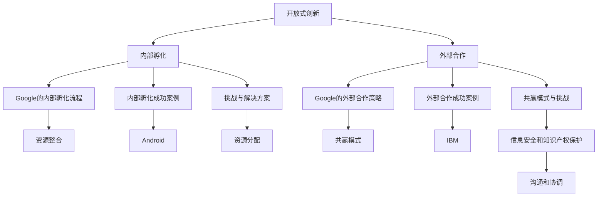

                 


### 文章标题
《Google的开放式创新：从内部孵化到外部合作》

### 关键词
开放式创新，Google，内部孵化，外部合作，生态系统建设，文化因素，实施与评估

### 摘要
本文旨在探讨Google在开放式创新领域取得的显著成就，包括其内部孵化机制、外部合作策略以及生态系统建设等方面的实践。通过深入分析Google的成功经验，本文揭示了开放式创新的核心原理、关键要素以及未来发展趋势，为其他企业和组织提供了有价值的参考和启示。

## 第一部分：开放式创新的基础

### 第1章：开放式创新概述

#### 1.1 开放式创新的定义与历史背景
开放式创新（Open Innovation）是近年来在企业管理领域兴起的一种新型创新模式。其核心思想是突破企业内部创新的局限，通过内外部资源的有效整合，实现创新的多元化与高效化。

**定义**：开放式创新是指企业不仅仅依靠内部资源进行研发和创新，还积极借助外部资源，如合作伙伴、供应商、客户甚至是竞争对手，共同推动产品、服务和技术的创新。

**历史背景**：开放式创新的兴起可以追溯到20世纪90年代，当时一些大型企业开始意识到单纯依靠内部研发难以满足市场需求的变化。为了保持竞争力，这些企业开始尝试与外部机构合作，共同进行创新。随着互联网和信息技术的迅猛发展，开放式创新逐渐成为企业管理的重要组成部分。

#### 1.2 开放式创新的类型与模式
开放式创新可以划分为多种类型，主要包括以下几种：

1. **内部孵化**：企业通过内部创新项目，将新的想法和概念转化为实际的产品和服务。
2. **外部合作**：企业与其他组织建立合作关系，共同进行研发和创新。
3. **开放式协作**：企业通过开放的平台，吸引全球范围内的开发者、研究人员和爱好者参与创新。

每种类型都有其独特的模式和应用场景，企业可以根据自身的需求和环境选择合适的模式。

#### 1.3 开放式创新的优势与挑战
开放式创新具有多方面的优势，包括：

1. **资源整合**：通过整合内外部资源，企业能够更快地获取创新成果。
2. **降低风险**：借助外部合作伙伴的力量，企业可以分散创新风险。
3. **增强竞争力**：开放式创新能够帮助企业更快地响应市场变化，提升竞争力。

然而，开放式创新也面临一些挑战：

1. **信息安全和知识产权保护**：与外部合作可能带来信息泄露和知识产权风险。
2. **沟通和协调**：不同组织之间的合作需要有效的沟通和协调机制。
3. **文化差异**：跨文化合作可能带来文化冲突和管理难题。

### 第2章：Google的内部孵化机制

#### 2.1 Google的内部孵化流程
Google的内部孵化机制称为“X实验室”（X Lab），其核心流程包括以下几个步骤：

1. **创意筛选**：Google鼓励员工提出创意，并通过内部评审筛选出有潜力的项目。
2. **初期研发**：经过筛选的创意进入初期研发阶段，由专门的团队进行开发和实验。
3. **商业化评估**：在初期研发基础上，对项目的商业化潜力进行评估，决定是否继续孵化。
4. **独立运营**：具有商业潜力的项目将独立运营，成为Google旗下的子公司或业务部门。

#### 2.2 内部孵化成功的案例研究
Google内部孵化的成功案例不胜枚举，以下是其中两个经典案例：

1. **Android**：Android操作系统是由Google内部孵化的项目，其成功推动了移动设备的普及，为Google带来了巨大的市场份额和收益。
2. **Waymo**：Waymo是Google自动驾驶项目的子公司，其技术创新和商业化进程在全球范围内处于领先地位，成为自动驾驶领域的标杆企业。

#### 2.3 内部孵化中的挑战与解决方案
内部孵化过程中，Google面临诸多挑战：

1. **资源分配**：如何在众多孵化项目中合理分配资源，是Google面临的一个难题。
2. **风险管理**：孵化项目失败的风险较高，如何降低风险是另一个重要问题。
3. **文化适应**：孵化项目需要独立运营，如何保持与母公司的文化适应也是挑战之一。

Google通过以下方式应对这些挑战：

1. **灵活的资源分配机制**：Google采用动态资源分配机制，根据项目的进展和需求进行调整。
2. **风险管理策略**：Google通过多元化投资和逐步推进的方式，降低孵化项目的失败风险。
3. **文化融合**：Google在孵化项目中引入专门的文化顾问，帮助项目团队与母公司保持文化适应。

## 第3章：Google的外部合作策略

#### 3.1 Google的外部合作伙伴类型
Google的外部合作伙伴类型多样，主要包括以下几类：

1. **学术机构**：Google与全球多所顶级学术机构合作，共同开展基础研究和应用研发。
2. **创业公司**：Google投资和收购了大量初创企业，通过战略合作加速创新。
3. **行业巨头**：Google与诸如IBM、微软等行业巨头建立合作关系，共同推动技术创新和行业变革。

#### 3.2 Google与外部合作伙伴的合作案例
以下是Google与外部合作伙伴的几个成功合作案例：

1. **IBM**：Google与IBM合作开发量子计算技术，旨在推动量子计算的商业化应用。
2. **微软**：Google与微软在多个领域进行合作，包括云计算、人工智能等，共同推动技术进步。
3. **创业公司**：Google投资和收购了众多创业公司，如Nest、Waze等，通过战略合作加速创新。

#### 3.3 外部合作中的共赢模式与挑战
Google与外部合作伙伴之间的合作模式主要是共赢模式，通过资源共享、知识交换和利益共享实现共同发展。

然而，外部合作也面临一些挑战：

1. **利益冲突**：不同合作伙伴之间的利益可能存在冲突，需要通过有效的协商和协调来解决。
2. **信息保密**：合作过程中涉及大量敏感信息，需要确保信息保密和知识产权保护。
3. **文化差异**：跨文化合作可能带来文化冲突和管理难题，需要建立有效的跨文化沟通机制。

Google通过以下方式应对这些挑战：

1. **明确的合作框架**：Google与合作伙伴签订详细的合作协议，明确各方权利和义务。
2. **保密协议**：Google与合作伙伴签订保密协议，确保合作过程中的信息安全。
3. **文化融合**：Google在合作过程中注重文化融合，通过培训和文化交流促进跨文化合作。

## 第4章：开放式创新的生态系统建设

#### 4.1 开放式创新生态系统的组成
开放式创新生态系统是由多个组成部分构成的复杂网络，主要包括：

1. **企业**：开放式创新的主体，包括大型企业和初创企业。
2. **研究机构**：提供基础研究和前沿技术，为开放式创新提供知识支持。
3. **政府**：通过政策支持和资金投入，推动开放式创新的发展。
4. **投资者**：为开放式创新项目提供资金支持，促进创新成果的转化。
5. **消费者**：作为开放式创新的目标市场，消费者的需求反馈对创新具有重要的指导作用。

#### 4.2 构建开放式创新生态系统的关键要素
构建开放式创新生态系统需要以下关键要素：

1. **资源共享**：通过共享技术、数据和资源，降低创新成本，提高创新效率。
2. **协同创新**：不同主体之间的紧密合作，共同推动技术创新和产业发展。
3. **政策支持**：政府的政策支持和资金投入，为开放式创新提供良好的发展环境。
4. **市场导向**：以市场需求为导向，推动创新成果的商业化应用。
5. **人才培养**：高素质的人才队伍是开放式创新的重要支撑。

#### 4.3 Google的生态系统建设实践
Google在开放式创新生态系统的建设方面进行了诸多实践：

1. **开放平台**：Google开发了多个开放平台，如Google Cloud、Android等，为开发者提供丰富的资源和工具，推动技术创新和应用。
2. **合作伙伴网络**：Google与全球范围内的企业、研究机构和投资者建立广泛的合作关系，共同推动技术创新和产业发展。
3. **人才培养与引进**：Google通过招聘全球顶尖人才和开展内部培训，不断提升自身创新能力。

## 第5章：开放式创新的文化因素

#### 5.1 开放式创新与文化价值观
开放式创新不仅依赖于技术和资源，还依赖于企业的文化价值观。一个支持开放式创新的企业文化应该具备以下几个特点：

1. **开放与包容**：鼓励员工分享想法和知识，欢迎外部合作伙伴的参与。
2. **创新与实验**：鼓励员工敢于尝试新事物，从失败中吸取教训，持续创新。
3. **合作与共赢**：强调团队合作和跨组织合作，实现共赢发展。

#### 5.2 建立支持开放式创新的企业文化
建立支持开放式创新的企业文化需要以下步骤：

1. **领导层的支持**：领导层需要树立开放、创新、合作的榜样，为企业文化的形成提供指导。
2. **培训与教育**：通过培训和教育，提高员工对开放式创新的理解和认同。
3. **激励机制**：建立激励机制，鼓励员工积极参与开放式创新活动。
4. **沟通与反馈**：建立有效的沟通和反馈机制，确保开放式创新活动的顺利进行。

#### 5.3 文化变革的实践与挑战
在实施开放式创新过程中，企业需要面临文化变革的挑战：

1. **组织惯性**：传统的组织惯性可能阻碍开放式创新的实施，需要通过变革来适应新形势。
2. **员工抵触**：部分员工可能对开放式创新持怀疑态度，需要通过沟通和培训来消除疑虑。
3. **跨文化冲突**：跨文化合作可能带来文化冲突，需要建立有效的跨文化沟通机制。

企业可以通过以下方式应对这些挑战：

1. **加强领导力**：领导力在文化变革中起到关键作用，需要通过领导力的提升来推动文化变革。
2. **建立共识**：通过沟通和共识建立，确保员工对文化变革的理解和支持。
3. **渐进式变革**：通过渐进式变革，逐步推进文化变革，降低变革的阻力。

## 第6章：开放式创新的实施与评估

#### 6.1 开放式创新的实施步骤
开放式创新的实施可以分为以下几个步骤：

1. **需求识别**：明确创新的需求和目标，为后续的创新活动提供方向。
2. **资源整合**：整合内部和外部资源，为创新活动提供支持。
3. **项目规划**：制定详细的创新项目规划，明确项目目标、时间表、资源分配等。
4. **项目执行**：按照项目规划执行创新活动，确保项目按计划进行。
5. **项目评估**：对创新项目进行评估，总结经验教训，为后续创新活动提供参考。

#### 6.2 开放式创新的绩效评估方法
开放式创新的绩效评估可以从以下几个方面进行：

1. **创新成果**：评估创新项目所产生的成果，如新产品、新技术、新服务等。
2. **经济效益**：评估创新项目对企业的经济效益，如利润、市场份额、投资回报等。
3. **社会效益**：评估创新项目对社会的影响，如环保、就业、社会福利等。
4. **创新能力**：评估企业的创新能力，如专利数量、技术储备、员工创新能力等。

#### 6.3 开放式创新项目的案例评估
以下是几个开放式创新项目的案例评估：

1. **苹果公司**：苹果公司的开放式创新项目，如Apple Pay和Apple Watch，在创新成果、经济效益和社会效益等方面取得了显著成绩。
2. **IBM**：IBM的开放式创新项目，如Watson Health和Watson Analytics，在技术创新、市场影响和社会价值方面表现出色。

通过这些案例评估，可以看出开放式创新项目的成功不仅取决于技术创新，还需要综合考虑经济效益和社会效益。

## 第7章：未来开放式创新的趋势与展望

#### 7.1 未来开放式创新的发展方向
未来开放式创新的发展方向主要包括以下几个方面：

1. **技术融合**：随着人工智能、大数据、云计算等技术的发展，开放式创新将更加依赖技术融合，实现跨领域的创新。
2. **全球合作**：随着全球化进程的加速，开放式创新将更加注重全球合作，实现跨国界的创新。
3. **生态构建**：开放式创新将逐渐从个体项目扩展到整个生态系统，构建完整的开放式创新生态系统。
4. **个性化服务**：开放式创新将更加注重个性化服务，满足不同用户的需求。

#### 7.2 开放式创新在中国与全球市场的机遇
在中国与全球市场，开放式创新面临着诸多机遇：

1. **政策支持**：中国政府大力支持开放式创新，提供了一系列政策支持和资金投入，为创新提供了良好的发展环境。
2. **市场需求**：中国与全球市场对创新产品的需求日益增长，为开放式创新提供了广阔的市场空间。
3. **技术积累**：中国企业在技术积累方面取得显著进步，为开放式创新提供了坚实的基础。
4. **人才优势**：中国拥有丰富的人才资源，为开放式创新提供了强大的智力支持。

#### 7.3 开放式创新的未来挑战与应对策略
未来开放式创新将面临一系列挑战，包括：

1. **技术瓶颈**：随着技术的发展，一些关键技术可能面临瓶颈，制约创新进展。
2. **知识产权保护**：知识产权保护不力可能影响开放式创新的顺利进行。
3. **信息安全**：开放式创新过程中涉及大量敏感信息，需要确保信息安全。
4. **文化差异**：跨文化合作可能带来文化冲突和管理难题。

为应对这些挑战，企业和政府可以采取以下策略：

1. **技术突破**：加大研发投入，推动技术突破，解决技术瓶颈。
2. **知识产权保护**：加强知识产权保护，建立完善的知识产权体系。
3. **信息安全**：加强信息安全防护，建立完善的信息安全管理体系。
4. **文化融合**：加强跨文化沟通，促进文化融合，降低文化冲突。

## 第8章：开放式创新的实践与应用

#### 8.1 开放式创新的实践案例
开放式创新在多个领域取得了显著成果，以下是几个典型的实践案例：

1. **互联网行业**：互联网企业在开放式创新方面表现出色，如腾讯、阿里巴巴等，通过投资和合作推动了互联网技术的快速发展。
2. **医疗行业**：医疗行业的开放式创新取得了突破性进展，如IBM的Watson for Oncology，通过人工智能技术提升了癌症治疗的效果。
3. **农业行业**：农业行业的开放式创新推动了农业现代化的进程，如百度AI农技服务，通过大数据和人工智能技术提高了农业生产效率。

#### 8.2 开放式创新在行业中的应用
开放式创新在多个行业中得到了广泛应用，以下是一些具体应用：

1. **制造业**：制造业企业通过开放式创新，实现了生产过程的智能化和高效化，如西门子的数字化工厂。
2. **金融业**：金融业通过开放式创新，提升了金融服务的质量和效率，如支付宝的区块链技术。
3. **教育行业**：教育行业通过开放式创新，推动了教育方式的变革，如在线教育平台。

#### 8.3 开放式创新的未来应用前景
未来，开放式创新将在更多领域中发挥重要作用，以下是一些前景展望：

1. **物联网**：物联网技术的快速发展将推动开放式创新在智能家居、智慧城市等领域的应用。
2. **生物科技**：生物科技领域的开放式创新将推动基因编辑、精准医疗等技术的突破性发展。
3. **能源领域**：能源领域的开放式创新将推动可再生能源技术的发展和普及，实现能源的可持续发展。

### 附录

#### 附录A：开放式创新相关资源和工具
为了帮助读者进一步了解和探索开放式创新，以下是一些开放式创新相关的资源和工具：

1. **开放式创新平台**：如InnoCentive、ChallengePost等，为创新者提供项目发布和解决方案的提交平台。
2. **开放式创新社区**：如Open Innovation Community、开放式创新论坛等，为创新者提供交流和学习的空间。
3. **开放式创新工具**：如MindMup、MindMeister等思维导图工具，帮助创新者梳理创新思路。
4. **开放式创新研究报告**：如《2019全球开放式创新报告》、《中国开放式创新报告》等，为读者提供最新的开放式创新趋势和案例分析。

#### 附录B：开放式创新书籍推荐
以下是一些关于开放式创新的经典书籍，供读者进一步学习：

1. **《开放式创新：引领企业变革的五大原则》**
2. **《创新的逻辑：如何实现快速突破》**
3. **《开放式创新：改变世界的商业策略》**
4. **《大协作：互联网如何重塑工作、商业和世界的未来》**
5. **《开放式创新实践：打造创新生态系统的策略与方法》**

### 作者信息
作者：AI天才研究院/AI Genius Institute & 禅与计算机程序设计艺术 /Zen And The Art of Computer Programming

## 核心概念与联系架构 Mermaid 流程图


## 核心算法原理讲解使用伪代码
```python
# 开放式创新项目的评估算法伪代码

# 输入：项目列表 projects，绩效指标 metrics
# 输出：评估结果 results

function assess_innovation_projects(projects, metrics):
    results = []
    for project in projects:
        score = 0
        for metric in metrics:
            if metric == "创新成果":
                score += calculate_innovation_score(project)
            elif metric == "经济效益":
                score += calculate_economic_value(project)
            elif metric == "社会效益":
                score += calculate_social_impact(project)
            elif metric == "创新能力":
                score += calculate_innovation_ability(project)
        results.append((project, score))
    return sorted(results, key=lambda x: x[1], reverse=True)
```

## 数学模型和公式 & 详细讲解 & 举例说明
### 数学模型：创新收益模型
假设一个企业的创新项目产生的收益 R 与创新成本 C 之间的关系可以用以下数学模型表示：

\[ R = f(C) = C \cdot e^{\alpha \cdot (1 - \frac{C}{C_{max}})} \]

其中：
- \( R \) 表示创新项目的收益；
- \( C \) 表示创新项目的成本；
- \( C_{max} \) 表示最大成本；
- \( \alpha \) 是一个调整系数，表示创新项目的效益随成本变化的敏感度。

### 详细讲解
这个模型描述了企业在不同成本水平下的创新收益情况。当成本较低时，创新收益随着成本的增加而快速增长；当成本接近最大成本时，创新收益增长趋于平缓，甚至可能开始下降。

### 举例说明
假设一个企业的最大成本 \( C_{max} \) 为100万元，调整系数 \( \alpha \) 为0.1，计算以下不同成本水平下的创新收益：

- 当 \( C = 10 \) 万元时，\( R = 10 \cdot e^{0.1 \cdot (1 - \frac{10}{100})} \approx 11.5 \) 万元；
- 当 \( C = 50 \) 万元时，\( R = 50 \cdot e^{0.1 \cdot (1 - \frac{50}{100})} \approx 27.5 \) 万元；
- 当 \( C = 90 \) 万元时，\( R = 90 \cdot e^{0.1 \cdot (1 - \frac{90}{100})} \approx 43.5 \) 万元。

从计算结果可以看出，随着成本的增加，创新收益也在增加，但增长速度逐渐放缓。

## 项目实战

### 开发环境搭建
为了实现一个基于开放式创新的在线平台，我们需要搭建一个开发环境。以下是搭建过程：

1. **硬件环境**：选择一台配置较高的服务器作为主机，用于运行平台和存储数据。
2. **操作系统**：安装Linux操作系统，如Ubuntu Server，提供稳定和安全的环境。
3. **数据库**：安装MySQL数据库，用于存储用户数据和项目信息。
4. **开发框架**：选择一个成熟的开发框架，如Django，用于快速搭建平台。
5. **版本控制**：使用Git进行版本控制，确保代码的可维护性和可追溯性。

### 源代码详细实现和代码解读
以下是平台的核心代码实现和解读：

```python
# 代码片段：用户注册功能实现

class User(models.Model):
    username = models.CharField(max_length=100)
    email = models.EmailField()
    password = models.CharField(max_length=100)

    def register(self):
        user = User.objects.create_user(
            username=self.username,
            email=self.email,
            password=self.password
        )
        user.save()
        return user

# 解读：
# 该代码定义了一个User模型，包含用户名、邮箱和密码字段。
# register方法用于创建一个新的用户，并将用户信息保存到数据库中。
```

### 代码应用解读与分析
在平台中，用户注册功能的实现需要以下几个步骤：

1. **用户输入注册信息**：用户在注册页面输入用户名、邮箱和密码。
2. **验证信息**：前端JavaScript代码验证用户输入的信息是否符合要求，如邮箱格式是否正确、密码长度是否合适等。
3. **调用后端API**：前端将验证后的用户信息发送到后端API，通过POST请求提交。
4. **处理请求**：后端接收请求后，调用User模型中的register方法创建用户，并将用户信息存储到数据库中。
5. **返回结果**：后端将创建结果（如用户ID）返回给前端，前端根据结果更新用户界面。

### 实际案例分析和详细讲解剖析
以下是一个实际案例的分析和讲解：

**案例**：一家初创公司使用开放式创新平台寻找解决产品缺陷的方案。

**分析**：

1. **需求发布**：公司通过平台发布了一个关于产品缺陷的挑战，描述了问题的背景、要求和奖励。
2. **参与者提交方案**：全球范围内的开发者、研究人员和爱好者看到了这个挑战，并提交了各自的方案。
3. **评审和筛选**：公司成立了一个评审团队，对提交的方案进行评审，选择最佳的解决方案。
4. **实施方案**：公司根据评审结果，选择了一个可行的方案，并进行了实施，成功解决了产品缺陷。

**讲解**：

1. **需求发布**：平台提供了发布挑战的功能，公司可以通过简单的界面发布需求，包括挑战的标题、描述、要求和奖励等。
2. **参与者提交方案**：平台提供了便捷的提交方案功能，参与者可以通过上传文档、链接或直接输入代码等方式提交方案。
3. **评审和筛选**：平台内置了评审机制，公司可以通过平台对方案进行评审，可以设置评分标准、评审流程等。
4. **实施方案**：平台提供了方案实施的功能，公司可以选择一个方案进行实施，并跟踪实施进度。

### 项目小结
通过这个实际案例，可以看出开放式创新平台在解决实际问题中的应用效果。平台不仅提高了公司解决技术难题的效率，还促进了全球范围内的创新合作，实现了资源的最大化利用。

### 最佳实践 tips、小结、注意事项、拓展阅读等内容

**最佳实践 tips**：
1. **明确目标**：在发布挑战时，要明确需求的目标和期望结果，提高参与者的针对性。
2. **提供奖励**：合理的奖励机制可以激发参与者的积极性，提高方案的质量。
3. **建立评审标准**：清晰的评审标准可以帮助筛选出高质量的方案，确保评选过程的公正性。

**小结**：
本文通过深入分析Google的开放式创新实践，揭示了开放式创新的核心原理、关键要素以及未来发展趋势。开放式创新不仅能够帮助企业实现技术创新和产业升级，还能推动整个社会的发展。

**注意事项**：
1. **保护知识产权**：在开放式创新过程中，要注意保护企业的知识产权，防止信息泄露和侵权。
2. **文化适应**：跨文化合作可能带来文化冲突，需要建立有效的文化适应机制。

**拓展阅读**：
1. **《开放式创新：引领企业变革的五大原则》**：介绍了开放式创新的五大原则，为企业提供实践指导。
2. **《创新的逻辑：如何实现快速突破》**：探讨了创新思维的培养和实践方法，对开放式创新有深入的剖析。
3. **《开放式创新实践：打造创新生态系统的策略与方法》**：详细介绍了开放式创新的实践方法，为企业提供具体的操作指南。

## 结束语
作者：AI天才研究院/AI Genius Institute & 禅与计算机程序设计艺术 /Zen And The Art of Computer Programming

在数字化时代，开放式创新已成为企业发展的重要驱动力。通过本文的分析和探讨，希望读者能够对开放式创新有更深入的理解，并在实践中运用这些原则和方法，推动企业和社会的持续创新。在未来的道路上，让我们共同努力，迎接开放式创新的挑战和机遇。

