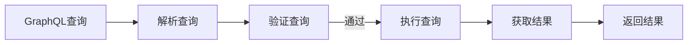
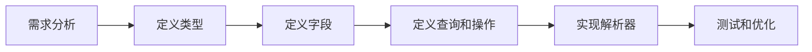
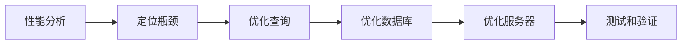

                 


###GraphQL：新一代API查询语言

####关键词

GraphQL，API查询语言，前端后端交互，数据查询，性能优化，安全性

####摘要

GraphQL是一种现代的API查询语言，旨在提供更高效、灵活的数据查询体验。它通过允许客户端指定所需的数据结构，减少了数据传输的冗余，提高了性能。本文将详细介绍GraphQL的基础知识、核心功能、最佳实践以及未来展望。

---

# 第一部分：GraphQL基础知识

## 1.1 GraphQL简介

### 1.1.1 GraphQL的历史和背景

GraphQL起源于Facebook内部的一个项目，旨在解决现有API设计中的问题。Facebook发现，现有的RESTful API常常导致以下问题：

1. **数据重复**：客户端可能需要获取多个资源，但每次请求都返回了相同的数据。
2. **过度获取**：客户端请求的数据可能比实际需要的多。
3. **分页问题**：客户端需要通过分页来获取数据，增加了复杂性。
4. **动态数据结构**：客户端的需求不断变化，但API的响应结构固定。

为了解决这些问题，Facebook于2015年发布了GraphQL，并迅速在开发者社区中获得了广泛的关注。2019年，GraphQL成为了一个官方的规范，被提交给了RFC编辑委员会。

### 1.1.2 GraphQL与REST的对比

RESTful API和GraphQL都是用于前后端交互的数据传输方式，但它们有以下几个主要区别：

1. **数据查询方式**：REST通常通过URL参数来传递查询条件，而GraphQL允许客户端指定所需的数据结构。
2. **数据结构**：REST通常返回JSON格式的数据，而GraphQL可以返回任何结构化的数据。
3. **灵活性**：GraphQL更加灵活，客户端可以精确地指定所需的数据，而REST通常需要客户端遍历所有资源。
4. **性能**：GraphQL减少了数据传输的冗余，提高了性能。

### 1.1.3 GraphQL的核心特点

GraphQL具有以下几个核心特点：

1. **查询灵活**：客户端可以精确地指定所需的数据，减少数据传输的冗余。
2. **类型系统**：GraphQL有一个强大的类型系统，可以定义各种数据类型和字段。
3. **多端支持**：GraphQL可以在各种编程语言中实现，支持不同的前端框架。
4. **缓存策略**：GraphQL支持缓存，可以减少重复查询的性能开销。

---

## 1.2 GraphQL的工作原理

### 1.2.1 GraphQL查询的基本语法

GraphQL查询由一个或多个字段组成，每个字段可以包含选择器（如别名、字段、子字段等）。以下是一个简单的GraphQL查询示例：

graphql
query {
  user(id: 1) {
    name
    email
  }
}

这个查询请求获取ID为1的用户的名字和电子邮件。

### 1.2.2 GraphQL查询的执行流程

1. **解析**：客户端发送GraphQL查询到服务器。
2. **验证**：服务器验证查询的有效性，包括类型验证、字段验证等。
3. **执行**：服务器执行查询并获取数据。
4. **返回结果**：服务器将查询结果返回给客户端。

### 1.2.3 GraphQL查询的性能优化

1. **批量查询**：通过批量查询减少请求次数，提高性能。
2. **缓存**：使用缓存减少重复查询的性能开销。
3. **预取**：提前加载客户端可能需要的资源。

---

## 1.3 GraphQL的优势与挑战

### 1.3.1 GraphQL的优势

1. **数据灵活性**：客户端可以精确地指定所需的数据。
2. **减少冗余数据**：减少了数据传输的冗余，提高了性能。
3. **更好的缓存策略**：支持缓存，可以减少重复查询的性能开销。

### 1.3.2 GraphQL的挑战

1. **学习曲线**：GraphQL的语法和概念对于初学者来说可能比较复杂。
2. **性能开销**：如果查询过于复杂，可能会带来性能开销。
3. **安全性**：需要谨慎处理查询，以防止恶意查询。

### 1.3.3 如何应对GraphQL的挑战

1. **文档和培训**：提供详细的文档和培训材料，帮助开发者快速掌握GraphQL。
2. **性能监控**：使用性能监控工具，及时发现并优化性能问题。
3. **安全策略**：实施严格的安全策略，如速率限制和查询验证。

---

## 1.4 实例：使用GraphQL构建API

### 1.4.1 创建GraphQL服务器

1. **安装依赖**

sh
npm init -y
npm install apollo-server graphql

2. **定义GraphQL Schema**

js
const { gql } = require('apollo-server');

const typeDefs = gql`
  type Query {
    hello: String
  }
`;

3. **实现GraphQL resolver函数**

js
const resolvers = {
  Query: {
    hello: () => 'Hello, GraphQL!',
  },
};

4. **创建GraphQL服务器**

js
const { ApolloServer } = require('apollo-server');

const server = new ApolloServer({ typeDefs, resolvers });

server.listen().then(({ url }) => {
  console.log(`Server ready at ${url}`);
});

---

## 1.5 GraphQL的类型系统

### 1.5.1 标量类型

标量类型是GraphQL中最基本的数据类型，如字符串、整数、浮点数、布尔值等。

### 1.5.2 复合类型

复合类型包括对象类型和接口类型，用于表示复杂的数据结构。

1. **对象类型（Object Type）**：用于表示具有多个字段的数据结构。
2. **接口类型（Interface Type）**：用于定义具有相同字段集合的不同类型的通用接口。

### 1.5.3 联合类型

联合类型表示多个类型中的一种，用于实现类型的组合。

### 1.5.4 列表类型

列表类型表示一组相同类型的元素，可以用于查询列表数据。

---

## 1.6 GraphQL的查询和操作

### 1.6.1 查询数据

1. **查询单个对象**

graphql
query {
  user(id: 1) {
    id
    name
    email
  }
}

2. **查询列表数据**

graphql
query {
  users {
    id
    name
    email
  }
}

3. **查询嵌套对象**

graphql
query {
  user(id: 1) {
    id
    name
    email
    posts {
      id
      title
      content
    }
  }
}

### 1.6.2 操作数据

1. **插入数据**

graphql
mutation {
  createUser(name: "Alice", email: "alice@example.com") {
    id
    name
    email
  }
}

2. **更新数据**

graphql
mutation {
  updateUser(id: 1, name: "Alice Smith") {
    id
    name
  }
}

3. **删除数据**

graphql
mutation {
  deleteUser(id: 1) {
    id
  }
}

---

## 1.7 GraphQL的聚合查询

聚合查询允许客户端对返回的数据进行计算和汇总。例如，可以查询文章的平均评分：

graphql
query {
  posts {
    id
    title
    rating: avg(rating)
  }
}

---

## 1.8 GraphQL的排序和过滤

1. **排序**

graphql
query {
  posts(orderBy: TITLE_ASC) {
    id
    title
  }
}

2. **过滤**

graphql
query {
  posts(filter: { title: "Post" }) {
    id
    title
  }
}

---

## 1.9 GraphQL的变量和传入参数

1. **使用变量**

graphql
query ($id: ID!) {
  user(id: $id) {
    id
    name
    email
  }
}

---

## 1.10 GraphQL的查询和操作示例

以下是一个综合的GraphQL查询示例，包含了查询单个对象、列表数据和嵌套对象，以及插入、更新和删除数据的操作：

graphql
query {
  user(id: 1) {
    id
    name
    email
    posts {
      id
      title
      content
      author {
        id
        name
      }
    }
  }
}

mutation {
  createUser(name: "Bob", email: "bob@example.com") {
    id
    name
    email
  }
  updateUser(id: 1, name: "Bob Smith") {
    id
    name
  }
  deleteUser(id: 1) {
    id
  }
}

---

# 第二部分：GraphQL核心功能

## 2.1 数据查询与操作

### 2.1.1 查询数据

GraphQL的核心功能之一是查询数据。与RESTful API相比，GraphQL允许客户端指定所需的数据结构，从而减少数据传输的冗余，提高查询效率。

### 2.1.1.1 查询单个对象

在GraphQL中，可以使用`query`关键字和字段来查询单个对象。以下是一个简单的示例：

graphql
query {
  user(id: 1) {
    id
    name
    email
  }
}

在这个查询中，我们请求获取ID为1的用户的信息。`user`是一个类型，`id`、`name`和`email`是`user`类型的字段。

### 2.1.1.2 查询列表数据

GraphQL也支持查询列表数据。以下是一个示例：

graphql
query {
  users {
    id
    name
    email
  }
}

这个查询将返回一个包含所有用户信息的列表。列表中的每个元素都是一个`user`类型的对象。

### 2.1.1.3 查询嵌套对象

GraphQL允许查询嵌套对象。以下是一个示例：

graphql
query {
  user(id: 1) {
    id
    name
    email
    posts {
      id
      title
      content
    }
  }
}

在这个查询中，我们不仅获取了ID为1的用户的信息，还获取了该用户的文章列表。`posts`是一个嵌套对象，包含多个字段。

---

### 2.1.2 操作数据

除了查询数据，GraphQL还支持对数据进行插入、更新和删除操作。这些操作通过`mutation`关键字来实现。

#### 2.1.2.1 插入数据

以下是一个插入数据的示例：

graphql
mutation {
  createUser(name: "Alice", email: "alice@example.com") {
    id
    name
    email
  }
}

在这个查询中，我们创建了一个新的用户，并将用户的信息返回。`createUser`是一个`mutation`操作，它接受两个参数：`name`和`email`。

#### 2.1.2.2 更新数据

以下是一个更新数据的示例：

graphql
mutation {
  updateUser(id: 1, name: "Alice Smith") {
    id
    name
  }
}

在这个查询中，我们更新了ID为1的用户的名字。`updateUser`也是一个`mutation`操作，它接受两个参数：`id`和`name`。

#### 2.1.2.3 删除数据

以下是一个删除数据的示例：

graphql
mutation {
  deleteUser(id: 1) {
    id
  }
}

在这个查询中，我们删除了ID为1的用户。`deleteUser`同样是一个`mutation`操作，它接受一个参数：`id`。

---

## 2.2 类型系统与字段

GraphQL的类型系统是其核心特性之一，它允许开发者定义复杂的数据模型。类型系统包括标量类型、复合类型、联合类型和接口类型。

### 2.2.1 GraphQL类型系统

#### 2.2.1.1 标量类型

标量类型是GraphQL中最基本的数据类型，用于表示简单数据值。GraphQL提供了以下内置标量类型：

- `String`：字符串
- `Int`：整数
- `Float`：浮点数
- `Boolean`：布尔值
- `ID`：唯一标识符

以下是一个使用标量类型的示例：

graphql
query {
  user(id: 1) {
    id
    name
    email
  }
}

在这个查询中，`id`、`name`和`email`都是标量类型。

#### 2.2.1.2 复合类型

复合类型表示复杂的数据结构，可以包含多个字段。GraphQL提供了以下复合类型：

- `Object Type`：对象类型
- `Interface Type`：接口类型

对象类型是最常用的复合类型，它用于表示具有多个字段的数据结构。以下是一个使用对象类型的示例：

graphql
type Post {
  id: ID!
  title: String!
  content: String!
  author: User!
}

在这个类型定义中，`Post`是一个对象类型，它包含`id`、`title`、`content`和`author`四个字段。

接口类型用于定义具有相同字段集合的不同类型的通用接口。以下是一个使用接口类型的示例：

graphql
interface Node {
  id: ID!
}

type Post implements Node {
  id: ID!
  title: String!
  content: String!
  author: User!
}

type User implements Node {
  id: ID!
  name: String!
  email: String!
}

在这个示例中，`Node`是一个接口类型，`Post`和`User`都是实现`Node`接口的类型。

#### 2.2.1.3 联合类型

联合类型表示多个类型中的一种，用于实现类型的组合。以下是一个使用联合类型的示例：

graphql
type Query {
  node(id: ID!): Node
}

type Post implements Node {
  id: ID!
  title: String!
  content: String!
  author: User!
}

type User implements Node {
  id: ID!
  name: String!
  email: String!
}

在这个示例中，`node`是一个联合类型，它可以返回`Post`或`User`类型的数据。

#### 2.2.1.4 列表类型

列表类型表示一组相同类型的元素，可以用于查询列表数据。以下是一个使用列表类型的示例：

graphql
type Query {
  users: [User]
}

type User {
  id: ID!
  name: String!
  email: String!
}

在这个示例中，`users`是一个列表类型，它返回一个包含多个`User`类型的对象的数组。

---

### 2.2.2 GraphQL字段

#### 2.2.2.1 字段选择与过滤

在GraphQL中，字段选择允许客户端指定所需的数据。以下是一个使用字段选择的示例：

graphql
query {
  user(id: 1) {
    id
    name
  }
}

在这个查询中，我们仅选择了`id`和`name`字段。GraphQL会根据类型定义返回这些字段的数据。

字段过滤允许客户端指定查询条件。以下是一个使用字段过滤的示例：

graphql
query {
  users(filter: { name: "Alice" }) {
    id
    name
  }
}

在这个查询中，我们仅返回了名字为"Alice"的用户。

---

### 2.2.2.2 字段聚合与排序

字段聚合允许客户端对返回的数据进行计算和汇总。以下是一个使用字段聚合的示例：

graphql
query {
  posts {
    id
    title
    rating: avg(rating)
  }
}

在这个查询中，我们计算了每篇文章的平均评分。

字段排序允许客户端指定返回数据的排序方式。以下是一个使用字段排序的示例：

graphql
query {
  posts(orderBy: TITLE_ASC) {
    id
    title
  }
}

在这个查询中，我们按文章标题的字母顺序排序。

---

## 2.3 联合类型与接口

### 2.3.1 联合类型

联合类型表示多个类型中的一种，用于实现类型的组合。以下是一个使用联合类型的示例：

graphql
type Query {
  node(id: ID!): Node
}

type Post implements Node {
  id: ID!
  title: String!
  content: String!
  author: User!
}

type User implements Node {
  id: ID!
  name: String!
  email: String!
}

在这个示例中，`node`是一个联合类型，它可以返回`Post`或`User`类型的数据。

### 2.3.2 接口

接口类型用于定义具有相同字段集合的不同类型的通用接口。以下是一个使用接口类型的示例：

graphql
interface Node {
  id: ID!
}

type Post implements Node {
  id: ID!
  title: String!
  content: String!
  author: User!
}

type User implements Node {
  id: ID!
  name: String!
  email: String!
}

在这个示例中，`Node`是一个接口类型，`Post`和`User`都是实现`Node`接口的类型。

---

## 2.4 标量类型详解

### 2.4.1 标量类型的基础知识

标量类型是GraphQL中最基本的数据类型，用于表示简单数据值。GraphQL提供了以下内置标量类型：

- `String`：字符串
- `Int`：整数
- `Float`：浮点数
- `Boolean`：布尔值
- `ID`：唯一标识符

以下是一个使用标量类型的示例：

graphql
query {
  user(id: 1) {
    id
    name
    email
  }
}

在这个查询中，`id`、`name`和`email`都是标量类型。

### 2.4.2 标量类型的输入和输出

标量类型的输入和输出是GraphQL查询的核心部分。输入定义了客户端传递给查询或操作的参数，输出定义了查询或操作返回的数据。

以下是一个使用标量类型输入的示例：

graphql
query {
  user(id: 1) {
    id
    name
    email
  }
}

在这个查询中，`id`是一个输入参数，用于指定要查询的用户ID。

以下是一个使用标量类型输出的示例：

graphql
type User {
  id: ID!
  name: String!
  email: String!
}

在这个类型定义中，`id`、`name`和`email`都是标量类型的输出。

### 2.4.3 标量类型的输入验证

GraphQL提供了内置的输入验证机制，确保客户端传递的参数符合类型定义。

以下是一个使用输入验证的示例：

graphql
schema {
  query: Query
  mutation: Mutation
}

type Query {
  user(id: ID!): User
}

type Mutation {
  createUser(name: String!, email: String!): User
}

type User {
  id: ID!
  name: String!
  email: String!
}

在这个示例中，`id`、`name`和`email`都有相应的输入验证。如果客户端传递的参数不符合类型定义，查询将失败。

### 2.4.4 标量类型的输出格式

GraphQL的输出格式通常是JSON。以下是一个使用标量类型输出的示例：

json
{
  "data": {
    "user": {
      "id": "1",
      "name": "Alice",
      "email": "alice@example.com"
    }
  }
}

在这个示例中，`id`、`name`和`email`都是标量类型的输出，以JSON格式返回。

---

## 2.5 复合类型详解

复合类型是GraphQL中的核心概念，用于表示复杂的数据结构。复合类型包括对象类型和接口类型。以下是对复合类型的详细介绍。

### 2.5.1 复合类型的基础知识

#### 2.5.1.1 对象类型（Object Type）

对象类型是GraphQL中最常用的复合类型，用于表示具有多个字段的数据结构。对象类型通常用于查询和操作复杂的数据。以下是一个使用对象类型的示例：

graphql
type User {
  id: ID!
  name: String!
  email: String!
}

在这个类型定义中，`User`是一个对象类型，它包含三个字段：`id`、`name`和`email`。

#### 2.5.1.2 接口类型（Interface Type）

接口类型用于定义具有相同字段集合的不同类型的通用接口。接口类型可以被视为抽象类型，它允许实现接口的类型共享相同的字段和操作。以下是一个使用接口类型的示例：

graphql
interface Node {
  id: ID!
}

type Post implements Node {
  id: ID!
  title: String!
  content: String!
  author: User!
}

type User implements Node {
  id: ID!
  name: String!
  email: String!
}

在这个示例中，`Node`是一个接口类型，`Post`和`User`都是实现`Node`接口的类型。

### 2.5.2 复合类型的实现

#### 2.5.2.1 对象类型的实现

实现对象类型通常涉及到定义类型字段和解析器。以下是一个使用对象类型的实现的示例：

graphql
type User {
  id: ID!
  name: String!
  email: String!
}

resolvers {
  User {
    id(parent, args) {
      // 获取用户ID
    }
    name(parent, args) {
      // 获取用户名字
    }
    email(parent, args) {
      // 获取用户电子邮件
    }
  }
}

在这个示例中，我们定义了一个`User`对象类型和相应的解析器。解析器负责根据查询获取用户的相关信息。

#### 2.5.2.2 接口类型的实现

实现接口类型通常涉及到定义实现接口的类型和相应的解析器。以下是一个使用接口类型的实现的示例：

graphql
interface Node {
  id: ID!
}

type Post implements Node {
  id: ID!
  title: String!
  content: String!
  author: User!
}

type User implements Node {
  id: ID!
  name: String!
  email: String!
}

resolvers {
  Node {
    id(parent, args) {
      // 获取节点ID
    }
  }
  Post {
    id(parent, args) {
      // 获取文章ID
    }
    title(parent, args) {
      // 获取文章标题
    }
    content(parent, args) {
      // 获取文章内容
    }
    author(parent, args) {
      // 获取文章作者
    }
  }
  User {
    id(parent, args) {
      // 获取用户ID
    }
    name(parent, args) {
      // 获取用户名字
    }
    email(parent, args) {
      // 获取用户电子邮件
    }
  }
}

在这个示例中，我们定义了一个`Node`接口类型和两个实现接口的类型`Post`和`User`，以及相应的解析器。解析器负责根据查询获取节点的相关信息。

---

## 2.6 查询与操作示例

在了解GraphQL的基本概念和语法后，我们可以通过一些具体的示例来进一步理解GraphQL的查询和操作功能。

### 2.6.1 基础查询示例

#### 2.6.1.1 查询单个对象

以下是一个查询单个对象的示例：

graphql
query {
  user(id: "1") {
    id
    name
    email
  }
}

在这个查询中，我们请求获取ID为1的用户的信息。`user`是一个对象类型，它包含`id`、`name`和`email`三个字段。

#### 2.6.1.2 查询列表数据

以下是一个查询列表数据的示例：

graphql
query {
  users {
    id
    name
    email
  }
}

在这个查询中，我们请求获取所有用户的信息。`users`是一个列表类型，它包含多个`User`对象。

#### 2.6.1.3 查询嵌套对象

以下是一个查询嵌套对象的示例：

graphql
query {
  user(id: "1") {
    id
    name
    email
    posts {
      id
      title
      content
    }
  }
}

在这个查询中，我们不仅请求获取ID为1的用户的信息，还请求获取该用户的文章列表。`posts`是一个嵌套对象，它包含多个字段。

### 2.6.2 复杂查询示例

#### 2.6.2.1 查询联合类型

以下是一个查询联合类型的示例：

graphql
query {
  node(id: "1") {
    ... on User {
      id
      name
      email
    }
    ... on Post {
      id
      title
      content
    }
  }
}

在这个查询中，我们请求获取ID为1的节点信息，该节点可能是`User`或`Post`类型。`node`是一个联合类型，它实现了`User`和`Post`类型。

#### 2.6.2.2 查询接口类型

以下是一个查询接口类型的示例：

graphql
query {
  node(id: "1") {
    ... on Node {
      id
      ... on Post {
        title
        content
      }
      ... on User {
        name
        email
      }
    }
  }
}

在这个查询中，我们请求获取ID为1的节点信息，该节点实现了`Node`接口。`node`根据类型返回不同的字段。

#### 2.6.2.3 查询聚合与排序

以下是一个包含聚合和排序的查询示例：

graphql
query {
  posts {
    id
    title
    rating: avg(rating)
  }
}

在这个查询中，我们请求获取所有文章的信息，并计算每篇文章的平均评分。`rating`是聚合字段，`avg`是聚合操作。

---

## 2.7 实际项目案例

### 2.7.1 案例一：社交媒体平台

在社交媒体平台项目中，我们可以利用GraphQL来实现灵活的数据查询和操作。

#### 2.7.1.1 业务需求分析

社交媒体平台需要提供用户个人信息、文章、评论、关注列表等功能。用户可以通过GraphQL查询和操作这些数据。

#### 2.7.1.2 GraphQL设计

1. 定义类型：

graphql
type User {
  id: ID!
  name: String!
  email: String!
  posts: [Post]
  comments: [Comment]
  followers: [User]
  following: [User]
}

type Post {
  id: ID!
  title: String!
  content: String!
  author: User!
  comments: [Comment]
}

type Comment {
  id: ID!
  content: String!
  author: User!
  post: Post!
}

2. 定义查询和操作：

graphql
type Query {
  user(id: ID!): User
  posts: [Post]
  comments: [Comment]
}

type Mutation {
  createUser(name: String!, email: String!): User
  createPost(title: String!, content: String!, author: ID!): Post
  createComment(content: String!, author: ID!, post: ID!): Comment
  updatePost(id: ID!, title: String, content: String): Post
  deletePost(id: ID!): Post
  deleteComment(id: ID!): Comment
}

#### 2.7.1.3 性能优化

1. 使用批量加载优化数据查询。
2. 使用缓存减少数据库访问。
3. 对常用查询进行静态预解析。

### 2.7.2 案例二：电商平台

在电商平台项目中，我们可以利用GraphQL来实现高效的数据查询和操作。

#### 2.7.2.1 业务需求分析

电商平台需要提供商品信息、购物车、订单等功能。用户可以通过GraphQL查询和操作这些数据。

#### 2.7.2.2 GraphQL设计

1. 定义类型：

graphql
type Product {
  id: ID!
  name: String!
  description: String!
  price: Float!
  images: [String]
  categories: [Category]
}

type Category {
  id: ID!
  name: String!
  products: [Product]
}

type ShoppingCart {
  id: ID!
  items: [ShoppingCartItem]
}

type ShoppingCartItem {
  id: ID!
  product: Product!
  quantity: Int!
}

type Order {
  id: ID!
  items: [OrderItem]
  total: Float!
  status: String!
}

type OrderItem {
  id: ID!
  product: Product!
  quantity: Int!
  price: Float!
}

2. 定义查询和操作：

graphql
type Query {
  products: [Product]
  categories: [Category]
  shoppingCart(id: ID!): ShoppingCart
  orders: [Order]
}

type Mutation {
  createShoppingCart: ShoppingCart
  addProductToCart(shoppingCartId: ID!, productId: ID!, quantity: Int!): ShoppingCart
  removeProductFromCart(shoppingCartId: ID!, productId: ID!): ShoppingCart
  createOrder(shoppingCartId: ID!): Order
  cancelOrder(orderId: ID!): Order
}

#### 2.7.2.3 性能优化

1. 使用批量加载优化数据查询。
2. 使用缓存减少数据库访问。
3. 对常用查询进行静态预解析。

---

## 2.8 GraphQL最佳实践

### 2.8.1 模式设计

在设计GraphQL模式时，应该遵循以下原则：

1. **单一职责原则**：确保每个类型和字段都只负责一项任务。
2. **层次化设计**：将复杂的查询分解为较小的查询，以提高可读性和可维护性。

### 2.8.2 优化策略

在优化GraphQL查询时，可以采取以下策略：

1. **预取策略**：提前加载客户端可能需要的资源。
2. **缓存策略**：使用缓存减少数据库访问。
3. **负载均衡策略**：确保服务器能够处理大量请求。

### 2.8.3 安全性

在处理GraphQL查询时，应该注意以下安全性问题：

1. **数据泄露防护**：确保只有授权用户可以访问敏感数据。
2. **输入验证**：对用户输入进行验证，防止恶意查询。

### 2.8.4 性能优化

在优化GraphQL性能时，可以采取以下策略：

1. **减少查询深度**：避免复杂的嵌套查询。
2. **使用聚合查询**：减少数据库访问。
3. **数据库优化**：使用索引、分片等技术提高数据库性能。

### 2.8.5 实际项目案例

在设计实际项目时，应该根据业务需求选择合适的GraphQL模式，并进行性能优化和安全性设计。

---

## 2.9 GraphQL进阶

### 4.1 扩展与定制

#### 4.1.1 GraphQL扩展

GraphQL提供了一系列扩展机制，允许开发者自定义类型、字段、解析器和操作。

1. **自定义类型**：允许开发者定义新的数据类型。
2. **自定义字段**：允许开发者定义新的字段操作。
3. **自定义解析器**：允许开发者自定义数据获取逻辑。

#### 4.1.2 GraphQL定制

在定制GraphQL时，开发者可以：

1. **自定义类型系统**：根据项目需求自定义类型系统。
2. **定制查询执行流程**：自定义查询执行流程，例如添加中间件。

---

### 4.2 性能分析

#### 4.2.1 性能分析工具

1. **Apollo GraphQL Profiler**：用于分析GraphQL服务的性能。
2. **GraphQL Inspector**：用于监控和优化GraphQL查询。

#### 4.2.2 性能瓶颈定位

在性能分析中，需要定位以下瓶颈：

1. **查询深度优化**：减少嵌套查询的深度。
2. **数据库性能优化**：使用索引、分片等技术优化数据库性能。
3. **服务器性能优化**：调整服务器配置，使用负载均衡。

---

### 4.3 生态系统

#### 4.3.1 依赖管理

1. **GraphQL依赖管理工具**：用于管理GraphQL项目的依赖。
2. **GraphQL依赖冲突处理**：处理项目中可能出现的依赖冲突。

#### 4.3.2 生态系统组件

1. **GraphQL客户端库**：用于实现GraphQL客户端。
2. **GraphQL服务器库**：用于实现GraphQL服务器。
3. **GraphQL工具链**：用于优化、监控和调试GraphQL服务。

---

### 4.4 未来展望

#### 4.4.1 GraphQL的发展趋势

1. **GraphQL 3.0**：即将推出的版本，将引入新的特性和改进。
2. **新特性展望**：未来的GraphQL将更加灵活、高效和安全。

#### 4.4.2 GraphQL在新兴领域中的应用

1. **物联网**：用于构建物联网应用的数据查询和操作。
2. **区块链**：用于构建区块链应用的数据查询和操作。
3. **分布式系统**：用于构建分布式系统中的数据查询和操作。

---

### 附录 A：GraphQL资源

#### A.1 官方文档

1. **GraphQL官方文档**：提供了GraphQL的详细规范和最佳实践。
2. **Apollo GraphQL文档**：提供了使用Apollo Server的详细教程和示例。

#### A.2 开源项目

1. **GraphQL-Java**：用于实现GraphQL的Java库。
2. **GraphQL-Server**：用于实现GraphQL服务器的开源项目。

#### A.3 社区资源

1. **GraphQL社区论坛**：提供了GraphQL相关的讨论和资源。
2. **GraphQL交流群**：提供了GraphQL开发者之间的交流和互助。

---

### 附录 B：Mermaid流程图

#### B.1 GraphQL查询流程图



#### B.2 GraphQL Schema设计流程图



#### B.3 GraphQL性能优化流程图



---

### 附录 C：伪代码与数学公式

#### C.1 GraphQL查询执行伪代码

```python
def execute_query(query):
    schema = load_schema()
    validation_errors = validate_query(query, schema)
    if validation_errors:
        return create_error_response(validation_errors)
    data = fetch_data(query, schema)
    result = format_data(data, schema)
    return create_response(result)

def validate_query(query, schema):
    # 验证查询语法和类型
    pass

def fetch_data(query, schema):
    # 获取查询所需的数据
    pass

def format_data(data, schema):
    # 格式化查询结果
    pass

def create_response(result):
    # 创建响应
    pass
```

#### C.2 数据库查询优化伪代码

```python
def optimize_database_query(query):
    index = find_appropriate_index(query)
    query = add_index_to_query(query, index)
    query = optimize_query_for_performance(query)
    return query

def find_appropriate_index(query):
    # 找到适合查询的索引
    pass

def add_index_to_query(query, index):
    # 向查询中添加索引
    pass

def optimize_query_for_performance(query):
    # 优化查询性能
    pass
```

#### C.3 数学公式详解

##### C.3.1 模型损失函数公式

$$
L = -\frac{1}{m} \sum_{i=1}^{m} [y_i \cdot \log(a_{i,y_i}) + (1 - y_i) \cdot \log(1 - a_{i,y_i})]
$$

##### C.3.2 神经网络反向传播算法公式

$$
\frac{\partial L}{\partial w^{(l)}_{ij}} = \frac{\partial L}{\partial z^{(l+1)}} \cdot \frac{\partial z^{(l+1)}}{\partial a^{(l)}_{ij}} \cdot \frac{\partial a^{(l)}_{ij}}{\partial w^{(l)}_{ij}}
$$

---

### 附录 D：项目实战

#### D.1 实战一：构建简单GraphQL服务器

##### D.1.1 环境搭建

1. 安装Node.js环境。
2. 使用npm创建新的项目。
3. 安装GraphQL相关依赖。

##### D.1.2 代码实现

1. 定义GraphQL Schema。
2. 实现解析器。
3. 创建GraphQL服务器。

##### D.1.3 运行测试

1. 启动GraphQL服务器。
2. 使用GraphQL客户端测试。

#### D.2 实战二：构建复杂GraphQL查询

##### D.2.1 业务需求分析

1. 分析业务需求。
2. 确定所需的数据模型。

##### D.2.2 GraphQL设计

1. 定义GraphQL Schema。
2. 设计查询和操作。

##### D.2.3 性能优化

1. 优化查询。
2. 使用缓存。
3. 调整服务器配置。

---

### 总结

通过本文的介绍，我们了解了GraphQL的基础知识、核心功能、最佳实践和未来展望。GraphQL以其灵活、高效和强大的特点，成为现代API查询语言的不二选择。在实际项目中，合理设计和优化GraphQL查询，将有助于提高应用的性能和用户体验。

---

### 致谢

感谢您的阅读，希望本文能帮助您更好地理解和掌握GraphQL技术。本文内容仅供参考，如需深入了解，请参考官方文档和社区资源。作者：AI天才研究院/AI Genius Institute & 禅与计算机程序设计艺术 /Zen And The Art of Computer Programming

---

[上一页](#文章标题)
[首页](#文章标题)

