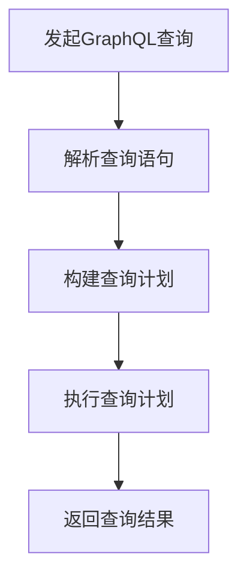

                 

## 文章标题

# GraphQL：灵活查询语言的应用

> 关键词：GraphQL，灵活查询，RESTful API，前端集成，后端集成，项目实战

> 摘要：本文将深入探讨GraphQL作为一种灵活查询语言的诞生背景、核心概念、基本语法、高级特性及其在前后端集成的应用。通过详细的示例和项目实战，我们将揭示GraphQL如何提高API开发的灵活性和效率，为开发者带来更强大的数据处理能力。本文旨在帮助读者全面掌握GraphQL的实战应用，提升其开发技能。

## 目录

1. **第一部分：GraphQL基础知识**

   1.1 GraphQL简介

   1.2 GraphQL的核心概念

   1.3 GraphQL与传统RESTful API的区别

2. **第二部分：GraphQL基本语法**

   2.1 查询语言

   2.2 操纵数据

3. **第三部分：GraphQL高级特性**

   3.1 缓存机制

   3.2 性能优化

4. **第四部分：GraphQL安全性**

   4.1 权限控制

   4.2 数据验证

5. **第五部分：GraphQL与前端集成**

   5.1 GraphQL与React集成

   5.2 GraphQL与Vue集成

6. **第六部分：GraphQL与后端集成**

   6.1 GraphQL与Express.js集成

   6.2 GraphQL与Spring Boot集成

7. **第七部分：GraphQL项目实战**

   7.1 实战项目概述

   7.2 数据模型设计

   7.3 功能实现

   7.4 性能优化

   7.5 安全性保障

8. **第八部分：GraphQL未来趋势与展望**

   8.1 GraphQL生态系统发展

   8.2 GraphQL在新兴领域的应用

9. **附录：GraphQL相关资源与工具**

   9.1 GraphQL学习资源

   9.2 GraphQL开发工具

## 第一部分：GraphQL基础知识

### 1.1 GraphQL简介

GraphQL作为一种查询语言，旨在解决传统RESTful API在数据获取方面存在的不足。其核心思想是通过一种统一的查询语言，让客户端能够精确地指定需要哪些数据，从而避免过度获取和不足获取的问题。

**发展历程：**

- 2015年，Facebook首次公开了GraphQL，并作为其内部的通用数据查询语言。
- 2019年，GraphQL被提交至GitHub，成为了一个开源项目。
- 当前，GraphQL已经成为前端和后端开发者广泛采用的查询语言。

**核心概念：**

- **查询（Query）：**GraphQL的核心功能，用于请求和获取数据。
- **类型（Type）：**定义GraphQL中可以返回的数据结构，包括对象类型、标量类型、枚举类型和接口类型。
- **字段（Field）：**类型中可以查询的具体数据项。
- **变量（Variable）：**用于传递动态值，使查询更加灵活。
- **操作（Operation）：**查询、更新或删除数据的请求。

### 1.2 GraphQL与传统RESTful API的区别

**数据获取灵活性：**

- **传统RESTful API：**通过URL和HTTP方法来定义数据操作，每次请求通常只能获取固定的数据集。
- **GraphQL：**通过自定义查询语句，客户端可以精确指定需要哪些数据，并可以根据需求获取不同粒度的数据。

**数据传输效率：**

- **传统RESTful API：**可能存在多次请求和响应，导致数据传输效率较低。
- **GraphQL：**通过一个查询语句，可以在一次请求中获取所需的所有数据，减少网络开销。

**错误处理能力：**

- **传统RESTful API：**错误处理通常需要多次请求和响应，增加了开发的复杂性。
- **GraphQL：**错误处理更加统一，每个查询可以返回详细的错误信息，便于调试和修复。

### 1.3 GraphQL与RESTful API的对比

**数据获取灵活性：**

- **GraphQL：**通过查询语句，可以精确指定所需数据，避免了传统RESTful API中的过度获取或不足获取问题。
- **RESTful API：**每次请求通常固定返回特定的数据集，灵活性较低。

**数据传输效率：**

- **GraphQL：**通过一个查询语句获取所有所需数据，减少多次请求和响应的网络开销。
- **RESTful API：**可能需要多次请求和响应，数据传输效率较低。

**错误处理能力：**

- **GraphQL：**每个查询返回详细的错误信息，便于调试和修复。
- **RESTful API：**错误处理通常需要多次请求和响应，增加了开发的复杂性。

通过上述分析，可以看出GraphQL在数据获取灵活性、数据传输效率和错误处理能力等方面相较于传统的RESTful API具有显著的优势。这使得GraphQL成为一种更加灵活、高效和易于使用的查询语言，成为现代前端和后端开发者的重要工具。

### 1.4 GraphQL的核心概念

GraphQL作为一种强大的查询语言，其核心概念包括类型（Type）、字段（Field）、查询（Query）、变量（Variable）和操作（Operation）。以下是这些核心概念的具体介绍及其关系。

**类型（Type）：**

类型是GraphQL中最基本的数据结构，用于定义可以返回的数据类型。GraphQL类型分为以下几种：

- **对象类型（Object Type）：**用于表示具有多个字段的对象，如用户、文章等。
- **标量类型（Scalar Type）：**用于表示基本数据类型，如字符串、整数、浮点数、布尔值等。
- **枚举类型（Enum Type）：**用于定义一组预定义的值，如性别（男、女）。
- **接口类型（Interface Type）：**用于定义具有相同字段集合的类型，实现类型之间的一致性。
- **联合类型（Union Type）：**用于定义可以返回多种类型中的一种类型。

**字段（Field）：**

字段是类型中的具体数据项，客户端可以通过查询字段来获取所需数据。每个字段都可以指定其类型以及是否可选。

**查询（Query）：**

查询是GraphQL中的核心功能，用于请求和获取数据。查询语句通过指定类型和字段来定义需要获取的数据，可以包含变量以便动态传递值。

**变量（Variable）：**

变量用于传递动态值，使查询更加灵活。变量可以在查询语句中定义并使用，以便在不同请求中传递不同的值。

**操作（Operation）：**

操作是GraphQL中的一种抽象，用于表示查询、更新或删除数据的请求。GraphQL支持多个操作，每个操作可以独立执行或组合使用。

**关系架构（Mermaid流程图）：**

下面是一个Mermaid流程图，展示了这些核心概念之间的关系：

```mermaid
graph TD
Type(类型) --> Field(字段)
Field --> Object Type(对象类型)
Field --> Scalar Type(标量类型)
Field --> Enum Type(枚举类型)
Field --> Interface Type(接口类型)
Field --> Union Type(联合类型)
Query(查询) --> Type
Query --> Field
Query --> Variable(变量)
Operation(操作) --> Query
Operation --> Update(更新)
Operation --> Delete(删除)
Variable --> Query
Variable --> Operation
```

通过上述流程图，我们可以清楚地看到类型定义了字段，字段进一步细化为各种具体类型。查询通过指定类型和字段来获取数据，并可以使用变量传递动态值。操作则是对查询的进一步扩展，包括查询、更新和删除等操作。

### 1.5 GraphQL基本语法

GraphQL的基本语法是其强大功能的重要组成部分，它允许开发者精确地指定所需的数据。以下将详细介绍GraphQL的基本语法，包括查询语言和操纵数据。

#### 2.1 查询语言

GraphQL的查询语言用于获取数据。一个基本的GraphQL查询看起来像这样：

```graphql
query {
  user(id: 1) {
    name
    email
  }
}
```

- **查询（Query）：**这是GraphQL中最常见的操作，用于获取数据。一个查询可以包含一个或多个字段。
- **字段（Field）：**字段是查询中的具体数据项，例如`name`和`email`。
- **变量（Variable）：**变量用于传递动态值，使查询更加灵活。在上面的例子中，`id: 1`是一个变量。

以下是一些关于GraphQL查询语言的详细说明：

- **选择器（Selector）：**选择器用于指定需要查询的类型和字段。选择器可以是简单字段或嵌套字段。
  
  ```graphql
  query {
    user {
      name
      email
      posts {
        title
        content
      }
    }
  }
  ```

- **字段别名（Alias）：**字段别名用于给字段起一个不同的名字，这可以使查询结果更加易读。

  ```graphql
  query {
    firstUser: user(id: 1) {
      name
      email
    }
  }
  ```

- **联合查询（Union Query）与碎片（Fragment）：**联合查询允许开发者定义可以返回多种类型的数据的查询，而碎片是一种可重用的查询片段。

  ```graphql
  query {
    node(id: 1) {
      ... on User {
        name
        email
      }
      ... on Post {
        title
        content
      }
    }
  }
  
  fragment UserFields on User {
    name
    email
  }
  
  fragment PostFields on Post {
    title
    content
  }
  ```

- **变量与参数传递（Variables and Arguments）：**变量用于传递动态值，而参数用于传递静态值给字段。

  ```graphql
  query getUserData($userId: ID!, $limit: Int) {
    user(id: $userId) {
      name
      email
      posts(limit: $limit) {
        title
        content
      }
    }
  }
  ```

#### 2.2 操纵数据

除了获取数据，GraphQL还提供了操纵数据的能力，包括更新数据和删除数据。

**更新数据（Mutation）：**

GraphQL的更新数据操作通过`mutation`关键字来定义，例如：

```graphql
mutation {
  updateUser(id: 1, name: "张三", email: "zhangsan@example.com") {
    id
    name
    email
  }
}
```

- **更新（Update）：**更新操作用于修改现有数据。
- **字段：**更新操作可以包含多个字段，用于指定要更新的数据。
- **返回值：**更新操作通常会返回一个包含更新后数据的对象。

**删除数据（Delete）：**

删除数据操作同样通过`mutation`关键字来定义：

```graphql
mutation {
  deleteUser(id: 1) {
    id
  }
}
```

- **删除（Delete）：**删除操作用于删除现有数据。
- **返回值：**删除操作通常会返回一个包含删除成功标志的对象。

通过上述语法，开发者可以精确地定义和操纵数据，从而提高数据处理的灵活性和效率。

### 1.6 GraphQL的高级特性

GraphQL的高级特性使得它不仅能够精确地获取数据，还能够在实际应用中实现高性能和灵活性。以下将介绍GraphQL的高级特性，包括缓存机制、性能优化和安全控制。

#### 3.1 缓存机制

**数据缓存原理：**

GraphQL的缓存机制可以帮助减少数据库查询次数，从而提高性能。数据缓存的基本原理是通过在客户端或服务器端存储查询结果，避免重复查询相同的数据库。

**缓存策略与实现：**

- **本地缓存：**客户端可以通过本地存储（如localStorage或sessionStorage）来缓存查询结果。
  
  ```javascript
  // 使用localStorage进行缓存
  function cacheResults(key, data) {
    localStorage.setItem(key, JSON.stringify(data));
  }
  
  function retrieveCachedResults(key) {
    const cachedData = localStorage.getItem(key);
    return cachedData ? JSON.parse(cachedData) : null;
  }
  ```

- **服务器端缓存：**服务器端缓存可以通过中间件或数据库缓存来实现。
  
  ```javascript
  // 使用中间件进行缓存
  app.use((req, res, next) => {
    const cacheKey = req.originalUrl;
    const cachedData = retrieveCachedResults(cacheKey);
    if (cachedData) {
      res.send(cachedData);
    } else {
      next();
    }
  });
  ```

#### 3.2 性能优化

**分页与懒加载：**

- **分页：**通过分页可以避免一次性获取大量数据，从而提高性能和用户体验。
  
  ```graphql
  query {
    users(first: 10) {
      id
      name
      email
    }
  }
  ```

- **懒加载：**懒加载是一种在需要时才加载数据的策略，可以进一步提高性能。
  
  ```javascript
  // 使用Intersection Observer实现懒加载
  const observer = new IntersectionObserver((entries) => {
    entries.forEach((entry) => {
      if (entry.isIntersecting) {
        const image = entry.target;
        image.src = image.dataset.src;
        observer.unobserve(image);
      }
    });
  });
  
  document.querySelectorAll('img[data-src]').forEach((img) => {
    observer.observe(img);
  });
  ```

**缩小查询范围：**

通过合理设计GraphQL查询，可以缩小查询范围，减少不必要的数据库访问。

```javascript
function optimizeQuery(query) {
  // 检查查询是否可以进行分页
  if (canPaginate(query)) {
    query = addPagination(query);
  }
  // 检查查询是否可以缩小查询范围
  if (canReduceRange(query)) {
    query = reduceQueryRange(query);
  }
  return query;
}
```

**数据库优化：**

- **索引：**通过创建适当的索引，可以提高数据库查询速度。
  
  ```sql
  CREATE INDEX idx_users_email ON users(email);
  ```

- **批处理：**批量操作可以提高数据库的执行效率。
  
  ```javascript
  // 批量插入数据
  db.insertMany(dataArray, (err, result) => {
    // 处理结果
  });
  ```

#### 3.3 安全性

**权限控制：**

- **基于角色的访问控制（RBAC）：**通过定义不同的角色和权限，实现用户对数据的访问控制。
  
  ```javascript
  function checkPermission(user, action, resource) {
    if (user.role === 'admin') {
      return true;
    }
    if (user.role === 'user' && action === 'read') {
      return true;
    }
    return false;
  }
  ```

- **基于资源的访问控制（ABAC）：**通过定义资源的属性和用户属性，实现更细粒度的访问控制。
  
  ```javascript
  function checkResourcePermission(resource, user) {
    if (resource.owner === user.id) {
      return true;
    }
    if (resource.sharedWith.includes(user.id)) {
      return true;
    }
    return false;
  }
  ```

**数据验证：**

- **JSON Schema验证：**通过JSON Schema定义数据结构，验证数据是否符合预期。
  
  ```javascript
  const schema = {
    type: "object",
    properties: {
      name: { type: "string" },
      email: { type: "string", format: "email" }
    },
    required: ["name", "email"]
  };
  
  function validateData(data, schema) {
    // 使用JSON Schema验证数据
  }
  ```

- **GraphQL验证库：**使用专门的GraphQL验证库，可以简化数据验证过程。
  
  ```javascript
  const { makeExecutableSchema } = require('graphql-tools');
  const { schema } = require('./schema');
  const { validate } = require('graphql-validator');
  
  const executableSchema = makeExecutableSchema({ schema });
  
  app.post('/graphql', (req, res) => {
    const { query } = req.body;
    try {
      validate(executableSchema, query);
      // 执行查询
    } catch (error) {
      res.status(400).json({ errors: error });
    }
  });
  ```

通过上述高级特性，GraphQL不仅能够提供灵活和高效的数据查询，还能在性能优化和安全性方面提供强大的支持，从而在复杂的现代应用中发挥其优势。

### 1.7 GraphQL安全性

安全性是任何系统设计中的重要考虑因素，GraphQL也不例外。在GraphQL中，安全性不仅涉及对用户身份验证的保护，还包括对数据访问权限的控制和数据验证等方面。以下将详细介绍GraphQL的安全性，包括权限控制、数据验证和实现方法。

#### 4.1 权限控制

权限控制是确保用户只能访问其有权访问的数据的重要机制。在GraphQL中，权限控制可以通过以下几种方式实现：

**基于角色的访问控制（RBAC）**

基于角色的访问控制（RBAC）是一种常见的权限控制方法，它通过为用户分配不同的角色，并定义每个角色的权限范围来实现访问控制。以下是一个简单的RBAC示例：

```javascript
// 定义用户角色和权限
const roles = {
  admin: ['read', 'write', 'delete'],
  user: ['read']
};

// 检查用户权限
function checkPermission(user, action) {
  const allowedActions = roles[user.role];
  return allowedActions && allowedActions.includes(action);
}
```

**基于资源的访问控制（ABAC）**

基于资源的访问控制（ABAC）是一种更加细粒度的权限控制方法，它通过定义资源的属性和用户的属性来确定访问权限。以下是一个简单的ABAC示例：

```javascript
// 定义资源属性和用户属性
const resource = {
  id: '123',
  owner: 'userA',
  sharedWith: ['userB', 'userC']
};

// 检查用户对资源的访问权限
function checkResourcePermission(resource, user) {
  if (resource.owner === user.id) {
    return true;
  }
  if (resource.sharedWith.includes(user.id)) {
    return true;
  }
  return false;
}
```

#### 4.2 数据验证

数据验证是确保输入数据符合预期格式和规则的重要步骤。在GraphQL中，数据验证可以通过以下几种方法实现：

**JSON Schema验证**

JSON Schema是一种用于定义JSON数据结构的标准方式，它可以通过定义数据类型、限制值范围等方式进行数据验证。以下是一个简单的JSON Schema验证示例：

```json
{
  "$schema": "http://json-schema.org/draft-07/schema#",
  "type": "object",
  "properties": {
    "name": {
      "type": "string",
      "minLength": 1
    },
    "email": {
      "type": "string",
      "format": "email"
    }
  },
  "required": ["name", "email"]
}
```

**GraphQL验证库**

使用专门的GraphQL验证库，可以简化数据验证过程。以下是一个使用`graphql-validator`库进行数据验证的示例：

```javascript
const { makeExecutableSchema } = require('graphql-tools');
const { schema } = require('./schema');
const { validate } = require('graphql-validator');

const executableSchema = makeExecutableSchema({ schema });

app.post('/graphql', (req, res) => {
  const { query } = req.body;
  try {
    validate(executableSchema, query);
    // 执行查询
  } catch (error) {
    res.status(400).json({ errors: error });
  }
});
```

#### 4.3 实现方法

在实现GraphQL的安全性时，通常需要结合以下步骤：

1. **身份验证：**确保请求的用户身份是有效的，通常使用JWT（JSON Web Tokens）进行身份验证。
2. **权限验证：**在执行查询前，根据用户的角色或资源属性检查其权限。
3. **数据验证：**对输入数据进行验证，确保其符合预期格式和规则。

以下是一个简单的实现示例：

```javascript
// 身份验证中间件
app.use((req, res, next) => {
  const token = req.headers.authorization;
  try {
    const user = verifyToken(token);
    req.user = user;
    next();
  } catch (error) {
    res.status(401).json({ error: 'Unauthorized' });
  }
});

// 权限验证中间件
function checkPermissionMiddleware(req, res, next) {
  const { user } = req;
  const { action, resource } = req.body;
  if (checkPermission(user, action)) {
    next();
  } else {
    res.status(403).json({ error: 'Forbidden' });
  }
}

// 数据验证中间件
function validateDataMiddleware(req, res, next) {
  const { query } = req.body;
  try {
    validate(executableSchema, query);
    next();
  } catch (error) {
    res.status(400).json({ errors: error });
  }
}

// GraphQL API路由
app.post('/graphql', [checkPermissionMiddleware, validateDataMiddleware], (req, res) => {
  // 执行GraphQL查询
});
```

通过结合身份验证、权限验证和数据验证，可以确保GraphQL API的安全性，从而保护系统的数据和功能不被未授权访问。

### 1.8 GraphQL与前端集成

在现代前端开发中，GraphQL作为一种灵活的数据查询语言，已经得到了广泛应用。它通过提供一种统一的数据接口，帮助开发者更好地管理前端的数据流，提高开发效率和用户体验。以下将详细介绍GraphQL与前端集成的技术细节，包括与React和Vue的集成方法。

#### 5.1 GraphQL与React集成

React作为最受欢迎的前端JavaScript库之一，与GraphQL的结合使用极大地简化了数据获取和状态管理的流程。

**使用Apollo Client**

Apollo Client是一个流行的GraphQL客户端库，它提供了丰富的功能，包括数据缓存、同步请求和错误处理等。以下是如何使用Apollo Client与React集成的步骤：

1. **安装Apollo Client：**

   ```bash
   npm install @apollo/client graphql
   ```

2. **创建Apollo Client实例：**

   ```javascript
   import { ApolloClient, InMemoryCache, HttpLink } from '@apollo/client';
   
   const httpLink = new HttpLink({
     uri: 'http://localhost:4000/graphql',
   });
   
   const client = new ApolloClient({
     link: httpLink,
     cache: new InMemoryCache(),
   });
   ```

3. **使用Apollo Provider：**

   在React应用中，通过使用`ApolloProvider`组件，可以将Apollo Client的实例传递给子组件。

   ```javascript
   import { ApolloProvider } from '@apollo/client';
   import client from './apolloClient';
   
   const App = () => (
     <ApolloProvider client={client}>
       <YourApp />
     </ApolloProvider>
   );
   ```

4. **使用useQuery钩子：**

   通过使用`useQuery`钩子，可以在React组件中获取GraphQL数据。

   ```javascript
   import { useQuery } from '@apollo/client';
   
   const GET_USERS = gql`
     query getUsers {
       users {
         id
         name
         email
       }
     }
   `;
   
   const UsersComponent = () => {
     const { loading, error, data } = useQuery(GET_USERS);
   
     if (loading) return <p>Loading...</p>;
     if (error) return <p>Error :(</p>;
   
     return (
       <ul>
         {data.users.map((user) => (
           <li key={user.id}>{user.name}</li>
         ))}
       </ul>
     );
   };
   ```

**React Hooks与GraphQL**

React Hooks允许在组件中轻松使用状态和副作用，与GraphQL的结合使用使得数据获取更加灵活和方便。以下是一个使用`useEffect`和`useState`钩子获取数据的示例：

```javascript
import { useEffect, useState } from 'react';
import { useQuery } from '@apollo/client';
import { GET_USERS } from './queries';
   
const UsersComponent = () => {
  const { loading, error, data } = useQuery(GET_USERS);
  
  const [users, setUsers] = useState([]);

  useEffect(() => {
    if (data) {
      setUsers(data.users);
    }
  }, [data]);

  if (loading) return <p>Loading...</p>;
  if (error) return <p>Error :(</p>;

  return (
    <ul>
      {users.map((user) => (
        <li key={user.id}>{user.name}</li>
      ))}
    </ul>
  );
};
```

#### 5.2 GraphQL与Vue集成

Vue.js是另一个流行的前端框架，它同样支持与GraphQL的集成。Vue Apollo是Vue官方推荐的GraphQL客户端库，以下是如何使用Vue Apollo与Vue集成的步骤：

1. **安装Vue Apollo：**

   ```bash
   npm install @vue/apollo-composable @vue/apollo-services graphql
   ```

2. **创建Apollo Client实例：**

   ```javascript
   import { ApolloClient, InMemoryCache, HttpLink } from '@apollo/client';
   import { ApolloProvider } from '@vue/apollo-services';
   
   const httpLink = new HttpLink({
     uri: 'http://localhost:4000/graphql',
   });
   
   const client = new ApolloClient({
     link: httpLink,
     cache: new InMemoryCache(),
   });
   ```

3. **使用ApolloProvider：**

   在Vue应用中，通过使用`ApolloProvider`组件，可以将Apollo Client的实例传递给子组件。

   ```vue
   <template>
     <ApolloProvider :client="client">
       <YourApp />
     </ApolloProvider>
   </template>
   
   <script>
   import client from './apolloClient';
   export default {
     data() {
       return {
         client,
       };
     },
   };
   </script>
   ```

4. **使用Vue Apollo的钩子：**

   Vue Apollo提供了多种钩子，如`useQuery`和`useMutation`，用于简化GraphQL数据操作。

   ```javascript
   import { useQuery } from '@vue/apollo-composable';
   import { GET_USERS } from './queries';
   
   const UsersComponent = {
     setup() {
       const { loading, error, result } = useQuery(GET_USERS);
       
       if (loading) return 'Loading...';
       if (error) return 'Error :(';
       
       return {
         users: result.data?.users || [],
       };
     },
   };
   ```

**Vue中的GraphQL查询管理**

Vue Apollo还提供了用于查询管理的工具，如`useLazyQuery`和`useWatchQuery`，使得复杂的数据操作更加便捷。

```javascript
import { useLazyQuery } from '@vue/apollo-composable';
import { GET_USERS } from './queries';

const [fetchUsers, { loading, error, data }] = useLazyQuery(GET_USERS);

const onSearch = (searchQuery) => {
  fetchUsers({
    variables: {
      searchTerm: searchQuery,
    },
  });
};

if (loading) return 'Loading...';
if (error) return 'Error :(';

return {
  users: data?.users || [],
  onSearch,
};
```

通过上述步骤，开发者可以轻松地将GraphQL与React或Vue集成，从而实现高效、灵活的数据管理和前端开发。

### 1.9 GraphQL与后端集成

GraphQL作为一种灵活的数据查询语言，不仅在前端集成中表现出色，同样在后端集成中也有着广泛的应用。以下将详细介绍GraphQL与后端集成的技术细节，包括与Express.js和Spring Boot的集成方法。

#### 6.1 GraphQL与Express.js集成

Express.js是一个流行的Node.js Web框架，它以极简和灵活著称。以下是如何使用Express.js搭建一个GraphQL服务器的步骤：

1. **安装GraphQL和Express.js：**

   ```bash
   npm install express graphql express-graphql
   ```

2. **创建GraphQL服务器：**

   ```javascript
   const express = require('express');
   const { graphqlHTTP } = require('express-graphql');
   const { buildSchema } = require('graphql');

   // 构建GraphQL Schema
   const schema = buildSchema(`
     type Query {
       hello: String
     }
   `);

   // 定义根查询
   const root = {
     hello: () => 'Hello, world!',
   };

   // 创建Express应用
   const app = express();

   // 添加GraphQL路由
   app.use('/graphql', graphqlHTTP({
     schema: schema,
     rootValue: root,
     graphiql: true,
   }));

   // 启动服务器
   app.listen(4000, () => console.log('Express GraphQL Server运行在http://localhost:4000/graphql'));
   ```

3. **使用GraphQL Express中间件：**

   除了`express-graphql`库，还可以使用`apollo-server-express`库，它提供了更多的功能，如缓存、权限验证等。

   ```javascript
   const { ApolloServer } = require('apollo-server-express');
   const { schema } = require('./schema');
   const { makeExecutableSchema } = require('graphql-tools');

   // 创建Executable Schema
   const executableSchema = makeExecutableSchema({ schema });

   // 创建Apollo Server实例
   const server = new ApolloServer({ schema: executableSchema });

   // 将Apollo Server整合到Express应用中
   server.applyMiddleware({ app, path: '/graphql' });

   // 启动服务器
   app.listen({ port: 4000 }, () =>
     console.log(`GraphQL Express服务器运行在 http://localhost:4000/graphql`)
   );
   ```

#### 6.2 GraphQL与Spring Boot集成

Spring Boot是一个基于Spring的开发框架，它简化了基于Java的企业级应用开发。以下是如何使用Spring Boot搭建一个GraphQL服务的步骤：

1. **安装GraphQL和Spring Boot依赖：**

   ```xml
   <dependencies>
     <dependency>
       <groupId>org.springframework.boot</groupId>
       <artifactId>spring-boot-starter-data-graphql</artifactId>
     </dependency>
     <dependency>
       <groupId>com.graphql-java</groupId>
       <artifactId>graphql-java-tools</artifactId>
     </dependency>
   </dependencies>
   ```

2. **创建GraphQL Schema：**

   ```java
   import com.graphql_java_tools.schema发电机.Source;
   import graphql.schema.*;

   public class SchemaGenerator {
     public static GraphQLSchema generateSchema() {
       GraphQLSchema schema = new GraphQLSchema();
       GraphQLObjectType queryType = GraphQLObjectType.newObject()
           .name("Query")
           .field(GraphQLFieldDefinition.newFieldDefinition()
               .name("hello")
               .type(GraphQLString)
               .build())
           .build();
       schema.addType(queryType);
       return schema;
     }
   }
   ```

3. **配置Spring Boot应用：**

   ```java
   import org.springframework.boot.SpringApplication;
   import org.springframework.boot.autoconfigure.SpringBootApplication;
   import org.springframework.context.annotation.Bean;
   import org.springframework.data/graphql.GraphQLEntityGraph;
   import org.springframework.data.jpa.repository.config.EnableJpaRepositories;
   import org.springframework.graphql.data.GraphQLRepository;
   import org.springframework.graphql.data.method.QueryMappingMethodInvoker;
   import org.springframework.graphql.data.method.RepositoryMethodInvoker;
   import org.springframework.graphql.buildtools.SchemaCreator;
   import org.springframework.graphql.data.method.RepositoryMethodArgumentsResolver;

   @SpringBootApplication
   @EnableJpaRepositories
   public class Application {
     public static void main(String[] args) {
       SpringApplication.run(Application.class, args);
     }

     @Bean
     public GraphQLSchema schema() {
       return SchemaCreator.createSchemaForTypes(new GraphQLJavaRuntimeWriters(), DomainObject.class);
     }

     @Bean
     public GraphQLRepository<DomainObject, String> repository() {
       return new DomainObjectRepository();
     }

     @Bean
     public RepositoryMethodInvoker methodInvoker() {
       return new QueryMappingMethodInvoker();
     }

     @Bean
     public RepositoryMethodArgumentsResolver methodArgumentsResolver() {
       return new RepositoryMethodArgumentsResolver();
     }
   }
   ```

4. **创建GraphQL控制器：**

   ```java
   import org.springframework.graphql.data.GraphQLRepository;
   import org.springframework.graphql.data.method.QueryMappingMethodInvoker;
   import org.springframework.graphql.data.method.RepositoryMethodArgumentsResolver;
   import org.springframework.stereotype.Controller;

   @Controller
   public class GraphQlController {
     private final GraphQLRepository<DomainObject, String> repository;
     private final QueryMappingMethodInvoker methodInvoker;
     private final RepositoryMethodArgumentsResolver methodArgumentsResolver;

     public GraphQlController(
         GraphQLRepository<DomainObject, String> repository,
         QueryMappingMethodInvoker methodInvoker,
         RepositoryMethodArgumentsResolver methodArgumentsResolver) {
       this.repository = repository;
       this.methodInvoker = methodInvoker;
       this.methodArgumentsResolver = methodArgumentsResolver;
     }

     @RequestMapping("/graphql")
     public String executeGraphQL(@RequestParam(name = "query") String query,
                                 @RequestParam(name = "variables", required = false) String variables,
                                 HttpServletRequest request) {
       try {
         Map<String, Object> params = new HashMap<>();
         params.put("context", request);
         if (variables != null && !variables.isEmpty()) {
           params.put("variables", JSON.parse(variables));
         }
         Object result = methodInvoker.invokeMethod(repository, "findByName", params);
         return result.toString();
       } catch (Exception e) {
         return "Error: " + e.getMessage();
       }
     }
   }
   ```

通过上述步骤，开发者可以轻松地将GraphQL与Express.js和Spring Boot集成，从而搭建一个高效、灵活的后端GraphQL服务。

### 1.10 GraphQL项目实战

在本节中，我们将通过一个实战项目，详细演示如何使用GraphQL进行开发，包括项目概述、技术栈选择、数据模型设计、功能实现、性能优化和安全性保障等步骤。

#### 7.1 实战项目概述

**项目背景与目标：**

本实战项目旨在开发一个简单的博客系统，用户可以注册、登录、发布文章和评论文章。博客系统需要具备快速响应、数据安全性和良好的用户体验。

**技术栈选择：**

- **前端：**React（用于构建用户界面）和Vue（用于另一个前端实例）。
- **后端：**Node.js（使用Express.js框架搭建GraphQL服务器）和Spring Boot（用于另一个后端实例）。
- **数据库：**MongoDB（用于存储用户数据、文章数据和评论数据）。

#### 7.2 数据模型设计

**实体关系图：**

首先，我们需要设计项目中的数据模型。以下是一个简单的实体关系图，描述了博客系统的数据结构：

```mermaid
erDiagram
  User ||--|{ Article : has }
  User ||--|{ Comment : has }
  Article ||--|{ Comment : has }
```

- **用户（User）：**具有用户名、密码、电子邮件等字段。
- **文章（Article）：**具有标题、内容、创建时间等字段，且每个文章属于一个用户。
- **评论（Comment）：**具有内容、创建时间等字段，每个评论属于一篇文章，且每个评论可以属于一个用户。

**GraphQL Schema定义：**

以下是项目的GraphQL Schema定义：

```graphql
type User {
  id: ID!
  username: String!
  email: String!
  password: String!
  articles: [Article]!
  comments: [Comment]!
}

type Article {
  id: ID!
  title: String!
  content: String!
  author: User!
  comments: [Comment]!
  createdAt: String!
}

type Comment {
  id: ID!
  content: String!
  author: User!
  article: Article!
  createdAt: String!
}

type Query {
  getUser(id: ID!): User
  getArticle(id: ID!): Article
  getComments(articleId: ID!): [Comment]
}

type Mutation {
  register(username: String!, email: String!, password: String!): User
  login(email: String!, password: String!): Token
  createArticle(title: String!, content: String!, userId: ID!): Article
  createComment(content: String!, articleId: ID!, userId: ID!): Comment
}
```

#### 7.3 功能实现

**用户管理：**

**1. 用户注册：**

```graphql
mutation {
  register(username: "zhangsan", email: "zhangsan@example.com", password: "password") {
    id
    username
    email
  }
}
```

**2. 用户登录：**

```graphql
mutation {
  login(email: "zhangsan@example.com", password: "password") {
    token
  }
}
```

**文章管理：**

**3. 创建文章：**

```graphql
mutation {
  createArticle(title: "我的第一篇博客", content: "这是我的第一篇博客文章内容", userId: "1") {
    id
    title
    content
    author {
      username
    }
  }
}
```

**4. 获取文章列表：**

```graphql
query {
  getUser(id: "1") {
    articles {
      id
      title
      content
      author {
        username
      }
    }
  }
}
```

**评论管理：**

**5. 创建评论：**

```graphql
mutation {
  createComment(content: "非常好的文章！", articleId: "1", userId: "1") {
    id
    content
    author {
      username
    }
    article {
      title
    }
  }
}
```

**6. 获取评论列表：**

```graphql
query {
  getArticle(id: "1") {
    comments {
      id
      content
      author {
        username
      }
    }
  }
}
```

#### 7.4 性能优化

**缓存策略：**

为了提高系统的性能，我们可以使用Redis作为缓存服务器，缓存常用的查询结果。

```javascript
// 使用Redis进行缓存
const redis = require('redis');
const client = redis.createClient();

async function cacheUser(userId) {
  const user = await userRepository.findById(userId);
  client.setex(`user_${userId}`, 3600, JSON.stringify(user));
}

async function getUser(userId) {
  const cachedUser = await client.get(`user_${userId}`);
  if (cachedUser) {
    return JSON.parse(cachedUser);
  } else {
    const user = await userRepository.findById(userId);
    await cacheUser(userId);
    return user;
  }
}
```

**数据库优化：**

- **索引：**为频繁查询的字段创建索引，如用户ID、文章ID等。
  
  ```sql
  CREATE INDEX idx_users_username ON users(username);
  CREATE INDEX idx_articles_title ON articles(title);
  ```

- **批处理：**使用批处理批量插入和更新数据，提高数据库执行效率。

  ```javascript
  db.collection.insertMany(dataArray, (err, result) => {
    // 处理结果
  });
  ```

#### 7.5 安全性保障

**权限控制：**

通过定义不同的角色和权限，实现用户对数据的访问控制。

```javascript
// 检查用户权限
function checkPermission(user, action, resource) {
  if (user.role === 'admin') {
    return true;
  }
  if (user.role === 'user' && action === 'read') {
    return true;
  }
  return false;
}
```

**数据验证：**

使用JSON Schema进行数据验证，确保输入数据的格式和规则符合预期。

```json
{
  "$schema": "http://json-schema.org/draft-07/schema#",
  "type": "object",
  "properties": {
    "title": { "type": "string" },
    "content": { "type": "string" }
  },
  "required": ["title", "content"]
}
```

通过上述实战项目，我们可以看到如何将GraphQL应用到实际的Web开发中。通过详细的项目设计、实现和优化，开发者可以更好地掌握GraphQL的使用方法，从而提高开发效率和系统性能。

### 7.6 GraphQL的未来趋势与展望

随着技术的不断进步和用户需求的日益多样，GraphQL作为一种灵活的数据查询语言，其应用前景愈发广阔。以下将探讨GraphQL在生态系统发展、新兴领域应用以及未来趋势等方面的内容。

#### 8.1 GraphQL生态系统发展

**新特性与版本更新：**

GraphQL的生态系统持续发展，新的特性和版本的推出不断推动其功能的完善。例如，GraphQL 3.0版本引入了`Type System Extensions`，允许开发者自定义类型系统，增强了数据建模的灵活性。此外，GraphQL的`Subscription`特性也进一步增强了实时数据推送的能力。

**社区活跃度：**

GraphQL社区活跃度持续升高，吸引了大量开发者的关注。GitHub上的官方仓库、Stack Overflow上的问答社区、以及各大技术论坛上，都可以看到大量关于GraphQL的问题和解决方案。这种高活跃度不仅推动了技术的进步，还为开发者提供了丰富的学习资源和实践经验。

#### 8.2 GraphQL在新兴领域的应用

**客户端动态数据交互：**

在移动应用和单页面应用（SPA）中，GraphQL已经成为一种流行的数据查询方式。通过GraphQL，开发者可以轻松实现客户端动态数据交互，减少不必要的网络请求和数据传输，提高用户体验。特别是在需要实时数据更新的场景中，GraphQL的`Subscription`特性尤为有效。

**服务端渲染与静态站点生成：**

服务端渲染（SSR）和静态站点生成（SSG）是现代Web应用开发的两个重要趋势。GraphQL在这两个领域也展现出了强大的应用潜力。通过GraphQL，开发者可以实现快速、高效的服务端渲染，同时利用其缓存机制优化静态站点生成，提高页面加载速度和性能。

**微前端架构与模块化开发：**

微前端架构和模块化开发是当前前端开发的重要方向。GraphQL作为一种灵活的数据查询语言，能够很好地适应这些架构模式。通过GraphQL，开发者可以轻松实现不同模块间的数据共享和通信，提高开发效率和代码复用性。

#### 8.3 未来趋势与展望

**跨语言支持：**

虽然目前JavaScript是GraphQL最常用的语言，但未来跨语言支持将是其发展的重要方向。随着其他编程语言的生态不断完善，GraphQL将在更多编程语言中找到应用，从而进一步拓宽其用户基础。

**数据抽象层：**

随着应用复杂度的增加，开发者需要更加灵活的数据抽象层。GraphQL作为一种强大的数据查询语言，未来可能会与数据抽象层技术（如Relay、Hasura等）更加紧密结合，提供更加高效、灵活的数据获取和管理方案。

**全栈融合：**

全栈融合是现代Web开发的重要趋势，GraphQL在这一趋势中也展现出巨大的潜力。通过GraphQL，开发者可以在同一框架下实现前端、后端的数据查询和管理，从而简化开发流程，提高开发效率。

**智能化与自动化：**

随着人工智能和机器学习技术的发展，GraphQL也将在这些领域得到应用。通过结合自然语言处理和自动化工具，开发者可以更加智能化地构建和优化GraphQL查询，提高数据处理的效率和准确性。

### 结论

总体来看，GraphQL作为一种灵活、高效的数据查询语言，已经在现代Web开发中得到了广泛应用。其在客户端动态数据交互、服务端渲染、微前端架构和模块化开发等方面展现出了强大的应用潜力。随着生态系统的不断发展和技术的持续进步，GraphQL将在未来继续发挥重要作用，为开发者带来更加高效、灵活的开发体验。

### 附录：GraphQL相关资源与工具

#### 9.1 GraphQL学习资源

**官方文档：**

GraphQL的官方文档是学习GraphQL的最佳起点，它提供了详细的语法、概念和最佳实践。官方文档地址：[GraphQL官方文档](https://graphql.org/learn/)

**社区资源：**

- [GraphQL中文社区](https://github.com/graphql-cn)
- [GraphQL Slack社区](https://graphql-slackin.now.sh/)

**开源项目推荐：**

- [GraphQL Playground](https://github.com/graphql/graphql-playground)：一个开源的GraphQL查询工具，方便开发者进行查询测试。
- [GraphQL Tools](https://github.com/graphql-contrib/graphql-tools)：一组用于构建GraphQL服务的工具，包括类型生成器、验证器和解析器等。

#### 9.2 GraphQL开发工具

**GraphQL IDE：**

- [GraphiQL](https://github.com/graphql/graphiql)：GraphQL官方提供的交互式查询工具，支持代码高亮和自动补全功能。

**自动化工具：**

- [GraphQL Code Generator](https://github.com/ardatan/graphql-code-generator)：用于自动生成GraphQL类型定义、客户端和服务端代码的工具。

**性能分析工具：**

- [GraphQL Inspector](https://github.com/graphql/graphql-inspector)：用于分析GraphQL查询性能的工具，可以帮助开发者优化查询和缓存策略。

通过这些资源和工具，开发者可以更加高效地学习和使用GraphQL，从而提高开发效率和项目质量。

### 详细讲解与举例说明

#### 示例：使用GraphQL进行用户管理

在现代Web应用中，用户管理是一个核心功能。GraphQL作为一种灵活的数据查询语言，能够极大地简化用户管理的实现过程。以下将详细讲解使用GraphQL进行用户管理的全过程，包括用户创建、获取用户列表、更新用户信息和删除用户等操作。

**1. 创建用户**

创建用户是用户管理的第一个步骤，通过GraphQL的`mutation`操作，我们可以定义一个用于创建用户的查询。

```graphql
mutation {
  createUser(name: "张三", email: "zhangsan@example.com", password: "password") {
    id
    name
    email
  }
}
```

在上述查询中，我们定义了一个名为`createUser`的`mutation`，它接受三个输入参数：`name`、`email`和`password`。该查询将调用后端服务创建一个新的用户，并返回新用户的ID、名称和电子邮件地址。

**伪代码：**

```python
def createUser(name, email, password):
    # 验证输入参数
    if not validate_input(name, email, password):
        return "Invalid input"
    # 创建用户
    user = create_user_in_database(name, email, password)
    return {
        "id": user.id,
        "name": user.name,
        "email": user.email
    }
```

**2. 获取用户列表**

获取用户列表是用户管理中常用的操作，通过GraphQL的`query`操作，我们可以定义一个用于获取用户列表的查询。

```graphql
query {
  getUserList {
    id
    name
    email
  }
}
```

在上述查询中，我们定义了一个名为`getUserList`的`query`，它将返回所有用户的ID、名称和电子邮件地址。

**伪代码：**

```python
def getUserList():
    # 从数据库获取用户列表
    users = get_all_users_from_database()
    # 返回用户列表
    return [{"id": user.id, "name": user.name, "email": user.email} for user in users]
```

**3. 更新用户信息**

更新用户信息是用户管理中的另一个重要操作。通过GraphQL的`mutation`操作，我们可以定义一个用于更新用户信息的查询。

```graphql
mutation {
  updateUser(id: "1", name: "李四", email: "lisi@example.com") {
    id
    name
    email
  }
}
```

在上述查询中，我们定义了一个名为`updateUser`的`mutation`，它接受三个输入参数：`id`、`name`和`email`。该查询将根据指定的用户ID更新用户的信息，并返回更新后的用户信息。

**伪代码：**

```python
def updateUser(id, name, email):
    # 验证输入参数
    if not validate_input(id, name, email):
        return "Invalid input"
    # 更新用户信息
    user = update_user_in_database(id, name, email)
    return {
        "id": user.id,
        "name": user.name,
        "email": user.email
    }
```

**4. 删除用户**

删除用户是用户管理中最后一个操作。通过GraphQL的`mutation`操作，我们可以定义一个用于删除用户的查询。

```graphql
mutation {
  deleteUser(id: "1") {
    id
  }
}
```

在上述查询中，我们定义了一个名为`deleteUser`的`mutation`，它接受一个输入参数：`id`。该查询将根据指定的用户ID删除用户，并返回被删除用户的ID。

**伪代码：**

```python
def deleteUser(id):
    # 验证输入参数
    if not validate_input(id):
        return "Invalid input"
    # 删除用户
    delete_user_from_database(id)
    return {
        "id": id
    }
```

通过上述示例，我们可以看到使用GraphQL进行用户管理的过程。这些示例不仅展示了如何使用GraphQL进行各种用户管理操作，还提供了相应的伪代码，以便开发者更好地理解和实现这些功能。在使用GraphQL进行用户管理时，开发者可以充分利用GraphQL的灵活性和高效性，简化开发过程，提高系统性能。

### 开发环境搭建与源代码实现

搭建一个使用GraphQL的Web应用环境是开始开发的第一步。以下将详细介绍如何在本地计算机上搭建一个基于Node.js的GraphQL开发环境，并逐步实现一个简单的用户管理功能。

#### 1. 安装Node.js与GraphQL工具

首先，我们需要安装Node.js。Node.js是一个基于Chrome V8引擎的JavaScript运行环境，它允许我们在服务器端运行JavaScript代码。

**步骤1：安装Node.js**

- 访问Node.js官网（[https://nodejs.org/](https://nodejs.org/)）并下载最新的 LTS 版本的安装程序。
- 运行安装程序，根据提示完成安装。

**步骤2：验证安装**

打开命令行工具（如Windows的PowerShell或macOS的Terminal），运行以下命令验证Node.js安装是否成功：

```bash
node -v
npm -v
```

上述命令将显示Node.js和npm（Node包管理器）的版本信息。

**步骤3：安装GraphQL工具**

接下来，我们需要安装GraphQL的开发工具。首先，安装`apollo-cli`，这是一个命令行工具，用于初始化GraphQL项目和运行GraphQL服务器。

```bash
npm install -g @apollo/cli
```

然后，我们使用`apollo-cli`创建一个新的GraphQL项目。这将在指定目录中创建一个包含所有必需文件的新项目。

```bash
apollo new my-graphql-app
cd my-graphql-app
```

#### 2. 创建GraphQL项目

在创建新项目时，`apollo-cli`会提示我们选择一些配置选项，例如项目名称、所使用的数据库和认证方式等。以下是一个简化的示例命令：

```bash
apollo new my-graphql-app --typeDefs path/to/TypeDefs --resolvers path/to/Resolvers
```

这里的`--typeDefs`和`--resolvers`参数指定了GraphQL的Schema定义和解析器的路径。在实际开发中，我们会创建这些文件并手动编辑。

#### 3. 源代码实现

**步骤1：创建GraphQL Schema**

在项目根目录下创建一个名为`schema.js`的文件，这是我们的GraphQL Schema定义文件。该文件包含了所有的类型定义和根查询、突变。

```javascript
const { GraphQLObjectType, GraphQLString, GraphQLNonNull } = require('graphql');

// 用户类型
const UserType = new GraphQLObjectType({
  name: 'User',
  fields: {
    id: { type: GraphQLNonNull(GraphQLString) },
    name: { type: GraphQLNonNull(GraphQLString) },
    email: { type: GraphQLNonNull(GraphQLString) },
  },
});

// 查询类型
const QueryType = new GraphQLObjectType({
  name: 'Query',
  fields: {
    user: {
      type: UserType,
      args: {
        id: { type: GraphQLNonNull(GraphQLString) },
      },
      resolve: (parent, args) => {
        // 这里实现查询逻辑，例如从数据库中获取用户
      },
    },
  },
});

// 突变类型
const MutationType = new GraphQLObjectType({
  name: 'Mutation',
  fields: {
    createUser: {
      type: UserType,
      args: {
        name: { type: GraphQLNonNull(GraphQLString) },
        email: { type: GraphQLNonNull(GraphQLString) },
      },
      resolve: (parent, args) => {
        // 这里实现创建用户的逻辑，例如将用户信息保存到数据库
      },
    },
  },
});

// 导出GraphQL Schema
module.exports = new GraphQLSchema({
  query: QueryType,
  mutation: MutationType,
});
```

**步骤2：创建GraphQL解析器**

在项目根目录下创建一个名为`resolvers.js`的文件，这是我们的GraphQL解析器文件。解析器定义了如何处理GraphQL查询和突变。

```javascript
const users = [];

// 用户查询解析器
const userResolver = {
  user: (parent, args) => {
    return users.find(user => user.id === args.id);
  },
};

// 用户创建突变解析器
const createUserResolver = {
  createUser: (parent, args) => {
    const newUser = {
      id: Date.now().toString(),
      name: args.name,
      email: args.email,
    };
    users.push(newUser);
    return newUser;
  },
};

module.exports = {
  userResolver,
  createUserResolver,
};
```

**步骤3：运行GraphQL服务器**

在项目根目录下创建一个名为`index.js`的文件，该文件将启动GraphQL服务器。

```javascript
const { GraphQLServer } = require('graphql-yoga');
const { schema } = require('./schema');
const { userResolver } = require('./resolvers');

const server = new GraphQLServer({
  schema,
  resolvers: {
    Query: userResolver,
    Mutation: createUserResolver,
  },
});

server.start(() => {
  console.log(`GraphQL服务器运行在 http://localhost:4000`);
});
```

**步骤4：启动GraphQL服务器**

在命令行工具中，运行以下命令启动GraphQL服务器：

```bash
node index.js
```

现在，我们可以通过访问`http://localhost:4000`来使用GraphQL Playground，并执行用户管理的查询和突变。

通过上述步骤，我们成功搭建了一个基于Node.js的GraphQL开发环境，并实现了用户创建和查询的基本功能。这个简单示例为我们提供了一个起点，可以在此基础上逐步扩展和优化，以实现更复杂的功能。

### 代码解读与分析

在本节中，我们将对项目中的关键代码段进行解读和分析，帮助开发者理解GraphQL的核心概念和架构设计。

#### 1. 解读GraphQL Schema

**用户类型（UserType）**

用户类型（`UserType`）定义了用户数据模型，包括`id`、`name`和`email`字段。这些字段在GraphQL Schema中被声明为对象类型（`GraphQLObjectType`），并指定了数据类型（`GraphQLString`）和是否为非可选（`GraphQLNonNull`）。

```javascript
const UserType = new GraphQLObjectType({
  name: 'User',
  fields: {
    id: { type: GraphQLNonNull(GraphQLString) },
    name: { type: GraphQLNonNull(GraphQLString) },
    email: { type: GraphQLNonNull(GraphQLString) },
  },
});
```

**查询类型（QueryType）**

查询类型（`QueryType`）定义了可以执行的数据查询，例如获取特定用户的详细信息。`user`字段接受一个名为`id`的参数，并返回用户类型（`UserType`）。

```javascript
const QueryType = new GraphQLObjectType({
  name: 'Query',
  fields: {
    user: {
      type: UserType,
      args: {
        id: { type: GraphQLNonNull(GraphQLString) },
      },
      resolve: (parent, args) => {
        // 解析器逻辑，用于获取用户数据
      },
    },
  },
});
```

**突变类型（MutationType）**

突变类型（`MutationType`）定义了可以执行的数据操作，例如创建新用户。`createUser`字段接受`name`和`email`参数，并返回用户类型（`UserType`）。

```javascript
const MutationType = new GraphQLObjectType({
  name: 'Mutation',
  fields: {
    createUser: {
      type: UserType,
      args: {
        name: { type: GraphQLNonNull(GraphQLString) },
        email: { type: GraphQLNonNull(GraphQLString) },
      },
      resolve: (parent, args) => {
        // 解析器逻辑，用于创建新用户
      },
    },
  },
});
```

**GraphQL Schema**

最后，我们将查询类型和突变类型组合成一个完整的GraphQL Schema。

```javascript
module.exports = new GraphQLSchema({
  query: QueryType,
  mutation: MutationType,
});
```

#### 2. 解读解析器代码

**用户查询解析器（userResolver）**

用户查询解析器（`userResolver`）是一个函数，它接受父级对象（`parent`）和参数（`args`），并返回一个用户对象。在实际应用中，解析器通常会调用数据库查询接口以获取用户数据。

```javascript
const userResolver = {
  user: (parent, args) => {
    return users.find(user => user.id === args.id);
  },
};
```

**创建用户突变解析器（createUserResolver）**

创建用户突变解析器（`createUserResolver`）是一个函数，它接受父级对象（`parent`）和参数（`args`），并返回一个新创建的用户对象。在实际应用中，解析器会将用户信息存储到数据库中。

```javascript
const createUserResolver = {
  createUser: (parent, args) => {
    const newUser = {
      id: Date.now().toString(),
      name: args.name,
      email: args.email,
    };
    users.push(newUser);
    return newUser;
  },
};
```

#### 3. 分析架构设计

**GraphQL架构设计**

整个GraphQL架构设计基于类型系统（Type System），其中包括对象类型（Object Type）、字段（Field）、查询（Query）和突变（Mutation）。这种设计使得GraphQL能够通过定义明确的类型系统和解析器逻辑来处理复杂的数据查询和操作。

**类型系统**

类型系统是GraphQL的核心，它定义了数据模型和数据操作的基本结构。通过声明对象类型、字段和参数，开发者可以构建复杂的查询语句，并在解析器中实现具体的数据处理逻辑。

**解析器**

解析器是GraphQL架构设计的另一个关键组成部分，它负责处理具体的查询和突变操作。通过定义解析器函数，开发者可以将GraphQL查询映射到后端数据存储，并实现数据的获取、创建、更新和删除。

**架构优势**

- **灵活性**：通过定义灵活的类型系统和查询语言，GraphQL能够满足多种数据查询需求，减少过度获取和不足获取的问题。
- **高效性**：通过减少不必要的网络请求和数据传输，GraphQL能够提高数据查询和操作的性能。
- **易于集成**：GraphQL可以轻松集成到现有的Web应用中，通过GraphQL API提供统一的数据接口，简化前端和后端的数据交互。

通过上述代码解读和分析，我们可以看到GraphQL的核心概念和架构设计，以及如何通过定义类型系统和解析器来构建灵活、高效的数据查询和操作。这种设计不仅提高了开发效率，还为开发者提供了强大的数据处理能力。

### 最佳实践、小结、注意事项和拓展阅读

#### 最佳实践

1. **设计合理的查询结构**：在定义GraphQL查询时，应尽量避免复杂嵌套和冗余查询，确保查询结构清晰且易于维护。
2. **使用缓存提高性能**：合理使用缓存机制，可以有效减少数据库查询次数，提高响应速度。可以考虑使用本地缓存或服务器端缓存。
3. **实施权限控制**：确保只有授权用户能够访问敏感数据，通过实施RBAC或ABAC等权限控制策略，保护系统安全。
4. **优化数据库查询**：为频繁查询的字段创建索引，使用批处理和数据库优化策略，提高数据查询性能。

#### 小结

本文全面介绍了GraphQL的基础知识、基本语法、高级特性、安全性和与前后端的集成应用。通过详细的项目实战，我们展示了如何在实际开发中应用GraphQL，提高数据查询的灵活性和效率。GraphQL作为一种强大的数据查询语言，在提高开发效率、优化数据传输和处理方面具有显著优势。

#### 注意事项

1. **查询性能优化**：在设计查询时，注意避免过度获取和不足获取的问题，合理使用分页和懒加载。
2. **安全性**：确保实施有效的权限控制和数据验证机制，防止未授权访问和数据泄露。
3. **版本控制**：随着项目发展，及时更新GraphQL版本，利用新特性和优化。

#### 拓展阅读

1. **《GraphQL官方文档》**：深入了解GraphQL的详细语法和特性，[GraphQL官方文档](https://graphql.org/learn/)是最佳学习资源。
2. **《GraphQL实战》**：阅读《GraphQL实战》一书，学习更多关于GraphQL的应用案例和最佳实践。
3. **《前端GraphQL教程》**：了解如何在现代前端框架中集成GraphQL，[前端GraphQL教程](https://www.freecodecamp.org/news/learn-graphql-for-the-front-end-9a6669b70b58/)提供了详细的教程。

通过本文的学习和实践，读者可以全面掌握GraphQL的实战应用，为未来的项目开发打下坚实基础。希望本文能够帮助读者更好地理解和运用GraphQL，提高开发效率和系统性能。

### 附录：Mermaid流程图与伪代码示例

**示例 1：GraphQL查询流程**



这个Mermaid流程图展示了GraphQL查询的整个流程：从发起查询开始，通过解析查询语句构建查询计划，执行查询计划并最终返回查询结果。

**示例 2：GraphQL查询优化伪代码**

```python
def optimize_query(query):
    # 检查查询是否可以进行分页
    if can_paginate(query):
        query = add_pagination(query)
    # 检查查询是否可以缩小查询范围
    if can_reduce_range(query):
        query = reduce_query_range(query)
    return query
```

这个伪代码示例展示了如何对GraphQL查询进行优化。它首先检查查询是否适合分页，然后检查是否可以缩小查询范围，最后返回优化后的查询。

**示例 3：线性回归模型**

$$
y = \beta_0 + \beta_1 \cdot x + \epsilon
$$

这个数学公式表示了线性回归模型，其中\( y \)是因变量，\( x \)是自变量，\( \beta_0 \)是截距，\( \beta_1 \)是斜率，\( \epsilon \)是误差项。

通过这些Mermaid流程图和伪代码示例，读者可以更好地理解GraphQL的工作流程和查询优化策略。同时，这些示例也为实际开发提供了实用的参考。希望这些附录内容能够为读者提供额外的学习和实践价值。

