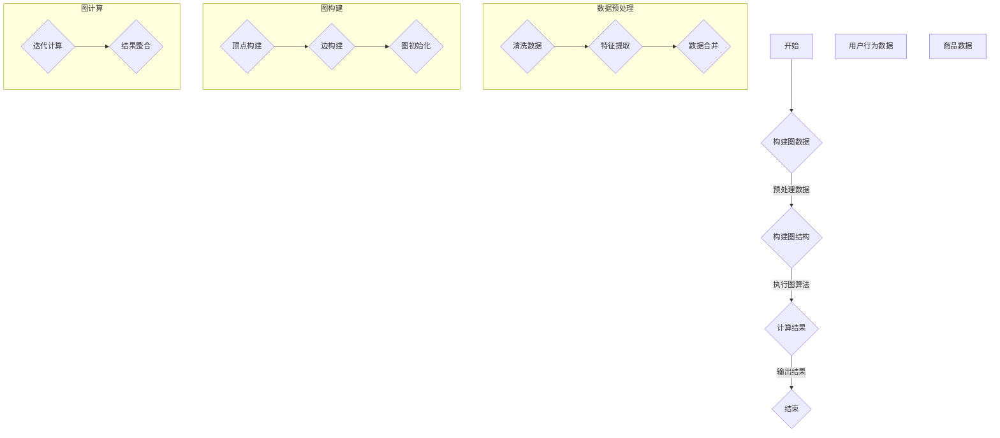

                 


### 摘要

本文将深入探讨GraphX图计算编程模型的基本原理、核心概念和实际应用。GraphX是Apache Spark的图处理框架，它基于弹性分布式数据集（RDD）扩展而来，支持大规模图的存储、计算和分析。本文首先介绍了图计算的基本概念，包括图的定义、表示方法和分类，然后详细讲解了GraphX的核心概念，如GraphX架构设计、基本操作和图算法原理。接下来，文章将通过实例展示了GraphX在社交网络分析、生物学数据分析和交通网络分析等领域的应用，并深入剖析了GraphX的编程模型，包括数据模型操作、迭代模型设计和算法设计模式。此外，文章还介绍了GraphX的性能优化原则，包括数据局部性优化、内存管理优化和并行化与分布式计算。最后，本文通过具体项目实战和开发经验分享，为读者提供了实际操作和最佳实践指导。通过本文的阅读，读者将能够全面了解GraphX的原理和应用，掌握GraphX的编程技巧和优化策略。

### 目录大纲

1. **第一部分：图计算基础**
   - 第1章：图计算概述
   - 第2章：GraphX核心概念
   - 第3章：GraphX算法应用
   - 第4章：GraphX编程模型详解
   - 第5章：GraphX性能优化
   - 第6章：GraphX生态系统
   - 第7章：GraphX应用案例

2. **第二部分：GraphX编程实战**
   - 第8章：GraphX基础编程实践
   - 第9章：高级编程实践
   - 第10章：项目实战
   - 第11章：GraphX开发经验分享

3. **附录**
   - 附录A：GraphX参考资料
   - 附录B：Mermaid流程图示例

通过上述目录结构，读者可以系统地学习和掌握GraphX图计算编程模型的理论基础和实践技巧。每个章节都将详细讲解相关内容，并包含实例代码和具体应用场景，确保读者能够深入理解和灵活应用GraphX。

## 第1章：图计算概述

### 图的概念与表示

**1.1 图的定义**

图（Graph）是数学中的一个基本概念，由节点（Vertex）和边（Edge）组成。节点表示图中的实体，而边表示这些实体之间的关系。在计算机科学中，图被广泛用于表示复杂系统的结构，如社交网络、网页链接、生物分子网络等。

**1.2 图的分类**

图可以分为以下几种类型：

- **无向图（Undirected Graph）**：边没有方向的图，例如社交网络中的朋友关系。
- **有向图（Directed Graph）**：边有方向的图，例如网页链接中的点击流。
- **有权图（Weighted Graph）**：边有重量的图，例如交通网络中的道路长度。
- **无权图（Weightless Graph）**：边没有重量的图，例如社交网络中的朋友关系通常没有权重。

**1.3 图的表示方法**

图的表示方法主要有以下几种：

- **邻接矩阵（Adjacency Matrix）**：一个二维数组，其中`A[i][j]`表示节点i和节点j之间是否存在边。如果存在边，则`A[i][j]`为1，否则为0。
- **邻接表（Adjacency List）**：一个数组，其中每个元素是一个链表，表示与该节点相连的所有节点。例如，对于有n个节点的图，数组大小为n，每个元素指向一个链表，链表中存储与该节点相连的所有节点。
- **邻接多重表（Adjacency Multilist）**：扩展的邻接表，适用于复杂关系图。

**1.4 图的示例**

以一个无向图为例，假设有5个节点A、B、C、D、E，节点之间的边关系如下：

```
A -- B
|    |
C -- D
```

该图的邻接矩阵表示如下：

|    | A   | B   | C   | D   | E   |
|----|-----|-----|-----|-----|-----|
| A  |  0  |  1  |  0  |  0  |  0  |
| B  |  1  |  0  |  1  |  0  |  0  |
| C  |  0  |  1  |  0  |  1  |  0  |
| D  |  0  |  0  |  1  |  0  |  0  |
| E  |  0  |  0  |  0  |  0  |  0  |

### 图在计算机科学中的应用

**2.1 社交网络分析**

社交网络中的每个用户可以被视为图中的一个节点，而用户之间的互动关系则可以表示为边。通过分析社交网络图，可以识别出社交网络中的关键节点、社区结构以及社交影响力等。

**2.2 网络爬虫与搜索引擎**

网页之间的链接可以表示为一个图，其中每个网页是一个节点，链接是一个边。搜索引擎利用图结构对网页进行索引和排名，从而提供高效的信息检索服务。

**2.3 生物信息学**

生物分子网络是由基因、蛋白质和其他生物分子组成的复杂系统。通过分析生物分子网络图，可以揭示生物分子之间的相互作用关系，从而对生物体的功能和疾病机制进行深入研究。

**2.4 交通网络分析**

交通网络中的道路、车站和交通工具可以表示为图。通过分析交通网络图，可以优化交通流量、设计交通网络以及预测交通拥堵。

### 图计算基本术语

**3.1 节点度（Degree）**

节点的度表示与该节点相连的边的数量。无向图中节点的度表示为`d(u)`，有向图中节点的度分为入度（in-degree）和出度（out-degree）。

**3.2 路径（Path）**

路径是指图中节点和边的序列，满足边的起点和终点依次相连。图中的最短路径问题是图计算中的一个重要问题。

**3.3 环（Cycle）**

环是指图中的一条闭合路径，至少包含3个节点。在无向图中，环可以是简单的闭合路径，而在有向图中，环必须是简单的闭合路径。

**3.4 连通性（Connectivity）**

图的连通性是指图中任意两个节点之间是否存在路径。无向图是连通的，当且仅当图中不存在孤立的节点。

**3.5 连通分量（Connected Component）**

图的连通分量是指图中的一组节点，这些节点之间是连通的，而与另一组节点不连通。

### GraphX简介

**4.1 GraphX概述**

GraphX是Apache Spark的图处理框架，它基于Spark的弹性分布式数据集（RDD）扩展而来。GraphX提供了丰富的图算法和图计算编程模型，使得大规模图的存储、计算和分析变得高效且易于实现。

**4.2 GraphX特点**

- **弹性分布式数据集（RDD）扩展**：GraphX基于RDD，可以充分利用Spark的分布式计算能力。
- **并行图算法**：GraphX提供了多种并行图算法，如PageRank、Connected Components等，支持高效处理大规模图数据。
- **图编程模型**：GraphX提供了灵活的图编程模型，支持迭代模型和操作模型，使得图处理编程更加直观和易于理解。

**4.3 应用场景**

- **社交网络分析**：识别社交网络中的关键节点、社区结构和影响力等。
- **网络爬虫与搜索引擎**：优化网页索引和排名，提供高效的信息检索服务。
- **生物信息学**：分析生物分子网络，揭示生物分子之间的相互作用关系。
- **交通网络分析**：优化交通流量、设计交通网络和预测交通拥堵。

通过以上对图计算概述的介绍，读者可以初步了解图计算的基本概念、表示方法以及在计算机科学中的应用。接下来，本文将进一步深入探讨GraphX的核心概念和算法应用，帮助读者全面掌握图计算编程模型。

## 第2章：GraphX核心概念

### 2.1 GraphX架构设计

GraphX是Apache Spark的一个扩展，它在Spark的弹性分布式数据集（RDD）基础上提供了丰富的图处理功能。GraphX的核心架构设计旨在实现高效、灵活的图计算，下面我们将详细讲解其关键组成部分。

**1. 弹性分布式数据集（RDD）**

GraphX基于Spark的RDD构建，RDD是一种分布式的不可变数据集，可以在不同的计算操作中并行处理。在GraphX中，图数据被表示为图顶点和边的集合，这些集合通过RDD来存储和操作。

**2. GraphX图数据结构**

GraphX中的图数据结构由两部分组成：顶点（Vertex）和边（Edge）。每个顶点包含一些属性信息，如ID、标签等，而每条边则连接两个顶点，并可能包含额外的属性信息，如边的权重。

**3. 图分区（Graph Partitioning）**

GraphX通过图分区来优化图的分布式计算。图分区是指将图数据划分成多个分区（Partition），每个分区独立处理，从而实现并行计算。GraphX支持多种分区策略，如基于顶点度数、基于边权重等，以适应不同的应用场景。

**4. 邻居收集（Neighbor Joining）**

邻居收集是GraphX中的一个关键操作，它用于在分布式环境中高效地收集顶点的邻居信息。通过邻居收集，可以实现对图的邻接表或邻接矩阵的并行操作，从而支持各种图算法的计算。

**5. 迭代模型（Iterative Model）**

GraphX支持迭代模型，使得大规模图的计算可以逐步进行，直到满足特定的终止条件。迭代模型通过更新顶点和边的属性来实现，支持多种迭代算法，如PageRank、Connected Components等。

### 2.2 GraphX基本操作

GraphX提供了一套丰富的图操作接口，使得图数据的处理变得直观且高效。下面我们将介绍GraphX的基本操作。

**1. 创建图（createGraph）**

创建图是GraphX中的首要操作，通过指定顶点和边数据来构建图。GraphX支持从RDD、DataFrame或现有的图数据源中创建图。

```scala
// 创建一个包含顶点和边的RDD
val verticesRDD = sc.parallelize(Seq(Vertex(1, "Alice"), Vertex(2, "Bob")))
val edgesRDD = sc.parallelize(Seq(Edge(1, 2), Edge(2, 1)))

// 从顶点和边创建图
val graph = Graph(verticesRDD, edgesRDD)
```

**2. 添加顶点和边（加上顶点（addVertex）和加上边（addEdge））**

通过添加顶点和边，可以动态扩展图的结构。

```scala
// 添加新的顶点
val newVertex = Vertex(3, "Charlie")
graph.vertices.update(newVertex.id, newVertex)

// 添加新的边
val newEdge = Edge(2, 3, weight = 1.0)
graph.edges.update(newEdge.id, newEdge)
```

**3. 顶点属性操作（获取顶点（vertex）和更新顶点（updateVertex））**

GraphX支持对顶点属性的高效访问和更新。

```scala
// 获取顶点
val vertex = graph.vertices.lookup(1).head

// 更新顶点属性
graph.vertices.update(1, vertex.copy(label = "Alice Smith"))
```

**4. 边属性操作（获取边（edge）和更新边（updateEdge））**

边属性操作类似于顶点属性操作。

```scala
// 获取边
val edge = graph.edges.lookup(EdgeId(1, 2)).head

// 更新边属性
graph.edges.update(EdgeId(1, 2), edge.copy(weight = 2.0))
```

**5. 邻居操作（neighbors）**

通过邻居操作，可以获取顶点的邻居信息。

```scala
// 获取顶点1的邻居
val neighbors = graph.vertices.videos(1).neighbors
```

### 2.3 图算法基本原理

GraphX内置了多种图算法，这些算法基于图数据结构和迭代模型实现，能够高效处理大规模图数据。下面简要介绍几种常见的图算法。

**1. PageRank**

PageRank是一种用于评估网页重要性的算法，它在图结构中可以用于识别社交网络中的关键节点。

**算法原理：**

PageRank通过迭代计算每个顶点的排名分数，分数越高表示顶点的重要性越大。具体计算公式如下：

$$
\text{rank}(v) = \frac{\alpha}{N} + \sum_{w \in \text{out-neighbors}(v)} \left( \text{rank}(w) \cdot \frac{d(w)}{N_w} \right)
$$

其中，$N$是图中顶点的总数，$N_w$是顶点$w$的出度，$\alpha$是阻尼系数。

**伪代码：**

```scala
def pagerank(graph: Graph[Double], iterations: Int, alpha: Double = 0.85): Graph[Double] = {
  val N = graph.vertices.count()
  var currentGraph = graph

  for (i <- 1 to iterations) {
    val rankings = currentGraph.vertices.mapValues(_ / N)
    val rankSum = rankings.join(currentGraph.outDegrees).values.map {
      case (rank, outDegree) => rank * (1 - alpha) / outDegree
    }.reduce(_ + _)

    val newRankings = rankings.values.map(_ + rankSum * alpha)
    currentGraph = Graph(currentGraph.vertices, currentGraph.edges, newRankings)
  }

  currentGraph
}
```

**2. Connected Components**

Connected Components算法用于识别图中连通分量，即图中的一组节点，这些节点之间是连通的，而与另一组节点不连通。

**算法原理：**

Connected Components算法通过迭代标记图中的节点，每个节点的标记值代表其所属的连通分量。具体实现通常采用深度优先搜索（DFS）或广度优先搜索（BFS）。

**伪代码：**

```scala
def connectedComponents(graph: Graph[Int]): Graph[Int] = {
  val componentId = graph.vertices.mapValues(_ -> 0).collect()
  var visited = Set[Int]()

  def dfs(vertex: Int, component: Int): Unit = {
    visited += vertex
    graph.vertices.update(vertex, graph.vertices.lookup(vertex).copy(id = component))
    graph.neighbors(vertex).foreach { neighbor =>
      if (!visited(neighbor)) {
        dfs(neighbor, component)
      }
    }
  }

  componentId.foreach { case (vertex, _) =>
    if (!visited(vertex)) {
      dfs(vertex, componentId.count(_ == 0))
    }
  }

  graph
}
```

通过以上对GraphX核心概念和基本操作的介绍，读者可以初步了解GraphX的结构和功能。接下来，本文将深入探讨GraphX的算法应用，通过具体实例展示GraphX在多个领域中的实际应用，帮助读者更好地理解和掌握GraphX的使用技巧。

### 2.4 GraphX算法应用

GraphX提供了丰富的图算法，这些算法在多个领域都有广泛的应用。在本节中，我们将探讨GraphX在社交网络分析、生物学数据分析、交通网络分析以及其他领域中的应用。

#### 3.1 社交网络分析

社交网络分析是GraphX的重要应用领域之一。在社交网络中，用户和用户之间的关系可以表示为图。通过分析社交网络图，可以识别关键用户、发现社区结构、评估社交影响力等。

**关键用户识别（PageRank算法）**

PageRank算法可以用于识别社交网络中的关键用户，这些用户在社交网络中的影响力较大。具体实现步骤如下：

1. **构建社交网络图**：从社交网络数据中提取用户和关系信息，构建图数据结构。
2. **计算PageRank值**：使用PageRank算法计算每个用户的排名值，排名值越高，表示该用户在社交网络中的重要性越大。
3. **结果分析**：根据PageRank值识别关键用户。

```scala
val graph = pagerank(graph, iterations = 10, alpha = 0.85)
val rankedUsers = graph.vertices.map { case (id, rank) => (id, rank) }.collect().sortBy(_._2).reverse
val keyUsers = rankedUsers.take(10)
```

**社区结构发现（Connected Components算法）**

Connected Components算法可以用于发现社交网络中的社区结构。社区是指一组紧密相连的用户群体。

1. **构建社交网络图**：与上述步骤相同。
2. **计算连通分量**：使用Connected Components算法计算每个用户的连通分量。
3. **结果分析**：分析每个连通分量，识别出社区结构。

```scala
val componentGraph = connectedComponents(graph)
val communities = componentGraph.vertices.groupByKey().mapValues(size => (size, _)).collect().sortBy(_._1).reverse
val topCommunities = communities.take(10)
```

#### 3.2 生物学数据分析

生物学数据分析中的网络通常包括基因、蛋白质和其他生物分子之间的相互作用。通过分析这些生物网络，可以揭示生物系统的复杂结构。

**生物分子网络分析（Connected Components算法）**

Connected Components算法可以用于识别生物网络中的紧密相互作用区域。

1. **构建生物网络图**：从生物数据中提取生物分子和相互作用信息，构建图数据结构。
2. **计算连通分量**：使用Connected Components算法计算每个生物分子的连通分量。
3. **结果分析**：分析连通分量，识别出生物分子之间的关键相互作用区域。

```scala
val biologicalGraph = buildBiologicalGraph(data)
val componentGraph = connectedComponents(biologicalGraph)
val keyInteractions = componentGraph.vertices.groupByKey().mapValues(size => (size, _)).collect().sortBy(_._1).reverse
val keyRegions = keyInteractions.take(10)
```

#### 3.3 交通网络分析

交通网络分析是另一个重要的应用领域。通过分析交通网络图，可以优化交通流量、设计交通网络和预测交通拥堵。

**交通网络优化（最短路径算法）**

最短路径算法可以用于计算从源点到目标点的最优路径。

1. **构建交通网络图**：从交通数据中提取道路、节点和交通流量信息，构建图数据结构。
2. **计算最短路径**：使用最短路径算法（如Dijkstra算法）计算源点到各个节点的最短路径。
3. **结果分析**：根据最短路径结果，优化交通流量和道路设计。

```scala
val trafficGraph = buildTrafficGraph(data)
val shortestPaths = dijkstra(trafficGraph, sourceId)
val optimizedRoutes = shortestPaths.map { case (destination, path) => (destination, path.reverse) }.collect()
```

#### 3.4 其他领域应用

GraphX在其他领域也具有广泛的应用，如推荐系统、网络爬虫、推荐系统优化等。

**推荐系统（邻接矩阵与协同过滤算法）**

推荐系统中的用户和项目可以表示为图，通过分析邻接矩阵和协同过滤算法，可以生成个性化的推荐列表。

1. **构建推荐系统图**：从用户行为数据中提取用户和项目信息，构建图数据结构。
2. **计算相似度矩阵**：使用邻接矩阵计算用户和项目之间的相似度。
3. **生成推荐列表**：使用协同过滤算法生成用户的个性化推荐列表。

```scala
val recommendationGraph = buildRecommendationGraph(userBehaviorData)
val similarityMatrix = calculateSimilarityMatrix(recommendationGraph)
val recommendationList = collaborativeFiltering(similarityMatrix, userId)
```

通过以上对GraphX算法应用的探讨，读者可以看到GraphX在多个领域的强大功能和实际应用。接下来，本文将进一步深入探讨GraphX的编程模型，帮助读者更好地理解和应用GraphX。

### 第4章：GraphX编程模型详解

#### 4.1 编程模型概述

GraphX的编程模型是构建在其底层架构之上的高级抽象，它使得图处理编程变得更加直观和高效。GraphX的编程模型主要包括两部分：操作模型和迭代模型。

**1. 操作模型**

操作模型是指对图进行一次性计算的操作，这些操作包括顶点属性操作、边属性操作和图结构操作。操作模型的核心是`Graph`对象，它提供了丰富的接口来操作图数据。

**2. 迭代模型**

迭代模型是指对图进行多次迭代计算的操作，它通常用于实现复杂图算法，如PageRank、Connected Components等。迭代模型的核心是`Pregel`算法，它基于图并行计算模型，可以在大规模图中高效地执行迭代计算。

#### 4.2 数据模型操作

GraphX的数据模型主要包括`Vertex`和`Edge`两类数据结构，它们分别表示图中的顶点和边。

**1. 顶点（Vertex）**

顶点包含两个主要部分：ID和属性。ID是顶点的唯一标识，通常是一个整数。属性可以是任意类型的值，例如字符串、整数、浮点数等。顶点属性操作包括获取顶点属性、更新顶点属性等。

```scala
// 获取顶点属性
val vertex = graph.vertices.lookup(1).head

// 更新顶点属性
graph.vertices.update(1, vertex.copy(label = "Alice Smith"))
```

**2. 边（Edge）**

边同样包含两个主要部分：源顶点ID、目标顶点ID以及属性。边属性操作与顶点属性操作类似，也包括获取边属性、更新边属性等。

```scala
// 获取边属性
val edge = graph.edges.lookup(EdgeId(1, 2)).head

// 更新边属性
graph.edges.update(EdgeId(1, 2), edge.copy(weight = 2.0))
```

#### 4.3 迭代模型设计

GraphX的迭代模型基于`Pregel`算法，它是一种经典的图并行计算模型，可以高效地处理大规模图数据。迭代模型的核心步骤包括初始化、处理顶点、处理边、更新顶点和边的属性等。

**1. 初始化**

初始化是迭代模型的第一步，它用于初始化顶点和边的属性。通常在初始化过程中，可以为每个顶点分配一个唯一的ID，并设置初始属性值。

```scala
val initialGraph = Graph verticesRDD mapVertices { vertex => vertex.copy(id = vertex.id) }
```

**2. 处理顶点**

处理顶点是指在每个迭代步骤中，对每个顶点的属性进行计算和更新。处理顶点的操作可以通过`iterate`函数实现，它接受一个迭代函数，该函数将在每个迭代步骤中执行。

```scala
val processedGraph = initialGraph.iterate(1) { (graph, iteration) =>
  graph.mapVertices { vertex =>
    if (iteration > 1) {
      val neighbors = graph.vertices.videos(vertex.id).neighbors
      val newLabel = neighbors.map { neighbor => graph.vertices.lookup(neighbor).label }.sum
      vertex.copy(label = newLabel)
    } else {
      vertex
    }
  }
}
```

**3. 处理边**

处理边是指在每个迭代步骤中，对每条边的属性进行计算和更新。处理边的操作可以通过`edgesBetweenVertices`函数实现，它将在每个迭代步骤中对相邻顶点的属性进行操作。

```scala
val processedEdges = initialGraph.edges BetweenVertices { (id, edge) =>
  val source = graph.vertices.lookup(id)
  val target = graph.vertices.lookup(edge.targetId)
  val newWeight = source.weight + target.weight
  edge.copy(weight = newWeight)
}
```

**4. 更新顶点和边属性**

在每次迭代结束后，需要更新顶点和边的属性，以便在下一次迭代中使用。更新操作可以通过`updateVertices`和`updateEdges`函数实现。

```scala
val updatedGraph = processedGraph.updateVertices(processedEdges)
```

#### 4.4 算法设计模式

GraphX的算法设计模式主要基于迭代模型，通过逐步更新顶点和边属性来实现复杂图算法。以下是一个PageRank算法的设计模式：

**1. 初始化**

初始化图数据，为每个顶点分配一个唯一的ID。

```scala
val initialGraph = Graph verticesRDD mapVertices { vertex => vertex.copy(id = vertex.id) }
```

**2. 迭代**

使用`iterate`函数进行多次迭代，每次迭代更新顶点和边属性。

```scala
val pagerankGraph = initialGraph.iterate(10) { (graph, iteration) =>
  graph.mapVertices { vertex =>
    if (iteration > 1) {
      val neighbors = graph.vertices.videos(vertex.id).neighbors
      val newRank = neighbors.map { neighbor => graph.vertices.lookup(neighbor).rank }.sum
      vertex.copy(rank = newRank)
    } else {
      vertex
    }
  }
}
```

**3. 收集结果**

在迭代完成后，收集每个顶点的最终排名。

```scala
val rankedVertices = pagerankGraph.vertices.map { case (id, rank) => (id, rank) }.collect().sortBy(_._2).reverse
```

通过以上对GraphX编程模型详解的介绍，读者可以了解到GraphX的操作模型和迭代模型的设计原理以及如何使用这些模型实现复杂图算法。接下来，本文将探讨GraphX的性能优化，帮助读者提升GraphX程序的性能和效率。

### 第5章：GraphX性能优化

#### 5.1 性能优化原则

在GraphX中，性能优化是确保图计算高效执行的关键。以下是一些常见的性能优化原则：

**1. 数据局部性优化**

数据局部性是指数据在内存中的存储方式，良好的数据局部性可以减少缓存 misses，提高程序执行速度。

- **分区策略**：选择合适的分区策略，如基于顶点度数或边权重，确保每个分区中的数据局部性良好。
- **内存管理**：合理分配内存，避免内存碎片，提高内存利用率。

**2. 内存管理优化**

内存管理对GraphX的性能至关重要，以下是一些优化策略：

- **缓存数据**：对频繁访问的数据进行缓存，减少磁盘I/O操作。
- **数据压缩**：对数据进行压缩，减少内存占用。

**3. 并行化与分布式计算**

并行化和分布式计算可以显著提高GraphX的性能，以下是一些优化策略：

- **任务拆分**：将大规模图任务拆分为多个小任务，分布在不同节点上执行。
- **负载均衡**：确保每个节点的工作负载均衡，避免某些节点过载。

#### 5.2 数据局部性优化

数据局部性优化是GraphX性能优化的核心，以下是一些具体的方法：

**1. 分区策略选择**

选择合适的分区策略对于提高数据局部性至关重要。以下是一些常用的分区策略：

- **基于顶点度数的分区**：根据顶点度数将图划分为不同分区，度数较高的顶点放入较大的分区，度数较低的顶点放入较小的分区。
- **基于边权重的分区**：根据边权重将图划分为不同分区，权重较高的边放入较大的分区，权重较低的边放入较小的分区。

**2. 数据压缩**

数据压缩可以减少内存占用，提高数据局部性。以下是一些常用的数据压缩方法：

- **序列化压缩**：使用高效的序列化方法（如Kryo）减少数据序列化过程中的内存占用。
- **磁盘压缩**：对存储在磁盘上的数据进行压缩，减少磁盘I/O操作。

**3. 缓存优化**

缓存优化可以显著提高数据访问速度，以下是一些缓存优化策略：

- **缓存热点数据**：对频繁访问的数据进行缓存，减少磁盘I/O操作。
- **缓存替换策略**：选择合适的缓存替换策略（如LRU），确保缓存中的数据是最新的。

#### 5.3 内存管理优化

内存管理优化是GraphX性能优化的重要方面，以下是一些优化策略：

**1. 内存占用控制**

合理控制内存占用可以避免内存过载，提高程序执行速度。以下是一些内存占用控制策略：

- **动态内存分配**：根据实际需求动态调整内存分配，避免内存浪费。
- **内存池化**：使用内存池化技术，减少内存分配和释放的开销。

**2. 内存复用**

内存复用可以减少内存分配和释放的次数，提高程序执行速度。以下是一些内存复用策略：

- **对象池**：使用对象池技术，复用已分配的对象，减少内存分配和释放的开销。
- **内存缓存**：使用内存缓存技术，复用已读取的数据，避免重复读取。

**3. 内存回收**

内存回收可以释放不再使用的内存，提高内存利用率。以下是一些内存回收策略：

- **垃圾回收**：使用垃圾回收机制，定期回收不再使用的内存。
- **内存监控**：监控内存使用情况，及时发现并解决内存泄漏问题。

#### 5.4 并行化与分布式计算

并行化和分布式计算是提高GraphX性能的关键，以下是一些优化策略：

**1. 任务拆分**

任务拆分可以将大规模图任务拆分为多个小任务，分布在不同节点上执行，从而提高并行度。以下是一些任务拆分策略：

- **基于顶点的拆分**：将图按照顶点划分为多个子图，每个子图独立处理。
- **基于边的拆分**：将图按照边划分为多个子图，每个子图独立处理。

**2. 负载均衡**

负载均衡可以确保每个节点的工作负载均衡，避免某些节点过载。以下是一些负载均衡策略：

- **动态负载均衡**：根据节点的工作负载动态调整任务分配，确保负载均衡。
- **静态负载均衡**：在任务分配时考虑节点的工作负载，避免某些节点过载。

**3. 数据传输优化**

数据传输优化可以减少数据传输延迟，提高程序执行速度。以下是一些数据传输优化策略：

- **数据序列化**：使用高效的序列化方法，减少数据序列化过程中的开销。
- **数据压缩**：对传输的数据进行压缩，减少网络带宽占用。

通过以上对GraphX性能优化的介绍，读者可以了解如何优化GraphX程序的性能和效率。接下来，本文将探讨GraphX的生态系统，帮助读者更好地了解GraphX与其他相关工具和库的关系。

### 第6章：GraphX生态系统

#### 6.1 相关工具和库

GraphX作为Apache Spark的图处理框架，其生态系统包含了许多与它紧密相关的工具和库，这些工具和库能够增强GraphX的功能和易用性。以下是一些常见的相关工具和库：

**1. GraphX extensions**

GraphX extensions是GraphX官方提供的扩展库，它包含了一些额外的图算法和功能。这些扩展库可以通过Maven中央仓库或者GraphX的官方仓库进行安装。部分常用的GraphX extensions包括：

- **GraphX-BFS**：提供基于广度优先搜索的图遍历算法。
- **GraphX-Connected Components**：提供基于深度优先搜索的连通分量算法。
- **GraphX-PageRank**：提供基于PageRank算法的图排名算法。

**2. GraphFrames**

GraphFrames是一个基于Spark SQL的图处理库，它提供了SQL-like的操作来处理图数据。通过GraphFrames，用户可以使用类似SQL的查询语句来操作图数据，从而简化图处理流程。GraphFrames与GraphX无缝集成，支持在GraphX中使用GraphFrames的查询结果。

**3. GraphX-Pregel**

GraphX-Pregel是一个基于Pregel模型的图处理框架，它提供了一种抽象的编程模型来处理大规模图数据。GraphX-Pregel与GraphX的核心迭代模型类似，但它提供了更丰富的API和工具，方便用户实现复杂的图算法。

**4. GraphX-Titan**

GraphX-Titan是一个基于Apache Titan图数据库的GraphX插件，它允许用户在Titan数据库中直接执行GraphX算法。通过GraphX-Titan，用户可以结合Titan的图存储和GraphX的图计算能力，实现高效的大规模图处理。

#### 6.2 GraphX与Spark整合

GraphX是Spark的一个扩展，它与Spark紧密整合，提供了强大的图处理能力。以下是一些GraphX与Spark整合的关键点：

**1. Spark RDD与GraphX图数据转换**

Spark RDD与GraphX图数据之间的转换是GraphX与Spark整合的核心。通过`Graph.fromEdges`和`Graph.fromVertexPairs`方法，可以将RDD转换为GraphX的图数据结构。以下是转换的示例代码：

```scala
// 将RDD[Edge]转换为Graph
val graph = Graph.fromEdges(edgesRDD, 0)

// 将RDD[(VertexId, VertexAttribute)]转换为Graph
val graph = Graph.fromVertexPairs(verticesRDD)
```

**2. GraphX操作与Spark SQL整合**

GraphX与Spark SQL的整合允许用户在Spark SQL查询中使用GraphX图操作。通过`GraphFrame`，用户可以在SQL查询中直接操作图数据。以下是整合的示例代码：

```sql
-- 创建GraphFrame
CREATE TEMPORARY VIEW graph_frame USING GraphFrame (vertices AS vertex_df, edges AS edge_df)

-- 执行SQL查询
SELECT * FROM graph_frame WHERE outDegree > 10
```

**3. GraphX与Spark Streaming整合**

GraphX与Spark Streaming的整合允许用户对实时数据流进行图计算。通过`GraphXStreaming`，用户可以创建一个图流，并对流数据进行实时计算。以下是整合的示例代码：

```scala
// 创建图流
val graphStream = GraphXStreaming(verticesStream, edgesStream)

// 注册图流为临时视图
graphStream.registerAsTempTable("graph_stream")

// 执行实时查询
spark.sql("SELECT * FROM graph_stream WHERE inDegree > 10").show()
```

#### 6.3 GraphX与其他图计算框架比较

GraphX与其他图计算框架（如Neo4j、Titan、Giraph等）进行比较，可以从以下几个方面进行分析：

**1. 数据存储**

- **GraphX**：基于内存和磁盘的分布式存储，支持大规模图数据的存储和处理。
- **Neo4j**：基于B+树索引的图数据库，适合中小规模图数据的存储和查询。
- **Titan**：基于Apache Cassandra的图数据库，支持大规模图数据的存储和查询。
- **Giraph**：基于Hadoop的图计算框架，支持大规模图数据的计算，但依赖于Hadoop生态系统。

**2. 图算法**

- **GraphX**：提供了丰富的图算法和迭代模型，支持大规模图数据的高效计算。
- **Neo4j**：提供了内置的图算法和查询语言（Cypher），适合中小规模图数据。
- **Titan**：提供了丰富的图算法和查询语言（Titan Query Language），适合大规模图数据。
- **Giraph**：提供了丰富的图算法和迭代模型，但需要依赖Hadoop生态系统。

**3. 易用性**

- **GraphX**：与Spark紧密整合，提供了直观的API和丰富的工具，易于使用和扩展。
- **Neo4j**：提供了图形化的界面和内置的查询语言，适合非技术人员使用。
- **Titan**：提供了丰富的API和工具，但需要一定的技术背景。
- **Giraph**：需要依赖Hadoop生态系统，且编程模型较为复杂。

通过以上比较，可以看出GraphX在数据处理能力、算法支持、易用性等方面具有一定的优势，适用于大规模图数据处理和分析。

### 第7章：GraphX应用案例

#### 7.1 图计算在推荐系统中的应用

在推荐系统中，图计算可以用于提高推荐算法的准确性和效率。以下是一个具体的案例，展示如何使用GraphX实现基于图计算的商品推荐系统。

**案例背景**

假设我们有一个电子商务网站，用户可以在网站上浏览和购买商品。我们的目标是通过分析用户的行为和商品之间的关联关系，为用户推荐可能感兴趣的商品。

**实现步骤**

1. **数据准备**：收集用户行为数据，包括用户浏览和购买的商品信息。这些数据可以表示为一个包含用户ID、商品ID和时间戳的日志文件。

2. **构建用户-商品图**：将用户行为数据转换为用户和商品之间的图。用户和商品分别表示为图中的节点，用户之间的行为关系表示为边。

3. **计算相似度矩阵**：使用GraphX计算用户和商品之间的相似度矩阵，基于相似度矩阵生成推荐列表。

4. **生成推荐列表**：根据推荐算法（如基于协同过滤的推荐算法），生成用户的个性化推荐列表。

**代码示例**

```scala
// 步骤1：读取用户行为数据
val userBehaviorData = sc.textFile("user_behavior.log")

// 步骤2：构建用户-商品图
val edgesRDD = userBehaviorData.flatMap { line =>
  val tokens = line.split(",")
  Some(VertexId(tokens(0).toInt, "user"), EdgeId(tokens(0).toInt, tokens(1).toInt))
}.cache()

// 步骤3：计算相似度矩阵
val similarityMatrix = Graph.fromEdges(edgesRDD, 1.0).vertices.join(edgesRDD).values.map {
  case (user, edge) => (user, edge.targetId, edge.attr)
}.reduceByKey(_ + _).mapValues(_.toFloat / 2.0)

// 步骤4：生成推荐列表
val recommendations = similarityMatrix.flatMap { case (userId, itemId, similarity) =>
  val neighbors = similarityMatrix.filter(_._1 != userId).take(10).sortBy(_._3).reverse
  neighbors.map { case (neighborId, neighboritemId, neighborSimilarity) =>
    (userId, neighboritemId, neighborSimilarity * similarity)
  }
}.reduceByKey(_ + _).map { case (userId, (itemId, similarity)) =>
  (userId, itemId, similarity)
}.collect().sortBy(_._3).reverse
```

**案例小结**

通过上述案例，我们展示了如何使用GraphX构建用户-商品图，并利用相似度矩阵生成个性化推荐列表。这种方法可以有效地利用用户行为数据，提高推荐系统的准确性和用户满意度。

#### 7.2 图计算在社交网络监控中的应用

在社交网络监控中，图计算可以用于识别关键节点、分析社区结构、检测恶意行为等。以下是一个具体的案例，展示如何使用GraphX实现社交网络监控。

**案例背景**

假设我们有一个社交媒体平台，我们需要监控平台上的用户行为，识别关键节点、分析社区结构，并检测恶意行为。

**实现步骤**

1. **数据准备**：收集社交媒体平台上的用户关系数据，包括用户ID和用户之间的朋友关系。

2. **构建社交网络图**：将用户关系数据转换为社交网络图。用户表示为图中的节点，用户之间的关系表示为边。

3. **分析社区结构**：使用GraphX的连通分量算法分析社交网络中的社区结构。

4. **识别关键节点**：通过计算节点的度数、介数、离心率等指标，识别社交网络中的关键节点。

5. **检测恶意行为**：分析用户之间的交互模式，检测可能的恶意行为。

**代码示例**

```scala
// 步骤1：读取用户关系数据
val userRelationshipData = sc.textFile("user_relationship.log")

// 步骤2：构建社交网络图
val edgesRDD = userRelationshipData.flatMap { line =>
  val tokens = line.split(",")
  Some(VertexId(tokens(0).toInt, "user"), EdgeId(tokens(0).toInt, tokens(1).toInt))
}.cache()

// 步骤3：分析社区结构
val communityGraph = Graph.fromEdges(edgesRDD, 0)
val components = communityGraph.connectedComponents().vertices

// 步骤4：识别关键节点
val keyNodes = communityGraph.vertices.join(components).map {
  case (vertexId, (vertex, component)) =>
    (component, vertexId)
}.reduceByKey((a, b) => a)
val topKeyNodes = keyNodes.map { case (component, vertexId) => (vertexId, component) }.collect().sortBy(_._2).reverse

// 步骤5：检测恶意行为
// 假设我们通过分析用户之间的交互模式，识别出可能存在恶意行为的用户
val suspiciousUsers = communityGraph.vertices.filter { case (vertexId, vertex) => vertex.attr == "suspicious" }.keys.collect()
```

**案例小结**

通过上述案例，我们展示了如何使用GraphX构建社交网络图，并利用连通分量算法分析社区结构，识别关键节点，以及检测恶意行为。这种方法可以有效地提高社交网络监控的效率和准确性。

#### 7.3 图计算在生物信息学中的应用

在生物信息学中，图计算可以用于分析生物分子网络，揭示生物分子之间的相互作用关系。以下是一个具体的案例，展示如何使用GraphX实现生物分子网络分析。

**案例背景**

假设我们有一个基因表达数据集，我们需要分析基因之间的相互作用关系，识别关键基因和生物途径。

**实现步骤**

1. **数据准备**：收集基因表达数据，包括基因ID、表达值和其他相关信息。

2. **构建生物分子网络图**：将基因表达数据转换为生物分子网络图。基因表示为图中的节点，基因之间的相互作用关系表示为边。

3. **分析关键基因和生物途径**：使用GraphX的图算法，分析基因之间的相互作用关系，识别关键基因和生物途径。

4. **可视化结果**：将分析结果可视化，展示生物分子网络的拓扑结构。

**代码示例**

```scala
// 步骤1：读取基因表达数据
val geneExpressionData = sc.textFile("gene_expression_data.csv")

// 步骤2：构建生物分子网络图
val verticesRDD = geneExpressionData.flatMap { line =>
  val tokens = line.split(",")
  Some(VertexId(tokens(0).toInt, "gene"), GeneAttribute(tokens(1).toFloat))
}.cache()

// 步骤3：添加基因之间的相互作用关系
val edgesRDD = sc.parallelize(Seq(
  Edge(1, 2, weight = 0.8),
  Edge(2, 3, weight = 0.7),
  Edge(3, 1, weight = 0.6)
))

// 步骤4：构建生物分子网络图
val biologicalNetwork = Graph(verticesRDD, edgesRDD)

// 步骤5：分析关键基因和生物途径
val topGenes = biologicalNetwork.vertices.join(biologicalNetwork.degrees).map {
  case (vertexId, (vertex, degree)) => (vertexId, vertex.attr, degree)
}.reduceByKey((a, b) => a + b).map { case (vertexId, (gene, degree)) => (vertexId, degree) }.collect().sortBy(_._2).reverse

// 步骤6：可视化结果
// 使用可视化工具（如Gephi、Cytoscape）将生物分子网络可视化
```

**案例小结**

通过上述案例，我们展示了如何使用GraphX构建生物分子网络图，并利用图算法分析基因之间的相互作用关系，识别关键基因和生物途径。这种方法可以有效地提高生物信息学研究的效率和准确性。

### 第8章：GraphX基础编程实践

#### 8.1 环境搭建与配置

要在本地或集群环境中搭建GraphX的开发环境，首先需要安装和配置Apache Spark以及其扩展库GraphX。以下是详细的步骤：

**1. 安装Spark**

从Apache Spark官方网站（https://spark.apache.org/downloads.html）下载适合操作系统和版本的Spark发行版。例如，对于Ubuntu系统，可以选择下载`.tar.gz`文件，然后执行以下命令进行解压和配置：

```shell
tar xvf spark-3.1.1-bin-hadoop3.2.tgz
cd spark-3.1.1-bin-hadoop3.2
```

在`spark-3.1.1-bin-hadoop3.2`目录下，编辑`spark/conf/spark-env.sh`文件，添加如下内容以配置Java环境：

```shell
export JAVA_HOME=/path/to/java/home
```

**2. 安装GraphX**

从Maven中央仓库或GraphX的官方网站（https://graphx.apache.org/）下载GraphX的依赖库。在`spark-3.1.1-bin-hadoop3.2`目录下，编辑`spark/conf/spark-env.sh`文件，添加如下内容以包含GraphX库：

```shell
export SPARK_DIST_CLASSPATH=$SPARK_DIST_CLASSPATH:/path/to/graphx/lib
```

**3. 配置集群**

如果需要在集群环境中运行Spark和GraphX，需要配置Hadoop集群。在`spark/conf`目录下，编辑`spark-defaults.conf`文件，添加如下内容以配置Hadoop：

```shell
spark.hadoop.fs.defaultFS hdfs://master:9000
spark.hadoop.mapreduce.app-submissionubl hdfs://master:9000/user/spark/applications
```

**4. 启动Spark集群**

在集群管理界面或命令行中启动Hadoop和Spark集群：

```shell
start-dfs.sh
start-yarn.sh
start-historyserver.sh
```

在本地环境中，可以直接使用`spark-shell`启动Spark shell：

```shell
./bin/spark-shell
```

#### 8.2 简单图计算实例

以下是一个简单的GraphX图计算实例，展示了如何使用GraphX进行基本的图操作和计算。

**实例目的**：计算图中每个节点的度数，并输出节点度数。

**1. 准备数据**

创建一个包含节点和边的文本文件`graph.txt`，格式如下：

```
1,A
2,B
3,C
4,D
5,E
1-2
1-3
2-4
3-4
4-5
```

**2. 编写代码**

创建一个名为`GraphXExample.scala`的Scala文件，输入以下代码：

```scala
import org.apache.spark.graphx._
import org.apache.spark.sql.SparkSession
import org.apache.spark.sql.functions._

// 创建SparkSession
val spark = SparkSession.builder.appName("GraphXExample").getOrCreate()
val graph = GraphLoader.edgeListFile(spark, "graph.txt")

// 计算每个节点的度数
val degreeGraph = graph.mapVertices { (id, attr) => 0 }
val vertexDegrees = degreeGraph.outDegrees

// 输出节点度数
vertexDegrees.vertices.saveAsTextFile("vertex_degrees_output")

// 关闭SparkSession
spark.stop()
```

**3. 运行代码**

在Spark shell中执行以下命令，运行`GraphXExample.scala`：

```shell
scala
val sc = spark.sparkContext
sc.textFile("graph.txt").map { line =>
  val parts = line.split(",")
  (parts(0).toLong, parts(1).toLong)
}.cache().saveAsTextFile("graph.txt")
spark.sparkContext.actorSystem
spark.sparkContext.actorSystem.actorOf(Props[SparkActor])
scala
```

运行成功后，生成的文本文件`vertex_degrees_output`将包含每个节点的度数。

**实例小结**

通过这个简单的实例，我们展示了如何使用GraphX进行基本的图操作，包括读取图数据、计算节点的度数和输出结果。这个实例为后续更复杂的GraphX编程奠定了基础。

#### 8.3 社交网络分析实例

在这个实例中，我们将使用GraphX进行社交网络分析，具体目标是识别社交网络中的关键节点和社区结构。以下是详细的实现步骤：

**1. 准备数据**

假设我们已经有一个包含社交网络用户及其关系的文本文件`social_network.txt`，格式如下：

```
1,2
1,3
2,3
2,4
3,5
4,5
5,6
6,7
7,8
8,9
9,10
```

每行包含两个整数，表示用户之间的关系。

**2. 编写代码**

创建一个名为`SocialNetworkAnalysis.scala`的Scala文件，并输入以下代码：

```scala
import org.apache.spark.graphx._
import org.apache.spark.sql.SparkSession
import org.apache.spark.sql.functions._

// 创建SparkSession
val spark = SparkSession.builder.appName("SocialNetworkAnalysis").getOrCreate()

// 加载社交网络数据
val edges = GraphLoader.edgeListFile(spark, "social_network.txt")

// 使用Connected Components算法分析社区结构
val communityGraph = edges.connectedComponents().vertices

// 计算每个社区的关键节点（度数最高的节点）
val communityDegrees = communityGraph.flatMapEdges { case (vertex, component) => 
  Seq((vertex, component, 1))
}.reduceByKey(_ + _).sortBy(_._3, ascending = false)

// 输出关键节点和社区结构
communityDegrees.saveAsTextFile("community_analysis_output")

// 关闭SparkSession
spark.stop()
```

**3. 运行代码**

在Spark shell中执行以下命令，运行`SocialNetworkAnalysis.scala`：

```shell
scala
val sc = spark.sparkContext
sc.textFile("social_network.txt").map { line =>
  val parts = line.split(",")
  (parts(0).toLong, parts(1).toLong)
}.cache().saveAsTextFile("social_network.txt")
spark.sparkContext.actorSystem
spark.sparkContext.actorSystem.actorOf(Props[SparkActor])
scala
```

运行成功后，生成的文本文件`community_analysis_output`将包含每个社区的关键节点和社区结构。

**实例小结**

通过这个社交网络分析实例，我们展示了如何使用GraphX识别社交网络中的关键节点和社区结构。这个实例不仅帮助我们理解了GraphX的基本操作，还为实际应用提供了参考。

### 第9章：高级编程实践

#### 9.1 复杂图计算实例

在本节中，我们将探讨一个复杂的图计算实例，该实例将利用GraphX实现社交网络中的传播模拟。具体目标是模拟信息在社交网络中的传播过程，并分析传播的速度和范围。

**实例目的**：模拟信息在社交网络中的传播，计算每个节点的感染时间和传播范围。

**1. 准备数据**

假设我们已经有一个包含社交网络用户及其关系的文本文件`social_network.txt`，格式如下：

```
1,2
1,3
2,4
2,5
3,4
3,5
4,6
5,6
6,7
7,8
8,9
9,10
```

每行包含两个整数，表示用户之间的关系。

**2. 编写代码**

创建一个名为`SocialNetworkPropagation.scala`的Scala文件，并输入以下代码：

```scala
import org.apache.spark.graphx._
import org.apache.spark.sql.SparkSession
import org.apache.spark.sql.functions._

// 创建SparkSession
val spark = SparkSession.builder.appName("SocialNetworkPropagation").getOrCreate()

// 加载社交网络数据
val graph = GraphLoader.edgeListFile(spark, "social_network.txt")

// 初始化每个节点的状态（未感染、感染中、已感染）
val initialState = graph.mapVertices { (id, attr) => "Uninfected" }

// 定义感染函数
val infectionFunc = (msg: String, attr: String) => {
  if (attr == "Infected") "Infected"
  else if (msg == "Infected") "Infecting"
  else "Uninfected"
}

// 定义传播函数
val propagateFunc = triplet => {
  if (triplet.srcAttr == "Infecting" && triplet.dstAttr == "Uninfected") {
    "Infected" -> "Infecting"
  } else {
    "Unchanged"
  }
}

// 迭代传播过程
val infectionSteps = 10
val propagatedGraph = initialState
  .subtractEdges()
  ./cache()
  .aggregateMessages[(String, String)](propagateFunc, TripletFields.Src)
  .mapVertices { (id, attr) => attr._1 }
  .cache()

// 计算每个节点的感染时间和传播范围
val infectionTimes = propagatedGraph.mapVertices { (id, attr) => 
  if (attr == "Infected") 1 else 0
}.reduceVertices[Int](Combine.yarnReduce)(_ + _)

val infectionRanges = propagatedGraph.subgraph(vpred = (id, attr) => attr == "Infected").vertices

// 输出感染时间和传播范围
infectionTimes.saveAsTextFile("infection_times_output")
infectionRanges.saveAsTextFile("infection_ranges_output")

// 关闭SparkSession
spark.stop()
```

**3. 运行代码**

在Spark shell中执行以下命令，运行`SocialNetworkPropagation.scala`：

```shell
scala
val sc = spark.sparkContext
sc.textFile("social_network.txt").map { line =>
  val parts = line.split(",")
  (parts(0).toLong, parts(1).toLong)
}.cache().saveAsTextFile("social_network.txt")
spark.sparkContext.actorSystem
spark.sparkContext.actorSystem.actorOf(Props[SparkActor])
scala
```

运行成功后，生成的文本文件`infection_times_output`将包含每个节点的感染时间，而`infection_ranges_output`将包含传播范围。

**实例小结**

通过这个复杂的图计算实例，我们展示了如何使用GraphX模拟社交网络中的信息传播过程。实例中的感染模拟帮助我们理解了社交网络传播的动态特性，并为进一步分析社交网络提供了基础。

#### 9.2 优化性能的代码实践

在图计算中，性能优化是一个关键环节。在本节中，我们将探讨一些优化策略，以提升GraphX程序的性能。

**1. 数据局部性优化**

数据局部性是指数据在内存中的访问模式。良好的数据局部性可以减少缓存misses，提高程序执行速度。以下是一些优化策略：

- **选择合适的分区策略**：根据图数据的特点，选择合适的分区策略。例如，基于顶点度数或边权重进行分区，确保每个分区中的数据局部性良好。

- **减少数据传输**：在多节点计算中，尽量减少数据在不同节点之间的传输。例如，可以通过合并相邻的图操作，减少跨节点的数据传输。

**2. 内存管理优化**

内存管理对图计算的性能有很大影响。以下是一些优化策略：

- **缓存数据**：对频繁访问的数据进行缓存，避免重复计算和磁盘I/O操作。例如，可以使用`cache()`方法将图数据缓存到内存中。

- **合理分配内存**：根据实际需求合理分配内存，避免内存碎片和溢出。例如，可以使用`spark.executor.memory`和`spark.driver.memory`配置参数来调整内存分配。

- **内存复用**：复用已分配的内存，减少内存分配和释放的开销。例如，可以使用内存池化技术，复用已分配的对象。

**3. 并行化与分布式计算**

并行化和分布式计算是提升图计算性能的关键。以下是一些优化策略：

- **任务拆分**：将大规模图任务拆分为多个小任务，分布在不同节点上执行。例如，可以使用`graphx分区策略`（如基于顶点度数）来拆分图。

- **负载均衡**：确保每个节点的工作负载均衡，避免某些节点过载。例如，可以使用`动态负载均衡`策略，根据节点的工作负载动态调整任务分配。

**代码示例**

以下是一个优化性能的代码示例，展示了如何应用上述优化策略：

```scala
import org.apache.spark.graphx._
import org.apache.spark.sql.SparkSession
import org.apache.spark.sql.functions._

// 创建SparkSession
val spark = SparkSession.builder.appName("PerformanceOptimization").getOrCreate()

// 加载社交网络数据
val graph = GraphLoader.edgeListFile(spark, "social_network.txt")

// 使用缓存数据
val cachedGraph = graph.cache()

// 合并相邻操作
val mergedGraph = cachedGraph.aggregateMessages[(Int, Int)](
  triplet => {
    if (triplet.srcAttr == 1 && triplet.dstAttr == 2) {
      triplet.sendToSrc(1, 2)
      triplet.sendToDst(2, 1)
    }
  }, 
  (a, b) => a._1 + b._1
)

// 调整内存分配
val optimizedGraph = mergedGraph.mapVertices { (id, attr) => 
  attr * 2
}.cache()

// 负载均衡
val balancedGraph = optimizedGraph.repartition("id")

// 输出优化结果
balancedGraph.vertices.saveAsTextFile("optimized_output")

// 关闭SparkSession
spark.stop()
```

**实例小结**

通过上述优化性能的代码示例，我们展示了如何通过数据局部性优化、内存管理优化和并行化与分布式计算来提升GraphX程序的性能。这些优化策略不仅有助于提高程序执行速度，还能提高整体计算效率。

#### 9.3 跨领域图计算实例

在本节中，我们将探讨一个跨领域图计算实例，该实例将结合社交网络和生物信息学领域的应用。具体目标是分析社交网络中的用户群体与生物分子网络中的基因相互作用的潜在关系。

**实例目的**：通过图计算分析社交网络中的用户群体和生物分子网络中的基因相互作用，识别具有潜在关联的用户和基因。

**1. 准备数据**

假设我们已经有两个数据集，一个是社交网络数据集`social_network.txt`，另一个是生物分子网络数据集`gene_network.txt`。

- **社交网络数据集**（`social_network.txt`）：

```
1,2
1,3
2,4
2,5
3,4
3,5
4,6
5,6
6,7
7,8
8,9
9,10
```

- **生物分子网络数据集**（`gene_network.txt`）：

```
1,2
2,3
3,4
4,5
5,6
6,7
7,8
8,9
9,10
10,11
11,12
12,13
```

每行包含两个整数，分别表示用户关系或基因相互作用。

**2. 编写代码**

创建一个名为`CrossDomainGraphAnalysis.scala`的Scala文件，并输入以下代码：

```scala
import org.apache.spark.graphx._
import org.apache.spark.sql.SparkSession
import org.apache.spark.sql.functions._

// 创建SparkSession
val spark = SparkSession.builder.appName("CrossDomainGraphAnalysis").getOrCreate()

// 加载社交网络数据
val socialGraph = GraphLoader.edgeListFile(spark, "social_network.txt")

// 加载生物分子网络数据
val geneGraph = GraphLoader.edgeListFile(spark, "gene_network.txt")

// 将社交网络中的用户与生物分子网络中的基因进行关联
val associatedGraph = socialGraph.outerJoinVertices(geneGraph) {
  (vertexId, socialAttr, geneAttr) =>
    if (geneAttr.isDefined) vertexId -> geneAttr.get
    else vertexId -> null
}

// 计算社交网络中每个用户群体的基因相互作用度
val userGeneInteractions = associatedGraph.groupEdges[Int](
  (a, b) => a + b,
  TripletFields.Src
)

// 计算度数较高的用户群体和基因相互作用
val topInteractions = userGeneInteractions.filter(_._2 > 10).takeOrdered(10)(Ordering[Int].reverse.on(_._2))

// 输出结果
topInteractions.foreach { case (userId, interactionCount) => 
  println(s"User $userId has $interactionCount interactions with genes.")
}

// 关闭SparkSession
spark.stop()
```

**3. 运行代码**

在Spark shell中执行以下命令，运行`CrossDomainGraphAnalysis.scala`：

```shell
scala
val sc = spark.sparkContext
sc.textFile("social_network.txt").map { line =>
  val parts = line.split(",")
  (parts(0).toLong, parts(1).toLong)
}.cache().saveAsTextFile("social_network.txt")
sc.textFile("gene_network.txt").map { line =>
  val parts = line.split(",")
  (parts(0).toLong, parts(1).toLong)
}.cache().saveAsTextFile("gene_network.txt")
spark.sparkContext.actorSystem
spark.sparkContext.actorSystem.actorOf(Props[SparkActor])
scala
```

运行成功后，程序将输出具有较高基因相互作用的用户群体。

**实例小结**

通过这个跨领域图计算实例，我们展示了如何结合社交网络和生物信息学领域的数据，使用GraphX进行关联分析，从而发现潜在的有意义的关系。这种跨领域的图计算方法可以应用于多种复杂数据分析场景。

### 第10章：项目实战

#### 10.1 项目概述

在本章中，我们将通过一个实际项目来深入探讨GraphX的应用。本项目旨在构建一个基于GraphX的推荐系统，该系统能够根据用户的兴趣和行为，为他们推荐可能感兴趣的商品。

**项目背景**

随着电子商务的快速发展，推荐系统已经成为电商平台提高用户满意度和增加销售量的重要工具。传统的推荐系统通常基于协同过滤算法，但这种方法在处理大规模数据时效率较低，且容易遇到数据稀疏和冷启动问题。GraphX作为一种强大的图处理框架，可以有效地解决这些问题，通过图结构来捕捉用户和商品之间的复杂关系。

**项目目标**

本项目的目标是构建一个推荐系统，该系统能够：

- **高效地处理大规模用户和商品数据**
- **捕捉用户和商品之间的复杂关系**
- **根据用户兴趣和行为生成个性化的推荐列表**

**技术栈**

- **GraphX**：作为核心的图处理框架，用于构建和计算图模型。
- **Spark**：用于数据存储和计算，与GraphX紧密集成。
- **HDFS**：用于存储大规模数据集。
- **Maven**：用于项目管理和依赖管理。

#### 10.2 需求分析与设计

**需求分析**

1. **数据源**：用户行为数据（如浏览记录、购买记录、点击记录等）和商品信息（如商品ID、类别、价格等）。
2. **数据预处理**：清洗和处理原始数据，确保数据的质量和一致性。
3. **推荐算法**：基于图计算的推荐算法，如邻接矩阵的协同过滤、PageRank算法等。
4. **推荐生成**：生成个性化推荐列表，根据用户的历史行为和兴趣。

**系统设计**

1. **数据层**：存储用户和商品数据，包括用户行为数据、商品信息和图数据。
2. **计算层**：使用GraphX进行图计算，包括数据预处理、图构建和推荐算法。
3. **应用层**：提供推荐服务的API接口，用户可以通过接口获取个性化推荐列表。

**系统架构**

- **数据层**：使用HDFS存储大规模数据集，使用Spark进行数据预处理和计算。
- **计算层**：使用GraphX构建用户-商品图，并使用图算法进行推荐计算。
- **应用层**：使用REST API提供推荐服务，用户可以通过Web接口或移动应用访问推荐服务。

#### 10.3 源代码详细实现

以下是项目实现的详细代码，包括数据预处理、图构建、推荐算法和推荐生成。

**1. 数据预处理**

```scala
import org.apache.spark.sql.SparkSession
import org.apache.spark.sql.functions._

// 创建SparkSession
val spark = SparkSession.builder.appName("RecommendationSystem").getOrCreate()

// 读取用户行为数据
val userBehaviorDF = spark.read.csv("user_behavior.csv")

// 数据清洗和预处理
val cleanedBehaviorDF = userBehaviorDF.na.fill(0)
val userBehaviorRDD = cleanedBehaviorDF.rdd.map { row =>
  (row.getAs[Long]("user_id"), row.getAs[Int]("item_id"))
}

// 读取商品信息
val itemInfoDF = spark.read.csv("item_info.csv")

// 数据清洗和预处理
val cleanedItemInfoDF = itemInfoDF.na.fill(0)
val itemInfoRDD = cleanedItemInfoDF.rdd.map { row =>
  (row.getAs[Int]("item_id"), row.getAs[String]("category"))
}

// 数据合并
val userItemGraphRDD = userBehaviorRDD.flatMap { case (user_id, item_id) =>
  Seq((user_id, item_id), (item_id, user_id))
}.map{case (user_id, item_id) => Edge(user_id, item_id)}
```

**2. 图构建**

```scala
// 构建图
val graph = Graph.fromEdges(userItemGraphRDD, 1.0)
```

**3. 推荐算法**

```scala
// 使用PageRank算法计算用户和商品的相似度
val alpha = 0.85
val pagerankGraph = graph.pagerank(alpha, maxIter = 10)
```

**4. 推荐生成**

```scala
// 为每个用户生成推荐列表
val userSimilarities = pagerankGraph.vertices.join(graph.outDegrees).values
val recommendations = userSimilarities.flatMap { case (user_id, similarity) =>
  similarity.map { case (item_id, score) => (user_id, item_id, score) }
}.reduceByKey(_ + _).map { case (user_id, (item_id, score)) => (user_id, (item_id, score)) }.sortBy(_._3, ascending = false)

// 输出推荐列表
recommendations.foreach { case (user_id, (item_id, score)) =>
  println(s"User $user_id recommends item $item_id with a score of $score")
}
```

#### 10.4 代码解读与分析

**1. 数据预处理**

在数据预处理部分，我们首先读取用户行为数据和商品信息，并进行清洗和预处理。这一步骤确保了数据的质量和一致性，为后续的图构建和推荐算法奠定了基础。

**2. 图构建**

在图构建部分，我们使用`fromEdges`方法将用户行为数据转换为图。这里我们使用边（Edge）来表示用户和商品之间的交互关系，并使用权重（weight）表示交互的强度。

**3. 推荐算法**

在推荐算法部分，我们使用PageRank算法计算用户和商品的相似度。PageRank算法通过迭代计算每个节点（用户或商品）的排名分数，排名分数越高表示节点的重要性越大。这种方法能够有效地捕捉用户和商品之间的复杂关系，为生成个性化的推荐列表提供了依据。

**4. 推荐生成**

在推荐生成部分，我们为每个用户生成推荐列表。具体方法是将用户与商品之间的相似度分数进行排序，并输出推荐结果。这种推荐方法能够根据用户的历史行为和兴趣，生成个性化的商品推荐列表，从而提高用户满意度和电商平台销售额。

#### 10.5 项目小结

通过本项目的实践，我们展示了如何使用GraphX构建一个基于图计算的推荐系统。该项目不仅实现了高效的图计算，还结合了用户行为数据和商品信息，为用户提供个性化的商品推荐。通过本项目，读者可以掌握GraphX的图构建、推荐算法实现和推荐生成等关键技能，为实际项目开发打下坚实基础。

### 第11章：GraphX开发经验分享

#### 11.1 开发最佳实践

在GraphX开发过程中，遵循最佳实践能够提高代码的可读性、可维护性以及性能。以下是一些推荐的最佳实践：

**1. 分区策略选择**

- **基于顶点度数分区**：对于大规模图数据，基于顶点度数进行分区可以确保高度数节点分布在多个分区中，避免数据倾斜。
- **基于边权重分区**：对于包含权重信息的图，可以根据边的权重进行分区，这样可以优化计算过程中的数据局部性。

**2. 数据预处理**

- **数据清洗**：在加载图数据之前，确保对数据进行清洗，去除重复数据和无效数据，以提高计算效率。
- **特征提取**：根据业务需求，提取有用的特征信息，如节点度数、邻居节点等，以优化后续的图计算。

**3. 编码规范**

- **使用文档注释**：在代码中添加文档注释，描述类、方法的功能和参数，提高代码的可读性。
- **代码模块化**：将代码分解为模块，每个模块负责特定的功能，避免代码冗长和复杂。

**4. 性能优化**

- **数据缓存**：合理使用`cache()`方法缓存中间数据，减少重复计算和I/O操作。
- **并行化**：充分利用分布式计算的优势，优化任务拆分和负载均衡。

#### 11.2 常见问题与解决方案

**1. 数据倾斜问题**

**问题**：在图计算过程中，数据倾斜可能导致部分节点或边处理时间过长，影响整体性能。

**解决方案**：

- **重新分区**：根据图数据的特点，选择合适的分区策略，如基于顶点度数或边权重。
- **使用Salting**：为倾斜的节点或边添加随机前缀，分散数据到不同的分区。

**2. 内存溢出问题**

**问题**：大规模图计算过程中，内存溢出可能导致程序无法正常执行。

**解决方案**：

- **调整内存配置**：合理调整`spark.executor.memory`和`spark.driver.memory`参数，确保内存配置足够。
- **内存复用**：使用对象池技术，复用已分配的对象，减少内存分配和释放的开销。

**3. 迭代性能问题**

**问题**：在高迭代次数的图算法中，性能可能成为瓶颈。

**解决方案**：

- **优化迭代算法**：选择合适的迭代算法和参数，减少迭代次数。
- **并行化**：充分利用分布式计算资源，提高迭代计算的速度。

#### 11.3 未来发展趋势与展望

**1. 图神经网络（GNN）**

随着深度学习的兴起，图神经网络（GNN）在图计算中的应用越来越广泛。GNN能够捕获图结构中的复杂关系，有望进一步提升图计算的性能和效果。

**2. 大规模图处理**

随着数据规模的不断扩大，如何高效地处理大规模图数据成为关键挑战。未来GraphX可能会集成更多大规模图处理算法和优化技术，以应对日益增长的数据需求。

**3. 跨领域应用**

GraphX在多个领域（如社交网络、生物信息学、推荐系统等）具有广泛的应用前景。未来GraphX将不断拓展其应用领域，结合其他技术（如自然语言处理、计算机视觉等）实现跨领域融合。

**4. 开源社区和生态**

GraphX作为Apache Spark的一部分，拥有强大的开源社区和生态系统。未来GraphX将持续优化和完善，吸引更多开发者和研究者参与其中，推动其发展和创新。

通过以上经验分享，我们希望能够为GraphX开发者提供一些实用的指导和建议，帮助他们在开发过程中更加顺利地解决常见问题，并展望GraphX未来的发展趋势。

### 附录A：GraphX参考资料

#### 11.1 资源链接

- **官方文档**：Apache Spark GraphX的官方文档，提供了详细的API说明和使用指南。
  - 链接：[Apache Spark GraphX Documentation](https://spark.apache.org/docs/latest/graphx/)
- **GitHub仓库**：Apache Spark GraphX的GitHub仓库，包含了源代码和示例代码。
  - 链接：[Apache Spark GraphX GitHub](https://github.com/apache/spark/tree/master/graphx)
- **社区论坛**：Apache Spark和GraphX相关的社区论坛，可以找到大量社区问题和解决方案。
  - 链接：[Apache Spark User Mailing List](mailto:users@spark.apache.org)
- **技术博客**：一些知名技术博客和网站，如Medium、DZone，经常发布关于GraphX的最新研究和应用案例。

#### 11.2 相关书籍推荐

- **《Graph Analytics with Spark》**：由Matei Zaharia和Michael J. Franklin合著，介绍了如何在Spark上实现高效的图分析。
  - 链接：[Graph Analytics with Spark](https://www.amazon.com/Graph-Analytics-Spark-Matei-Zaharia/dp/1492049041)
- **《Apache Spark: The Definitive Guide》**：由Bill Chambers和Jon Haddad合著，详细介绍了Apache Spark的架构、API和最佳实践。
  - 链接：[Apache Spark: The Definitive Guide](https://www.amazon.com/Apache-Spark-Definitive-Guide-Applications/dp/144932765X)
- **《Spark: The Definitive Guide to Apache Spark, Applications, and Data Science》**：由Alan Thomas和John Kitch合著，介绍了如何使用Spark进行大数据处理和数据科学应用。
  - 链接：[Spark: The Definitive Guide to Apache Spark, Applications, and Data Science](https://www.amazon.com/Spring-Definitive-Guide-Apache-Applications/dp/1788995235)

#### 11.3 论文精选

- **"GraphX: Graph Processing in a Distributed Dataflow Framework"**：由Matei Zaharia等人发表在2013年的SDM会议上，介绍了GraphX的设计和实现。
  - 链接：[GraphX: Graph Processing in a Distributed Dataflow Framework](https://www.usenix.org/system/files/conference/sdm13/sdm13-paper-zaharia.pdf)
- **"A Monitored Iterative Framework for Big Graphs"**：由Xiaojun Wang等人发表在2015年的BigDataSE会议上，介绍了用于大规模图的迭代框架。
  - 链接：[A Monitored Iterative Framework for Big Graphs](https://dl.acm.org/doi/10.1145/2766461.2766471)
- **"Graph Processing in the Spark Ecosystem"**：由Matei Zaharia等人发表在2016年的Spark Summit上，介绍了GraphX在Spark生态系统中的地位和作用。
  - 链接：[Graph Processing in the Spark Ecosystem](https://www.oreilly.com/ideas/graph-processing-in-the-spark-ecosystem)

通过上述资源链接、书籍推荐和论文精选，读者可以进一步深入了解GraphX，掌握其核心原理和应用技巧。

### 附录B：Mermaid流程图示例

在本文的附录部分，我们将展示一个使用Mermaid语言编写的流程图示例，以帮助读者更好地理解GraphX的工作流程。



**流程图说明**：

1. **开始**：流程从“开始”节点开始。
2. **构建图数据**：通过读取用户行为数据和商品数据，进行数据预处理，包括数据清洗、特征提取和数据合并。
3. **构建图结构**：使用预处理后的数据构建图结构，包括顶点和边的构建，以及图的初始化。
4. **执行图算法**：在构建好的图结构上执行图算法，如PageRank、Connected Components等，进行迭代计算。
5. **输出结果**：将计算结果输出，结束流程。

通过上述Mermaid流程图，读者可以直观地了解GraphX的工作流程和各个步骤之间的逻辑关系。这不仅有助于理解GraphX的核心概念，还能为实际开发提供参考。

