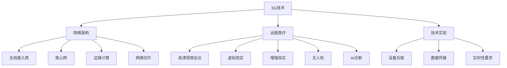

                 

### 文章标题

# 5G技术在远程医疗中的应用：突破地理限制

### 关键词

- 5G技术
- 远程医疗
- 高清视频会议
- 虚拟现实
- 增强现实
- 无人机
- AI诊断

### 摘要

本文深入探讨了5G技术在远程医疗中的应用，通过分析5G技术的基础、关键应用场景、技术实现和成功案例，展示了5G技术在突破地理限制、提高医疗效率和患者体验方面的巨大潜力。文章旨在为读者提供一个全面、系统的了解，并展望5G远程医疗的未来发展趋势。

### 目录

#### 第一部分：5G技术基础

- **第1章：5G技术概述**
  - 1.1 5G技术的发展背景与演进历程
  - 1.2 5G网络架构
  - 1.3 5G的关键性能指标

- **第2章：5G技术在远程医疗中的核心应用场景**
  - 2.1 远程医疗概述
  - 2.2 5G技术在远程医疗中的应用

#### 第二部分：5G在远程医疗中的应用

- **第3章：5G技术在远程医疗中的技术实现**
  - 3.1 5G网络与远程医疗设备的互联
  - 3.2 5G技术在远程医疗中的数据传输
  - 3.3 5G技术在远程医疗中的实时性要求

#### 第三部分：5G技术在远程医疗中的具体实现

- **第4章：5G在远程医疗中的成功案例与分析**
  - 4.1 某医院5G远程医疗系统建设
  - 4.2 5G在远程医疗中的挑战与解决方案

#### 第四部分：未来展望

- **第5章：5G在远程医疗中的未来发展趋势**
  - 5.1 5G与远程医疗的融合发展趋势
  - 5.2 5G远程医疗的产业生态构建
  - 5.3 5G远程医疗的社会影响与伦理问题

### 正文内容

#### 第一部分：5G技术基础

### 第1章：5G技术概述

#### 1.1 5G技术的发展背景与演进历程

随着移动通信技术的快速发展，从1G到4G，我们已经经历了数十年的变革。4G技术的普及带来了移动互联网的繁荣，使得高清视频、即时通信等应用成为可能。然而，随着物联网、大数据、云计算、虚拟现实和增强现实等新兴技术的兴起，现有的4G网络已经无法满足日益增长的数据需求和复杂的应用场景。

为了应对未来数十年的移动通信需求，5G技术应运而生。5G的全称是第五代移动通信技术（5th Generation Mobile Network Technology），它是继1G模拟通信、2G数字通信、3G互联网接入和4G宽带互联网之后的新一代通信技术。

5G技术的发展背景主要源于以下几个方面：

1. **物联网的发展需求**：物联网（Internet of Things，IoT）旨在将各种物体连接到互联网上，实现智能化的管理和控制。随着物联网设备的激增，传统的4G网络已经无法提供足够的连接能力和低延迟特性，5G技术的出现为物联网的发展提供了强有力的支撑。

2. **大数据和云计算的需求**：大数据和云计算技术的发展对网络带宽、延迟和可靠性提出了更高的要求。5G技术的高速率、低延迟和大连接能力为大数据和云计算的应用提供了更好的网络环境。

3. **新兴应用的需求**：虚拟现实（VR）、增强现实（AR）、自动驾驶、无人机等新兴应用对网络性能的要求越来越高，传统的4G网络已经无法满足这些应用的需求。5G技术的高速率和低延迟特性使得这些新兴应用成为可能。

5G技术的演进历程可以分为以下几个阶段：

1. **研究阶段**（2012-2015）：在这一阶段，国际电信联盟（ITU）启动了5G标准的制定工作，各主要国家和地区纷纷展开了5G技术研究。

2. **标准制定阶段**（2016-2018）：在这一阶段，ITU正式发布了5G标准，定义了5G的关键技术指标和应用场景。

3. **试商用阶段**（2019-2020）：在这一阶段，各主要国家和地区开始进行5G试商用部署，为大规模商用奠定了基础。

4. **商用阶段**（2021至今）：在这一阶段，5G网络在全球范围内大规模商用，推动了各行各业的数字化转型。

#### 1.2 5G网络架构

5G网络架构采用了全新的网络架构设计，主要包括以下几个层次：

1. **无线接入网**：无线接入网是5G网络的核心组成部分，负责连接移动终端和基站。5G无线接入网采用了大规模MIMO、毫米波、车联网等关键技术，实现了更高的网络容量和更低的延迟。

2. **核心网**：核心网是5G网络的中枢，负责处理用户数据、控制信令和通信资源分配等任务。5G核心网采用了云化、虚拟化等技术，实现了更高的灵活性和可扩展性。

3. **边缘计算**：边缘计算是5G网络的一个重要创新，它将计算和存储能力从云中心转移到网络边缘，实现了更低的延迟和更高的实时性。边缘计算可以支持实时语音、视频、大数据等高带宽、低延迟的应用需求。

4. **网络切片**：网络切片是5G网络的一个关键技术，它将一个物理网络分割成多个虚拟网络，为不同的应用场景提供定制化的网络服务。网络切片可以支持多种业务需求，如自动驾驶、智能制造、远程医疗等。

#### 1.3 5G的关键性能指标

5G技术相比前几代移动通信技术，具有以下几个关键性能指标的提升：

1. **峰值速率与吞吐量**：5G网络的峰值速率可达数十Gbps，是4G网络的百倍以上。5G网络的吞吐量也得到了显著提升，可以支持更多用户同时在线，满足高清视频、虚拟现实等高带宽应用的需求。

2. **低延迟**：5G网络的延迟大幅降低，平均延迟可低至1毫秒，是4G网络的十分之一。低延迟特性使得5G技术可以支持实时语音、视频通话、自动驾驶等实时应用。

3. **大连接能力**：5G网络具有更高的连接能力，可以支持海量设备的连接。5G网络的大连接能力可以支持物联网、智能家居、智能制造等应用场景。

4. **网络可靠性**：5G网络采用了更先进的无线通信技术，如MIMO、多连接等，提高了网络的可靠性。5G网络的可靠性可以满足关键业务需求，如远程医疗、自动驾驶等。

#### 第二部分：5G技术在远程医疗中的应用

### 第2章：5G技术在远程医疗中的核心应用场景

#### 2.1 远程医疗概述

远程医疗是指利用信息技术，特别是互联网和移动通信技术，实现医疗资源的远程共享和医疗服务的高效提供。远程医疗的发展经历了多个阶段，从最初的电子邮件、电话咨询，到视频会议、远程诊断，再到现在的智能医疗、大数据分析，远程医疗的技术手段不断丰富，应用场景也日益广泛。

远程医疗的优势在于：

1. **降低医疗成本**：通过远程医疗，患者可以在家中接受专业医生的服务，减少了往返医院的时间和交通费用，降低了医疗成本。

2. **提高医疗效率**：远程医疗可以减少医生的工作量，提高医生的诊断和治疗效率，同时也可以使患者得到更及时的治疗。

3. **扩大医疗资源覆盖**：远程医疗可以突破地理限制，使偏远地区的患者也能享受到优质的医疗服务，提高了医疗资源的公平性。

然而，远程医疗也面临一些挑战，如数据安全、隐私保护、医疗质量保障等。5G技术的引入为远程医疗的发展带来了新的机遇。

#### 2.2 5G技术在远程医疗中的应用

5G技术在远程医疗中的应用主要体现在以下几个方面：

1. **高清视频会议系统**

5G技术的高速率、低延迟特性使得高清视频会议成为可能。医生可以通过5G网络进行远程会诊，实现面对面的交流。高清视频会议系统能够提供更清晰的图像和更流畅的声音，使医生可以更准确地判断病情，提高诊断的准确性。

2. **虚拟现实（VR）在远程医疗中的应用**

虚拟现实技术可以为医生提供更为直观的诊疗环境。医生可以通过VR设备进行虚拟手术演练，提高手术的成功率。此外，VR技术还可以用于康复训练，帮助患者进行术后康复，提高康复效果。

3. **增强现实（AR）在远程医疗中的应用**

增强现实技术可以将虚拟信息叠加在现实场景中，为医生提供更多的诊疗信息。例如，医生可以通过AR眼镜查看患者的实时生命体征，实时调整治疗方案。AR技术还可以用于医学教育，帮助学生更直观地学习解剖知识。

4. **无人机在远程医疗中的应用**

无人机可以用于医疗物资的快速配送，特别是在偏远地区，无人机可以绕过交通拥堵和道路障碍，快速将急需的药品和医疗设备送达。此外，无人机还可以用于紧急医疗救援，为患者提供及时的救治。

5. **5G+AI在远程诊断中的应用**

5G与人工智能技术的结合，可以实现远程诊断的自动化和智能化。医生可以通过5G网络上传患者的医疗数据，利用人工智能进行分析和诊断，提高诊断的准确性和效率。

#### 第三部分：5G技术在远程医疗中的技术实现

### 第3章：5G技术在远程医疗中的技术实现

#### 3.1 5G网络与远程医疗设备的互联

5G网络与远程医疗设备的互联是5G技术应用于远程医疗的基础。5G网络具有高速率、低延迟和大连接能力，可以为远程医疗设备提供稳定、高效的数据传输环境。

首先，5G网络与远程医疗设备的互联需要满足以下要求：

1. **设备兼容性**：远程医疗设备需要支持5G网络，包括5G模块、天线等硬件设备，以及相应的软件系统。

2. **网络连接**：远程医疗设备需要通过5G网络与云平台或其他医疗设备进行数据传输，实现实时监控、数据分析和远程控制等功能。

3. **数据安全**：5G网络具有更高的数据安全性，可以保障远程医疗数据的安全传输和存储。

在实际应用中，5G网络与远程医疗设备的互联可以通过以下方式实现：

1. **5G模块集成**：将5G模块集成到远程医疗设备中，如心电监护仪、血压计等，使设备具备5G网络连接能力。

2. **无线接入点**：在医疗场所部署5G无线接入点（Access Point，AP），为远程医疗设备提供无线网络连接。

3. **有线连接**：通过以太网或光纤等有线网络连接远程医疗设备与5G基站，实现数据的高速传输。

#### 3.2 5G技术在远程医疗中的数据传输

5G技术在远程医疗中的数据传输主要体现在以下几个方面：

1. **数据传输效率的提升**

5G网络的高速率特性可以显著提升远程医疗数据的传输效率。相比4G网络，5G网络的峰值速率可达数十Gbps，能够快速传输高清视频、医学影像等大体积数据。此外，5G网络的大连接能力可以支持更多设备的并发连接，提高数据的传输效率。

2. **数据安全与隐私保护**

远程医疗涉及大量的个人健康数据，数据安全与隐私保护至关重要。5G网络采用了先进的加密技术，如AES-256位加密、TLS/SSL协议等，保障数据在传输过程中的安全性。同时，5G网络还提供了虚拟专用网络（VPN）功能，为远程医疗数据提供额外的安全保护。

3. **实时数据传输**

实时数据传输是远程医疗的关键需求之一，5G网络的低延迟特性可以满足实时数据传输的要求。5G网络的平均延迟可低至1毫秒，远低于4G网络的延迟。低延迟特性使得医生可以实时监控患者的生命体征，及时调整治疗方案，提高医疗效率。

#### 3.3 5G技术在远程医疗中的实时性要求

实时性要求是远程医疗中不可忽视的重要方面。5G技术在远程医疗中的实时性要求主要体现在以下几个方面：

1. **实时视频传输**

实时视频传输是远程医疗的核心功能之一，5G网络的低延迟特性可以保证视频传输的流畅性。医生可以通过5G网络实时观看患者的视频，进行远程诊断和治疗。相比4G网络，5G网络的延迟更低，能够提供更高质量的实时视频传输。

2. **实时数据采集与处理**

实时数据采集与处理是远程医疗的重要组成部分。5G网络的高速率和低延迟特性可以支持大量医疗数据的实时采集和处理。医生可以通过5G网络实时获取患者的医疗数据，如心电图、血压、血糖等，进行实时分析和诊断。

3. **边缘计算**

边缘计算是5G技术的一个重要创新，它将计算和存储能力从云中心转移到网络边缘，实现了更低的延迟和更高的实时性。在远程医疗中，边缘计算可以用于实时处理医疗数据，如心电图分析、呼吸监测等，提供更快速、更准确的诊断结果。

#### 第四部分：5G技术在远程医疗中的成功案例与分析

### 第4章：5G在远程医疗中的成功案例与分析

#### 4.1 某医院5G远程医疗系统建设

某医院引入了5G远程医疗系统，该系统包括高清视频会议、虚拟现实、增强现实和无人机等关键技术。以下是对该项目的分析：

1. **项目背景**

随着医疗资源的分布不均，偏远地区的患者往往难以获得优质的医疗服务。为了解决这一问题，某医院决定建设5G远程医疗系统，通过5G网络将优质医疗资源引入偏远地区。

2. **技术实现**

（1）**高清视频会议**：医生通过5G网络进行远程会诊，实现面对面的交流。5G网络的低延迟和高速率保证了视频会议的流畅性。

（2）**虚拟现实**：医生通过VR设备进行虚拟手术演练，提高手术的成功率。患者也可以通过VR进行康复训练。

（3）**增强现实**：医生通过AR眼镜查看患者的实时生命体征，实时调整治疗方案。

（4）**无人机**：无人机用于医疗物资的快速配送，特别是在偏远地区，无人机可以绕过交通拥堵和道路障碍，快速将急需的药品和医疗设备送达。

3. **项目效果评估**

（1）**提高医疗效率**：远程医疗系统使医生可以更高效地进行诊断和治疗，减少了患者往返医院的时间和医疗成本。

（2）**提升患者体验**：高清视频会议、VR和AR技术为患者提供了更加直观的诊疗体验，提高了患者的满意度。

（3）**扩大医疗资源覆盖**：远程医疗系统使偏远地区的患者也能享受到优质的医疗服务，提高了医疗资源的公平性。

#### 4.2 5G在远程医疗中的挑战与解决方案

尽管5G技术在远程医疗中展现出了巨大的潜力，但仍然面临一些挑战：

1. **网络覆盖不足**

5G网络的覆盖范围相对较小，特别是在偏远地区，网络覆盖不足会影响远程医疗的效果。解决方案是增加5G基站的部署，扩大网络覆盖范围。

2. **数据安全与隐私保护**

远程医疗涉及大量的个人健康数据，数据安全与隐私保护至关重要。解决方案是采用先进的加密技术和安全协议，确保数据在传输和存储过程中的安全性。

3. **技术标准化与生态构建**

5G远程医疗需要产业链上下游的合作与协同，技术标准化和生态构建是关键。解决方案是推动技术标准的制定，构建完善的产业生态。

#### 第五部分：未来展望

### 第5章：5G在远程医疗中的未来发展趋势

5G技术在远程医疗中的应用正处于快速发展阶段，未来将继续推动远程医疗的变革。以下是5G在远程医疗中的未来发展趋势：

1. **5G与远程医疗的融合发展趋势**

5G技术的快速发展和远程医疗的广泛应用，将促使两者深度融合。未来，5G技术将进一步提升远程医疗的服务质量，实现医疗资源的全面共享。

2. **5G远程医疗的产业生态构建**

5G远程医疗的产业生态将涉及硬件设备、网络基础设施、云平台、医疗软件等多个领域。产业链上下游的合作与协同，将推动5G远程医疗的快速发展。

3. **5G远程医疗的社会影响与伦理问题**

5G远程医疗的广泛应用将对社会医疗体系产生深远影响，提高医疗资源的公平性和可及性。同时，5G远程医疗也面临一些伦理问题，如数据隐私保护、医疗责任划分等。需要制定相关法律法规，保障5G远程医疗的健康发展。

### 总结

5G技术在远程医疗中的应用为医疗行业带来了新的机遇和挑战。通过高清视频会议、虚拟现实、增强现实、无人机和5G+AI等关键技术，5G远程医疗将突破地理限制，提高医疗效率，提升患者体验。未来，随着5G技术的进一步发展，远程医疗将更加普及，为社会医疗体系的优化提供强有力的支持。

### 作者信息

作者：AI天才研究院/AI Genius Institute & 禅与计算机程序设计艺术 /Zen And The Art of Computer Programming

### Mermaid 流程图



### 核心算法原理讲解

```plaintext
// 5G网络中的资源分配算法（伪代码）
function resourceAllocation(network, devices):
    for each device in devices:
        if device.isAvailable():
            allocateResources(device)
        else:
            scheduleRetry(device)
    end for
end function

function allocateResources(device):
    // 根据网络状态和设备需求进行资源分配
    network.allocateChannel(device)
    network.allocateBandwidth(device)
    network.allocatePower(device)
end function
```

### 数学模型和公式

$$
\text{传输速率} = \frac{\text{数据传输量}}{\text{传输时间}}
$$

### 详细讲解与举例说明

传输速率是衡量网络性能的一个重要指标，它表示数据在单位时间内传输的数量。在5G网络中，传输速率可以达到数十Gbps，是4G网络的百倍以上。

举例说明：假设5G网络的传输速率为100Gbps，传输一部1GB的高清电影所需的时间可以通过以下公式计算：

$$
\text{传输时间} = \frac{\text{数据传输量}}{\text{传输速率}} = \frac{1GB}{100Gbps} = 0.01秒
$$

这意味着在5G网络下，传输一部1GB的高清电影只需要0.01秒，大大提高了数据传输的效率。

### 最佳实践 Tips

1. **选择合适的5G设备**：在选择5G远程医疗设备时，要考虑设备的兼容性、性能和稳定性，确保设备能够满足远程医疗的需求。

2. **确保网络稳定性**：5G网络的覆盖范围相对较小，要确保医疗场所的5G网络信号稳定，避免因网络中断而影响医疗服务的质量。

3. **加强数据安全**：在远程医疗中，数据安全至关重要。要采用先进的加密技术和安全协议，保障数据在传输和存储过程中的安全性。

4. **培训医务人员**：医务人员需要了解5G远程医疗的操作方法和注意事项，进行必要的培训，提高医疗服务的效率和质量。

### 小结

本文通过详细分析5G技术在远程医疗中的应用，展示了5G技术在突破地理限制、提高医疗效率和患者体验方面的巨大潜力。未来，随着5G技术的进一步发展，远程医疗将迎来更加广阔的发展空间。同时，我们也需要关注5G远程医疗中的挑战和问题，制定相应的解决方案，推动远程医疗的健康发展。

### 拓展阅读

1. **《5G远程医疗技术手册》**：详细介绍了5G技术在远程医疗中的应用原理和技术实现。

2. **《5G与物联网》**：探讨了5G技术在物联网中的应用，包括智能家居、智能制造等领域。

3. **《远程医疗法规与伦理》**：分析了远程医疗在法律法规和伦理方面的问题和挑战。

4. **《虚拟现实与远程医疗》**：介绍了虚拟现实技术在远程医疗中的应用，包括手术模拟、康复训练等。

