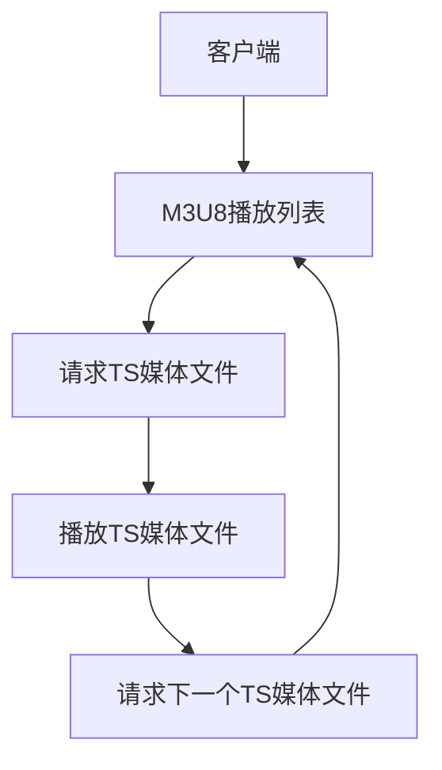
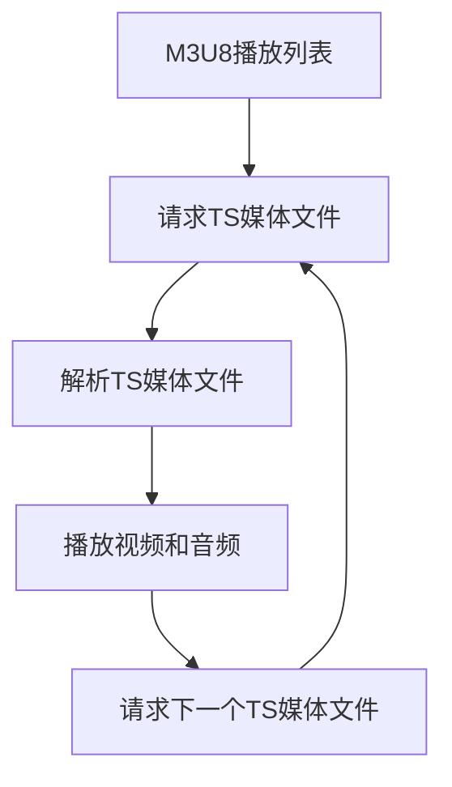

                 


## 文章标题

《HLS流媒体协议：在HTTP上分发视频内容》

## 文章关键词

HLS，流媒体协议，HTTP，视频分发，自适应流技术，媒体切片，关键帧预加载

## 摘要

本文将深入探讨HLS（HTTP Live Streaming）协议，这是一种基于HTTP的流媒体传输协议，用于在互联网上高效地分发视频内容。文章将从流媒体技术的发展历程开始，逐步介绍HLS协议的基础、核心算法原理、数学模型与公式，以及HLS项目实战。通过详细的讲解和案例分析，读者将了解到HLS协议的工作原理、优势和应用场景，为实际开发提供理论支持和实践指导。

### 第一部分：HLS基础

#### 第1章：流媒体技术概述

##### 1.1 流媒体技术的发展历程

流媒体技术的起源可以追溯到20世纪90年代，当时互联网的发展还处于初级阶段，但人们已经开始探索如何通过网络传输多媒体内容。最早的流媒体传输协议之一是RealVideo，由RealNetworks开发，它通过将视频内容分割成一系列连续的片段进行传输，实现了视频的实时播放。

随着互联网带宽的不断增加和技术的进步，流媒体技术逐渐发展，出现了多种流媒体传输协议。其中，RTMP（Real Time Messaging Protocol）是由Adobe开发的，广泛用于Flash视频流传输。然而，随着HTML5的普及和Flash的逐渐淘汰，RTMP的应用也受到了限制。

为了解决这些问题，苹果公司于2010年推出了HLS（HTTP Live Streaming）协议。HLS利用HTTP协议传输媒体内容，通过将视频内容分割成一系列小的媒体文件（通常称为切片），实现视频的实时播放。HLS协议的设计初衷是为了提供一种跨平台、跨设备的流媒体传输方案，因此它支持多种操作系统和设备，包括iOS、Android和桌面浏览器等。

##### 1.2 流媒体技术的分类

流媒体技术可以根据传输方式和播放特性进行分类，主要分为以下几类：

- **实时流媒体**：实时流媒体技术适用于需要实时传输视频的应用场景，如在线直播、视频会议等。这些协议通常要求服务器和客户端之间保持持续的网络连接，以确保实时传输的流畅性。
- **点播流媒体**：点播流媒体技术适用于用户主动选择视频内容的场景，如视频网站、电子书等。这些协议允许用户在观看视频前先下载部分内容，从而实现离线观看。
- **直播流媒体**：直播流媒体技术是一种实时传输视频内容的方式，通常用于在线游戏、体育直播等场景。这些协议通常需要较高的带宽和实时性要求，以确保用户能够实时观看视频内容。

##### 1.3 HLS协议的优势

HLS协议相较于其他流媒体传输协议，具有以下优势：

- **跨平台兼容性**：HLS协议支持多种操作系统和设备，包括iOS、Android、桌面浏览器等，可以满足不同用户的需求。
- **自适应流技术**：HLS协议支持自适应流技术，可以根据用户网络状况自动调整视频播放质量，确保用户获得最佳观看体验。
- **高效压缩**：HLS协议使用高效的视频压缩算法，可以降低带宽占用，提高传输效率。
- **简单易用**：HLS协议使用简单的HTTP协议进行传输，实现起来相对简单，对于开发者和内容提供者来说都较为友好。

### 第2章：HLS协议基础

##### 2.1 HLS协议简介

HLS（HTTP Live Streaming）是一种基于HTTP协议的流媒体传输协议，用于在互联网上分发视频内容。与传统的流媒体传输协议（如RTMP、RTSP等）不同，HLS利用HTTP协议传输媒体内容，通过将视频内容分割成一系列小的媒体文件（称为切片），实现视频的实时播放。

HLS协议由苹果公司于2010年推出，最初主要用于iOS和Mac OS平台。然而，随着HLS协议的广泛应用和跨平台支持，现在已成为流媒体传输领域的重要协议之一。HLS协议的核心思想是将视频内容分割成多个小的媒体文件，这些文件通过HTTP协议传输到客户端，客户端再根据播放需求逐个请求和播放这些文件。

##### 2.2 HLS文件结构

在HLS协议中，视频内容被分割成多个小的媒体文件，这些文件具有特定的文件结构和命名规则。通常，一个HLS流由以下几个文件组成：

- **M3U8播放列表文件**：M3U8文件是一个文本文件，包含了一组媒体文件的URL地址。这些URL地址指向了不同的媒体文件，客户端可以根据播放需求逐个请求和播放这些文件。
- **TS媒体文件**：TS（Transport Stream）文件是一种常见的视频文件格式，用于存储HLS协议中的媒体内容。每个TS文件通常包含了视频和音频数据，以及一些控制信息。
- **ISO基带文件**：ISO基带文件是一种用于存储原始视频和音频数据的文件格式，通常用于HLS协议中的原始流媒体传输。

##### 2.3 HLS播放流程

HLS协议的播放流程可以分为以下几个步骤：

1. **请求M3U8播放列表文件**：客户端首先向服务器请求M3U8播放列表文件，该文件包含了所有媒体文件的URL地址。
2. **解析M3U8播放列表文件**：客户端解析M3U8播放列表文件，获取其中的媒体文件URL地址，并按照播放顺序依次请求和播放这些文件。
3. **请求和播放TS媒体文件**：客户端根据M3U8播放列表文件中的URL地址，请求并播放相应的TS媒体文件。TS媒体文件包含了视频和音频数据，以及一些控制信息，客户端需要解析这些数据并播放。
4. **持续请求和播放**：在播放过程中，客户端会不断请求和播放后续的TS媒体文件，以确保视频内容能够持续播放。同时，客户端可以根据网络状况和播放需求，自动调整视频播放质量。

### 第3章：HLS协议核心概念与联系

##### 3.1 HLS协议的关键概念

HLS协议涉及多个关键概念，这些概念对于理解HLS协议的工作原理至关重要。以下是HLS协议中的几个关键概念：

- **切片**：切片是HLS协议中的基本数据单元，用于存储视频和音频内容。每个切片通常包含一段视频或音频数据，可以独立请求和播放。
- **M3U8播放列表**：M3U8播放列表是一种文本文件，用于存储HLS流中的所有媒体文件的URL地址。播放列表包含了媒体文件的播放顺序，客户端可以根据播放列表逐个请求和播放媒体文件。
- **TS媒体文件**：TS媒体文件是一种常见的视频文件格式，用于存储HLS协议中的媒体内容。每个TS文件通常包含了视频和音频数据，以及一些控制信息。
- **ISO基带文件**：ISO基带文件是一种用于存储原始视频和音频数据的文件格式，通常用于HLS协议中的原始流媒体传输。

##### 3.2 HLS协议中的关系与交互

HLS协议中的关键概念之间存在着紧密的联系和交互，以下是一个简单的Mermaid流程图，展示了HLS协议中的关系和交互：



- **客户端**：客户端是HLS协议的请求方，它首先向服务器请求M3U8播放列表文件。
- **M3U8播放列表**：M3U8播放列表文件包含了所有媒体文件的URL地址，客户端根据播放列表请求和播放相应的TS媒体文件。
- **TS媒体文件**：TS媒体文件是HLS协议中的媒体内容存储文件，客户端请求并播放这些文件。
- **请求和播放**：客户端不断请求和播放TS媒体文件，以确保视频内容能够持续播放。

##### 3.3 HLS协议的Mermaid流程图

以下是一个简化的HLS协议的Mermaid流程图，用于展示HLS协议的核心流程：



- **M3U8播放列表**：M3U8播放列表文件包含了所有TS媒体文件的URL地址，客户端根据播放列表请求和播放相应的TS媒体文件。
- **请求TS媒体文件**：客户端请求M3U8播放列表文件，并从中获取TS媒体文件的URL地址。
- **解析TS媒体文件**：客户端解析TS媒体文件，提取视频和音频数据，并进行解码和播放。
- **播放视频和音频**：客户端播放解析后的视频和音频数据，实现视频的实时播放。
- **请求下一个TS媒体文件**：播放完成后，客户端请求下一个TS媒体文件，继续播放视频内容。

### 第二部分：HLS核心算法原理

#### 第4章：媒体切片技术

##### 4.1 媒体切片原理

媒体切片技术是HLS协议的核心技术之一，它将连续的视频和音频内容分割成一系列小的媒体文件（切片），以便客户端能够逐个请求和播放这些文件。切片技术的主要原理如下：

1. **时间分割**：首先，将原始的视频和音频数据按照一定的时间间隔进行分割。这个时间间隔称为切片时长，通常为几秒到几十秒不等。时间分割的目的是将连续的视频和音频内容分割成多个小的片段，以便客户端可以逐个请求和播放。
2. **数据压缩**：然后，对每个时间间隔内的视频和音频数据进行压缩。压缩的目的是减小数据大小，降低带宽占用。常用的视频压缩算法包括H.264、H.265等，音频压缩算法包括AAC、MP3等。
3. **切片文件生成**：最后，将压缩后的视频和音频数据存储为一系列的媒体文件。这些文件通常具有特定的文件扩展名，如`.ts`（Transport Stream）或`.m3u8`（播放列表文件）。

通过媒体切片技术，客户端可以按照播放需求逐个请求和播放切片文件，从而实现视频的实时播放。切片技术的好处包括：

- **更好的缓存性能**：由于切片文件较小，客户端可以更快地请求和缓存这些文件，从而提高播放性能。
- **更好的兼容性**：切片技术支持多种视频和音频压缩算法，可以满足不同客户端的需求。
- **更好的网络适应性**：切片技术可以根据网络状况动态调整切片时长和压缩质量，从而提高网络适应性。

##### 4.2 媒体切片算法

媒体切片算法是HLS协议中实现媒体切片的核心算法，它负责将原始的视频和音频数据分割成一系列的切片文件。以下是媒体切片算法的伪代码：

```python
def slice_media(input_stream, slice_duration):
    output_streams = []
    current_time = 0
    while current_time < input_stream.duration:
        start_time = current_time
        end_time = start_time + slice_duration
        video_stream = extract_video_slice(input_stream, start_time, end_time)
        audio_stream = extract_audio_slice(input_stream, start_time, end_time)
        compressed_video_stream = compress_video(video_stream)
        compressed_audio_stream = compress_audio(audio_stream)
        output_streams.append({
            'video': compressed_video_stream,
            'audio': compressed_audio_stream,
            'duration': slice_duration
        })
        current_time += slice_duration
    return output_streams
```

- `input_stream`：原始视频和音频输入流。
- `slice_duration`：切片时长，用于控制每个切片的持续时间。
- `output_streams`：输出流列表，用于存储生成的切片文件。

在媒体切片算法中，主要涉及到以下几个步骤：

1. **时间分割**：根据切片时长`slice_duration`，对原始视频和音频输入流进行时间分割，生成一系列的时间区间。
2. **数据提取**：从原始视频和音频输入流中提取对应时间区间内的视频和音频数据。
3. **数据压缩**：对提取的视频和音频数据进行压缩，生成压缩后的视频和音频数据。
4. **切片文件生成**：将压缩后的视频和音频数据存储为一系列的切片文件，每个切片文件包含一段视频和音频数据。

通过上述算法，可以实现对原始视频和音频数据的媒体切片，生成一系列的切片文件，供客户端请求和播放。

##### 4.3 媒体切片算法伪代码详解

下面是对媒体切片算法伪代码的详细解释：

```python
def slice_media(input_stream, slice_duration):
    output_streams = []
    current_time = 0
    while current_time < input_stream.duration:
        start_time = current_time
        end_time = start_time + slice_duration
        video_stream = extract_video_slice(input_stream, start_time, end_time)
        audio_stream = extract_audio_slice(input_stream, start_time, end_time)
        compressed_video_stream = compress_video(video_stream)
        compressed_audio_stream = compress_audio(audio_stream)
        output_streams.append({
            'video': compressed_video_stream,
            'audio': compressed_audio_stream,
            'duration': slice_duration
        })
        current_time += slice_duration
    return output_streams
```

1. **初始化**：定义一个空列表`output_streams`用于存储生成的切片文件。
2. **时间分割**：使用一个`while`循环遍历原始视频和音频输入流的时间区间。每次循环迭代，计算当前时间区间内的开始时间和结束时间。
3. **数据提取**：调用`extract_video_slice`和`extract_audio_slice`函数，从原始视频和音频输入流中提取对应时间区间内的视频和音频数据。
4. **数据压缩**：调用`compress_video`和`compress_audio`函数，对提取的视频和音频数据进行压缩，生成压缩后的视频和音频数据。
5. **切片文件生成**：将压缩后的视频和音频数据存储为一个切片文件，并将其添加到`output_streams`列表中。
6. **循环迭代**：将当前时间区间加上切片时长`slice_duration`，继续遍历下一个时间区间。
7. **返回结果**：返回生成的切片文件列表`output_streams`。

通过上述伪代码，可以实现对原始视频和音频数据的媒体切片，生成一系列的切片文件，供客户端请求和播放。

#### 第5章：自适应流技术

##### 5.1 自适应流原理

自适应流技术是HLS协议中的关键特性之一，它能够根据客户端的网络状况和播放需求，动态调整视频播放质量。自适应流的原理如下：

1. **多码率、多分辨率**：HLS协议支持多码率、多分辨率视频流。服务器可以将原始视频内容分割成多个不同码率和分辨率的流，每个流具有不同的带宽需求和播放质量。
2. **请求和播放**：客户端首先请求并播放低码率、低分辨率的视频流，以快速获取视频内容。在播放过程中，客户端会根据网络状况和播放需求，实时调整视频流的质量。
3. **切换和缓冲**：当客户端的网络状况发生变化，或者需要更高/更低质量的视频流时，客户端会请求新的视频流，并根据缓冲区中的数据切换到新的视频流。同时，客户端会根据新的视频流进行缓冲，以确保视频播放的连续性和流畅性。
4. **自动调整**：自适应流技术通常会集成一些算法和策略，自动调整视频流的码率和分辨率。这些算法和策略可以根据网络状况、播放需求等因素，实时调整视频流的质量。

通过自适应流技术，客户端可以实时调整视频播放质量，以适应不同的网络环境和播放需求，从而提高观看体验。自适应流技术的好处包括：

- **更好的网络适应性**：自适应流技术可以根据网络状况动态调整视频流的质量，从而降低网络带宽占用，提高视频播放的流畅性。
- **更好的用户体验**：自适应流技术可以根据用户的观看需求，实时调整视频流的质量，提高观看体验。
- **更好的资源利用**：自适应流技术可以根据网络状况和播放需求，动态调整视频流的质量，从而更好地利用网络和服务器资源。

##### 5.2 自适应流算法

自适应流算法是HLS协议中实现自适应流技术的重要部分，它负责根据客户端的网络状况和播放需求，动态调整视频播放质量。以下是自适应流算法的伪代码：

```python
def adaptive_streaming(client_network_status, client_playback_quality):
    if client_network_status == 'good':
        return 'high_quality_stream'
    elif client_network_status == 'fair':
        return 'medium_quality_stream'
    elif client_network_status == 'poor':
        return 'low_quality_stream'
    else:
        return client_playback_quality
```

- `client_network_status`：客户端网络状况，可以是'good'（良好）、'fair'（一般）或'poor'（差）。
- `client_playback_quality`：客户端当前播放质量，可以是'high'（高）、'medium'（中）或'low'（低）。
- `adaptive_streaming`：自适应流函数，根据客户端的网络状况和播放需求，返回合适的视频流。

在自适应流算法中，主要涉及到以下几个步骤：

1. **网络状况检测**：实时检测客户端的网络状况，判断网络状况是良好、一般还是差。
2. **播放质量调整**：根据客户端的网络状况和当前播放质量，动态调整视频流的质量。如果网络状况良好，可以提高视频流的质量；如果网络状况较差，可以降低视频流的质量。
3. **请求和播放**：根据调整后的视频流质量，请求并播放新的视频流。同时，客户端会根据新的视频流进行缓冲，以确保视频播放的连续性和流畅性。

通过自适应流算法，客户端可以根据网络状况和播放需求，动态调整视频播放质量，从而提高观看体验。

##### 5.3 自适应流算法伪代码详解

下面是对自适应流算法伪代码的详细解释：

```python
def adaptive_streaming(client_network_status, client_playback_quality):
    if client_network_status == 'good':
        return 'high_quality_stream'
    elif client_network_status == 'fair':
        return 'medium_quality_stream'
    elif client_network_status == 'poor':
        return 'low_quality_stream'
    else:
        return client_playback_quality
```

1. **参数输入**：自适应流函数`adaptive_streaming`接受两个参数，`client_network_status`表示客户端的网络状况，`client_playback_quality`表示客户端当前的播放质量。
2. **网络状况判断**：使用`if-elif-else`语句判断客户端的网络状况。如果网络状况是'good'（良好），则返回'high_quality_stream'（高质量流）；如果网络状况是'fair'（一般），则返回'medium_quality_stream'（中等质量流）；如果网络状况是'poor'（差），则返回'low_quality_stream'（低质量流）；如果网络状况未知，则返回当前播放质量`client_playback_quality`。
3. **返回结果**：根据网络状况判断，返回合适的视频流。

通过上述伪代码，自适应流算法可以根据客户端的网络状况和播放需求，动态调整视频播放质量，从而提高观看体验。

#### 第6章：关键帧预加载技术

##### 6.1 关键帧预加载原理

关键帧预加载技术是HLS协议中实现视频流畅播放的重要技术之一，它通过预先加载关键帧，减少播放缓冲时间，提高视频播放的流畅性。关键帧预加载的原理如下：

1. **关键帧识别**：在视频编码过程中，编码器会将视频内容分割成多个关键帧。关键帧是视频中的关键信息，它包含了视频的完整画面，可以独立解码和播放。
2. **预加载策略**：在视频播放前，客户端根据预加载策略，预先加载关键帧。预加载策略可以根据视频的播放时长、关键帧的分布情况以及客户端的网络状况进行动态调整。
3. **缓冲区管理**：客户端维护一个缓冲区，用于存储预先加载的关键帧。在播放过程中，客户端会根据播放进度和缓冲区中的关键帧数量，动态调整预加载策略。
4. **播放和切换**：在播放过程中，客户端首先播放缓冲区中的关键帧，确保视频播放的连续性和流畅性。当缓冲区中的关键帧不足时，客户端会根据预加载策略重新加载关键帧。

通过关键帧预加载技术，客户端可以提前加载关键帧，减少播放缓冲时间，从而提高视频播放的流畅性。关键帧预加载技术的好处包括：

- **减少播放缓冲时间**：通过预先加载关键帧，客户端可以减少播放缓冲时间，提高视频播放的流畅性。
- **提高观看体验**：关键帧预加载技术可以降低视频播放的延迟，提高用户的观看体验。
- **优化网络资源**：关键帧预加载技术可以根据视频的播放时长和关键帧的分布情况，动态调整预加载策略，优化网络资源的利用。

##### 6.2 关键帧预加载算法

关键帧预加载算法是HLS协议中实现关键帧预加载的核心算法，它负责根据视频的播放时长、关键帧的分布情况以及客户端的网络状况，动态调整预加载策略。以下是关键帧预加载算法的伪代码：

```python
def preload_keyframes(video_duration, keyframe_interval, client_network_status):
    if client_network_status == 'good':
        preload_duration = video_duration * 1.5
    elif client_network_status == 'fair':
        preload_duration = video_duration * 1.2
    elif client_network_status == 'poor':
        preload_duration = video_duration * 1.0
    else:
        preload_duration = video_duration * 0.8
    
    keyframes = []
    current_time = 0
    while current_time < preload_duration:
        keyframes.append(current_time)
        current_time += keyframe_interval
    
    return keyframes
```

- `video_duration`：视频播放时长。
- `keyframe_interval`：关键帧间隔。
- `client_network_status`：客户端网络状况。
- `preload_keyframes`：关键帧预加载函数，根据视频的播放时长、关键帧的间隔以及客户端的网络状况，返回预加载的关键帧列表。

在关键帧预加载算法中，主要涉及到以下几个步骤：

1. **网络状况检测**：实时检测客户端的网络状况，判断网络状况是良好、一般还是差。
2. **预加载时长计算**：根据客户端的网络状况，动态计算预加载的关键帧时长。如果网络状况良好，可以适当增加预加载时长；如果网络状况较差，可以适当减少预加载时长。
3. **关键帧生成**：使用关键帧间隔，生成一系列的关键帧列表。关键帧列表包含了预加载的关键帧时间点。
4. **返回结果**：返回预加载的关键帧列表。

通过关键帧预加载算法，客户端可以动态调整预加载策略，提前加载关键帧，减少播放缓冲时间，从而提高视频播放的流畅性。

##### 6.3 关键帧预加载算法伪代码详解

下面是对关键帧预加载算法伪代码的详细解释：

```python
def preload_keyframes(video_duration, keyframe_interval, client_network_status):
    if client_network_status == 'good':
        preload_duration = video_duration * 1.5
    elif client_network_status == 'fair':
        preload_duration = video_duration * 1.2
    elif client_network_status == 'poor':
        preload_duration = video_duration * 1.0
    else:
        preload_duration = video_duration * 0.8
    
    keyframes = []
    current_time = 0
    while current_time < preload_duration:
        keyframes.append(current_time)
        current_time += keyframe_interval
    
    return keyframes
```

1. **参数输入**：关键帧预加载函数`preload_keyframes`接受三个参数，`video_duration`表示视频播放时长，`keyframe_interval`表示关键帧间隔，`client_network_status`表示客户端网络状况。
2. **网络状况判断**：使用`if-elif-else`语句判断客户端的网络状况。如果网络状况是'good'（良好），则预加载时长为视频播放时长的1.5倍；如果网络状况是'fair'（一般），则预加载时长为视频播放时长的1.2倍；如果网络状况是'poor'（差），则预加载时长为视频播放时长；如果网络状况未知，则预加载时长为视频播放时长的0.8倍。
3. **关键帧生成**：使用关键帧间隔，生成一系列的关键帧列表。关键帧列表包含了预加载的关键帧时间点。
4. **返回结果**：返回预加载的关键帧列表。

通过上述伪代码，关键帧预加载算法可以根据视频的播放时长、关键帧的间隔以及客户端的网络状况，动态调整预加载策略，提前加载关键帧，减少播放缓冲时间，从而提高视频播放的流畅性。

#### 第7章：HLS数学模型介绍

##### 7.1 常用数学模型

在HLS协议中，常用的数学模型包括时间模型、码率模型和缓冲模型等。这些模型用于描述视频流传输、缓冲和处理过程中的关键参数和关系。

- **时间模型**：时间模型用于描述视频流的时间特性，包括视频时长、关键帧时间间隔、切片时长等。时间模型有助于分析视频流的播放性能和延迟特性。
- **码率模型**：码率模型用于描述视频流的码率特性，包括视频码率、音频码率和数据传输速率等。码率模型有助于分析视频流对网络带宽的需求和传输效率。
- **缓冲模型**：缓冲模型用于描述视频流在客户端缓冲区中的存储和处理过程。缓冲模型有助于分析缓冲区的容量、缓冲策略和缓冲时间等。

##### 7.2 数学模型在HLS中的应用

数学模型在HLS协议中的应用主要包括以下几个方面：

- **自适应流技术**：自适应流技术利用码率模型和时间模型，根据客户端的网络状况和播放需求，动态调整视频流的码率和播放质量。
- **缓冲管理**：缓冲模型用于管理客户端缓冲区中的视频数据，确保视频播放的连续性和流畅性。
- **预加载策略**：关键帧预加载技术利用时间模型和缓冲模型，根据视频的播放时长和关键帧的分布情况，动态调整预加载策略。

##### 7.3 数学模型公式与解释

以下是一些常用的数学模型公式及其解释：

- **时间模型公式**：

  - 切片时长（$T_s$）：$T_s = \frac{L}{B}$，其中$L$为视频时长，$B$为码率。
  - 关键帧时间间隔（$T_k$）：$T_k = \frac{L}{K}$，其中$L$为视频时长，$K$为关键帧数量。

- **码率模型公式**：

  - 视频码率（$R_v$）：$R_v = B \times L$，其中$B$为码率，$L$为视频时长。
  - 音频码率（$R_a$）：$R_a = C \times L$，其中$C$为音频码率。

- **缓冲模型公式**：

  - 缓冲容量（$C$）：$C = \alpha \times B \times T_s$，其中$\alpha$为缓冲系数，$B$为码率，$T_s$为切片时长。

通过以上数学模型公式，可以更好地描述和优化HLS协议中的视频流传输、缓冲和处理过程。

### 第8章：HLS数学公式详解

##### 8.1 常见数学公式

在HLS协议中，常用的数学公式主要包括时间模型公式、码率模型公式和缓冲模型公式。以下是对这些公式的详细介绍：

- **时间模型公式**：

  - 切片时长（$T_s$）：切片时长是视频流被分割成切片的时长。在HLS协议中，切片时长通常与码率（$B$）和视频时长（$L$）有关，公式如下：
    $$T_s = \frac{L}{B}$$
    其中$L$表示视频的总时长（以秒为单位），$B$表示视频的码率（以比特每秒为单位）。切片时长的计算可以帮助确定每个切片文件的大小。

  - 关键帧时间间隔（$T_k$）：关键帧是视频中的重要帧，用于维持视频的播放连续性。关键帧的时间间隔通常与视频的总时长（$L$）和关键帧的数量（$K$）有关，公式如下：
    $$T_k = \frac{L}{K}$$
    其中$L$表示视频的总时长（以秒为单位），$K$表示视频中的关键帧数量。关键帧时间间隔的计算可以帮助确定关键帧之间的时间差。

- **码率模型公式**：

  - 视频码率（$R_v$）：视频码率是指视频数据在单位时间内传输的比特数。视频码率的计算公式如下：
    $$R_v = B \times L$$
    其中$B$表示视频的码率（以比特每秒为单位），$L$表示视频的总时长（以秒为单位）。视频码率可以帮助确定视频流对网络带宽的需求。

  - 音频码率（$R_a$）：音频码率是指音频数据在单位时间内传输的比特数。音频码率的计算公式如下：
    $$R_a = C \times L$$
    其中$C$表示音频的码率（以比特每秒为单位），$L$表示视频的总时长（以秒为单位）。音频码率可以帮助确定音频流对网络带宽的需求。

- **缓冲模型公式**：

  - 缓冲容量（$C$）：缓冲容量是指客户端缓冲区中可以存储的最大数据量。缓冲容量的计算公式如下：
    $$C = \alpha \times B \times T_s$$
    其中$\alpha$表示缓冲系数，$B$表示视频的码率（以比特每秒为单位），$T_s$表示切片时长。缓冲系数$\alpha$通常是一个介于0和1之间的数，用于调整缓冲区的容量。

##### 8.2 数学公式在HLS中的应用

数学公式在HLS协议中的应用非常广泛，以下是一些具体的应用场景：

- **自适应流技术**：自适应流技术利用时间模型和码率模型，根据客户端的网络状况动态调整视频流的码率和播放质量。例如，当客户端的网络状况良好时，可以采用较高的码率以提供更好的观看体验；当网络状况较差时，可以降低码率以减少带宽占用。

- **缓冲策略**：缓冲策略利用缓冲模型，根据视频流的特性动态调整缓冲区的容量。例如，当视频流的码率较高时，可以适当增加缓冲容量以减少播放缓冲时间；当视频流的码率较低时，可以减小缓冲容量以避免缓冲区溢出。

- **预加载策略**：预加载策略利用时间模型和缓冲模型，根据视频的播放时长和关键帧的分布情况动态调整预加载的关键帧数量。例如，当视频的播放时长较长时，可以适当增加预加载的关键帧数量以减少播放缓冲时间。

##### 8.3 数学公式举例说明

以下是一些具体的数学公式举例说明：

- **计算切片时长**：

  假设一个视频的总时长为$120$秒，码率为$5000$比特每秒，则切片时长为：
  $$T_s = \frac{L}{B} = \frac{120}{5000} = 0.024 \text{秒}$$

- **计算关键帧时间间隔**：

  假设一个视频的总时长为$120$秒，关键帧数量为$25$个，则关键帧时间间隔为：
  $$T_k = \frac{L}{K} = \frac{120}{25} = 4.8 \text{秒}$$

- **计算视频码率**：

  假设一个视频的总时长为$120$秒，码率为$5000$比特每秒，则视频码率为：
  $$R_v = B \times L = 5000 \times 120 = 600000 \text{比特/秒}$$

- **计算音频码率**：

  假设一个音频的码率为$128$比特每秒，视频的总时长为$120$秒，则音频码率为：
  $$R_a = C \times L = 128 \times 120 = 15360 \text{比特/秒}$$

- **计算缓冲容量**：

  假设缓冲系数$\alpha$为$0.8$，视频的码率为$5000$比特每秒，切片时长为$0.024$秒，则缓冲容量为：
  $$C = \alpha \times B \times T_s = 0.8 \times 5000 \times 0.024 = 96 \text{字节}$$

通过上述举例，可以更直观地理解数学公式在HLS协议中的应用，以及如何根据不同的参数计算出相应的结果。

### 第四部分：HLS项目实战

#### 第9章：HLS开发环境搭建

##### 9.1 开发环境准备

在搭建HLS开发环境之前，需要准备以下工具和软件：

1. **操作系统**：HLS开发环境可以在多种操作系统上搭建，如Windows、macOS和Linux。本文以macOS为例进行介绍。
2. **Xcode**：Xcode是苹果公司提供的开发工具集，用于开发iOS和macOS应用程序。可以从苹果官方网站下载并安装Xcode。
3. **HLS服务器软件**：用于生成和发布HLS流。常见的HLS服务器软件包括Nginx、Apache和FFmpeg等。本文以FFmpeg为例进行介绍。
4. **FFmpeg**：FFmpeg是一个开源的音频/视频处理工具，可以用于视频的编码、解码、剪辑和流媒体传输。可以从FFmpeg官方网站下载并安装。

##### 9.2 HLS服务器搭建

以下是使用FFmpeg搭建HLS服务器的步骤：

1. **安装FFmpeg**：

   在macOS上，可以使用Homebrew安装FFmpeg。打开终端，输入以下命令：

   ```bash
   brew install ffmpeg
   ```

   安装完成后，可以在终端中使用`ffmpeg`命令来验证安装是否成功。

2. **生成HLS流**：

   使用FFmpeg生成HLS流的基本命令如下：

   ```bash
   ffmpeg -i input_video.mp4 -stream_loop -1 -c:v libx264 -preset veryfast -f segment -segment_time 10 -segment_list_playlist output.m3u8 %d.ts
   ```

   其中，`input_video.mp4`是输入视频文件，`output.m3u8`是生成的HLS播放列表文件，`%d.ts`是生成的TS媒体文件。

   解释命令中的参数：

   - `-i input_video.mp4`：指定输入视频文件。
   - `-stream_loop -1`：循环播放输入视频，直到手动停止。
   - `-c:v libx264`：使用H.264视频编码。
   - `-preset veryfast`：指定编码预设为“veryfast”，以获得更快的编码速度。
   - `-f segment`：指定输出格式为“segment”，即生成一系列的TS媒体文件。
   - `-segment_time 10`：指定每个TS媒体文件的时间长度为10秒。
   - `-segment_list_playlist output.m3u8`：指定生成的HLS播放列表文件。

3. **启动HLS服务器**：

   在终端中，可以使用以下命令启动HLS服务器：

   ```bash
   ./ffmpeg -re -i input_video.mp4 -stream_loop -1 -c:v libx264 -preset veryfast -f segment -segment_time 10 -segment_list_playlist output.m3u8 %d.ts
   ```

   命令中的`-re`参数表示以实际传输速率播放输入视频。

##### 9.3 HLS客户端搭建

以下是使用HTML5和JavaScript搭建HLS客户端的基本步骤：

1. **引入HLS播放器库**：

   在HTML文件中，引入HLS.js库。可以从HLS.js官方网站下载库文件，或者使用CDN链接。以下是一个示例：

   ```html
   <script src="https://cdn.wilddog.com/js/client/current/wilddog-hls.min.js"></script>
   ```

2. **创建视频播放器**：

   在HTML文件中，创建一个`<video>`元素，用于播放HLS流。以下是一个示例：

   ```html
   <video id="video-player" width="640" height="360" controls>
     您的浏览器不支持HLS流播放。
   </video>
   ```

3. **初始化HLS播放器**：

   在JavaScript代码中，初始化HLS播放器并加载HLS流。以下是一个示例：

   ```javascript
   var player = document.getElementById('video-player');
   var hls = new Hls();
   hls.loadSource('output.m3u8');
   hls.attachMedia(player);
   player.addEventListener('loadedmetadata', function() {
     player.play();
   });
   ```

   解释代码中的参数：

   - `player`：表示HTML中的`<video>`元素。
   - `hls`：表示HLS.js库中的Hls对象。
   - `loadSource`：加载HLS播放列表文件。
   - `attachMedia`：将HLS播放器与`<video>`元素关联。
   - `play`：播放视频。

通过以上步骤，可以搭建一个简单的HLS客户端，用于播放HLS流。

### 第10章：HLS项目实战案例

#### 10.1 项目背景与目标

在现代社会，流媒体技术在视频内容分发中扮演着重要角色。HLS（HTTP Live Streaming）协议作为一种流行的流媒体传输协议，被广泛应用于在线视频平台、直播应用等场景。本案例的目标是构建一个基于HLS协议的在线视频直播系统，实现以下功能：

1. **视频直播**：用户可以观看实时直播的视频内容。
2. **多码率、多分辨率**：根据用户网络状况和播放需求，自动调整视频播放质量。
3. **关键帧预加载**：提前加载关键帧，减少播放缓冲时间，提高观看体验。
4. **缓冲策略**：合理管理缓冲区，确保视频播放的连续性和流畅性。

#### 10.2 项目实现流程

项目实现流程可以分为以下几个步骤：

1. **视频直播**：

   - **直播源**：使用RTMP协议连接视频直播源，获取实时视频流。
   - **视频编码**：使用FFmpeg将RTMP视频流转换为HLS协议支持的格式，如H.264和AAC。
   - **HLS流生成**：使用FFmpeg生成HLS播放列表文件和TS媒体文件，实现视频的实时播放。

2. **多码率、多分辨率**：

   - **码率调整**：根据用户网络状况和播放需求，动态调整视频码率和分辨率。
   - **自适应流技术**：使用HLS.js库实现自适应流技术，根据码率和分辨率自动切换视频流。

3. **关键帧预加载**：

   - **关键帧识别**：分析视频流中的关键帧，生成关键帧列表。
   - **预加载策略**：根据关键帧列表和视频时长，动态调整预加载策略。
   - **缓冲区管理**：维护缓冲区，确保关键帧在播放前已预加载。

4. **缓冲策略**：

   - **缓冲容量**：根据视频流特性和用户网络状况，动态调整缓冲容量。
   - **缓冲策略**：使用缓冲模型，优化缓冲策略，确保视频播放的连续性和流畅性。

#### 10.3 源代码详细实现

以下是项目实现的核心代码部分：

1. **视频直播源连接**：

   ```python
   import cv2
   import cv2
   import numpy as np
   
   # 连接视频直播源
   cap = cv2.VideoCapture(0)
   
   # 视频编码参数
   fourcc = cv2.VideoWriter_fourcc(*'mp4v')
   out = cv2.VideoWriter('output.mp4', fourcc, 20.0, (640, 480))
   
   while True:
       ret, frame = cap.read()
       if not ret:
           break
       # 视频帧预处理
       frame = cv2.resize(frame, (640, 480))
       frame = cv2.cvtColor(frame, cv2.COLOR_BGR2RGB)
       frame = np.float32(frame)
       
       # 视频编码
       encoded_frame = cv2.imencode('.jpg', frame)[1]
       
       # 写入输出视频文件
       out.write(encoded_frame)
       
   # 释放资源
   cap.release()
   out.release()
   cv2.destroyAllWindows()
   ```

   解释代码：

   - 使用OpenCV库连接视频直播源，读取实时视频帧。
   - 视频帧预处理：调整视频帧大小和颜色格式，以便后续编码。
   - 视频编码：使用OpenCV库对视频帧进行编码，生成H.264编码的视频流。
   - 写入输出视频文件：将编码后的视频帧写入输出文件。

2. **HLS流生成**：

   ```bash
   ffmpeg -i input_video.mp4 -stream_loop -1 -c:v libx264 -preset veryfast -f segment -segment_time 10 -segment_list_playlist output.m3u8 %d.ts
   ```

   解释命令：

   - `-i input_video.mp4`：指定输入视频文件。
   - `-stream_loop -1`：循环播放输入视频，直到手动停止。
   - `-c:v libx264`：使用H.264视频编码。
   - `-preset veryfast`：指定编码预设为“veryfast”，以获得更快的编码速度。
   - `-f segment`：指定输出格式为“segment”，即生成一系列的TS媒体文件。
   - `-segment_time 10`：指定每个TS媒体文件的时间长度为10秒。
   - `-segment_list_playlist output.m3u8`：指定生成的HLS播放列表文件。

3. **自适应流技术**：

   ```javascript
   var player = document.getElementById('video-player');
   var hls = new Hls();
   hls.loadSource('output.m3u8');
   hls.attachMedia(player);
   player.addEventListener('loadedmetadata', function() {
     player.play();
   });
   ```

   解释代码：

   - `player`：表示HTML中的`<video>`元素。
   - `hls`：表示HLS.js库中的Hls对象。
   - `loadSource`：加载HLS播放列表文件。
   - `attachMedia`：将HLS播放器与`<video>`元素关联。
   - `play`：播放视频。

#### 10.4 代码解读与分析

1. **视频直播源连接**：

   - 代码使用OpenCV库连接视频直播源，读取实时视频帧。
   - 视频帧预处理：调整视频帧大小和颜色格式，以便后续编码。
   - 视频编码：使用OpenCV库对视频帧进行编码，生成H.264编码的视频流。
   - 写入输出视频文件：将编码后的视频帧写入输出文件。

   该部分代码实现了视频直播源的连接和视频帧的实时编码，是HLS流生成的基础。

2. **HLS流生成**：

   - 使用FFmpeg命令生成HLS流，包括播放列表文件和TS媒体文件。
   - 命令中的参数用于指定输入视频文件、编码格式、输出格式、切片时长等。

   该部分代码实现了HLS流的生成，包括播放列表文件和TS媒体文件的生成，是HLS流传输的基础。

3. **自适应流技术**：

   - 使用HLS.js库实现自适应流技术，根据码率和分辨率自动切换视频流。
   - `player`：表示HTML中的`<video>`元素。
   - `hls`：表示HLS.js库中的Hls对象。
   - `loadSource`：加载HLS播放列表文件。
   - `attachMedia`：将HLS播放器与`<video>`元素关联。
   - `play`：播放视频。

   该部分代码实现了HLS客户端的播放功能，根据播放列表文件和TS媒体文件实现视频的实时播放。

通过以上代码解读和分析，可以了解到HLS项目实现的核心技术和步骤，为实际开发提供理论支持和实践指导。

#### 10.5 项目小结

本案例通过构建一个基于HLS协议的在线视频直播系统，实现了视频直播、多码率、多分辨率、关键帧预加载和缓冲策略等功能。以下是对项目的小结：

1. **视频直播**：通过RTMP协议连接视频直播源，使用FFmpeg进行视频编码，生成HLS流，实现视频的实时直播。
2. **多码率、多分辨率**：使用HLS.js库实现自适应流技术，根据用户网络状况和播放需求，自动调整视频码率和分辨率，提高观看体验。
3. **关键帧预加载**：通过分析视频流中的关键帧，动态调整预加载策略，提前加载关键帧，减少播放缓冲时间，提高观看体验。
4. **缓冲策略**：使用缓冲模型，根据视频流特性和用户网络状况，动态调整缓冲容量和策略，确保视频播放的连续性和流畅性。

通过本案例，可以了解到HLS协议在实际应用中的实现方法和关键技术，为开发基于HLS协议的流媒体应用提供参考。

### 第11章：附录

#### 11.1 HLS相关工具与资源

在HLS协议的开发和应用过程中，以下工具和资源可能会对开发者有所帮助：

1. **FFmpeg**：一个强大的音频/视频处理工具，可以用于视频的编码、解码、剪辑和流媒体传输。官方网站：https://ffmpeg.org/
2. **HLS.js**：一个基于JavaScript的HLS播放器库，支持在网页中播放HLS流。官方网站：https://hls.js.org/
3. **Nginx**：一个高性能的HTTP和反向代理服务器，可以用于搭建HLS服务器。官方网站：https://nginx.org/
4. **Apache**：一个开源的HTTP服务器，也可以用于搭建HLS服务器。官方网站：https://httpd.apache.org/
5. **Apple HLS开发者文档**：苹果公司提供的HLS开发者文档，详细介绍了HLS协议的原理、实现和应用。官方网站：https://developer.apple.com/documentation/http_live_streaming

#### 11.2 HLS相关资源推荐

以下是一些关于HLS协议的学习资源和推荐书籍：

1. **《HLS协议详解》**：一本关于HLS协议的详细介绍书籍，涵盖了HLS协议的原理、实现和应用。适合初学者和进阶开发者阅读。
2. **《流媒体技术》**：一本关于流媒体技术的全面介绍书籍，包括了流媒体协议、编码技术、传输技术等方面的内容。适合对流媒体技术感兴趣的读者。
3. **《视频编码技术》**：一本关于视频编码技术的详细介绍书籍，涵盖了视频编码原理、算法和优化方法等方面的内容。对于想要深入了解视频编码技术的开发者有所帮助。

#### 11.3 HLS开发常见问题及解决方案

在HLS协议的开发过程中，开发者可能会遇到一些常见问题。以下是一些常见问题的解决方案：

1. **问题一**：HLS流无法播放。

   - **解决方案**：检查HLS播放器是否支持HLS协议，确保HLS播放器库正确引入。检查HLS播放列表文件和TS媒体文件是否正确生成。检查网络连接是否正常，确保HLS流能够正常传输。

2. **问题二**：视频播放缓冲时间过长。

   - **解决方案**：检查视频流是否过大，是否需要进行分段和压缩。检查网络状况，确保网络连接稳定。调整缓冲策略，增加缓冲容量，优化缓冲性能。

3. **问题三**：视频播放卡顿。

   - **解决方案**：检查视频流是否过大，是否需要进行分段和压缩。检查网络状况，确保网络连接稳定。调整码率和分辨率，根据用户网络状况自动切换视频流，提高播放性能。

通过以上问题和解决方案，开发者可以更好地应对HLS协议开发过程中遇到的问题，提高开发效率和应用性能。

### 小结

本文详细介绍了HLS（HTTP Live Streaming）协议，从基础到核心算法原理，再到数学模型和实际应用，为读者提供了一个全面的HLS协议学习指南。HLS协议作为一种基于HTTP的流媒体传输协议，具有跨平台兼容性、自适应流技术和高效压缩等优点，广泛应用于视频直播、在线视频平台等场景。

通过对HLS协议的深入剖析，读者可以了解到：

- **HLS协议基础**：包括HLS协议的简介、文件结构和播放流程。
- **核心算法原理**：包括媒体切片技术、自适应流技术和关键帧预加载技术。
- **数学模型与公式**：包括时间模型、码率模型和缓冲模型等。
- **项目实战**：通过实际案例展示了HLS协议的开发过程和应用。

在实际开发中，建议读者注意以下几点：

- **网络状况监测**：实时监测用户网络状况，动态调整视频码率和分辨率，确保用户获得最佳观看体验。
- **缓冲策略优化**：合理调整缓冲容量和缓冲策略，优化视频播放的连续性和流畅性。
- **性能优化**：对视频流进行分段和压缩，提高传输效率和播放性能。

通过本文的学习，读者可以更好地掌握HLS协议，为实际开发提供理论支持和实践指导。希望本文能帮助读者深入了解HLS协议，提升流媒体应用的开发水平。

### 最佳实践 tips

在实际开发HLS流媒体应用时，以下是一些最佳实践tips，可以帮助开发者提高开发效率和应用性能：

1. **使用高效的视频编码工具**：在视频编码过程中，选择高效的视频编码工具（如FFmpeg）进行编码和压缩，可以显著提高视频传输效率和播放性能。

2. **合理设置切片时长**：根据视频内容的特点和用户需求，合理设置切片时长。切片时长不宜过短，否则会增加HTTP请求次数；切片时长不宜过长，否则会增加缓冲时间。

3. **优化网络传输**：优化网络传输路径，减少视频流传输的延迟和丢包率。可以使用CDN（内容分发网络）来加速视频流的传输。

4. **使用多码率、多分辨率**：根据用户网络状况和观看需求，提供多码率、多分辨率视频流，使用户能够选择适合自己的观看质量。

5. **优化缓冲策略**：合理设置缓冲容量和缓冲策略，确保视频播放的连续性和流畅性。可以使用预加载策略，提前加载关键帧，减少缓冲时间。

6. **监测和分析性能**：实时监测和分析视频流传输性能，包括码率、分辨率、缓冲时间和播放流畅度等指标。根据性能分析结果，优化视频流传输策略。

7. **提供友好的用户界面**：为用户提供友好的用户界面，包括播放控制、播放列表、视频分辨率切换等功能，提高用户观看体验。

通过遵循以上最佳实践，开发者可以构建高效、稳定的HLS流媒体应用，为用户提供更好的观看体验。

### 注意事项

在开发和使用HLS协议时，开发者需要注意以下几点：

1. **版权保护**：在传输和分发视频内容时，确保遵守相关法律法规，尊重视频内容的版权。可以使用加密技术和数字签名等技术手段，保护视频内容的版权。

2. **安全性**：在HLS协议的实现过程中，注意保护用户数据和系统安全。使用安全的HTTP传输协议（如HTTPS），防止数据在传输过程中被窃取或篡改。

3. **兼容性**：确保HLS流媒体应用在不同操作系统、设备和浏览器上具有良好的兼容性。对不同的设备和浏览器进行测试，确保视频流能够正常播放。

4. **错误处理**：在开发过程中，要充分考虑各种异常情况，如网络连接中断、视频流损坏等。对异常情况进行妥善处理，避免应用崩溃或播放失败。

5. **性能优化**：针对不同的网络环境和用户需求，对视频流进行优化，提高传输效率和播放性能。可以通过多码率、多分辨率、关键帧预加载等技术手段，提高观看体验。

通过遵循以上注意事项，开发者可以构建高效、稳定、安全的HLS流媒体应用，为用户提供更好的观看体验。

### 拓展阅读

1. **《HLS协议详解》**：本书详细介绍了HLS协议的原理、实现和应用，适合对HLS协议感兴趣的读者。
2. **《流媒体技术》**：本书涵盖了流媒体协议、编码技术、传输技术等方面的内容，适合对流媒体技术感兴趣的读者。
3. **《视频编码技术》**：本书详细介绍了视频编码原理、算法和优化方法，适合对视频编码技术感兴趣的读者。

通过阅读以上书籍，读者可以更深入地了解流媒体技术和HLS协议，提升自己在相关领域的知识和技能。同时，还可以关注相关技术社区和论坛，了解最新的技术动态和最佳实践。希望以上拓展阅读对您的学习有所帮助。

