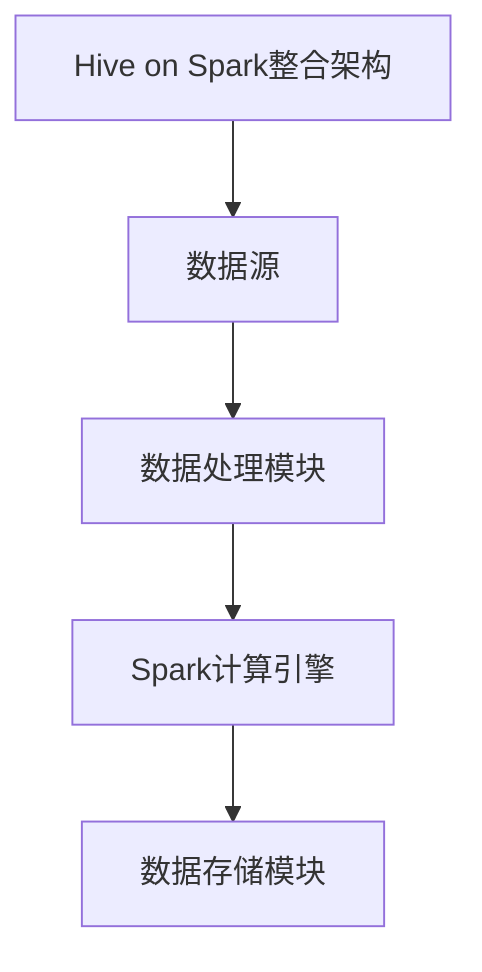

                 


### 《Hive-Spark整合原理与代码实例讲解》

---

> 关键词：Hive, Spark, 整合原理，数据处理，性能优化

> 摘要：本文旨在深入探讨Hive与Spark的整合原理，通过详细的代码实例讲解，帮助读者理解Hive与Spark的结合方式、数据处理流程以及性能优化策略。文章分为两部分：第一部分介绍Hive与Spark的基础知识，包括各自的功能、架构、核心API及优化技巧；第二部分则聚焦于整合原理与实战，通过具体项目实战案例，分析整合过程中的技术细节和优化策略。

---

### 第一部分：Hive与Spark基础

#### 第1章：Hive基础

##### 1.1 Hive概述

Hive是建立在Hadoop之上的一个数据仓库工具，允许用户使用类似SQL的查询语言（HiveQL）进行数据汇总、查询和分析。其核心特点包括：

- **抽象化**：将复杂的MapReduce作业转化为简单的SQL查询。
- **扩展性**：支持海量数据的存储和处理。
- **兼容性**：与多种数据格式和存储系统兼容。

Hive广泛应用于数据仓库、大数据分析和数据挖掘领域。

##### 1.2 Hive架构

Hive架构主要包括：

- **HiveQL编译器**：将HiveQL查询语句编译为MapReduce作业。
- **执行引擎**：负责执行编译后的MapReduce作业。
- **元数据存储**：存储Hive表的元数据信息，如表结构、分区信息等。

##### 1.3 Hive数据类型与常用操作

Hive支持多种数据类型，如整数、浮点数、字符串、日期等。常用DML操作包括：

- **INSERT**：向表中插入数据。
- **SELECT**：查询数据。
- **UPDATE**：更新数据。
- **DELETE**：删除数据。

常用DQL操作包括：

- **JOIN**：连接表。
- **GROUP BY**：分组数据。
- **ORDER BY**：排序数据。

##### 1.4 Hive优化与性能调优

Hive的优化策略主要包括：

- **分区**：根据特定列对表进行分区，提高查询效率。
- **索引**：创建索引，加快数据查询速度。
- **压缩**：使用压缩算法减少存储空间。

性能调优技巧包括：

- **合理配置Hive参数**：如执行内存、缓存等。
- **减少Shuffle**：通过优化查询语句减少数据Shuffle。

#### 第2章：Spark基础

##### 2.1 Spark概述

Spark是一个开源的分布式计算系统，旨在处理大规模数据集。其核心特点包括：

- **速度**：使用内存计算，速度比Hadoop快100倍。
- **灵活性**：支持多种数据处理模式，如批处理、实时流处理。
- **易用性**：提供高层次的API，易于使用和部署。

Spark广泛应用于机器学习、流处理、数据分析等领域。

##### 2.2 Spark架构

Spark架构主要包括：

- **Driver**：负责协调任务执行，生成执行计划。
- **Executor**：负责执行任务，处理数据。
- **Cluster Manager**：负责资源分配和任务调度。

##### 2.3 Spark核心编程API

Spark的核心编程API包括：

- **RDD**（弹性分布式数据集）：表示不可变、可分区、可并行操作的元素集合。
- **DataFrame**：基于RDD的更高级抽象，提供结构化的数据操作。
- **DataSet**：与DataFrame类似，提供强类型支持。
- **Spark SQL**：提供SQL查询接口，支持结构化数据操作。

##### 2.4 Spark核心算法与组件

Spark的核心算法与组件包括：

- **Spark Core**：提供基本任务调度和内存管理。
- **Spark SQL**：提供结构化数据操作。
- **Spark MLlib**：提供机器学习算法库。
- **Spark Streaming**：提供实时流处理。
- **GraphX**：提供图处理能力。

### 第二部分：Hive与Spark整合原理

#### 第3章：Hive与Spark整合原理

##### 3.1 Hive与Spark整合概述

Hive与Spark的整合主要是通过将Spark作为Hive的执行引擎，实现HiveQL查询在Spark上执行。整合的意义在于：

- **速度提升**：利用Spark的内存计算能力，提高查询速度。
- **功能扩展**：结合Spark的算法库，实现更复杂的分析功能。

整合的基本架构如下：

- **HiveQL查询**：用户通过HiveQL语言编写查询。
- **编译器**：将HiveQL查询编译为Spark作业。
- **执行引擎**：Spark执行引擎执行编译后的作业。

##### 3.2 Hive与Spark的数据交换

Hive与Spark的数据交换主要包括数据导入与导出、数据同步与实时数据集成。

- **数据导入与导出**：通过Hive的Import/Export工具，将数据在HDFS与Spark之间进行传输。
- **数据同步**：使用Spark作业定期同步Hive表与外部数据源。
- **实时数据集成**：使用Spark Streaming与Kafka等实时数据源集成，实现实时数据流处理。

##### 3.3 Hive on Spark

Hive on Spark是Hive与Spark的一种整合方式，其工作原理如下：

- **HiveQL编译**：HiveQL查询语句被编译为Spark作业。
- **Spark执行**：Spark执行引擎执行编译后的作业，处理数据。

Hive on Spark的优势在于：

- **高性能**：利用Spark的内存计算，提高查询效率。
- **灵活性**：支持多种数据源和数据处理模式。

局限性包括：

- **依赖性**：需要安装和配置Spark。
- **学习成本**：对于仅使用Hive的用户，学习Spark会增加一定难度。

##### 3.4 Spark SQL on Hive

Spark SQL on Hive是将Spark SQL集成到Hive中，其工作原理如下：

- **Spark SQL查询**：用户通过Spark SQL编写查询。
- **转换**：Spark SQL将查询转换为HiveQL。
- **Hive执行**：Hive执行引擎执行转换后的HiveQL查询。

Spark SQL on Hive的优势在于：

- **兼容性**：无需改变现有的Hive应用。
- **功能扩展**：结合Spark SQL，实现更复杂的分析功能。

局限性包括：

- **性能**：由于需要两次查询转换，性能可能不如Hive on Spark。
- **依赖性**：需要安装和配置Spark。

#### 第4章：Hive与Spark整合项目实战

##### 4.1 项目背景与需求

假设有一个电子商务平台，需要分析用户行为数据，包括浏览、购买、评价等，以实现精准营销。需求包括：

- **实时数据分析**：实时收集用户行为数据，实时分析用户偏好。
- **批量数据分析**：定期处理历史数据，挖掘用户行为趋势。

##### 4.2 环境搭建

开发环境搭建包括：

- **Hadoop集群**：搭建Hadoop集群，包括HDFS、YARN、MapReduce等。
- **Spark集群**：搭建Spark集群，包括Spark Core、Spark SQL、Spark MLlib等。
- **Hive配置**：配置Hive，使其与Spark集成。

##### 4.3 数据处理流程设计与实现

数据处理流程包括：

1. **数据采集**：通过日志收集工具（如Flume、Logstash）收集用户行为数据。
2. **数据预处理**：清洗、转换、去重等操作，将原始数据转换为结构化数据。
3. **数据存储**：将预处理后的数据存储到HDFS或Hive表。
4. **数据分析**：使用Spark SQL进行实时数据分析，使用Spark MLlib进行批量数据分析。

##### 4.4 性能分析与优化

性能分析包括：

- **查询性能评估**：评估Hive on Spark和Spark SQL on Hive的性能。
- **资源利用率**：评估集群资源的利用率。

优化策略包括：

- **合理配置**：调整Hive和Spark的配置参数，优化资源利用率。
- **分区与索引**：合理分区和创建索引，提高查询效率。
- **数据压缩**：使用数据压缩算法，减少存储空间和IO开销。

##### 第5章：Hive与Spark整合最佳实践

##### 5.1 整合策略与模式

整合策略包括：

- **基于性能需求**：根据性能需求选择合适的整合模式。
- **基于应用场景**：根据应用场景选择合适的整合方式。

整合模式包括：

- **Hive on Spark**：适用于对性能要求较高的场景。
- **Spark SQL on Hive**：适用于与现有Hive应用集成的情况。

##### 5.2 整合方案设计

整合方案设计包括：

1. **需求分析**：分析项目需求，确定整合目标。
2. **架构设计**：设计整合架构，确定数据流程和计算流程。
3. **技术选型**：选择合适的整合策略和模式。
4. **实施方案**：实施整合方案，进行调试和优化。

##### 5.3 整合风险与挑战

整合风险与挑战包括：

- **兼容性问题**：Hive和Spark之间的兼容性问题。
- **性能问题**：整合后的性能不如单独使用Hive或Spark。
- **学习成本**：对于开发者来说，需要学习两个框架的API和特性。

应对策略包括：

- **兼容性测试**：进行充分的兼容性测试。
- **性能优化**：通过配置优化和算法优化提高性能。
- **培训与支持**：提供培训和支持，降低学习成本。

##### 第6章：Hive与Spark整合未来趋势与发展

##### 6.1 技术发展趋势

Hive与Spark的整合趋势包括：

- **更紧密的集成**：未来可能会有更多的集成方式和工具出现，降低整合难度。
- **智能化优化**：利用机器学习算法自动优化查询执行计划。

##### 6.2 应用场景拓展

Hive与Spark的整合应用场景包括：

- **实时数据分析**：适用于电商、金融、物联网等领域。
- **批量数据处理**：适用于大数据分析、数据挖掘等领域。

##### 6.3 未来发展方向

未来发展方向包括：

- **更高效的整合**：提高整合性能和效率。
- **更广泛的应用**：拓展到更多领域，满足多样化的数据处理需求。

##### 第7章：总结与展望

本文通过详细的讲解和代码实例，帮助读者理解了Hive与Spark的整合原理和实战技巧。未来，随着大数据技术的不断发展，Hive与Spark的整合将变得更加紧密，为用户提供更高效、更智能的数据处理解决方案。

### 附录

#### 附录A：常用命令与配置

- **Hive常用命令**：
  ```
  hive --help // 查看帮助
  hive // 进入Hive命令行
  ```

- **Spark常用命令**：
  ```
  spark --help // 查看帮助
  spark-shell // 进入Spark Shell
  ```

- **Hive与Spark配置参数详解**：
  ```
  hive-site.xml // Hive配置文件
  spark-conf.xml // Spark配置文件
  ```

#### 附录B：参考资料与扩展阅读

- **相关书籍推荐**：
  - 《Hadoop实战》
  - 《Spark技术内幕》
  - 《大数据之路》

- **网络资源推荐**：
  - [Hive官方文档](https://cwiki.apache.org/confluence/display/Hive/Home)
  - [Spark官方文档](https://spark.apache.org/docs/latest/)

- **论文与报告推荐**：
  - [Hive on Spark: Accelerating Query Processing via Task and Data Parallelism](https://www.usenix.org/system/files/conference/fast13/fast13-paper-dong.pdf)
  - [Spark SQL: In-memory Data Processing on Top of Spark](https://www.usenix.org/conference/osdi14/technical-sessions/presentation/gomez)

### 附录C：Mermaid流程图



### 附录D：核心算法原理讲解

Hive与Spark整合的数据处理流程可以概括为以下伪代码：

```pseudo
// 数据处理流程伪代码
1. 数据采集：从数据源中读取数据
2. 数据预处理：清洗、转换、去重等操作
3. 数据存储：将预处理后的数据存储到HDFS或Hive表
4. 数据分析：使用Spark计算引擎进行数据处理、分析
5. 数据展示：将分析结果展示给用户
```

通过上述流程，我们可以看到Hive主要负责数据存储和管理，而Spark则负责数据计算和分析。在实际应用中，可以根据具体需求灵活调整数据处理流程，以达到最佳性能和效果。

作者：AI天才研究院/AI Genius Institute & 禅与计算机程序设计艺术 /Zen And The Art of Computer Programming

--- 

### 结语

本文详细讲解了Hive与Spark的整合原理，通过代码实例展示了数据处理流程和优化策略。希望读者能够通过本文，对Hive与Spark的整合有更深入的理解，并在实际项目中运用所学知识，提升数据处理和分析能力。未来，随着大数据技术的不断发展，Hive与Spark的整合将发挥更大的作用，为数据处理领域带来更多创新和突破。

