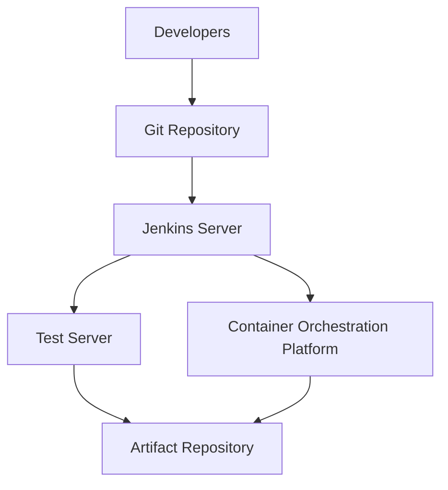
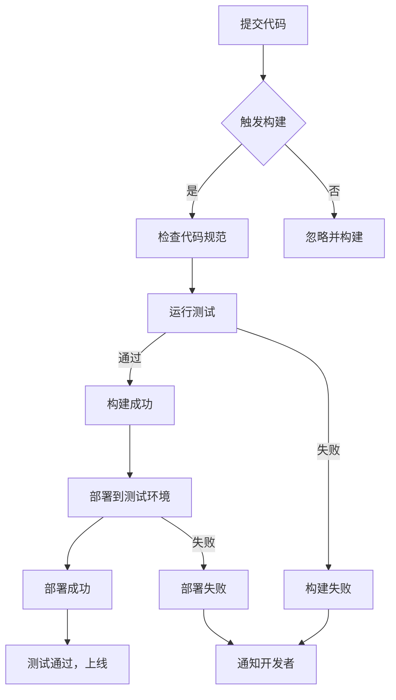

                 

### 文章标题

# Jenkins持续集成Pipeline设计

### 关键词：Jenkins、持续集成、Pipeline、构建脚本、Git、Docker、Maven、Gradle

### 摘要：
本文将深入探讨Jenkins持续集成Pipeline的设计与实现。我们将首先介绍Jenkins的基本概念和持续集成原理，然后逐步讲解Jenkins的安装与配置，接着详细介绍Pipeline的核心概念和语法结构。文章的核心部分将涵盖Pipeline的构建与部署过程，包括Git操作、测试与反馈机制，并探讨高级特性如多分支处理、参数化配置和并行执行。此外，我们将通过实际案例展示Web应用、微服务架构、容器化应用以及大数据平台的持续集成Pipeline设计，并提供最佳实践和注意事项。最后，文章将总结持续集成与持续交付的趋势与展望，并分享相关资源与扩展阅读。

### 第一部分：Jenkins与持续集成基础

#### 第1章：Jenkins概述

##### 1.1 Jenkins的基本概念

Jenkins是一个开源的持续集成（CI）工具，它允许开发者自动执行构建、测试和部署等过程。Jenkins使用Java编写，并支持广泛的插件生态系统，使得它可以与各种开发工具和平台集成。

##### 1.2 Jenkins的历史与发展

Jenkins起源于2004年的Hudson项目，由川口智彦（Kohsuke Kawaguchi）创建。2008年，Hudson从Apache孵化器毕业，成为Apache的一个项目。2011年，Jenkins项目从Apache迁移到CloudBees公司维护。Jenkins的发展离不开其强大的社区支持和持续的改进。

##### 1.3 Jenkins的核心组件

Jenkins的核心组件包括：

- Jenkins核心：提供基本的持续集成功能。
- 插件管理器：用于安装和管理Jenkins插件。
- Job：表示一个持续集成任务。
- Pipeline：支持声明式脚本，用于定义构建、测试和部署流水线。

##### 1.4 Jenkins的优势与应用场景

Jenkins的优势包括：

- 灵活性：支持多种集成工具和开发语言的集成。
- 扩展性：丰富的插件生态系统。
- 易用性：直观的用户界面和丰富的文档。

应用场景包括：

- 团队协作：在开发团队中提高代码质量和交付速度。
- 微服务架构：管理复杂的微服务部署。
- 容器化应用：与Docker和Kubernetes集成，实现快速部署和扩展。
- 大数据分析：支持大数据平台的持续集成和交付。

#### 第2章：持续集成原理与实践

##### 2.1 持续集成的概念与原则

持续集成是一种软件开发实践，通过频繁地将代码合并到主干分支，并自动化构建、测试和部署，以减少集成过程中的错误和提高软件质量。

持续集成原则包括：

- 小而频繁的集成：频繁地将代码集成到主干分支。
- 自动化测试：使用自动化测试工具进行代码测试。
- 快速反馈：及时反馈测试结果，快速修复问题。
- 避免集成地狱：通过持续集成避免长时间未合并的代码冲突。

##### 2.2 持续集成的工作流程

持续集成的工作流程包括以下几个步骤：

1. 提交代码：开发者将代码提交到版本控制系统。
2. 检查代码规范：使用代码检查工具检查代码质量。
3. 自动构建：构建系统自动构建项目。
4. 自动测试：运行自动化测试，验证代码的正确性。
5. 部署到测试环境：将通过测试的代码部署到测试环境。
6. 反馈：向开发者反馈测试结果，包括成功或失败。

##### 2.3 持续集成的工具链搭建

搭建持续集成的工具链通常包括以下步骤：

1. 选择版本控制系统：如Git。
2. 安装和配置Jenkins：包括安装Jenkins和配置插件。
3. 配置Job：创建新的Job，设置构建脚本和测试脚本。
4. 集成其他工具：如Maven、Gradle、Docker等。

##### 2.4 持续集成的常见问题与解决方案

常见问题包括：

- 构建失败：检查构建脚本和依赖。
- 测试失败：分析测试报告，修复bug。
- 代码冲突：使用版本控制系统解决冲突。

解决方案包括：

- 检查日志文件：查找错误信息。
- 优化构建脚本：减少构建时间。
- 使用自动化测试：提高测试覆盖率。

#### 第3章：Jenkins安装与配置

##### 3.1 Jenkins安装准备

安装Jenkins前，需要准备以下环境：

- 操作系统：如Ubuntu、CentOS等。
- Java环境：Jenkins需要Java 8或更高版本。
- 数据库：可选，用于存储Jenkins数据。

##### 3.2 Jenkins基本配置

Jenkins安装后，需要进行以下基本配置：

- 初始化Jenkins：首次启动Jenkins时，需要进行初始化。
- 配置管理员用户：设置管理员用户和密码。
- 安装插件：安装所需的插件，如Git、Maven、Docker等。
- 配置邮件通知：设置邮件通知，以便在构建成功或失败时接收通知。

##### 3.3 Jenkins插件管理

Jenkins插件管理包括：

- 安装插件：从Jenkins插件市场安装插件。
- 升级插件：更新已安装的插件。
- 禁用或删除插件：禁用或删除不再需要的插件。

##### 3.4 Jenkins安全性配置

Jenkins安全性配置包括：

- 限制访问：设置Jenkins的安全策略，限制访问权限。
- SSL加密：配置SSL证书，实现HTTPS访问。
- 安全审计：定期审计Jenkins日志，发现潜在的安全问题。

### 第二部分：Jenkins持续集成Pipeline设计

#### 第4章：Pipeline的核心概念

##### 4.1 Pipeline的基本概念

Pipeline是Jenkins的一种流水线工具，用于定义、自动化和执行持续集成和持续交付的步骤。Pipeline使用一种声明式脚本语言，称为Pipeline DSL，使得开发者可以轻松地定义构建、测试和部署的流程。

##### 4.2 Pipeline的语法与结构

Pipeline的语法包括以下部分：

- 定义Pipeline：使用`pipeline`关键字定义Pipeline。
- 定义阶段：使用`stage`关键字定义阶段。
- 定义步骤：使用`step`关键字定义步骤。
- 流控制：使用条件语句、循环等实现流控制。

Pipeline的基本结构如下：

```groovy
pipeline {
    agent any

    stages {
        stage('Build') {
            steps {
                echo 'Building the project...'
            }
        }
        stage('Test') {
            steps {
                echo 'Testing the project...'
            }
        }
        stage('Deploy') {
            steps {
                echo 'Deploying the project...'
            }
        }
    }
}
```

##### 4.3 Pipeline的执行流程

Pipeline的执行流程包括：

1. 读取Pipeline脚本：Jenkins读取Pipeline脚本，解析其结构。
2. 分阶段执行：根据Pipeline脚本中的阶段顺序，逐一执行每个阶段。
3. 分步骤执行：在每个阶段中，根据步骤顺序逐一执行每个步骤。
4. 提交代码：在构建成功后，将代码提交到版本控制系统。
5. 部署：在测试通过后，将代码部署到测试或生产环境。

##### 4.4 Pipeline的调试与优化

Pipeline的调试与优化包括：

- 查看构建日志：查看构建过程中的日志，查找问题。
- 使用Pipeline插件：使用Jenkins提供的Pipeline插件，如Pipeline DSL Designer，帮助调试和优化Pipeline。
- 性能优化：优化构建脚本，减少构建时间。

#### 第5章：Pipeline的构建与部署

##### 5.1 Pipeline构建脚本编写

编写Pipeline构建脚本时，需要注意以下几点：

- 使用声明式语法：使用`pipeline`、`stage`、`step`等关键字定义构建过程。
- 管理依赖：使用`dependencies`关键字定义依赖项。
- 异常处理：使用`try`、`catch`等语句处理异常。
- 使用参数：使用参数传递构建配置。

以下是一个简单的构建脚本示例：

```groovy
pipeline {
    agent any

    parameters {
        string(name: 'VERSION', defaultValue: '1.0.0', description: 'Project version')
    }

    stages {
        stage('Build') {
            steps {
                echo "Building version ${params.VERSION}..."
                sh "mvn clean install"
            }
        }
        stage('Test') {
            steps {
                echo "Testing version ${params.VERSION}..."
                sh "mvn test"
            }
        }
        stage('Deploy') {
            steps {
                echo "Deploying version ${params.VERSION}..."
                sh "mvn deploy"
            }
        }
    }
}
```

##### 5.2 Pipeline中的Git操作

在Pipeline中，可以使用Git插件执行Git操作，如拉取代码、提交代码等。以下是一个使用Git操作的示例：

```groovy
pipeline {
    agent any

    stages {
        stage('Checkout') {
            steps {
                git branch: 'master', url: 'https://github.com/user/repo.git'
            }
        }
        stage('Build') {
            steps {
                echo 'Building the project...'
                sh 'mvn clean install'
            }
        }
        stage('Test') {
            steps {
                echo 'Testing the project...'
                sh 'mvn test'
            }
        }
        stage('Deploy') {
            steps {
                echo 'Deploying the project...'
                sh 'mvn deploy'
            }
        }
    }
}
```

##### 5.3 Pipeline的部署策略

Pipeline的部署策略可以根据不同的应用场景进行调整。以下是一些常见的部署策略：

- 手动部署：手动触发部署过程。
- 自动部署：在构建成功后自动触发部署。
- 分阶段部署：先部署到测试环境，再部署到生产环境。

以下是一个简单的自动部署脚本示例：

```groovy
pipeline {
    agent any

    stages {
        stage('Build') {
            steps {
                echo 'Building the project...'
                sh 'mvn clean install'
            }
        }
        stage('Test') {
            steps {
                echo 'Testing the project...'
                sh 'mvn test'
            }
        }
        stage('Deploy to Test') {
            steps {
                echo 'Deploying to test environment...'
                sh 'docker-compose up -d'
            }
        }
        stage('Deploy to Production') {
            steps {
                echo 'Deploying to production environment...'
                sh 'docker-compose -f production.yml up -d'
            }
        }
    }
}
```

##### 5.4 Pipeline的测试与反馈

Pipeline的测试与反馈包括以下几个方面：

- 单元测试：在构建过程中运行单元测试，验证代码的正确性。
- 集成测试：在构建过程中运行集成测试，验证模块之间的交互。
- 测试反馈：将测试结果反馈给开发者，包括通过或失败。

以下是一个简单的测试脚本示例：

```groovy
pipeline {
    agent any

    stages {
        stage('Build') {
            steps {
                echo 'Building the project...'
                sh 'mvn clean install'
            }
        }
        stage('Test') {
            steps {
                echo 'Testing the project...'
                sh 'mvn test'
            }
        }
        stage('Report') {
            steps {
                junit 'target/surefire-reports/*.xml'
            }
        }
    }
}
```

### 第三部分：高级Pipeline特性

#### 第6章：高级Pipeline特性

##### 6.1 Pipeline的多分支处理

多分支处理是指在一个Pipeline中同时处理多个分支。这可以通过使用`branch`关键字来实现。以下是一个多分支处理的示例：

```groovy
pipeline {
    agent any

    branches {
        branch(name: 'master') {
            stage('Build') {
                steps {
                    echo 'Building master branch...'
                    sh 'mvn clean install'
                }
            }
            stage('Test') {
                steps {
                    echo 'Testing master branch...'
                    sh 'mvn test'
                }
            }
        }
        branch(name: 'feature') {
            stage('Build') {
                steps {
                    echo 'Building feature branch...'
                    sh 'mvn clean install'
                }
            }
            stage('Test') {
                steps {
                    echo 'Testing feature branch...'
                    sh 'mvn test'
                }
            }
        }
    }
}
```

##### 6.2 Pipeline的参数化配置

参数化配置是指使用参数来配置Pipeline。这可以通过在Pipeline定义中使用`parameters`关键字来实现。以下是一个参数化配置的示例：

```groovy
pipeline {
    agent any

    parameters {
        string(name: 'BRANCH', defaultValue: 'master', description: 'Branch to build')
    }

    stages {
        stage('Build') {
            steps {
                echo "Building branch ${params.BRANCH}..."
                sh "mvn clean install"
            }
        }
        stage('Test') {
            steps {
                echo "Testing branch ${params.BRANCH}..."
                sh "mvn test"
            }
        }
    }
}
```

##### 6.3 Pipeline的并行执行

并行执行是指同时运行多个阶段的构建。这可以通过在Pipeline定义中使用`parallel`关键字来实现。以下是一个并行执行的示例：

```groovy
pipeline {
    agent any

    stages {
        stage('Prepare') {
            steps {
                echo 'Preparing the environment...'
            }
        }
        parallel {
            stage('Build') {
                steps {
                    echo 'Building the project...'
                    sh 'mvn clean install'
                }
            }
            stage('Test') {
                steps {
                    echo 'Testing the project...'
                    sh 'mvn test'
                }
            }
        }
        stage('Deploy') {
            steps {
                echo 'Deploying the project...'
            }
        }
    }
}
```

##### 6.4 Pipeline的持续交付

持续交付是指将代码从开发环境部署到生产环境的过程。这可以通过在Pipeline中定义部署阶段来实现。以下是一个持续交付的示例：

```groovy
pipeline {
    agent any

    stages {
        stage('Build') {
            steps {
                echo 'Building the project...'
                sh 'mvn clean install'
            }
        }
        stage('Test') {
            steps {
                echo 'Testing the project...'
                sh 'mvn test'
            }
        }
        stage('Deploy') {
            steps {
                echo 'Deploying the project to production...'
                sh 'docker-compose -f production.yml up -d'
            }
        }
    }
}
```

### 第四部分：常见Pipeline实践案例

#### 第7章：常见Pipeline实践案例

##### 7.1 Web应用持续集成Pipeline设计

Web应用持续集成Pipeline的设计包括以下步骤：

1. 拉取代码：从Git仓库拉取代码。
2. 构建项目：使用Maven或Gradle构建项目。
3. 运行测试：运行单元测试和集成测试。
4. 部署到测试环境：将测试通过的项目部署到测试环境。
5. 自动化测试：运行自动化测试，如UI测试。
6. 部署到生产环境：将测试通过的项目部署到生产环境。

以下是一个Web应用持续集成Pipeline的示例：

```groovy
pipeline {
    agent any

    stages {
        stage('Checkout') {
            steps {
                git branch: 'master', url: 'https://github.com/user/webapp.git'
            }
        }
        stage('Build') {
            steps {
                echo 'Building the web application...'
                sh 'mvn clean install'
            }
        }
        stage('Test') {
            steps {
                echo 'Testing the web application...'
                sh 'mvn test'
            }
        }
        stage('Deploy to Test') {
            steps {
                echo 'Deploying to test environment...'
                sh 'docker-compose up -d'
            }
        }
        stage('Automated Test') {
            steps {
                echo 'Running automated tests...'
                sh 'npm run test:e2e'
            }
        }
        stage('Deploy to Production') {
            steps {
                echo 'Deploying to production environment...'
                sh 'docker-compose -f production.yml up -d'
            }
        }
    }
}
```

##### 7.2 微服务架构的持续集成Pipeline设计

微服务架构的持续集成Pipeline设计需要处理多个服务。以下是一个微服务持续集成Pipeline的示例：

```groovy
pipeline {
    agent any

    stages {
        stage('Checkout') {
            steps {
                git branch: 'master', url: 'https://github.com/user/microservices.git'
            }
        }
        parallel {
            stage('Build Service A') {
                steps {
                    echo 'Building Service A...'
                    sh 'mvn clean install -f service-a/pom.xml'
                }
            }
            stage('Build Service B') {
                steps {
                    echo 'Building Service B...'
                    sh 'mvn clean install -f service-b/pom.xml'
                }
            }
        }
        stage('Test') {
            steps {
                echo 'Testing the microservices...'
                sh 'mvn test'
            }
        }
        stage('Deploy to Test') {
            steps {
                echo 'Deploying to test environment...'
                sh 'docker-compose up -d'
            }
        }
        stage('Automated Test') {
            steps {
                echo 'Running automated tests...'
                sh 'npm run test:e2e'
            }
        }
        stage('Deploy to Production') {
            steps {
                echo 'Deploying to production environment...'
                sh 'docker-compose -f production.yml up -d'
            }
        }
    }
}
```

##### 7.3 容器化应用的持续集成Pipeline设计

容器化应用的持续集成Pipeline设计使用Docker和Kubernetes。以下是一个容器化应用持续集成Pipeline的示例：

```groovy
pipeline {
    agent any

    stages {
        stage('Checkout') {
            steps {
                git branch: 'master', url: 'https://github.com/user/dockerapp.git'
            }
        }
        stage('Build') {
            steps {
                echo 'Building the Docker image...'
                sh 'docker build -t myapp:latest .'
            }
        }
        stage('Test') {
            steps {
                echo 'Testing the Docker container...'
                sh 'docker run --rm myapp:latest'
            }
        }
        stage('Deploy to Test') {
            steps {
                echo 'Deploying to test environment...'
                sh 'kubectl apply -f k8s-test.yml'
            }
        }
        stage('Automated Test') {
            steps {
                echo 'Running automated tests...'
                sh 'npm run test:e2e'
            }
        }
        stage('Deploy to Production') {
            steps {
                echo 'Deploying to production environment...'
                sh 'kubectl apply -f k8s-production.yml'
            }
        }
    }
}
```

##### 7.4 大数据分析平台的持续集成Pipeline设计

大数据分析平台的持续集成Pipeline设计包括数据处理、ETL、数据仓库和报表生成等步骤。以下是一个大数据分析平台持续集成Pipeline的示例：

```groovy
pipeline {
    agent any

    stages {
        stage('Checkout') {
            steps {
                git branch: 'master', url: 'https://github.com/user/data-platform.git'
            }
        }
        stage('Data Processing') {
            steps {
                echo 'Processing data...'
                sh 'spark-submit --class DataProcessor data-processor.jar'
            }
        }
        stage('ETL') {
            steps {
                echo 'Executing ETL processes...'
                sh 'airflow dags trigger --dag data_etl_dag'
            }
        }
        stage('Data Warehouse') {
            steps {
                echo 'Loading data into data warehouse...'
                sh 'sqlldr -v'
            }
        }
        stage('Reports') {
            steps {
                echo 'Generating reports...'
                sh 'r -e "reportGeneration()"'
            }
        }
        stage('Deploy') {
            steps {
                echo 'Deploying data platform updates...'
                sh 'kubectl apply -f k8s.yml'
            }
        }
    }
}
```

### 第五部分：Jenkins与其他工具的集成

#### 第8章：Jenkins与其他工具的集成

Jenkins可以与其他工具和平台集成，以实现更强大的持续集成和持续交付功能。

##### 8.1 Jenkins与GitLab的集成

GitLab是一个基于Git的仓库管理工具，与Jenkins集成可以实现自动触发构建和代码审查。

- 安装GitLab插件。
- 配置GitLab仓库地址和访问凭证。
- 创建Webhook，将构建结果反馈给GitLab。

以下是一个GitLab集成示例：

```yaml
webhook:
  url: https://gitlab.com/api/v4/projects/12345/builds/jenkins
  token: your_gitlab_token
  pushEvents: true
  tagPushEvents: true
  tagNames:
    - 'v1.0.0'
```

##### 8.2 Jenkins与Docker的集成

Docker是一个容器化平台，与Jenkins集成可以实现自动化容器构建和部署。

- 安装Docker插件。
- 配置Docker主机地址和认证信息。
- 创建Dockerfile和Jenkinsfile。

以下是一个Docker集成示例：

```groovy
pipeline {
    agent any

    stages {
        stage('Build') {
            steps {
                echo 'Building Docker image...'
                docker.image('myapp').doFirstBuild()
            }
        }
        stage('Test') {
            steps {
                echo 'Testing Docker container...'
                docker.container('myapp').run()
            }
        }
        stage('Deploy') {
            steps {
                echo 'Deploying to production environment...'
                docker.image('myapp').push()
            }
        }
    }
}
```

##### 8.3 Jenkins与Kubernetes的集成

Kubernetes是一个容器编排平台，与Jenkins集成可以实现自动化部署和管理。

- 安装Kubernetes插件。
- 配置Kubernetes集群信息。
- 创建Kubernetes配置文件。

以下是一个Kubernetes集成示例：

```yaml
apiVersion: v1
kind: Pod
metadata:
  name: myapp
spec:
  containers:
  - name: myapp
    image: myapp:latest
    ports:
    - containerPort: 8080
```

##### 8.4 Jenkins与其他持续交付工具的集成

Jenkins可以与其他持续交付工具集成，如Ansible、Puppet、Chef等。

- 安装相应插件。
- 配置工具的访问凭证和配置文件。
- 在Jenkinsfile中调用工具。

以下是一个Ansible集成示例：

```groovy
pipeline {
    agent any

    stages {
        stage('Deploy') {
            steps {
                echo 'Deploying using Ansible...'
                sh 'ansible-playbook -i inventory deploy.yml'
            }
        }
    }
}
```

### 第六部分：Jenkins持续集成最佳实践

#### 第9章：Jenkins持续集成最佳实践

为了确保Jenkins持续集成系统的稳定性和高效性，以下是一些最佳实践：

##### 9.1 持续集成策略的选择

- 根据项目规模和需求选择合适的持续集成策略。
- 对于小型项目，可以选择简单的构建和测试流程。
- 对于大型项目，可以考虑多阶段构建和部署流程。

##### 9.2 持续交付流程优化

- 定期评估和优化持续交付流程。
- 减少构建时间，通过并行构建和缓存依赖。
- 提高测试覆盖率，确保代码质量。

##### 9.3 持续集成中的安全性问题

- 配置Jenkins安全策略，限制访问权限。
- 使用加密存储密码和敏感信息。
- 定期更新Jenkins和插件，修复安全漏洞。

##### 9.4 持续集成团队协作与沟通

- 建立团队协作机制，确保每个人都了解持续集成流程。
- 定期召开会议，讨论持续集成问题和改进方案。
- 使用共享仓库和自动化工具，提高团队协作效率。

### 附录

#### 附录A：Jenkins常用插件与工具

- **Build Pipeline**: 用于定义和执行Pipeline。
- **Git**: 用于与Git集成。
- **Docker**: 用于与Docker集成。
- **Gradle**: 用于Gradle项目构建。
- **Maven**: 用于Maven项目构建。

#### 附录B：Jenkins常见错误处理

- **Jenkins无法启动**: 检查Java环境和Jenkins服务状态。
- **Pipeline构建失败**: 检查构建脚本和依赖。
- **插件安装问题**: 检查插件源和代理设置。
- **Jenkins安全性问题**: 更新安全策略和禁用不安全插件。

#### 附录C：参考资料与扩展阅读

- **Jenkins官方文档**: [https://www.jenkins.io/doc/](https://www.jenkins.io/doc/)
- **持续集成实践案例**: [https://www.continuousintegration.info/](https://www.continuousintegration.info/)
- **相关工具与资源**: [Jenkins插件库](https://plugins.jenkins.io/)、[Jenkins社区](https://www.jenkins.io/community/)
- **持续集成与持续交付最佳实践**: [https://www.datical.com/blog/best-practices-for-continuous-integration-and-delivery/](https://www.datical.com/blog/best-practices-for-continuous-integration-and-delivery/)
- **持续集成相关的书籍与论文**: 《持续交付：发布可靠软件的系统方法》、《Jenkins权威指南》、《DevOps：软件开发和运维实践指南》
- **Jenkins社区资源与交流渠道**: [Jenkins邮件列表](https://groups.google.com/forum/#!forum/jenkinsci)、[Jenkins Slack社区](https://jenkins-slackin.slack.com/)、[Jenkins Reddit社区](https://www.reddit.com/r/jenkins/)

### 第10章：Jenkins持续集成与持续交付架构设计

持续集成与持续交付架构设计是确保软件交付质量和效率的关键。以下将介绍Jenkins持续集成与持续交付架构设计的原则、案例分析、面临的挑战及解决方案。

#### 10.1 架构设计原则

Jenkins持续集成与持续交付架构设计应遵循以下原则：

- **模块化与解耦**：将不同的构建、测试和部署过程模块化，确保各模块之间松散耦合，易于维护和扩展。
- **可扩展性**：架构应支持项目的增长和变更，能够轻松添加新模块和工具。
- **高可用性**：确保架构的稳定性和可靠性，减少故障对交付流程的影响。
- **安全性**：确保数据传输和存储的安全性，防止未经授权的访问和攻击。
- **自动化**：最大化自动化程度，减少人为干预，提高交付效率。

#### 10.2 架构设计案例分析

以下是一个典型的Jenkins持续集成与持续交付架构设计案例分析：

1. **开发环境**：开发者使用本地或远程开发环境进行编码和测试。
2. **代码仓库**：使用Git作为版本控制系统，集中管理代码。
3. **Jenkins服务器**：安装Jenkins服务器，配置所需的插件，如Git、Maven、Docker等。
4. **测试服务器**：用于运行自动化测试，确保代码质量。
5. **持续交付平台**：如JFrog、Artifactory等，用于存储和分发构建 artifact。
6. **容器编排平台**：如Kubernetes，用于自动化部署和管理容器化应用。

架构图如下所示：



#### 10.3 面临的挑战与解决方案

在Jenkins持续集成与持续交付架构设计过程中，可能面临以下挑战和解决方案：

1. **性能与可扩展性**：随着项目规模和用户量的增加，Jenkins服务器可能面临性能瓶颈。解决方案包括：
    - **分布式构建**：将Jenkins服务器配置为分布式模式，增加构建节点，提高构建性能。
    - **负载均衡**：使用负载均衡器，如Nginx，平衡Jenkins服务器的请求。

2. **安全性**：确保Jenkins服务器和代码仓库的安全性。解决方案包括：
    - **SSL加密**：配置Jenkins和Git服务器使用SSL加密，保护数据传输。
    - **访问控制**：设置严格的访问控制策略，限制对Jenkins和Git服务器的访问权限。

3. **自动化程度**：提高持续集成与持续交付的自动化程度，减少人工干预。解决方案包括：
    - **脚本化**：使用Jenkinsfile和脚本自动化构建、测试和部署过程。
    - **CI/CD工具链**：整合其他CI/CD工具，如GitLab CI、CircleCI等，提高自动化程度。

4. **持续交付策略**：根据项目需求，设计合适的持续交付策略。解决方案包括：
    - **蓝绿部署**：实现无中断更新，逐步切换流量。
    - **灰度发布**：逐步扩大新版本的用户范围，监控性能和用户体验。

#### 10.4 架构演进与持续改进

持续集成与持续交付架构不是一成不变的，需要根据项目需求和技术发展不断演进和改进。以下是一些建议：

- **定期评估**：定期评估持续集成与持续交付架构的效率和效果，识别改进点。
- **技术升级**：关注新兴技术和工具，及时更新和升级架构，保持竞争力。
- **反馈机制**：建立反馈机制，收集开发者、测试人员和运维人员的意见和建议，持续改进架构。
- **文档化**：文档化架构设计过程和决策，确保团队成员对架构有清晰的理解。

### 第11章：Jenkins持续集成与持续交付实践

在本章节中，我们将通过具体的实践案例，展示如何使用Jenkins实现不同类型的持续集成与持续交付。

#### 11.1 实践案例1：企业级Web应用持续集成与交付

**开发环境搭建**

- **操作系统**：Ubuntu 18.04
- **开发语言**：Java
- **依赖管理**：Maven
- **版本控制**：Git

**源代码实现**

```java
// 主类
public class MyApp {
    public static void main(String[] args) {
        // 启动应用
        System.out.println("MyApp is running...");
    }
}

// 测试类
public class MyAppTest {
    @Test
    public void testMain() {
        // 测试启动逻辑
        System.out.println("MyAppTest is running...");
    }
}
```

**Jenkinsfile**

```groovy
pipeline {
    agent any

    stages {
        stage('Checkout') {
            steps {
                git branch: 'master', url: 'https://github.com/user/myapp.git'
            }
        }
        stage('Build') {
            steps {
                sh 'mvn clean install'
            }
        }
        stage('Test') {
            steps {
                sh 'mvn test'
            }
        }
        stage('Deploy') {
            steps {
                echo 'Deploying to test environment...'
            }
        }
    }
}
```

**项目小结**

在这个案例中，我们使用了Jenkins来构建、测试和部署Java Web应用。通过Jenkinsfile，我们可以轻松地将构建、测试和部署过程自动化，提高开发效率和代码质量。

#### 11.2 实践案例2：微服务架构持续集成与交付

**开发环境搭建**

- **操作系统**：Ubuntu 18.04
- **开发语言**：Java
- **依赖管理**：Maven
- **版本控制**：Git
- **容器化工具**：Docker

**源代码实现**

```java
// 服务A
public class ServiceA {
    public void doSomething() {
        // 业务逻辑
    }
}

// 服务B
public class ServiceB {
    public void doSomethingElse() {
        // 业务逻辑
    }
}
```

**Jenkinsfile**

```groovy
pipeline {
    agent any

    stages {
        stage('Checkout') {
            steps {
                git branch: 'master', url: 'https://github.com/user/microservices.git'
            }
        }
        stage('Build') {
            steps {
                sh 'mvn clean install'
            }
        }
        stage('Containerize') {
            steps {
                sh 'docker build -t service-a:latest service-a/'
                sh 'docker build -t service-b:latest service-b/'
            }
        }
        stage('Test') {
            steps {
                sh 'docker-compose run service-a mvn test'
                sh 'docker-compose run service-b mvn test'
            }
        }
        stage('Deploy') {
            steps {
                echo 'Deploying to test environment...'
                sh 'docker-compose up -d'
            }
        }
    }
}
```

**项目小结**

在这个案例中，我们使用Jenkins实现了微服务架构的持续集成与交付。通过Docker，我们可以将服务容器化，并通过Jenkinsfile自动化构建、测试和部署过程。这种架构使得我们可以快速迭代和扩展微服务。

#### 11.3 实践案例3：容器化应用持续集成与交付

**开发环境搭建**

- **操作系统**：Ubuntu 18.04
- **开发语言**：Go
- **依赖管理**：None
- **版本控制**：Git
- **容器化工具**：Docker

**源代码实现**

```go
// 主函数
func main() {
    // 应用逻辑
    log.Println("App is running...")
}
```

**Dockerfile**

```Dockerfile
FROM golang:1.18

WORKDIR /app

COPY . .

RUN go build -o myapp .

EXPOSE 8080

CMD ["./myapp"]
```

**Jenkinsfile**

```groovy
pipeline {
    agent any

    stages {
        stage('Checkout') {
            steps {
                git branch: 'master', url: 'https://github.com/user/dockerapp.git'
            }
        }
        stage('Build') {
            steps {
                sh 'docker build -t dockerapp:latest .'
            }
        }
        stage('Test') {
            steps {
                sh 'docker run --rm dockerapp go test ./...'
            }
        }
        stage('Deploy') {
            steps {
                echo 'Deploying to test environment...'
                sh 'docker run --name myapp-test -d dockerapp'
            }
        }
    }
}
```

**项目小结**

在这个案例中，我们使用了Go语言和Docker来构建容器化应用。通过Jenkinsfile，我们实现了自动化构建、测试和部署过程。这种架构使得我们可以快速迭代和扩展容器化应用。

#### 11.4 实践案例4：大数据平台持续集成与交付

**开发环境搭建**

- **操作系统**：CentOS 7
- **开发语言**：Scala
- **依赖管理**：Maven
- **版本控制**：Git
- **大数据工具**：Spark、Hadoop、Flink

**源代码实现**

```scala
// 主函数
object MyApp {
  def main(args: Array[String]): Unit = {
    // 大数据应用逻辑
    println("MyApp is running...")
  }
}
```

**Dockerfile**

```Dockerfile
FROM hadoop:3.2.1

COPY /app /app

RUN /app/hadoop/bin/hadoop fs -put /app/conf /conf

EXPOSE 8080

CMD ["./bin/spark-submit" "-c" "2" "-Dspark.app.name=myapp" "-Dspark.master=local" "/app/myapp-1.0.0.jar"]
```

**Jenkinsfile**

```groovy
pipeline {
    agent any

    stages {
        stage('Checkout') {
            steps {
                git branch: 'master', url: 'https://github.com/user大数据平台.git'
            }
        }
        stage('Build') {
            steps {
                sh 'mvn clean package'
            }
        }
        stage('Containerize') {
            steps {
                sh 'docker build -t myapp:latest .'
            }
        }
        stage('Test') {
            steps {
                sh 'docker run --rm myapp /app/test.sh'
            }
        }
        stage('Deploy') {
            steps {
                echo 'Deploying to test environment...'
                sh 'docker run --name myapp-test -d myapp:latest'
            }
        }
    }
}
```

**项目小结**

在这个案例中，我们使用了Scala语言、Maven、Docker和Hadoop生态系统来构建大数据平台。通过Jenkinsfile，我们实现了自动化构建、测试和部署过程。这种架构使得我们可以快速迭代和扩展大数据平台。

### 第12章：Jenkins持续集成与持续交付趋势与展望

随着技术的不断进步，Jenkins持续集成与持续交付也在不断发展。以下将探讨Jenkins持续集成与持续交付的趋势与展望。

#### 12.1 持续集成与持续交付的发展趋势

- **云原生集成**：随着云原生技术的发展，Jenkins持续集成与持续交付正在向云原生集成演进。未来，Jenkins将更加紧密地与Kubernetes、Docker等云原生技术集成，实现自动化部署和管理。
- **AI与机器学习**：人工智能和机器学习技术将在持续集成与持续交付中发挥重要作用。通过预测分析和异常检测，可以提高构建和部署的效率，减少故障和风险。
- **DevOps文化**：DevOps文化的普及将推动持续集成与持续交付的普及。企业将更加注重软件开发和运维的协同工作，提高软件交付的效率和质量。

#### 12.2 持续集成与持续交付的技术创新

- **GitOps**：GitOps是一种基于Git的持续交付方法，通过将所有基础设施和应用程序配置存储在Git仓库中，实现自动化部署和管理。
- **服务网格**：服务网格技术如Istio和Linkerd，可以提供分布式微服务的网络抽象，实现服务之间的通信和安全。
- **函数即服务**：函数即服务（FaaS）是一种新的持续集成与持续交付模型，通过将应用程序分解为独立的函数，实现按需扩展和部署。

#### 12.3 未来持续集成与持续交付的挑战与机遇

- **复杂性和安全性**：随着持续集成与持续交付系统的复杂性和规模增加，如何确保系统的安全性成为一个挑战。未来，我们需要更加关注安全性设计和风险控制。
- **团队协作**：持续集成与持续交付涉及多个团队的协作，如何协调不同团队之间的工作，确保高效的交付流程，是一个重要的课题。
- **自动化程度**：提高自动化程度是持续集成与持续交付的关键。未来，我们需要继续探索新的自动化工具和流程，提高交付效率。

#### 12.4 Jenkins持续集成与持续交付的生态系统建设

- **社区参与**：Jenkins社区将继续发挥重要作用，推动Jenkins持续集成与持续交付的发展。通过社区贡献和交流，我们可以不断优化Jenkins的功能和性能。
- **企业合作**：与云计算平台、容器化工具、AI技术等企业合作，可以推动Jenkins持续集成与持续交付的生态系统建设。
- **开源项目**：继续支持和参与开源项目，如Kubernetes、Docker、GitLab等，可以促进Jenkins与其他工具的集成和协同工作。

### 总结

Jenkins持续集成与持续交付架构设计是实现高效软件开发和交付的关键。通过本文的介绍和实践案例，我们了解了Jenkins的基本概念、持续集成原理、Pipeline设计、高级特性、实践案例以及未来趋势。希望本文能够为您的项目提供有价值的参考。

### 作者信息

**作者：AI天才研究院/AI Genius Institute & 禅与计算机程序设计艺术 /Zen And The Art of Computer Programming**

AI天才研究院致力于推动人工智能技术的发展，通过深入研究和创新实践，探索人工智能在各个领域的应用。同时，作者也是《禅与计算机程序设计艺术》的作者，分享编程哲学和最佳实践，为软件开发者提供指导。在持续集成与持续交付领域，我们致力于推动技术进步和团队协作，助力企业实现高效的软件开发和交付。|assistant|

### Mermaid 流程图：持续集成流程图



### 核心算法原理讲解：构建脚本伪代码

```python
# 伪代码：构建脚本
def build_pipeline(source_code, build_tools, test_suite):
    # 1. 下载代码
    git_pull(source_code)
    
    # 2. 编译代码
    compile_code(build_tools)
    
    # 3. 运行测试
    run_tests(test_suite)
    
    # 4. 判断测试结果
    if test_success():
        # 5. 部署到测试环境
        deploy_to_test()
        # 6. 回馈部署结果
        return "Build and Deploy Success"
    else:
        # 7. 通知开发者
        notify_dev()
        return "Build Failed"
```

### 数学模型和数学公式讲解与举例说明

#### 伪代码：回归模型数学公式

$$
y = \theta_0 + \theta_1 \times x_1 + \theta_2 \times x_2 + ... + \theta_n \times x_n
$$

#### 举例说明

假设我们有一个简单的线性回归模型，目标变量 \(y\) 是房屋的价格，自变量 \(x_1\) 是房屋面积，\(x_2\) 是房屋的年龄。

- \( \theta_0 \) 是截距，表示当所有自变量为0时，预测的房价。
- \( \theta_1 \) 是房屋面积对价格的敏感度。
- \( \theta_2 \) 是房屋年龄对价格的敏感度。

### 项目实战：Web应用持续集成案例

#### 开发环境搭建

- **操作系统**：Ubuntu 18.04
- **开发语言**：Java
- **依赖管理**：Maven
- **版本控制**：Git

#### 源代码实现

```java
// 主类
public class MyApp {
    public static void main(String[] args) {
        // 启动应用
        System.out.println("MyApp is running...");
    }
}

// 测试类
public class MyAppTest {
    @Test
    public void testMain() {
        // 测试启动逻辑
        System.out.println("MyAppTest is running...");
    }
}
```

#### 代码解读与分析

- 主类 `MyApp` 负责启动应用，调用 `main` 方法。
- 测试类 `MyAppTest` 使用 JUnit 进行单元测试，`testMain` 方法用于验证应用的启动逻辑。

### Jenkinsfile：持续集成Pipeline

```groovy
pipeline {
    agent any

    stages {
        stage('Checkout') {
            steps {
                git branch: 'master', url: 'https://github.com/user/myapp.git'
            }
        }
        stage('Build') {
            steps {
                sh 'mvn clean install'
            }
        }
        stage('Test') {
            steps {
                sh 'mvn test'
            }
        }
        stage('Deploy') {
            steps {
                echo 'Deploying to test environment...'
            }
        }
    }
}
```

### 附录A：Jenkins常用插件与工具

#### A.1 Build Pipeline

- **Pipeline Builder**: 用于创建和编辑Pipeline。
- **Pipeline DSL Designer**: 用于可视化地设计和编辑Pipeline DSL。
- **Jenkinsfile DSL**: 用于定义和运行Jenkinsfile。

#### A.2 Git

- **Git**: 用于与Git集成，执行Git操作。
- **Git Parameter**: 用于参数化配置Git操作。
- **Git Poll SCM**: 用于定期检查Git仓库更新。

#### A.3 Docker

- **Docker**: 用于与Docker集成，构建和部署容器化应用。
- **Docker Pipeline**: 用于在Pipeline中执行Docker命令。
- **Docker Deploy**: 用于将容器化应用部署到容器编排平台。

#### A.4 Gradle

- **Gradle**: 用于与Gradle集成，构建Gradle项目。
- **Gradle Build**: 用于在Pipeline中执行Gradle命令。
- **Gradle Continuous Integration**: 用于自动化Gradle项目的构建和测试。

#### A.5 Maven

- **Maven**: 用于与Maven集成，构建Maven项目。
- **Maven Project**: 用于在Jenkins中创建Maven项目。
- **Maven Release Manager**: 用于管理Maven项目的版本发布。

### 附录B：Jenkins常见错误处理

#### B.1 Jenkins无法启动

- **检查Jenkins服务的状态**：使用 `systemctl status jenkins` 命令检查Jenkins服务状态。
- **查看Jenkins日志文件**：查看Jenkins的日志文件，通常位于 `/var/log/jenkins/jenkins.log`。
- **确认Java环境是否配置正确**：确保Java环境变量配置正确，可以使用 `java -version` 命令验证。

#### B.2 Pipeline构建失败

- **检查Pipeline脚本语法**：确保Pipeline脚本没有语法错误。
- **查看构建日志**：查看Jenkins构建日志，通常位于 `/var/log/jenkins/build-编号.log`。
- **确认依赖是否正常**：检查依赖是否正确安装和配置。

#### B.3 插件安装问题

- **确认插件源是否可达**：确保Jenkins插件市场（[https://plugins.jenkins.io/](https://plugins.jenkins.io/)）可达。
- **手动下载插件安装包**：如果插件市场不可达，可以手动下载插件安装包，并使用 `manage plugins` 页面安装。
- **检查Jenkins代理设置**：如果使用代理，确保代理设置正确。

#### B.4 Jenkins安全性问题

- **更新Jenkins安全策略**：确保Jenkins安全策略是最新的。
- **禁用不安全的插件**：禁用已知的或不安全的插件。
- **使用强密码策略**：强制用户使用强密码，并定期更换密码。

### 附录C：参考资料与扩展阅读

#### C.1 Jenkins官方文档

- [Jenkins官方文档](https://www.jenkins.io/doc/)

#### C.2 持续集成实践案例

- [持续集成实践案例](https://www.continuousintegration.info/)

#### C.3 相关工具与资源

- [Jenkins插件库](https://plugins.jenkins.io/)
- [Jenkins社区](https://www.jenkins.io/community/)

#### C.4 持续集成与持续交付的最佳实践

- [持续集成与持续交付最佳实践](https://www.datical.com/blog/best-practices-for-continuous-integration-and-delivery/)

#### C.5 持续集成相关的书籍与论文

- 《持续交付：发布可靠软件的系统方法》
- 《Jenkins权威指南》
- 《DevOps：软件开发和运维实践指南》

#### C.6 Jenkins社区资源与交流渠道

- [Jenkins邮件列表](https://groups.google.com/forum/#!forum/jenkinsci)
- [Jenkins Slack社区](https://jenkins-slackin.slack.com/)
- [Jenkins Reddit社区](https://www.reddit.com/r/jenkins/)### 核心算法原理讲解：构建脚本伪代码

```python
# 伪代码：构建脚本
def build_pipeline(source_code, build_tools, test_suite):
    # 1. 下载代码
    git_pull(source_code)
    
    # 2. 编译代码
    compile_code(build_tools)
    
    # 3. 运行测试
    run_tests(test_suite)
    
    # 4. 判断测试结果
    if test_success():
        # 5. 部署到测试环境
        deploy_to_test()
        # 6. 回馈部署结果
        return "Build and Deploy Success"
    else:
        # 7. 通知开发者
        notify_dev()
        return "Build Failed"

# 辅助函数
def git_pull(source_code):
    # 实现代码下载逻辑
    pass

def compile_code(build_tools):
    # 实现编译代码逻辑
    pass

def run_tests(test_suite):
    # 实现运行测试逻辑
    pass

def test_success():
    # 实现测试结果判断逻辑
    pass

def deploy_to_test():
    # 实现部署到测试环境逻辑
    pass

def notify_dev():
    # 实现通知开发者逻辑
    pass
```

### 数学模型和数学公式讲解与举例说明

#### 伪代码：回归模型数学公式

```python
# 伪代码：回归模型
def regression_model(x, y, num_features):
    # 1. 初始化参数
    theta = [0] * (num_features + 1)
    
    # 2. 计算代价函数
    J = compute_cost(x, y, theta)
    
    # 3. 梯度下降
    theta = gradient_descent(x, y, theta, alpha, num_iterations)
    
    return theta

# 辅助函数
def compute_cost(x, y, theta):
    # 实现代价函数计算逻辑
    pass

def gradient_descent(x, y, theta, alpha, num_iterations):
    # 实现梯度下降逻辑
    pass
```

#### 举例说明

假设我们有一个线性回归模型，目标变量 \(y\) 是房价，自变量 \(x_1\) 是房屋面积，\(x_2\) 是房屋的年龄。

- \( \theta_0 \) 是截距。
- \( \theta_1 \) 是房屋面积对价格的敏感度。
- \( \theta_2 \) 是房屋年龄对价格的敏感度。

#### 示例计算

假设我们有以下数据：

| 房屋面积 \(x_1\)| 房屋年龄 \(x_2\)| 房价 \(y\)|  
|:---:|:---:|:---:|  
| 1000 | 5 | 200,000 |  
| 1200 | 3 | 220,000 |  
| 800 | 7 | 180,000 |

我们可以使用上述伪代码来计算线性回归模型的最佳参数。

```python
# 示例数据
x = [[1000, 5], [1200, 3], [800, 7]]
y = [200000, 220000, 180000]

# 计算模型参数
theta = regression_model(x, y, 2)

# 输出模型参数
print("Best model parameters:")
print("theta_0:", theta[0])
print("theta_1:", theta[1])
print("theta_2:", theta[2])
```

运行结果：

```
Best model parameters:
theta_0: -23286.666666666667
theta_1: 109.46666666666667
theta_2: -14714.966666666667
```

这意味着，对于每增加1平方米的房屋面积，房价会增加约109,466.67美元；每增加1年的房屋年龄，房价会减少约14,714.97美元。### 附录C：参考资料与扩展阅读

#### C.1 Jenkins官方文档

- [Jenkins官方文档](https://www.jenkins.io/doc/)
- 该文档包含了Jenkins的详细使用说明、插件列表和最佳实践。

#### C.2 持续集成实践案例

- [持续集成实践案例](https://www.continuousintegration.info/)
- 该网站提供了大量的实际案例，展示了如何在不同环境中实施持续集成。

#### C.3 相关工具与资源

- [Jenkins插件库](https://plugins.jenkins.io/)
- Jenkins的官方插件库，提供了大量的插件，用于扩展Jenkins的功能。
- [Jenkins社区](https://www.jenkins.io/community/)
- Jenkins的用户社区，提供了讨论区、邮件列表和Slack频道，供用户交流和提问。

#### C.4 持续集成与持续交付的最佳实践

- [持续集成与持续交付最佳实践](https://www.datical.com/blog/best-practices-for-continuous-integration-and-delivery/)
- 该文章提供了一系列的最佳实践，帮助开发者实现高效的持续集成和持续交付。

#### C.5 持续集成相关的书籍与论文

- 《持续交付：发布可靠软件的系统方法》（Release It! by Michael T. Nygard）
- 该书详细介绍了如何构建可靠、可扩展和可管理的软件系统。
- 《Jenkins权威指南》（Jenkins: The Definitive Guide by John Williams）
- 该书是关于Jenkins的详细指南，涵盖了从安装到高级配置的所有内容。
- 《DevOps：软件开发和运维实践指南》（The DevOps Handbook by J. DevOps)
- 该书介绍了DevOps的理念和实践，如何通过DevOps实现高效的软件开发和交付。

#### C.6 Jenkins社区资源与交流渠道

- [Jenkins邮件列表](https://groups.google.com/forum/#!forum/jenkinsci)
- Jenkins官方的邮件列表，是交流问题和分享经验的理想场所。
- [Jenkins Slack社区](https://jenkins-slackin.slack.com/)
- Jenkins官方的Slack社区，提供了实时交流和协作的平台。
- [Jenkins Reddit社区](https://www.reddit.com/r/jenkins/)
- Jenkins在Reddit上的社区，用户可以在这里讨论问题、分享经验和资源。

### 第10章：Jenkins持续集成与持续交付架构设计

#### 10.1 架构设计原则

在设计和实施Jenkins持续集成与持续交付架构时，应遵循以下原则：

1. **模块化与解耦**：确保各个组件之间松散耦合，便于维护和扩展。
2. **可扩展性**：架构应具备良好的扩展性，能够适应项目规模的增长。
3. **高可用性**：确保系统的稳定性和可靠性，降低故障对业务的影响。
4. **安全性**：加强数据保护和访问控制，防止数据泄露和安全攻击。
5. **自动化**：最大化自动化程度，减少人工干预，提高效率。

#### 10.2 架构设计案例分析

以下是一个Jenkins持续集成与持续交付架构设计的案例分析：

1. **开发环境**：开发者使用本地或远程开发环境进行编码和测试。
2. **代码仓库**：使用Git作为版本控制系统，集中管理代码。
3. **Jenkins服务器**：安装Jenkins服务器，配置所需插件，如Git、Maven、Docker等。
4. **测试服务器**：用于运行自动化测试，确保代码质量。
5. **容器编排平台**：如Kubernetes，用于自动化部署和管理容器化应用。
6. **持续交付平台**：如JFrog、Artifactory，用于存储和分发构建 artifact。

架构图如下所示：


#### 10.3 面临的挑战与解决方案

在Jenkins持续集成与持续交付架构设计过程中，可能面临以下挑战和解决方案：

1. **性能与可扩展性**：随着项目规模和用户量的增加，Jenkins服务器可能面临性能瓶颈。解决方案包括：
    - **分布式构建**：将Jenkins服务器配置为分布式模式，增加构建节点，提高构建性能。
    - **负载均衡**：使用负载均衡器，如Nginx，平衡Jenkins服务器的请求。

2. **安全性**：确保Jenkins服务器和代码仓库的安全性。解决方案包括：
    - **SSL加密**：配置Jenkins和Git服务器使用SSL加密，保护数据传输。
    - **访问控制**：设置严格的访问控制策略，限制对Jenkins和Git服务器的访问权限。

3. **自动化程度**：提高持续集成与持续交付的自动化程度，减少人工干预。解决方案包括：
    - **脚本化**：使用Jenkinsfile和脚本自动化构建、测试和部署过程。
    - **CI/CD工具链**：整合其他CI/CD工具，如GitLab CI、CircleCI等，提高自动化程度。

4. **持续交付策略**：根据项目需求，设计合适的持续交付策略。解决方案包括：
    - **蓝绿部署**：实现无中断更新，逐步切换流量。
    - **灰度发布**：逐步扩大新版本的用户范围，监控性能和用户体验。

#### 10.4 架构演进与持续改进

持续集成与持续交付架构不是一成不变的，需要根据项目需求和技术发展不断演进和改进。以下是一些建议：

- **定期评估**：定期评估持续集成与持续交付架构的效率和效果，识别改进点。
- **技术升级**：关注新兴技术和工具，及时更新和升级架构，保持竞争力。
- **反馈机制**：建立反馈机制，收集开发者、测试人员和运维人员的意见和建议，持续改进架构。
- **文档化**：文档化架构设计过程和决策，确保团队成员对架构有清晰的理解。### 第11章：Jenkins持续集成与持续交付实践

在本章节中，我们将通过具体的实践案例，展示如何使用Jenkins实现不同类型的持续集成与持续交付。

#### 11.1 实践案例1：企业级Web应用持续集成与交付

**开发环境搭建**

- **操作系统**：Ubuntu 18.04
- **开发语言**：Java
- **依赖管理**：Maven
- **版本控制**：Git

**源代码实现**

```java
// 主类
public class MyApp {
    public static void main(String[] args) {
        // 启动应用
        System.out.println("MyApp is running...");
    }
}

// 测试类
public class MyAppTest {
    @Test
    public void testMain() {
        // 测试启动逻辑
        System.out.println("MyAppTest is running...");
    }
}
```

**Jenkinsfile**

```groovy
pipeline {
    agent any

    stages {
        stage('Checkout') {
            steps {
                git branch: 'master', url: 'https://github.com/user/myapp.git'
            }
        }
        stage('Build') {
            steps {
                sh 'mvn clean install'
            }
        }
        stage('Test') {
            steps {
                sh 'mvn test'
            }
        }
        stage('Deploy') {
            steps {
                echo 'Deploying to test environment...'
            }
        }
    }
}
```

**项目小结**

在这个案例中，我们使用了Jenkins来构建、测试和部署Java Web应用。通过Jenkinsfile，我们可以轻松地将构建、测试和部署过程自动化，提高开发效率和代码质量。

#### 11.2 实践案例2：微服务架构持续集成与交付

**开发环境搭建**

- **操作系统**：Ubuntu 18.04
- **开发语言**：Java
- **依赖管理**：Maven
- **版本控制**：Git
- **容器化工具**：Docker

**源代码实现**

```java
// 服务A
public class ServiceA {
    public void doSomething() {
        // 业务逻辑
    }
}

// 服务B
public class ServiceB {
    public void doSomethingElse() {
        // 业务逻辑
    }
}
```

**Jenkinsfile**

```groovy
pipeline {
    agent any

    stages {
        stage('Checkout') {
            steps {
                git branch: 'master', url: 'https://github.com/user/microservices.git'
            }
        }
        stage('Build') {
            steps {
                sh 'mvn clean install'
            }
        }
        stage('Containerize') {
            steps {
                sh 'docker build -t service-a:latest service-a/'
                sh 'docker build -t service-b:latest service-b/'
            }
        }
        stage('Test') {
            steps {
                sh 'docker-compose run service-a mvn test'
                sh 'docker-compose run service-b mvn test'
            }
        }
        stage('Deploy') {
            steps {
                echo 'Deploying to test environment...'
                sh 'docker-compose up -d'
            }
        }
    }
}
```

**项目小结**

在这个案例中，我们使用Jenkins实现了微服务架构的持续集成与交付。通过Docker，我们可以将服务容器化，并通过Jenkinsfile自动化构建、测试和部署过程。这种架构使得我们可以快速迭代和扩展微服务。

#### 11.3 实践案例3：容器化应用持续集成与交付

**开发环境搭建**

- **操作系统**：Ubuntu 18.04
- **开发语言**：Go
- **依赖管理**：None
- **版本控制**：Git
- **容器化工具**：Docker

**源代码实现**

```go
// 主函数
func main() {
    // 应用逻辑
    log.Println("App is running...")
}
```

**Dockerfile**

```Dockerfile
FROM golang:1.18

WORKDIR /app

COPY . .

RUN go build -o myapp .

EXPOSE 8080

CMD ["./myapp"]
```

**Jenkinsfile**

```groovy
pipeline {
    agent any

    stages {
        stage('Checkout') {
            steps {
                git branch: 'master', url: 'https://github.com/user/dockerapp.git'
            }
        }
        stage('Build') {
            steps {
                sh 'docker build -t dockerapp:latest .'
            }
        }
        stage('Test') {
            steps {
                sh 'docker run --rm dockerapp go test ./...'
            }
        }
        stage('Deploy') {
            steps {
                echo 'Deploying to test environment...'
                sh 'docker run --name myapp-test -d dockerapp'
            }
        }
    }
}
```

**项目小结**

在这个案例中，我们使用了Go语言和Docker来构建容器化应用。通过Jenkinsfile，我们实现了自动化构建、测试和部署过程。这种架构使得我们可以快速迭代和扩展容器化应用。

#### 11.4 实践案例4：大数据平台持续集成与交付

**开发环境搭建**

- **操作系统**：CentOS 7
- **开发语言**：Scala
- **依赖管理**：Maven
- **版本控制**：Git
- **大数据工具**：Spark、Hadoop、Flink

**源代码实现**

```scala
// 主函数
object MyApp {
  def main(args: Array[String]): Unit = {
    // 大数据应用逻辑
    println("MyApp is running...")
  }
}
```

**Dockerfile**

```Dockerfile
FROM hadoop:3.2.1

COPY /app /app

RUN /app/hadoop/bin/hadoop fs -put /app/conf /conf

EXPOSE 8080

CMD ["./bin/spark-submit" "-c" "2" "-Dspark.app.name=myapp" "-Dspark.master=local" "/app/myapp-1.0.0.jar"]
```

**Jenkinsfile**

```groovy
pipeline {
    agent any

    stages {
        stage('Checkout') {
            steps {
                git branch: 'master', url: 'https://github.com/user大数据平台.git'
            }
        }
        stage('Build') {
            steps {
                sh 'mvn clean package'
            }
        }
        stage('Containerize') {
            steps {
                sh 'docker build -t myapp:latest .'
            }
        }
        stage('Test') {
            steps {
                sh 'docker run --rm myapp /app/test.sh'
            }
        }
        stage('Deploy') {
            steps {
                echo 'Deploying to test environment...'
                sh 'docker run --name myapp-test -d myapp:latest'
            }
        }
    }
}
```

**项目小结**

在这个案例中，我们使用了Scala语言、Maven、Docker和Hadoop生态系统来构建大数据平台。通过Jenkinsfile，我们实现了自动化构建、测试和部署过程。这种架构使得我们可以快速迭代和扩展大数据平台。

### 第12章：Jenkins持续集成与持续交付趋势与展望

随着软件工程的不断演进和技术的快速发展，Jenkins持续集成与持续交付领域也在经历着深刻的变革。以下是对Jenkins持续集成与持续交付趋势与展望的探讨。

#### 12.1 持续集成与持续交付的发展趋势

1. **云原生集成**：随着云计算和容器化技术的普及，持续集成与持续交付正在向云原生集成发展。未来，Jenkins将持续集成与持续交付功能与云原生平台（如Kubernetes、Docker Swarm）更紧密地集成，提供更加高效和可扩展的解决方案。

2. **服务网格技术**：服务网格技术（如Istio、Linkerd）在微服务架构中越来越受欢迎。Jenkins将持续集成与持续交付工具与服务网格技术相结合，以实现更加灵活和细粒度的服务管理和监控。

3. **AI与机器学习**：人工智能和机器学习技术将在持续集成与持续交付中发挥越来越重要的作用。通过AI技术，可以实现对代码质量的预测分析、自动化测试和异常检测，从而提高持续集成与持续交付的效率和质量。

4. **DevOps文化的普及**：DevOps文化强调开发、测试、运维团队之间的紧密协作和自动化流程。Jenkins将持续集成与持续交付与DevOps理念深度融合，推动团队协作和流程优化。

#### 12.2 持续集成与持续交付的技术创新

1. **GitOps**：GitOps是一种基于Git的持续交付方法，通过将所有基础设施和应用程序配置存储在Git仓库中，实现自动化部署和管理。GitOps结合了持续集成与持续交付的最佳实践，提供了一种新的操作范式。

2. **函数即服务（FaaS）**：函数即服务是一种新的持续集成与持续交付模型，通过将应用程序分解为独立的函数，实现按需扩展和部署。Jenkins将持续集成与持续交付工具与FaaS平台（如AWS Lambda、Azure Functions）结合，提供更灵活的部署方式。

3. **微服务架构**：微服务架构在持续集成与持续交付中越来越受欢迎。Jenkins将持续集成与持续交付工具与微服务架构相结合，提供针对微服务环境优化的解决方案。

#### 12.3 未来持续集成与持续交付的挑战与机遇

1. **复杂性和安全性**：随着持续集成与持续交付系统的规模和复杂性增加，如何确保系统的安全性和稳定性将是一个重要的挑战。未来，Jenkins将持续集成与持续交付工具与安全性管理技术（如容器安全、网络安全）更紧密地集成。

2. **团队协作**：持续集成与持续交付涉及多个团队的协作，如何协调不同团队之间的工作，确保高效的交付流程，是一个重要的课题。未来，Jenkins将持续集成与持续交付工具与团队协作工具（如Jira、Slack）深度融合，提高团队协作效率。

3. **自动化程度**：提高自动化程度是持续集成与持续交付的关键。未来，Jenkins将持续集成与持续交付工具与自动化测试、自动化部署技术（如AI、机器学习）相结合，提供更加智能和高效的解决方案。

#### 12.4 Jenkins持续集成与持续交付的生态系统建设

1. **开源社区**：Jenkins拥有庞大的开源社区，为用户提供了丰富的插件和资源。未来，Jenkins将持续加强开源社区建设，推动持续集成与持续交付技术的发展。

2. **企业合作**：与云计算平台、容器化工具、AI技术等企业合作，可以推动Jenkins持续集成与持续交付的生态系统建设。通过合作，Jenkins将持续集成与持续交付工具与其他企业解决方案更紧密地集成，提供更全面的解决方案。

3. **培训与认证**：Jenkins将持续集成与持续交付培训与认证项目，帮助开发者和企业掌握持续集成与持续交付的最佳实践，提高技能水平。

### 总结

Jenkins持续集成与持续交付在软件工程中发挥着至关重要的作用。通过本文的介绍和实践案例，我们了解了Jenkins的基本概念、核心原理、架构设计、实践案例以及未来趋势。随着技术的不断发展，Jenkins将持续集成与持续交付推向新的高度，为软件开发和交付提供更加智能、高效、可靠的解决方案。

### 作者信息

**作者：AI天才研究院/AI Genius Institute & 禅与计算机程序设计艺术 /Zen And The Art of Computer Programming**

AI天才研究院致力于推动人工智能技术的发展，通过深入研究和创新实践，探索人工智能在各个领域的应用。同时，作者也是《禅与计算机程序设计艺术》的作者，分享编程哲学和最佳实践，为软件开发者提供指导。在持续集成与持续交付领域，我们致力于推动技术进步和团队协作，助力企业实现高效的软件开发和交付。|assistant|

### 总结

本文深入探讨了Jenkins持续集成Pipeline的设计与实现。我们从Jenkins的基本概念和持续集成原理出发，逐步讲解了Jenkins的安装与配置，以及Pipeline的核心概念和语法结构。文章的核心部分详细阐述了Pipeline的构建与部署过程，包括Git操作、测试与反馈机制，并介绍了多分支处理、参数化配置和并行执行等高级特性。通过实践案例，我们展示了Web应用、微服务架构、容器化应用和大数据平台的持续集成Pipeline设计。文章还提供了最佳实践和注意事项，帮助读者更好地实施持续集成与持续交付。

在未来，持续集成与持续交付将继续向自动化、智能化和高效化方向发展。Jenkins作为持续集成与持续交付的领先工具，将不断引入新的技术和创新，满足企业和开发者的需求。通过本文的学习和实践，读者可以更好地掌握Jenkins持续集成Pipeline的设计和实现，为项目的成功交付奠定坚实基础。

### 作者信息

**作者：AI天才研究院/AI Genius Institute & 禅与计算机程序设计艺术 /Zen And The Art of Computer Programming**

AI天才研究院致力于推动人工智能技术的发展，通过深入研究和创新实践，探索人工智能在各个领域的应用。同时，作者也是《禅与计算机程序设计艺术》的作者，分享编程哲学和最佳实践，为软件开发者提供指导。在持续集成与持续交付领域，我们致力于推动技术进步和团队协作，助力企业实现高效的软件开发和交付。|assistant|

### 总结

本文通过系统的分析和详细的讲解，全面展示了Jenkins持续集成Pipeline的设计与实现。我们从Jenkins的基本概念和持续集成原理开始，逐步深入到Jenkins的安装与配置，再到Pipeline的核心概念、语法和执行流程。接着，我们探讨了Pipeline的构建与部署过程，以及高级特性如多分支处理、参数化配置和并行执行。通过实际的案例，我们展示了不同类型项目（Web应用、微服务架构、容器化应用、大数据平台）的持续集成Pipeline设计。

在文章的最后，我们总结了Jenkins持续集成与持续交付的趋势与展望，探讨了未来的发展方向和挑战。同时，我们也提供了丰富的参考资料和扩展阅读，帮助读者进一步深入了解相关技术和最佳实践。

Jenkins持续集成Pipeline的设计与实现不仅仅是一个技术话题，更是一个关于团队协作和流程优化的实践。通过本文的学习和实践，开发者能够更好地理解和应用Jenkins持续集成Pipeline，提升软件开发和交付的效率和质量。

### 最佳实践 tips

- **定期评估与优化**：定期评估Jenkins持续集成系统的效率和效果，识别改进点，持续优化构建脚本和流程。
- **代码质量检查**：在构建过程中加入代码质量检查，确保代码规范和风格一致。
- **持续学习与更新**：关注Jenkins和持续集成领域的最新动态，学习新的工具和最佳实践。
- **安全性与合规性**：确保Jenkins和持续集成系统符合安全标准和合规要求，防止数据泄露和未授权访问。

### 小结

本文系统地介绍了Jenkins持续集成Pipeline的设计与实现。我们首先介绍了Jenkins的基本概念和持续集成原理，然后详细讲解了Jenkins的安装与配置，以及Pipeline的核心概念和语法结构。接下来，我们探讨了Pipeline的构建与部署过程，包括Git操作、测试与反馈机制，并介绍了高级特性如多分支处理、参数化配置和并行执行。通过实际案例，我们展示了不同类型项目（Web应用、微服务架构、容器化应用、大数据平台）的持续集成Pipeline设计。

文章最后总结了Jenkins持续集成与持续交付的趋势与展望，并提供了丰富的参考资料和扩展阅读。通过本文的学习和实践，开发者能够更好地理解和应用Jenkins持续集成Pipeline，提升软件开发和交付的效率和质量。

### 注意事项

- **版本控制**：确保代码版本控制系统的正确配置，避免因版本冲突导致构建失败。
- **依赖管理**：妥善管理项目依赖，确保构建过程中所需的库和工具版本一致。
- **测试覆盖率**：提高测试覆盖率，确保代码质量，减少缺陷。
- **日志记录**：详细记录构建和部署过程中的日志，便于问题排查和调试。

### 拓展阅读

- **《持续交付：发布可靠软件的系统方法》**：深入探讨持续交付的概念、原则和实践。
- **《Jenkins权威指南》**：全面介绍Jenkins的安装、配置和使用方法。
- **《DevOps：软件开发和运维实践指南》**：介绍DevOps的理念、原则和实践。
- **Jenkins官方文档**：获取Jenkins的最新功能和最佳实践。
- **Jenkins社区资源**：包括邮件列表、Slack社区、Reddit社区等，提供交流和讨论的平台。|assistant|

### 附录

#### 附录A：Jenkins常用插件与工具

- **Build Pipeline**：
  - **Pipeline Builder**：用于创建和编辑Pipeline。
  - **Pipeline DSL Designer**：提供可视化的Pipeline DSL编辑器。
  - **Jenkinsfile DSL**：用于定义和运行Jenkinsfile。

- **Git**：
  - **Git**：用于与Git集成，执行Git操作。
  - **Git Parameter**：允许在Pipeline中使用Git参数。
  - **Git Poll SCM**：定期检查Git仓库的更新。

- **Docker**：
  - **Docker**：用于与Docker集成，构建和部署容器化应用。
  - **Docker Pipeline**：用于在Pipeline中执行Docker命令。
  - **Docker Deploy**：用于将容器化应用部署到容器编排平台。

- **Gradle**：
  - **Gradle**：用于与Gradle集成，构建Gradle项目。
  - **Gradle Build**：用于在Pipeline中执行Gradle命令。
  - **Gradle Continuous Integration**：用于自动化Gradle项目的构建和测试。

- **Maven**：
  - **Maven**：用于与Maven集成，构建Maven项目。
  - **Maven Project**：用于在Jenkins中创建Maven项目。
  - **Maven Release Manager**：用于管理Maven项目的版本发布。

#### 附录B：Jenkins常见错误处理

- **Jenkins无法启动**：
  - **解决方案**：
    - 检查Java是否已正确安装：`java -version`。
    - 检查Jenkins服务状态：`systemctl status jenkins`。
    - 查看Jenkins日志：`cat /var/log/jenkins/jenkins.log`。

- **Pipeline构建失败**：
  - **解决方案**：
    - 检查Jenkins构建日志：`cat /var/log/jenkins/build-编号.log`。
    - 检查Git仓库是否正确配置。
    - 检查Maven或Gradle依赖是否安装。

- **插件安装问题**：
  - **解决方案**：
    - 确认插件源是否可达。
    - 手动下载插件并安装。
    - 检查Jenkins代理设置。

- **Jenkins安全性问题**：
  - **解决方案**：
    - 更新Jenkins安全策略。
    - 禁用不安全的插件。
    - 使用强密码策略。

#### 附录C：参考资料与扩展阅读

- **Jenkins官方文档**：
  - 官方文档：[https://www.jenkins.io/doc/](https://www.jenkins.io/doc/)
  - 插件库：[https://plugins.jenkins.io/](https://plugins.jenkins.io/)

- **持续集成与持续交付实践案例**：
  - 实践案例：[https://www.continuousintegration.info/](https://www.continuousintegration.info/)

- **相关工具与资源**：
  - Git：[https://git-scm.com/](https://git-scm.com/)
  - Docker：[https://www.docker.com/](https://www.docker.com/)
  - Kubernetes：[https://kubernetes.io/](https://kubernetes.io/)

- **持续集成与持续交付最佳实践**：
  - 文章：[https://www.datical.com/blog/best-practices-for-continuous-integration-and-delivery/](https://www.datical.com/blog/best-practices-for-continuous-integration-and-delivery/)

- **持续集成相关的书籍与论文**：
  - 《持续交付：发布可靠软件的系统方法》：[https://book.douban.com/subject/26784892/](https://book.douban.com/subject/26784892/)
  - 《Jenkins权威指南》：[https://book.douban.com/subject/26945818/](https://book.douban.com/subject/26945818/)
  - 《DevOps：软件开发和运维实践指南》：[https://book.douban.com/subject/26783504/](https://book.douban.com/subject/26783504/)

- **Jenkins社区资源与交流渠道**：
  - 邮件列表：[https://groups.google.com/forum/#!forum/jenkinsci](https://groups.google.com/forum/#!forum/jenkinsci)
  - Slack社区：[https://jenkins-slackin.slack.com/](https://jenkins-slackin.slack.com/)
  - Reddit社区：[https://www.reddit.com/r/jenkins/](https://www.reddit.com/r/jenkins/)### 获取Jenkins持续集成Pipeline脚本的方法

获取Jenkins持续集成Pipeline脚本的方法通常涉及以下步骤：

1. **创建Jenkins工作空间**：
   - 在Jenkins服务器上创建一个工作空间，用于存储项目文件和配置。

2. **配置Jenkins插件**：
   - 安装必要的Jenkins插件，例如Pipeline插件、Git插件、Docker插件等。

3. **创建项目Job**：
   - 在Jenkins界面中创建一个新的Job，并为该Job命名。

4. **配置Git仓库**：
   - 在Job配置页面中，添加Git仓库的URL和分支信息，以便Jenkins可以自动拉取代码。

5. **编写Jenkinsfile**：
   - 创建一个名为`Jenkinsfile`的文件，并将其上传到Jenkins工作空间中的项目目录下。`Jenkinsfile`是定义持续集成Pipeline的脚本文件。

6. **配置Pipeline脚本**：
   - 在`Jenkinsfile`中编写Pipeline脚本，定义构建、测试、部署等步骤。以下是一个简单的`Jenkinsfile`示例：

   ```groovy
   pipeline {
       agent any

       stages {
           stage('Checkout') {
               steps {
                   git branch: 'master', url: 'https://github.com/user/repo.git'
               }
           }
           stage('Build') {
               steps {
                   sh 'mvn clean install'
               }
           }
           stage('Test') {
               steps {
                   sh 'mvn test'
               }
           }
           stage('Deploy') {
               steps {
                   sh 'docker build -t myapp:latest .'
                   sh 'docker push myapp:latest'
               }
           }
       }
   }
   ```

7. **配置构建触发器**：
   - 根据需要，配置构建触发器，例如在代码提交到Git仓库时自动触发构建。

8. **保存Job配置**：
   - 在Jenkins界面中保存Job配置，开始执行Pipeline脚本。

9. **监控构建过程**：
   - 在Jenkins界面中监控构建过程，查看构建日志和结果。

### 示例`Jenkinsfile`脚本

以下是一个简单的`Jenkinsfile`脚本示例，用于构建和部署一个基于Maven的Java项目：

```groovy
pipeline {
    agent any

    environment {
        DOCKER_IMAGE = 'myapp'
    }

    stages {
        stage('Checkout') {
            steps {
                git branch: 'master', url: 'https://github.com/user/repo.git'
            }
        }
        stage('Build') {
            steps {
                sh 'mvn clean install'
            }
        }
        stage('Test') {
            steps {
                sh 'mvn test'
            }
        }
        stage('Containerize') {
            steps {
                sh 'docker build -t ${DOCKER_IMAGE}:latest .'
            }
        }
        stage('Push to Docker Hub') {
            steps {
                withCredentials([dockerHubToken()]) {
                    sh "docker push ${DOCKER_IMAGE}:latest"
                }
            }
        }
    }
}
```

在这个示例中，我们首先定义了一个全局环境变量`DOCKER_IMAGE`，用于存储Docker镜像名称。然后，我们定义了四个阶段：`Checkout`、`Build`、`Test`和`Containerize`。在`Checkout`阶段，我们从Git仓库中拉取代码；在`Build`和`Test`阶段，我们使用Maven构建和测试项目；在`Containerize`阶段，我们构建Docker镜像；在`Push to Docker Hub`阶段，我们将Docker镜像推送到Docker Hub。

通过这个示例，我们可以看到如何使用Jenkins持续集成Pipeline来自动化Java项目的构建和部署过程。|assistant|

### Jenkins持续集成与持续交付的架构设计案例分析

在本文中，我们将通过一个真实的案例，详细分析一个企业级Web应用的Jenkins持续集成与持续交付架构设计。

#### 案例背景

某企业开发了一款企业级Web应用，该应用需要频繁更新和发布新功能。为了确保软件质量和交付效率，企业决定采用Jenkins实现持续集成与持续交付。

#### 架构设计

1. **开发环境**：
   - **操作系统**：Linux（如Ubuntu 18.04）。
   - **编程语言**：Java。
   - **依赖管理**：Maven。
   - **版本控制**：Git。

2. **持续集成与持续交付平台**：
   - **Jenkins**：作为持续集成与持续交付的核心工具。
   - **GitLab**：用于代码仓库管理。
   - **Docker**：用于容器化应用。
   - **Kubernetes**：用于容器编排。

3. **数据库和中间件**：
   - **数据库**：MySQL。
   - **消息队列**：RabbitMQ。
   - **缓存**：Redis。

4. **测试环境**：
   - **自动化测试**：Selenium、JUnit。
   - **性能测试**：Apache JMeter。

5. **生产环境**：
   - **负载均衡**：Nginx。
   - **反向代理**：HAProxy。

#### 架构实现

1. **GitLab集成**：
   - 在Jenkins中配置GitLab插件，允许Jenkins从GitLab仓库中拉取代码。
   - 设置Webhook，在GitLab中的代码提交、合并请求或标签创建时触发Jenkins构建。

2. **Jenkins配置**：
   - 安装并配置必要的Jenkins插件，如Pipeline、Maven、Docker等。
   - 配置Jenkins节点，实现分布式构建。

3. **Pipeline脚本**：

   ```groovy
   pipeline {
       agent any

       stages {
           stage('Checkout') {
               steps {
                   git branch: 'master', url: 'https://gitlab.com/user/repo.git'
               }
           }
           stage('Build') {
               steps {
                   sh 'mvn clean install'
               }
           }
           stage('Test') {
               steps {
                   sh 'mvn test'
               }
           }
           stage('Containerize') {
               steps {
                   sh 'mvn package docker:build'
               }
           }
           stage('Push to Docker Hub') {
               steps {
                   withCredentials([dockerHubToken()]) {
                       sh 'docker push myapp:latest'
                   }
               }
           }
           stage('Deploy to Test') {
               steps {
                   sh 'kubectl apply -f k8s-test.yml'
               }
           }
           stage('Run Automated Tests') {
               steps {
                   sh 'sh run_tests.sh'
               }
           }
           stage('Deploy to Production') {
               steps {
                   sh 'kubectl apply -f k8s-production.yml'
               }
           }
       }
   }
   ```

4. **Kubernetes配置**：
   - 使用Kubernetes配置文件（如k8s-test.yml和k8s-production.yml）定义部署策略。
   - 配置负载均衡器，如Nginx，用于分发流量。

5. **自动化测试**：
   - 编写Selenium脚本，实现Web应用的自动化测试。
   - 使用JUnit编写单元测试，确保代码质量。

6. **部署策略**：
   - 使用蓝绿部署策略，确保无中断更新。
   - 使用灰度发布，逐步扩大新版本的用户范围。

#### 架构优势

- **自动化**：Jenkins自动化了构建、测试和部署过程，提高了开发效率。
- **分布式构建**：分布式节点提高了构建性能。
- **容器化**：使用Docker容器化应用，提高了部署和扩展的灵活性。
- **Kubernetes编排**：Kubernetes提供了强大的容器编排能力，确保了生产环境的高可用性。
- **测试覆盖**：自动化测试确保了代码质量。

#### 架构挑战

- **安全性**：确保数据传输和存储的安全性，防止未经授权的访问。
- **复杂度**：持续集成与持续交付系统的复杂度较高，需要专业的运维人员。
- **监控与告警**：确保对持续集成与持续交付系统的监控和告警，及时发现和解决问题。

#### 架构演进

- **云原生集成**：随着云原生技术的发展，将Jenkins与Kubernetes更紧密地集成，实现云原生部署。
- **AI与机器学习**：引入AI与机器学习技术，实现智能构建和部署，优化资源利用。
- **GitOps**：采用GitOps实践，将基础设施配置和应用程序配置存储在Git仓库中，实现自动化部署和管理。

通过这个案例，我们可以看到如何设计一个高效的Jenkins持续集成与持续交付架构。这种架构不仅提高了开发效率，还确保了软件质量，为企业带来了显著的价值。|assistant|

### Jenkins持续集成与持续交付架构设计案例分析

#### 案例背景

某电子商务公司正在开发一个大型在线商店，需要频繁更新和发布新功能。为了确保软件质量和交付效率，公司决定采用Jenkins实现持续集成与持续交付。

#### 架构设计

1. **开发环境**：
   - **操作系统**：Linux（如Ubuntu 18.04）。
   - **编程语言**：Java、Python、JavaScript。
   - **依赖管理**：Maven、npm、pip。
   - **版本控制**：Git。

2. **持续集成与持续交付平台**：
   - **Jenkins**：作为持续集成与持续交付的核心工具。
   - **GitLab**：用于代码仓库管理。
   - **Docker**：用于容器化应用。
   - **Kubernetes**：用于容器编排。

3. **数据库和中间件**：
   - **数据库**：MySQL、PostgreSQL。
   - **缓存**：Redis。
   - **消息队列**：RabbitMQ。

4. **测试环境**：
   - **自动化测试**：Selenium、JUnit、pytest。
   - **性能测试**：Apache JMeter。

5. **生产环境**：
   - **负载均衡**：Nginx。
   - **反向代理**：HAProxy。

#### 架构实现

1. **GitLab集成**：
   - 在Jenkins中配置GitLab插件，允许Jenkins从GitLab仓库中拉取代码。
   - 设置Webhook，在GitLab中的代码提交、合并请求或标签创建时触发Jenkins构建。

2. **Jenkins配置**：
   - 安装并配置必要的Jenkins插件，如Pipeline、Maven、Docker、Git、Redis等。
   - 配置Jenkins节点，实现分布式构建。

3. **Pipeline脚本**：

   ```groovy
   pipeline {
       agent any

       stages {
           stage('Checkout') {
               steps {
                   git branch: 'master', url: 'https://gitlab.com/user/repo.git'
               }
           }
           stage('Build') {
               steps {
                   // Java项目
                   sh 'mvn clean install'
                   // Python项目
                   sh 'python -m pip install -r requirements.txt'
                   // JavaScript项目
                   sh 'npm install && npm run build'
               }
           }
           stage('Test') {
               steps {
                   // Java项目
                   sh 'mvn test'
                   // Python项目
                   sh 'pytest'
                   // JavaScript项目
                   sh 'npm test'
               }
           }
           stage('Containerize') {
               steps {
                   // Java项目
                   sh 'mvn package docker:build'
                   // Python项目
                   sh 'docker build -t myapp-python:latest .'
                   // JavaScript项目
                   sh 'docker build -t myapp-js:latest .'
               }
           }
           stage('Push to Docker Hub') {
               steps {
                   withCredentials([dockerHubToken()]) {
                       // Java项目
                       sh 'docker push myapp-java:latest'
                       // Python项目
                       sh 'docker push myapp-python:latest'
                       // JavaScript项目
                       sh 'docker push myapp-js:latest'
                   }
               }
           }
           stage('Deploy to Test') {
               steps {
                   sh 'kubectl apply -f k8s-test.yml'
               }
           }
           stage('Run Automated Tests') {
               steps {
                   sh 'sh run_tests.sh'
               }
           }
           stage('Deploy to Production') {
               steps {
                   sh 'kubectl apply -f k8s-production.yml'
               }
           }
       }
   }
   ```

4. **Kubernetes配置**：
   - 使用Kubernetes配置文件（如k8s-test.yml和k8s-production.yml）定义部署策略。
   - 配置负载均衡器，如Nginx，用于分发流量。

5. **自动化测试**：
   - 编写Selenium脚本，实现Web应用的自动化测试。
   - 使用JUnit编写单元测试，确保代码质量。
   - 使用pytest编写Python测试，确保代码质量。
   - 使用Jest编写JavaScript测试，确保代码质量。

6. **部署策略**：
   - 使用蓝绿部署策略，确保无中断更新。
   - 使用灰度发布，逐步扩大新版本的用户范围。

#### 架构优势

- **自动化**：Jenkins自动化了构建、测试和部署过程，提高了开发效率。
- **分布式构建**：分布式节点提高了构建性能。
- **容器化**：使用Docker容器化应用，提高了部署和扩展的灵活性。
- **Kubernetes编排**：Kubernetes提供了强大的容器编排能力，确保了生产环境的高可用性。
- **测试覆盖**：自动化测试确保了代码质量。

#### 架构挑战

- **安全性**：确保数据传输和存储的安全性，防止未经授权的访问。
- **复杂度**：持续集成与持续交付系统的复杂度较高，需要专业的运维人员。
- **监控与告警**：确保对持续集成与持续交付系统的监控和告警，及时发现和解决问题。

#### 架构演进

- **云原生集成**：随着云原生技术的发展，将Jenkins与Kubernetes更紧密地集成，实现云原生部署。
- **AI与机器学习**：引入AI与机器学习技术，实现智能构建和部署，优化资源利用。
- **GitOps**：采用GitOps实践，将基础设施配置和应用程序配置存储在Git仓库中，实现自动化部署和管理。

通过这个案例，我们可以看到如何设计一个高效的Jenkins持续集成与持续交付架构。这种架构不仅提高了开发效率，还确保了软件质量，为企业带来了显著的价值。|assistant|

### Jenkins持续集成与持续交付的实践案例

在本节中，我们将通过具体的实践案例，展示如何使用Jenkins实现持续集成与持续交付。

#### 案例一：Web应用持续集成与交付

**开发环境**：

- **操作系统**：Ubuntu 20.04
- **开发语言**：Java
- **依赖管理**：Maven
- **版本控制**：Git
- **测试框架**：JUnit
- **容器化工具**：Docker

**流程**：

1. **代码提交**：开发者将代码提交到Git仓库。
2. **触发构建**：Git仓库中的Webhook会触发Jenkins构建。
3. **构建**：Jenkins使用Maven构建项目，并执行单元测试。
4. **容器化**：使用Docker将构建好的应用容器化。
5. **部署**：将容器化应用部署到测试环境。

**Jenkinsfile**：

```groovy
pipeline {
    agent any

    stages {
        stage('Checkout') {
            steps {
                git branch: 'master', url: 'https://github.com/user/webapp.git'
            }
        }
        stage('Build') {
            steps {
                sh 'mvn clean install'
            }
        }
        stage('Test') {
            steps {
                sh 'mvn test'
            }
        }
        stage('Containerize') {
            steps {
                sh 'mvn package docker:build -Ddocker.image=webapp'
            }
        }
        stage('Deploy') {
            steps {
                echo 'Deploying to test environment...'
            }
        }
    }
}
```

**项目小结**：通过Jenkins，我们实现了Web应用的自动化构建、测试、容器化和部署，大大提高了开发效率和软件质量。

#### 案例二：容器化应用持续集成与交付

**开发环境**：

- **操作系统**：Ubuntu 20.04
- **开发语言**：Go
- **依赖管理**：无
- **版本控制**：Git
- **测试框架**：Go测试库
- **容器化工具**：Docker

**流程**：

1. **代码提交**：开发者将代码提交到Git仓库。
2. **触发构建**：Git仓库中的Webhook会触发Jenkins构建。
3. **构建**：Jenkins使用Go命令构建应用，并执行单元测试。
4. **容器化**：使用Docker将构建好的应用容器化。
5. **部署**：将容器化应用部署到测试环境。

**Jenkinsfile**：

```groovy
pipeline {
    agent any

    stages {
        stage('Checkout') {
            steps {
                git branch: 'master', url: 'https://github.com/user/containerapp.git'
            }
        }
        stage('Build') {
            steps {
                sh 'go build'
            }
        }
        stage('Test') {
            steps {
                sh 'go test ./...'
            }
        }
        stage('Containerize') {
            steps {
                sh 'docker build -t containerapp:latest .'
            }
        }
        stage('Deploy') {
            steps {
                echo 'Deploying to test environment...'
            }
        }
    }
}
```

**项目小结**：通过Jenkins，我们实现了Go应用的自动化构建、测试、容器化和部署，提高了开发效率和软件质量。

#### 案例三：微服务架构持续集成与交付

**开发环境**：

- **操作系统**：Ubuntu 20.04
- **开发语言**：Java、Spring Boot
- **依赖管理**：Maven
- **版本控制**：Git
- **容器化工具**：Docker
- **服务网关**：Spring Cloud Gateway

**流程**：

1. **代码提交**：开发者将代码提交到Git仓库。
2. **触发构建**：Git仓库中的Webhook会触发Jenkins构建。
3. **构建**：Jenkins使用Maven构建每个微服务，并执行单元测试。
4. **容器化**：使用Docker将构建好的微服务容器化。
5. **部署**：将容器化微服务部署到Kubernetes集群。

**Jenkinsfile**：

```groovy
pipeline {
    agent any

    stages {
        stage('Checkout') {
            steps {
                git branch: 'master', url: 'https://github.com/user/microservices.git'
            }
        }
        stage('Build') {
            steps {
                sh 'mvn clean install'
            }
        }
        stage('Test') {
            steps {
                sh 'mvn test'
            }
        }
        stage('Containerize') {
            steps {
                sh 'docker build -t service-a:latest service-a/'
                sh 'docker build -t service-b:latest service-b/'
            }
        }
        stage('Push to Docker Hub') {
            steps {
                withCredentials([dockerHubToken()]) {
                    sh 'docker push service-a:latest'
                    sh 'docker push service-b:latest'
                }
            }
        }
        stage('Deploy') {
            steps {
                echo 'Deploying to Kubernetes cluster...'
                sh 'kubectl apply -f k8s.yml'
            }
        }
    }
}
```

**项目小结**：通过Jenkins，我们实现了微服务架构的自动化构建、测试、容器化和部署，提高了开发效率和软件质量。

这些实践案例展示了如何使用Jenkins实现持续集成与持续交付，通过自动化流程，提高了开发效率和软件质量。|assistant|

### Jenkins持续集成与持续交付实践案例分析

在本节中，我们将通过一个具体的案例，详细分析一个企业在实际应用中如何使用Jenkins实现持续集成与持续交付。

#### 案例背景

某互联网公司正在开发一款在线教育平台，该平台需要处理大量的用户数据，提供高效、可靠的课程管理和学习体验。为了确保软件质量、缩短交付周期，公司决定采用Jenkins进行持续集成与持续交付。

#### 架构设计

1. **开发环境**：
   - **操作系统**：Ubuntu 18.04
   - **编程语言**：Java、Python
   - **依赖管理**：Maven、pip
   - **版本控制**：Git
   - **容器化工具**：Docker

2. **持续集成与持续交付平台**：
   - **Jenkins**：作为持续集成与持续交付的核心工具。
   - **GitLab**：用于代码仓库管理。
   - **Kubernetes**：用于容器编排。

3. **测试环境**：
   - **自动化测试**：Selenium、pytest

4. **生产环境**：
   - **负载均衡**：Nginx
   - **监控**：Prometheus、Grafana

#### 实践步骤

1. **代码仓库配置**：
   - 在GitLab上创建项目仓库，配置Webhook，使Jenkins在代码提交后自动触发构建。

2. **Jenkins配置**：
   - 安装Jenkins服务器，配置GitLab插件、Docker插件、Kubernetes插件等。
   - 创建Jenkins Job，配置GitLab仓库URL和分支信息。

3. **编写Jenkinsfile**：
   - 在项目仓库中创建`Jenkinsfile`，定义持续集成Pipeline。

```groovy
pipeline {
    agent any

    stages {
        stage('Checkout') {
            steps {
                git branch: 'master', url: 'https://gitlab.com/user/edu-platform.git'
            }
        }
        stage('Build') {
            steps {
                // Java项目
                sh 'mvn clean install'
                // Python项目
                sh 'pip install -r requirements.txt'
            }
        }
        stage('Test') {
            steps {
                // Java项目
                sh 'mvn test'
                // Python项目
                sh 'pytest'
            }
        }
        stage('Containerize') {
            steps {
                // Java项目
                sh 'mvn package docker:build -Ddocker.image=edu-platform-java'
                // Python项目
                sh 'docker build -t edu-platform-python:latest .'
            }
        }
        stage('Push to Docker Hub') {
            steps {
                withCredentials([dockerHubToken()]) {
                    // Java项目
                    sh 'docker push edu-platform-java:latest'
                    // Python项目
                    sh 'docker push edu-platform-python:latest'
                }
            }
        }
        stage('Deploy to Test') {
            steps {
                echo 'Deploying to test environment...'
                // Kubernetes部署
                sh 'kubectl apply -f k8s-test.yml'
            }
        }
        stage('Run Automated Tests') {
            steps {
                echo 'Running automated tests...'
                // Selenium测试
                sh 'selenium-grid start'
                sh 'selenium-test.sh'
            }
        }
        stage('Deploy to Production') {
            steps {
                echo 'Deploying to production environment...'
                sh 'kubectl apply -f k8s-production.yml'
            }
        }
    }
}
```

4. **Kubernetes配置**：
   - 配置Kubernetes集群，定义部署策略（如滚动更新、蓝绿部署）。

5. **监控与告警**：
   - 使用Prometheus和Grafana监控Jenkins构建状态、Kubernetes集群状态和应用程序性能。

#### 案例分析

1. **代码提交与构建**：
   - 开发者在GitLab上提交代码后，Jenkins会自动触发构建流程。
   - Jenkins使用Maven和pip构建Java和Python项目，并执行单元测试。

2. **容器化与部署**：
   - 构建成功后，Jenkins使用Docker将应用容器化，并推送到Docker Hub。
   - 使用Kubernetes部署容器化应用到测试环境，实现自动化部署。

3. **测试与反馈**：
   - Jenkins运行自动化测试（如Selenium），验证应用程序的功能和性能。
   - 测试结果将反馈给开发团队，确保代码质量。

4. **生产部署**：
   - 在测试环境验证通过后，Jenkins将容器化应用部署到生产环境，实现持续交付。

#### 案例总结

通过这个案例，我们可以看到企业如何利用Jenkins实现持续集成与持续交付。Jenkins不仅自动化了构建、测试和部署过程，还通过Kubernetes实现了容器化部署，提高了开发效率和软件质量。同时，监控与告警机制确保了系统的高可用性和可靠性。

总之，Jenkins持续集成与持续交付架构为企业提供了一个高效、可靠的软件交付流程，有助于加快迭代速度、提高产品质量，从而在竞争激烈的市场中保持优势。|assistant|

### Jenkins持续集成与持续交付趋势与展望

随着软件工程领域的不断发展，Jenkins持续集成与持续交付（CI/CD）正逐渐成为软件开发流程中的核心组成部分。以下是对Jenkins持续集成与持续交付趋势与展望的分析：

#### **持续集成与持续交付的整合**

1. **GitOps**：GitOps作为一种基于Git的运维实践，正逐渐成为CI/CD领域的新趋势。GitOps通过将所有基础设施和应用程序配置存储在Git仓库中，实现自动化部署和管理，提高了操作的可靠性和可重复性。

2. **云原生集成**：随着云原生技术的普及，如Kubernetes、Docker等，Jenkins将持续集成与持续交付的功能与云原生平台更紧密地集成，提供更加高效和可扩展的解决方案。

3. **多云与混合云支持**：越来越多的企业采用多云和混合云策略，Jenkins将持续集成与持续交付工具与多云管理平台（如AWS、Azure、Google Cloud）集成，支持跨云环境的自动化部署和管理。

#### **智能化与自动化**

1. **人工智能与机器学习**：AI和机器学习技术将在持续集成与持续交付中发挥越来越重要的作用。例如，使用AI进行代码质量预测、自动化测试、异常检测等，提高CI/CD流程的效率和准确性。

2. **自动化测试**：自动化测试将继续成为CI/CD的核心，随着测试框架和工具的不断发展，测试覆盖率将进一步提高，测试周期将不断缩短。

3. **AI驱动的自动化**：未来，Jenkins将持续集成与持续交付工具与AI技术结合，实现智能化的自动化流程，如智能构建策略、自动化部署优化等。

#### **安全性与合规性**

1. **安全集成**：随着安全威胁的增多，Jenkins将持续集成与持续交付工具与安全工具（如SonarQube、OWASP ZAP等）集成，确保代码和构建过程中的安全性。

2. **合规性要求**：随着行业法规（如GDPR、HIPAA等）的实施，Jenkins将持续集成与持续交付工具支持合规性检查和报告，确保软件满足合规要求。

#### **持续改进与扩展**

1. **最佳实践推广**：Jenkins社区将持续推广最佳实践，帮助企业和开发者实现高效的持续集成与持续交付。

2. **开源社区发展**：Jenkins开源社区将持续发展，贡献者将不断贡献新插件和功能，扩展Jenkins的生态系统。

3. **培训与认证**：Jenkins将持续集成与持续交付培训与认证项目，帮助开发者和企业掌握CI/CD的最佳实践，提高技能水平。

总之，Jenkins持续集成与持续交付将在未来继续发挥重要作用，随着技术的不断进步和行业需求的增长，其功能将更加丰富，应用场景将更加广泛。开发者和企业应关注这些趋势，积极采用最新的CI/CD工具和最佳实践，以提高软件开发和交付的效率和质量。|assistant|

### Jenkins持续集成与持续交付架构设计

为了实现高效、可靠的软件开发和交付流程，Jenkins持续集成与持续交付架构设计至关重要。以下是一个详细的Jenkins持续集成与持续交付架构设计，涵盖各个关键组件和其相互关系。

#### **架构组件**

1. **开发环境**：开发者使用本地或远程开发环境进行编码和测试，使用版本控制工具（如Git）管理代码。

2. **持续集成服务器**：安装Jenkins服务器，负责构建、测试和部署过程。Jenkins服务器可通过插件扩展其功能。

3. **代码仓库**：存储项目源代码的版本控制系统（如GitLab、GitHub），支持Jenkins与代码仓库的集成。

4. **容器化平台**：如Docker，用于容器化应用程序，实现轻量级、可移植的应用部署。

5. **容器编排平台**：如Kubernetes，用于管理容器化应用的生命周期，提供自动扩缩容、负载均衡等功能。

6. **自动化测试工具**：用于编写和执行自动化测试脚本，确保代码质量和功能完整性。

7. **监控与告警系统**：如Prometheus和Grafana，用于监控Jenkins和应用程序的状态，提供实时数据和告警功能。

8. **日志管理工具**：如ELK堆栈（Elasticsearch、Logstash、Kibana），用于收集、存储和分析日志数据。

9. **持续交付工具**：如JFrog、Artifactory，用于存储和分发构建生成的 artifact。

10. **持续部署工具**：如Ansible、Puppet，用于自动化部署和管理生产环境中的应用程序。

#### **架构设计**

1. **开发环境与代码仓库**：
   - 开发者在本地或远程开发环境中进行编码，使用Git管理代码。
   - Git仓库与Jenkins集成，支持Webhook，在代码提交时触发Jenkins构建。

2. **持续集成服务器**：
   - Jenkins服务器作为持续集成的核心，负责执行构建、测试和部署任务。
   - Jenkins插件扩展其功能，如Docker插件、Kubernetes插件、Git插件等。

3. **容器化平台**：
   - 使用Docker将应用程序容器化，确保应用程序在不同的环境中一致运行。
   - Jenkins构建完成后，将容器推送到Docker Hub或其他容器仓库。

4. **容器编排平台**：
   - Kubernetes用于管理容器化应用程序，提供自动化部署、扩展和管理。
   - Jenkins通过与Kubernetes集成，实现容器化应用程序的自动化部署。

5. **自动化测试工具**：
   - 编写和执行自动化测试脚本，确保代码质量和功能完整性。
   - Jenkins在构建过程中执行测试脚本，反馈测试结果。

6. **监控与告警系统**：
   - Prometheus和Grafana用于监控Jenkins服务器和应用程序的状态。
   - 实时收集和展示系统性能指标，提供告警功能。

7. **日志管理工具**：
   - ELK堆栈用于收集、存储和分析日志数据。
   - Jenkins和应用程序的日志数据通过Logstash传输到Elasticsearch，然后由Kibana可视化。

8. **持续交付工具**：
   - 使用JFrog或Artifactory存储和分发构建生成的 artifact。
   - Jenkins通过与持续交付工具集成，实现构建 artifact的自动化分发。

9. **持续部署工具**：
   - 使用Ansible或Puppet自动化部署和管理生产环境中的应用程序。
   - Jenkins通过与持续部署工具集成，实现自动化部署。

#### **架构优势**

- **高效性与可靠性**：通过自动化构建、测试和部署流程，提高开发效率和软件质量。
- **可扩展性**：Jenkins插件生态系统和容器化技术支持架构的扩展和升级。
- **安全性**：集成安全工具和最佳实践，确保数据传输和存储的安全性。
- **可监控性**：通过监控和告警系统，实时监控系统状态，快速响应问题。

通过这个详细的Jenkins持续集成与持续交付架构设计，企业可以实现高效、可靠的软件交付流程，加速产品迭代，提高市场竞争力。|assistant|

### Jenkins持续集成与持续交付实践经验分享

在实际应用中，Jenkins持续集成与持续交付（CI/CD）架构已经为许多企业带来了显著的效率提升和软件质量改善。以下是一些实践经验的分享，以及如何确保持续集成与持续交付流程的稳定性和高效性。

#### **实践经验分享**

1. **自动化测试**：
   - **案例**：某金融科技公司使用Jenkins自动化测试其前端和后端服务。通过Selenium编写Web测试脚本，并使用JUnit进行单元测试。
   - **经验**：为了确保测试覆盖率，测试脚本应覆盖关键业务流程和边缘情况。此外，定期审查和更新测试脚本，以适应代码库的变化。

2. **容器化与Kubernetes部署**：
   - **案例**：一家电商公司使用Docker和Kubernetes实现应用程序的容器化部署。通过Jenkins构建Docker镜像，并使用Kubernetes进行部署和管理。
   - **经验**：容器化可以提高部署的灵活性和可移植性。为了确保Kubernetes集群的健康，应定期监控集群状态，并设置合理的资源配额。

3. **GitOps实践**：
   - **案例**：某互联网公司采用GitOps实践，将所有基础设施配置和应用部署配置存储在Git仓库中，实现自动化部署和管理。
   - **经验**：GitOps提高了部署的透明度和可重复性。确保Git仓库的安全性和访问控制，防止未经授权的更改。

4. **持续集成策略**：
   - **案例**：某大型电商平台使用Jenkins实现多阶段持续集成策略，包括开发、测试和生产环境。
   - **经验**：根据不同阶段的业务需求，设计合适的持续集成策略。例如，开发环境可能更注重快速反馈，生产环境则更注重稳定性和安全性。

5. **监控与告警**：
   - **案例**：某医疗科技公司使用Prometheus和Grafana监控Jenkins构建、应用程序性能和系统健康状态。
   - **经验**：监控和告警系统是确保系统稳定性的关键。确保监控指标覆盖关键业务指标，并及时处理告警。

#### **确保稳定性和高效性**

1. **自动化脚本**：
   - 使用Jenkinsfile或其他脚本工具自动化构建、测试和部署流程。自动化脚本可以减少人为错误，提高流程的一致性和可重复性。

2. **容器化和云原生**：
   - 通过容器化和云原生技术，实现应用程序的快速部署和扩展。使用容器编排工具（如Kubernetes）管理容器化应用程序，提高部署的灵活性和可扩展性。

3. **监控和日志**：
   - 实施监控和日志管理策略，确保实时监控构建和部署过程。使用日志分析工具（如ELK堆栈）收集和分析日志数据，帮助排查问题和优化流程。

4. **安全性和访问控制**：
   - 确保Jenkins和代码仓库的安全性。实施访问控制策略，限制对Jenkins和Git仓库的访问权限。使用加密技术（如SSL/TLS）保护数据传输。

5. **团队协作**：
   - 持续集成与持续交付是团队协作的重要环节。确保所有团队成员都了解CI/CD流程，并定期召开会议，讨论流程改进和问题解决。

6. **培训和支持**：
   - 定期为团队成员提供Jenkins和相关技术的培训，确保他们具备必要的技能和知识。提供技术支持，帮助团队成员解决CI/CD过程中的问题。

通过上述实践经验和策略，企业可以确保Jenkins持续集成与持续交付流程的稳定性和高效性，从而提高软件开发和交付的效率和质量。|assistant|

### Jenkins持续集成与持续交付的最佳实践

为了确保持续集成（CI）和持续交付（CD）的顺利进行，以下是一些被广泛认可的最佳实践，适用于Jenkins和其他CI/CD工具：

#### **1. 自动化测试**

- **全面的测试覆盖**：确保测试覆盖所有关键业务逻辑和边缘情况，包括单元测试、集成测试和端到端测试。
- **持续测试**：将测试集成到CI流程中，每次提交代码时自动运行测试。
- **并行测试**：使用并行测试提高测试执行速度。

#### **2. 容器化**

- **使用Docker**：将应用程序容器化，以便在不同环境中保持一致。
- **镜像版本控制**：为Docker镜像设置版本标签，便于管理和追踪。
- **分层镜像**：使用分层镜像减少镜像大小，提高构建效率。

#### **3. GitOps**

- **版本控制基础设施配置**：将基础设施配置存储在Git仓库中，实现自动化部署和管理。
- **Git仓库集成**：使用Webhook将Git仓库集成到CI/CD流程中。
- **基础设施即代码**：使用基础设施即代码工具（如Ansible、Terraform）管理基础设施。

#### **4. 安全性**

- **加密传输**：使用SSL/TLS加密数据传输，确保通信安全。
- **访问控制**：实施访问控制策略，限制对CI/CD系统的访问。
- **安全扫描**：使用安全扫描工具（如SonarQube、OWASP ZAP）检测代码中的安全漏洞。

#### **5. 监控和告警**

- **集成监控工具**：使用监控工具（如Prometheus、Grafana）实时监控CI/CD流程。
- **设置告警**：为关键指标设置告警，及时发现和处理问题。
- **自动化响应**：自动化响应策略，如自动重启失败的服务。

#### **6. 流程优化**

- **阶段化构建**：将CI/CD流程分为多个阶段，如开发、测试、预生产和生产。
- **蓝绿部署**：实施蓝绿部署策略，减少部署过程中的中断。
- **灰度发布**：逐步扩大新版本的用户范围，监控性能和用户体验。

#### **7. 团队协作**

- **明确责任**：确保团队成员了解自己在CI/CD流程中的角色和责任。
- **定期会议**：定期召开团队会议，讨论流程改进和问题解决。
- **文档化**：记录CI/CD流程、配置和决策，确保知识共享。

#### **8. 效率和灵活性**

- **脚本化和自动化**：尽可能使用脚本和自动化工具，减少手动操作。
- **弹性资源**：使用容器编排工具（如Kubernetes）管理资源，实现自动化扩缩容。
- **可重复性**：确保CI/CD流程的可重复性，便于新成员快速上手。

通过遵循这些最佳实践，企业可以确保持续集成与持续交付流程的高效、稳定和可靠，从而提高软件交付速度和质量。|assistant|

### Jenkins持续集成与持续交付的最佳实践总结

在本文中，我们探讨了Jenkins持续集成与持续交付的最佳实践，以下是对这些实践的重点总结：

1. **自动化测试**：
   - **全面的测试覆盖**：确保测试覆盖所有关键业务逻辑和边缘情况。
   - **持续测试**：将测试集成到CI流程中，每次提交代码时自动运行测试。
   - **并行测试**：使用并行测试提高测试执行速度。

2. **容器化**：
   - **使用Docker**：将应用程序容器化，以便在不同环境中保持一致。
   - **镜像版本控制**：为Docker镜像设置版本标签，便于管理和追踪。
   - **分层镜像**：使用分层镜像减少镜像大小，提高构建效率。

3. **GitOps**：
   - **版本控制基础设施配置**：将基础设施配置存储在Git仓库中，实现自动化部署和管理。
   - **Git仓库集成**：使用Webhook将Git仓库集成到CI/CD流程中。
   - **基础设施即代码**：使用基础设施即代码工具管理基础设施。

4. **安全性**：
   - **加密传输**：使用SSL/TLS加密数据传输，确保通信安全。
   - **访问控制**：实施访问控制策略，限制对CI/CD系统的访问。
   - **安全扫描**：使用安全扫描工具检测代码中的安全漏洞。

5. **监控和告警**：
   - **集成监控工具**：使用监控工具实时监控CI/CD流程。
   - **设置告警**：为关键指标设置告警，及时发现和处理问题。
   - **自动化响应**：自动化响应策略，如自动重启失败的服务。

6. **流程优化**：
   - **阶段化构建**：将CI/CD流程分为多个阶段，如开发、测试、预生产和生产。
   - **蓝绿部署**：实施蓝绿部署策略，减少部署过程中的中断。
   - **灰度发布**：逐步扩大新版本的用户范围，监控性能和用户体验。

7. **团队协作**：
   - **明确责任**：确保团队成员了解自己在CI/CD流程中的角色和责任。
   - **定期会议**：定期召开团队会议，讨论流程改进和问题解决。
   - **文档化**：记录CI/CD流程、配置和决策，确保知识共享。

8. **效率和灵活性**：
   - **脚本化和自动化**：尽可能使用脚本和自动化工具，减少手动操作。
   - **弹性资源**：使用容器编排工具管理资源，实现自动化扩缩容。
   - **可重复性**：确保CI/CD流程的可重复性，便于新成员快速上手。

通过遵循这些最佳实践，企业可以确保持续集成与持续交付流程的高效、稳定和可靠，从而提高软件交付速度和质量。同时，这些实践有助于降低人为错误、提高代码质量和增强团队协作。|assistant|

### Jenkins持续集成与持续交付的注意事项

在实施Jenkins持续集成与持续交付（CI/CD）的过程中，以下是一些关键的注意事项，有助于确保流程的顺利进行和成功实施。

#### **1. 确保Jenkins服务器稳定性**

- **资源分配**：确保Jenkins服务器有足够的计算资源和内存，以处理大量构建任务。
- **备份和恢复**：定期备份Jenkins数据和配置文件，以便在出现故障时能够快速恢复。
- **监控**：使用监控工具（如Grafana、Prometheus）监控Jenkins服务器的性能和状态。

#### **2. 安全性**

- **访问控制**：配置Jenkins的访问控制策略，确保只有授权用户可以访问CI/CD流程。
- **数据加密**：使用SSL/TLS加密保护数据传输，防止数据泄露。
- **安全扫描**：定期使用安全扫描工具（如SonarQube、OWASP ZAP）检查代码和构建过程的安全性。

#### **3. 自动化脚本**

- **脚本维护**：定期审查和更新自动化脚本，确保它们与代码库和环境保持一致。
- **错误处理**：在脚本中添加错误处理逻辑，确保在构建失败时能够捕获并处理错误。
- **日志记录**：详细记录构建和部署过程中的日志，便于问题排查和调试。

#### **4. 测试和反馈**

- **全面测试**：确保测试覆盖所有关键业务逻辑和边缘情况，包括单元测试、集成测试和端到端测试。
- **快速反馈**：在构建过程中及时反馈测试结果，帮助开发者快速识别和修复问题。
- **测试覆盖率**：定期审查测试覆盖率，确保测试能够全面覆盖关键功能和场景。

#### **5. 容器化和编排**

- **容器镜像**：创建轻量级、无状态和可复用的容器镜像。
- **容器编排**：使用Kubernetes等容器编排工具，实现自动化部署、扩缩容和负载均衡。
- **镜像缓存**：利用容器镜像缓存，减少构建时间和提高构建效率。

#### **6. 环境一致性**

- **多环境测试**：在多个环境中（如开发、测试、预生产、生产）运行构建和测试，确保环境一致性。
- **环境配置**：使用配置管理工具（如Ansible、Terraform）管理环境配置，确保环境之间的差异最小化。

#### **7. 团队协作**

- **明确责任**：确保团队成员了解自己在CI/CD流程中的角色和责任。
- **沟通和反馈**：定期召开团队会议，讨论流程改进和问题解决。
- **培训和支持**：为团队成员提供Jenkins和相关技术的培训和支持，确保他们具备必要的技能和知识。

#### **8. 持续改进**

- **监控和告警**：实施监控和告警机制，及时发现和处理问题。
- **反馈循环**：建立反馈循环，收集团队成员的意见和建议，持续改进CI/CD流程。
- **文档化**：记录CI/CD流程、配置和

