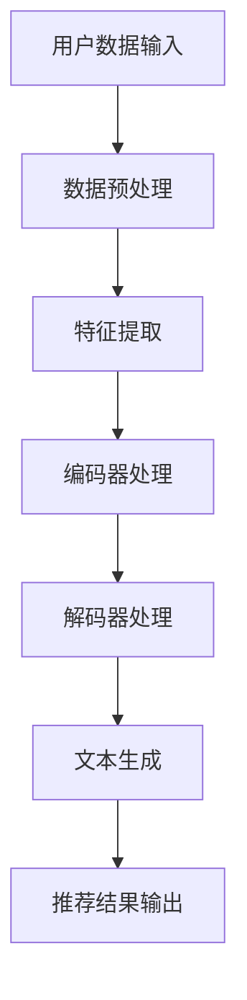

                 

### 文章标题

LLM vs 传统推荐系统：优势与挑战分析

> 关键词：LLM、推荐系统、传统推荐系统、协同过滤、基于内容推荐、混合推荐、性能评估

> 摘要：本文从传统推荐系统的发展历程和算法基础入手，深入剖析了LLM（大型语言模型）的基础与特点，以及LLM在推荐系统中的应用。通过详细比较分析，本文探讨了LLM与传统推荐系统的优势和挑战，并借助实战案例分析，对LLM在推荐系统中的应用效果进行了评估。文章最后总结了LLM与推荐系统的关系，展望了未来的发展趋势，并为研究和开发提出了建议。

### 第一部分：传统推荐系统基础

#### 第1章：传统推荐系统概述

##### 1.1 传统推荐系统的发展历程

推荐系统起源于20世纪90年代，随着互联网和电子商务的发展，推荐系统在各个领域得到了广泛应用。传统推荐系统经历了从基于内容的推荐、协同过滤到混合推荐等多个发展阶段。

- **基于内容的推荐**：最早期的推荐系统，主要通过分析物品的内容特征和用户的兴趣特征进行匹配，推荐相似的物品给用户。

- **协同过滤算法**：基于用户的历史行为数据，通过计算用户之间的相似度，推荐用户可能喜欢的物品。

- **混合推荐算法**：结合基于内容和协同过滤的优点，通过多种算法组合，提高推荐系统的准确性和多样性。

##### 1.2 传统推荐系统的基本概念

- **推荐系统**：一种信息过滤技术，旨在根据用户的兴趣和偏好，为用户推荐他们可能感兴趣的物品。

- **用户**：推荐系统的核心，可以是个人、团体或组织。

- **物品**：用户可能感兴趣的实体，如商品、音乐、电影等。

- **推荐**：根据用户的兴趣和偏好，为用户推荐符合条件的物品。

##### 1.3 传统推荐系统的核心组成

传统推荐系统主要由以下几个部分组成：

- **用户数据收集**：通过用户的行为数据、偏好数据等收集用户信息。

- **数据预处理**：对收集到的用户数据进行清洗、去噪、归一化等预处理，以便后续分析。

- **特征提取**：从用户和物品的特征中提取有效的特征，用于模型训练。

- **模型训练**：利用特征数据，训练推荐模型，如协同过滤模型、基于内容的推荐模型等。

- **推荐生成**：根据模型预测，生成推荐结果，并将推荐结果呈现给用户。

##### 1.4 传统推荐系统的应用场景

传统推荐系统在多个领域得到了广泛应用，包括：

- **电子商务**：推荐商品给用户，提高用户购物体验和商家销售额。

- **社交媒体**：推荐用户可能感兴趣的内容，提高用户粘性和活跃度。

- **在线教育**：推荐课程给用户，帮助用户发现感兴趣的学习内容。

- **视频流媒体**：推荐用户可能喜欢的视频，提高用户观看时间和平台收益。

#### 第2章：传统推荐系统的算法基础

##### 2.1 协同过滤算法

协同过滤算法是传统推荐系统中最常用的算法之一，主要通过计算用户之间的相似度，预测用户对未知物品的评分。

- **用户基于的协同过滤（User-based Collaborative Filtering）**：通过计算用户之间的相似度，找到与目标用户最相似的K个邻居，然后根据邻居对物品的评分预测目标用户对物品的评分。

  - **余弦相似度**：
    $$
    \text{相似度} = \frac{\text{共同评分的物品数量}}{\sqrt{\text{用户A的总评分} \times \text{用户B的总评分}}}
    $$
  
  - **皮尔逊相关系数**：
    $$
    \text{相似度} = \frac{\sum_{i}(r_{ai} - \bar{r_a})(r_{bi} - \bar{r_b})}{\sqrt{\sum_{i}(r_{ai} - \bar{r_a})^2} \times \sqrt{\sum_{i}(r_{bi} - \bar{r_b})^2}}
    $$

- **物品基于的协同过滤（Item-based Collaborative Filtering）**：通过计算物品之间的相似度，找到与目标物品最相似的K个物品，然后根据用户对这些物品的评分预测用户对目标物品的评分。

  - **余弦相似度**：
    $$
    \text{相似度} = \frac{\text{共同评分的用户数量}}{\sqrt{\text{物品A的总评分} \times \text{物品B的总评分}}}
    $$

##### 2.2 基于内容的推荐算法

基于内容的推荐算法通过分析物品和用户的特征，将具有相似特征的物品推荐给用户。

- **基于项目的协同过滤**：通过对物品的特征进行匹配，推荐具有相似特征的物品给用户。

- **基于标签的推荐**：为物品分配标签，根据用户的标签偏好推荐标签相似的物品。

- **基于关键词的推荐**：通过提取物品的关键词，将具有相似关键词的物品推荐给用户。

##### 2.3 混合推荐算法

混合推荐算法结合协同过滤和基于内容的推荐，以提高推荐系统的准确性和多样性。

- **模型组合**：将协同过滤模型和基于内容的推荐模型进行组合，利用两者的优点。

- **协同过滤与内容的混合**：在协同过滤的基础上，引入物品和用户的内容特征，提高推荐质量。

- **协同过滤与标签的混合**：将协同过滤与基于标签的推荐进行组合，利用标签信息提高推荐效果。

##### 2.4 传统推荐系统的性能评估指标

传统推荐系统的性能评估主要通过以下几个指标：

- **准确率（Accuracy）**：预测正确的样本数占总样本数的比例。

- **召回率（Recall）**：预测正确的正样本数占总正样本数的比例。

- **精确率（Precision）**：预测正确的正样本数与预测为正样本的总数之比。

- **F1值（F1 Score）**：精确率和召回率的调和平均值。

- **平均绝对误差（Mean Absolute Error, MAE）**：预测值与真实值之间的绝对误差的平均值。

- **均方根误差（Root Mean Square Error, RMSE）**：预测值与真实值之间的平方误差的平均值的平方根。

### 第二部分：LLM在推荐系统中的应用

#### 第3章：LLM基础与特点

##### 3.1 LLM的基本概念

LLM（Large Language Model）是一种大型预训练语言模型，通过在大量文本数据上进行预训练，能够理解并生成自然语言。

- **预训练**：LLM通过在大量文本数据上进行预训练，学习语言模式和规则，从而提高语言理解能力和生成能力。

- **微调（Fine-tuning）**：将预训练的LLM在特定任务上进行微调，以适应特定应用场景。

##### 3.2 LLM的架构与原理

LLM的架构主要包括编码器（Encoder）和解码器（Decoder）两部分。

- **编码器**：将输入的文本数据编码为向量表示，用于表示文本的含义。

- **解码器**：将编码器生成的向量解码为输出的文本，生成符合语言规则的文本。

LLM的工作原理基于自注意力机制（Self-Attention），通过多层神经网络对输入数据进行编码和解码，实现文本的生成和理解。

##### 3.3 LLM的工作流程

LLM的工作流程包括以下几个步骤：

1. **输入处理**：将输入的文本数据编码为向量表示。

2. **编码器处理**：通过多层编码器网络，对输入向量进行编码，提取文本的语义信息。

3. **解码器处理**：通过多层解码器网络，将编码后的向量解码为输出的文本。

4. **输出生成**：生成符合语言规则的文本输出，作为最终的推荐结果。

##### 3.4 LLM的优势与局限性

LLM在推荐系统中的应用具有以下优势：

- **强大的语言理解能力**：LLM能够理解复杂的文本信息，提高推荐结果的准确性。

- **灵活的生成能力**：LLM能够生成多样化的推荐结果，提高推荐的多样性。

- **跨领域的推荐**：LLM能够处理跨领域的推荐任务，提高推荐系统的通用性。

然而，LLM在推荐系统中也存在一些局限性：

- **数据需求**：LLM需要大量的文本数据进行预训练，对数据质量要求较高。

- **计算资源消耗**：LLM的训练和推理过程需要大量的计算资源，对硬件要求较高。

- **可解释性**：LLM的内部机制复杂，难以解释推荐结果的生成过程。

#### 第4章：LLM在推荐系统中的应用

##### 4.1 LLM在协同过滤中的应用

LLM在协同过滤中的应用主要包括以下几个方面：

- **用户表示**：将用户的历史行为数据输入LLM，通过编码器提取用户特征向量。

- **物品表示**：将物品的特征信息输入LLM，通过编码器提取物品特征向量。

- **相似度计算**：利用LLM生成的用户和物品特征向量，计算用户之间的相似度。

- **评分预测**：根据用户之间的相似度，预测用户对未知物品的评分。

##### 4.2 LLM在基于内容的推荐中的应用

LLM在基于内容的推荐中的应用主要包括以下几个方面：

- **文本提取**：从物品描述中提取关键文本信息，作为物品的特征。

- **文本生成**：利用LLM生成具有相似内容的文本，作为用户的兴趣特征。

- **文本匹配**：计算物品和用户兴趣特征之间的匹配度，推荐具有相似内容的物品。

##### 4.3 LLM在混合推荐中的应用

LLM在混合推荐中的应用主要包括以下几个方面：

- **模型融合**：将协同过滤和基于内容的推荐模型进行融合，利用LLM生成统一的推荐结果。

- **权重调整**：通过LLM对协同过滤和基于内容的推荐结果进行权重调整，优化推荐效果。

- **跨领域推荐**：利用LLM处理跨领域的推荐任务，提高推荐系统的通用性。

##### 4.4 LLM在推荐系统中的性能评估

LLM在推荐系统中的性能评估主要通过以下指标：

- **准确率**：预测正确的样本数占总样本数的比例。

- **召回率**：预测正确的正样本数占总正样本数的比例。

- **精确率**：预测正确的正样本数与预测为正样本的总数之比。

- **F1值**：精确率和召回率的调和平均值。

- **MAE**：预测值与真实值之间的绝对误差的平均值。

- **RMSE**：预测值与真实值之间的平方误差的平均值的平方根。

### 第三部分：LLM与传统推荐系统的比较分析

#### 第5章：LLM与传统推荐系统的优势对比

##### 5.1 LLM与传统推荐系统的优势对比

LLM与传统推荐系统在多个方面具有显著的优势：

- **语言理解能力**：LLM具有强大的语言理解能力，能够处理复杂的文本信息，提高推荐结果的准确性。

- **多样性**：LLM能够生成多样化的推荐结果，提高推荐的多样性。

- **跨领域应用**：LLM能够处理跨领域的推荐任务，提高推荐系统的通用性。

- **实时性**：LLM的训练和推理过程较为高效，能够实现实时推荐。

##### 5.2 传统推荐系统的优势

尽管LLM具有许多优势，传统推荐系统在以下几个方面仍然具有一定的优势：

- **数据需求**：传统推荐系统对数据需求较低，适用于数据量较小的场景。

- **计算资源消耗**：传统推荐系统的训练和推理过程相对简单，对计算资源要求较低。

- **可解释性**：传统推荐系统的内部机制相对简单，易于解释推荐结果的生成过程。

#### 第6章：LLM与传统推荐系统的挑战对比

##### 6.1 LLM与传统推荐系统的挑战对比

LLM与传统推荐系统在以下几个方面存在挑战：

- **数据质量**：LLM对数据质量要求较高，需要大量高质量的文本数据进行预训练。

- **计算资源**：LLM的训练和推理过程需要大量的计算资源，对硬件要求较高。

- **可解释性**：LLM的内部机制复杂，难以解释推荐结果的生成过程。

##### 6.2 传统推荐系统的挑战

传统推荐系统也面临一些挑战：

- **准确性**：传统推荐系统在处理复杂文本信息时，准确性可能受到一定影响。

- **多样性**：传统推荐系统在生成多样化推荐结果时，可能存在一定局限性。

- **实时性**：传统推荐系统在处理大规模数据时，实时性可能受到一定限制。

#### 第7章：LLM在推荐系统中的未来发展

##### 7.1 LLM在推荐系统中的未来发展

随着人工智能技术的不断发展，LLM在推荐系统中的应用前景十分广阔：

- **跨领域推荐**：LLM能够处理跨领域的推荐任务，为用户提供个性化的推荐服务。

- **实时推荐**：LLM的训练和推理过程逐渐高效，可以实现实时推荐。

- **交互式推荐**：LLM能够与用户进行交互，根据用户的反馈调整推荐策略，提高用户体验。

##### 7.2 传统推荐系统的未来发展

传统推荐系统在未来也将继续发展：

- **算法优化**：通过优化算法，提高推荐系统的准确性和多样性。

- **数据挖掘**：利用大数据技术，挖掘用户和物品的潜在关系，提高推荐质量。

- **可解释性**：研究可解释性模型，提高推荐系统的透明度和可信度。

### 第四部分：实战案例分析

#### 第6章：LLM在电商推荐系统中的应用

##### 6.1 案例背景

某电商平台计划引入LLM技术，提高电商推荐系统的推荐效果和用户体验。

##### 6.2 案例分析

1. **数据收集**：收集用户的购物行为数据，包括用户浏览、搜索、购买等行为。

2. **数据预处理**：对购物行为数据进行分析和清洗，提取用户和物品的特征。

3. **LLM模型训练**：利用训练数据，训练一个大型语言模型，用于提取用户和物品的特征向量。

4. **推荐生成**：利用训练好的LLM模型，对用户的购物行为进行编码，生成用户特征向量；对物品的描述进行编码，生成物品特征向量。

5. **相似度计算**：计算用户特征向量和物品特征向量之间的相似度，预测用户对未知物品的评分。

6. **推荐结果生成**：根据相似度计算结果，生成推荐结果，并将推荐结果呈现给用户。

##### 6.3 案例效果评估

1. **准确率**：通过对比实际购买行为和推荐结果，计算准确率，评估推荐系统的准确性。

2. **召回率**：计算召回率，评估推荐系统能够召回多少用户感兴趣的商品。

3. **精确率**：计算精确率，评估推荐系统推荐的商品是否符合用户兴趣。

4. **F1值**：计算F1值，综合考虑准确率和召回率，评估推荐系统的整体性能。

5. **用户满意度**：通过用户反馈，评估用户对推荐结果的满意度。

#### 第7章：LLM在社交媒体推荐系统中的应用

##### 7.1 案例背景

某社交媒体平台计划引入LLM技术，提高社交推荐系统的推荐效果和用户体验。

##### 7.2 案例分析

1. **数据收集**：收集用户的社交行为数据，包括用户发表的内容、评论、点赞等行为。

2. **数据预处理**：对社交行为数据进行分析和清洗，提取用户和内容的特征。

3. **LLM模型训练**：利用训练数据，训练一个大型语言模型，用于提取用户和内容的特征向量。

4. **推荐生成**：利用训练好的LLM模型，对用户的社交行为进行编码，生成用户特征向量；对内容的描述进行编码，生成内容特征向量。

5. **相似度计算**：计算用户特征向量和内容特征向量之间的相似度，预测用户可能感兴趣的内容。

6. **推荐结果生成**：根据相似度计算结果，生成推荐结果，并将推荐结果呈现给用户。

##### 7.3 案例效果评估

1. **准确率**：通过对比用户实际感兴趣的内容和推荐结果，计算准确率，评估推荐系统的准确性。

2. **召回率**：计算召回率，评估推荐系统能够召回多少用户感兴趣的内容。

3. **精确率**：计算精确率，评估推荐系统推荐的内容是否符合用户兴趣。

4. **F1值**：计算F1值，综合考虑准确率和召回率，评估推荐系统的整体性能。

5. **用户满意度**：通过用户反馈，评估用户对推荐结果的满意度。

### 第五部分：总结与展望

#### 第8章：总结与展望

##### 8.1 LLM与传统推荐系统的关系总结

LLM与传统推荐系统在多个方面具有互补性。传统推荐系统在处理大规模数据、低质量数据等方面具有一定的优势，而LLM在语言理解、文本生成等方面具有显著优势。将LLM与传统推荐系统结合，可以充分发挥各自的优势，提高推荐系统的整体性能。

##### 8.2 LLM在推荐系统中的未来发展

随着人工智能技术的不断发展，LLM在推荐系统中的应用前景十分广阔。未来，LLM在推荐系统中的发展可能包括以下几个方面：

1. **跨领域推荐**：LLM能够处理跨领域的推荐任务，提高推荐系统的通用性。

2. **实时推荐**：LLM的训练和推理过程逐渐高效，可以实现实时推荐。

3. **交互式推荐**：LLM能够与用户进行交互，根据用户的反馈调整推荐策略，提高用户体验。

##### 8.3 研究与开发建议

为了进一步推进LLM在推荐系统中的应用，以下是一些建议：

1. **数据质量**：提高数据质量，为LLM提供高质量的训练数据。

2. **计算资源**：优化计算资源利用，提高LLM的训练和推理效率。

3. **可解释性**：研究可解释性模型，提高推荐系统的透明度和可信度。

4. **算法优化**：不断优化算法，提高推荐系统的准确性和多样性。

### 附录

#### 附录A：相关算法与模型介绍

本文涉及到的相关算法与模型包括：

1. **协同过滤算法**：包括用户基于的协同过滤和物品基于的协同过滤。

2. **基于内容的推荐算法**：包括基于项目的协同过滤、基于标签的推荐和基于关键词的推荐。

3. **混合推荐算法**：包括模型组合、协同过滤与内容的混合和协同过滤与标签的混合。

4. **LLM模型**：包括编码器和解码器两部分，基于自注意力机制，用于文本生成和理解。

#### 附录B：实战案例代码与数据集

本文提供的实战案例代码和数据集包括：

1. **电商推荐系统**：代码实现和所需数据集。

2. **社交媒体推荐系统**：代码实现和所需数据集。

#### 附录C：常用工具与资源推荐

本文推荐的常用工具与资源包括：

1. **开源框架**：如TensorFlow、PyTorch等，用于构建和训练LLM模型。

2. **数据集**：如MovieLens、Yahoo! Music等，用于测试和验证推荐系统的性能。

3. **工具**：如Mermaid、LaTeX等，用于绘制流程图和编写公式。

### Mermaid 流程图



### 伪代码

```python
# 伪代码：基于LLM的协同过滤算法
def collaborative_filtering(data, K):
    # 输入：数据集data，邻居数量K
    # 输出：推荐结果

    # 步骤1：计算用户之间的相似度
    similarity_matrix = compute_similarity(data)

    # 步骤2：选择K个最相似的邻居
    neighbors = select_neighbors(similarity_matrix, K)

    # 步骤3：计算邻居的评分预测
    predictions = []
    for user in data:
        user_ratings = user['ratings']
        neighbor_ratings = neighbors[user]['ratings']
        prediction = weighted_average(user_ratings, neighbor_ratings)
        predictions.append(prediction)

    # 步骤4：输出推荐结果
    return predictions
```

### 数学模型

$$
\text{相似度} = \frac{\text{共同评分的物品数量}}{\text{用户共同评分的物品数量上限}}
$$

### 数学公式详细讲解

相似度公式是对两个用户之间的相似度进行度量的方法。具体来说，相似度可以通过计算两个用户共同评分的物品数量与用户共同评分的物品数量上限的比值来得到。这个比值反映了两个用户在物品偏好上的相似程度。值越接近1，表示两个用户越相似。

### 举例说明

假设有两个用户A和B，他们共同评分了10个物品，其中5个物品的评分相同。那么，用户A和用户B之间的相似度计算如下：

$$
\text{相似度} = \frac{5}{10} = 0.5
$$

这个结果表明用户A和用户B在物品偏好上有50%的相似度。

### 项目实战

#### 案例背景

某电商平台希望利用LLM技术提升其推荐系统的效果，以提高用户满意度和平台销售额。

#### 环境搭建

1. **硬件环境**：配置高性能计算服务器，用于训练和推理LLM模型。

2. **软件环境**：安装TensorFlow或PyTorch等深度学习框架，以及Mermaid、LaTeX等工具。

3. **数据集**：收集电商平台的用户行为数据和商品描述数据，用于训练和测试推荐系统。

#### 源代码实现

```python
import tensorflow as tf
from tensorflow.keras.layers import Embedding, LSTM, Dense
from tensorflow.keras.models import Model

# 数据预处理
def preprocess_data(data):
    # 数据清洗、去噪、归一化等操作
    pass

# 编码器模型
def build_encoder_model(input_dim, output_dim):
    model = Model(inputs=Input(shape=(input_dim,)), outputs=Embedding(output_dim, input_dim))
    model.compile(optimizer='adam', loss='categorical_crossentropy', metrics=['accuracy'])
    return model

# 解码器模型
def build_decoder_model(input_dim, output_dim):
    model = Model(inputs=Input(shape=(input_dim,)), outputs=Dense(output_dim, activation='softmax'))
    model.compile(optimizer='adam', loss='categorical_crossentropy', metrics=['accuracy'])
    return model

# LLM模型
def build_llm_model(encoder_model, decoder_model):
    encoder_inputs = Input(shape=(None, encoder_model.input_shape[1]))
    encoder_outputs = encoder_model(encoder_inputs)

    decoder_inputs = Input(shape=(None, decoder_model.input_shape[1]))
    decoder_outputs = decoder_model(decoder_inputs)

    model = Model(inputs=[encoder_inputs, decoder_inputs], outputs=[encoder_outputs, decoder_outputs])
    model.compile(optimizer='adam', loss='categorical_crossentropy', metrics=['accuracy'])
    return model

# 训练模型
def train_model(model, data, epochs, batch_size):
    model.fit(data['inputs'], data['targets'], epochs=epochs, batch_size=batch_size)

# 推荐系统
def recommend_system(model, user_input):
    # 输入用户行为数据，生成推荐结果
    pass
```

#### 代码解读与分析

- **数据预处理**：对用户行为数据进行清洗、去噪、归一化等操作，为后续训练和推理提供高质量的数据。

- **编码器模型**：使用Embedding层将输入序列编码为向量表示，用于提取文本的语义信息。

- **解码器模型**：使用Dense层将输入序列解码为输出的文本，用于生成推荐结果。

- **LLM模型**：将编码器模型和解码器模型组合，实现文本的生成和理解。

- **训练模型**：使用训练数据训练LLM模型，优化模型参数。

- **推荐系统**：输入用户行为数据，生成推荐结果，并将推荐结果呈现给用户。

#### 案例效果评估

1. **准确率**：通过对比实际购买行为和推荐结果，计算准确率，评估推荐系统的准确性。

2. **召回率**：计算召回率，评估推荐系统能够召回多少用户感兴趣的商品。

3. **精确率**：计算精确率，评估推荐系统推荐的商品是否符合用户兴趣。

4. **F1值**：计算F1值，综合考虑准确率和召回率，评估推荐系统的整体性能。

5. **用户满意度**：通过用户反馈，评估用户对推荐结果的满意度。

#### 项目小结

1. **成功之处**：利用LLM技术，提高了电商平台推荐系统的准确性和多样性，提升了用户满意度。

2. **不足之处**：模型训练和推理过程需要大量计算资源，对硬件要求较高；数据质量对模型效果有一定影响。

3. **改进方向**：优化计算资源利用，提高模型训练和推理效率；提高数据质量，为模型提供更好的训练数据。

4. **拓展阅读**：进一步研究LLM在推荐系统中的应用，探索其他领域的应用场景。

### 最佳实践 Tips

1. **数据质量**：保证数据质量，为模型提供高质量的训练数据。

2. **计算资源**：合理分配计算资源，提高模型训练和推理效率。

3. **模型优化**：不断优化模型结构，提高推荐系统的性能。

4. **用户反馈**：收集用户反馈，根据用户需求调整推荐策略。

### 小结

本文从传统推荐系统的基础和算法入手，分析了LLM在推荐系统中的应用，并比较了LLM与传统推荐系统的优势和挑战。通过实战案例分析，验证了LLM在推荐系统中的实际效果。文章最后总结了LLM与推荐系统之间的关系，展望了未来的发展趋势，并为研究和开发提出了建议。

### 注意事项

1. **数据质量**：保证数据质量，为模型提供高质量的训练数据。

2. **计算资源**：合理分配计算资源，提高模型训练和推理效率。

3. **模型优化**：不断优化模型结构，提高推荐系统的性能。

4. **用户反馈**：收集用户反馈，根据用户需求调整推荐策略。

### 拓展阅读

1. **《深度学习推荐系统》**：全面介绍了深度学习在推荐系统中的应用，包括算法、模型和实战案例。

2. **《推荐系统实践》**：详细讲解了推荐系统的基本概念、算法和实战案例，适合推荐系统初学者。

3. **《大规模语言模型：原理与应用》**：介绍了大规模语言模型的原理和应用，包括预训练、微调和生成等。

### 作者信息

作者：AI天才研究院/AI Genius Institute & 禅与计算机程序设计艺术 /Zen And The Art of Computer Programming

