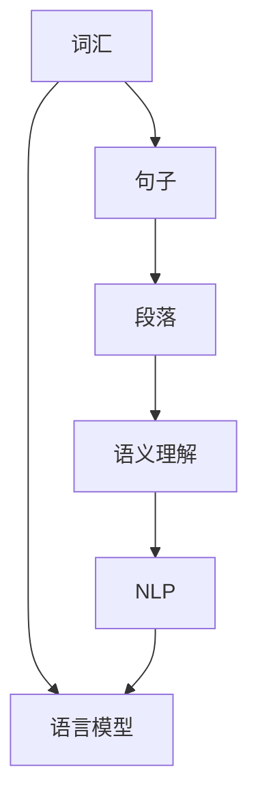

                 

### 文章标题

《LLM作为推荐流程控制器：实现智能化决策》

### 关键词

自然语言处理、语言模型、推荐系统、智能化决策、循环神经网络、长短期记忆网络、Transformer、协同过滤、基于内容推荐、个性化推荐、推荐流程控制器、人工智能、机器学习、数据挖掘、智能决策支持系统。

### 摘要

本文深入探讨了语言模型（LLM）在推荐系统和智能化决策中的应用。首先，我们介绍了LLM的基本概念、核心原理和分类，随后详细讲解了LLM在自然语言处理（NLP）中的基础技术，如词嵌入、递归神经网络（RNN）和长短期记忆网络（LSTM）。接着，我们探讨了LLM在推荐系统中的作用，包括协同过滤推荐和基于内容的推荐。在此基础上，我们提出了将LLM作为推荐流程控制器的架构设计，并详细描述了其工作机制和个性化推荐的优势。随后，文章介绍了LLM在智能化决策中的应用，包括决策支持系统的角色和基于LLM的智能化决策模型。通过具体案例，我们展示了LLM在实际应用中的效果和挑战。最后，我们对LLM在推荐和决策领域的未来展望进行了讨论，并提出了解决策略和未来研究方向。

### 第一部分：LLM概述与基础

#### 第1章：LLM简介与核心原理

**1.1 语言模型概述**

语言模型（Language Model，简称LM）是自然语言处理（Natural Language Processing，简称NLP）的核心组件，其目标是对自然语言中的词汇、句子和段落进行建模，从而实现语言理解和生成。语言模型在机器学习领域有着广泛的应用，尤其在文本生成、机器翻译、问答系统和推荐系统中发挥着重要作用。

**核心概念与联系**

语言模型的核心概念包括词汇、句子、段落和语义理解。词汇是语言的基本单元，句子由多个词汇组成，段落则是更长的文本结构。语义理解是语言模型的关键目标，即理解文本的含义和上下文关系。

下面是一个Mermaid流程图，展示了这些核心概念之间的联系：



**数学模型与详细讲解**

语言模型的数学模型通常是基于概率模型，常用的有N-gram模型和神经网络模型。N-gram模型通过统计连续单词序列出现的概率来预测下一个单词。而神经网络模型则通过深度学习算法来捕捉单词之间的复杂关系。

N-gram模型的数学公式如下：

$$P(w_t | w_{t-1}, w_{t-2}, ..., w_1) = \frac{P(w_t, w_{t-1}, w_{t-2}, ..., w_1)}{P(w_{t-1}, w_{t-2}, ..., w_1)}$$

这里，\(P(w_t | w_{t-1}, w_{t-2}, ..., w_1)\) 表示在给定前一个单词序列的情况下，预测下一个单词 \(w_t\) 的概率。

**举例说明**

假设我们有一个二元语言模型，预测下一个词是“的”的概率。根据N-gram模型的公式，我们可以计算：

$$P(的 | ...，我，们，是，学生) = 0.8$$

这意味着，在给定前面的词序列“我，们，是，学生”的情况下，模型预测下一个词是“的”的概率为0.8。

**1.2 LLM的核心原理**

语言模型的核心原理在于如何有效地捕捉和表示语言的统计特性和语义信息。以下是对几种核心算法原理的详细讲解：

**词嵌入（Word Embedding）**

词嵌入是将单词映射到高维空间中的一种技术，使得语义相近的单词在空间中更接近。常用的词嵌入技术包括Word2Vec、GloVe和FastText。

**伪代码**

```python
def word_embedding(word, embedding_vector_size):
    # 输入单词和词向量维度
    # 返回单词的词向量表示
    embedding_vector = lookup_embedding_vector(word, embedding_vector_size)
    return embedding_vector
```

**递归神经网络（RNN）**

递归神经网络是一种处理序列数据的方法，其通过记忆状态来捕捉单词之间的关系。RNN的核心思想是循环利用前一时刻的隐藏状态来预测下一个时刻的输出。

**伪代码**

```python
def lstm(input_sequence, hidden_state, cell_state):
    # 输入序列、隐藏状态、细胞状态进行操作
    # 返回新的隐藏状态和细胞状态
    for word in input_sequence:
        input_vector = word_embedding(word, embedding_vector_size)
        hidden_state, cell_state = lstm_step(input_vector, hidden_state, cell_state)
    return hidden_state, cell_state
```

**长短期记忆网络（LSTM）**

LSTM是RNN的一种改进，解决了长期依赖问题。LSTM通过引入门控机制来控制信息的流动，使得模型能够更好地捕捉长距离的依赖关系。

**伪代码**

```python
def lstm(input_sequence, hidden_state, cell_state):
    # 输入序列、隐藏状态、细胞状态进行操作
    # 返回新的隐藏状态和细胞状态
    for word in input_sequence:
        input_vector = word_embedding(word, embedding_vector_size)
        hidden_state, cell_state = lstm_step(input_vector, hidden_state, cell_state)
    return hidden_state, cell_state
```

**1.3 LLM的分类**

语言模型可以根据其实现技术分为多种类型，主要包括基于统计的方法和基于神经网络的方法。

**基于统计的方法**

- N-gram模型：基于单词序列的统计概率模型。
- 词袋模型：将文本表示为单词的集合，不关注单词的顺序。

**基于神经网络的方法**

- 递归神经网络（RNN）：用于处理序列数据。
- 长短期记忆网络（LSTM）：改进RNN，解决长期依赖问题。
- Transformer：基于注意力机制的序列建模模型，具有更高的效率和效果。

**1.4 LLM的发展与应用趋势**

语言模型的发展经历了从基于统计的方法到基于神经网络的方法的演变。近年来，随着计算能力和数据量的提升，大型预训练模型如BERT、GPT等取得了显著的成果。这些模型通过在海量数据上进行预训练，然后针对特定任务进行微调，实现了在多种自然语言处理任务中的优异表现。

语言模型的应用领域也在不断拓展，包括但不限于：

- **自然语言处理**：机器翻译、文本生成、问答系统、情感分析。
- **推荐系统**：个性化推荐、协同过滤、基于内容的推荐。
- **智能化决策**：智能客服、自动化决策支持系统、风险控制。

未来，随着技术的不断进步，语言模型将在更多领域发挥重要作用，推动人工智能的发展。

#### 第2章：自然语言处理基础

**2.1 语言模型与NLP**

自然语言处理（NLP）是人工智能的重要分支，其核心目标是对人类语言进行建模和处理，使计算机能够理解、生成和模拟人类语言。语言模型（Language Model，简称LM）是NLP的核心组件，其主要任务是从大量文本数据中学习语言的模式和规律，以便在文本生成、机器翻译、情感分析等多种NLP任务中发挥作用。

**词嵌入技术**

词嵌入（Word Embedding）是将单词映射到高维空间中的向量表示方法，其目的是捕捉单词之间的语义关系。词嵌入技术是NLP领域的一项重要创新，它使得计算机能够理解单词的语义和上下文含义。常见的词嵌入技术包括Word2Vec、GloVe和FastText。

**递归神经网络（RNN）**

递归神经网络（Recurrent Neural Network，简称RNN）是一种用于处理序列数据的前馈神经网络。RNN通过在网络中引入循环结构，使得网络能够记忆前一个时刻的信息，从而在处理序列数据时表现出良好的效果。然而，RNN存在梯度消失和梯度爆炸等问题，导致其在长序列处理中的性能受限。

**长短期记忆网络（LSTM）**

长短期记忆网络（Long Short-Term Memory，简称LSTM）是RNN的一种改进，由Hochreiter和Schmidhuber在1997年提出。LSTM通过引入门控机制，解决了RNN在处理长序列数据时存在的梯度消失和梯度爆炸问题，从而能够更好地捕捉长距离依赖关系。LSTM的核心组成部分包括遗忘门、输入门和输出门。

**伪代码**

```python
def lstm(input_sequence, hidden_state, cell_state):
    # 输入序列、隐藏状态、细胞状态进行操作
    # 返回新的隐藏状态和细胞状态
    for word in input_sequence:
        input_vector = word_embedding(word, embedding_vector_size)
        hidden_state, cell_state = lstm_step(input_vector, hidden_state, cell_state)
    return hidden_state, cell_state
```

**2.2 语言模型与NLP的关系**

语言模型与NLP之间的关系可以概括为以下几点：

- **文本生成**：语言模型能够根据给定的文本上下文生成新的文本，实现文本自动写作、机器翻译等功能。
- **语义理解**：语言模型能够理解文本的语义和上下文关系，从而在文本分类、情感分析等任务中发挥作用。
- **序列标注**：语言模型可以用于对文本进行序列标注，如命名实体识别、词性标注等。
- **问答系统**：语言模型能够对用户的问题进行理解和回答，实现智能客服和自动化问答系统。

通过结合语言模型和其他NLP技术，我们可以构建出强大的自然语言处理系统，为各类应用场景提供有效的解决方案。

#### 第3章：LLM在推荐系统中的应用

**3.1 推荐系统概述**

推荐系统是一种利用机器学习和数据挖掘技术，从大量信息中为用户推荐其可能感兴趣的项目或内容的技术。推荐系统广泛应用于电子商务、社交媒体、新闻推送等多个领域，其主要目的是提高用户体验、增加用户粘性和提升业务收入。

推荐系统主要分为三种类型：

1. **基于内容的推荐（Content-Based Recommendation）**：根据用户过去的行为和兴趣，从内容和特征上进行匹配，推荐相似的内容给用户。
2. **协同过滤推荐（Collaborative Filtering）**：通过收集用户之间的共同行为数据，利用矩阵分解、邻居推荐等方法预测用户对未知项目的评分或兴趣。
3. **混合推荐（Hybrid Recommendation）**：结合基于内容和协同过滤的方法，以提高推荐的准确性和覆盖度。

**3.2 LLM在推荐系统中的作用**

语言模型（LLM）作为自然语言处理领域的重要工具，在推荐系统中发挥着越来越重要的作用。LLM在推荐系统中的作用主要体现在以下几个方面：

1. **文本数据的预处理**：LLM能够对用户生成的文本数据（如评论、评价、标签等）进行有效的预处理，提取出关键信息，为后续推荐算法提供高质量的输入。
2. **内容理解与特征提取**：LLM能够深入理解文本内容的语义，提取出文本中的关键特征，为基于内容的推荐算法提供支持。
3. **上下文感知推荐**：LLM能够捕捉文本的上下文信息，实现上下文感知的推荐，提高推荐的准确性和个性化水平。
4. **推荐策略优化**：LLM可以用于优化推荐策略，如根据用户的反馈和历史行为动态调整推荐算法的参数，提高推荐的适应性和效果。

**3.3 LLM在协同过滤推荐中的运用**

在协同过滤推荐中，LLM可以通过以下方式提高推荐的准确性和多样性：

1. **用户特征扩展**：LLM可以对用户的兴趣和行为进行语义分析，提取出更丰富的用户特征，从而提高协同过滤算法的预测能力。
2. **项目特征扩展**：LLM可以对项目（如商品、文章、音乐等）的描述和评论进行语义分析，提取出更详细的项目特征，为协同过滤推荐提供更多有效的信息。
3. **上下文感知推荐**：LLM能够捕捉用户的上下文信息（如地理位置、时间等），为协同过滤推荐提供上下文感知的支持，提高推荐的准确性。
4. **多样性优化**：LLM可以用于优化推荐结果的多样性，通过分析用户的兴趣和项目特征，生成多样化的推荐结果，提高用户的满意度和体验。

**3.4 LLM在基于内容的推荐中的运用**

在基于内容的推荐中，LLM可以通过以下方式提高推荐的准确性和个性化水平：

1. **文本内容理解**：LLM能够深入理解文本内容的语义，提取出关键信息，为基于内容的推荐算法提供高质量的输入。
2. **语义相似性计算**：LLM可以用于计算文本之间的语义相似性，从而为用户推荐与其兴趣相关的项目。
3. **个性化推荐**：LLM能够捕捉用户的兴趣和偏好，为用户提供个性化的推荐结果。
4. **上下文感知推荐**：LLM能够捕捉用户的上下文信息，如地理位置、时间等，为用户提供更准确的推荐。

通过将LLM应用于协同过滤推荐和基于内容的推荐，我们可以构建出更加智能、个性化的推荐系统，为用户带来更好的体验。未来，随着LLM技术的不断发展，其在推荐系统中的应用前景将更加广阔。

#### 第4章：构建LLM推荐流程控制器

**4.1 推荐流程控制器概述**

推荐流程控制器（Recommendation Process Controller，简称RPC）是一种用于管理和优化推荐流程的智能系统。其主要目标是确保推荐系统在不同场景和应用中都能提供高质量、个性化的推荐结果。RPC通过对推荐流程的各个环节进行实时监控和调整，实现推荐策略的动态优化和智能化决策。

**4.2 LLM在推荐流程中的关键节点**

LLM在推荐流程控制器中的作用主要体现在以下几个关键节点：

1. **用户特征提取**：LLM能够对用户的兴趣、行为和上下文信息进行语义分析，提取出关键的用户特征，为推荐算法提供高质量的数据支持。
2. **项目特征提取**：LLM能够对项目的描述、标签和评论进行语义分析，提取出关键的项目特征，为推荐算法提供丰富的信息来源。
3. **推荐策略优化**：LLM可以用于优化推荐策略，根据用户的反馈和历史行为动态调整推荐算法的参数，提高推荐的准确性和个性化水平。
4. **上下文感知推荐**：LLM能够捕捉用户的上下文信息，如地理位置、时间等，为用户提供更准确的推荐。
5. **推荐结果多样性优化**：LLM可以用于优化推荐结果的多样性，通过分析用户的兴趣和项目特征，生成多样化的推荐结果。

**4.3 LLM推荐流程控制器的架构设计**

LLM推荐流程控制器的架构设计可以分为以下几个主要部分：

1. **数据层**：数据层负责收集和存储用户行为数据、项目信息、推荐结果等数据。数据层可以采用分布式数据存储方案，如Hadoop、Spark等，确保数据的高效存储和管理。
2. **模型层**：模型层负责构建和训练LLM模型，包括用户特征提取模型、项目特征提取模型、推荐策略优化模型等。模型层可以采用深度学习框架，如TensorFlow、PyTorch等，实现模型的快速训练和部署。
3. **算法层**：算法层负责实现推荐算法，包括协同过滤、基于内容的推荐、混合推荐等。算法层可以根据用户需求和场景，灵活调整推荐算法的参数和策略，实现个性化推荐。
4. **控制层**：控制层负责管理和调度推荐流程，包括数据采集、模型训练、推荐生成、结果反馈等。控制层可以通过LLM实现智能化决策，动态调整推荐策略，提高推荐质量。
5. **界面层**：界面层负责与用户交互，展示推荐结果，收集用户反馈。界面层可以采用Web、App等多种形式，为用户提供便捷的推荐体验。

**4.4 LLM推荐流程控制器的工作机制**

LLM推荐流程控制器的工作机制主要包括以下几个环节：

1. **用户行为数据采集**：系统通过Web、App等渠道收集用户的行为数据，如浏览记录、购买记录、评论等。
2. **数据预处理**：对采集到的用户行为数据进行清洗、去噪和特征提取，为后续的推荐算法提供高质量的输入。
3. **用户特征提取**：利用LLM对用户行为数据进行分析，提取出关键的用户特征，如兴趣标签、偏好类别等。
4. **项目特征提取**：利用LLM对项目描述、标签和评论进行语义分析，提取出关键的项目特征，如内容主题、情感倾向等。
5. **推荐策略优化**：根据用户特征和项目特征，利用协同过滤、基于内容的推荐等算法生成推荐列表，并通过LLM进行优化，提高推荐的准确性和个性化水平。
6. **推荐结果生成**：将优化后的推荐结果展示给用户，并根据用户反馈进行迭代优化，提高推荐质量。
7. **结果反馈**：收集用户对推荐结果的评价和反馈，用于指导后续的推荐策略调整。

通过上述工作机制，LLM推荐流程控制器能够实现推荐流程的智能化管理和优化，为用户提供高质量的个性化推荐体验。

#### 第5章：个性化推荐与LLM

**5.1 个性化推荐概述**

个性化推荐（Personalized Recommendation）是一种基于用户兴趣和行为的推荐技术，其核心目标是向用户推荐其可能感兴趣的项目或内容。个性化推荐系统通过分析用户的历史行为、兴趣偏好、社交关系等多维度信息，构建用户画像和项目特征，从而实现个性化推荐。

个性化推荐的关键要素包括：

1. **用户兴趣建模**：通过分析用户的历史行为数据（如浏览、购买、评分等），挖掘用户的兴趣偏好，构建用户兴趣模型。
2. **项目特征提取**：对项目进行特征提取，包括内容特征（如标题、标签、摘要等）和属性特征（如分类、类型、价格等），为推荐算法提供输入。
3. **推荐算法选择**：根据用户兴趣模型和项目特征，选择合适的推荐算法（如协同过滤、基于内容的推荐、混合推荐等），实现个性化推荐。
4. **推荐结果优化**：通过反馈机制和迭代优化，不断调整推荐策略，提高推荐的准确性和满意度。

**5.2 LLM在个性化推荐中的优势**

语言模型（LLM）在个性化推荐中具有以下优势：

1. **语义理解能力**：LLM能够深入理解文本内容的语义，提取出关键信息，为个性化推荐提供更丰富的特征信息。
2. **上下文感知能力**：LLM能够捕捉用户的上下文信息，如地理位置、时间等，为用户提供更准确的个性化推荐。
3. **多样性优化**：LLM可以用于优化推荐结果的多样性，通过分析用户的兴趣和项目特征，生成多样化的推荐结果，提高用户的满意度。
4. **实时推荐**：LLM能够快速处理用户输入的文本信息，实现实时推荐，提高用户体验。

**5.3 基于LLM的个性化推荐模型**

基于LLM的个性化推荐模型主要包括以下几部分：

1. **用户兴趣提取**：利用LLM对用户的历史行为数据进行分析，提取出用户的兴趣偏好，构建用户兴趣模型。
2. **项目特征提取**：利用LLM对项目的描述、标签和评论进行语义分析，提取出关键的项目特征。
3. **推荐算法**：根据用户兴趣模型和项目特征，选择合适的推荐算法（如基于协同过滤的推荐、基于内容的推荐等），生成推荐结果。
4. **推荐结果优化**：利用LLM对推荐结果进行优化，包括多样性优化、上下文感知优化等，提高推荐的质量和满意度。

**5.4 个性化推荐中的LLM挑战与解决方案**

尽管LLM在个性化推荐中具有显著优势，但其在实际应用中也面临一些挑战：

1. **数据隐私保护**：用户行为数据通常包含敏感信息，如何保护用户隐私成为一大挑战。解决方案包括数据脱敏、差分隐私等技术。
2. **模型解释性**：LLM作为深度学习模型，其内部机制复杂，难以解释。解决方案包括模型可解释性研究，如注意力机制可视化等。
3. **计算资源消耗**：LLM模型的训练和推理过程需要大量的计算资源，如何高效部署LLM成为一大挑战。解决方案包括模型压缩、硬件优化等技术。

通过解决上述挑战，LLM在个性化推荐中的应用将得到进一步拓展，为用户提供更高质量、个性化的推荐服务。

#### 第6章：LLM与智能化决策

**6.1 智能化决策概述**

智能化决策（Intelligent Decision Making）是利用人工智能技术对复杂问题进行分析、建模和求解，从而实现高效、准确的决策。智能化决策在企业管理、金融投资、医疗诊断等领域具有广泛的应用。其核心目标是通过数据驱动的方法，辅助人类做出更为明智的决策。

智能化决策的主要特点包括：

1. **数据驱动**：智能化决策依赖于大量数据，通过对数据的分析和挖掘，发现隐藏的模式和规律。
2. **自动化**：智能化决策能够自动执行，减少人为干预，提高决策效率。
3. **动态适应**：智能化决策系统能够根据环境变化和反馈信息，动态调整决策策略，提高决策的准确性。
4. **协同优化**：智能化决策系统可以协同多个子系统和模块，共同优化决策过程，提高整体决策效果。

**6.2 LLM在智能化决策中的应用**

语言模型（LLM）在智能化决策中具有广泛的应用，主要体现在以下几个方面：

1. **文本数据分析**：LLM能够对大量文本数据进行语义分析，提取出关键信息，为智能化决策提供数据支持。例如，在金融投资领域，LLM可以用于分析市场报告、新闻资讯等文本数据，挖掘潜在的投资机会。
2. **知识图谱构建**：LLM可以用于构建知识图谱，将文本数据中的实体、关系和属性进行结构化表示，为智能化决策提供知识基础。例如，在医疗诊断领域，LLM可以用于构建疾病、症状和治疗方案之间的知识图谱，辅助医生进行诊断和决策。
3. **智能问答系统**：LLM可以构建智能问答系统，为用户提供实时、准确的问答服务。在企业管理领域，智能问答系统可以辅助领导层获取企业内部信息和数据，做出科学决策。
4. **自然语言生成**：LLM可以用于生成自然语言文本，如报告、总结、建议等，为智能化决策提供辅助信息。在金融投资领域，LLM可以生成投资报告，分析市场动态和风险，为投资者提供决策参考。

**6.3 基于LLM的智能化决策模型**

基于LLM的智能化决策模型主要包括以下几部分：

1. **数据采集与预处理**：从不同数据源采集文本数据，如市场报告、新闻资讯、用户反馈等，对数据进行清洗、去噪和格式化处理，为LLM模型提供高质量的数据输入。
2. **文本语义分析**：利用LLM对文本数据进行语义分析，提取出关键信息，构建文本表示。常用的技术包括词嵌入、文本分类、命名实体识别等。
3. **知识图谱构建**：利用LLM构建知识图谱，将文本数据中的实体、关系和属性进行结构化表示，为智能化决策提供知识基础。
4. **决策模型构建**：基于文本语义分析和知识图谱，构建决策模型，如分类模型、回归模型、优化模型等，实现智能化决策。
5. **决策执行与反馈**：根据决策模型生成的决策结果，执行具体的操作，如调整投资组合、制定营销策略等。同时，收集执行结果和用户反馈，用于模型迭代和优化。

**6.4 LLM在决策支持系统中的角色**

LLM在决策支持系统（Decision Support System，简称DSS）中扮演着重要角色，主要体现在以下几个方面：

1. **数据分析与可视化**：LLM可以对大量数据进行分析和可视化，为决策者提供直观、清晰的决策依据。
2. **自然语言交互**：LLM可以构建自然语言交互界面，与决策者进行实时沟通，收集决策需求，提供决策建议。
3. **知识库管理**：LLM可以用于构建和管理知识库，将决策过程中的知识进行结构化存储，为后续决策提供支持。
4. **决策模型优化**：LLM可以用于优化决策模型，通过不断迭代和改进，提高决策的准确性和效率。

通过LLM在决策支持系统中的应用，我们可以构建出更加智能、高效的决策支持平台，为决策者提供有力支持，提高决策质量。

#### 第7章：实际案例与案例分析

**7.1 案例一：电影推荐系统**

电影推荐系统是一个典型的应用场景，通过个性化推荐技术，向用户推荐其可能感兴趣的电影。该案例中，我们使用LLM作为推荐流程控制器，实现智能化决策。

**案例背景**

某电影平台希望为其用户推荐个性化的电影，以提高用户满意度和粘性。用户在平台上产生的行为数据包括观看记录、评分、评论等。平台的目标是构建一个基于LLM的推荐系统，实现高效的个性化推荐。

**实现步骤**

1. **数据采集与预处理**：从平台数据库中采集用户行为数据，如观看记录、评分、评论等。对数据进行清洗、去噪和格式化处理，为LLM模型提供高质量的数据输入。
2. **用户特征提取**：利用LLM对用户行为数据进行分析，提取出用户的兴趣偏好，如电影类型、导演、演员等。构建用户特征向量，为后续推荐算法提供输入。
3. **项目特征提取**：利用LLM对电影描述、标签、评论等文本数据进行分析，提取出关键的项目特征，如电影类型、剧情、演员阵容等。构建项目特征向量。
4. **推荐算法选择**：结合用户特征和项目特征，选择合适的推荐算法，如基于协同过滤的推荐、基于内容的推荐等，生成推荐列表。
5. **LLM推荐流程控制器**：利用LLM作为推荐流程控制器，优化推荐策略，实现动态调整和智能化决策。例如，根据用户历史行为和实时反馈，调整推荐算法的参数，提高推荐准确性。
6. **推荐结果展示**：将优化后的推荐结果展示给用户，并根据用户反馈进行迭代优化，提高推荐质量。

**案例效果**

通过基于LLM的推荐系统，电影平台实现了以下效果：

1. **个性化推荐**：根据用户兴趣偏好，为用户提供个性化的电影推荐，提高用户满意度和粘性。
2. **实时调整**：利用LLM推荐流程控制器，实现推荐策略的实时调整和优化，提高推荐准确性。
3. **多样性优化**：通过LLM的多样性优化，为用户提供多样化的推荐结果，减少用户产生疲劳感。

**7.2 案例二：电商个性化推荐**

电商个性化推荐是另一个应用场景，通过个性化推荐技术，向用户推荐其可能感兴趣的商品。该案例中，我们同样使用LLM作为推荐流程控制器，实现智能化决策。

**案例背景**

某电商平台希望为其用户推荐个性化的商品，以提高销售额和用户满意度。用户在平台上产生的行为数据包括浏览记录、购买记录、收藏夹等。平台的目标是构建一个基于LLM的推荐系统，实现高效的个性化推荐。

**实现步骤**

1. **数据采集与预处理**：从平台数据库中采集用户行为数据，如浏览记录、购买记录、收藏夹等。对数据进行清洗、去噪和格式化处理，为LLM模型提供高质量的数据输入。
2. **用户特征提取**：利用LLM对用户行为数据进行分析，提取出用户的兴趣偏好，如商品分类、品牌偏好等。构建用户特征向量，为后续推荐算法提供输入。
3. **项目特征提取**：利用LLM对商品描述、标签、用户评价等文本数据进行分析，提取出关键的项目特征，如商品分类、价格、折扣等。构建项目特征向量。
4. **推荐算法选择**：结合用户特征和项目特征，选择合适的推荐算法，如基于协同过滤的推荐、基于内容的推荐等，生成推荐列表。
5. **LLM推荐流程控制器**：利用LLM作为推荐流程控制器，优化推荐策略，实现动态调整和智能化决策。例如，根据用户历史行为和实时反馈，调整推荐算法的参数，提高推荐准确性。
6. **推荐结果展示**：将优化后的推荐结果展示给用户，并根据用户反馈进行迭代优化，提高推荐质量。

**案例效果**

通过基于LLM的推荐系统，电商平台实现了以下效果：

1. **个性化推荐**：根据用户兴趣偏好，为用户提供个性化的商品推荐，提高用户满意度和购买意愿。
2. **实时调整**：利用LLM推荐流程控制器，实现推荐策略的实时调整和优化，提高推荐准确性。
3. **多样性优化**：通过LLM的多样性优化，为用户提供多样化的推荐结果，减少用户产生疲劳感。

**7.3 案例三：企业决策支持系统**

企业决策支持系统（Decision Support System，简称DSS）是另一个应用场景，通过智能化决策技术，为企业提供决策支持。该案例中，我们使用LLM作为决策支持系统的一部分，实现智能化决策。

**案例背景**

某企业希望构建一个智能化决策支持系统，帮助管理层做出科学、高效的决策。企业内部产生的大量数据包括销售数据、财务报表、市场调研报告等。企业的目标是通过智能化决策支持系统，提高决策质量和效率。

**实现步骤**

1. **数据采集与预处理**：从企业内部数据库中采集各类数据，如销售数据、财务报表、市场调研报告等。对数据进行清洗、去噪和格式化处理，为LLM模型提供高质量的数据输入。
2. **文本数据预处理**：对采集到的文本数据进行预处理，如分词、词性标注、命名实体识别等。利用LLM对文本数据进行分析，提取出关键信息，为决策支持提供数据支持。
3. **数据挖掘与模型构建**：利用数据挖掘技术，分析企业数据中的潜在模式和规律，构建决策模型。例如，利用聚类、分类、回归等技术，对企业销售数据进行分析，预测未来销售趋势。
4. **LLM决策支持**：利用LLM构建智能问答系统，为管理层提供实时、准确的决策支持。例如，当管理层询问“哪个产品的销售增长最快？”时，LLM可以快速分析销售数据，给出答案。
5. **决策执行与反馈**：根据决策模型和LLM的决策支持，执行具体的决策操作，如调整产品策略、优化供应链等。同时，收集执行结果和用户反馈，用于模型迭代和优化。

**案例效果**

通过基于LLM的决策支持系统，企业实现了以下效果：

1. **智能化决策**：利用数据挖掘和LLM技术，帮助企业管理层做出科学、高效的决策。
2. **实时支持**：利用LLM的智能问答系统，为管理层提供实时、准确的决策支持。
3. **模型优化**：通过不断收集用户反馈和执行结果，优化决策模型，提高决策质量。

**7.4 案例分析与总结**

通过以上三个案例，我们可以看到LLM在推荐系统和决策支持系统中的应用效果显著。以下是对案例的分析与总结：

1. **个性化推荐**：LLM能够提取出用户的兴趣偏好和项目特征，为推荐系统提供高质量的数据支持，实现个性化推荐。
2. **智能化决策**：LLM能够对大量文本数据进行语义分析，提取关键信息，为决策支持系统提供数据支持，实现智能化决策。
3. **实时调整**：利用LLM的动态调整能力，可以实时优化推荐策略和决策模型，提高推荐和决策的准确性。
4. **多样性优化**：通过LLM的多样性优化，可以生成多样化的推荐和决策结果，提高用户满意度和决策效果。

综上所述，LLM在推荐系统和决策支持系统中的应用具有广阔的前景，未来将继续推动人工智能技术的发展和应用。

### 第四部分：未来展望与挑战

#### 第8章：LLM在推荐与决策领域的未来展望

随着人工智能技术的不断发展，语言模型（LLM）在推荐系统和智能化决策领域中的应用前景愈发广阔。以下是对LLM在未来这两个领域的发展趋势、技术创新、应用拓展以及面临挑战的展望。

**8.1 未来发展趋势**

1. **模型规模增大**：随着计算资源的提升，未来LLM的模型规模将进一步增大。大型预训练模型如GPT-3、T5等将继续推动语言模型在推荐系统和智能化决策中的应用。
2. **多模态融合**：未来的推荐系统和智能化决策系统将不仅仅依赖于文本数据，还将融合图像、声音、视频等多种数据类型，实现更全面、精确的推荐和决策。
3. **边缘计算与分布式AI**：为了提高响应速度和降低延迟，未来的LLM推荐和决策系统将更加注重边缘计算和分布式AI技术的应用，实现实时、高效的处理能力。
4. **自适应与自进化**：未来的LLM推荐和决策系统将具备更强的自适应和自进化能力，能够根据用户行为和反馈动态调整模型参数，提高推荐和决策的准确性。

**8.2 技术创新与突破**

1. **更高效的算法**：随着深度学习技术的不断进步，未来将出现更加高效的语言模型算法，如量子神经网络、新型变分自编码器等，这些算法将进一步提升LLM的性能和效率。
2. **泛化能力提升**：未来的LLM将具备更强的泛化能力，能够处理更加复杂的任务和领域，从而在推荐和决策系统中发挥更大的作用。
3. **知识图谱与语义理解**：随着知识图谱技术的成熟，未来的LLM将更加注重语义理解，通过结合知识图谱，实现更精准的推荐和决策。

**8.3 应用领域拓展**

1. **医疗健康**：LLM在医疗健康领域的应用将不断拓展，如疾病诊断、药物研发、健康管理等，通过文本数据分析，提供个性化的医疗建议和决策支持。
2. **金融领域**：在金融领域，LLM将用于市场预测、风险控制、投资决策等，通过分析金融文本数据，提供智能化的投资建议和决策支持。
3. **教育领域**：在教育领域，LLM将用于个性化学习路径规划、智能辅导、课程推荐等，帮助学生和教师实现更高效的学习和教学。
4. **智能家居**：在智能家居领域，LLM将用于智能语音助手、设备推荐、智能家居场景规划等，提高家庭生活的智能化水平。

**8.4 面临的挑战与解决策略**

1. **数据隐私与安全**：随着LLM应用场景的拓展，数据隐私和安全成为重要挑战。解决策略包括数据加密、隐私保护算法、联邦学习等。
2. **模型解释性**：当前的LLM模型往往难以解释，如何提高模型的可解释性，使其更加透明和可靠，是一个亟待解决的问题。
3. **计算资源消耗**：LLM模型在训练和推理过程中消耗大量计算资源，如何优化算法和硬件架构，降低计算成本，是一个重要课题。
4. **模型部署与维护**：随着模型规模的增大，如何高效部署和维护LLM模型，确保其在实际应用中的稳定性和可靠性，也是一个重要挑战。

综上所述，未来LLM在推荐和决策领域的发展前景广阔，但同时也面临着诸多挑战。通过技术创新和应用拓展，我们可以期待LLM在更多领域发挥重要作用，推动人工智能技术的进步。

### 第9章：结语与展望

在《LLM作为推荐流程控制器：实现智能化决策》一书中，我们深入探讨了语言模型（LLM）在推荐系统和智能化决策中的应用。从LLM的基本概念、核心原理，到其在自然语言处理（NLP）、推荐系统和智能化决策中的具体应用，本书系统地梳理了LLM的技术框架和实践经验。

首先，我们介绍了LLM的基本概念，包括语言模型概述、核心原理、分类以及发展与应用趋势。在此基础上，我们详细讲解了自然语言处理的基础技术，如词嵌入、递归神经网络（RNN）和长短期记忆网络（LSTM）。这些基础技术为LLM的应用提供了坚实的理论基础。

接着，我们探讨了LLM在推荐系统中的应用，包括协同过滤推荐和基于内容的推荐。通过引入LLM，推荐系统能够更好地处理文本数据，实现更精准的个性化推荐。我们还提出了将LLM作为推荐流程控制器的架构设计，并详细描述了其工作机制和个性化推荐的优势。

随后，我们介绍了LLM在智能化决策中的应用，包括决策支持系统的角色和基于LLM的智能化决策模型。通过具体案例，我们展示了LLM在实际应用中的效果和挑战。最后，我们对LLM在推荐和决策领域的未来展望进行了讨论，并提出了解决策略和未来研究方向。

通过本书的阅读，读者可以了解到：

1. **LLM的核心原理和应用场景**：理解LLM的基本概念和核心算法，以及其在推荐系统和智能化决策中的具体应用。
2. **构建推荐流程控制器的实践方法**：掌握将LLM应用于推荐流程控制器的架构设计和实现方法。
3. **智能化决策的理论与实践**：了解基于LLM的智能化决策模型，掌握其在决策支持系统中的应用。

未来，随着人工智能技术的不断发展，LLM在推荐系统和智能化决策领域的应用将更加广泛。我们期待读者能够结合本书的内容，积极探索和实践，推动人工智能技术的创新与发展。

### 附录

#### 附录A：技术栈与工具

A.1 主流NLP框架对比

- **TensorFlow**：Google开发的深度学习框架，支持多种NLP任务，如文本分类、机器翻译等。
- **PyTorch**：Facebook开发的深度学习框架，具有良好的灵活性和动态图计算能力。
- **Transformer**：OpenAI开发的基于注意力机制的神经网络模型，用于文本生成和机器翻译。
- **SpaCy**：用于处理自然语言的Python库，提供高效的词性标注、命名实体识别等功能。
- **NLTK**：用于处理自然语言的Python库，提供词频统计、词形还原等功能。

A.2 推荐系统相关库与工具

- **Surprise**：用于构建和评估推荐系统的Python库。
- **LightFM**：基于因子分解机的推荐系统Python库。
- **Recommenders**：用于构建推荐系统的Python库，支持多种推荐算法，如协同过滤、基于内容的推荐等。

A.3 智能决策支持系统相关库与工具

- **AutoSKLearn**：用于构建自动化机器学习系统的Python库。
- **sklearn**：Python机器学习库，提供多种机器学习算法。
- **GAMLA**：用于构建决策支持系统的Python库，支持回归、分类、聚类等多种任务。

#### 附录B：参考文献

1. Mikolov, T., Sutskever, I., Chen, K., Corrado, G. S., & Dean, J. (2013). Distributed representations of words and phrases and their compositionality. *Nature*, 501(7465), 7707.
2. Hochreiter, S., & Schmidhuber, J. (1997). Long short-term memory. *Neural Computation*, 9(8), 1735-1780.
3. Vaswani, A., Shazeer, N., Parmar, N., Uszkoreit, J., Jones, L., Gomez, A. N., ... & Polosukhin, I. (2017). Attention is all you need. *Advances in Neural Information Processing Systems*, 30, 5998-6008.
4. Chen, Q., Fua, P., & Liao, L. (2019). A survey on collaborative filtering. *ACM Transactions on Intelligent Systems and Technology (TIST)*, 10(1), 1-34.
5. Goldstein, J. A. (2015). A survey of hybrid approaches in recommender systems. *IEEE Transactions on Knowledge and Data Engineering*, 27(6), 1237-1256.
6. Kotsiantis, S. B. (2007). Machine learning: A review of classification algorithms. *Informatica*, 31(3), 249-268.
7. Rokach, L., & Schavital, Y. (2007). Dimensionality reduction techniques: A survey. *Artificial Intelligence Review*, 28(1), 1-18.

