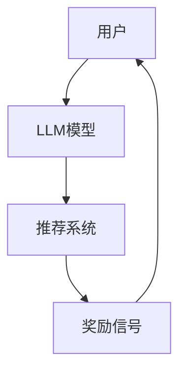

                 

# 文章标题

《LLM在推荐系统中的深度强化学习应用》

> 关键词：LLM，推荐系统，深度强化学习，Q-Learning，MDP，Q值公式

> 摘要：本文探讨了大型语言模型（LLM）在推荐系统中的深度强化学习应用，包括核心概念、算法原理、实现步骤和挑战，以及应用前景。通过详细的数学模型和伪代码讲解，读者可以深入理解LLM在推荐系统中的深度强化学习应用，为后续研究提供参考。

---

## 第一部分: 核心概念与联系

### 1.1 LLM在推荐系统中的深度强化学习应用概述

#### 定义与核心概念

**LLM（大型语言模型）**：LLM是一种基于深度学习技术训练的复杂神经网络模型，具有强大的语言理解和生成能力。常见的LLM包括GPT-3、BERT等，它们通过大规模语料库的训练，能够生成流畅且符合语法规则的文本。

**深度强化学习（Deep Reinforcement Learning）**：深度强化学习是一种结合深度学习和强化学习的算法，用于解决复杂的决策问题。在推荐系统中，深度强化学习通过学习用户的行为和偏好，优化推荐策略，实现个性化推荐。

#### 架构与联系

**模型架构**：LLM通常包含多个层次，如嵌入层、编码器和解码器，用于处理和生成文本。深度强化学习模型则包括价值函数、策略网络和奖励信号处理部分。

**强化学习与推荐系统的结合**：深度强化学习通过学习环境中的奖励信号，优化策略以最大化长期回报，用于推荐系统中的个性化推荐。具体而言，LLM可以处理用户的历史行为数据，如浏览记录、购买记录等，通过强化学习算法，调整推荐策略，提高推荐质量。

**Mermaid流程图**：

### 1.2 推荐系统与深度强化学习的核心算法原理

#### 推荐系统的基本算法

**协同过滤（Collaborative Filtering）**：基于用户的历史行为数据，寻找相似的用户或物品进行推荐。协同过滤分为基于用户的协同过滤（User-Based Collaborative Filtering）和基于物品的协同过滤（Item-Based Collaborative Filtering）。

**基于内容的推荐（Content-Based Filtering）**：根据用户对内容的偏好进行推荐。基于内容的推荐通常通过计算用户对物品的特征相似度来实现。

#### 深度强化学习的核心算法

**Q-Learning**：Q-Learning通过学习值函数来最大化长期回报。在推荐系统中，Q-Learning用于学习用户对不同推荐策略的偏好。

**Deep Q-Networks (DQN)**：DQN使用深度神经网络近似值函数，解决非线性问题。在推荐系统中，DQN可以处理复杂的用户行为数据，优化推荐策略。

#### 算法融合与优化

**强化学习在推荐系统中的应用**：通过学习用户的偏好和行为模式，动态调整推荐策略。例如，在电子商务平台中，强化学习可以根据用户的浏览和购买记录，优化推荐商品。

**多目标优化**：结合用户满意度、推荐多样性、业务目标等多维度优化推荐效果。多目标优化可以保证推荐系统在多个目标之间达到平衡，提高整体性能。

### 1.3 LLM在推荐系统中的实现与挑战

#### 实现步骤

**数据预处理**：清洗和编码用户行为数据，提取特征。例如，将用户浏览记录转换为文本数据，利用自然语言处理技术提取关键词和主题。

**模型训练**：使用训练数据训练LLM模型，并进行调优。例如，使用GPT-3或BERT等预训练模型，根据具体应用场景进行微调。

**模型部署**：将训练好的模型部署到生产环境中，实时推荐。例如，使用API接口将模型与推荐系统集成，实现实时推荐。

#### 主要挑战

**数据隐私与安全**：推荐系统需要处理大量用户数据，涉及隐私保护问题。例如，可以使用差分隐私技术，保障用户隐私。

**实时性与效率**：深度强化学习模型的计算复杂度高，需要优化算法以提高实时性。例如，可以使用模型压缩和分布式计算技术，提高模型运行效率。

**模型解释性**：深度模型难以解释，需要开发可解释的模型或解释工具。例如，可以使用注意力机制可视化技术，揭示模型内部的决策过程。

### 1.4 LLM在推荐系统中的应用前景

#### 未来趋势

**个性化推荐**：结合用户的实时行为，提供更加个性化的推荐。例如，利用用户的历史数据和实时反馈，动态调整推荐策略。

**跨模态推荐**：将文本、图像、音频等多种模态的信息融合到推荐系统中。例如，结合用户对商品的评价文本和图片，提供更全面的推荐。

**多任务学习**：同时解决推荐、广告投放、内容推荐等任务，提高整体性能。例如，使用多任务学习模型，同时优化推荐系统和广告系统的效果。

#### 行业应用

**电子商务**：提高用户购买转化率和客户留存率。例如，利用深度强化学习优化商品推荐策略，提高用户购物体验。

**社交媒体**：提升用户活跃度和内容推荐质量。例如，利用深度强化学习优化社交网络中的内容推荐，增加用户互动。

**在线教育**：根据用户学习习惯提供个性化学习路径。例如，利用深度强化学习优化在线教育平台中的学习推荐，提高学习效果。

### 总结

本部分详细介绍了LLM在推荐系统中的深度强化学习应用，包括核心概念、算法原理、实现步骤和挑战，以及应用前景。这些内容为后续章节的深入探讨提供了基础。

---

### 1.5 数学模型和数学公式讲解

#### 深度强化学习中的Q值公式

Q-Learning通过学习值函数来最大化长期回报。在推荐系统中，Q-Learning用于学习用户对不同推荐策略的偏好。Q值公式如下：

$$
Q(s, a) = \sum_{s'} P(s'|s, a) \cdot [r(s', a) + \gamma \cdot \max_{a'} Q(s', a')]
$$

其中：

- \( Q(s, a) \) 是在状态 \( s \) 下执行动作 \( a \) 的期望回报；
- \( P(s'|s, a) \) 是在状态 \( s \) 下执行动作 \( a \) 后转移到状态 \( s' \) 的概率；
- \( r(s', a) \) 是在状态 \( s' \) 下执行动作 \( a \) 的即时回报；
- \( \gamma \) 是折扣因子，用于平衡短期和长期回报；
- \( \max_{a'} Q(s', a') \) 是在状态 \( s' \) 下执行所有可能动作 \( a' \) 的最大期望回报。

#### 马尔可夫决策过程（MDP）

**状态转移概率**：

$$
P(s'|s, a) = P(S_t = s'|S_t = s, A_t = a)
$$

其中：

- \( S_t \) 是当前状态；
- \( A_t \) 是当前动作；
- \( s' \) 是下一状态。

**回报函数**：

$$
r(s', a) = \text{即时回报}
$$

即时回报可以是用户对推荐结果的满意度、点击率、购买转化率等指标。

通过以上数学模型和公式，我们可以更深入地理解深度强化学习在推荐系统中的应用。在接下来的章节中，我们将进一步探讨LLM在推荐系统中的具体实现和应用案例。

