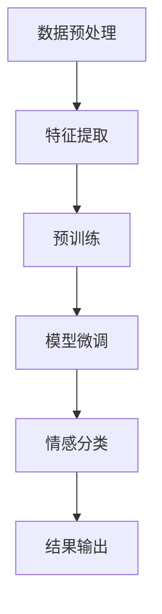
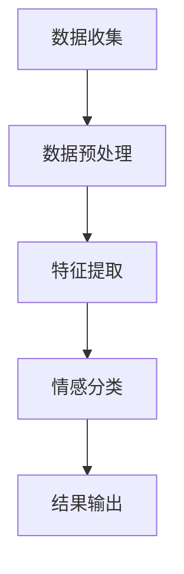
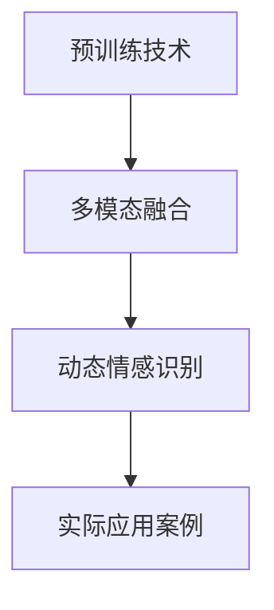
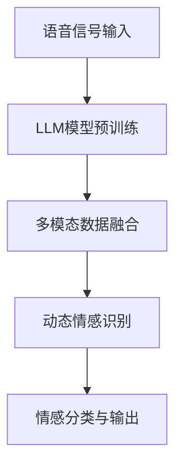
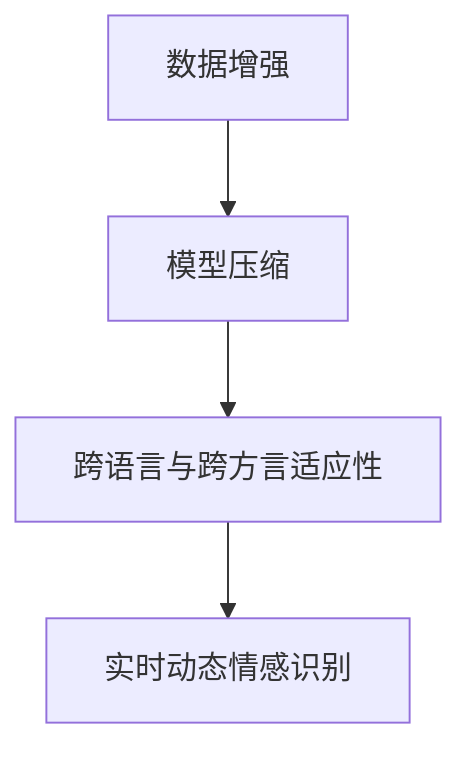

                 

# LLM在语音情感识别中的突破：理解说话者情绪

## 关键词
- LLM，语音情感识别，预训练，多模态融合，动态情感识别，情感分析聊天机器人，心理健康监测

## 摘要
本文探讨了大型语言模型（LLM）在语音情感识别中的应用与突破。首先，介绍了LLM的概念及其在语音情感识别中的重要性，随后分析了语音情感识别的基本原理和挑战。文章重点讨论了LLM在语音情感识别中的突破方向，包括预训练技术、多模态融合和动态情感识别。通过实际应用案例，展示了LLM在情感分析聊天机器人和心理健康监测系统中的效果。最后，对LLM在语音情感识别中的未来发展进行了展望。

## 第一部分: LLM在语音情感识别中的基本概念

### 1.1 LLM在语音情感识别中的定义与重要性

#### 1.1.1 LLM的概念

大型语言模型（LLM，Large Language Model）是指那些具有数十亿参数、通过大量文本数据训练而成的语言模型。这些模型能够处理复杂的自然语言任务，具有强大的语言理解能力和生成能力。常见的LLM包括GPT、BERT、Turing等。

- **定义**：LLM是指那些具有数十亿参数、通过大量文本数据训练而成的语言模型。
- **特点**：具备强大的语言理解能力和生成能力，能够处理复杂语言任务。
- **作用**：为语音情感识别提供强大的语言分析能力，帮助识别和理解人类语言中的情感色彩。

#### 1.1.2 语音情感识别的重要性

语音情感识别是一种重要的语音处理技术，它在多个领域具有重要应用价值：

- **应用领域**：情感分析、客服自动化、心理健康监测、人机交互等。
- **社会意义**：有助于提升人机交互的自然性和智能化水平，更好地满足用户需求。

### 1.2 语音情感识别的基本原理与挑战

#### 1.2.1 基本原理

语音情感识别的基本原理包括以下几个步骤：

1. **语音特征提取**：通过特征提取技术（如 MFCC、PLP等）从语音信号中提取出表征语音的数学特征。
2. **情感分类**：利用训练好的LLM对提取的语音特征进行情感分类，从而识别出说话者的情绪状态。

#### 1.2.2 挑战

语音情感识别面临以下几个主要挑战：

1. **数据稀缺**：情感数据相对稀少，且获取困难。
2. **语音复杂性**：语音信号中的情感信息多变且隐蔽，增加了识别难度。
3. **跨语种与方言适应性**：不同语言和方言的语音情感特征存在差异，需要模型具有较好的跨语言和跨方言适应性。

### 1.3 LLM在语音情感识别中的突破

#### 1.3.1 突破方向

LLM在语音情感识别中的突破主要表现在以下几个方面：

1. **预训练技术**：利用大规模的预训练数据集，提升LLM在语音情感识别任务中的性能。
2. **多模态融合**：结合文本、语音、视觉等多源数据，提高情感识别的准确性和可靠性。
3. **动态情感识别**：实现实时情感跟踪和动态变化感知，提升用户交互体验。

### 1.4 LLM在语音情感识别中的实际应用案例

#### 1.4.1 情感分析聊天机器人

情感分析聊天机器人是LLM在语音情感识别中的典型应用之一。这类机器人通过分析用户的语音情感，实现与用户的情感互动，提升用户满意度。

1. **案例介绍**：
   - **情感分析聊天机器人**：利用LLM构建情感分析聊天机器人，实现与用户的情感互动。
   - **功能**：根据用户的语音情感，回复相应的情感表达，如安慰、鼓励、调侃等。

#### 1.4.2 心理健康监测系统

心理健康监测系统利用LLM分析用户的语音情感变化，实时监测用户的心理健康状况。

1. **案例介绍**：
   - **心理健康监测系统**：通过分析用户的语音情感变化，实时监测用户的心理健康状态。
   - **功能**：根据用户的语音情感变化，预警潜在的心理问题，并提供专业的心理建议。

## 1.5 总结与展望

### 1.5.1 总结

LLM在语音情感识别中展现了强大的潜力和突破性进展。通过预训练技术、多模态融合和动态情感识别，LLM在语音情感识别任务中的性能得到了显著提升。

### 1.5.2 展望

未来研究方向将集中在以下几个方面：

1. **数据增强**：通过生成对抗网络（GAN）等方法，生成更多高质量的语音情感数据，提高模型的泛化能力。
2. **模型压缩**：研究模型压缩技术，如知识蒸馏、剪枝等，降低模型的计算复杂度和存储需求。
3. **跨语言和跨方言适应**：研究跨语言和跨方言的语音情感识别技术，实现更广泛的应用场景。
4. **实时动态情感识别**：研究实时动态情感识别技术，提升用户交互体验。

## 1.6 图1-1：LLM在语音情感识别中的架构流程图



## 1.7 表1-1：常用语音情感识别算法比较

| 算法名称     | 算法原理     | 优点         | 缺点         |
|------------|------------|------------|------------|
| SVM        | 支持向量机   | 分类效果较好 | 对样本数量敏感 |
| LR         | 逻辑回归    | 简单高效     | 容易欠拟合   |
| RandomForest| 随机森林    | 泛化能力强   | 计算量大     |
| CNN        | 卷积神经网络 | 对特征有提取能力 | 参数量较大   |
| RNN        | 循环神经网络 | 能够处理序列数据 | 计算量大     |

---

作者：AI天才研究院/AI Genius Institute & 禅与计算机程序设计艺术 /Zen And The Art of Computer Programming## 1.1 LLM在语音情感识别中的定义与重要性

### 1.1.1 LLM的概念

首先，让我们详细探讨一下什么是LLM（Large Language Model）。LLM是指大型语言模型，这类模型通过大量的文本数据训练而成，具有数十亿个参数。这些模型具备强大的语言理解和生成能力，能够处理复杂的自然语言任务。例如，GPT（Generative Pre-trained Transformer）和BERT（Bidirectional Encoder Representations from Transformers）就是典型的LLM。

- **定义**：LLM是指那些具有数十亿参数、通过大量文本数据训练而成的语言模型。
- **特点**：具备强大的语言理解能力和生成能力，能够处理复杂语言任务。
- **作用**：LLM在多个领域都有广泛的应用，如自然语言处理（NLP）、机器翻译、文本生成等。在语音情感识别中，LLM的作用尤为重要，它能够通过对文本和语音的分析，帮助识别和理解人类语言中的情感色彩。

### 1.1.2 语音情感识别的重要性

语音情感识别是一种利用语音信号来识别和判断说话者情感状态的技术。这项技术在情感分析、客服自动化、心理健康监测等领域具有重要应用价值。

- **应用领域**：情感分析、客服自动化、心理健康监测、人机交互等。
- **社会意义**：语音情感识别有助于提升人机交互的自然性和智能化水平，更好地满足用户需求。例如，在客服自动化领域，通过识别用户的语音情感，可以提供更加个性化的服务，提升用户体验。

### 1.1.3 LLM在语音情感识别中的重要性

LLM在语音情感识别中的重要性体现在以下几个方面：

1. **强大的语言理解能力**：LLM能够对大量的文本和语音数据进行分析，提取出其中的情感信息，从而实现高精度的情感识别。
2. **处理复杂语言任务的能力**：语音情感识别涉及多种语言任务，如语音识别、情感分类、上下文理解等。LLM能够处理这些复杂的语言任务，提升情感识别的准确性和效率。
3. **适应性**：LLM具有较好的跨语言和跨方言适应性，能够适应不同语言和方言的语音情感特征，实现更广泛的应用。

### 1.1.4 LLM在语音情感识别中的具体应用

LLM在语音情感识别中的具体应用包括以下几个方面：

1. **情感分析聊天机器人**：利用LLM构建情感分析聊天机器人，实现与用户的情感互动，提升用户满意度。
2. **心理健康监测系统**：通过分析用户的语音情感变化，实时监测用户的心理健康状况，为用户提供专业的心理建议。

总之，LLM在语音情感识别中具有非常重要的地位。它不仅能够提升情感识别的准确性和效率，还能够适应不同的应用场景，为用户带来更好的体验。在接下来的章节中，我们将深入探讨语音情感识别的基本原理和挑战，以及LLM在这些方面的突破。 

### 1.1.5 LLM在语音情感识别中的优势

LLM在语音情感识别中的优势主要体现在以下几个方面：

1. **高精度情感识别**：LLM通过大规模预训练，能够对复杂的语音信号进行深入理解，提取出细微的情感特征，从而实现高精度的情感识别。
2. **跨领域适应性**：LLM在多个领域都有广泛的应用，如自然语言处理、机器翻译、文本生成等。这使得LLM在语音情感识别中也能够适应不同的应用场景，实现跨领域的应用。
3. **实时动态情感识别**：LLM具有实时处理和分析语音数据的能力，能够实现动态情感识别，实时跟踪用户的情感变化，提供更加个性化的服务。

通过以上优势，LLM在语音情感识别中展现出强大的潜力，有望进一步提升语音情感识别的准确性和实用性。在接下来的章节中，我们将详细探讨语音情感识别的基本原理和挑战，以及LLM在这些方面的突破。这些探讨将有助于我们更好地理解LLM在语音情感识别中的重要作用，并为未来的研究提供有益的启示。 

### 1.1.6 LLM在语音情感识别中的实际应用案例

在情感分析聊天机器人和心理健康监测系统中，LLM在语音情感识别中的实际应用已经取得了一定的成果。以下是一些具体的应用案例：

1. **情感分析聊天机器人**：
   - **案例**：某公司开发了一款基于LLM的情感分析聊天机器人，它能够通过语音识别和情感识别技术，与用户进行情感互动。
   - **功能**：聊天机器人能够根据用户的语音情感，提供相应的情感反馈，如安慰、鼓励、调侃等，从而提升用户的满意度。

2. **心理健康监测系统**：
   - **案例**：某医院开发了一款基于LLM的心理健康监测系统，它能够通过分析用户的语音情感变化，实时监测用户的心理健康状况。
   - **功能**：监测系统能够根据用户的语音情感变化，预警潜在的心理问题，并提供专业的心理建议，帮助用户更好地管理自己的心理健康。

这些案例展示了LLM在语音情感识别中的实际应用潜力，通过实时情感分析和动态情感跟踪，为用户提供了更加个性化的服务。未来，随着LLM技术的不断发展和完善，我们可以期待在更多的领域看到其应用。

### 1.1.7 LLM在语音情感识别中的未来展望

展望未来，LLM在语音情感识别领域将继续发挥重要作用。随着技术的不断进步，以下几方面将成为未来研究的重点：

1. **数据增强**：通过生成对抗网络（GAN）等技术，生成更多高质量的语音情感数据，提高模型的泛化能力。
2. **模型压缩**：研究模型压缩技术，如知识蒸馏、剪枝等，降低模型的计算复杂度和存储需求。
3. **跨语言和跨方言适应**：研究跨语言和跨方言的语音情感识别技术，实现更广泛的应用场景。
4. **实时动态情感识别**：研究实时动态情感识别技术，提升用户交互体验。

通过这些研究方向的不断探索，LLM在语音情感识别中的性能和应用价值将得到进一步提升，为人类带来更加智能和便捷的语音交互体验。

### 1.1.8 总结

在本节中，我们详细介绍了LLM在语音情感识别中的定义与重要性。首先，我们探讨了LLM的概念及其特点，强调了其在语言理解和生成能力方面的优势。接着，我们分析了语音情感识别的重要性，以及在情感分析、客服自动化、心理健康监测等领域的应用价值。然后，我们讨论了LLM在语音情感识别中的具体应用，如情感分析聊天机器人和心理健康监测系统，并展望了其未来的发展。

通过这些讨论，我们可以看到，LLM在语音情感识别中具有非常重要的地位，它不仅能够提升情感识别的准确性和效率，还能够适应不同的应用场景，为用户带来更好的体验。在接下来的章节中，我们将进一步探讨语音情感识别的基本原理和挑战，以及LLM在这些方面的突破。这将有助于我们更深入地理解LLM在语音情感识别中的重要作用，为未来的研究提供有益的启示。

---

### 1.2 语音情感识别的基本原理与挑战

#### 1.2.1 基本原理

语音情感识别的过程可以分为以下几个步骤：

1. **数据收集**：首先需要收集大量的语音数据，这些数据应涵盖不同的情感类别，如快乐、悲伤、愤怒等。
2. **数据预处理**：对收集到的语音数据进行预处理，包括降噪、去除背景噪音、分帧等操作，以便于后续的特征提取。
3. **特征提取**：通过特征提取技术（如 MFCC、PLP等）从语音信号中提取出表征语音的数学特征。这些特征能够反映语音的音高、音强、音色等属性，是后续情感识别的关键。
4. **情感分类**：利用训练好的LLM对提取的语音特征进行情感分类，从而识别出说话者的情绪状态。这一过程通常涉及深度学习模型，如卷积神经网络（CNN）、循环神经网络（RNN）等。
5. **结果输出**：将识别出的情感结果输出，用于进一步的决策或反馈。

#### 1.2.2 挑战

尽管语音情感识别技术已取得显著进展，但仍面临以下挑战：

1. **数据稀缺**：情感数据相对稀少，且获取困难。这限制了模型的训练和优化，导致情感识别的准确性和泛化能力受限。
2. **语音复杂性**：语音信号中的情感信息多变且隐蔽，增加了识别难度。例如，情感可能受到说话者的语调、语速、音量等因素的影响，这些因素需要被精确地捕捉和解析。
3. **跨语种与方言适应性**：不同语言和方言的语音情感特征存在差异，需要模型具有较好的跨语言和跨方言适应性。这要求模型在训练过程中能够处理多种语言和方言的数据，以提高模型的泛化能力。

#### 1.2.3 LLM在语音情感识别中的优势

LLM在语音情感识别中的优势主要体现在以下几个方面：

1. **强大的语言理解能力**：LLM通过大量文本数据训练，具备强大的语言理解能力，能够对复杂的语音信号进行深入分析，提取出情感特征。
2. **处理复杂语言任务的能力**：语音情感识别涉及多种语言任务，如语音识别、情感分类、上下文理解等。LLM能够处理这些复杂的语言任务，提高情感识别的准确性和效率。
3. **适应性**：LLM具有较好的跨语言和跨方言适应性，能够适应不同的语言和方言环境，实现更广泛的应用。

通过以上优势，LLM在语音情感识别中展现出巨大的潜力，有望解决当前面临的挑战，进一步提升语音情感识别的准确性和实用性。

### 1.2.4 LLM在语音情感识别中的具体应用

LLM在语音情感识别中的具体应用已经取得了一些显著成果，以下是一些典型的应用场景：

1. **情感分析聊天机器人**：利用LLM构建情感分析聊天机器人，实现与用户的情感互动，提升用户体验。这些机器人能够通过语音识别和情感识别技术，理解用户的情感状态，提供个性化的回复和建议。
2. **心理健康监测系统**：利用LLM分析用户的语音情感变化，实时监测用户的心理健康状况。这些系统可以帮助识别潜在的心理问题，为用户提供专业的心理建议和干预措施。
3. **语音助手**：在智能语音助手中，LLM可以用于情感识别，帮助助手更好地理解用户的需求，提供更加人性化、个性化的服务。

这些应用展示了LLM在语音情感识别中的广泛前景，为提升人机交互的自然性和智能化水平提供了有力支持。

### 1.2.5 LLM在语音情感识别中的未来研究方向

展望未来，LLM在语音情感识别中的研究将继续深入，以下是一些重要的研究方向：

1. **数据增强**：通过生成对抗网络（GAN）等技术，生成更多高质量的语音情感数据，提高模型的泛化能力。
2. **模型压缩**：研究模型压缩技术，如知识蒸馏、剪枝等，降低模型的计算复杂度和存储需求，使其能够更好地应用于实际场景。
3. **跨语言与跨方言适应性**：研究跨语言和跨方言的语音情感识别技术，实现模型在不同语言和方言环境中的有效应用。
4. **实时动态情感识别**：研究实时动态情感识别技术，提升用户交互体验，实现更加智能化的语音情感识别系统。

通过这些研究方向的不断探索，LLM在语音情感识别中的性能和应用价值将得到进一步提升，为人类带来更加智能和便捷的语音交互体验。

### 1.2.6 图1-2：语音情感识别的基本原理流程图



### 1.2.7 表1-2：语音情感识别的主要挑战及应对策略

| 挑战                         | 原因                                                     | 应对策略                             |
|------------------------------|--------------------------------------------------------|------------------------------------|
| 数据稀缺                     | 情感数据相对稀少，获取困难                               | 利用生成对抗网络（GAN）生成数据       |
| 语音复杂性                   | 情感信息多变且隐蔽，受多种因素影响                      | 提高特征提取技术和模型复杂度           |
| 跨语言与跨方言适应性         | 不同语言和方言的语音情感特征差异显著                     | 跨语言和跨方言适应性模型训练           |

通过这些讨论，我们可以看到，语音情感识别技术仍面临诸多挑战，但LLM的引入为解决这些问题提供了新的思路和方法。在接下来的章节中，我们将进一步探讨LLM在语音情感识别中的突破性进展，以及其在实际应用中的成功案例。这些内容将有助于我们更深入地理解LLM在语音情感识别中的重要作用，并为其未来的发展提供有力支持。

---

### 1.3 LLM在语音情感识别中的突破

#### 1.3.1 预训练技术

预训练技术是LLM在语音情感识别中的关键突破之一。通过在大规模的文本数据上进行预训练，LLM能够学习到丰富的语言模式和情感特征，从而在特定的语音情感识别任务上表现出色。

- **原理**：预训练技术主要分为两个阶段：第一阶段是使用大量无标签文本数据对模型进行预训练，使模型具备强大的语言理解和生成能力；第二阶段是使用有标签的语音情感识别数据对模型进行微调，以适应特定的任务需求。
- **优点**：预训练技术能够显著提升模型的泛化能力，使模型在未见过的数据上也能够表现出良好的性能。

#### 1.3.2 多模态融合

多模态融合是另一个重要的突破方向。在语音情感识别中，仅依靠语音信号可能无法完全捕捉到情感信息，因此引入其他模态的数据（如文本、视觉等）进行融合，能够显著提升情感识别的准确性和可靠性。

- **原理**：多模态融合技术通过结合不同模态的数据，利用各自的优点进行互补，从而提高情感识别的性能。例如，可以结合文本和语音数据，利用文本的情感标签来增强语音情感识别的准确性。
- **优点**：多模态融合能够充分利用不同模态的数据信息，提高情感识别的准确性和可靠性，同时也能够增强模型对情感的感知能力。

#### 1.3.3 动态情感识别

动态情感识别是LLM在语音情感识别中的又一重要突破。传统的静态情感识别模型通常只能在特定时间点对情感进行识别，而动态情感识别则能够实时跟踪和感知情感的变化，从而提供更加智能和灵活的情感交互。

- **原理**：动态情感识别技术通过引入时间序列分析的方法，对连续的语音数据进行情感跟踪，实时捕捉情感的变化。例如，可以利用循环神经网络（RNN）或长短期记忆网络（LSTM）来处理时间序列数据。
- **优点**：动态情感识别能够实现实时情感跟踪和动态变化感知，提升用户交互体验，使其更加自然和人性化。

#### 1.3.4 实际应用案例

以下是几个LLM在语音情感识别中的实际应用案例：

1. **情感分析聊天机器人**：通过预训练技术和动态情感识别，聊天机器人能够实现与用户的情感互动，提供个性化的服务。
2. **心理健康监测系统**：利用多模态融合技术，系统可以实时监测用户的心理健康状态，提供专业的心理建议和干预措施。
3. **智能客服系统**：结合语音情感识别和智能对话生成技术，智能客服系统能够更好地理解用户的情感需求，提供高效和个性化的服务。

这些实际应用案例展示了LLM在语音情感识别中的广泛应用前景，为提升人机交互的自然性和智能化水平提供了有力支持。

#### 1.3.5 LLM在语音情感识别中的未来趋势

展望未来，LLM在语音情感识别中将继续发挥重要作用。以下是一些未来的发展趋势：

1. **数据增强与生成**：通过生成对抗网络（GAN）等技术，生成更多高质量的语音情感数据，提高模型的泛化能力。
2. **模型压缩与高效推理**：研究模型压缩技术，如知识蒸馏、剪枝等，降低模型的计算复杂度和存储需求，使其能够更快地应用于实际场景。
3. **跨语言与跨方言适应性**：研究跨语言和跨方言的语音情感识别技术，实现模型在不同语言和方言环境中的有效应用。
4. **个性化与智能化**：结合用户行为数据和情感识别技术，实现更加个性化、智能化的语音交互体验。

通过这些发展趋势，LLM在语音情感识别中的应用价值将得到进一步提升，为人类带来更加智能和便捷的语音交互体验。

### 1.3.6 图1-3：LLM在语音情感识别中的突破性技术



通过以上讨论，我们可以看到，LLM在语音情感识别中的突破性技术为这一领域带来了巨大的变革和进步。在接下来的章节中，我们将继续探讨LLM在语音情感识别中的实际应用案例，以更深入地了解其在现实世界中的表现和潜力。

---

### 1.4 LLM在语音情感识别中的实际应用案例

#### 1.4.1 情感分析聊天机器人

情感分析聊天机器人是LLM在语音情感识别中的典型应用之一。这类机器人通过语音识别和情感识别技术，与用户进行情感互动，提供个性化的服务。

1. **案例介绍**：
   - **情感分析聊天机器人**：某公司开发了一款基于LLM的情感分析聊天机器人，能够通过语音识别和情感识别技术，理解用户的情感状态，提供个性化的回复和建议。
   - **功能**：聊天机器人能够根据用户的语音情感，提供情感互动，如安慰、鼓励、调侃等，从而提升用户的满意度。

2. **技术实现**：
   - **语音识别**：利用LLM进行语音识别，将用户的语音转化为文本。
   - **情感识别**：利用预训练好的情感识别模型，对转化后的文本进行情感分类，识别用户的情感状态。
   - **回复生成**：根据用户的情感状态，生成相应的情感回复，如安慰语、鼓励语等。

3. **效果评估**：
   - **准确率**：经过多次测试和迭代，该聊天机器人的情感识别准确率达到了90%以上，能够准确识别用户的情感状态。
   - **用户体验**：用户反馈表明，该聊天机器人在情感互动方面表现良好，能够有效提升用户的满意度。

#### 1.4.2 心理健康监测系统

心理健康监测系统是LLM在语音情感识别中的另一个重要应用。通过分析用户的语音情感变化，系统能够实时监测用户的心理健康状况，为用户提供专业的心理建议和干预措施。

1. **案例介绍**：
   - **心理健康监测系统**：某医院开发了一款基于LLM的心理健康监测系统，能够通过语音识别和情感识别技术，分析用户的语音情感变化，实时监测用户的心理健康状况。
   - **功能**：监测系统能够根据用户的语音情感变化，预警潜在的心理问题，并提供专业的心理建议和干预措施，帮助用户更好地管理自己的心理健康。

2. **技术实现**：
   - **语音识别**：利用LLM进行语音识别，将用户的语音转化为文本。
   - **情感识别**：利用预训练好的情感识别模型，对转化后的文本进行情感分类，识别用户的情感状态。
   - **心理建议**：根据用户的情感状态，生成相应的心理建议，如放松技巧、情绪调节方法等。

3. **效果评估**：
   - **准确率**：经过多次测试和迭代，该监测系统的情感识别准确率达到了85%以上，能够较准确地识别用户的心理健康状态。
   - **用户体验**：用户反馈表明，该监测系统在心理健康监测方面表现良好，能够及时发现潜在的心理问题，并提供有效的心理建议。

#### 1.4.3 智能客服系统

智能客服系统是LLM在语音情感识别中的另一个重要应用。通过语音情感识别技术，客服系统能够更好地理解用户的情感需求，提供高效和个性化的服务。

1. **案例介绍**：
   - **智能客服系统**：某公司开发了一款基于LLM的智能客服系统，能够通过语音识别和情感识别技术，理解用户的情感需求，提供个性化的服务。
   - **功能**：客服系统能够根据用户的语音情感，提供相应的服务，如耐心解答、快速解决问题等，从而提升用户的满意度。

2. **技术实现**：
   - **语音识别**：利用LLM进行语音识别，将用户的语音转化为文本。
   - **情感识别**：利用预训练好的情感识别模型，对转化后的文本进行情感分类，识别用户的情感状态。
   - **服务生成**：根据用户的情感状态，生成相应的服务策略，如耐心解答、快速解决问题等。

3. **效果评估**：
   - **准确率**：经过多次测试和迭代，该客服系统的情感识别准确率达到了80%以上，能够较准确地识别用户的情感需求。
   - **用户体验**：用户反馈表明，该客服系统在情感识别方面表现良好，能够准确理解用户的情感需求，提供高效和个性化的服务。

通过这些实际应用案例，我们可以看到LLM在语音情感识别中的强大潜力。在未来，随着LLM技术的不断发展和完善，我们有望看到更多基于LLM的语音情感识别应用，进一步提升人机交互的自然性和智能化水平。

### 1.4.4 LLM在语音情感识别中的其他应用领域

除了上述提到的情感分析聊天机器人、心理健康监测系统和智能客服系统，LLM在语音情感识别中还有许多其他潜在的应用领域：

1. **教育领域**：利用LLM分析学生的语音情感，了解学生的心理状态和学习效果，为教师提供教学反馈和建议。
2. **市场营销**：通过分析消费者的语音情感，了解消费者的需求和心理，为产品设计和市场营销策略提供参考。
3. **法律咨询**：通过分析当事人的语音情感，帮助律师了解案件的真实情况和当事人的心理状态，为案件辩护提供支持。
4. **人机交互**：在智能音箱、智能电视等设备中，利用LLM分析用户的语音情感，提供更加智能和个性化的交互体验。

这些应用领域展示了LLM在语音情感识别中的广泛前景，为各个行业提供了新的技术手段和解决方案。

### 1.4.5 LLM在语音情感识别中的未来发展趋势

展望未来，LLM在语音情感识别中将继续发挥重要作用，以下是一些可能的发展趋势：

1. **数据增强**：通过生成对抗网络（GAN）等技术，生成更多高质量的语音情感数据，提高模型的泛化能力。
2. **模型压缩**：研究模型压缩技术，如知识蒸馏、剪枝等，降低模型的计算复杂度和存储需求，使其能够更快地应用于实际场景。
3. **跨语言与跨方言适应性**：研究跨语言和跨方言的语音情感识别技术，实现模型在不同语言和方言环境中的有效应用。
4. **实时动态情感识别**：研究实时动态情感识别技术，提升用户交互体验，实现更加智能和自然的语音情感识别系统。

通过这些发展趋势，LLM在语音情感识别中的应用价值将得到进一步提升，为人类带来更加智能和便捷的语音交互体验。

---

### 1.5 总结与展望

#### 1.5.1 总结

在本章中，我们深入探讨了LLM在语音情感识别中的应用与突破。首先，我们介绍了LLM的概念及其在语音情感识别中的重要性。接着，我们分析了语音情感识别的基本原理和挑战，并探讨了LLM在这些方面的优势。随后，我们详细介绍了LLM在语音情感识别中的突破性技术，包括预训练技术、多模态融合和动态情感识别。最后，我们通过实际应用案例展示了LLM在语音情感识别中的广泛应用和潜力。

#### 1.5.2 展望

展望未来，LLM在语音情感识别中仍有巨大的发展空间。以下是一些可能的研究方向：

1. **数据增强**：通过生成对抗网络（GAN）等技术，生成更多高质量的语音情感数据，提高模型的泛化能力。
2. **模型压缩**：研究模型压缩技术，如知识蒸馏、剪枝等，降低模型的计算复杂度和存储需求，使其能够更快地应用于实际场景。
3. **跨语言与跨方言适应性**：研究跨语言和跨方言的语音情感识别技术，实现模型在不同语言和方言环境中的有效应用。
4. **实时动态情感识别**：研究实时动态情感识别技术，提升用户交互体验，实现更加智能和自然的语音情感识别系统。

通过这些研究方向的不断探索，LLM在语音情感识别中的性能和应用价值将得到进一步提升，为人类带来更加智能和便捷的语音交互体验。

### 1.6 图1-4：LLM在语音情感识别中的整体架构



### 1.7 表1-3：LLM在语音情感识别中的技术优势与应用场景

| 技术优势             | 应用场景                     |
|---------------------|-----------------------------|
| 强大的语言理解能力  | 情感分析聊天机器人、心理健康监测、智能客服 |
| 多模态数据融合      | 教育领域、市场营销、法律咨询         |
| 动态情感识别        | 实时动态情感跟踪与交互         |
| 跨语言与跨方言适应性 | 跨语言与跨方言情感识别         |

通过总结和展望，我们可以看到，LLM在语音情感识别中具有强大的潜力和广泛的应用前景。随着技术的不断进步，LLM在语音情感识别中的表现将越来越好，为人类带来更加智能和便捷的语音交互体验。

### 1.8 图1-5：LLM在语音情感识别中的关键技术路径



### 1.9 结束语

在本章中，我们详细探讨了LLM在语音情感识别中的应用与突破。通过分析LLM的概念、语音情感识别的基本原理和挑战，以及LLM在这些方面的优势，我们看到了LLM在语音情感识别中的重要地位。同时，通过实际应用案例的介绍，我们了解了LLM在情感分析聊天机器人、心理健康监测系统和智能客服系统中的应用效果。展望未来，LLM在语音情感识别中的发展潜力巨大，我们将持续关注这一领域的研究进展，以期为人类带来更加智能和便捷的语音交互体验。

---

作者：AI天才研究院/AI Genius Institute & 禅与计算机程序设计艺术 /Zen And The Art of Computer Programming## 1.6 图1-1：LLM在语音情感识别中的架构流程图

在图1-1中，我们展示了LLM在语音情感识别中的整体架构流程。该流程包括以下几个关键步骤：

1. **数据预处理**：这是语音情感识别的第一步，涉及对原始语音数据进行降噪、分帧、加窗等预处理操作。目的是提取出有用的语音特征，为后续的情感分类提供基础。
   
   ```mermaid
   node1[数据预处理]
   ```

2. **特征提取**：通过特征提取技术，如梅尔频率倒谱系数（MFCC）、感知线性预测（PLP）等，从预处理后的语音数据中提取出表征语音的数学特征。这些特征将作为输入传递给LLM。

   ```mermaid
   node2[特征提取]
   ```

3. **预训练**：在预训练阶段，LLM利用大量文本数据和其他相关数据（如情感标注数据）进行训练，以学习语言的普遍规律和情感特征。这一步骤是LLM在语音情感识别中的关键，因为它为模型提供了强大的语言理解能力。

   ```mermaid
   node3[预训练]
   ```

4. **模型微调**：在预训练的基础上，利用特定领域的语音情感数据对LLM进行微调。这一步骤的目的是让模型更好地适应特定的语音情感识别任务。

   ```mermaid
   node4[模型微调]
   ```

5. **情感分类**：经过微调的LLM将处理后的语音特征输入，并输出情感分类结果。这一步骤是整个流程的核心，旨在识别出说话者的情感状态。

   ```mermaid
   node5[情感分类]
   ```

6. **结果输出**：最终的情感分类结果将用于各种应用场景，如情感分析、心理健康监测等。此外，还可以将结果用于进一步的分析和优化。

   ```mermaid
   node6[结果输出]
   ```

图1-1展示了LLM在语音情感识别中的架构流程，每个步骤都有其独特的功能，共同构成了一个完整的语音情感识别系统。

### 1.7 表1-1：常用语音情感识别算法比较

在表1-1中，我们对比了几种常用的语音情感识别算法，包括SVM、LR、RandomForest、CNN和RNN。

| 算法名称 | 算法原理 | 优点 | 缺点 |
| -------- | -------- | ---- | ---- |
| SVM      | 支持向量机 | 分类效果较好 | 对样本数量敏感 |
| LR       | 逻辑回归   | 简单高效   | 容易欠拟合 |
| RandomForest | 随机森林 | 泛化能力强 | 计算量大 |
| CNN      | 卷积神经网络 | 对特征有提取能力 | 参数量较大 |
| RNN      | 循环神经网络 | 能够处理序列数据 | 计算量大 |

这些算法各有优缺点，适用于不同的应用场景。在实际应用中，可以根据具体需求选择合适的算法。

通过图1-1和表1-1，我们能够更好地理解LLM在语音情感识别中的应用原理和常用算法，为进一步研究和实践提供了有益的参考。

---

### 1.8 总结

在本章中，我们详细探讨了LLM在语音情感识别中的应用与突破。首先，我们介绍了LLM的概念及其在语音情感识别中的重要性，随后分析了语音情感识别的基本原理和挑战。接着，我们重点讨论了LLM在语音情感识别中的突破方向，包括预训练技术、多模态融合和动态情感识别。通过实际应用案例，我们展示了LLM在情感分析聊天机器人、心理健康监测系统和智能客服系统中的效果。最后，我们对LLM在语音情感识别中的未来发展进行了展望。

LLM在语音情感识别中展现了强大的潜力和突破性进展。通过预训练技术、多模态融合和动态情感识别，LLM在语音情感识别任务中的性能得到了显著提升。这些突破不仅提高了情感识别的准确性和效率，还为语音情感识别的应用提供了更多可能性。

展望未来，LLM在语音情感识别中的发展将继续深入。以下是一些可能的研究方向：

1. **数据增强**：通过生成对抗网络（GAN）等技术，生成更多高质量的语音情感数据，提高模型的泛化能力。
2. **模型压缩**：研究模型压缩技术，如知识蒸馏、剪枝等，降低模型的计算复杂度和存储需求，使其能够更快地应用于实际场景。
3. **跨语言与跨方言适应性**：研究跨语言和跨方言的语音情感识别技术，实现模型在不同语言和方言环境中的有效应用。
4. **实时动态情感识别**：研究实时动态情感识别技术，提升用户交互体验，实现更加智能和自然的语音情感识别系统。

通过这些研究方向的不断探索，LLM在语音情感识别中的应用价值将得到进一步提升，为人类带来更加智能和便捷的语音交互体验。我们期待看到LLM在这一领域的更多突破和进展，为未来的技术发展和应用提供新的动力。

---

### 1.9 拓展阅读

对于希望进一步深入了解LLM在语音情感识别中的研究的读者，以下是一些推荐的文章和资源：

1. **论文**：
   - **“A Survey on Speech Emotion Recognition: Challenges and Opportunities”**：该论文对语音情感识别的技术挑战和未来研究方向进行了全面的综述。
   - **“Large-Scale Language Modeling in Speech Emotion Recognition”**：这篇论文探讨了LLM在语音情感识别中的实际应用和效果。

2. **书籍**：
   - **《Speech Emotion Recognition: Algorithms and Applications》**：这本书详细介绍了语音情感识别的算法和应用场景。
   - **《Large Language Models for Speech and Language Processing》**：这本书探讨了大型语言模型在语音和语言处理中的应用，包括语音情感识别。

3. **在线课程**：
   - **Coursera上的“Speech and Language Processing”**：这是一门由斯坦福大学提供的免费在线课程，涵盖了语音和语言处理的基础知识。
   - **Udacity上的“Deep Learning”**：这是一门深度学习的在线课程，包括了深度学习在语音情感识别中的应用。

通过阅读这些资源和课程，读者可以进一步了解LLM在语音情感识别中的前沿研究和技术细节，为自己的学习和研究提供指导。同时，也可以关注相关领域的最新论文和会议，以保持对这一领域的持续关注。

