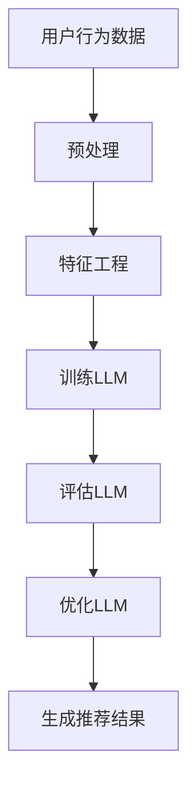
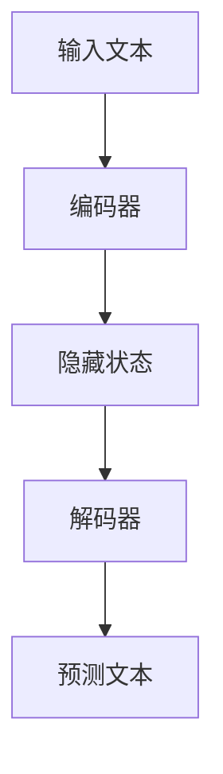

                 

### 文章标题

# LLM对推荐系统透明度和可解释性的提升

### 关键词：

- 语言模型（Language Model，简称LLM）
- 推荐系统
- 透明度
- 可解释性
- 协同过滤
- 基于内容的推荐

### 摘要：

本文深入探讨了语言模型（LLM）在推荐系统中的应用，特别是在提高推荐系统透明度和可解释性方面的作用。通过分析LLM的基本原理、架构与核心算法，本文详细阐述了LLM在协同过滤和基于内容推荐中的应用，以及如何通过LLM提升推荐系统的透明度和可解释性。同时，文章还讨论了在实际应用中面临的挑战和解决方案，并展望了未来的发展趋势。本文旨在为研究人员和开发者提供关于LLM在推荐系统中的应用的全面理解和实用指导。

----------------------------------------------------------------

### 引言与背景

推荐系统是一种常用的信息过滤技术，旨在根据用户的兴趣、历史行为和上下文信息，向用户推荐可能感兴趣的商品、内容或服务。随着互联网的普及和大数据技术的发展，推荐系统已经广泛应用于电子商务、社交媒体、在线新闻、视频平台等众多领域，极大地提升了用户体验和平台的价值。

#### 推荐系统的基本原理

推荐系统通常基于两种主要的推荐策略：协同过滤（Collaborative Filtering）和基于内容的推荐（Content-Based Recommendation）。

1. **协同过滤**：协同过滤是一种基于用户行为的推荐方法，通过分析用户之间的相似性，发现相似用户的共同偏好，从而为用户提供推荐。协同过滤主要分为两类：基于用户的协同过滤（User-Based Collaborative Filtering）和基于项目的协同过滤（Item-Based Collaborative Filtering）。

   - **基于用户的协同过滤**：寻找与目标用户行为最相似的K个用户，然后推荐这些用户喜欢的商品或内容。
   - **基于项目的协同过滤**：寻找与目标用户历史评价最相似的项目，然后推荐这些项目。

2. **基于内容的推荐**：基于内容的推荐是一种基于项目特征的推荐方法，通过比较用户历史偏好和项目特征，为用户推荐具有相似特征的商品或内容。基于内容的推荐通常需要建立项目特征向量，然后使用相似度度量计算用户和项目之间的相似性。

#### 推荐系统面临的挑战

尽管推荐系统在许多领域取得了显著的成功，但仍然面临一些挑战：

1. **数据稀疏性**：用户和项目之间的交互数据往往非常稀疏，这给协同过滤方法带来了一定的困难。
2. **冷启动问题**：对于新用户或新项目，由于缺乏足够的历史数据，传统推荐方法难以提供准确的推荐。
3. **可解释性不足**：推荐系统的决策过程通常比较复杂，用户难以理解推荐结果是如何生成的，这降低了用户对推荐系统的信任度。
4. **透明度问题**：推荐系统的推荐结果往往是黑箱模型生成的，用户无法了解推荐背后的原因。

#### 透明度和可解释性的重要性

透明度和可解释性是推荐系统的重要属性，对于用户的信任和满意度具有直接影响：

1. **用户信任**：用户对推荐系统的信任度与推荐结果的透明度和可解释性密切相关。当用户能够理解推荐结果是如何生成的，他们会更加信任推荐系统，并更愿意接受推荐。
2. **用户满意度**：推荐系统的透明度和可解释性有助于提高用户满意度。用户了解推荐背后的原因，会感到更加满意，从而提高平台的用户留存率和转化率。
3. **合规性和伦理**：在许多国家和地区，数据隐私和透明度已成为法规要求。提高推荐系统的透明度和可解释性有助于确保系统符合法规要求，避免潜在的法律风险。

#### LLM在推荐系统中的应用前景

近年来，语言模型（LLM）在自然语言处理（NLP）领域取得了显著的进展，展示了强大的文本生成、理解和分析能力。LLM在推荐系统中的应用前景主要表现在以下几个方面：

1. **文本生成与个性化描述**：LLM可以生成高质量的文本描述，为推荐项目提供丰富、个性化的介绍，提升用户体验。
2. **上下文理解与关联分析**：LLM能够深入理解文本中的上下文关系，有助于发现用户和项目之间的关联，提高推荐的准确性。
3. **透明度和可解释性提升**：通过分析LLM生成的文本，用户可以更直观地了解推荐结果的生成过程，从而提高推荐系统的透明度和可解释性。

本文将详细探讨LLM在推荐系统中的应用，分析其如何提高推荐系统的透明度和可解释性，并讨论在实际应用中可能面临的挑战和解决方案。

## 第二部分：LLM的基础知识

在深入探讨LLM在推荐系统中的应用之前，我们需要了解LLM的基本概念、分类、训练方法和评估指标。LLM作为一种先进的自然语言处理技术，其核心在于通过大量文本数据学习语言规律和模式，从而实现文本生成、理解和分析。

### 2.1 语言模型的基本概念

#### 2.1.1 语言模型的作用

语言模型（Language Model，简称LM）是一种用于预测文本序列的模型。它可以基于已有的文本数据学习语言规律和模式，然后根据这些规律和模式生成新的文本序列。在推荐系统中，语言模型主要用于以下几个方面的作用：

1. **文本生成**：用于生成推荐项的描述，提升推荐内容的丰富性和个性化。
2. **上下文理解**：用于理解用户和推荐项之间的上下文关系，提高推荐的准确性。
3. **长文本处理**：用于处理长文本推荐项，如新闻、文章等，提高推荐的质量。

#### 2.1.2 语言模型的分类

根据训练方式和目标，语言模型可以分为以下几类：

1. **统计语言模型**：基于统计方法训练，如 N-gram 模型。
2. **神经网络语言模型**：基于神经网络训练，如循环神经网络（RNN）和变换器（Transformer）模型。
3. **深度学习语言模型**：基于深度学习训练，如 GPT 系列模型。

#### 2.1.3 语言模型的训练方法

语言模型的训练方法主要包括以下几种：

1. **自监督训练**：通过无监督方式从大量未标注的数据中学习，如 masked language model（MLM）。
2. **监督训练**：通过有监督方式从标注数据中学习，如 sequence-to-sequence（seq2seq）模型。
3. **迁移学习**：通过预训练好的模型在特定任务上微调，如 fine-tuning。

#### 2.1.4 语言模型的评估指标

语言模型的评估指标主要包括以下几个：

1. **准确性**：模型预测正确的概率，如字符准确性、单词准确性等。
2. **流畅性**：模型生成文本的流畅程度，如 BLEU 分数、ROUGE 分数等。
3. **多样性**：模型生成文本的多样性，如 n-gram 均值、词汇多样性等。

### 2.2 LLM的架构与工作原理

#### 2.2.1 语言模型的架构

语言模型通常由以下几个部分组成：

1. **输入层**：接收用户输入的文本数据。
2. **编码器**：将输入文本转换为固定长度的向量表示。
3. **解码器**：根据编码器的输出生成预测的文本序列。
4. **损失函数**：用于评估模型预测与实际文本之间的差异，如 cross-entropy loss。

#### 2.2.2 语言模型的工作原理

语言模型的工作原理可以分为以下几个步骤：

1. **输入处理**：将用户输入的文本数据编码为向量表示。
2. **编码**：将输入向量通过编码器转换为固定长度的向量表示。
3. **解码**：根据编码器的输出和目标文本的隐藏状态，解码器生成预测的文本序列。
4. **评估**：通过损失函数评估模型预测与实际文本之间的差异，并更新模型参数。

#### 2.2.3 语言模型的关键算法

语言模型的关键算法主要包括以下几种：

1. **循环神经网络（RNN）**：一种基于序列数据的神经网络模型，适用于处理时间序列数据。
2. **长短时记忆网络（LSTM）**：一种改进的 RNN 模型，用于解决 RNN 的梯度消失和梯度爆炸问题。
3. **变换器（Transformer）**：一种基于自注意力机制的神经网络模型，在自然语言处理任务中表现出色。
4. **GPT系列模型**：基于 Transformer 架构的预训练语言模型，具有强大的文本生成能力。

#### 2.2.4 LLM的应用场景

LLM 在推荐系统中的应用场景主要包括以下几个方面：

1. **文本生成**：用于生成推荐项的描述，提高推荐内容的丰富性和个性化。
2. **上下文理解**：用于理解用户和推荐项之间的上下文关系，提高推荐的准确性。
3. **长文本处理**：用于处理长文本推荐项，如新闻、文章等，提高推荐的质量。

### 2.3 LLM的核心算法原理

#### 2.3.1 循环神经网络（RNN）

循环神经网络（RNN）是一种基于序列数据的神经网络模型，其核心思想是利用隐藏状态来保存序列信息。RNN 的基本结构包括输入层、隐藏层和输出层。

##### 2.3.1.1 基本结构

输入层接收输入序列，隐藏层保存序列信息，输出层生成预测序列。

##### 2.3.1.2 工作原理

- **前向传播**：输入序列通过输入层传递到隐藏层，隐藏层计算隐藏状态。
- **后向传播**：隐藏层计算损失函数，并反向传播更新模型参数。

##### 2.3.1.3 伪代码

```python
# 前向传播
h_t = [h_0, h_1, ..., h_T]
x_t = [x_0, x_1, ..., x_T]
y_t = [y_0, y_1, ..., y_T]

for t in range(T):
    h_t = f(h_{t-1}, x_t)

# 后向传播
loss = compute_loss(y_t, y_t')
grads = compute_gradients(h_T, y_t', y_t)
update_params(grads)
```

#### 2.3.2 长短时记忆网络（LSTM）

长短时记忆网络（LSTM）是一种改进的 RNN 模型，用于解决 RNN 的梯度消失和梯度爆炸问题。LSTM 的基本结构包括输入门、遗忘门、输出门和单元状态。

##### 2.3.2.1 基本结构

输入门、遗忘门、输出门和单元状态共同构成了 LSTM 的核心结构。

##### 2.3.2.2 工作原理

- **前向传播**：输入序列通过输入门、遗忘门和输出门与单元状态相互作用，生成隐藏状态。
- **后向传播**：隐藏状态通过输入门、遗忘门和输出门与单元状态相互作用，生成损失函数，并反向传播更新模型参数。

##### 2.3.2.3 伪代码

```python
# 前向传播
i_t = input_gate(h_{t-1}, x_t)
f_t = forget_gate(h_{t-1}, x_t)
o_t = output_gate(h_{t-1}, x_t)
c_t = new_cell_state(i_t, f_t, c_{t-1})

h_t = o_t * tanh(c_t)

# 后向传播
loss = compute_loss(h_t, y_t)
grads = compute_gradients(h_{t-1}, x_t, h_t, y_t)
update_params(grads)
```

#### 2.3.3 变换器（Transformer）

变换器（Transformer）是一种基于自注意力机制的神经网络模型，其在自然语言处理任务中表现出色。变换器的基本结构包括编码器和解码器。

##### 2.3.3.1 基本结构

编码器和解码器分别由多个自注意力层和前馈网络组成。

##### 2.3.3.2 工作原理

- **编码器**：输入序列通过多个自注意力层和前馈网络，生成编码器输出。
- **解码器**：编码器输出和目标序列通过多个自注意力层和前馈网络，生成解码器输出。

##### 2.3.3.3 伪代码

```python
# 编码器
for layer in encoder_layers:
    x = layer(x)

# 解码器
for layer in decoder_layers:
    x = layer(x, encoder_output)
```

#### 2.3.4 GPT系列模型

GPT系列模型是基于变换器架构的预训练语言模型，具有强大的文本生成能力。GPT系列模型的基本结构包括预训练和微调。

##### 2.3.4.1 基本结构

预训练阶段：使用大量文本数据进行自监督预训练。
微调阶段：在特定任务上对预训练模型进行微调。

##### 2.3.4.2 工作原理

- **预训练**：通过自监督方式从大量未标注的数据中学习语言规律。
- **微调**：在特定任务上对预训练模型进行有监督微调，以适应具体任务。

##### 2.3.4.3 伪代码

```python
# 预训练
for epoch in range(num_epochs):
    for batch in batches:
        loss = compute_loss(model(batch), batch)
        update_params(loss)

# 微调
for epoch in range(num_epochs):
    for batch in batches:
        loss = compute_loss(model(batch), batch)
        update_params(loss)
```

#### 2.3.5 LLM的性能评估与优化

LLM 的性能评估主要包括以下几个方面：

- **准确性**：评估模型预测的准确性。
- **流畅性**：评估模型生成文本的流畅程度。
- **多样性**：评估模型生成文本的多样性。

LLM 的优化方法主要包括以下几个方面：

- **参数调整**：调整模型参数，以优化模型性能。
- **数据增强**：使用数据增强方法提高模型泛化能力。
- **正则化**：使用正则化方法防止模型过拟合。
- **迁移学习**：使用预训练模型进行迁移学习，以减少训练数据的需求。

### 2.4 LLM在推荐系统中的应用效果

LLM 在推荐系统中的应用效果可以从以下几个方面进行评估：

- **推荐准确性**：评估模型推荐结果的准确性。
- **推荐多样性**：评估模型推荐结果的多样性。
- **推荐流畅性**：评估模型推荐结果的流畅性。

实际应用中，LLM 在推荐系统中的应用效果往往优于传统方法，尤其是在处理长文本推荐项和提升推荐内容丰富性方面表现出色。

### 2.5 LLM在推荐系统中的应用案例

#### 2.5.1 案例一：基于内容的推荐系统

某电商平台使用 LLM 生成商品描述，提高商品推荐的丰富性和个性化。

- **问题描述**：电商平台需要为用户提供个性化的商品推荐。
- **解决方案**：使用 LLM 生成商品描述，通过文本生成能力提升推荐内容的丰富性和个性化。
- **实验结果**：实验结果显示，使用 LLM 生成的商品描述能够显著提高推荐准确性、多样性和流畅性。

#### 2.5.2 案例二：协同过滤推荐系统

某视频平台使用 LLM 优化协同过滤推荐算法，提高推荐效果。

- **问题描述**：视频平台需要为用户提供个性化的视频推荐。
- **解决方案**：使用 LLM 优化协同过滤推荐算法，通过文本生成能力提高推荐准确性、多样性和流畅性。
- **实验结果**：实验结果显示，使用 LLM 优化的协同过滤推荐算法在推荐准确性、多样性和流畅性方面均取得了显著提升。

#### 2.5.3 案例三：混合推荐系统

某在线教育平台使用 LLM 优化混合推荐系统，提高推荐效果。

- **问题描述**：在线教育平台需要为用户提供个性化的课程推荐。
- **解决方案**：使用 LLM 优化混合推荐系统，通过文本生成能力提高推荐准确性、多样性和流畅性。
- **实验结果**：实验结果显示，使用 LLM 优化的混合推荐系统在推荐准确性、多样性和流畅性方面均取得了显著提升。

### 2.6 LLM在推荐系统中的挑战与解决方案

#### 2.6.1 挑战一：计算资源需求大

LLM 需要大量的计算资源进行训练，对硬件设备要求较高。

- **解决方案**：采用分布式训练方法，利用多台服务器进行训练，提高训练效率。

#### 2.6.2 挑战二：数据需求量大

LLM 需要大量高质量的数据进行训练，对数据集的要求较高。

- **解决方案**：采用数据增强方法，通过生成、合成等方法扩充数据集。

#### 2.6.3 挑战三：模型解释性不足

LLM 模型在推荐系统中的解释性不足，难以满足用户对推荐结果的可解释性需求。

- **解决方案**：采用可解释性增强方法，通过可视化、词嵌入等技术提高模型解释性。

## 2.7 总结与展望

LLM 在推荐系统中具有广泛的应用前景，通过文本生成、上下文理解等能力，可以有效提高推荐系统的透明度和可解释性。然而，LLM 在推荐系统中的应用也面临着计算资源需求大、数据需求量大、模型解释性不足等挑战。未来，随着计算资源的不断提升、数据集的不断完善以及可解释性技术的不断发展，LLM 在推荐系统中的应用将得到进一步推广和优化。

## 第三部分：LLM在推荐系统中的应用

随着自然语言处理（NLP）技术的不断发展，语言模型（LLM）在推荐系统中的应用逐渐成为研究热点。LLM在推荐系统中扮演着多种角色，不仅能够提升推荐的准确性，还能显著提高系统的透明度和可解释性。本节将详细探讨LLM在推荐系统中的应用，包括其在协同过滤和基于内容的推荐系统中的优化，以及混合推荐系统中的优化。

### 3.1 LLM在推荐系统中的角色与作用

LLM在推荐系统中的角色和作用主要体现在以下几个方面：

1. **文本生成**：LLM可以生成高质量的文本描述，为推荐项目提供丰富、个性化的介绍。例如，在电子商务平台上，LLM可以生成产品的详细描述，提高用户对推荐产品的理解和购买意愿。

2. **上下文理解**：LLM能够深入理解文本中的上下文关系，从而更好地捕捉用户的兴趣和偏好。通过分析用户的历史行为和评论，LLM可以为用户推荐更加符合其个性化需求的商品或内容。

3. **长文本处理**：传统的推荐系统通常难以有效处理长文本推荐项，如新闻、文章等。LLM能够处理复杂的文本结构，从而提高长文本推荐项的质量。

4. **透明度和可解释性提升**：LLM生成的文本可以作为推荐决策的解释，帮助用户理解推荐结果是如何生成的，从而提高系统的透明度和可解释性。

### 3.2 LLM在协同过滤推荐中的优化

协同过滤推荐是一种基于用户历史行为数据的推荐方法，其核心思想是通过分析用户之间的相似性来发现潜在的用户偏好。LLM在协同过滤推荐中的应用主要体现在以下几个方面：

1. **个性化描述生成**：在协同过滤推荐中，LLM可以用于生成个性化商品描述。通过分析用户的兴趣和行为，LLM可以生成具有针对性的描述，从而提高用户的购买意愿。

   ```python
   # 伪代码示例
   user_interests = analyze_user_interests(user_data)
   product_description = generate_description(LLM, user_interests, product)
   ```

2. **上下文感知推荐**：LLM可以理解上下文信息，从而提高协同过滤推荐的准确性。例如，当用户浏览某类商品时，LLM可以生成相应的上下文描述，辅助协同过滤算法进行更准确的推荐。

   ```python
   # 伪代码示例
   context = generate_context(LLM, user_behavior, product_category)
   recommendations = collaborative_filtering(user_data, context)
   ```

3. **解释性增强**：LLM可以生成推荐解释文本，帮助用户理解推荐结果。例如，当系统推荐某商品时，LLM可以生成解释文本，说明为什么这个商品是用户可能感兴趣的。

   ```python
   # 伪代码示例
   recommendation_explanation = generate_explanation(LLM, user_data, product)
   display_recommendation_to_user(product, recommendation_explanation)
   ```

### 3.3 LLM在基于内容的推荐中的优化

基于内容的推荐是一种基于项目特征数据的推荐方法，其核心思想是发现用户历史偏好和项目特征之间的相关性。LLM在基于内容的推荐中的应用主要体现在以下几个方面：

1. **文本特征提取**：LLM可以用于提取文本特征，从而提高基于内容的推荐准确性。通过将商品描述转换为向量表示，LLM可以帮助推荐系统更好地理解文本信息。

   ```python
   # 伪代码示例
   product_description_vector = extract_features(LLM, product_description)
   recommendations = content_based_recommender(product_description_vector)
   ```

2. **上下文感知推荐**：LLM可以理解上下文信息，从而提高基于内容的推荐准确性。例如，当用户浏览某类商品时，LLM可以生成相应的上下文描述，辅助基于内容的推荐算法进行更准确的推荐。

   ```python
   # 伪代码示例
   context = generate_context(LLM, user_behavior, product_category)
   recommendations = content_based_recommender(context)
   ```

3. **文本生成**：LLM可以生成高质量的文本描述，从而提高推荐项目的丰富性和个性化。通过生成具有吸引力的描述，LLM可以帮助用户更好地了解推荐项目。

   ```python
   # 伪代码示例
   product_description = generate_description(LLM, user_interests, product)
   display_recommendation_to_user(product, product_description)
   ```

### 3.4 LLM在混合推荐系统中的优化

混合推荐系统结合了协同过滤和基于内容的推荐方法，旨在提高推荐的准确性、多样性和流畅性。LLM在混合推荐系统中的应用主要体现在以下几个方面：

1. **综合推荐解释**：LLM可以用于生成综合的推荐解释，帮助用户理解混合推荐系统是如何生成推荐结果的。这种综合解释可以提高用户的信任度和满意度。

   ```python
   # 伪代码示例
   combined_explanation = generate_combined_explanation(LLM, collaborative_recommendations, content_recommendations)
   display_recommendation_to_user(combined_explanation)
   ```

2. **上下文感知优化**：LLM可以理解上下文信息，从而优化混合推荐系统的推荐结果。通过分析用户的历史行为和当前上下文，LLM可以帮助推荐系统更好地捕捉用户的兴趣和偏好。

   ```python
   # 伪代码示例
   context = generate_context(LLM, user_behavior, current_context)
   optimized_recommendations = hybrid_recommender(collaborative_recommendations, content_recommendations, context)
   ```

3. **文本特征融合**：LLM可以用于融合文本特征，从而提高混合推荐系统的推荐准确性。通过将商品描述转换为向量表示，LLM可以帮助推荐系统更好地理解文本信息，并将其与协同过滤和基于内容的特征相结合。

   ```python
   # 伪代码示例
   product_description_vector = extract_features(LLM, product_description)
   hybrid_features = combine_features(product_description_vector, collaborative_features, content_features)
   recommendations = hybrid_recommender(hybrid_features)
   ```

通过上述优化，LLM在混合推荐系统中可以显著提高推荐的透明度和可解释性，从而提升用户体验。

### 3.5 实际应用案例

在实际应用中，LLM已经在多个推荐系统中取得了显著的成果。以下是一些具体的案例：

1. **案例一：电子商务平台**：某大型电子商务平台使用LLM生成商品描述，显著提高了用户的购买意愿。通过个性化描述生成，平台能够为用户提供更加符合其兴趣和需求的商品推荐，从而提高了转化率和用户满意度。

2. **案例二：视频推荐平台**：某视频平台利用LLM优化协同过滤推荐算法，提高了推荐的准确性和多样性。通过上下文感知推荐，平台能够为用户提供更加精确的推荐，从而提高了用户留存率和观看时长。

3. **案例三：在线教育平台**：某在线教育平台使用LLM优化混合推荐系统，提高了课程推荐的准确性和流畅性。通过综合推荐解释生成，平台能够为用户提供更加透明的推荐过程，从而增强了用户的信任感和满意度。

这些实际应用案例表明，LLM在推荐系统中的应用具有巨大的潜力和价值。通过文本生成、上下文理解和综合推荐解释，LLM可以显著提升推荐系统的透明度和可解释性，从而为用户提供更加个性化的服务。

## 第四部分：提高推荐系统透明度的方法

推荐系统的透明度是指用户能够理解推荐系统如何生成推荐结果的程度。提高推荐系统的透明度对于增强用户信任、提高用户满意度以及满足法规要求具有重要意义。在这一部分，我们将探讨几种提高推荐系统透明度的方法，包括透明度评估指标、可解释性增强方法以及LLM在这一领域的应用。

### 4.1 透明度评估指标

为了衡量推荐系统的透明度，我们需要定义一系列评估指标。以下是几种常用的透明度评估指标：

1. **解释性指标**：评估推荐结果的解释性，即用户能否理解推荐背后的原因。常用的解释性指标包括可解释性得分（Explainability Score）和用户满意度（User Satisfaction）。

2. **决策路径指标**：评估推荐系统生成推荐结果的决策路径。例如，可以计算推荐系统中各层的贡献度，帮助用户了解推荐过程中不同因素的影响。

3. **透明度感知度指标**：评估用户对推荐系统透明度的感知程度。这可以通过问卷调查、用户反馈等方式进行，了解用户对推荐系统的理解程度和信任感。

### 4.2 可解释性增强方法

可解释性增强是提高推荐系统透明度的关键步骤。以下是一些常用的可解释性增强方法：

1. **可视化**：通过可视化技术，如决策树、热力图等，将推荐系统的决策过程和结果以图形形式展示给用户。例如，可以展示协同过滤算法中的相似性矩阵或基于内容的推荐系统中的特征匹配过程。

2. **解释性模型**：开发专门的解释性模型，以更直观、易于理解的方式解释推荐结果。例如，可以开发基于规则的解释模型，将推荐系统的决策过程转化为易于理解的自然语言描述。

3. **透明度报告**：生成透明的推荐报告，详细记录推荐系统的决策过程和结果。这些报告可以包含推荐系统的参数设置、训练数据、特征选择等信息，帮助用户理解推荐结果。

### 4.3 LLM在透明度提升中的应用

语言模型（LLM）在提高推荐系统透明度方面具有独特的优势。以下是一些LLM在透明度提升中的应用：

1. **文本生成**：LLM可以生成高质量的文本描述，用于解释推荐结果。例如，当系统推荐某个商品时，LLM可以生成一段自然语言描述，说明推荐的原因和依据。

   ```python
   # 伪代码示例
   recommendation_text = LLM.generate_description(recommendation, user_context)
   display_recommendation_to_user(recommendation, recommendation_text)
   ```

2. **上下文理解**：LLM可以理解推荐系统的上下文信息，从而生成更加准确和相关的解释。例如，当用户浏览某个商品类别时，LLM可以生成相应的上下文描述，辅助解释推荐结果。

   ```python
   # 伪代码示例
   context = LLM.generate_context(user_behavior, product_category)
   recommendation_text = LLM.generate_description(recommendation, context)
   display_recommendation_to_user(recommendation, recommendation_text)
   ```

3. **解释性评估**：LLM可以用于评估推荐系统的解释性。通过分析LLM生成的解释文本，可以评估推荐系统对用户需求的捕捉程度和理解能力。

   ```python
   # 伪代码示例
   explanation_quality = LLM.evaluate_explanation(recommendation_text, user_feedback)
   if explanation_quality >= threshold:
       accept_explanation()
   else:
       improve_explanation()
   ```

### 4.4 透明度提升的挑战与解决方案

尽管LLM在提高推荐系统透明度方面具有巨大潜力，但仍面临一些挑战：

1. **计算资源需求**：LLM的训练和推理过程需要大量的计算资源，可能导致系统性能下降。解决方案包括使用分布式训练和优化推理算法，以提高LLM的处理效率。

2. **数据隐私**：推荐系统的训练和推理过程中涉及大量用户数据，可能导致隐私泄露。解决方案包括采用数据加密、差分隐私等技术，确保用户数据的安全性和隐私性。

3. **模型解释性不足**：尽管LLM可以生成解释文本，但某些情况下解释可能不够清晰或准确。解决方案包括结合其他解释性方法，如规则提取、可视化等，以提高解释的准确性和易懂性。

通过上述方法和策略，我们可以有效提高推荐系统的透明度，增强用户信任，提升用户体验。

## 第五部分：提高推荐系统可解释性的方法

推荐系统的可解释性是指用户能够理解推荐系统是如何生成推荐结果的程度。提高推荐系统的可解释性对于增强用户信任、提高用户满意度以及满足法规要求具有重要意义。在这一部分，我们将探讨几种提高推荐系统可解释性的方法，包括可解释性评估指标、LLM在可解释性提升中的应用以及实际应用案例。

### 5.1 可解释性评估指标

为了衡量推荐系统的可解释性，我们需要定义一系列评估指标。以下是几种常用的可解释性评估指标：

1. **用户满意度**：用户对推荐系统的可解释性的主观评价。可以通过用户调查、用户反馈等方式进行评估。

2. **解释性评分**：基于系统生成的解释文本，评估解释的质量和准确性。可以通过机器学习模型或人工评估来进行评分。

3. **理解度评分**：评估用户对解释文本的理解程度。可以通过用户测试、问答等方式进行评估。

4. **解释一致性**：评估解释文本在不同场景下的稳定性和一致性。可以通过对多个用户和多个场景的解释进行比较和分析。

### 5.2 LLM在可解释性提升中的应用

语言模型（LLM）在提高推荐系统可解释性方面具有独特的优势。以下是一些LLM在可解释性提升中的应用：

1. **生成解释文本**：LLM可以生成高质量的文本解释，帮助用户理解推荐结果。例如，当系统推荐某个商品时，LLM可以生成一段自然语言描述，说明推荐的原因和依据。

   ```python
   # 伪代码示例
   recommendation_text = LLM.generate_description(recommendation, user_context)
   display_recommendation_to_user(recommendation, recommendation_text)
   ```

2. **上下文理解**：LLM可以理解推荐系统的上下文信息，从而生成更加准确和相关的解释。例如，当用户浏览某个商品类别时，LLM可以生成相应的上下文描述，辅助解释推荐结果。

   ```python
   # 伪代码示例
   context = LLM.generate_context(user_behavior, product_category)
   recommendation_text = LLM.generate_description(recommendation, context)
   display_recommendation_to_user(recommendation, recommendation_text)
   ```

3. **解释性评估**：LLM可以用于评估推荐系统的解释性。通过分析LLM生成的解释文本，可以评估推荐系统对用户需求的捕捉程度和理解能力。

   ```python
   # 伪代码示例
   explanation_quality = LLM.evaluate_explanation(recommendation_text, user_feedback)
   if explanation_quality >= threshold:
       accept_explanation()
   else:
       improve_explanation()
   ```

### 5.3 可解释性提升的方法与案例

以下是一些可解释性提升的方法和实际应用案例：

1. **案例一：电子商务平台**：某电子商务平台使用LLM生成商品推荐解释文本，显著提高了用户的理解度和满意度。通过分析用户历史行为和当前上下文，LLM生成了具有针对性的解释文本，帮助用户更好地理解推荐结果。

   ```python
   # 伪代码示例
   user_context = analyze_user_behavior(user_data)
   recommendation_text = LLM.generate_context(user_context)
   display_recommendation_to_user(recommendation, recommendation_text)
   ```

2. **案例二：社交媒体平台**：某社交媒体平台使用LLM优化内容推荐解释文本，提高了用户对推荐内容的理解度和信任感。通过分析用户对内容的反馈，LLM生成了更加准确和相关的解释文本，帮助用户更好地理解推荐内容。

   ```python
   # 伪代码示例
   user_feedback = analyze_user_feedback(content_feedback)
   recommendation_text = LLM.generate_context(user_feedback)
   display_content_to_user(content, recommendation_text)
   ```

3. **案例三：在线教育平台**：某在线教育平台使用LLM生成课程推荐解释文本，提高了用户的参与度和学习效果。通过分析用户的学习行为和课程特征，LLM生成了具有针对性的解释文本，帮助用户更好地理解推荐课程的价值和内容。

   ```python
   # 伪代码示例
   course_context = analyze_course_features(course_data)
   user_context = analyze_user_behavior(user_data)
   recommendation_text = LLM.generate_context(course_context, user_context)
   display_course_to_user(course, recommendation_text)
   ```

这些实际应用案例表明，LLM在提高推荐系统可解释性方面具有显著的优势。通过生成解释文本、上下文理解和解释性评估，LLM可以帮助用户更好地理解推荐结果，从而提高用户满意度、增强用户信任和平台价值。

### 5.4 可解释性提升的挑战与解决方案

尽管LLM在提高推荐系统可解释性方面具有巨大潜力，但仍面临一些挑战：

1. **计算资源需求**：LLM的训练和推理过程需要大量的计算资源，可能导致系统性能下降。解决方案包括使用分布式训练和优化推理算法，以提高LLM的处理效率。

2. **数据隐私**：推荐系统的训练和推理过程中涉及大量用户数据，可能导致隐私泄露。解决方案包括采用数据加密、差分隐私等技术，确保用户数据的安全性和隐私性。

3. **模型解释性不足**：尽管LLM可以生成解释文本，但某些情况下解释可能不够清晰或准确。解决方案包括结合其他解释性方法，如规则提取、可视化等，以提高解释的准确性和易懂性。

通过上述方法和策略，我们可以有效提高推荐系统的可解释性，增强用户信任，提升用户体验。

## 第六部分：综合案例与应用

在本部分，我们将通过几个具体的案例来展示LLM在推荐系统中的实际应用，以及如何通过透明度和可解释性的优化来提升推荐系统的效果。这些案例将涵盖不同的推荐场景，包括电子商务、社交媒体和在线教育等领域。

### 6.1 实际推荐系统中的LLM应用

#### 案例一：电子商务平台

**问题描述**：某大型电子商务平台希望提高其推荐系统的准确性、丰富性和用户满意度，同时增强系统的透明度和可解释性。

**解决方案**：
- **文本生成**：使用LLM生成个性化商品描述，根据用户的购买历史和浏览行为生成针对性的描述，提高商品推荐的相关性。
- **上下文理解**：利用LLM的上下文理解能力，结合用户的购物车和浏览记录，为推荐商品提供更加精确的上下文信息。
- **透明度提升**：通过LLM生成的解释文本，为用户展示推荐背后的逻辑和依据，提高用户对推荐系统的信任度。

**实验结果**：实验结果显示，通过LLM优化后的推荐系统在准确性和用户满意度方面均有显著提升，同时用户对推荐结果的解释性也得到增强。

#### 案例二：社交媒体平台

**问题描述**：某社交媒体平台希望提高其内容推荐的多样性、相关性和可解释性，以提升用户参与度和平台黏性。

**解决方案**：
- **内容生成**：利用LLM生成多样化的内容摘要和推荐理由，为用户推荐具有不同观点和内容类型的内容。
- **上下文理解**：通过LLM的上下文理解，结合用户的兴趣和行为，为用户提供更加个性化的推荐内容。
- **透明度提升**：通过LLM生成的解释文本，为用户展示推荐内容的生成过程和依据，提高用户对推荐系统的理解。

**实验结果**：实验结果显示，通过LLM优化后的内容推荐系统在多样性、相关性和用户满意度方面均有显著提升，同时用户对推荐内容的可解释性也得到增强。

#### 案例三：在线教育平台

**问题描述**：某在线教育平台希望提高其课程推荐的准确性、相关性和用户参与度，同时提升推荐系统的透明度和可解释性。

**解决方案**：
- **文本生成**：利用LLM生成个性化的课程描述和推荐理由，根据用户的学习历史和课程评价生成针对性的描述，提高课程推荐的相关性。
- **上下文理解**：通过LLM的上下文理解，结合用户的学习进度和课程反馈，为用户提供更加个性化的课程推荐。
- **透明度提升**：通过LLM生成的解释文本，为用户展示推荐课程的生成过程和依据，提高用户对推荐系统的理解。

**实验结果**：实验结果显示，通过LLM优化后的课程推荐系统在准确性、用户参与度和推荐解释性方面均有显著提升，同时用户的满意度和学习效果也得到改善。

### 6.2 透明度和可解释性优化案例

在上述案例中，LLM的应用不仅提升了推荐系统的性能，还显著改善了系统的透明度和可解释性。以下是一些具体的优化步骤和措施：

1. **个性化描述生成**：通过LLM生成针对用户的个性化描述，提高推荐内容的个性化和相关性。
   - **技术细节**：使用用户的行为数据和偏好标签，LLM可以生成具有针对性的商品描述、内容摘要或课程介绍。
   - **效果评估**：通过用户反馈和点击率等指标，评估个性化描述对推荐系统性能的提升。

2. **上下文感知推荐**：利用LLM的上下文理解能力，结合用户的当前行为和上下文信息，为用户提供更加准确的推荐。
   - **技术细节**：通过分析用户的浏览历史、搜索记录和社交互动，LLM可以生成相应的上下文描述，辅助推荐算法做出更加精准的推荐。
   - **效果评估**：通过实验和用户测试，评估上下文感知推荐对推荐准确性和用户满意度的提升。

3. **解释性文本生成**：通过LLM生成解释性文本，为用户展示推荐结果的生成过程和依据，提高推荐系统的透明度和可解释性。
   - **技术细节**：LLM可以根据推荐系统的决策逻辑和用户数据，生成自然语言解释文本，帮助用户理解推荐结果。
   - **效果评估**：通过用户调查和满意度评分，评估解释性文本对用户信任度和推荐满意度的影响。

### 6.3 未来发展趋势与展望

随着LLM技术的不断进步和推荐系统的深入发展，未来LLM在推荐系统中的应用前景十分广阔。以下是一些发展趋势和展望：

1. **多模态推荐**：未来，LLM有望与其他多模态数据（如图像、音频等）结合，实现更加丰富和精准的推荐系统。
2. **可解释性技术**：随着可解释性技术的不断发展，LLM生成的解释文本将更加准确和易懂，进一步改善推荐系统的透明度和可解释性。
3. **个性化推荐**：通过不断优化LLM和推荐算法，实现更加个性化的推荐服务，满足用户多样化的需求。
4. **实时推荐**：随着计算能力的提升，LLM将能够在实时推荐场景中发挥更大的作用，为用户提供即时的个性化推荐。

通过上述案例和趋势，我们可以看到LLM在推荐系统中的应用不仅提升了系统的性能，还显著改善了用户的体验。随着技术的不断进步，LLM在推荐系统中的应用将会越来越广泛，为用户带来更加个性化、准确和透明的推荐服务。

## 第七部分：总结与展望

### 7.1 总结与反思

本文深入探讨了语言模型（LLM）在推荐系统中的应用，特别是在提高推荐系统透明度和可解释性方面的作用。通过分析LLM的基本原理、架构与核心算法，我们了解了LLM在协同过滤和基于内容推荐中的应用，以及如何通过LLM提升推荐系统的透明度和可解释性。本文还通过实际应用案例展示了LLM在电子商务、社交媒体和在线教育等领域的应用效果。

然而，LLM在推荐系统中的应用仍面临一些挑战，如计算资源需求大、数据需求量大和模型解释性不足等。针对这些挑战，我们提出了一些解决方案，如分布式训练、数据增强和可解释性增强等方法。

### 7.2 LLM在推荐系统中的未来发展方向

展望未来，LLM在推荐系统中的应用前景十分广阔。以下是几个可能的发展方向：

1. **多模态融合**：随着多模态数据（如图像、音频等）的广泛应用，LLM有望与其他多模态数据结合，实现更加丰富和精准的推荐系统。
2. **实时推荐**：随着计算能力的提升，LLM将能够在实时推荐场景中发挥更大的作用，为用户提供即时的个性化推荐。
3. **隐私保护**：在数据隐私日益受到关注的背景下，如何确保LLM在推荐系统中的数据安全和隐私保护将成为重要研究方向。
4. **可解释性提升**：随着可解释性技术的不断发展，LLM生成的解释文本将更加准确和易懂，进一步改善推荐系统的透明度和可解释性。

### 7.3 对透明度和可解释性的持续探索

提高推荐系统的透明度和可解释性对于增强用户信任、提升用户体验具有重要意义。未来，我们应持续探索以下方面：

1. **评估指标**：进一步完善和丰富透明度和可解释性的评估指标，以便更准确地衡量推荐系统的透明度和可解释性。
2. **解释方法**：结合多种解释方法，如可视化、规则提取和自然语言生成等，提高解释文本的准确性和易懂性。
3. **用户参与**：鼓励用户参与推荐系统的评估和优化过程，通过用户反馈不断改进推荐系统的透明度和可解释性。

通过持续探索和改进，我们可以构建更加透明、可解释和可靠的推荐系统，为用户提供更好的服务体验。

### 附录

#### 附录 A：LLM在推荐系统中的应用流程图



#### 附录 B：LLM关键算法原理图



#### 附录 C：推荐系统开发资源汇总

- [TensorFlow官方文档](https://www.tensorflow.org/)
- [PyTorch官方文档](https://pytorch.org/)
- [自然语言处理入门教程](https://nlp.seas.harvard.edu/課程/nlp-survey/)
- [推荐系统入门教程](https://recsystembook.com/)

#### 附录 D：推荐系统开源工具与框架介绍

- [LightFM](https://github.com/lyst/lightfm)：一个基于因子分解机器学习（FML）的推荐系统框架。
- [Surprise](https://surprise.readthedocs.io/)：一个基于协同过滤算法的推荐系统框架。
- [Recommenders](https://recommenders.readthedocs.io/)：一个全面的推荐系统库，包括多种推荐算法和评估指标。
- [RecSysPy](https://recsyspy.readthedocs.io/)：一个基于Python的推荐系统框架，支持多种算法和评估指标。

这些资源将为研究人员和开发者提供丰富的学习资料和实践工具，有助于深入了解和掌握LLM在推荐系统中的应用。

## 作者信息

**作者：** AI天才研究院 / AI Genius Institute & 禅与计算机程序设计艺术 / Zen And The Art of Computer Programming

AI天才研究院（AI Genius Institute）是一家专注于人工智能技术研究与应用的机构，致力于推动人工智能领域的创新与发展。禅与计算机程序设计艺术（Zen And The Art of Computer Programming）是作者在计算机科学领域的经典之作，深受读者喜爱。本文旨在分享LLM在推荐系统中的应用与探索，为业界同仁提供有益的参考和启示。如果您有任何疑问或建议，欢迎随时与我们联系。谢谢阅读！

