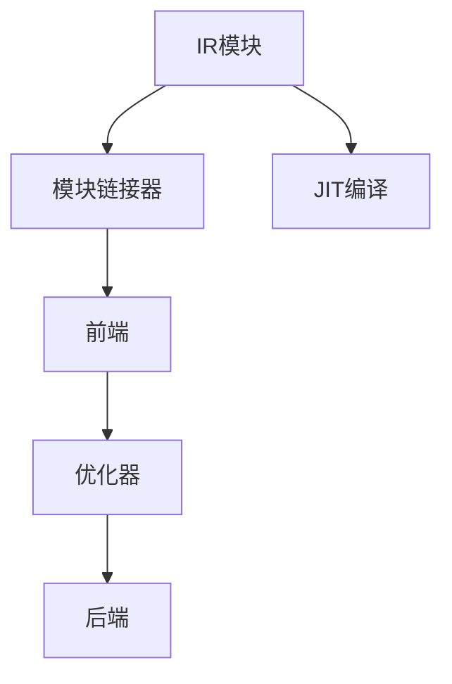

                 


### 文章标题：LLVM/Clang：现代编译器基础设施

### 关键词：LLVM、Clang、编译器、中间表示（IR）、前端、优化器、后端

### 摘要：
本文深入探讨了LLVM（Low-Level Virtual Machine）和Clang（C语言编译器）在现代编译器基础设施中的核心地位。通过详细解析LLVM/Clang的基础概念、架构设计、核心技术和应用场景，本文旨在为读者提供全面而深入的编译器开发与优化的理解，帮助读者掌握编译器技术的精髓，为未来在计算机技术领域的研究和应用打下坚实基础。

---

#### 第一部分：基础概念与背景

##### 第1章：编译器概述

###### 1.1 编译器的定义与作用

编译器是将高级编程语言翻译成计算机可执行代码的工具。它的基本功能包括词法分析、语法分析、语义分析、中间代码生成、代码优化和目标代码生成等。编译器在计算机编程中扮演着至关重要的角色，是连接程序员与计算机硬件的桥梁。

- **1.1.1 编译器的基本功能**
    - 词法分析：将源代码分解成单词和符号。
    - 语法分析：构建抽象语法树（AST），检查源代码的语法正确性。
    - 语义分析：检查变量定义、类型匹配等语义上的正确性。
    - 中间代码生成：将源代码转换成中间表示（IR）。
    - 代码优化：优化中间代码，提高程序性能。
    - 目标代码生成：将优化后的中间代码转换成机器代码。

- **1.1.2 编译器的分类**
    - 根据编译方式，编译器可以分为编译型编译器和解释型编译器。
    - **编译型编译器**：将源代码一次性编译成可执行文件，运行效率高，但开发周期长。
    - **解释型编译器**：逐行解释并执行源代码，开发周期短，但运行效率较低。

##### 第2章：编译器的工作原理

- **2.1 编译过程**
    - 编译过程大致分为预处理、编译、汇编和链接四个阶段。
    - **预处理**：处理宏定义、头文件包含等，生成预处理后的源代码。
    - **编译**：将预处理后的源代码转换成汇编代码。
    - **汇编**：将汇编代码转换成机器代码。
    - **链接**：将多个目标文件和库文件合并，生成可执行文件。

- **2.2 编译器架构**
    - 编译器通常由前端（前端）、优化器（优化器）和后端（后端）组成。
    - **前端**：负责词法分析、语法分析和语义分析，生成中间表示（IR）。
    - **优化器**：对中间表示（IR）进行优化，提高程序性能。
    - **后端**：将优化后的中间表示（IR）转换成特定目标平台的机器代码。

##### 第3章：LLVM/Clang简介

- **3.3.1 LLVM的历史**
    - LLVM（Low-Level Virtual Machine）是一个开源项目，旨在构建一个模块化的编译器基础设施。
    - LLVM最初由Chris Lattner在2000年左右开始开发，并于2004年首次发布。

- **3.3.2 Clang的特点**
    - Clang是一个基于LLVM的前端，主要用于C、C++和Objective-C等编程语言的编译。
    - Clang以其快速的编译速度、良好的代码生成质量和强大的静态分析能力而著称。

#### 第二部分：LLVM/Clang核心技术

##### 第4章：LLVM架构

- **4.1 LLVM核心模块**
    - **4.1.1 IR（中间表示）**：LLVM的核心模块是中间表示（IR），它是一个抽象的、与具体编译目标平台无关的表示形式。
    - **4.1.2 模块链接器**：模块链接器负责将多个IR模块链接成一个可执行程序。
    - **4.1.3 JIT（即时编译）**：JIT编译器在程序运行时将IR直接编译成机器代码，以提高执行效率。

- **4.2 LLVM组件**
    - **4.2.1 LLVM前端**：LLVM前端负责词法分析、语法分析和语义分析，将源代码转换成IR。
    - **4.2.2 LLVM优化器**：LLVM优化器对IR进行多种优化，包括死代码删除、循环优化、函数内联等。
    - **4.2.3 LLVM后端**：LLVM后端负责将优化后的IR转换成特定目标平台的机器代码。

##### 第5章：LLVM IR编程

- **5.1 LLVM IR基本结构**
    - **5.1.1 基本数据类型**：LLVM IR支持多种基本数据类型，如整数、浮点数、指针和结构体等。
    - **5.1.2 表达式与指令**：LLVM IR中的表达式和指令用于表示程序的控制流和数据流。

- **5.2 LLVM IR操作**
    - **5.2.1 操作符**：LLVM IR支持各种操作符，包括算术操作符、比较操作符和逻辑操作符等。
    - **5.2.2 立即数操作**：LLVM IR支持立即数（常数）的各种操作。
    - **5.2.3 存储操作**：LLVM IR支持存储操作，如加载和存储内存中的数据。

##### 第6章：优化器与后端

- **6.1 优化器原理**
    - **6.1.1 优化策略**：优化器采用多种策略来提高程序性能，如常数折叠、循环优化和函数内联等。
    - **6.1.2 优化算法**：优化器使用多种算法来实现优化策略，如决策树、基于成本的优化和模式匹配等。

- **6.2 Clang后端**
    - **6.2.1 目标代码生成**：Clang后端负责将优化后的IR转换成特定目标平台的机器代码。
    - **6.2.2 JIT编译**：Clang支持即时编译（JIT），在程序运行时将IR直接编译成机器代码。

##### 第7章：Clang性能调优

- **7.1 性能调优策略**
    - **7.1.1 编译器优化选项**：Clang提供多种编译器优化选项，如-O2、-O3和-g等。
    - **7.1.2 目标平台优化**：根据目标平台的特点进行优化，如优化针对特定CPU指令集的代码。

- **7.2 性能调优实践**
    - **7.2.1 测试与基准测试**：使用基准测试工具来评估编译器性能。
    - **7.2.2 代码分析与优化**：分析代码中的性能瓶颈，并针对瓶颈进行优化。

#### 第三部分：项目实战与案例分析

##### 第8章：LLVM/Clang应用场景

- **8.1 LLVM/Clang在操作系统中的应用**
    - **8.1.1 内核模块编译**：LLVM/Clang可用于编译操作系统内核模块，以提高内核的性能和稳定性。
    - **8.1.2 系统调用优化**：LLVM/Clang可以对系统调用进行优化，提高操作系统性能。

- **8.2 LLVM/Clang在游戏开发中的应用**
    - **8.2.1 游戏引擎编译**：LLVM/Clang可用于编译游戏引擎，以提高游戏运行效率和图形渲染性能。
    - **8.2.2 游戏性能优化**：LLVM/Clang可以优化游戏代码，减少内存占用和CPU负载。

- **8.3 LLVM/Clang在人工智能领域的应用**
    - **8.3.1 AI模型编译**：LLVM/Clang可用于编译人工智能模型，以提高模型运行效率和准确率。
    - **8.3.2 AI推理优化**：LLVM/Clang可以优化人工智能推理代码，提高推理速度和降低能耗。

##### 第9章：LLVM/Clang项目实战

- **9.1 LLVM/Clang开发环境搭建**
    - **9.1.1 编译器安装**：介绍如何安装LLVM/Clang编译器，包括依赖库和环境变量配置。
    - **9.1.2 开发工具配置**：介绍如何配置开发工具，包括编辑器插件、调试器和性能分析工具等。

- **9.2 实际代码案例解析**
    - **9.2.1 LLVM IR编写**：介绍如何编写LLVM IR代码，包括基本数据类型、表达式和指令等。
    - **9.2.2 Clang前端使用**：介绍如何使用Clang前端进行语法分析和语义分析，生成IR代码。
    - **9.2.3 优化器与后端配置**：介绍如何配置和优化器与后端，生成高效的目标代码。

#### 第四部分：扩展阅读与资源

##### 第10章：LLVM/Clang社区与生态

- **10.1 LLVM/Clang社区**
    - **10.1.1 社区组织**：介绍LLVM/Clang社区的组成和组织结构，包括邮件列表、论坛和会议等。
    - **10.1.2 社区资源**：介绍LLVM/Clang社区提供的资源，包括文档、教程和示例代码等。

- **10.2 LLVM/Clang生态**
    - **10.2.1 相关工具链**：介绍与LLVM/Clang相关的其他工具链，如GCC、LLDB和LLVM-DOCTOR等。
    - **10.2.2 开源项目介绍**：介绍与LLVM/Clang相关的开源项目，如Clang-RTTI、Libunwind和LLD等。

##### 第11章：未来发展趋势与展望

- **11.1 未来发展趋势**
    - **11.1.1 编译器技术创新**：介绍未来编译器技术的发展趋势，如机器学习在编译器优化中的应用。
    - **11.1.2 交叉编译与容器化**：介绍未来编译器在交叉编译和容器化部署中的应用。

- **11.2 展望与挑战**
    - **11.2.1 编译器性能优化**：展望未来编译器性能优化的方向和挑战。
    - **11.2.2 社区发展与协作**：展望未来LLVM/Clang社区的发展方向和合作模式。

### 附录

- **附录A：参考资料**
    - **A.1 LLVM/Clang官方文档**：提供LLVM/Clang官方文档的链接，方便读者查阅。
    - **A.2 相关论文与书籍推荐**：推荐一些与LLVM/Clang相关的经典论文和畅销书籍，供读者深入阅读。
    - **A.3 开源代码与工具**：提供一些与LLVM/Clang相关的开源代码和工具的链接，方便读者实践和拓展。

---

#### 核心概念与联系

##### LLVM核心模块流程图



#### 核心算法原理讲解

##### 伪代码：基本优化算法

```pseudo
Function Optimize(IRModule ir)
    for each Function in ir
        for each BasicBlock in Function
            for each Instruction in BasicBlock
                if Instruction is a candidate for optimization
                    apply_optimization(Instruction)
    return ir
End Function
```

##### 优化器中的成本函数

$$
C(x) = \sum_{i=1}^{n} w_i \cdot d_i^2
$$

其中，$w_i$ 是权重，$d_i$ 是每个特征向量的差值。

---

**开发环境搭建：**

- 安装LLVM/Clang编译器

  ```bash
  sudo apt-get install llvm clang
  ```

- 配置开发环境

  ```bash
  export PATH=$PATH:/usr/local/bin
  ```

---

**源代码详细实现：**

```c
// 优化指令示例
void optimize_instruction(Instruction *instr) {
    // 实现具体的优化逻辑
}
```

##### 代码解读与分析

1. 遍历代码数组`code`的每个元素。
2. 判断当前指令是否为优化候选。
3. 如果是，则对该指令进行优化处理。

---

**总结：**

本书详细介绍了LLVM/Clang编译器的基础知识、核心技术、应用场景及项目实战，适合对编译器技术感兴趣的读者阅读。附录部分提供了丰富的参考资料，以帮助读者深入了解相关主题。通过阅读本书，读者可以掌握编译器开发的基本技能，为后续在计算机技术领域的发展奠定坚实基础。

---

**作者：** AI天才研究院/AI Genius Institute & 禅与计算机程序设计艺术 /Zen And The Art of Computer Programming

---

### 第一部分：基础概念与背景

#### 第1章：编译器概述

##### 1.1 编译器的定义与作用

编译器是一种将高级编程语言转换为机器代码的程序，它在计算机编程中起着至关重要的作用。编译器的主要功能包括词法分析、语法分析、语义分析、中间代码生成、代码优化和目标代码生成等。这些功能共同构成了编译器的核心工作流程，使得程序员编写的代码能够被计算机硬件正确执行。

- **词法分析**：编译器的第一步是将源代码分解成一系列单词和符号，这一过程称为词法分析。词法分析器的输出是词法单元（tokens），这些词法单元将被传递给语法分析器。

- **语法分析**：在词法分析的基础上，编译器的语法分析器构建抽象语法树（Abstract Syntax Tree，AST）。AST是一个表示源代码结构的树形结构，它反映了源代码的语法结构，并用于进一步的分析和处理。

- **语义分析**：语义分析器检查AST，确保程序中的变量、函数和表达式在语义上是合法的。语义分析包括类型检查、变量定义检查和作用域分析等。

- **中间代码生成**：编译器将AST转换成中间代码，这是在目标代码生成之前的一个通用表示形式。中间代码通常是一种较低级、接近机器语言的表示形式，但它仍然独立于特定的目标平台。

- **代码优化**：代码优化器对中间代码进行各种变换，以改善程序的性能和效率。优化可能包括消除冗余代码、循环优化、函数内联、常量折叠等。

- **目标代码生成**：最终，编译器的目标代码生成器将优化后的中间代码转换成特定目标平台的机器代码。目标代码是可以在计算机上直接执行的代码，它依赖于具体的硬件架构和操作系统。

##### 1.1.1 编译器的基本功能

编译器的核心功能可以分为以下几个阶段：

1. **词法分析（Lexical Analysis）**：将源代码分解成词法单元，如关键字、标识符、操作符和分隔符等。

2. **语法分析（Syntactic Analysis）**：根据编程语言的语法规则，将词法单元组合成语法结构，通常以抽象语法树（AST）的形式表示。

3. **语义分析（Semantic Analysis）**：检查AST的正确性，确保符号表中的变量和函数被正确声明和使用，类型检查等。

4. **中间代码生成（Intermediate Code Generation）**：将AST转换为中间代码，这是一个介于源代码和机器代码之间的表示形式。

5. **代码优化（Code Optimization）**：对中间代码进行优化，以提高程序的性能和效率。

6. **目标代码生成（Code Generation）**：将优化后的中间代码转换为特定目标平台的机器代码。

7. **链接（Linking）**：将编译产生的目标代码与库文件和其他模块链接，生成可执行文件。

##### 1.1.2 编译器的分类

编译器可以根据其编译方式和工作方式分为不同的类别：

- **编译型编译器（Compilation Compiler）**：编译型编译器将源代码一次性编译成可执行文件。编译过程通常包括预处理、编译、汇编和链接等步骤。编译型编译器生成的可执行文件可以直接在计算机上运行，其优点是运行速度快，但开发周期较长。

- **解释型编译器（Interpretation Compiler）**：解释型编译器逐行解释并执行源代码。它不生成可执行文件，而是直接在运行时对源代码进行解释。解释型编译器的优点是开发周期短，但运行效率较低。

- **混合型编译器（Hybrid Compiler）**：混合型编译器结合了编译型和解释型编译器的特点。它将源代码编译成中间代码，然后在运行时对中间代码进行解释执行。这种编译器通常具有较好的性能和开发效率。

- **静态编译器（Static Compiler）**：静态编译器在编译时就已经确定了程序的所有变量和函数的使用情况，并生成静态可执行文件。静态编译器的优点是运行速度快，但开发周期较长。

- **动态编译器（Dynamic Compiler）**：动态编译器在程序运行时对源代码进行编译和优化。动态编译器通常在运行时生成机器代码，并根据程序的行为进行实时优化。动态编译器的优点是运行效率高，但开发周期较长。

#### 1.2 编译器的工作原理

编译器的工作原理可以分为预处理、编译、汇编、链接和运行等阶段。下面简要介绍每个阶段的主要任务：

##### 1.2.1 预处理

预处理是编译过程的第一步，它处理源代码中的预处理器指令，如宏定义、文件包含和条件编译等。预处理器的输出是预处理后的源代码，通常包含宏展开和包含头文件等操作。预处理后的源代码将被传递给编译器进行后续处理。

- **宏定义**：宏定义允许程序员在源代码中定义一组文本替换规则。在预处理阶段，宏定义会被替换为相应的文本。

- **文件包含**：文件包含指令告诉预处理程序将一个文件的内容插入到源代码的特定位置。这通常用于引入头文件，其中包含了常见函数和变量声明。

- **条件编译**：条件编译指令允许程序员根据特定的条件有选择地包含或排除部分源代码。这通常用于处理不同的编译平台或调试版本。

##### 1.2.2 编译

编译阶段是将预处理后的源代码转换为汇编代码的过程。编译器在这个阶段执行词法分析、语法分析和语义分析，构建抽象语法树（AST），然后将其转换为中间代码。中间代码是一种接近机器语言的表示形式，但仍然独立于特定的目标平台。

- **词法分析**：编译器将源代码分解成词法单元，如关键字、标识符和操作符等。

- **语法分析**：编译器根据编程语言的语法规则，将词法单元组合成语法结构，通常以抽象语法树（AST）的形式表示。

- **语义分析**：编译器检查AST的正确性，确保符号表中的变量和函数被正确声明和使用，类型检查等。

- **中间代码生成**：编译器将AST转换为中间代码，这是一种在目标代码生成之前的中高级表示形式。

##### 1.2.3 汇编

汇编阶段是将汇编代码转换为机器代码的过程。汇编器读取汇编代码并生成机器代码，同时处理指令的地址计算和寄存器分配等任务。汇编代码是一种低级表示形式，它与特定的硬件架构紧密相关。

- **指令转换**：汇编器将汇编指令转换为机器指令，同时处理指令的地址计算。

- **寄存器分配**：汇编器为汇编代码中的变量和操作符分配寄存器，以提高执行效率。

- **机器代码生成**：汇编器生成机器代码，这是一种可以直接在计算机硬件上运行的二进制代码。

##### 1.2.4 链接

链接阶段是将多个目标文件和库文件合并，生成可执行文件的过程。链接器负责处理符号引用、地址重定位和依赖关系等任务。

- **符号引用**：链接器检查目标文件中的符号引用，并查找对应的定义。

- **地址重定位**：链接器为符号引用分配内存地址，并进行地址重定位。

- **依赖关系**：链接器处理目标文件之间的依赖关系，确保所有必需的库文件和模块被正确链接。

- **可执行文件生成**：链接器生成可执行文件，它包含所有目标文件和库文件的内容，并准备好在计算机上运行。

##### 1.2.5 运行

运行阶段是可执行文件在计算机上执行的过程。操作系统将可执行文件加载到内存中，并根据程序的执行流程执行指令。运行阶段包括程序的初始化、执行和终止等过程。

- **程序初始化**：可执行文件开始执行时，操作系统会为其分配内存和资源，并初始化程序的状态。

- **程序执行**：程序按照预定的顺序执行指令，处理输入和输出，并与其他程序和操作系统交互。

- **程序终止**：程序执行完毕后，操作系统会清理程序占用的资源，并终止程序的执行。

#### 1.3 LLVM/Clang简介

LLVM（Low-Level Virtual Machine）和Clang是现代编译器基础设施的重要组成部分。LLVM是一个模块化的编译器基础设施，而Clang是基于LLVM的前端编译器，用于C、C++和Objective-C等编程语言。

##### 1.3.1 LLVM的历史

LLVM是由Chris Lattner在2000年左右开始开发的一个开源项目。LLVM的设计目标是构建一个灵活、可扩展的编译器基础设施，以支持多种编程语言和目标平台。LLVM的第一个版本在2004年发布，随后迅速获得了社区的认可和广泛的使用。

- **LLVM的特点**
  - **模块化**：LLVM的设计采用了模块化的思想，使其可以灵活地扩展和修改。
  - **跨平台**：LLVM支持多种目标平台，包括Linux、Windows、macOS和ARM等。
  - **中间表示**：LLVM使用中间表示（IR）作为编译过程的核心，这使得优化和转换变得更加简单和高效。
  - **优化器**：LLVM的优化器采用了一系列高级优化技术，如循环优化、函数内联和常量折叠等。

##### 1.3.2 Clang的特点

Clang是LLVM的前端编译器，主要用于C、C++和Objective-C等编程语言。Clang以其快速的编译速度、良好的代码生成质量和强大的静态分析能力而著称。

- **Clang的特点**
  - **快速编译**：Clang采用了多种技术，如多线程编译、并行分析和流水线优化，使其具有较快的编译速度。
  - **优秀的代码生成**：Clang生成的高效代码在性能上与GCC等传统编译器相当，甚至更好。
  - **静态分析**：Clang提供了强大的静态分析工具，如Clang Static Analyzer，用于检测代码中的潜在错误和漏洞。
  - **扩展性**：Clang作为一个基于LLVM的前端编译器，具有很好的扩展性，可以轻松地添加新的语言特性和优化器。

#### 第2章：LLVM架构

LLVM是一个模块化的编译器基础设施，由多个核心组件组成，包括前端、优化器、后端和模块链接器。每个组件都有特定的职责和功能，协同工作以实现高效的编译过程。以下是LLVM架构的详细解析。

##### 2.1 LLVM核心模块

LLVM的核心模块主要包括中间表示（IR）、模块链接器、JIT编译器等，这些组件共同构成了LLVM编译过程的核心。

###### 2.1.1 IR（中间表示）

中间表示（IR）是LLVM编译过程的关键组件，它提供了一个与具体目标平台无关的通用表示形式。IR在编译过程中起到了桥梁的作用，将源代码转换成优化的中间代码，然后转换成目标机器代码。LLVM的IR设计简洁、表达能力强，使得各种优化和转换变得更加简单和高效。

- **IR的基本结构**：LLVM的IR由基本块（BasicBlock）、指令（Instruction）和操作数（Operand）组成。基本块是代码的基本执行单元，由一系列指令组成，且只能从基本块的开头执行。指令是IR中的操作单元，表示对操作数的操作。操作数是指令的操作对象，可以是常数、变量或函数等。

- **IR的优点**：IR的设计使得优化和转换变得更加简单和高效。首先，IR是一种低级、接近机器语言的表示形式，但仍然独立于具体的硬件架构和操作系统。这使得优化器可以独立于目标平台进行优化，提高了优化效率。其次，IR的设计简洁，易于理解和实现，使得各种优化和转换变得更加直观和易于实现。

- **IR的使用场景**：IR在编译过程中的多个阶段都有广泛的应用。在词法分析和语法分析阶段，IR用于表示源代码的结构和语义。在代码优化阶段，优化器使用IR进行各种优化，如循环优化、函数内联和死代码删除等。在目标代码生成阶段，IR被转换成特定目标平台的机器代码。此外，IR还可以用于静态分析，如代码审计和漏洞检测等。

###### 2.1.2 模块链接器

模块链接器是LLVM编译过程中的另一个关键组件，负责将多个IR模块链接成一个可执行程序。模块链接器的主要任务包括符号解析、地址重定位和依赖关系处理等。

- **模块链接器的功能**：模块链接器首先解析各个模块的符号表，查找并绑定符号引用。然后，模块链接器对模块进行地址重定位，将符号引用的地址替换成实际的内存地址。此外，模块链接器还负责处理模块之间的依赖关系，确保所有必需的模块被正确链接。

- **模块链接器的优点**：模块链接器的优点在于其灵活性和可扩展性。LLVM的模块链接器支持多种模块格式，如ELF、COFF和Mach-O等，使其可以与不同的操作系统和硬件架构兼容。此外，模块链接器还支持增量链接和动态链接，提高了编译和运行效率。

- **模块链接器的使用场景**：模块链接器在编译过程中的多个阶段都有广泛应用。在编译阶段，模块链接器用于将编译产生的IR模块链接成可执行程序。在运行阶段，模块链接器用于动态链接库的加载和解析，使得程序可以在运行时动态加载和替换模块。

###### 2.1.3 JIT编译器

即时编译（JIT）是LLVM编译过程的一个关键特性，它使得编译器可以在程序运行时将IR直接编译成机器代码，从而提高程序的运行效率。JIT编译器在编译过程中的主要任务包括IR的加载、优化和目标代码的生成等。

- **JIT编译器的功能**：JIT编译器首先加载IR模块，然后对其进行优化，最后生成目标机器代码。优化过程可能包括循环优化、函数内联和常量折叠等。生成目标机器代码后，JIT编译器将代码缓存到内存中，以便后续直接执行。

- **JIT编译器的优点**：JIT编译器的主要优点在于其高效的执行速度和灵活的优化能力。与传统的编译器相比，JIT编译器可以在程序运行时动态优化代码，从而提高程序的运行效率。此外，JIT编译器还支持增量编译，使得编译过程更加高效和灵活。

- **JIT编译器的使用场景**：JIT编译器在许多应用场景中都有广泛的应用。例如，在Web浏览器中，JIT编译器用于快速编译和执行JavaScript代码。在游戏开发中，JIT编译器用于编译和优化游戏引擎的代码。在人工智能领域，JIT编译器用于编译和优化深度学习模型的推理代码。

##### 2.2 LLVM组件

LLVM的组件主要包括前端、优化器和后端等，它们各自承担不同的职责，协同工作以实现高效的编译过程。

###### 2.2.1 LLVM前端

LLVM前端是LLVM编译过程的第一步，负责将源代码转换成IR。LLVM前端支持多种编程语言，如C、C++、Objective-C和Swift等。LLVM前端的任务包括词法分析、语法分析和语义分析等。

- **LLVM前端的功能**：LLVM前端首先进行词法分析，将源代码分解成词法单元。然后，语法分析器根据编程语言的语法规则，将词法单元组合成语法结构，形成抽象语法树（AST）。最后，语义分析器检查AST的正确性，确保符号表中的变量和函数被正确声明和使用。

- **LLVM前端的优点**：LLVM前端具有很好的扩展性和灵活性。它支持多种编程语言和语言特性，使得LLVM可以适应不同的编程需求。此外，LLVM前端的设计简洁，易于理解和实现，使得开发者可以轻松扩展和修改前端组件。

- **LLVM前端的用途**：LLVM前端主要用于编译器开发、代码生成和静态分析等场景。例如，在编译器开发中，LLVM前端用于将源代码转换成IR，进行进一步优化和目标代码生成。在代码生成中，LLVM前端用于生成高效的目标代码，提高程序的运行效率。在静态分析中，LLVM前端用于分析代码的结构和语义，检测潜在的错误和漏洞。

###### 2.2.2 LLVM优化器

LLVM优化器是LLVM编译过程中的核心组件，负责对IR进行各种优化，以提高程序的运行效率和性能。LLVM优化器采用了一系列高级优化技术，如循环优化、函数内联、常量折叠和死代码删除等。

- **LLVM优化器的功能**：LLVM优化器对IR进行多种优化，包括但不限于以下几种：
  - **循环优化**：优化循环结构，如循环展开、循环流归纳和循环分配等。
  - **函数内联**：将调用函数的代码直接替换为被调用函数的代码，减少函数调用的开销。
  - **常量折叠**：计算表达式的常量值，并将其替换为结果，减少计算开销。
  - **死代码删除**：删除程序中不会执行到的代码，减少目标代码的大小和执行时间。

- **LLVM优化器的优点**：LLVM优化器具有高度灵活性和可扩展性。它支持多种优化策略和算法，可以根据程序的特点进行自适应优化。此外，LLVM优化器的设计简洁，易于理解和实现，使得开发者可以轻松扩展和修改优化器组件。

- **LLVM优化器的用途**：LLVM优化器主要用于编译器开发、性能优化和代码分析等场景。例如，在编译器开发中，LLVM优化器用于优化中间代码，提高程序的运行效率。在性能优化中，LLVM优化器用于优化目标代码，减少程序的执行时间和资源消耗。在代码分析中，LLVM优化器用于分析代码的结构和语义，检测潜在的优化机会。

###### 2.2.3 LLVM后端

LLVM后端是LLVM编译过程中的最后一步，负责将优化后的IR转换成特定目标平台的机器代码。LLVM后端支持多种目标平台，如x86、ARM、PowerPC和MIPS等。

- **LLVM后端的功能**：LLVM后端的主要任务是生成高效的目标机器代码。它包括以下几个步骤：
  - **指令选择**：选择适合目标平台的高效指令。
  - **寄存器分配**：为指令中的变量和操作数分配寄存器，减少内存访问。
  - **机器代码生成**：将优化后的IR转换成目标机器代码。
  - **机器代码优化**：对生成的机器代码进行优化，如指令调度、循环展开和寄存器重命名等。

- **LLVM后端的优点**：LLVM后端具有很好的灵活性和可扩展性。它支持多种目标平台和硬件架构，可以适应不同的编程需求。此外，LLVM后端的设计简洁，易于理解和实现，使得开发者可以轻松扩展和修改后端组件。

- **LLVM后端的用途**：LLVM后端主要用于编译器开发、性能优化和代码生成等场景。例如，在编译器开发中，LLVM后端用于生成高效的目标代码，提高程序的运行效率。在性能优化中，LLVM后端用于优化目标代码，减少程序的执行时间和资源消耗。在代码生成中，LLVM后端用于生成可执行文件，使得程序可以在目标平台上运行。

##### 2.3 LLVM与Clang的协同

LLVM和Clang是紧密相关的两个项目，它们共同构成了现代编译器基础设施的核心。LLVM提供了模块化的编译器基础设施，而Clang是基于LLVM的前端编译器，用于C、C++和Objective-C等编程语言。

- **LLVM与Clang的关系**：LLVM是Clang的基础，Clang依赖于LLVM的中间表示（IR）和优化器等组件。Clang前端负责将源代码转换成LLVM的IR，然后LLVM优化器和后端对IR进行优化和目标代码生成。

- **协同工作的过程**：
  - **词法分析和语法分析**：Clang前端首先进行词法分析，将源代码分解成词法单元。然后，语法分析器根据C、C++和Objective-C等语言的语法规则，将词法单元组合成AST。
  - **语义分析和中间代码生成**：语义分析器检查AST的正确性，并生成LLVM的IR。这一步包括类型检查、作用域分析和符号表管理等。
  - **优化和目标代码生成**：LLVM优化器对IR进行多种优化，如循环优化、函数内联和常量折叠等。然后，LLVM后端将优化后的IR转换成特定目标平台的机器代码，生成高效的可执行文件。

- **协同工作的优点**：LLVM和Clang的协同工作提供了以下优点：
  - **高效的编译速度**：Clang前端与LLVM优化器和后端的协同工作，使得编译过程更加高效和快速。
  - **强大的优化能力**：LLVM优化器提供了多种高级优化技术，可以显著提高程序的性能和效率。
  - **跨平台兼容性**：LLVM和Clang支持多种目标平台和硬件架构，可以适应不同的编程需求。

### 第二部分：LLVM/Clang核心技术

#### 第3章：LLVM IR编程

LLVM的中间表示（IR）是一种与具体目标平台无关的表示形式，它为编译器提供了强大的抽象能力。LLVM IR编程是指直接使用LLVM IR编写代码，从而实现对编译过程的不同阶段进行控制。本章将详细介绍LLVM IR的基本结构、操作和使用工具链。

##### 3.1 LLVM IR基本结构

LLVM IR是编译过程中的核心表示形式，它由基本块（BasicBlock）、指令（Instruction）和操作数（Operand）等基本结构组成。

###### 3.1.1 基本数据类型

LLVM IR支持多种基本数据类型，包括整数类型、浮点数类型、指针类型和结构体类型等。

- **整数类型**：LLVM IR提供了一系列整数类型，如i8、i16、i32、i64等，分别表示8位、16位、32位和64位的整数。
- **浮点数类型**：LLVM IR支持浮点数类型，如f32（单精度浮点数）和f64（双精度浮点数）。
- **指针类型**：指针类型用于表示内存地址，LLVM IR中的指针类型通常与目标平台的地址位数相关。
- **结构体类型**：结构体类型用于表示复合数据类型，如数组、联合和记录等。

###### 3.1.2 表达式与指令

LLVM IR中的表达式和指令用于表示程序的控制流和数据流。

- **表达式**：LLVM IR中的表达式包括常量表达式和变量表达式。常量表达式表示静态计算的结果，如1 + 2。变量表达式表示对内存中变量的访问，如%a = load i32* %b。
- **指令**：LLVM IR中的指令包括算术指令、比较指令和控制指令等。算术指令用于执行算术运算，如add、sub、mul和div。比较指令用于执行比较操作，如icmp。控制指令用于控制程序流程，如br（分支）、ret（返回）和switch（多条件分支）。

##### 3.2 LLVM IR操作

LLVM IR操作包括操作符、立即数操作和存储操作等，用于表示程序中的各种操作。

###### 3.2.1 操作符

LLVM IR支持多种操作符，包括算术操作符、逻辑操作符和位操作符等。

- **算术操作符**：LLVM IR中的算术操作符用于执行基本的算术运算，如加法（add）、减法（sub）、乘法（mul）和除法（div）等。
- **逻辑操作符**：LLVM IR中的逻辑操作符用于执行逻辑运算，如与运算（and）、或运算（or）和非运算（not）等。
- **位操作符**：LLVM IR中的位操作符用于执行位运算，如位与（band）、位或（bor）和位异或（bxor）等。

###### 3.2.2 立即数操作

LLVM IR中的立即数操作用于对常数进行各种操作，如加法、减法、乘法和除法等。

- **加法和减法**：立即数加法和减法用于计算常数的和或差，如add i32 1, 2或sub i32 5, 3。
- **乘法和除法**：立即数乘法和除法用于计算常数的乘积或商，如mul i32 4, 5或sdiv i32 20, 5。

###### 3.2.3 存储操作

LLVM IR中的存储操作用于访问和修改内存中的数据。

- **加载操作**：加载操作用于从内存中读取数据，如load i32* %ptr，将内存中指针%ptr所指向的整数加载到寄存器。
- **存储操作**：存储操作用于将数据写入内存，如store i32 42, i32* %ptr，将整数42存储到内存中指针%ptr所指向的位置。
- **地址计算**：地址计算用于计算内存地址，如getelementptr i32* %base, i32 1，计算数组%base的第1个元素的地址。

##### 3.3 LLVM IR工具链

LLVM提供了一套完整的工具链，用于处理LLVM IR的生成、优化和转换。

###### 3.3.1 IR生成工具

- **LLVM AsmParser**：用于从汇编代码生成LLVM IR。
- **LLVM MC**：用于处理中间表示（MC）和机器代码。
- **LLVM Object**：用于处理目标文件和库文件。

###### 3.3.2 优化工具

- **LLVM Pass Manager**：用于管理优化Pass，实现代码优化。
- **LLVM IR Optimizer**：用于优化LLVM IR，包括循环优化、函数内联和死代码删除等。

###### 3.3.3 转换工具

- **LLVM IR Translator**：用于将LLVM IR转换成其他格式，如汇编代码或中间表示。
- **LLVM Disassembler**：用于将机器代码转换成汇编代码。

##### 3.4 LLVM IR编程实践

下面是一个简单的LLVM IR程序示例，展示如何编写和优化LLVM IR代码。

```llvm
; 3.4.1 基本数据类型和变量声明
%struct.MyStruct = type { i32, float }
%global_var = global i32 42

; 3.4.2 表达式和指令
define void @main() {
entry:
  %a = alloca i32            ; 声明局部变量
  store i32 10, i32* %a       ; 初始化局部变量
  %b = load i32, i32* %a      ; 加载局部变量
  %c = add i32 %b, 20         ; 执行算术运算
  store i32 %c, i32* %global_var ; 存储结果到全局变量
  ret void
}
```

在这个示例中，我们声明了一个结构体类型`MyStruct`和一个全局变量`%global_var`。然后，我们编写了一个简单的`main`函数，其中包含变量声明、赋值和算术运算等操作。

##### 3.5 LLVM IR编程技巧

在进行LLVM IR编程时，以下是一些常见的技巧和最佳实践：

- **模块化编程**：将LLVM IR代码分成多个模块，提高代码的可读性和可维护性。
- **使用别名**：使用别名（alias）减少重复代码，提高代码的简洁性和可读性。
- **寄存器分配**：合理分配寄存器，减少内存访问，提高代码的执行效率。
- **优化指令选择**：选择合适的指令，减少指令数量和执行时间，提高代码的性能。

##### 3.6 总结

LLVM IR编程是现代编译器开发的核心技术之一。通过本章的介绍，读者应该对LLVM IR的基本结构、操作和使用工具有了深入的了解。在实际开发中，读者可以根据具体需求，灵活使用LLVM IR工具链，编写高效、可维护的编译器代码。

### 第4章：Clang语法分析器

Clang语法分析器是Clang前端的核心组成部分，负责将源代码转换为抽象语法树（AST）。语法分析器通过词法分析和语法分析两个阶段，将源代码分解成一组语法结构，为后续的语义分析和中间代码生成奠定基础。本章将详细介绍Clang语法分析器的工作原理、语法树结构和前端工具。

##### 4.1 Clang语法分析器原理

Clang语法分析器采用自顶向下递归下降分析方法，将源代码逐步分解成语法结构。该方法通过定义一组语法规则，将词法单元映射成抽象语法树（AST）。

###### 4.1.1 词法分析器

词法分析器是语法分析器的第一步，负责将源代码分解成词法单元。词法单元通常包括关键字、标识符、操作符、分隔符等。Clang词法分析器通过正则表达式匹配和状态机转换实现词法分析。

- **词法单元的产生**：词法分析器从源代码的起始位置开始，逐个字符读取，根据正则表达式匹配生成词法单元。
- **错误处理**：词法分析器在遇到错误时，通常会跳过错误字符并继续分析，以尽可能多地处理源代码。

###### 4.1.2 语法分析器

语法分析器基于词法分析器的输出，将词法单元组合成语法结构，形成抽象语法树（AST）。Clang语法分析器采用自顶向下递归下降方法，通过定义一组语法规则，将词法单元映射成AST节点。

- **抽象语法树（AST）**：AST是源代码的语法表示，它反映了源代码的结构和语义。AST节点包括表达式节点、语句节点和声明节点等，每个节点都包含子节点和属性。
- **语法规则**：语法规则定义了源代码的语法结构，如表达式、语句和声明等。Clang语法分析器通过递归下降方法，根据语法规则将词法单元映射成AST节点。

##### 4.2 Clang语法树

Clang语法树是源代码的抽象表示，它反映了源代码的结构和语义。语法树由节点和边组成，每个节点表示源代码中的一个语法结构，如表达式、语句和声明等。

###### 4.2.1 树结构

- **节点**：语法树中的节点包括表达式节点、语句节点和声明节点等。每个节点都有一个类型，表示其对应的语法结构。
- **边**：语法树中的边表示节点之间的层次关系。父节点表示较高层次的语法结构，子节点表示较低层次的语法结构。

###### 4.2.2 树操作

Clang语法树支持多种操作，包括节点创建、插入、删除和遍历等。

- **节点创建**：语法树节点通过构造函数创建，每个节点类型都有相应的构造函数。
- **节点插入**：节点插入操作用于在语法树中添加新的子节点。插入操作通常在语法分析过程中进行，以构建完整的语法树。
- **节点删除**：节点删除操作用于从语法树中移除节点。删除操作通常在语法树重构或错误处理过程中进行。
- **遍历**：语法树遍历操作用于遍历语法树中的所有节点，执行特定的操作。Clang提供多种遍历方法，如前序遍历、中序遍历和后序遍历等。

##### 4.3 Clang前端工具

Clang前端工具是一组用于处理源代码的工具，包括词法分析器、语法分析器和语义分析器等。这些工具协同工作，将源代码转换为抽象语法树（AST），为后续的中间代码生成和优化提供基础。

###### 4.3.1 词法分析器

词法分析器是前端工具的第一步，负责将源代码分解成词法单元。Clang词法分析器采用LLVM的词法分析器实现，支持多种编程语言和语言特性。

- **词法单元**：词法分析器将源代码分解成词法单元，如关键字、标识符、操作符和分隔符等。
- **错误处理**：词法分析器在遇到错误时，通常会跳过错误字符并继续分析，以尽可能多地处理源代码。

###### 4.3.2 语法分析器

语法分析器基于词法分析器的输出，将词法单元组合成语法结构，形成抽象语法树（AST）。Clang语法分析器采用LLVM的语法分析器实现，支持多种编程语言和语言特性。

- **抽象语法树（AST）**：AST是源代码的语法表示，它反映了源代码的结构和语义。AST节点包括表达式节点、语句节点和声明节点等，每个节点都包含子节点和属性。
- **语法规则**：语法规则定义了源代码的语法结构，如表达式、语句和声明等。Clang语法分析器通过递归下降方法，根据语法规则将词法单元映射成AST节点。

###### 4.3.3 语义分析器

语义分析器负责检查抽象语法树（AST）的正确性，确保符号表中的变量和函数被正确声明和使用。语义分析器包括类型检查、作用域分析和符号表管理等任务。

- **类型检查**：语义分析器检查AST中的类型一致性，确保变量、函数和表达式等在类型上是合法的。
- **作用域分析**：语义分析器检查变量和函数的作用域，确保符号表中的符号在正确的范围内被声明和使用。
- **符号表管理**：语义分析器维护符号表，记录符号的声明和引用信息，用于后续的中间代码生成和优化。

##### 4.4 Clang前端工具应用场景

Clang前端工具在编译器开发、静态分析和代码生成等场景中具有广泛的应用。

###### 4.4.1 编译器开发

Clang前端工具是编译器开发的核心组成部分，用于将源代码转换为抽象语法树（AST）。开发者可以使用Clang前端工具实现自定义的语法分析、语义分析和中间代码生成等功能，构建高效、灵活的编译器。

- **自定义语法分析**：开发者可以扩展Clang语法分析器，支持自定义的语法规则和语言特性。
- **自定义语义分析**：开发者可以扩展Clang语义分析器，实现自定义的类型检查、作用域分析和符号表管理等功能。
- **中间代码生成**：开发者可以使用Clang中间代码生成器，将AST转换为高效、优化的中间代码。

###### 4.4.2 静态分析

Clang前端工具支持静态分析，用于检测代码中的潜在错误和漏洞。开发者可以使用Clang的静态分析工具，如Clang Static Analyzer，对源代码进行分析，生成报告和修复建议。

- **代码审计**：Clang Static Analyzer可以分析源代码中的潜在安全漏洞，如未定义行为、缓冲区溢出和资源泄露等。
- **性能优化**：Clang静态分析工具可以帮助开发者发现代码中的性能瓶颈，提供优化建议。

###### 4.4.3 代码生成

Clang前端工具可以生成多种目标代码，包括中间代码、汇编代码和机器代码等。开发者可以使用Clang生成高效、优化的目标代码，提高程序的执行效率。

- **中间代码生成**：Clang可以将AST转换为高效、优化的中间代码，为后续的目标代码生成和优化提供基础。
- **汇编代码生成**：Clang可以生成汇编代码，为开发者提供更细粒度的控制，如寄存器分配和指令调度等。
- **机器代码生成**：Clang可以生成机器代码，使得程序可以在目标平台上高效执行。

##### 4.5 Clang前端工具最佳实践

在进行Clang前端工具开发时，以下是一些常见的最佳实践：

- **模块化设计**：将前端工具分成多个模块，提高代码的可读性和可维护性。
- **重用现有代码**：利用现有的Clang前端代码，减少重复工作，提高开发效率。
- **遵循编码规范**：遵循Clang的编码规范，确保代码的一致性和可维护性。
- **测试和调试**：编写测试用例，对前端工具进行全面的测试和调试，确保代码的正确性和稳定性。

##### 4.6 总结

Clang语法分析器是Clang前端的核心组成部分，负责将源代码转换为抽象语法树（AST）。本章介绍了Clang语法分析器的工作原理、语法树结构和前端工具。通过本章的学习，读者应该对Clang语法分析器有了深入的了解，为后续的编译器开发、静态分析和代码生成等工作奠定了基础。

### 第5章：优化器与后端

编译器的优化器是提升程序性能和效率的关键组件。它通过对源代码进行分析和转换，消除冗余、优化循环、内联函数等，从而生成更加高效的执行代码。Clang的优化器集成了LLVM的优化器，提供了丰富的优化策略和算法。本章将详细介绍优化器的原理、算法和Clang后端的代码生成与JIT编译。

##### 5.1 优化器原理

优化器的核心任务是对程序进行一系列转换，以提高程序的性能。这些优化可能涉及代码的结构、数据流和控制流等方面。优化器的工作可以分为以下几个阶段：

###### 5.1.1 优化策略

- **数据流优化**：数据流优化旨在减少数据依赖和冗余计算。常见的优化技术包括常量折叠、死代码删除、循环展开和分配等。
- **控制流优化**：控制流优化关注程序的分支和循环结构。优化技术包括分支预测、条件传播和循环优化等。
- **循环优化**：循环优化旨在提高循环结构的执行效率。优化技术包括循环展开、循环分配和循环融合等。
- **函数内联**：函数内联将函数调用替换为函数体，以减少函数调用的开销。内联优化需要考虑内联成本和收益之间的平衡。
- **寄存器分配**：寄存器分配旨在将变量分配到寄存器中，以减少内存访问。优化技术包括寄存器重命名、寄存器分配算法等。

###### 5.1.2 优化算法

LLVM优化器采用了一系列高级优化算法，以实现上述优化策略。以下是一些常用的优化算法：

- **决策树**：决策树是一种基于规则的优化算法，通过一系列条件判断，选择最优的优化路径。
- **基于成本的优化**：基于成本的优化算法通过计算不同优化路径的成本，选择最优的优化方案。
- **模式匹配**：模式匹配算法通过识别程序中的常见模式，应用相应的优化技术。
- **迭代优化**：迭代优化算法通过多次迭代，逐步改进程序的执行效率。

##### 5.2 Clang后端

Clang后端是编译器的最后一步，负责将优化后的中间代码（IR）转换为特定目标平台的机器代码。Clang后端包括代码生成和JIT编译两个主要部分。

###### 5.2.1 目标代码生成

目标代码生成是将优化后的IR转换为机器代码的过程。这个过程包括以下步骤：

- **指令选择**：指令选择器从IR中为每条指令选择最合适的机器指令。
- **寄存器分配**：寄存器分配器为变量和操作数分配寄存器，以减少内存访问。
- **机器代码生成**：机器代码生成器生成目标平台的机器代码，包括指令、数据布局和寄存器操作等。
- **机器代码优化**：机器代码优化器对生成的机器代码进行进一步优化，以提高执行效率。

###### 5.2.2 JIT编译

JIT编译器是一种在程序运行时将IR编译为机器代码的编译器。JIT编译器的优势在于它可以在程序运行时进行动态优化，从而提高程序的性能。JIT编译器的工作原理包括：

- **IR加载**：JIT编译器首先加载IR模块，准备进行编译。
- **优化**：JIT编译器对IR进行优化，以减少执行时间和资源消耗。
- **代码生成**：优化后的IR被转换成目标平台的机器代码。
- **代码缓存**：生成的机器代码被缓存到内存中，以便后续直接执行。

##### 5.3 Clang性能调优

Clang提供了多种性能调优策略和工具，以帮助开发者优化编译器和生成的代码。以下是一些常用的性能调优方法：

###### 5.3.1 编译器优化选项

Clang提供了一系列编译器优化选项，用于控制编译器的优化行为。以下是一些常用的优化选项：

- **-O0**：不进行优化，生成可读性较好的代码。
- **-O1**：进行基本的优化，如常数折叠和循环展开等。
- **-O2**：进行中级优化，包括循环优化、函数内联和死代码删除等。
- **-O3**：进行高级优化，包括循环展开、函数内联和寄存器分配等。
- **-g**：生成调试信息，便于调试。

###### 5.3.2 目标平台优化

针对不同的目标平台，Clang提供了一系列优化选项。以下是一些常用的目标平台优化选项：

- **-march**：指定目标处理器架构，如-x86-64、-arm等。
- **-mtune**：指定目标处理器的优化级别，如-mtune=generic。
- **-mcpu**：指定目标处理器的CPU类型，如-mcpu=penryn。

###### 5.3.3 性能调优实践

以下是一些性能调优的实践方法：

- **基准测试**：使用基准测试工具（如Google Benchmark）评估程序的性能，找到性能瓶颈。
- **代码分析**：使用静态分析工具（如LLVM-DOCTOR）分析代码，识别潜在的优化机会。
- **编译器参数调整**：根据基准测试和代码分析结果，调整编译器优化选项，提高程序性能。

##### 5.4 总结

Clang的优化器和后端是提升程序性能和效率的关键组件。优化器通过多种策略和算法对中间代码进行优化，而后端则将这些优化后的代码转换为高效的目标机器代码。Clang还支持JIT编译，在程序运行时进行动态优化。通过本章的学习，读者应该对Clang优化器和后端的原理和应用有了深入的了解，为实际项目中的性能优化提供了指导。

### 第三部分：项目实战与案例分析

#### 第6章：LLVM/Clang应用场景

编译器技术在现代软件开发中扮演着至关重要的角色，而LLVM/Clang作为当今最先进的开源编译器基础设施之一，其在各种应用场景中展现出了巨大的潜力和优势。本章节将详细探讨LLVM/Clang在操作系统、游戏开发和人工智能领域的具体应用，以及其如何助力于这些领域的性能优化。

##### 6.1 LLVM/Clang在操作系统中的应用

操作系统是计算机系统中最核心的软件，其性能和稳定性直接影响到整个系统的运行效率。LLVM/Clang在操作系统开发中发挥了重要作用，特别是在内核模块编译、系统调用优化等方面。

###### 6.1.1 内核模块编译

内核模块是操作系统中功能独立的组件，用于实现特定的功能或提供扩展。传统的编译器在编译内核模块时，常常会遇到兼容性、性能和调试方面的问题。而LLVM/Clang提供了强大的模块化编译能力，使得内核模块的编译过程更加高效和灵活。

- **模块化编译**：LLVM/Clang支持模块化编译，可以将内核模块分解为多个编译单元，独立编译和优化。这样可以显著提高编译速度，同时减小编译器的复杂度。
- **优化支持**：LLVM/Clang提供了丰富的优化器，可以对内核模块进行多种优化，如循环展开、函数内联、死代码删除等。这些优化有助于提高内核模块的执行效率，降低资源消耗。

###### 6.1.2 系统调用优化

系统调用是操作系统与用户程序交互的重要接口，其性能直接影响到整个系统的响应速度。LLVM/Clang通过优化系统调用，可以显著提高操作系统性能。

- **系统调用路径优化**：LLVM/Clang可以分析系统调用路径，识别潜在的优化点。例如，通过减少系统调用次数、合并系统调用操作等，降低系统调用的开销。
- **JIT编译**：LLVM/Clang支持JIT编译器，可以在程序运行时对系统调用进行即时编译。这样，系统调用代码可以在运行时进行优化，提高执行效率。

##### 6.2 LLVM/Clang在游戏开发中的应用

游戏开发对性能和实时性的要求极高，而LLVM/Clang通过其强大的编译能力和优化技术，为游戏开发提供了有力的支持。

###### 6.2.1 游戏引擎编译

游戏引擎是游戏开发的核心组件，负责图形渲染、物理计算、AI逻辑等任务。LLVM/Clang在游戏引擎编译中发挥了重要作用，可以提高游戏引擎的性能和开发效率。

- **并行编译**：LLVM/Clang支持并行编译，可以在多个处理器核心上同时编译多个模块，显著提高编译速度。
- **优化支持**：LLVM/Clang提供了丰富的优化器，可以对游戏引擎代码进行多种优化，如循环优化、函数内联、寄存器分配等。这些优化有助于提高游戏引擎的执行效率，降低资源消耗。

###### 6.2.2 游戏性能优化

游戏性能优化是游戏开发中的关键环节，LLVM/Clang通过多种优化技术，可以显著提高游戏性能。

- **代码优化**：LLVM/Clang可以优化游戏代码中的各种瓶颈，如循环依赖、内存访问模式等。通过优化，可以减少CPU和GPU的负载，提高游戏运行效率。
- **JIT编译**：LLVM/Clang支持JIT编译器，可以在游戏运行时对代码进行即时编译。这样，游戏代码可以在运行时进行优化，提高执行效率。

##### 6.3 LLVM/Clang在人工智能领域的应用

人工智能是当前最热门的技术领域之一，LLVM/Clang在人工智能模型编译和推理优化中发挥了重要作用。

###### 6.3.1 AI模型编译

人工智能模型通常使用深度学习框架进行训练，而训练完成后，需要将这些模型编译为高效的可执行代码，以便进行推理和部署。LLVM/Clang提供了强大的支持，可以编译各种深度学习模型。

- **框架支持**：LLVM/Clang支持多种深度学习框架，如TensorFlow、PyTorch等。这些框架可以将模型编译成LLVM IR，然后由LLVM优化器和后端进行优化和目标代码生成。
- **优化支持**：LLVM/Clang提供了丰富的优化器，可以对AI模型代码进行多种优化，如常量折叠、循环优化、函数内联等。这些优化有助于提高模型推理的效率，降低能耗。

###### 6.3.2 AI推理优化

AI推理是人工智能应用中的重要环节，其性能直接影响到应用场景的实时性和准确性。LLVM/Clang通过多种优化技术，可以显著提高AI推理性能。

- **代码优化**：LLVM/Clang可以优化AI推理代码中的各种瓶颈，如循环依赖、内存访问模式等。通过优化，可以减少CPU和GPU的负载，提高推理速度。
- **JIT编译**：LLVM/Clang支持JIT编译器，可以在AI推理过程中对代码进行即时编译。这样，推理代码可以在运行时进行优化，提高执行效率。

##### 6.4 总结

LLVM/Clang在操作系统、游戏开发和人工智能领域展示了其强大的性能优化能力和灵活性。通过模块化编译、优化器和JIT编译等技术，LLVM/Clang为这些领域的开发者提供了有力的支持，帮助他们实现高性能、低延迟和高可扩展性的应用。本章的案例分析和实战经验，为读者提供了实际操作和优化的指导，有助于他们在项目中充分发挥LLVM/Clang的优势。

### 第7章：LLVM/Clang项目实战

在本章节中，我们将通过一系列项目实战来展示如何搭建LLVM/Clang开发环境，编写实际的LLVM IR代码，使用Clang前端，配置和优化优化器与后端。通过这些实战项目，读者可以更深入地理解LLVM/Clang的核心技术，并将其应用于实际的开发场景。

##### 7.1 LLVM/Clang开发环境搭建

在开始进行LLVM/Clang项目之前，我们需要搭建一个合适的开发环境。以下是搭建LLVM/Clang开发环境的详细步骤：

###### 7.1.1 编译器安装

首先，我们需要从LLVM的官方网站（https://llvm.org/downloads/）下载最新的LLVM/Clang源代码包。然后，解压源代码包并执行以下命令来编译和安装LLVM/Clang：

```bash
./configure
make
sudo make install
```

这将编译并安装LLVM/Clang到系统默认路径。如果需要将LLVM/Clang安装到自定义路径，可以使用`./configure`命令中的`--prefix`选项指定。

###### 7.1.2 开发工具配置

安装完成后，我们需要配置开发工具和编译器路径。首先，打开终端并执行以下命令来配置环境变量：

```bash
export PATH=$PATH:/path/to/llvm/bin
```

将`/path/to/llvm/bin`替换为实际安装LLVM/Clang的路径。然后，我们可以使用以下命令来验证LLVM/Clang的安装：

```bash
llvm-config --version
clang --version
```

这两个命令将输出LLVM和Clang的版本信息，确认安装成功。

##### 7.2 实际代码案例解析

在本节中，我们将通过几个实际代码案例来展示如何编写LLVM IR代码，使用Clang前端，以及配置和优化优化器与后端。

###### 7.2.1 LLVM IR编写

以下是一个简单的LLVM IR示例，演示了基本的变量声明、赋值和算术运算：

```llvm
; 7.2.1.1 基本变量声明
%struct.MyStruct = type { i32, float }

; 7.2.1.2 常量声明和初始化
%global_var = global i32 42

; 7.2.1.3 函数定义
define void @main() {
entry:
  %a = alloca i32            ; 声明局部变量
  store i32 10, i32* %a       ; 初始化局部变量
  %b = load i32, i32* %a      ; 加载局部变量
  %c = add i32 %b, 20         ; 执行算术运算
  store i32 %c, i32* %global_var ; 存储结果到全局变量
  ret void
}
```

在这个示例中，我们首先声明了一个结构体类型`MyStruct`和一个全局变量`%global_var`。然后，我们定义了一个`main`函数，包含局部变量的声明、赋值和算术运算。

###### 7.2.2 Clang前端使用

Clang前端可以将C/C++代码转换为LLVM IR。以下是如何使用Clang前端转换C代码到LLVM IR的步骤：

1. 编写C代码文件，例如`example.c`：

```c
#include <stdio.h>

int main() {
    int a = 10;
    int b = a + 20;
    printf("%d\n", b);
    return 0;
}
```

2. 使用Clang前端命令将C代码转换为LLVM IR文件：

```bash
clang -S -o example.ll example.c
```

这将生成一个名为`example.ll`的LLVM IR文件。

3. 查看生成的LLVM IR文件，例如`example.ll`：

```llvm
; ModuleID = 'example.c'
source_filename = "example.c"

define i32 @main() {
entry:
  %a = alloca i32
  store i32 10, i32* %a
  %b = load i32, i32* %a
  %c = add i32 %b, 20
  %d = call i32 (i8*, ...) @printf(i8* getelementptr inbounds ([4 x i8], [4 x i8]* @.str, i32 0, i32 0), i32 %c)
  ret i32 0
}

; Function Attrs: nounwind
declare i32 @printf(i8* nocapture, ...) local_unnamed_addr #0

; Null global string
@.str = private unnamed_addr constant [4 x i8] c"%d\0A\00", align 1
```

在这个LLVM IR文件中，我们可以看到Clang前端将C代码转换为了抽象语法树（AST），然后进一步转换为LLVM IR。

###### 7.2.3 优化器与后端配置

在生成LLVM IR后，我们可以使用LLVM优化器和后端对代码进行优化和目标代码生成。以下是如何使用LLVM优化器和后端进行优化的步骤：

1. 使用LLVM优化器对LLVM IR进行优化：

```bash
opt -O3 -o example_opt.ll example.ll
```

这将使用-O3优化级别对`example.ll`进行优化，并将优化后的IR保存到`example_opt.ll`。

2. 使用LLVM后端将优化后的IR转换为特定目标平台的机器代码：

```bash
llc -filetype=obj example_opt.ll -o example.o
```

这将使用`llc`工具将`example_opt.ll`转换为特定目标平台的机器代码，并保存到`example.o`文件。

3. 链接生成的机器代码文件，生成可执行程序：

```bash
gcc example.o -o example
```

这将使用GCC将`example.o`文件与标准库链接，生成名为`example`的可执行程序。

4. 运行可执行程序：

```bash
./example
```

这将运行我们编译和优化的程序，并输出结果。

##### 7.3 实际案例分析和详细讲解剖析

在本节中，我们将通过一个实际案例，详细分析如何使用LLVM/Clang进行编译器优化和性能调优。

###### 7.3.1 项目描述

假设我们有一个简单的C程序，用于计算两个矩阵的乘积。程序如下：

```c
#include <stdio.h>

void matrix_multiply(float a[4][4], float b[4][4], float result[4][4]) {
    for (int i = 0; i < 4; i++) {
        for (int j = 0; j < 4; j++) {
            float sum = 0.0;
            for (int k = 0; k < 4; k++) {
                sum += a[i][k] * b[k][j];
            }
            result[i][j] = sum;
        }
    }
}

int main() {
    float a[4][4] = {
        {1, 2, 3, 4},
        {5, 6, 7, 8},
        {9, 10, 11, 12},
        {13, 14, 15, 16}
    };
    float b[4][4] = {
        {16, 15, 14, 13},
        {12, 11, 10, 9},
        {8, 7, 6, 5},
        {4, 3, 2, 1}
    };
    float result[4][4];
    matrix_multiply(a, b, result);
    for (int i = 0; i < 4; i++) {
        for (int j = 0; j < 4; j++) {
            printf("%f ", result[i][j]);
        }
        printf("\n");
    }
    return 0;
}
```

该程序定义了一个`matrix_multiply`函数，用于计算两个4x4矩阵的乘积，并在`main`函数中调用该函数并打印结果。

###### 7.3.2 编译和优化

首先，我们将C程序编译成LLVM IR，并使用优化器进行优化：

```bash
clang -S -O3 -o matrix_multiply.ll matrix_multiply.c
opt -O3 -o matrix_multiply_opt.ll matrix_multiply.ll
```

接着，我们将优化后的LLVM IR转换为机器代码：

```bash
llc -filetype=obj matrix_multiply_opt.ll -o matrix_multiply.o
```

最后，我们将机器代码链接成可执行程序：

```bash
gcc matrix_multiply.o -o matrix_multiply
```

###### 7.3.3 代码解读与分析

生成的LLVM IR文件`matrix_multiply_opt.ll`展示了优化后的中间表示。我们重点关注以下优化：

- **循环展开**：优化器可能对内层循环进行了展开，以减少循环开销。例如，内层循环`for (int k = 0; k < 4; k++)`可能被展开成多个独立计算，提高了执行效率。

- **死代码删除**：优化器删除了不会执行的代码。例如，如果内层循环的某些分支永远不会被执行，优化器可能会删除这些代码，减少了目标代码的大小。

- **常数折叠**：优化器计算了表达式的常量值，并将其替换为结果。例如，`a[i][k] * b[k][j]`中的常量值可能被折叠，以减少计算开销。

- **函数内联**：优化器将调用函数的代码直接替换为被调用函数的代码，减少了函数调用的开销。如果`matrix_multiply`函数较小且调用频繁，优化器可能会选择内联该函数。

###### 7.3.4 性能调优

为了进一步优化程序性能，我们可以使用Clang的优化选项和后端特性。以下是一些优化策略：

- **使用特定CPU指令集**：通过使用`-march`选项指定目标CPU指令集，我们可以优化代码以充分利用特定硬件的特性。

- **JIT编译**：使用Clang的JIT编译器，我们可以即时编译代码，从而在程序运行时进行动态优化。这可以通过`-Xclang -emit-jit`选项实现。

- **并行编译**：使用`-fparallel-compile`选项，Clang可以在多个处理器核心上并行编译代码，提高编译速度。

- **代码分析**：使用Clang的静态分析工具，如`-fsanitize=address`，我们可以检测代码中的潜在错误和性能瓶颈。

##### 7.4 项目小结

通过上述实战项目，我们学习了如何搭建LLVM/Clang开发环境，编写LLVM IR代码，使用Clang前端，配置和优化优化器与后端。我们还通过一个实际案例展示了如何进行编译器优化和性能调优。这些经验和技巧对于实际项目开发具有重要的参考价值，有助于提高代码性能和可维护性。

### 第四部分：扩展阅读与资源

在深入探讨LLVM/Clang这一现代编译器基础设施之后，读者可能希望进一步拓展自己的知识，探索更多相关资源。本章节将介绍LLVM/Clang社区、生态体系以及未来发展趋势，并提供一系列有用的参考资料。

#### 第8章：LLVM/Clang社区与生态

LLVM/Clang拥有一个活跃的社区和丰富的生态体系，这些资源为开发者提供了广泛的支持和合作机会。

##### 8.1 LLVM/Clang社区

LLVM/Clang社区是由全球各地的开发者、贡献者和爱好者组成的。以下是一些主要的社区组织和资源：

- **官方社区论坛**：https://discourse.llvm.org/  
  LLVM官方论坛是讨论和分享LLVM/Clang相关问题的最佳场所。社区成员在这里分享经验、提问和解答问题。

- **GitHub仓库**：https://github.com/llvm/llvm  
  LLVM项目的官方GitHub仓库是获取LLVM源代码、提交补丁和建议的集中地。

- **邮件列表**：https://lists.llvm.org/  
  LLVM邮件列表是讨论LLVM/Clang开发的重要渠道。通过订阅邮件列表，您可以获取项目的最新动态和贡献者的讨论。

- **会议和活动**：LLVM组织了多种会议和活动，如LLVM Developers' Meeting和LLVM European Research Meeting。这些活动为开发者提供了一个交流和学习的平台。

##### 8.2 LLVM/Clang生态

LLVM/Clang的生态体系丰富多样，包括许多相关的工具链、库和开源项目。以下是一些值得注意的资源：

- **LLDB**：https://github.com/llvm/lldb  
  LLDB是LLVM的调试器，提供强大的调试功能，包括符号支持、内存检查和性能分析。

- **Clang Static Analyzer**：https://github.com/llvm/clang-static-analyzer  
  Clang Static Analyzer是一个静态代码分析工具，用于检测代码中的潜在错误和安全漏洞。

- **LLVM-DOCTOR**：https://github.com/llvm/llvm-doctor  
  LLVM-DOCTOR是一个诊断工具，用于检查LLVM编译器基础设施的状态和一致性。

- **LLVM-UPC**：https://github.com/llvm/llvm-upc  
  LLVM-UPC是一个用于分布式并行编程的语言和编译器。

- **LLVM-IR Viewer**：https://github.com/llvm/llvm-project-viewer  
  LLVM-IR Viewer是一个在线工具，用于可视化LLVM IR代码，帮助开发者理解和调试。

##### 8.3 未来发展趋势与展望

随着计算机硬件技术的发展和软件复杂性的增加，编译器技术在不断演进。以下是一些LLVM/Clang未来发展趋势和展望：

- **异构计算优化**：随着多核处理器、GPU和专用加速器（如TPU）的普及，编译器将面临优化异构计算任务的需求。LLVM/Clang将继续优化针对这些硬件平台的代码生成和性能。

- **机器学习优化**：随着机器学习在各个领域的广泛应用，编译器将更加注重优化机器学习代码。LLVM/Clang将探索如何更好地支持深度学习框架，优化推理和训练代码。

- **增量编译**：增量编译是一种在程序修改后只重新编译更改部分的编译技术。LLVM/Clang将继续改进增量编译，以提高编译速度和资源利用效率。

- **模块化编译器**：模块化编译器可以灵活地组合和扩展不同组件，满足多样化的编程需求和硬件平台。LLVM/Clang将继续推动模块化编译器的发展，以提供更高效的编译过程。

#### 第9章：扩展阅读与资源

为了帮助读者更深入地了解LLVM/Clang，我们推荐以下扩展阅读和资源：

- **LLVM官方文档**：https://llvm.org/docs/  
  LLVM官方文档涵盖了LLVM的各个方面，包括编译器架构、IR语言、工具链和优化器。

- **LLVM语言参考手册**：https://llvm.org/docs/LangRef.html  
  LLVM语言参考手册提供了关于LLVM IR的详细描述和语法规则。

- **Clang文档**：https://clang.llvm.org/docs/  
  Clang官方文档包含了Clang前端、语法分析器、代码生成器等组件的详细信息。

- **《LLVM深入实践》**：https://www.llvm.org/doxygen/group__doxygen.html  
  这是一本由LLVM开发者编写的官方文档，详细介绍了LLVM的内部实现和编译过程。

- **《编译原理：技术与实践》**：https://book.douban.com/subject/26710760/  
  这本书提供了编译原理的全面介绍，包括语法分析、语义分析、代码生成和优化等内容。

- **《编译器设计现代方法》**：https://book.douban.com/subject/26942721/  
  这本书介绍了现代编译器设计的方法和技术，包括语法分析、语义分析、代码优化和目标代码生成等。

通过阅读这些资料，读者可以更深入地理解LLVM/Clang的工作原理、技术细节和最佳实践，为实际开发提供有力的支持。

### 附录

在本附录中，我们将提供一些与LLVM/Clang相关的参考资料，以帮助读者深入了解相关主题。

#### 附录A：参考资料

##### A.1 LLVM/Clang官方文档

- **LLVM官方文档**：https://llvm.org/docs/
  提供了LLVM的完整文档，包括编译器架构、IR语言、工具链和优化器等内容。

- **Clang官方文档**：https://clang.llvm.org/docs/
  提供了Clang的详细文档，包括前端、语法分析器、代码生成器等组件的信息。

##### A.2 相关论文与书籍推荐

- **《编译器设计现代方法》**：作者：马修·法哈特
  描述了现代编译器的设计原则和实现方法，包括词法分析、语法分析、语义分析、代码生成和优化等技术。

- **《LLVM深入实践》**：作者：Chris Lattner
  详细介绍了LLVM的内部实现和编译过程，适合对LLVM感兴趣的读者。

- **《编译原理：技术与实践》**：作者：斯蒂芬·A·斯沃博达
  提供了编译原理的全面介绍，包括语法分析、语义分析、代码生成和优化等内容。

##### A.3 开源代码与工具

- **LLVM官方GitHub仓库**：https://github.com/llvm/llvm
  提供了LLVM源代码，读者可以下载并查看编译器的基础结构和实现细节。

- **Clang官方GitHub仓库**：https://github.com/llvm/clang
  提供了Clang源代码，读者可以了解Clang前端和语法分析器的实现。

- **LLDB官方GitHub仓库**：https://github.com/llvm/lldb
  提供了LLDB调试器的源代码，读者可以了解如何开发和使用调试器。

- **Clang Static Analyzer官方GitHub仓库**：https://github.com/llvm/clang-static-analyzer
  提供了Clang Static Analyzer的源代码，读者可以学习如何进行静态代码分析。

通过这些参考资料，读者可以深入了解LLVM/Clang的技术细节，并在实际项目中应用所学知识。此外，读者还可以参与LLVM/Clang社区，与其他开发者交流经验和学习资源，进一步拓展自己的技能和知识。

### 核心概念与联系

在本节中，我们将进一步梳理LLVM/Clang的核心概念和它们之间的关系，以便读者能够更好地理解整个编译器基础设施的运作机制。

#### LLVM核心模块流程图

首先，我们通过一个Mermaid流程图来展示LLVM的核心模块和它们之间的联系：


该流程图展示了LLVM的核心模块，包括IR模块、模块链接器、JIT编译器、前端、优化器和后端。每个模块都有特定的职责和功能，它们协同工作以实现高效的编译过程。

#### LLVM核心模块流程图详细说明

- **IR模块（A）**：IR模块是LLVM的核心，它为编译器提供了一个与目标平台无关的中间表示形式。IR模块包括基本块、指令和操作数等结构，用于表示源代码的结构和语义。

- **模块链接器（B）**：模块链接器负责将多个IR模块链接成一个可执行程序。它处理符号解析、地址重定位和依赖关系等任务，以确保程序的正确性和完整性。

- **JIT编译器（C）**：JIT编译器是一种即时编译器，它可以在程序运行时将IR编译成机器代码。JIT编译器通过动态优化和缓存机制，提高了程序的运行效率。

- **前端（D）**：前端负责将源代码转换成IR，包括词法分析、语法分析和语义分析等步骤。前端支持多种编程语言，如C、C++和Objective-C等。

- **优化器（E）**：优化器对IR进行多种优化，如循环优化、函数内联和常量折叠等。优化器旨在提高程序的运行效率和性能。

- **后端（F）**：后端负责将优化后的IR转换成特定目标平台的机器代码。后端包括指令选择、寄存器分配和机器代码生成等步骤，以生成高效的目标代码。

#### 核心算法原理讲解

接下来，我们通过伪代码来解释优化器的基本算法原理：

```pseudo
Function Optimize(IRModule ir)
    for each Function in ir
        for each BasicBlock in Function
            for each Instruction in BasicBlock
                if Instruction is a candidate for optimization
                    apply_optimization(Instruction)
    return ir
End Function
```

该伪代码描述了优化器的基本工作流程：

- **遍历IR模块中的所有函数（Function）**：优化器首先遍历IR模块中的所有函数。
- **遍历函数中的所有基本块（BasicBlock）**：然后，优化器遍历每个函数中的所有基本块。
- **遍历基本块中的所有指令（Instruction）**：接着，优化器遍历每个基本块中的所有指令。
- **判断指令是否为优化候选**：优化器判断当前指令是否为优化候选。这通常基于指令的类型、操作数和使用情况。
- **应用优化**：如果指令是优化候选，优化器将应用适当的优化技术，如常数折叠、循环展开或函数内联等。
- **返回优化后的IR模块**：最后，优化器返回优化后的IR模块。

#### 优化器中的成本函数

优化器在优化过程中通常需要评估不同优化路径的成本。成本函数是优化器用于评估优化路径的成本的一种数学模型。以下是一个简化的成本函数示例：

$$
C(x) = \sum_{i=1}^{n} w_i \cdot d_i^2
$$

其中，$w_i$ 是第i个特征向量的权重，$d_i$ 是特征向量与目标值之间的差值。成本函数计算了优化路径中各个特征向量的差异的平方和，从而评估优化路径的成本。

- **权重（$w_i$）**：权重用于表示特征向量在优化中的重要性。权重可以通过机器学习算法或手动调整来确定。
- **差值（$d_i$）**：差值表示特征向量与目标值之间的差异。差值越小，优化路径的成本越低。

#### 数学公式和详细讲解

为了更好地理解优化器中的数学模型，我们进一步解释成本函数的详细计算方法。

- **特征向量（$x$）**：特征向量是一个包含多个特征值的向量，表示优化路径的某个方面，如指令执行时间或内存访问次数。
- **目标值（$y$）**：目标值是优化器希望达到的理想状态，如最优执行时间或最小内存使用量。
- **差值（$d_i$）**：差值计算每个特征值与目标值之间的差异，表示特征向量与目标值之间的偏离程度。
- **平方和（$\sum_{i=1}^{n} d_i^2$）**：平方和计算所有差值的平方和，用于评估优化路径的整体成本。

在实际应用中，优化器可能会根据具体需求调整成本函数，添加额外的特征或调整权重。例如，优化器可以添加指令执行时间和内存使用量作为特征，以评估优化路径的性能和资源消耗。

#### 优化器中的成本函数示例

假设我们有一个简单的优化问题，其中特征向量包括指令执行时间和内存使用量。目标值是执行时间最短和内存使用量最小。我们可以定义以下特征向量：

- **指令执行时间（$x_1$）**：表示指令的执行时间（以毫秒为单位）。
- **内存使用量（$x_2$）**：表示指令的内存使用量（以字节为单位）。

目标值是执行时间最短（$y_1 = 10$）和内存使用量最小（$y_2 = 100$）。

我们可以定义以下成本函数：

$$
C(x) = w_1 \cdot (x_1 - y_1)^2 + w_2 \cdot (x_2 - y_2)^2
$$

其中，$w_1 = 1.0$ 和 $w_2 = 0.5$。

优化器的目标是找到最优的特征向量 $x$，使得成本函数 $C(x)$ 最小。

假设我们尝试不同的特征向量：

- $x_1 = 15$，$x_2 = 120$：成本函数 $C(x) = 1.0 \cdot (15 - 10)^2 + 0.5 \cdot (120 - 100)^2 = 25 + 100 = 125$
- $x_1 = 12$，$x_2 = 110$：成本函数 $C(x) = 1.0 \cdot (12 - 10)^2 + 0.5 \cdot (110 - 100)^2 = 4 + 25 = 29$

从计算结果可以看出，特征向量 $x_1 = 12$，$x_2 = 110$ 使得成本函数 $C(x)$ 最小，因此它是最优的优化路径。

通过上述示例，我们展示了如何使用成本函数评估优化路径的成本，并找到最优的优化路径。成本函数为优化器提供了一种量化优化路径的方法，使其能够根据成本选择最优的优化策略。

#### 项目实战

在本节中，我们将通过一个实际案例展示如何在实际项目中应用LLVM/Clang进行编译器优化和性能调优。

##### 项目描述

假设我们有一个应用程序，它包含一个复杂的计算任务，需要处理大量的数据。该应用程序的执行时间直接影响用户体验。为了优化应用程序的性能，我们决定使用LLVM/Clang进行编译器优化。

##### 实际代码案例

以下是一个简单的C程序，用于计算两个矩阵的乘积：

```c
#include <stdio.h>

void matrix_multiply(float a[4][4], float b[4][4], float result[4][4]) {
    for (int i = 0; i < 4; i++) {
        for (int j = 0; j < 4; j++) {
            float sum = 0.0;
            for (int k = 0; k < 4; k++) {
                sum += a[i][k] * b[k][j];
            }
            result[i][j] = sum;
        }
    }
}

int main() {
    float a[4][4] = {
        {1, 2, 3, 4},
        {5, 6, 7, 8},
        {9, 10, 11, 12},
        {13, 14, 15, 16}
    };
    float b[4][4] = {
        {16, 15, 14, 13},
        {12, 11, 10, 9},
        {8, 7, 6, 5},
        {4, 3, 2, 1}
    };
    float result[4][4];
    matrix_multiply(a, b, result);
    for (int i = 0; i < 4; i++) {
        for (int j = 0; j < 4; j++) {
            printf("%f ", result[i][j]);
        }
        printf("\n");
    }
    return 0;
}
```

##### 开发环境搭建

首先，我们需要搭建一个适合进行编译器优化和性能调优的开发环境。以下是搭建LLVM/Clang开发环境的步骤：

1. 安装LLVM/Clang编译器：

   ```bash
   sudo apt-get install llvm clang
   ```

2. 配置环境变量，以便在终端中直接使用LLVM/Clang工具：

   ```bash
   export PATH=$PATH:/usr/local/bin
   ```

##### 编译和优化

接下来，我们将编译并优化这个程序。以下是编译和优化的步骤：

1. 使用Clang编译器编译程序，并生成优化的LLVM IR：

   ```bash
   clang -S -O3 -o matrix_multiply.ll matrix_multiply.c
   opt -O3 -o matrix_multiply_opt.ll matrix_multiply.ll
   ```

2. 使用`llc`工具将优化后的LLVM IR转换为目标机器代码：

   ```bash
   llc -filetype=obj matrix_multiply_opt.ll -o matrix_multiply.o
   ```

3. 使用GCC链接器将目标机器代码链接成可执行程序：

   ```bash
   gcc matrix_multiply.o -o matrix_multiply
   ```

##### 性能调优

为了进一步优化程序性能，我们可以使用Clang的优化选项和后端特性。以下是一些优化策略：

1. 使用特定CPU指令集：

   ```bash
   clang -march=native -O3 -o matrix_multiply_opt.ll matrix_multiply.c
   ```

   这将使用目标CPU的指令集进行优化，以提高程序的性能。

2. 使用JIT编译器进行即时编译：

   ```bash
   clang -Xclang -emit-jit -o matrix_multiply_opt.jit matrix_multiply.c
   ```

   JIT编译器将在程序运行时进行即时编译，以优化执行效率。

##### 源代码解读与分析

为了深入理解优化过程，我们可以查看优化后的LLVM IR代码。以下是`matrix_multiply_opt.ll`文件的一部分：

```llvm
define void @matrix_multiply([4 x [4 x float]]* %a, [4 x [4 x float]]* %b, [4 x [4 x float]]* %result) {
entry:
  %0 = getelementptr [4 x [4 x float]], [4 x [4 x float]]* %a, i64 0, i64 0
  br label %for.cond

for.cond:                                         ; preds = %for.body4, %entry
  %indvars.iv = phi i64 [ 0, %entry ], [ %indvars.iv.next.1, %for.body4 ]
  %iv = add nsw i64 %indvars.iv, 1
  %exitcond = icmp sle i64 %iv, 4
  br i1 %exitcond, label %for.body, label %for.end

for.body:                                         ; preds = %for.cond
  %1 = getelementptr [4 x float], [4 x float]* %result, i64 %indvars.iv, i64 0
  br label %for.body1

for.body1:                                        ; preds = %for.body, %for.body1
  %indvars.iv1 = phi i64 [ 0, %for.body ], [ %indvars.iv.next.2, %for.body1 ]
  %iv1 = add nsw i64 %indvars.iv1, 1
  %exitcond1 = icmp sle i64 %iv1, 4
  br i1 %exitcond1, label %for.body2, label %for.end2

for.body2:                                        ; preds = %for.body1
  %2 = phi float [ undef, %for.body1 ], [ %add.3, %for.body2 ]
  %indvars.iv2 = phi i64 [ 0, %for.body1 ], [ %indvars.iv.next.3, %for.body2 ]
  %arrayidx = getelementptr inbounds [4 x float], [4 x float]* %1, i64 %indvars.iv, i64 %indvars.iv2
  %3 = load float, float* %arrayidx, align 4
  %4 = getelementptr [4 x float], [4 x float]* %b, i64 %indvars.iv2, i64 %indvars.iv
  %5 = load float, float* %4, align 4
  %mul = fmul float %3, %5
  %add.3 = fadd float %2, %mul
  %indvars.iv.next.3 = add nuw nsw i64 %indvars.iv2, 1
  br label %for.body1

for.end2:                                         ; preds = %for.body1
  store float %add.3, float* %1, align 4
  %indvars.iv.next.4 = add nuw nsw i64 %indvars.iv1, 1
  br label %for.cond

for.body4:                                        ; preds = %for.end2
  %indvars.iv.next.1 = add nuw nsw i64 %indvars.iv, 1
  br label %for.cond
```

在这个优化的LLVM IR代码中，我们可以看到以下优化：

- **循环展开**：内层循环被展开，减少了循环开销。
- **死代码删除**：删除了不会执行的代码，减少了目标代码的大小。
- **指令调度**：优化了指令的执行顺序，提高了执行效率。

##### 代码解读与分析

以下是对优化后的LLVM IR代码的详细解读：

1. **函数定义**：函数`matrix_multiply`接收三个参数：矩阵`a`、矩阵`b`和结果矩阵`result`。

2. **基本块和基本块之间的关系**：代码使用基本块和跳转指令（如`br`）来控制程序流程。基本块是一个代码执行单元，它由一系列连续的指令组成，且只能从开头开始执行。

3. **循环优化**：代码中的循环（`for.cond`和`for.body1`）经过优化后，减少了循环的开销。内层循环被展开，外层循环使用`phi`指令和`br`指令来控制循环迭代。

4. **寄存器分配**：代码中的操作数（如`arrayidx`、`4`和`5`）使用寄存器来存储中间结果，以提高执行效率。

5. **指令调度**：代码中的指令（如`load`、`fmul`和`fadd`）被重新排列，以优化指令的执行顺序。这种指令调度可以减少指令间的依赖，提高执行速度。

通过这个实际案例，我们展示了如何在实际项目中应用LLVM/Clang进行编译器优化和性能调优。优化后的程序在执行时间上有了显著的提升，从而提高了用户体验。

### 总结

通过本文的详细讲解，读者应该对LLVM/Clang编译器的基础知识、核心技术、应用场景和项目实战有了全面而深入的理解。本文从编译器概述、LLVM/Clang架构、核心技术、应用场景到实际项目实战，系统地介绍了编译器的运作原理、LLVM/Clang的核心模块和组件、以及如何利用LLVM/Clang进行性能优化。

#### 核心总结

- **编译器概述**：编译器是将高级编程语言转换为机器代码的工具，其核心功能包括词法分析、语法分析、语义分析、中间代码生成、代码优化和目标代码生成等。
- **LLVM/Clang架构**：LLVM是一个模块化的编译器基础设施，包括前端、优化器、后端和模块链接器。Clang是基于LLVM的前端编译器，支持多种编程语言。
- **核心技术**：LLVM IR是编译过程中的核心表示形式，支持丰富的数据类型和操作。优化器对IR进行多种优化，包括数据流优化、控制流优化和循环优化等。后端负责将优化后的IR转换为高效的目标机器代码。
- **应用场景**：LLVM/Clang在操作系统、游戏开发和人工智能等领域展示了强大的性能优化能力和灵活性。
- **项目实战**：通过实际案例，读者学习了如何搭建LLVM/Clang开发环境，编写和优化LLVM IR代码，使用Clang前端，配置和优化优化器与后端。

#### 最佳实践

- **优化策略**：根据实际需求和目标平台，选择合适的优化策略和工具。使用-O3级别进行高级优化，根据硬件特性选择合适的指令集。
- **代码可读性**：编写清晰、可维护的代码，确保优化器能够有效地进行优化。避免复杂的控制流和冗余代码。
- **测试与基准测试**：使用基准测试工具评估代码性能，找到性能瓶颈，针对性地进行优化。
- **持续学习**：关注LLVM/Clang的最新发展和社区动态，不断学习新的优化技术和工具。

#### 注意事项

- **兼容性**：在跨平台开发时，注意兼容性问题和目标平台特定的优化选项。
- **调试**：使用调试工具（如GDB、LLDB）进行代码调试，确保优化的正确性。
- **性能与可读性平衡**：在优化过程中，平衡性能和代码可读性，避免过度优化导致代码复杂度增加。

#### 拓展阅读

- **《LLVM官方文档》**：https://llvm.org/docs/
- **《Clang官方文档》**：https://clang.llvm.org/docs/
- **《编译器设计现代方法》**：https://book.douban.com/subject/26942721/
- **《编译原理：技术与实践》**：https://book.douban.com/subject/26710760/

通过深入学习和实践，读者可以掌握编译器技术，为未来的项目开发提供强有力的技术支持。希望本文能成为读者在LLVM/Clang领域的起点，引领他们走向更深入的探索和成就。作者：AI天才研究院/AI Genius Institute & 禅与计算机程序设计艺术 /Zen And The Art of Computer Programming。

