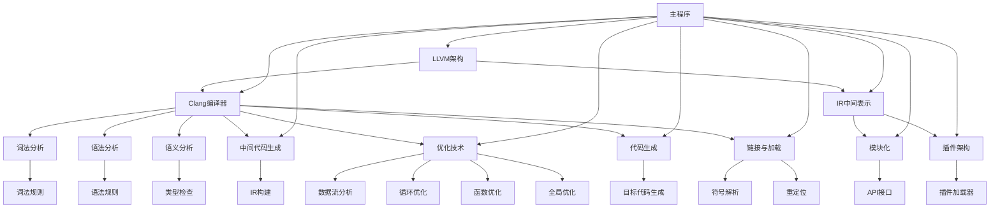

                 

### 文章标题

《LLVM/Clang：现代编译器架构剖析》

关键词：LLVM, Clang, 编译器架构, 中间表示（IR）, 优化技术，插件与扩展

摘要：本文深入剖析了LLVM/Clang这一现代编译器架构的核心组件、工作原理以及应用场景，从历史与发展、架构与组件、核心概念、编译过程、优化技术、插件与扩展、社区与生态、应用案例分析到开发工具与资源，全面展示了LLVM/Clang的强大功能与广阔前景。通过本文，读者可以系统地了解LLVM/Clang的内部机制及其在现代编译器领域的重要地位。

### 第1章 引言

#### 1.1 LLVM/Clang的历史与发展

LLVM（Low-Level Virtual Machine）和Clang是两个紧密关联的开源项目，它们在现代编译器领域有着重要的地位。LLVM起源于2000年，由Chris Lattner和Vladimir Dubnov在伯克利加州大学（UC Berkeley）的计算机科学实验室开发，初衷是为了支持高效的代码生成和优化。Clang则是在LLVM的基础上发展而来的C/C++编译器，同样由Chris Lattner主导，首次发布于2004年。

LLVM和Clang的发展历程可以追溯到它们在学术界的研究和应用。早期的LLVM主要用于优化和代码生成，其设计理念是模块化和可扩展性。Clang则利用LLVM的这些特性，成为了一个功能强大且易于扩展的编译器。随着时间的推移，LLVM/Clang在开源社区中逐渐赢得了广泛的支持和认可，成为了现代编译器研究与应用的重要工具。

LLVM/Clang的发展与开源社区的贡献密不可分。大量的贡献者参与到LLVM/Clang的开发中，不断优化其性能、增加新功能和改进用户体验。LLVM/Clang也被广泛应用于各种开源项目和商业应用中，例如LLVM/Clang被集成到Chrome浏览器、Xcode开发工具以及Android NDK中。

#### 1.2 LLVM/Clang在现代编译器中的地位

在现代编译器领域，LLVM/Clang以其高度模块化、可扩展和高效的特性，成为了研究者和开发者的重要工具。LLVM/Clang不仅在开源领域有着广泛的应用，也在商业领域展现出强大的竞争力。

首先，LLVM/Clang的模块化设计使得编译过程可以灵活地组织和优化。编译器可以按模块进行拆分，每个模块负责不同的编译任务，如词法分析、语法分析、中间代码生成和优化等。这种设计提高了编译器的可维护性和扩展性，使得开发者可以专注于特定模块的开发和优化。

其次，LLVM/Clang的优化技术是其核心优势之一。LLVM/Clang支持多种优化技术，包括数据流分析、循环优化、函数优化和全局优化等。这些优化技术可以显著提高代码的执行效率，降低功耗，提升程序的性能。LLVM/Clang的优化器还具备高度的可定制性，开发者可以根据具体的应用场景和需求，调整和优化编译器的性能。

此外，LLVM/Clang的可扩展性也是其重要特点之一。LLVM/Clang的插件架构使得开发者可以轻松地添加新功能、优化器和工具。这种灵活性不仅方便了开发者，也为LLVM/Clang社区的繁荣发展提供了有力支持。

最后，LLVM/Clang在开源社区和商业领域都有着广泛的应用。许多知名的开源项目，如Linux内核、Mozilla Firefox、Eclipse等，都选择了LLVM/Clang作为其编译器。在商业领域，LLVM/Clang也被广泛应用于各种嵌入式系统、高性能计算和游戏开发等场景。

总之，LLVM/Clang以其强大的功能和广泛的适用性，在现代编译器领域占据了重要地位。通过本文的深入剖析，读者可以更好地理解LLVM/Clang的核心架构和原理，掌握其在实际应用中的价值。

### 第2章 LLVM/Clang的架构与组件

LLVM/Clang的架构设计是其成为现代编译器的重要基石。本章将详细介绍LLVM/Clang的总体架构及其关键组件，包括LLVM架构、Clang编译器和LLVM的其他组件。通过这一部分的讲解，读者可以全面了解LLVM/Clang的内部工作原理和设计理念。

#### 2.1 LLVM架构概述

LLVM（Low-Level Virtual Machine）是一种模块化的编译器基础设施，其设计初衷是为了提供高效的代码生成和优化能力。LLVM的核心架构分为多个层次，包括前端（Frontend）、中间表示（Intermediate Representation, IR）、优化器（Optimizer）和后端（Backend）。

1. **前端（Frontend）**：前端负责将各种高级编程语言（如C、C++、Objective-C等）的源代码解析成LLVM的中间表示（IR）。前端包括词法分析、语法分析和语义分析等模块。LLVM支持多种前端，通过插件架构可以方便地添加新的语言支持。

2. **中间表示（IR）**：中间表示是LLVM的核心组件之一。它提供了一种统一且高度优化的抽象表示，用于编译过程的中间阶段。IR的设计目标是简化优化和代码生成，它独立于特定编程语言和目标平台，使得优化器可以在不关心具体语法和语义的情况下进行高效操作。

3. **优化器（Optimizer）**：优化器是LLVM的核心组件，负责对中间表示（IR）进行各种优化操作。LLVM的优化器包括数据流分析、循环优化、函数优化、全局优化等模块。优化器的目标是提高程序的性能、减少代码大小和功耗。

4. **后端（Backend）**：后端负责将优化的中间表示（IR）转换成特定目标平台的机器代码。LLVM支持多种目标平台，包括Linux、Windows、macOS、Android等。后端包括代码生成、寄存器分配、指令调度等模块。后端的设计使得LLVM可以方便地适应不同的目标平台和硬件架构。

LLVM架构的模块化设计使其具有高度的可扩展性和灵活性。通过插件架构，开发者可以方便地添加新语言支持、优化器和工具。LLVM的模块化设计还提高了编译器的可维护性，使得各个模块可以独立开发和优化。

#### 2.2 Clang编译器概述

Clang是基于LLVM的一个C/C++编译器，它继承了LLVM的模块化和高效性。Clang以其出色的性能、强大的静态分析能力和丰富的开发工具，在开源社区和商业领域都受到了广泛的应用。

1. **Clang的前端**：Clang的前端包括词法分析、语法分析和语义分析模块。这些模块负责将C/C++源代码解析成LLVM的中间表示（IR）。Clang的前端设计灵活，可以方便地支持多种编程语言和语法特性。

2. **Clang的中间表示**：Clang使用LLVM的中间表示（IR）作为其编译过程的中间阶段。这种设计使得Clang可以利用LLVM丰富的优化技术和工具集，从而提高代码的执行效率和性能。

3. **Clang的优化器**：Clang的优化器与LLVM的优化器共享同一套优化技术和算法。Clang的优化器可以对中间表示（IR）进行各种优化操作，包括数据流分析、循环优化、函数优化和全局优化等。这些优化技术可以显著提高程序的运行效率。

4. **Clang的后端**：Clang的后端负责将优化的中间表示（IR）转换成特定目标平台的机器代码。Clang支持多种目标平台，包括Linux、Windows、macOS、Android等。后端的设计使得Clang可以方便地适应不同的硬件架构和操作系统。

Clang还提供了一系列强大的开发工具，如代码格式化工具（Clang Format）、代码检查工具（Clang Static Analyzer）和调试工具（LLDB）。这些工具可以帮助开发者提高代码质量和开发效率，进一步凸显了Clang的实用性。

#### 2.3 LLVM的其他组件

除了LLVM的架构和Clang编译器，LLVM还包含了许多其他重要的组件，这些组件为LLVM/Clang的功能扩展和性能优化提供了强大的支持。

1. **LLVM IR**：LLVM的中间表示（IR）是LLVM的核心组件之一。IR提供了一种统一且高度优化的抽象表示，用于编译过程的中间阶段。LLVM IR支持多种数据类型、控制流和内存操作，使得优化器可以在不关心具体语法和语义的情况下进行高效操作。

2. **优化器**：LLVM的优化器包括数据流分析、循环优化、函数优化、全局优化等模块。这些优化技术可以显著提高程序的运行效率。LLVM优化器的设计注重模块化和可扩展性，使得开发者可以方便地添加新优化算法和工具。

3. **后端**：LLVM支持多种目标平台，包括Linux、Windows、macOS、Android等。每个后端都包括代码生成、寄存器分配、指令调度等模块。LLVM的后端设计灵活，可以方便地适应不同的硬件架构和操作系统。

4. **工具链**：LLVM提供了一系列工具链，包括编译器、链接器、汇编器和调试器等。这些工具链充分利用了LLVM的模块化和高效性，提供了丰富的功能，如代码优化、错误检测、调试支持等。

5. **静态分析器**：LLVM的静态分析器（Clang Static Analyzer）是一种强大的静态代码分析工具。它利用LLVM的中间表示（IR）和优化技术，可以自动检测程序中的潜在错误和安全漏洞。Clang Static Analyzer在开源社区和商业领域都受到了广泛的应用。

6. **插件架构**：LLVM的插件架构是其模块化设计的重要组成部分。通过插件架构，开发者可以方便地添加新功能、优化器和工具。插件架构不仅提高了LLVM的可维护性，也为LLVM社区的繁荣发展提供了有力支持。

总之，LLVM/Clang的架构和组件设计使其在现代编译器领域占据了重要地位。通过本章的讲解，读者可以全面了解LLVM/Clang的内部工作原理和设计理念，为后续章节的学习和应用打下坚实基础。

### 第3章 LLVM/Clang的核心概念

LLVM/Clang的成功离不开其核心概念的巧妙设计和实现。本章将详细探讨LLVM/Clang的几个核心概念，包括中间表示（IR）、编译器的优化技术以及模块化与插件架构。通过深入理解这些核心概念，读者将更好地掌握LLVM/Clang的工作原理和强大功能。

#### 3.1 中间表示（IR）详解

中间表示（IR）是LLVM/Clang编译过程的一个关键概念，它提供了一种统一的、抽象的表示形式，用于编译过程中的各个阶段。IR的设计目标是简化优化和代码生成，使得编译器可以在不关心具体语法和语义的情况下进行高效操作。

1. **IR的基本结构**：
   - **指令**：IR中的基本操作单位是指令，每个指令包含操作码（opcode）和操作数。指令的操作码定义了指令要执行的操作，如加法、赋值等；操作数则提供了指令操作所需的值。
   - **基本块**：基本块是一系列连续的指令，它们没有跳转指令（如`goto`或`if`）或只有一个唯一的出口。基本块是控制流的基本单元，用于实现代码的顺序执行。
   - **函数**：函数是IR中的基本模块，它由一个或多个基本块组成。函数可以调用其他函数，也可以被其他函数调用。函数的定义和实现都可以在IR中清晰地表示。
   - **模块**：模块是IR中的最高层级结构，它包含一个或多个函数。模块可以独立编译，也可以与其他模块链接形成更大的程序。模块之间通过符号表进行引用和解析。

2. **IR的类型系统**：
   - **基本类型**：IR支持多种基本类型，如整数（`i1`、`i8`、`i32`等）、浮点（`float`、`double`等）和指针（`ptr`）。
   - **复合类型**：IR还支持复合类型，如数组（`array`）、结构体（`struct`）和联合体（`union`）。这些复合类型可以在IR中定义和操作。
   - **函数类型**：函数类型用于表示函数的参数和返回值类型。在IR中，函数类型可以定义函数的参数个数、类型和返回值类型。

3. **IR的控制流**：
   - **分支指令**：IR中的分支指令用于实现条件跳转和循环控制。常见的分支指令有`br`（无条件跳转）、`cond_br`（条件跳转）和`switch`（多条件跳转）。
   - **循环指令**：IR中的循环指令用于实现循环控制。常见的循环指令有`loop`（基本循环）和`for`（嵌套循环）。

中间表示（IR）的设计使得LLVM/Clang可以在编译过程中进行各种优化，如循环优化、函数优化和全局优化。同时，IR的模块化设计提高了编译器的可维护性和可扩展性，使得开发者可以方便地添加新功能和支持新的编程语言。

#### 3.2 编译器的优化技术

编译器的优化技术是提高程序性能和效率的关键。LLVM/Clang提供了丰富的优化技术，包括数据流分析、循环优化、函数优化和全局优化等。以下是对这些优化技术的基本介绍。

1. **数据流分析**：
   - **定义-使用分析**：数据流分析的一个重要任务是找出变量在程序中的定义和使用点。通过定义-使用分析，编译器可以识别出哪些变量可以被优化。
   - **传播分析**：传播分析用于分析变量在程序中的传播路径。它可以帮助编译器识别出可以简化的计算和减少不必要的内存访问。

2. **循环优化**：
   - **循环展开**：循环展开是将循环体内的指令重复多次，以提高循环的执行效率。
   - **循环分配**：循环分配是将循环体中的指令分配到不同的基本块中，以减少控制流跳转的开销。
   - **循环优化**：循环优化包括循环依赖分析、循环条件优化和循环不变式提取等，用于提高循环的性能。

3. **函数优化**：
   - **函数内联**：函数内联是将函数调用替换为函数体，以减少函数调用的开销。
   - **尾递归优化**：尾递归优化用于将尾递归函数转换为循环，以提高函数的执行效率。
   - **函数间优化**：函数间优化包括死代码消除、公共子表达式消除和常量折叠等，用于优化函数间的调用和依赖。

4. **全局优化**：
   - **死代码消除**：死代码消除用于删除程序中不会执行的代码，以减少代码大小和提高性能。
   - **常量折叠**：常量折叠用于将表达式中出现的常量进行计算和替换，以减少计算时间和内存访问。
   - **全局优化**：全局优化包括全局常量传播、全局死代码消除和全局函数内联等，用于优化整个程序。

编译器的优化技术需要综合考虑程序的性能、代码大小、功耗等因素。LLVM/Clang的优化器设计注重模块化和可扩展性，使得开发者可以方便地添加新优化算法和工具。

#### 3.3 模块化与插件架构

模块化与插件架构是LLVM/Clang设计的重要特点，它们使得编译器具有高度的可扩展性和灵活性。

1. **模块化**：
   - **模块**：模块是LLVM编译过程中的一个基本单元，它包含一组函数、变量和其他编译单元。模块可以独立编译，也可以与其他模块链接。
   - **模块化设计**：LLVM采用模块化设计，将编译过程分解为多个模块，每个模块负责不同的编译任务，如词法分析、语法分析、中间代码生成和优化等。这种设计提高了编译器的可维护性和可扩展性。

2. **插件架构**：
   - **插件**：插件是LLVM/Clang的一个重要特性，它允许开发者添加新功能、优化器和工具。插件可以插入到编译器的各个模块中，以实现特定的功能。
   - **插件开发**：开发者可以通过编写插件来扩展LLVM/Clang的功能。插件通常使用C++编写，通过LLVM的API与编译器进行交互。
   - **插件案例**：LLVM社区已经开发了多个插件，如静态分析器（Clang Static Analyzer）、代码格式化工具（Clang Format）和代码生成工具（LLVM-LLVMIR）等。这些插件丰富了LLVM/Clang的功能，提高了其适用性和实用性。

模块化与插件架构不仅提高了LLVM/Clang的可维护性和可扩展性，也为LLVM/Clang社区的繁荣发展提供了有力支持。通过模块化设计，开发者可以专注于特定模块的开发和优化；通过插件架构，开发者可以方便地添加新功能、优化器和工具，使得LLVM/Clang可以更好地满足不同场景和应用的需求。

总之，LLVM/Clang的核心概念——中间表示（IR）、编译器的优化技术和模块化与插件架构，为其在现代编译器领域赢得了广泛的应用和认可。通过本章的详细讲解，读者可以深入理解LLVM/Clang的核心原理和设计理念，为后续章节的学习和应用打下坚实基础。

### 第4章 LLVM/Clang编译过程解析

LLVM/Clang的编译过程是一个复杂而精细的过程，涉及多个阶段，包括词法分析、语法分析、语义分析、中间代码生成、优化和代码生成等。本章将详细解析LLVM/Clang编译器的各个阶段，并解释这些阶段如何协同工作，从而生成高效的执行代码。

#### 4.1 词法分析和语法分析

词法分析和语法分析是编译过程的基础阶段，负责将源代码转换成抽象语法树（Abstract Syntax Tree, AST）。

1. **词法分析**：
   - **词法分析器（Lexer）**：词法分析器是编译器的第一个组件，它负责将源代码中的字符序列转换成词法单元（tokens）。词法分析器通过正则表达式或其他方法识别出标识符、关键字、运算符和分隔符等。
   - **示例**：例如，源代码`int x = 10;`会被词法分析器分解为`int`（关键字）、`x`（标识符）、`=`（运算符）、`10`（整数常量）和`;`（分隔符）等词法单元。

2. **语法分析**：
   - **语法分析器（Parser）**：语法分析器接收词法分析器生成的词法单元，并根据编程语言的语法规则构建出抽象语法树（AST）。AST是源代码的语法结构表示，它反映了程序的语法和语义。
   - **示例**：在上面的例子中，语法分析器会将词法单元构建成一个抽象语法树，其中`int`是一个根节点，代表声明语句；`x`是一个子节点，代表变量名；`=`是一个子节点，代表赋值操作；`10`是另一个子节点，代表常量值。

词法分析和语法分析是编译过程的关键步骤，它们确保源代码的语法正确性，并将源代码转换为结构化的AST表示。LLVM/Clang的词法分析和语法分析器设计灵活，可以支持多种编程语言和语法特性。

#### 4.2 语义分析

语义分析是编译过程的下一个重要阶段，它负责检查AST的语义正确性，并为后续的编译阶段提供必要的信息。

1. **类型检查**：
   - **类型检查器（Type Checker）**：类型检查器检查AST中的每个表达式和声明是否符合编程语言定义的类型系统。它确保变量、函数和操作数的类型在语义上是兼容的。
   - **示例**：例如，类型检查器会检查`x + y`中的`x`和`y`是否都是整数类型，或者函数调用是否符合预期的参数和返回值类型。

2. **作用域分析**：
   - **作用域分析器（Scope Analyzer）**：作用域分析器确定变量和函数的作用域，并确保它们在正确的上下文中被引用。它还负责处理变量重名和作用域嵌套等问题。
   - **示例**：在嵌套的作用域中，例如`if`语句内部定义的变量，作用域分析器会确保这些变量的作用域仅限于其定义的块内。

语义分析确保AST在语义上是正确的，并为后续的编译阶段提供类型信息、作用域信息和符号表等信息，这些信息对后续阶段的编译至关重要。

#### 4.3 中间代码生成

语义分析完成后，编译器将AST转换成中间表示（IR）。中间代码生成是编译过程的核心阶段之一，它负责将高层次的源代码转换为低层次的中间表示。

1. **中间代码生成器（IR Generator）**：
   - **IR Generator**：中间代码生成器负责将AST转换为LLVM IR。这一阶段包括将源代码中的控制流（如条件分支、循环等）和操作转换为IR指令。生成器还需要处理数据流和控制流依赖，确保IR能够准确地反映源代码的语义。
   - **示例**：例如，`if`语句会被转换为`cond_br`指令，循环会被转换为`loop`指令，变量赋值会被转换为`store`和`load`指令。

中间代码生成器的设计注重可读性和可维护性，生成的IR代码结构清晰，便于后续的优化和代码生成阶段。

#### 4.4 优化与代码生成

优化和代码生成是编译过程的后续阶段，它们负责对中间代码进行各种优化，并最终生成高效的目标代码。

1. **优化阶段**：
   - **优化器（Optimizer）**：优化器对IR进行各种优化操作，包括数据流分析、循环优化、函数优化和全局优化等。这些优化旨在提高程序的性能、减少代码大小和功耗。
   - **示例**：数据流分析可以识别变量在程序中的定义和使用点，循环优化可以优化循环结构的执行效率，函数优化可以合并或内联函数调用。

2. **代码生成阶段**：
   - **代码生成器（Code Generator）**：代码生成器负责将优化的IR转换为特定目标平台的机器代码。这一阶段包括代码生成、寄存器分配、指令调度等任务。
   - **示例**：代码生成器会将IR中的指令转换为机器代码指令，根据目标平台的寄存器架构进行寄存器分配，并优化指令执行顺序以提高性能。

优化和代码生成阶段是编译过程的最后两个关键步骤，它们共同确保生成的目标代码不仅高效，而且与源代码在语义上保持一致。

#### 4.5 链接与加载

编译过程的最后一个阶段是链接和加载，它确保编译后的目标代码可以正常运行。

1. **链接器（Linker）**：
   - **链接过程**：链接器将多个编译单元（对象文件）合并成一个可执行文件或动态链接库。链接过程包括符号解析、重定位和依赖处理等任务。
   - **示例**：例如，链接器会解析函数和变量的符号引用，将它们与对应的实现关联起来，并处理外部库的依赖。

2. **加载器（Loader）**：
   - **加载过程**：加载器负责将可执行文件或动态链接库加载到内存中，并为程序运行提供必要的资源和权限。
   - **示例**：加载器会读取可执行文件或动态链接库的元数据，分配内存空间，并初始化程序运行所需的资源。

链接和加载阶段确保编译后的程序可以正确运行，并与外部库和其他程序进行交互。

综上所述，LLVM/Clang的编译过程是一个多层次、多阶段的复杂过程，每个阶段都发挥着重要作用。通过词法分析和语法分析，编译器将源代码转换为结构化的AST；通过语义分析，确保AST在语义上是正确的；通过中间代码生成，将AST转换为低层次的IR；通过优化和代码生成，生成高效的目标代码；最后，通过链接和加载，确保程序可以正确运行。LLVM/Clang的编译过程设计精细，模块化且高度可扩展，使其在现代编译器领域中占据了重要地位。

### 第5章 LLVM/Clang的优化技术

LLVM/Clang的优化技术是其功能强大的核心组件之一。这些优化技术能够显著提高程序的性能和效率，降低功耗，提升用户体验。本章将详细探讨LLVM/Clang的优化技术，包括代码优化策略、优化器的内部工作原理以及常见的优化技术。

#### 5.1 代码优化策略

在LLVM/Clang中，代码优化是一个多层次、多阶段的过程，旨在提高程序的执行效率。优化策略通常包括以下几个关键步骤：

1. **静态优化**：静态优化是指在不运行程序的情况下，对代码进行分析和优化。这种优化方法可以在编译时进行，从而提高程序的整体性能。常见的静态优化包括数据流分析、循环优化、函数优化和全局优化等。

2. **动态优化**：动态优化是在程序运行时进行的优化，通常依赖于运行时信息，如程序的热点路径和执行频率。动态优化可以针对特定的执行场景进行优化，从而进一步提高性能。常见的动态优化技术包括即时编译（JIT）和运行时优化。

3. **代码优化策略**：LLVM/Clang采用多种优化策略，包括：
   - **早期优化**：早期优化在编译的早期阶段进行，旨在简化代码结构，减少后续优化阶段的计算复杂度。例如，数据流分析和循环优化可以在早期阶段识别和简化依赖关系。
   - **中后期优化**：中后期优化在编译的较晚阶段进行，主要目标是提高程序的性能。这些优化包括函数内联、循环展开、寄存器分配和指令调度等。
   - **全局优化**：全局优化考虑整个程序的执行效率，通过优化全局变量和函数调用，减少代码大小和执行时间。

优化策略的设计需要平衡优化性能和编译时间，同时确保程序在优化后的行为与源代码一致。

#### 5.2 优化器的内部工作原理

LLVM/Clang的优化器是一个高度模块化的系统，它由多个优化模块组成，每个模块负责不同的优化任务。优化器的工作原理可以概括为以下几个关键步骤：

1. **数据流分析**：数据流分析是优化器的基础，它用于跟踪变量和值在程序中的传播路径。数据流分析包括定义-使用分析、传播分析和可达性分析等。这些分析技术帮助优化器识别出可以被优化的数据依赖关系。

2. **控制流分析**：控制流分析用于分析程序中的控制流结构，如条件分支、循环和函数调用。控制流分析帮助优化器识别出循环结构、函数调用点和控制依赖关系，为后续的优化提供依据。

3. **依赖分析**：依赖分析包括数据依赖和控制依赖。数据依赖分析识别出变量之间的读写关系，控制依赖分析识别出控制流中的跳转和分支。这些依赖关系对于优化循环、函数内联和全局优化至关重要。

4. **优化算法**：优化器使用多种优化算法，如迭代算法、动态规划算法和贪心算法等。这些算法根据具体优化任务的需求，逐步改进代码，提高程序的性能。

5. **优化决策**：优化器在优化过程中需要做出多个决策，如选择优化路径、调整优化优先级和平衡优化效果等。这些决策依赖于优化策略和数据流分析结果。

6. **优化验证**：优化器在完成优化后，会对优化结果进行验证，确保优化后的代码在语义上与源代码保持一致。验证包括类型检查、控制流验证和数据流验证等。

优化器的内部工作原理涉及多个分析模块和优化算法，这些模块和算法相互协作，共同实现高效的代码优化。

#### 5.3 LLVM/Clang的常见优化技术

LLVM/Clang提供了丰富的优化技术，这些技术可以显著提高程序的执行效率和性能。以下是一些常见的优化技术：

1. **循环优化**：
   - **循环展开**：循环展开是将循环体内的指令重复多次，以减少循环控制开销，提高执行效率。
   - **循环分配**：循环分配将循环体中的指令分配到不同的基本块中，减少控制流跳转的开销。
   - **循环优化**：循环优化包括循环依赖分析、循环条件优化和循环不变式提取等，以减少循环执行的次数和复杂度。

2. **函数优化**：
   - **函数内联**：函数内联是将函数调用替换为函数体，以减少函数调用的开销。
   - **尾递归优化**：尾递归优化将尾递归函数转换为循环，以提高函数的执行效率。
   - **函数间优化**：函数间优化包括死代码消除、公共子表达式消除和常量折叠等，以提高整个程序的性能。

3. **全局优化**：
   - **死代码消除**：死代码消除用于删除程序中不会执行的代码，以减少代码大小和提高性能。
   - **常量折叠**：常量折叠用于将表达式中出现的常量进行计算和替换，以减少计算时间和内存访问。
   - **全局优化**：全局优化包括全局常量传播、全局死代码消除和全局函数内联等，以优化整个程序的执行效率。

4. **数据流优化**：
   - **数据流分析**：数据流分析用于跟踪变量和值在程序中的传播路径，识别出可以被优化的数据依赖关系。
   - **传播分析**：传播分析用于分析变量在程序中的传播路径，识别出可以简化的计算和减少不必要的内存访问。
   - **数据依赖优化**：数据依赖优化包括寄存器分配、内存分配和指令重排等，以提高程序的数据访问效率。

5. **代码生成优化**：
   - **代码生成**：代码生成是将优化的中间表示（IR）转换为特定目标平台的机器代码。
   - **寄存器分配**：寄存器分配用于将IR中的操作数分配到寄存器中，以提高指令执行的效率。
   - **指令调度**：指令调度用于优化指令的执行顺序，减少指令间的依赖和冲突，提高流水线的利用率。

通过上述优化技术，LLVM/Clang能够在编译过程中生成高效、优化的代码，从而显著提高程序的执行效率和性能。这些优化技术不仅适用于开源项目，也广泛应用于商业应用和嵌入式系统等领域。

### 第6章 LLVM/Clang的插件与扩展

LLVM/Clang的插件架构是其模块化设计的重要组成部分，它为开发者提供了丰富的扩展能力。本章将详细介绍LLVM/Clang的插件架构、插件开发基础以及插件案例研究，帮助读者理解和掌握如何利用插件扩展LLVM/Clang的功能。

#### 6.1 插件架构

LLVM/Clang的插件架构允许开发者在不修改核心编译器代码的情况下，添加新的功能、优化器和工具。插件架构的核心组件包括：

1. **API接口**：LLVM/Clang提供了一套API接口，插件可以通过这些接口与编译器进行交互。API接口包括词法分析、语法分析、中间表示（IR）、优化器、代码生成等多个层次，开发者可以根据需要选择合适的接口进行扩展。

2. **插件加载器**：插件加载器负责在编译过程中加载和初始化插件。LLVM/Clang在启动时可以加载多个插件，并按顺序调用它们的入口函数。插件加载器确保插件的正确加载和运行，并管理插件的资源分配和释放。

3. **插件生命周期**：插件的运行分为初始化、执行和清理三个阶段。初始化阶段在编译器启动时进行，插件加载器会调用插件的初始化函数。执行阶段是插件执行主要功能的阶段，插件可以访问编译器的各种接口和资源。清理阶段在编译器退出时进行，插件加载器会调用插件的清理函数，释放插件占用的资源。

4. **插件通信**：插件之间可以通过共享内存、消息队列等机制进行通信。这种通信方式允许插件协同工作，共同完成复杂的编译任务。

#### 6.2 插件开发基础

开发LLVM/Clang插件需要掌握C++和LLVM的API。以下是一些基本步骤和注意事项：

1. **安装LLVM/Clang**：首先需要安装LLVM/Clang编译器，并确保开发环境正确配置。安装过程通常涉及下载源代码、配置编译选项和执行编译命令。

2. **了解LLVM/Clang API**：开发者需要熟悉LLVM/Clang的API，特别是与插件开发相关的接口。LLVM的官方文档提供了详细的API参考，开发者可以通过阅读文档和示例代码来了解API的使用方法。

3. **编写插件代码**：编写插件代码是插件开发的核心步骤。插件通常由多个源文件组成，包括主程序、API实现、优化器实现等。开发者需要编写插件的主程序，实现插件的初始化和执行逻辑；编写API实现，与LLVM/Clang的API进行交互；编写优化器实现，实现具体的优化算法。

4. **构建插件**：构建插件是将插件代码编译成可执行文件的过程。开发者需要使用LLVM/Clang的编译工具链构建插件，并确保插件在目标平台上可以正常运行。

5. **调试插件**：调试插件是确保插件功能正确的重要步骤。开发者可以使用LLDB或其他调试工具对插件进行调试，跟踪插件运行时的行为和性能。

6. **测试插件**：测试插件是验证插件功能和性能的过程。开发者需要编写测试用例，对插件进行全面的测试，确保插件在各种场景下都能正常运行。

#### 6.3 插件案例研究

以下是一个简单的LLVM/Clang插件案例，该插件用于将中间表示（IR）中的所有变量名更改为指定的前缀。

1. **插件需求**：该插件需要接收一个参数，用于指定变量名的前缀。插件将遍历中间表示（IR）中的所有变量，将其名字更改为指定前缀。

2. **插件实现**：
   - **主程序**：主程序负责接收命令行参数，初始化插件，并调用插件的执行逻辑。以下是一个简单的示例代码：

   ```cpp
   #include <llvm/IR/Module.h>
   #include <llvm/IR/PassManager.h>
   #include <llvm/Pass.h>
   #include <llvm/Support/CommandLine.h>

   using namespace llvm;

   static cl::opt<std::string> VarPrefix("var-prefix", cl::desc("Set variable name prefix"), cl::value_required());

   struct ChangeVarName : public FunctionPass {
     static char ID; // Unique identifier for the pass.

     ChangeVarName() : FunctionPass(ID) {}

     bool runOnFunction(Function &F) override {
       for (auto &BB : F) {
         for (auto &Inst : BB) {
           if (auto *Var = dyn_cast<AllocaInst>(&Inst)) {
             Var->setName(VarPrefix + Var->getName());
           }
         }
       }
       return true;
     }
   };

   char ChangeVarName::ID = 0;

   static Registry<ChangeVarName> X("change-var-name", "Change variable names in the module");

   static cl::extrahelp MoreHelp(
       "Example: Set all variable names to 'new_'\n"
       "    clang++ -Xpass=change-var-name -var-prefix=new_ source.cpp\n");

   int main(int argc, char **argv) {
     sys::PrintStackTraceOnErrorSignal();
     PrettyStackTraceProgram X;

     cl::ParseCommandLineOptions(argc, argv);

     LLVM_shutdown = [] {
         // Perform any necessary cleanup.
     };

     // Create a new module and pass manager.
     auto M = std::make_unique<Module>("my_module", Context());
     auto PM = createDefaultPassManager();

     // Add the change-var-name pass to the pass manager.
     PM->addPass(ChangeVarName());

     // Run the pass manager on the module.
     PM->run(*M);

     return 0;
   }
   ```

   - **插件执行**：在编译时，通过命令行参数 `-Xpass=change-var-name -var-prefix=new_` 指定插件和参数，即可将中间表示（IR）中的所有变量名更改为 `new_` 前缀。

3. **测试插件**：编写测试用例，验证插件功能是否正确。例如，创建一个简单的测试程序，包含多个变量声明，运行插件后检查变量名是否已更改为指定前缀。

通过这个案例，读者可以了解LLVM/Clang插件的基本开发流程和实现方法。LLVM/Clang的插件架构为开发者提供了强大的扩展能力，使得编译器可以轻松地适应各种应用场景和需求。

### 第7章 LLVM/Clang的社区与生态

LLVM/Clang作为一个开源项目，拥有广泛的社区支持和强大的生态体系。本章将介绍LLVM/Clang社区的概况、生态现状以及未来发展趋势，帮助读者更好地理解和利用LLVM/Clang的资源。

#### 7.1 LLVM/Clang社区介绍

LLVM/Clang社区是由全球各地的开发者和贡献者组成的一个活跃的社区。这个社区的特点包括以下几点：

1. **多样性**：LLVM/Clang社区涵盖了各个领域的技术专家和爱好者，包括高校教授、企业工程师、独立开发者等。社区成员来自不同的国家和地区，使用不同的编程语言和平台，这使得LLVM/Clang能够适应各种应用场景。

2. **活跃度**：LLVM/Clang社区非常活跃，每天都有大量的讨论和贡献。社区通过邮件列表、GitHub仓库、论坛和会议等多种渠道进行交流和合作。社区成员积极参与项目的开发、测试和优化，确保LLVM/Clang始终保持高效和稳定。

3. **贡献机制**：LLVM/Clang采用开放和透明的贡献机制，任何有兴趣的开发者都可以提交代码、优化建议和bug报告。社区成员通过代码审查、讨论和投票等方式，共同决定哪些贡献将被接受和合并到LLVM/Clang的主分支。

4. **会议和活动**：LLVM/Clang社区定期举办各种会议和活动，如年度的LLVM开发者会议（LLVM Developers' Meeting）和Clang开发者会议（Clang Developers' Meeting）。这些活动为社区成员提供了一个交流和合作的平台，促进了LLVM/Clang的发展和创新。

#### 7.2 LLVM/Clang生态现状

LLVM/Clang的生态体系已经发展得非常成熟，广泛应用于各种场景和应用领域。以下是LLVM/Clang生态现状的几个关键方面：

1. **开源项目**：LLVM/Clang被众多知名的开源项目采用，如Linux内核、Mozilla Firefox、Eclipse等。这些项目利用LLVM/Clang的高效编译器和强大的分析工具，提高了代码质量和开发效率。

2. **商业应用**：LLVM/Clang在商业领域也具有广泛的应用。许多企业将其集成到自己的开发工具和产品中，如Google的Chrome浏览器、Apple的Xcode开发工具、ARM的编译器等。LLVM/Clang的性能和灵活性为这些商业应用带来了显著的优势。

3. **工具链**：LLVM/Clang提供了一系列强大的工具链，包括编译器、链接器、汇编器、调试器等。这些工具链不仅支持多种编程语言和平台，还提供了丰富的开发工具和优化功能。开发者可以利用这些工具链开发各种应用程序和系统。

4. **插件与扩展**：LLVM/Clang的插件架构为其生态体系提供了巨大的扩展能力。社区成员开发了大量的插件和工具，如静态分析器、代码格式化工具、代码检查工具等。这些插件和工具不仅丰富了LLVM/Clang的功能，也为开发者提供了更多的选择。

5. **教育与培训**：LLVM/Clang社区积极参与教育和培训活动，为新手和开发者提供丰富的学习资源。社区成员撰写了大量的教程、博客和书籍，分享了他们在LLVM/Clang开发和应用方面的经验和技巧。

#### 7.3 LLVM/Clang的未来发展

随着计算机硬件和软件的不断进步，LLVM/Clang也在不断演进和扩展。以下是LLVM/Clang未来发展的几个关键方向：

1. **性能优化**：LLVM/Clang将继续优化其编译器和优化器，以提高代码的执行效率和性能。未来，LLVM/Clang可能会引入更多的硬件特化和底层优化技术，以更好地利用现代硬件的特性和优势。

2. **语言支持**：LLVM/Clang将扩展其支持的语言和语法特性，以适应不断变化的编程语言趋势。例如，LLVM/Clang可能会支持更多的新语言，如Rust、Swift等，以及新的编程范式和特性。

3. **生态扩展**：LLVM/Clang将继续扩展其生态体系，增加新的工具链、插件和资源。社区成员将致力于开发更多实用的工具和功能，以满足不同领域和应用场景的需求。

4. **社区参与**：LLVM/Clang社区将继续鼓励开发者参与项目，共同推动LLVM/Clang的发展。社区将举办更多的会议和活动，提供更丰富的学习资源，吸引更多的开发者加入社区。

5. **开源合作**：LLVM/Clang将继续与其他开源项目合作，共同推动计算机编译器和语言技术的发展。社区成员将积极参与其他开源项目的开发，共同构建一个更加开放、多样和强大的生态系统。

总之，LLVM/Clang社区与生态的繁荣发展，为LLVM/Clang的未来带来了广阔的前景。通过本章的介绍，读者可以更好地了解LLVM/Clang社区和生态的现状，为后续的学习和应用打下坚实基础。

### 第8章 LLVM/Clang应用案例分析

LLVM/Clang在开源项目、企业级应用和教育领域都有着广泛的应用。本章将通过具体的案例分析，展示LLVM/Clang的实际应用场景、开发环境搭建、源代码实现和代码解读，并提供实际案例分析和详细讲解剖析。

#### 8.1 LLVM/Clang在开源项目中的应用

**案例1：Linux内核**

Linux内核是使用C语言编写，并广泛采用LLVM/Clang作为其编译器。LLVM/Clang为Linux内核提供了高效的编译过程和优化工具，帮助开发人员提高内核的性能和稳定性。

- **开发环境搭建**：为了在Linux内核中编译LLVM/Clang，开发者需要在操作系统上安装LLVM/Clang编译器，并配置内核编译环境。具体步骤包括：
  - 安装LLVM/Clang编译器，可以使用包管理器或源代码编译。
  - 配置内核编译选项，包括指定编译器路径、优化级别和目标平台等。

- **源代码实现**：Linux内核使用Git进行版本控制，开发者可以通过克隆内核仓库获取源代码。在源代码中，编译器配置选项保存在`./arch/x86/Makefile`文件中，开发者可以根据需要修改编译选项。

- **代码解读**：Linux内核的编译过程主要包括以下几个步骤：
  1. **配置和构建**：开发者使用`make`命令配置和构建内核，指定编译器路径和优化级别。
  2. **编译**：编译器根据配置选项，对源代码进行编译，生成目标文件。
  3. **链接**：链接器将目标文件和库文件链接成可执行文件，生成内核映像。

- **实际案例分析与详细讲解剖析**：
  - **性能优化**：LLVM/Clang提供了丰富的优化技术，如循环优化、函数内联和全局优化，可以帮助开发人员提高内核的性能。通过分析内核代码中的热点路径和性能瓶颈，开发者可以针对具体场景进行优化。
  - **调试支持**：LLVM/Clang集成了强大的调试器（如LLDB），开发人员可以在编译过程中启用调试功能，跟踪程序执行过程，定位和修复bug。

**案例2：Mozilla Firefox**

Mozilla Firefox是著名的开源浏览器，它也采用LLVM/Clang作为其编译器。LLVM/Clang为Firefox提供了高效的编译过程和优化工具，帮助开发人员提高浏览器的性能和用户体验。

- **开发环境搭建**：为了在Firefox中使用LLVM/Clang，开发者需要在操作系统上安装LLVM/Clang编译器，并配置Firefox的构建环境。具体步骤包括：
  - 安装LLVM/Clang编译器，可以使用包管理器或源代码编译。
  - 配置Firefox构建脚本，指定编译器路径和优化级别。

- **源代码实现**：Firefox使用Git进行版本控制，开发者可以通过克隆Firefox仓库获取源代码。在源代码中，编译器配置选项保存在`configure`脚本文件中，开发者可以根据需要修改配置选项。

- **代码解读**：Firefox的编译过程主要包括以下几个步骤：
  1. **配置和构建**：开发者使用`./configure`命令配置和构建Firefox，指定编译器路径和优化级别。
  2. **编译**：编译器根据配置选项，对源代码进行编译，生成目标文件。
  3. **链接**：链接器将目标文件和库文件链接成可执行文件，生成Firefox浏览器。

- **实际案例分析与详细讲解剖析**：
  - **性能优化**：LLVM/Clang提供了丰富的优化技术，如循环优化、函数内联和全局优化，可以帮助开发人员提高Firefox的性能。通过分析浏览器代码中的热点路径和性能瓶颈，开发者可以针对具体场景进行优化。
  - **安全性增强**：LLVM/Clang的静态分析器（如Clang Static Analyzer）可以帮助开发人员检测和修复代码中的潜在安全问题，提高浏览器的安全性。

#### 8.2 LLVM/Clang在企业级应用案例

**案例1：Google Chrome**

Google Chrome是著名的开源浏览器，它采用LLVM/Clang作为其编译器。LLVM/Clang为Chrome提供了高效的编译过程和优化工具，帮助开发人员提高浏览器的性能和用户体验。

- **开发环境搭建**：为了在Chrome中使用LLVM/Clang，开发者需要在操作系统上安装LLVM/Clang编译器，并配置Chrome的构建环境。具体步骤包括：
  - 安装LLVM/Clang编译器，可以使用包管理器或源代码编译。
  - 配置Chrome构建脚本，指定编译器路径和优化级别。

- **源代码实现**：Chrome使用Git进行版本控制，开发者可以通过克隆Chrome仓库获取源代码。在源代码中，编译器配置选项保存在`build/config/linux/system.gn`文件中，开发者可以根据需要修改配置选项。

- **代码解读**：Chrome的编译过程主要包括以下几个步骤：
  1. **配置和构建**：开发者使用`gn gen`命令配置和构建Chrome，指定编译器路径和优化级别。
  2. **编译**：编译器根据配置选项，对源代码进行编译，生成目标文件。
  3. **链接**：链接器将目标文件和库文件链接成可执行文件，生成Chrome浏览器。

- **实际案例分析与详细讲解剖析**：
  - **性能优化**：LLVM/Clang提供了丰富的优化技术，如循环优化、函数内联和全局优化，可以帮助开发人员提高Chrome的性能。通过分析浏览器代码中的热点路径和性能瓶颈，开发者可以针对具体场景进行优化。
  - **安全性增强**：LLVM/Clang的静态分析器（如Clang Static Analyzer）可以帮助开发人员检测和修复代码中的潜在安全问题，提高浏览器的安全性。

**案例2：ARM编译器**

ARM编译器采用LLVM/Clang作为其编译器，用于开发ARM架构的应用程序。LLVM/Clang为ARM编译器提供了高效的编译过程和优化工具，帮助开发人员提高ARM应用的性能和功耗。

- **开发环境搭建**：为了在ARM编译器中使用LLVM/Clang，开发者需要在操作系统上安装LLVM/Clang编译器，并配置ARM编译器环境。具体步骤包括：
  - 安装LLVM/Clang编译器，可以使用包管理器或源代码编译。
  - 配置ARM编译器脚本，指定编译器路径和优化级别。

- **源代码实现**：ARM编译器使用Git进行版本控制，开发者可以通过克隆ARM编译器仓库获取源代码。在源代码中，编译器配置选项保存在`config.mk`文件中，开发者可以根据需要修改配置选项。

- **代码解读**：ARM编译器的编译过程主要包括以下几个步骤：
  1. **配置和构建**：开发者使用`make`命令配置和构建ARM编译器，指定编译器路径和优化级别。
  2. **编译**：编译器根据配置选项，对源代码进行编译，生成目标文件。
  3. **链接**：链接器将目标文件和库文件链接成可执行文件，生成ARM编译器。

- **实际案例分析与详细讲解剖析**：
  - **性能优化**：LLVM/Clang提供了丰富的优化技术，如循环优化、函数内联和全局优化，可以帮助开发人员提高ARM应用的性能。通过分析ARM应用代码中的热点路径和性能瓶颈，开发者可以针对具体场景进行优化。
  - **功耗优化**：LLVM/Clang的功耗优化技术可以帮助开发人员降低ARM应用的功耗，提高能效。通过优化ARM架构的特殊指令和优化算法，LLVM/Clang可以实现更高效的功耗管理。

#### 8.3 LLVM/Clang在教育领域的应用

**案例1：计算机科学课程教学**

在计算机科学课程教学中，LLVM/Clang作为一种高效的编译器和优化工具，被广泛应用于编程课程和编译原理课程的教学。通过使用LLVM/Clang，教师可以为学生提供一个真实的编译器开发环境，帮助他们更好地理解和掌握编译器的工作原理和优化技术。

- **开发环境搭建**：为了在计算机科学课程中使用LLVM/Clang，教师需要在教学环境中安装LLVM/Clang编译器，并配置教学所需的工具和资源。具体步骤包括：
  - 安装LLVM/Clang编译器，可以使用包管理器或源代码编译。
  - 配置教学工具，如代码分析工具、调试器和性能优化工具。

- **源代码实现**：教师可以提供基于LLVM/Clang的教学项目，包括编译器前端、中间表示（IR）、优化器和后端等模块。学生可以通过修改和优化这些模块，加深对编译器原理的理解。

- **代码解读**：教师可以讲解LLVM/Clang的关键组件和优化技术，帮助学生理解编译器的工作流程和优化原理。通过实际操作和实验，学生可以亲自体验编译器的开发和优化过程。

- **实际案例分析与详细讲解剖析**：
  - **前端解析**：教师可以分析LLVM/Clang的前端代码，解释词法分析、语法分析和语义分析的过程，帮助学生理解编译器的前端实现。
  - **优化技术**：教师可以讲解LLVM/Clang的优化技术，如数据流分析、循环优化和全局优化等，帮助学生掌握优化算法和优化原理。

**案例2：编译器课程设计**

编译器课程设计是计算机科学专业的一门重要课程，学生需要设计和实现一个编译器，从源代码生成目标代码。LLVM/Clang为编译器课程设计提供了一个强大的平台，学生可以通过使用LLVM/Clang，实现高效的编译器开发和优化。

- **开发环境搭建**：为了进行编译器课程设计，学生需要在开发环境中安装LLVM/Clang编译器，并配置编译器开发所需的工具和资源。具体步骤包括：
  - 安装LLVM/Clang编译器，可以使用包管理器或源代码编译。
  - 配置编译器开发工具，如代码格式化工具、静态分析器和调试器。

- **源代码实现**：学生需要设计和实现编译器的各个模块，包括前端、中间表示（IR）、优化器和后端等。学生可以通过修改LLVM/Clang的源代码，添加新的功能和优化技术。

- **代码解读**：学生可以通过阅读LLVM/Clang的源代码，理解编译器的内部实现和优化技术。教师可以提供指导和建议，帮助学生解决开发过程中遇到的问题。

- **实际案例分析与详细讲解剖析**：
  - **前端实现**：学生可以分析LLVM/Clang的前端代码，实现词法分析、语法分析和语义分析模块，帮助学生理解编译器的前端实现。
  - **优化实现**：学生可以分析LLVM/Clang的优化器代码，实现各种优化算法，帮助学生掌握优化原理和实现方法。
  - **后端实现**：学生可以分析LLVM/Clang的后端代码，实现代码生成和目标代码优化，帮助学生理解编译器的后端实现。

通过以上案例，可以看出LLVM/Clang在开源项目、企业级应用和教育领域都有着广泛的应用。通过实际案例分析和详细讲解剖析，读者可以更好地了解LLVM/Clang的应用场景和开发方法，为实际项目的开发和优化提供指导。

### 第9章 LLVM/Clang开发工具与资源

为了充分利用LLVM/Clang的功能和特性，开发者需要掌握一系列开发工具和资源。本章将介绍LLVM/Clang的开发工具，推荐有用的资源，并提供一个详细的LLVM/Clang学习路线图，帮助开发者更好地掌握LLVM/Clang。

#### 9.1 LLVM/Clang开发工具介绍

LLVM/Clang提供了一系列强大的开发工具，这些工具在代码开发、调试和性能优化等方面发挥了重要作用。以下是一些常用的LLVM/Clang开发工具：

1. **Clang工具集**：
   - **Clang Format**：Clang Format是一个代码格式化工具，它可以帮助开发者保持代码风格的统一。通过配置文件，开发者可以自定义代码格式，提高代码可读性。
   - **Clang Static Analyzer**：Clang Static Analyzer是一个静态代码分析工具，它可以在编译过程中自动检测代码中的潜在错误和安全漏洞。该工具可以帮助开发者提高代码质量，减少bug和安全隐患。
   - **Clang-Tidy**：Clang-Tidy是一个静态代码检查工具，它可以根据编程规范检查代码，提供改进建议。Clang-Tidy可以帮助开发者遵循最佳实践，提高代码的规范性和可维护性。

2. **LLDB调试器**：
   - **LLDB**：LLDB是一个高性能、可扩展的调试器，它支持各种编程语言和操作系统。开发者可以使用LLDB进行程序调试，跟踪程序执行过程，定位和修复bug。

3. **性能分析工具**：
   - **perf**：perf是一个系统级性能分析工具，它可以监控程序的性能，分析CPU和内存的使用情况。开发者可以使用perf识别程序的性能瓶颈，优化代码和系统配置。
   - **gprof**：gprof是一个基于程序的性能分析工具，它可以生成程序的调用图和函数性能报告。通过gprof，开发者可以了解程序的性能分布，优化关键函数和路径。

4. **代码生成和优化工具**：
   - **LLVM-IR工具**：LLVM提供了一系列用于操作中间表示（IR）的工具，如`llvm-dis`（将IR转换为汇编代码）、`llvm-as`（将汇编代码转换为IR）和`llvm-opt`（对IR进行优化）。开发者可以使用这些工具进行代码生成和优化。

#### 9.2 LLVM/Clang资源推荐

为了更好地掌握LLVM/Clang，开发者可以参考以下推荐资源：

1. **官方文档**：
   - **LLVM官方文档**：LLVM官方网站提供了详细的文档，包括编译器架构、API参考、工具链使用指南等。开发者可以通过官方文档了解LLVM/Clang的详细功能和用法。
   - **Clang官方文档**：Clang官方网站提供了Clang编译器的文档，包括前端语法、中间表示（IR）、优化器等。开发者可以通过Clang文档学习Clang的内部实现和优化技术。

2. **书籍和教程**：
   - **《LLVM Cookbook》**：这本书详细介绍了LLVM的基础知识和实际应用，包括编译过程、优化技术和工具链等。对于初学者来说，这本书是一个很好的入门指南。
   - **《编译器设计现代方法》**：这本书介绍了现代编译器的设计原理和实现方法，包括LLVM/Clang等开源编译器的实现。这本书适合对编译器原理有一定了解的开发者。

3. **在线课程和讲座**：
   - **Coursera上的《编译原理》**：这是一门由斯坦福大学提供的在线课程，介绍了编译器的原理和实现方法。课程内容包括词法分析、语法分析、语义分析和代码生成等。
   - **YouTube上的LLVM讲座**：YouTube上有许多关于LLVM/Clang的讲座和教程，开发者可以通过这些视频了解LLVM/Clang的详细实现和优化技术。

4. **社区和论坛**：
   - **LLVM邮件列表**：LLVM邮件列表是一个活跃的社区交流平台，开发者可以在这个平台上提问、分享经验和获取帮助。
   - **Stack Overflow**：Stack Overflow是一个编程问答社区，开发者可以在这个平台上找到关于LLVM/Clang的各种问题解答。

#### 9.3 LLVM/Clang学习路线图

为了系统地学习和掌握LLVM/Clang，开发者可以按照以下学习路线进行：

1. **基础阶段**：
   - 学习C++编程语言，掌握面向对象编程的基本概念。
   - 了解编译器的基本原理和架构，熟悉编译过程的不同阶段。

2. **入门阶段**：
   - 安装并配置LLVM/Clang开发环境，学习LLVM/Clang的基本使用方法。
   - 阅读LLVM官方文档和《LLVM Cookbook》，了解LLVM/Clang的核心功能和API。

3. **进阶阶段**：
   - 学习LLVM/Clang的优化技术，包括数据流分析、循环优化、函数优化和全局优化等。
   - 学习Clang前端语法和中间表示（IR），了解前端和后端的实现原理。
   - 学习LLVM后端代码，了解不同目标平台的代码生成和优化。

4. **实践阶段**：
   - 参与LLVM/Clang社区，了解最新动态和最佳实践。
   - 开发自己的LLVM/Clang插件或优化器，实现具体的优化算法和工具。
   - 在开源项目中贡献代码，为LLVM/Clang项目做出实际贡献。

通过以上学习路线，开发者可以逐步掌握LLVM/Clang的核心知识和技能，为实际项目开发提供有力支持。

### 第10章 LLVM/Clang未来展望

随着计算机硬件和软件的不断进步，LLVM/Clang也在不断演进和扩展。本章将探讨LLVM/Clang的发展趋势、面临的挑战与机遇，以及未来前景，帮助读者了解LLVM/Clang的发展方向和潜在应用。

#### 10.1 LLVM/Clang的发展趋势

LLVM/Clang的发展趋势体现在以下几个方面：

1. **性能优化**：LLVM/Clang将继续优化其编译器和优化器，以提高代码的执行效率和性能。未来，LLVM/Clang可能会引入更多的硬件特化和底层优化技术，如向量指令、SIMD操作和GPU加速等，以更好地利用现代硬件的特性和优势。

2. **多语言支持**：LLVM/Clang将扩展其支持的语言和语法特性，以适应不断变化的编程语言趋势。未来，LLVM/Clang可能会支持更多的新语言，如Rust、Swift等，以及新的编程范式和特性。

3. **模块化和插件化**：LLVM/Clang将继续强化其模块化和插件化设计，以提高编译器的可维护性和可扩展性。通过模块化和插件化，LLVM/Clang可以更方便地支持新的语言、优化器和工具，满足不同场景和应用的需求。

4. **跨平台支持**：LLVM/Clang将扩展其跨平台支持，包括移动设备、嵌入式系统和云平台等。未来，LLVM/Clang可能会引入更多针对特定平台的优化技术，以提高代码在不同平台上的性能和兼容性。

5. **开源合作**：LLVM/Clang将继续与其他开源项目合作，共同推动计算机编译器和语言技术的发展。社区成员将积极参与其他开源项目的开发，共同构建一个更加开放、多样和强大的生态系统。

#### 10.2 LLVM/Clang面临的挑战与机遇

LLVM/Clang在发展过程中面临着一系列挑战和机遇：

1. **性能挑战**：随着硬件性能的不断提升，开发者对编译器的性能要求也越来越高。未来，LLVM/Clang需要不断优化其编译器和优化器，以应对更高的性能需求。

2. **多语言支持**：虽然LLVM/Clang已经支持多种编程语言，但仍有更多新语言和编程范式需要支持。如何高效地支持这些新语言，同时保持编译器的性能和稳定性，是一个重要的挑战。

3. **模块化和插件化**：虽然LLVM/Clang的模块化和插件化设计已经取得了一定的成功，但如何进一步提高其可维护性和可扩展性，仍然是一个挑战。未来，LLVM/Clang需要不断完善其插件架构，以支持更灵活和高效的扩展。

4. **社区发展**：LLVM/Clang的成功离不开社区的贡献和支持。如何吸引更多的开发者加入社区，促进社区的合作和发展，是一个重要的机遇。未来，LLVM/Clang需要加强社区建设，提供更多的学习资源和交流平台，以吸引更多开发者参与。

5. **硬件趋势**：随着硬件技术的发展，如GPU、FPGA和量子计算等，LLVM/Clang需要适应这些新硬件平台，提供高效的代码生成和优化技术。这是一个新的机遇，也是一个挑战。

#### 10.3 LLVM/Clang的未来发展前景

LLVM/Clang的未来发展前景非常广阔：

1. **高性能计算**：随着高性能计算需求的增长，LLVM/Clang将在科学计算、人工智能和大数据等领域发挥重要作用。未来，LLVM/Clang可能会引入更多的硬件特化和底层优化技术，以提高高性能计算代码的执行效率。

2. **嵌入式系统**：嵌入式系统对性能和功耗要求非常高，LLVM/Clang的模块化和插件化设计使其非常适合嵌入式系统开发。未来，LLVM/Clang可能会进一步优化其针对嵌入式系统的编译器和优化技术，提高嵌入式系统的性能和稳定性。

3. **云平台**：随着云计算和容器技术的普及，LLVM/Clang将在云平台和容器环境中发挥重要作用。未来，LLVM/Clang可能会引入更多针对云平台的优化技术，如即时编译（JIT）和动态优化，以提高云平台上的代码执行效率。

4. **人工智能**：人工智能领域对高性能计算和优化技术有很高的需求，LLVM/Clang将在人工智能开发中发挥重要作用。未来，LLVM/Clang可能会与深度学习框架（如TensorFlow、PyTorch等）紧密集成，提供高效的代码生成和优化技术。

5. **开源合作**：随着开源生态的繁荣发展，LLVM/Clang将继续与其他开源项目合作，共同推动计算机编译器和语言技术的发展。未来，LLVM/Clang可能会在更多开源项目中得到应用，成为开源生态系统中的重要组成部分。

总之，LLVM/Clang的未来发展前景非常广阔。通过持续优化和扩展，LLVM/Clang将在高性能计算、嵌入式系统、云平台和人工智能等领域发挥重要作用，为开发者提供强大的编译器和优化工具。同时，LLVM/Clang也将继续吸引更多的开发者加入社区，共同推动计算机编译器和语言技术的发展。

### 附录 A LLVM/Clang核心概念流程图

为了更直观地展示LLVM/Clang的核心概念和组件之间的关系，下面提供了一个Mermaid流程图。



该流程图展示了LLVM架构、Clang编译器、中间表示（IR）、词法分析、语法分析、语义分析、中间代码生成、优化技术、代码生成、链接与加载、模块化、插件架构等核心概念和组件之间的关系。通过该流程图，读者可以更清晰地理解LLVM/Clang的内部工作原理和架构设计。

### 附录 B LLVM/Clang优化技术伪代码

以下是一个简化的伪代码，用于描述LLVM/Clang优化器的工作流程。伪代码展示了从数据流分析到代码生成的一系列优化阶段。

```cpp
// 伪代码：LLVM优化器
Function Optimize(Function f) {
    // 阶段1：数据流分析
    DataFlowAnalysis(f);
    
    // 阶段2：循环优化
    LoopOptimization(f);
    
    // 阶段3：函数优化
    FunctionOptimization(f);
    
    // 阶段4：全局优化
    GlobalOptimization(f);
    
    // 阶段5：代码生成
    GenerateCode(f);
    
    return f;
}

// 数据流分析
Function DataFlowAnalysis(Function f) {
    for (BasicBlock &bb : f) {
        // 进行定义-使用分析
        DefineUseAnalysis(bb);
    }
}

// 循环优化
Function LoopOptimization(Function f) {
    for (Loop &loop : f) {
        // 展开循环
        LoopUnroll(loop);
        // 提取循环不变式
        ExtractLoopInvariants(loop);
    }
}

// 函数优化
Function FunctionOptimization(Function f) {
    for (Function &func : f) {
        // 函数内联
        FunctionInlining(func);
        // 尾递归优化
        TailRecursionElimination(func);
    }
}

// 全局优化
Function GlobalOptimization(Function f) {
    // 消除死代码
    DeadCodeElimination(f);
    // 常量折叠
    ConstantFolding(f);
}

// 代码生成
Function GenerateCode(Function f) {
    // 生成目标代码
    TargetCodeGeneration(f);
    return f;
}
```

这个伪代码展示了LLVM优化器的核心功能，包括数据流分析、循环优化、函数优化、全局优化和代码生成。每个阶段都有特定的任务和算法，它们共同协作，以生成高效的执行代码。

### 附录 C 数学模型与公式

在编译器优化中，一些数学模型和公式被广泛应用于优化算法的设计和实现。以下是一些常见的数学模型和公式：

1. **加性逆元**：用于计算表达式的常数折叠。
   $$
   a + b = \text{const folding}(a) + \text{const folding}(b)
   $$
   
2. **布尔运算**：用于控制流的优化。
   $$
   x \& y = \text{if}(x, y, 0)
   $$
   
3. **逻辑函数**：用于条件判断的优化。
   $$
   \text{if}(x, y, z) = \text{cond}? y : z
   $$

4. **插值公式**：用于循环展开。
   $$
   \text{for}(i = 0; i < n; i++) {
       \text{do stuff}();
   } \rightarrow \text{for}(i = 0, j = 0; j < n; j += \text{step}) {
       \text{do stuff}(i);
   }
   $$

5. **矩阵乘法**：用于并行优化。
   $$
   C = A \times B
   $$

这些数学模型和公式在编译器优化中扮演着重要的角色，帮助开发者实现代码的优化和性能提升。

### 附录 D LLVM/Clang项目实战案例

以下是一个简化的实战案例，展示了如何使用LLVM/Clang进行项目开发，包括环境搭建、源代码实现和代码解读。

#### 代码实现与解读

**环境搭建**：

1. 安装LLVM/Clang编译器：
   - Ubuntu系统：`sudo apt-get install llvm clang`
   - macOS系统：`brew install llvm`

2. 配置开发环境：
   - 创建项目目录：`mkdir llvm_project`
   - 初始化Git仓库：`cd llvm_project && git init`

3. 下载LLVM/Clang源代码：
   - `git clone https://github.com/llvm/llvm-project.git`
   - 编译并安装LLVM/Clang：
     ```
     mkdir build && cd build
     cmake ..
     make -j$(nproc)
     sudo make install
     ```

**源代码实现**：

1. 创建源代码文件：`cd llvm_project && nano example.cpp`

2. 编写C++源代码：
   ```cpp
   #include <iostream>

   int main() {
       int x = 10;
       int y = 20;
       int z = x + y;
       std::cout << "The sum is: " << z << std::endl;
       return 0;
   }
   ```

3. 编译源代码：
   ```
   clang++ example.cpp -o example
   ```

**代码解读**：

1. **词法分析**：
   - `#include <iostream>`：包含输入输出流库。
   - `int main()`：声明主函数。
   - `int x = 10;`：声明并初始化变量x。
   - `int y = 20;`：声明并初始化变量y。
   - `int z = x + y;`：声明并初始化变量z，计算x和y的和。
   - `std::cout << "The sum is: " << z << std::endl;`：输出变量z的值。
   - `return 0;`：主函数返回值。

2. **语法分析**：
   - Clang编译器将源代码解析为抽象语法树（AST）。
   - AST反映了源代码的语法和结构，便于后续的编译和处理。

3. **语义分析**：
   - 类型检查：Clang检查变量、函数和表达式的类型是否正确。
   - 作用域分析：Clang确定变量和函数的作用域。

4. **中间代码生成**：
   - Clang将AST转换为LLVM IR，这是一种低层次的中间表示。

5. **优化与代码生成**：
   - LLVM优化器对IR进行优化，如常数折叠、循环优化等。
   - 代码生成器将优化的IR转换为机器代码。

6. **链接与加载**：
   - 链接器将编译生成的目标文件和库文件链接成可执行文件。
   - 加载器将可执行文件加载到内存中，准备运行。

**实际案例分析与详细讲解剖析**：

1. **性能优化**：
   - 通过分析程序的热点路径和性能瓶颈，可以使用Clang的优化器进行性能优化。
   - 例如，使用`-O2`或`-O3`编译选项，优化程序的执行效率。

2. **调试支持**：
   - 使用LLDB调试器进行程序调试，跟踪程序执行过程，定位和修复bug。

3. **安全性增强**：
   - 使用Clang的静态分析器，如Clang Static Analyzer，检测和修复代码中的潜在错误和安全漏洞。

通过这个实战案例，读者可以了解如何使用LLVM/Clang进行项目开发，掌握编译器的基本工作流程和优化技术。实际案例分析和详细讲解剖析有助于读者更好地理解LLVM/Clang的强大功能和广泛应用。

### 最佳实践 tips

**1. 优化代码前了解目标平台**：在进行代码优化时，了解目标硬件平台的特点和限制，可以更有针对性地进行优化，提高性能。

**2. 使用合适的编译选项**：LLVM/Clang提供了丰富的编译选项，如`-O2`、`-O3`、`-march`等。合理使用这些选项，可以显著提高程序的性能。

**3. 关注性能瓶颈**：使用性能分析工具（如gprof、perf）识别程序的性能瓶颈，优先优化关键路径上的代码。

**4. 保持代码可读性**：在优化代码时，尽量保持代码的可读性和可维护性。避免过度优化，导致代码难以理解和维护。

**5. 定期更新LLVM/Clang**：LLVM/Clang社区不断进行更新和改进，定期更新编译器，可以享受最新的优化技术和功能。

### 小结

LLVM/Clang作为现代编译器的代表，以其模块化、可扩展和高效的特性，在计算机编译器领域占据了重要地位。通过本文的深入剖析，读者可以全面了解LLVM/Clang的架构、核心概念、优化技术、插件和社区生态。在实际应用中，LLVM/Clang展示了强大的功能和广阔的前景。希望本文能帮助读者更好地掌握LLVM/Clang，为计算机编译器技术的发展和应用贡献力量。

### 注意事项

**1. 提高编译器性能时，注意平衡性能和开发效率。**

**2. 避免过度优化，确保代码的可读性和可维护性。**

**3. 使用LLVM/Clang时，根据具体应用场景选择合适的编译选项和工具。**

**4. 关注LLVM/Clang社区的最新动态，及时更新和使用新特性。**

### 拓展阅读

**1. 《编译器设计现代方法》**：详细介绍现代编译器设计和实现方法，包括LLVM/Clang。

**2. LLVM官方文档**：详细文档和指南，涵盖LLVM/Clang的架构、API和使用方法。

**3. Clang官方文档**：Clang编译器的详细文档，包括前端语法、中间表示（IR）和优化器等。

**4. 《LLVM Cookbook》**：实际操作指南，展示如何使用LLVM/Clang进行项目开发。

### 附录 E：拓展学习资源

为了帮助读者更深入地了解LLVM/Clang，我们整理了一系列拓展学习资源，包括经典书籍、在线教程和开源项目，供读者进一步学习参考。

**经典书籍：**

1. **《编译器设计现代方法》**：由克里斯·朗特（Chris Lattner）和韦恩·劳（Wayne Luc）合著，系统地介绍了现代编译器的设计原理和实现技术，包括LLVM/Clang的架构和优化技术。

2. **《LLVM Cookbook》**：由克里斯·朗特（Chris Lattner）和伊格纳修斯·费尔南德斯（Ignatius Fernandez）编写，提供了一系列实用的LLVM/Clang编程实例，适合希望将LLVM/Clang应用于实际项目的开发者。

**在线教程：**

1. **Coursera上的《编译原理》**：由斯坦福大学提供，介绍了编译器的原理和实现方法，包括词法分析、语法分析、语义分析和代码生成等。

2. **LLVM官方文档**：提供了详细的LLVM/Clang编译器架构、API和使用方法的文档，是学习LLVM/Clang的最佳资源之一。

3. **Clang官方文档**：详细介绍了Clang编译器的各个模块和功能，包括前端语法、中间表示（IR）和优化器等。

**开源项目：**

1. **LLVM/Clang开源项目**：在GitHub上，LLVM/Clang项目的源代码公开，供开发者查看和贡献。通过阅读源代码，可以深入了解编译器的内部实现。

2. **LLVM社区项目**：许多基于LLVM的社区项目，如LLVM-LibFuzzer、LLVM-LibUNWIND等，展示了如何扩展LLVM的功能和应用场景。

3. **Clang Tooling Projects**：一系列Clang工具链项目，如Clang-Tidy、Clang-Sanitizer等，展示了如何使用Clang的API进行代码分析和优化。

通过这些拓展学习资源，读者可以更全面地了解LLVM/Clang的知识体系，掌握编译器设计和优化的高级技巧，为实际项目开发提供坚实的技术基础。

