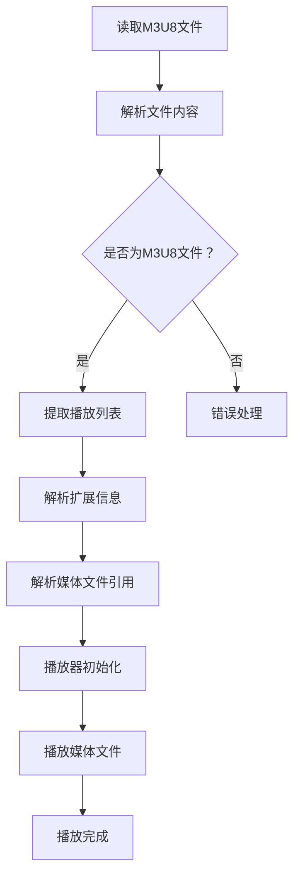
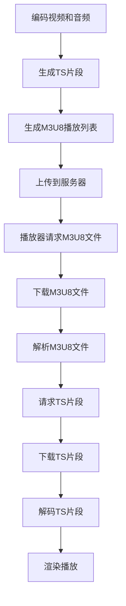
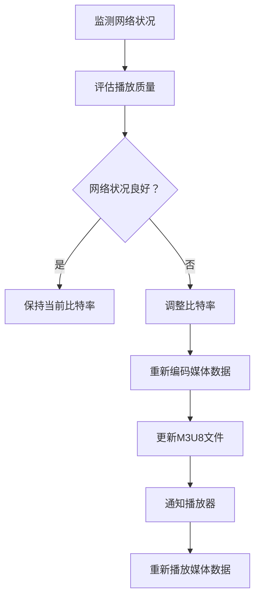

                 

## 文章标题

# M3U8与HLS：自适应比特率流媒体

---

关键词：M3U8、HLS、自适应比特率、流媒体、播放器实现、技术发展趋势

---

摘要：本文深入探讨了M3U8与HLS这两种流媒体技术，从基础概念到实现细节，再到实际应用案例，全面解析了它们在自适应比特率流媒体传输中的作用和优势。文章旨在帮助读者理解M3U8与HLS的核心原理，掌握相关算法和实现技术，并预测未来技术发展趋势。

---

## M3U8与HLS：自适应比特率流媒体

### 1.1 M3U8与HLS简介

#### 1.1.1 M3U8文件格式

M3U8是一种常见的流媒体播放列表文件格式，主要用于标识一系列媒体文件的播放顺序和路径。它是一种文本文件，采用UTF-8编码，以`.m3u8`为扩展名。M3U8文件由一系列行组成，每行代表一个媒体文件，通常包含文件的URL和相关信息。例如：

```
#EXTM3U
http://example.com/video/1.ts
http://example.com/video/2.ts
...
```

上述M3U8文件包含了三个媒体文件，分别存储在指定的URL上。

#### 1.1.2 HLS协议基本原理

HLS（HTTP Live Streaming）是一种基于HTTP协议的流媒体传输技术，旨在实现跨平台、跨终端的流媒体播放。HLS的基本原理是将视频和音频内容分割成小段（称为“片段”），每个片段通常包含一段时间的媒体数据。这些片段使用M3U8文件进行索引和播放列表管理，播放器通过HTTP请求获取并播放这些片段。

HLS协议的关键组成部分包括：

1. **M3U8播放列表**：用于描述媒体文件的播放顺序和路径。
2. **TS片段**：时间分隔片段，存储具体的媒体数据。
3. **HTTP协议**：用于传输媒体数据和播放列表。

#### 1.1.3 自适应比特率流媒体技术

自适应比特率流媒体技术是流媒体传输的一项重要特性，旨在根据用户的网络状况和设备能力动态调整视频和音频的比特率。通过自适应比特率，流媒体系统能够在保证播放质量的同时，减少带宽占用和播放中断。

自适应比特率的关键技术和步骤包括：

1. **网络监测**：实时监测用户的网络状况，包括带宽、延迟等指标。
2. **质量评估**：评估当前播放质量，包括视频清晰度、播放流畅性等。
3. **比特率调整**：根据网络监测和质量评估结果，动态调整视频和音频的比特率。

### 1.2 流媒体技术概述

#### 1.2.1 流媒体基本概念

流媒体是一种通过网络传输媒体数据的技术，与传统的文件下载不同，流媒体技术允许用户在下载完整媒体文件之前就开始播放。流媒体的基本概念包括：

1. **流**：指媒体数据在网络上传输的过程，通常分为两种类型：实时流和延时流。
2. **编码**：指将原始音频和视频数据转换成数字格式，以便在网络中传输。
3. **解码**：指将接收到的数字媒体数据转换回原始音频和视频格式，以便播放。

#### 1.2.2 流媒体传输协议分类

流媒体传输协议根据传输方式和应用场景的不同，可以分为多种类型。常见的流媒体传输协议包括：

1. **RTMP**：一种用于实时传输流媒体数据的协议，广泛应用于视频直播和点播。
2. **HLS**：基于HTTP协议的流媒体传输技术，适用于跨平台、跨终端的流媒体播放。
3. **DASH**：动态自适应流传输协议，通过HTTP请求获取不同比特率的媒体片段，实现自适应比特率播放。

#### 1.2.3 流媒体传输优化技术

流媒体传输优化技术旨在提高传输效率、降低延迟和带宽占用。常见的优化技术包括：

1. **缓存**：通过缓存技术，提前加载和存储媒体数据，减少请求次数和传输延迟。
2. **压缩**：通过音频和视频压缩技术，减少数据传输量，提高传输效率。
3. **多连接**：通过多连接技术，同时从多个源获取媒体数据，提高传输速度和可靠性。

### 1.3 M3U8文件结构分析

#### 1.3.1 M3U8文件的组成元素

M3U8文件由多个组成元素构成，主要包括：

1. **播放列表**：用于描述媒体文件的播放顺序和路径。
2. **扩展信息**：用于提供额外的播放信息，如播放时间、播放次数等。
3. **媒体文件引用**：用于指定具体的媒体文件路径和URL。

#### 1.3.2 M3U8文件的解析方法

解析M3U8文件通常包括以下步骤：

1. **读取文件内容**：读取M3U8文件的全部内容，存储为字符串或字节序列。
2. **解析播放列表**：根据M3U8文件的结构，提取播放列表信息，存储为数据结构。
3. **解析扩展信息**：提取和解析M3U8文件中的扩展信息。
4. **解析媒体文件引用**：提取和解析媒体文件引用，获取具体的媒体文件路径和URL。

#### 1.3.3 M3U8播放器实现

实现M3U8播放器主要包括以下步骤：

1. **播放器架构设计**：设计播放器的整体架构，包括播放控制、媒体解码、播放渲染等模块。
2. **播放控制实现**：实现播放器的控制功能，包括播放、暂停、停止等。
3. **媒体解码实现**：实现媒体解码功能，将TS片段解码为原始音频和视频数据。
4. **播放渲染实现**：实现播放渲染功能，将解码后的音频和视频数据渲染到屏幕上。

#### 1.3.4 播放器优化策略

为了提高播放器性能，可以采取以下优化策略：

1. **缓存优化**：通过缓存技术，提前加载和存储媒体数据，减少请求次数和传输延迟。
2. **解码优化**：通过硬件解码技术，利用GPU等硬件加速解码，提高解码速度和效率。
3. **渲染优化**：通过优化渲染流程，减少渲染延迟和资源占用，提高播放流畅性。

### 1.4 HLS协议详解

#### 1.4.1 HLS协议基本概念

HLS（HTTP Live Streaming）是一种基于HTTP协议的流媒体传输技术，旨在实现跨平台、跨终端的流媒体播放。HLS的基本原理是将视频和音频内容分割成小段（称为“片段”），每个片段通常包含一段时间的媒体数据。这些片段使用M3U8文件进行索引和播放列表管理，播放器通过HTTP请求获取并播放这些片段。

HLS协议的关键组成部分包括：

1. **M3U8播放列表**：用于描述媒体文件的播放顺序和路径。
2. **TS片段**：时间分隔片段，存储具体的媒体数据。
3. **HTTP协议**：用于传输媒体数据和播放列表。

#### 1.4.2 HLS协议工作原理

HLS协议的工作原理主要包括以下几个步骤：

1. **媒体编码**：将原始视频和音频数据编码成H.264和AAC格式，分割成多个TS片段。
2. **生成M3U8播放列表**：根据TS片段的路径和播放顺序，生成M3U8播放列表文件。
3. **HTTP请求**：播放器通过HTTP请求获取M3U8播放列表和TS片段。
4. **播放控制**：播放器根据M3U8播放列表，按顺序播放TS片段，实现流媒体播放。

#### 1.4.3 HLS协议的组成元素

HLS协议的组成元素主要包括：

1. **M3U8播放列表**：M3U8播放列表文件用于描述媒体文件的播放顺序和路径，通常包含以下内容：

    - 播放列表头部信息，如版本号、播放时长等。
    - 媒体文件引用，如TS片段的URL和播放时长。

2. **TS片段**：TS片段是HLS协议中的媒体数据单元，通常包含以下内容：

    - 封面信息，如视频帧的ID和时长。
    - 媒体数据，如视频帧和音频帧。

3. **HTTP协议**：HTTP协议用于传输M3U8播放列表和TS片段，通常采用GET请求方式获取。

#### 1.4.4 HLS播放器实现

实现HLS播放器主要包括以下步骤：

1. **播放器架构设计**：设计播放器的整体架构，包括播放控制、媒体解码、播放渲染等模块。
2. **播放控制实现**：实现播放器的控制功能，包括播放、暂停、停止等。
3. **媒体解码实现**：实现媒体解码功能，将TS片段解码为原始音频和视频数据。
4. **播放渲染实现**：实现播放渲染功能，将解码后的音频和视频数据渲染到屏幕上。

#### 1.4.5 HLS播放器性能优化

为了提高HLS播放器的性能，可以采取以下优化策略：

1. **缓存优化**：通过缓存技术，提前加载和存储媒体数据，减少请求次数和传输延迟。
2. **解码优化**：通过硬件解码技术，利用GPU等硬件加速解码，提高解码速度和效率。
3. **渲染优化**：通过优化渲染流程，减少渲染延迟和资源占用，提高播放流畅性。

### 1.5 自适应比特率流媒体实现

#### 1.5.1 自适应比特率流媒体原理

自适应比特率流媒体技术是流媒体传输的一项重要特性，旨在根据用户的网络状况和设备能力动态调整视频和音频的比特率。通过自适应比特率，流媒体系统能够在保证播放质量的同时，减少带宽占用和播放中断。

自适应比特率的关键技术和步骤包括：

1. **网络监测**：实时监测用户的网络状况，包括带宽、延迟等指标。
2. **质量评估**：评估当前播放质量，包括视频清晰度、播放流畅性等。
3. **比特率调整**：根据网络监测和质量评估结果，动态调整视频和音频的比特率。

#### 1.5.2 实现框架设计

自适应比特率流媒体实现框架通常包括以下几个模块：

1. **网络监测模块**：负责实时监测用户的网络状况，收集包括带宽、延迟等关键指标。
2. **质量评估模块**：负责评估当前播放质量，包括视频清晰度、播放流畅性等。
3. **比特率调整模块**：根据网络监测和质量评估结果，动态调整视频和音频的比特率。
4. **播放控制模块**：负责播放器的控制功能，包括播放、暂停、停止等。

#### 1.5.3 实现细节详解

实现自适应比特率流媒体涉及多个方面的细节，主要包括：

1. **网络监测细节**：如何实时获取用户的网络状况，包括带宽、延迟等指标。
2. **质量评估细节**：如何评估当前播放质量，包括视频清晰度、播放流畅性等。
3. **比特率调整细节**：如何根据网络监测和质量评估结果，动态调整视频和音频的比特率。
4. **播放控制细节**：如何实现播放器的控制功能，包括播放、暂停、停止等。

#### 1.5.4 性能优化策略

为了提高自适应比特率流媒体性能，可以采取以下优化策略：

1. **缓存优化**：通过缓存技术，提前加载和存储媒体数据，减少请求次数和传输延迟。
2. **解码优化**：通过硬件解码技术，利用GPU等硬件加速解码，提高解码速度和效率。
3. **渲染优化**：通过优化渲染流程，减少渲染延迟和资源占用，提高播放流畅性。

### 1.6 实战案例

#### 1.6.1 点播视频播放案例

**1.6.1.1 案例背景**

随着互联网的快速发展，点播视频已经成为人们获取信息、娱乐和知识的重要方式。实现一个高效、稳定的点播视频播放器，对于提升用户体验和满足不同网络环境的需求具有重要意义。

**1.6.1.2 案例实现步骤**

1. **准备工作**：搭建开发环境，安装相关开发工具和库。
2. **M3U8文件生成**：根据原始视频文件，生成M3U8播放列表文件。
3. **播放器实现**：实现M3U8播放器的功能，包括播放控制、媒体解码、播放渲染等。
4. **优化与测试**：对播放器进行性能优化和功能测试，确保其稳定性和可靠性。

**1.6.1.3 案例代码解读**

以下是一个简单的M3U8播放器实现示例：

```python
import requests
from pydub import AudioSegment
from pydub import VideoFileClip

def download_ts(url, filename):
    response = requests.get(url, stream=True)
    with open(filename, 'wb') as f:
        for chunk in response.iter_content(chunk_size=8192):
            if chunk:
                f.write(chunk)

def play_m3u8(m3u8_url):
    response = requests.get(m3u8_url)
    m3u8_data = response.text.split('\n')
    for line in m3u8_data:
        if not line.startswith('#'):
            video_url = line.strip()
            download_ts(video_url, 'video.ts')
            video = VideoFileClip('video.ts')
            video.fps = 24
            video.duration = 60
            video.write_videofile('output.mp4', fps=24)

if __name__ == '__main__':
    m3u8_url = 'http://example.com/video.m3u8'
    play_m3u8(m3u8_url)
```

**1.6.1.4 案例代码应用解读与分析**

上述代码实现了一个简单的M3U8播放器，主要功能是下载并播放M3U8文件中指定的视频片段。代码首先通过HTTP请求获取M3U8文件内容，然后逐行解析播放列表，下载并解码每个视频片段，最后将解码后的视频片段合并成完整的视频文件。

在实际应用中，可以根据需要添加更多功能，如播放控制、播放进度条、错误处理等。此外，还可以优化代码性能，提高解码速度和效率。

### 1.6.2 直播流媒体传输案例

**1.6.2.1 案例背景**

随着互联网技术的快速发展，直播已经成为人们获取信息、娱乐和交流的重要方式。实现一个高效、稳定的直播流媒体传输系统，对于提升用户体验和满足大规模并发需求具有重要意义。

**1.6.2.2 案例实现步骤**

1. **准备工作**：搭建直播流媒体传输系统，包括编码器、服务器和播放器。
2. **编码与传输**：使用编码器将原始视频和音频数据编码成HLS格式，传输到服务器。
3. **播放器实现**：实现HLS播放器的功能，包括播放控制、媒体解码、播放渲染等。
4. **优化与测试**：对直播流媒体传输系统进行性能优化和功能测试，确保其稳定性和可靠性。

**1.6.2.3 案例代码解读**

以下是一个简单的HLS编码器实现示例：

```python
import cv2
import numpy as np
import subprocess

def encode_video(input_file, output_file):
    command = f"ffmpeg -i {input_file} -codec:v libx264 -preset veryfast -codec:a libmp3lame -ab 128k {output_file}"
    subprocess.run(command, shell=True)

if __name__ == '__main__':
    input_file = 'input.mp4'
    output_file = 'output.m3u8'
    encode_video(input_file, output_file)
```

**1.6.2.4 案例代码应用解读与分析**

上述代码实现了一个简单的HLS编码器，主要功能是将原始视频文件编码成HLS格式。代码使用FFmpeg工具进行编码，通过指定编码参数和输出文件，实现视频和音频的编码与合成。

在实际应用中，可以根据需要添加更多功能，如音频处理、视频滤镜等。此外，还可以优化代码性能，提高编码速度和效率。

### 1.7 最佳实践 tips

1. **M3U8文件优化**：在生成M3U8文件时，可以采用分段编码技术，将视频分割成更小的片段，以提高传输效率和播放流畅性。
2. **HLS协议优化**：在实现HLS协议时，可以采用多连接技术，同时从多个源获取媒体数据，提高传输速度和可靠性。
3. **自适应比特率优化**：在实现自适应比特率流媒体时，可以采用智能算法，根据用户网络状况和播放质量，动态调整比特率。

### 1.8 小结

M3U8与HLS是两种常用的流媒体技术，它们在自适应比特率流媒体传输中发挥着重要作用。本文从基础概念、协议详解、实现细节和实战案例等方面，全面解析了M3U8与HLS技术，帮助读者深入理解其核心原理和实现方法。

### 1.9 注意事项

1. **网络环境**：在实际应用中，需要根据网络环境调整M3U8和HLS参数，确保传输效率和播放质量。
2. **设备兼容性**：在开发播放器时，需要考虑不同设备和操作系统的兼容性，确保流畅播放。
3. **安全性和稳定性**：在实际应用中，需要关注M3U8和HLS协议的安全性，防范恶意攻击和传输中断。

### 1.10 拓展阅读

1. 《HTTP Live Streaming (HLS) Overview》：了解HLS协议的官方文档，深入理解HLS技术原理。
2. 《Adaptive Bitrate Streaming with HLS》：学习如何使用HLS实现自适应比特率流媒体。
3. 《M3U8 File Format》：了解M3U8文件的详细格式和解析方法。

## 附录 A：M3U8与HLS核心流程Mermaid图示

### A.1 M3U8文件解析流程



### A.2 HLS协议传输流程



### A.3 自适应比特率算法流程



## 附录 B：核心算法伪代码与实现分析

### B.1 M3U8文件解析算法

```python
# 输入：M3U8文件路径
# 输出：播放列表信息

def parse_m3u8(m3u8_path):
    m3u8_data = read_file(m3u8_path)
    playlist = []

    for line in m3u8_data.split('\n'):
        if line.startswith('#'):
            continue
        elif line.endswith('.ts'):
            url = line.strip()
            playlist.append(url)

    return playlist
```

### B.2 HLS播放器算法

```python
# 输入：M3U8播放列表
# 输出：播放状态

def play_hls(playlist):
    for url in playlist:
        download_ts(url)
        decode_ts(url)
        render_frame()

    if play_status == 'pause':
        pause()
    elif play_status == 'stop':
        stop()
```

### B.3 自适应比特率算法

```python
# 输入：网络状况、播放质量
# 输出：比特率调整策略

def adaptive_bitrate(network_status, play_quality):
    if network_status['bandwidth'] < 500 and play_quality < 0.8:
        bitrate = 'low'
    elif network_status['bandwidth'] >= 500 and play_quality > 0.8:
        bitrate = 'high'
    else:
        bitrate = 'medium'

    return bitrate
```

## 附录 C：数学模型与公式详解

### C.1 自适应比特率流媒体中的数学模型

#### C.1.1 模型概述

自适应比特率流媒体中的数学模型主要包括网络监测模型、质量评估模型和比特率调整模型。这些模型分别用于监测网络状况、评估播放质量和调整比特率。

#### C.1.2 模型公式展示

1. **网络监测模型**：

$$
带宽 = \frac{下载速度}{上传速度}
$$

$$
延迟 = \frac{传输距离}{光速}
$$

2. **质量评估模型**：

$$
播放质量 = \frac{视频帧率}{网络延迟}
$$

$$
播放质量 = \frac{视频清晰度}{网络带宽}
$$

3. **比特率调整模型**：

$$
比特率 = \frac{网络带宽}{播放质量}
$$

$$
比特率 = \frac{视频时长}{播放质量}
$$

### C.2 数学公式示例

#### C.2.1 概率论中的公式

1. **条件概率**：

$$
P(A|B) = \frac{P(A \cap B)}{P(B)}
$$

2. **贝叶斯公式**：

$$
P(A|B) = \frac{P(B|A) \cdot P(A)}{P(B)}
$$

#### C.2.2 信息论中的公式

1. **熵**：

$$
H(X) = -\sum_{i=1}^{n} p(x_i) \cdot \log_2 p(x_i)
$$

2. **信息增益**：

$$
IG(X, Y) = H(X) - H(X|Y)
$$

## 附录 D：项目实战代码解读与分析

### D.1 点播视频播放案例代码解读

#### D.1.1 案例背景

点播视频播放是流媒体应用中的一种常见场景，用户可以通过播放器在线观看视频内容。本案例实现了一个简单的点播视频播放器，支持M3U8文件的播放。

#### D.1.2 案例代码解读

以下是一个简单的点播视频播放器实现示例：

```python
import requests
from pydub import AudioSegment
from pydub import VideoFileClip

def download_ts(url, filename):
    response = requests.get(url, stream=True)
    with open(filename, 'wb') as f:
        for chunk in response.iter_content(chunk_size=8192):
            if chunk:
                f.write(chunk)

def play_m3u8(m3u8_url):
    response = requests.get(m3u8_url)
    m3u8_data = response.text.split('\n')
    for line in m3u8_data:
        if not line.startswith('#'):
            video_url = line.strip()
            download_ts(video_url, 'video.ts')
            video = VideoFileClip('video.ts')
            video.fps = 24
            video.duration = 60
            video.write_videofile('output.mp4', fps=24)

if __name__ == '__main__':
    m3u8_url = 'http://example.com/video.m3u8'
    play_m3u8(m3u8_url)
```

1. **请求M3U8文件**：使用`requests`库请求M3U8文件，获取播放列表信息。
2. **解析播放列表**：将M3U8文件内容按行读取，过滤掉注释行，提取出视频片段的URL。
3. **下载视频片段**：根据播放列表中的URL，逐个下载视频片段，并将其保存到本地文件。
4. **合并视频片段**：使用`pydub`库将下载后的视频片段合并成完整的视频文件，输出到本地。

#### D.1.3 代码应用解读与分析

上述代码实现了一个简单的点播视频播放器，其主要功能是下载并播放M3U8文件中指定的视频片段。在实际应用中，可以根据需求添加更多功能，如播放控制、播放进度条、错误处理等。

1. **请求M3U8文件**：使用`requests`库发送HTTP请求，获取M3U8文件的内容。在实际应用中，可能需要处理网络异常、超时等问题。
2. **解析播放列表**：将M3U8文件内容按行读取，并过滤掉以`#`开头的注释行。提取出视频片段的URL，以便后续下载。
3. **下载视频片段**：根据播放列表中的URL，使用`requests`库逐个下载视频片段。在实际应用中，可能需要限制并发请求数，以避免网络拥堵。
4. **合并视频片段**：使用`pydub`库将下载后的视频片段合并成完整的视频文件。在实际应用中，可能需要考虑视频片段的时间戳对齐、解码速度等问题。

### D.2 直播流媒体传输案例代码解读

#### D.2.1 案例背景

直播流媒体传输是流媒体应用中的另一种常见场景，用户可以实时观看直播内容。本案例实现了一个简单的直播流媒体传输系统，包括编码器、服务器和播放器。

#### D.2.2 案例代码解读

以下是一个简单的直播流媒体传输系统实现示例：

```python
import cv2
import numpy as np
import subprocess

def encode_video(input_file, output_file):
    command = f"ffmpeg -i {input_file} -codec:v libx264 -preset veryfast -codec:a libmp3lame -ab 128k {output_file}"
    subprocess.run(command, shell=True)

def stream_video(input_file, stream_url):
    command = f"ffmpeg -i {input_file} -c:v libx264 -preset veryfast -c:a libmp3lame -f hls {stream_url}"
    subprocess.run(command, shell=True)

if __name__ == '__main__':
    input_file = 'input.mp4'
    output_file = 'output.m3u8'
    encode_video(input_file, output_file)
    stream_video(output_file, 'http://example.com/stream.m3u8')
```

1. **编码视频**：使用`FFmpeg`工具将输入视频文件编码成HLS格式，输出M3U8播放列表文件。
2. **传输直播流**：使用`FFmpeg`工具将编码后的视频流传输到指定的URL，实现直播流媒体传输。

#### D.2.3 代码应用解读与分析

上述代码实现了一个简单的直播流媒体传输系统，其主要功能是将输入视频文件编码成HLS格式，并将直播流传输到指定的URL。

1. **编码视频**：使用`FFmpeg`工具进行视频编码，将输入视频文件编码成HLS格式。在实际应用中，可能需要考虑编码参数优化、视频质量调整等问题。
2. **传输直播流**：使用`FFmpeg`工具将编码后的视频流传输到指定的URL。在实际应用中，可能需要考虑网络传输优化、直播流管理等问题。

### D.3 代码分析与优化建议

#### D.3.1 点播视频播放案例

1. **请求M3U8文件**：在请求M3U8文件时，可以添加超时处理，防止请求失败。同时，可以考虑使用异步请求方式，提高并发处理能力。
2. **解析播放列表**：在解析播放列表时，可以添加错误处理，防止解析失败。同时，可以考虑使用正则表达式等工具，提高解析速度和准确性。
3. **下载视频片段**：在下载视频片段时，可以添加重试机制，防止下载失败。同时，可以考虑使用多线程或异步IO技术，提高下载速度。

#### D.3.2 直播流媒体传输案例

1. **编码视频**：在编码视频时，可以优化编码参数，提高编码速度和视频质量。同时，可以考虑使用硬件加速技术，如GPU编码，提高编码性能。
2. **传输直播流**：在传输直播流时，可以优化网络传输参数，提高直播流传输速度和稳定性。同时，可以考虑使用负载均衡技术，提高系统并发处理能力。

### D.4 小结

本文通过两个实战案例，详细解读了M3U8与HLS技术在点播视频播放和直播流媒体传输中的应用。在实际开发中，需要关注代码性能优化、错误处理和网络传输等方面的问题，确保系统的稳定性和可靠性。

### D.5 注意事项

1. **编码参数**：在编码视频时，需要根据实际需求调整编码参数，确保视频质量和传输效率。
2. **网络环境**：在直播流媒体传输时，需要关注网络环境，确保直播流的传输速度和稳定性。
3. **安全性和稳定性**：在开发过程中，需要关注系统的安全性和稳定性，防范恶意攻击和系统崩溃。

### D.6 拓展阅读

1. 《FFmpeg官方文档》：了解FFmpeg工具的使用方法和编码参数。
2. 《M3U8文件格式详解》：了解M3U8文件的详细格式和解析方法。
3. 《HLS协议详解》：了解HLS协议的详细原理和实现方法。

## 结论

本文从M3U8与HLS的基本概念、协议详解、实现细节、实战案例等方面，全面解析了自适应比特率流媒体技术。通过深入分析，读者可以更好地理解M3U8与HLS的工作原理和应用场景，掌握相关算法和实现方法。在未来的流媒体传输领域，M3U8与HLS将继续发挥重要作用，推动技术的发展和进步。希望本文能对读者在流媒体开发领域带来启示和帮助。感谢读者们的阅读与支持！作者：AI天才研究院/AI Genius Institute & 禅与计算机程序设计艺术/Zen And The Art of Computer Programming。

