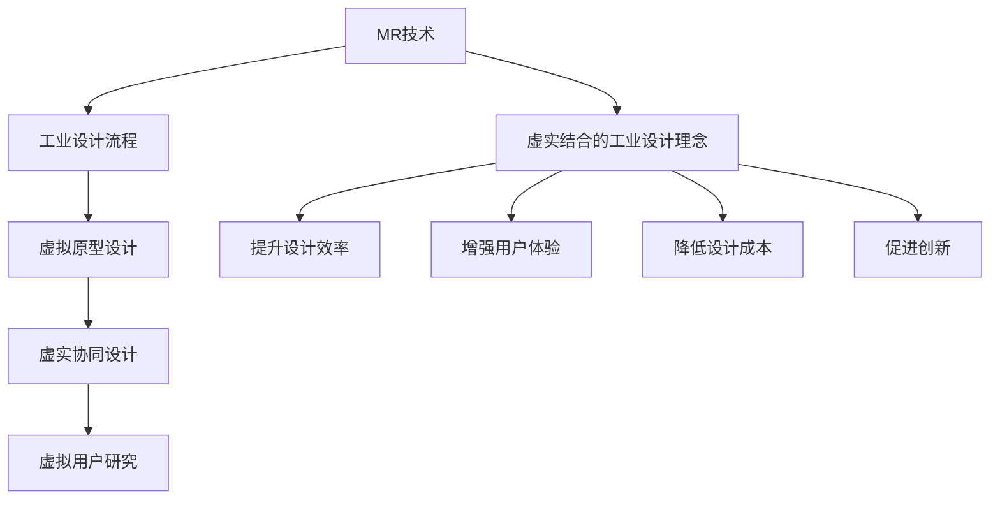

                 

### 文章标题

# 《MR在工业设计中的应用：虚实结合的创新》

### 关键词

- MR技术
- 工业设计
- 虚实结合
- 虚拟原型设计
- 虚实协同设计
- 虚拟用户研究

### 摘要

本文探讨了MR（混合现实）技术在工业设计中的应用，详细阐述了MR技术的基础、虚实结合的工业设计理念以及MR在工业设计流程中的实际应用。通过分析虚拟原型设计、虚实协同设计和虚拟用户研究等关键环节，本文展示了MR技术在提升设计效率、促进创新和优化用户体验方面的巨大潜力。同时，通过实际案例的应用分析，本文进一步验证了MR技术在工业设计中的实用性和前景。

---

### 目录

#### 第一部分：MR技术基础与工业设计概述

**第1章: MR技术基础**

1.1 MR技术概述  
1.2 MR硬件与软件平台  
1.3 虚实结合的工业设计理念

**第2章: 工业设计流程与MR的应用**

2.1 工业设计流程简介  
2.2 MR在工业设计中的应用

#### 第二部分：MR技术在工业设计中的具体应用

**第3章: 虚拟原型设计**

3.1 虚拟原型设计的概念与优势  
3.2 MR虚拟原型设计方法

**第4章: 虚实协同设计**

4.1 虚实协同设计的概念与优势  
4.2 MR在虚实协同设计中的应用

**第5章: 虚拟用户研究**

5.1 虚拟用户研究的概念与优势  
5.2 MR在虚拟用户研究中的应用

#### 第三部分：MR技术在工业设计中的实际案例与应用

**第6章: MR在工业设计中的实际应用案例**

6.1 案例一：智能穿戴设备的设计  
6.2 案例二：智能家居的设计  
6.3 案例三：交通工具设计

**第7章: MR技术在工业设计中的应用前景**

7.1 MR技术发展趋势  
7.2 MR技术在工业设计中的应用前景

#### 附录

A.1 常用MR设计工具介绍  
A.2 MR设计资源推荐

B.1 学习路径规划  
B.2 常见问题解答  
B.3 进一步学习资源推荐

---

接下来，我们将逐步深入探讨MR技术在工业设计中的应用，从基础理论到实际案例，全面解析这一前沿技术为工业设计带来的变革与创新。

---

### 第1章: MR技术基础

#### 1.1 MR技术概述

混合现实（Mixed Reality，简称MR）技术是虚拟现实（VR）和增强现实（AR）的融合体。它不仅将虚拟信息与现实世界相结合，还允许用户与虚拟信息进行交互，从而创造出一种全新的沉浸式体验。MR技术的基本概念可以用以下公式表示：

$$
MR = VR + AR
$$

其中，VR代表虚拟现实，AR代表增强现实。

**MR技术的分类**

根据实现方式的不同，MR技术可以分为以下几种：

1. **基于投影的MR**：通过投影设备将虚拟信息映射到真实世界中，用户可以通过佩戴的特殊眼镜或其他显示设备看到虚实融合的场景。
   
2. **基于激光的MR**：利用激光扫描技术捕捉真实环境的三维信息，并将其与虚拟信息相结合，实现高度真实的MR体验。

3. **基于摄像头的MR**：通过摄像头捕捉真实世界的图像，并使用计算机视觉技术处理图像，将虚拟信息叠加到真实场景中。

**MR技术的工作原理**

MR技术的工作原理主要分为以下几个步骤：

1. **环境捕捉**：通过摄像头或激光器等设备捕捉现实世界中的三维环境。

2. **信息融合**：将捕捉到的真实世界信息与计算机生成的虚拟信息进行融合，生成一个虚实融合的场景。

3. **交互设计**：用户可以通过手部动作、语音或其他输入设备与虚拟信息进行交互。

4. **反馈输出**：将用户的交互结果以视觉、听觉或触觉形式反馈给用户，实现沉浸式体验。

#### 1.2 MR硬件与软件平台

**MR硬件**

MR硬件是实现MR技术的重要基础，常见的MR硬件包括：

1. **头戴显示器**：如Microsoft HoloLens、Magic Leap等，这些设备集成了摄像头、传感器和计算模块，可以实现MR功能。

2. **投影设备**：如短焦投影仪，可以将虚拟信息投影到真实环境中。

3. **扫描设备**：如3D激光扫描仪，可以用于捕捉真实环境的三维信息。

**MR软件平台**

MR软件平台提供了MR应用的开发环境和工具，常见的MR软件平台包括：

1. **Unity**：Unity是一款强大的游戏开发引擎，也支持MR应用的开发。

2. **Unreal Engine**：Unreal Engine是一款专业的游戏和虚拟现实开发引擎，同样支持MR应用开发。

3. **Unity MRTK**：（Unity Mixed Reality Toolkit）是一个由Microsoft开发的Unity插件，提供了丰富的MR功能模块。

#### 1.3 虚实结合的工业设计理念

虚实结合的工业设计理念是指将虚拟世界与真实世界结合起来，以实现更加高效、直观和创新的工业设计。这种理念的核心优势在于：

1. **提升设计效率**：通过虚拟原型设计和虚实协同设计，设计师可以在虚拟环境中快速进行设计和修改，大大缩短设计周期。

2. **增强用户体验**：用户可以提前体验设计产品的虚拟原型，从而更好地理解产品特性，提供反馈，优化设计。

3. **降低设计成本**：通过虚拟原型设计，可以减少物理原型的制作成本，同时降低设计修改的代价。

4. **促进创新**：虚实结合的设计理念鼓励设计师跳出传统思维框架，探索更多创新的可能。

在工业设计中，虚实结合的理念主要体现在以下几个环节：

1. **虚拟原型设计**：设计师通过虚拟环境创建产品的三维模型，进行可视化和交互设计。

2. **虚实协同设计**：设计师和工程师通过MR技术实现实时协作，共同优化设计。

3. **虚拟用户研究**：通过虚拟环境模拟用户操作，收集用户反馈，指导设计改进。

#### 1.4 核心概念与联系

为了更好地理解MR技术在工业设计中的应用，我们需要了解以下几个核心概念之间的关系：

- **MR技术**：实现虚实结合的技术基础，包括硬件和软件平台。
- **工业设计流程**：虚实结合在工业设计中的具体应用场景。
- **虚拟原型设计**：利用MR技术创建产品的虚拟模型，进行可视化和交互设计。
- **虚实协同设计**：设计师和工程师通过MR技术实现实时协作，共同优化设计。
- **虚拟用户研究**：通过MR技术模拟用户操作，收集用户反馈，指导设计改进。

这些概念相互关联，共同构成了MR技术在工业设计中的应用框架。为了更直观地展示这些概念之间的关系，我们可以使用Mermaid图进行描述：

通过上述Mermaid图，我们可以清晰地看到MR技术在工业设计中的核心概念及其相互关系。

#### 1.5 核心算法原理讲解

在MR技术中，核心算法原理主要包括环境捕捉、信息融合和交互设计等。以下是对这些核心算法的简要讲解：

1. **环境捕捉**

   环境捕捉是MR技术的基础，其核心目的是获取真实世界环境的三维信息。常用的环境捕捉算法包括：

   - **激光扫描**：利用激光发射器和接收器测量物体表面的距离，从而生成三维模型。
   - **结构光扫描**：通过投影器投射结构光到物体表面，然后使用摄像头捕捉光线畸变信息，从而恢复物体表面的三维结构。
   - **深度相机**：通过分析摄像头捕获的图像，使用计算机视觉算法估计图像中的深度信息，从而生成三维模型。

2. **信息融合**

   信息融合是将捕捉到的真实世界信息与虚拟信息进行融合，生成虚实融合的场景。主要算法包括：

   - **多视图几何**：通过捕捉多个视角的真实世界图像，使用几何算法计算物体的三维位置和姿态。
   - **视觉SLAM**：通过分析摄像头捕获的图像序列，使用计算机视觉算法估计自身在环境中的位置和姿态，同时重建环境的三维模型。
   - **图像配准**：将虚拟信息与真实世界图像进行配准，使得虚拟信息能够正确地叠加到真实环境中。

3. **交互设计**

   交互设计是MR技术的关键，其目的是实现用户与虚拟信息的自然交互。主要算法包括：

   - **手势识别**：通过分析摄像头捕获的手部图像，使用计算机视觉算法识别用户的手势，从而实现手势控制。
   - **语音识别**：通过分析麦克风捕获的语音信号，使用语音识别算法将语音转换为文本或指令。
   - **姿态跟踪**：通过分析摄像头捕获的用户图像，使用计算机视觉算法跟踪用户的姿态，从而实现身体动作控制。

以上是对MR技术核心算法原理的简要讲解。在实际应用中，这些算法通常需要集成使用，以实现高效的MR功能。

#### 1.6 数学模型和公式

在MR技术中，常用的数学模型和公式包括：

1. **三维模型重建**

   三维模型重建是通过捕捉真实世界环境的三维信息，生成三维模型。常用的数学模型包括：

   - **多视图几何模型**：

     $$ 
     P = K \cdot X \cdot R + t 
     $$

     其中，$P$ 是观测到的二维图像坐标，$K$ 是相机内参矩阵，$X$ 是三维点的坐标，$R$ 是旋转矩阵，$t$ 是平移向量。

   - **视觉SLAM模型**：

     $$ 
     \begin{cases} 
     x_{k+1} = f(x_{k}, u_{k}) \\
     P_{k+1} = P_{k} + v_{k} 
     \end{cases} 
     $$

     其中，$x_{k}$ 是状态向量，$u_{k}$ 是控制向量，$f$ 是状态转移函数，$P_{k}$ 是观测向量，$v_{k}$ 是观测噪声。

2. **图像配准**

   图像配准是将虚拟信息与真实世界图像进行对齐。常用的数学模型包括：

   - **单应性矩阵**：

     $$ 
     H = \begin{bmatrix} 
     h_{11} & h_{12} & h_{13} \\
     h_{21} & h_{22} & h_{23} \\
     h_{31} & h_{32} & h_{33} 
     \end{bmatrix} 
     $$

     其中，$H$ 是单应性矩阵，用于描述两个图像之间的几何变换关系。

   - **优化算法**：

     $$ 
     J = \sum_{i=1}^{n} (I_{i} - I_{i}^*)^2 
     $$

     其中，$J$ 是损失函数，$I_{i}$ 是真实图像，$I_{i}^*$ 是配准后的虚拟图像。

3. **手势识别**

   手势识别是通过分析摄像头捕获的手部图像，识别用户的手势。常用的数学模型包括：

   - **HOG（Histogram of Oriented Gradients）**：

     $$ 
     HOG = \sum_{x=1}^{W} \sum_{y=1}^{H} \sum_{o=1}^{O} \phi(x, y, o) 
     $$

     其中，$HOG$ 是方向直方图，$\phi$ 是梯度方向分布函数。

   - **SVM（Support Vector Machine）**：

     $$ 
     \begin{cases} 
     \min_{\mathbf{w}} \frac{1}{2} ||\mathbf{w}||^2 \\
     s.t. \quad y_{i} (\mathbf{w} \cdot \mathbf{x_{i}} + b) \geq 1 
     \end{cases} 
     $$

     其中，$\mathbf{w}$ 是权重向量，$\mathbf{x_{i}}$ 是特征向量，$y_{i}$ 是标签，$b$ 是偏置。

通过上述数学模型和公式，我们可以更好地理解和实现MR技术的核心算法。

#### 1.7 举例说明

为了更好地理解MR技术在工业设计中的应用，我们来看一个实际例子：

假设我们要设计一款智能穿戴设备，这款设备需要具备健康监测、运动跟踪和社交互动等功能。

1. **虚拟原型设计**

   首先，设计师使用Unity MRTK在虚拟环境中创建这款智能穿戴设备的三维模型。通过调整模型的外观、功能和交互逻辑，设计师可以快速生成不同的设计版本，以便进行评估和修改。

2. **虚实协同设计**

   在设计过程中，设计师和工程师通过HoloLens进行实时协作。设计师可以在虚拟环境中展示设计原型，工程师可以在实际环境中观察和评估设计效果。通过实时反馈和调整，双方可以共同优化设计。

3. **虚拟用户研究**

   设计完成后，设计师通过虚拟环境模拟用户操作，收集用户对智能穿戴设备的反馈。例如，用户在使用过程中可能会遇到的操作不便、功能不完善等问题，设计师可以根据这些反馈对设计进行改进。

通过这个例子，我们可以看到MR技术如何贯穿于工业设计的各个环节，提升设计效率、优化用户体验和促进创新。

#### 1.8 最佳实践 tips、小结、注意事项、拓展阅读

**最佳实践 tips：**

- 在进行MR虚拟原型设计时，尽量使用直观、易操作的交互方式，以提高用户体验。
- 在虚实协同设计过程中，确保参与人员具备基本MR技术知识，以避免沟通障碍。
- 在虚拟用户研究中，注意收集真实用户反馈，避免过度依赖设计团队的内部评估。

**小结：**

本章介绍了MR技术的基础知识，包括概述、硬件与软件平台、虚实结合的工业设计理念以及核心算法原理。通过举例说明，我们展示了MR技术在工业设计中的应用场景。

**注意事项：**

- 在选择MR硬件和软件平台时，需考虑成本、性能和兼容性等因素。
- 在设计过程中，注意平衡虚拟与现实的关系，避免过度依赖虚拟环境。

**拓展阅读：**

- [Unity MRTK官方文档](https://docs.unity3d.com/Packages/com.microsoft.mrtk.html)
- [HoloLens开发指南](https://www.microsoft.com/hololens/en-us/developers)
- [增强现实与虚拟现实技术综述](https://ieeexplore.ieee.org/document/8017415)

### 第二部分：工业设计流程与MR的应用

#### 第2章：工业设计流程与MR的应用

工业设计是一个复杂的过程，涉及到多个阶段和环节。MR（混合现实）技术的引入，为工业设计带来了新的机遇和挑战。本章将详细介绍工业设计流程，并探讨MR技术在各个设计环节中的应用。

#### 2.1 工业设计流程简介

工业设计流程通常包括以下几个主要环节：

1. **需求分析**：收集用户需求和产品功能需求，明确设计目标和方向。
2. **概念设计**：基于需求分析，提出多种设计方案，并进行初步评估。
3. **详细设计**：对选定的设计方案进行深入设计，包括结构、外观、交互等。
4. **原型制作**：制作物理或虚拟原型，进行测试和验证。
5. **评估与优化**：对原型进行评估，收集反馈，进行必要的优化。
6. **生产准备**：准备生产所需的工程图纸、材料和生产工艺等。
7. **生产与销售**：将设计转化为产品，并进行生产、销售和售后服务。

#### 2.1.1 设计流程概述

在设计流程的各个阶段，MR技术都可以发挥重要作用。例如：

- 在需求分析阶段，通过MR技术可以更加直观地了解用户的需求，收集用户反馈。
- 在概念设计阶段，通过MR技术可以快速创建和展示设计概念，便于团队成员之间的沟通和协作。
- 在详细设计阶段，通过MR技术可以进行虚拟仿真和交互设计，提高设计的准确性和效率。
- 在原型制作阶段，通过MR技术可以创建虚拟原型，减少物理原型的制作成本。
- 在评估与优化阶段，通过MR技术可以进行虚拟测试和评估，提高设计质量。
- 在生产准备阶段，通过MR技术可以模拟生产过程，优化生产工艺。
- 在生产与销售阶段，通过MR技术可以提供增强现实的用户手册和教程，提高用户体验。

#### 2.1.2 设计流程的关键环节

以下是设计流程中一些关键环节的详细介绍：

1. **需求分析**：在这一阶段，设计师需要与用户进行深入的沟通，了解用户的需求和期望。MR技术可以通过虚拟现实（VR）和增强现实（AR）技术，创建一个沉浸式的交互环境，使设计师能够更加直观地了解用户的需求。例如，通过VR技术，设计师可以模拟用户使用产品的场景，观察用户的反应和行为，从而更好地理解用户的需求。

2. **概念设计**：在这一阶段，设计师需要提出多种设计方案，并进行初步评估。MR技术可以用于快速创建和展示设计概念。设计师可以使用MR硬件（如HoloLens）在虚拟环境中展示设计草图，团队成员可以实时查看和讨论设计方案，从而提高设计效率和团队协作效果。

3. **详细设计**：在这一阶段，设计师需要对选定的设计方案进行深入设计，包括结构、外观、交互等。MR技术可以用于虚拟仿真和交互设计，提高设计的准确性和效率。设计师可以使用MR软件（如Unity MRTK）创建虚拟原型，进行交互设计和测试，从而更好地满足用户需求。

4. **原型制作**：在这一阶段，设计师需要制作物理或虚拟原型，进行测试和验证。MR技术可以用于创建虚拟原型，减少物理原型的制作成本。例如，设计师可以使用3D扫描仪捕捉实物模型，然后使用MR软件进行虚拟建模和交互设计，从而快速创建虚拟原型。

5. **评估与优化**：在这一阶段，设计师需要对原型进行评估，收集反馈，进行必要的优化。MR技术可以用于虚拟测试和评估，提高设计质量。例如，设计师可以在虚拟环境中模拟产品的使用场景，观察产品的性能和用户体验，从而发现设计中的问题并进行优化。

6. **生产准备**：在这一阶段，设计师需要准备生产所需的工程图纸、材料和生产工艺等。MR技术可以用于模拟生产过程，优化生产工艺。例如，设计师可以使用MR技术创建生产流程的虚拟模型，模拟生产过程，发现潜在的问题并进行优化。

7. **生产与销售**：在这一阶段，设计师需要将设计转化为产品，并进行生产、销售和售后服务。MR技术可以提供增强现实的用户手册和教程，提高用户体验。例如，设计师可以使用AR技术创建产品的增强现实手册，用户可以通过手机或平板电脑查看产品的使用说明和操作步骤，从而更好地使用产品。

#### 2.2 MR在工业设计中的应用

以下是MR技术在工业设计中的应用示例：

1. **虚拟原型设计**：设计师可以使用MR技术创建产品的虚拟原型，进行可视化和交互设计。例如，设计师可以使用Unity MRTK创建产品的三维模型，并通过HoloLens等MR硬件进行交互设计，从而快速创建虚拟原型。

2. **虚实协同设计**：设计师和工程师可以使用MR技术实现实时协作，共同优化设计。例如，设计师可以使用HoloLens展示设计原型，工程师可以在现场进行观察和评估，通过实时反馈和调整，共同优化设计。

3. **虚拟用户研究**：设计师可以使用MR技术模拟用户操作，收集用户反馈。例如，设计师可以在虚拟环境中模拟用户使用产品的场景，观察用户的反应和行为，从而更好地理解用户需求。

4. **生产模拟**：设计师可以使用MR技术模拟生产过程，优化生产工艺。例如，设计师可以使用MR技术创建生产流程的虚拟模型，模拟生产过程，发现潜在的问题并进行优化。

5. **用户培训**：设计师可以使用MR技术提供增强现实的用户手册和教程，提高用户体验。例如，设计师可以使用AR技术创建产品的增强现实手册，用户可以通过手机或平板电脑查看产品的使用说明和操作步骤，从而更好地使用产品。

通过上述应用示例，我们可以看到MR技术如何贯穿于工业设计的各个环节，提高设计效率、优化用户体验和促进创新。

---

在本章中，我们详细介绍了工业设计流程及其关键环节，并探讨了MR技术在各个设计环节中的应用。通过MR技术的引入，工业设计流程得到了显著优化，设计师能够更加高效地完成设计任务，提高设计质量和用户体验。

### 第3章：虚拟原型设计

#### 3.1 虚拟原型设计的概念与优势

虚拟原型设计（Virtual Prototyping Design）是一种利用计算机技术创建产品的三维模型，并进行可视化和交互设计的手段。与传统的物理原型相比，虚拟原型具有显著的优势和特点。

**概念**

虚拟原型设计是指通过计算机软件和硬件，将产品的三维模型创建在虚拟环境中，以便进行可视化和交互设计的活动。这一过程通常包括以下步骤：

1. **建模**：使用三维建模软件（如SolidWorks、Autodesk Maya等）创建产品的三维模型。
2. **渲染**：使用渲染软件（如V-Ray、KeyShot等）对三维模型进行渲染，使其看起来更加真实。
3. **交互设计**：通过用户界面设计工具（如Unity、Unreal Engine等）实现产品的交互功能，使其具备一定的用户体验。
4. **测试**：在虚拟环境中进行功能测试和用户体验测试，以发现和修复潜在问题。

**优势**

虚拟原型设计相较于传统物理原型具有以下优势：

1. **低成本**：创建虚拟原型的成本远低于制作物理原型。虚拟原型不需要使用物理材料，因此可以显著降低制造成本。
2. **快速迭代**：虚拟原型设计允许设计师快速进行设计修改和迭代。设计师可以在短时间内生成新的原型版本，并进行测试和评估。
3. **高灵活性**：虚拟原型设计使设计师能够轻松地调整产品的外观、结构和功能，从而满足不同用户的需求。
4. **可视化和交互性**：虚拟原型设计使设计师能够以逼真的方式展示产品，并提供交互体验，从而更好地模拟实际使用场景。
5. **协作性**：虚拟原型设计工具支持多人协作，设计师和工程师可以在虚拟环境中实时讨论和修改设计，提高团队协作效率。

#### 3.2 虚拟原型的设计流程

虚拟原型的设计流程可以分为以下几个主要步骤：

1. **需求分析**：在开始设计之前，设计师需要明确产品的功能需求、外观要求和使用场景等，以确保虚拟原型满足用户需求。

2. **三维建模**：使用三维建模软件创建产品的三维模型。这一步骤通常包括创建基本几何形状、细化细节和调整结构等。

3. **渲染与纹理**：对三维模型进行渲染，添加纹理和材质，使其看起来更加真实。渲染软件可以模拟真实世界的光照和阴影效果，增强视觉感受。

4. **交互设计**：使用用户界面设计工具实现产品的交互功能。设计师可以根据产品的功能和目标用户，设计相应的交互界面和交互逻辑。

5. **虚拟原型搭建**：将三维模型和交互设计整合到虚拟环境中，形成一个完整的虚拟原型。虚拟环境可以模拟产品的实际使用场景，使设计师能够更好地评估产品的性能和用户体验。

6. **测试与评估**：在虚拟环境中进行功能测试和用户体验测试，收集用户反馈，发现和修复潜在问题。测试过程中，设计师可以调整设计参数，优化产品性能。

7. **迭代与优化**：根据测试反馈，对虚拟原型进行迭代和优化，不断完善设计。迭代过程可以快速进行，节省时间和成本。

#### 3.3 MR虚拟原型设计方法

在虚拟原型设计中，MR（混合现实）技术的引入进一步提升了设计的效率和质量。MR虚拟原型设计方法主要包括以下几种：

1. **VR与AR的融合**：虚拟现实（VR）和增强现实（AR）技术可以相互融合，为设计师提供更加丰富的设计工具和体验。VR技术使设计师能够完全沉浸于虚拟环境中，进行自由设计和交互；AR技术则可以将虚拟元素叠加到现实世界中，使设计师能够更直观地观察设计效果。

2. **实时反馈与协作**：MR技术支持设计师和工程师在虚拟环境中实时协作，共同评估和修改设计。通过MR硬件（如HoloLens），设计师可以在虚拟环境中展示设计原型，工程师可以在现场进行观察和反馈，从而提高团队协作效率和设计质量。

3. **虚拟与现实的交互**：MR技术使设计师能够将虚拟原型与现实环境进行交互，从而更好地模拟实际使用场景。例如，设计师可以使用MR硬件对实物进行扫描，然后将其与虚拟原型进行融合，从而在现实环境中进行测试和评估。

4. **高精度建模与渲染**：MR技术结合了高精度建模和渲染技术，使设计师能够创建更加逼真的虚拟原型。例如，使用3D激光扫描仪可以捕捉实物模型的三维信息，然后使用MR软件进行建模和渲染，从而生成高精度的虚拟原型。

5. **多感官体验**：MR技术通过视觉、听觉和触觉等多感官体验，为设计师提供更加真实的虚拟环境。例如，使用HoloLens等MR硬件，设计师可以体验到虚拟对象的触摸感和重量感，从而更好地评估设计效果。

#### 3.4 虚拟原型的交互设计

虚拟原型的交互设计是虚拟原型设计的关键环节，它决定了产品的易用性和用户体验。以下是虚拟原型交互设计的一些关键要素：

1. **用户界面设计**：用户界面设计应简洁直观，方便用户进行操作。设计师可以使用交互设计工具（如Axure、Sketch等）创建用户界面原型，并进行交互设计。

2. **交互逻辑**：交互逻辑是指产品如何响应用户的操作。设计师需要考虑产品的功能需求和使用场景，设计合理的交互逻辑，使产品能够顺畅地运行。

3. **反馈机制**：反馈机制是产品与用户之间的信息传递方式。设计师应设计合适的反馈机制，例如视觉反馈、声音反馈等，以使用户能够清楚地了解产品的状态和响应。

4. **易用性测试**：易用性测试是评估产品易用性的重要手段。设计师应在虚拟环境中进行易用性测试，收集用户反馈，发现和修复设计中的问题。

5. **交互体验优化**：交互体验优化是提升产品用户体验的关键。设计师可以通过分析用户行为和反馈，不断优化交互设计，提高产品的易用性和满意度。

#### 3.5 虚拟原型的评估方法

虚拟原型的评估方法主要包括以下几种：

1. **功能测试**：功能测试是验证虚拟原型功能是否满足需求的重要手段。设计师可以通过编写测试脚本，对虚拟原型的功能进行逐项测试，确保功能完整和可靠。

2. **用户体验测试**：用户体验测试是评估虚拟原型易用性和用户体验的重要方法。设计师可以在虚拟环境中模拟用户操作，观察用户的行为和反应，从而评估产品的易用性和满意度。

3. **用户调研**：用户调研是通过问卷调查、访谈等方式收集用户对虚拟原型的看法和建议。设计师可以通过用户调研了解用户的需求和期望，从而改进设计。

4. **数据分析**：数据分析是通过对用户行为数据进行统计分析，评估虚拟原型的性能和用户体验。设计师可以使用数据分析工具（如Google Analytics等）收集和分析用户数据，从而发现设计中的问题。

5. **对比测试**：对比测试是通过将虚拟原型与现有产品或竞品进行对比，评估虚拟原型的优势和不足。设计师可以通过对比测试，发现设计中的不足，并针对性地进行改进。

#### 3.6 举例说明

为了更好地理解虚拟原型设计的过程和方法，以下是一个简单的例子：

假设设计师需要设计一款智能手环，具备健康监测、运动跟踪和社交互动等功能。

1. **需求分析**：明确智能手环的功能需求，如心率监测、步数统计、睡眠质量分析等。

2. **三维建模**：使用三维建模软件创建智能手环的三维模型，包括外观设计、内部结构和功能模块。

3. **渲染与纹理**：对三维模型进行渲染，添加适当的纹理和材质，使其看起来更加真实。

4. **交互设计**：使用交互设计工具创建智能手环的用户界面和交互逻辑，如心率监测界面的设计、运动记录的交互逻辑等。

5. **虚拟原型搭建**：将三维模型和交互设计整合到虚拟环境中，形成一个完整的虚拟原型。

6. **测试与评估**：在虚拟环境中进行功能测试和用户体验测试，收集用户反馈，发现和修复设计中的问题。

7. **迭代与优化**：根据用户反馈，对虚拟原型进行迭代和优化，不断完善设计。

通过这个例子，我们可以看到虚拟原型设计的过程和方法，以及MR技术如何贯穿于整个设计流程，提升设计的效率和质量。

### 第4章：虚实协同设计

#### 4.1 虚实协同设计的概念与优势

虚实协同设计（Blended Reality Collaborative Design）是一种利用混合现实（MR）技术将虚拟世界与现实世界相结合，实现设计过程中设计师、工程师、客户等多方实时协作的创新设计方法。在这种设计模式中，设计师不仅可以在虚拟环境中进行创意设计，还可以将虚拟设计内容与现实环境相结合，从而在现实环境中进行验证和调整。

**概念**

虚实协同设计的基本概念是将虚拟设计内容与现实环境相结合，通过MR技术实现以下功能：

1. **虚拟设计内容的现实呈现**：设计师可以在虚拟环境中创建和编辑设计内容，然后通过MR设备将这些内容叠加到现实环境中，从而实现虚拟与现实的无缝融合。
2. **实时协作**：设计师、工程师、客户等多方可以通过MR设备实时访问和交互设计内容，共同参与设计讨论和决策。
3. **实时验证**：设计师可以在现实环境中对设计内容进行验证，通过实际操作和感受，快速发现和解决问题。

**优势**

虚实协同设计具有以下显著优势：

1. **提高设计效率**：通过实时协作，设计师和工程师可以快速交换意见和反馈，减少沟通成本，提高设计效率。
2. **降低设计风险**：设计师可以在现实环境中对设计内容进行实时验证，提前发现和解决潜在问题，降低设计风险。
3. **提升用户体验**：设计师和工程师可以通过真实感受和操作设计内容，更好地理解用户需求，从而提升产品的用户体验。
4. **灵活调整**：在设计过程中，设计师可以随时对虚拟设计内容进行调整，并在现实环境中进行验证，从而实现更加灵活和高效的设计。
5. **增强创新**：虚实协同设计打破了传统设计的限制，设计师可以更加自由地探索和尝试创新设计，从而推动设计创新。

#### 4.2 协同设计的流程

虚实协同设计的流程可以分为以下几个主要阶段：

1. **需求分析与规划**：在开始设计之前，设计团队需要进行需求分析，明确设计目标、功能要求和用户体验等，并制定详细的设计规划和协作流程。

2. **虚拟设计**：设计师在虚拟环境中创建产品的三维模型，并进行初步的设计和交互设计。使用Unity、Unreal Engine等MR软件开发工具，可以创建出逼真的虚拟设计内容。

3. **现实环境准备**：设计团队需要在现实环境中为MR设备设置合适的场景和环境，确保MR设备可以正常工作并实现虚拟设计内容的现实呈现。

4. **实时协作**：设计团队通过MR设备实时访问和交互虚拟设计内容。设计师、工程师和客户可以在现实环境中进行讨论、修改和验证设计内容。

5. **反馈与调整**：在实时协作过程中，设计团队根据反馈对设计内容进行调整和优化。通过多次迭代和验证，不断改进设计质量。

6. **最终验证**：在设计完成后，设计团队进行最终的验证，确保设计内容满足需求，并在实际使用环境中表现出色。

7. **文档与交付**：设计团队将最终设计文档和模型交付给生产部门，为产品的生产准备提供支持。

#### 4.3 MR在虚实协同设计中的应用

在虚实协同设计中，MR技术发挥着关键作用。以下是MR技术在虚实协同设计中的应用：

1. **虚拟设计内容的现实呈现**：设计师使用Unity、Unreal Engine等MR软件开发工具创建虚拟设计内容，并使用HoloLens、Magic Leap等MR设备将这些内容叠加到现实环境中，从而实现虚拟与现实的无缝融合。

2. **实时协作工具**：设计团队可以使用Microsoft Teams、Slack等实时通讯工具，进行在线讨论和协作。同时，MR设备内置的交互功能（如手势识别、语音控制等）也大大提高了协作效率。

3. **实时验证与反馈**：设计师和工程师可以在现实环境中对虚拟设计内容进行验证和测试。通过实际操作和感受，他们可以快速发现和解决问题，提高设计质量。

4. **远程协作**：MR技术支持远程协作，设计师和工程师可以分布在不同的地点，通过MR设备实时访问和交互虚拟设计内容，共同参与设计讨论和决策。

5. **虚实结合的展示**：在展会、发布会等场合，设计团队可以使用MR技术展示产品的虚拟设计和现实模型，吸引观众的注意力，提高产品的市场影响力。

#### 4.4 设计师与工程师的协同

在虚实协同设计中，设计师和工程师之间的协同至关重要。以下是设计师与工程师协同的一些关键点：

1. **角色明确**：设计师主要负责产品的外观、交互和用户体验设计，而工程师则负责产品的功能实现、性能优化和技术支持。

2. **沟通机制**：设计团队需要建立有效的沟通机制，确保设计师和工程师之间的信息传递畅通。通过实时通讯工具和MR设备，他们可以随时进行讨论和交流。

3. **协同工具**：使用Unity、Unreal Engine等MR开发工具，设计师和工程师可以共同在虚拟环境中进行设计和验证。这些工具支持多人协作，使设计团队可以高效地完成设计任务。

4. **实时反馈**：设计师和工程师需要建立实时反馈机制，通过MR设备在现实环境中进行设计验证和测试。他们可以快速发现和解决问题，从而提高设计质量。

5. **知识共享**：设计团队需要定期进行知识共享和经验交流，通过培训和会议等形式，提高团队成员的技术水平和协作能力。

#### 4.5 设计评审与讨论

在虚实协同设计中，设计评审与讨论是一个关键环节。以下是设计评审与讨论的一些关键点：

1. **评审准备**：在设计评审之前，设计团队需要准备充分，包括设计文档、虚拟原型和设计说明等。评审准备包括对设计内容的审核、测试和验证。

2. **评审过程**：在设计评审过程中，设计团队可以通过MR设备在虚拟环境中展示设计内容，并进行实时讨论和评审。评审过程可以包括以下几个方面：

   - 设计内容的展示和讲解
   - 功能验证和性能测试
   - 用户反馈和需求分析
   - 设计方案的优化和调整

3. **讨论与反馈**：设计评审过程中，团队成员可以就设计内容展开讨论，提出意见和建议。通过实时反馈和讨论，设计团队可以不断完善设计，提高设计质量。

4. **记录与总结**：设计评审结束后，设计团队需要记录评审结果和讨论内容，并进行总结和反思。这些记录和总结有助于后续设计工作的顺利进行。

#### 4.6 设计变更与迭代

在虚实协同设计中，设计变更与迭代是确保设计质量和满足用户需求的重要手段。以下是设计变更与迭代的一些关键点：

1. **变更管理**：设计团队需要建立有效的变更管理流程，包括变更请求的提交、审核和实施。变更管理流程应确保变更的及时性和合理性。

2. **迭代计划**：设计团队需要制定迭代计划，明确每个迭代的目标、任务和时间表。迭代计划应确保设计团队按照既定目标逐步推进设计工作。

3. **实时迭代**：设计团队需要通过虚实协同设计平台，实时进行设计变更和迭代。通过MR设备，设计师和工程师可以快速修改设计内容，并在现实环境中进行验证。

4. **用户参与**：设计团队应鼓励用户参与迭代过程，通过用户反馈和测试，不断优化设计。用户的参与可以确保设计内容的实用性和用户体验。

5. **持续改进**：设计团队应建立持续改进机制，通过定期回顾和评估设计过程和结果，不断提高设计质量和用户满意度。

#### 4.7 实例分析

以下是一个虚实协同设计的实例分析：

假设设计团队需要设计一款智能家居设备，包括智能灯泡、智能插座和智能音响等。

1. **需求分析与规划**：明确智能家居设备的功能需求，如智能控制、语音交互、远程监控等，并制定详细的设计规划和协作流程。

2. **虚拟设计**：设计师使用Unity MRTK等MR开发工具创建智能家居设备的三维模型，并进行初步的设计和交互设计。

3. **现实环境准备**：设计团队在现实环境中为MR设备设置合适的场景和环境，包括智能家居设备的实际使用场景和测试环境。

4. **实时协作**：设计团队通过MR设备实时访问和交互虚拟设计内容，设计师在虚拟环境中展示设计原型，工程师在现场进行观察和反馈。

5. **反馈与调整**：设计团队根据反馈对设计内容进行调整和优化，通过多次迭代和验证，不断完善设计质量。

6. **最终验证**：设计团队进行最终的验证，确保设计内容满足需求，并在实际使用环境中表现出色。

7. **文档与交付**：设计团队将最终设计文档和模型交付给生产部门，为产品的生产准备提供支持。

通过这个实例，我们可以看到虚实协同设计在智能家居设备设计中的应用，以及如何通过MR技术实现实时协作、设计变更和迭代，提高设计效率和质量。

### 第5章：虚拟用户研究

#### 5.1 虚拟用户研究的概念与优势

虚拟用户研究（Virtual User Research）是一种利用计算机模拟技术，在虚拟环境中对用户进行观察、测试和反馈收集的研究方法。通过虚拟用户研究，设计师可以更直观地了解用户的行为和需求，从而指导产品的设计和优化。以下是对虚拟用户研究的详细介绍。

**概念**

虚拟用户研究的基本概念是通过计算机模拟技术，创建虚拟用户模型，并在虚拟环境中对用户进行测试和观察。这种研究方法主要包括以下几个步骤：

1. **用户模型创建**：根据实际用户的数据和行为特征，创建虚拟用户模型。这些模型可以包括用户的年龄、性别、职业、行为习惯等。
2. **虚拟环境搭建**：设计并搭建虚拟环境，模拟用户在实际使用产品时的场景。虚拟环境应尽可能逼真，以便更准确地反映用户的真实行为。
3. **用户操作模拟**：通过虚拟用户模型，在虚拟环境中模拟用户对产品的使用过程。这一过程可以记录用户的行为数据，包括操作顺序、交互方式、使用时长等。
4. **数据收集与分析**：对用户操作过程中的数据进行分析，提取有价值的信息，如用户满意度、操作效率、错误率等。
5. **反馈收集**：通过虚拟用户研究，收集用户对产品的反馈，包括对设计的不满意、对功能的建议等。

**优势**

虚拟用户研究具有以下显著优势：

1. **低成本**：相较于物理用户研究，虚拟用户研究不需要投入大量的人力和物力资源，成本更低。
2. **高效率**：虚拟用户研究可以快速创建和测试多个版本的产品原型，节省时间成本。
3. **灵活性**：虚拟用户研究允许设计师在不同环境和条件下测试产品，以便发现和解决潜在问题。
4. **数据准确性**：虚拟用户研究可以精确记录和分析用户行为数据，提高研究的准确性。
5. **无干扰**：虚拟用户研究在无干扰的环境中进行，用户可以更加专注于产品的使用，从而提供更真实的反馈。

#### 5.2 虚拟用户研究的流程

虚拟用户研究的流程可以分为以下几个主要阶段：

1. **需求分析**：在开始虚拟用户研究之前，明确研究目标和需求，包括用户群体、研究问题和期望结果等。
2. **用户模型创建**：根据实际用户数据和行为特征，创建虚拟用户模型。这些模型应具有代表性，能够反映目标用户群体的行为特点。
3. **虚拟环境搭建**：设计并搭建虚拟环境，模拟用户在实际使用产品时的场景。虚拟环境应尽可能逼真，以反映用户的使用情境。
4. **用户操作模拟**：通过虚拟用户模型，在虚拟环境中模拟用户对产品的使用过程。记录用户的行为数据，包括操作顺序、交互方式、使用时长等。
5. **数据收集与分析**：对用户操作过程中的数据进行分析，提取有价值的信息，如用户满意度、操作效率、错误率等。
6. **反馈收集**：通过虚拟用户研究，收集用户对产品的反馈，包括对设计的不满意、对功能的建议等。
7. **结果评估**：根据收集的数据和用户反馈，评估产品的设计质量和用户体验，提出改进建议。

#### 5.3 MR在虚拟用户研究中的应用

在虚拟用户研究中，MR（混合现实）技术的引入大大提升了研究的效率和质量。以下是MR技术在虚拟用户研究中的应用：

1. **虚拟环境创建**：MR技术可以创建高度逼真的虚拟环境，使虚拟用户研究更加贴近真实场景。例如，使用HoloLens等MR设备，设计师可以在虚拟环境中模拟用户的生活和工作环境。
2. **实时交互与反馈**：MR技术支持用户与虚拟环境的实时交互，用户可以通过MR设备进行操作，设计师可以实时观察用户的交互行为，并收集用户的实时反馈。
3. **数据可视化**：MR技术可以将用户行为数据以可视化的形式呈现，使设计师能够更直观地了解用户的行为模式和偏好。例如，使用MR技术，设计师可以将用户操作路径、交互时长等数据以图表的形式展示。
4. **虚拟用户模型定制**：MR技术允许设计师根据实际用户数据，定制虚拟用户模型。这些模型可以更加准确地反映目标用户群体的行为特点，提高虚拟用户研究的准确性。

#### 5.4 用户行为分析

用户行为分析是虚拟用户研究的重要组成部分，通过分析用户的行为数据，设计师可以了解用户的操作习惯、偏好和痛点，从而优化产品设计。以下是用户行为分析的一些关键点：

1. **操作路径分析**：通过记录用户在虚拟环境中的操作路径，分析用户如何完成特定任务。设计师可以识别用户经常遇到的问题和障碍，从而进行改进。
2. **交互时长分析**：通过分析用户在虚拟环境中的交互时长，了解用户对产品的兴趣和参与度。设计师可以根据这些数据调整产品的交互设计和功能布局，提高用户的满意度。
3. **错误率分析**：通过分析用户在虚拟环境中的错误率，识别用户操作中的常见错误和难点。设计师可以针对性地优化界面设计和交互逻辑，减少用户的操作失误。
4. **反馈分析**：通过收集用户在虚拟环境中的反馈，了解用户对产品的满意度和改进建议。设计师可以根据用户的反馈，调整产品设计和功能，提升用户体验。

#### 5.5 用户反馈收集

用户反馈收集是虚拟用户研究的核心环节，通过收集用户的真实反馈，设计师可以更好地了解用户的需求和期望，从而优化产品设计。以下是用户反馈收集的一些关键点：

1. **问卷调查**：通过在线问卷调查，收集用户对产品的满意度、功能评价和改进建议。问卷调查可以设计成多选题、单选题和开放式问题，以获取丰富多样的用户反馈。
2. **访谈**：通过一对一的访谈，深入了解用户对产品的看法和体验。访谈可以采用开放式问题，鼓励用户表达自己的观点和感受。
3. **用户论坛**：建立用户论坛，鼓励用户分享自己的使用经验和建议。用户论坛可以收集到大量用户的反馈，为设计师提供丰富的参考。
4. **反馈收集工具**：使用反馈收集工具（如UserTesting、Lookback等），在虚拟环境中实时收集用户的反馈。这些工具可以记录用户在虚拟环境中的操作和行为，为设计师提供详细的数据支持。

#### 5.6 用户研究数据的分析与应用

用户研究数据是虚拟用户研究的核心资产，通过对这些数据进行深入分析，设计师可以提取有价值的信息，指导产品的设计和优化。以下是用户研究数据的分析与应用的一些关键点：

1. **数据清洗与预处理**：对收集到的用户数据进行清洗和预处理，去除无效数据，确保数据的准确性和一致性。
2. **统计分析**：使用统计分析方法（如均值、方差、相关性分析等），对用户数据进行定量分析，提取有价值的信息。
3. **可视化分析**：通过数据可视化技术（如图表、地图等），将用户数据以直观的形式展示，便于设计师理解和分析。
4. **用户画像**：根据用户数据，构建用户画像，识别不同用户群体的特点和需求，为个性化设计提供参考。
5. **应用与优化**：根据用户研究数据，对产品设计进行优化，提高产品的易用性和用户体验。例如，根据用户反馈，调整界面设计、功能布局和交互逻辑。

#### 5.7 举例说明

为了更好地理解虚拟用户研究的过程和应用，以下是一个简单的例子：

假设设计师需要设计一款智能家居控制系统，包括智能灯光、智能窗帘和智能音响等。

1. **需求分析**：明确智能家居控制系统的功能需求，如远程控制、定时设置、语音交互等。
2. **用户模型创建**：根据实际用户的数据和行为特征，创建虚拟用户模型，包括用户年龄、性别、职业、生活习惯等。
3. **虚拟环境搭建**：设计并搭建虚拟环境，模拟用户在实际使用智能家居控制系统时的场景，如家庭客厅、卧室等。
4. **用户操作模拟**：通过虚拟用户模型，在虚拟环境中模拟用户对智能家居控制系统的使用过程，记录用户的行为数据，如操作顺序、交互方式、使用时长等。
5. **数据收集与分析**：对用户操作过程中的数据进行分析，提取有价值的信息，如用户满意度、操作效率、错误率等。
6. **反馈收集**：通过虚拟用户研究，收集用户对智能家居控制系统的反馈，包括对设计的不满意、对功能的建议等。
7. **结果评估**：根据收集的数据和用户反馈，评估智能家居控制系统的设计质量和用户体验，提出改进建议。

通过这个例子，我们可以看到虚拟用户研究在智能家居控制系统设计中的应用，以及如何通过虚拟用户研究优化产品的设计和用户体验。

### 第6章：MR在工业设计中的实际应用案例

#### 6.1 案例一：智能穿戴设备的设计

**案例背景**

智能穿戴设备是一个快速发展的领域，涵盖了从智能手表、智能手环到智能眼镜等多种设备。这些设备通过集成传感器、无线通信和人工智能技术，为用户提供健康监测、运动跟踪、社交互动等功能。然而，在设计和开发过程中，如何确保设备的功能完善、用户体验良好，成为了设计师面临的重要挑战。

**设计过程与结果**

设计师在智能穿戴设备的设计过程中，引入了MR技术，通过以下步骤实现设计目标：

1. **需求分析与规划**：设计师通过问卷调查和访谈，收集了目标用户的需求，包括健康监测、运动跟踪、社交互动等。同时，设计师明确了设计目标，如设备的外观设计、交互设计、功能实现等。

2. **虚拟原型设计**：设计师使用Unity MRTK等MR开发工具，创建智能穿戴设备的三维模型。通过虚拟环境，设计师可以直观地展示设备的外观和交互设计，便于团队成员之间的沟通和协作。

3. **虚实协同设计**：设计师和工程师使用HoloLens等MR设备，实现虚实协同设计。设计师在虚拟环境中展示设计原型，工程师在现场进行观察和评估，通过实时反馈和调整，共同优化设计。

4. **虚拟用户研究**：设计师通过虚拟用户研究，模拟用户使用智能穿戴设备的场景。通过分析用户行为数据和反馈，设计师发现并解决了设计中的问题，优化了设备的交互设计和功能。

5. **最终验证**：设计团队在虚拟环境中进行最终验证，确保设计内容满足需求，并在实际使用环境中表现出色。通过多次迭代和优化，智能穿戴设备的设计质量得到了显著提升。

**结果评估**

通过MR技术在设计过程中的应用，智能穿戴设备的设计取得了以下成果：

1. **设计效率提高**：通过虚实协同设计和虚拟用户研究，设计团队可以快速创建和测试多个设计版本，节省了时间和成本。
2. **用户体验优化**：虚拟用户研究帮助设计团队更好地了解用户需求和期望，从而优化了设备的交互设计和功能，提高了用户体验。
3. **设计质量提升**：通过MR技术的应用，设计团队能够在早期发现和解决设计中的问题，降低了设计风险，提高了设计质量。
4. **团队协作增强**：MR技术支持设计师和工程师之间的实时协作，提高了团队协作效率，促进了设计创新。

#### 6.2 案例二：智能家居的设计

**案例背景**

智能家居市场近年来呈现出快速增长的趋势，越来越多的消费者开始接受并购买智能家居设备。然而，如何在设计中确保设备的功能完善、操作简便、用户体验良好，成为了智能家居设计面临的重要挑战。

**设计过程与结果**

设计师在智能家居的设计过程中，引入了MR技术，通过以下步骤实现设计目标：

1. **需求分析与规划**：设计师通过市场调研和用户访谈，收集了目标用户的需求，包括设备的功能性、易用性、美观性等。同时，设计师明确了设计目标，如设备的外观设计、交互设计、功能实现等。

2. **虚拟原型设计**：设计师使用Unity MRTK等MR开发工具，创建智能家居设备的三维模型。通过虚拟环境，设计师可以直观地展示设备的外观和交互设计，便于团队成员之间的沟通和协作。

3. **虚实协同设计**：设计师和工程师使用HoloLens等MR设备，实现虚实协同设计。设计师在虚拟环境中展示设计原型，工程师在现场进行观察和评估，通过实时反馈和调整，共同优化设计。

4. **虚拟用户研究**：设计师通过虚拟用户研究，模拟用户使用智能家居设备的场景。通过分析用户行为数据和反馈，设计师发现并解决了设计中的问题，优化了设备的交互设计和功能。

5. **最终验证**：设计团队在虚拟环境中进行最终验证，确保设计内容满足需求，并在实际使用环境中表现出色。通过多次迭代和优化，智能家居的设计质量得到了显著提升。

**结果评估**

通过MR技术在设计过程中的应用，智能家居的设计取得了以下成果：

1. **设计效率提高**：通过虚实协同设计和虚拟用户研究，设计团队可以快速创建和测试多个设计版本，节省了时间和成本。
2. **用户体验优化**：虚拟用户研究帮助设计团队更好地了解用户需求和期望，从而优化了设备的交互设计和功能，提高了用户体验。
3. **设计质量提升**：通过MR技术的应用，设计团队能够在早期发现和解决设计中的问题，降低了设计风险，提高了设计质量。
4. **团队协作增强**：MR技术支持设计师和工程师之间的实时协作，提高了团队协作效率，促进了设计创新。

#### 6.3 案例三：交通工具设计

**案例背景**

交通工具设计是一个复杂且挑战性的领域，涉及到车辆的性能、安全性、舒适性等多个方面。设计师需要在满足功能需求的同时，确保设计的美观性和创新性。然而，如何在设计过程中有效控制成本、缩短开发周期，成为了交通工具设计面临的重要挑战。

**设计过程与结果**

设计师在交通工具的设计过程中，引入了MR技术，通过以下步骤实现设计目标：

1. **需求分析与规划**：设计师通过市场调研和用户访谈，收集了目标用户的需求，包括车辆的性能、安全性、舒适性等。同时，设计师明确了设计目标，如车辆的外观设计、内饰设计、功能实现等。

2. **虚拟原型设计**：设计师使用Unity MRTK等MR开发工具，创建交通工具的三维模型。通过虚拟环境，设计师可以直观地展示车辆的外观和内饰设计，便于团队成员之间的沟通和协作。

3. **虚实协同设计**：设计师和工程师使用HoloLens等MR设备，实现虚实协同设计。设计师在虚拟环境中展示设计原型，工程师在现场进行观察和评估，通过实时反馈和调整，共同优化设计。

4. **虚拟用户研究**：设计师通过虚拟用户研究，模拟用户使用交通工具的场景。通过分析用户行为数据和反馈，设计师发现并解决了设计中的问题，优化了车辆的交互设计和功能。

5. **最终验证**：设计团队在虚拟环境中进行最终验证，确保设计内容满足需求，并在实际使用环境中表现出色。通过多次迭代和优化，交通工具的设计质量得到了显著提升。

**结果评估**

通过MR技术在设计过程中的应用，交通工具的设计取得了以下成果：

1. **设计效率提高**：通过虚实协同设计和虚拟用户研究，设计团队可以快速创建和测试多个设计版本，节省了时间和成本。
2. **用户体验优化**：虚拟用户研究帮助设计团队更好地了解用户需求和期望，从而优化了车辆的交互设计和功能，提高了用户体验。
3. **设计质量提升**：通过MR技术的应用，设计团队能够在早期发现和解决设计中的问题，降低了设计风险，提高了设计质量。
4. **团队协作增强**：MR技术支持设计师和工程师之间的实时协作，提高了团队协作效率，促进了设计创新。

### 第7章：MR技术在工业设计中的应用前景

#### 7.1 MR技术发展趋势

随着科技的不断进步，MR（混合现实）技术在工业设计中的应用前景越发广阔。以下是对MR技术发展趋势的概述：

1. **硬件性能提升**：随着硬件技术的不断发展，MR设备的性能不断提升，包括计算能力、显示效果、交互方式等。例如，新的传感器和光学技术使得MR设备可以更加精准地捕捉和呈现三维信息，提供更丰富的沉浸式体验。

2. **软件平台完善**：MR软件平台也在不断进步，提供了更加丰富和易用的开发工具和资源。例如，Unity、Unreal Engine等开发平台不断更新，支持更多MR功能，降低了开发者门槛。

3. **应用领域扩展**：MR技术在工业设计中的应用领域不断扩展，从传统的产品设计、建筑可视化，逐渐渗透到智能制造、远程协作、教育培训等新兴领域。

4. **市场需求增长**：随着MR技术的普及，越来越多的企业开始意识到其在设计、生产和运营中的潜在价值，市场需求不断增长。

#### 7.2 MR技术在工业设计中的应用前景

MR技术在工业设计中的应用前景非常广阔，以下是几个关键方面的分析：

1. **设计效率提升**：MR技术可以帮助设计师快速创建和测试设计原型，提高设计效率。通过虚实协同设计和虚拟用户研究，设计师可以在设计初期就发现问题并进行优化，从而降低设计风险。

2. **用户体验优化**：MR技术可以提供更加逼真和互动的体验，使设计师能够更好地理解用户需求和偏好。通过虚拟用户研究和实时反馈，设计师可以优化交互设计和功能，提高产品的用户体验。

3. **协作与创新**：MR技术支持设计师、工程师和客户之间的实时协作，促进创新。通过MR设备，团队成员可以共同在虚拟环境中讨论和修改设计，提高团队协作效率，推动设计创新。

4. **生产优化**：MR技术可以应用于生产过程，如生产模拟、质量检测等，提高生产效率和产品质量。通过虚拟现实技术，工程师可以在虚拟环境中模拟生产过程，提前发现和解决潜在问题。

5. **教育培训**：MR技术可以应用于教育培训，提供更加生动和互动的教学体验。例如，通过虚拟现实技术，学生可以置身于虚拟实验室中，进行实验操作和数据分析。

#### 7.3 创新潜力与挑战

MR技术在工业设计中的应用具有巨大的创新潜力，但也面临着一些挑战：

1. **创新潜力**

   - **设计灵活性**：MR技术为设计师提供了更灵活的设计工具和手段，可以轻松实现复杂的设计创意。
   - **用户体验优化**：通过MR技术，设计师可以更准确地模拟和评估用户的使用场景和交互行为，优化用户体验。
   - **生产效率提升**：MR技术可以应用于生产过程，提高生产效率和质量。

2. **挑战**

   - **技术成熟度**：尽管MR技术发展迅速，但仍需进一步优化和成熟，以满足工业设计的需求。
   - **成本问题**：MR设备的成本较高，可能限制其在工业设计中的广泛应用。
   - **用户接受度**：用户对MR技术的接受度和使用习惯需要进一步培养和提升。
   - **安全与隐私**：MR技术涉及到用户数据的收集和处理，需要确保数据的安全性和用户隐私。

#### 7.4 未来发展趋势预测

根据当前的技术趋势和市场发展，以下是对MR技术在工业设计中未来发展趋势的预测：

1. **硬件性能提升**：随着硬件技术的不断发展，MR设备的性能将进一步提升，包括计算能力、显示效果、交互方式等，从而为工业设计提供更丰富的功能和应用场景。

2. **软件平台完善**：MR软件平台将继续完善和更新，提供更多专业的设计工具和资源，降低开发者门槛，推动MR技术在工业设计中的广泛应用。

3. **应用领域扩展**：MR技术在工业设计中的应用领域将不断扩展，从传统的产品设计、建筑可视化，逐渐渗透到智能制造、远程协作、教育培训等新兴领域。

4. **市场成熟**：随着MR技术的成熟和成本的降低，其市场将逐步成熟，越来越多的企业将采用MR技术进行设计和生产，推动整个行业的变革。

5. **用户习惯培养**：随着MR技术的普及，用户对MR技术的接受度和使用习惯将逐步提升，从而为工业设计带来更多创新和可能性。

通过上述分析，我们可以看到MR技术在工业设计中的应用前景十分广阔，它将为工业设计带来巨大的变革和创新。

### 附录A：MR技术在工业设计中的应用工具与资源

**A.1 常用MR设计工具介绍**

1. **Unity MRTK**：Unity MRTK（Unity Mixed Reality Toolkit）是由微软开发的一款专为Unity平台设计的混合现实开发工具包。它提供了丰富的混合现实功能模块，包括输入、交互、图形、音频等，方便开发者快速构建混合现实应用。

2. **Unreal Engine**：Unreal Engine 是一款功能强大的游戏和虚拟现实开发引擎，支持混合现实应用的开发。它提供了先进的渲染技术、物理引擎和AI系统，适合需要高逼真度和复杂交互的设计项目。

3. **Blender**：Blender 是一款开源的三维建模和渲染软件，支持混合现实应用的开发。它提供了完整的建模、雕刻、渲染和动画工具，适合创建复杂的混合现实场景和模型。

4. **SketchUp**：SketchUp 是一款易于使用的三维建模软件，适合快速构建工业设计和建筑可视化模型。它提供了丰富的模型库和插件，支持与MR设备集成。

**A.2 MR设计资源推荐**

1. **Microsoft HoloLens**：Microsoft HoloLens 是一款功能强大的混合现实头戴设备，适合进行工业设计、建筑可视化、教育培训等应用。它支持Unity MRTK等开发工具，提供了丰富的混合现实功能。

2. **Magic Leap**：Magic Leap 是一款创新的混合现实头戴设备，以其独特的光学设计和强大的计算能力而著称。它适合进行复杂场景的混合现实交互设计和体验。

3. **Oculus Quest**：Oculus Quest 是一款独立式虚拟现实头戴设备，适合进行虚拟现实设计、游戏和娱乐应用。它支持与Unity、Unreal Engine等开发工具集成。

4. **Blender Cloud**：Blender Cloud 是一款在线社区和资源平台，提供了丰富的Blender教程、模型库和项目案例。适合设计师和开发者学习混合现实应用开发。

### 附录B：MR技术学习与资源指南

**B.1 学习路径规划**

1. **基础知识学习**：首先学习计算机图形学、计算机视觉和三维建模等基础知识，为MR技术学习打下基础。

2. **MR技术原理**：学习MR技术的基本原理，包括环境捕捉、信息融合、交互设计等核心算法。

3. **开发工具学习**：学习Unity MRTK、Unreal Engine、Blender等MR开发工具的使用方法，掌握MR应用开发的基本技能。

4. **实际项目实践**：参与MR技术相关的实际项目，通过实践提升开发技能和解决实际问题的能力。

5. **进阶学习**：深入学习高级MR技术，如多视图几何、视觉SLAM、手势识别等，扩展MR技术的应用领域。

**B.2 常见问题解答**

1. **什么是MR技术？**
   - MR技术（混合现实技术）是将虚拟信息与现实世界结合的技术，用户可以与虚拟信息进行交互。

2. **MR技术有哪些应用？**
   - MR技术在工业设计、教育培训、医疗、娱乐等领域有广泛应用，如虚拟原型设计、虚拟用户研究、远程协作等。

3. **如何学习MR技术？**
   - 学习MR技术可以从基础知识开始，逐步学习MR技术原理、开发工具和实际项目实践。

**B.3 进一步学习资源推荐**

1. **在线教程**：
   - Unity MRTK官方文档：https://docs.unity3d.com/Packages/com.microsoft.mrtk.html
   - Unreal Engine官方文档：https://docs.unrealengine.com/
   - Blender官方文档：https://www.blender.org/support/documentation/

2. **书籍推荐**：
   - 《混合现实技术原理与应用》：详细介绍了MR技术的基本原理和应用案例。
   - 《Unity 2020从入门到精通》：适合初学者快速掌握Unity开发工具的使用。

3. **在线课程**：
   - Coursera：提供多个关于MR技术的在线课程，包括《混合现实应用开发》、《计算机图形学基础》等。
   - Udemy：提供丰富的MR技术相关课程，适合不同层次的学习者。

通过上述学习资源和指南，您可以系统地学习和掌握MR技术在工业设计中的应用，为未来的设计创新奠定坚实基础。

### MR技术在工业设计中的核心概念与联系

为了更好地理解MR技术在工业设计中的应用，我们需要梳理并展示核心概念之间的关系架构。以下是MR技术在工业设计中的核心概念及其相互联系：

- **MR技术**：作为基础技术，涵盖了环境捕捉、信息融合、交互设计等核心算法。
- **工业设计流程**：包括需求分析、概念设计、详细设计、原型制作、评估与优化等环节，MR技术贯穿于这些环节中，提高设计效率和质量。
- **虚拟原型设计**：利用MR技术创建产品的虚拟模型，进行可视化和交互设计，是MR技术在工业设计中的重要应用。
- **虚实协同设计**：通过MR技术实现设计师、工程师、客户等各方的实时协作，优化设计流程和结果。
- **虚拟用户研究**：利用MR技术模拟用户操作，收集用户反馈，指导设计改进，以提升用户体验。
- **虚实结合的工业设计理念**：强调将虚拟世界与现实世界相结合，实现更加高效、直观和创新的工业设计。

以下是这些核心概念之间的联系架构，使用Mermaid图表示：

通过上述Mermaid图，我们可以清晰地看到MR技术在工业设计中的应用框架，以及核心概念之间的相互联系。MR技术不仅提升了工业设计的效率和质量，还促进了设计创新和用户体验的优化，为工业设计带来了深刻的变革。这一架构图为我们提供了一个全面理解MR技术在工业设计中应用的视角，有助于我们在实际应用中更好地运用这一前沿技术。

