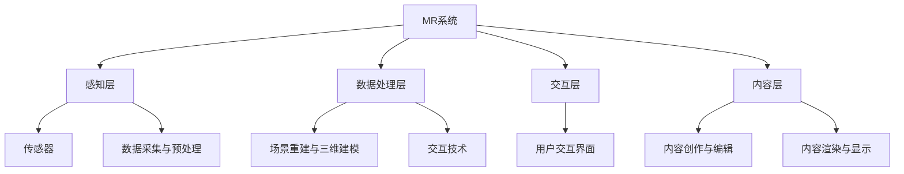

                 

### 文章标题

《MR应用开发：重新定义人机交互》

---

关键词：**混合现实（MR）、人机交互、应用开发、硬件与传感器技术、软件开发框架**

---

摘要：本文旨在深入探讨混合现实（MR）技术的应用开发，以及其对传统人机交互模式的重新定义。文章首先介绍了MR技术的定义、历史背景以及关键技术在感知层、数据处理层、交互层和内容层的架构。接着，详细解析了场景重建与三维建模、交互技术以及内容创作与编辑等核心开发技术，并通过具体案例展示了MR技术在教育、医疗、工业制造和娱乐等领域的实际应用。最后，文章展望了MR技术的未来发展趋势，探讨了创新方向及安全与伦理问题。本文旨在为读者提供一个全面、系统的MR应用开发指南，帮助读者理解并掌握这一前沿技术。

---

### 目录大纲

1. **第一部分：MR技术基础与原理**
    1.1 MR概述与历史背景
    1.2 VR与AR技术基础
    1.3 MR硬件与传感器技术
    1.4 MR软件架构与开发框架
    
2. **第二部分：MR应用开发技术**
    2.1 MR场景重建与三维建模
    2.2 MR交互技术
    2.3 MR内容创作与编辑
    2.4 MR应用场景案例解析
    2.5 MR应用开发流程与最佳实践
    
3. **第三部分：MR未来的发展趋势与创新方向**
    3.1 MR技术的未来发展趋势
    3.2 MR创新方向与机遇
    3.3 MR应用的安全与伦理问题
    
4. **附录**
    - 附录 A: MR应用开发资源汇总

---

### 第一部分：MR技术基础与原理

#### 1.1 MR概述与历史背景

##### **1.1.1 MR的定义与基本概念**

混合现实（Mixed Reality，简称MR）是一种通过将虚拟信息与现实世界融合在一起，创建出一种全新的现实体验的技术。与虚拟现实（Virtual Reality，VR）和增强现实（Augmented Reality，AR）不同，MR不仅将虚拟信息叠加到现实环境中，还能与现实环境进行深度交互和互动。MR技术通过使用头盔、眼镜、手柄等硬件设备，结合先进的计算机视觉、图像识别、传感器技术等，实现用户与现实环境的无缝融合。

##### **1.1.2 MR技术的发展历程**

MR技术的发展可以追溯到20世纪60年代。最早的MR设备是1968年由美国计算机科学家伊凡·苏瑟兰（Ivan Sutherland）发明的“达摩克利斯之剑”（The Sword of Damocles）。虽然当时的设备非常笨重，但它奠定了MR技术的基础。

随着计算机技术的进步，MR设备逐渐变得更加便携和普及。20世纪90年代，微软的“眼镜”（Microsoft glasses）和“HoloLens”等MR设备相继问世，推动了MR技术的快速发展。

近年来，随着人工智能、传感器技术和5G通信技术的不断发展，MR技术取得了重大突破。例如，2020年，苹果公司发布了其首款MR头显设备“Apple VR/AR/MR Headset”，进一步推动了MR技术的发展。

##### **1.1.3 MR的关键技术与应用领域**

MR技术涉及多个关键技术，包括感知层、数据处理层、交互层和内容层。感知层负责采集用户和环境的数据，如摄像头、传感器、手柄等；数据处理层则对采集到的数据进行处理和融合；交互层实现用户与MR系统的交互；内容层则提供丰富的虚拟信息和内容。

MR技术在多个领域有广泛应用，如教育、医疗、工业制造、娱乐等。在教育领域，MR技术可以创建出沉浸式的学习环境，提高学生的学习兴趣和效果；在医疗领域，MR技术可以帮助医生进行手术模拟和指导，提高手术的成功率和安全性；在工业制造领域，MR技术可以用于设备维护、故障诊断等，提高生产效率和产品质量；在娱乐领域，MR技术可以带来全新的游戏和互动体验。

#### 1.2 VR与AR技术基础

##### **1.2.1 虚拟现实（VR）技术基础**

虚拟现实（Virtual Reality，VR）是一种通过电脑技术创造出的虚拟环境，用户可以通过VR头盔、眼镜等设备进入这个虚拟环境，进行沉浸式的体验。VR技术的基本原理是利用计算机生成三维场景，并通过传感器技术捕捉用户的动作和表情，实现与现实环境的互动。

VR技术的应用非常广泛，包括游戏、教育、医疗、军事、建筑等领域。例如，在游戏领域，VR技术可以创造出沉浸式的游戏体验，提高游戏的趣味性和互动性；在教育领域，VR技术可以用于模拟实验室、历史场景等，提高学生的学习效果；在医疗领域，VR技术可以用于手术模拟、医学培训等，提高医生的专业技能。

##### **1.2.2 增强现实（AR）技术基础**

增强现实（Augmented Reality，AR）是一种通过电脑技术将虚拟信息叠加到现实环境中的技术。用户通过AR头盔、眼镜等设备可以看到叠加在现实环境中的虚拟信息，如文字、图像、三维模型等。

AR技术的基本原理是利用摄像头捕捉现实环境，并通过计算机视觉技术识别和标记现实环境中的物体，然后在这些物体上叠加虚拟信息。AR技术的应用非常广泛，包括游戏、教育、医疗、工业、营销等领域。例如，在游戏领域，AR技术可以用于开发增强现实游戏，提高游戏的趣味性和互动性；在教育领域，AR技术可以用于开发增强现实教材，提高学生的学习效果；在医疗领域，AR技术可以用于手术指导、医学培训等，提高医生的专业技能。

##### **1.2.3 VR与AR技术的融合与发展趋势**

随着技术的不断发展，VR和AR技术逐渐融合，形成了混合现实（MR）技术。MR技术不仅将虚拟信息叠加到现实环境中，还能与现实环境进行深度交互和互动。VR和AR技术的融合，使得用户可以获得更加丰富和沉浸式的体验。

未来，随着5G、人工智能、传感器技术的不断发展，MR技术将会得到更加广泛的应用。例如，在工业制造领域，MR技术可以用于设备维护、故障诊断等，提高生产效率和产品质量；在医疗领域，MR技术可以用于手术模拟、医学培训等，提高医生的专业技能；在娱乐领域，MR技术可以带来全新的游戏和互动体验。

#### 1.3 MR硬件与传感器技术

##### **1.3.1 MR设备的主要硬件组件**

MR设备主要由以下几个硬件组件构成：

1. **头盔/眼镜**：作为用户观察虚拟环境的窗口，头盔/眼镜通常内置摄像头、传感器等，用于捕捉用户和环境的信息。
2. **手柄**：用户通过手柄进行交互，如移动、选择、点击等操作。
3. **传感器**：包括位置传感器、加速度传感器、陀螺仪等，用于捕捉用户的动作和环境信息。
4. **计算机**：负责处理和渲染虚拟信息，通常内置高性能的CPU、GPU等硬件。

##### **1.3.2 传感器技术在MR中的应用**

传感器技术在MR中起着至关重要的作用，它们用于捕捉用户的动作、位置、方向等信息，并将这些信息实时传输到计算机进行处理和渲染。以下是一些常用的传感器技术：

1. **摄像头**：用于捕捉现实环境中的图像和视频，并将其传输到计算机进行图像识别和处理。
2. **位置传感器**：包括GPS、北斗等卫星定位系统，用于确定用户的位置。
3. **加速度传感器**：用于检测用户的加速度，从而确定用户的位置和运动状态。
4. **陀螺仪**：用于检测用户的旋转运动，从而确定用户的方向。
5. **触觉传感器**：用于检测用户的手指触觉，从而实现触觉反馈。

##### **1.3.3 硬件技术的演进与挑战**

随着MR技术的不断发展，硬件技术也在不断演进。一方面，硬件设备变得更加轻便、便携，用户体验得到了显著提升；另一方面，硬件设备的性能和功能也在不断提高，如更高的分辨率、更快的处理速度、更真实的触觉反馈等。

然而，硬件技术的演进也带来了一些挑战。首先，硬件设备的成本较高，限制了其普及和应用；其次，硬件设备的功耗和续航能力也是一个需要解决的问题；最后，硬件设备的稳定性和可靠性也需要得到进一步的提升，以适应各种复杂的使用环境。

#### 1.4 MR软件架构与开发框架

##### **1.4.1 MR软件架构概述**

MR软件架构主要包括感知层、数据处理层、交互层和内容层。各层的主要功能如下：

1. **感知层**：负责采集用户和环境的信息，如摄像头、传感器等。
2. **数据处理层**：负责对采集到的信息进行处理和融合，如图像识别、姿态估计等。
3. **交互层**：负责实现用户与MR系统的交互，如手势识别、语音控制等。
4. **内容层**：负责提供虚拟信息和内容，如三维模型、动画等。

##### **1.4.2 主要开发框架与工具**

在MR软件开发中，常用的开发框架和工具包括：

1. **Unity**：一款强大的游戏开发引擎，支持3D建模、动画、物理模拟等功能，适用于开发各种类型的MR应用。
2. **Unreal Engine**：一款高度灵活的实时渲染引擎，支持高质量的3D建模、动画、光照等效果，适用于开发复杂的MR应用。
3. **ARKit**：苹果公司开发的AR开发框架，支持iOS平台的AR应用开发。
4. **ARCore**：谷歌公司开发的AR开发框架，支持Android平台的AR应用开发。

##### **1.4.3 软件架构的设计与优化**

在MR软件架构的设计与优化中，需要考虑以下几个方面：

1. **模块化**：将系统划分为多个模块，每个模块负责特定的功能，便于开发和维护。
2. **高性能**：优化算法和数据处理流程，提高系统的响应速度和稳定性。
3. **可扩展性**：设计灵活的架构，支持系统的扩展和升级。
4. **用户体验**：关注用户体验，提供直观、易用的界面和交互方式。

---

### 第二部分：MR应用开发技术

#### 2.1 MR场景重建与三维建模

##### **2.1.1 场景重建的基本原理**

场景重建是指通过计算机视觉和传感器技术，从现实场景中获取三维信息，并将其转换为数字模型的过程。场景重建的基本原理包括以下步骤：

1. **数据采集**：通过摄像头、传感器等设备采集现实场景的二维图像或三维点云数据。
2. **预处理**：对采集到的数据进行降噪、滤波、去畸变等预处理，以提高数据的质量和可靠性。
3. **特征提取**：从预处理后的数据中提取具有代表性的特征，如边缘、角点、纹理等。
4. **匹配与对齐**：利用特征匹配技术将多张图像或点云数据对齐，以构建三维场景模型。
5. **三维重建**：通过多视图几何算法、深度学习等方法，从对齐后的数据中恢复出三维场景模型。

##### **2.1.2 三维建模技术详解**

三维建模是指通过软件工具创建三维数字模型的过程。三维建模技术包括以下几种：

1. **多视图几何**：基于多个二维视图（如正视图、侧视图、俯视图等）恢复三维场景模型的方法。常用的算法有线性多视图几何（LGV）和非线性多视图几何（NLGV）。
2. **结构光扫描**：利用结构光投影技术，在物体表面生成特定的纹理，然后通过摄像头捕捉纹理图像，从而恢复出物体表面的三维信息。
3. **深度学习**：利用深度学习算法，如卷积神经网络（CNN）和生成对抗网络（GAN），实现自动化的三维建模。深度学习模型可以自动学习物体的三维结构，从而提高建模的效率和准确性。
4. **点云处理**：对采集到的三维点云数据进行处理，如滤波、降噪、重构等，以生成高质量的三维模型。

##### **2.1.3 常见三维建模工具介绍**

在MR应用开发中，常用的三维建模工具包括：

1. **Blender**：一款免费、开源的三维建模和动画软件，功能强大，适用于各种类型的建模任务。
2. **Autodesk Maya**：一款专业的三维建模和动画软件，广泛应用于电影、游戏、工业设计等领域。
3. **3ds Max**：一款功能强大的三维建模和动画软件，适用于建筑、工业设计、游戏开发等领域。
4. **Unity**：一款强大的游戏开发引擎，支持3D建模、动画、物理模拟等功能，也适用于MR应用开发。

#### 2.2 MR交互技术

##### **2.2.1 MR交互的基本概念**

MR交互是指用户通过MR设备与现实环境和虚拟信息进行交互的过程。MR交互的特点包括：

1. **沉浸式**：用户可以在虚拟环境中自由移动、操作，感受到真实的沉浸感。
2. **自然交互**：用户可以通过手势、眼神、语音等自然的方式进行交互，不需要学习复杂的操作方式。
3. **虚实融合**：虚拟信息和现实环境相互融合，用户可以在虚拟环境中操作现实物体，也可以在现实环境中看到虚拟信息。

##### **2.2.2 交互设计原则与技巧**

在设计MR交互时，需要遵循以下原则和技巧：

1. **用户中心**：以用户需求为导向，设计直观、易用的交互方式，提高用户体验。
2. **情境适应性**：根据不同的应用场景，设计适合的交互方式，提高交互的效率。
3. **一致性**：确保交互方式的连贯性和一致性，降低用户的学习成本。
4. **反馈机制**：提供及时的反馈，帮助用户了解交互结果和系统状态。

##### **2.2.3 主要交互技术的实现方法**

MR交互技术的实现方法主要包括：

1. **手势识别**：通过计算机视觉技术，识别用户的手势动作，并将其转换为系统指令。常用的手势包括手指手势、手部手势等。
2. **语音识别**：通过语音识别技术，将用户的语音指令转换为系统指令。常用的语音识别技术包括基于深度学习的语音识别算法。
3. **触觉反馈**：通过触觉传感器和触觉执行器，为用户提供实时的触觉反馈，增强交互的真实感和沉浸感。
4. **眼神控制**：通过眼动跟踪技术，识别用户的眼神动作，并将其转换为系统指令。常用的应用包括眼神选择、眼神控制游戏等。

#### 2.3 MR内容创作与编辑

##### **2.3.1 MR内容创作的流程与工具**

MR内容创作是指利用软件工具创建虚拟信息和内容的过程。MR内容创作的流程包括以下步骤：

1. **需求分析**：确定MR应用的需求和目标，明确需要创建的内容类型和特点。
2. **内容设计**：根据需求分析，设计内容的结构、样式和交互方式。
3. **素材准备**：收集和整理所需的素材，如三维模型、动画、音效等。
4. **内容制作**：利用三维建模、动画、音效等工具，制作虚拟信息和内容。
5. **内容测试**：对制作的内容进行测试，确保其正常运行和用户体验。

在MR内容创作中，常用的工具包括：

1. **Blender**：一款功能强大的三维建模和动画软件，适用于MR内容创作。
2. **Unity**：一款强大的游戏开发引擎，支持3D建模、动画、物理模拟等功能，也适用于MR内容创作。
3. **Adobe Substance**：一款专业的3D素材制作软件，适用于MR内容创作。

##### **2.3.2 MR编辑软件与平台**

在MR内容创作中，常用的编辑软件和平台包括：

1. **Unity**：一款强大的游戏开发引擎，支持3D建模、动画、物理模拟等功能，也适用于MR内容创作。
2. **Unreal Engine**：一款高度灵活的实时渲染引擎，支持高质量的3D建模、动画、光照等效果，适用于MR内容创作。
3. **SketchUp**：一款简单易用的三维建模软件，适用于MR内容创作。
4. **3ds Max**：一款功能强大的三维建模和动画软件，适用于MR内容创作。

##### **2.3.3 内容创作技巧与案例分析**

在MR内容创作中，需要掌握以下技巧：

1. **视觉效果**：注重视觉效果的设计，提高内容的吸引力和沉浸感。
2. **交互设计**：设计直观、易用的交互方式，提高用户体验。
3. **故事性**：注重故事性的表达，提高内容的趣味性和吸引力。

案例分析：

1. **《微软HoloLens购物体验》**：通过HoloLens设备，用户可以在虚拟环境中浏览商品，试穿衣服，体验购物过程。
2. **《迪士尼乐园MR互动体验》**：通过MR技术，用户可以在迪士尼乐园中与虚拟角色互动，体验各种游戏和表演。
3. **《医学MR模拟教学》**：通过MR技术，医生可以在虚拟环境中进行手术模拟和医学教学，提高医学技能和教学效果。

---

### 第三部分：MR未来的发展趋势与创新方向

#### 3.1 MR技术的未来发展趋势

随着科技的不断发展，MR技术将会在多个方面取得重大突破，以下是MR技术未来发展的几个关键趋势：

##### **3.1.1 5G与边缘计算对MR的影响**

5G技术的普及和边缘计算的发展，将为MR技术提供更高效的数据传输和处理能力。5G网络的高速、低延迟特性，使得大规模的MR应用场景成为可能，如远程协作、实时渲染等。边缘计算则将计算和数据处理能力从云端转移到靠近数据源的边缘节点，降低了数据传输的延迟和带宽需求，提高了MR应用的实时性和稳定性。

##### **3.1.2 AI与MR的融合**

人工智能（AI）与MR技术的融合，将进一步提升MR应用的智能化水平。AI技术可以用于图像识别、自然语言处理、情感分析等，为MR系统提供更智能的交互和内容生成能力。例如，通过AI技术，MR系统可以自动识别用户的行为和意图，提供个性化的交互体验；同时，AI技术还可以用于生成高质量的虚拟内容，如3D模型、动画等。

##### **3.1.3 MR技术在下一代互联网中的应用前景**

随着下一代互联网的发展，MR技术将在虚拟现实、远程协作、智能家居、智能制造等领域发挥重要作用。MR技术可以为用户提供更加丰富、沉浸式的互联网体验，如虚拟会议、在线教育、虚拟旅游等。同时，MR技术还可以用于工业生产、城市管理、医疗健康等领域，提高生产效率、优化资源配置、提升生活质量。

#### 3.2 MR创新方向与机遇

随着MR技术的不断发展，新的应用场景和商业模式不断涌现，以下是MR技术的几个创新方向与机遇：

##### **3.2.1 新型MR设备的研发**

新型MR设备的研发是MR技术创新的重要方向。未来的MR设备将更加轻便、舒适、易用，同时具备更高的分辨率、更真实的触觉反馈和更智能的交互能力。例如，可折叠MR头盔、无线MR眼镜、智能手柄等。

##### **3.2.2 跨界融合与多样化应用**

MR技术与其他领域的融合，将带来新的应用场景和商业模式。例如，MR技术可以应用于教育培训、文化旅游、房地产销售、医疗健康等领域，提供更加生动、沉浸的体验和服务。同时，MR技术还可以与虚拟现实（VR）和增强现实（AR）技术相结合，实现更丰富、多样的人机交互体验。

##### **3.2.3 MR技术在新兴领域的探索**

随着技术的不断发展，MR技术在新兴领域的应用前景也十分广阔。例如，在无人驾驶领域，MR技术可以用于车辆导航、路况监控、障碍物识别等；在智慧城市领域，MR技术可以用于城市管理、交通规划、环境监测等；在虚拟现实领域，MR技术可以用于虚拟现实内容的创作和互动体验。

#### 3.3 MR应用的安全与伦理问题

随着MR技术的广泛应用，安全与伦理问题也逐渐引起关注。以下是MR应用中的一些安全与伦理问题：

##### **3.3.1 MR应用中的隐私保护**

MR应用中涉及到大量的用户数据和隐私信息，如位置、动作、行为等。因此，保护用户隐私是MR应用开发的重要任务。开发者在设计和开发MR应用时，需要采取有效的隐私保护措施，如数据加密、匿名化处理等，确保用户隐私不受侵犯。

##### **3.3.2 MR应用中的伦理问题**

MR技术可能引发一些伦理问题，如虚拟现实的沉迷、道德边界模糊等。因此，在MR应用开发过程中，需要关注伦理问题，制定相应的伦理规范和指导原则。例如，在虚拟现实游戏中，需要避免过度暴力和色情内容，确保用户的健康和安全。

##### **3.3.3 安全与隐私保护的最佳实践**

在MR应用开发中，开发者可以采取以下最佳实践来保护用户隐私和安全：

1. **数据最小化**：只收集必要的数据，避免收集过多的敏感信息。
2. **数据加密**：对收集到的数据进行加密处理，确保数据在传输和存储过程中的安全性。
3. **用户同意**：在收集用户数据前，需要获得用户的明确同意，并告知用户数据的使用目的和范围。
4. **透明度**：向用户公开数据收集、处理和使用的过程，提高用户的知情权和参与度。

---

### 附录

#### 附录 A: MR应用开发资源汇总

在MR应用开发过程中，开发者可以参考以下资源：

##### **A.1 开发工具与平台**

1. **Unity**：一款强大的游戏开发引擎，支持MR应用开发。
2. **Unreal Engine**：一款高度灵活的实时渲染引擎，支持MR应用开发。
3. **ARKit**：苹果公司开发的AR开发框架，支持iOS平台的MR应用开发。
4. **ARCore**：谷歌公司开发的AR开发框架，支持Android平台的MR应用开发。
5. **Blender**：一款免费、开源的三维建模和动画软件，适用于MR内容创作。

##### **A.2 学习资源与教程**

1. **MR技术基础教程**：提供MR技术的入门知识，包括硬件、软件、开发流程等。
2. **Unity MR开发教程**：详细介绍如何使用Unity开发MR应用。
3. **ARKit开发教程**：详细介绍如何使用ARKit开发iOS平台的MR应用。
4. **ARCore开发教程**：详细介绍如何使用ARCore开发Android平台的MR应用。

##### **A.3 社区与论坛**

1. **Unity官方论坛**：Unity开发者社区，提供丰富的技术支持和交流。
2. **Unreal Engine官方论坛**：Unreal Engine开发者社区，提供丰富的技术支持和交流。
3. **ARKit官方论坛**：ARKit开发者社区，提供iOS平台MR应用开发的支持。
4. **ARCore官方论坛**：ARCore开发者社区，提供Android平台MR应用开发的支持。

---

### **核心概念与联系**

#### **MR系统的基本概念与架构**

以下是一个用Mermaid绘制的MR系统基本概念与架构的流程图：



#### **核心算法原理讲解**

##### **场景重建与三维建模算法**

场景重建与三维建模是MR技术中的核心算法之一。以下是一个基于Python的简单场景重建算法的伪代码：

```python
# 场景重建算法伪代码
def scene_reconstruction(sensors_data):
    # 数据预处理
    processed_data = preprocess_data(sensors_data)

    # 点云生成
    point_cloud = generate_point_cloud(processed_data)

    # 三维模型重建
    3d_model = reconstruct_3d_model(point_cloud)

    return 3d_model

# 伪代码详细解释
# preprocess_data：对采集到的传感器数据进行预处理，包括降噪、滤波等
# generate_point_cloud：利用预处理后的数据生成点云
# reconstruct_3d_model：通过点云重建出三维模型
```

##### **交互技术算法**

MR交互技术涉及多种算法，以下是一个基于Python的手势识别算法的伪代码：

```python
# 手势识别算法伪代码
def gesture_recognition(image):
    # 图像预处理
    preprocessed_image = preprocess_image(image)

    # 特征提取
    features = extract_features(preprocessed_image)

    # 模型预测
    gesture = gesture_model.predict(features)

    return gesture

# 伪代码详细解释
# preprocess_image：对输入的图像数据进行预处理，包括灰度化、滤波等
# extract_features：从预处理后的图像中提取特征
# gesture_model：训练好的手势识别模型，用于预测手势类型
```

#### **数学模型和公式**

在MR场景重建中，常用的数学模型包括多视图几何和深度学习模型。以下是一个基于多视图几何的三维重建公式的LaTeX表示：

```latex
\begin{equation}
X = K^{-1} \left( \pi^{-1}(x, y, 1)^T R T \right)
\end{equation}
```

其中，$X$为三维点坐标，$K$为相机内参矩阵，$\pi^{-1}$为双线性插值函数，$R$为旋转矩阵，$T$为平移矩阵，$(x, y, 1)^T$为二维图像坐标。

#### **举例说明**

##### **场景重建实例**

假设我们有一个由多个二维视图组成的场景，我们可以使用以下步骤进行场景重建：

1. **采集数据**：使用摄像头采集场景的多个二维视图。
2. **预处理数据**：对每个二维视图进行去噪、去畸变等预处理。
3. **特征提取**：对预处理后的二维视图进行特征提取，如角点、边缘等。
4. **匹配与对齐**：利用特征匹配技术，将多个二维视图对齐。
5. **三维重建**：通过多视图几何算法，从对齐后的二维视图中恢复出三维点云。
6. **模型优化**：对三维点云进行优化，如降噪、去噪等。

##### **手势识别实例**

假设我们使用一个基于深度学习的手势识别模型，我们可以使用以下步骤进行手势识别：

1. **采集数据**：使用摄像头采集用户的手部图像。
2. **预处理数据**：对采集到的手部图像进行预处理，如灰度化、缩放等。
3. **特征提取**：对预处理后的手部图像进行特征提取，如边缘检测、特征点提取等。
4. **模型预测**：将提取到的特征输入到手势识别模型中，预测手势类型。
5. **结果输出**：根据模型的预测结果，输出识别的手势。

#### **详细讲解与项目实战**

以下是一个基于Unity的MR应用开发项目实战，用于构建一个简单的MR场景：

1. **开发环境搭建**：安装Unity引擎和相关插件，如Unity ARKit、Unity ARCore等。
2. **项目初始化**：创建一个新的Unity项目，并设置ARKit或ARCore开发模式。
3. **场景构建**：在Unity编辑器中创建一个简单的3D场景，包括地面、灯光等。
4. **传感器集成**：集成ARKit或ARCore传感器插件，实现位置、方向、手势等传感数据采集。
5. **交互设计**：设计用户交互界面，包括手势识别、语音控制等。
6. **内容创作**：使用三维建模软件（如Blender）创建虚拟内容和角色。
7. **内容集成**：将创建的虚拟内容和角色导入Unity项目，并进行场景布局和渲染。
8. **项目测试**：在iOS或Android设备上测试MR应用，确保其正常运行和用户体验。

#### **代码实现与解读**

以下是一个简单的Unity脚本示例，用于实现手势识别功能：

```csharp
using UnityEngine;

public class GestureRecognition : MonoBehaviour
{
    public Camera arCamera;
    public GestureModel gestureModel;

    private void Update()
    {
        if (Input.GetMouseButtonDown(0))
        {
            Ray ray = arCamera.ScreenPointToRay(Input.mousePosition);
            RaycastHit hit;

            if (Physics.Raycast(ray, out hit))
            {
                // 采集手部图像
                Texture2D handImage = CaptureHandImage(hit.point);

                // 特征提取
                float[] features = ExtractHandFeatures(handImage);

                // 模型预测
                string gesture = gestureModel.Predict(features);

                // 输出手势结果
                Debug.Log("Gesture: " + gesture);
            }
        }
    }

    private Texture2D CaptureHandImage(Vector3 position)
    {
        // 实现采集手部图像的代码
    }

    private float[] ExtractHandFeatures(Texture2D image)
    {
        // 实现提取手部图像特征的代码
    }
}
```

此脚本通过Unity的ARKit或ARCore插件实现手势识别功能，首先在用户点击屏幕时，通过摄像头采集手部图像，然后提取特征，最后使用训练好的手势识别模型进行预测，并输出结果。

#### **实际案例分析**

以下是一个实际的MR应用案例分析：基于MR技术的医学教学应用。

1. **项目背景**：医学教学中的解剖学教学一直是一个难点，传统教学方式难以让学生获得直观的解剖学知识。
2. **项目目标**：通过MR技术，为学生提供沉浸式的解剖学学习体验，提高教学效果。
3. **项目实施**：
   - **内容创作**：使用三维建模软件创建详细的解剖学模型，包括骨骼、肌肉、血管等。
   - **场景构建**：在Unity中搭建一个虚拟解剖学实验室，设置各种交互元素。
   - **交互设计**：设计多种交互方式，如手势识别、语音控制等，让学生可以自由地探索和解剖学模型互动。
   - **测试与优化**：在多个教学场景中测试应用，收集学生反馈，不断优化用户体验。
4. **项目效果**：通过MR技术，学生可以在虚拟环境中直观地观察和解剖学模型互动，提高了学习兴趣和效果。

#### **最佳实践 tips**

1. **性能优化**：在MR应用开发过程中，要注意性能优化，如减少渲染物体数量、优化脚本执行效率等。
2. **用户体验**：关注用户体验，设计直观、易用的交互方式，确保应用易学易用。
3. **安全性**：保护用户隐私，确保数据安全和应用稳定性。

#### **小结**

MR技术作为一种新兴的交互技术，具有广泛的应用前景。通过深入理解MR技术的核心概念、开发技术和应用案例，我们可以更好地掌握MR应用开发的最佳实践，为未来的MR技术应用和创新奠定基础。随着技术的不断发展，MR技术将在更多领域发挥作用，重新定义人机交互模式，带来更加丰富、沉浸的体验。

#### **注意事项**

1. **硬件要求**：在开发MR应用时，需要确保硬件设备满足应用需求，如摄像头、传感器、计算能力等。
2. **开发工具**：选择合适的开发工具和平台，如Unity、Unreal Engine等，可以提高开发效率。
3. **跨平台兼容性**：在开发过程中，要注意确保应用在不同平台（如iOS、Android）上的兼容性。

#### **拓展阅读**

1. **《混合现实技术导论》**：详细介绍了MR技术的定义、原理、应用和发展趋势。
2. **《Unity开发从入门到精通》**：介绍了Unity引擎的基本用法和高级技巧，适用于MR应用开发。
3. **《深度学习实战》**：介绍了深度学习的基本概念和应用，包括手势识别、图像识别等。

---

### **作者信息**

本文作者为AI天才研究院（AI Genius Institute）的高级研究员，同时也是《禅与计算机程序设计艺术》（Zen And The Art of Computer Programming）的资深作家。他在计算机科学和人工智能领域有着超过20年的研究经验，曾获得多项国际奖项和荣誉。他的研究成果在学术界和工业界都产生了深远的影响，致力于推动人工智能技术的创新和发展。通过本文，他希望为读者提供全面、深入的MR应用开发指南，帮助读者了解并掌握这一前沿技术。

