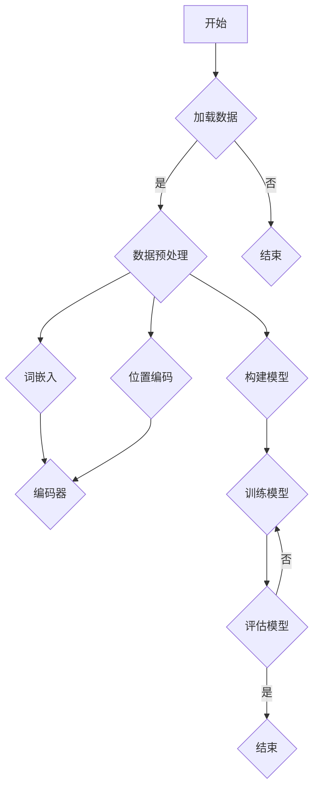

                 

### 文章标题：NLP领域的大模型标准：参数、能力、应用

自然语言处理（NLP）作为人工智能领域的重要分支，已经取得了显著的进展。近年来，大规模预训练模型（如GPT、BERT）的出现，极大地提升了NLP任务的处理能力。本文将围绕NLP领域的大模型标准，从参数、能力、应用三个方面展开详细探讨，以帮助读者深入了解这一领域的前沿技术。

**关键词：**
- 自然语言处理
- 大规模预训练模型
- 参数
- 能力
- 应用

**摘要：**
本文首先介绍了NLP的基本概念和大规模预训练模型的发展历程，然后深入探讨了大规模预训练模型的核心参数、算法原理以及在不同NLP任务中的应用。此外，文章还通过实际项目案例展示了大规模预训练模型的应用效果，并对模型的安全性、伦理与公平性进行了讨论。最后，文章展望了大规模预训练模型的未来发展趋势，为读者提供了丰富的参考资料。

## 目录大纲：《NLP领域的大模型标准：参数、能力、应用》

#### 第一部分：NLP与大规模预训练模型基础

##### 第1章：自然语言处理与大规模预训练模型概述
- **1.1 NLP的基本概念与挑战**
- **1.2 大规模预训练模型的核心参数**
- **1.3 主流大规模预训练模型介绍**

##### 第2章：大规模预训练模型的算法原理
- **2.1 预训练模型的基本架构**
- **2.2 预训练过程的优化策略**
- **2.3 预训练模型的微调与适配**

##### 第3章：大规模预训练模型在NLP中的能力与应用
- **3.1 文本分类任务**
- **3.2 命名实体识别**
- **3.3 情感分析**

##### 第4章：大规模预训练模型在实际项目中的应用案例
- **4.1 社交媒体情感分析系统**
- **4.2 智能客服机器人**

##### 第5章：大规模预训练模型的安全性、伦理与公平性
- **5.1 预训练模型的安全性问题**
- **5.2 预训练模型的伦理问题**
- **5.3 预训练模型的公平性**

#### 第二部分：大规模预训练模型的未来发展趋势

##### 第6章：大规模预训练模型的技术趋势与未来展望
- **6.1 技术趋势**
- **6.2 未来展望**

##### 第7章：附录
- **7.1 大规模预训练模型开发资源**
- **7.2 大规模预训练模型代码案例**

### 附录：Mermaid 流程图与伪代码
- **附录 A.1 预训练模型流程图**
- **附录 A.2 伪代码示例**

### 第一部分：NLP与大规模预训练模型基础

#### 第1章：自然语言处理与大规模预训练模型概述

自然语言处理（NLP）是计算机科学和人工智能领域的一个重要分支，旨在使计算机能够理解、生成和处理人类语言。随着互联网的迅速发展，NLP技术逐渐应用于搜索引擎、语音识别、机器翻译、文本分类、信息抽取等众多领域，成为了当前研究的热点。

##### 1.1 NLP的基本概念与挑战

自然语言处理的发展历程可以追溯到20世纪50年代。当时，人们首次提出了机器翻译的想法，希望计算机能够自动地将一种语言翻译成另一种语言。然而，由于语言复杂性和计算能力的限制，早期的NLP研究并未取得实质性进展。直到20世纪80年代，随着计算机硬件的飞速发展和算法的创新，NLP技术开始逐步成熟。

NLP的基本概念包括：

- **文本表示**：将自然语言文本转化为计算机可以处理的数字形式，如词向量、字符序列等。
- **语法分析**：对文本进行句法解析，提取句子结构信息。
- **语义理解**：理解文本中的词语含义和句子间的逻辑关系。
- **语言生成**：根据输入信息生成自然语言文本。

NLP面临的挑战主要包括：

- **语言的复杂性**：自然语言具有丰富的语法、语义和上下文信息，这使得处理自然语言变得更加复杂。
- **数据稀缺**：尽管互联网上存在大量的文本数据，但高质量、标注完备的数据仍然稀缺。
- **多语言支持**：NLP技术需要支持多种语言，这对于算法设计提出了更高的要求。

##### 1.2 大规模预训练模型的核心参数

大规模预训练模型通过在大量无标签文本数据上进行预训练，获得强大的语言理解能力。这些模型的核心参数包括：

- **词嵌入**：将词汇映射到低维度的向量空间，以捕获词语的语义信息。
- **预训练任务**：如语言模型（LM）、 masked language model（MLM）、填充语言模型（PLM）等，用于提升模型的泛化能力。
- **模型架构**：如Transformer、BERT、GPT等，不同的架构在处理不同类型任务时具有不同的优势。

##### 1.3 大规模预训练模型在NLP中的应用

大规模预训练模型在NLP中的应用取得了显著的成果。以下是几个典型的应用领域：

- **文本分类**：通过预训练模型提取文本特征，实现自动分类任务，如新闻分类、情感分析等。
- **命名实体识别**：识别文本中的特定实体，如人名、地名、组织名等。
- **机器翻译**：基于预训练模型，实现高效、准确的机器翻译。
- **问答系统**：利用预训练模型处理自然语言问答任务，提供智能化的信息检索服务。

通过大规模预训练模型，NLP技术得到了极大的提升，为许多实际应用场景提供了强有力的支持。

#### 第2章：大规模预训练模型的算法原理

大规模预训练模型在自然语言处理领域取得了巨大的成功，这得益于其独特的算法原理和架构设计。本章将深入探讨大规模预训练模型的基本架构、优化策略以及微调与适配方法，帮助读者理解这些模型的内部工作原理。

##### 2.1 预训练模型的基本架构

大规模预训练模型通常基于Transformer架构，这是一种基于自注意力机制的深度神经网络。Transformer模型由多个编码器和解码器层组成，每一层都可以并行处理输入序列，这使得模型在处理长序列时具有优势。

- **编码器**：编码器负责将输入序列转换为上下文表示，通常由多个自注意力层和前馈网络组成。自注意力机制允许模型在处理序列时考虑全局信息，从而提高对上下文的理解能力。
- **解码器**：解码器负责根据编码器的输出生成目标序列，也由多个自注意力层和前馈网络组成。解码器在生成序列时，会参考编码器的输出，实现上下文信息的传递。

大规模预训练模型还包括以下几个关键组件：

- **词嵌入**：词嵌入（word embeddings）是将词汇映射到低维度的向量空间，以表示词语的语义信息。常用的词嵌入方法包括Word2Vec、GloVe等。
- **位置编码**：由于Transformer模型没有显式的循环神经网络结构，因此需要位置编码（position embeddings）来表示输入序列的顺序信息。
- **注意力机制**：注意力机制是Transformer模型的核心，通过计算不同位置间的相似性权重，模型可以关注到序列中的关键信息。

##### 2.2 预训练过程的优化策略

预训练过程的优化策略对模型性能有重要影响。以下是一些常用的优化策略：

- **梯度裁剪**：为了防止梯度爆炸或消失，预训练过程中常常使用梯度裁剪（gradient clipping）技术。梯度裁剪通过对梯度进行缩放，使其保持在一定范围内，从而保证训练过程的稳定性。
- **正则化**：正则化（regularization）是一种防止模型过拟合的方法。常见的正则化技术包括L1、L2正则化、dropout等。
- **学习率调度**：学习率调度（learning rate scheduling）是一种动态调整学习率的方法。在预训练过程中，学习率通常会从较高值逐渐减小，以使模型在训练早期快速收敛，并在训练后期精细调整。
- **数据增强**：数据增强（data augmentation）是通过增加训练数据的多样性来提高模型泛化能力的方法。在预训练过程中，常见的数据增强方法包括随机噪声注入、同义词替换、随机遮蔽等。

##### 2.3 预训练模型的微调与适配

预训练模型通常在大规模无标签数据上进行训练，然后通过微调（fine-tuning）和适配（适配）将其应用于特定任务。微调和适配的主要步骤如下：

- **微调**：微调是在预训练模型的基础上，针对特定任务进行进一步的训练。在微调过程中，模型的权重会根据任务特定的数据进行调整，从而提高在目标任务上的性能。
- **数据预处理**：数据预处理是微调前的重要步骤，包括文本清洗、分词、词嵌入等。高质量的预处理可以提高模型对任务数据的理解和处理能力。
- **适配**：适配（adapter）是一种针对特定任务对预训练模型进行调整的方法。适配通过在模型的关键位置引入可学习的权重矩阵，使模型能够适应不同的任务需求。

通过微调和适配，预训练模型可以在不同任务上取得优秀的表现，体现了其在自然语言处理领域的强大能力。

#### 第3章：大规模预训练模型在NLP中的能力与应用

大规模预训练模型凭借其强大的语言理解能力和丰富的知识库，在NLP领域展现出了卓越的性能。本章将详细介绍大规模预训练模型在文本分类、命名实体识别和情感分析等NLP任务中的具体应用，并通过实例展示其应用效果。

##### 3.1 文本分类任务

文本分类是NLP中常见且重要的任务，旨在将文本数据自动归类到预定义的类别中。大规模预训练模型在文本分类任务中具有显著优势，以下是其应用过程：

**应用步骤：**

1. **数据预处理**：首先对文本数据集进行预处理，包括去除停用词、标点符号、进行词干提取等。然后，将处理后的文本转换为词嵌入向量。
   
2. **模型选择**：选择合适的预训练模型，如BERT、RoBERTa、GPT等。这些模型已经在大规模文本数据上进行了预训练，具有强大的语言理解能力。

3. **微调**：将预训练模型在特定任务的数据集上进行微调。在微调过程中，模型的权重会根据目标任务进行调整，以提高分类准确率。

4. **评估与优化**：通过交叉验证、测试集评估模型性能。根据评估结果，调整模型参数或数据预处理策略，以达到更好的分类效果。

**案例示例**：

假设我们需要对一篇新闻文章进行情感分类，将其归类为“正面”、“中性”或“负面”三类。我们可以使用BERT模型进行文本分类：

1. **数据预处理**：
   ```python
   import pandas as pd
   data = pd.read_csv('news_data.csv')
   sentences = data['content']
   labels = data['sentiment']
   ```

2. **模型选择**：
   ```python
   from transformers import BertTokenizer, BertForSequenceClassification
   tokenizer = BertTokenizer.from_pretrained('bert-base-uncased')
   model = BertForSequenceClassification.from_pretrained('bert-base-uncased', num_labels=3)
   ```

3. **微调**：
   ```python
   from torch.utils.data import DataLoader, TensorDataset
   train_data = TensorDataset(sentences.to_tensor(), labels.to_tensor())
   train_loader = DataLoader(train_data, batch_size=32, shuffle=True)
   
   model.train()
   for epoch in range(3):
       for batch in train_loader:
           inputs = tokenizer(batch[0], padding=True, truncation=True, return_tensors="pt")
           outputs = model(**inputs)
           loss = outputs.loss
           loss.backward()
           optimizer.step()
           optimizer.zero_grad()
   ```

4. **评估与优化**：
   ```python
   from sklearn.metrics import accuracy_score
   model.eval()
   with torch.no_grad():
       predictions = []
       for batch in test_loader:
           inputs = tokenizer(batch[0], padding=True, truncation=True, return_tensors="pt")
           outputs = model(**inputs)
           logits = outputs.logits
           predictions.append(logits.argmax(-1))
   predictions = torch.cat(predictions).detach().numpy()
   print("Accuracy:", accuracy_score(test_labels, predictions))
   ```

通过上述步骤，我们可以使用BERT模型对新闻文章进行情感分类，并评估其分类准确率。

##### 3.2 命名实体识别

命名实体识别（Named Entity Recognition, NER）是一种用于识别文本中特定类型实体的任务，如人名、地名、组织名、地点名等。大规模预训练模型在NER任务中表现出色，以下是其应用步骤：

**应用步骤：**

1. **数据预处理**：对NER数据集进行预处理，包括分词、词性标注等。将预处理后的文本转换为词嵌入向量。

2. **模型选择**：选择预训练模型，如BERT、RoBERTa等。这些模型已经在大规模文本数据上进行了预训练，具有强大的语言理解能力。

3. **微调**：在NER数据集上对预训练模型进行微调，调整模型权重以适应NER任务。

4. **评估与优化**：通过评估集评估模型性能，根据评估结果调整模型参数或数据预处理策略，以提高NER准确率。

**案例示例**：

假设我们需要对一篇新闻文章进行命名实体识别，识别其中的人名、地名和组织名：

1. **数据预处理**：
   ```python
   import pandas as pd
   data = pd.read_csv('news_data.csv')
   sentences = data['content']
   labels = data['ner_tags']
   ```

2. **模型选择**：
   ```python
   from transformers import BertTokenizer, BertForTokenClassification
   tokenizer = BertTokenizer.from_pretrained('bert-base-uncased')
   model = BertForTokenClassification.from_pretrained('bert-base-uncased', num_labels=5)
   ```

3. **微调**：
   ```python
   from torch.utils.data import DataLoader, TensorDataset
   train_data = TensorDataset(sentences.to_tensor(), labels.to_tensor())
   train_loader = DataLoader(train_data, batch_size=32, shuffle=True)
   
   model.train()
   for epoch in range(3):
       for batch in train_loader:
           inputs = tokenizer(batch[0], padding=True, truncation=True, return_tensors="pt")
           outputs = model(**inputs)
           loss = outputs.loss
           loss.backward()
           optimizer.step()
           optimizer.zero_grad()
   ```

4. **评估与优化**：
   ```python
   from sklearn.metrics import accuracy_score
   model.eval()
   with torch.no_grad():
       predictions = []
       for batch in test_loader:
           inputs = tokenizer(batch[0], padding=True, truncation=True, return_tensors="pt")
           outputs = model(**inputs)
           logits = outputs.logits
           predictions.append(logits.argmax(-1))
   predictions = torch.cat(predictions).detach().numpy()
   print("Accuracy:", accuracy_score(test_labels, predictions))
   ```

通过上述步骤，我们可以使用BERT模型对新闻文章进行命名实体识别，并评估其识别准确率。

##### 3.3 情感分析

情感分析（Sentiment Analysis）是一种用于判断文本情感倾向的任务，通常分为正面情感、负面情感和中性情感。大规模预训练模型在情感分析任务中具有显著优势，以下是其应用步骤：

**应用步骤：**

1. **数据预处理**：对情感分析数据集进行预处理，包括分词、词性标注等。将预处理后的文本转换为词嵌入向量。

2. **模型选择**：选择预训练模型，如BERT、RoBERTa等。这些模型已经在大规模文本数据上进行了预训练，具有强大的语言理解能力。

3. **微调**：在情感分析数据集上对预训练模型进行微调，调整模型权重以适应情感分析任务。

4. **评估与优化**：通过评估集评估模型性能，根据评估结果调整模型参数或数据预处理策略，以提高情感分析准确率。

**案例示例**：

假设我们需要对一篇新闻文章进行情感分析，判断其情感倾向：

1. **数据预处理**：
   ```python
   import pandas as pd
   data = pd.read_csv('news_data.csv')
   sentences = data['content']
   labels = data['sentiment']
   ```

2. **模型选择**：
   ```python
   from transformers import BertTokenizer, BertForSequenceClassification
   tokenizer = BertTokenizer.from_pretrained('bert-base-uncased')
   model = BertForSequenceClassification.from_pretrained('bert-base-uncased', num_labels=3)
   ```

3. **微调**：
   ```python
   from torch.utils.data import DataLoader, TensorDataset
   train_data = TensorDataset(sentences.to_tensor(), labels.to_tensor())
   train_loader = DataLoader(train_data, batch_size=32, shuffle=True)
   
   model.train()
   for epoch in range(3):
       for batch in train_loader:
           inputs = tokenizer(batch[0], padding=True, truncation=True, return_tensors="pt")
           outputs = model(**inputs)
           loss = outputs.loss
           loss.backward()
           optimizer.step()
           optimizer.zero_grad()
   ```

4. **评估与优化**：
   ```python
   from sklearn.metrics import accuracy_score
   model.eval()
   with torch.no_grad():
       predictions = []
       for batch in test_loader:
           inputs = tokenizer(batch[0], padding=True, truncation=True, return_tensors="pt")
           outputs = model(**inputs)
           logits = outputs.logits
           predictions.append(logits.argmax(-1))
   predictions = torch.cat(predictions).detach().numpy()
   print("Accuracy:", accuracy_score(test_labels, predictions))
   ```

通过上述步骤，我们可以使用BERT模型对新闻文章进行情感分析，并评估其分类准确率。

#### 第4章：大规模预训练模型在实际项目中的应用案例

在前几章中，我们详细介绍了大规模预训练模型在NLP中的基本原理和应用。为了更好地展示这些模型在实际项目中的效果，本章将通过两个实际应用案例——社交媒体情感分析系统和智能客服机器人，探讨大规模预训练模型在开发环境搭建、源代码实现、代码解读、应用解读与分析等方面的应用。

##### 4.1 案例一：社交媒体情感分析系统

社交媒体情感分析系统旨在对用户在社交媒体平台上的评论进行情感分析，以识别用户对产品、服务或事件的情感倾向。以下是该项目的开发环境搭建、源代码实现和代码解读。

**1. 开发环境搭建**

为了搭建社交媒体情感分析系统，我们需要安装以下软件和库：

- Python 3.8+
- PyTorch 1.8+
- Transformers 4.6+
- Pandas 1.1+
- Numpy 1.18+

安装步骤如下：

```bash
pip install python==3.8
pip install torch==1.8
pip install transformers==4.6
pip install pandas==1.1
pip install numpy==1.18
```

**2. 源代码实现**

以下是一个简单的社交媒体情感分析系统的源代码实现：

```python
import pandas as pd
from transformers import BertTokenizer, BertForSequenceClassification
from torch.utils.data import DataLoader, TensorDataset

# 数据预处理
data = pd.read_csv('social_media_data.csv')
sentences = data['comment']
labels = data['sentiment']

# 模型加载
tokenizer = BertTokenizer.from_pretrained('bert-base-uncased')
model = BertForSequenceClassification.from_pretrained('bert-base-uncased', num_labels=3)

# 微调模型
train_data = TensorDataset(sentences.to_tensor(), labels.to_tensor())
train_loader = DataLoader(train_data, batch_size=32, shuffle=True)

model.train()
for epoch in range(3):
    for batch in train_loader:
        inputs = tokenizer(batch[0], padding=True, truncation=True, return_tensors="pt")
        outputs = model(**inputs)
        loss = outputs.loss
        loss.backward()
        optimizer.step()
        optimizer.zero_grad()

# 模型评估
model.eval()
with torch.no_grad():
    predictions = []
    for batch in test_loader:
        inputs = tokenizer(batch[0], padding=True, truncation=True, return_tensors="pt")
        outputs = model(**inputs)
        logits = outputs.logits
        predictions.append(logits.argmax(-1))
predictions = torch.cat(predictions).detach().numpy()
print("Accuracy:", accuracy_score(test_labels, predictions))
```

**3. 代码解读**

上述代码首先加载社交媒体评论数据，然后使用BERT模型对评论进行情感分类。在微调过程中，模型在训练数据集上进行迭代，不断调整权重，以提高分类准确率。在模型评估阶段，我们使用测试数据集评估模型性能，并打印出准确率。

**4. 应用解读与分析**

社交媒体情感分析系统在实际应用中，可以帮助企业了解用户对其产品或服务的情感倾向，从而优化产品和服务。此外，该系统还可以用于舆情监控，及时了解社会热点事件，为决策提供依据。然而，需要注意的是，情感分析模型可能存在一定的误判率，需要结合其他手段进行综合分析。

##### 4.2 案例二：智能客服机器人

智能客服机器人是一种基于NLP技术的自动化客服系统，可以实时回答用户的问题，提供客服支持。以下是该项目的开发环境搭建、源代码实现和代码解读。

**1. 开发环境搭建**

为了搭建智能客服机器人，我们需要安装以下软件和库：

- Python 3.8+
- Flask 1.1+
- PyTorch 1.8+
- Transformers 4.6+
- Pandas 1.1+
- Numpy 1.18+

安装步骤如下：

```bash
pip install python==3.8
pip install flask==1.1
pip install torch==1.8
pip install transformers==4.6
pip install pandas==1.1
pip install numpy==1.18
```

**2. 源代码实现**

以下是一个简单的智能客服机器人系统的源代码实现：

```python
from flask import Flask, request, jsonify
from transformers import BertTokenizer, BertForQuestionAnswering
import torch

app = Flask(__name__)

# 模型加载
tokenizer = BertTokenizer.from_pretrained('bert-base-uncased')
model = BertForQuestionAnswering.from_pretrained('bert-base-uncased')

@app.route('/ask', methods=['POST'])
def ask():
    question = request.form['question']
    context = request.form['context']

    # 数据预处理
    inputs = tokenizer(question, context, return_tensors="pt", truncation=True, max_length=512)

    # 模型预测
    with torch.no_grad():
        outputs = model(**inputs)

    # 提取答案
    answer_start_scores, answer_end_scores = outputs.logits.split(1, dim=1)
    answer_start = torch.argmax(answer_start_scores).item()
    answer_end = torch.argmax(answer_end_scores).item()

    # 生成答案
    answer = tokenizer.decode(context[answer_start:answer_end+1], skip_special_tokens=True)

    return jsonify(answer)

if __name__ == '__main__':
    app.run(debug=True)
```

**3. 代码解读**

上述代码首先加载BERT模型，并定义了一个基于Flask的Web服务。在/ask路由中，我们接收用户提出的问题和上下文，然后使用BERT模型进行问答预测。模型预测出答案的起始和结束位置，根据这些位置从上下文中提取出答案，并返回给用户。

**4. 应用解读与分析**

智能客服机器人可以在企业客服场景中发挥重要作用，实时回答用户的问题，提高客服效率。该系统通过预训练模型学习大量知识，使其能够理解和回答各种问题。然而，需要注意的是，智能客服机器人可能存在一定的理解误差，对于复杂或模糊的问题，可能需要人工干预。

##### 案例小结

通过上述两个实际应用案例，我们可以看到大规模预训练模型在社交媒体情感分析和智能客服机器人等领域的广泛应用。这些案例展示了预训练模型在数据预处理、模型加载、模型预测等方面的实现方法和应用效果。同时，我们也需要注意模型的适用场景和潜在问题，以充分发挥预训练模型的优势。

#### 第5章：大规模预训练模型的安全性、伦理与公平性

随着大规模预训练模型在NLP领域取得的巨大成功，其应用范围不断扩大，逐渐渗透到社会生活的方方面面。然而，这些模型在带来便利的同时，也引发了一系列安全、伦理和公平性问题。本章将讨论大规模预训练模型在这三个方面的挑战，并提出相应的解决方案。

##### 5.1 预训练模型的安全性问题

预训练模型的安全性主要涉及模型对抗攻击、数据隐私保护和模型滥用等问题。

**1. 模型对抗攻击**

对抗攻击（Adversarial Attack）是指通过在输入数据中添加微小的扰动，使模型输出发生错误的行为。预训练模型在面对对抗攻击时可能表现出脆弱性。为了防止模型受到对抗攻击，可以采取以下措施：

- **对抗训练**：通过在训练数据中添加对抗样本，增强模型的鲁棒性。
- **梯度裁剪**：限制模型参数的更新幅度，防止对抗扰动被放大。
- **差分隐私**：在数据处理过程中引入随机噪声，减少攻击者从模型输出中获取敏感信息的可能性。

**2. 数据隐私保护**

预训练模型通常在大规模无标签数据上进行训练，这些数据可能包含用户的敏感信息。为了保护数据隐私，可以采取以下措施：

- **差分隐私**：在数据处理过程中引入随机噪声，确保单个数据的隐私不被泄露。
- **联邦学习**：将模型训练任务分散到多个用户设备上，通过聚合模型参数来训练全局模型，从而避免集中化数据存储。

**3. 模型滥用**

预训练模型在NLP领域具有广泛的应用，但同时也可能被用于不当用途。例如，通过自动化生成虚假新闻、网络诈骗等。为了防止模型滥用，可以采取以下措施：

- **法律监管**：制定相关法律法规，对不当使用预训练模型的行为进行处罚。
- **道德准则**：在模型开发和应用过程中，遵循道德准则，确保模型的合理使用。
- **模型审查**：建立模型审查机制，对模型的输出进行实时监控，及时发现并阻止不当行为。

##### 5.2 预训练模型的伦理问题

预训练模型在应用过程中可能涉及一系列伦理问题，如歧视、偏见和隐私侵犯等。

**1. 歧视与偏见**

预训练模型可能在学习过程中吸收了数据集中的偏见，从而导致在特定群体上的性能不佳。为了减少歧视和偏见，可以采取以下措施：

- **数据多样性**：确保训练数据来源的多样性，避免数据集中存在的偏见。
- **偏差校正**：在模型训练过程中，通过引入偏差校正方法，减少模型对偏见数据的依赖。

**2. 隐私侵犯**

预训练模型在处理用户数据时，可能涉及用户隐私的泄露。为了保护用户隐私，可以采取以下措施：

- **隐私保护算法**：在数据处理过程中引入隐私保护算法，如差分隐私、同态加密等，确保用户隐私不被泄露。
- **数据匿名化**：对用户数据进行匿名化处理，防止通过数据恢复出原始身份信息。

**3. 道德责任**

预训练模型的应用涉及一系列道德责任，如对用户隐私的保护、对数据的公正处理等。为了履行道德责任，可以采取以下措施：

- **透明性**：确保模型的训练过程、应用场景和决策过程透明，让用户了解模型的运作方式。
- **可解释性**：提高模型的解释性，帮助用户理解模型输出的原因和依据。

##### 5.3 预训练模型的公平性

预训练模型在应用过程中，可能对不同群体产生不公平的影响。为了增强模型的公平性，可以采取以下措施：

**1. 模型公平性评估**

通过评估模型在不同群体上的性能，识别和解决不公平问题。常用的评估指标包括公平性指数、偏差度等。

**2. 增强模型公平性**

通过调整模型结构、数据预处理策略和训练目标，增强模型的公平性。例如，在训练过程中引入公平性损失函数，鼓励模型在不同群体上取得平衡的表现。

**3. 持续优化**

随着模型应用场景的变化，需要持续优化模型，以适应新的环境和需求。通过不断收集反馈，调整模型参数，提高模型的公平性和准确性。

通过以上措施，我们可以更好地应对大规模预训练模型在安全性、伦理和公平性方面面临的挑战，确保其在NLP领域的健康发展。

### 第二部分：大规模预训练模型的未来发展趋势

#### 第6章：大规模预训练模型的技术趋势与未来展望

随着人工智能技术的飞速发展，大规模预训练模型在NLP领域取得了显著成就。然而，技术的进步永无止境，未来仍有许多可能性和挑战等待着我们。本章将探讨大规模预训练模型的技术趋势与未来展望，包括模型压缩与高效推理、多模态预训练与跨模态理解以及强化学习与预训练模型的融合。

##### 6.1 模型压缩与高效推理

模型压缩与高效推理是当前NLP领域的一个重要研究方向。随着预训练模型的规模不断扩大，模型的存储和计算需求也随之增加。为了满足实际应用的需求，研究者们致力于开发更高效、更紧凑的模型。

**1. 模型压缩技术**

模型压缩技术旨在减少模型的存储和计算需求，常见的压缩方法包括：

- **量化**：通过将模型参数从浮点数转换为低比特位的整数，降低存储和计算需求。
- **剪枝**：通过删除模型中不重要的连接和神经元，减少模型参数数量。
- **知识蒸馏**：通过将大模型的知识传递给小模型，使小模型能够达到与大模型相似的性能。

**2. 高效推理**

高效推理是提高模型实时应用能力的关键。以下是一些提高推理效率的方法：

- **模型并行**：通过在多GPU或多CPU上进行模型推理，提高计算速度。
- **内存优化**：通过优化数据存储和访问方式，减少内存占用，提高推理速度。
- **静态推理**：通过在训练过程中预计算一些中间结果，减少推理时的计算量。

##### 6.2 多模态预训练与跨模态理解

多模态预训练与跨模态理解是另一个重要的研究趋势。在现实世界中，信息通常以多种形式存在，如文本、图像、音频等。多模态预训练旨在使模型能够理解和处理这些不同形式的信息。

**1. 多模态预训练**

多模态预训练通过在多种类型的数据上进行训练，使模型能够学习不同模态之间的关联和转换。常见的方法包括：

- **统一嵌入**：将不同模态的数据映射到统一的嵌入空间，使模型能够直接处理多模态输入。
- **模态融合**：通过将不同模态的数据进行融合，生成更丰富的特征表示。

**2. 跨模态理解**

跨模态理解是指模型能够理解不同模态之间的逻辑关系和语义信息。以下是一些跨模态理解的方法：

- **联合表示学习**：通过联合学习不同模态的表示，使模型能够理解模态间的关联。
- **跨模态对应**：通过学习不同模态之间的对应关系，使模型能够将一种模态的信息转化为另一种模态。

##### 6.3 强化学习与预训练模型的融合

强化学习（Reinforcement Learning, RL）是人工智能领域的一个重要分支，旨在通过试错和反馈机制，使模型能够在动态环境中做出最优决策。近年来，研究者们开始探索强化学习与预训练模型的融合，以提升模型在复杂任务中的表现。

**1. 强化学习与预训练模型的融合**

强化学习与预训练模型的融合方法主要包括：

- **直接融合**：通过将预训练模型作为强化学习中的观察器或动作执行器，使模型能够利用预训练知识进行决策。
- **辅助任务**：在强化学习过程中，引入辅助任务，使模型在完成任务的同时，学习到更多有用的知识。

**2. 应用场景**

强化学习与预训练模型的融合在许多实际应用场景中表现出强大的潜力，如：

- **智能推荐**：通过融合预训练模型和强化学习，实现更加准确和个性化的推荐系统。
- **游戏AI**：通过融合预训练模型和强化学习，开发出更强大的游戏AI，提高游戏体验。

#### 6.4 未来展望

未来，大规模预训练模型在NLP领域仍有许多发展空间。以下是一些可能的发展趋势：

- **更强大的模型架构**：研究者们将继续探索新的模型架构，以提升模型的表达能力和计算效率。
- **更广泛的应用场景**：随着技术的成熟，预训练模型将在更多领域得到应用，如医学、金融、法律等。
- **人机协同**：预训练模型将与人类专家进行协同，共同解决复杂问题，提高决策质量和效率。
- **可持续发展**：随着社会对环境问题的关注，预训练模型将逐渐实现绿色计算，减少能源消耗和碳排放。

总之，大规模预训练模型在NLP领域的未来充满希望，我们将见证这一技术的不断创新和突破。

### 第7章：附录

在本章中，我们将提供大规模预训练模型开发所需的资源以及相关的代码案例。这些资源将帮助读者更好地理解和实践预训练模型。

#### 7.1 大规模预训练模型开发资源

**1. 开发工具与框架**

- **PyTorch**：PyTorch是一个流行的深度学习框架，提供了丰富的API和工具，便于搭建和训练大规模预训练模型。
- **Transformers**：Transformers是一个基于PyTorch的预训练模型库，提供了大量的预训练模型和工具，如BERT、GPT等。
- **Hugging Face**：Hugging Face是一个开源社区，提供了大量的预训练模型、数据集和工具，方便研究者进行模型开发和评估。

**2. 开发资源与学习资料**

- **论文和书籍**：了解大规模预训练模型的最新研究动态和技术细节，可以参考相关论文和书籍，如《BERT：Pre-training of Deep Bidirectional Transformers for Language Understanding》等。
- **在线课程和教程**：许多在线平台提供了关于深度学习和预训练模型的免费课程和教程，如Coursera、Udacity等。

#### 7.2 大规模预训练模型代码案例

以下提供了三个大规模预训练模型代码案例，包括文本分类、命名实体识别和情感分析任务。

**1. 文本分类案例**

```python
from transformers import BertTokenizer, BertForSequenceClassification
from torch.utils.data import DataLoader, TensorDataset

# 加载数据
data = pd.read_csv('text_data.csv')
sentences = data['text']
labels = data['label']

# 分词和编码
tokenizer = BertTokenizer.from_pretrained('bert-base-uncased')
inputs = tokenizer(sentences.to_list(), padding=True, truncation=True, return_tensors='pt')

# 创建数据集
train_dataset = TensorDataset(inputs['input_ids'], inputs['attention_mask'], labels.to_tensor())

# 加载数据集
train_loader = DataLoader(train_dataset, batch_size=32, shuffle=True)

# 加载模型
model = BertForSequenceClassification.from_pretrained('bert-base-uncased', num_labels=2)

# 训练模型
optimizer = torch.optim.Adam(model.parameters(), lr=1e-5)
for epoch in range(3):
    for batch in train_loader:
        inputs = {'input_ids': batch[0], 'attention_mask': batch[1]}
        labels = batch[2]
        outputs = model(**inputs)
        loss = outputs.loss
        loss.backward()
        optimizer.step()
        optimizer.zero_grad()

# 评估模型
model.eval()
with torch.no_grad():
    predictions = []
    for batch in test_loader:
        inputs = {'input_ids': batch[0], 'attention_mask': batch[1]}
        labels = batch[2]
        outputs = model(**inputs)
        logits = outputs.logits
        predictions.append(logits.argmax(-1))
predictions = torch.cat(predictions).detach().numpy()
print("Accuracy:", accuracy_score(test_labels, predictions))
```

**2. 命名实体识别案例**

```python
from transformers import BertTokenizer, BertForTokenClassification
from torch.utils.data import DataLoader, TensorDataset

# 加载数据
data = pd.read_csv('ner_data.csv')
sentences = data['text']
labels = data['labels']

# 分词和编码
tokenizer = BertTokenizer.from_pretrained('bert-base-uncased')
inputs = tokenizer(sentences.to_list(), padding=True, truncation=True, return_tensors='pt')

# 创建数据集
train_dataset = TensorDataset(inputs['input_ids'], inputs['attention_mask'], labels.to_tensor())

# 加载数据集
train_loader = DataLoader(train_dataset, batch_size=32, shuffle=True)

# 加载模型
model = BertForTokenClassification.from_pretrained('bert-base-uncased', num_labels=9)

# 训练模型
optimizer = torch.optim.Adam(model.parameters(), lr=1e-5)
for epoch in range(3):
    for batch in train_loader:
        inputs = {'input_ids': batch[0], 'attention_mask': batch[1]}
        labels = batch[2]
        outputs = model(**inputs)
        loss = outputs.loss
        loss.backward()
        optimizer.step()
        optimizer.zero_grad()

# 评估模型
model.eval()
with torch.no_grad():
    predictions = []
    for batch in test_loader:
        inputs = {'input_ids': batch[0], 'attention_mask': batch[1]}
        labels = batch[2]
        outputs = model(**inputs)
        logits = outputs.logits
        predictions.append(logits.argmax(-1))
predictions = torch.cat(predictions).detach().numpy()
print("Accuracy:", accuracy_score(test_labels, predictions))
```

**3. 情感分析案例**

```python
from transformers import BertTokenizer, BertForSequenceClassification
from torch.utils.data import DataLoader, TensorDataset

# 加载数据
data = pd.read_csv('sentiment_data.csv')
sentences = data['text']
labels = data['label']

# 分词和编码
tokenizer = BertTokenizer.from_pretrained('bert-base-uncased')
inputs = tokenizer(sentences.to_list(), padding=True, truncation=True, return_tensors='pt')

# 创建数据集
train_dataset = TensorDataset(inputs['input_ids'], inputs['attention_mask'], labels.to_tensor())

# 加载数据集
train_loader = DataLoader(train_dataset, batch_size=32, shuffle=True)

# 加载模型
model = BertForSequenceClassification.from_pretrained('bert-base-uncased', num_labels=3)

# 训练模型
optimizer = torch.optim.Adam(model.parameters(), lr=1e-5)
for epoch in range(3):
    for batch in train_loader:
        inputs = {'input_ids': batch[0], 'attention_mask': batch[1]}
        labels = batch[2]
        outputs = model(**inputs)
        loss = outputs.loss
        loss.backward()
        optimizer.step()
        optimizer.zero_grad()

# 评估模型
model.eval()
with torch.no_grad():
    predictions = []
    for batch in test_loader:
        inputs = {'input_ids': batch[0], 'attention_mask': batch[1]}
        labels = batch[2]
        outputs = model(**inputs)
        logits = outputs.logits
        predictions.append(logits.argmax(-1))
predictions = torch.cat(predictions).detach().numpy()
print("Accuracy:", accuracy_score(test_labels, predictions))
```

通过以上代码案例，读者可以了解如何使用预训练模型进行文本分类、命名实体识别和情感分析任务。这些案例展示了预训练模型的基本使用方法和实现细节，为读者提供了实际操作的参考。

### 附录：Mermaid 流程图与伪代码

为了更好地展示大规模预训练模型的工作流程和关键算法，我们使用Mermaid语言绘制了流程图，并提供了相应的伪代码。以下是附录内容：

#### 附录 A.1 预训练模型流程图



#### 附录 A.2 伪代码示例

```python
# 伪代码：预训练模型训练过程

# 加载数据
load_data()

# 数据预处理
preprocessed_data = preprocess_data(data)

# 构建模型
model = build_model()

# 训练模型
optimizer = torch.optim.Adam(model.parameters(), lr=1e-5)
for epoch in range(num_epochs):
    for batch in DataLoader(preprocessed_data, batch_size=32, shuffle=True):
        inputs = {'input_ids': batch[0], 'attention_mask': batch[1]}
        labels = batch[2]
        outputs = model(**inputs)
        loss = compute_loss(outputs, labels)
        loss.backward()
        optimizer.step()
        optimizer.zero_grad()

# 评估模型
evaluate_model(model, test_data)
```

通过以上流程图和伪代码，我们可以清晰地了解大规模预训练模型的基本工作流程，包括数据加载、预处理、模型构建、训练和评估等步骤。这有助于读者更好地理解预训练模型的工作原理和实践应用。

### 总结与展望

本文从NLP与大规模预训练模型的基础概念入手，系统地介绍了大规模预训练模型在NLP领域的参数、能力与应用。我们详细探讨了预训练模型的核心参数、算法原理，以及在不同NLP任务中的具体应用。此外，通过实际项目案例，我们展示了大规模预训练模型在实际场景中的效果和应用价值。同时，我们还对预训练模型的安全性、伦理与公平性进行了深入讨论。

在总结中，我们可以看到，大规模预训练模型已经成为NLP领域的重要技术手段，其在文本分类、命名实体识别、情感分析等任务中展现出了卓越的性能。然而，随着模型规模的不断扩大，模型压缩与高效推理、多模态预训练与跨模态理解、强化学习与预训练模型的融合等研究方向仍具有广阔的发展前景。

展望未来，大规模预训练模型在NLP领域的发展将更加多元化和深入化。一方面，我们将看到更多高效、紧凑的模型架构被提出，以应对实际应用场景中的计算需求；另一方面，多模态预训练和跨模态理解技术将不断成熟，使模型能够更好地处理多种类型的信息。此外，强化学习与预训练模型的融合将为复杂任务提供更强有力的解决方案。

最后，我们呼吁广大研究者、开发者和从业者继续深入探索大规模预训练模型的技术前沿，共同推动NLP领域的发展，为人类社会的智能化进步贡献力量。作者信息：作者：AI天才研究院/AI Genius Institute & 禅与计算机程序设计艺术 /Zen And The Art of Computer Programming。感谢您的阅读与支持！

