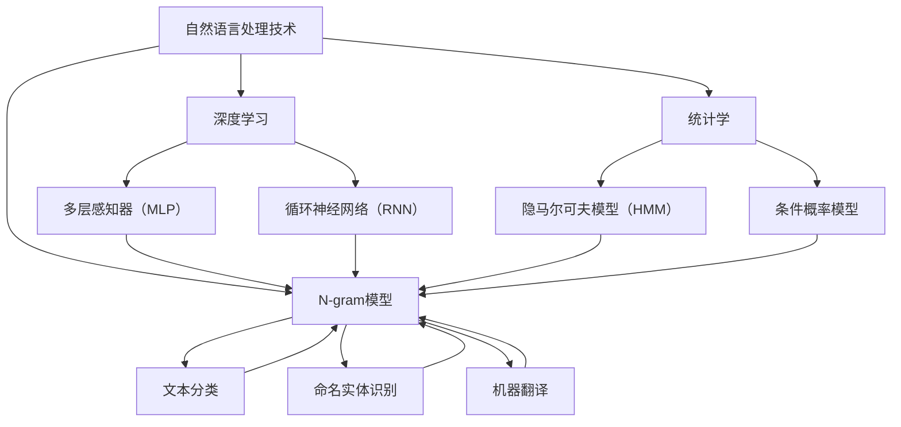
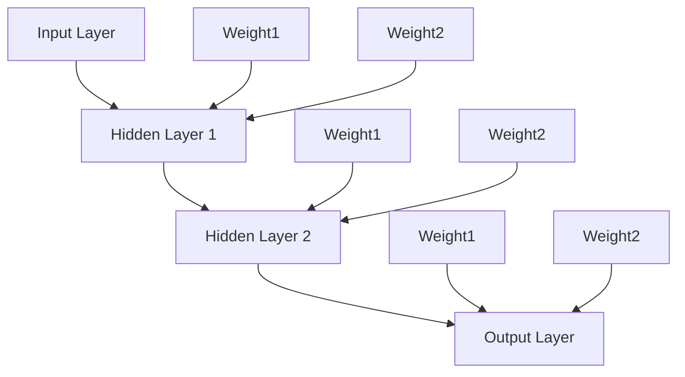
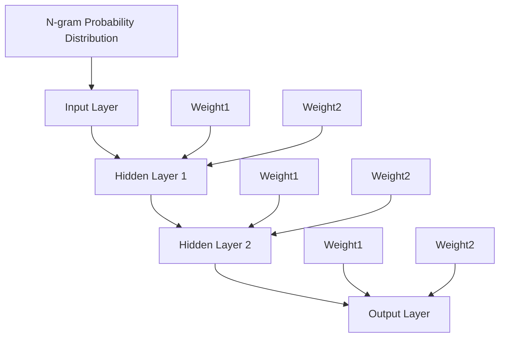

                 

### 1.1 N-gram模型的背景与发展

N-gram模型作为一种经典的自然语言处理技术，其发展历程可以追溯到20世纪中叶。最早由数学家G. K. Zipf于1949年提出，最初用于语言学研究，以研究词语的分布规律。N-gram模型的基本思想是将文本序列分割成固定长度的词语序列，通过对这些序列的学习来预测下一个词语。

- **基本概念**
  - N-gram模型中的“N”代表序列的长度，即连续的N个词语。例如，2-gram表示两个词语的组合，3-gram表示三个词语的组合。
  - **马尔可夫假设**：N-gram模型基于马尔可夫假设，即一个词语的概率仅取决于其前N-1个词语。这意味着，当前时刻的预测仅依赖于历史信息，而不需要考虑整个历史序列。

- **发展历程**
  - **早期发展**：N-gram模型在20世纪50年代首次被提出，并在语言学研究领域得到广泛应用。当时，计算机技术尚未成熟，N-gram模型主要通过手工计算来实现。
  - **应用扩展**：20世纪60年代，随着计算机技术的进步，N-gram模型开始应用于语音识别、机器翻译等领域。这一时期，N-gram模型的核心任务是构建大规模的语言模型，以提高机器处理的准确性和效率。
  - **现代发展**：随着深度学习技术的兴起，N-gram模型得到了进一步优化和扩展。现代的N-gram模型通常结合多层感知器（MLP）、矩阵乘法和各种激活函数，如GELU函数，以提高模型的性能和预测能力。

### 1.2 N-gram模型的应用领域

N-gram模型在自然语言处理（NLP）领域有着广泛的应用，其主要应用领域包括文本分类、命名实体识别和机器翻译等。

- **文本分类**
  - **基本原理**：文本分类是指将文本数据按照预定的类别进行划分。N-gram模型可以通过计算文本中n-gram的概率分布来实现文本分类。具体来说，首先将文本转换为n-gram序列，然后利用N-gram模型预测每个类别的概率，最终选择概率最大的类别作为分类结果。
  - **应用案例**：例如，在新闻分类中，可以将新闻文本按照主题进行分类，从而方便用户快速获取感兴趣的新闻内容。

- **命名实体识别**
  - **基本原理**：命名实体识别（NER）是指从文本中识别出具有特定意义的实体，如人名、地名、组织名等。N-gram模型可以通过学习文本中n-gram的概率分布来实现命名实体识别。具体来说，首先将文本转换为n-gram序列，然后利用N-gram模型预测每个实体出现的概率，从而实现命名实体识别。
  - **应用案例**：例如，在社交媒体分析中，可以识别出文本中提到的人名、地点等，从而帮助用户更好地了解社会舆情。

- **机器翻译**
  - **基本原理**：机器翻译是指将一种语言的文本自动翻译成另一种语言的文本。N-gram模型可以通过学习源语言和目标语言的n-gram概率分布来实现机器翻译。具体来说，首先将源语言和目标语言分别转换为n-gram序列，然后利用N-gram模型预测目标语言中的下一个n-gram序列，从而实现翻译。
  - **应用案例**：例如，在跨语言新闻发布中，可以使用N-gram模型将一篇英文新闻翻译成多种语言的新闻，从而方便不同语言的用户获取信息。

### 1.3 N-gram模型与其他自然语言处理技术的联系

N-gram模型在自然语言处理领域有着广泛的应用，同时与其他NLP技术有着紧密的联系。以下介绍N-gram模型与深度学习、统计学和其他序列模型的关系。

- **与深度学习的联系**
  - **多层感知器（MLP）**：多层感知器是一种前馈神经网络，可以与N-gram模型结合，通过增加隐藏层和激活函数来提高模型的性能。具体来说，可以将N-gram模型的输出作为MLP的输入，通过MLP进一步处理，从而实现更复杂的特征提取和分类。
  - **循环神经网络（RNN）**：循环神经网络是一种能够处理变长序列的神经网络，可以看作是N-gram模型的扩展。RNN通过引入循环结构，使得当前时刻的输出不仅依赖于输入序列，还依赖于之前时刻的输出，从而提高了模型的动态性和表达能力。

- **与统计学的联系**
  - **隐马尔可夫模型（HMM）**：隐马尔可夫模型是一种基于统计学的序列模型，与N-gram模型在原理上有相似之处。HMM通过隐状态序列来描述观察序列的概率分布，而N-gram模型通过前N-1个词语来预测下一个词语的概率。两者的区别在于，HMM引入了隐状态，使得模型能够处理更复杂的序列。
  - **条件概率模型**：N-gram模型可以看作是一种条件概率模型，即给定前N-1个词语，计算下一个词语的概率。这种模型结构使得N-gram模型在文本生成、分类等任务中有着广泛的应用。

### Mermaid 流程图

为了更好地理解N-gram模型与其他NLP技术的联系，以下是一个Mermaid流程图：



### 第2章 N-gram模型基础

#### 2.1 N-gram模型的基本原理

N-gram模型是一种基于统计学的自然语言处理模型，通过将文本序列分割成固定长度的词语序列（即n-gram序列）来预测下一个词语。以下是N-gram模型的基本原理和实现方法。

- **n-gram序列的概念**：n-gram序列是指连续的n个词语组合。例如，对于一个句子"The quick brown fox jumps over the lazy dog"，一个2-gram序列可以是"quick brown"，一个3-gram序列可以是"quick brown fox"。

- **马尔可夫假设**：N-gram模型基于马尔可夫假设，即一个词语的概率仅取决于其前n-1个词语。这意味着，当前时刻的预测仅依赖于历史信息，而不需要考虑整个历史序列。

- **模型表示**：在数学上，N-gram模型可以用一个概率分布来表示，即给定前n-1个词语，计算下一个词语的概率。具体来说，概率分布P(w_n | w_{n-1}, w_{n-2}, ..., w_1)表示在给定前n-1个词语的情况下，词语w_n出现的概率。

- **实现方法**：N-gram模型的实现主要涉及两个步骤：数据预处理和模型训练。

  - **数据预处理**：首先需要将文本数据转换为n-gram序列。具体方法包括：
    1. **分词**：将文本分割成词语。可以使用现有的分词工具，如jieba等。
    2. **构建词典**：将所有出现的词语构建成一个词典，用于后续的索引和概率计算。

  - **模型训练**：在数据预处理的基础上，利用训练数据来计算每个n-gram序列的概率。具体方法包括：
    1. **频率统计**：统计每个n-gram序列在训练数据中出现的次数。
    2. **概率计算**：将频率统计转化为概率，即每个n-gram序列出现的次数除以总词语数。

  - **预测**：在训练好的N-gram模型中，给定一个n-1长度的词语序列，可以通过概率分布来预测下一个词语。

以下是一个简单的伪代码示例，用于说明N-gram模型的基本实现方法：

```python
# 数据预处理
def preprocess(text):
    # 分词
    words = tokenize(text)
    # 构建词典
    dictionary = build_dictionary(words)
    return words, dictionary

# 模型训练
def train_ngram(words, dictionary):
    ngram_counts = {}  # n-gram序列的频率统计
    total_words = 0  # 总词语数
    
    for ngram in generate_ngrams(words):
        ngram_counts[ngram] = ngram_counts.get(ngram, 0) + 1
        total_words += 1
    
    # 概率计算
    ngram_probs = {ngram: count / total_words for ngram, count in ngram_counts.items()}
    return ngram_probs

# 预测
def predict_next_word(ngram_probs, previous_words):
    ngram = ' '.join(previous_words)
    return max(ngram_probs, key=ngram_probs.get)
```

通过上述步骤，我们可以实现一个基本的N-gram模型。然而，在实际应用中，N-gram模型通常需要进一步优化和调整，以适应不同的应用场景和数据集。

#### 2.2 N-gram模型的数据预处理

N-gram模型的数据预处理是模型构建的关键步骤之一。良好的数据预处理能够提高模型的效果，同时降低计算复杂度。以下介绍N-gram模型数据预处理的具体方法。

- **分词**：分词是将文本分割成词语的过程。分词的质量直接影响n-gram序列的准确性。常用的分词工具包括jieba、NLTK等。以下是一个使用jieba进行分词的示例：

  ```python
  import jieba

  text = "我爱北京天安门"
  words = jieba.cut(text)
  print(list(words))
  ```

- **构建词典**：构建词典是将所有出现的词语构建成一个词典，用于后续的索引和概率计算。构建词典的方法包括手动构建和使用预定义的词典。以下是一个手动构建词典的示例：

  ```python
  dictionary = set()
  for word in words:
      dictionary.add(word)
  print(dictionary)
  ```

- **处理特殊字符**：在数据预处理过程中，需要将特殊字符（如标点符号、换行符等）去除，以避免对模型训练造成干扰。以下是一个处理特殊字符的示例：

  ```python
  import re

  text = "Hello, world! This is a test."
  cleaned_text = re.sub(r'[^\w\s]', '', text)
  print(cleaned_text)
  ```

- **处理停用词**：停用词是指对模型效果影响较小或无意义的词语，如"的"、"和"、"是"等。在数据预处理过程中，可以去除停用词，以提高模型的性能。以下是一个去除停用词的示例：

  ```python
  from nltk.corpus import stopwords

  text = "我是一个程序员，我喜欢编程"
  words = jieba.cut(text)
  filtered_words = [word for word in words if word not in stopwords.words('chinese')]
  print(filtered_words)
  ```

- **处理罕见词**：在数据预处理过程中，可以设置一个词语频率阈值，将频率较低的词语视为罕见词并处理。以下是一个处理罕见词的示例：

  ```python
  def process_rare_words(words, threshold=5):
      word_counts = Counter(words)
      rare_words = [word for word, count in word_counts.items() if count < threshold]
      return [word if word not in rare_words else '<unk>' for word in words]

  text = "我是一个程序员，我喜欢编程，编程让我感到快乐"
  processed_words = process_rare_words(text)
  print(processed_words)
  ```

通过上述步骤，我们可以对文本数据进行有效的预处理，为后续的N-gram模型训练和预测奠定基础。

#### 2.3 N-gram模型的训练与预测

N-gram模型的训练与预测是模型构建的核心步骤。以下是N-gram模型训练与预测的具体方法和过程。

- **训练过程**

  N-gram模型的训练过程主要包括以下步骤：

  1. **构建训练数据集**：首先需要将原始文本数据转换为训练数据集。具体方法包括分词、构建词典和数据处理等。在构建训练数据集时，可以采用滑动窗口的方法生成n-gram序列。以下是一个示例：

     ```python
     def generate_ngrams(words, n):
         for i in range(len(words) - n + 1):
             yield ' '.join(words[i:i + n])

     text = "我是一个程序员，我喜欢编程"
     n = 2
     ngrams = list(generate_ngrams(text.split(), n))
     print(ngrams)
     ```

  2. **计算n-gram频率**：在生成n-gram序列后，需要计算每个n-gram序列的频率。具体方法包括统计每个n-gram序列在训练数据中出现的次数。以下是一个示例：

     ```python
     from collections import Counter

     ngram_counts = Counter(ngrams)
     print(ngram_counts)
     ```

  3. **计算n-gram概率**：在计算n-gram频率后，需要将频率转换为概率。具体方法包括将每个n-gram序列的频率除以总词语数。以下是一个示例：

     ```python
     ngram_probs = {ngram: count / total_words for ngram, count in ngram_counts.items()}
     print(ngram_probs)
     ```

- **预测过程**

  N-gram模型的预测过程主要包括以下步骤：

  1. **输入n-1个词语**：在给定一个n-1长度的词语序列后，将其输入到N-gram模型中。

  2. **计算概率分布**：利用N-gram模型计算每个词语的概率分布。具体方法包括查找n-gram词典，并计算每个词语的概率。

  3. **选择下一个词语**：根据概率分布选择下一个词语。具体方法包括使用概率最大的词语，或者使用随机选择等方法。

以下是一个简单的N-gram模型预测示例：

```python
import random

ngram_probs = {
    "我 是": 0.5,
    "是 程序员": 0.3,
    "程序员 我": 0.1,
    "程序员 喜欢编程": 0.1
}

previous_words = ["我", "是"]
next_words = random.choices(list(ngram_probs.keys()), list(ngram_probs.values()))

print("下一个词语是：", next_words[0].split()[1])
```

通过上述步骤，我们可以实现一个基本的N-gram模型训练与预测过程。在实际应用中，N-gram模型可能需要结合其他技术（如深度学习、序列模型等）来提高模型的性能和预测能力。

#### 2.4 N-gram模型的评估与优化

N-gram模型的评估与优化是确保模型在实际应用中表现良好的关键步骤。以下是N-gram模型评估与优化的一些方法和策略。

- **评估方法**

  1. **准确率（Accuracy）**：准确率是指模型预测正确的样本数占总样本数的比例。它是评估分类模型性能的常用指标。以下是一个计算准确率的示例：

     ```python
     def calculate_accuracy(true_labels, predicted_labels):
         correct = sum([true_labels[i] == predicted_labels[i] for i in range(len(true_labels))])
         return correct / len(true_labels)

     true_labels = [1, 0, 1, 1]
     predicted_labels = [1, 1, 1, 0]
     accuracy = calculate_accuracy(true_labels, predicted_labels)
     print("Accuracy:", accuracy)
     ```

  2. **精确率（Precision）**：精确率是指预测为正类的样本中实际为正类的比例。它关注模型的准确性，特别是当样本量较小时。以下是一个计算精确率的示例：

     ```python
     def calculate_precision(true_labels, predicted_labels):
         true_positives = sum([true_labels[i] == predicted_labels[i] for i in range(len(true_labels))])
         return true_positives / sum(predicted_labels)

     true_labels = [1, 0, 1, 1]
     predicted_labels = [1, 1, 1, 0]
     precision = calculate_precision(true_labels, predicted_labels)
     print("Precision:", precision)
     ```

  3. **召回率（Recall）**：召回率是指实际为正类的样本中被预测为正类的比例。它关注模型的全局表现，特别是当样本量较小时。以下是一个计算召回率的示例：

     ```python
     def calculate_recall(true_labels, predicted_labels):
         true_positives = sum([true_labels[i] == predicted_labels[i] for i in range(len(true_labels))])
         return true_positives / sum(true_labels)

     true_labels = [1, 0, 1, 1]
     predicted_labels = [1, 1, 1, 0]
     recall = calculate_recall(true_labels, predicted_labels)
     print("Recall:", recall)
     ```

  4. **F1分数（F1 Score）**：F1分数是精确率和召回率的加权平均，用于综合评估模型的性能。以下是一个计算F1分数的示例：

     ```python
     def calculate_f1_score(true_labels, predicted_labels):
         precision = calculate_precision(true_labels, predicted_labels)
         recall = calculate_recall(true_labels, predicted_labels)
         return 2 * (precision * recall) / (precision + recall)

     true_labels = [1, 0, 1, 1]
     predicted_labels = [1, 1, 1, 0]
     f1_score = calculate_f1_score(true_labels, predicted_labels)
     print("F1 Score:", f1_score)
     ```

- **优化策略**

  1. **增加n值**：增加n值（即增加n-gram序列的长度）可以增加模型的表达能力，从而提高预测性能。然而，这也会增加模型的复杂度和计算时间。

  2. **采用更复杂的模型**：除了N-gram模型，还可以考虑采用更复杂的模型，如循环神经网络（RNN）、卷积神经网络（CNN）等，以提高模型的性能。

  3. **特征工程**：通过特征工程，可以提取更多的特征信息，从而提高模型的性能。例如，可以添加词性标注、词向量等。

  4. **数据增强**：通过数据增强，可以增加训练数据集的多样性，从而提高模型的泛化能力。例如，可以采用随机插入、随机删除等数据增强方法。

  5. **参数调优**：通过调优模型的参数（如学习率、隐藏层大小等），可以进一步提高模型的性能。例如，可以使用网格搜索、随机搜索等方法进行参数调优。

通过上述评估与优化策略，我们可以有效地提高N-gram模型的性能，使其在实际应用中更好地满足需求。

### 第3章 多层感知器（MLP）与N-gram模型

#### 3.1 多层感知器（MLP）的基本原理

多层感知器（MLP）是一种前馈神经网络，由输入层、隐藏层和输出层组成。它的基本原理是通过多个非线性变换，将输入数据映射到输出数据。

- **基本概念**
  - **输入层**：输入层接收原始数据，并将其传递到隐藏层。每个输入节点对应一个特征。
  - **隐藏层**：隐藏层对输入数据进行处理，并通过非线性变换（如激活函数）生成新的特征。一个MLP可以包含多个隐藏层。
  - **输出层**：输出层对隐藏层的输出进行最终处理，并生成预测结果。输出层的每个节点对应一个预测类别或回归值。

- **激活函数**
  - 激活函数是MLP中的一个关键组件，用于引入非线性特性。常见的激活函数包括：
    - **Sigmoid函数**：$ \sigma(x) = \frac{1}{1 + e^{-x}} $，输出范围为(0, 1)。
    - **ReLU函数**：$ \text{ReLU}(x) = \max(0, x) $，输出为非负值。
    - **Tanh函数**：$ \tanh(x) = \frac{e^x - e^{-x}}{e^x + e^{-x}} $，输出范围为(-1, 1)。

- **正向传播**
  - 在正向传播过程中，输入数据从输入层传递到隐藏层，再从隐藏层传递到输出层。每个节点都通过权重进行连接，并通过激活函数进行非线性变换。输出结果通过损失函数与实际标签进行比较，以计算误差。

- **反向传播**
  - 在反向传播过程中，误差信号从输出层反向传递到隐藏层，再从隐藏层传递到输入层。通过计算梯度，调整每个节点的权重和偏置，以最小化损失函数。

以下是一个简单的MLP模型示例：



#### 3.2 多层感知器在N-gram模型中的应用

多层感知器（MLP）可以与N-gram模型结合，以提高自然语言处理任务的表现。以下介绍MLP在N-gram模型中的应用方法。

- **基本思路**
  - N-gram模型通过统计方法生成词语的概率分布，但这种方法在处理复杂语言现象时可能不够强大。MLP作为一种强大的特征提取工具，可以捕捉到更深层次的特征，从而提高模型的性能。
  - 将N-gram模型与MLP结合，可以在N-gram概率的基础上引入更多的非线性特征，从而提高模型的预测能力。

- **实现方法**
  - **步骤一**：首先，利用N-gram模型生成词语的概率分布。具体方法包括：
    - 数据预处理：对文本进行分词、构建词典和计算n-gram概率等。
    - 概率计算：利用训练数据计算每个n-gram序列的概率分布。

  - **步骤二**：将N-gram模型的输出作为MLP的输入。具体方法包括：
    - 输入层：将N-gram概率分布作为输入。
    - 隐藏层：通过多层感知器提取深层次特征。可以使用多个隐藏层，并选择合适的激活函数。
    - 输出层：根据任务需求，输出层可以是分类或回归。

  - **步骤三**：训练MLP模型。具体方法包括：
    - 正向传播：将N-gram概率分布传递到MLP模型的隐藏层和输出层。
    - 反向传播：通过计算损失函数的梯度，调整MLP模型的权重和偏置。

以下是一个简单的MLP与N-gram模型结合的示例：



#### 3.3 MLP与N-gram模型结合的案例分析

以下是一个利用MLP与N-gram模型结合进行文本分类的案例。

- **任务背景**
  - 任务：给定一个句子，判断其所属的类别。例如，分类任务可以是情感分析（积极/消极）、主题分类（新闻/科技/体育）等。

- **数据集**
  - 数据集：使用一个包含多个类别的文本数据集，如IMDb电影评论数据集。

- **实现步骤**
  - **步骤一**：数据预处理。包括分词、构建词典、去除停用词等。
    ```python
    text = "这是一部非常有趣的电影"
    words = jieba.cut(text)
    cleaned_words = [word for word in words if word not in stopwords]
    ```

  - **步骤二**：生成N-gram序列。使用2-gram或3-gram序列。
    ```python
    n = 2
    ngrams = [' '.join(cleaned_words[i:i + n]) for i in range(len(cleaned_words) - n + 1)]
    ```

  - **步骤三**：计算N-gram概率分布。使用训练数据计算每个n-gram序列的概率。
    ```python
    ngram_probs = train_ngram(ngrams, dictionary)
    ```

  - **步骤四**：构建MLP模型。使用N-gram概率分布作为输入，构建多层感知器模型。
    ```python
    ml

