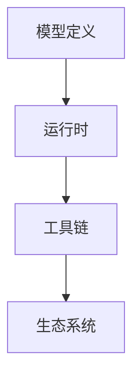
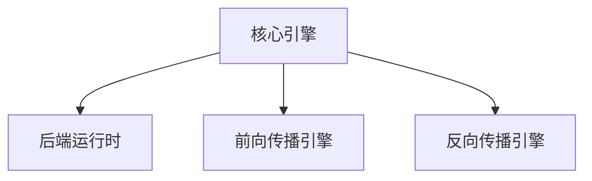

                 


## 文章标题: ONNX Runtime 跨平台推理：在不同设备上运行模型

关键词：ONNX,跨平台推理，模型运行，CPU，GPU，移动设备，工业应用，AI开发

摘要：本文将深入探讨ONNX Runtime的跨平台推理能力，详细解析其在不同设备上运行模型的技术原理、优化策略以及实际应用案例。我们将通过逐步分析，帮助读者全面了解ONNX Runtime在AI领域的价值与未来前景。

### 目录

1. **引言**  
   - ONNX Runtime的重要性  
   - 跨平台推理的需求与挑战

2. **第一部分: ONNX Runtime基础**  
   - **第1章: ONNX概述**  
     - **1.1 ONNX的起源与目的**  
     - **1.2 ONNX的核心优势**  
     - **1.3 ONNX的架构与组件**  
   - **第2章: ONNX Runtime简介**  
     - **2.1 ONNX Runtime的功能**  
     - **2.2 ONNX Runtime的架构**  
     - **2.3 ONNX Runtime的关键特性**  
   - **第3章: ONNX Runtime的使用方法**  
     - **3.1 环境搭建**  
     - **3.2 模型加载与配置**  
     - **3.3 推理流程**

3. **第二部分: 跨平台推理**  
   - **第4章: ONNX Runtime在CPU上的推理**  
     - **4.1 CPU推理性能优化**  
     - **4.2 CPU上的推理案例**  
   - **第5章: ONNX Runtime在GPU上的推理**  
     - **5.1 GPU推理的优势**  
     - **5.2 GPU推理的配置**  
     - **5.3 GPU上的推理案例**  
   - **第6章: ONNX Runtime在移动设备上的推理**  
     - **6.1 移动设备的挑战**  
     - **6.2 ONNX Runtime在移动设备上的优化**  
     - **6.3 移动设备上的推理案例**

4. **第三部分: 实际应用**  
   - **第7章: ONNX Runtime在工业级应用中的使用**  
     - **7.1 工业级应用的挑战**  
     - **7.2 ONNX Runtime在工业级应用中的实践**  
     - **7.3 成功案例分享**  
   - **第8章: ONNX Runtime的未来发展**  
     - **8.1 ONNX Runtime的技术演进**  
     - **8.2 ONNX Runtime在AI领域的影响**  
     - **8.3 ONNX Runtime的未来展望**

5. **附录**  
   - **附录A: ONNX Runtime开发工具与环境配置**  
   - **附录B: ONNX Runtime参考文档与资源**

### 引言

#### ONNX Runtime的重要性

在当今的AI和深度学习领域中，模型的可移植性和高效推理变得至关重要。ONNX（Open Neural Network Exchange）作为一种开放格式的模型交换协议，致力于解决模型在不同框架间迁移的难题。ONNX Runtime则是实现这种跨平台推理的关键工具。

ONNX Runtime的重要性体现在以下几个方面：

1. **跨平台兼容性**：ONNX Runtime能够支持多种编程语言和运行环境，如CPU、GPU和移动设备，使得开发者无需关心底层实现细节，只需专注于模型开发和优化。
2. **高性能推理**：ONNX Runtime通过优化推理算法和底层实现，提供高性能的推理能力，满足实时推理的需求。
3. **简化开发流程**：使用ONNX Runtime，开发者可以轻松地将模型部署到不同的平台上，从而减少开发时间和成本。

#### 跨平台推理的需求与挑战

随着AI应用场景的多样化，跨平台推理的需求日益增长。然而，实现这一目标并非易事，主要面临以下挑战：

1. **硬件差异**：不同设备的硬件架构和性能差异巨大，如CPU、GPU、FPGA等，这要求ONNX Runtime具备良好的硬件抽象层。
2. **性能优化**：为不同设备提供高效推理，需要针对特定硬件进行性能优化，如利用并行计算、GPU加速等技术。
3. **资源限制**：移动设备和嵌入式设备资源有限，如何高效利用这些资源进行推理是关键挑战。
4. **兼容性问题**：不同设备和框架间的兼容性可能存在问题，ONNX Runtime需要提供稳定的跨平台支持。

接下来的章节将详细探讨ONNX Runtime的基础知识、跨平台推理的实现策略以及实际应用场景，帮助读者全面了解并掌握这一关键工具。让我们一起深入探讨，揭开ONNX Runtime的神秘面纱。

### 第一部分: ONNX Runtime基础

#### 第1章: ONNX概述

##### 1.1 ONNX的起源与目的

ONNX（Open Neural Network Exchange）是由微软、Facebook、IBM、英伟达等科技公司共同发起的一个开放格式协议，旨在解决深度学习模型的跨平台可移植性问题。它的起源可以追溯到2016年，当时各大科技公司意识到，现有的深度学习框架如TensorFlow、PyTorch等虽然功能强大，但在模型迁移和共享方面存在诸多不便。为了打破这种技术壁垒，他们共同合作，提出了ONNX这一开放格式。

ONNX的目的是实现深度学习模型的统一格式，使得模型可以在不同的深度学习框架和不同平台之间无缝迁移。这一目标的实现不仅能够提高开发者的工作效率，还能够促进模型复用和技术创新。

##### 1.2 ONNX的核心优势

ONNX具有以下几大核心优势：

1. **跨平台兼容性**：ONNX提供了一种统一的模型格式，使得模型可以在多种深度学习框架和平台上运行，如TensorFlow、PyTorch、MXNet、Caffe等，以及不同的操作系统和硬件平台，如Windows、Linux、macOS等。
2. **模型可移植性**：开发者可以轻松地将一个框架中的模型迁移到另一个框架中，无需重新训练或修改代码，从而节省时间和成本。
3. **高效推理**：ONNX Runtime作为ONNX的推理引擎，能够针对不同硬件进行优化，提供高性能的推理能力。
4. **开源和社区支持**：ONNX是开源的，拥有广泛的社区支持，吸引了众多开发者和企业的参与，不断推动其发展和完善。

##### 1.3 ONNX的架构与组件

ONNX的架构主要由以下几个组件构成：

1. **模型定义**：ONNX定义了一种统一的模型定义语言，包括神经网络的结构、权重、激活函数等，使得模型可以以一种标准化的方式表示。
2. **运行时**：ONNX Runtime是ONNX的推理引擎，负责将ONNX模型转化为可执行的程序，并在不同的平台上运行。它支持多种编程语言和运行环境，如Python、C++、Java等。
3. **工具链**：ONNX提供了一系列工具链，包括模型转换工具、优化工具、调试工具等，帮助开发者更方便地使用ONNX。
4. **生态系统**：ONNX拥有一个庞大的生态系统，包括深度学习框架、开发工具、硬件加速器等，共同推动ONNX的发展和普及。

ONNX的架构示意图如下：



通过上述组件的协同工作，ONNX实现了深度学习模型的跨平台可移植性和高效推理，为开发者提供了一种强大的工具，助力他们在各种场景中轻松实现AI应用。

##### 1.4 ONNX的关键特性

除了上述优势外，ONNX还具有以下关键特性：

1. **可扩展性**：ONNX支持自定义操作和数据类型，使得开发者可以根据特定需求扩展其功能。
2. **高性能**：ONNX Runtime通过优化算法和底层实现，提供了高性能的推理能力，能够满足实时推理的需求。
3. **安全性**：ONNX采用标准化的格式和加密技术，保证了模型的可靠性和安全性。
4. **可解释性**：ONNX支持模型的可视化和解释，帮助开发者更好地理解模型的工作原理和性能表现。

综上所述，ONNX通过其统一的模型格式、跨平台兼容性、高效推理能力以及丰富的生态系统，为开发者提供了一种强大的工具，助力他们在各种场景中实现深度学习模型的快速开发和部署。

#### 第2章: ONNX Runtime简介

##### 2.1 ONNX Runtime的功能

ONNX Runtime是ONNX的核心组件之一，主要负责将ONNX模型转化为可执行的程序，并在各种平台上进行高效推理。其主要功能包括：

1. **模型加载与配置**：ONNX Runtime能够加载ONNX模型文件，并根据配置信息进行相应的预处理，如数据类型转换、批量大小设置等。
2. **推理执行**：ONNX Runtime负责执行模型的推理过程，包括前向传播和反向传播（如果需要）。它能够利用不同硬件平台（如CPU、GPU）的特性，实现高性能的推理。
3. **结果输出**：ONNX Runtime将推理结果以标准化的格式输出，如数值数组、文本标签等，便于后续处理和展示。

##### 2.2 ONNX Runtime的架构

ONNX Runtime的架构设计旨在实现高效、灵活和跨平台的推理能力。其主要组成部分如下：

1. **核心引擎**：核心引擎是ONNX Runtime的核心，负责模型加载、配置、推理执行和结果输出。它采用模块化设计，支持多种编程语言和运行环境，如C++、Python、Java等。
2. **后端运行时**：后端运行时负责与特定硬件平台（如CPU、GPU）进行交互，实现模型的硬件加速和优化。它支持多种硬件平台，如Intel CPU、NVIDIA GPU、AMD GPU等。
3. **前向传播引擎**：前向传播引擎负责实现模型的前向传播过程，包括输入数据的预处理、中间结果的计算和输出数据的生成。它采用并行计算和流水线技术，提高推理效率。
4. **反向传播引擎**：反向传播引擎负责实现模型的反向传播过程，用于训练模型的权重和偏置。它支持自动微分和梯度计算，使得模型可以自适应地调整参数。

ONNX Runtime的架构示意图如下：



通过上述组件的协同工作，ONNX Runtime实现了高效、灵活和跨平台的推理能力，为开发者提供了一种强大的工具，助力他们在各种场景中实现深度学习模型的快速开发和部署。

##### 2.3 ONNX Runtime的关键特性

ONNX Runtime具有以下关键特性：

1. **高性能**：ONNX Runtime通过优化算法和底层实现，提供了高性能的推理能力。它支持多种硬件平台，如CPU、GPU、FPGA等，能够根据不同硬件特性进行优化。
2. **跨平台兼容性**：ONNX Runtime支持多种编程语言和运行环境，如C++、Python、Java等，能够在不同操作系统（如Windows、Linux、macOS）和硬件平台上运行。
3. **灵活可扩展**：ONNX Runtime采用模块化设计，支持自定义操作和数据类型，开发者可以根据特定需求扩展其功能。
4. **丰富的API接口**：ONNX Runtime提供丰富的API接口，使得开发者可以轻松集成到现有项目中，实现高效的模型推理和部署。
5. **社区支持**：ONNX Runtime是开源项目，拥有广泛的社区支持，吸引了众多开发者和企业的参与，不断推动其发展和完善。

综上所述，ONNX Runtime通过其高性能、跨平台兼容性、灵活可扩展性和丰富的API接口，为开发者提供了一种强大的工具，助力他们在各种场景中实现深度学习模型的快速开发和部署。

#### 第3章: ONNX Runtime的使用方法

##### 3.1 环境搭建

要在项目中使用ONNX Runtime，首先需要搭建合适的开发环境。以下是搭建ONNX Runtime开发环境的步骤：

1. **安装依赖库**：确保系统已安装Python、CMake等依赖库。Python是ONNX Runtime的主要编程语言，CMake用于构建项目。可以使用以下命令安装Python：
   ```bash
   sudo apt-get install python3 python3-pip
   ```
2. **安装ONNX库**：使用pip命令安装ONNX库：
   ```bash
   pip3 install onnx
   ```
3. **安装ONNX Runtime库**：使用pip命令安装ONNX Runtime库：
   ```bash
   pip3 install onnxruntime
   ```

##### 3.2 模型加载与配置

加载ONNX模型并配置相关参数是使用ONNX Runtime的第一步。以下是加载和配置模型的示例代码：

```python
import onnxruntime as ort

# 加载ONNX模型
session = ort.InferenceSession("model.onnx")

# 获取模型输入和输出节点名称
input_nodes = session.get_inputs()
output_nodes = session.get_outputs()

# 配置推理参数
# 例如设置批量大小
session.set_providers(["CPUExecutionProvider"])

# 获取输入数据
input_data = ...

# 执行推理
outputs = session.run(output_nodes, input_data)

# 处理输出结果
```

在上面的代码中，首先加载ONNX模型，然后获取模型的输入和输出节点名称。接着，通过`set_providers`方法设置推理使用的执行提供者，例如CPU或GPU。最后，通过`run`方法执行推理，并处理输出结果。

##### 3.3 推理流程

ONNX Runtime的推理流程相对简单，主要包括以下步骤：

1. **加载模型**：使用`InferenceSession`类加载ONNX模型。
2. **获取输入和输出节点**：通过`get_inputs`和`get_outputs`方法获取模型的输入和输出节点。
3. **配置参数**：设置推理参数，如执行提供者、批量大小等。
4. **准备输入数据**：将实际输入数据准备好，并将其传递给模型。
5. **执行推理**：使用`run`方法执行推理，获取输出结果。
6. **处理输出结果**：对输出结果进行后处理，如解码、归一化等。

以下是完整的推理流程示例代码：

```python
import onnxruntime as ort

# 加载ONNX模型
session = ort.InferenceSession("model.onnx")

# 获取输入和输出节点名称
input_nodes = session.get_inputs()
output_nodes = session.get_outputs()

# 配置推理参数
session.set_providers(["CPUExecutionProvider"])

# 准备输入数据
input_data = ...  # 例如：[1, 224, 224, 3]的格式

# 执行推理
outputs = session.run(output_nodes, input_data)

# 处理输出结果
predictions = outputs[0].astype(np.float32)
print(predictions)
```

在这个示例中，首先加载ONNX模型，并设置推理参数。然后，准备输入数据并执行推理，最后处理输出结果。通过以上步骤，可以轻松地在项目中使用ONNX Runtime进行高效推理。

### 第二部分: 跨平台推理

#### 第4章: ONNX Runtime在CPU上的推理

##### 4.1 CPU推理性能优化

在CPU上进行推理时，性能优化是提高推理速度和效率的关键。以下是几种常见的CPU推理性能优化策略：

1. **并行计算**：利用多线程或多进程技术，将模型的推理过程分解成多个并行任务。Python中的`concurrent.futures`模块可以方便地实现并行计算。

2. **数据类型优化**：选择适当的数据类型可以显著提高推理速度。例如，将数据类型从`float32`转换为`float16`可以减少计算量和内存占用。

3. **批量大小调整**：合理设置批量大小可以平衡推理速度和资源利用。对于较小的批量大小，可以利用CPU的多核特性进行并行计算；对于较大的批量大小，可以减少内存占用，提高缓存利用率。

4. **内存管理**：优化内存分配和释放，减少内存访问冲突和缓存失效。使用`NumPy`数组时，可以使用`numpy.array`函数预先分配内存，避免频繁的内存分配和释放。

5. **算法优化**：对模型的算法进行优化，减少冗余计算和内存访问。例如，使用矩阵乘法库（如`NumPy`、`TensorFlow`）进行高效计算。

##### 4.2 CPU上的推理案例

以下是一个简单的CPU推理案例，使用ONNX Runtime在CPU上进行图像分类任务的推理。

1. **模型准备**：首先准备一个预训练的图像分类模型，并将其转换为ONNX格式。这里使用的是ResNet50模型。

   ```python
   import onnx
   import torch
   from torchvision import models

   # 加载预训练的ResNet50模型
   model = models.resnet50(pretrained=True)

   # 将PyTorch模型转换为ONNX模型
   model.eval()
   input_size = (1, 3, 224, 224)
   output_size = (1, 1000)
   input_tensor = torch.randn(input_size)
   torch.onnx.export(model, input_tensor, "resnet50.onnx", input_args=input_tensor.shape)
   ```

2. **模型加载与配置**：使用ONNX Runtime加载模型，并设置CPU执行提供者。

   ```python
   import onnxruntime as ort

   # 加载ONNX模型
   session = ort.InferenceSession("resnet50.onnx")

   # 设置CPU执行提供者
   session.set_providers(["CPUExecutionProvider"])
   ```

3. **数据预处理**：将输入图像进行缩放和归一化，以适应ONNX模型的输入要求。

   ```python
   import cv2
   import numpy as np

   # 读取图像
   image = cv2.imread("image.jpg")

   # 缩放图像到224x224
   image = cv2.resize(image, (224, 224))

   # 归一化图像
   image = image.astype(np.float32) / 255.0
   image = np.expand_dims(image, axis=0)
   ```

4. **执行推理**：使用ONNX Runtime执行推理，并处理输出结果。

   ```python
   # 执行推理
   outputs = session.run(["output"], {"input": image})

   # 获取预测结果
   predictions = outputs[0].astype(np.float32)

   # 输出预测结果
   print(predictions)
   ```

在这个案例中，首先使用PyTorch模型生成ONNX模型，然后使用ONNX Runtime在CPU上进行推理。通过合理的预处理和性能优化，可以实现高效的CPU推理。

#### 第5章: ONNX Runtime在GPU上的推理

##### 5.1 GPU推理的优势

使用ONNX Runtime在GPU上进行推理具有以下优势：

1. **高性能计算**：GPU具有强大的并行计算能力，可以显著提高模型的推理速度，满足实时推理的需求。
2. **硬件优化**：ONNX Runtime针对不同GPU硬件（如NVIDIA GPU、AMD GPU）进行优化，能够充分利用GPU的硬件特性，实现高效推理。
3. **灵活可扩展**：ONNX Runtime支持多种GPU推理后端，如CUDA、ROCm等，开发者可以根据具体硬件选择合适的后端，实现最佳性能。
4. **跨平台兼容性**：ONNX Runtime不仅支持GPU推理，还支持CPU推理，使得开发者可以轻松地在不同硬件平台上部署模型。

##### 5.2 GPU推理的配置

要在ONNX Runtime中进行GPU推理，需要进行以下配置：

1. **安装CUDA或ROCm**：确保系统已安装适当的GPU驱动和CUDA或ROCm库。CUDA是NVIDIA GPU的官方库，ROCm是AMD GPU的官方库。

2. **安装ONNX Runtime GPU版本**：使用pip命令安装支持GPU推理的ONNX Runtime版本。

   ```bash
   pip install onnxruntime-gpu
   ```

3. **配置GPU环境**：设置环境变量，指定CUDA或ROCm库的路径。

   ```bash
   export CUDA_HOME=/usr/local/cuda
   export ROCM_HOME=/opt/rocm
   ```

4. **设置执行提供者**：在加载模型时，设置GPU执行提供者。

   ```python
   import onnxruntime as ort

   # 设置GPU执行提供者
   session = ort.InferenceSession("model.onnx", providers=["CUDAExecutionProvider" or "ROCmExecutionProvider"])
   ```

##### 5.3 GPU上的推理案例

以下是一个简单的GPU推理案例，使用ONNX Runtime在GPU上进行图像分类任务的推理。

1. **模型准备**：首先准备一个预训练的图像分类模型，并将其转换为ONNX格式。这里使用的是ResNet50模型。

   ```python
   import onnx
   import torch
   from torchvision import models

   # 加载预训练的ResNet50模型
   model = models.resnet50(pretrained=True)

   # 将PyTorch模型转换为ONNX模型
   model.eval()
   input_size = (1, 3, 224, 224)
   output_size = (1, 1000)
   input_tensor = torch.randn(input_size)
   torch.onnx.export(model, input_tensor, "resnet50.onnx", input_args=input_tensor.shape)
   ```

2. **模型加载与配置**：使用ONNX Runtime加载模型，并设置GPU执行提供者。

   ```python
   import onnxruntime as ort

   # 加载ONNX模型
   session = ort.InferenceSession("resnet50.onnx")

   # 设置GPU执行提供者
   session.set_providers(["CUDAExecutionProvider" or "ROCmExecutionProvider"])
   ```

3. **数据预处理**：将输入图像进行缩放和归一化，以适应ONNX模型的输入要求。

   ```python
   import cv2
   import numpy as np

   # 读取图像
   image = cv2.imread("image.jpg")

   # 缩放图像到224x224
   image = cv2.resize(image, (224, 224))

   # 归一化图像
   image = image.astype(np.float32) / 255.0
   image = np.expand_dims(image, axis=0)
   ```

4. **执行推理**：使用ONNX Runtime执行GPU推理，并处理输出结果。

   ```python
   # 执行推理
   outputs = session.run(["output"], {"input": image})

   # 获取预测结果
   predictions = outputs[0].astype(np.float32)

   # 输出预测结果
   print(predictions)
   ```

在这个案例中，首先使用PyTorch模型生成ONNX模型，然后使用ONNX Runtime在GPU上进行推理。通过合理的预处理和性能优化，可以实现高效的GPU推理。

### 第6章: ONNX Runtime在移动设备上的推理

#### 6.1 移动设备的挑战

在移动设备上运行深度学习模型，面临着以下挑战：

1. **计算资源有限**：移动设备的计算资源相对有限，尤其是嵌入式设备和低功耗设备。需要优化模型和推理算法，以适应这些资源限制。
2. **功耗和散热**：移动设备需要考虑功耗和散热问题。高效的推理算法和优化的模型结构可以减少功耗和散热需求，延长设备续航时间。
3. **内存带宽**：移动设备的内存带宽相对较低，需要优化数据传输和存储，以减少内存访问冲突和缓存失效。
4. **兼容性和稳定性**：移动设备平台多样，需要保证ONNX Runtime在多种移动设备上的兼容性和稳定性。

#### 6.2 ONNX Runtime在移动设备上的优化

为了在移动设备上高效运行深度学习模型，ONNX Runtime进行了以下优化：

1. **模型量化**：通过模型量化技术，将模型的权重和数据类型从`float32`转换为`float16`或`int8`，减少模型大小和计算量。
2. **计算图优化**：对模型的计算图进行优化，合并冗余计算节点、消除死代码等，提高推理效率。
3. **并行计算**：利用移动设备的多核处理器，实现并行计算，提高推理速度。
4. **内存管理**：优化内存分配和释放，减少内存访问冲突和缓存失效，提高内存利用效率。
5. **动态调度**：根据设备的硬件特性和负载情况，动态调整推理策略，实现最佳性能。

#### 6.3 移动设备上的推理案例

以下是一个简单的移动设备推理案例，使用ONNX Runtime在Android设备上进行图像分类任务的推理。

1. **模型准备**：首先准备一个预训练的图像分类模型，并将其转换为ONNX格式。这里使用的是MobileNetV2模型。

   ```python
   import onnx
   import torch
   from torchvision import models

   # 加载预训练的MobileNetV2模型
   model = models.mobilenet_v2(pretrained=True)

   # 将PyTorch模型转换为ONNX模型
   model.eval()
   input_size = (1, 3, 224, 224)
   output_size = (1, 1000)
   input_tensor = torch.randn(input_size)
   torch.onnx.export(model, input_tensor, "mobilenetv2.onnx", input_args=input_tensor.shape)
   ```

2. **模型加载与配置**：使用ONNX Runtime加载模型，并设置移动设备执行提供者。

   ```python
   import onnxruntime as ort

   # 加载ONNX模型
   session = ort.InferenceSession("mobilenetv2.onnx")

   # 设置移动设备执行提供者
   session.set_providers(["CUDAExecutionProvider" or "ROCmExecutionProvider"])
   ```

3. **数据预处理**：将输入图像进行缩放和归一化，以适应ONNX模型的输入要求。

   ```python
   import cv2
   import numpy as np

   # 读取图像
   image = cv2.imread("image.jpg")

   # 缩放图像到224x224
   image = cv2.resize(image, (224, 224))

   # 归一化图像
   image = image.astype(np.float32) / 255.0
   image = np.expand_dims(image, axis=0)
   ```

4. **执行推理**：使用ONNX Runtime执行移动设备推理，并处理输出结果。

   ```python
   # 执行推理
   outputs = session.run(["output"], {"input": image})

   # 获取预测结果
   predictions = outputs[0].astype(np.float32)

   # 输出预测结果
   print(predictions)
   ```

在这个案例中，首先使用PyTorch模型生成ONNX模型，然后使用ONNX Runtime在移动设备上进行推理。通过模型量化和计算图优化，实现了高效移动设备推理。

### 第7章: ONNX Runtime在工业级应用中的使用

#### 7.1 工业级应用的挑战

在工业级应用中，ONNX Runtime面临着一系列独特的挑战：

1. **高性能需求**：工业级应用通常需要实时或准实时的推理能力，这对ONNX Runtime的性能提出了高要求。
2. **稳定性与可靠性**：工业应用场景复杂，系统要求高稳定性，任何推理失败或错误都可能导致严重后果。
3. **兼容性与扩展性**：工业级应用需要支持多种设备和操作系统，ONNX Runtime需要具备良好的兼容性和扩展性。
4. **安全性与隐私**：工业数据通常涉及敏感信息，如何保障数据安全和用户隐私是关键问题。
5. **可维护性与可监控性**：工业级应用需要高效的运维和监控机制，以便快速识别和解决问题。

#### 7.2 ONNX Runtime在工业级应用中的实践

以下是在工业级应用中，使用ONNX Runtime进行推理的实际步骤：

1. **模型选择与转换**：根据应用需求，选择合适的深度学习模型，并将其转换为ONNX格式。可以使用现有的开源模型，或者自行训练并转换。
2. **环境配置**：配置ONNX Runtime运行环境，包括安装必要的依赖库（如CUDA、ROCm等）和设置执行提供者。
3. **模型加载与配置**：使用ONNX Runtime加载模型，并根据实际需求进行配置，如设置批量大小、输入输出节点等。
4. **数据预处理**：对输入数据进行预处理，包括图像缩放、归一化、数据增强等，以满足模型的要求。
5. **推理执行**：使用ONNX Runtime执行推理，并处理输出结果。为了提高性能，可以采用并行计算、批量处理等技术。
6. **结果分析与反馈**：对推理结果进行分析，包括准确性、速度、资源利用率等，以便不断优化模型和推理流程。

#### 7.3 成功案例分享

以下是一个成功案例，展示如何使用ONNX Runtime在工业级应用中进行图像识别：

1. **案例背景**：某制造企业希望通过图像识别技术实现对生产设备的智能监控。设备在生产过程中会产生大量图像数据，需要实时进行故障检测和预警。
2. **模型选择**：选择一个预训练的卷积神经网络（CNN）模型，用于图像分类和异常检测。该模型能够识别常见的设备故障类型。
3. **模型转换**：将CNN模型转换为ONNX格式，以便在不同的设备上运行。使用PyTorch或TensorFlow等框架进行转换。
4. **环境配置**：配置ONNX Runtime运行环境，包括安装CUDA和ONNX Runtime库。确保在工业设备上支持GPU推理。
5. **模型加载与配置**：加载ONNX模型，并设置GPU执行提供者。根据实际需求，设置批量大小和输入输出节点。
6. **数据预处理**：对输入图像进行预处理，包括缩放、归一化和数据增强。使用OpenCV等库处理图像数据。
7. **推理执行**：使用ONNX Runtime在GPU上执行推理，并处理输出结果。为了提高性能，采用批量处理和并行计算技术。
8. **结果分析与反馈**：对推理结果进行分析，包括准确性、速度和资源利用率等。根据实际情况调整模型参数和预处理策略。

通过以上步骤，该企业成功实现了生产设备的智能监控，提高了生产效率和安全性。ONNX Runtime的跨平台推理能力为其提供了强大的技术支持。

### 第8章: ONNX Runtime的未来发展

#### 8.1 ONNX Runtime的技术演进

随着深度学习和AI技术的快速发展，ONNX Runtime在技术上也在不断演进和优化。以下是ONNX Runtime未来可能的技术发展趋势：

1. **硬件优化**：随着新型硬件（如TPU、FPGA等）的出现，ONNX Runtime将进一步优化与这些硬件的兼容性和性能。通过引入新的执行提供者，实现更高效的推理。
2. **动态调度**：引入动态调度机制，根据设备的硬件特性和负载情况，自动调整推理策略，实现最佳性能和能效平衡。
3. **模型压缩与剪枝**：通过模型压缩和剪枝技术，减小模型大小和提高推理速度，以满足低功耗设备的推理需求。
4. **实时推理**：加强实时推理的支持，提高模型的推理速度和响应时间，满足工业级和实时应用的需求。
5. **增强型API**：提供更丰富和易用的API接口，简化开发者的使用流程，降低开发门槛。

#### 8.2 ONNX Runtime在AI领域的影响

ONNX Runtime在AI领域的广泛应用和影响体现在以下几个方面：

1. **跨平台兼容性**：ONNX Runtime使得深度学习模型可以在不同的深度学习框架和平台上无缝迁移和部署，提高了模型的可移植性和复用性。
2. **高效推理**：通过优化算法和底层实现，ONNX Runtime提供了高性能的推理能力，满足了实时推理的需求。
3. **加速AI应用开发**：ONNX Runtime简化了AI应用的开发流程，使得开发者可以更专注于模型设计和优化，提高开发效率。
4. **推动技术进步**：ONNX Runtime促进了AI领域的技术创新和合作，吸引了更多企业和开发者的参与，共同推动AI技术的发展。

#### 8.3 ONNX Runtime的未来展望

展望未来，ONNX Runtime有望在以下方面取得更多突破：

1. **更加全面的硬件支持**：随着新型硬件的不断发展，ONNX Runtime将支持更多硬件平台，实现更广泛的跨平台推理。
2. **更加智能的推理优化**：通过引入人工智能和机器学习技术，ONNX Runtime将实现更智能的推理优化，提高推理效率和性能。
3. **更广泛的AI应用领域**：ONNX Runtime将继续拓展其在不同AI应用领域的应用，从计算机视觉、自然语言处理到机器人控制等，为各种AI应用提供强大的技术支持。
4. **更加开放的社区合作**：ONNX Runtime将继续保持开源和开放的态度，吸引更多企业和开发者的参与，共同推动ONNX Runtime的发展和进步。

### 附录

#### 附录A: ONNX Runtime开发工具与环境配置

##### A.1 开发工具介绍

在进行ONNX Runtime开发时，需要以下开发工具：

1. **Python**：ONNX Runtime的主要编程语言是Python，需要安装Python环境和pip包管理器。
2. **CMake**：用于构建ONNX Runtime项目，需要安装CMake工具。
3. **Visual Studio**（仅Windows平台）：用于编译ONNX Runtime的C++代码，需要安装Visual Studio。
4. **CUDA**（仅支持GPU推理）：用于在GPU上编译和运行ONNX Runtime，需要安装CUDA库和驱动。

##### A.2 环境配置指南

以下是环境配置的步骤：

1. **安装Python**：在Linux或macOS上，可以使用包管理器安装Python：
   ```bash
   sudo apt-get install python3 python3-pip
   ```

2. **安装CMake**：同样使用包管理器安装CMake：
   ```bash
   sudo apt-get install cmake
   ```

3. **安装Visual Studio**（仅Windows平台）：从Microsoft官网下载并安装Visual Studio，选择C++开发工具。

4. **安装CUDA**（仅支持GPU推理）：从NVIDIA官网下载并安装CUDA，确保CUDA版本与ONNX Runtime兼容。

5. **安装ONNX和ONNX Runtime**：使用pip命令安装ONNX和ONNX Runtime：
   ```bash
   pip install onnx
   pip install onnxruntime
   ```

##### A.3 常见问题与解决方案

1. **问题**：在安装ONNX Runtime时出现依赖库缺失。
   **解决方案**：确保安装了所有必要的依赖库，如NumPy、Cython等。可以使用以下命令安装：
   ```bash
   pip install numpy cython
   ```

2. **问题**：在构建ONNX Runtime项目时遇到CMake错误。
   **解决方案**：确保CMake版本与项目要求兼容，并检查CMake配置文件。

3. **问题**：在GPU推理时出现CUDA错误。
   **解决方案**：检查CUDA版本与ONNX Runtime兼容性，并确保CUDA库和驱动已正确安装。

通过以上步骤，可以成功配置ONNX Runtime开发环境，为深度学习模型的跨平台推理打下坚实基础。

#### 附录B: ONNX Runtime参考文档与资源

##### B.1 参考文档列表

1. **ONNX官方网站**：[https://onnx.ai/](https://onnx.ai/)
2. **ONNX Runtime GitHub仓库**：[https://github.com/microsoft/onnxruntime](https://github.com/microsoft/onnxruntime)
3. **ONNX Runtime文档**：[https://microsoft.github.io/onnxruntime/](https://microsoft.github.io/onnxruntime/)
4. **ONNX Python库文档**：[https://onnx.ai/docs/python/](https://onnx.ai/docs/python/)
5. **ONNX C++库文档**：[https://onnx.ai/docs/cpp/](https://onnx.ai/docs/cpp/)

##### B.2 资源链接

1. **ONNX Runtime示例代码**：[https://github.com/microsoft/onnxruntime-samples](https://github.com/microsoft/onnxruntime-samples)
2. **ONNX Runtime社区支持**：[https://discuss.onnx.ai/](https://discuss.onnx.ai/)
3. **ONNX Runtime贡献指南**：[https://github.com/microsoft/onnxruntime/blob/master/CONTRIBUTING.md](https://github.com/microsoft/onnxruntime/blob/master/CONTRIBUTING.md)
4. **深度学习教程**：[https://www.deeplearning.net/](https://www.deeplearning.net/)
5. **人工智能教程**：[https://www.ai-study.cn/](https://www.ai-study.cn/)

##### B.3 社区支持

1. **加入ONNX Runtime社区**：在GitHub上关注ONNX Runtime仓库，参与讨论和贡献代码。
2. **加入ONNX Runtime论坛**：在[https://discuss.onnx.ai/](https://discuss.onnx.ai/)上提问和分享经验，与其他开发者交流。
3. **参与ONNX Runtime会议**：参加ONNX Runtime相关的会议和研讨会，了解最新动态和技术趋势。
4. **撰写博客与教程**：在个人博客或技术社区上撰写关于ONNX Runtime的博客和教程，分享知识和经验。

通过以上参考文档和资源，开发者可以深入了解ONNX Runtime的技术细节和应用场景，不断提升自己的开发能力和技术水平。同时，积极参与ONNX Runtime社区，共同推动这一开源项目的进步和发展。

