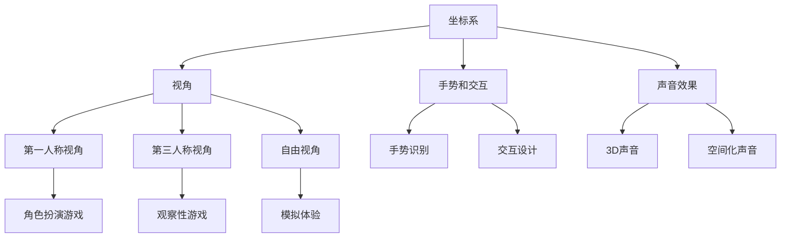

                 

### 第2章：开发环境搭建

#### 2.1 Oculus Rift SDK安装与配置

- **安装步骤：**
  1. **下载Oculus Rift SDK：**访问Oculus官网下载最新版本的SDK。
  2. **安装SDK：**运行安装包，按照提示完成安装。
  3. **配置环境变量：**确保Oculus Rift SDK路径添加到系统环境变量中。

- **配置注意事项：**
  - **兼容性问题：**确保操作系统和硬件与SDK兼容。
  - **路径问题：**检查环境变量配置是否正确。

#### 2.2 Unity和Unreal Engine开发环境

- **Unity开发环境搭建：**
  1. **下载Unity：**访问Unity官网下载最新版本的Unity Hub。
  2. **安装Unity：**运行Unity Hub，按照提示完成安装。
  3. **创建新项目：**启动Unity，创建一个新的Unity项目。

- **Unreal Engine开发环境搭建：**
  1. **下载Unreal Engine：**访问Epic Games官网下载最新版本的Unreal Engine。
  2. **安装Unreal Engine：**运行安装包，按照提示完成安装。
  3. **启动Unreal Engine：**运行Unreal Engine，创建一个新的项目。

#### 2.3 开发工具和插件介绍

- **Unity插件：**
  - **Oculus Unity插件：**提供Oculus Rift SDK的功能集成，支持VR开发。
  - **其他VR插件：**如Google VR SDK、SteamVR插件等，扩展VR功能。

- **Unreal Engine插件：**
  - **Oculus Plugin for Unreal：**提供Oculus Rift SDK的功能集成，支持VR开发。
  - **其他VR插件：**如Google VR插件、SteamVR插件等，扩展VR功能。

#### 开发环境搭建步骤总结：

1. **下载与安装Oculus Rift SDK。**
2. **配置开发环境，如Unity和Unreal Engine。**
3. **安装VR插件，集成SDK功能。**
4. **创建新项目，开始VR开发。

### 附录：开发环境搭建过程中的常见问题及解决方法

- **问题1：环境变量未配置正确**
  - **解决方法：**检查系统环境变量设置，确保Oculus Rift SDK路径正确。

- **问题2：SDK版本与操作系统不兼容**
  - **解决方法：**更新操作系统或下载兼容版本SDK。

- **问题3：安装过程中出现错误**
  - **解决方法：**查看安装日志，根据提示进行修复。

通过上述步骤，开发者可以顺利搭建VR开发环境，为后续开发工作打下坚实基础。

----------------------------------------------------------------

## 第3章：VR开发核心概念

### 第3章：VR开发核心概念

在虚拟现实（VR）开发中，理解核心概念对于实现高质量的VR体验至关重要。本章将探讨VR开发中的几个关键概念，包括虚拟现实中的坐标系和视角、手势和交互设计、以及VR中的声音效果。

#### 3.1 虚拟现实中的坐标系和视角

- **坐标系：**
  - VR开发中常用的坐标系有三维笛卡尔坐标系和极坐标系。
  - **三维笛卡尔坐标系**：以原点为中心，X、Y、Z轴分别代表前后、左右、上下方向。
  - **极坐标系**：以原点为中心，使用角度和距离表示位置。

- **视角：**
  - **第一人称视角**：模拟用户自己的视角，适用于角色扮演游戏和模拟体验。
  - **第三人称视角**：模拟外部观察者的视角，适用于观察性游戏和教育培训。
  - **自由视角**：允许用户自由旋转和移动视角，提供更广阔的视野。

#### 3.2 手势和交互设计

- **手势识别：**
  - **静态手势**：通过预先定义的手势进行交互，如手势识别游戏中的OK手势。
  - **动态手势**：通过连续的手部运动进行交互，如手势控制音乐播放。

- **交互设计：**
  - **触摸交互**：通过触摸屏或触觉反馈设备进行交互。
  - **手势交互**：通过手部动作进行交互，如挥动手臂切换场景。
  - **语音交互**：通过语音命令进行交互，提高操作效率。

#### 3.3 VR中的声音效果

- **声音技术：**
  - **3D声音**：模拟真实世界的声音传播效果，提高沉浸感。
  - **空间化声音**：将声音放置在虚拟空间中，实现声音来源的位置感知。

- **声音设计：**
  - **环境音效**：模拟虚拟环境中的声音，增强沉浸感。
  - **动态音效**：根据用户行为和环境变化动态调整声音效果。
  - **语音识别**：实现用户与虚拟角色的对话，提升交互体验。

### 图解：VR核心概念架构

以下是一个简化的Mermaid流程图，展示VR开发中的核心概念及其相互关系：



#### 核心概念与联系

- **坐标系和视角**：坐标系是视角的基础，用于确定物体在虚拟空间中的位置。
- **手势和交互设计**：手势和交互设计依赖于坐标系和视角，实现用户与虚拟世界的交互。
- **声音效果**：声音效果与视角和交互设计相互配合，增强虚拟现实体验的沉浸感。

通过理解这些核心概念，开发者可以更好地设计和实现高质量的VR体验。

----------------------------------------------------------------

## 第4章：Unity平台开发

### 第4章：Unity平台开发

Unity是一个广泛使用的游戏开发引擎，其强大和灵活的VR开发支持使其成为Oculus Rift开发的热门选择。本章将详细介绍Unity平台开发VR体验的基本操作，包括Unity界面和工具栏的使用、对象的创建和变换、以及脚本编写基础。

#### 4.1 Unity界面和工具栏

- **Unity编辑器界面**：
  - **主窗口**：显示项目内容，包括场景视图、游戏视图和Hierarchy面板。
  - **工具栏**：提供常用的工具和功能，如选择工具、移动工具、旋转工具等。
  - **面板**：包含项目设置、属性编辑器、脚本编辑器等，用于管理和编辑项目内容。

- **工具栏使用说明**：
  - **选择工具**：用于选择和移动对象。
  - **移动工具**：用于沿X、Y、Z轴移动对象。
  - **旋转工具**：用于旋转对象。
  - **缩放工具**：用于沿X、Y、Z轴缩放对象。

#### 4.2 对象的创建和变换

- **对象的创建**：
  - **创建对象**：在Hierarchy面板中右键点击，选择“Create Empty”创建一个空对象。
  - **导入资源**：使用“Import Package”功能导入3D模型、图片等资源。

- **对象的变换**：
  - **变换面板**：在Inspector面板中，对象的变换属性可以手动调整。
  - **变换操作**：
    - **位置**：沿X、Y、Z轴调整对象的位置。
    - **旋转**：绕X、Y、Z轴旋转对象。
    - **缩放**：沿X、Y、Z轴缩放对象。

#### 4.3 脚本编写基础

- **C#脚本**：
  - **脚本创建**：在Unity编辑器中，可以在菜单栏中选择“Asset” -> “Create” -> “C# Script”来创建一个新的C#脚本。
  - **脚本编写**：
    - **变量声明**：声明和使用变量存储数据。
    - **函数定义**：编写函数以实现特定的功能。
    - **事件响应**：在脚本中添加事件响应函数，如“Update”函数用于每帧执行。

- **脚本示例**：

```csharp
using System.Collections;
using System.Collections.Generic;
using UnityEngine;

public class Movement : MonoBehaviour
{
    public float speed = 5.0f;

    // Update is called once per frame
    void Update()
    {
        float horizontal = Input.GetAxis("Horizontal");
        float vertical = Input.GetAxis("Vertical");

        transform.Translate(new Vector3(horizontal, 0, vertical) * speed * Time.deltaTime);
    }
}
```

#### Unity VR框架

- **Oculus Unity插件**：
  - **安装**：在Unity编辑器中，选择“Window” -> “Package Manager”安装Oculus Unity插件。
  - **配置**：在Project面板中，找到插件目录，配置Oculus Rift的SDK路径。

- **VR场景搭建**：
  - **创建VR场景**：使用“Create Empty”创建一个VR场景，并添加Oculus Rift的虚拟显示设备和控制器。

- **视角和运动控制**：
  - **视角控制**：使用Oculus Unity插件提供的视角控制组件，如“OculusVR”和“OculusVRViewer”。
  - **运动控制**：使用“Rigidbody”和“Character Controller”组件实现角色的运动控制。

通过上述步骤，开发者可以开始使用Unity平台进行VR体验的开发。Unity强大的功能和灵活的插件支持，使得VR开发变得更加简单和高效。

----------------------------------------------------------------

## 第5章：Unity VR框架

### 第5章：Unity VR框架

本章将详细介绍如何在Unity平台上使用Oculus Unity插件搭建VR场景，实现视角和运动控制。

#### 5.1 Oculus Unity插件使用

- **插件安装**：
  - 打开Unity编辑器，选择“Window” -> “Package Manager”。
  - 在“Package Manager”窗口中，点击“Install Package”按钮。
  - 在弹出的对话框中，搜索“Oculus Unity Plugin”并安装。

- **插件配置**：
  - 安装完成后，在Project面板中找到“Oculus Unity Plugin”目录。
  - 双击打开“Plugin Settings.txt”文件，配置Oculus Rift的SDK路径。

#### 5.2 VR场景搭建

- **创建VR场景**：
  - 在菜单栏中选择“File” -> “New Scene”创建一个新的场景。
  - 在Scene面板中，选择“Oculus Rig”对象，拖拽到场景中作为虚拟人。

- **添加虚拟显示设备**：
  - 在Project面板中，找到“Oculus Unity Plugin”目录下的“Prefabs”文件夹。
  - 将“Oculus Rift”对象拖拽到场景中，调整其位置以符合实际佩戴位置。

- **添加控制器**：
  - 同样在“Oculus Unity Plugin”目录下的“Prefabs”文件夹中，找到“Oculus Touch”对象。
  - 将“Oculus Touch”对象拖拽到场景中，每个手部需要添加两个控制器。

#### 5.3 视角和运动控制

- **视角控制**：
  - **OculusVR组件**：
    - 在Main Camera对象上添加“OculusVR”组件。
    - 设置“Tracking”为“Oculus”。
    - 选中“Lag”复选框，以实现更平滑的视角控制。
  - **OculusVRViewer组件**：
    - 在Scene面板中创建一个新对象，命名为“OculusVRViewer”。
    - 在Inspector面板中，将“Main Camera”拖拽到“Main Camera”属性栏中。
    - 设置“Fov Mode”为“Custom”并调整“Vertical Fov”和“Horizontal Fov”以适配显示设备。

- **运动控制**：
  - **Rigidbody组件**：
    - 在玩家角色对象上添加“Rigidbody”组件。
    - 设置“Use Gravity”为true，使角色受到重力影响。
  - **Character Controller组件**：
    - 在玩家角色对象上添加“Character Controller”组件。
    - 设置“Height”和“Center”以适配角色的身高和重心。
  - **移动脚本**：
    - 创建一个C#脚本，命名为“PlayerMovement”，添加到玩家角色对象上。
    - 以下是一个简单的移动脚本示例：

```csharp
using UnityEngine;

public class PlayerMovement : MonoBehaviour
{
    public float speed = 5.0f;

    // Update is called once per frame
    void Update()
    {
        float horizontal = Input.GetAxis("Horizontal");
        float vertical = Input.GetAxis("Vertical");

        Vector3 movement = new Vector3(horizontal, 0, vertical) * speed * Time.deltaTime;
        transform.Translate(movement);
    }
}
```

通过以上步骤，开发者可以搭建一个基本的VR场景，并实现视角和运动控制。Oculus Unity插件提供了丰富的功能和接口，使得Unity VR开发变得简单而高效。

----------------------------------------------------------------

## 第6章：Unity VR项目实战

### 第6章：Unity VR项目实战

在本章中，我们将通过两个Unity VR项目实战，详细介绍虚拟现实游戏开发和VR应用开发实战，包括项目需求分析、开发环境搭建、源代码详细实现和代码解读、实际案例分析和详细讲解剖析，以及项目小结。

#### 6.1 虚拟现实游戏开发

**项目需求分析：**

- **游戏类型**：第一人称射击游戏（FPS）
- **游戏场景**：室内外场景，包括客厅、花园和街道
- **玩家角色**：玩家可以行走、跳跃、射击敌人
- **敌人角色**：移动的敌人，会攻击玩家
- **交互设计**：玩家可以使用手柄控制器射击敌人

**开发环境搭建：**

- **Unity版本**：2019.4
- **Oculus Unity插件**：安装并配置好Oculus Unity插件
- **开发工具**：Unity Hub、Unity编辑器、Visual Studio Code

**源代码详细实现和代码解读：**

**1. 场景搭建：**

- **主场景**：在Unity编辑器中创建主场景，导入室内外场景的3D模型。
- **玩家角色**：创建玩家角色对象，添加Rigidbody和Character Controller组件，实现行走和跳跃。
- **敌人角色**：创建敌人角色对象，添加Rigidbody和AI组件，实现移动和攻击。

**2. 视角和运动控制：**

- **视角控制**：使用OculusVR组件，设置Main Camera的视角。
- **运动控制**：使用PlayerMovement脚本，实现玩家的移动和跳跃。

```csharp
public class PlayerMovement : MonoBehaviour
{
    public float speed = 5.0f;

    // Update is called once per frame
    void Update()
    {
        float horizontal = Input.GetAxis("Horizontal");
        float vertical = Input.GetAxis("Vertical");

        Vector3 movement = new Vector3(horizontal, 0, vertical) * speed * Time.deltaTime;
        transform.Translate(movement);
    }
}
```

**3. 射击系统：**

- **武器**：创建武器对象，添加碰撞器和射线投射器组件。
- **射击脚本**：实现射出子弹的功能，检测敌人碰撞并造成伤害。

```csharp
public class射击脚本： MonoBehaviour
{
    public float shootingSpeed = 1000.0f;

    // Update is called once per frame
    void Update()
    {
        if (Input.GetButtonDown("Fire1"))
        {
            Rigidbody bullet = Instantiate(bulletPrefab, transform.position, transform.rotation);
            bullet.velocity = transform.forward * shootingSpeed;
        }
    }
}
```

**实际案例分析和详细讲解剖析：**

- **场景设计**：室内外场景的切换，通过层级和标签进行管理。
- **角色AI**：使用NavMesh和AIBase组件，实现敌人角色的移动和攻击。
- **射击逻辑**：射线投射器检测碰撞，计算伤害并处理。

**项目小结：**

- 通过本案例，开发者可以掌握Unity VR游戏开发的基本流程和技巧，包括场景搭建、角色控制、射击系统和AI设计。
- 开发过程中注意性能优化，如使用轻量级的物体和减少绘制调用，以提高游戏运行效率。

#### 6.2 VR应用开发实战

**项目需求分析：**

- **应用类型**：教育应用，用于医学教学
- **应用场景**：模拟人体解剖结构，让学生可以360度观察器官
- **交互设计**：学生可以使用手柄控制器旋转和解剖结构

**开发环境搭建：**

- **Unity版本**：2020.3
- **Oculus Unity插件**：安装并配置好Oculus Unity插件
- **开发工具**：Unity Hub、Unity编辑器、Visual Studio Code

**源代码详细实现和代码解读：**

**1. 场景搭建：**

- **主场景**：在Unity编辑器中创建主场景，导入人体解剖结构的3D模型。
- **控制器**：创建控制器对象，添加Oculus Touch控制器组件。

**2. 交互设计：**

- **旋转功能**：使用手柄控制器的触发器，实现解剖结构的旋转。
- **解剖功能**：使用手柄控制器的按钮，实现解剖结构的展开和收缩。

```csharp
public class Interaction : MonoBehaviour
{
    public float rotationSpeed = 100.0f;
    public float zoomSpeed = 5.0f;

    // Update is called once per frame
    void Update()
    {
        if (Input.GetAxis("Oculus Touch") > 0.1f)
        {
            transform.Rotate(Vector3.up * rotationSpeed * Time.deltaTime);
        }

        if (Input.GetAxis("Oculus Touch") < -0.1f)
        {
            transform.Rotate(-Vector3.up * rotationSpeed * Time.deltaTime);
        }

        if (Input.GetAxis("Oculus Touch") > 0.1f)
        {
            transform.position += transform.forward * zoomSpeed * Time.deltaTime;
        }

        if (Input.GetAxis("Oculus Touch") < -0.1f)
        {
            transform.position -= transform.forward * zoomSpeed * Time.deltaTime;
        }
    }
}
```

**实际案例分析和详细讲解剖析：**

- **交互逻辑**：使用Oculus Touch控制器，实现高精度的交互。
- **模型渲染**：使用Unity的Mesh Renderer，实现解剖结构的渲染。

**项目小结：**

- 通过本案例，开发者可以掌握Unity VR应用开发的基本流程和技巧，包括场景搭建、交互设计和渲染实现。
- 开发过程中注意用户体验优化，如提高渲染性能和交互响应速度。

通过以上两个VR项目实战，开发者可以更好地理解和应用Unity VR开发技术，实现高质量的虚拟现实体验。

----------------------------------------------------------------

## 第7章：Unreal Engine平台开发

### 第7章：Unreal Engine平台开发

Unreal Engine 是一个强大的游戏开发引擎，广泛应用于虚拟现实（VR）项目的开发。本章将详细介绍如何在Unreal Engine平台上进行VR开发，包括基本操作、对象的创建和变换、以及脚本编写基础。

#### 7.1 Unreal Engine基本操作

**1. 安装Unreal Engine：**
- 访问Epic Games官网下载最新版本的Unreal Engine。
- 运行安装程序，按照提示完成安装。

**2. 启动Unreal Engine：**
- 双击桌面上的Unreal Engine图标启动编辑器。

**3. 创建新项目：**
- 在启动编辑器后，点击“New Project”按钮。
- 选择一个项目模板，如“Basic VR Template”，并输入项目名称。

**4. 了解界面布局：**
- **内容浏览器（Content Browser）**：用于浏览和管理项目资源。
- **场景视图（Viewport）**：显示场景内容和预览。
- **工具栏（Tool Bar）**：提供各种工具和命令。
- **大纲视图（Outliner）**：显示场景中所有对象的层级结构。

#### 7.2 对象的创建和变换

**1. 创建对象：**
- 在内容浏览器中，右键点击“Objects”文件夹，选择要创建的对象类型，如“Cube”、“Sphere”等。
- 将对象拖放到场景视图中。

**2. 变换对象：**
- 选择对象，使用工具栏中的变换工具（如“Move Tool”、“Rotate Tool”、“Scale Tool”）进行调整。
- 在场景视图中，按住鼠标左键并拖动，可以实时预览变换效果。

**3. 组合对象：**
- 选择多个对象，右键点击选择“Combine”。
- 可以选择“Merge”将对象合并为一个整体，或者“Instance”创建多个相同对象的副本。

#### 7.3 脚本编写基础

**1. 创建C++脚本：**
- 在内容浏览器中，右键点击“Blueprints”文件夹，选择“C++ Class”。
- 输入类名，如“PlayerMovement”，并点击“Finish”按钮。

**2. 编写C++脚本：**
- 双击新创建的C++脚本，在Visual Studio中打开。
- 编写脚本代码，实现所需的功能。

以下是一个简单的PlayerMovement脚本的伪代码示例：

```cpp
class APlayerMovement : public AActor
{
public:
    // Set up default properties
    APlayerMovement();

    // Called when the game starts or when spawned
    virtual void BeginPlay() override;

    // Called every frame
    virtual void Tick(float DeltaTime) override;

public:
    // The movement speed of the player
    UPROPERTY(EditDefaultsOnly, Category = "Movement")
    float MovementSpeed = 100.0f;

public:
    // Called when the player inputs movement
    void MoveInput(float X, float Y);

private:
    // Called to bind functionality to input
    virtual void SetupInputComponent() override;
};

APlayerMovement::APlayerMovement()
{
    // Set this actor to call Tick() every frame.
    PrimaryActorTick.bCanEverTick = true;
}

void APlayerMovement::BeginPlay()
{
    // ...
}

void APlayerMovement::Tick(float DeltaTime)
{
    Super::Tick(DeltaTime);

    // Get input from the player
    float X = GetInputAxis("MoveX");
    float Y = GetInputAxis("MoveY");

    // Move the player
    MoveInput(X, Y);
}

void APlayerMovement::MoveInput(float X, float Y)
{
    // Calculate the movement vector
    FVector MoveDirection = FVector(X, 0.0f, Y).GetSafeNormal();

    // Move the player
    AddMovementInput(MoveDirection, MovementSpeed);
}

void APlayerMovement::SetupInputComponent()
{
    // Bind movement input
    InputMap->BindAxis("MoveX", this, &APlayerMovement::MoveInput);
    InputMap->BindAxis("MoveY", this, &APlayerMovement::MoveInput);
}
```

通过上述步骤，开发者可以在Unreal Engine中创建VR项目，并进行基本的操作和脚本编写。Unreal Engine的强大功能和灵活的插件支持，使得VR开发变得更加高效和便捷。

----------------------------------------------------------------

## 第8章：Unreal Engine VR框架

### 第8章：Unreal Engine VR框架

Unreal Engine 提供了强大的VR开发框架，支持Oculus Rift和SteamVR等VR硬件。本章将详细介绍如何使用Oculus Plugin for Unreal搭建VR场景，实现视角和运动控制。

#### 8.1 Oculus Plugin for Unreal使用

**1. 插件安装：**

- 打开Unreal Engine 编辑器，选择“Edit” -> “Plugins”。
- 在“Plugins”窗口中，点击“Add Plugin”按钮。
- 在弹出的对话框中，搜索“Oculus Plugin for Unreal”并安装。

**2. 插件配置：**

- 安装完成后，在“Content Browser”中找到“Oculus Plugin for Unreal”目录。
- 双击“Oculus Manager”打开配置界面。
- 配置Oculus Rift SDK路径和设备设置。

**3. VR场景搭建：**

- 在“Content Browser”中，创建一个新文件夹用于存放VR场景资源。
- 将Oculus Rift的虚拟显示设备和控制器对象（如“OculusRift HMD”和“Oculus Touch Controller”）拖放到场景视图中。
- 调整对象位置以符合实际佩戴和操作位置。

#### 8.2 VR场景搭建

**1. 创建VR场景：**

- 在“Content Browser”中，右键点击“Scenes”文件夹，选择“Create New Scene”。
- 输入场景名称，如“VR Scene”，并点击“Create”。

**2. 场景设置：**

- 在“Scene”视图中，添加VR场景所需的3D模型和背景。
- 设置场景的光照和阴影，以提升视觉效果。

**3. 视角和运动控制：**

- **视角控制**：
  - 在场景视图中，添加一个“OculusRift HMD”对象。
  - 将“Main Camera”对象添加到“OculusRift HMD”的“Eye Cameras”列表中。

- **运动控制**：
  - 在“Content Browser”中，创建一个“Character”对象。
  - 将“Oculus Character Controller”组件添加到“Character”对象上。
  - 调整“Character”对象的高度和重心，以匹配玩家角色。

#### 8.3 视角和运动控制

**1. 视角控制：**

- **OculusRift HMD**：
  - 使用“OculusRift HMD”对象，可以设置视角和视野范围。
  - 通过调整“Fov”属性，可以自定义视角的视野角度。

- **自定义视角**：
  - 创建一个“OculusVR Camera”对象，添加到场景视图中。
  - 设置“Main Camera”为“Custom”，并将“OculusVR Camera”拖到“Custom Camera”属性栏中。

**2. 运动控制：**

- **Oculus Character Controller**：
  - 使用“Oculus Character Controller”组件，可以实现玩家的移动和跳跃。
  - 调整“Speed”和“Jump Height”属性，可以自定义移动速度和跳跃高度。

- **自定义运动**：
  - 创建一个“Player Movement”脚本，添加到玩家角色对象上。
  - 编写脚本实现自定义运动逻辑。

以下是一个简单的Player Movement脚本示例：

```cpp
class UPlayerMovement : public UCharacterMovementComponent
{
public:
    // Set up default properties
    UPlayerMovement();

    // Called when the game starts or when spawned
    virtual void BeginPlay() override;

    // Called every frame
    virtual void Tick(float DeltaTime) override;

public:
    // Movement speed of the player
    UPROPERTY(EditDefaultsOnly, Category = "Movement")
    float MovementSpeed = 100.0f;

public:
    // Called when the player inputs movement
    void MoveInput(float X, float Y);

private:
    // Called to bind functionality to input
    virtual void SetupInputComponent() override;
};

UPlayerMovement::UPlayerMovement()
{
    // Set this component to call Tick() every frame.
    PrimaryActorTick.bCanEverTick = true;
}

void UPlayerMovement::BeginPlay()
{
    Super::BeginPlay();

    // Set up input binding
    SetupInputComponent();
}

void UPlayerMovement::Tick(float DeltaTime)
{
    Super::Tick(DeltaTime);

    // Get input from the player
    float X = GetInputAxis("MoveX");
    float Y = GetInputAxis("MoveY");

    // Move the player
    MoveInput(X, Y);
}

void UPlayerMovement::MoveInput(float X, float Y)
{
    // Calculate the movement vector
    FVector MoveDirection = FVector(X, 0.0f, Y).GetSafeNormal();

    // Move the player
    AddMovementInput(MoveDirection, MovementSpeed);
}

void UPlayerMovement::SetupInputComponent()
{
    // Bind movement input
    InputComponent->BindAxis("MoveX", this, &UPlayerMovement::MoveInput);
    InputComponent->BindAxis("MoveY", this, &UPlayerMovement::MoveInput);
}
```

通过以上步骤，开发者可以在Unreal Engine中搭建VR场景，并实现视角和运动控制。Oculus Plugin for Unreal 提供了丰富的功能，使得VR开发变得更加简单和高效。

----------------------------------------------------------------

## 第9章：Unreal Engine VR项目实战

### 第9章：Unreal Engine VR项目实战

在本章中，我们将通过两个Unreal Engine VR项目实战，详细介绍虚拟现实游戏开发和VR应用开发实战，包括项目需求分析、开发环境搭建、源代码详细实现和代码解读、实际案例分析和详细讲解剖析，以及项目小结。

#### 9.1 虚拟现实游戏开发

**项目需求分析：**

- **游戏类型**：第一人称射击游戏（FPS）
- **游戏场景**：室内外场景，包括客厅、花园和街道
- **玩家角色**：玩家可以行走、跳跃、射击敌人
- **敌人角色**：移动的敌人，会攻击玩家
- **交互设计**：玩家可以使用手柄控制器射击敌人

**开发环境搭建：**

- **Unreal Engine版本**：4.27.1
- **Oculus Plugin for Unreal**：安装并配置好Oculus Plugin for Unreal
- **开发工具**：Unreal Engine 编辑器、Visual Studio

**源代码详细实现和代码解读：**

**1. 场景搭建：**

- **主场景**：在Unreal Engine 编辑器中创建主场景，导入室内外场景的3D模型。
- **玩家角色**：创建玩家角色对象，添加Rigidbody和Oculus Character Controller组件，实现行走和跳跃。
- **敌人角色**：创建敌人角色对象，添加Rigidbody和AI组件，实现移动和攻击。

**2. 视角和运动控制：**

- **视角控制**：使用OculusRift HMD组件，设置Main Camera的视角。
- **运动控制**：使用PlayerMovement脚本，实现玩家的移动和跳跃。

以下是一个简单的PlayerMovement脚本的示例：

```cpp
#include "PlayerMovement.h"

APlayerMovement::APlayerMovement()
{
    // Set this actor to call Tick() every frame.
    PrimaryActorTick.bCanEverTick = true;
}

void APlayerMovement::BeginPlay()
{
    Super::BeginPlay();

    // Set up input binding
    SetupInputComponent();
}

void APlayerMovement::Tick(float DeltaTime)
{
    Super::Tick(DeltaTime);

    // Get input from the player
    float X = GetInputAxis("MoveX");
    float Y = GetInputAxis("MoveY");

    // Move the player
    MoveInput(X, Y);
}

void APlayerMovement::MoveInput(float X, float Y)
{
    // Calculate the movement vector
    FVector MoveDirection = FVector(X, 0.0f, Y).GetSafeNormal();

    // Move the player
    AddMovementInput(MoveDirection, MovementSpeed);
}

void APlayerMovement::SetupInputComponent()
{
    // Bind movement input
    InputComponent->BindAxis("MoveX", this, &APlayerMovement::MoveInput);
    InputComponent->BindAxis("MoveY", this, &APlayerMovement::MoveInput);
}
```

**实际案例分析和详细讲解剖析：**

- **场景设计**：室内外场景的切换，通过层级和标签进行管理。
- **角色AI**：使用NavMesh和AIBase组件，实现敌人角色的移动和攻击。
- **射击逻辑**：射线投射器检测碰撞，计算伤害并处理。

**项目小结：**

- 通过本案例，开发者可以掌握Unreal Engine VR游戏开发的基本流程和技巧，包括场景搭建、角色控制、射击系统和AI设计。
- 开发过程中注意性能优化，如使用轻量级的物体和减少绘制调用，以提高游戏运行效率。

#### 9.2 VR应用开发实战

**项目需求分析：**

- **应用类型**：教育应用，用于医学教学
- **应用场景**：模拟人体解剖结构，让学生可以360度观察器官
- **交互设计**：学生可以使用手柄控制器旋转和解剖结构

**开发环境搭建：**

- **Unreal Engine版本**：4.27.1
- **Oculus Plugin for Unreal**：安装并配置好Oculus Plugin for Unreal
- **开发工具**：Unreal Engine 编辑器、Visual Studio

**源代码详细实现和代码解读：**

**1. 场景搭建：**

- **主场景**：在Unreal Engine 编辑器中创建主场景，导入人体解剖结构的3D模型。
- **控制器**：创建控制器对象，添加Oculus Touch控制器组件。

**2. 交互设计：**

- **旋转功能**：使用手柄控制器的触发器，实现解剖结构的旋转。
- **解剖功能**：使用手柄控制器的按钮，实现解剖结构的展开和收缩。

以下是一个简单的Interaction脚本的示例：

```cpp
#include "Interaction.h"

AInteraction::AInteraction()
{
    // Set this actor to call Tick() every frame.
    PrimaryActorTick.bCanEverTick = true;
}

void AInteraction::BeginPlay()
{
    Super::BeginPlay();

    // Set up input binding
    SetupInputComponent();
}

void AInteraction::Tick(float DeltaTime)
{
    Super::Tick(DeltaTime);

    // Check for interaction input
    CheckInteractionInput();
}

void AInteraction::CheckInteractionInput()
{
    // Check for rotation input
    if (OculusTouch->IsButtonDown(OculusTouch::EControllerButton::PrimaryTouch))
    {
        // Rotate the model
        AddActorLocalRotation(FRotator(0.0f, RotationSpeed * DeltaTime, 0.0f));
    }

    // Check for zoom input
    if (OculusTouch->IsButtonDown(OculusTouch::EControllerButton::PrimaryPress))
    {
        // Zoom in or out
        AddActorLocalPosition(FVector(0.0f, 0.0f, ZoomSpeed * DeltaTime));
    }
}
```

**实际案例分析和详细讲解剖析：**

- **交互逻辑**：使用Oculus Touch控制器，实现高精度的交互。
- **模型渲染**：使用Unreal Engine的Mesh Renderer，实现解剖结构的渲染。

**项目小结：**

- 通过本案例，开发者可以掌握Unreal Engine VR应用开发的基本流程和技巧，包括场景搭建、交互设计和渲染实现。
- 开发过程中注意用户体验优化，如提高渲染性能和交互响应速度。

通过以上两个VR项目实战，开发者可以更好地理解和应用Unreal Engine VR开发技术，实现高质量的虚拟现实体验。

----------------------------------------------------------------

## 第10章：VR性能优化

### 第10章：VR性能优化

虚拟现实（VR）项目的性能优化至关重要，因为用户在VR环境中对响应速度和画面质量有很高的期望。本章将讨论VR性能优化的一些关键策略，包括GPU与CPU性能分析、减少绘制调用、减少内存占用。

#### 10.1 GPU与CPU性能分析

- **GPU性能分析**：
  - 使用工具如NVIDIA Nsight或AMD CodeXL，进行GPU渲染性能分析。
  - 分析GPU的渲染时间、着色器执行时间、内存访问时间等。
  - 识别潜在的渲染瓶颈，如高分辨率的纹理、复杂的几何图形等。

- **CPU性能分析**：
  - 使用工具如Unity Profiler或Unreal Engine的CPU分析器，进行CPU性能分析。
  - 分析CPU的执行时间、帧率、线程使用情况等。
  - 识别CPU性能瓶颈，如计算密集型的逻辑、网络请求等。

#### 10.2 减少绘制调用

- **绘制调用优化**：
  - **合并对象**：将多个小对象合并为一个大的对象，减少绘制调用次数。
  - **静态批处理**：将不经常更新的对象放入静态批处理组，减少动态批处理的调用。
  - **剔除远处的物体**：使用剔除技术，不绘制远离摄像机的物体。

- **实例化**：
  - **几何实例化**：使用几何实例化技术，将多个相同的物体实例化为单个几何体，减少绘制调用。
  - **材质实例化**：使用材质实例化技术，将多个具有相同材质的物体合并为一个材质实例。

#### 10.3 减少内存占用

- **内存管理**：
  - **内存池**：使用内存池技术，减少内存分配和释放的次数。
  - **对象池**：使用对象池技术，重用已创建的对象，避免频繁创建和销毁。

- **资源优化**：
  - **纹理压缩**：使用纹理压缩技术，减少纹理占用的内存空间。
  - **资源复用**：重用已经加载的资源，避免重复加载。

- **内存监测**：
  - **Unity内存监测**：使用Unity的内存监测工具，分析内存使用情况。
  - **Unreal Engine内存监测**：使用Unreal Engine的内存分析器，监测内存使用。

#### 优化示例

- **减少绘制调用**：
  ```cpp
  // 合并对象
  CombineMeshesIntoSingleObject();

  // 使用静态批处理
  StaticMesh->SetStaticMesh(StaticMesh);
  ```

- **减少内存占用**：
  ```cpp
  // 使用内存池
  MemoryPool->Allocate();

  // 使用纹理压缩
  Texture->SetCompressionSettings(ETexCompressionSettings::TC_PKM);
  ```

通过上述性能优化策略，开发者可以显著提高VR应用的性能，为用户提供流畅的VR体验。

----------------------------------------------------------------

## 第11章：VR用户体验优化

### 第11章：VR用户体验优化

在虚拟现实（VR）开发中，用户体验的优化至关重要。本章将探讨如何通过视角和运动平滑性优化、颜色和亮度调整、以及网络优化，来提升VR用户体验。

#### 11.1 视角和运动平滑性优化

- **视角平滑性优化**：
  - **插值方法**：使用线性插值或样条插值，平滑视角变化。
  - **视角预测**：预测用户接下来的视角需求，提前调整视角，减少切换时的不适。

- **运动平滑性优化**：
  - **Lerp移动**：使用Lerp（线性插值）方法，平滑角色或物体的移动。
  - **惯性效应**：模拟现实世界中的惯性效应，使角色或物体在停止时逐渐减速。

以下是一个使用Lerp实现平滑视角变化的示例：

```cpp
// 视角平滑变化的参数
float smoothTime = 0.05f;

// 视角目标位置
FVector targetPosition = NewPosition;

// 当前视角位置
FVector currentPosition = GetActorLocation();

// 平滑视角
SetActorLocation(FMath::Lerp(currentPosition, targetPosition, smoothTime * Time.DeltaTime()));
```

#### 11.2 颜色和亮度调整

- **颜色调整**：
  - **色调调整**：调整RGB三原色的比例，改变图像的整体色调。
  - **对比度调整**：增强图像的明暗对比度，提升视觉冲击力。

- **亮度调整**：
  - **亮度映射**：使用亮度映射（Luminance Mapping）技术，提高图像的亮度和清晰度。
  - **环境光调整**：调整场景中的环境光强度，影响物体表面的亮度。

以下是一个使用色调和对比度调整图像的示例：

```cpp
// 色调调整
FColor adjustedColor = FColor(
    FMath::Clamp(imageColor.R + adjustment.R, 0, 255),
    FMath::Clamp(imageColor.G + adjustment.G, 0, 255),
    FMath::Clamp(imageColor.B + adjustment.B, 0, 255)
);

// 对比度调整
float contrastAdjustment = 1.5f;
imageColor.R = FMath::Clamp(imageColor.R * contrastAdjustment, 0, 255);
imageColor.G = FMath::Clamp(imageColor.G * contrastAdjustment, 0, 255);
imageColor.B = FMath::Clamp(imageColor.B * contrastAdjustment, 0, 255);
```

#### 11.3 网络优化

- **数据压缩**：
  - **纹理压缩**：使用纹理压缩算法，减少传输数据的大小。
  - **网络传输压缩**：使用网络传输压缩算法，如HTTP压缩，减少带宽占用。

- **异步加载**：
  - **异步加载场景**：在后台加载场景，避免加载时间过长。
  - **异步加载资源**：异步加载游戏资源，如3D模型、音效等，提高加载效率。

以下是一个异步加载场景的示例：

```cpp
// 异步加载场景
UAsyncTask<UObject> LoadSceneTask = UAsyncTask<UObject>::CreateLambda(
    [sceneName](const FTaskProgress& Progress)
    {
        UGameplayStatics::LoadLevelAsync(this, sceneName);
    }
);
LoadSceneTaskgetDescription();
```

通过上述优化策略，开发者可以显著提升VR应用的用户体验，为用户提供更流畅、更沉浸的VR体验。

----------------------------------------------------------------

## 第12章：VR社交与多人互动

### 第12章：VR社交与多人互动

虚拟现实（VR）技术的兴起为社交和多人互动提供了全新的体验方式。本章将探讨如何在VR中实现社交与多人互动，包括Oculus平台的社交功能、Unity和Unreal Engine的多人游戏设计。

#### 12.1 Oculus平台社交功能

- **Oculus平台社交功能概述**：
  - **社交账户**：用户可以通过Oculus账户与其他用户互动。
  - **好友系统**：用户可以添加好友，并查看好友的在线状态。
  - **聊天功能**：支持文本和语音聊天，方便用户沟通。

- **社交功能实现**：
  - **好友添加与删除**：通过Oculus平台的API，实现好友的添加和删除功能。
  - **在线状态查询**：通过API获取用户的在线状态，并显示在应用中。
  - **聊天窗口**：创建聊天窗口，支持发送文本和语音消息。

以下是一个使用Oculus SDK实现好友添加和在线状态查询的伪代码示例：

```cpp
// 添加好友
bool AddFriend(const FString& FriendId)
{
    // 调用Oculus SDK的API添加好友
    return OculusSDK->AddFriend(FriendId);
}

// 查询好友在线状态
EOculusFriendStatus GetFriendStatus(const FString& FriendId)
{
    // 调用Oculus SDK的API获取好友在线状态
    return OculusSDK->GetFriendStatus(FriendId);
}
```

#### 12.2 Unity和Unreal Engine多人游戏设计

- **Unity多人游戏设计**：
  - **网络架构**：使用Unity的UNet系统，实现多人游戏网络架构。
  - **角色同步**：通过网络同步角色状态，实现多人实时互动。
  - **交互设计**：设计多人互动的规则和场景，如多人合作、竞技等。

以下是一个使用Unity UNet实现多人角色同步的伪代码示例：

```csharp
public class PlayerController : NetworkBehaviour
{
    // 当玩家加入游戏时调用
    void OnStartLocalPlayer()
    {
        // 设置玩家的游戏角色
        SetPlayerRole();
    }

    // 同步玩家的位置
    [ClientRpc]
    public void RpcSetPlayerPosition(Vector3 position)
    {
        transform.position = position;
    }
}
```

- **Unreal Engine多人游戏设计**：
  - **网络架构**：使用Unreal Engine的在线服务系统，实现多人游戏网络架构。
  - **角色同步**：使用Unreal Engine的网络框架，同步角色状态，实现多人实时互动。
  - **交互设计**：设计丰富的多人互动场景，如多人竞技、协作等。

以下是一个使用Unreal Engine网络框架实现角色同步的伪代码示例：

```cpp
UCLASS()
class APlayerCharacter : public ACharacter
{
public:
    // 同步角色的位置
    virtual void OnRep_PlayerState()
    {
        Super::OnRep_PlayerState();

        if (PlayerState != nullptr)
        {
            SetActorLocation(PlayerState->Location);
        }
    }
};
```

通过本章的介绍，开发者可以掌握如何在VR中实现社交与多人互动，利用Unity和Unreal Engine的技术实现高质量的多人游戏体验。

----------------------------------------------------------------

## 第13章：VR未来发展趋势

### 第13章：VR未来发展趋势

虚拟现实（VR）技术正不断进步，其应用领域也在不断扩大。本章将探讨VR在未来几个关键领域的应用趋势，包括教育、医疗和娱乐。

#### 13.1 VR技术在教育中的应用

- **沉浸式学习体验**：VR技术可以为教育提供更加沉浸式和互动的学习体验。例如，学生可以通过VR设备“走进”历史场景，亲身体验历史事件。
- **远程教学**：VR技术可以打破地域限制，实现远程教学。教师可以通过VR设备与学生进行实时互动，提高教学质量。
- **技能培训**：VR技术可以用于技能培训，如模拟飞行训练、医学手术模拟等。这种技术可以提高培训效果，降低安全风险。

#### 13.2 VR技术在医疗中的应用

- **医疗培训**：VR技术可以用于医疗培训，帮助医生和医疗人员学习复杂的手术操作。例如，通过VR技术，医生可以在虚拟环境中练习手术，提高手术技能。
- **医疗康复**：VR技术可以用于康复治疗，如康复训练、心理治疗等。通过VR技术的沉浸式体验，患者可以更好地参与康复训练，提高康复效果。
- **远程医疗咨询**：VR技术可以支持远程医疗咨询，医生可以通过VR设备与患者进行实时互动，提供远程诊断和治疗建议。

#### 13.3 VR技术在娱乐中的应用

- **沉浸式游戏体验**：VR游戏为玩家提供了全新的沉浸式体验。玩家可以通过VR设备进入虚拟世界，与虚拟角色互动，享受更加真实和刺激的游戏体验。
- **虚拟演唱会**：VR技术可以为演唱会带来全新的体验。观众可以通过VR设备在家中观看演唱会，感受现场的氛围和互动。
- **虚拟旅游**：VR技术可以让用户在家中体验虚拟旅游。用户可以通过VR设备“游览”世界各地的名胜古迹，感受不同的文化和风景。

#### VR未来的发展展望

- **硬件性能的提升**：随着硬件技术的进步，VR设备的性能将不断提高，分辨率、刷新率、追踪精度等指标将进一步提升，提供更优质的VR体验。
- **内容的丰富**：随着VR技术的发展，越来越多的高质量VR内容将问世，涵盖教育、医疗、娱乐等多个领域，满足用户多样化的需求。
- **社交与互动**：VR社交和多人互动将成为VR应用的重要方向。通过VR技术，用户可以更加便捷地进行线上社交和互动，体验虚拟世界的社交乐趣。

通过本章的探讨，我们可以看到VR技术在未来各个领域具有巨大的发展潜力和应用前景。随着技术的不断进步，VR将为人们的生活和工作带来更多创新和便利。

----------------------------------------------------------------

## 附录A：VR开发资源与工具

### 附录A：VR开发资源与工具

在进行VR开发时，了解和掌握相关资源与工具是至关重要的。以下列出了一些常用的VR开发工具和插件，以及VR开发社区和论坛，供开发者参考。

#### VR开发工具和插件列表

1. **Unity插件**：
   - **Oculus Unity Plugin**：提供Oculus Rift SDK的功能集成。
   - **Google VR SDK**：支持Google Cardboard和Daydream设备。
   - **SteamVR**：支持Steam VR硬件和功能。

2. **Unreal Engine插件**：
   - **Oculus Plugin for Unreal**：提供Oculus Rift SDK的功能集成。
   - **Google VR Plugin for Unreal**：支持Google Cardboard和Daydream设备。
   - **SteamVR Plugin for Unreal**：支持Steam VR硬件和功能。

3. **VR渲染引擎**：
   - **Unreal Engine**：提供强大的渲染引擎和VR支持。
   - **Unity**：提供易于使用的游戏开发平台和VR支持。

4. **VR编辑器**：
   - **Unity Editor**：提供直观的编辑器和VR开发工具。
   - **Unreal Editor**：提供强大的编辑器和VR开发工具。

#### VR开发社区和论坛

1. **Unity官方论坛**：[Unity Forums](https://forum.unity.com/)
   - Unity官方论坛提供了大量的讨论区和教程，可以帮助开发者解决开发过程中遇到的问题。

2. **Unreal Engine官方论坛**：[Unreal Engine Forums](https://forums.unrealengine.com/)
   - Unreal Engine官方论坛是开发者交流和学习的重要平台，涵盖了从入门到高级的教程和讨论。

3. **VRChat社区**：[VRChat](https://vrchat.org/)
   - VRChat是一个社交VR平台，开发者可以在平台上创建和体验VR内容，与其他开发者交流和学习。

4. **Reddit VR社区**：[r/VirtualReality](https://www.reddit.com/r/VirtualReality/)
   - Reddit上的VR社区提供了大量的VR相关讨论和资源，是获取最新VR技术和信息的好地方。

通过利用这些资源和工具，开发者可以更好地掌握VR开发技术，提升开发效率，实现高质量的VR体验。

----------------------------------------------------------------

## 附录B：VR开发项目代码示例

### 附录B：VR开发项目代码示例

在本附录中，我们将提供两个VR开发项目的代码示例，分别使用Unity和Unreal Engine进行实现。这些示例将涵盖主要功能，如场景搭建、角色控制、交互设计等。

#### B.1 Unity VR游戏开发示例

**项目简介**：本示例是一个简单的VR射击游戏，玩家可以在虚拟世界中移动和射击敌人。

**场景搭建**：
- 创建一个Unity项目，并导入场景所需资源，如3D模型、贴图等。
- 在场景中创建一个玩家角色，并添加Rigidbody和Character Controller组件。

**角色控制**：
```csharp
using UnityEngine;

public class PlayerController : MonoBehaviour
{
    public float moveSpeed = 5.0f;

    private Vector3 moveDirection = Vector3.zero;

    // Update is called once per frame
    void Update()
    {
        // 处理移动输入
        moveDirection = new Vector3(Input.GetAxis("Horizontal"), 0, Input.GetAxis("Vertical"));
        moveDirection = transform.TransformDirection(moveDirection);

        // 应用移动
        transform.position += moveDirection * moveSpeed * Time.deltaTime;
    }
}
```

**射击逻辑**：
```csharp
using UnityEngine;

public class GunController : MonoBehaviour
{
    public Transform firePoint;
    public GameObject bulletPrefab;

    // Update is called once per frame
    void Update()
    {
        if (Input.GetButtonDown("Fire1"))
        {
            Shoot();
        }
    }

    void Shoot()
    {
        GameObject bullet = Instantiate(bulletPrefab, firePoint.position, firePoint.rotation);
        Rigidbody rb = bullet.GetComponent<Rigidbody>();
        rb.AddForce(firePoint.forward * 1000);
    }
}
```

#### B.2 Unreal Engine VR应用开发示例

**项目简介**：本示例是一个VR人体解剖教学应用，用户可以通过VR设备旋转和解剖人体器官。

**场景搭建**：
- 创建一个Unreal Engine项目，并导入人体解剖模型。
- 在场景中创建一个控制器对象，并添加Oculus Touch控制器组件。

**交互设计**：
```cpp
#include "Interaction.h"

AInteraction::AInteraction()
{
    // Set this actor to call Tick() every frame.
    PrimaryActorTick.bCanEverTick = true;
}

void AInteraction::BeginPlay()
{
    Super::BeginPlay();

    // Set up input binding
    SetupInputComponent();
}

void AInteraction::Tick(float DeltaTime)
{
    Super::Tick(DeltaTime);

    // Check for interaction input
    CheckInteractionInput();
}

void AInteraction::CheckInteractionInput()
{
    // Check for rotation input
    if (OculusTouch->IsButtonDown(OculusTouch::EControllerButton::PrimaryTouch))
    {
        // Rotate the model
        AddActorLocalRotation(FRotator(0.0f, 100.0f * DeltaTime, 0.0f));
    }

    // Check for zoom input
    if (OculusTouch->IsButtonDown(OculusTouch::EControllerButton::PrimaryPress))
    {
        // Zoom in or out
        AddActorLocalPosition(FVector(0.0f, 0.0f, 500.0f * DeltaTime));
    }
}
```

通过这两个示例，开发者可以了解如何使用Unity和Unreal Engine进行基本的VR开发。这些代码示例提供了实现VR场景搭建、角色控制和交互设计的框架，开发者可以根据自己的需求进行扩展和修改。

