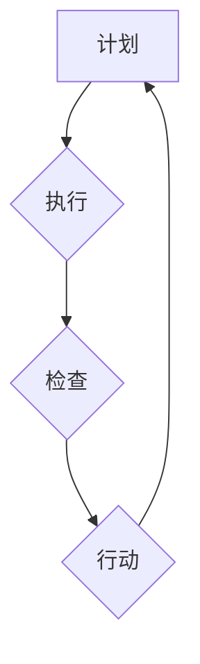
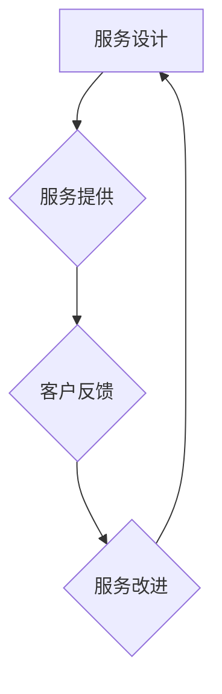
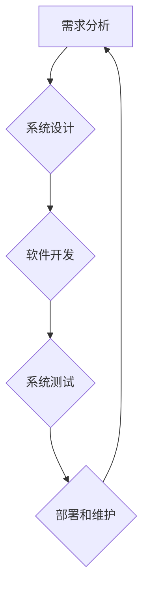

                 

### 文章标题：PDCA落地指南：持续改进的法宝

#### 关键词：PDCA、持续改进、质量管理体系、实战案例、流程图、应用策略

> **摘要**：本文将深入探讨PDCA（计划-执行-检查-行动）循环这一质量管理工具的落地实施指南。通过分析其基本概念、历史发展、应用场景，以及各个行业中的应用实例，本文旨在为广大读者提供一套实用、全面的PDCA实施策略，助力企业实现持续改进。

### 《PDCA落地指南：持续改进的法宝》目录大纲

#### 第一部分：PDCA方法概述

- **第1章：PDCA循环原理与重要性**
  - **1.1 PDCA循环的基本概念**
  - **1.2 PDCA循环的四个阶段**
  - **1.3 PDCA循环在企业中的应用场景**

- **第2章：PDCA方法的历史与发展**
  - **2.1 PDCA方法的起源与发展**
  - **2.2 PDCA方法的核心思想**
  - **2.3 PDCA方法与其他质量管理方法的对比**

#### 第二部分：PDCA在各个领域的应用

- **第3章：PDCA在制造业中的应用**
  - **3.1 制造业中的PDCA循环**
  - **3.2 制造业中的应用实例**
  - **3.3 制造业中PDCA的改进策略**

- **第4章：PDCA在服务业中的应用**
  - **4.1 服务业中的PDCA循环**
  - **4.2 服务业中的应用实例**
  - **4.3 服务业中PDCA的改进策略**

- **第5章：PDCA在IT行业中的应用**
  - **5.1 IT行业中的PDCA循环**
  - **5.2 IT行业中的应用实例**
  - **5.3 IT行业中PDCA的改进策略**

#### 第三部分：PDCA实战案例与技巧

- **第6章：PDCA实战案例解析**
  - **6.1 案例一：某制造企业PDCA应用案例**
  - **6.2 案例二：某服务企业PDCA应用案例**
  - **6.3 案例三：某IT企业PDCA应用案例**

- **第7章：PDCA实施技巧与注意事项**
  - **7.1 PDCA实施前的准备工作**
  - **7.2 PDCA实施过程中的关键点**
  - **7.3 PDCA实施中的常见问题与解决方法**

- **第8章：PDCA持续改进的策略与方法**
  - **8.1 PDCA持续改进的重要性**
  - **8.2 PDCA持续改进的策略**
  - **8.3 PDCA持续改进的方法**

#### 第四部分：附录

- **附录A：PDCA相关工具与资源**
  - **A.1 PDCA常用工具介绍**
  - **A.2 PDCA学习资源推荐**
  - **A.3 PDCA应用案例数据库**

- **附录B：PDCA流程图示例**
  - **B.1 制造业PDCA流程图**
  - **B.2 服务业PDCA流程图**
  - **B.3 IT行业PDCA流程图**

- **附录C：PDCA应用练习题及答案**
  - **C.1 练习题一：制造业PDCA案例分析**
  - **C.2 练习题二：服务业PDCA案例分析**
  - **C.3 练习题三：IT行业PDCA案例分析**

### 引言

在现代企业管理中，持续改进是提升企业竞争力的关键。而PDCA（计划-执行-检查-行动）循环作为一种系统化的质量管理工具，已被广泛应用于各个行业，帮助企业实现持续改进。本文旨在通过对PDCA方法的理论与实践进行深入剖析，为广大读者提供一套实用的PDCA落地指南。

首先，我们将从PDCA的基本概念和循环原理入手，帮助读者理解PDCA的核心思想。接着，通过回顾PDCA方法的历史与发展，我们将探讨其在质量管理领域的地位与影响力。随后，本文将详细分析PDCA在制造业、服务业和IT行业的具体应用，结合实战案例，提供实用的改进策略。最后，我们将总结PDCA的实战技巧与注意事项，并探讨持续改进的策略与方法。

通过本文的阅读，读者将能够全面掌握PDCA方法的理论与实践，为企业在质量管理中实现持续改进提供有力支持。希望本文能够成为您在持续改进道路上的一把“法宝”。

## 第一部分：PDCA方法概述

### 第1章：PDCA循环原理与重要性

#### 1.1 PDCA循环的基本概念

PDCA循环，全称为Plan-Do-Check-Act循环，起源于20世纪中期，由美国质量管理专家休哈特（W. Edwards Deming）首次提出。PDCA循环是一种系统化的管理工具，通过四个阶段的循环进行质量管理，旨在通过不断的计划、执行、检查和行动，实现持续改进。

PDCA循环的四个阶段分别是：

- **计划（Plan）**：在这个阶段，管理者需要根据目标和现状制定具体的计划，包括设定目标、分析问题、制定策略和分配资源等。

- **执行（Do）**：这个阶段是将计划付诸实践的过程。执行过程中，需要严格按照计划进行操作，确保每个环节都能按预期进行。

- **检查（Check）**：检查阶段是对执行过程的结果进行评估和反馈。通过收集数据、分析结果，管理者可以判断计划是否有效，发现问题和不足之处。

- **行动（Act）**：根据检查结果，这个阶段需要采取具体的行动，对成功经验进行标准化，对存在的问题进行改进。同时，将改进措施纳入下一个循环中，确保持续改进。

#### 1.2 PDCA循环的四个阶段

1. **计划（Plan）**

计划阶段是PDCA循环的起点，也是最重要的一步。在这个阶段，管理者需要进行以下几个步骤：

- **设定目标**：明确要解决的问题和要达成的目标，确保目标具有可衡量性和可实现性。

- **分析问题**：通过数据分析和现状调研，找出问题的根源和关键因素。

- **制定策略**：根据目标和问题，制定具体的改进策略和行动计划。

- **分配资源**：明确所需的资源，包括人力、物力、财力等，确保计划的顺利实施。

2. **执行（Do）**

执行阶段是将计划付诸实践的关键。在这个阶段，需要特别注意以下几点：

- **严格执行计划**：确保每个环节都按照计划进行，减少偏差和误差。

- **记录过程**：及时记录执行过程中的关键数据，为后续的检查和改进提供依据。

- **沟通协调**：确保团队成员之间的有效沟通，及时解决执行过程中出现的问题。

3. **检查（Check）**

检查阶段是对执行结果进行评估和反馈。具体步骤如下：

- **数据收集**：收集与计划执行相关的各种数据，包括质量指标、成本指标、时间指标等。

- **数据分析**：对收集到的数据进行分析，评估计划执行的效果，找出存在的问题。

- **结果反馈**：将分析结果反馈给相关部门和人员，为后续的改进提供依据。

4. **行动（Act）**

行动阶段是根据检查结果采取具体的行动。具体步骤如下：

- **标准化成功经验**：对成功的经验和做法进行总结和标准化，确保可以持续应用。

- **改进措施实施**：针对存在的问题，制定具体的改进措施，并确保改进措施的有效实施。

- **持续改进**：将改进措施纳入下一个PDCA循环中，确保持续改进的持续性。

#### 1.3 PDCA循环在企业中的应用场景

PDCA循环具有广泛的应用场景，尤其在企业管理、项目管理、质量管理等方面表现出色。以下是PDCA在企业中的几个典型应用场景：

1. **质量管理**：PDCA循环可以帮助企业建立和完善质量管理体系，通过持续改进实现质量的提升。例如，在产品生产过程中，企业可以通过PDCA循环来优化生产工艺、降低废品率、提高产品合格率。

2. **项目管理**：PDCA循环在项目管理中具有重要意义。通过PDCA循环，项目团队可以确保项目进度、质量和成本的控制在预期范围内。例如，在项目启动阶段，项目团队可以制定详细的计划，实施过程中严格按照计划进行，并在项目结束时进行评估和总结。

3. **运营管理**：PDCA循环可以帮助企业优化运营管理，提高生产效率和服务质量。例如，在供应链管理中，企业可以通过PDCA循环来优化库存管理、减少物流成本、提高供应链的响应速度。

4. **人力资源**：PDCA循环在人力资源管理中也有广泛的应用。通过PDCA循环，企业可以优化招聘流程、提高员工满意度、提升团队绩效等。

总之，PDCA循环作为一种系统化的质量管理工具，在企业各个领域都具有重要的应用价值。通过PDCA循环，企业可以实现持续改进，提高管理水平和竞争力。

### 第二部分：PDCA方法的历史与发展

#### 第2章：PDCA方法的历史与发展

PDCA循环，作为一种质量管理工具，其发展历程可以追溯到20世纪中期。本章将详细介绍PDCA方法的起源与发展，以及其核心思想，同时与其他质量管理方法进行对比分析。

#### 2.1 PDCA方法的起源与发展

PDCA循环最早由美国质量管理专家W. Edwards Deming提出，他被誉为“现代质量管理的先驱”。在二战期间，Deming博士在质量管理领域的研究和应用取得了显著成果，为美国战时的产品质量提升做出了重要贡献。战后，Deming博士将他的质量管理思想带到了日本，并在日本进行了广泛的推广和应用。

在日本，PDCA循环被称为“戴明循环”，成为日本企业质量管理的重要组成部分。PDCA循环在日本的广泛应用，使得日本的产品质量和管理水平得到了显著提升，进而推动了日本经济的快速发展。

随着时间的推移，PDCA循环在全球范围内得到了广泛应用，成为企业管理的重要工具。许多国家和地区，如美国、欧洲、中国等，都将PDCA循环引入到了企业质量管理中，取得了良好的效果。

#### 2.2 PDCA方法的核心思想

PDCA循环的核心思想可以概括为四个阶段：计划（Plan）、执行（Do）、检查（Check）和行动（Act）。这四个阶段相互关联，形成一个闭环，确保质量管理活动的持续改进。

1. **计划（Plan）**：计划阶段是PDCA循环的起点，其主要任务是设定目标和制定行动计划。在这个阶段，管理者需要分析现状，找出问题，制定具体的解决方案和实施计划。

2. **执行（Do）**：执行阶段是将计划付诸实践的过程。在这个阶段，管理者需要严格按照计划执行，确保每个环节都能按照预期进行。同时，记录执行过程中的关键数据，为后续的检查和改进提供依据。

3. **检查（Check）**：检查阶段是对执行结果进行评估和反馈。在这个阶段，管理者需要收集数据，对执行效果进行评估，判断计划是否有效，发现存在的问题。

4. **行动（Act）**：行动阶段是根据检查结果采取具体行动。在这个阶段，管理者需要将成功的经验和做法进行总结和标准化，对存在的问题进行改进。同时，将改进措施纳入下一个PDCA循环中，确保持续改进。

#### 2.3 PDCA方法与其他质量管理方法的对比

虽然PDCA循环在质量管理领域具有广泛的应用，但与其他质量管理方法相比，它也有一些独特的特点。

1. **与ISO 9001标准对比**

ISO 9001标准是一种国际通用的质量管理体系标准，它对企业的质量管理提出了详细的要求。与ISO 9001标准相比，PDCA循环更注重过程的持续改进。ISO 9001标准强调的是质量管理的体系化，而PDCA循环则强调通过持续的循环改进来提升质量管理水平。

2. **与六西格玛（Six Sigma）对比**

六西格玛是一种以数据为基础的管理方法，旨在通过减少过程变异来提高产品和服务质量。与六西格玛相比，PDCA循环更注重过程的整体优化。六西格玛强调的是通过统计方法和工具来减少过程的变异，而PDCA循环则更关注通过持续改进来提升整体质量。

3. **与精益生产（Lean Production）对比**

精益生产是一种旨在通过减少浪费、提高生产效率的管理方法。与精益生产相比，PDCA循环更注重质量的持续提升。精益生产强调的是通过消除浪费来提高生产效率，而PDCA循环则更关注通过持续改进来提升产品质量。

总之，PDCA循环作为一种系统化的质量管理工具，具有其独特的优势和应用价值。通过PDCA循环，企业可以实现持续改进，提升管理水平和竞争力。

### 第三部分：PDCA在各个领域的应用

#### 第3章：PDCA在制造业中的应用

制造业作为国民经济的重要支柱，其生产效率和质量水平直接影响着整个国家的经济运行。PDCA循环作为一种系统化的质量管理工具，在制造业中的应用具有重要意义。本节将详细介绍PDCA在制造业中的应用场景、具体实例以及改进策略。

#### 3.1 制造业中的PDCA循环

在制造业中，PDCA循环的应用涵盖了整个生产过程，从产品设计、生产制造到质量控制，每个环节都可以通过PDCA循环实现持续改进。以下是制造业中PDCA循环的具体应用场景：

1. **产品设计阶段**：在产品设计阶段，通过PDCA循环，企业可以不断优化产品设计，提高产品性能和客户满意度。例如，企业可以通过市场调研和客户反馈，找出产品设计中的不足，然后通过PDCA循环进行改进。

2. **生产制造阶段**：在生产制造阶段，PDCA循环可以帮助企业优化生产流程，提高生产效率，降低生产成本。例如，企业可以通过分析生产数据，找出生产过程中的瓶颈和问题，然后通过PDCA循环进行改进。

3. **质量控制阶段**：在质量控制阶段，PDCA循环可以帮助企业建立和完善质量管理体系，确保产品质量的稳定和提升。例如，企业可以通过PDCA循环，对生产过程中的质量检测数据进行监控，及时发现问题并进行改进。

#### 3.2 制造业中的应用实例

以下是一个典型的制造业PDCA循环应用实例：

1. **计划（Plan）**：某制造企业发现其生产过程中存在产品合格率低的问题，通过市场调研和客户反馈，确定了需要改进的关键环节。

2. **执行（Do）**：企业制定了详细的改进计划，包括优化生产流程、提高设备精度、加强员工培训等，并开始实施。

3. **检查（Check）**：在执行过程中，企业对改进措施的效果进行监控，通过质量检测数据和客户反馈，评估改进措施的有效性。

4. **行动（Act）**：根据检查结果，企业对成功的经验进行总结和标准化，对存在的问题进行改进。同时，将改进措施纳入下一个PDCA循环中，确保持续改进。

通过这个实例，我们可以看到PDCA循环在制造业中的应用是如何帮助企业实现持续改进的。

#### 3.3 制造业中PDCA的改进策略

为了在制造业中更好地应用PDCA循环，企业可以采取以下改进策略：

1. **建立健全的质量管理体系**：企业需要建立和完善质量管理体系，确保PDCA循环的顺利实施。质量管理体系包括质量政策、质量目标、质量控制计划等，为企业提供明确的指导。

2. **强化数据分析和监控**：企业需要强化数据分析和监控，确保PDCA循环的每个阶段都有充足的数据支持。通过数据分析和监控，企业可以及时发现问题和改进机会。

3. **培养持续改进意识**：企业需要培养员工的持续改进意识，让每个人都认识到持续改进的重要性和必要性。通过培训和教育，提高员工的技能和素质，为PDCA循环的顺利实施提供人才保障。

4. **建立反馈机制**：企业需要建立有效的反馈机制，确保PDCA循环的每个阶段都有及时的反馈和改进。通过反馈机制，企业可以及时发现问题和改进机会，确保持续改进的持续性。

总之，PDCA循环在制造业中的应用，可以帮助企业实现持续改进，提高生产效率和质量水平。通过建立健全的质量管理体系、强化数据分析和监控、培养持续改进意识以及建立反馈机制，企业可以更好地应用PDCA循环，提升整体竞争力。

### 第4章：PDCA在服务业中的应用

服务业是现代经济的重要组成部分，其服务质量和客户满意度直接关系到企业的市场竞争力。PDCA循环作为一种系统化的管理工具，在服务业中具有广泛的应用。本节将详细介绍PDCA在服务业中的应用场景、具体实例以及改进策略。

#### 4.1 服务业中的PDCA循环

在服务业中，PDCA循环的应用贯穿于服务的全过程，包括服务设计、服务提供、客户反馈和服务改进等环节。以下是PDCA在服务业中的具体应用场景：

1. **服务设计阶段**：在服务设计阶段，企业可以通过PDCA循环，根据客户需求和市场趋势，不断优化服务方案，确保服务的创新性和竞争力。

2. **服务提供阶段**：在服务提供阶段，企业可以通过PDCA循环，确保服务质量的稳定和提升。例如，通过PDCA循环，企业可以监控服务过程中的关键指标，及时发现和解决服务问题。

3. **客户反馈阶段**：在客户反馈阶段，企业可以通过PDCA循环，收集和分析客户反馈，了解客户的满意度和服务需求，为服务改进提供依据。

4. **服务改进阶段**：在服务改进阶段，企业可以通过PDCA循环，将客户反馈和服务问题转化为具体的改进措施，不断提升服务质量。

#### 4.2 服务业中的应用实例

以下是一个典型的服务业PDCA循环应用实例：

1. **计划（Plan）**：某服务企业发现客户投诉主要集中在服务响应速度和员工服务态度上，通过分析客户反馈，确定了需要改进的关键环节。

2. **执行（Do）**：企业制定了详细的改进计划，包括优化服务流程、提高员工服务技能、加强客户沟通等，并开始实施。

3. **检查（Check）**：在执行过程中，企业通过客户满意度调查和服务质量监控，评估改进措施的有效性。

4. **行动（Act）**：根据检查结果，企业对成功的经验进行总结和标准化，对存在的问题进行改进。同时，将改进措施纳入下一个PDCA循环中，确保持续改进。

通过这个实例，我们可以看到PDCA循环在服务业中的应用是如何帮助企业实现服务质量的持续提升的。

#### 4.3 服务业中PDCA的改进策略

为了在服务业中更好地应用PDCA循环，企业可以采取以下改进策略：

1. **建立客户导向的服务体系**：企业需要建立以客户需求为导向的服务体系，确保服务的创新性和竞争力。通过PDCA循环，企业可以不断优化服务方案，满足客户需求。

2. **强化服务质量管理**：企业需要强化服务质量管理，确保服务质量的稳定和提升。通过PDCA循环，企业可以监控服务过程中的关键指标，及时发现和解决服务问题。

3. **提升员工服务技能**：企业需要提升员工的服务技能，确保员工能够提供高质量的服务。通过培训和教育，提高员工的服务水平和专业素养。

4. **建立客户反馈机制**：企业需要建立有效的客户反馈机制，确保客户反馈能够及时传递到相关部门和人员。通过客户反馈，企业可以了解客户的满意度和服务需求，为服务改进提供依据。

5. **实施持续改进**：企业需要实施持续改进，通过PDCA循环，不断优化服务流程和服务质量。通过持续改进，企业可以不断提升服务质量，提高客户满意度。

总之，PDCA循环在服务业中的应用，可以帮助企业实现服务质量的持续提升，提高市场竞争力。通过建立客户导向的服务体系、强化服务质量管理、提升员工服务技能、建立客户反馈机制以及实施持续改进，企业可以更好地应用PDCA循环，提升整体服务水平。

### 第5章：PDCA在IT行业中的应用

在IT行业，PDCA循环作为一种有效的质量管理工具，广泛应用于软件开发、系统维护、网络安全等领域。通过PDCA循环，企业可以实现项目管理的规范化和持续改进，提升产品质量和服务水平。本节将详细探讨PDCA在IT行业中的应用场景、具体实例以及改进策略。

#### 5.1 IT行业中的PDCA循环

在IT行业，PDCA循环的应用贯穿于项目开发的各个阶段，包括需求分析、设计、开发、测试和部署等。以下是PDCA在IT行业中的具体应用场景：

1. **需求分析阶段**：在需求分析阶段，通过PDCA循环，企业可以确保需求分析的准确性和全面性，避免因需求不明确导致的后期变更和问题。

2. **设计阶段**：在设计阶段，PDCA循环可以帮助企业不断优化系统架构和设计方案，提高系统的可维护性和扩展性。

3. **开发阶段**：在开发阶段，PDCA循环可以确保开发过程的规范化和标准化，减少代码缺陷和bug。

4. **测试阶段**：在测试阶段，PDCA循环可以帮助企业建立完善的测试体系，提高测试覆盖率，确保软件质量和性能。

5. **部署和维护阶段**：在部署和维护阶段，PDCA循环可以确保系统的稳定运行和持续改进，快速响应用户需求和变化。

#### 5.2 IT行业中的应用实例

以下是一个典型的IT行业PDCA循环应用实例：

1. **计划（Plan）**：某IT企业发现其新开发的软件系统存在性能瓶颈，通过性能测试和分析，确定了需要优化的关键模块。

2. **执行（Do）**：企业制定了详细的性能优化计划，包括代码优化、数据库优化和系统架构调整等，并开始实施。

3. **检查（Check）**：在执行过程中，企业对优化措施的效果进行监控，通过性能测试和用户反馈，评估优化措施的有效性。

4. **行动（Act）**：根据检查结果，企业对成功的经验进行总结和标准化，对存在的问题进行改进。同时，将优化措施纳入下一个PDCA循环中，确保持续改进。

通过这个实例，我们可以看到PDCA循环在IT行业中的应用是如何帮助企业实现性能优化和持续改进的。

#### 5.3 IT行业中PDCA的改进策略

为了在IT行业中更好地应用PDCA循环，企业可以采取以下改进策略：

1. **建立规范的开发流程**：企业需要建立规范的开发流程，确保开发过程的规范化和标准化。通过流程规范，企业可以减少开发过程中的混乱和错误。

2. **强化质量控制**：企业需要强化质量控制，确保软件质量和性能。通过PDCA循环，企业可以建立完善的测试体系，提高测试覆盖率，确保软件质量和性能。

3. **提升团队协作能力**：企业需要提升团队协作能力，确保项目团队能够高效沟通和协作。通过培训和团队建设，提高团队成员的协作能力和沟通能力。

4. **实施持续改进**：企业需要实施持续改进，通过PDCA循环，不断优化项目开发和管理过程。通过持续改进，企业可以不断提升产品质量和服务水平。

5. **引入先进的工具和技术**：企业可以引入先进的工具和技术，提高开发效率和质量。例如，使用自动化测试工具、持续集成和持续交付等，提高开发效率和软件质量。

总之，PDCA循环在IT行业中的应用，可以帮助企业实现项目管理的规范化和持续改进，提升产品质量和服务水平。通过建立规范的开发流程、强化质量控制、提升团队协作能力、实施持续改进以及引入先进的工具和技术，企业可以更好地应用PDCA循环，提升整体竞争力。

### 第四部分：PDCA实战案例与技巧

#### 第6章：PDCA实战案例解析

#### 6.1 案例一：某制造企业PDCA应用案例

为了更好地理解PDCA在实际中的应用，我们来看一个制造企业的PDCA应用案例。该企业是一家生产电子元件的公司，近年来面临着生产效率低下和产品质量不稳定的问题。通过引入PDCA循环，该企业逐步实现了生产效率的提升和产品质量的稳定。

1. **计划（Plan）**：

   - **问题识别**：通过数据分析和员工反馈，识别出生产效率低和产品质量不稳定的主要原因是生产线布局不合理、设备老化以及员工技能不足。

   - **目标设定**：制定具体的目标，包括提高生产效率10%、提升产品质量合格率至98%。

   - **策略制定**：制定具体的改进策略，包括优化生产线布局、升级设备、加强员工培训等。

2. **执行（Do）**：

   - **执行改进策略**：企业按照计划逐步实施改进措施，包括重新规划生产线、采购新设备、组织员工培训等。

   - **记录执行过程**：详细记录执行过程中的关键数据，如设备运行时间、生产效率、产品质量检测数据等。

3. **检查（Check）**：

   - **数据收集**：通过数据分析，对比改进前后的生产效率和产品质量合格率。

   - **结果评估**：评估改进措施的效果，发现改进过程中存在的问题和不足。

4. **行动（Act）**：

   - **总结经验**：对成功的经验进行总结和标准化，确保可以持续应用。

   - **改进措施**：针对存在的问题，制定具体的改进措施，如优化员工培训计划、加强设备维护等。

#### 6.2 案例二：某服务企业PDCA应用案例

接下来，我们来看一个服务企业的PDCA应用案例。该企业是一家提供客户服务外包的公司，客户满意度低下成为其面临的主要问题。通过引入PDCA循环，该企业成功提升了客户满意度。

1. **计划（Plan）**：

   - **问题识别**：通过客户反馈和内部调查，识别出客户满意度低下的主要原因是服务响应速度慢、员工态度不佳以及服务质量不稳定。

   - **目标设定**：制定具体的目标，包括提升客户满意度至90%。

   - **策略制定**：制定具体的改进策略，包括优化服务流程、提升员工服务技能、加强客户沟通等。

2. **执行（Do）**：

   - **执行改进策略**：企业按照计划逐步实施改进措施，包括优化服务流程、组织员工培训、改进客户沟通机制等。

   - **记录执行过程**：详细记录执行过程中的关键数据，如客户响应时间、员工服务态度评分、客户满意度调查数据等。

3. **检查（Check）**：

   - **数据收集**：通过数据分析，对比改进前后的客户满意度和服务响应速度。

   - **结果评估**：评估改进措施的效果，发现改进过程中存在的问题和不足。

4. **行动（Act）**：

   - **总结经验**：对成功的经验进行总结和标准化，确保可以持续应用。

   - **改进措施**：针对存在的问题，制定具体的改进措施，如加强员工培训、优化客户沟通机制等。

#### 6.3 案例三：某IT企业PDCA应用案例

最后，我们来看一个IT企业的PDCA应用案例。该企业是一家提供软件开发服务的公司，开发过程中存在项目延期和质量不稳定的问题。通过引入PDCA循环，该企业逐步实现了项目管理的规范化和持续改进。

1. **计划（Plan）**：

   - **问题识别**：通过项目评审和员工反馈，识别出项目延期和质量不稳定的主要原因是需求分析不充分、开发流程不规范以及测试覆盖率不足。

   - **目标设定**：制定具体的目标，包括缩短项目开发周期15%、提升软件质量合格率至95%。

   - **策略制定**：制定具体的改进策略，包括加强需求分析、规范开发流程、提高测试覆盖率等。

2. **执行（Do）**：

   - **执行改进策略**：企业按照计划逐步实施改进措施，包括加强需求分析、规范开发流程、引入自动化测试等。

   - **记录执行过程**：详细记录执行过程中的关键数据，如项目开发周期、质量检测数据、客户反馈等。

3. **检查（Check）**：

   - **数据收集**：通过数据分析，对比改进前后的项目开发周期和质量合格率。

   - **结果评估**：评估改进措施的效果，发现改进过程中存在的问题和不足。

4. **行动（Act）**：

   - **总结经验**：对成功的经验进行总结和标准化，确保可以持续应用。

   - **改进措施**：针对存在的问题，制定具体的改进措施，如优化需求分析流程、加强测试管理等。

通过这三个案例，我们可以看到PDCA循环在不同行业中的应用是如何帮助企业实现持续改进的。无论是制造企业、服务企业还是IT企业，PDCA循环都可以提供一套系统化的管理工具，帮助企业不断提升产品质量和管理水平。

### 第7章：PDCA实施技巧与注意事项

#### 7.1 PDCA实施前的准备工作

成功实施PDCA循环需要充分的准备工作，以下是几个关键步骤：

1. **确定目标**：在开始PDCA循环之前，企业需要明确改进的目标和预期效果。目标应该具体、可衡量、可实现，并与企业的整体战略目标相一致。

2. **组建团队**：组建一支跨部门、多层次的PDCA实施团队，确保团队能够代表不同利益相关方的意见和需求。团队成员应具备相关的专业技能和改进经验。

3. **制定计划**：制定详细的PDCA实施计划，包括时间表、责任分配、资源需求等。计划应明确每个阶段的任务和里程碑，以确保PDCA循环的顺利进行。

4. **进行培训**：对团队成员进行PDCA方法和工具的培训，确保他们了解PDCA的核心概念和操作步骤。培训应包括理论学习和实际操作演练。

#### 7.2 PDCA实施过程中的关键点

在PDCA实施过程中，以下几个关键点尤为重要：

1. **数据收集与分析**：确保在执行阶段收集准确、全面的数据，并进行有效的分析。数据是PDCA循环的基础，只有通过数据驱动的方式，才能做出准确的判断和决策。

2. **持续沟通与反馈**：在整个实施过程中，团队成员需要保持频繁的沟通和反馈。及时的沟通可以帮助团队快速识别问题、调整策略，确保改进措施的及时实施。

3. **问题识别与解决**：在检查阶段，要全面识别问题，并采取有效的解决措施。问题可以是技术性的，也可以是管理性的，都需要通过具体的方法和工具进行解决。

4. **标准化与推广**：将成功的经验和做法进行总结和标准化，确保可以持续应用并推广到整个组织。标准化有助于提高PDCA循环的效率和效果。

#### 7.3 PDCA实施中的常见问题与解决方法

尽管PDCA循环是一种系统化的管理工具，但在实施过程中仍然会遇到一些常见问题。以下是几种常见问题及其解决方法：

1. **缺乏数据支持**：解决方法：加强数据收集和分析，确保每个阶段都有充足的数据支持。可以使用各种工具和软件来提高数据收集和分析的效率。

2. **团队协作不力**：解决方法：建立有效的沟通机制，确保团队成员之间的信息畅通。可以通过定期的会议、工作坊等方式加强团队协作。

3. **执行不力**：解决方法：明确责任和任务分配，确保每个团队成员都清楚自己的职责。可以通过监督和反馈机制来确保执行到位。

4. **缺乏持续改进意识**：解决方法：通过培训和教育提高员工的改进意识，鼓励他们积极参与到PDCA循环中。可以设置奖励机制，激励员工提出改进建议。

5. **计划不切实际**：解决方法：在制定计划时，要充分考虑实际情况，确保计划的可行性和可操作性。可以邀请外部专家进行评估和指导，以提高计划的科学性和实用性。

通过充分的准备工作和有效的实施策略，企业可以更好地应用PDCA循环，实现持续改进。在遇到问题时，及时识别并采取有效的解决方法，确保PDCA循环的顺利进行和预期效果的实现。

### 第8章：PDCA持续改进的策略与方法

#### 8.1 PDCA持续改进的重要性

持续改进是现代企业管理的重要原则，也是企业实现长期发展的重要保障。PDCA循环作为一种系统化的管理工具，为企业的持续改进提供了有效的路径和方法。PDCA持续改进的重要性体现在以下几个方面：

1. **提升企业竞争力**：通过PDCA循环，企业可以不断优化内部管理、提高产品质量和服务水平，从而在市场竞争中占据有利地位。

2. **提高效率和质量**：PDCA循环通过计划、执行、检查和行动四个阶段的循环，确保企业每一步都在向着更好的方向发展，从而实现效率和质量的双重提升。

3. **培养团队协作能力**：PDCA循环的实施需要团队成员的密切协作和有效沟通，这有助于提高团队的整体协作能力和执行能力。

4. **激发创新思维**：通过PDCA循环，企业可以不断总结经验、发现问题和改进机会，激发员工的创新思维，推动企业创新和发展。

#### 8.2 PDCA持续改进的策略

为了实现PDCA的持续改进，企业可以采取以下策略：

1. **建立持续改进文化**：企业需要建立一种以持续改进为核心的企业文化，让每个员工都认识到持续改进的重要性和必要性。通过培训和激励，营造一个鼓励创新和改进的工作环境。

2. **制定明确的改进目标**：明确持续改进的目标，并将其纳入企业的战略规划中。目标应具体、可衡量，并与企业的整体发展目标相一致。

3. **完善数据收集与分析机制**：数据是PDCA循环的基础，企业需要建立完善的数据收集与分析机制，确保每个阶段都有充足的数据支持。可以通过引入数据分析和可视化工具，提高数据分析的效率和准确性。

4. **加强跨部门协作**：持续改进需要跨部门的协作和共同努力，企业需要建立有效的沟通机制，确保不同部门之间的信息畅通。可以通过定期召开跨部门会议、设立项目组等方式，加强部门间的协作。

5. **建立反馈机制**：建立有效的反馈机制，确保改进措施的有效实施和持续优化。可以通过定期的员工满意度调查、客户反馈等方式，收集反馈信息，并根据反馈进行改进。

#### 8.3 PDCA持续改进的方法

以下是几种常见的PDCA持续改进方法：

1. **目标管理法**：通过设定具体的改进目标，明确改进的方向和重点，确保改进措施有针对性。目标应分解到各个部门和员工，形成明确的责任和任务。

2. **流程优化法**：通过对企业内部流程进行优化，消除冗余和浪费，提高流程的效率和效果。可以通过流程图分析、流程仿真等方法，识别流程中的问题和改进机会。

3. **六西格玛法**：六西格玛是一种以数据为基础的管理方法，旨在通过减少过程变异来提高产品质量和服务水平。六西格玛方法可以与PDCA循环结合使用，提高PDCA循环的效果。

4. **精益生产法**：精益生产是一种旨在通过减少浪费、提高生产效率的管理方法。精益生产方法可以应用于制造和服务行业，通过消除浪费、优化流程，实现持续改进。

5. **员工参与法**：鼓励员工参与持续改进活动，通过提出改进建议和实施改进措施，提高员工的参与度和主动性。可以通过设立员工建议奖励机制，激励员工积极参与改进活动。

通过以上策略和方法，企业可以更好地实施PDCA持续改进，不断提升管理水平和市场竞争力。持续改进不仅是一种管理方法，更是一种企业文化，企业应将其融入到日常运营中，实现长期稳定的发展。

### 附录A：PDCA相关工具与资源

#### A.1 PDCA常用工具介绍

为了更好地实施PDCA循环，企业可以借助一些常用的工具和方法，以下是几种常用的PDCA工具介绍：

1. **流程图**：流程图是一种用于描述工作流程和过程关系的图形化工具，可以帮助企业清晰地了解各个阶段的任务和职责，优化流程。

2. **鱼骨图（因果图）**：鱼骨图是一种用于分析问题原因和影响的关系图，可以帮助企业找出问题的根本原因，制定有效的改进措施。

3. **控制图**：控制图是一种用于监控过程稳定性和变异性的统计工具，可以帮助企业识别出过程异常，及时进行调整。

4. **帕累托图**：帕累托图是一种用于分析问题优先级的工具，可以帮助企业集中精力解决影响最大的问题，提高改进效果。

5. **五何分析**：五何分析是一种用于问题分析和改进措施制定的方法，通过回答“是什么”、“为什么”、“在哪里”、“什么时候”和“如何做”等问题，帮助企业全面分析问题并制定改进方案。

#### A.2 PDCA学习资源推荐

为了深入了解PDCA循环的理论和实践，以下是一些推荐的PDCA学习资源：

1. **《PDCA循环：持续改进的实践指南》**：这是一本系统介绍PDCA循环的书籍，内容包括基本概念、应用场景、实战案例等，适合初学者和有一定基础的人员阅读。

2. **《质量管理方法论：PDCA循环与六西格玛》**：这本书结合了PDCA循环和六西格玛两种质量管理工具，详细阐述了如何在实际工作中应用这些工具进行持续改进。

3. **在线课程和讲座**：许多在线教育平台提供了关于PDCA循环的课程和讲座，如Coursera、Udemy等，可以帮助学习者系统地学习PDCA循环的理论和实践。

4. **专业论坛和社区**：加入一些专业论坛和社区，如质量管理协会（ASQ）、精益生产协会（Lean Enterprise Institute）等，可以与其他从业者交流和分享经验。

#### A.3 PDCA应用案例数据库

为了方便读者学习和参考，以下是一些PDCA应用案例数据库：

1. **质量管理协会（ASQ）案例库**：ASQ提供了一个丰富的案例库，涵盖了各行各业的质量管理实践，包括制造、服务业、IT行业等。

2. **IBM质量管理案例库**：IBM分享了多个质量管理案例，展示了如何通过PDCA循环实现持续改进。

3. **精益生产协会（Lean Enterprise Institute）案例库**：Lean Enterprise Institute提供了大量关于精益生产的案例，许多案例结合了PDCA循环的应用。

4. **《中国质量管理》杂志案例库**：中国质量管理杂志社发布了一系列国内企业的PDCA应用案例，展示了不同行业的企业如何通过PDCA实现质量改进。

通过以上工具和资源的介绍，读者可以更好地理解和应用PDCA循环，为企业的持续改进提供有力支持。

### 附录B：PDCA流程图示例

为了更直观地了解PDCA循环的各个阶段及其相互关系，以下提供几个不同行业的PDCA流程图示例。

#### B.1 制造业PDCA流程图

1. **计划**：确定目标、制定策略、分配资源。
2. **执行**：按照计划执行、记录数据。
3. **检查**：评估执行结果、分析数据。
4. **行动**：总结经验、改进措施。

#### B.2 服务业PDCA流程图

1. **服务设计**：设计服务方案、确定服务流程。
2. **服务提供**：实施服务方案、记录服务过程。
3. **客户反馈**：收集客户反馈、分析服务效果。
4. **服务改进**：改进服务方案、优化服务流程。

#### B.3 IT行业PDCA流程图

1. **需求分析**：明确项目需求、制定开发计划。
2. **系统设计**：设计系统架构、制定详细方案。
3. **软件开发**：按照设计方案进行编码、单元测试。
4. **系统测试**：进行集成测试、性能测试、安全测试。
5. **部署和维护**：部署系统、提供持续维护和改进。

通过这些PDCA流程图示例，可以更好地理解PDCA循环在不同行业中的应用及其具体实施步骤。

### 附录C：PDCA应用练习题及答案

为了帮助读者更好地掌握PDCA循环的应用，以下提供几个练习题及答案。

#### C.1 练习题一：制造业PDCA案例分析

某制造企业发现其产品合格率较低，通过PDCA循环进行改进。以下是该企业的PDCA应用案例，请分析其各个阶段并给出改进建议。

1. **计划**：

   - **问题识别**：产品合格率较低。
   - **目标设定**：提高产品合格率至95%。
   - **策略制定**：优化生产流程、加强员工培训。

2. **执行**：

   - **执行计划**：调整生产设备、组织员工培训。

3. **检查**：

   - **数据收集**：统计产品合格率数据。
   - **结果评估**：产品合格率提升至92%。

4. **行动**：

   - **总结经验**：培训效果显著，设备调整需要进一步优化。
   - **改进措施**：加强设备维护、持续优化培训计划。

**答案**：该企业在PDCA循环中的应用较为成功，但在设备调整方面仍有改进空间。建议加强设备维护和持续优化培训计划，以确保产品合格率进一步提升。

#### C.2 练习题二：服务业PDCA案例分析

某服务公司发现客户投诉率较高，通过PDCA循环进行改进。以下是该企业的PDCA应用案例，请分析其各个阶段并给出改进建议。

1. **计划**：

   - **问题识别**：客户投诉率较高。
   - **目标设定**：降低客户投诉率至5%。
   - **策略制定**：优化服务流程、提高员工服务技能。

2. **执行**：

   - **执行计划**：优化服务流程、组织员工培训。

3. **检查**：

   - **数据收集**：统计客户投诉数据。
   - **结果评估**：客户投诉率下降至8%。

4. **行动**：

   - **总结经验**：服务流程优化效果明显，员工服务技能需进一步提升。
   - **改进措施**：加强员工服务技能培训、完善客户反馈机制。

**答案**：该企业在PDCA循环中的应用较为成功，但在员工服务技能方面仍有提升空间。建议加强员工服务技能培训和完善客户反馈机制，以进一步降低客户投诉率。

#### C.3 练习题三：IT行业PDCA案例分析

某IT企业发现其软件项目中存在项目延期和质量不稳定的问题，通过PDCA循环进行改进。以下是该企业的PDCA应用案例，请分析其各个阶段并给出改进建议。

1. **计划**：

   - **问题识别**：项目延期和质量不稳定。
   - **目标设定**：缩短项目开发周期20%、提升软件质量合格率至98%。
   - **策略制定**：加强需求分析、优化开发流程、提高测试覆盖率。

2. **执行**：

   - **执行计划**：加强需求分析、优化开发流程、引入自动化测试。

3. **检查**：

   - **数据收集**：统计项目开发周期和质量检测数据。
   - **结果评估**：项目开发周期缩短15%、软件质量合格率提升至97%。

4. **行动**：

   - **总结经验**：需求分析和开发流程优化效果显著，自动化测试需进一步推广。
   - **改进措施**：加强自动化测试培训、推广自动化测试工具。

**答案**：该企业在PDCA循环中的应用较为成功，但在自动化测试方面仍有改进空间。建议加强自动化测试培训、推广自动化测试工具，以进一步提升项目开发效率和软件质量。

通过以上练习题和案例分析，读者可以更好地掌握PDCA循环的应用，为实际工作中的持续改进提供参考。

### 总结

本文通过深入探讨PDCA循环的基本概念、历史发展、应用场景以及实战案例，为广大读者提供了一套实用的PDCA落地指南。PDCA循环作为一种系统化的质量管理工具，不仅有助于企业在制造业、服务业和IT行业中实现持续改进，还能够提升整体管理水平和市场竞争力。

在实际应用中，企业需要充分认识到PDCA循环的重要性，通过计划、执行、检查和行动四个阶段的不断循环，不断优化内部管理、提高产品质量和服务水平。同时，企业还需结合自身实际情况，制定切实可行的改进策略，并借助各种工具和资源，确保PDCA循环的顺利实施。

展望未来，随着数字化和智能化的深入发展，PDCA循环将在更广泛的领域发挥其作用。企业应紧跟时代步伐，积极应用PDCA循环，不断探索和创新，实现可持续发展。

在此，我们鼓励读者将PDCA循环的理念和方法融入到实际工作中，通过持续改进，不断提升企业竞争力和创新能力。希望本文能够成为您在持续改进道路上的一把“法宝”，助力企业在激烈的市场竞争中脱颖而出。

### 拓展阅读

1. **《质量管理方法论：PDCA循环与六西格玛》**：作者详细阐述了如何结合PDCA循环和六西格玛方法进行质量管理，适合想要深入了解这两种工具结合应用的企业管理者。

2. **《精益生产：从基础到实践》**：本书系统地介绍了精益生产的基本概念和实践方法，包括与PDCA循环的结合应用，适合制造业和服务业从业者。

3. **《项目管理：理论与实践》**：本书涵盖了项目管理的各个方面，包括项目计划、执行、监控和收尾，详细阐述了如何在项目管理中应用PDCA循环。

4. **《敏捷管理：如何在快速变化的环境中实现高效管理》**：本书介绍了敏捷管理的方法和工具，包括如何将PDCA循环应用于敏捷开发过程，适合IT行业从业者。

通过阅读以上书籍，读者可以进一步拓展对PDCA循环的理解和应用，为企业在不同领域实现持续改进提供更多思路和方法。希望这些拓展阅读能够为您的职业发展带来新的启示和帮助。

