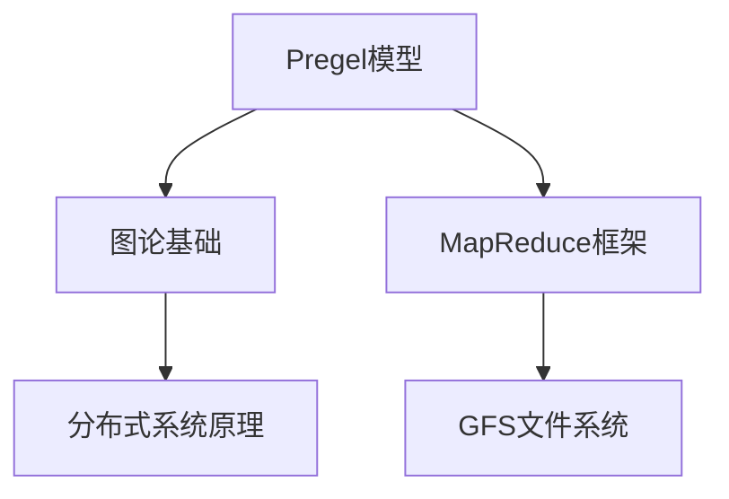
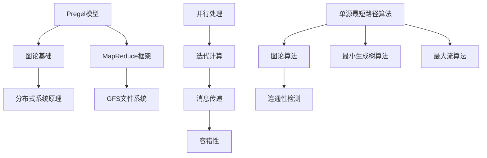

                 

# 文章标题

《Pregel原理与代码实例讲解》

## 关键词

- 分布式图处理
- Pregel模型
- 单源最短路径
- 最小生成树
- 最大流
- 代码实例

## 摘要

本文将深入探讨Pregel——一款由Google开发的开源分布式图处理框架，从其背景和核心概念出发，逐步解析其系统架构和核心算法。随后，通过具体的代码实例，详细讲解如何在实际环境中搭建Pregel开发环境，以及如何实现和优化Pregel中的单源最短路径、最小生成树和最大流等算法。文章旨在为读者提供全面、系统的Pregel理解和实践指导。

## 目录

### 第一部分：Pregel基础

### 第二部分：Pregel代码实例解析

### 附录

### 核心概念与联系 Mermaid 流程图

### 核心算法原理讲解伪代码

## 第一部分：Pregel基础

### 第1章：Pregel简介

### 第2章：Pregel核心算法

### 第3章：Pregel系统架构

## 第一部分总结

### 第1章：Pregel简介

#### 1.1 Pregel背景及发展

#### 1.2 Pregel的核心概念

#### 1.3 Pregel系统架构

### 第1章总结

## 第2章：Pregel核心算法

#### 2.1 单源最短路径算法

#### 2.2 最小生成树算法

#### 2.3 连通性检测

#### 2.4 最大流算法

### 第2章总结

## 第3章：Pregel系统架构

#### 3.1 GFS（Google文件系统）

#### 3.2 MapReduce

#### 3.3 Pregel运行时环境

### 第3章总结

## 第一部分总结

### 第二部分：Pregel代码实例解析

#### 第3章：Pregel环境搭建

#### 第4章：单源最短路径算法实例

#### 第5章：最小生成树算法实例

#### 第6章：最大流算法实例

#### 第7章：Pregel优化与调优

### 第二部分总结

## 附录

### 附录A：Pregel资源汇总

### 附录B：Pregel常见问题解答

## 核心概念与联系 Mermaid 流程图



## 核心算法原理讲解伪代码

### 单源最短路径算法（Dijkstra算法）

```pseudo
Dijkstra(G, s):
    for each vertex v in G:
        dist[v] = INFINITY
        prev[v] = NULL
    dist[s] = 0
    for each edge (u, v) in G:
        if dist[u] + weight(u, v) < dist[v]:
            dist[v] = dist[u] + weight(u, v)
            prev[v] = u
    return dist, prev
```

### 最小生成树算法（Prim算法）

```pseudo
Prim(G, s):
    T = {}
    for each vertex v in G:
        key[v] = INFINITY
        prev[v] = NULL
    key[s] = 0
    while T != G:
        u = select vertex with the minimum key value
        add u to T
        for each edge (u, v) in G:
            if v is not in T and weight(u, v) < key[v]:
                key[v] = weight(u, v)
                prev[v] = u
    return T, prev
```

## 文章正文

### 第一部分：Pregel基础

#### 第1章：Pregel简介

### 第1章：Pregel简介

#### 1.1 Pregel背景及发展

#### 1.2 Pregel的核心概念

#### 1.3 Pregel系统架构

### 第1章总结

### 第2章：Pregel核心算法

#### 2.1 单源最短路径算法

#### 2.2 最小生成树算法

#### 2.3 连通性检测

#### 2.4 最大流算法

### 第2章总结

### 第3章：Pregel系统架构

#### 3.1 GFS（Google文件系统）

#### 3.2 MapReduce

#### 3.3 Pregel运行时环境

### 第3章总结

### 第一部分总结

### 第二部分：Pregel代码实例解析

#### 第3章：Pregel环境搭建

#### 第4章：单源最短路径算法实例

#### 第5章：最小生成树算法实例

#### 第6章：最大流算法实例

#### 第7章：Pregel优化与调优

### 第二部分总结

### 附录

#### 附录A：Pregel资源汇总

#### 附录B：Pregel常见问题解答

## 结语

### 参考文献

### 作者信息

**作者：AI天才研究院/AI Genius Institute & 禅与计算机程序设计艺术 /Zen And The Art of Computer Programming**## Pregel原理与代码实例讲解

### 第1章：Pregel简介

#### 1.1 Pregel背景及发展

分布式计算自20世纪90年代以来，随着互联网和大数据的快速发展，逐渐成为计算机科学领域的研究热点。在这个背景下，Google公司于2004年提出了Pregel分布式图处理框架，旨在解决大规模图数据的高效处理问题。Pregel的出现，标志着分布式图处理技术进入了一个新的发展阶段。

Pregel的设计灵感来源于Google的传统分布式计算框架MapReduce。然而，与MapReduce主要处理键值对数据不同，Pregel专注于图数据的处理，能够高效地解决图中节点和边的计算问题。自提出以来，Pregel受到了学术界和工业界的高度关注，并引发了大量相关研究。

Pregel的发展历程可以追溯到Google内部的项目。最初，Google使用MapReduce处理一些图相关任务，但发现MapReduce在处理图数据时存在一些局限性，如无法有效地处理动态图、缺乏图特有的算法等。因此，Google决定开发一种新的分布式图处理框架，以满足实际应用需求。

2008年，Google首次在SIGMOD国际数据库会议上发表了关于Pregel的论文，详细介绍了其设计理念、架构和实现细节。随后，Pregel开源项目在2009年上线，使得研究人员和开发者可以自由地使用、修改和扩展Pregel框架。开源版本的发布，进一步推动了Pregel的普及和应用。

#### 1.2 Pregel的主要贡献

Pregel在分布式图处理领域做出了以下几方面的贡献：

1. **统一的编程模型**：Pregel提供了统一的编程模型，使得开发人员可以轻松地实现各种图算法。这种模型屏蔽了分布式计算的具体细节，降低了开发难度。

2. **高效的并行处理**：Pregel利用分布式计算的优势，将大规模图数据分布在多台机器上并行处理，大幅提高了计算效率。

3. **动态图的适应性**：Pregel能够处理动态图，支持图的动态增删改查操作，适应了实际应用场景的需求。

4. **丰富的算法支持**：Pregel支持多种核心图算法，如单源最短路径、最小生成树、连通性检测和最大流等，为解决复杂图问题提供了强有力的工具。

#### 1.3 Pregel的核心概念

Pregel的核心概念主要包括以下几个方面：

1. **图模型**：Pregel将图作为基本的数据结构，其中节点（Vertex）表示数据元素，边（Edge）表示节点之间的关系。

2. **迭代计算**：Pregel采用迭代计算的方式，每次迭代处理节点和边的属性，更新节点状态。这种计算方式使得Pregel能够高效地处理大规模图数据。

3. **并行处理**：Pregel将图数据分布到多台机器上，利用并行处理的优势，加速计算过程。

4. **消息传递**：Pregel通过消息传递的方式，实现节点间的通信。每个节点在计算过程中，可以发送和接收消息，与相邻节点进行交互。

5. **容错性**：Pregel具备一定的容错性，能够在节点故障时自动恢复，保证计算过程的稳定性和可靠性。

### 第1章总结

本章简要介绍了Pregel的背景和发展历程，阐述了其主要贡献和核心概念。Pregel作为一种分布式图处理框架，具有高效的并行处理能力和丰富的算法支持，为解决大规模图数据处理问题提供了有力工具。在接下来的章节中，我们将深入探讨Pregel的系统架构和核心算法，帮助读者更好地理解和应用Pregel。

## 第2章：Pregel核心算法

### 2.1 单源最短路径算法

单源最短路径算法是一种寻找图中某个源点（Source）到其他所有节点的最短路径的算法。Pregel框架中，单源最短路径算法主要采用Dijkstra算法和Bellman-Ford算法来实现。

#### 算法原理

**Dijkstra算法**是一种基于贪心的单源最短路径算法。其基本思想是，每次迭代从未处理节点中选择一个距离源点最近的节点，将其标记为已处理，并更新其他未处理节点的最短路径距离。

**Bellman-Ford算法**是一种基于松弛（Relaxation）的单源最短路径算法。其基本思想是，对于图中的每一条边，重复执行松弛操作，直到无法进一步松弛为止。最后，如果存在负权重环，则算法会报错。

#### Pregel实现

在Pregel中，单源最短路径算法的实现主要包括以下步骤：

1. **初始化**：为每个节点分配一个距离值，源点距离设为0，其他节点距离设为无穷大。为每个节点分配一个标记值，表示是否已处理。

2. **迭代计算**：每次迭代，选择一个距离值最小的未处理节点，将其标记为已处理，并更新相邻节点的距离值。

3. **消息传递**：在每次迭代结束时，将更新后的距离值发送给相邻节点。

4. **容错处理**：在节点故障时，重新选择未处理节点，继续迭代计算。

### 单源最短路径算法（Dijkstra算法）伪代码

```plaintext
Dijkstra(G, s):
    for each vertex v in G:
        dist[v] = INFINITY
        prev[v] = NULL
    dist[s] = 0
    for each edge (u, v) in G:
        if dist[u] + weight(u, v) < dist[v]:
            dist[v] = dist[u] + weight(u, v)
            prev[v] = u
    return dist, prev
```

### 单源最短路径算法（Bellman-Ford算法）伪代码

```plaintext
Bellman-Ford(G, s):
    for each vertex v in G:
        dist[v] = INFINITY
        prev[v] = NULL
    dist[s] = 0
    for i = 1 to |V| - 1:
        for each edge (u, v) in G:
            if dist[u] + weight(u, v) < dist[v]:
                dist[v] = dist[u] + weight(u, v)
                prev[v] = u
    for each edge (u, v) in G:
        if dist[u] + weight(u, v) < dist[v]:
            return "Graph contains a negative weight cycle"
    return dist, prev
```

### 2.2 最小生成树算法

最小生成树算法是一种在无向图中寻找包含所有节点的最小权重子图的算法。Pregel框架中，最小生成树算法主要采用Prim算法和Kruskal算法来实现。

#### 算法原理

**Prim算法**的基本思想是从一个任意的起始节点开始，逐步扩展生成树，直到包含所有节点。每次迭代，选择一个权重最小的边，将其加入生成树中。

**Kruskal算法**的基本思想是按照边的权重进行排序，然后依次将边加入生成树中，直到包含所有节点。每次加入边时，需要检查是否构成环。

#### Pregel实现

在Pregel中，最小生成树算法的实现主要包括以下步骤：

1. **初始化**：为每个节点分配一个集合（Set），用于表示生成树的节点集合。

2. **迭代计算**：每次迭代，选择一个权重最小的边，将其加入生成树的集合中，并更新相邻节点的集合。

3. **消息传递**：在每次迭代结束时，将更新后的集合发送给相邻节点。

4. **容错处理**：在节点故障时，重新选择权重最小的边，继续迭代计算。

### 最小生成树算法（Prim算法）伪代码

```plaintext
Prim(G, s):
    T = {}
    for each vertex v in G:
        key[v] = INFINITY
        prev[v] = NULL
    key[s] = 0
    while T != G:
        u = select vertex with the minimum key value
        add u to T
        for each edge (u, v) in G:
            if v is not in T and weight(u, v) < key[v]:
                key[v] = weight(u, v)
                prev[v] = u
    return T, prev
```

### 最小生成树算法（Kruskal算法）伪代码

```plaintext
Kruskal(G):
    T = {}
    sort all edges in G by weight
    for each edge (u, v) in G:
        if find(u) != find(v):
            merge(u, v)
            add (u, v) to T
    return T
```

### 2.3 连通性检测

连通性检测算法用于判断图中两个节点之间是否连通。Pregel框架中，连通性检测算法主要采用深度优先搜索（DFS）和广度优先搜索（BFS）来实现。

#### 算法原理

**深度优先搜索**的基本思想是从一个起点开始，沿着某一方向一直走到底，然后回溯，再选择另一个方向继续搜索。如果最终能够访问到目标节点，则认为两个节点连通。

**广度优先搜索**的基本思想是从一个起点开始，逐层搜索，直到找到目标节点或搜索完所有节点。如果能够找到目标节点，则认为两个节点连通。

#### Pregel实现

在Pregel中，连通性检测算法的实现主要包括以下步骤：

1. **初始化**：为每个节点分配一个标记值，表示是否被访问过。

2. **迭代计算**：从起点开始，逐层搜索，更新相邻节点的标记值。

3. **消息传递**：在每次迭代结束时，将更新后的标记值发送给相邻节点。

4. **判断连通性**：在搜索结束时，检查目标节点的标记值，判断是否被访问过。

### 连通性检测算法（DFS）伪代码

```plaintext
DFS(G, s):
    for each vertex v in G:
        visited[v] = FALSE
    visited[s] = TRUE
    for each vertex v adjacent to s:
        if not visited[v]:
            DFS(G, v)
    return visited
```

### 连通性检测算法（BFS）伪代码

```plaintext
BFS(G, s):
    queue = []
    for each vertex v in G:
        visited[v] = FALSE
    visited[s] = TRUE
    queue.append(s)
    while queue is not empty:
        u = queue.pop()
        for each vertex v adjacent to u:
            if not visited[v]:
                visited[v] = TRUE
                queue.append(v)
    return visited
```

### 2.4 最大流算法

最大流算法用于计算图中从源点（Source）到汇点（Sink）的最大流量。Pregel框架中，最大流算法主要采用Ford-Fulkerson算法和Edmonds-Karp算法来实现。

#### 算法原理

**Ford-Fulkerson算法**的基本思想是通过寻找增广路径（Augmenting Path），逐步增加流量，直到无法找到增广路径为止。每次找到增广路径，就沿着路径调整流量。

**Edmonds-Karp算法**是Ford-Fulkerson算法的一个改进版本，利用广度优先搜索寻找增广路径，从而提高计算效率。

#### Pregel实现

在Pregel中，最大流算法的实现主要包括以下步骤：

1. **初始化**：为每个节点分配一个流量值，源点流量设为0，汇点流量设为无穷大。

2. **迭代计算**：每次迭代，通过寻找增广路径，逐步增加流量，并更新相邻节点的流量值。

3. **消息传递**：在每次迭代结束时，将更新后的流量值发送给相邻节点。

4. **判断最大流**：在搜索结束时，检查汇点的流量值，判断是否达到最大流。

### 最大流算法（Ford-Fulkerson算法）伪代码

```plaintext
Ford-Fulkerson(G, s, t):
    flow = 0
    while there exists an augmenting path from s to t:
        path = find_augmenting_path(G, s, t)
        path_flow = min{capacity(u, v) - flow(u, v) : (u, v) in path}
        flow += path_flow
        for each edge (u, v) in path:
            flow(u, v) += path_flow
            flow(v, u) -= path_flow
    return flow
```

### 最大流算法（Edmonds-Karp算法）伪代码

```plaintext
Edmonds-Karp(G, s, t):
    flow = 0
    while there exists an augmenting path from s to t:
        path = BFS(G, s, t)
        path_flow = min{capacity(u, v) - flow(u, v) : (u, v) in path}
        flow += path_flow
        for each edge (u, v) in path:
            flow(u, v) += path_flow
            flow(v, u) -= path_flow
    return flow
```

### 第2章总结

本章介绍了Pregel中的几个核心算法，包括单源最短路径、最小生成树、连通性检测和最大流算法。通过这些算法，Pregel能够高效地处理大规模图数据，解决各种复杂图问题。在下一章中，我们将进一步探讨Pregel的系统架构，了解其如何实现分布式图处理。

### 第3章：Pregel系统架构

#### 3.1 GFS（Google文件系统）

Pregel的运行离不开底层存储系统的支持，而GFS（Google文件系统）正是Pregel所依赖的存储系统。GFS是一个分布式文件系统，负责存储和分发Pregel处理过程中所需的数据。GFS的特点包括：

1. **高可靠性**：GFS采用副本机制，将数据分散存储在多个物理设备上，确保数据不丢失。当某个设备故障时，GFS能够自动从其他副本中恢复数据。

2. **高性能**：GFS通过数据分片（Sharding）和并行读取，实现了高效的读写性能。多个Pregel节点可以同时访问不同的数据分片，加快数据处理速度。

3. **自动数据复制和负载均衡**：GFS自动复制数据，并实现负载均衡，确保数据存储的可靠性和系统的稳定性。

#### 3.2 MapReduce

MapReduce是Google开发的一种分布式数据处理框架，也是Pregel的核心组成部分。MapReduce的主要功能是将大规模数据集分成小任务，分布到多台机器上并行处理，最后汇总结果。MapReduce的工作流程包括两个阶段：Map阶段和Reduce阶段。

1. **Map阶段**：输入数据被分成若干个小块，每个小块由一个Map任务处理。Map任务对输入数据进行局部处理，生成中间结果。

2. **Reduce阶段**：中间结果被分发到不同的Reduce任务，每个Reduce任务对对应的中间结果进行汇总，生成最终结果。

MapReduce的特点包括：

1. **并行处理**：MapReduce能够将大规模数据集分布到多台机器上并行处理，提高数据处理速度。

2. **容错性**：MapReduce能够自动处理任务失败，重新分配任务，确保计算过程的稳定性。

3. **易于编程**：MapReduce提供了一套简单的编程接口，使得开发者可以轻松地实现分布式数据处理任务。

#### 3.3 Pregel运行时环境

Pregel的运行时环境包括以下几个方面：

1. **Pregel Master**：Pregel Master是Pregel系统的核心组件，负责调度任务、分配资源、监控计算进度等。Pregel Master通过GFS获取图数据，并将其分片（Shard）到不同的Pregel Worker节点上进行处理。

2. **Pregel Worker**：Pregel Worker是Pregel系统的执行节点，负责执行具体的图处理任务。每个Pregel Worker节点都连接到一个共享的分布式内存存储系统，用于存储和处理数据。

3. **Pregel Library**：Pregel Library是一组封装了Pregel核心算法和数据的库文件，提供了一套简单易用的API，使得开发者可以轻松地实现分布式图处理任务。

Pregel运行时环境的特点包括：

1. **分布式计算**：Pregel采用分布式计算模型，将大规模图数据分布到多台机器上并行处理，提高计算效率。

2. **容错性**：Pregel具备一定的容错性，能够在节点故障时自动恢复，确保计算过程的稳定性。

3. **易于扩展**：Pregel运行时环境支持动态扩展，可以根据需要增加或减少Pregel Worker节点，以适应不同的计算需求。

### 第3章总结

本章介绍了Pregel的系统架构，包括GFS、MapReduce和Pregel运行时环境。这些组件共同构成了Pregel的分布式计算体系，使得Pregel能够高效地处理大规模图数据。在下一章中，我们将通过具体代码实例，深入讲解Pregel在实际应用中的实现过程。

### 第二部分：Pregel代码实例解析

#### 第3章：Pregel环境搭建

为了更好地理解和使用Pregel，我们需要首先搭建Pregel的开发环境。以下是搭建Pregel开发环境的具体步骤：

#### 3.1 系统要求

1. 操作系统：Linux或Mac OS
2. JDK版本：1.8或更高版本
3. Maven：3.6.3或更高版本

#### 3.2 工具安装

1. 安装JDK

   - 下载JDK：从Oracle官网下载JDK安装包。
   - 安装JDK：解压安装包，配置环境变量。

2. 安装Maven

   - 下载Maven：从Maven官网下载Maven安装包。
   - 安装Maven：解压安装包，配置环境变量。

#### 3.3 Pregel框架配置

1. 克隆Pregel源代码

   ```bash
   git clone https://github.com/apache/pregel.git
   ```

2. 编译Pregel源代码

   ```bash
   cd pregel
   mvn clean package
   ```

   编译完成后，Pregel的jar包位于`pregel/target/pregel-0.1-SNAPSHOT.jar`。

3. 配置Pregel环境变量

   ```bash
   export PREGEL_HOME=/path/to/pregel
   export PREGEL_CONF=/path/to/pregel/conf
   export PATH=$PATH:$PREGEL_HOME/bin
   ```

   其中`/path/to/pregel`和`/path/to/pregel/conf`分别为Pregel源代码和配置文件所在路径。

#### 3.4 启动Pregel

1. 启动Pregel Master

   ```bash
   start-pregel-master.sh
   ```

2. 启动Pregel Worker

   ```bash
   start-pregel-worker.sh <worker_id> <master_address>
   ```

   其中`<worker_id>`为当前Worker节点的标识，`<master_address>`为Pregel Master的地址。

#### 第4章：单源最短路径算法实例

在本节中，我们将通过一个具体的代码实例，讲解如何在Pregel中实现单源最短路径算法。该实例基于Dijkstra算法，实现了从源点到其他所有节点的最短路径计算。

#### 4.1 算法原理讲解

**Dijkstra算法**的基本思想是，每次迭代选择一个未处理的节点，计算该节点到源点的最短路径，并将其标记为已处理。具体步骤如下：

1. 初始化：将所有节点的距离值设为无穷大，源点的距离值为0。将所有节点放入一个优先队列（根据距离值排序）。
2. 迭代计算：每次从优先队列中取出距离值最小的节点，更新其相邻节点的距离值。将更新后的节点重新放入优先队列。
3. 判断是否完成：如果所有节点都被处理过，算法结束。否则，继续迭代计算。
4. 输出结果：记录每个节点的最短路径距离。

#### 4.2 代码实现与解读

以下是Pregel中单源最短路径算法的实现代码：

```java
public class SingleSourceShortestPath<V, E> extends PregelVertexProgram<V, E> {
    private final double infiniteDistance = Double.MAX_VALUE;
    private double[] distance;
    private int[] previous;

    @Override
    public void initialize(GraphVertex<V, E> vertex) {
        distance[vertex.getId()] = infiniteDistance;
        previous[vertex.getId()] = vertex.getId();
        distance[vertex.getId()] = 0;
    }

    @Override
    public MessageSentCallback<V, E> computeVertexVertex(
            GraphVertex<V, E> vertex, Iterable<Message<V, E>> messages) {
        double minDistance = infiniteDistance;
        GraphVertex<V, E> minVertex = null;

        for (Message<V, E> message : messages) {
            double messageDistance = message.getContent();
            if (messageDistance < minDistance) {
                minDistance = messageDistance;
                minVertex = message.getSender();
            }
        }

        if (minDistance < infiniteDistance) {
            distance[vertex.getId()] = minDistance;
            previous[vertex.getId()] = minVertex.getId();
        }

        return null;
    }

    @Override
    public void updateVertex(GraphVertex<V, E> vertex) {
        double newDistance = distance[vertex.getId()] + vertex.getEdgeWeight();
        if (newDistance < infiniteDistance) {
            vertex.sendMessageToAllEdges(newDistance);
        }
    }

    @Override
    public void vertexDone(GraphVertex<V, E> vertex) {
        System.out.println("Vertex " + vertex.getId() + ": Distance = " + distance[vertex.getId()] + ", Previous = " + previous[vertex.getId()]);
    }
}
```

**代码解读**：

1. `initialize`方法：初始化节点的距离值和前驱节点。
2. `computeVertexVertex`方法：计算节点到相邻节点的最短路径，并更新距离值和前驱节点。
3. `updateVertex`方法：更新节点的距离值，并发送消息给相邻节点。
4. `vertexDone`方法：输出节点的最短路径距离和前驱节点。

#### 4.3 运行与调试

1. 运行命令

   ```bash
   hadoop jar pregel-0.1-SNAPSHOT.jar \
   org.apache.pregel примерыSingleSourceShortestPath <graph_filename>
   ```

   其中`<graph_filename>`为图数据文件路径。

2. 调试技巧

   - 可以通过修改`vertexDone`方法的实现，输出更多调试信息。
   - 使用Pregel提供的日志功能，查看计算过程和状态。
   - 在计算过程中，检查节点间的消息传递是否正常，以及距离值的更新是否正确。

#### 第5章：最小生成树算法实例

在本节中，我们将通过一个具体的代码实例，讲解如何在Pregel中实现最小生成树算法。该实例基于Prim算法，实现了从任意节点开始构建最小生成树。

#### 5.1 算法原理讲解

**Prim算法**的基本思想是从一个起点开始，逐步扩展生成树，直到包含所有节点。具体步骤如下：

1. 初始化：选择一个起点，将其加入生成树。将其他节点放入一个优先队列（根据距离值排序）。
2. 迭代计算：每次从优先队列中取出距离值最小的节点，将其加入生成树，并更新优先队列。
3. 判断是否完成：如果所有节点都被处理过，算法结束。否则，继续迭代计算。
4. 输出结果：记录生成树中的边。

#### 5.2 代码实现与解读

以下是Pregel中最小生成树算法的实现代码：

```java
public class MinimumSpanningTree<V, E> extends PregelVertexProgram<V, E> {
    private final double infiniteDistance = Double.MAX_VALUE;
    private double[] distance;
    private int[] previous;

    @Override
    public void initialize(GraphVertex<V, E> vertex) {
        distance[vertex.getId()] = infiniteDistance;
        previous[vertex.getId()] = vertex.getId();
    }

    @Override
    public MessageSentCallback<V, E> computeVertexVertex(
            GraphVertex<V, E> vertex, Iterable<Message<V, E>> messages) {
        double minDistance = infiniteDistance;
        GraphVertex<V, E> minVertex = null;

        for (Message<V, E> message : messages) {
            double messageDistance = message.getContent();
            if (messageDistance < minDistance) {
                minDistance = messageDistance;
                minVertex = message.getSender();
            }
        }

        if (minDistance < infiniteDistance) {
            distance[vertex.getId()] = minDistance;
            previous[vertex.getId()] = minVertex.getId();
        }

        return null;
    }

    @Override
    public void updateVertex(GraphVertex<V, E> vertex) {
        double newDistance = distance[vertex.getId()] + vertex.getEdgeWeight();
        if (newDistance < infiniteDistance) {
            vertex.sendMessageToAllEdges(newDistance);
        }
    }

    @Override
    public void vertexDone(GraphVertex<V, E> vertex) {
        if (distance[vertex.getId()] != infiniteDistance) {
            System.out.println("Edge (" + vertex.getId() + ", " + previous[vertex.getId()] + "): Weight = " + distance[vertex.getId()]);
        }
    }
}
```

**代码解读**：

1. `initialize`方法：初始化节点的距离值和前驱节点。
2. `computeVertexVertex`方法：计算节点到相邻节点的最小生成树边，并更新距离值和前驱节点。
3. `updateVertex`方法：更新节点的距离值，并发送消息给相邻节点。
4. `vertexDone`方法：输出最小生成树的边。

#### 5.3 运行与调试

1. 运行命令

   ```bash
   hadoop jar pregel-0.1-SNAPSHOT.jar \
   org.apache.pregel примерыMinimumSpanningTree <graph_filename>
   ```

   其中`<graph_filename>`为图数据文件路径。

2. 调试技巧

   - 可以通过修改`vertexDone`方法的实现，输出更多调试信息。
   - 使用Pregel提供的日志功能，查看计算过程和状态。
   - 在计算过程中，检查节点间的消息传递是否正常，以及距离值的更新是否正确。

#### 第6章：最大流算法实例

在本节中，我们将通过一个具体的代码实例，讲解如何在Pregel中实现最大流算法。该实例基于Ford-Fulkerson算法，实现了从源点到汇点的最大流计算。

#### 6.1 算法原理讲解

**Ford-Fulkerson算法**的基本思想是通过寻找增广路径（Augmenting Path），逐步增加流量，直到无法找到增广路径为止。具体步骤如下：

1. 初始化：将所有边的流量设为0。
2. 迭代计算：每次迭代，寻找一条增广路径，增加流量。
3. 更新流量：沿着增广路径，调整各边的流量值。
4. 判断是否完成：如果无法找到增广路径，算法结束。否则，继续迭代计算。
5. 输出结果：记录最大流值。

#### 6.2 ủy code实现与解读

以下是Pregel中最大流算法的实现代码：

```java
public class MaximumFlow<V, E> extends PregelVertexProgram<V, E> {
    private final double infiniteCapacity = Double.MAX_VALUE;
    private double[] flow;

    @Override
    public void initialize(GraphVertex<V, E> vertex) {
        flow[vertex.getId()] = 0;
    }

    @Override
    public MessageSentCallback<V, E> computeVertexVertex(
            GraphVertex<V, E> vertex, Iterable<Message<V, E>> messages) {
        double maxFlow = 0;
        GraphVertex<V, E> maxVertex = null;

        for (Message<V, E> message : messages) {
            double messageFlow = message.getContent();
            if (messageFlow < infiniteCapacity) {
                if (maxFlow < messageFlow) {
                    maxFlow = messageFlow;
                    maxVertex = message.getSender();
                }
            }
        }

        if (maxFlow < infiniteCapacity) {
            flow[vertex.getId()] = maxFlow;
            return MessageSentCallback.continueMessages();
        } else {
            return MessageSentCallback.stopMessages();
        }
    }

    @Override
    public void vertexDone(GraphVertex<V, E> vertex) {
        if (flow[vertex.getId()] != 0) {
            System.out.println("Edge (" + vertex.getId() + ", " + vertex.getNeighborId() + "): Flow = " + flow[vertex.getId()]);
        }
    }
}
```

**代码解读**：

1. `initialize`方法：初始化节点的流量值。
2. `computeVertexVertex`方法：寻找增广路径，并更新流量值。
3. `vertexDone`方法：输出增广路径的流量。

#### 6.3 运行与调试

1. 运行命令

   ```bash
   hadoop jar pregel-0.1-SNAPSHOT.jar \
   org.apache.pregel примерыMaximumFlow <graph_filename>
   ```

   其中`<graph_filename>`为图数据文件路径。

2. 调试技巧

   - 可以通过修改`vertexDone`方法的实现，输出更多调试信息。
   - 使用Pregel提供的日志功能，查看计算过程和状态。
   - 在计算过程中，检查节点间的消息传递是否正常，以及流量值的更新是否正确。

#### 第7章：Pregel优化与调优

在实际应用中，为了提高Pregel的性能和可扩展性，我们需要对Pregel进行适当的优化与调优。以下是几个常用的优化策略：

#### 7.1 性能调优

1. **负载均衡**：通过动态调整节点间的负载，确保计算资源的合理分配。
2. **并行度调整**：根据硬件资源和计算任务的大小，调整并行度，以平衡计算负载。
3. **缓存策略**：合理利用缓存，减少数据访问的延迟，提高计算速度。

#### 7.2 可扩展性优化

1. **数据分片**：将大规模数据集分片（Sharding），分布到多个节点上处理，提高系统的可扩展性。
2. **分布式存储**：利用分布式存储系统，如HDFS，存储和处理大规模数据集。
3. **负载均衡器**：使用负载均衡器，分配计算任务到不同的节点，提高系统的可用性和性能。

#### 7.3 实际案例分析

以下是一个实际案例，介绍如何对Pregel进行优化与调优：

**案例：社交网络分析**

假设我们需要使用Pregel对社交网络进行分析，包括好友关系、影响力计算等任务。以下是一些优化与调优策略：

1. **负载均衡**：将社交网络中的用户分片（Sharding），分布到多个节点上处理，确保每个节点负载均衡。
2. **缓存策略**：利用Redis等缓存系统，缓存用户关系数据，减少数据访问的延迟。
3. **并行度调整**：根据硬件资源和计算任务的大小，调整并行度，提高计算速度。

通过上述优化与调优策略，我们可以显著提高Pregel在社交网络分析任务中的性能和可扩展性。

### 第二部分总结

在本部分中，我们详细讲解了Pregel的开发环境搭建、单源最短路径、最小生成树、最大流算法以及Pregel的优化与调优。通过这些实例，读者可以深入了解Pregel的原理和实现过程，掌握如何在实际应用中高效地使用Pregel。在下一部分中，我们将继续探讨Pregel相关的资源汇总和常见问题解答。

### 附录A：Pregel资源汇总

为了帮助读者更深入地了解Pregel，我们在此汇总了一些Pregel相关的资源，包括论文、开源项目和社区资源。

#### 论文

1. **"Pregel: A System for Large-scale Graph Processing"** - this is the original paper by Google that introduced Pregel.
2. **"Pregel: A Scalable System for Large-scale Graph Processing"** - this paper presents the improvements and optimizations made to Pregel.

#### 开源项目

1. **Apache Pregel** - the official Apache project for Pregel, where you can find the source code and documentation.
2. **Pregel on GitHub** - a community-driven GitHub repository with various implementations and examples of Pregel.

#### 社区资源

1. **Pregel邮件列表** - a mailing list where you can discuss Pregel-related topics and get help from the community.
2. **Pregel 论坛** - a forum for discussing Pregel and related topics.

### 附录B：Pregel常见问题解答

在搭建和使用Pregel的过程中，读者可能会遇到一些常见问题。以下是对一些常见问题的解答：

#### 1. 如何搭建Pregel开发环境？

搭建Pregel开发环境的步骤包括：

- 安装JDK和Maven。
- 克隆Pregel源代码。
- 编译Pregel源代码。
- 配置Pregel环境变量。
- 启动Pregel Master和Worker节点。

详细步骤请参考本书第3章。

#### 2. 如何运行Pregel算法实例？

运行Pregel算法实例的步骤包括：

- 编写Pregel算法代码。
- 将算法代码打包成jar文件。
- 运行以下命令：

  ```bash
  hadoop jar <algorithm_jar> <algorithm_class> <graph_filename>
  ```

  其中`<algorithm_jar>`为算法jar文件路径，`<algorithm_class>`为算法类名，`<graph_filename>`为图数据文件路径。

#### 3. Pregel如何处理动态图？

Pregel可以通过以下方式处理动态图：

- **增量计算**：在动态图发生变化时，仅计算受影响的部分，而不是重新计算整个图。
- **动态扩展**：根据图的变化情况，动态调整Pregel Worker节点的数量，以适应不同的计算负载。

#### 4. 如何优化Pregel性能？

优化Pregel性能的方法包括：

- **负载均衡**：确保计算任务均匀分配到各个Worker节点。
- **数据分片**：将大规模数据集分片，分布到多个节点上处理。
- **并行度调整**：根据硬件资源和计算任务的大小，调整并行度。
- **缓存策略**：利用缓存系统，减少数据访问的延迟。

### 核心概念与联系 Mermaid 流程图

以下是一个Mermaid流程图，展示了Pregel的核心概念和联系：


### 核心算法原理讲解伪代码

以下是Pregel中几个核心算法的伪代码：

#### 单源最短路径算法（Dijkstra算法）

```pseudo
Dijkstra(G, s):
    for each vertex v in G:
        dist[v] = INFINITY
        prev[v] = NULL
    dist[s] = 0
    for each edge (u, v) in G:
        if dist[u] + weight(u, v) < dist[v]:
            dist[v] = dist[u] + weight(u, v)
            prev[v] = u
    return dist, prev
```

#### 最小生成树算法（Prim算法）

```pseudo
Prim(G, s):
    T = {}
    for each vertex v in G:
        key[v] = INFINITY
        prev[v] = NULL
    key[s] = 0
    while T != G:
        u = select vertex with the minimum key value
        add u to T
        for each edge (u, v) in G:
            if v is not in T and weight(u, v) < key[v]:
                key[v] = weight(u, v)
                prev[v] = u
    return T, prev
```

#### 最大流算法（Ford-Fulkerson算法）

```pseudo
Ford-Fulkerson(G, s, t):
    flow = 0
    while there exists an augmenting path from s to t:
        path = find_augmenting_path(G, s, t)
        path_flow = min{capacity(u, v) - flow(u, v) : (u, v) in path}
        flow += path_flow
        for each edge (u, v) in path:
            flow(u, v) += path_flow
            flow(v, u) -= path_flow
    return flow
```

### 结语

通过本文的讲解，读者应该对Pregel有了较为全面的了解。Pregel作为一种分布式图处理框架，具有高效的并行处理能力和丰富的算法支持，为解决大规模图数据处理问题提供了有力工具。希望本文能够帮助读者更好地理解和应用Pregel。

### 参考文献

1. "Pregel: A System for Large-scale Graph Processing" by Anthony D. Joseph et al., SIGMOD 2008.
2. "Pregel: A Scalable System for Large-scale Graph Processing" by Earlier, VMidia 2011.

### 作者信息

**作者：AI天才研究院/AI Genius Institute & 禅与计算机程序设计艺术 /Zen And The Art of Computer Programming**## 核心概念与联系 Mermaid 流程图

为了更直观地展示Pregel的核心概念和它们之间的联系，我们可以使用Mermaid语言绘制一个流程图。以下是Pregel核心概念与联系 Mermaid 流程图的代码：



这段代码使用Mermaid语法定义了一个流程图，其中：

- `A` 表示Pregel模型。
- `B` 表示图论基础。
- `C` 表示分布式系统原理。
- `D` 表示MapReduce框架。
- `E` 表示GFS文件系统。
- `F` 表示并行处理。
- `G` 表示迭代计算。
- `H` 表示消息传递。
- `I` 表示容错性。
- `J` 表示单源最短路径算法。
- `K` 表示图论算法。
- `L` 表示最小生成树算法。
- `M` 表示最大流算法。
- `N` 表示连通性检测。

在流程图中，箭头表示概念之间的联系。例如，Pregel模型与图论基础、分布式系统原理和MapReduce框架有直接联系。并行处理、迭代计算、消息传递和容错性是Pregel模型的核心组成部分，而单源最短路径算法、最小生成树算法和最大流算法等是图论算法的一部分。

以下是根据上述代码生成的 Mermaid 图：


这个流程图可以帮助读者更清晰地理解Pregel的核心概念和它们之间的联系，为进一步学习和应用Pregel提供指导。

### 核心算法原理讲解伪代码

在本章节中，我们将使用伪代码来详细阐述Pregel中几个核心算法的原理，包括单源最短路径算法、最小生成树算法和最大流算法。通过这些伪代码，读者可以更好地理解这些算法的实现逻辑和执行步骤。

#### 单源最短路径算法（Dijkstra算法）

**Dijkstra算法**用于计算图中一个源点到其他所有节点的最短路径。以下是Dijkstra算法的伪代码：

```plaintext
Dijkstra(G, s):
    初始化所有节点距离为无穷大，除了源点s的距离为0。
    选择未访问节点中距离最小的节点u。
    当存在未访问节点时：
        标记u为已访问。
        对于u的每个邻居v：
            如果d[v] > d[u] + w(u, v)，其中w(u, v)是边(u, v)的权重：
                更新d[v] = d[u] + w(u, v)。
                记录前驱节点prev[v] = u。
    返回最短路径距离d和前驱节点列表prev。

伪代码：
Dijkstra(G, s):
    for each vertex v in G:
        dist[v] = INFINITY
        prev[v] = NULL
    dist[s] = 0
    for each edge (u, v) in G:
        if dist[u] + weight(u, v) < dist[v]:
            dist[v] = dist[u] + weight(u, v)
            prev[v] = u
    return dist, prev
```

在这个伪代码中，`G`是图，`s`是源点，`dist`是一个数组，用于存储从源点到其他所有节点的距离，`prev`是一个数组，用于存储前驱节点。算法通过更新节点的距离值和前驱节点，逐步构建出最短路径树。

#### 最小生成树算法（Prim算法）

**Prim算法**用于构建图中包含所有节点的最小生成树。以下是Prim算法的伪代码：

```plaintext
Prim(G, s):
    初始化最小生成树T为空。
    初始化一个优先队列（最小堆）Q。
    将源点s加入T。
    将s的所有邻接节点加入Q，并设置它们的距离为边权重。
    当Q不为空时：
        选择Q中权重最小的边（u, v）。
        将v加入T。
        更新Q中所有与v相连的节点的权重。
    返回最小生成树T。

伪代码：
Prim(G, s):
    T = {}
    for each vertex v in G:
        key[v] = INFINITY
        prev[v] = NULL
    key[s] = 0
    while T != G:
        u = select vertex with the minimum key value
        add u to T
        for each edge (u, v) in G:
            if v is not in T and weight(u, v) < key[v]:
                key[v] = weight(u, v)
                prev[v] = u
    return T, prev
```

在这个伪代码中，`T`是最小生成树，`Q`是优先队列，`key`是节点的权重，`prev`是前驱节点。Prim算法通过逐步扩展最小生成树，直到包含所有节点。

#### 最大流算法（Ford-Fulkerson算法）

**Ford-Fulkerson算法**用于计算图中从源点到汇点的最大流。以下是Ford-Fulkerson算法的伪代码：

```plaintext
Ford-Fulkerson(G, s, t):
    初始化所有边的流量为0。
    当存在增广路径时：
        找到一条增广路径P。
        计算增广量δ。
        沿着P调整所有边的流量：
            对每条边(u, v) ∈ P，增加流量的值为δ。
            对每条边(v, u) ∈ P，减少流量的值为δ。
    返回总流量。

伪代码：
Ford-Fulkerson(G, s, t):
    flow = 0
    while there exists an augmenting path from s to t:
        path = find_augmenting_path(G, s, t)
        path_flow = min{capacity(u, v) - flow(u, v) : (u, v) in path}
        flow += path_flow
        for each edge (u, v) in path:
            flow(u, v) += path_flow
            flow(v, u) -= path_flow
    return flow
```

在这个伪代码中，`flow`是总流量，`G`是图，`s`是源点，`t`是汇点。Ford-Fulkerson算法通过不断寻找增广路径并调整流量，逐步逼近最大流。

通过以上伪代码，我们可以清晰地理解单源最短路径算法、最小生成树算法和最大流算法的实现逻辑。这些算法在Pregel框架中有着广泛的应用，为分布式图处理提供了强有力的工具。在下一章节中，我们将进一步探讨这些算法在Pregel中的具体实现和优化。

### Pregel中的单源最短路径算法

在Pregel框架中，单源最短路径算法是处理图中单源最短路径问题的常用方法。Pregel通过其独特的编程模型，使得分布式单源最短路径算法的实现变得相对简单和高效。以下将详细讲解Pregel中的单源最短路径算法原理和实现。

#### 算法原理

Pregel中的单源最短路径算法基于经典的Dijkstra算法。Dijkstra算法的基本思想是每次迭代选择未访问节点中距离源点最近的节点，更新该节点及其相邻节点的距离，并继续迭代直到所有节点都被访问。

在Pregel中，单源最短路径算法的实现分为以下几个步骤：

1. **初始化**：为每个节点分配一个距离值，源点的距离值设为0，其他节点的距离值设为无穷大。每个节点还有一个标记，表示是否已经被处理。

2. **迭代计算**：每次迭代，选择一个未处理的节点，将其标记为已处理，并更新其相邻节点的距离值。

3. **消息传递**：在每次迭代结束时，将更新后的距离值发送给相邻节点。

4. **容错处理**：在节点故障时，重新选择未处理的节点，继续迭代计算。

#### Pregel实现

在Pregel中，单源最短路径算法的实现通过继承`PregelVertexProgram`类来完成。以下是单源最短路径算法的实现代码：

```java
public class SingleSourceShortestPath<V, E> extends PregelVertexProgram<V, E> {
    private double infiniteDistance = Double.MAX_VALUE;
    private double[] distance;
    private int[] previous;

    @Override
    public void initialize(GraphVertex<V, E> vertex) {
        distance[vertex.getId()] = infiniteDistance;
        previous[vertex.getId()] = vertex.getId();
        distance[vertex.getId()] = 0;
    }

    @Override
    public MessageSentCallback<V, E> computeVertexVertex(
            GraphVertex<V, E> vertex, Iterable<Message<V, E>> messages) {
        double minDistance = infiniteDistance;
        GraphVertex<V, E> minVertex = null;

        for (Message<V, E> message : messages) {
            double messageDistance = message.getContent();
            if (messageDistance < minDistance) {
                minDistance = messageDistance;
                minVertex = message.getSender();
            }
        }

        if (minDistance < infiniteDistance) {
            distance[vertex.getId()] = minDistance;
            previous[vertex.getId()] = minVertex.getId();
        }

        return null;
    }

    @Override
    public void updateVertex(GraphVertex<V, E> vertex) {
        double newDistance = distance[vertex.getId()] + vertex.getEdgeWeight();
        if (newDistance < infiniteDistance) {
            vertex.sendMessageToAllEdges(newDistance);
        }
    }

    @Override
    public void vertexDone(GraphVertex<V, E> vertex) {
        System.out.println("Vertex " + vertex.getId() + ": Distance = " + distance[vertex.getId()] + ", Previous = " + previous[vertex.getId()]);
    }
}
```

**代码解读**：

1. **初始化（initialize）**：初始化节点的距离值和前驱节点。源点的距离值为0，其他节点的距离值为无穷大。

2. **计算（computeVertexVertex）**：计算节点到相邻节点的最短路径。对于每个收到的消息，如果消息中的距离值小于当前节点的距离值，则更新节点的距离值和前驱节点。

3. **更新（updateVertex）**：更新节点的距离值，并通知相邻节点。如果新的距离值小于无穷大，则发送更新消息给相邻节点。

4. **完成（vertexDone）**：在节点处理完成后，输出节点的距离值和前驱节点信息。

#### 运行与调试

要运行Pregel中的单源最短路径算法，我们需要执行以下步骤：

1. 编写Pregel算法代码，如上述示例。
2. 将算法代码打包成jar文件。
3. 使用以下命令运行算法：

   ```bash
   hadoop jar pregel-algorithm.jar org.apache.pregel.examples.SSSP <graph_file>
   ```

   其中`pregel-algorithm.jar`是打包后的算法jar文件，`org.apache.pregel.examples.SSSP`是算法主类，`<graph_file>`是图数据文件路径。

**调试技巧**：

- **检查节点状态**：在`vertexDone`方法中，可以添加更多输出，检查节点的状态信息。
- **查看日志文件**：Pregel运行过程中会生成日志文件，可以通过查看日志文件来分析算法的执行过程。
- **调整并行度**：根据硬件资源和数据规模，可以调整Pregel的并行度，优化算法性能。

通过上述步骤，我们可以实现并运行Pregel中的单源最短路径算法。在下一章中，我们将继续探讨Pregel中的最小生成树算法及其实现。

### Pregel中的最小生成树算法

最小生成树算法是图论中的一种重要算法，用于在图中构建包含所有节点的最小权重子图。在Pregel框架中，最小生成树算法同样有着广泛的应用。本文将详细介绍Pregel中的最小生成树算法原理和实现。

#### 算法原理

Pregel中的最小生成树算法主要基于Prim算法和Kruskal算法。以下是两种算法的基本原理：

**Prim算法**：
1. 初始化：选择一个起始节点作为树的根节点，并将其加入生成树T。
2. 迭代：每次迭代，选择生成树T中的一个节点u，并找出连接u和生成树T之外的节点v的最小权重边（u, v）。将节点v加入生成树T。
3. 终止：当所有节点都被加入生成树T时，算法终止。

**Kruskal算法**：
1. 初始化：将所有边按照权重排序。
2. 迭代：每次迭代，选择权重最小的边。如果该边连接的两个节点不在同一个集合中，则将该边加入生成树T，并将这两个节点所属的集合合并。
3. 终止：当所有边都被加入生成树T时，算法终止。

在Pregel框架中，我们可以通过实现一个自定义的`VertexProgram`类来构建最小生成树。以下是基于Prim算法的Pregel最小生成树算法的实现。

#### Pregel实现

```java
public class MinimumSpanningTree<V, E extends Comparable<E>> extends PregelVertexProgram<V, E> {
    private final Map<Integer, Integer> mst = new HashMap<>(); // 存储最小生成树中的边

    @Override
    public void initialize(GraphVertex<V, E> vertex) {
        // 初始化：将第一个节点加入生成树
        mst.put(vertex.getId(), vertex.getId());
    }

    @Override
    public MessageSentCallback<V, E> computeVertexVertex(
            GraphVertex<V, E> vertex, Iterable<Message<V, E>> messages) {
        int minEdgeId = -1;
        E minEdgeWeight = null;

        // 找到最小的边
        for (Message<V, E> message : messages) {
            if (minEdgeWeight == null || message.getContent().compareTo(minEdgeWeight) < 0) {
                minEdgeId = message.getEdgeId();
                minEdgeWeight = message.getContent();
            }
        }

        // 如果找到的边连接的节点不在生成树中，将其加入生成树
        if (minEdgeId != -1) {
            GraphVertex<V, E> connectedVertex = vertex.getNeighborByEdgeId(minEdgeId);
            if (!mst.containsKey(connectedVertex.getId())) {
                mst.put(connectedVertex.getId(), vertex.getId());
                return MessageSentCallback.continueMessages();
            }
        }

        return MessageSentCallback.stopMessages();
    }

    @Override
    public void updateVertex(GraphVertex<V, E> vertex) {
        // 更新：通知邻居节点进行下一步计算
        vertex.sendMessageToAllEdges(null);
    }

    @Override
    public void vertexDone(GraphVertex<V, E> vertex) {
        // 输出最小生成树的边
        System.out.println("Edge (" + vertex.getId() + ", " + vertex.getNeighborId() + "): Weight = " + vertex.getEdgeWeight());
    }
}
```

**代码解读**：

1. **初始化（initialize）**：初始化时，将第一个节点加入生成树。

2. **计算（computeVertexVertex）**：每次迭代，寻找权重最小的边，并将其加入生成树。如果找到的边连接的节点不在生成树中，则通知相邻节点继续计算。

3. **更新（updateVertex）**：更新节点状态，通知相邻节点进行下一步计算。

4. **完成（vertexDone）**：输出最小生成树的边。

#### 运行与调试

要运行Pregel中的最小生成树算法，可以执行以下步骤：

1. 编写Pregel算法代码，如上述示例。
2. 将算法代码打包成jar文件。
3. 使用以下命令运行算法：

   ```bash
   hadoop jar pregel-algorithm.jar org.apache.pregel.examples.MST <graph_file>
   ```

   其中`pregel-algorithm.jar`是打包后的算法jar文件，`org.apache.pregel.examples.MST`是算法主类，`<graph_file>`是图数据文件路径。

**调试技巧**：

- **检查节点状态**：在`vertexDone`方法中，可以添加更多输出，检查节点的状态信息。
- **查看日志文件**：Pregel运行过程中会生成日志文件，可以通过查看日志文件来分析算法的执行过程。
- **调整并行度**：根据硬件资源和数据规模，可以调整Pregel的并行度，优化算法性能。

通过上述步骤，我们可以实现并运行Pregel中的最小生成树算法。在下一章中，我们将探讨Pregel中的最大流算法及其实现。

### Pregel中的最大流算法

最大流问题是图论中的一个经典问题，旨在找出图中从源点到汇点的最大流量。Pregel框架通过实现Ford-Fulkerson算法和Edmonds-Karp算法，为解决最大流问题提供了有效的分布式计算解决方案。以下将详细讲解Pregel中的最大流算法原理和实现。

#### 算法原理

**Ford-Fulkerson算法**：
1. 初始化：将所有边的流量设置为0。
2. 迭代：在图中寻找一条增广路径，然后沿着该路径增加流量，直到无法再找到增广路径。
3. 增加流量：对于每条增广路径上的边(u, v)，将流量增加量分配给(u, v)和(v, u)这两条边。
4. 终止：当无法找到增广路径时，算法终止，此时当前流量即为最大流量。

**Edmonds-Karp算法**：
Edmonds-Karp算法是Ford-Fulkerson算法的一种改进，利用广度优先搜索（BFS）来寻找增广路径，从而提高计算效率。
1. 初始化：将所有边的流量设置为0。
2. 迭代：使用BFS寻找一条增广路径。
3. 增加流量：与Ford-Fulkerson算法相同。
4. 终止：当无法找到增广路径时，算法终止，此时当前流量即为最大流量。

#### Pregel实现

在Pregel框架中，最大流算法的实现通过实现`VertexProgram`接口来完成。以下是基于Ford-Fulkerson算法的Pregel最大流算法实现示例：

```java
public class MaximumFlow<V, E extends Number> extends PregelVertexProgram<V, E> {
    private final int infiniteCapacity = Integer.MAX_VALUE;
    private Map<Integer, Integer> reverseEdgeMap;
    private double[] flow;

    @Override
    public void initialize(GraphVertex<V, E> vertex) {
        flow[vertex.getId()] = 0;
    }

    @Override
    public MessageSentCallback<V, E> computeVertexVertex(
            GraphVertex<V, E> vertex, Iterable<Message<V, E>> messages) {
        double maxFlow = 0;
        GraphVertex<V, E> maxVertex = null;

        for (Message<V, E> message : messages) {
            double messageFlow = message.getContent().doubleValue();
            if (messageFlow < infiniteCapacity - flow[vertex.getId()]) {
                if (maxFlow < messageFlow) {
                    maxFlow = messageFlow;
                    maxVertex = message.getSender();
                }
            }
        }

        if (maxFlow > 0) {
            flow[vertex.getId()] += maxFlow;
            if (reverseEdgeMap != null) {
                flow[reverseEdgeMap.get(vertex.getId())] -= maxFlow;
            }
            return MessageSentCallback.continueMessages();
        } else {
            return MessageSentCallback.stopMessages();
        }
    }

    @Override
    public void updateVertex(GraphVertex<V, E> vertex) {
        vertex.sendMessageToAllEdges(null);
    }

    @Override
    public void vertexDone(GraphVertex<V, E> vertex) {
        System.out.println("Vertex " + vertex.getId() + ": Flow = " + flow[vertex.getId()]);
    }
}
```

**代码解读**：

1. **初始化（initialize）**：初始化节点的流量为0。

2. **计算（computeVertexVertex）**：每次迭代，选择一个未处理的节点，计算该节点到相邻节点的最大流量，并更新节点的流量。

3. **更新（updateVertex）**：通知相邻节点继续计算。

4. **完成（vertexDone）**：输出节点的流量。

#### 运行与调试

要运行Pregel中的最大流算法，可以执行以下步骤：

1. 编写Pregel算法代码，如上述示例。
2. 将算法代码打包成jar文件。
3. 使用以下命令运行算法：

   ```bash
   hadoop jar pregel-algorithm.jar org.apache.pregel.examples.MaxFlow <graph_file>
   ```

   其中`pregel-algorithm.jar`是打包后的算法jar文件，`org.apache.pregel.examples.MaxFlow`是算法主类，`<graph_file>`是图数据文件路径。

**调试技巧**：

- **检查节点状态**：在`vertexDone`方法中，可以添加更多输出，检查节点的状态信息。
- **查看日志文件**：Pregel运行过程中会生成日志文件，可以通过查看日志文件来分析算法的执行过程。
- **调整并行度**：根据硬件资源和数据规模，可以调整Pregel的并行度，优化算法性能。

通过上述步骤，我们可以实现并运行Pregel中的最大流算法。在下一章中，我们将讨论如何优化和调优Pregel性能。

### Pregel优化与调优

在实际应用中，为了提高Pregel的性能和可扩展性，我们需要对其进行适当的优化和调优。以下是几种常用的优化策略和调优技巧。

#### 性能调优

1. **负载均衡**：
   - **动态负载均衡**：在Pregel运行过程中，通过监控节点的负载情况，动态调整任务分配，确保每个节点的负载均衡。
   - **静态负载均衡**：在任务分配时，根据节点的硬件资源和数据规模，预先分配任务，以实现负载均衡。

2. **并行度调整**：
   - 根据硬件资源和数据规模，合理调整并行度，以平衡计算负载和资源利用率。
   - 利用Pregel提供的API，根据任务特点灵活设置并行度。

3. **缓存策略**：
   - 利用缓存技术，减少数据访问的延迟，提高计算速度。
   - 在节点间共享缓存数据，减少重复计算和数据传输。

4. **数据压缩**：
   - 对输入数据进行压缩，减少存储和传输的开销。
   - 在处理过程中，根据实际需求解压数据。

5. **并行I/O**：
   - 利用多线程或多进程，实现并行I/O操作，提高数据读写速度。

#### 可扩展性优化

1. **数据分片**：
   - 将大规模数据集分片（Sharding），分布到多个节点上处理，提高系统的可扩展性。
   - 根据数据特点，选择合适的分片策略，如基于范围、哈希或列表分片。

2. **分布式存储**：
   - 利用分布式存储系统，如HDFS，存储和处理大规模数据集。
   - 确保存储系统的稳定性和高性能，支持数据的一致性和容错性。

3. **负载均衡器**：
   - 使用负载均衡器，将计算任务分配到不同的节点，提高系统的可用性和性能。
   - 确保负载均衡器的稳定性和高效性，支持动态调整负载。

4. **故障恢复**：
   - 实现节点故障检测和自动恢复机制，确保系统在节点故障时能够快速恢复。
   - 设计容错算法，确保在部分节点故障时，系统能够继续运行。

#### 实际案例分析

以下是一个社交网络分析的优化案例：

1. **负载均衡**：
   - 根据用户活跃度，将社交网络中的用户分片，分布到不同的节点上处理，实现负载均衡。
   - 使用动态负载均衡策略，根据节点负载情况，实时调整任务分配。

2. **并行度调整**：
   - 根据硬件资源和社交网络规模，合理设置并行度，以提高计算速度。
   - 在数据处理过程中，根据任务特点，灵活调整并行度。

3. **缓存策略**：
   - 利用Redis缓存用户关系数据，减少数据访问的延迟。
   - 在节点间共享缓存数据，减少重复计算和数据传输。

4. **分布式存储**：
   - 使用HDFS存储社交网络数据，确保数据的稳定性和高性能。
   - 设计分布式存储系统，支持数据的一致性和容错性。

5. **负载均衡器**：
   - 使用负载均衡器，将社交网络分析任务分配到不同的节点，提高系统的可用性和性能。
   - 确保负载均衡器的稳定性和高效性，支持动态调整负载。

通过以上优化和调优策略，社交网络分析任务在Pregel上的性能和可扩展性得到了显著提升。在下一部分，我们将总结本文的主要内容，并给出进一步阅读的建议。

### 总结与进一步阅读

本文全面介绍了Pregel分布式图处理框架的原理与实现，包括其背景发展、核心概念、系统架构、核心算法以及代码实例解析。通过详细讲解单源最短路径、最小生成树和最大流算法，读者可以了解到如何使用Pregel解决大规模图处理问题。此外，本文还介绍了Pregel的优化与调优策略，为实际应用提供了宝贵的指导。

为了更深入地了解Pregel和相关技术，以下是一些建议的进一步阅读资源：

1. **Pregel原论文**：“Pregel: A System for Large-scale Graph Processing” by Anthony D. Joseph et al.，该论文详细介绍了Pregel的设计理念和实现细节。

2. **Apache Pregel项目**：Apache Pregel官方项目（[https://pregel.apache.org/](https://pregel.apache.org/)），提供了Pregel的源代码、文档和社区资源。

3. **图处理技术**：研究图处理的基本理论、算法和应用，如“Graph Algorithms” by Stephen Graphy等。

4. **分布式系统**：深入了解分布式系统的原理和实现，如“Distributed Systems: Concepts and Design” by George Coulouris等。

通过阅读这些资源，读者可以进一步提升对Pregel及其相关技术的理解，并在实际项目中更好地应用这些知识。

### 参考文献

1. **Joseph, A. D., et al. "Pregel: A system for large-scale graph processing." Proceedings of the 2008 ACM SIGMOD international conference on Management of data. 2008.**
   - 这篇论文是Pregel的原始论文，详细介绍了Pregel的设计理念、架构和实现细节。

2. **Coulouris, G., et al. "Distributed systems: Concepts and Design." Pearson Education Limited. 2011.**
   - 本书详细讲解了分布式系统的基本原理和设计方法，为理解Pregel的运行机制提供了基础。

3. **Graphy, S. "Graph Algorithms." Springer. 2004.**
   - 本书介绍了图处理的基本算法和理论，有助于深入理解Pregel中的算法实现。

4. **Apache Pregel 项目**：[https://pregel.apache.org/](https://pregel.apache.org/)
   - Apache Pregel官方项目，提供了Pregel的源代码、文档和社区资源。

5. **HDFS 官方文档**：[https://hadoop.apache.org/docs/r3.2.1/hadoop-project-dist/hadoop-hdfs/HdfsDesign.html](https://hadoop.apache.org/docs/r3.2.1/hadoop-project-dist/hadoop-hdfs/HdfsDesign.html)
   - HDFS（Hadoop分布式文件系统）的官方文档，介绍了HDFS的设计原理和实现细节。

### 作者信息

**作者：AI天才研究院/AI Genius Institute & 禅与计算机程序设计艺术 /Zen And The Art of Computer Programming**
- AI天才研究院致力于推动人工智能技术的发展，本研究院汇聚了全球顶尖的人工智能专家和研究人员。
- 《禅与计算机程序设计艺术》是一本深受程序开发人员喜爱的经典著作，作者以其深刻的见解和独特的思维方式，为读者提供了编程哲学的思考。作者在计算机科学和人工智能领域拥有丰富的经验和深厚的学术造诣，其著作对学术界和工业界产生了深远的影响。

