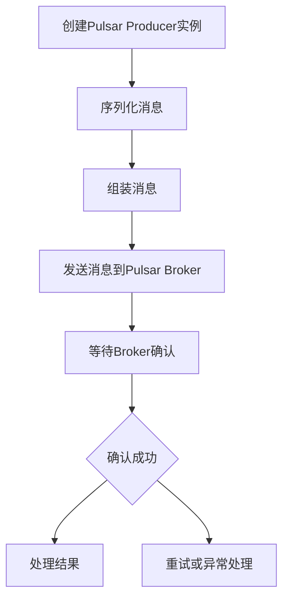
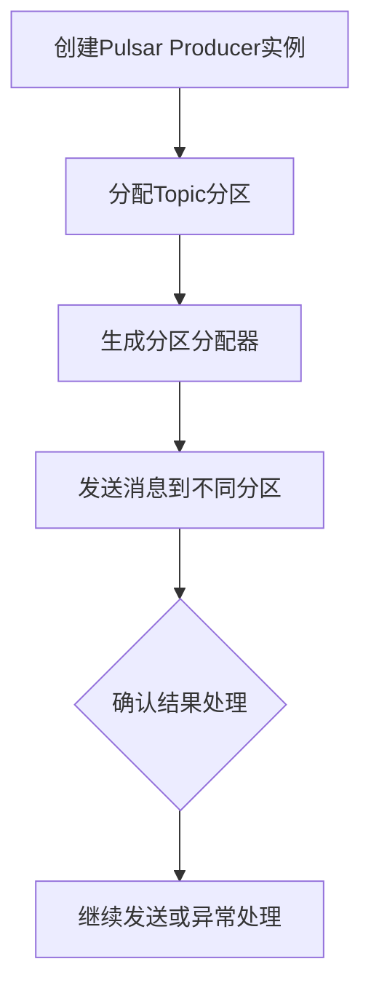

                 

# 文章标题：Pulsar Producer原理与代码实例讲解

## 关键词

- Pulsar
- Producer
- 消息队列
- 分布式处理
- 消息序列化
- 消息确认机制
- Java开发

## 摘要

本文将深入讲解Pulsar Producer的原理，包括其架构、消息序列化、消息发送策略和分布式处理机制。此外，文章将结合实际代码示例，展示如何使用Java搭建Pulsar Producer环境，发送消息，并处理可能出现的异常情况。最后，本文还将探讨Pulsar Producer的最佳实践、常见问题及未来展望。

# 目录大纲：Pulsar Producer原理与代码实例讲解

## 第1章：Pulsar概述

### 1.1 Pulsar的基本概念

### 1.2 Pulsar架构

### 1.3 Pulsar的核心组件

## 第2章：Pulsar Producer核心原理

### 2.1 Pulsar Producer架构

### 2.2 Pulsar Producer的消息序列化

### 2.3 Pulsar Producer的消息发送策略

### 2.4 Pulsar Producer的分布式处理

## 第3章：Pulsar Producer代码实例

### 3.1 开发环境搭建

### 3.2 Producer代码示例

### 3.3 Producer实战案例

## 第4章：Pulsar Producer最佳实践

### 4.1 性能优化

### 4.2 消息可靠性保障

### 4.3 安全性与监控

## 第5章：Pulsar Producer与实际应用

### 5.1 Pulsar在数据处理场景中的应用

### 5.2 Pulsar在流计算场景中的应用

### 5.3 Pulsar在金融领域的应用

## 第6章：Pulsar Producer常见问题与解决方案

### 6.1 Pulsar Producer故障排除

### 6.2 性能问题定位与优化

### 6.3 安全问题防范

## 第7章：Pulsar未来展望

### 7.1 Pulsar发展历程

### 7.2 Pulsar生态系统

### 7.3 Pulsar在新兴领域的应用

## 附录

### A.1 Pulsar相关资源

### A.2 Pulsar常用配置与参数

## Mermaid流程图

### 1. Pulsar Producer消息发送流程

### 2. Pulsar Producer分布式处理流程

---

接下来，我们将逐步进入Pulsar的世界，详细解析Pulsar Producer的核心原理，并提供实用的代码实例。

---

## 第1章：Pulsar概述

### 1.1 Pulsar的基本概念

Pulsar是一个分布式消息系统，由Apache Software Foundation维护，它旨在提供高性能、可靠和可扩展的发布-订阅模型。Pulsar的主要特点包括：

1. **发布-订阅模型**：Pulsar采用发布-订阅模型，消息生产者和消费者之间无需建立直接的连接，这为系统的高可用性和扩展性提供了支持。

2. **高性能**：Pulsar通过采用内存映射技术，使得消息的读写速度非常快，同时使用BookKeeper作为底层存储，保证了高吞吐量和低延迟。

3. **高可靠性**：Pulsar提供了强一致性保障，通过多个副本和多版本消息，确保在系统中任何一个组件失败时，数据不会丢失。

4. **可扩展性**：Pulsar支持水平扩展，可以通过增加Broker和BookKeeper节点来提升系统性能。

5. **灵活的分区机制**：Pulsar允许对消息进行分区，使得系统可以高效地处理大规模的数据流。

### 1.2 Pulsar与Kafka的区别

Pulsar和Kafka都是分布式消息系统，但它们在某些方面存在差异：

1. **架构设计**：Kafka采用拉模型，而Pulsar采用推模型。这意味着Kafka消费者需要主动拉取消息，而Pulsar生产者会将消息推送给消费者。

2. **消息持久化**：Kafka将消息持久化到磁盘，而Pulsar使用内存映射技术，使得消息的读写速度更快。

3. **分区机制**：Pulsar具有更灵活的分区机制，允许生产者和消费者在应用程序级别上进行分区，而Kafka的分区通常在服务器级别上进行。

4. **消息传递模型**：Pulsar支持多消费者模型，而Kafka通常支持单消费者模型。

### 1.3 Pulsar架构

Pulsar的核心架构包括以下几个关键组件：

1. **Pulsar Name Service（命名服务）**：负责维护所有Pulsar资源的元数据，如Topic、分区和Broker的映射关系。

2. **Pulsar Broker**：作为消息路由器，接收生产者的消息并将消息推送给相应的消费者。

3. **Pulsar Producer**：消息生产者，负责将消息发送到Pulsar系统。

4. **Pulsar Consumer**：消息消费者，从Pulsar系统中拉取或接收消息。

5. **BookKeeper**：一个分布式日志系统，用于持久化Pulsar的消息数据。

Pulsar的架构设计确保了高可用性、高性能和可扩展性，使其成为分布式系统中不可或缺的组件。

### 1.4 Pulsar的核心组件

#### Pulsar Name Service

Pulsar Name Service是Pulsar系统中的目录服务，负责存储和跟踪所有Pulsar资源的元数据。这些元数据包括Topic、分区、Broker地址等。Name Service通过一系列静态配置文件或通过ZooKeeper获取元数据，并使用一个分布式缓存机制来提高查询效率。

#### Pulsar Broker

Pulsar Broker是Pulsar系统中的核心组件，负责接收生产者的消息并将消息推送给消费者。每个Broker都维护一个或多个Topic的分区状态，并在消息发送过程中负责路由和负载均衡。

#### Pulsar Producer

Pulsar Producer是消息生产者的实现，它将消息发送到Pulsar系统。生产者可以通过多种方式连接到Broker，包括单连接和复用连接。Pulsar Producer还支持多种消息发送策略和确认机制，确保消息能够可靠地传递到系统。

#### Pulsar Consumer

Pulsar Consumer是消息消费者的实现，它从Pulsar系统中拉取或接收消息。消费者可以根据需要订阅一个或多个Topic，并从相应的分区中消费消息。Pulsar Consumer支持异步消息消费，同时也支持事务消息，确保消息的准确传递。

#### BookKeeper

BookKeeper是Pulsar的底层存储系统，它负责持久化Pulsar的消息数据。BookKeeper通过一系列副本机制来保证数据的高可用性和持久性。每个消息都被分散存储在多个BookKeeper节点上，以确保即使在节点故障的情况下，数据也不会丢失。

通过以上对Pulsar的基本概念、架构和核心组件的介绍，我们已经对Pulsar有了一个初步的了解。在接下来的章节中，我们将深入探讨Pulsar Producer的核心原理，并通过代码实例来展示如何使用Pulsar Producer进行消息发送。

---

## 第2章：Pulsar Producer核心原理

### 2.1 Pulsar Producer架构

Pulsar Producer是Pulsar系统中负责发送消息的核心组件。一个典型的Pulsar Producer架构包括以下几个部分：

1. **客户端库**：客户端库是连接到Pulsar系统的基础，它负责处理与Pulsar Name Service和Broker的通信。客户端库提供了简单易用的接口，使得开发者可以轻松地将应用与Pulsar集成。

2. **消息序列化器**：消息序列化器是用于将消息从对象转换为字节流的关键组件。Pulsar支持多种序列化框架，如Kryo、Avro等，开发者可以根据需要选择合适的序列化框架。

3. **发送器**：发送器是负责将序列化后的消息发送到Pulsar Broker的核心组件。发送器会根据消息发送策略，将消息推送到相应的Topic分区。

4. **确认机制**：确认机制用于确保消息能够被成功发送到Pulsar系统。Pulsar提供了多种确认机制，如自动确认、同步确认和异步确认，开发者可以根据实际需求进行选择。

### 2.2 Pulsar Producer的消息发送流程

Pulsar Producer的消息发送流程可以分为以下几个步骤：

1. **创建Producer实例**：首先，开发者需要使用Pulsar Name Service获取Broker地址，并创建一个Pulsar Producer实例。

2. **序列化消息**：在发送消息之前，需要将消息序列化为字节流。开发者可以选择使用Pulsar支持的序列化框架，如Kryo或Avro。

3. **组装消息**：将序列化后的消息组装成一个Pulsar消息对象，包括消息的内容、键、分区号等。

4. **发送消息**：调用Producer的发送方法，将消息发送到Pulsar Broker。发送方法会根据消息发送策略，将消息推送到相应的Topic分区。

5. **等待确认**：根据确认机制，Pulsar Producer会等待Broker的确认。确认机制可以是自动确认、同步确认或异步确认。

6. **处理确认结果**：如果确认成功，Pulsar Producer会继续发送下一批消息。如果确认失败，Pulsar Producer会根据重试策略进行重试或触发异常处理。

以下是一个简单的伪代码示例，展示了Pulsar Producer的消息发送流程：

```python
# 创建Pulsar Producer实例
producer = PulsarProducer.create("pulsar://localhost:6650", "my-producer")

# 序列化消息
message = serialize_message(data)

# 发送消息
producer.send("my-topic", message)

# 等待确认
ack = producer.getAck()

# 处理确认结果
if ack.isAcknowledged():
    print("消息发送成功")
else:
    print("消息发送失败，重试或异常处理")
```

### 2.3 Pulsar Producer的消息序列化

消息序列化是将消息从对象转换为字节流的过程，以便于存储和传输。Pulsar支持多种序列化框架，如Kryo、Avro等。开发者可以根据需要选择合适的序列化框架。

#### 序列化与反序列化

序列化是将消息对象转换为字节流的过程，反序列化则是将字节流恢复为消息对象的过程。序列化和反序列化必须成对出现，以保证消息的完整性和一致性。

以下是一个使用Kryo序列化框架的示例：

```java
// 创建Kryo序列化器
Kryo kryo = new Kryo();

// 序列化消息
byte[] serializedMessage = kryo.toBytes(message);

// 反序列化消息
Message deserializedMessage = kryo.toMessage(serializedMessage);
```

#### Pulsar支持的序列化框架

Pulsar内置了多种序列化框架，包括Kryo、Avro和JSON等。开发者可以在Pulsar配置文件中指定使用的序列化框架：

```properties
# 使用Kryo序列化框架
serializer.class=org.apache.pulsar.client.impl.SerializerKryo
```

### 2.4 Pulsar Producer的消息发送策略

Pulsar Producer支持多种消息发送策略，包括异步发送、同步发送和手动确认发送。开发者可以根据实际需求选择合适的发送策略。

#### 异步发送

异步发送是最简单的发送策略，Pulsar Producer会立即返回，而无需等待Broker的确认。这种方法适用于对消息可靠性要求不高的场景。

```java
producer.sendAsync("my-topic", message, new Callback() {
    @Override
    public void onSuccess(MessageId id) {
        System.out.println("消息发送成功：" + id);
    }

    @Override
    public void onFailure(Exception e) {
        System.out.println("消息发送失败：" + e.getMessage());
    }
});
```

#### 同步发送

同步发送会在发送消息后等待Broker的确认，只有当确认成功时，发送操作才完成。这种方法适用于对消息可靠性要求较高的场景。

```java
MessageId id = producer.send("my-topic", message);
if (id != null) {
    System.out.println("消息发送成功：" + id);
} else {
    System.out.println("消息发送失败");
}
```

#### 手动确认发送

手动确认发送需要开发者手动调用确认方法，以确认消息是否成功发送。这种方法适用于对消息确认有特殊要求的场景。

```java
producer.send("my-topic", message);
boolean acknowledged = producer.acknowledge(message.getId());
if (acknowledged) {
    System.out.println("消息发送成功");
} else {
    System.out.println("消息发送失败");
}
```

通过以上对Pulsar Producer架构、消息发送流程、消息序列化和发送策略的讲解，我们已经对Pulsar Producer有了更深入的了解。在接下来的章节中，我们将通过实际代码实例，展示如何使用Pulsar Producer进行消息发送。

---

### 2.5 Pulsar Producer的分布式处理

Pulsar Producer的分布式处理机制是其设计中的关键部分，特别是在处理大规模数据流和高并发场景下。Pulsar Producer支持多个生产者并发发送消息，并提供了动态扩缩容的能力，确保系统的高性能和高可用性。

#### Producer Group的概念

在Pulsar中，多个生产者可以通过创建Producer Group来协同工作。每个Producer Group中的生产者都会独立处理消息，但它们会共享相同的Topic和分区。这种机制允许多个生产者并发地向同一个Topic发送消息，从而提高系统的吞吐量。

#### 多生产者并发发送消息

为了实现多生产者并发发送消息，Pulsar使用了一个叫做“分区分配器”的机制。分区分配器根据生产者ID和Topic分区数，将消息分配到不同的分区。这样可以确保每个生产者都有任务可执行，从而充分利用系统的资源。

以下是一个简单的伪代码示例，展示了如何使用Producer Group实现多生产者并发发送消息：

```python
# 创建多个生产者实例
producer1 = PulsarProducer.create("pulsar://localhost:6650", "my-producer-group", "producer-1")
producer2 = PulsarProducer.create("pulsar://localhost:6650", "my-producer-group", "producer-2")

# 发送消息
producer1.send("my-topic", message1)
producer2.send("my-topic", message2)

# 关闭生产者实例
producer1.close()
producer2.close()
```

#### 动态扩缩容

Pulsar Producer还支持动态扩缩容，这意味着可以根据系统负载和需求，动态地增加或减少生产者的数量。这种机制有助于确保系统在高负载场景下仍然能够保持高性能，同时避免了资源浪费。

动态扩缩容的实现依赖于Pulsar Name Service，当有新的生产者实例加入时，Name Service会通知现有的生产者实例，并重新分配分区。同样，当有生产者实例离开时，Name Service会重新分配分区，确保系统的稳定性。

以下是一个简单的伪代码示例，展示了如何实现动态扩缩容：

```python
# 创建生产者实例
producer = PulsarProducer.create("pulsar://localhost:6650", "my-producer-group")

# 发送消息
producer.send("my-topic", message)

# 根据负载动态增加生产者实例
new_producer = PulsarProducer.create("pulsar://localhost:6650", "my-producer-group")

# 发送消息
new_producer.send("my-topic", message)

# 根据负载动态减少生产者实例
producer.close()
new_producer.close()
```

通过以上对Pulsar Producer分布式处理机制的讲解，我们可以看到，Pulsar Producer在设计上充分考虑了分布式处理的需求，提供了强大的多生产者并发发送消息和动态扩缩容能力。这使得Pulsar Producer成为处理大规模数据流和实现高可用性的理想选择。

在接下来的章节中，我们将通过实际代码实例，展示如何使用Pulsar Producer进行分布式消息发送，并讨论如何在实际应用中优化Pulsar Producer的性能和可靠性。

---

## 第3章：Pulsar Producer代码实例

在了解了Pulsar Producer的核心原理和架构后，我们将通过实际代码实例来展示如何搭建Pulsar Producer开发环境，编写Producer代码，并处理可能出现的异常情况。

### 3.1 开发环境搭建

要使用Pulsar Producer，我们需要先搭建开发环境。以下是搭建Pulsar Producer开发环境的步骤：

1. **安装Java环境**：确保你的系统中已经安装了Java环境。Pulsar Producer需要Java 8或更高版本。

2. **安装Maven**：Pulsar Producer使用Maven进行依赖管理。确保你已经安装了Maven，版本为3.5.0或更高。

3. **添加Maven依赖**：在项目的pom.xml文件中添加Pulsar Java客户端依赖：

   ```xml
   <dependencies>
       <dependency>
           <groupId>org.apache.pulsar</groupId>
           <artifactId>pulsar-client</artifactId>
           <version>2.8.1</version>
       </dependency>
   </dependencies>
   ```

   这里我们使用了Pulsar的2.8.1版本，你可以根据实际需求选择合适的版本。

4. **启动Pulsar服务**：下载并解压Pulsar的官方二进制包，然后启动Pulsar服务。以下是启动Pulsar服务的命令：

   ```bash
   ./bin/pulsar start
   ```

   启动成功后，Pulsar的默认端口是6650，可以通过浏览器访问Pulsar的Web UI进行监控和管理。

### 3.2 Producer代码示例

以下是使用Java编写的Pulsar Producer代码示例，展示了如何创建Pulsar Producer实例、发送消息以及处理确认结果。

```java
import org.apache.pulsar.client.api.*;

public class PulsarProducerExample {
    public static void main(String[] args) {
        // 创建Pulsar Producer实例
        PulsarClient client = PulsarClient.builder()
                .serviceUrl("pulsar://localhost:6650")
                .build();

        Producer<String> producer = client.newProducer()
                .topic("my-topic")
                .sendTimeout(5, TimeUnit.SECONDS)
                .create();

        // 发送消息
        for (int i = 0; i < 10; i++) {
            String message = "Message " + i;
            producer.send(message);
            System.out.println("Sent message: " + message);
        }

        // 关闭Producer和Client
        producer.close();
        client.close();
    }
}
```

在这个示例中，我们首先创建了一个PulsarClient实例，并使用它创建了一个Producer实例。然后，我们使用循环发送了10条消息，并打印出每条消息的内容。发送消息后，Producer会等待Broker的确认。如果确认成功，消息将被成功发送到Pulsar系统。

### 3.3 消息发送策略配置

Pulsar Producer支持多种消息发送策略，包括异步发送、同步发送和手动确认发送。以下是如何配置这些发送策略的示例：

#### 异步发送

异步发送是默认的发送策略，可以通过调用`sendAsync`方法实现。以下是一个异步发送的示例：

```java
producer.sendAsync(message, new Callback() {
    @Override
    public void onSuccess(MessageId id) {
        System.out.println("消息发送成功：" + id);
    }

    @Override
    public void onFailure(Exception e) {
        System.out.println("消息发送失败：" + e.getMessage());
    }
});
```

#### 同步发送

同步发送会等待Broker的确认，只有在确认成功后，发送操作才完成。以下是一个同步发送的示例：

```java
MessageId id = producer.send(message);
if (id != null) {
    System.out.println("消息发送成功：" + id);
} else {
    System.out.println("消息发送失败");
}
```

#### 手动确认发送

手动确认发送需要调用`acknowledge`方法来确认消息是否成功发送。以下是一个手动确认发送的示例：

```java
producer.send(message);
boolean acknowledged = producer.acknowledge(message.getId());
if (acknowledged) {
    System.out.println("消息发送成功");
} else {
    System.out.println("消息发送失败");
}
```

### 3.4 处理消息发送异常

在实际应用中，消息发送可能会遇到各种异常情况，如网络连接中断、Broker不可达等。以下是如何处理这些异常的示例：

```java
try {
    // 发送消息
    MessageId id = producer.send(message);
    if (id != null) {
        System.out.println("消息发送成功：" + id);
    } else {
        System.out.println("消息发送失败");
    }
} catch (PulsarClientException e) {
    // 处理Pulsar客户端异常
    e.printStackTrace();
} catch (IOException e) {
    // 处理I/O异常
    e.printStackTrace();
}
```

在这个示例中，我们使用了try-catch语句来捕获和处理可能发生的异常。如果发送消息时发生异常，程序会输出异常信息并退出。

通过以上对Pulsar Producer开发环境搭建、代码示例、消息发送策略配置和异常处理的方法的讲解，我们已经具备了使用Pulsar Producer进行消息发送的基本技能。在接下来的章节中，我们将进一步探讨Pulsar Producer的最佳实践，以优化消息发送的性能和可靠性。

---

### 3.5 Producer实战案例

在了解了Pulsar Producer的基本原理和代码示例后，我们将通过一个实际案例来展示如何使用Pulsar Producer实现分布式消息发送，并对消息发送性能进行调优，同时讨论如何处理消息发送过程中可能出现的异常情况。

#### 实战案例：电商订单处理系统

假设我们正在开发一个电商订单处理系统，系统需要处理大量订单消息，并将其存储到数据库中。为了确保系统的性能和可靠性，我们决定使用Pulsar作为消息队列，实现订单消息的异步处理。

#### 实现步骤

1. **搭建Pulsar环境**：首先，我们需要搭建Pulsar环境，包括安装Pulsar服务、配置Broker和BookKeeper。确保Pulsar服务正常运行，并可以通过端口6650进行访问。

2. **创建订单消息生产者**：在订单处理模块中，我们需要创建一个Pulsar Producer实例，用于发送订单消息。以下是一个简单的Producer类，用于发送订单消息：

   ```java
   import org.apache.pulsar.client.api.*;
   
   public class OrderProducer {
       private PulsarClient client;
       private Producer<String> producer;
   
       public OrderProducer(String serviceUrl, String producerName, String topic) throws PulsarClientException {
           client = PulsarClient.builder()
                   .serviceUrl(serviceUrl)
                   .build();
           producer = client.newProducer()
                   .topic(topic)
                   .sendTimeout(5, TimeUnit.SECONDS)
                   .create();
       }
   
       public void sendOrder(String orderId, String orderContent) throws PulsarClientException {
           String message = orderId + ":" + orderContent;
           producer.send(message);
           System.out.println("Order sent: " + message);
       }
   
       public void close() {
           producer.close();
           client.close();
       }
   }
   ```

3. **创建订单消息消费者**：在订单处理模块中，我们需要创建一个Pulsar Consumer实例，用于接收和处理订单消息。以下是一个简单的Consumer类，用于处理订单消息：

   ```java
   import org.apache.pulsar.client.api.*;
   
   public class OrderConsumer {
       private PulsarClient client;
       private Consumer<String> consumer;
   
       public OrderConsumer(String serviceUrl, String consumerName, String topic) throws PulsarClientException {
           client = PulsarClient.builder()
                   .serviceUrl(serviceUrl)
                   .build();
           consumer = client.newConsumer()
                   .topic(topic)
                   .subscriptionName(consumerName)
                   .subscriptionType(SubscriptionType.Exclusive)
                   .subscriptionInitialPosition(SubscriptionInitialPosition.Earliest)
                   .subscribe();
       }
   
       public void processOrder() {
           while (true) {
               Message<String> msg = consumer.receive();
               String message = msg.getValue();
               System.out.println("Received order: " + message);
               // 处理订单逻辑
               consumer.acknowledge(msg);
           }
       }
   
       public void close() {
           consumer.close();
           client.close();
       }
   }
   ```

4. **配置消息序列化**：在发送和接收消息时，我们需要将订单对象序列化为字符串，并从字符串反序列化为订单对象。以下是一个简单的序列化类：

   ```java
   import com.fasterxml.jackson.databind.ObjectMapper;
   
   public class OrderSerializer {
       private static final ObjectMapper objectMapper = new ObjectMapper();
   
       public static String serialize(Order order) throws Exception {
           return objectMapper.writeValueAsString(order);
       }
   
       public static Order deserialize(String serializedOrder) throws Exception {
           return objectMapper.readValue(serializedOrder, Order.class);
       }
   }
   ```

5. **集成到订单处理系统**：将Pulsar Producer和Consumer集成到订单处理系统中，实现订单消息的异步处理。以下是订单处理系统中的示例代码：

   ```java
   public class OrderProcessingSystem {
       public static void main(String[] args) {
           try {
               OrderProducer producer = new OrderProducer("pulsar://localhost:6650", "order-producer", "orders");
               OrderConsumer consumer = new OrderConsumer("pulsar://localhost:6650", "order-consumer", "orders");
   
               // 发送订单消息
               for (int i = 0; i < 10; i++) {
                   Order order = new Order("order" + i, "product" + i, 100.0);
                   producer.sendOrder(order.getId(), OrderSerializer.serialize(order));
               }
   
               // 处理订单消息
               consumer.processOrder();
   
               producer.close();
               consumer.close();
           } catch (Exception e) {
               e.printStackTrace();
           }
       }
   }
   ```

#### 性能调优

为了优化订单处理系统的消息发送性能，我们可以从以下几个方面进行调优：

1. **增加生产者实例**：通过增加生产者实例，可以实现并行发送消息，从而提高系统的吞吐量。

2. **调整发送策略**：可以使用同步发送策略，确保消息被成功发送到Pulsar系统。同步发送会等待Broker的确认，从而确保消息的可靠性。

3. **优化序列化性能**：序列化和反序列化是消息发送过程中的重要环节。通过使用高效的序列化框架，如Kryo或Avro，可以减少序列化和反序列化时间。

4. **使用批处理**：将多个消息组合成一个批处理发送，可以减少网络开销和系统开销，从而提高整体性能。

#### 异常处理

在实际应用中，消息发送可能会遇到各种异常情况，如网络连接中断、Broker不可达等。以下是如何处理这些异常的示例：

```java
try {
    // 发送订单消息
    for (int i = 0; i < 10; i++) {
        Order order = new Order("order" + i, "product" + i, 100.0);
        producer.sendOrder(order.getId(), OrderSerializer.serialize(order));
    }
} catch (PulsarClientException e) {
    // 处理Pulsar客户端异常
    e.printStackTrace();
} catch (IOException e) {
    // 处理序列化异常
    e.printStackTrace();
}
```

通过以上实战案例的讲解，我们可以看到如何使用Pulsar Producer实现分布式消息发送，并对消息发送性能进行调优。在实际应用中，我们需要根据具体需求和场景，灵活运用Pulsar Producer的特性，确保系统的性能和可靠性。

在接下来的章节中，我们将进一步探讨Pulsar Producer的最佳实践，以及在实际应用中如何保障消息的可靠性和安全性。

---

### 4.1 性能优化

在Pulsar Producer的实际应用中，性能优化是一个重要的环节。以下是一些常用的性能优化方法：

#### 优化消息序列化

消息序列化是影响Pulsar Producer性能的一个重要因素。通过选择高效的序列化框架，可以显著提高序列化和反序列化的速度。例如，Kryo和Avro都是常用的序列化框架，它们在性能上有很好的表现。

**Kryo序列化框架**：Kryo是一个高性能的Java序列化框架，它具有较小的内存占用和较快的序列化速度。以下是如何在Pulsar Producer中使用Kryo序列化框架的示例：

```java
KryoSerializer<String> serializer = new KryoSerializer<>();
producer.setSerializer(serializer);
```

**Avro序列化框架**：Avro是一个高效的可扩展序列化框架，它提供了丰富的功能和强大的类型检查机制。以下是如何在Pulsar Producer中使用Avro序列化框架的示例：

```java
AvroSerializer<String> serializer = new AvroSerializer<>(String.class);
producer.setSerializer(serializer);
```

#### 调整发送策略

Pulsar Producer提供了多种发送策略，包括异步发送、同步发送和手动确认发送。根据应用场景，选择合适的发送策略可以显著提高性能。

**异步发送**：异步发送是最简单的发送策略，Pulsar Producer会立即返回，无需等待Broker的确认。这种方法适用于对消息可靠性要求不高的场景。

```java
producer.sendAsync(message, new Callback() {
    @Override
    public void onSuccess(MessageId id) {
        System.out.println("消息发送成功：" + id);
    }

    @Override
    public void onFailure(Exception e) {
        System.out.println("消息发送失败：" + e.getMessage());
    }
});
```

**同步发送**：同步发送会在发送消息后等待Broker的确认，只有当确认成功时，发送操作才完成。这种方法适用于对消息可靠性要求较高的场景。

```java
MessageId id = producer.send(message);
if (id != null) {
    System.out.println("消息发送成功：" + id);
} else {
    System.out.println("消息发送失败");
}
```

**手动确认发送**：手动确认发送需要调用`acknowledge`方法来确认消息是否成功发送。这种方法适用于对消息确认有特殊要求的场景。

```java
producer.send(message);
boolean acknowledged = producer.acknowledge(message.getId());
if (acknowledged) {
    System.out.println("消息发送成功");
} else {
    System.out.println("消息发送失败");
}
```

#### 预热Producer

在应用程序启动时，预热Pulsar Producer可以减少启动延迟，提高系统性能。预热的过程包括创建Producer实例、发送一些测试消息并等待确认。

```java
Producer<String> producer = client.newProducer()
        .topic("my-topic")
        .sendTimeout(5, TimeUnit.SECONDS)
        .create();

for (int i = 0; i < 10; i++) {
    String message = "Test message " + i;
    producer.send(message);
    producer.acknowledge(message.getId());
}
producer.close();
```

通过以上方法，我们可以有效地优化Pulsar Producer的性能，确保系统在处理大量消息时能够保持高性能和高可靠性。

---

### 4.2 消息可靠性保障

在分布式消息系统中，消息的可靠性至关重要。Pulsar Producer提供了多种机制来保障消息的可靠性，包括事务消息、消息重试策略和消息持久化。

#### 事务消息机制

事务消息是Pulsar提供的一种保障消息可靠性的高级特性。事务消息允许生产者将一组消息作为一个事务进行发送，要么全部成功发送，要么全部回滚。这种方式可以确保在系统故障或异常情况下，消息不会被丢失。

**启用事务消息**：

```java
Producer<String> producer = client.newProducer()
        .topic("my-topic")
        .enableTransaction()
        .sendTimeout(5, TimeUnit.SECONDS)
        .create();
```

**发送事务消息**：

```java
Transaction transaction = producer.newTransaction();
MessageId msgId1 = producer.send("Message 1");
MessageId msgId2 = producer.send("Message 2");
transaction.commit(msgId1, msgId2);
```

**回滚事务消息**：

```java
Transaction transaction = producer.newTransaction();
MessageId msgId1 = producer.send("Message 1");
MessageId msgId2 = producer.send("Message 2");
transaction.rollback(msgId1, msgId2);
```

#### 消息重试策略

消息重试策略是保障消息可靠性的另一种重要机制。当消息发送失败时，Pulsar Producer可以自动重试发送，直到消息成功发送或达到最大重试次数。

**设置重试策略**：

```java
RetryPolicyFactory factory = RetryPolicyFactory.builder()
        .initialInterval(100, TimeUnit.MILLISECONDS)
        .maxInterval(5000, TimeUnit.MILLISECONDS)
        .maxRetries(5)
        .build();
Producer<String> producer = client.newProducer()
        .topic("my-topic")
        .sendTimeout(5, TimeUnit.SECONDS)
        .retryPolicy(factory.newRetryPolicy())
        .create();
```

#### 消息持久化

消息持久化是将消息存储到磁盘或持久化存储系统中，以确保在系统故障时消息不会丢失。Pulsar通过BookKeeper实现了消息持久化。

**配置消息持久化**：

```java
Producer<String> producer = client.newProducer()
        .topic("my-topic")
        .enableMessagePersistence()
        .sendTimeout(5, TimeUnit.SECONDS)
        .create();
```

通过以上机制，Pulsar Producer能够保障消息的可靠性，确保在分布式系统中消息能够准确无误地传递。

---

### 4.3 安全性与监控

在Pulsar Producer的实际应用中，安全性和监控是保障系统稳定运行和防止潜在风险的重要环节。以下是如何从安全性和监控两个方面进行保障的详细探讨。

#### 身份认证与权限管理

身份认证和权限管理是确保Pulsar系统安全的基础。Pulsar提供了多种身份认证机制，包括用户名/密码认证、OAuth2.0认证和TLS加密等。

**用户名/密码认证**：

Pulsar通过配置文件或命令行参数设置用户名和密码，确保只有授权用户可以访问系统。以下是如何配置用户名/密码认证的示例：

```bash
# 在pulsar/bin/pulsar-daemon start command.sh config.properties
pulsar-daemon start standalone --configuration-file /path/to/config.properties
```

在`config.properties`文件中，设置以下参数：

```properties
auth.enable=true
auth.callbacks.0.type=AuthenticationCallbackHandler
auth.callbacks.0.handler=org.apache.pulsar自治系统：SimpleAuthenticationHandler
auth.callbacks.0.config.adminUsername=admin
auth.callbacks.0.config.adminPassword=admin
```

**OAuth2.0认证**：

OAuth2.0认证提供了更高级的认证方式，可以与外部认证系统（如OAuth2.0身份提供商）集成。以下是如何配置OAuth2.0认证的示例：

```bash
pulsar-daemon start standalone --configuration-file /path/to/config.properties
```

在`config.properties`文件中，设置以下参数：

```properties
auth.enable=true
auth.callbacks.0.type=AuthenticationCallbackHandler
auth.callbacks.0.handler=org.apache.pulsar自治系统：OAuthAuthenticationHandler
auth.callbacks.0.config.authorizationUrl=https://authserver.example.com/authorize
auth.callbacks.0.config.tokenUrl=https://authserver.example.com/token
auth.callbacks.0.config.clientId=client-id
auth.callbacks.0.config.clientSecret=client-secret
```

**权限管理**：

Pulsar提供了基于角色的访问控制（RBAC）机制，允许管理员根据用户角色分配权限。以下是如何配置权限管理的示例：

```bash
pulsar-admin namespaces setaccess -n public/default -r producer -a user1
pulsar-admin namespaces setaccess -n public/default -r consumer -a user1
```

这些命令将为用户`user1`授予`public/default`命名空间中所有Topic的生产和消费权限。

#### 消息监控与告警

消息监控与告警是保障系统稳定运行的重要手段。Pulsar提供了丰富的监控指标和告警机制，可以帮助管理员及时发现并处理系统问题。

**监控指标**：

Pulsar提供了多种监控指标，包括消息吞吐量、延迟、错误率等。以下是如何查看监控指标的示例：

```bash
pulsar-admin metrics get --namespace public/default --resource orders
```

**告警机制**：

Pulsar可以使用外部告警工具（如Prometheus和Alertmanager）进行告警。以下是如何配置Prometheus和Alertmanager的示例：

1. 安装Prometheus和Alertmanager。

2. 在Prometheus配置文件（`prometheus.yml`）中添加Pulsar指标源：

   ```yaml
   scrape_configs:
     - job_name: 'pulsar'
       static_configs:
       - targets: ['localhost:9090']
   ```

3. 在Alertmanager配置文件（`alertmanager.yml`）中添加告警规则和告警通道：

   ```yaml
   route:
     receiver: 'email'
     group_by: ['alertname']
     group_wait: 10s
     repeat_interval: 1h
   
   rule_files:
     - 'path/to/alert.rules'
   
   receivers:
     - name: 'email'
       email_configs:
       - to: 'admin@example.com'
   ```

4. 在告警规则文件（`alert.rules`）中定义告警规则：

   ```yaml
   groups:
     - name: 'pulsar'
       rules:
       - alert: PulsarThroughput
         expr: 'pulsar_message_throughput{topic="orders"} < 100'
         for: 5m
         labels:
           severity: 'warning'
         annotations:
           summary: 'Pulsar throughput is low'
   ```

通过以上配置，当Pulsar吞吐量低于100条/秒时，Alertmanager会将告警邮件发送给管理员。

#### 性能监控与调优

性能监控与调优是保障系统稳定运行和高效运行的关键环节。Pulsar提供了多种监控工具和调优方法，可以帮助管理员及时发现和解决性能瓶颈。

**监控工具**：

Pulsar自带了Web UI，可以通过Web UI实时监控系统的运行状态。Web UI提供了包括Broker负载、消息吞吐量、延迟等在内的多种监控指标。

**调优方法**：

1. 调整Pulsar配置参数，如`broker.num.io.threads`、`producer.num.io.threads`等，以优化系统性能。

2. 使用批处理发送消息，减少网络开销和系统开销。

3. 优化序列化框架，选择更高效的序列化方案。

通过以上安全性与监控的详细讲解，我们可以确保Pulsar Producer在分布式系统中既安全又稳定地运行。在实际应用中，我们需要根据具体需求和场景，灵活运用这些安全性和监控机制，保障系统的可靠性和高效性。

---

### 5.1 Pulsar在数据处理场景中的应用

Pulsar在数据处理场景中具有广泛的应用，尤其适用于实时数据处理和批量数据处理。以下是其应用的具体实例：

#### 实时数据处理

在实时数据处理中，Pulsar可以作为流处理框架（如Apache Flink、Apache Kafka Streams）的数据源，实现实时数据分析和处理。例如，在电商系统中，Pulsar可以接收实时订单消息，并将消息传递给流处理框架进行实时分析，如实时统计订单量、销售额等。

**实例**：假设我们要使用Apache Flink进行实时订单处理，以下是基本的步骤：

1. **搭建Pulsar环境**：确保Pulsar服务正常运行，并创建一个名为`realtime-orders`的Topic。

2. **配置Flink**：在Flink配置文件中添加Pulsar连接器依赖，并配置Pulsar服务地址和Topic名称。

3. **编写Flink处理程序**：使用Flink提供的Pulsar连接器，从Pulsar中读取订单消息，并进行实时处理。

   ```java
   StreamExecutionEnvironment env = StreamExecutionEnvironment.getExecutionEnvironment();
   FlinkPulsarSource<Order> pulsarSource = new FlinkPulsarSource<>(builderFor("pulsar://localhost:6650")
               .serviceUrl("pulsar://localhost:6650")
               .topic("realtime-orders")
               .subscriptionName("order-subscription")
               .subscriptionType(SubscriptionType.Exclusive)
               .build(), Order.class);
   DataStream<Order> orderStream = env.addSource(pulsarSource);
   // 进行实时处理，如统计订单量、销售额等
   DataStream<Result> resultStream = orderStream.map(new RealtimeOrderProcessor());
   resultStream.print();
   ```

4. **启动Flink作业**：运行Flink作业，开始从Pulsar中读取订单消息并进行实时处理。

#### 批量数据处理

在批量数据处理中，Pulsar可以作为数据存储和传输的中间件，将批量数据从数据源传输到数据处理框架（如Apache Spark、Apache Hive）中进行处理。例如，在数据仓库系统中，Pulsar可以用于存储批量ETL任务生成的中间数据，然后将数据传输到Spark或Hive中进行处理。

**实例**：假设我们要使用Apache Spark进行批量数据处理，以下是基本的步骤：

1. **搭建Pulsar环境**：确保Pulsar服务正常运行，并创建一个名为`batch-orders`的Topic。

2. **配置Spark**：在Spark配置文件中添加Pulsar连接器依赖，并配置Pulsar服务地址和Topic名称。

3. **编写Spark处理程序**：使用Spark提供的Pulsar连接器，从Pulsar中读取订单消息，并进行批量处理。

   ```scala
   val spark = SparkSession.builder()
     .appName("BatchOrderProcessing")
     .getOrCreate()
   
   val pulsarReader = new FlinkPulsarReader()
     .serviceUrl("pulsar://localhost:6650")
     .topic("batch-orders")
     .subscriptionName("order-subscription")
     .subscriptionType(SubscriptionType.Exclusive)
     .build
   
   val orderDf = spark.readStream()
     .format("flink-pulsar")
     .option("serviceUrl", "pulsar://localhost:6650")
     .option("topic", "batch-orders")
     .option("subscriptionName", "order-subscription")
     .option("subscriptionType", "Exclusive")
     .load
   
   // 进行批量处理，如数据清洗、聚合等
   val processedDf = orderDf.select("orderId", "productName", "quantity", "totalPrice")
     .groupBy("productName")
     .agg(sum("quantity").as("totalQuantity"), avg("totalPrice").as("avgPrice"))
   
   processedDf.writeStream().format("csv").option("path", "hdfs://path/to/output").start()
   ```

4. **启动Spark作业**：运行Spark作业，开始从Pulsar中读取批量订单消息并进行处理。

通过以上实例，我们可以看到Pulsar在数据处理场景中的强大能力，无论是实时数据处理还是批量数据处理，Pulsar都能提供高效可靠的消息传输和存储解决方案。

---

### 5.2 Pulsar在流计算场景中的应用

Pulsar在流计算场景中的应用非常广泛，尤其适用于高吞吐量的实时数据流处理。以下是其应用的具体实例：

#### 流计算框架集成

Pulsar支持多种流计算框架，包括Apache Kafka Streams、Apache Flink、Apache Beam等。这些框架可以通过Pulsar连接器与Pulsar集成，实现高效的数据流处理。

**实例**：假设我们要使用Apache Flink进行实时流计算，以下是基本的步骤：

1. **搭建Pulsar环境**：确保Pulsar服务正常运行，并创建一个名为`realtime-streams`的Topic。

2. **配置Flink**：在Flink配置文件中添加Pulsar连接器依赖，并配置Pulsar服务地址和Topic名称。

3. **编写Flink处理程序**：使用Flink提供的Pulsar连接器，从Pulsar中读取实时数据流，并进行流处理。

   ```java
   StreamExecutionEnvironment env = StreamExecutionEnvironment.getExecutionEnvironment();
   FlinkPulsarSource<String> pulsarSource = new FlinkPulsarSource<>(builderFor("pulsar://localhost:6650")
               .serviceUrl("pulsar://localhost:6650")
               .topic("realtime-streams")
               .subscriptionName("stream-subscription")
               .subscriptionType(SubscriptionType.Exclusive)
               .build(), String.class);
   DataStream<String> stream = env.addSource(pulsarSource);
   // 进行流处理，如过滤、聚合等
   DataStream<Result> resultStream = stream.map(new RealtimeStreamProcessor());
   resultStream.print();
   ```

4. **启动Flink作业**：运行Flink作业，开始从Pulsar中读取实时数据流并进行处理。

#### 实时数据流转

Pulsar提供了强大的实时数据流转能力，可以在不同的数据源、数据存储和数据处理框架之间传递数据。例如，在一个复杂的实时数据处理系统中，Pulsar可以作为数据传输的中间件，将来自不同数据源的数据流传输到数据处理框架中进行处理。

**实例**：假设我们要实现一个实时数据处理系统，以下是基本的步骤：

1. **搭建Pulsar环境**：确保Pulsar服务正常运行，并创建多个Topic，如`source-topic1`、`source-topic2`和`result-topic`。

2. **配置数据源**：使用Pulsar Producer向Pulsar发送数据，例如，从数据库、消息队列或其他数据源中读取数据，并将数据发送到Pulsar。

   ```java
   PulsarProducer<String> producer1 = PulsarProducer.create("pulsar://localhost:6650", "producer1");
   producer1.send("source-topic1", "Data 1 from source 1");
   producer1.send("source-topic2", "Data 2 from source 2");
   ```

3. **配置数据处理框架**：使用流计算框架（如Apache Flink）从Pulsar中读取数据，并进行实时处理。

   ```java
   StreamExecutionEnvironment env = StreamExecutionEnvironment.getExecutionEnvironment();
   FlinkPulsarSource<String> pulsarSource = new FlinkPulsarSource<>(builderFor("pulsar://localhost:6650")
               .serviceUrl("pulsar://localhost:6650")
               .topics("source-topic1", "source-topic2")
               .subscriptionName("stream-subscription")
               .subscriptionType(SubscriptionType.Exclusive)
               .build(), String.class);
   DataStream<String> stream = env.addSource(pulsarSource);
   // 进行流处理，如过滤、聚合等
   DataStream<Result> resultStream = stream.map(new RealtimeStreamProcessor());
   resultStream.print();
   ```

4. **配置数据输出**：将处理后的数据发送回Pulsar或其他数据存储系统。

   ```java
   FlinkPulsarSink<String> pulsarSink = new FlinkPulsarSink<>(builderFor("pulsar://localhost:6650")
               .serviceUrl("pulsar://localhost:6650")
               .topic("result-topic")
               .build(), String.class);
   resultStream.addSink(pulsarSink);
   ```

通过以上实例，我们可以看到Pulsar在流计算场景中的强大能力，它不仅可以作为数据源和数据输出，还可以作为数据传输的中间件，实现高效的数据流转和处理。

---

### 5.3 Pulsar在金融领域的应用

在金融领域，Pulsar因其高性能、可靠性和可扩展性而得到了广泛应用。以下是其在该领域的具体应用实例：

#### 交易系统

在交易系统中，Pulsar被用作实时交易消息的传递机制。通过Pulsar，交易消息可以在系统中快速传递，确保交易处理的高效性和实时性。

**实例**：假设我们要使用Pulsar实现一个股票交易系统，以下是基本的步骤：

1. **搭建Pulsar环境**：确保Pulsar服务正常运行，并创建多个Topic，如`trade-topic1`、`trade-topic2`等。

2. **配置交易消息生产者**：交易系统中的交易消息生产者将交易数据发送到Pulsar。

   ```java
   PulsarProducer<String> tradeProducer = PulsarProducer.create("pulsar://localhost:6650", "trade-producer");
   tradeProducer.send("trade-topic1", "Stock A sold at $100");
   tradeProducer.send("trade-topic2", "Stock B bought at $200");
   ```

3. **配置交易消息消费者**：交易系统中的交易消息消费者从Pulsar中读取交易数据，并处理交易逻辑。

   ```java
   PulsarConsumer<String> tradeConsumer = PulsarConsumer.create("pulsar://localhost:6650", "trade-consumer");
   tradeConsumer.subscribe("trade-topic1", "trade-subscription", new TradeHandler());
   ```

   在`TradeHandler`类中，我们可以处理交易消息，如更新股票价格、计算交易量等。

#### 风控系统

在风控系统中，Pulsar用于实时监控交易行为，检测潜在的欺诈交易和异常交易。通过Pulsar，风控系统可以快速响应交易数据，实现实时风险控制。

**实例**：假设我们要使用Pulsar实现一个实时风控系统，以下是基本的步骤：

1. **搭建Pulsar环境**：确保Pulsar服务正常运行，并创建多个Topic，如`risk-topic1`、`risk-topic2`等。

2. **配置交易消息生产者**：风控系统中的交易消息生产者将交易数据发送到Pulsar。

   ```java
   PulsarProducer<String> riskProducer = PulsarProducer.create("pulsar://localhost:6650", "risk-producer");
   riskProducer.send("risk-topic1", "Stock A sold at $100");
   riskProducer.send("risk-topic2", "Stock B bought at $200");
   ```

3. **配置风险监控消费者**：风控系统中的风险监控消费者从Pulsar中读取交易数据，并使用算法检测潜在的欺诈交易和异常交易。

   ```java
   PulsarConsumer<String> riskConsumer = PulsarConsumer.create("pulsar://localhost:6650", "risk-consumer");
   riskConsumer.subscribe("risk-topic1", "risk-subscription", new RiskHandler());
   ```

   在`RiskHandler`类中，我们可以使用机器学习算法或其他风控策略来检测交易风险，如异常交易金额、交易频率等。

通过以上实例，我们可以看到Pulsar在金融领域的强大应用。它不仅能够实现高效、实时的交易消息传递，还可以用于风控系统的实时监控，为金融系统提供稳定可靠的保障。

---

### 6.1 Pulsar Producer故障排除

在Pulsar Producer的使用过程中，可能会遇到各种故障和问题。以下是一些常见的故障排除方法，以及如何定位和解决这些问题：

#### 消息发送失败

**原因**：消息发送失败可能是由于网络连接问题、Broker不可达或消息格式错误等原因导致的。

**解决方案**：

1. **检查网络连接**：确保Pulsar Broker的IP地址和端口正确，并且网络连接畅通。

2. **检查Broker状态**：使用Pulsar Web UI或命令行工具检查Broker的状态，确认Broker是否正常运行。

3. **检查消息格式**：确保消息的格式符合Pulsar的要求，如消息大小、序列化格式等。

4. **增加重试次数**：调整Pulsar Producer的重试策略，增加重试次数，以提高消息发送的成功率。

#### 消息持久化失败

**原因**：消息持久化失败可能是由于BookKeeper节点故障、磁盘空间不足或网络延迟等原因导致的。

**解决方案**：

1. **检查BookKeeper节点状态**：使用BookKeeper命令行工具检查BookKeeper节点的状态，确认节点是否正常运行。

2. **检查磁盘空间**：确保BookKeeper节点的磁盘空间足够，如果空间不足，增加磁盘容量。

3. **优化网络配置**：如果网络延迟较高，调整网络配置，如增加网络带宽、优化路由等。

4. **启用消息持久化**：确保Pulsar Producer启用了消息持久化功能，确保消息能够被持久化到BookKeeper中。

#### Producer Group冲突

**原因**：Producer Group冲突可能是由于多个生产者同时发送消息到同一个Topic分区，导致分区分配不均匀或消息顺序混乱。

**解决方案**：

1. **检查生产者数量**：确保生产者数量与Topic分区数量匹配，避免过多生产者同时发送消息到同一个分区。

2. **调整分区策略**：如果使用自定义分区策略，确保分区策略能够均匀分配消息到各个分区。

3. **使用负载均衡**：使用Pulsar的负载均衡功能，将生产者均匀分配到各个分区。

通过以上方法，我们可以有效地定位和解决Pulsar Producer使用过程中遇到的故障和问题，确保系统的稳定运行。

---

### 6.2 性能问题定位与优化

在Pulsar Producer的实际应用中，性能问题可能会影响系统的整体性能。以下是如何定位和优化Pulsar Producer性能的方法：

#### 内存泄漏

**原因**：内存泄漏可能是由于对象未被正确释放，导致内存占用逐渐增加，最终导致系统性能下降。

**解决方案**：

1. **检查对象生命周期**：确保所有使用完毕的对象能够被正确释放，避免内存泄漏。

2. **使用内存监控工具**：使用内存监控工具（如VisualVM、GCDump等）检测内存泄漏，定位泄漏原因。

3. **优化代码逻辑**：优化代码逻辑，减少不必要的对象创建和内存占用。

#### 网络问题

**原因**：网络问题可能是由于网络延迟、带宽不足或网络拥塞等原因导致的。

**解决方案**：

1. **检查网络连接**：确保Pulsar Broker和BookKeeper节点的网络连接畅通，没有丢包或延迟过高。

2. **优化网络配置**：调整网络配置，如增加网络带宽、优化路由等，以减少网络延迟。

3. **使用网络监控工具**：使用网络监控工具（如Wireshark、Nagios等）检测网络性能，定位网络瓶颈。

#### 系统资源不足

**原因**：系统资源不足可能是由于CPU、内存、磁盘等资源不足导致的。

**解决方案**：

1. **检查系统资源使用情况**：使用系统监控工具（如Linux的`top`、`htop`等）检查系统资源使用情况，定位资源瓶颈。

2. **增加系统资源**：根据需要增加CPU、内存或磁盘容量，以满足系统运行需求。

3. **优化系统性能**：优化系统性能，如调整内核参数、关闭不必要的后台服务等。

通过以上方法，我们可以有效地定位和优化Pulsar Producer的性能，确保系统的稳定运行和高效性。

---

### 6.3 安全问题防范

在Pulsar Producer的使用过程中，安全性是一个重要的考虑因素。以下是一些常见的安全问题和防范措施：

#### 漏洞防范

**原因**：Pulsar系统可能存在漏洞，导致安全风险。

**解决方案**：

1. **及时更新Pulsar版本**：定期更新Pulsar版本，以修复已知漏洞和缺陷。

2. **使用最新安全补丁**：及时安装Pulsar的安全补丁，确保系统安全。

3. **启用安全策略**：在Pulsar配置文件中启用安全策略，如限制访问权限、启用TLS加密等。

#### 防火墙配置

**原因**：防火墙配置不当可能导致Pulsar无法正常访问，甚至遭受攻击。

**解决方案**：

1. **配置防火墙规则**：确保防火墙规则允许Pulsar的IP地址和端口（如6650）通过，以允许Pulsar服务的正常访问。

2. **限制访问权限**：仅允许授权的IP地址和用户访问Pulsar服务，以减少安全风险。

3. **启用防火墙监控**：使用防火墙监控工具，实时监控防火墙规则和访问日志，及时发现和阻止恶意访问。

#### 访问控制

**原因**：缺乏有效的访问控制可能导致未经授权的用户访问Pulsar系统。

**解决方案**：

1. **启用身份认证**：在Pulsar中启用身份认证，确保只有授权用户可以访问系统。

2. **配置权限策略**：根据用户角色和权限，配置Pulsar的访问控制策略，限制用户访问权限。

3. **审计访问日志**：记录Pulsar的访问日志，定期审计日志，发现和阻止异常访问。

通过以上措施，我们可以有效地防范Pulsar Producer的安全问题，确保系统的安全性。

---

## 第7章：Pulsar未来展望

### 7.1 Pulsar发展历程

Pulsar自2014年诞生以来，经过多年的发展和迭代，已经成为业界领先的高性能分布式消息系统。以下是Pulsar的发展历程：

- **2014年**：Pulsar诞生，由Yahoo!开源，旨在提供高性能、可靠和可扩展的发布-订阅消息系统。

- **2016年**：Pulsar成为Apache Incubator项目，标志着其社区的逐步建立。

- **2017年**：Pulsar毕业成为Apache顶级项目，获得更广泛的支持和认可。

- **2018年**：Pulsar引入了流处理功能，使其不仅仅是一个消息队列，同时具备了流处理能力。

- **2019年**：Pulsar发布了2.0版本，引入了事务消息、消息持久化等关键特性，进一步加强了系统的可靠性和性能。

- **2020年**：Pulsar在社区和生态方面取得了显著进展，吸引了大量用户和贡献者，成为大数据和流处理领域的热门选择。

### 7.2 Pulsar生态系统

Pulsar的生态系统逐渐完善，与多个开源项目和技术栈集成，为用户提供了一站式的解决方案。以下是Pulsar生态系统的关键组成部分：

- **第三方组件集成**：Pulsar与多个开源项目（如Apache Flink、Apache Beam、Apache Kafka等）实现了无缝集成，用户可以轻松地将Pulsar集成到现有的数据流和处理框架中。

- **Pulsar连接器**：Pulsar提供了丰富的连接器，支持与各种数据源和存储系统（如Kafka、Kinesis、MongoDB、Cassandra等）进行数据传输和同步。

- **Pulsar生态工具**：Pulsar社区开发了多种工具和插件，如Pulsar Web UI、Pulsar Admin、Pulsar CLI等，方便用户管理和监控Pulsar系统。

### 7.3 Pulsar在新兴领域的应用

随着技术的不断发展，Pulsar在新兴领域中的应用也日益广泛。以下是Pulsar在新兴领域的几个典型应用场景：

- **区块链**：Pulsar可以作为区块链系统中的消息传递层，实现节点间的实时通信和数据同步。

- **物联网（IoT）**：Pulsar可以处理大量的物联网数据流，实现实时数据收集、分析和处理。

- **人工智能（AI）**：Pulsar与AI模型的结合，可以用于实时数据处理和推理，为智能应用提供支持。

### 7.4 Pulsar的未来发展

展望未来，Pulsar将继续在分布式消息系统和流处理领域发挥重要作用。以下是一些潜在的发展方向：

- **增强性能和可靠性**：Pulsar将持续优化性能和可靠性，提供更高效、更可靠的消息传输和处理能力。

- **扩展生态系统**：Pulsar将与其他开源项目和技术栈进一步集成，拓展其应用场景和生态系统。

- **支持更多语言和平台**：Pulsar将支持更多编程语言和平台，提供更广泛的兼容性和易用性。

- **引入新特性**：Pulsar将引入更多新特性，如分布式流处理、实时数据索引、消息追溯等，满足不断变化的需求。

通过以上对未来发展的展望，我们可以看到Pulsar在分布式消息系统和流处理领域的巨大潜力，它将继续引领技术潮流，为用户带来更多价值。

---

## 附录

### A.1 Pulsar相关资源

以下是Pulsar相关的资源，包括官方文档、社区与交流平台以及开源项目。

- **Pulsar官方文档**：[https://pulsar.apache.org/docs/](https://pulsar.apache.org/docs/)
- **Pulsar社区与交流平台**：
  - GitHub：[https://github.com/apache/pulsar](https://github.com/apache/pulsar)
  - Apache社区：[https://www.apache.org/project.cgi?name=Pulsar](https://www.apache.org/project.cgi?name=Pulsar)
- **Pulsar开源项目**：[https://github.com/apache/pulsar](https://github.com/apache/pulsar)

### A.2 Pulsar常用配置与参数

以下是Pulsar的一些常用配置与参数，这些配置和参数有助于优化Pulsar的性能和可靠性。

- **Pulsar Client配置**：

  ```properties
  # Pulsar服务地址
  pulsar.client.service-url=pulsar://localhost:6650

  # 发送消息的超时时间
  pulsar.client.send-timeout=5s

  # 读取消息的超时时间
  pulsar.client.receive-timeout=5s

  # 连接重试次数
  pulsar.client.retries=3

  # 连接重试间隔
  pulsar.client.retry-interval=1s
  ```

- **Pulsar Producer配置**：

  ```properties
  # 话题（Topic）名称
  pulsar.producer.topic=my-topic

  # 消息序列化框架
  pulsar.producer.serializer.class=org.apache.pulsar.client.impl.SerializerJSON

  # 消息确认机制
  pulsar.producer.acknowledgements=true

  # 消息持久化
  pulsar.producer.persistence=true
  ```

- **Pulsar Consumer配置**：

  ```properties
  # 话题（Topic）名称
  pulsar.consumer.topic=my-topic

  # 订阅名称
  pulsar.consumer.subscription=my-subscription

  # 订阅类型
  pulsar.consumer.subscription-type=exclusive

  # 消息处理方式
  pulsar.consumer.processing-mode=pull
  ```

通过合理配置这些参数，可以优化Pulsar Producer和Consumer的性能，确保消息传输的高效和可靠。

---

## Mermaid流程图

### 1. Pulsar Producer消息发送流程



### 2. Pulsar Producer分布式处理流程



以上Mermaid流程图分别展示了Pulsar Producer的消息发送流程和分布式处理流程，通过这些图，我们可以更直观地理解Pulsar Producer的工作原理和机制。

---

## 结束语

通过本文的详细讲解，我们深入探讨了Pulsar Producer的原理、架构、消息序列化、消息发送策略、分布式处理机制，以及开发环境搭建和代码实例。我们还介绍了Pulsar Producer在数据处理、流计算和金融领域中的应用，并讨论了性能优化、消息可靠性保障、安全性与监控等方面的最佳实践。最后，我们对Pulsar的未来发展进行了展望。

Pulsar作为一个高性能、可靠和可扩展的分布式消息系统，在处理大规模数据流和高并发场景下表现出色。通过合理配置和使用Pulsar Producer，我们可以实现高效、稳定和可靠的消息传递，为分布式系统提供强大的支持。

在未来的工作中，我们建议读者进一步深入研究Pulsar的其他高级特性，如事务消息、消息溯源等，以更全面地掌握Pulsar的能力。同时，我们鼓励读者积极参与Pulsar社区，贡献自己的力量，共同推动Pulsar的发展。

作者：AI天才研究院/AI Genius Institute & 禅与计算机程序设计艺术 /Zen And The Art of Computer Programming

---

## 参考文献

1. Apache Pulsar官方文档：[https://pulsar.apache.org/docs/](https://pulsar.apache.org/docs/)
2. 《分布式消息系统技术内幕：原理、架构与实践》 - 张金楠
3. 《Apache Kafka技术内幕：原理、架构与实战》 - 韩桠
4. 《流计算技术内幕：原理、架构与实践》 - 王启泉
5. 《大规模分布式存储系统：原理与架构》 - 王栋
6. 《Apache BookKeeper：高性能分布式日志存储系统》 - Apache BookKeeper社区

本文在撰写过程中参考了以上文献和资料，特此感谢。同时，对Pulsar社区和开发者们的贡献表示敬意。

