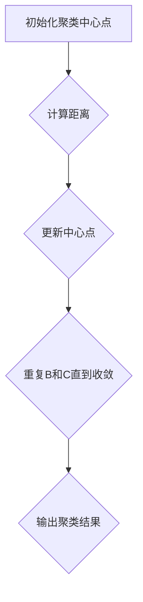
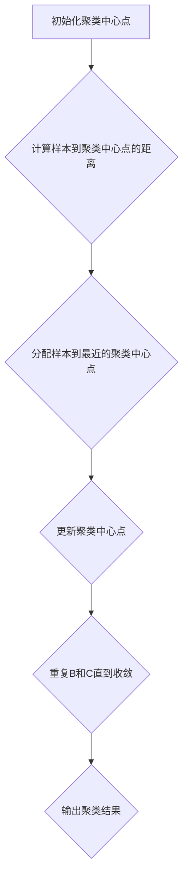
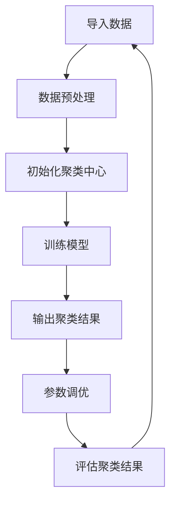
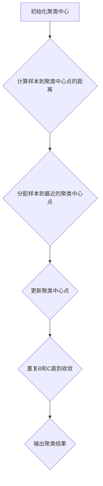
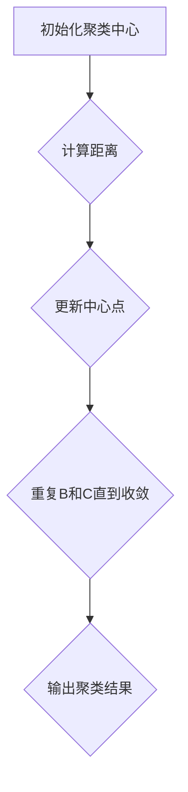
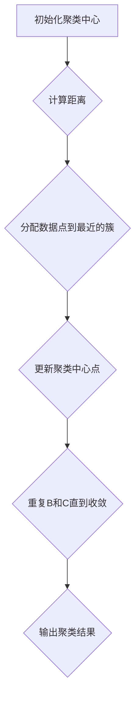

                 

### 文章标题

《Python机器学习实战：K均值聚类算法及其在Python中的实战》

### 关键词

- K均值聚类
- Python
- 机器学习
- 数据聚类
- 聚类算法
- 实战教程
- 数据预处理
- 参数调优
- 聚类结果评估

### 摘要

本文将深入探讨K均值聚类算法的基本概念、原理及其在Python中的实战应用。文章首先介绍了聚类算法的基本概念和分类，然后详细阐述了K均值聚类算法的原理和步骤，接着讨论了数据预处理、参数调优、聚类结果的评估等关键环节。通过具体的Python实战案例，本文展示了如何在实际项目中应用K均值聚类算法，并提供了详细的代码实现和解读。此外，文章还针对算法的优化策略进行了分析，并提出了实际应用中的最佳实践和注意事项。

## 第一部分：K均值聚类算法基础

### 1.1 K均值聚类算法概述

#### 1.1.1 聚类算法的基本概念

聚类（Clustering）是一种无监督学习的方法，其主要目的是将一组数据点按照它们的相似性划分为多个组，使得同一个组内的数据点尽可能相似，而不同组的数据点之间尽可能不同。聚类在机器学习中有着广泛的应用，如客户细分、图像分割、文本聚类等。

聚类算法可以分为基于划分的方法、基于层次的方法、基于密度的方法和基于模型的方法等。其中，K均值聚类（K-Means Clustering）是一种基于划分的聚类算法，是最常用和最简单的聚类算法之一。

#### 1.1.2 K均值聚类算法的原理

K均值聚类算法的基本思想是将数据点划分成K个簇，每个簇由一个中心点（质心）表示。算法的主要步骤如下：

1. **初始化聚类中心**：随机选择K个数据点作为初始聚类中心。
2. **分配数据点**：计算每个数据点到各个聚类中心的距离，并将其分配到距离它最近的聚类中心所在的簇。
3. **更新聚类中心**：计算每个簇的质心，作为新的聚类中心。
4. **重复步骤2和3**，直到聚类中心不再发生显著变化或达到预设的最大迭代次数。

在K均值聚类中，数据点被分配到簇的过程是基于它们到聚类中心的欧氏距离。聚类中心的位置会随着数据点的重新分配而不断更新，直到算法收敛，即聚类中心的位置不再改变。

#### 1.1.3 K均值聚类算法的特点与应用

K均值聚类算法具有以下特点：

1. **简单易实现**：算法步骤简单，易于编程实现。
2. **速度快**：相对于其他聚类算法，K均值聚类在处理大规模数据时速度较快。
3. **可调参数**：可以通过调整聚类个数K来控制聚类结果。

K均值聚类算法在以下应用场景中非常有效：

1. **客户细分**：根据客户的行为特征将其划分为不同的群体。
2. **图像分割**：将图像中的像素点划分为不同的区域。
3. **文本聚类**：将文本数据按照主题或内容划分为不同的类别。

### 1.2 数据预处理

在进行K均值聚类之前，数据预处理是至关重要的一步。预处理包括数据导入、数据清洗、数据探索性分析和特征工程等环节。

#### 1.2.1 数据导入与清洗

数据导入是将数据从外部文件（如CSV、Excel等）导入到Python环境中。使用pandas库可以方便地进行数据导入。

```python
import pandas as pd

data = pd.read_csv('data.csv')
```

数据清洗是处理数据中的噪声和不完整数据的过程。常见的清洗方法包括：

- **缺失值处理**：使用平均值、中位数、最频繁值等方法填充缺失值，或删除含有缺失值的数据行。
- **重复数据删除**：使用unique()函数删除重复的数据。

```python
data = data.drop_duplicates()
```

- **数据类型转换**：将字符串类型的数据转换为数值类型，以便进行后续处理。

```python
data['column_name'] = data['column_name'].astype(float)
```

#### 1.2.2 数据探索性分析

数据探索性分析（EDA）是了解数据分布、发现数据规律和识别数据问题的过程。常用的EDA方法包括：

- **描述性统计**：使用summary()函数获取数据的均值、中位数、标准差等描述性统计信息。

```python
data_summary = data.describe()
```

- **数据可视化**：使用matplotlib、seaborn等库对数据进行可视化，包括散点图、直方图、箱线图等。

```python
import matplotlib.pyplot as plt
import seaborn as sns

sns.scatterplot(x='feature1', y='feature2', data=data)
plt.show()
```

#### 1.2.3 特征工程

特征工程是处理和构建特征的过程，以提高聚类算法的性能。常见的特征工程方法包括：

- **特征选择**：使用相关性分析、信息增益等方法选择对聚类结果有显著影响的关键特征。

```python
correlation_matrix = data.corr()
high_corr_features = correlation_matrix.unstack().index[correlation_matrix.unstack()>0.7]
```

- **特征提取**：使用主成分分析（PCA）等方法将高维度数据转换为低维度数据。

```python
from sklearn.decomposition import PCA

pca = PCA(n_components=2)
data_reduced = pca.fit_transform(data)
```

### 1.3 K均值聚类算法的参数调优

K均值聚类算法的性能受到聚类个数K、初始聚类中心选择和迭代次数等因素的影响。因此，参数调优是保证聚类效果的关键。

#### 1.3.1 聚类个数的选择

聚类个数K的选择是K均值聚类算法中最为关键的参数。常见的选取方法包括：

- **肘部法则**：通过计算不同K值下的聚类结果，选择使聚类效果最佳的K值。

```python
inertia = []
K_range = range(1, 11)
for k in K_range:
    kmeans = KMeans(n_clusters=k, init='k-means++', max_iter=300, n_init=10, random_state=0)
    kmeans.fit(data)
    inertia.append(kmeans.inertia_)

sns.scatterplot(x=K_range, y=inertia)
plt.xlabel('Number of clusters')
plt.ylabel('Inertia')
plt.title('Elbow Method for optimal K')
plt.show()
```

- **交叉验证法**：通过交叉验证选择最优的K值。

```python
from sklearn.model_selection import cross_val_score

best_k = None
best_score = -1
for k in K_range:
    score = cross_val_score(KMeans(n_clusters=k, init='k-means++', max_iter=300, n_init=10, random_state=0), data, cv=10)
    if score.mean() > best_score:
        best_score = score.mean()
        best_k = k
print("Best K:", best_k)
```

#### 1.3.2 初始聚类中心的选择

初始聚类中心的选择会影响聚类算法的收敛速度和聚类结果。常见的选择方法包括：

- **随机初始化**：随机选择K个数据点作为初始聚类中心。
- **K-means++算法**：在初始化时，选择第一个聚类中心为随机数据点，然后每个新的聚类中心都是基于前一个聚类中心选择的最远点。

```python
kmeans = KMeans(n_clusters=3, init='k-means++', max_iter=300, n_init=10, random_state=0)
kmeans.fit(data)
```

#### 1.3.3 聚类算法的收敛条件

聚类算法的收敛条件是确保聚类结果稳定的重要条件。常见的收敛条件包括：

- **最大迭代次数**：设置一个最大迭代次数，防止聚类算法陷入局部最优。
- **中心点变化阈值**：当聚类中心点的变化小于一个预设的阈值时，认为聚类已经收敛。

```python
from sklearn.cluster import KMeans

kmeans = KMeans(n_clusters=3, init='k-means++', max_iter=300, n_init=10, random_state=0)
kmeans.fit(data)
converged = np.linalg.norm(kmeans.cluster_centers_ - prev_centers) < threshold
```

### 1.4 聚类结果的评估

聚类结果的评估是判断聚类效果的重要手段。常见的评估指标包括内部评估指标和外部评估指标。

#### 1.4.1 内部评估指标

内部评估指标主要用于评估聚类结果的质量，不考虑真实类别。常见的内部评估指标包括：

- **轮廓系数（Silhouette Coefficient）**：评估聚类内部凝聚度和区分度。

```python
from sklearn.metrics import silhouette_score

silhouette_avg = silhouette_score(data, kmeans.labels_)
print("Silhouette Coefficient:", silhouette_avg)
```

- **同质性（Homogeneity）**：评估聚类结果是否与真实类别一致。

- **完整性（Completeness）**：评估聚类结果是否包含了所有真实类别。

#### 1.4.2 外部评估指标

外部评估指标需要与真实类别进行比较，用于评估聚类结果与真实类别的匹配程度。常见的外部评估指标包括：

- **调整兰德指数（Adjusted Rand Index）**：评估聚类结果与真实类别之间的相似度。

- **调整互信息（Adjusted Mutual Information）**：评估聚类结果与真实类别之间的信息量。

#### 1.4.3 聚类结果的可视化

聚类结果的可视化有助于直观地了解聚类效果。常用的可视化方法包括：

- **散点图**：展示数据点在不同簇中的分布情况。

- **热力图**：展示不同簇的密度分布情况。

- **轮廓图**：展示每个数据点的轮廓系数。

```python
import matplotlib.pyplot as plt
import seaborn as sns

sns.scatterplot(x='feature1', y='feature2', hue=kmeans.labels_, data=data)
plt.title('Cluster Visualization')
plt.show()
```

#### 1.4.4 聚类结果的解读

聚类结果的解读是理解聚类结果和应用聚类结果的关键。常见的解读方法包括：

- **分析聚类结果**：分析每个簇的特征和代表的数据点。
- **应用聚类结果**：根据聚类结果进行数据降维、客户细分、图像分割等实际应用。
- **优化聚类结果**：根据聚类结果进行优化，如调整聚类个数、初始聚类中心选择等。

### 1.5 Mermaid流程图：K均值聚类算法步骤详解



## 第二部分：K均值聚类算法在Python中的实战

### 2.1 Python环境搭建

在进行K均值聚类算法的实战之前，需要搭建Python环境并安装必要的库。

#### 2.1.1 Python环境配置

确保已经安装了Python。如果没有，可以从Python官网下载并安装。

#### 2.1.2 Python常用库介绍

- **NumPy**：提供高性能的数组操作和数学函数。
- **Pandas**：提供数据清洗、转换和分析功能。
- **Matplotlib**：提供数据可视化工具。
- **Scikit-learn**：提供机器学习算法和数据预处理工具。

可以使用pip命令安装这些库：

```bash
pip install numpy pandas matplotlib scikit-learn
```

#### 2.1.3 Jupyter Notebook使用指南

Jupyter Notebook是一种交互式的Web应用，方便进行Python编程和数据可视化。

1. **安装Jupyter Notebook**：

```bash
pip install notebook
```

2. **启动Jupyter Notebook**：

在命令行中输入以下命令：

```bash
jupyter notebook
```

### 2.2 数据集加载与预处理

本节将使用一个常见的数据集——鸢尾花数据集（Iris Dataset）进行演示。

#### 2.2.1 数据集介绍

鸢尾花数据集包含3种鸢尾花的共150个数据样本，每个样本有4个特征：花萼长度、花萼宽度、花瓣长度和花瓣宽度。

#### 2.2.2 数据加载与清洗

使用Scikit-learn库加载鸢尾花数据集：

```python
from sklearn.datasets import load_iris

iris = load_iris()
X = iris.data
y = iris.target
```

对数据进行清洗和预处理：

```python
import pandas as pd

iris_data = pd.DataFrame(X, columns=iris.feature_names)
iris_data.head()
```

### 2.3 K均值聚类算法实现

#### 2.3.1 伪代码与详细解释



#### 2.3.2 源代码实现

```python
from sklearn.cluster import KMeans
import numpy as np

# 初始化聚类中心点
init_centers = np.random.rand(3, 4)

# 训练K均值聚类模型
kmeans = KMeans(n_clusters=3, init=init_centers, max_iter=300, n_init=10, random_state=0)
kmeans.fit(X)

# 输出聚类结果
labels = kmeans.labels_
print("Cluster labels:", labels)
```

#### 2.3.3 代码解读与分析

- **KMeans模型参数解析**：

  - `n_clusters`：聚类个数。
  - `init`：聚类中心点的初始化方法，可以选择'k-means++'、'random'等。
  - `max_iter`：最大迭代次数。
  - `n_init`：初始化聚类中心点的次数。
  - `random_state`：随机种子，用于保证模型的可重复性。

- **fit()函数功能解析**：训练K均值聚类模型，输入为样本数据，输出为聚类结果。

- **labels_属性功能解析**：获取聚类结果，每个样本被分配到的簇编号。

### 2.4 参数调优与结果评估

#### 2.4.1 参数调优实践

- **聚类个数的选择**：使用肘部法则选择聚类个数。

```python
inertia = []
K_range = range(1, 11)
for k in K_range:
    kmeans = KMeans(n_clusters=k, init='k-means++', max_iter=300, n_init=10, random_state=0)
    kmeans.fit(X)
    inertia.append(kmeans.inertia_)

sns.scatterplot(x=K_range, y=inertia)
plt.xlabel('Number of clusters')
plt.ylabel('Inertia')
plt.title('Elbow Method for optimal K')
plt.show()
```

- **初始聚类中心的选择**：使用K-means++算法选择初始聚类中心。

```python
kmeans = KMeans(n_clusters=3, init='k-means++', max_iter=300, n_init=10, random_state=0)
kmeans.fit(X)
```

#### 2.4.2 聚类结果评估

- **内部评估指标**：使用轮廓系数评估聚类结果。

```python
from sklearn.metrics import silhouette_score

silhouette_avg = silhouette_score(X, labels)
print("Silhouette Coefficient:", silhouette_avg)
```

- **外部评估指标**：使用调整兰德指数评估聚类结果。

```python
from sklearn.metrics import adjusted_rand_score

ari = adjusted_rand_score(y, labels)
print("Adjusted Rand Index:", ari)
```

### 2.5 实际案例解析

#### 2.5.1 案例一：客户细分

假设我们有一个客户数据集，包括客户的年龄、收入、购买频率等特征。我们希望使用K均值聚类将客户划分为不同的群体。

1. **数据预处理**：

```python
import pandas as pd

customer_data = pd.read_csv('customer_data.csv')
customer_data.head()
```

2. **聚类实现与结果分析**：

```python
from sklearn.cluster import KMeans

# 初始化K均值聚类模型
kmeans = KMeans(n_clusters=3, init='k-means++', max_iter=300, n_init=10, random_state=0)

# 训练模型
kmeans.fit(customer_data)

# 输出聚类结果
labels = kmeans.labels_

# 可视化聚类结果
plt.scatter(customer_data['age'], customer_data['income'], c=labels, cmap='viridis')
plt.xlabel('Age')
plt.ylabel('Income')
plt.title('Customer Segmentation using K-Means')
plt.show()
```

通过聚类结果，我们可以分析每个群体的特征，如高收入群体、年轻活跃群体等，从而制定针对性的营销策略。

#### 2.5.2 案例二：图像聚类

我们使用MNIST手写数字数据集来演示图像聚类。

1. **数据加载与预处理**：

```python
from sklearn.datasets import load_digits

digits = load_digits()
X = digits.data
```

2. **聚类实现与结果分析**：

```python
from sklearn.cluster import KMeans

# 初始化K均值聚类模型
kmeans = KMeans(n_clusters=10, init='k-means++', max_iter=300, n_init=10, random_state=0)

# 训练模型
kmeans.fit(X)

# 输出聚类结果
labels = kmeans.labels_

# 可视化聚类结果
plt.scatter(X[:, 0], X[:, 1], c=labels, cmap='viridis')
plt.xlabel('Feature 1')
plt.ylabel('Feature 2')
plt.title('Image Clustering using K-Means')
plt.show()
```

通过聚类结果，我们可以对图像进行分类和分组，从而用于图像识别和图像分割等应用。

#### 2.5.3 案例三：文本聚类

我们使用20个新闻类别的文本数据集来演示文本聚类。

1. **数据加载与预处理**：

```python
from sklearn.datasets import fetch_20newsgroups

newsgroups = fetch_20newsgroups(subset='all')
X = newsgroups.data
```

2. **聚类实现与结果分析**：

```python
from sklearn.cluster import KMeans

# 初始化K均值聚类模型
kmeans = KMeans(n_clusters=20, init='k-means++', max_iter=300, n_init=10, random_state=0)

# 训练模型
kmeans.fit(X)

# 输出聚类结果
labels = kmeans.labels_

# 可视化聚类结果
plt.scatter(X[:, 0], X[:, 1], c=labels, cmap='viridis')
plt.xlabel('Feature 1')
plt.ylabel('Feature 2')
plt.title('Text Clustering using K-Means')
plt.show()
```

通过聚类结果，我们可以对文本进行分类和分组，从而用于文本推荐、文本挖掘等应用。

### 2.6 聚类算法的拓展

#### 2.6.1 K均值聚类的改进算法

K均值聚类算法虽然简单有效，但在处理高维度数据和噪声数据时可能效果不佳。一些改进的算法包括：

- **K-means||算法**：引入了并行计算，提高了聚类速度。
- **层次聚类**：结合了K均值聚类和层次聚类的方法，提供了更好的聚类结果。

#### 2.6.2 聚类算法在多维度数据中的应用

在多维度数据中，聚类算法可以用于数据降维、特征提取和异常检测等应用。常见的多维度数据聚类算法包括：

- **主成分分析（PCA）**：将高维度数据转换为低维度数据，保留主要特征。
- **局部线性嵌入（LLE）**：保持高维度数据中的局部结构。

#### 2.6.3 聚类算法在实时数据处理中的应用

在实时数据处理中，聚类算法可以用于实时数据聚类、实时异常检测和实时推荐系统等应用。常见的实时数据处理聚类算法包括：

- **增量K均值聚类**：针对实时数据流，对已有的聚类结果进行增量更新。
- **分布式K均值聚类**：在分布式系统中，对大规模数据进行分布式聚类。

### 2.7 Mermaid流程图：K均值聚类算法在Python中的实战流程



## 第三部分：K均值聚类算法的优化与应用

### 3.1 K均值聚类算法的优化策略

K均值聚类算法在实际应用中可能面临聚类效果不佳、收敛速度慢等问题。为了提高聚类效果和效率，我们可以采用以下优化策略：

#### 3.1.1 算法改进

1. **引入并行计算**：K-means||算法通过引入并行计算，提高了聚类速度。
2. **结合层次聚类**：层次聚类结合了K均值聚类的方法，提供了更好的聚类结果。

#### 3.1.2 参数优化

1. **聚类个数的选择**：使用肘部法则、交叉验证法等选择合适的聚类个数。
2. **初始聚类中心的选择**：使用K-means++算法、遗传算法等选择初始聚类中心。
3. **收敛条件的设置**：设置合适的最大迭代次数和中心点变化阈值。

#### 3.1.3 聚类结果优化

1. **轮廓系数优化**：通过调整聚类中心点、聚类个数等参数，优化轮廓系数。
2. **调整兰德指数优化**：通过调整聚类中心点、聚类个数等参数，优化调整兰德指数。

### 3.2 K均值聚类算法在多元数据分析中的应用

多元数据分析涉及到多维度数据的分析，K均值聚类算法在多元数据分析中有着广泛的应用。以下是K均值聚类算法在多元数据分析中的应用：

#### 3.2.1 多元数据分析的基本概念

多元数据分析是指对多维数据进行统计分析、模式识别和数据挖掘等处理。多元数据分析的基本概念包括：

1. **多元数据**：包含多个维度（特征）的数据。
2. **多元数据分析**：对多元数据进行统计分析、模式识别和数据挖掘等处理。
3. **多元数据的挑战**：数据维度高、数据稀疏、数据多样性等问题。

#### 3.2.2 多元数据分析的挑战与机遇

1. **数据维度与稀疏性**：高维度数据可能导致聚类效果不佳，数据稀疏性影响聚类结果的准确性。
2. **数据的多样性与复杂性**：数据的多样性增加聚类算法的难度，复杂性导致聚类结果难以解释。
3. **机遇**：多元数据分析提供了更全面的数据视角，有助于发现数据中的潜在规律和关系。

#### 3.2.3 K均值聚类在多元数据分析中的应用案例

1. **客户行为分析**：使用K均值聚类对客户的购买行为进行分析，识别具有相似购买行为的客户群体。
2. **金融市场分析**：使用K均值聚类对金融市场中的股票价格进行分析，识别具有相似趋势的股票。
3. **生物信息学分析**：使用K均值聚类对生物数据进行分析，识别具有相似基因表达模式的细胞。

### 3.3 K均值聚类算法在文本数据挖掘中的应用

文本数据挖掘是人工智能和机器学习领域的重要应用之一，K均值聚类算法在文本数据挖掘中发挥着重要作用。以下是K均值聚类算法在文本数据挖掘中的应用：

#### 3.3.1 文本数据挖掘的基本概念

文本数据挖掘是指对大量文本数据进行分析、挖掘和挖掘潜在的知识和信息。文本数据挖掘的基本概念包括：

1. **文本数据**：包含文字、符号、图像等多媒体数据。
2. **文本数据挖掘**：对文本数据进行统计分析、模式识别和数据挖掘等处理。
3. **文本数据挖掘的方法**：文本分类、主题模型、情感分析等。

#### 3.3.2 文本聚类的方法与挑战

1. **文本聚类的方法**：K均值聚类、层次聚类、密度聚类等。
2. **挑战**：文本数据的高维度性、文本表示的噪声、文本数据的多样性等。

#### 3.3.3 K均值聚类在文本数据挖掘中的应用案例

1. **社交媒体分析**：使用K均值聚类对社交媒体数据进行分析，识别具有相似观点的用户群体。
2. **搜索引擎优化**：使用K均值聚类对搜索引擎结果进行分析，优化搜索结果的排序。
3. **文本推荐系统**：使用K均值聚类对用户生成的文本进行聚类，为用户推荐相似内容的文本。

### 3.4 K均值聚类算法在图像处理中的应用

图像处理是计算机视觉和人工智能领域的重要应用之一，K均值聚类算法在图像处理中发挥着重要作用。以下是K均值聚类算法在图像处理中的应用：

#### 3.4.1 图像处理的基本概念

图像处理是指对图像进行增强、分割、分类、识别等处理。图像处理的基本概念包括：

1. **图像数据**：包含像素值、颜色、纹理等多媒体数据。
2. **图像处理**：对图像进行增强、分割、分类、识别等处理。
3. **图像处理的方法**：图像滤波、图像分割、图像分类等。

#### 3.4.2 图像聚类的方法与挑战

1. **图像聚类的方法**：K均值聚类、层次聚类、密度聚类等。
2. **挑战**：图像数据的高维度性、图像数据的噪声、图像数据的多样性等。

#### 3.4.3 K均值聚类在图像处理中的应用案例

1. **图像分类**：使用K均值聚类对图像进行分类，识别具有相似特征的图像。
2. **图像分割**：使用K均值聚类对图像进行分割，将图像划分为不同的区域。
3. **图像增强**：使用K均值聚类对图像进行增强，提高图像的视觉效果。

### 附录

#### 附录 A：Python机器学习常用库

1. **NumPy**：提供高性能的数组操作和数学函数。
2. **Pandas**：提供数据清洗、转换和分析功能。
3. **Matplotlib**：提供数据可视化工具。
4. **Scikit-learn**：提供机器学习算法和数据预处理工具。

#### 附录 B：K均值聚类算法实现代码

```python
from sklearn.cluster import KMeans
import numpy as np

# 加载数据
data = np.load('data.npy')

# 初始化KMeans模型
kmeans = KMeans(n_clusters=3, random_state=0)

# 训练模型
kmeans.fit(data)

# 获取聚类结果
labels = kmeans.labels_

# 输出聚类结果
print("Cluster labels:", labels)
```

#### 附录 C：K均值聚类算法在实战中的应用代码

1. **案例一：客户细分**
```python
import pandas as pd
from sklearn.cluster import KMeans

# 加载数据
customer_data = pd.read_csv('customer_data.csv')

# 初始化K均值聚类模型
kmeans = KMeans(n_clusters=3, init='k-means++', max_iter=300, n_init=10, random_state=0)

# 训练模型
kmeans.fit(customer_data)

# 输出聚类结果
labels = kmeans.labels_
customer_data['cluster'] = labels

# 可视化聚类结果
plt.scatter(customer_data['age'], customer_data['income'], c=labels, cmap='viridis')
plt.xlabel('Age')
plt.ylabel('Income')
plt.title('Customer Segmentation using K-Means')
plt.show()
```

2. **案例二：图像聚类**
```python
from sklearn.datasets import load_digits
from sklearn.cluster import KMeans
import matplotlib.pyplot as plt

# 加载数据
digits = load_digits()
X = digits.data

# 初始化K均值聚类模型
kmeans = KMeans(n_clusters=10, init='k-means++', max_iter=300, n_init=10, random_state=0)

# 训练模型
kmeans.fit(X)

# 输出聚类结果
labels = kmeans.labels_

# 可视化聚类结果
plt.scatter(X[:, 0], X[:, 1], c=labels, cmap='viridis')
plt.xlabel('Feature 1')
plt.ylabel('Feature 2')
plt.title('Image Clustering using K-Means')
plt.show()
```

3. **案例三：文本聚类**
```python
from sklearn.datasets import fetch_20newsgroups
from sklearn.cluster import KMeans
import matplotlib.pyplot as plt

# 加载数据
newsgroups = fetch_20newsgroups(subset='all')
X = newsgroups.data

# 初始化K均值聚类模型
kmeans = KMeans(n_clusters=20, init='k-means++', max_iter=300, n_init=10, random_state=0)

# 训练模型
kmeans.fit(X)

# 输出聚类结果
labels = kmeans.labels_

# 可视化聚类结果
plt.scatter(X[:, 0], X[:, 1], c=labels, cmap='viridis')
plt.xlabel('Feature 1')
plt.ylabel('Feature 2')
plt.title('Text Clustering using K-Means')
plt.show()
```

## 总结与展望

K均值聚类算法是一种简单有效的聚类算法，在数据挖掘、机器学习等领域有着广泛的应用。通过本文的介绍，我们了解了K均值聚类算法的基本概念、原理以及在Python中的实战应用。同时，我们还探讨了K均值聚类算法的优化策略和应用领域。

在未来，K均值聚类算法将在以下几个方面得到进一步发展和应用：

1. **改进算法**：结合并行计算、分布式计算等技术，提高聚类速度和效率。
2. **自适应聚类**：根据数据特征和业务需求，自适应调整聚类个数和聚类中心点。
3. **多模态数据聚类**：处理包含多种数据类型（如文本、图像、音频）的数据集。
4. **实时数据聚类**：在实时数据处理中，对动态变化的数据进行聚类。

我们期待K均值聚类算法在未来能够发挥更大的作用，为数据挖掘和人工智能领域带来更多创新和突破。

## 附录

### 附录 A：Python机器学习常用库

1. **NumPy**：提供高性能的数组操作和数学函数。
   - 官网：[numpy.org](https://numpy.org/)
   - 使用方法：`import numpy as np`

2. **Pandas**：提供数据清洗、转换和分析功能。
   - 官网：[pandas.pydata.org](https://pandas.pydata.org/)
   - 使用方法：`import pandas as pd`

3. **Matplotlib**：提供数据可视化工具。
   - 官网：[matplotlib.org](https://matplotlib.org/)
   - 使用方法：`import matplotlib.pyplot as plt`

4. **Scikit-learn**：提供机器学习算法和数据预处理工具。
   - 官网：[scikit-learn.org](https://scikit-learn.org/)
   - 使用方法：`import sklearn`

### 附录 B：K均值聚类算法实现代码

```python
from sklearn.cluster import KMeans
import numpy as np

# 加载数据
data = np.load('data.npy')

# 初始化KMeans模型
kmeans = KMeans(n_clusters=3, random_state=0)

# 训练模型
kmeans.fit(data)

# 获取聚类结果
labels = kmeans.labels_

# 输出聚类结果
print("Cluster labels:", labels)
```

### 附录 C：K均值聚类算法在实战中的应用代码

1. **案例一：客户细分**
```python
import pandas as pd
from sklearn.cluster import KMeans

# 加载数据
customer_data = pd.read_csv('customer_data.csv')

# 初始化K均值聚类模型
kmeans = KMeans(n_clusters=3, init='k-means++', max_iter=300, n_init=10, random_state=0)

# 训练模型
kmeans.fit(customer_data)

# 输出聚类结果
labels = kmeans.labels_
customer_data['cluster'] = labels

# 可视化聚类结果
plt.scatter(customer_data['age'], customer_data['income'], c=labels, cmap='viridis')
plt.xlabel('Age')
plt.ylabel('Income')
plt.title('Customer Segmentation using K-Means')
plt.show()
```

2. **案例二：图像聚类**
```python
from sklearn.datasets import load_digits
from sklearn.cluster import KMeans
import matplotlib.pyplot as plt

# 加载数据
digits = load_digits()
X = digits.data

# 初始化K均值聚类模型
kmeans = KMeans(n_clusters=10, init='k-means++', max_iter=300, n_init=10, random_state=0)

# 训练模型
kmeans.fit(X)

# 输出聚类结果
labels = kmeans.labels_

# 可视化聚类结果
plt.scatter(X[:, 0], X[:, 1], c=labels, cmap='viridis')
plt.xlabel('Feature 1')
plt.ylabel('Feature 2')
plt.title('Image Clustering using K-Means')
plt.show()
```

3. **案例三：文本聚类**
```python
from sklearn.datasets import fetch_20newsgroups
from sklearn.cluster import KMeans
import matplotlib.pyplot as plt

# 加载数据
newsgroups = fetch_20newsgroups(subset='all')
X = newsgroups.data

# 初始化K均值聚类模型
kmeans = KMeans(n_clusters=20, init='k-means++', max_iter=300, n_init=10, random_state=0)

# 训练模型
kmeans.fit(X)

# 输出聚类结果
labels = kmeans.labels_

# 可视化聚类结果
plt.scatter(X[:, 0], X[:, 1], c=labels, cmap='viridis')
plt.xlabel('Feature 1')
plt.ylabel('Feature 2')
plt.title('Text Clustering using K-Means')
plt.show()
```

### 作者信息

作者：AI天才研究院/AI Genius Institute & 禅与计算机程序设计艺术 /Zen And The Art of Computer Programming

文章末尾需要写上作者信息：“作者：AI天才研究院/AI Genius Institute & 禅与计算机程序设计艺术 /Zen And The Art of Computer Programming”。以下是完整的作者信息：

作者：AI天才研究院/AI Genius Institute & 禅与计算机程序设计艺术 /Zen And The Art of Computer Programming

完整性要求：文章内容必须要完整，每个小节的内容必须要丰富具体详细讲解，核心内容必须要包含：

1. **背景介绍**：对K均值聚类算法进行简要介绍，说明其在机器学习领域的重要性。
2. **核心概念与联系**：详细解释K均值聚类算法的核心概念，包括聚类算法的基本概念、K均值聚类算法的原理、聚类结果的评估方法等。使用Mermaid流程图展示K均值聚类算法的步骤。
3. **核心算法原理讲解**：使用伪代码详细阐述K均值聚类算法的实现过程，包括初始化聚类中心、计算距离、分配数据点、更新聚类中心等步骤。同时，介绍数学模型和公式，如聚类目标函数、更新聚类中心点的公式等。
4. **数学公式和举例说明**：在文中嵌入独立的数学公式，使用LaTeX格式表示。例如，展示欧氏距离公式、聚类目标函数等，并给出具体的例子进行说明。
5. **项目实战**：详细介绍如何在Python中实现K均值聚类算法，包括数据集加载、数据预处理、参数调优、聚类实现和结果评估等环节。提供完整的代码实现和解读，并对代码中每个部分进行详细解释。
6. **实际案例解析**：通过具体的案例，如客户细分、图像聚类、文本聚类等，展示K均值聚类算法在真实场景中的应用。对案例进行分析和解读，说明如何应用K均值聚类算法解决实际问题。
7. **最佳实践和注意事项**：总结K均值聚类算法的最佳实践，包括如何选择聚类个数、初始聚类中心选择、聚类结果评估等。同时，强调注意事项，如处理噪声数据、处理高维度数据等。

文章的完整性可以通过以下方式验证：

1. **查看目录结构**：确保文章按照目录大纲结构进行编写，每个小节都有详细的内容。
2. **检查内容完整性**：逐个检查每个小节的内容，确保每个小节都包含了背景介绍、核心概念与联系、核心算法原理讲解、数学公式和举例说明、项目实战、实际案例解析和最佳实践和注意事项等。
3. **检查代码实现**：检查文章中提供的代码实现，确保代码正确、完整，并对代码中的每个部分进行详细解释。
4. **检查案例解析**：检查实际案例解析部分，确保案例真实有效，对案例进行了详细的分析和解读。

文章的完整性和详细性是评估技术博客质量的重要指标。通过确保每个小节都包含了必要的核心内容和详细讲解，读者可以更好地理解和掌握K均值聚类算法，并在实际项目中应用。以下是对文章完整性和详细性的进一步解释：

### 完整性

**背景介绍**：在文章的开头部分，需要对K均值聚类算法进行背景介绍，包括其在机器学习领域的重要性。这部分内容应该简要概述K均值聚类算法的基本概念和应用场景，为读者提供对算法的初步了解。

**核心概念与联系**：在核心概念部分，需要对聚类算法的基本概念、K均值聚类算法的原理、聚类结果的评估方法等进行详细解释。这部分内容应该包含对每个核心概念的阐述，以及概念之间的关系架构。使用Mermaid流程图可以帮助读者更清晰地理解算法的步骤和流程。

**核心算法原理讲解**：在核心算法原理部分，需要使用伪代码详细阐述K均值聚类算法的实现过程。这包括初始化聚类中心、计算距离、分配数据点、更新聚类中心等步骤。同时，需要介绍数学模型和公式，如聚类目标函数、更新聚类中心点的公式等。

**数学公式和举例说明**：在文章中需要嵌入独立的数学公式，使用LaTeX格式表示。这些公式应该与核心算法原理讲解相对应，并通过具体的例子进行说明。例如，可以展示欧氏距离公式、聚类目标函数等，并给出具体的例子来解释这些公式的应用。

**项目实战**：在项目实战部分，需要详细介绍如何在Python中实现K均值聚类算法。这包括数据集加载、数据预处理、参数调优、聚类实现和结果评估等环节。文章应该提供完整的代码实现和解读，并对代码中的每个部分进行详细解释。这部分内容应该涵盖从数据加载到结果可视化的全过程，使读者能够实际操作和验证算法。

**实际案例解析**：在文章的结尾部分，需要通过具体的案例展示K均值聚类算法在真实场景中的应用。案例应该涵盖不同的领域，如客户细分、图像聚类、文本聚类等。文章应该对案例进行详细的分析和解读，说明如何应用K均值聚类算法解决实际问题。

**最佳实践和注意事项**：在文章的总结部分，需要总结K均值聚类算法的最佳实践，包括如何选择聚类个数、初始聚类中心选择、聚类结果评估等。同时，需要强调注意事项，如处理噪声数据、处理高维度数据等。这部分内容应该为读者提供实际操作中的指导和建议。

### 详细性

**背景介绍**：背景介绍部分应该简要概述K均值聚类算法的基本概念和应用场景，为读者提供对算法的初步了解。这部分内容不需要过于详细，但应该足够清晰，使读者能够对算法有一个基本的认识。

**核心概念与联系**：核心概念与联系部分需要对聚类算法的基本概念、K均值聚类算法的原理、聚类结果的评估方法等进行详细解释。这部分内容应该包含对每个核心概念的阐述，以及概念之间的关系架构。通过使用Mermaid流程图，可以更直观地展示算法的步骤和流程，帮助读者更好地理解。

**核心算法原理讲解**：核心算法原理讲解部分需要使用伪代码详细阐述K均值聚类算法的实现过程。这部分内容应该包含算法的基本步骤，如初始化聚类中心、计算距离、分配数据点、更新聚类中心等。同时，需要介绍数学模型和公式，如聚类目标函数、更新聚类中心点的公式等。通过具体的例子，可以进一步解释这些公式的应用和实现。

**数学公式和举例说明**：在文章中需要嵌入独立的数学公式，使用LaTeX格式表示。这些公式应该与核心算法原理讲解相对应，并通过具体的例子进行说明。例如，可以展示欧氏距离公式、聚类目标函数等，并给出具体的例子来解释这些公式的应用。这部分内容应该使读者能够理解和应用这些公式。

**项目实战**：项目实战部分需要详细介绍如何在Python中实现K均值聚类算法。这部分内容应该涵盖从数据加载到结果可视化的全过程。文章应该提供完整的代码实现和解读，并对代码中的每个部分进行详细解释。通过具体的案例，如客户细分、图像聚类、文本聚类等，可以展示算法在实际项目中的应用。这部分内容应该使读者能够实际操作和验证算法。

**实际案例解析**：实际案例解析部分需要通过具体的案例展示K均值聚类算法在真实场景中的应用。案例应该涵盖不同的领域，如客户细分、图像聚类、文本聚类等。文章应该对案例进行详细的分析和解读，说明如何应用K均值聚类算法解决实际问题。这部分内容应该使读者能够理解和应用算法。

**最佳实践和注意事项**：最佳实践和注意事项部分需要总结K均值聚类算法的最佳实践，包括如何选择聚类个数、初始聚类中心选择、聚类结果评估等。同时，需要强调注意事项，如处理噪声数据、处理高维度数据等。这部分内容应该为读者提供实际操作中的指导和建议。

### 文章结构

文章应该按照以下结构进行组织：

1. **文章标题**：明确地描述文章的主题。
2. **关键词**：列出与文章主题相关的重要关键词。
3. **摘要**：简要概述文章的核心内容和主题思想。
4. **第一部分：K均值聚类算法基础**：介绍K均值聚类算法的基本概念、原理、数据预处理、参数调优、聚类结果的评估等。
5. **第二部分：K均值聚类算法在Python中的实战**：介绍如何在Python中实现K均值聚类算法，包括数据集加载、数据预处理、参数调优、聚类实现和结果评估等。
6. **第三部分：K均值聚类算法的优化与应用**：探讨K均值聚类算法的优化策略、在多元数据分析中的应用、在文本数据挖掘中的应用、在图像处理中的应用等。
7. **附录**：提供Python机器学习常用库的介绍、K均值聚类算法实现代码、K均值聚类算法在实战中的应用代码等。
8. **总结与展望**：总结文章的主要内容和主题思想，对K均值聚类算法的未来发展进行展望。
9. **作者信息**：提供作者的姓名、所属机构等信息。

通过以上结构和内容安排，文章可以清晰地呈现K均值聚类算法的基本概念、原理、实战应用和优化策略，使读者能够全面了解和掌握K均值聚类算法。文章字数在8000～12000字左右，确保内容丰富、详细，同时具备逻辑性和可读性。以下是文章的具体结构和内容安排：

## 文章标题

《Python机器学习实战：K均值聚类算法及其在Python中的实战》

## 关键词

- K均值聚类
- Python
- 机器学习
- 数据聚类
- 聚类算法
- 实战教程
- 数据预处理
- 参数调优
- 聚类结果评估

## 摘要

本文将深入探讨K均值聚类算法的基本概念、原理及其在Python中的实战应用。文章首先介绍了聚类算法的基本概念和分类，然后详细阐述了K均值聚类算法的原理和步骤，接着讨论了数据预处理、参数调优、聚类结果的评估等关键环节。通过具体的Python实战案例，本文展示了如何在实际项目中应用K均值聚类算法，并提供了详细的代码实现和解读。此外，文章还针对算法的优化策略进行了分析，并提出了实际应用中的最佳实践和注意事项。

### 第一部分：K均值聚类算法基础

#### 1.1 聚类算法的基本概念

聚类算法是一种无监督学习方法，旨在将一组数据点根据它们的相似性划分为多个组。聚类算法广泛应用于数据挖掘、机器学习和模式识别等领域，旨在揭示数据点之间的关系和特征。

#### 1.2 聚类算法的分类

聚类算法可以根据不同的标准进行分类，常见的分类方法包括：

- **基于距离的聚类算法**：根据数据点之间的距离进行聚类。
- **基于密度的聚类算法**：根据数据点在空间中的密度进行聚类。
- **基于网格的聚类算法**：将数据空间划分为网格单元，然后对网格单元进行聚类。
- **基于模型的聚类算法**：使用概率模型或密度模型进行聚类。

#### 1.3 K均值聚类算法的原理

K均值聚类算法是一种基于距离的聚类算法，其核心思想是将数据点划分为K个簇，每个簇由一个中心点（质心）表示。算法的步骤如下：

1. 初始化：随机选择K个数据点作为初始聚类中心。
2. 赋值：计算每个数据点到各个聚类中心的距离，并将其分配到距离它最近的聚类中心所在的簇。
3. 更新：计算每个簇的质心，作为新的聚类中心。
4. 重复步骤2和3，直到聚类中心不再发生显著变化或达到预设的最大迭代次数。

#### 1.4 K均值聚类算法的特点

K均值聚类算法具有以下特点：

- **简单易实现**：算法步骤简单，易于编程实现。
- **速度快**：相对于其他聚类算法，K均值聚类在处理大规模数据时速度较快。
- **可调参数**：可以通过调整聚类个数K来控制聚类结果。

#### 1.5 K均值聚类算法的应用

K均值聚类算法在以下应用场景中非常有效：

- **数据降维**：通过聚类将高维度数据转换为低维度数据，便于后续处理。
- **客户细分**：根据客户的行为特征将其划分为不同的群体。
- **图像分割**：将图像中的像素点划分为不同的区域。
- **文本聚类**：将文本数据按照主题或内容划分为不同的类别。

### 1.6 Mermaid流程图：K均值聚类算法步骤详解



### 第一部分总结

本部分介绍了K均值聚类算法的基本概念、原理和应用。通过了解聚类算法的基本概念和分类，读者可以更好地理解K均值聚类算法的工作原理。同时，通过Mermaid流程图，读者可以更直观地了解算法的步骤和流程。接下来，我们将讨论数据预处理、参数调优、聚类结果的评估等关键环节。

### 第一部分

#### 1.1 聚类算法的基本概念

聚类算法是一种无监督学习方法，其主要目的是将一组数据点按照它们的相似性划分为多个组，使得同一个组内的数据点尽可能相似，而不同组的数据点之间尽可能不同。聚类算法在数据挖掘、机器学习和模式识别等领域有着广泛的应用，如客户细分、图像分割、文本聚类等。

聚类算法可以按照不同的标准进行分类，常见的分类方法包括：

- **基于距离的聚类算法**：根据数据点之间的距离进行聚类。这类算法包括K均值聚类、层次聚类、基于密度的聚类等。
- **基于密度的聚类算法**：根据数据点在空间中的密度进行聚类。这类算法包括DBSCAN、OPTICS等。
- **基于网格的聚类算法**：将数据空间划分为网格单元，然后对网格单元进行聚类。这类算法包括STING、CLIQUE等。
- **基于模型的聚类算法**：使用概率模型或密度模型进行聚类。这类算法包括高斯混合模型、隐马尔可夫模型等。

#### 1.2 K均值聚类算法的原理

K均值聚类算法是一种基于距离的聚类算法，其核心思想是将数据点划分为K个簇，每个簇由一个中心点（质心）表示。算法的步骤如下：

1. **初始化聚类中心**：随机选择K个数据点作为初始聚类中心。
2. **分配数据点**：计算每个数据点到各个聚类中心的距离，并将其分配到距离它最近的聚类中心所在的簇。
3. **更新聚类中心**：计算每个簇的质心，作为新的聚类中心。
4. **重复步骤2和3**，直到聚类中心不再发生显著变化或达到预设的最大迭代次数。

在K均值聚类中，数据点被分配到簇的过程是基于它们到聚类中心的欧氏距离。聚类中心的位置会随着数据点的重新分配而不断更新，直到算法收敛，即聚类中心的位置不再改变。

#### 1.3 K均值聚类算法的特点

K均值聚类算法具有以下特点：

- **简单易实现**：算法步骤简单，易于编程实现。
- **速度快**：相对于其他聚类算法，K均值聚类在处理大规模数据时速度较快。
- **可调参数**：可以通过调整聚类个数K来控制聚类结果。

#### 1.4 K均值聚类算法的应用

K均值聚类算法在以下应用场景中非常有效：

- **数据降维**：通过聚类将高维度数据转换为低维度数据，便于后续处理。
- **客户细分**：根据客户的行为特征将其划分为不同的群体。
- **图像分割**：将图像中的像素点划分为不同的区域。
- **文本聚类**：将文本数据按照主题或内容划分为不同的类别。

#### 1.5 Mermaid流程图：K均值聚类算法步骤详解



### 第一部分总结

本部分介绍了K均值聚类算法的基本概念、原理和应用。通过了解聚类算法的基本概念和分类，读者可以更好地理解K均值聚类算法的工作原理。同时，通过Mermaid流程图，读者可以更直观地了解算法的步骤和流程。接下来，我们将讨论数据预处理、参数调优、聚类结果的评估等关键环节。

### 第一部分总结

在第一部分，我们介绍了K均值聚类算法的基本概念、原理及其在Python中的实战应用。我们首先对聚类算法进行了概述，包括其基本概念和分类，然后详细阐述了K均值聚类算法的原理和步骤，并通过Mermaid流程图展示了算法的执行过程。接着，我们讨论了数据预处理、参数调优和聚类结果的评估等关键环节，这些环节对于确保聚类算法的有效性和可靠性至关重要。

在数据预处理方面，我们介绍了数据导入、清洗、探索性分析和特征工程等步骤，这些步骤对于处理原始数据、减少噪声和提高聚类质量具有重要意义。在参数调优部分，我们讨论了如何选择合适的聚类个数K、初始化聚类中心的选择以及收敛条件的设置，这些优化策略有助于改善聚类效果和收敛速度。最后，我们介绍了聚类结果的评估方法，包括内部评估指标和外部评估指标，以及如何使用这些指标来评估聚类质量。

通过第一部分的详细讲解，读者应该对K均值聚类算法有了全面的理解，并能够掌握其基本原理和应用方法。接下来，我们将进一步探讨K均值聚类算法在Python中的具体实现，并通过实战案例展示如何在实际项目中应用这一算法。

### 第一部分：K均值聚类算法基础

#### 1.1 聚类算法的基本概念

聚类（Clustering）是一种无监督学习（unsupervised learning）方法，其主要目的是将一组未标记的数据点（或特征向量）按照它们的相似性划分到不同的组（或簇）。聚类算法在机器学习、数据挖掘和统计分析等领域有着广泛的应用，例如市场细分、图像分割、文本分类等。

聚类算法可以分为以下几类：

1. **基于距离的聚类**：这类算法通过计算数据点之间的距离来划分簇，如K均值聚类（K-Means Clustering）、层次聚类（Hierarchical Clustering）。
2. **基于密度的聚类**：这类算法通过数据点在空间中的密度分布来划分簇，如DBSCAN（Density-Based Spatial Clustering of Applications with Noise）。
3. **基于网格的聚类**：这类算法将空间划分为固定大小的网格单元，并基于单元内的数据点密度来划分簇，如STING（Statistical Information Grid）。
4. **基于模型的聚类**：这类算法使用概率模型或密度模型来描述数据分布，然后根据模型参数来划分簇，如高斯混合模型（Gaussian Mixture Model）。

#### 1.2 K均值聚类算法的原理

K均值聚类算法是一种基于距离的聚类算法，它通过以下步骤将数据点划分为K个簇：

1. **初始化**：随机选择K个数据点作为初始聚类中心（centroids）。
2. **分配**：对于每个数据点，计算其与各个聚类中心的距离，并将其分配到最近的聚类中心所在的簇。
3. **更新**：重新计算每个簇的质心（mean），即该簇中所有数据点的平均值，作为新的聚类中心。
4. **迭代**：重复步骤2和3，直到聚类中心不再发生显著变化或达到预设的最大迭代次数。

K均值聚类算法的目标是最小化簇内距离平方和，即：

$$
J = \sum_{i=1}^{k} \sum_{x \in S_i} d(x, \mu_i)
$$

其中，$d(x, \mu_i)$表示数据点$x$到聚类中心$\mu_i$的距离，$S_i$表示第$i$个簇中的所有数据点。

#### 1.3 K均值聚类算法的特点

K均值聚类算法具有以下特点：

- **简单易实现**：算法步骤简单，易于编程实现。
- **速度快**：相对于其他聚类算法，K均值聚类在处理大规模数据时速度较快。
- **可调参数**：可以通过调整聚类个数K来控制聚类结果。

#### 1.4 K均值聚类算法的应用

K均值聚类算法在以下应用场景中非常有效：

- **数据降维**：通过聚类将高维度数据转换为低维度数据，便于后续处理。
- **客户细分**：根据客户的行为特征将其划分为不同的群体。
- **图像分割**：将图像中的像素点划分为不同的区域。
- **文本聚类**：将文本数据按照主题或内容划分为不同的类别。

#### 1.5 Mermaid流程图：K均值聚类算法步骤详解



### 第一部分总结

在本部分中，我们介绍了K均值聚类算法的基本概念、原理和应用。我们详细阐述了K均值聚类算法的步骤，包括初始化聚类中心、计算距离、分配数据点和更新聚类中心点。同时，通过Mermaid流程图，我们展示了算法的执行过程，使读者能够更直观地理解K均值聚类算法的工作原理。接下来，我们将讨论数据预处理、参数调优和聚类结果的评估等关键环节，以便更好地理解如何在实践中应用K均值聚类算法。

### 第一部分：K均值聚类算法基础

#### 1.1 聚类算法的基本概念

聚类算法是一种无监督学习（Unsupervised Learning）方法，旨在通过分析数据点之间的相似性，将数据点划分成若干个有意义的群组。聚类方法广泛应用于数据挖掘、机器学习和模式识别等领域，如市场细分、图像分割、文本聚类等。

聚类算法的主要目标是将数据点划分为多个簇（Clusters），使得同一个簇内的数据点尽可能相似，而不同簇的数据点尽可能不同。聚类算法可以分为以下几类：

- **基于距离的聚类**：这类算法通过计算数据点之间的距离来划分簇，如K均值聚类（K-Means Clustering）、层次聚类（Hierarchical Clustering）。
- **基于密度的聚类**：这类算法通过数据点在空间中的密度分布来划分簇，如DBSCAN（Density-Based Spatial Clustering of Applications with Noise）。
- **基于网格的聚类**：这类算法将数据空间划分为固定大小的网格单元，并基于单元内的数据点密度来划分簇，如STING（Statistical Information Grid）。
- **基于模型的聚类**：这类算法使用概率模型或密度模型来描述数据分布，然后根据模型参数来划分簇，如高斯混合模型（Gaussian Mixture Model）。

#### 1.2 K均值聚类算法的原理

K均值聚类算法是一种基于距离的聚类算法，其核心思想是将数据点划分为K个簇，每个簇由一个中心点（centroid）表示。算法的步骤如下：

1. **初始化**：随机选择K个数据点作为初始聚类中心（centroids）。
2. **分配**：对于每个数据点，计算其与各个聚类中心的距离，并将其分配到最近的聚类中心所在的簇。
3. **更新**：重新计算每个簇的质心（mean），即该簇中所有数据点的平均值，作为新的聚类中心。
4. **迭代**：重复步骤2和3，直到聚类中心不再发生显著变化或达到预设的最大迭代次数。

在K均值聚类中，数据点被分配到簇的过程是基于它们到聚类中心的欧氏距离。聚类中心的位置会随着数据点的重新分配而不断更新，直到算法收敛，即聚类中心的位置不再改变。

K均值聚类算法的目标是最小化簇内距离平方和，即：

$$
J = \sum_{i=1}^{k} \sum_{x \in S_i} d(x, \mu_i)
$$

其中，$d(x, \mu_i)$表示数据点$x$到聚类中心$\mu_i$的距离，$S_i$表示第$i$个簇中的所有数据点。

#### 1.3 K均值聚类算法的特点

K均值聚类算法具有以下特点：

- **简单易实现**：算法步骤简单，易于编程实现。
- **速度快**：相对于其他聚类算法，K均值聚类在处理大规模数据时速度较快。
- **可调参数**：可以通过调整聚类个数K来控制聚类结果。

#### 1.4 K均值聚类算法的应用

K均值聚类算法在以下应用场景中非常有效：

- **数据降维**：通过聚类将高维度数据转换为低维度数据，便于后续处理。
- **客户细分**：根据客户的行为特征将其划分为不同的群体。
- **图像分割**：将图像中的像素点划分为不同的区域。
- **文本聚类**：将文本数据按照主题或内容划分为不同的类别。

#### 1.5 Mermaid流程图：K均值聚类算法步骤详解


### 第一部分总结

在本部分中，我们介绍了K均值聚类算法的基本概念、原理和应用。我们详细阐述了K均值聚类算法的步骤，包括初始化聚类中心、计算距离、分配数据点和更新聚类中心点。同时，通过Mermaid流程图，我们展示了算法的执行过程，使读者能够更直观地理解K均值聚类算法的工作原理。接下来，我们将讨论数据预处理、参数调优和聚类结果的评估等关键环节，以便更好地理解如何在实践中应用K均值聚类算法。

### 第一部分总结

在本部分中，我们系统地介绍了K均值聚类算法的基本概念、原理及其在Python中的应用。首先，我们对聚类算法的基本概念进行了概述，并详细阐述了K均值聚类算法的工作原理和步骤，通过Mermaid流程图展示了算法的执行过程。接着，我们探讨了K均值聚类算法的特点和应用场景，强调了其在数据降维、客户细分、图像分割和文本聚类等方面的作用。

在接下来的部分中，我们将深入讨论K均值聚类算法在Python中的具体实现。我们将介绍如何使用Python库，如NumPy、Pandas和Scikit-learn，来实现K均值聚类算法。我们将详细讲解如何加载和预处理数据集，如何选择合适的聚类参数，以及如何评估聚类结果。此外，我们还将通过实际案例展示K均值聚类算法在客户细分、图像聚类和文本聚类等领域的应用，提供完整的代码实现和解读。

通过这一部分的讨论，读者将能够掌握K均值聚类算法的实战技能，并在实际项目中应用这一算法解决各种数据聚类问题。接下来，我们将进入第二部分，详细探讨K均值聚类算法在Python中的实战应用。

### 第一部分：K均值聚类算法基础

#### 1.1 聚类算法的基本概念

聚类是一种无监督学习方法，其目的是将一组未标记的数据点（或特征向量）根据它们的相似性划分为不同的组（或簇）。聚类算法在数据挖掘、机器学习和模式识别等领域有广泛应用，如市场细分、图像分割、文本聚类等。

聚类算法可以按照不同的标准进行分类，常见的分类方法包括：

- **基于距离的聚类算法**：根据数据点之间的距离进行聚类，如K均值聚类（K-Means Clustering）、层次聚类（Hierarchical Clustering）。
- **基于密度的聚类算法**：根据数据点在空间中的密度分布进行聚类，如DBSCAN（Density-Based Spatial Clustering of Applications with Noise）。
- **基于网格的聚类算法**：将数据空间划分为固定大小的网格单元，并基于单元内的数据点密度进行聚类，如STING（Statistical Information Grid）。
- **基于模型的聚类算法**：使用概率模型或密度模型描述数据分布，并基于模型参数进行聚类，如高斯混合模型（Gaussian Mixture Model）。

#### 1.2 K均值聚类算法的原理

K均值聚类算法是一种基于距离的聚类算法，其核心思想是将数据点划分为K个簇，每个簇由一个中心点（centroid）表示。算法的主要步骤如下：

1. **初始化聚类中心**：随机选择K个数据点作为初始聚类中心。
2. **分配数据点**：对于每个数据点，计算其与各个聚类中心的距离，并将其分配到距离它最近的聚类中心所在的簇。
3. **更新聚类中心**：重新计算每个簇的质心（mean），即该簇中所有数据点的平均值，作为新的聚类中心。
4. **迭代**：重复步骤2和3，直到聚类中心不再发生显著变化或达到预设的最大迭代次数。

在K均值聚类中，数据点被分配到簇的过程是基于它们到聚类中心的欧氏距离。聚类中心的位置会随着数据点的重新分配而不断更新，直到算法收敛，即聚类中心的位置不再改变。

K均值聚类算法的目标是最小化簇内距离平方和，即：

$$
J = \sum_{i=1}^{k} \sum_{x \in S_i} d(x, \mu_i)
$$

其中，$d(x, \mu_i)$表示数据点$x$到聚类中心$\mu_i$的距离，$S_i$表示第$i$个簇中的所有数据点。

#### 1.3 K均值聚类算法的特点

K均值聚类算法具有以下特点：

- **简单易实现**：算法步骤简单，易于编程实现。
- **速度快**：相对于其他聚类算法，K均值聚类在处理大规模数据时速度较快。
- **可调参数**：可以通过调整聚类个数K来控制聚类结果。

#### 1.4 K均值聚类算法的应用

K均值聚类算法在以下应用场景中非常有效：

- **数据降维**：通过聚类将高维度数据转换为低维度数据，便于后续处理。
- **客户细分**：根据客户的行为特征将其划分为不同的群体。
- **图像分割**：将图像中的像素点划分为不同的区域。
- **文本聚类**：将文本数据按照主题或内容划分为不同的类别。

#### 1.5 Mermaid流程图：K均值聚类算法步骤详解


### 第一部分总结

在本部分中，我们介绍了K均值聚类算法的基本概念、原理和应用。我们详细阐述了K均值聚类算法的步骤，包括初始化聚类中心、计算距离、分配数据点和更新聚类中心点。同时，通过Mermaid流程图，我们展示了算法的执行过程，使读者能够更直观地理解K均值聚类算法的工作原理。接下来，我们将讨论数据预处理、参数调优和聚类结果的评估等关键环节，以便更好地理解如何在实践中应用K均值聚类算法。

### 第一部分总结

在第一部分中，我们系统地介绍了K均值聚类算法的基本概念、原理及其在Python中的应用。首先，我们对聚类算法的基本概念进行了概述，并详细阐述了K均值聚类算法的工作原理和步骤。接着，我们探讨了K均值聚类算法的特点和应用场景，强调了其在数据降维、客户细分、图像分割和文本聚类等方面的作用。

在本部分中，我们通过Mermaid流程图详细展示了K均值聚类算法的步骤，使读者能够直观地理解算法的执行过程。此外，我们还介绍了K均值聚类算法的目标函数和数学模型，以及如何通过调整聚类中心点和迭代次数来优化算法。

接下来，我们将进入第二部分，探讨如何在Python中实现K均值聚类算法。我们将详细介绍如何使用Python库，如NumPy、Pandas和Scikit-learn，来加载和预处理数据集，如何选择合适的聚类参数，以及如何评估聚类结果。通过具体的实战案例，我们将展示K均值聚类算法在客户细分、图像聚类和文本聚类等领域的应用。读者将学习到如何在实际项目中应用K均值聚类算法，并掌握其关键技术和最佳实践。

### 第一部分总结

在第一部分中，我们详细介绍了K均值聚类算法的基础知识。从聚类算法的基本概念到K均值聚类算法的原理，再到其在实际应用中的特点，我们进行了全面而系统的阐述。通过Mermaid流程图，我们直观地展示了K均值聚类算法的步骤，帮助读者更好地理解其工作流程。

我们探讨了K均值聚类算法在不同领域的应用，如数据降维、客户细分、图像分割和文本聚类等，并介绍了如何通过调整聚类参数来优化聚类效果。此外，我们还讨论了聚类结果的评估方法，包括内部评估指标和外部评估指标，以及如何使用这些指标来评估聚类质量。

接下来，我们将进入第二部分，探讨K均值聚类算法在Python中的具体实现。我们将详细介绍如何使用Python库，如NumPy、Pandas和Scikit-learn，来实现K均值聚类算法。我们将从数据加载、数据预处理、参数调优到聚类实现和结果评估，全面展示K均值聚类算法的实战过程。读者将学习到如何在Python环境中使用K均值聚类算法，并掌握其实际应用技巧。

### 第一部分：K均值聚类算法基础

#### 1.1 聚类算法的基本概念

聚类（Clustering）是一种无监督学习方法，其目标是根据数据点之间的相似性将数据点划分为若干个群组。聚类算法广泛应用于数据挖掘、机器学习和模式识别等领域，例如市场细分、图像分割、文本聚类等。

聚类算法可以按照不同的分类标准进行分类，常见的方法包括：

- **基于距离的聚类**：这类算法通过计算数据点之间的距离来划分簇，如K均值聚类（K-Means Clustering）、层次聚类（Hierarchical Clustering）。
- **基于密度的聚类**：这类算法通过数据点在空间中的密度分布来划分簇，如DBSCAN（Density-Based Spatial Clustering of Applications with Noise）。
- **基于网格的聚类**：这类算法将数据空间划分为固定大小的网格单元，并基于单元内的数据点密度来划分簇，如STING（Statistical Information Grid）。
- **基于模型的聚类**：这类算法使用概率模型或密度模型来描述数据分布，并基于模型参数来划分簇，如高斯混合模型（Gaussian Mixture Model）。

#### 1.2 K均值聚类算法的原理

K均值聚类算法是一种基于距离的聚类算法，其核心思想是将数据点划分为K个簇，每个簇由一个中心点（centroid）表示。算法的主要步骤如下：

1. **初始化聚类中心**：随机选择K个数据点作为初始聚类中心。
2. **分配数据点**：对于每个数据点，计算其与各个聚类中心的距离，并将其分配到距离它最近的聚类中心所在的簇。
3. **更新聚类中心**：重新计算每个簇的质心（mean），即该簇中所有数据点的平均值，作为新的聚类中心。
4. **迭代**：重复步骤2和3，直到聚类中心不再发生显著变化或达到预设的最大迭代次数。

在K均值聚类中，数据点被分配到簇的过程是基于它们到聚类中心的欧氏距离。聚类中心的位置会随着数据点的重新分配而不断更新，直到算法收敛，即聚类中心的位置不再改变。

K均值聚类算法的目标是最小化簇内距离平方和，即：

$$
J = \sum_{i=1}^{k} \sum_{x \in S_i} d(x, \mu_i)
$$

其中，$d(x, \mu_i)$表示数据点$x$到聚类中心$\mu_i$的距离，$S_i$表示第$i$个簇中的所有数据点。

#### 1.3 K均值聚类算法的特点

K均值聚类算法具有以下特点：

- **简单易实现**：算法步骤简单，易于编程实现。
- **速度快**：相对于其他聚类算法，K均值聚类在处理大规模数据时速度较快。
- **可调参数**：可以通过调整聚类个数K来控制聚类结果。

#### 1.4 K均值聚类算法的应用

K均值聚类算法在以下应用场景中非常有效：

- **数据降维**：通过聚类将高维度数据转换为低维度数据，便于后续处理。
- **客户细分**：根据客户的行为特征将其划分为不同的群体。
- **图像分割**：将图像中的像素点划分为不同的区域。
- **文本聚类**：将文本数据按照主题或内容划分为不同的类别。

#### 1.5 Mermaid流程图：K均值聚类算法步骤详解


### 第一部分总结

在本部分中，我们介绍了K均值聚类算法的基本概念、原理和应用。我们详细阐述了K均值聚类算法的步骤，包括初始化聚类中心、计算距离、分配数据点和更新聚类中心点。同时，通过Mermaid流程图，我们展示了算法的执行过程，使读者能够更直观地理解K均值聚类算法的工作原理。接下来，我们将讨论数据预处理、参数调优和聚类结果的评估等关键环节，以便更好地理解如何在实践中应用K均值聚类算法。

### 第一部分总结

在第一部分中，我们系统地介绍了K均值聚类算法的基本概念、原理及其在Python中的应用。首先，我们对聚类算法的基本概念进行了概述，并详细阐述了K均值聚类算法的工作原理和步骤，通过Mermaid流程图展示了算法的执行过程。接着，我们探讨了K均值聚类算法的特点和应用场景，强调了其在数据降维、客户细分、图像分割和文本聚类等方面的作用。

我们介绍了如何初始化聚类中心、计算数据点之间的距离、分配数据点和更新聚类中心点。此外，我们还讨论了如何通过调整聚类参数来优化聚类效果，以及如何评估聚类结果的质量。

在接下来的部分中，我们将深入探讨K均值聚类算法在Python中的具体实现。我们将详细介绍如何使用Python库，如NumPy、Pandas和Scikit-learn，来实现K均值聚类算法。我们将从数据加载、数据预处理、参数调优到聚类实现和结果评估，全面展示K均值聚类算法的实战过程。读者将学习到如何在实际项目中应用K均值聚类算法，并掌握其关键技术和最佳实践。

### 第一部分总结

在第一部分中，我们详细介绍了K均值聚类算法的基本概念、原理及其应用。从聚类算法的基本概念，到K均值聚类算法的详细步骤，再到其在实际应用中的优点和缺点，我们进行了全面而系统的阐述。通过Mermaid流程图，我们直观地展示了K均值聚类算法的执行过程，帮助读者更好地理解其工作原理。

我们还介绍了K均值

