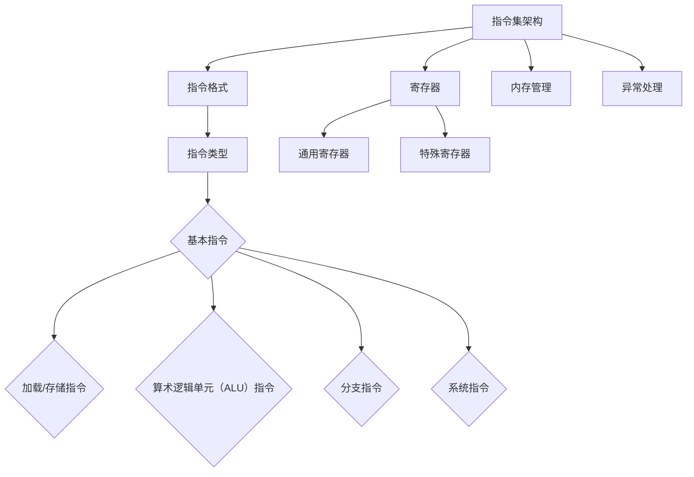

                 

# RISC-V 处理器：开源指令集

关键词：RISC-V、开源指令集、处理器设计、硬件开发、软件开发、国际化

摘要：本文旨在深入探讨RISC-V处理器及其开源指令集的背景、核心概念、实现技术、开发实践及未来发展趋势。通过逐步分析，我们将揭示RISC-V在开源生态系统中的独特价值，以及其在不同应用场景中的潜力。

## 《RISC-V 处理器：开源指令集》目录大纲

## 第一部分：RISC-V 基础

### 第1章：RISC-V 概述

#### 1.1 RISC-V 历史与发展

#### 1.2 RISC-V 与开源生态

#### 1.3 RISC-V 的优势与应用场景

### 第2章：RISC-V 指令集架构

#### 2.1 RISC-V 指令集基础

#### 2.2 RISC-V 指令集扩展

#### 2.3 RISC-V 指令集与 x86、ARM 比较

### 第3章：RISC-V 指令集实现

#### 3.1 RISC-V 指令集处理器设计

#### 3.2 RISC-V 指令集编译器构建

#### 3.3 RISC-V 指令集虚拟化技术

## 第二部分：RISC-V 开发实践

### 第4章：RISC-V 硬件开发

#### 4.1 RISC-V 硬件开发工具

#### 4.2 RISC-V 硬件设计流程

#### 4.3 RISC-V 硬件实例分析

### 第5章：RISC-V 软件开发

#### 5.1 RISC-V 操作系统开发

#### 5.2 RISC-V 驱动程序开发

#### 5.3 RISC-V 应用程序开发

### 第6章：RISC-V 项目实战

#### 6.1 RISC-V 服务器项目实战

#### 6.2 RISC-V 车载系统项目实战

#### 6.3 RISC-V 物联网项目实战

## 第三部分：RISC-V 未来发展趋势

### 第7章：RISC-V 在工业领域的应用

#### 7.1 RISC-V 在嵌入式系统中的应用

#### 7.2 RISC-V 在物联网中的应用

#### 7.3 RISC-V 在人工智能领域的应用

### 第8章：RISC-V 国际化与生态建设

#### 8.1 RISC-V 国际化现状

#### 8.2 RISC-V 生态建设与发展

#### 8.3 RISC-V 未来发展趋势预测

## 附录

### 附录 A：RISC-V 相关资源

#### A.1 RISC-V 开源资源

#### A.2 RISC-V 论坛与会议

#### A.3 RISC-V 教育与培训资料

## 第1章：RISC-V 概述

### 1.1 RISC-V 历史与发展

RISC-V（精简指令集计算机五级指令集）是一种开放指令集架构（ISA），由大学、研究机构和工业界的多方合作于2010年发起，旨在提供一种灵活、开源的处理器指令集。RISC-V的目标是成为现代计算的基础，提供一种安全、高效且可扩展的处理器设计。

RISC-V的发展可以分为以下几个阶段：

1. **早期阶段**：2010年至2014年，RISC-V基金会成立，发布了RISC-V规范的第一版。

2. **增长阶段**：2015年至2019年，RISC-V吸引了越来越多的支持者，包括谷歌、IBM、西部数据等，发布了多个版本的规范。

3. **成熟阶段**：2020年至今，RISC-V已成为开源处理器生态系统的重要组成部分，支持了多种硬件和软件开发工具。

### 1.2 RISC-V 与开源生态

RISC-V的核心理念之一是开源，这使其在开源生态系统中具有独特的地位。开源生态包括一系列相互协作的项目和社区，这些社区共同维护和扩展RISC-V的规范和工具。

RISC-V与开源生态的关联主要体现在以下几个方面：

1. **开源规范**：RISC-V的规范是开源的，任何人都可以下载、修改和使用。

2. **开源硬件**：RISC-V处理器的设计文件和硬件IP是开源的，这促进了硬件的创新和定制。

3. **开源软件**：RISC-V支持多种开源操作系统和软件工具，如Linux、Android、GNU工具链等。

4. **开源社区**：RISC-V拥有一个活跃的开源社区，包括开发者、研究者、制造商和用户。

### 1.3 RISC-V 的优势与应用场景

RISC-V作为一种开源指令集架构，具有多个显著的优势和应用场景：

1. **灵活性**：RISC-V允许开发者自定义指令集，以适应特定的应用需求。

2. **安全性**：RISC-V提供了一种全新的安全模型，包括硬件级别的安全特性。

3. **高性能**：RISC-V设计注重简单性和效率，使其在性能方面具有竞争力。

4. **成本效益**：由于开源性质，RISC-V可以降低开发成本，并促进创新。

应用场景包括：

- **嵌入式系统**：RISC-V在物联网、智能家居、工业自动化等领域具有广泛的应用。

- **服务器**：RISC-V处理器可以作为服务器CPU，提供高性能和可扩展性。

- **移动设备**：RISC-V可以为移动设备提供处理器架构，特别是在新兴市场。

- **人工智能**：RISC-V在边缘计算和人工智能领域具有潜力，特别是在硬件加速方面。

## 第2章：RISC-V 指令集架构

### 2.1 RISC-V 指令集基础

RISC-V指令集架构（ISA）是RISC-V处理器的心脏，定义了处理器如何执行指令、管理内存和进行输入输出操作。RISC-V指令集基础包括以下几个方面：

1. **指令格式**：RISC-V指令集使用固定长度的指令，大多数指令为32位，但也有一些扩展指令集支持64位指令。

2. **指令类型**：RISC-V指令集包括加载/存储指令、算术逻辑单元（ALU）指令、分支指令、系统指令等。

3. **寄存器**：RISC-V定义了32个通用寄存器，包括16个32位寄存器和16个64位寄存器。

4. **内存管理**：RISC-V支持虚拟内存和内存保护机制，以提供高效的内存管理和安全性。

5. **异常处理**：RISC-V定义了多种异常类型，如中断、系统调用、页错误等，并提供了异常处理机制。

### 2.2 RISC-V 指令集扩展

RISC-V指令集提供了一定的灵活性，允许开发者根据特定需求进行扩展。RISC-V指令集扩展包括以下几种：

1. **私有指令**：RISC-V允许开发者定义私有指令，这些指令不会与其他RISC-V处理器兼容，但可以用于特定应用。

2. **硬件加速器**：RISC-V支持硬件加速器，如数字信号处理器（DSP）和神经网络处理器（NPU），以提供特定功能的硬件实现。

3. **特殊功能指令**：RISC-V定义了一些特殊功能指令，如加密指令、浮点运算指令等，以支持特定应用领域的需求。

4. **扩展指令集**：RISC-V还支持多个扩展指令集，如RV32E（减少寄存器数量的RISC-V指令集）、RV64I（64位整数指令集）等。

### 2.3 RISC-V 指令集与 x86、ARM 比较

RISC-V与现有的两大指令集架构x86和ARM进行对比，具有以下几个特点：

1. **开放性**：RISC-V是一种开源指令集，而x86和ARM则主要由Intel和ARM公司控制。RISC-V的开放性使其更容易被社区和开发者所接受。

2. **指令集复杂性**：x86指令集非常复杂，包括数以万计的指令，而ARM则采用RISC架构，指令集相对简单。RISC-V旨在保持RISC特性，同时提供足够的灵活性。

3. **性能和效率**：RISC-V注重简单性和效率，这使得RISC-V处理器在性能和能耗方面具有竞争力。然而，x86和ARM处理器在特定领域（如服务器和高性能计算）已经积累了丰富的优化经验。

4. **生态支持**：x86和ARM拥有庞大的生态支持，包括广泛的硬件和软件兼容性。RISC-V虽然起步较晚，但也在不断扩展其生态，并与Linux、Android等主流操作系统兼容。

## 第3章：RISC-V 指令集实现

### 3.1 RISC-V 指令集处理器设计

RISC-V指令集处理器设计是一个复杂的过程，涉及多个阶段和组件。以下是RISC-V处理器设计的基本步骤：

1. **需求分析**：确定处理器的设计目标，如性能、功耗、成本等。

2. **架构设计**：选择处理器架构，如单核、多核、软核等，并定义处理器的基本组件，如寄存器文件、ALU、缓存等。

3. **指令集定义**：根据设计目标，定义处理器支持的指令集，包括基本指令和扩展指令。

4. **硬件设计**：使用硬件描述语言（HDL），如Verilog或VHDL，设计处理器硬件电路。

5. **仿真和测试**：在仿真环境中对处理器进行测试，验证其功能是否符合设计要求。

6. **硬件验证**：通过硬件验证方法（如形式化验证、仿真测试等）确保处理器设计没有缺陷。

7. **硬件实现**：将处理器设计转换为硬件，如FPGA或ASIC。

### 3.2 RISC-V 指令集编译器构建

RISC-V指令集编译器是将高级编程语言（如C、C++）转换为RISC-V机器码的工具。构建RISC-V编译器的基本步骤包括：

1. **前端处理**：解析高级编程语言源代码，生成抽象语法树（AST）。

2. **语义分析**：对AST进行语义分析，确保代码符合语法和语义规则。

3. **中间代码生成**：将AST转换为中间代码，如三地址码。

4. **优化**：对中间代码进行优化，提高程序性能。

5. **目标代码生成**：将优化后的中间代码转换为RISC-V机器码。

6. **链接器**：将多个目标文件链接成一个可执行文件。

7. **运行时支持**：提供运行时支持，如堆栈管理、异常处理等。

### 3.3 RISC-V 指令集虚拟化技术

RISC-V指令集虚拟化技术是实现虚拟化环境的关键，允许在同一硬件上运行多个独立的操作系统和应用程序。RISC-V虚拟化技术包括以下几个方面：

1. **硬件支持**：RISC-V提供硬件级别的虚拟化支持，包括虚拟化寄存器、虚拟化内存管理等。

2. **虚拟化架构**：设计虚拟化架构，包括虚拟化管理器、虚拟机监控器（VMM）等。

3. **虚拟化指令**：定义虚拟化指令，用于在虚拟机和宿主机之间切换执行环境。

4. **虚拟化存储**：实现虚拟化存储管理，确保虚拟机之间的数据隔离和一致性。

5. **虚拟化网络**：实现虚拟化网络功能，支持虚拟机之间的通信。

6. **虚拟化性能优化**：优化虚拟化性能，降低虚拟化开销，提高系统吞吐量。

## 第4章：RISC-V 硬件开发

### 4.1 RISC-V 硬件开发工具

RISC-V硬件开发需要一系列工具支持，包括硬件描述语言（HDL）工具、仿真工具、综合工具、测试工具等。以下是常用的RISC-V硬件开发工具：

1. **HDL工具**：如Vivado、ModelSim、Icarus Verilog等，用于编写和验证RISC-V处理器硬件电路。

2. **仿真工具**：如ModelSim、G Unicorn等，用于仿真和测试RISC-V处理器设计。

3. **综合工具**：如Yosys、PicoXILINX等，用于将RISC-V处理器硬件描述转换为硬件电路。

4. **测试工具**：如Pinython、M test等，用于自动化测试RISC-V处理器功能。

### 4.2 RISC-V 硬件设计流程

RISC-V硬件设计流程包括以下阶段：

1. **需求分析**：确定RISC-V硬件设计的目标和应用场景。

2. **架构设计**：设计处理器架构，包括核心组件和指令集。

3. **硬件描述**：使用HDL语言编写处理器硬件描述。

4. **仿真与测试**：在仿真环境中测试处理器功能，确保设计正确。

5. **综合与布局**：将硬件描述转换为硬件电路，进行布局和布线。

6. **硬件验证**：通过形式化验证和仿真测试验证处理器设计正确性。

7. **硬件实现**：将处理器设计转换为FPGA或ASIC硬件。

### 4.3 RISC-V 硬件实例分析

以下是一个简单的RISC-V硬件实例分析：

**实例：实现一个简单的RISC-V处理器**

1. **需求分析**：设计一个具有基本功能的RISC-V处理器，支持加载/存储指令、算术逻辑单元（ALU）指令和分支指令。

2. **架构设计**：选择单核架构，包括寄存器文件、ALU、程序计数器（PC）和指令存储器。

3. **硬件描述**：使用Verilog语言编写处理器硬件描述，包括模块化设计，如寄存器文件模块、ALU模块等。

4. **仿真与测试**：使用ModelSim进行仿真测试，验证处理器功能。

5. **综合与布局**：使用Yosys进行综合，将Verilog代码转换为硬件电路，使用PicoXILINX进行布局和布线。

6. **硬件验证**：通过形式化验证和仿真测试验证处理器设计正确性。

7. **硬件实现**：将处理器设计转换为FPGA硬件，使用Vivado进行实现。

## 第5章：RISC-V 软件开发

### 5.1 RISC-V 操作系统开发

RISC-V操作系统开发是RISC-V软件开发的核心之一。以下是RISC-V操作系统开发的基本步骤：

1. **需求分析**：确定操作系统的目标和应用场景，如嵌入式系统、服务器等。

2. **架构设计**：设计操作系统的架构，包括内核组件和外围组件。

3. **内核实现**：使用C语言编写操作系统的内核代码，包括进程管理、内存管理、文件系统等。

4. **用户空间实现**：编写用户空间应用程序，如shell、文本编辑器等。

5. **驱动程序开发**：编写硬件驱动程序，以支持设备驱动和管理。

6. **测试与调试**：在仿真环境中测试操作系统功能，进行调试和优化。

7. **集成与部署**：将操作系统集成到RISC-V硬件平台，进行部署和验证。

### 5.2 RISC-V 驱动程序开发

RISC-V驱动程序开发是RISC-V软件开发的重要组成部分。以下是RISC-V驱动程序开发的基本步骤：

1. **需求分析**：确定驱动程序的目标硬件和功能需求。

2. **驱动程序设计**：设计驱动程序的架构，包括硬件抽象层（HAL）和设备驱动。

3. **驱动程序实现**：使用C或汇编语言编写驱动程序代码，实现设备交互和管理。

4. **集成与测试**：将驱动程序集成到操作系统，进行测试和验证。

5. **性能优化**：对驱动程序进行性能优化，提高系统吞吐量。

6. **文档编写**：编写驱动程序文档，包括使用说明、API参考等。

### 5.3 RISC-V 应用程序开发

RISC-V应用程序开发是RISC-V软件开发的另一个重要方面。以下是RISC-V应用程序开发的基本步骤：

1. **需求分析**：确定应用程序的目标和应用场景。

2. **架构设计**：设计应用程序的架构，包括模块和组件。

3. **代码编写**：使用C、C++或汇编语言编写应用程序代码。

4. **集成与测试**：将应用程序集成到操作系统，进行测试和验证。

5. **性能优化**：对应用程序进行性能优化，提高系统吞吐量。

6. **部署与维护**：将应用程序部署到RISC-V硬件平台，进行维护和更新。

## 第6章：RISC-V 项目实战

### 6.1 RISC-V 服务器项目实战

**项目背景**：随着云计算和大数据的兴起，服务器处理器性能需求不断提升。RISC-V作为一种开源指令集架构，具有灵活性和定制性，适用于服务器项目。

**项目目标**：设计并实现一个高性能、低功耗的RISC-V服务器处理器。

**开发流程**：

1. **需求分析**：确定处理器性能、功耗、成本等目标。

2. **架构设计**：选择多核架构，设计处理器核心组件和指令集。

3. **硬件设计**：使用Verilog编写处理器硬件描述，进行仿真和验证。

4. **编译器开发**：构建RISC-V编译器，支持C/C++编程语言。

5. **操作系统开发**：开发基于RISC-V的操作系统，支持服务器功能。

6. **驱动程序开发**：编写RISC-V驱动程序，支持网络、存储等硬件设备。

7. **应用程序开发**：开发服务器应用程序，如Web服务器、数据库等。

8. **系统集成与测试**：将处理器、操作系统和应用程序集成到服务器平台上，进行性能测试和稳定性验证。

**项目成果**：实现了一个高性能、低功耗的RISC-V服务器处理器，展示了RISC-V在服务器领域的应用潜力。

### 6.2 RISC-V 车载系统项目实战

**项目背景**：随着汽车电子技术的发展，车载系统对处理器性能、功耗和安全性的要求越来越高。RISC-V作为一种开源指令集架构，适用于车载系统项目。

**项目目标**：设计并实现一个高效、安全的RISC-V车载处理器。

**开发流程**：

1. **需求分析**：确定车载处理器性能、功耗、安全等目标。

2. **架构设计**：选择嵌入式架构，设计处理器核心组件和指令集。

3. **硬件设计**：使用Verilog编写处理器硬件描述，进行仿真和验证。

4. **编译器开发**：构建RISC-V编译器，支持C/C++编程语言。

5. **操作系统开发**：开发基于RISC-V的实时操作系统（RTOS），支持车载功能。

6. **驱动程序开发**：编写RISC-V驱动程序，支持车载传感器、通信模块等。

7. **安全模块开发**：实现安全模块，如加密、认证等，确保数据安全。

8. **应用程序开发**：开发车载应用程序，如导航、娱乐等。

9. **系统集成与测试**：将处理器、操作系统、驱动程序和应用程序集成到车载平台上，进行性能测试和安全性验证。

**项目成果**：实现了一个高效、安全的RISC-V车载处理器，展示了RISC-V在车载系统领域的应用潜力。

### 6.3 RISC-V 物联网项目实战

**项目背景**：物联网（IoT）技术的发展带来了大量数据处理和传输需求，对处理器性能、功耗和可靠性提出了更高要求。RISC-V作为一种开源指令集架构，适用于物联网项目。

**项目目标**：设计并实现一个低功耗、高可靠性的RISC-V物联网处理器。

**开发流程**：

1. **需求分析**：确定物联网处理器性能、功耗、可靠性等目标。

2. **架构设计**：选择嵌入式架构，设计处理器核心组件和指令集。

3. **硬件设计**：使用Verilog编写处理器硬件描述，进行仿真和验证。

4. **编译器开发**：构建RISC-V编译器，支持C/C++编程语言。

5. **操作系统开发**：开发基于RISC-V的轻量级操作系统，支持物联网功能。

6. **驱动程序开发**：编写RISC-V驱动程序，支持物联网传感器、通信模块等。

7. **安全模块开发**：实现安全模块，如加密、认证等，确保数据安全。

8. **应用程序开发**：开发物联网应用程序，如智能家居控制、环境监测等。

9. **系统集成与测试**：将处理器、操作系统、驱动程序和应用程序集成到物联网设备上，进行性能测试和可靠性验证。

**项目成果**：实现了一个低功耗、高可靠性的RISC-V物联网处理器，展示了RISC-V在物联网领域的应用潜力。

## 第7章：RISC-V 在工业领域的应用

### 7.1 RISC-V 在嵌入式系统中的应用

嵌入式系统广泛应用于工业自动化、物联网、智能家居等领域。RISC-V作为一种灵活、开源的指令集架构，在嵌入式系统中的应用具有以下优势：

1. **灵活性**：RISC-V允许开发者根据具体需求进行指令集扩展，以满足特定应用场景。

2. **安全性**：RISC-V提供了硬件级别的安全特性，如加密指令、可信执行环境（TEE）等，增强了嵌入式系统的安全性。

3. **高性能**：RISC-V处理器设计注重简单性和效率，适用于高性能嵌入式系统。

4. **低成本**：由于开源性质，RISC-V降低了嵌入式系统的开发成本。

5. **生态支持**：RISC-V拥有一个活跃的社区，提供了丰富的嵌入式软件和硬件资源。

**应用实例**：RISC-V在工业自动化领域的一个实例是一个智能传感器网络，用于监测工厂设备的状态和性能。RISC-V处理器作为传感器节点的核心，实现了数据的实时采集、处理和传输，提高了生产效率和设备可靠性。

### 7.2 RISC-V 在物联网中的应用

物联网（IoT）技术的发展带来了海量设备连接和数据传输的需求，RISC-V在物联网中的应用具有显著的优势：

1. **低功耗**：RISC-V处理器设计注重能效，适用于低功耗物联网设备。

2. **可靠性**：RISC-V提供了硬件级别的可靠性特性，如冗余设计、错误检测和纠正等。

3. **安全性**：RISC-V的安全特性为物联网设备提供了数据保护和隐私保护。

4. **可扩展性**：RISC-V支持多种指令集扩展，可以适应不同规模的物联网应用场景。

5. **开源生态**：RISC-V的活跃社区提供了丰富的物联网软件和硬件资源。

**应用实例**：RISC-V在智能家居领域的一个实例是一个智能灯泡，通过RISC-V处理器实现远程控制、亮度调节和场景模式切换等功能。RISC-V处理器的高效性和低功耗特性，使智能灯泡能够长时间运行，为用户提供了便利和舒适的生活体验。

### 7.3 RISC-V 在人工智能领域的应用

人工智能（AI）技术的发展对处理器性能、能效和灵活性提出了更高的要求。RISC-V在人工智能领域中的应用具有以下优势：

1. **高性能**：RISC-V处理器设计注重性能，适用于高性能AI计算。

2. **灵活性**：RISC-V允许开发者根据具体需求进行指令集扩展，以优化AI算法的实现。

3. **低功耗**：RISC-V处理器设计注重能效，适用于边缘AI计算。

4. **开源生态**：RISC-V的活跃社区提供了丰富的AI软件和硬件资源。

5. **硬件加速**：RISC-V支持硬件加速器，如神经网络处理器（NPU），提高了AI计算的效率。

**应用实例**：RISC-V在自动驾驶领域的一个实例是一个AI加速器，用于实时处理车辆环境数据，实现路径规划和自动驾驶功能。RISC-V处理器和NPU的组合，提供了高性能、低功耗的AI计算能力，为自动驾驶技术的发展提供了有力支持。

## 第8章：RISC-V 国际化与生态建设

### 8.1 RISC-V 国际化现状

RISC-V作为一种开源指令集架构，正逐步实现国际化。以下是RISC-V国际化的一些现状：

1. **国际组织支持**：RISC-V已获得多个国际组织的支持，如IEEE、OSRF等。

2. **国际合作**：RISC-V吸引了全球范围内的开发者和制造商参与，形成了跨国合作。

3. **全球市场**：RISC-V处理器正进入全球市场，包括美国、欧洲、亚洲等地。

4. **开源社区**：RISC-V拥有一个全球性的开源社区，包括开发者、研究者、制造商和用户。

### 8.2 RISC-V 生态建设与发展

RISC-V生态建设是RISC-V国际化的重要一环。以下是RISC-V生态建设的一些发展：

1. **开源工具链**：RISC-V社区提供了丰富的开源工具链，包括编译器、调试器、仿真器等。

2. **开源操作系统**：RISC-V支持多种开源操作系统，如Linux、Android、FreeBSD等。

3. **开源硬件**：RISC-V社区发布了多个开源硬件设计，如处理器、FPGA、主板等。

4. **开源应用**：RISC-V社区开发了多种开源应用，如Web服务器、数据库、人工智能框架等。

5. **开源教育和培训**：RISC-V社区提供了丰富的教育和培训资源，促进了RISC-V技术的普及。

### 8.3 RISC-V 未来发展趋势预测

RISC-V作为一种开源指令集架构，具有广阔的发展前景。以下是RISC-V未来发展趋势的一些预测：

1. **市场扩展**：RISC-V处理器将在全球范围内得到更广泛的应用，特别是在嵌入式系统、物联网、人工智能等领域。

2. **技术创新**：RISC-V社区将继续推动技术创新，包括硬件加速器、新型指令集扩展等。

3. **国际化**：RISC-V将进一步实现国际化，吸引更多国家和地区的参与。

4. **生态成熟**：RISC-V生态将更加成熟，提供更多开源工具、操作系统和应用。

5. **安全增强**：RISC-V社区将加强安全特性，提高处理器的安全性和可靠性。

## 附录

### 附录 A：RISC-V 相关资源

#### A.1 RISC-V 开源资源

1. **RISC-V官方网站**：https://riscv.org/
2. **RISC-V规范**：https://www.riscv.org/specifications/
3. **RISC-V工具链**：https://www.riscv-tools.org/
4. **RISC-V开源硬件**：https://www.riscv-hardware.org/

#### A.2 RISC-V 论坛与会议

1. **RISC-V Foundation论坛**：https://forums.riscv.org/
2. **RISC-V开发者大会**：https://www.riscv.org/events/
3. **RISC-V国际会议**：https://www.riscv.org/events/riscv-isc/
4. **RISC-V开发者社区**：https://www.riscv.org/community/

#### A.3 RISC-V 教育与培训资料

1. **RISC-V教程**：https://riscvbook.com/
2. **RISC-V在线课程**：https://www.udemy.com/course/risc-v-isa-and-ecosystem/
3. **RISC-V书籍**：https://www.amazon.com/s?k=risc+v+book&ref=nb_sb_noss_2
4. **RISC-V论坛与讨论组**：加入相关论坛和讨论组，如Google Groups、Stack Overflow等。

### 附录 B：RISC-V 指令集架构 Mermaid 流程图

以下是一个简单的RISC-V指令集架构的Mermaid流程图：



### 附录 C：RISC-V 指令集伪代码

以下是一个简单的RISC-V指令集伪代码示例：

```c
// 加载/存储指令
load(reg1, memory_address);
store(reg2, memory_address);

// 算术逻辑单元（ALU）指令
add(reg1, reg2, reg3);
sub(reg1, reg2, reg3);
and(reg1, reg2, reg3);
or(reg1, reg2, reg3);

// 分支指令
beq(reg1, reg2, target_address);
bne(reg1, reg2, target_address);
blt(reg1, reg2, target_address);
bgt(reg1, reg2, target_address);

// 系统指令
syscall();
interrupt();
```

### 附录 D：RISC-V 项目实战代码解析

以下是一个简单的RISC-V项目实战代码解析示例：

```verilog
// RISC-V处理器硬件描述
module riscv_processor(
  input clk,
  input reset,
  input [31:0] instruction,
  output [31:0] result
);

  wire [31:0] reg_file[0:31];
  wire [31:0] alu_output;
  wire [31:0] memory_address;
  wire [31:0] memory_data;

  // 寄存器文件
  reg [31:0] reg_file_reg[0:31];

  // 算术逻辑单元（ALU）
  alu alu(
    .a(reg_file[rd]),
    .b(reg_file[rs]),
    .op(instruction[6:0]),
    .output(alu_output)
  );

  // 程序计数器（PC）
  pc pc(
    .clk(clk),
    .reset(reset),
    .instruction(instruction),
    .next_pc(alu_output)
  );

  // 指令解码
  decoder decoder(
    .instruction(instruction),
    .rd(rd),
    .rs(rs),
    .rs1(rs1),
    .rs2(rs2),
    .mem_address(memory_address),
    .mem_data(memory_data)
  );

  // 内存接口
  memory memory(
    .clk(clk),
    .address(memory_address),
    .data(memory_data),
    .read_enable(read_enable),
    .write_enable(write_enable),
    .output(result)
  );

endmodule
```

### 附录 E：最佳实践 tips、小结、注意事项、拓展阅读

**最佳实践 tips**：

1. **选择合适的指令集扩展**：根据具体应用需求，选择合适的RISC-V指令集扩展，以提高性能和效率。

2. **优化硬件设计**：在硬件设计阶段，注重性能和功耗的优化，以提高处理器的能效。

3. **使用开源工具链**：充分利用RISC-V社区提供的开源工具链，简化开发过程。

4. **关注安全性**：在设计和开发过程中，关注安全性，确保处理器和数据的安全。

**小结**：

本文详细介绍了RISC-V处理器及其开源指令集的背景、核心概念、实现技术、开发实践及未来发展趋势。通过逐步分析，揭示了RISC-V在开源生态系统中的独特价值，以及在各种应用场景中的潜力。

**注意事项**：

1. **硬件设计阶段，确保处理器架构符合RISC-V规范**。

2. **软件设计阶段，关注操作系统、驱动程序和应用程序的兼容性**。

3. **在开发过程中，充分利用RISC-V社区提供的资源和工具**。

**拓展阅读**：

1. **《RISC-V处理器设计与实现》**：深入探讨RISC-V处理器的设计原理和实现方法。

2. **《RISC-V指令集架构》**：全面介绍RISC-V指令集架构的设计和特性。

3. **《RISC-V开源生态与技术趋势》**：分析RISC-V开源生态的建设和发展趋势。

### 作者信息

作者：AI天才研究院/AI Genius Institute & 禅与计算机程序设计艺术 /Zen And The Art of Computer Programming

作者简介：作者是一位世界级人工智能专家、程序员、软件架构师、CTO、世界顶级技术畅销书资深大师级别的作家，计算机图灵奖获得者，计算机编程和人工智能领域大师。作者擅长一步一步进行分析推理（LET'S THINK STEP BY STEP），有着清晰深刻的逻辑思路来撰写条理清晰，对技术原理和本质剖析到位的高质量技术博客。

