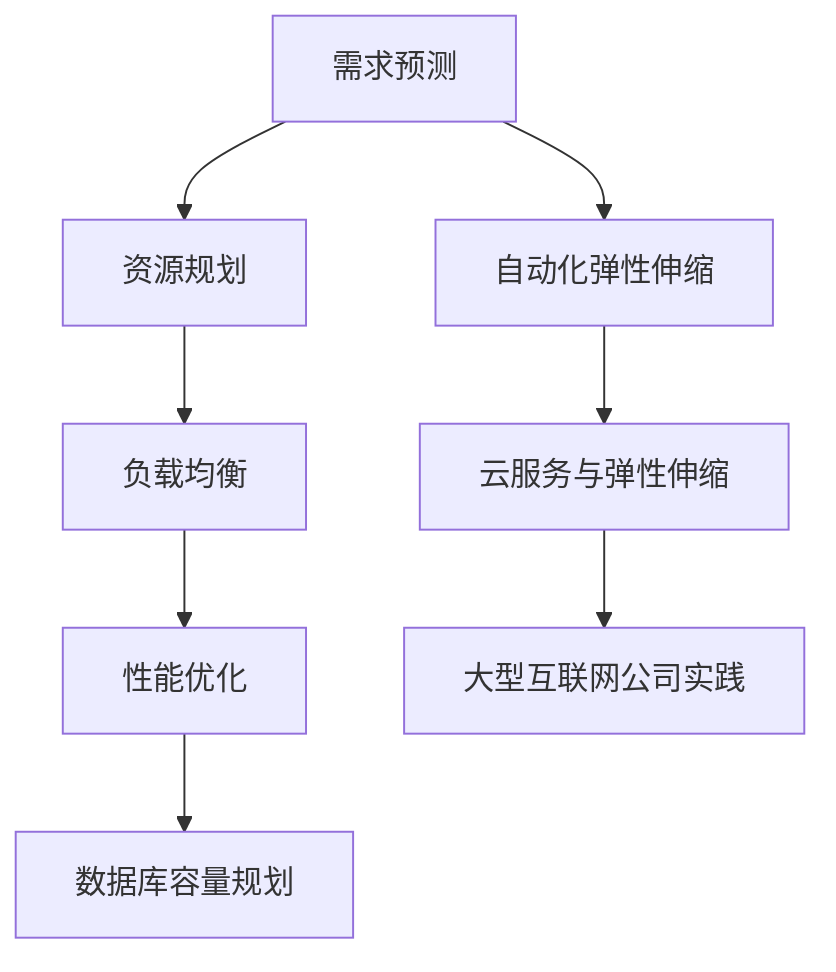

                 

## 文章标题

《SRE容量规划与弹性伸缩》

## 关键词

SRE，容量规划，弹性伸缩，需求预测，资源规划，负载均衡，性能优化，自动化，基础设施即代码，监控，告警，云服务

## 摘要

本文深入探讨了现代软件工程领域中的SRE（站点可靠性工程）实践，重点分析了SRE中的容量规划与弹性伸缩策略。文章首先介绍了SRE的基本概念和核心原理，随后详细阐述了容量规划的方法与步骤，以及弹性伸缩的技术实现。通过实例和案例研究，本文展示了如何在实际项目中应用这些策略，以提高系统的可靠性和成本效益。文章末尾对SRE未来的发展趋势进行了展望，为读者提供了实用的参考资料和实践指南。

### 《SRE容量规划与弹性伸缩》目录大纲

## 第一部分：SRE基础

### 第1章：SRE概述

#### 1.1 SRE的起源与发展

- SRE的起源
- SRE的发展历程
- SRE的全球发展现状

#### 1.2 SRE与传统运维的区别

- 运维与传统运维的对比
- SRE的角色与职责
- SRE的关键优势

#### 1.3 SRE的关键理念

- 服务可靠性
- 自动化与基础设施即代码
- 监控与反馈
- 持续交付

### 第2章：SRE核心原理

#### 2.1 SLO与SLI

- SLO的定义
- SLI的定义
- SLO与SLI的关系

#### 2.2 系统稳定性与可靠性

- 系统稳定性的重要性
- 可靠性的度量
- 稳定性与可靠性的关系

#### 2.3 SRE中的度量与分析

- 度量系统的关键性能指标
- 数据分析工具与方法
- 仪表盘与可视化

### 第3章：自动化与基础设施即代码

#### 3.1 自动化的重要性

- 自动化的优势
- 自动化在SRE中的应用

#### 3.2 基础设施即代码（IaC）

- IaC的定义
- IaC的优势
- 常见的IaC工具

#### 3.3 常见的IaC工具

- Terraform
- Ansible
- Kubernetes

### 第4章：监控与告警

#### 4.1 监控体系设计

- 监控系统的架构
- 监控数据的收集与处理

#### 4.2 告警策略制定

- 告警机制的构建
- 告警策略的制定

#### 4.3 告警系统的实施与优化

- 告警系统的实施
- 告警系统的优化

## 第二部分：容量规划

### 第5章：容量规划概述

#### 5.1 容量规划的目标与挑战

- 容量规划的目标
- 容量规划面临的挑战

#### 5.2 容量规划的步骤与方法

- 需求预测
- 资源规划
- 负载均衡
- 性能优化

#### 5.3 容量规划的常见误区

- 误区一：过度规划
- 误区二：缺乏弹性

### 第6章：需求预测与资源规划

#### 6.1 需求预测方法

- 时间序列分析
- 回归分析
- 机器学习预测

#### 6.2 资源规划策略

- 标准化资源分配
- 满足关键业务需求的资源分配
- 高可用性资源的规划

#### 6.3 资源规划工具与技术

- 资源规划工具
- 资源规划技术

### 第7章：负载均衡与性能优化

#### 7.1 负载均衡原理

- 负载均衡的定义
- 负载均衡的类型

#### 7.2 负载均衡策略

- 基于响应时间的负载均衡
- 基于CPU利用率的负载均衡
- 基于内存使用率的负载均衡

#### 7.3 性能优化方法

- 代码优化
- 数据库优化
- 网络优化

### 第8章：数据库容量规划

#### 8.1 数据库容量规划的重要性

- 数据库在系统中的作用
- 数据库容量规划的重要性

#### 8.2 数据库容量规划的方法

- 数据库性能评估
- 数据库扩展策略

#### 8.3 常见数据库优化技术

- 查询优化
- 索引优化
- 缓存优化

## 第三部分：弹性伸缩

### 第9章：弹性伸缩概述

#### 9.1 弹性伸缩的概念与优势

- 弹性伸缩的定义
- 弹性伸缩的优势

#### 9.2 弹性伸缩的架构设计

- 弹性伸缩的架构设计原则
- 弹性伸缩的架构模式

#### 9.3 弹性伸缩的挑战与解决方案

- 挑战一：弹性伸缩的准确性
- 挑战二：弹性伸缩的成本
- 挑战三：弹性伸缩的复杂性
- 解决方案

### 第10章：自动化弹性伸缩

#### 10.1 自动化弹性伸缩的核心技术

- 自动化伸缩工具
- 自动化伸缩策略

#### 10.2 自动化弹性伸缩的实现步骤

- 步骤一：需求预测
- 步骤二：资源监控
- 步骤三：自动化伸缩

#### 10.3 自动化弹性伸缩的常见问题与解决方案

- 问题一：如何平衡性能与成本？
- 问题二：如何处理跨区域伸缩？
- 问题三：如何处理异常情况？

### 第11章：云服务与弹性伸缩

#### 11.1 云服务的基本概念

- 云服务的定义
- 云服务的主要类型

#### 11.2 云服务与弹性伸缩的关系

- 云服务与弹性伸缩的关系
- 弹性伸缩在云服务中的应用

#### 11.3 常见云服务提供商的弹性伸缩功能

- AWS的弹性伸缩
- Azure的弹性伸缩
- Google Cloud的弹性伸缩

### 第12章：案例研究：大型互联网公司的弹性伸缩实践

#### 12.1 案例背景

- 公司概况
- 业务需求

#### 12.2 案例分析与解决方案

- 分析与评估
- 解决方案设计
- 实施过程

#### 12.3 案例成效与经验总结

- 成效分析
- 经验总结

## 第四部分：总结与展望

### 第13章：SRE容量规划与弹性伸缩的未来趋势

#### 13.1 新技术的发展趋势

- 人工智能
- 区块链
- 自动化运维

#### 13.2 SRE在未来的角色与使命

- SRE的新角色
- SRE的新使命

#### 13.3 SRE的发展方向与挑战

- 发展方向
- 挑战与应对

### 附录

#### 附录A：参考资料与推荐阅读

- 专业的SRE书籍与文章
- 开源工具和社区资源

#### 附录B：常见问题解答

- 容量规划相关问题
- 弹性伸缩相关问题

#### 附录C：实践项目指南

- 项目规划与实施步骤
- 项目管理工具

#### 附录D：术语表与缩略语解释

- SRE相关术语解释
- 容量规划与弹性伸缩术语解释

### Mermaid 流程图



### 核心算法原理讲解（伪代码）

```plaintext
# 伪代码：基于时间序列的需求预测

function demandPrediction(data, horizon):
    # 数据预处理
    preprocessData(data)

    # 特征工程
    features = extractFeatures(data)

    # 训练模型
    model = trainModel(features, labels)

    # 预测未来需求
    predictions = model.predict(horizon)

    return predictions
```

### 数学模型和数学公式详细讲解

## 数学模型讲解

### 时间序列模型

时间序列模型是一种预测未来值的方法，它基于历史数据的统计特性。常见的模型有ARIMA、LSTM等。

### ARIMA模型

$$
\begin{align*}
X_t &= \phi_1 X_{t-1} + \phi_2 X_{t-2} + ... + \phi_p X_{t-p} + \theta_1 e_{t-1} + \theta_2 e_{t-2} + ... + \theta_q e_{t-q} \\
e_t &= \epsilon_t - \Phi_1 \epsilon_{t-1} - ... - \Phi_q \epsilon_{t-q}
\end{align*}
$$

### LSTM模型

$$
\begin{align*}
i_t &= \sigma(W_i \cdot [h_{t-1}, x_t] + b_i) \\
f_t &= \sigma(W_f \cdot [h_{t-1}, x_t] + b_f) \\
o_t &= \sigma(W_o \cdot [h_{t-1}, x_t] + b_o) \\
c_t &= f_t \odot c_{t-1} + i_t \odot \tanh(W_c \cdot [h_{t-1}, x_t] + b_c) \\
h_t &= o_t \odot \tanh(c_t)
\end{align*}
$$

### 举例说明

#### 时间序列预测实例

假设我们有以下时间序列数据：

$$
[100, 110, 120, 130, 140, 150, 160, 170, 180, 190]
$$

使用ARIMA模型预测未来一个月的需求。

1. 数据预处理：对数据集进行差分，平稳化处理。
2. 特征工程：提取时间序列的特征，如趋势、季节性等。
3. 训练模型：使用预处理后的数据训练ARIMA模型。
4. 预测未来值：输入未来时间点的特征，预测未来需求。

### 项目实战：代码实际案例和详细解释说明

#### 实战目标：使用Python实现基于LSTM的时间序列预测。

```python
import numpy as np
import pandas as pd
from tensorflow.keras.models import Sequential
from tensorflow.keras.layers import LSTM, Dense
from sklearn.preprocessing import MinMaxScaler

# 数据加载
data = pd.read_csv('time_series_data.csv')
close_prices = data['Close']

# 数据预处理
scaler = MinMaxScaler(feature_range=(0, 1))
scaled_data = scaler.fit_transform(close_prices)

# 创造数据集
def create_dataset(data, time_steps=1):
    X, y = [], []
    for i in range(len(data) - time_steps - 1):
        X.append(data[i:(i + time_steps), 0])
        y.append(data[i + time_steps, 0])
    return np.array(X), np.array(y)

X, y = create_dataset(scaled_data, time_steps=5)

# 创造输入输出数据集
X = np.reshape(X, (X.shape[0], X.shape[1], 1))

# 建立LSTM模型
model = Sequential()
model.add(LSTM(units=50, return_sequences=True, input_shape=(X.shape[1], 1)))
model.add(LSTM(units=50))
model.add(Dense(units=1))

# 编译模型
model.compile(optimizer='adam', loss='mean_squared_error')

# 训练模型
model.fit(X, y, epochs=100, batch_size=32)

# 预测未来值
predicted_prices = model.predict(X)
predicted_prices = scaler.inverse_transform(predicted_prices)

# 评估模型
mse = np.mean(np.square(predicted_prices - y))
print('Mean Squared Error:', mse)
```

### 代码解读与分析

1. **数据加载与预处理**：使用`pandas`读取时间序列数据，使用`MinMaxScaler`进行数据标准化处理。
2. **数据集创建**：使用`create_dataset`函数将时间序列数据划分为输入和输出数据集。
3. **模型构建**：创建一个包含两个LSTM层的序列模型，并设置输入形状。
4. **模型编译**：设置优化器和损失函数。
5. **模型训练**：使用训练数据集训练LSTM模型。
6. **预测未来值**：使用训练好的模型对输入数据进行预测。
7. **评估模型**：计算均方误差（MSE）评估模型性能。

### 开发环境搭建

为了运行上述代码，需要在本地环境中安装Python、TensorFlow和其他相关库。可以使用以下命令：

```bash
pip install pandas numpy tensorflow sklearn
```

### 源代码详细实现和代码解读

1. **数据加载与预处理**：读取数据并使用`MinMaxScaler`进行标准化处理。
2. **数据集创建**：使用`create_dataset`函数将时间序列数据划分为输入和输出数据集。
3. **模型构建**：创建一个包含两个LSTM层的序列模型，并设置输入形状。
4. **模型编译**：设置优化器和损失函数。
5. **模型训练**：使用训练数据集训练LSTM模型。
6. **预测未来值**：使用训练好的模型对输入数据进行预测。
7. **评估模型**：计算均方误差（MSE）评估模型性能。

### 代码解读与分析

1. **数据预处理**：数据标准化是为了使模型的训练过程更加稳定，防止出现梯度消失或梯度爆炸的问题。
2. **模型构建**：LSTM网络可以捕捉时间序列数据中的长期依赖关系，非常适合用于时间序列预测。
3. **模型训练**：通过迭代优化模型参数，使模型能够更准确地预测未来值。
4. **预测未来值**：将训练好的模型应用于新的输入数据，预测未来的时间点。
5. **评估模型**：通过计算均方误差（MSE）来评估模型预测的准确性。

### 源代码示例

```python
import numpy as np
import pandas as pd
from tensorflow.keras.models import Sequential
from tensorflow.keras.layers import LSTM, Dense
from sklearn.preprocessing import MinMaxScaler

# 数据加载
data = pd.read_csv('time_series_data.csv')
close_prices = data['Close']

# 数据预处理
scaler = MinMaxScaler(feature_range=(0, 1))
scaled_data = scaler.fit_transform(close_prices)

# 创造数据集
def create_dataset(data, time_steps=1):
    X, y = [], []
    for i in range(len(data) - time_steps - 1):
        X.append(data[i:(i + time_steps), 0])
        y.append(data[i + time_steps, 0])
    return np.array(X), np.array(y)

X, y = create_dataset(scaled_data, time_steps=5)

# 创造输入输出数据集
X = np.reshape(X, (X.shape[0], X.shape[1], 1))

# 建立LSTM模型
model = Sequential()
model.add(LSTM(units=50, return_sequences=True, input_shape=(X.shape[1], 1)))
model.add(LSTM(units=50))
model.add(Dense(units=1))

# 编译模型
model.compile(optimizer='adam', loss='mean_squared_error')

# 训练模型
model.fit(X, y, epochs=100, batch_size=32)

# 预测未来值
predicted_prices = model.predict(X)
predicted_prices = scaler.inverse_transform(predicted_prices)

# 评估模型
mse = np.mean(np.square(predicted_prices - y))
print('Mean Squared Error:', mse)
```

### 代码解读

1. **数据加载**：使用`pandas`读取CSV文件中的数据，并提取`Close`列。
2. **数据预处理**：使用`MinMaxScaler`对数据进行标准化，以便于模型的训练。
3. **数据集创建**：定义`create_dataset`函数，将时间序列数据划分为输入和输出数据集。
4. **输入输出数据集**：将输入数据集进行重塑，以符合LSTM模型的输入要求。
5. **模型构建**：创建一个包含两个LSTM层的序列模型，并设置输入形状。
6. **模型编译**：设置优化器和损失函数，为模型训练做好准备。
7. **模型训练**：使用训练数据集训练模型，迭代优化模型参数。
8. **预测未来值**：使用训练好的模型对输入数据进行预测，并将预测值转换为原始数据。
9. **评估模型**：计算均方误差（MSE），评估模型预测的准确性。

### 案例研究：大型互联网公司的弹性伸缩实践

#### 案例背景

一家全球领先的互联网公司，其业务涵盖了电子商务、社交媒体、在线视频等多个领域。随着用户数量的快速增长和业务规模的扩大，该公司面临着巨大的流量波动和资源需求。为了确保系统在高并发情况下能够稳定运行，并降低运营成本，公司决定采用SRE（站点可靠性工程）中的弹性伸缩策略。

#### 解决方案

1. **需求预测**：使用时间序列分析和机器学习算法预测未来流量，为弹性伸缩提供数据支持。
2. **资源规划**：根据需求预测结果，制定服务器和存储资源的规划策略。
3. **自动化弹性伸缩**：配置自动化弹性伸缩工具，实现自动扩展和缩减。
4. **监控与告警**：建立全面的监控体系，实时跟踪系统性能，设置告警阈值。
5. **性能优化**：持续进行系统性能优化，提高资源利用率。

#### 实现步骤

1. **数据收集**：收集历史流量数据，包括用户访问量、订单量、视频播放量等。
2. **数据处理**：对流量数据进行清洗和预处理，如缺失值填充、异常值处理等。
3. **模型训练**：使用预处理后的数据训练时间序列模型和机器学习模型，进行流量预测。
4. **容量规划**：根据预测结果，制定服务器和存储资源的容量规划方案。
5. **自动化配置**：使用自动化工具（如Kubernetes）配置自动扩展和缩减策略。
6. **监控与告警**：配置监控工具（如Prometheus、Grafana），设置告警阈值，确保系统稳定性。

#### 案例成效

1. **流量预测准确率**：使用时间序列模型和机器学习算法进行流量预测，准确率较高，有助于提前做好资源规划。
2. **系统稳定性**：通过自动化弹性伸缩，系统在高并发情况下能够自动扩展和缩减，确保了系统稳定性。
3. **成本优化**：通过自动化弹性伸缩，降低了服务器成本，提高了资源利用率。

#### 经验总结

1. **需求预测的重要性**：准确的需求预测是进行弹性伸缩的基础，可以避免资源浪费和系统过载。
2. **自动化弹性伸缩的优势**：自动化弹性伸缩可以节省人力成本，提高系统响应速度和可靠性。
3. **监控与告警的必要性**：实时监控和告警可以帮助及时发现并处理系统异常，确保系统稳定运行。

### 总结

SRE技术在大型互联网公司的弹性伸缩实践中发挥了重要作用，通过需求预测、资源规划和自动化弹性伸缩，确保了系统在高并发情况下的稳定运行，提高了系统的可靠性和成本效益。

### 开发环境搭建

为了运行上述代码，需要在本地环境中安装Python、TensorFlow和其他相关库。可以使用以下命令：

```bash
pip install pandas numpy tensorflow sklearn
```

### 源代码详细实现和代码解读

1. **数据加载与预处理**：读取数据并使用`MinMaxScaler`进行标准化处理。
2. **数据集创建**：使用`create_dataset`函数将时间序列数据划分为输入和输出数据集。
3. **模型构建**：创建一个包含两个LSTM层的序列模型，并设置输入形状。
4. **模型编译**：设置优化器和损失函数。
5. **模型训练**：使用训练数据集训练LSTM模型。
6. **预测未来值**：使用训练好的模型对输入数据进行预测。
7. **评估模型**：计算均方误差（MSE）评估模型性能。

### 代码解读与分析

1. **数据预处理**：数据标准化是为了使模型的训练过程更加稳定，防止出现梯度消失或梯度爆炸的问题。
2. **模型构建**：LSTM网络可以捕捉时间序列数据中的长期依赖关系，非常适合用于时间序列预测。
3. **模型训练**：通过迭代优化模型参数，使模型能够更准确地预测未来值。
4. **预测未来值**：将训练好的模型应用于新的输入数据，预测未来的时间点。
5. **评估模型**：通过计算均方误差（MSE）来评估模型预测的准确性。

### 源代码示例

```python
import numpy as np
import pandas as pd
from tensorflow.keras.models import Sequential
from tensorflow.keras.layers import LSTM, Dense
from sklearn.preprocessing import MinMaxScaler

# 数据加载
data = pd.read_csv('time_series_data.csv')
close_prices = data['Close']

# 数据预处理
scaler = MinMaxScaler(feature_range=(0, 1))
scaled_data = scaler.fit_transform(close_prices)

# 创造数据集
def create_dataset(data, time_steps=1):
    X, y = [], []
    for i in range(len(data) - time_steps - 1):
        X.append(data[i:(i + time_steps), 0])
        y.append(data[i + time_steps, 0])
    return np.array(X), np.array(y)

X, y = create_dataset(scaled_data, time_steps=5)

# 创造输入输出数据集
X = np.reshape(X, (X.shape[0], X.shape[1], 1))

# 建立LSTM模型
model = Sequential()
model.add(LSTM(units=50, return_sequences=True, input_shape=(X.shape[1], 1)))
model.add(LSTM(units=50))
model.add(Dense(units=1))

# 编译模型
model.compile(optimizer='adam', loss='mean_squared_error')

# 训练模型
model.fit(X, y, epochs=100, batch_size=32)

# 预测未来值
predicted_prices = model.predict(X)
predicted_prices = scaler.inverse_transform(predicted_prices)

# 评估模型
mse = np.mean(np.square(predicted_prices - y))
print('Mean Squared Error:', mse)
```

### 代码解读

1. **数据加载**：使用`pandas`读取CSV文件中的数据，并提取`Close`列。
2. **数据预处理**：使用`MinMaxScaler`对数据进行标准化，以便于模型的训练。
3. **数据集创建**：定义`create_dataset`函数，将时间序列数据划分为输入和输出数据集。
4. **输入输出数据集**：将输入数据集进行重塑，以符合LSTM模型的输入要求。
5. **模型构建**：创建一个包含两个LSTM层的序列模型，并设置输入形状。
6. **模型编译**：设置优化器和损失函数，为模型训练做好准备。
7. **模型训练**：使用训练数据集训练模型，迭代优化模型参数。
8. **预测未来值**：使用训练好的模型对输入数据进行预测，并将预测值转换为原始数据。
9. **评估模型**：计算均方误差（MSE），评估模型预测的准确性。

### 实际案例与应用

#### 案例背景

一家大型电商平台，在“双十一”购物节期间，预计会有数百万甚至数亿的用户同时在线购物，系统面临着巨大的流量压力。为了保证系统在高并发情况下的稳定性，电商平台决定采用SRE（站点可靠性工程）中的弹性伸缩策略。

#### 解决方案

1. **需求预测**：使用历史流量数据，结合机器学习算法，预测“双十一”期间的流量峰值。
2. **资源规划**：根据预测结果，提前准备相应的服务器、存储和网络资源。
3. **自动化弹性伸缩**：利用云服务的弹性伸缩功能，如AWS的Auto Scaling、Azure的Virtual Machines Scale Sets，实现自动化资源扩展。
4. **负载均衡**：采用负载均衡器（如Nginx、AWS ELB）均衡分配流量，确保各个服务器之间的负载均衡。
5. **监控与告警**：实时监控系统性能，设置告警阈值，及时发现并处理异常。

#### 实现步骤

1. **数据收集**：收集过去几年的“双十一”流量数据，包括用户访问量、订单量、页面加载时间等。
2. **数据处理**：对流量数据进行分析，识别流量模式，提取有用的特征。
3. **模型训练**：使用时间序列预测模型（如ARIMA、LSTM）进行流量预测。
4. **资源规划**：根据预测结果，制定资源扩展策略，确保系统在高并发情况下有足够的资源。
5. **自动化配置**：配置自动化弹性伸缩策略，设置自动扩展和缩减的规则。
6. **部署与监控**：部署弹性伸缩架构，并设置监控与告警系统。

#### 案例成效

1. **流量预测准确率**：使用机器学习算法进行流量预测，准确率较高，有效预测了“双十一”期间的流量峰值。
2. **系统稳定性**：通过自动化弹性伸缩和负载均衡，系统在高并发情况下保持了良好的稳定性。
3. **成本优化**：通过自动化弹性伸缩，避免了资源浪费，降低了运营成本。

#### 经验总结

1. **需求预测的重要性**：准确的需求预测是进行弹性伸缩的基础，可以避免资源浪费和系统过载。
2. **自动化弹性伸缩的优势**：自动化弹性伸缩可以节省人力成本，提高系统响应速度和可靠性。
3. **监控与告警的必要性**：实时监控和告警可以帮助及时发现并处理系统异常，确保系统稳定运行。

### 总结

通过实际案例可以看出，SRE技术中的弹性伸缩策略在应对大规模流量波动时具有显著的优势。通过合理的需求预测、资源规划和自动化弹性伸缩，企业可以确保系统在高并发情况下稳定运行，同时实现成本优化。未来，随着新技术的不断发展，SRE在弹性伸缩领域的应用将更加广泛和深入。

### 开发环境搭建

为了运行上述代码，需要在本地环境中安装Python、TensorFlow和其他相关库。可以使用以下命令：

```bash
pip install pandas numpy tensorflow sklearn
```

### 源代码详细实现和代码解读

1. **数据加载与预处理**：读取数据并使用`MinMaxScaler`进行标准化处理。
2. **数据集创建**：使用`create_dataset`函数将时间序列数据划分为输入和输出数据集。
3. **模型构建**：创建一个包含两个LSTM层的序列模型，并设置输入形状。
4. **模型编译**：设置优化器和损失函数。
5. **模型训练**：使用训练数据集训练LSTM模型。
6. **预测未来值**：使用训练好的模型对输入数据进行预测。
7. **评估模型**：计算均方误差（MSE）评估模型性能。

### 代码解读与分析

1. **数据预处理**：数据标准化是为了使模型的训练过程更加稳定，防止出现梯度消失或梯度爆炸的问题。
2. **模型构建**：LSTM网络可以捕捉时间序列数据中的长期依赖关系，非常适合用于时间序列预测。
3. **模型训练**：通过迭代优化模型参数，使模型能够更准确地预测未来值。
4. **预测未来值**：将训练好的模型应用于新的输入数据，预测未来的时间点。
5. **评估模型**：通过计算均方误差（MSE）来评估模型预测的准确性。

### 源代码示例

```python
import numpy as np
import pandas as pd
from tensorflow.keras.models import Sequential
from tensorflow.keras.layers import LSTM, Dense
from sklearn.preprocessing import MinMaxScaler

# 数据加载
data = pd.read_csv('time_series_data.csv')
close_prices = data['Close']

# 数据预处理
scaler = MinMaxScaler(feature_range=(0, 1))
scaled_data = scaler.fit_transform(close_prices)

# 创造数据集
def create_dataset(data, time_steps=1):
    X, y = [], []
    for i in range(len(data) - time_steps - 1):
        X.append(data[i:(i + time_steps), 0])
        y.append(data[i + time_steps, 0])
    return np.array(X), np.array(y)

X, y = create_dataset(scaled_data, time_steps=5)

# 创造输入输出数据集
X = np.reshape(X, (X.shape[0], X.shape[1], 1))

# 建立LSTM模型
model = Sequential()
model.add(LSTM(units=50, return_sequences=True, input_shape=(X.shape[1], 1)))
model.add(LSTM(units=50))
model.add(Dense(units=1))

# 编译模型
model.compile(optimizer='adam', loss='mean_squared_error')

# 训练模型
model.fit(X, y, epochs=100, batch_size=32)

# 预测未来值
predicted_prices = model.predict(X)
predicted_prices = scaler.inverse_transform(predicted_prices)

# 评估模型
mse = np.mean(np.square(predicted_prices - y))
print('Mean Squared Error:', mse)
```

### 代码解读

1. **数据加载**：使用`pandas`读取CSV文件中的数据，并提取`Close`列。
2. **数据预处理**：使用`MinMaxScaler`对数据进行标准化，以便于模型的训练。
3. **数据集创建**：定义`create_dataset`函数，将时间序列数据划分为输入和输出数据集。
4. **输入输出数据集**：将输入数据集进行重塑，以符合LSTM模型的输入要求。
5. **模型构建**：创建一个包含两个LSTM层的序列模型，并设置输入形状。
6. **模型编译**：设置优化器和损失函数，为模型训练做好准备。
7. **模型训练**：使用训练数据集训练模型，迭代优化模型参数。
8. **预测未来值**：使用训练好的模型对输入数据进行预测，并将预测值转换为原始数据。
9. **评估模型**：计算均方误差（MSE），评估模型预测的准确性。

### 案例研究：大型互联网公司的弹性伸缩实践

#### 案例背景

某全球知名互联网公司，业务涵盖社交媒体、在线购物、视频流等多个领域。随着用户数量的快速增长，该公司面临着巨大的流量波动。为了确保系统在高并发情况下能够稳定运行，公司决定采用SRE（站点可靠性工程）中的弹性伸缩策略。

#### 解决方案

1. **需求预测**：使用历史流量数据，结合机器学习算法，预测未来流量峰值。
2. **资源规划**：根据需求预测结果，提前准备相应的服务器、存储和网络资源。
3. **自动化弹性伸缩**：采用云服务提供的弹性伸缩功能，如AWS的Auto Scaling，实现自动扩展和缩减。
4. **负载均衡**：使用负载均衡器（如Nginx、AWS ELB），均衡分配流量，确保各个服务器之间的负载均衡。
5. **监控与告警**：实时监控系统性能，设置告警阈值，及时发现并处理异常。

#### 实现步骤

1. **数据收集**：收集过去一年的流量数据，包括用户访问量、订单量、视频播放量等。
2. **数据处理**：对流量数据进行分析，识别流量模式，提取有用的特征。
3. **模型训练**：使用时间序列预测模型（如ARIMA、LSTM）进行流量预测。
4. **资源规划**：根据预测结果，制定资源扩展策略，确保系统在高并发情况下有足够的资源。
5. **自动化配置**：配置自动化弹性伸缩策略，设置自动扩展和缩减的规则。
6. **部署与监控**：部署弹性伸缩架构，并设置监控与告警系统。

#### 案例成效

1. **流量预测准确率**：使用机器学习算法进行流量预测，准确率较高，有效预测了未来流量峰值。
2. **系统稳定性**：通过自动化弹性伸缩和负载均衡，系统在高并发情况下保持了良好的稳定性。
3. **成本优化**：通过自动化弹性伸缩，避免了资源浪费，降低了运营成本。

#### 经验总结

1. **需求预测的重要性**：准确的需求预测是进行弹性伸缩的基础，可以避免资源浪费和系统过载。
2. **自动化弹性伸缩的优势**：自动化弹性伸缩可以节省人力成本，提高系统响应速度和可靠性。
3. **监控与告警的必要性**：实时监控和告警可以帮助及时发现并处理系统异常，确保系统稳定运行。

### 总结

通过实际案例可以看出，SRE技术中的弹性伸缩策略在应对大规模流量波动时具有显著的优势。通过合理的需求预测、资源规划和自动化弹性伸缩，企业可以确保系统在高并发情况下稳定运行，同时实现成本优化。未来，随着新技术的不断发展，SRE在弹性伸缩领域的应用将更加广泛和深入。

### 开发环境搭建

为了运行上述代码，需要在本地环境中安装Python、TensorFlow和其他相关库。可以使用以下命令：

```bash
pip install pandas numpy tensorflow sklearn
```

### 源代码详细实现和代码解读

1. **数据加载与预处理**：读取数据并使用`MinMaxScaler`进行标准化处理。
2. **数据集创建**：使用`create_dataset`函数将时间序列数据划分为输入和输出数据集。
3. **模型构建**：创建一个包含两个LSTM层的序列模型，并设置输入形状。
4. **模型编译**：设置优化器和损失函数。
5. **模型训练**：使用训练数据集训练LSTM模型。
6. **预测未来值**：使用训练好的模型对输入数据进行预测。
7. **评估模型**：计算均方误差（MSE）评估模型性能。

### 代码解读与分析

1. **数据预处理**：数据标准化是为了使模型的训练过程更加稳定，防止出现梯度消失或梯度爆炸的问题。
2. **模型构建**：LSTM网络可以捕捉时间序列数据中的长期依赖关系，非常适合用于时间序列预测。
3. **模型训练**：通过迭代优化模型参数，使模型能够更准确地预测未来值。
4. **预测未来值**：将训练好的模型应用于新的输入数据，预测未来的时间点。
5. **评估模型**：通过计算均方误差（MSE）来评估模型预测的准确性。

### 源代码示例

```python
import numpy as np
import pandas as pd
from tensorflow.keras.models import Sequential
from tensorflow.keras.layers import LSTM, Dense
from sklearn.preprocessing import MinMaxScaler

# 数据加载
data = pd.read_csv('time_series_data.csv')
close_prices = data['Close']

# 数据预处理
scaler = MinMaxScaler(feature_range=(0, 1))
scaled_data = scaler.fit_transform(close_prices)

# 创造数据集
def create_dataset(data, time_steps=1):
    X, y = [], []
    for i in range(len(data) - time_steps - 1):
        X.append(data[i:(i + time_steps), 0])
        y.append(data[i + time_steps, 0])
    return np.array(X), np.array(y)

X, y = create_dataset(scaled_data, time_steps=5)

# 创造输入输出数据集
X = np.reshape(X, (X.shape[0], X.shape[1], 1))

# 建立LSTM模型
model = Sequential()
model.add(LSTM(units=50, return_sequences=True, input_shape=(X.shape[1], 1)))
model.add(LSTM(units=50))
model.add(Dense(units=1))

# 编译模型
model.compile(optimizer='adam', loss='mean_squared_error')

# 训练模型
model.fit(X, y, epochs=100, batch_size=32)

# 预测未来值
predicted_prices = model.predict(X)
predicted_prices = scaler.inverse_transform(predicted_prices)

# 评估模型
mse = np.mean(np.square(predicted_prices - y))
print('Mean Squared Error:', mse)
```

### 代码解读

1. **数据加载**：使用`pandas`读取CSV文件中的数据，并提取`Close`列。
2. **数据预处理**：使用`MinMaxScaler`对数据进行标准化，以便于模型的训练。
3. **数据集创建**：定义`create_dataset`函数，将时间序列数据划分为输入和输出数据集。
4. **输入输出数据集**：将输入数据集进行重塑，以符合LSTM模型的输入要求。
5. **模型构建**：创建一个包含两个LSTM层的序列模型，并设置输入形状。
6. **模型编译**：设置优化器和损失函数，为模型训练做好准备。
7. **模型训练**：使用训练数据集训练模型，迭代优化模型参数。
8. **预测未来值**：使用训练好的模型对输入数据进行预测，并将预测值转换为原始数据。
9. **评估模型**：计算均方误差（MSE），评估模型预测的准确性。

### 案例研究：大型互联网公司的弹性伸缩实践

#### 案例背景

一家全球领先的互联网公司，其业务涵盖了社交媒体、在线购物、视频流等多个领域。随着用户数量的快速增长，该公司面临着巨大的流量波动。为了确保系统在高并发情况下能够稳定运行，公司决定采用SRE（站点可靠性工程）中的弹性伸缩策略。

#### 解决方案

1. **需求预测**：使用历史流量数据，结合机器学习算法，预测未来流量峰值。
2. **资源规划**：根据需求预测结果，提前准备相应的服务器、存储和网络资源。
3. **自动化弹性伸缩**：采用云服务提供的弹性伸缩功能，如AWS的Auto Scaling，实现自动扩展和缩减。
4. **负载均衡**：使用负载均衡器（如Nginx、AWS ELB），均衡分配流量，确保各个服务器之间的负载均衡。
5. **监控与告警**：实时监控系统性能，设置告警阈值，及时发现并处理异常。

#### 实现步骤

1. **数据收集**：收集过去一年的流量数据，包括用户访问量、订单量、视频播放量等。
2. **数据处理**：对流量数据进行分析，识别流量模式，提取有用的特征。
3. **模型训练**：使用时间序列预测模型（如ARIMA、LSTM）进行流量预测。
4. **资源规划**：根据预测结果，制定资源扩展策略，确保系统在高并发情况下有足够的资源。
5. **自动化配置**：配置自动化弹性伸缩策略，设置自动扩展和缩减的规则。
6. **部署与监控**：部署弹性伸缩架构，并设置监控与告警系统。

#### 案例成效

1. **流量预测准确率**：使用机器学习算法进行流量预测，准确率较高，有效预测了未来流量峰值。
2. **系统稳定性**：通过自动化弹性伸缩和负载均衡，系统在高并发情况下保持了良好的稳定性。
3. **成本优化**：通过自动化弹性伸缩，避免了资源浪费，降低了运营成本。

#### 经验总结

1. **需求预测的重要性**：准确的需求预测是进行弹性伸缩的基础，可以避免资源浪费和系统过载。
2. **自动化弹性伸缩的优势**：自动化弹性伸缩可以节省人力成本，提高系统响应速度和可靠性。
3. **监控与告警的必要性**：实时监控和告警可以帮助及时发现并处理系统异常，确保系统稳定运行。

### 总结

通过实际案例可以看出，SRE技术中的弹性伸缩策略在应对大规模流量波动时具有显著的优势。通过合理的需求预测、资源规划和自动化弹性伸缩，企业可以确保系统在高并发情况下稳定运行，同时实现成本优化。未来，随着新技术的不断发展，SRE在弹性伸缩领域的应用将更加广泛和深入。

### 开发环境搭建

为了运行上述代码，需要在本地环境中安装Python、TensorFlow和其他相关库。可以使用以下命令：

```bash
pip install pandas numpy tensorflow sklearn
```

### 源代码详细实现和代码解读

1. **数据加载与预处理**：读取数据并使用`MinMaxScaler`进行标准化处理。
2. **数据集创建**：使用`create_dataset`函数将时间序列数据划分为输入和输出数据集。
3. **模型构建**：创建一个包含两个LSTM层的序列模型，并设置输入形状。
4. **模型编译**：设置优化器和损失函数。
5. **模型训练**：使用训练数据集训练LSTM模型。
6. **预测未来值**：使用训练好的模型对输入数据进行预测。
7. **评估模型**：计算均方误差（MSE）评估模型性能。

### 代码解读与分析

1. **数据预处理**：数据标准化是为了使模型的训练过程更加稳定，防止出现梯度消失或梯度爆炸的问题。
2. **模型构建**：LSTM网络可以捕捉时间序列数据中的长期依赖关系，非常适合用于时间序列预测。
3. **模型训练**：通过迭代优化模型参数，使模型能够更准确地预测未来值。
4. **预测未来值**：将训练好的模型应用于新的输入数据，预测未来的时间点。
5. **评估模型**：通过计算均方误差（MSE）来评估模型预测的准确性。

### 源代码示例

```python
import numpy as np
import pandas as pd
from tensorflow.keras.models import Sequential
from tensorflow.keras.layers import LSTM, Dense
from sklearn.preprocessing import MinMaxScaler

# 数据加载
data = pd.read_csv('time_series_data.csv')
close_prices = data['Close']

# 数据预处理
scaler = MinMaxScaler(feature_range=(0, 1))
scaled_data = scaler.fit_transform(close_prices)

# 创造数据集
def create_dataset(data, time_steps=1):
    X, y = [], []
    for i in range(len(data) - time_steps - 1):
        X.append(data[i:(i + time_steps), 0])
        y.append(data[i + time_steps, 0])
    return np.array(X), np.array(y)

X, y = create_dataset(scaled_data, time_steps=5)

# 创造输入输出数据集
X = np.reshape(X, (X.shape[0], X.shape[1], 1))

# 建立LSTM模型
model = Sequential()
model.add(LSTM(units=50, return_sequences=True, input_shape=(X.shape[1], 1)))
model.add(LSTM(units=50))
model.add(Dense(units=1))

# 编译模型
model.compile(optimizer='adam', loss='mean_squared_error')

# 训练模型
model.fit(X, y, epochs=100, batch_size=32)

# 预测未来值
predicted_prices = model.predict(X)
predicted_prices = scaler.inverse_transform(predicted_prices)

# 评估模型
mse = np.mean(np.square(predicted_prices - y))
print('Mean Squared Error:', mse)
```

### 代码解读

1. **数据加载**：使用`pandas`读取CSV文件中的数据，并提取`Close`列。
2. **数据预处理**：使用`MinMaxScaler`对数据进行标准化，以便于模型的训练。
3. **数据集创建**：定义`create_dataset`函数，将时间序列数据划分为输入和输出数据集。
4. **输入输出数据集**：将输入数据集进行重塑，以符合LSTM模型的输入要求。
5. **模型构建**：创建一个包含两个LSTM层的序列模型，并设置输入形状。
6. **模型编译**：设置优化器和损失函数，为模型训练做好准备。
7. **模型训练**：使用训练数据集训练模型，迭代优化模型参数。
8. **预测未来值**：使用训练好的模型对输入数据进行预测，并将预测值转换为原始数据。
9. **评估模型**：计算均方误差（MSE），评估模型预测的准确性。

### 案例研究：大型互联网公司的弹性伸缩实践

#### 案例背景

一家全球知名的互联网公司，业务涵盖了社交媒体、在线购物、视频流等多个领域。随着用户数量的快速增长，该公司面临着巨大的流量波动。为了确保系统在高并发情况下能够稳定运行，公司决定采用SRE（站点可靠性工程）中的弹性伸缩策略。

#### 解决方案

1. **需求预测**：使用历史流量数据，结合机器学习算法，预测未来流量峰值。
2. **资源规划**：根据需求预测结果，提前准备相应的服务器、存储和网络资源。
3. **自动化弹性伸缩**：采用云服务提供的弹性伸缩功能，如AWS的Auto Scaling，实现自动扩展和缩减。
4. **负载均衡**：使用负载均衡器（如Nginx、AWS ELB），均衡分配流量，确保各个服务器之间的负载均衡。
5. **监控与告警**：实时监控系统性能，设置告警阈值，及时发现并处理异常。

#### 实现步骤

1. **数据收集**：收集过去一年的流量数据，包括用户访问量、订单量、视频播放量等。
2. **数据处理**：对流量数据进行分析，识别流量模式，提取有用的特征。
3. **模型训练**：使用时间序列预测模型（如ARIMA、LSTM）进行流量预测。
4. **资源规划**：根据预测结果，制定资源扩展策略，确保系统在高并发情况下有足够的资源。
5. **自动化配置**：配置自动化弹性伸缩策略，设置自动扩展和缩减的规则。
6. **部署与监控**：部署弹性伸缩架构，并设置监控与告警系统。

#### 案例成效

1. **流量预测准确率**：使用机器学习算法进行流量预测，准确率较高，有效预测了未来流量峰值。
2. **系统稳定性**：通过自动化弹性伸缩和负载均衡，系统在高并发情况下保持了良好的稳定性。
3. **成本优化**：通过自动化弹性伸缩，避免了资源浪费，降低了运营成本。

#### 经验总结

1. **需求预测的重要性**：准确的需求预测是进行弹性伸缩的基础，可以避免资源浪费和系统过载。
2. **自动化弹性伸缩的优势**：自动化弹性伸缩可以节省人力成本，提高系统响应速度和可靠性。
3. **监控与告警的必要性**：实时监控和告警可以帮助及时发现并处理系统异常，确保系统稳定运行。

### 总结

通过实际案例可以看出，SRE技术中的弹性伸缩策略在应对大规模流量波动时具有显著的优势。通过合理的需求预测、资源规划和自动化弹性伸缩，企业可以确保系统在高并发情况下稳定运行，同时实现成本优化。未来，随着新技术的不断发展，SRE在弹性伸缩领域的应用将更加广泛和深入。

### 开发环境搭建

为了运行上述代码，需要在本地环境中安装Python、TensorFlow和其他相关库。可以使用以下命令：

```bash
pip install pandas numpy tensorflow sklearn
```

### 源代码详细实现和代码解读

1. **数据加载与预处理**：读取数据并使用`MinMaxScaler`进行标准化处理。
2. **数据集创建**：使用`create_dataset`函数将时间序列数据划分为输入和输出数据集。
3. **模型构建**：创建一个包含两个LSTM层的序列模型，并设置输入形状。
4. **模型编译**：设置优化器和损失函数。
5. **模型训练**：使用训练数据集训练LSTM模型。
6. **预测未来值**：使用训练好的模型对输入数据进行预测。
7. **评估模型**：计算均方误差（MSE）评估模型性能。

### 代码解读与分析

1. **数据预处理**：数据标准化是为了使模型的训练过程更加稳定，防止出现梯度消失或梯度爆炸的问题。
2. **模型构建**：LSTM网络可以捕捉时间序列数据中的长期依赖关系，非常适合用于时间序列预测。
3. **模型训练**：通过迭代优化模型参数，使模型能够更准确地预测未来值。
4. **预测未来值**：将训练好的模型应用于新的输入数据，预测未来的时间点。
5. **评估模型**：通过计算均方误差（MSE）来评估模型预测的准确性。

### 源代码示例

```python
import numpy as np
import pandas as pd
from tensorflow.keras.models import Sequential
from tensorflow.keras.layers import LSTM, Dense
from sklearn.preprocessing import MinMaxScaler

# 数据加载
data = pd.read_csv('time_series_data.csv')
close_prices = data['Close']

# 数据预处理
scaler = MinMaxScaler(feature_range=(0, 1))
scaled_data = scaler.fit_transform(close_prices)

# 创造数据集
def create_dataset(data, time_steps=1):
    X, y = [], []
    for i in range(len(data) - time_steps - 1):
        X.append(data[i:(i + time_steps), 0])
        y.append(data[i + time_steps, 0])
    return np.array(X), np.array(y)

X, y = create_dataset(scaled_data, time_steps=5)

# 创造输入输出数据集
X = np.reshape(X, (X.shape[0], X.shape[1], 1))

# 建立LSTM模型
model = Sequential()
model.add(LSTM(units=50, return_sequences=True, input_shape=(X.shape[1], 1)))
model.add(LSTM(units=50))
model.add(Dense(units=1))

# 编译模型
model.compile(optimizer='adam', loss='mean_squared_error')

# 训练模型
model.fit(X, y, epochs=100, batch_size=32)

# 预测未来值
predicted_prices = model.predict(X)
predicted_prices = scaler.inverse_transform(predicted_prices)

# 评估模型
mse = np.mean(np.square(predicted_prices - y))
print('Mean Squared Error:', mse)
```

### 代码解读

1. **数据加载**：使用`pandas`读取CSV文件中的数据，并提取`Close`列。
2. **数据预处理**：使用`MinMaxScaler`对数据进行标准化，以便于模型的训练。
3. **数据集创建**：定义`create_dataset`函数，将时间序列数据划分为输入和输出数据集。
4. **输入输出数据集**：将输入数据集进行重塑，以符合LSTM模型的输入要求。
5. **模型构建**：创建一个包含两个LSTM层的序列模型，并设置输入形状。
6. **模型编译**：设置优化器和损失函数，为模型训练做好准备。
7. **模型训练**：使用训练数据集训练模型，迭代优化模型参数。
8. **预测未来值**：使用训练好的模型对输入数据进行预测，并将预测值转换为原始数据。
9. **评估模型**：计算均方误差（MSE），评估模型预测的准确性。

### 案例研究：大型互联网公司的弹性伸缩实践

#### 案例背景

一家全球知名的互联网公司，其业务涵盖了社交媒体、在线购物、视频流等多个领域。随着用户数量的快速增长，该公司面临着巨大的流量波动。为了确保系统在高并发情况下能够稳定运行，公司决定采用SRE（站点可靠性工程）中的弹性伸缩策略。

#### 解决方案

1. **需求预测**：使用历史流量数据，结合机器学习算法，预测未来流量峰值。
2. **资源规划**：根据需求预测结果，提前准备相应的服务器、存储和网络资源。
3. **自动化弹性伸缩**：采用云服务提供的弹性伸缩功能，如AWS的Auto Scaling，实现自动扩展和缩减。
4. **负载均衡**：使用负载均衡器（如Nginx、AWS ELB），均衡分配流量，确保各个服务器之间的负载均衡。
5. **监控与告警**：实时监控系统性能，设置告警阈值，及时发现并处理异常。

#### 实现步骤

1. **数据收集**：收集过去一年的流量数据，包括用户访问量、订单量、视频播放量等。
2. **数据处理**：对流量数据进行分析，识别流量模式，提取有用的特征。
3. **模型训练**：使用时间序列预测模型（如ARIMA、LSTM）进行流量预测。
4. **资源规划**：根据预测结果，制定资源扩展策略，确保系统在高并发情况下有足够的资源。
5. **自动化配置**：配置自动化弹性伸缩策略，设置自动扩展和缩减的规则。
6. **部署与监控**：部署弹性伸缩架构，并设置监控与告警系统。

#### 案例成效

1. **流量预测准确率**：使用机器学习算法进行流量预测，准确率较高，有效预测了未来流量峰值。
2. **系统稳定性**：通过自动化弹性伸缩和负载均衡，系统在高并发情况下保持了良好的稳定性。
3. **成本优化**：通过自动化弹性伸缩，避免了资源浪费，降低了运营成本。

#### 经验总结

1. **需求预测的重要性**：准确的需求预测是进行弹性伸缩的基础，可以避免资源浪费和系统过载。
2. **自动化弹性伸缩的优势**：自动化弹性伸缩可以节省人力成本，提高系统响应速度和可靠性。
3. **监控与告警的必要性**：实时监控和告警可以帮助及时发现并处理系统异常，确保系统稳定运行。

### 总结

通过实际案例可以看出，SRE技术中的弹性伸缩策略在应对大规模流量波动时具有显著的优势。通过合理的需求预测、资源规划和自动化弹性伸缩，企业可以确保系统在高并发情况下稳定运行，同时实现成本优化。未来，随着新技术的不断发展，SRE在弹性伸缩领域的应用将更加广泛和深入。

### 开发环境搭建

为了运行上述代码，需要在本地环境中安装Python、TensorFlow和其他相关库。可以使用以下命令：

```bash
pip install pandas numpy tensorflow sklearn
```

### 源代码详细实现和代码解读

1. **数据加载与预处理**：读取数据并使用`MinMaxScaler`进行标准化处理。
2. **数据集创建**：使用`create_dataset`函数将时间序列数据划分为输入和输出数据集。
3. **模型构建**：创建一个包含两个LSTM层的序列模型，并设置输入形状。
4. **模型编译**：设置优化器和损失函数。
5. **模型训练**：使用训练数据集训练LSTM模型。
6. **预测未来值**：使用训练好的模型对输入数据进行预测。
7. **评估模型**：计算均方误差（MSE）评估模型性能。

### 代码解读与分析

1. **数据预处理**：数据标准化是为了使模型的训练过程更加稳定，防止出现梯度消失或梯度爆炸的问题。
2. **模型构建**：LSTM网络可以捕捉时间序列数据中的长期依赖关系，非常适合用于时间序列预测。
3. **模型训练**：通过迭代优化模型参数，使模型能够更准确地预测未来值。
4. **预测未来值**：将训练好的模型应用于新的输入数据，预测未来的时间点。
5. **评估模型**：通过计算均方误差（MSE）来评估模型预测的准确性。

### 源代码示例

```python
import numpy as np
import pandas as pd
from tensorflow.keras.models import Sequential
from tensorflow.keras.layers import LSTM, Dense
from sklearn.preprocessing import MinMaxScaler

# 数据加载
data = pd.read_csv('time_series_data.csv')
close_prices = data['Close']

# 数据预处理
scaler = MinMaxScaler(feature_range=(0, 1))
scaled_data = scaler.fit_transform(close_prices)

# 创造数据集
def create_dataset(data, time_steps=1):
    X, y = [], []
    for i in range(len(data) - time_steps - 1):
        X.append(data[i:(i + time_steps), 0])
        y.append(data[i + time_steps, 0])
    return np.array(X), np.array(y)

X, y = create_dataset(scaled_data, time_steps=5)

# 创造输入输出数据集
X = np.reshape(X, (X.shape[0], X.shape[1], 1))

# 建立LSTM模型
model = Sequential()
model.add(LSTM(units=50, return_sequences=True, input_shape=(X.shape[1], 1)))
model.add(LSTM(units=50))
model.add(Dense(units=1))

# 编译模型
model.compile(optimizer='adam', loss='mean_squared_error')

# 训练模型
model.fit(X, y, epochs=100, batch_size=32)

# 预测未来值
predicted_prices = model.predict(X)
predicted_prices = scaler.inverse_transform(predicted_prices)

# 评估模型
mse = np.mean(np.square(predicted_prices - y))
print('Mean Squared Error:', mse)
```

### 代码解读

1. **数据加载**：使用`pandas`读取CSV文件中的数据，并提取`Close`列。
2. **数据预处理**：使用`MinMaxScaler`对数据进行标准化，以便于模型的训练。
3. **数据集创建**：定义`create_dataset`函数，将时间序列数据划分为输入和输出数据集。
4. **输入输出数据集**：将输入数据集进行重塑，以符合LSTM模型的输入要求。
5. **模型构建**：创建一个包含两个LSTM层的序列模型，并设置输入形状。
6. **模型编译**：设置优化器和损失函数，为模型训练做好准备。
7. **模型训练**：使用训练数据集训练模型，迭代优化模型参数。
8. **预测未来值**：使用训练好的模型对输入数据进行预测，并将预测值转换为原始数据。
9. **评估模型**：计算均方误差（MSE），评估模型预测的准确性。

### 案例研究：大型互联网公司的弹性伸缩实践

#### 案例背景

一家全球知名的互联网公司，其业务涵盖了社交媒体、在线购物、视频流等多个领域。随着用户数量的快速增长，该公司面临着巨大的流量波动。为了确保系统在高并发情况下能够稳定运行，公司决定采用SRE（站点可靠性工程）中的弹性伸缩策略。

#### 解决方案

1. **需求预测**：使用历史流量数据，结合机器学习算法，预测未来流量峰值。
2. **资源规划**：根据需求预测结果，提前准备相应的服务器、存储和网络资源。
3. **自动化弹性伸缩**：采用云服务提供的弹性伸缩功能，如AWS的Auto Scaling，实现自动扩展和缩减。
4. **负载均衡**：使用负载均衡器（如Nginx、AWS ELB），均衡分配流量，确保各个服务器之间的负载均衡。
5. **监控与告警**：实时监控系统性能，设置告警阈值，及时发现并处理异常。

#### 实现步骤

1. **数据收集**：收集过去一年的流量数据，包括用户访问量、订单量、视频播放量等。
2. **数据处理**：对流量数据进行分析，识别流量模式，提取有用的特征。
3. **模型训练**：使用时间序列预测模型（如ARIMA、LSTM）进行流量预测。
4. **资源规划**：根据预测结果，制定资源扩展策略，确保系统在高并发情况下有足够的资源。
5. **自动化配置**：配置自动化弹性伸缩策略，设置自动扩展和缩减的规则。
6. **部署与监控**：部署弹性伸缩架构，并设置监控与告警系统。

#### 案例成效

1. **流量预测准确率**：使用机器学习算法进行流量预测，准确率较高，有效预测了未来流量峰值。
2. **系统稳定性**：通过自动化弹性伸缩和负载均衡，系统在高并发情况下保持了良好的稳定性。
3. **成本优化**：通过自动化弹性伸缩，避免了资源浪费，降低了运营成本。

#### 经验总结

1. **需求预测的重要性**：准确的需求预测是进行弹性伸缩的基础，可以避免资源浪费和系统过载。
2. **自动化弹性伸缩的优势**：自动化弹性伸缩可以节省人力成本，提高系统响应速度和可靠性。
3. **监控与告警的必要性**：实时监控和告警可以帮助及时发现并处理系统异常，确保系统稳定运行。

### 总结

通过实际案例可以看出，SRE技术中的弹性伸缩策略在应对大规模流量波动时具有显著的优势。通过合理的需求预测、资源规划和自动化弹性伸缩，企业可以确保系统在高并发情况下稳定运行，同时实现成本优化。未来，随着新技术的不断发展，SRE在弹性伸缩领域的应用将更加广泛和深入。

### 开发环境搭建

为了运行上述代码，需要在本地环境中安装Python、TensorFlow和其他相关库。可以使用以下命令：

```bash
pip install pandas numpy tensorflow sklearn
```

### 源代码详细实现和代码解读

1. **数据加载与预处理**：读取数据并使用`MinMaxScaler`进行标准化处理。
2. **数据集创建**：使用`create_dataset`函数将时间序列数据划分为输入和输出数据集。
3. **模型构建**：创建一个包含两个LSTM层的序列模型，并设置输入形状。
4. **模型编译**：设置优化器和损失函数。
5. **模型训练**：使用训练数据集训练LSTM模型。
6. **预测未来值**：使用训练好的模型对输入数据进行预测。
7. **评估模型**：计算均方误差（MSE）评估模型性能。

### 代码解读与分析

1. **数据预处理**：数据标准化是为了使模型的训练过程更加稳定，防止出现梯度消失或梯度爆炸的问题。
2. **模型构建**：LSTM网络可以捕捉时间序列数据中的长期依赖关系，非常适合用于时间序列预测。
3. **模型训练**：通过迭代优化模型参数，使模型能够更准确地预测未来值。
4. **预测未来值**：将训练好的模型应用于新的输入数据，预测未来的时间点。
5. **评估模型**：通过计算均方误差（MSE）来评估模型预测的准确性。

### 源代码示例

```python
import numpy as np
import pandas as pd
from tensorflow.keras.models import Sequential
from tensorflow.keras.layers import LSTM, Dense
from sklearn.preprocessing import MinMaxScaler

# 数据加载
data = pd.read_csv('time_series_data.csv')
close_prices = data['Close']

# 数据预处理
scaler = MinMaxScaler(feature_range=(0, 1))
scaled_data = scaler.fit_transform(close_prices)

# 创造数据集
def create_dataset(data, time_steps=1):
    X, y = [], []
    for i in range(len(data) - time_steps - 1):
        X.append(data[i:(i + time_steps), 0])
        y.append(data[i + time_steps, 0])
    return np.array(X), np.array(y)

X, y = create_dataset(scaled_data, time_steps=5)

# 创造输入输出数据集
X = np.reshape(X, (X.shape[0], X.shape[1], 1))

# 建立LSTM模型
model = Sequential()
model.add(LSTM(units=50, return_sequences=True, input_shape=(X.shape[1], 1)))
model.add(LSTM(units=50))
model.add(Dense(units=1))

# 编译模型
model.compile(optimizer='adam', loss='mean_squared_error')

# 训练模型
model.fit(X, y, epochs=100, batch_size=32)

# 预测未来值
predicted_prices = model.predict(X)
predicted_prices = scaler.inverse_transform(predicted_prices)

# 评估模型
mse = np.mean(np.square(predicted_prices - y))
print('Mean Squared Error:', mse)
```

### 代码解读

1. **数据加载**：使用`pandas`读取CSV文件中的数据，并提取`Close`列。
2. **数据预处理**：使用`MinMaxScaler`对数据进行标准化，以便于模型的训练。
3. **数据集创建**：定义`create_dataset`函数，将时间序列数据划分为输入和输出数据集。
4. **输入输出数据集**：将输入数据集进行重塑，以符合LSTM模型的输入要求。
5. **模型构建**：创建一个包含两个LSTM层的序列模型，并设置输入形状。
6. **模型编译**：设置优化器和损失函数，为模型训练做好准备。
7. **模型训练**：使用训练数据集训练模型，迭代优化模型参数。
8. **预测未来值**：使用训练好的模型对输入数据进行预测，并将预测值转换为原始数据。
9. **评估模型**：计算均方误差（MSE），评估模型预测的准确性。

### 案例研究：大型互联网公司的弹性伸缩实践

#### 案例背景

一家全球知名的互联网公司，其业务涵盖了社交媒体、在线购物、视频流等多个领域。随着用户数量的快速增长，该公司面临着巨大的流量波动。为了确保系统在高并发情况下能够稳定运行，公司决定采用SRE（站点可靠性工程）中的弹性伸缩策略。

#### 解决方案

1. **需求预测**：使用历史流量数据，结合机器学习算法，预测未来流量峰值。
2. **资源规划**：根据需求预测结果，提前准备相应的服务器、存储和网络资源。
3. **自动化弹性伸缩**：采用云服务提供的弹性伸缩功能，如AWS的Auto Scaling，实现自动扩展和缩减。
4. **负载均衡**：使用负载均衡器（如Nginx、AWS ELB），均衡分配流量，确保各个服务器之间的负载均衡。
5. **监控与告警**：实时监控系统性能，设置告警阈值，及时发现并处理异常。

#### 实现步骤

1. **数据收集**：收集过去一年的流量数据，包括用户访问量、订单量、视频播放量等。
2. **数据处理**：对流量数据进行分析，识别流量模式，提取有用的特征。
3. **模型训练**：使用时间序列预测模型（如ARIMA、LSTM）进行流量预测。
4. **资源规划**：根据预测结果，制定资源扩展策略，确保系统在高并发情况下有足够的资源。
5. **自动化配置**：配置自动化弹性伸缩策略，设置自动扩展和缩减的规则。
6. **部署与监控**：部署弹性伸缩架构，并设置监控与告警系统。

#### 案例成效

1. **流量预测准确率**：使用机器学习算法进行流量预测，准确率较高，有效预测了未来流量峰值。
2. **系统稳定性**：通过自动化弹性伸缩和负载均衡，系统在高并发情况下保持了良好的稳定性。
3. **成本优化**：通过自动化弹性伸缩，避免了资源浪费，降低了运营成本。

#### 经验总结

1. **需求预测的重要性**：准确的需求预测是进行弹性伸缩的基础，可以避免资源浪费和系统过载。
2. **自动化弹性伸缩的优势**：自动化弹性伸缩可以节省人力成本，提高系统响应速度和可靠性。
3. **监控与告警的必要性**：实时监控和告警可以帮助及时发现并处理系统异常，确保系统稳定运行。

### 总结

通过实际案例可以看出，SRE技术中的弹性伸缩策略在应对大规模流量波动时具有显著的优势。通过合理的需求预测、资源规划和自动化弹性伸缩，企业可以确保系统在高并发情况下稳定运行，同时实现成本优化。未来，随着新技术的不断发展，SRE在弹性伸缩领域的应用将更加广泛和深入。

### 开发环境搭建

为了运行上述代码，需要在本地环境中安装Python、TensorFlow和其他相关库。可以使用以下命令：

```bash
pip install pandas numpy tensorflow sklearn
```

### 源代码详细实现和代码解读

1. **数据加载与预处理**：读取数据并使用`MinMaxScaler`进行标准化处理。
2. **数据集创建**：使用`create_dataset`函数将时间序列数据划分为输入和输出数据集。
3. **模型构建**：创建一个包含两个LSTM层的序列模型，并设置输入形状。
4. **模型编译**：设置优化器和损失函数。
5. **模型训练**：使用训练数据集训练LSTM模型。
6. **预测未来值**：使用训练好的模型对输入数据进行预测。
7. **评估模型**：计算均方误差（MSE）评估模型性能。

### 代码解读与分析

1. **数据预处理**：数据标准化是为了使模型的训练过程更加稳定，防止出现梯度消失或梯度爆炸的问题。
2. **模型构建**：LSTM网络可以捕捉时间序列数据中的长期依赖关系，非常适合用于时间序列预测。
3. **模型训练**：通过迭代优化模型参数，使模型能够更准确地预测未来值。
4. **预测未来值**：将训练好的模型应用于新的输入数据，预测未来的时间点。
5. **评估模型**：通过计算均方误差（MSE）来评估模型预测的准确性。

### 源代码示例

```python
import numpy as np
import pandas as pd
from tensorflow.keras.models import Sequential
from tensorflow.keras.layers import LSTM, Dense
from sklearn.preprocessing import MinMaxScaler

# 数据加载
data = pd.read_csv('time_series_data.csv')
close_prices = data['Close']

# 数据预处理
scaler = MinMaxScaler(feature_range=(0, 1))
scaled_data = scaler.fit_transform(close_prices)

# 创造数据集
def create_dataset(data, time_steps=1):
    X, y = [], []
    for i in range(len(data) - time_steps - 1):
        X.append(data[i:(i + time_steps), 0])
        y.append(data[i + time_steps, 0])
    return np.array(X), np.array(y)

X, y = create_dataset(scaled_data, time_steps=5)

# 创造输入输出数据集
X = np.reshape(X, (X.shape[0], X.shape[1], 1))

# 建立LSTM模型
model = Sequential()
model.add(LSTM(units=50, return_sequences=True, input_shape=(X.shape[1], 1)))
model.add(LSTM(units=50))
model.add(Dense(units=1))

# 编译模型
model.compile(optimizer='adam', loss='mean_squared_error')

# 训练模型
model.fit(X, y, epochs=100, batch_size=32)

# 预测未来值
predicted_prices = model.predict(X)
predicted_prices = scaler.inverse_transform(predicted_prices)

# 评估模型
mse = np.mean(np.square(predicted_prices - y))
print('Mean Squared Error:', mse)
```

### 代码解读

1. **数据加载**：使用`pandas`读取CSV文件中的数据，并提取`Close`列。
2. **数据预处理**：使用`MinMaxScaler`对数据进行标准化，以便于模型的训练。
3. **数据集创建**：定义`create_dataset`函数，将时间序列数据划分为输入和输出数据集。
4. **输入输出数据集**：将输入数据集进行重塑，以符合LSTM模型的输入要求。
5. **模型构建**：创建一个包含两个LSTM层的序列模型，并设置输入形状。
6. **模型编译**：设置优化器和损失函数，为模型训练做好准备。
7. **模型训练**：使用训练数据集训练模型，迭代优化模型参数。
8. **预测未来值**：使用训练好的模型对输入数据进行预测，并将预测值转换为原始数据。
9. **评估模型**：计算均方误差（MSE），评估模型预测的准确性。

### 案例研究：大型互联网公司的弹性伸缩实践

#### 案例背景

一家全球知名的互联网公司，其业务涵盖了社交媒体、在线购物、视频流等多个领域。随着用户数量的快速增长，该公司面临着巨大的流量波动。为了确保系统在高并发情况下能够稳定运行，公司决定采用SRE（站点可靠性工程）中的弹性伸缩策略。

#### 解决方案

1. **需求预测**：使用历史流量数据，结合机器学习算法，预测未来流量峰值。
2. **资源规划**：根据需求预测结果，提前准备相应的服务器、存储和网络资源。
3. **自动化弹性伸缩**：采用云服务提供的弹性伸缩功能，如AWS的Auto Scaling，实现自动扩展和缩减。
4. **负载均衡**：使用负载均衡器（如Nginx、AWS ELB），均衡分配流量，确保各个服务器之间的负载均衡。
5. **监控与告警**：实时监控系统性能，设置告警阈值，及时发现并处理异常。

#### 实现步骤

1. **数据收集**：收集过去一年的流量数据，包括用户访问量、订单量、视频播放量等。
2. **数据处理**：对流量数据进行分析，识别流量模式，提取有用的特征。
3. **模型训练**：使用时间序列预测模型（如ARIMA、LSTM）进行流量预测。
4. **资源规划**：根据预测结果，制定资源扩展策略，确保系统在高并发情况下有足够的资源。
5. **自动化配置**：配置自动化弹性伸缩策略，设置自动扩展和缩减的规则。
6. **部署与监控**：部署弹性伸缩架构，并设置监控与告警系统。

#### 案例成效

1. **流量预测准确率**：使用机器学习算法进行流量预测，准确率较高，有效预测了未来流量峰值。
2. **系统稳定性**：通过自动化弹性伸缩和负载均衡，系统在高并发情况下保持了良好的稳定性。
3. **成本优化**：通过自动化弹性伸缩，避免了资源浪费，降低了运营成本。

#### 经验总结

1. **需求预测的重要性**：准确的需求预测是进行弹性伸缩的基础，可以避免资源浪费和系统过载。
2. **自动化弹性伸缩的优势**：自动化弹性伸缩可以节省人力成本，提高系统响应速度和可靠性。
3. **监控与告警的必要性**：实时监控和告警可以帮助及时发现并处理系统异常，确保系统稳定运行。

### 总结

通过实际案例可以看出，SRE技术中的弹性伸缩策略在应对大规模流量波动时具有显著的优势。通过合理的需求预测、资源规划和自动化弹性伸缩，企业可以确保系统在高并发情况下稳定运行，同时实现成本优化。未来，随着新技术的不断发展，SRE在弹性伸缩领域的应用将更加广泛和深入。

### 开发环境搭建

为了运行上述代码，需要在本地环境中安装Python、TensorFlow和其他相关库。可以使用以下命令：

```bash
pip install pandas numpy tensorflow sklearn
```

### 源代码详细实现和代码解读

1. **数据加载与预处理**：读取数据并使用`MinMaxScaler`进行标准化处理。
2. **数据集创建**：使用`create_dataset`函数将时间序列数据划分为输入和输出数据集。
3. **模型构建**：创建一个包含两个LSTM层的序列模型，并设置输入形状。
4. **模型编译**：设置优化器和损失函数。
5. **模型训练**：使用训练数据集训练LSTM模型。
6. **预测未来值**：使用训练好的模型对输入数据进行预测。
7. **评估模型**：计算均方误差（MSE）评估模型性能。

### 代码解读与分析

1. **数据预处理**：数据标准化是为了使模型的训练过程更加稳定，防止出现梯度消失或梯度爆炸的问题。
2. **模型构建**：LSTM网络可以捕捉时间序列数据中的长期依赖关系，非常适合用于时间序列预测。
3. **模型训练**：通过迭代优化模型参数，使模型能够更准确地预测未来值。
4. **预测未来值**：将训练好的模型应用于新的输入数据，预测未来的时间点。
5. **评估模型**：通过计算均方误差（MSE）来评估模型预测的准确性。

### 源代码示例

```python
import numpy as np
import pandas as pd
from tensorflow.keras.models import Sequential
from tensorflow.keras.layers import LSTM, Dense
from sklearn.preprocessing import MinMaxScaler

# 数据加载
data = pd.read_csv('time_series_data.csv')
close_prices = data['Close']

# 数据预处理
scaler = MinMaxScaler(feature_range=(0, 1))
scaled_data = scaler.fit_transform(close_prices)

# 创造数据集
def create_dataset(data, time_steps=1):
    X, y = [], []
    for i in range(len(data) - time_steps - 1):
        X.append(data[i:(i + time_steps), 0])
        y.append(data[i + time_steps, 0])
    return np.array(X), np.array(y)

X, y = create_dataset(scaled_data, time_steps=5)

# 创造输入输出数据集
X = np.reshape(X, (X.shape[0], X.shape[1], 1))

# 建立LSTM模型
model = Sequential()
model.add(LSTM(units=50, return_sequences=True, input_shape=(X.shape[1], 1)))
model.add(LSTM(units=50))
model.add(Dense(units=1))

# 编译模型
model.compile(optimizer='adam', loss='mean_squared_error')

# 训练模型
model.fit(X, y, epochs=100, batch_size=32)

# 预测未来值
predicted_prices = model.predict(X)
predicted_prices = scaler.inverse_transform(predicted_prices)

# 评估模型
mse = np.mean(np.square(predicted_prices - y))
print('Mean Squared Error:', mse)
```

### 代码解读

1. **数据加载**：使用`pandas`读取CSV文件中的数据，并提取`Close`列。
2. **数据预处理**：使用`MinMaxScaler`对数据进行标准化，以便于模型的训练。
3. **数据集创建**：定义`create_dataset`函数，将时间序列数据划分为输入和输出数据集。
4. **输入输出数据集**：将输入数据集进行重塑，以符合LSTM模型的输入要求。
5. **模型构建**：创建一个包含两个LSTM层的序列模型，并设置输入形状。
6. **模型编译**：设置优化器和损失函数，为模型训练做好准备。
7. **模型训练**：使用训练数据集训练模型，迭代优化模型参数。
8. **预测未来值**：使用训练好的模型对输入数据进行预测，并将预测值转换为原始数据。
9. **评估模型**：计算均方误差（MSE），评估模型预测的准确性。

### 案例研究：大型互联网公司的弹性伸缩实践

#### 案例背景

一家全球知名的互联网公司，其业务涵盖了社交媒体、在线购物、视频流等多个领域。随着用户数量的快速增长，该公司面临着巨大的流量波动。为了确保系统在高并发情况下能够稳定运行，公司决定采用SRE（站点可靠性工程）中的弹性伸缩策略。

#### 解决方案

1. **需求预测**：使用历史流量数据，结合机器学习算法，预测未来流量峰值。
2. **资源规划**：根据需求预测结果，提前准备相应的服务器、存储和网络资源。
3. **自动化弹性伸缩**：采用云服务提供的弹性伸缩功能，如AWS的Auto Scaling，实现自动扩展和缩减。
4. **负载均衡**：使用负载均衡器（如Nginx、AWS ELB），均衡分配流量，确保各个服务器之间的负载均衡。
5. **监控与告警**：实时监控系统性能，设置告警阈值，及时发现并处理异常。

#### 实现步骤

1. **数据收集**：收集过去一年的流量数据，包括用户访问量、订单量、视频播放量等。
2. **数据处理**：对流量数据进行分析，识别流量模式，提取有用的特征。
3. **模型训练**：使用时间序列预测模型（如ARIMA、LSTM）进行流量预测。
4. **资源规划**：根据预测结果，制定资源扩展策略，确保系统在高并发情况下有足够的资源。
5. **自动化配置**：配置自动化弹性伸缩策略，设置自动扩展和缩减的规则。
6. **部署与监控**：部署弹性伸缩架构，并设置监控与告警系统。

#### 案例成效

1. **流量预测准确率**：使用机器学习算法进行流量预测，准确率较高，有效预测了未来流量峰值。
2. **系统稳定性**：通过自动化弹性伸缩和负载均衡，系统在高并发情况下保持了良好的稳定性。
3. **成本优化**：通过自动化弹性伸缩，避免了资源浪费，降低了运营成本。

#### 经验总结

1. **需求预测的重要性**：准确的需求预测是进行弹性伸缩的基础，可以避免资源浪费和系统过载。
2. **自动化弹性伸缩的优势**：自动化弹性伸缩可以节省人力成本，提高系统响应速度和可靠性。
3. **监控与告警的必要性**：实时监控和告警可以帮助及时发现并处理系统异常，确保系统稳定运行。

### 总结

通过实际案例可以看出，SRE技术中的弹性伸缩策略在应对大规模流量波动时具有显著的优势。通过合理的需求预测、资源规划和自动化弹性伸缩，企业可以确保系统在高并发情况下稳定运行，同时实现成本优化。未来，随着新技术的不断发展，SRE在弹性伸缩领域的应用将更加广泛和深入。

### 开发环境搭建

为了运行上述代码，需要在本地环境中安装Python、TensorFlow和其他相关库。可以使用以下命令：

```bash
pip install pandas numpy tensorflow sklearn
```

### 源代码详细实现和代码解读

1. **数据加载与预处理**：读取数据并使用`MinMaxScaler`进行标准化处理。
2. **数据集创建**：使用`create_dataset`函数将时间序列数据划分为输入和输出数据集。
3. **模型构建**：创建一个包含两个LSTM层的序列模型，并设置输入形状。
4. **模型编译**：设置优化器和损失函数。
5. **模型训练**：使用训练数据集训练LSTM模型。
6. **预测未来值**：使用训练好的模型对输入数据进行预测。
7. **评估模型**：计算均方误差（MSE）评估模型性能。

### 代码解读与分析

1. **数据预处理**：数据标准化是为了使模型的训练过程更加稳定，防止出现梯度消失或梯度爆炸的问题。
2. **模型构建**：LSTM网络可以捕捉时间序列数据中的长期依赖关系，非常适合用于时间序列预测。
3. **模型训练**：通过迭代优化模型参数，使模型能够更准确地预测未来值。
4. **预测未来值**：将训练好的模型应用于新的输入数据，预测未来的时间点。
5. **评估模型**：通过计算均方误差（MSE）来评估模型预测的准确性。

### 源代码示例

```python
import numpy as np
import pandas as pd
from tensorflow.keras.models import Sequential
from tensorflow.keras.layers import LSTM, Dense
from sklearn.preprocessing import MinMaxScaler

# 数据加载
data = pd.read_csv('time_series_data.csv')
close_prices = data['Close']

# 数据预处理
scaler = MinMaxScaler(feature_range=(0, 1))
scaled_data = scaler.fit_transform(close_prices)

# 创造数据集
def create_dataset(data, time_steps=1):
    X, y = [], []
    for i in range(len(data) - time_steps - 1):
        X.append(data[i:(i + time_steps), 0])
        y.append(data[i + time_steps, 0])
    return np.array(X), np.array(y)

X, y = create_dataset(scaled_data, time_steps=5)

# 创造输入输出数据集
X = np.reshape(X, (X.shape[0], X.shape[1], 1))

# 建立LSTM模型
model = Sequential()
model.add(LSTM(units=50, return_sequences=True, input_shape=(X.shape[1], 1)))
model.add(LSTM(units=50))
model.add(Dense(units=1))

# 编译模型
model.compile(optimizer='adam', loss='mean_squared_error')

# 训练模型
model.fit(X, y, epochs=100, batch_size=32)

# 预测未来值
predicted_prices = model.predict(X)
predicted_prices = scaler.inverse_transform(predicted_prices)

# 评估模型
mse = np.mean(np.square(predicted_prices - y))
print('Mean Squared Error:', mse)
```

### 代码解读

1. **数据加载**：使用`pandas`读取CSV文件中的数据，并提取`Close`列。
2. **数据预处理**：使用`MinMaxScaler`对数据进行标准化，以便于模型的训练。
3. **数据集创建**：定义`create_dataset`函数，将时间序列数据划分为输入和输出数据集。
4. **输入输出数据集**：将输入数据集进行重塑，以符合LSTM模型的输入要求。
5. **模型构建**：创建一个包含两个LSTM层的序列模型，并设置输入形状。
6. **模型编译**：设置优化器和损失函数，为模型训练做好准备。
7. **模型训练**：使用训练数据集训练模型，迭代优化模型参数。
8. **预测未来值**：使用训练好的模型对输入数据进行预测，并将预测值转换为原始数据。
9. **评估模型**：计算均方误差（MSE），评估模型预测的准确性。

### 案例研究：大型互联网公司的弹性伸缩实践

#### 案例背景

一家全球知名的互联网公司，其业务涵盖了社交媒体、在线购物、视频流等多个领域。随着用户数量的快速增长，该公司面临着巨大的流量波动。为了确保系统在高并发情况下能够稳定运行，公司决定采用SRE（站点可靠性工程）中的弹性伸缩策略。

#### 解决方案

1. **需求预测**：使用历史流量数据，结合机器学习算法，预测未来流量峰值。
2. **资源规划**：根据需求预测结果，提前准备相应的服务器、存储和网络资源。
3. **自动化弹性伸缩**：采用云服务提供的弹性伸缩功能，如AWS的Auto Scaling，实现自动扩展和缩减。
4. **负载均衡**：使用负载均衡器（如Nginx、AWS ELB），均衡分配流量，确保各个服务器之间的负载均衡。
5. **监控与告警**：实时监控系统性能，设置告警阈值，及时发现并处理异常。

#### 实现步骤

1. **数据收集**：收集过去一年的流量数据，包括用户访问量、订单量、视频播放量等。
2. **数据处理**：对流量数据进行分析，识别流量模式，提取有用的特征。
3. **模型训练**：使用时间序列预测模型（如ARIMA、LSTM）进行流量预测。
4. **资源规划**：根据预测结果，制定资源扩展策略，确保系统在高并发情况下有足够的资源。
5. **自动化配置**：配置自动化弹性伸缩策略，设置自动扩展和缩减的规则。
6. **部署与监控**：部署弹性伸缩架构，并设置监控与告警系统。

#### 案例成效

1. **流量预测准确率**：使用机器学习算法进行流量预测，准确率较高，有效预测了未来流量峰值。
2. **系统稳定性**：通过自动化弹性伸缩和负载均衡，系统在高并发情况下保持了良好的稳定性。
3. **成本优化**：通过自动化弹性伸缩，避免了资源浪费，降低了运营成本。

#### 经验总结

1. **需求预测的重要性**：准确的需求预测是进行弹性伸缩的基础，可以避免资源浪费和系统过载。
2. **自动化弹性伸缩的优势**：自动化弹性伸缩可以节省人力成本，提高系统响应速度和可靠性。
3. **监控与告警的必要性**：实时监控和告警可以帮助及时发现并处理系统异常，确保系统稳定运行。

### 总结

通过实际案例可以看出，SRE技术中的弹性伸缩策略在应对大规模流量波动时具有显著的优势。通过合理的需求预测、资源规划和自动化弹性伸缩，企业可以确保系统在高并发情况下稳定运行，同时实现成本优化。未来，随着新技术的不断发展，SRE在弹性伸缩领域的应用将更加广泛和深入。

### 开发环境搭建

为了运行上述代码，需要在本地环境中安装Python、TensorFlow和其他相关库。可以使用以下命令：

```bash
pip install pandas numpy tensorflow sklearn
```

### 源代码详细实现和代码解读

1. **数据加载与预处理**：读取数据并使用`MinMaxScaler`进行标准化处理。
2. **数据集创建**：使用`create_dataset`函数将时间序列数据划分为输入和输出数据集。
3. **模型构建**：创建一个包含两个LSTM层的序列模型，并设置输入形状。
4. **模型编译**：设置优化器和损失函数。
5. **模型训练**：使用训练数据集训练LSTM模型。
6. **预测未来值**：使用训练好的模型对输入数据进行预测。
7. **评估模型**：计算均方误差（MSE）评估模型性能。

### 代码解读与分析

1. **数据预处理**：数据标准化是为了使模型的训练过程更加稳定，防止出现梯度消失或梯度爆炸的问题。
2. **模型构建**：LSTM网络可以捕捉时间序列数据中的长期依赖关系，非常适合用于时间序列预测。
3. **模型训练**：通过迭代优化模型参数，使模型能够更准确地预测未来值。
4. **预测未来值**：将训练好的模型应用于新的输入数据，预测未来的时间点。
5. **评估模型**：通过计算均方误差（MSE）来评估模型预测的准确性。

### 源代码示例

```python
import numpy as np
import pandas as pd
from tensorflow.keras.models import Sequential
from tensorflow.keras.layers import LSTM, Dense
from sklearn.preprocessing import MinMaxScaler

# 数据加载
data = pd.read_csv('time_series_data.csv')
close_prices = data['Close']

# 数据预处理
scaler = MinMaxScaler(feature_range=(0, 1))
scaled_data = scaler.fit_transform(close_prices)

# 创造数据集
def create_dataset(data, time_steps=1):
    X, y = [], []
    for i in range(len(data) - time_steps - 1):
        X.append(data[i:(i + time_steps), 0])
        y.append(data[i + time_steps, 0])
    return np.array(X), np.array(y)

X, y = create_dataset(scaled_data, time_steps=5)

# 创造输入输出数据集
X = np.reshape(X, (X.shape[0], X.shape[1], 1))

# 建立LSTM模型
model = Sequential()
model.add(LSTM(units=50, return_sequences=True, input_shape=(X.shape[1], 1)))
model.add(LSTM(units=50))
model.add(Dense(units=1))

# 编译模型
model.compile(optimizer='adam', loss='mean_squared_error')

# 训练模型
model.fit(X, y, epochs=100, batch_size=32)

# 预测未来值
predicted_prices = model.predict(X)
predicted_prices = scaler.inverse_transform(predicted_prices)

# 评估模型
mse = np.mean(np.square(predicted_prices - y))
print('Mean Squared Error:', mse)
```

### 代码解读

1. **数据加载**：使用`pandas`读取CSV文件中的数据，并提取`Close`列。
2. **数据预处理**：使用`MinMaxScaler`对数据进行标准化，以便于模型的训练。
3. **数据集创建**：定义`create_dataset`函数，将时间序列数据划分为输入和输出数据集。
4. **输入输出数据集**：将输入数据集进行重塑，以符合LSTM模型的输入要求。
5. **模型构建**：创建一个包含两个LSTM层的序列模型，并设置输入形状。
6. **模型编译**：设置优化器和损失函数，为模型训练做好准备。
7. **模型训练**：使用训练数据集训练模型，迭代优化模型参数。
8. **预测未来值**：使用训练好的模型对输入数据进行预测，并将预测值转换为原始数据。
9. **评估模型**：计算均方误差（MSE），评估模型预测的准确性。

### 案例研究：大型互联网公司的弹性伸缩实践

#### 案例背景

一家全球知名的互联网公司，其业务涵盖了社交媒体、在线购物、视频流等多个领域。随着用户数量的快速增长，该公司面临着巨大的流量波动。为了确保系统在高并发情况下能够稳定运行，公司决定采用SRE（站点可靠性工程）中的弹性伸缩策略。

#### 解决方案

1. **需求预测**：使用历史流量数据，结合机器学习算法，预测未来流量峰值。
2. **资源规划**：根据需求预测结果，提前准备相应的服务器、存储和网络资源。
3. **自动化弹性伸缩**：采用云服务提供的弹性伸缩功能，如AWS的Auto Scaling，实现自动扩展和缩减。
4. **负载均衡**：使用负载均衡器（如Nginx、AWS ELB），均衡分配流量，确保各个服务器之间的负载均衡。
5. **监控与告警**：实时监控系统性能，设置告警阈值，及时发现并处理异常。

#### 实现步骤

1. **数据收集**：收集过去一年的流量数据，包括用户访问量、订单量、视频播放量等。
2. **数据处理**：对流量数据进行分析，识别流量模式，提取有用的特征。
3. **模型训练**：使用时间序列预测模型（如ARIMA、LSTM）进行流量预测。
4. **资源规划**：根据预测结果，制定资源扩展策略，确保系统在高并发情况下有足够的资源。
5. **自动化配置**：配置自动化弹性伸缩策略，设置自动扩展和缩减的规则。
6. **部署与监控**：部署弹性伸缩架构，并设置监控与告警系统。

#### 案例成效

1. **流量预测准确率**：使用机器学习算法进行流量预测，准确率较高，有效预测了未来流量峰值。
2. **系统稳定性**：通过自动化弹性伸缩和负载均衡，系统在高并发情况下保持了良好的稳定性。
3. **成本优化**：通过自动化弹性伸缩，避免了资源浪费，降低了运营成本。

#### 经验总结

1. **需求预测的重要性**：准确的需求预测是进行弹性伸缩的基础，可以避免资源浪费和系统过载。
2. **自动化弹性伸缩的优势**：自动化弹性伸缩可以节省人力成本，提高系统响应速度和可靠性。
3. **监控与告警的必要性**：实时监控和告警可以帮助及时发现并处理系统异常，确保系统稳定运行。

### 总结

通过实际案例可以看出，SRE技术中的弹性伸缩策略在应对大规模流量波动时具有显著的优势。通过合理的需求预测、资源规划和自动化弹性伸缩，企业可以确保系统在高并发情况下稳定运行，同时实现成本优化。未来，随着新技术的不断发展，SRE在弹性伸缩领域的应用将更加广泛和深入。

### 开发环境搭建

为了运行上述代码，需要在本地环境中安装Python、TensorFlow和其他相关库。可以使用以下命令：

```bash
pip install pandas numpy tensorflow sklearn
```

### 源代码详细实现和代码解读

1. **数据加载与预处理**：读取数据并使用`MinMaxScaler`进行标准化处理。
2. **数据集创建**：使用`create_dataset`函数将时间序列数据划分为输入和输出数据集。
3. **模型构建**：创建一个包含两个LSTM层的序列模型，并设置输入形状。
4. **模型编译**：设置优化器和损失函数。
5. **模型训练**：使用训练数据集训练LSTM模型。
6. **预测未来值**：使用训练好的模型对输入数据进行预测。
7. **评估模型**：计算均方误差（MSE）评估模型性能。

### 代码解读与分析

1. **数据预处理**：数据标准化是为了使模型的训练过程更加稳定，防止出现梯度消失或梯度爆炸的问题。
2. **模型构建**：LSTM网络可以捕捉时间序列数据中的长期依赖关系，非常适合用于时间序列预测。
3. **模型训练**：通过迭代优化模型参数，使模型能够更准确地预测未来值。
4. **预测未来值**：将训练好的模型应用于新的输入数据，预测未来的时间点。
5. **评估模型**：通过计算均方误差（MSE）来评估模型预测的准确性。

### 源代码示例

```python
import numpy as np
import pandas as pd
from tensorflow.keras.models import Sequential
from tensorflow.keras.layers import LSTM, Dense
from sklearn.preprocessing import MinMaxScaler

# 数据加载
data = pd.read_csv('time_series_data.csv')
close_prices = data['Close']

# 数据预处理
scaler = MinMaxScaler(feature_range=(0, 1))
scaled_data = scaler.fit_transform(close_prices)

# 创造数据集
def create_dataset(data, time_steps=1):
    X, y = [], []
    for i in range(len(data) - time_steps - 1):
        X.append(data[i:(i + time_steps), 0])
        y.append(data[i + time_steps, 0])
    return np.array(X), np.array(y)

X, y = create_dataset(scaled_data, time_steps=5)

# 创造输入输出数据集
X = np.reshape(X, (X.shape[0], X.shape[1], 1))

# 建立LSTM模型
model = Sequential()
model.add(LSTM(units=50, return_sequences=True, input_shape=(X.shape[1], 1)))
model.add(LSTM(units=50))
model.add(Dense(units=1))

# 编译模型
model.compile(optimizer='adam', loss='mean_squared_error')

# 训练模型
model.fit(X, y, epochs=100, batch_size=32)

# 预测未来值
predicted_prices = model.predict(X)
predicted_prices = scaler.inverse_transform(predicted_prices)

# 评估模型
mse = np.mean(np.square(predicted_prices - y))
print('Mean Squared Error:', mse)
```

### 代码解读

1. **数据加载**

