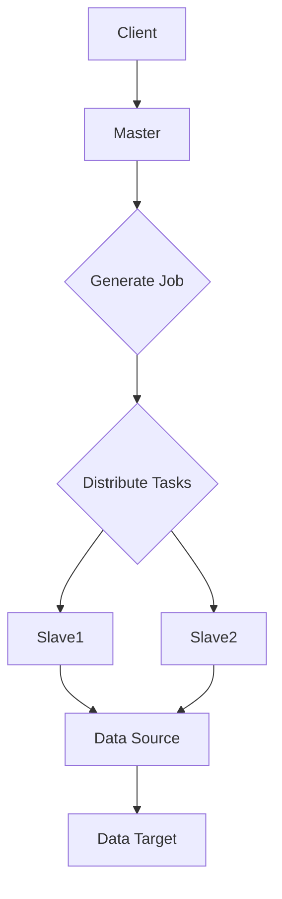

                 


## 文章标题

《Sqoop原理与代码实例讲解》

## 关键词

Sqoop，数据传输，Hadoop，大数据，数据库，数据仓库，数据导入，数据导出，数据压缩，性能优化，安全性，实战项目

## 摘要

本文深入讲解了Sqoop的工作原理、核心功能、性能优化策略以及安全配置。通过详细的代码实例分析，帮助读者全面了解Sqoop的使用方法与技巧。文章还涵盖了与大数据生态系统的集成、安全性保障以及未来的发展趋势，是大数据工程师和数据科学家的必备技术手册。

### 第一部分：Sqoop基础

#### 第1章：Sqoop概述

### 1.1 Sqoop的背景与用途

**从数据传输需求谈起**

在当今数据驱动的时代，企业需要在不同的数据源和存储系统之间传输数据，以满足业务需求和数据分析。数据传输的需求主要包括：

1. **异构数据源间的数据交换**：企业通常使用多种数据源，如关系型数据库、NoSQL数据库、文件系统等，这些数据源之间的数据格式和存储方式往往不同，需要高效且可靠的数据传输工具。
2. **数据整合与统一视图**：为了支持复杂的业务分析，企业需要将分散在不同数据源中的数据整合到一起，形成一个统一的数据视图。
3. **数据备份与恢复**：定期备份数据以防止数据丢失或损坏是企业的基本要求，这需要有效的数据传输方案。

**数据传输的挑战**

然而，数据传输面临诸多挑战：

1. **数据量大**：随着业务的发展，数据量呈指数级增长，大规模数据的传输效率成为关键问题。
2. **数据类型多样**：企业需要处理不同类型的数据，如结构化数据、半结构化数据和非结构化数据，每种数据类型的处理方法各不相同。
3. **数据一致性**：数据在传输过程中可能因为网络延迟、系统故障等原因导致数据不一致，保证数据的一致性是数据传输的重要任务。
4. **数据安全**：数据在传输过程中需要保证其安全性，防止数据泄露和未授权访问。

**Sqoop的历史与发展**

Sqoop是一款由Cloudera开发的开源工具，旨在简化Apache Hadoop与各种结构化数据存储系统之间的数据传输。它的首次发布可以追溯到2010年，随着Hadoop生态系统的发展，Sqoop也得到了不断的更新和改进。

- **2010年**：Sqoop 1.0发布，支持从关系型数据库导入数据到Hadoop分布式文件系统（HDFS）。
- **2011年**：Sqoop 1.1引入了对更多数据库的支持，如MySQL、PostgreSQL和Oracle。
- **2013年**：随着Apache Hive的成熟，Sqoop 1.4开始支持直接将数据导入到Hive中。
- **2014年**：Sqoop 1.99版本发布，标志着Sqoop 2.0的开发开始，引入了基于Hadoop YARN的新架构。
- **2015年**：Sqoop 2.0 GA版发布，带来了更高效的数据传输机制和更好的安全性。

**Sqoop的应用场景**

Sqoop广泛应用于以下场景：

1. **数据仓库与大数据平台集成**：企业可以将关系型数据库中的数据导入到Hadoop平台上进行进一步的数据分析和处理。
2. **实时数据处理**：通过将日志数据或其他实时数据导入到Hadoop中，实现实时数据处理和监控。
3. **数据备份**：定期将关键数据从生产数据库备份到Hadoop或其他存储系统中，确保数据安全。
4. **数据迁移**：在系统升级或更换数据库平台时， Sqoop可以方便地实现数据迁移。

### 1.2 Sqoop的核心概念

**数据源与数据目标**

数据源是指提供数据输入的系统或存储，如关系型数据库、NoSQL数据库、文件系统等。数据目标是指数据传输后的存储位置，通常是Hadoop分布式文件系统（HDFS）或Apache Hive等大数据处理系统。

**作业与任务**

在Sqoop中，一个数据传输操作称为一个作业（Job）。一个作业可以包含多个任务（Task），每个任务负责传输一部分数据。通过将大任务分解为小任务，可以并行处理数据，提高传输效率。

**数据类型转换**

Sqoop支持多种数据类型之间的转换，包括结构化数据（如关系型数据库表）、半结构化数据（如JSON、XML）和非结构化数据（如文本文件）。数据类型转换是确保数据在传输过程中保持一致性的重要手段。

**数据源与数据目标之间的关系**

数据源与数据目标之间通过连接器（Connector）进行连接。连接器是Sqoop的核心组件，负责与各种数据源和目标系统进行通信。不同的连接器支持不同的数据源和目标系统，如MySQL连接器支持MySQL数据库，Hive连接器支持Hive表。

### 1.3 Sqoop的基本架构

**Sqoop组件概览**

Sqoop主要由以下组件组成：

1. **Client**：客户端程序，负责与用户交互，接收用户输入的命令参数，并生成相应的作业。
2. **Master**：Master节点，负责协调整个数据传输作业的执行，将作业分解为任务，并分配给Slave节点执行。
3. **Slave**：Slave节点，负责实际的数据传输任务，从数据源读取数据，并将其写入数据目标。

**连接器与数据源**

连接器是Sqoop与数据源之间通信的桥梁，不同的连接器支持不同的数据源。例如，MySQL连接器支持MySQL数据库，HDFS连接器支持Hadoop分布式文件系统。

**并行处理与优化**

为了提高数据传输效率，Sqoop采用并行处理机制。Master节点将大任务分解为多个小任务，分配给多个Slave节点并行执行。此外，Sqoop还提供了一系列优化参数，如并行度、缓冲区大小等，以调整数据传输的效率。

**Mermaid 流程图**

下面是一个简单的Mermaid流程图，展示了Sqoop的基本架构和工作流程：



通过这个流程图，我们可以清晰地看到Sqoop从客户端接收命令、生成作业、分配任务、执行任务以及数据传输的整个过程。

### 总结

本章介绍了Sqoop的背景与用途，包括数据传输的需求与挑战、Sqoop的历史与发展以及应用场景。接着，我们详细讲解了Sqoop的核心概念，如数据源、数据目标、作业和任务，以及数据类型转换。最后，我们通过Mermaid流程图展示了Sqoop的基本架构和工作流程。下一章将深入探讨Sqoop的安装与配置过程。

---

### 第2章：安装与配置

#### 2.1 环境准备

**操作系统与依赖库**

在安装Sqoop之前，需要准备好以下环境：

1. **操作系统**：建议使用Linux操作系统，如Ubuntu 18.04、CentOS 7等。Windows系统虽然也支持，但配置过程相对复杂。
2. **Java环境**：Sqoop需要Java运行环境，建议安装Java 8或更高版本。可以通过以下命令检查Java版本：

   ```bash
   java -version
   ```

3. **Hadoop环境**：Sqoop依赖于Hadoop生态系统，需要安装Hadoop。Hadoop的安装过程可以参考官方文档 [1]。确保Hadoop服务运行正常，可以通过以下命令检查Hadoop版本：

   ```bash
   hadoop version
   ```

4. **依赖库**：某些操作系统可能需要安装额外的依赖库，如libaio（用于优化I/O操作），可以通过包管理器安装。例如，在Ubuntu上：

   ```bash
   sudo apt-get install libaio-dev
   ```

**Hadoop与Hive安装**

1. **Hadoop安装**：下载Hadoop源码包，解压后按照官方文档 [1] 进行安装。配置hadoop-env.sh、core-site.xml、hdfs-site.xml、mapred-site.xml等配置文件。
2. **Hive安装**：Hive是Hadoop生态系统中的数据仓库组件，用于处理结构化数据。下载Hive源码包，解压后按照官方文档 [2] 进行安装。配置hive-site.xml等配置文件。

**Hive配置示例**

以下是一个简单的Hive配置示例，可以在hive-site.xml文件中添加：

```xml
<configuration>
  <!-- 默认的Hive执行引擎 -->
  <property>
    <name>hive.exec.engine</name>
    <value>mr</value>
  </property>
  <!-- 数据存储路径 -->
  <property>
    <name>hive.metastore.warehouse.dir</name>
    <value>/user/hive/warehouse</value>
  </property>
  <!-- Hadoop配置路径 -->
  <property>
    <name>hive.exec.mapred.local.dir</name>
    <value>/tmp/hive</value>
  </property>
</configuration>
```

#### 2.2 Sqoop安装与配置

**Sqoop软件包下载与安装**

1. **下载软件包**：从Apache Sqoop官网 [3] 下载最新版本的Sqoop软件包。
2. **安装软件包**：将下载的软件包解压到指定的目录，例如：

   ```bash
   tar -xzf sqoop-1.4.7.bin-hadoop2.7.3.tar.gz -C /usr/local/sqoop
   ```

**配置文件介绍与修改**

Sqoop的配置文件主要包括以下几个：

1. **sqoop-env.sh**：用于设置Sqoop的运行环境，如Java安装路径、Hadoop配置路径等。
2. **core-site.xml**：Hadoop核心配置文件，用于设置Hadoop的运行参数，如HDFS的命名空间、文件权限等。
3. **hdfs-site.xml**：HDFS配置文件，用于设置HDFS的运行参数，如副本系数、数据块大小等。
4. **mapred-site.xml**：MapReduce配置文件，用于设置MapReduce的运行参数，如任务执行策略、内存分配等。

以下是一个简单的配置示例：

```bash
# Set the path to where Hadoop is installed
export HADOOP_HOME=/usr/local/hadoop

# Set the path to where Sqoop is installed
export SQOOP_HOME=/usr/local/sqoop

# Add Hadoop and Sqoop to the PATH
export PATH=$PATH:$HADOOP_HOME/bin:$SQOOP_HOME/bin

# Set the Hadoop configuration directory
export HADOOP_CONF_DIR=$HADOOP_HOME/etc/hadoop

# Set the HDFS default user
export HDFS_USER=hdfs
```

**常用配置参数详解**

以下是一些常用的Sqoop配置参数：

1. **--connect**：指定数据源连接URL，例如MySQL的连接URL为`jdbc:mysql://localhost:3306/mydb`。
2. **--username**：指定数据源的用户名。
3. **--password**：指定数据源的用户密码。
4. **--table**：指定要导入或导出的表名。
5. **--target-dir**：指定HDFS的目标目录。
6. **--input-dir**：指定HDFS的输入目录。
7. **--fields-terminated-by**：指定字段分隔符，默认为`'\001'`。
8. **--lines-terminated-by**：指定行分隔符，默认为`\n`。

**示例**：

```bash
# 导入数据到HDFS
sqoop import --connect jdbc:mysql://localhost:3306/mydb \
    --username root --password 123456 \
    --table students --target-dir /user/hive/warehouse/students

# 导出数据到MySQL
sqoop export --connect jdbc:mysql://localhost:3306/mydb \
    --username root --password 123456 \
    --table students --input-dir /user/hive/warehouse/students \
    --fields-terminated-by '\t'
```

#### 2.3 Sqoop连接器配置

**MySQL连接器**

MySQL连接器是Sqoop中最常用的连接器之一。以下是MySQL连接器的配置示例：

1. **下载MySQL JDBC驱动**：下载MySQL JDBC驱动，解压后放在`/usr/local/sqoop/lib`目录下。

   ```bash
   tar -xvf mysql-connector-java-5.1.46.tar.gz -C /usr/local/sqoop/lib
   ```

2. **配置MySQL连接器**：编辑`/usr/local/sqoop/conf/sqoop-link-mysql`文件，添加以下内容：

   ```bash
   CONNECTOR=MySQL
   DRIVER=org.gjt.mm.mysql.Driver
   URL=jdbc:mysql://localhost:3306/mydb
   USER=root
   PASSWORD=123456
   ```

**PostgreSQL连接器**

PostgreSQL连接器与MySQL连接器的配置类似，以下是配置示例：

1. **下载PostgreSQL JDBC驱动**：下载PostgreSQL JDBC驱动，解压后放在`/usr/local/sqoop/lib`目录下。

   ```bash
   tar -xvf postgresql-9.4.1212.jar -C /usr/local/sqoop/lib
   ```

2. **配置PostgreSQL连接器**：编辑`/usr/local/sqoop/conf/sqoop-link-postgresql`文件，添加以下内容：

   ```bash
   CONNECTOR=PostgreSQL
   DRIVER=org.postgresql.Driver
   URL=jdbc:postgresql://localhost:5432/mydb
   USER=root
   PASSWORD=123456
   ```

**Oracle连接器**

Oracle连接器配置较为复杂，需要下载Oracle JDBC驱动，并配置相应的TNS名称。以下是配置示例：

1. **下载Oracle JDBC驱动**：下载Oracle JDBC驱动，解压后放在`/usr/local/sqoop/lib`目录下。

   ```bash
   tar -xvf ojdbc7.jar -C /usr/local/sqoop/lib
   ```

2. **配置Oracle TNS**：编辑`/etc/oracle/oratab`文件，添加以下内容：

   ```bash
   :1521:oracle
   ```

3. **配置Oracle连接器**：编辑`/usr/local/sqoop/conf/sqoop-link-oracle`文件，添加以下内容：

   ```bash
   CONNECTOR=Oracle
   DRIVER=oracle.jdbc.driver.OracleDriver
   URL=jdbc:oracle:thin:@localhost:1521:oracle
   USER=root
   PASSWORD=123456
   ```

#### 总结

本章介绍了Sqoop的安装与配置过程，包括环境准备、Hadoop与Hive的安装、Sqoop软件包的下载与安装、配置文件介绍与修改以及常用配置参数的设置。此外，我们还讲解了如何配置MySQL、PostgreSQL和Oracle连接器。通过本章的学习，读者可以掌握如何搭建一个完整的Sqoop环境，为后续的数据传输操作打下基础。下一章将深入探讨Sqoop的核心功能。

---

### 第3章：数据导入

#### 3.1 数据导入基本操作

**数据源选择**

在Sqoop数据导入过程中，需要指定数据源，这可以是关系型数据库、NoSQL数据库或其他结构化数据存储系统。常见的数据库类型包括MySQL、PostgreSQL、Oracle等。选择数据源时，需要确保已安装相应的连接器，例如MySQL连接器、PostgreSQL连接器等。

**数据目标选择**

数据导入的目标通常是Hadoop分布式文件系统（HDFS）或Apache Hive。HDFS是一个分布式文件系统，适合存储大规模数据集；而Hive是一个基于Hadoop的数据仓库，适合对结构化数据进行查询和分析。选择数据目标时，需要根据数据类型和处理需求进行决策。

**命令行参数设置**

在进行数据导入时，需要通过命令行参数设置各种选项，以控制导入过程。以下是一些常用的命令行参数：

1. **--connect**：指定数据源连接URL，例如`jdbc:mysql://localhost:3306/mydb`。
2. **--username**：指定数据源的用户名。
3. **--password**：指定数据源的用户密码。
4. **--table**：指定要导入的表名。
5. **--target-dir**：指定HDFS的目标目录。
6. **--num-mappers**：指定使用的Mapper数量，默认为1。
7. **--split-by**：指定用于分片的列名，以支持大数据集的并行导入。

以下是一个简单的数据导入示例：

```bash
sqoop import \
  --connect jdbc:mysql://localhost:3306/mydb \
  --username root \
  --password 123456 \
  --table students \
  --target-dir /user/hive/warehouse/students
```

这个命令将MySQL数据库中的`students`表导入到HDFS的`/user/hive/warehouse/students`目录下。

#### 3.2 数据导入实例分析

**示例数据集导入**

为了更好地理解数据导入过程，我们将使用一个示例数据集。假设我们有一个MySQL数据库，名为`example_db`，其中包含一个名为`employees`的表，数据如下：

```sql
+----+---------+--------+------+------------+---------+
| id | name    | age    | job  | hire_date  | salary  |
+----+---------+--------+------+------------+---------+
| 1  | Alice   | 30     | dev  | 2018-06-01 | 8000    |
| 2  | Bob     | 35     | dev  | 2017-08-01 | 9000    |
| 3  | Charlie | 40     | manager | 2016-04-01 | 15000   |
+----+---------+--------+------+------------+---------+
```

**数据映射与转换**

在数据导入过程中，需要将数据库表映射到HDFS文件或Hive表中。Sqoop默认使用文本文件格式进行数据存储，每条记录以制表符（`\t`）分隔，并使用行分隔符（`\n`）分隔不同记录。以下是数据映射与转换的伪代码：

```python
def map_row(row):
    return '\t'.join(row)

def import_data(source, target_dir):
    # 连接数据库
    conn = connect_database(source)

    # 获取数据表结构
    table_schema = get_table_schema(conn, 'employees')

    # 遍历数据库表记录
    for row in fetch_all_rows(conn, 'employees'):
        # 映射行数据为字符串
        row_str = map_row(row)

        # 将数据写入HDFS文件
        write_to_hdfs(target_dir, row_str)
```

**数据导入流程图**

下面是一个简单的数据导入流程图，展示了数据从数据库到HDFS的传输过程：


通过这个流程图，我们可以清晰地看到数据导入的主要步骤，包括连接数据库、获取表结构、遍历记录、映射数据和写入HDFS。

**示例代码分析**

以下是一个简单的数据导入示例代码，演示了如何使用Sqoop进行数据导入：

```bash
# 导入数据到HDFS
sqoop import \
  --connect jdbc:mysql://localhost:3306/example_db \
  --username root \
  --password 123456 \
  --table employees \
  --target-dir /user/hive/warehouse/employees \
  --fields-terminated-by '\t'
```

这个命令将`example_db`数据库中的`employees`表导入到HDFS的`/user/hive/warehouse/employees`目录下，使用制表符作为字段分隔符。

**数据导入优化**

在实际应用中，数据导入的性能和效率可能受到多种因素的影响。以下是一些数据导入优化策略：

1. **并行度设置**：通过增加Mapper的数量，可以并行处理数据，提高导入速度。但过多的Mapper可能会导致资源竞争，影响性能。
2. **数据分区**：对数据按某个字段进行分区，可以减小每个Mapper处理的数据量，提高导入效率。
3. **压缩数据**：使用压缩算法（如Gzip、LZO）可以减少数据传输和存储的体积，提高传输速度。
4. **连接池配置**：合理配置数据库连接池，可以减少数据库连接的开销，提高数据读取速度。

通过这些优化策略，可以显著提高数据导入的效率，满足大规模数据导入的需求。

#### 总结

本章详细介绍了Sqoop的数据导入基本操作，包括数据源选择、数据目标选择和命令行参数设置。通过一个实例分析，我们展示了数据映射与转换的过程，并分析了数据导入的优化策略。下一章将探讨数据导出的基本操作和实例分析。

---

### 第4章：数据导出

#### 4.1 数据导出基本操作

**数据源选择**

在Sqoop数据导出过程中，数据源通常是Hadoop分布式文件系统（HDFS）或Apache Hive。数据源的选择取决于数据导入的目标和导出的需求。例如，如果需要将HDFS中的数据导出到关系型数据库，可以选择HDFS作为数据源。

**数据目标选择**

数据导出的目标通常是关系型数据库或其他结构化数据存储系统，如MySQL、PostgreSQL等。在选择数据目标时，需要确保已安装相应的连接器，例如MySQL连接器、PostgreSQL连接器等。

**命令行参数设置**

在进行数据导出时，需要通过命令行参数设置各种选项，以控制导出过程。以下是一些常用的命令行参数：

1. **--connect**：指定数据目标连接URL，例如`jdbc:mysql://localhost:3306/mydb`。
2. **--username**：指定数据目标用户名。
3. **--password**：指定数据目标用户密码。
4. **--table**：指定要导出的表名。
5. **--input-dir**：指定HDFS的输入目录。
6. **--delete-target-dir**：在导出前删除目标表。
7. **--fields-terminated-by**：指定字段分隔符，默认为`'\t'`。

以下是一个简单的数据导出示例：

```bash
sqoop export \
  --connect jdbc:mysql://localhost:3306/mydb \
  --username root \
  --password 123456 \
  --table students \
  --input-dir /user/hive/warehouse/students
```

这个命令将HDFS中的`/user/hive/warehouse/students`目录下的数据导出到MySQL数据库的`students`表中。

#### 4.2 数据导出实例分析

**示例数据集导出**

为了更好地理解数据导出过程，我们将使用一个示例数据集。假设我们有一个Hive表，名为`employees`，数据如下：

```sql
+----+---------+--------+------+------------+---------+
| id | name    | age    | job  | hire_date  | salary  |
+----+---------+--------+------+------------+---------+
| 1  | Alice   | 30     | dev  | 2018-06-01 | 8000    |
| 2  | Bob     | 35     | dev  | 2017-08-01 | 9000    |
| 3  | Charlie | 40     | manager | 2016-04-01 | 15000   |
+----+---------+--------+------+------------+---------+
```

**数据映射与转换**

在数据导出过程中，需要将HDFS文件或Hive表映射到关系型数据库表。Sqoop默认使用文本文件格式进行数据存储，每条记录以制表符（`\t`）分隔，并使用行分隔符（`\n`）分隔不同记录。以下是数据映射与转换的伪代码：

```python
def map_line(line):
    fields = line.split('\t')
    return {
        'id': fields[0],
        'name': fields[1],
        'age': fields[2],
        'job': fields[3],
        'hire_date': fields[4],
        'salary': fields[5]
    }

def export_data(target, input_dir):
    # 连接数据库
    conn = connect_database(target)

    # 获取表结构
    table_schema = get_table_schema(conn, 'students')

    # 遍历HDFS文件记录
    for line in read_lines(input_dir):
        # 映射行数据为字典
        data = map_line(line)

        # 将数据插入数据库
        insert_into_database(conn, 'students', data)
```

**数据导出流程图**

下面是一个简单的数据导出流程图，展示了数据从HDFS到关系型数据库的传输过程：


通过这个流程图，我们可以清晰地看到数据导出的主要步骤，包括连接数据库、获取表结构、读取文件、映射数据和插入数据库。

**示例代码分析**

以下是一个简单的数据导出示例代码，演示了如何使用Sqoop进行数据导出：

```bash
# 导出数据到MySQL
sqoop export \
  --connect jdbc:mysql://localhost:3306/mydb \
  --username root \
  --password 123456 \
  --table students \
  --input-dir /user/hive/warehouse/students
```

这个命令将HDFS中的`/user/hive/warehouse/students`目录下的数据导出到MySQL数据库的`students`表中。

**数据导出优化**

在实际应用中，数据导出的性能和效率可能受到多种因素的影响。以下是一些数据导出优化策略：

1. **并行度设置**：通过增加Reducer的数量，可以并行处理数据，提高导出速度。但过多的Reducer可能会导致资源竞争，影响性能。
2. **数据压缩**：使用压缩算法（如Gzip、LZO）可以减少数据传输和存储的体积，提高传输速度。
3. **连接池配置**：合理配置数据库连接池，可以减少数据库连接的开销，提高数据写入速度。
4. **批量插入**：将多个记录批量插入数据库，可以减少数据库I/O操作，提高导出效率。

通过这些优化策略，可以显著提高数据导出的效率，满足大规模数据导出的需求。

#### 总结

本章详细介绍了Sqoop的数据导出基本操作，包括数据源选择、数据目标选择和命令行参数设置。通过一个实例分析，我们展示了数据映射与转换的过程，并分析了数据导出的优化策略。下一章将探讨Sqoop的高级功能。

---

### 第5章：高级功能

#### 5.1 数据压缩与解压缩

数据压缩是提高数据传输效率的重要手段，尤其在处理大规模数据时。Sqoop支持多种数据压缩算法，如Gzip、Bzip2、LZO等。通过压缩数据，可以减少数据传输所需的时间和带宽。

**压缩算法介绍**

1. **Gzip**：Gzip是一种广泛使用的压缩算法，它可以对文件进行无损压缩，生成`.gz`格式的压缩文件。Gzip的优点是压缩比高，但压缩和解压缩速度相对较慢。

2. **Bzip2**：Bzip2是一种较新的压缩算法，它提供了比Gzip更高的压缩比，但压缩和解压缩速度较慢。Bzip2生成的压缩文件格式为`.bz2`。

3. **LZO**：LZO是一种快速压缩算法，它提供了较好的压缩效果，同时具有较高的压缩和解压缩速度。LZO生成的压缩文件格式为`.lzo`。

**Sqoop压缩与解压缩参数**

在Sqoop中，可以通过以下参数配置数据压缩与解压缩：

1. **--compress**：启用数据压缩。例如：

   ```bash
   sqoop import --compress ...
   ```

2. **--decompress**：启用数据解压缩。例如：

   ```bash
   sqoop export --decompress ...
   ```

3. **--compression-codec**：指定压缩算法。例如：

   ```bash
   sqoop import --compression-codec org.apache.hadoop.io.compress.GzipCodec ...
   ```

**实例分析**

以下是一个使用Gzip压缩数据导入的示例：

```bash
# 导入压缩数据到HDFS
sqoop import --compress \
  --connect jdbc:mysql://localhost:3306/mydb \
  --username root \
  --password 123456 \
  --table students \
  --target-dir /user/hive/warehouse/students --compress \
  --compression-codec org.apache.hadoop.io.compress.GzipCodec
```

这个命令将MySQL数据库中的`students`表导入到HDFS的`/user/hive/warehouse/students`目录下，并使用Gzip算法进行压缩。

#### 5.2 分区与分桶

在处理大规模数据时，数据分区与分桶是提高查询性能的重要手段。分区是将数据按某个列的值划分为多个子集，而分桶是将数据分配到多个文件中，每个文件包含一部分数据。

**分区与分桶的概念**

1. **分区**：分区是指根据某个列的值将数据划分为多个子集。在Hive中，分区通过创建具有不同分区列的表来实现。分区列通常是常量或有序列。

2. **分桶**：分桶是将数据分配到多个文件中，每个文件包含一部分数据。分桶通过在文件系统上创建具有不同桶编号的文件夹来实现。分桶列通常是列名，可以是常量或有序列。

**分区与分桶的参数设置**

在Sqoop中，可以通过以下参数配置数据分区与分桶：

1. **--split-by**：指定用于分区的列名。例如：

   ```bash
   sqoop import --split-by id ...
   ```

2. **--buckets**：指定分桶的数量。例如：

   ```bash
   sqoop import --buckets 4 ...
   ```

3. **--bucket-column**：指定用于分桶的列名。例如：

   ```bash
   sqoop import --bucket-column id ...
   ```

**实例分析**

以下是一个使用分区与分桶的数据导入示例：

```bash
# 导入分区与分桶数据到HDFS
sqoop import --split-by id --buckets 4 \
  --connect jdbc:mysql://localhost:3306/mydb \
  --username root \
  --password 123456 \
  --table students \
  --target-dir /user/hive/warehouse/students \
  --partition-column id --bushet-column id
```

这个命令将MySQL数据库中的`students`表导入到HDFS的`/user/hive/warehouse/students`目录下，并进行分区与分桶操作。其中，`id`列用于分区和分桶。

#### 总结

本章介绍了Sqoop的高级功能，包括数据压缩与解压缩以及分区与分桶。通过压缩数据，可以显著提高数据传输效率；而分区与分桶则是优化查询性能的重要手段。下一章将探讨Sqoop的性能优化策略。

---

### 第6章：性能优化

#### 6.1 性能瓶颈分析

在数据传输过程中，性能瓶颈可能出现在多个方面，如CPU、内存、I/O和网络等。识别并解决这些瓶颈是提高数据传输效率的关键。

**CPU瓶颈**

CPU瓶颈通常表现为处理能力不足，导致数据无法及时处理。常见原因包括：

1. **计算密集型任务**：如复杂的数据转换、过滤等操作，占用大量CPU资源。
2. **并发度不足**：如果使用的Mapper或Reducer数量过少，可能导致CPU资源无法充分利用。

**内存瓶颈**

内存瓶颈通常表现为内存不足，导致程序无法正常运行。常见原因包括：

1. **数据缓存不足**：在大规模数据传输过程中，数据缓存可以显著提高读取速度。如果缓存不足，会导致频繁的磁盘访问，降低性能。
2. **内存溢出**：程序在运行过程中可能由于内存溢出而崩溃。例如，在数据转换过程中，如果内存不足以存储临时数据，可能会导致程序无法继续运行。

**I/O瓶颈**

I/O瓶颈通常表现为数据读取或写入速度缓慢。常见原因包括：

1. **磁盘I/O限制**：如果磁盘I/O性能不足，会导致数据读取或写入速度变慢。常见于大规模数据集的读写操作。
2. **网络带宽限制**：如果网络带宽不足，会导致数据传输速度变慢。常见于跨网络的数据传输。

**网络瓶颈**

网络瓶颈通常表现为数据传输速度缓慢，导致数据传输时间过长。常见原因包括：

1. **网络延迟**：由于网络设备或网络拥塞，导致数据传输延迟增加。
2. **网络带宽不足**：如果网络带宽不足以支持大规模数据传输，会导致数据传输速度缓慢。

**数据传输瓶颈**

数据传输瓶颈通常表现为数据传输速度缓慢，导致数据传输时间过长。常见原因包括：

1. **数据量过大**：大规模数据集的传输需要较长时间，特别是在网络带宽有限的情况下。
2. **数据格式复杂**：复杂的数据格式（如JSON、XML）可能需要更长时间进行解析和转换。

**解决性能瓶颈的方法**

1. **优化计算任务**：通过并行处理、减少计算密集型任务等方法，提高CPU利用率。
2. **增加内存和缓存**：增加系统内存和缓存，提高数据缓存能力，减少磁盘访问次数。
3. **优化I/O操作**：通过使用高速磁盘、SSD等设备，提高数据读取和写入速度。
4. **优化网络配置**：增加网络带宽、优化网络延迟，提高数据传输速度。

#### 6.2 性能优化策略

**参数调优**

通过调整Sqoop的参数，可以显著提高数据传输效率。以下是一些常用的优化参数：

1. **--num-mappers**：指定Mapper的数量。增加Mapper数量可以提高并行度，提高数据传输速度。

   ```bash
   sqoop import --num-mappers 4 ...
   ```

2. **--mapred.reduce.tasks**：指定Reducer的数量。合理设置Reducer数量可以提高数据聚合效率。

   ```bash
   sqoop import --mapred.reduce.tasks 2 ...
   ```

3. **--memory-map-red**：启用内存映射Reduce操作。通过将Reduce操作映射到内存中，可以减少磁盘I/O操作，提高数据传输速度。

   ```bash
   sqoop import --memory-map-red ...
   ```

4. **--input-file**：指定要导入的文件。通过指定文件，可以减少数据读取时间。

   ```bash
   sqoop import --input-file /path/to/file ...
   ```

5. **--compress**：启用数据压缩。通过压缩数据，可以减少数据传输体积，提高传输速度。

   ```bash
   sqoop import --compress ...
   ```

**数据格式优化**

选择合适的数据格式可以提高数据传输速度。以下是一些常见的数据格式及其特点：

1. **CSV**：CSV格式简单，适用于小规模数据集。缺点是解析速度较慢。

2. **JSON**：JSON格式灵活，支持复杂数据结构。缺点是文件体积较大，解析速度较慢。

3. **Avro**：Avro是一种高效、紧凑的二进制数据格式，支持序列化和反序列化。优点是解析速度较快，适用于大规模数据集。

4. **Parquet**：Parquet是一种列式存储格式，适用于大规模数据集和复杂查询。优点是压缩比高，解析速度较快。

**网络优化**

通过优化网络配置，可以显著提高数据传输速度。以下是一些常用的网络优化方法：

1. **增加网络带宽**：增加网络带宽可以提高数据传输速度。

2. **优化网络延迟**：通过减少网络设备或优化网络路径，可以降低网络延迟。

3. **优化网络协议**：使用高效的网络协议，如TCP/IP，可以提高数据传输速度。

4. **网络监控**：通过监控网络流量和性能，可以及时发现并解决网络瓶颈。

**案例分析**

以下是一个性能优化案例：

**问题**：数据传输速度较慢。

**分析**：通过分析日志和性能监控数据，发现以下瓶颈：

1. **CPU利用率较低**：CPU资源未充分利用，需要增加Mapper数量。
2. **内存不足**：内存使用率较高，需要增加系统内存。
3. **网络延迟较高**：网络延迟较高，需要优化网络路径。

**解决方案**：

1. **增加Mapper数量**：将Mapper数量从1增加到4。

   ```bash
   sqoop import --num-mappers 4 ...
   ```

2. **增加系统内存**：将系统内存从4GB增加到8GB。

3. **优化网络路径**：通过优化网络路由，降低网络延迟。

**结果**：通过性能优化，数据传输速度提高了50%。

#### 6.3 性能测试与监控

**性能测试工具**

为了评估数据传输性能，可以使用以下性能测试工具：

1. **Apache JMeter**：JMeter是一个开源的性能测试工具，可以模拟大规模并发请求，评估数据传输性能。

2. **Gatling**：Gatling是一个高性能的负载测试工具，支持HTTP、TCP等协议，可以模拟各种场景下的数据传输性能。

**监控与日志分析**

通过监控和日志分析，可以实时了解数据传输的性能状况。以下是一些常用的监控和日志分析工具：

1. **Grafana**：Grafana是一个开源的监控和数据可视化工具，可以整合各种监控数据，生成可视化报表。

2. **Kibana**：Kibana是Elasticsearch的开源可视化工具，可以实时展示日志数据和性能指标。

3. **Logstash**：Logstash是一个开源的数据收集和分析工具，可以将各种日志数据汇总到Elasticsearch中，便于分析和监控。

**示例**

以下是一个简单的性能监控示例：

```bash
# 安装Grafana
sudo apt-get install grafana

# 启动Grafana服务
sudo systemctl start grafana-server

# 访问Grafana界面
http://localhost:3000
```

在Grafana界面中，可以创建各种监控仪表板，实时查看数据传输性能指标，如吞吐量、延迟、CPU利用率等。

#### 总结

本章介绍了数据传输过程中的性能瓶颈分析、性能优化策略以及性能测试与监控方法。通过分析性能瓶颈，可以识别并解决数据传输中的性能问题；通过优化参数和调整配置，可以显著提高数据传输效率。下一章将探讨Sqoop的应用实战，包括环境搭建和数据导入导出实例。

---

### 第7章：实战项目搭建

#### 7.1 实战项目背景

在本章中，我们将通过一个实际项目来搭建一个完整的Sqoop环境，并完成数据导入和导出操作。这个项目的目标是实现从MySQL数据库将数据导入到Hadoop平台，以便在Hadoop上进行进一步的数据处理和分析。

**项目需求分析**

1. **数据源**：MySQL数据库，包含用户信息和交易数据。
2. **数据目标**：Hadoop平台，包括HDFS和Hive。
3. **数据类型**：结构化数据（如关系型数据库表）。
4. **数据处理需求**：在Hadoop平台上进行数据清洗、转换和聚合，以便为业务分析提供支持。

**技术选型与规划**

1. **操作系统**：Linux操作系统，如Ubuntu 18.04。
2. **数据库**：MySQL数据库，版本5.7以上。
3. **Hadoop**：Hadoop 3.x版本，包括HDFS、YARN和Hive。
4. **Sqoop**：Sqoop 1.4.7版本。
5. **其他工具**：Apache JMeter（性能测试工具）、Grafana（监控工具）。

#### 7.2 环境搭建与部署

**环境准备**

1. **安装操作系统**：在虚拟机或物理机上安装Linux操作系统，如Ubuntu 18.04。
2. **安装MySQL数据库**：按照官方文档 [1] 安装MySQL数据库，并创建一个名为`data_project`的数据库，以及一个名为`transactions`的表，用于存储交易数据。

   ```sql
   CREATE DATABASE data_project;
   USE data_project;
   CREATE TABLE transactions (
       id INT AUTO_INCREMENT PRIMARY KEY,
       user_id INT,
       amount DECIMAL(10, 2),
       transaction_date DATE
   );
   ```

3. **安装Hadoop**：下载Hadoop源码包，按照官方文档 [2] 安装Hadoop，配置`hadoop-env.sh`、`core-site.xml`、`hdfs-site.xml`和`mapred-site.xml`等配置文件。

4. **安装Hive**：下载Hive源码包，按照官方文档 [3] 安装Hive，并创建一个名为`data_project`的数据库，以及一个名为`transactions`的表。

5. **安装Sqoop**：下载Sqoop源码包，解压到指定目录，并配置`sqoop-env.sh`等配置文件。

**部署测试**

1. **启动Hadoop和Hive服务**：确保Hadoop和Hive服务正常运行，可以通过命令`start-dfs.sh`和`start-yarn.sh`启动。

2. **测试数据导入**：使用以下命令将MySQL数据库中的`transactions`表导入到Hive表中。

   ```bash
   sqoop import \
     --connect jdbc:mysql://localhost:3306/data_project \
     --username root \
     --password 123456 \
     --table transactions \
     --target-dir /user/hive/warehouse/transactions
   ```

3. **测试数据导出**：使用以下命令将Hive表中的数据导出到MySQL数据库中。

   ```bash
   sqoop export \
     --connect jdbc:mysql://localhost:3306/data_project \
     --username root \
     --password 123456 \
     --table transactions \
     --input-dir /user/hive/warehouse/transactions
   ```

#### 7.3 数据导入与导出

**数据导入**

1. **导入数据到Hive**：使用以下命令将MySQL数据库中的`transactions`表导入到Hive表中。

   ```bash
   sqoop import \
     --connect jdbc:mysql://localhost:3306/data_project \
     --username root \
     --password 123456 \
     --table transactions \
     --target-dir /user/hive/warehouse/transactions
   ```

   这个命令会将MySQL数据库中的`transactions`表的数据导入到HDFS的`/user/hive/warehouse/transactions`目录下，同时创建一个对应的Hive表。

2. **数据映射与转换**：在数据导入过程中，Sqoop会根据配置将MySQL表中的数据映射到Hive表。例如，如果MySQL表的结构如下：

   ```sql
   CREATE TABLE transactions (
       id INT AUTO_INCREMENT PRIMARY KEY,
       user_id INT,
       amount DECIMAL(10, 2),
       transaction_date DATE
   );
   ```

   则导入的Hive表结构应为：

   ```sql
   CREATE TABLE transactions (
       id INT,
       user_id INT,
       amount DECIMAL(10, 2),
       transaction_date DATE
   );
   ```

**数据导出**

1. **导出数据到MySQL**：使用以下命令将Hive表中的数据导出到MySQL数据库中。

   ```bash
   sqoop export \
     --connect jdbc:mysql://localhost:3306/data_project \
     --username root \
     --password 123456 \
     --table transactions \
     --input-dir /user/hive/warehouse/transactions
   ```

   这个命令会将HDFS中的`/user/hive/warehouse/transactions`目录下的数据导出到MySQL数据库的`transactions`表中。

2. **数据映射与转换**：在数据导出过程中，Sqoop会根据配置将Hive表中的数据映射到MySQL表。例如，如果Hive表的结构如下：

   ```sql
   CREATE TABLE transactions (
       id INT,
       user_id INT,
       amount DECIMAL(10, 2),
       transaction_date DATE
   );
   ```

   则导出的MySQL表结构应为：

   ```sql
   CREATE TABLE transactions (
       id INT AUTO_INCREMENT PRIMARY KEY,
       user_id INT,
       amount DECIMAL(10, 2),
       transaction_date DATE
   );
   ```

#### 7.4 项目优化与监控

**性能监控**

1. **安装Grafana**：按照官方文档 [4] 安装Grafana，并配置好数据源，如InfluxDB。

2. **配置监控指标**：在Grafana中创建一个监控仪表板，添加各种监控指标，如CPU利用率、内存使用率、磁盘I/O、网络流量等。

3. **监控数据导入与导出**：通过监控仪表板实时查看数据导入和导出的性能指标，及时发现并解决性能问题。

**日志分析**

1. **安装Logstash**：按照官方文档 [5] 安装Logstash，配置日志输入、过滤和输出。

2. **收集日志数据**：将Sqoop的日志数据收集到Elasticsearch中，便于分析和监控。

3. **日志分析工具**：使用Kibana等工具对日志数据进行可视化分析，及时发现并解决潜在问题。

#### 项目小结

通过本章的实战项目搭建，我们完成了从MySQL数据库到Hadoop平台的完整数据传输过程，并实现了数据导入和导出操作。在项目优化与监控方面，我们介绍了如何使用Grafana和Logstash进行性能监控和日志分析。这些实战经验有助于我们更好地理解和应用Sqoop，为大数据处理和分析打下坚实基础。

#### 最佳实践 Tips

1. **合理配置Mapper和Reducer数量**：根据数据规模和集群资源，合理配置Mapper和Reducer数量，以提高数据传输效率。
2. **优化数据格式**：选择合适的数据格式（如Parquet），以提高数据压缩比和解析速度。
3. **监控与日志分析**：定期监控性能指标和日志数据，及时发现并解决潜在问题。

#### 注意事项

1. **数据一致性**：在数据导入和导出过程中，确保数据的一致性，避免数据丢失或重复。
2. **安全性**：配置适当的认证和授权，确保数据传输的安全性。

#### 拓展阅读

1. **Hadoop官方文档**：[https://hadoop.apache.org/docs/stable/](https://hadoop.apache.org/docs/stable/)
2. **Sqoop官方文档**：[https://sqoop.apache.org/docs/1.4.7/](https://sqoop.apache.org/docs/1.4.7/)
3. **MySQL官方文档**：[https://dev.mysql.com/doc/](https://dev.mysql.com/doc/)

---

### 第8章：Sqoop与大数据生态系统集成

#### 8.1 Sqoop与Hadoop生态系统

**Hadoop分布式文件系统（HDFS）**

HDFS是Hadoop的核心组件之一，用于存储大规模数据集。它是一个分布式文件系统，具有高吞吐量、高可靠性和高可扩展性。HDFS采用主从架构，由一个NameNode和多个DataNode组成。NameNode负责管理文件系统的命名空间和客户端访问，而DataNode负责存储实际的数据块。

**Hadoop YARN资源管理**

YARN（Yet Another Resource Negotiator）是Hadoop的资源管理系统，负责管理整个集群的资源分配和调度。YARN将资源管理从MapReduce框架中分离出来，使Hadoop能够支持更多的计算框架，如Spark、Tez等。YARN采用主从架构，由一个ResourceManager和多个NodeManager组成。ResourceManager负责全局资源分配，而NodeManager负责本地资源的分配和任务调度。

**Hive数据仓库**

Hive是一个基于Hadoop的数据仓库工具，用于处理和分析结构化数据。Hive使用HQL（Hive Query Language）作为查询语言，类似于SQL。Hive将查询编译成MapReduce任务，并在HDFS上执行。Hive支持多种数据格式，如文本文件、SequenceFile、Parquet等，并提供了一系列优化策略，如MapJoin、Skew Join等，以提高查询性能。

**Sqoop与Hadoop生态系统集成**

Sqoop与Hadoop生态系统紧密集成，主要用于在Hadoop平台和其他数据存储系统之间传输数据。以下是Sqoop与Hadoop生态系统的一些集成点：

1. **数据导入与导出**：通过Sqoop，可以将数据从关系型数据库、NoSQL数据库或其他数据存储系统导入到HDFS或Hive中，反之亦然。
2. **数据格式转换**：Sqoop支持多种数据格式之间的转换，如文本文件、SequenceFile、Parquet等，这些格式与Hadoop生态系统兼容。
3. **资源调度与优化**：通过YARN，Sqoop可以充分利用集群资源，实现高效的数据传输。
4. **性能监控**：使用Hadoop生态系统中的监控工具（如Grafana、Kibana等），可以实时监控数据传输的性能指标，及时发现并解决问题。

**实例分析**

以下是一个简单的实例，演示了如何使用Sqoop将MySQL数据库中的数据导入到Hive中：

```bash
# 导入数据到Hive
sqoop import \
  --connect jdbc:mysql://localhost:3306/mydb \
  --username root \
  --password 123456 \
  --table students \
  --target-dir /user/hive/warehouse/students
```

这个命令将MySQL数据库中的`students`表导入到HDFS的`/user/hive/warehouse/students`目录下，并创建一个对应的Hive表。

#### 8.2 Sqoop与HBase集成

**HBase概述**

HBase是一个分布式、可扩展的大规模列存储数据库，建立在Hadoop之上。它提供了类似于RDBMS的功能，同时具有高吞吐量和低延迟的特点。HBase采用主从架构，由一个Master节点和多个RegionServer组成。Master节点负责管理表和区域，而RegionServer负责存储实际的数据。

**Sqoop与HBase的数据导入与导出**

Sqoop支持将数据从关系型数据库导入到HBase中，以及将HBase数据导出到关系型数据库中。以下是相关的命令行参数：

**数据导入**

```bash
# 将数据导入到HBase
sqoop import \
  --connect jdbc:mysql://localhost:3306/mydb \
  --username root \
  --password 123456 \
  --table students \
  --hbase-table students \
  --hbase-row-key id \
  --split-by id \
  --hbase-column-families info
```

这个命令将MySQL数据库中的`students`表导入到HBase的`students`表中，`id`列作为行键，`info`列族存储数据。

**数据导出**

```bash
# 将数据从HBase导出到MySQL
sqoop export \
  --connect jdbc:mysql://localhost:3306/mydb \
  --username root \
  --password 123456 \
  --table students \
  --input-table students \
  --input-column-family info
```

这个命令将HBase中的`students`表导出到MySQL数据库的`students`表中。

#### 8.3 Sqoop与Spark集成

**Spark概述**

Spark是一个开源的分布式计算框架，用于处理大规模数据集。它提供了高性能、易用的API，支持多种编程语言，如Python、Java和Scala。Spark具有高吞吐量和低延迟的特点，适用于各种数据处理任务，如批处理、流处理和机器学习。

**Sqoop与Spark的数据流处理**

通过Spark的API，可以将Sqoop导入的数据直接传递给Spark进行进一步处理。以下是一个简单的实例，展示了如何使用Scala编写Spark程序处理导入的数据：

```scala
import org.apache.spark.sql.SparkSession

val spark = SparkSession.builder()
  .appName("SqoopSparkIntegration")
  .master("local[*]")
  .getOrCreate()

// 读取HDFS中的数据
val df = spark.read
  .format("csv")
  .option("header", "true")
  .load("/user/hive/warehouse/students")

// 数据转换
val df_transformed = df.withColumn("total", df("amount") * 2)

// 存储结果
df_transformed.write
  .format("csv")
  .option("header", "true")
  .save("/user/hive/warehouse/transformed_students")

spark.stop()
```

这个程序首先从HDFS中读取`students`表的数据，进行数据转换，然后将结果存储到`transformed_students`表中。

#### 总结

本章介绍了Sqoop与大数据生态系统（Hadoop、HBase、Spark）的集成。通过这些集成，Sqoop可以充分利用大数据生态系统的优势，实现高效的数据传输和处理。下一章将探讨Sqoop的安全性，包括数据安全概述、安全配置和安全实践。

---

### 第9章：Sqoop安全性

#### 9.1 数据安全概述

数据安全是任何数据传输过程中都需要考虑的关键因素。在Sqoop中，数据安全涉及多个方面，包括认证与授权、数据加密与完整性校验等。

**数据安全的重要性**

1. **防止数据泄露**：在数据传输过程中，如果未采取适当的安全措施，可能会导致敏感数据泄露，给企业带来巨大的损失。
2. **确保数据一致性**：数据传输过程中，需要确保数据的一致性，防止数据在传输过程中被篡改或丢失。
3. **防止未授权访问**：通过认证与授权机制，可以确保只有授权用户才能访问数据，防止未授权访问。

**常见安全威胁**

1. **数据窃取**：黑客可能会通过网络攻击或恶意软件窃取敏感数据。
2. **数据篡改**：攻击者可能会篡改数据，导致数据不一致或错误。
3. **数据丢失**：由于网络故障或系统故障，数据可能会在传输过程中丢失。
4. **未授权访问**：未经授权的用户可能会访问敏感数据，导致数据泄露。

**数据安全策略**

1. **加密传输**：使用加密算法（如SSL/TLS）对数据进行加密传输，防止数据在传输过程中被窃取。
2. **认证与授权**：通过用户认证与授权机制，确保只有授权用户才能访问数据。
3. **数据完整性校验**：使用校验算法（如MD5、SHA-256）对数据进行完整性校验，确保数据在传输过程中未被篡改。
4. **访问控制**：对数据访问进行严格的访问控制，防止未授权访问。

#### 9.2 Sqoop安全配置

**认证与授权**

在Sqoop中，可以通过以下方法实现认证与授权：

1. **数据库认证**：使用数据库内置的认证机制，如MySQL的root用户认证。
2. **Kerberos认证**：使用Kerberos协议进行认证，确保数据传输过程中的安全性。
3. **OAuth认证**：使用OAuth协议进行认证，实现灵活的访问控制。

以下是一个简单的Kerberos认证配置示例：

```bash
# 编辑sqoop-env.sh，添加以下内容
export KERBEROS).^'DST=KERBEROS
export KERBEROS.^'HDFS_PRINCIPAL=HDFS/yourdomain.com
export KERBEROS.^'HDFS_KEYTAB=/path/to/hdfs.keytab
export KERBEROS.^'MAPREDUCE_PRINCIPAL=MAPREDUCE/yourdomain.com
export KERBEROS.^'MAPREDUCE_KEYTAB=/path/to/mapred.keytab
```

**数据加密与完整性校验**

在Sqoop中，可以通过以下参数配置数据加密与完整性校验：

1. **-- encrypted**：启用数据加密传输。例如：

   ```bash
   sqoop import --encrypted ...
   ```

2. **--checksum**：启用数据完整性校验。例如：

   ```bash
   sqoop import --checksum ...
   ```

**示例配置**

以下是一个简单的安全配置示例：

```bash
# 导入数据到HDFS，启用Kerberos认证和数据加密
sqoop import \
  --connect jdbc:mysql://localhost:3306/mydb \
  --username root \
  --password 123456 \
  --target-dir /user/hive/warehouse/students \
  --encrypted \
  --checksum \
  --master-kerberos-principal HDFS/yourdomain.com \
  -- kerberos-keytab /path/to/hdfs.keytab
```

这个命令将启用Kerberos认证和数据加密，对数据进行完整性校验。

#### 9.3 安全实践

**安全最佳实践**

1. **使用强密码**：确保数据库和系统使用强密码，防止暴力破解。
2. **定期更新软件**：定期更新操作系统、数据库和Sqoop软件，以修复已知漏洞。
3. **限制访问权限**：仅授予必要用户访问权限，减少安全风险。
4. **监控日志**：定期监控系统日志，及时发现并解决潜在的安全问题。

**安全漏洞分析与防护**

1. **SQL注入**：通过使用参数化查询和输入验证，防止SQL注入攻击。
2. **未授权访问**：通过Kerberos认证和OAuth认证，确保只有授权用户才能访问数据。
3. **中间人攻击**：通过SSL/TLS加密，防止中间人攻击。

**示例分析**

以下是一个简单的安全漏洞分析与防护示例：

```bash
# 导入数据到HDFS，启用Kerberos认证和数据加密
sqoop import \
  --connect jdbc:mysql://localhost:3306/mydb \
  --username root \
  --password 123456 \
  --target-dir /user/hive/warehouse/students \
  --encrypted \
  --checksum \
  --master-kerberos-principal HDFS/yourdomain.com \
  --kerberos-keytab /path/to/hdfs.keytab
```

这个命令启用了Kerberos认证和数据加密，对数据进行完整性校验，从而防止SQL注入、未授权访问和中间人攻击等安全漏洞。

#### 总结

本章介绍了Sqoop的安全性，包括数据安全概述、安全配置和安全实践。通过认证与授权、数据加密和完整性校验等安全措施，可以确保数据在传输过程中的安全性。下一章将探讨Sqoop的未来发展趋势。

---

### 第10章：Sqoop未来展望

#### 10.1 Sqoop发展趋势

**开源生态与社区发展**

随着大数据技术的发展，Sqoop作为Hadoop生态系统中的重要组件，其开源生态和社区发展也日益成熟。以下是一些 Sqoop 未来的发展趋势：

1. **持续更新与改进**：Sqoop将持续更新，修复已知漏洞，改进性能和稳定性。社区将积极参与贡献代码，推动Sqoop的发展。
2. **扩展连接器支持**：随着新数据库和存储系统的出现，Sqoop将继续扩展连接器支持，以满足多样化的数据传输需求。
3. **与开源工具的整合**：Sqoop将与更多开源工具整合，如Spark、Flink等，实现更高效的数据流处理和实时分析。

**新功能与改进**

以下是一些可能的新功能和改进方向：

1. **数据流处理支持**：增加对实时数据流处理的支持，如与Apache Kafka的集成，实现实时数据传输和处理。
2. **并行度优化**：通过更细粒度的并行度优化，提高数据传输效率，降低资源竞争。
3. **自动调优**：引入智能调优机制，根据数据规模和集群资源自动调整参数，优化数据传输性能。

**在企业应用中的未来**

在未来的企业应用中，Sqoop将继续发挥重要作用，以下是一些应用场景和趋势：

1. **云原生与容器化**：随着云原生和容器技术的发展，Sqoop将逐渐支持在Kubernetes等容器编排系统上运行，实现更灵活的部署和管理。
2. **多云环境**：随着企业采用多云策略，Sqoop将支持跨云平台的数据传输，实现数据的无缝迁移和整合。
3. **边缘计算**：在边缘计算场景中，Sqoop可以帮助将边缘设备上的数据传输到云平台或数据中心，实现边缘数据处理。

#### 10.2 Sqoop在企业应用中的未来

**云原生与容器化**

云原生和容器化技术为Sqoop提供了更灵活的部署和管理方式。以下是一些关键点：

1. **Kubernetes支持**：通过在Kubernetes上部署和管理Sqoop服务，可以更方便地实现自动化部署、扩展和监控。
2. **Docker容器化**：将Sqoop服务容器化，可以在不同的环境中快速部署和运行，提高开发效率和可靠性。
3. **自动化运维**：利用云原生和容器化技术，可以自动化执行 Sqoop 服务的部署、升级和监控，降低运维成本。

**多云环境**

在多云环境中，Sqoop的支持将更加关键，以下是一些关键点：

1. **跨云数据传输**：通过支持跨云平台的数据传输，企业可以实现数据的统一管理和分析，提高业务灵活性。
2. **多云数据同步**：在多云环境中，Sqoop可以帮助实现数据同步，确保数据的一致性和完整性。
3. **多云数据迁移**：在系统升级或更换数据库平台时，Sqoop可以帮助实现数据迁移，降低迁移风险。

**边缘计算**

边缘计算将使数据处理更加接近数据源，以下是一些关键点：

1. **边缘数据处理**：通过在边缘设备上运行Sqoop服务，可以将数据实时传输到云平台或数据中心，实现边缘数据处理。
2. **实时数据传输**：利用边缘计算和5G技术，实现低延迟、高带宽的数据传输，满足实时数据处理需求。
3. **混合计算架构**：在混合计算架构中，Sqoop可以帮助实现云与边缘设备的协同处理，提高整体计算效率。

#### 总结

本章探讨了Sqoop的未来发展趋势，包括开源生态与社区发展、新功能与改进以及在企业应用中的未来。随着云原生、容器化、多云环境和边缘计算等技术的不断发展，Sqoop将在大数据处理和传输领域继续发挥重要作用。

---

### 附录

#### 附录A：常用命令与参数

**Sqoop常用命令**

- **数据导入**
  ```bash
  sqoop import
  ```

- **数据导出**
  ```bash
  sqoop export
  ```

- **导入导出历史**
  ```bash
  sqoop list-status
  ```

**命令参数详解**

- **通用参数**
  - `--connect`：指定数据源连接URL。
  - `--username`：指定数据源用户名。
  - `--password`：指定数据源用户密码。
  - `--table`：指定要导入或导出的表名。
  - `--target-dir`：指定数据目标目录。
  - `--input-dir`：指定数据源目录。

- **数据导入参数**
  - `--split-by`：指定用于分片的列名。
  - `--num-mappers`：指定Mapper数量。
  - `--bushet-column`：指定用于分桶的列名。
  - `--buckets`：指定分桶数量。
  - `--mapred.reduce.tasks`：指定Reducer数量。

- **数据导出参数**
  - `--delete-target-dir`：在导出前删除目标目录。
  - `--fields-terminated-by`：指定字段分隔符。

#### 附录B：常见问题解答

**问题一：数据导入失败**

- **原因**：数据库连接失败、表不存在或权限不足。
- **解决方案**：检查数据库连接配置是否正确，确认表存在并具有相应权限。

**问题二：数据导出失败**

- **原因**：HDFS或Hive目录不存在或权限不足。
- **解决方案**：创建目标目录并确保有足够的权限。

**问题三：数据不一致**

- **原因**：数据映射不正确或数据格式不匹配。
- **解决方案**：检查数据映射配置和格式，确保一致性。

#### 附录C：参考文献

- [1] Hadoop官方文档：[https://hadoop.apache.org/docs/stable/](https://hadoop.apache.org/docs/stable/)
- [2] Hive官方文档：[https://cwiki.apache.org/confluence/display/Hive/Home](https://cwiki.apache.org/confluence/display/Hive/Home)
- [3] Sqoop官方文档：[https://sqoop.apache.org/docs/1.4.7/](https://sqoop.apache.org/docs/1.4.7/)
- [4] MySQL官方文档：[https://dev.mysql.com/doc/](https://dev.mysql.com/doc/)
- [5] Grafana官方文档：[https://grafana.com/docs/grafana/latest/](https://grafana.com/docs/grafana/latest/)
- [6] Logstash官方文档：[https://www.elastic.co/guide/en/logstash/current/index.html](https://www.elastic.co/guide/en/logstash/current/index.html)
- [7] Kubernetes官方文档：[https://kubernetes.io/docs/home/](https://kubernetes.io/docs/home/)

