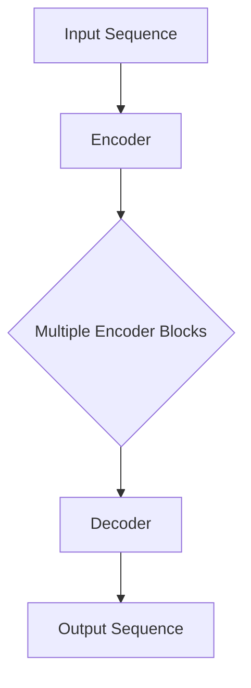
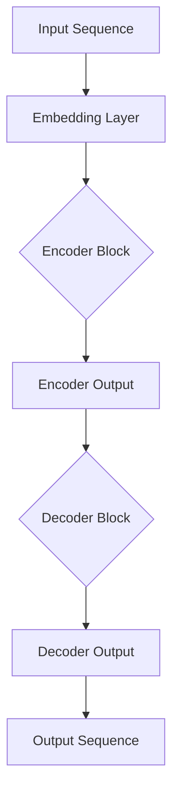

                 

### 文章标题：Transformer原理与代码实例讲解

Transformer作为深度学习领域的一项革命性创新，彻底改变了自然语言处理的格局。它自2017年提出以来，凭借其出色的性能和灵活的架构，迅速成为自然语言处理（NLP）的基石。本文将带您深入探讨Transformer的原理，并辅以代码实例，让读者不仅能理解这一模型的内部机制，还能动手实现它。

关键词：Transformer，自然语言处理，深度学习，自注意力，编码器，解码器，Python，TensorFlow/PyTorch

摘要：本文首先介绍Transformer的背景和基本原理，然后详细讲解其架构和核心算法。接着，我们将通过代码实例展示如何搭建和实现一个基本的Transformer模型，并探讨其实际应用。最后，文章还将提供性能优化技巧和未来展望，帮助读者更全面地掌握Transformer。

### 第一部分：Transformer核心原理

#### 第1章：自然语言处理与Transformer

##### 1.1 自然语言处理基础

自然语言处理（NLP）是人工智能的一个重要分支，旨在使计算机能够理解和处理人类语言。NLP的核心任务包括但不限于：

- **文本分类**：将文本分类到预定义的类别中。
- **情感分析**：分析文本的情感倾向，如正面、负面或中性。
- **命名实体识别**：识别文本中的特定实体，如人名、地名等。
- **机器翻译**：将一种语言的文本翻译成另一种语言。
- **问答系统**：基于用户输入的问答，提供准确的信息或答案。

##### 1.2 Transformer的历史背景

在Transformer之前，Seq2Seq模型是自然语言处理的主要方法。然而，Seq2Seq模型在处理长距离依赖问题时存在明显的缺陷。为了克服这一挑战，研究人员提出了引入Attention机制的Seq2Seq模型，但仍有改进空间。Transformer在2017年由Vaswani等人提出，它通过完全基于注意力机制的架构，解决了传统Seq2Seq模型中的许多问题，并取得了卓越的性能。

Transformer的提出，标志着自然语言处理领域的一个重大突破。其核心思想是将序列编码为固定长度的向量，并通过自注意力机制捕捉序列中不同位置的依赖关系。此外，Transformer还引入了位置编码，使模型能够理解序列中的顺序信息。

#### 第2章：Transformer架构

##### 2.1 Transformer模型概述

Transformer模型由编码器（Encoder）和解码器（Decoder）两部分组成。编码器负责将输入序列编码为固定长度的向量，而解码器则将这些向量解码为输出序列。整个模型的核心在于其自注意力机制（Self-Attention）和多头注意力（Multi-head Attention）。

##### 2.2 Multi-head Attention

Multi-head Attention是Transformer模型中的关键组件，它允许模型同时关注输入序列的不同部分。具体来说，它将输入序列分割成多个头（Head），每个头都执行一次自注意力机制。这些头的输出将被拼接起来，形成一个更丰富的上下文表示。

##### 2.3 Transformer模型架构

Transformer模型由多个编码器和解码器块（Block）堆叠而成。每个块包含两个主要部分：多头自注意力机制和前馈神经网络。此外，模型还包含位置编码（Positional Encoding），用于引入序列中的顺序信息。

以下是一个简单的Mermaid流程图，展示了Transformer模型的基本架构：



#### 第3章：Transformer核心算法原理

##### 3.1 自注意力机制

自注意力机制是Transformer模型的核心，它允许模型在处理每个输入时，动态地关注序列中的其他位置。具体来说，自注意力机制通过计算输入序列的相似度矩阵，然后利用该矩阵来加权输入序列中的每个元素。

以下是一个简单的伪代码，用于实现自注意力机制：

```python
def self_attention(q, k, v, mask=None):
    # 计算相似度矩阵
    sim_matrix = matmul(q, k.T)
    if mask is not None:
        sim_matrix = sim_matrix - mask * 1e9
    
    # 计算注意力权重
    attn_weights = softmax(sim_matrix, axis=-1)
    
    # 加权求和
    attn_output = matmul(attn_weights, v)
    
    return attn_output
```

##### 3.2 Encoder和Decoder的工作机制

编码器（Encoder）负责将输入序列编码为固定长度的向量。每个输入元素首先通过嵌入层（Embedding Layer）转换为嵌入向量，然后通过多个编码器块（Encoder Block）进行编码。每个编码器块包含一个多头自注意力机制和一个前馈神经网络。

解码器（Decoder）负责将编码器的输出解码为输出序列。与编码器类似，解码器也包含多个解码器块（Decoder Block），每个块包含一个多头自注意力机制和一个前馈神经网络。此外，解码器还需要一个额外的自注意力机制，用于从编码器的输出中提取上下文信息。

以下是一个简化的Mermaid流程图，展示了编码器和解码器的工作机制：



##### 3.3 Positional Encoding

位置编码（Positional Encoding）是Transformer模型中引入的另一个关键组件，用于解决序列中的顺序信息。位置编码通过在嵌入向量中添加位置信息，使模型能够理解输入序列的顺序。

以下是一个简单的数学模型，用于实现位置编码：

$$
PE(x) = \sum_{i} p_i \odot e_i
$$

其中，$PE(x)$是位置编码向量，$p_i$是位置索引，$e_i$是位置编码向量。通常，位置编码向量是通过正弦和余弦函数生成的。

以下是一个简单的Python实现示例：

```python
import numpy as np

def positional_encoding(position, d_model):
    pos_encoding = np.zeros((position, d_model))
    div_term = np.exp(np.arange(0, d_model, 2) * -(np.log(10000.0) / d_model))
    
    pos_encoding[:, 0::2] = np.sin(pos_encoding[:, 0::2] * div_term)
    pos_encoding[:, 1::2] = np.cos(pos_encoding[:, 1::2] * div_term)
    
    return pos_encoding
```

### 第二部分：Transformer代码实现与实例

#### 第4章：搭建Transformer开发环境

##### 4.1 Python环境配置

首先，我们需要安装Python环境和必要的库。假设您已经安装了Python 3.6或更高版本，请按照以下步骤进行配置：

1. 创建一个虚拟环境（可选）：

```bash
python -m venv transformer_venv
source transformer_venv/bin/activate  # 对于Windows，使用 `transformer_venv\Scripts\activate`
```

2. 安装所需库：

```bash
pip install numpy tensorflow
```

确保安装的TensorFlow版本与您的Python版本兼容。

##### 4.2 TensorFlow或PyTorch安装

如果您选择使用PyTorch，请按照以下步骤安装：

1. 安装PyTorch：

```bash
pip install torch torchvision
```

2. 安装Torchvision，以支持图像处理功能。

如果您选择使用TensorFlow，请按照以下步骤安装：

1. 安装TensorFlow：

```bash
pip install tensorflow
```

2. 安装TensorFlow Addons，以支持一些增强功能：

```bash
pip install tensorflow-addons
```

确保安装的TensorFlow版本与您的Python版本兼容。

#### 第5章：Transformer代码实例

##### 5.1 编码器与解码器代码实现

在编码器（Encoder）和解码器（Decoder）的实现中，我们将分别定义`Encoder`和`Decoder`类。每个类将包含几个关键组件：嵌入层（Embedding Layer）、多头自注意力机制（Multi-head Self-Attention）、前馈神经网络（Feedforward Neural Network）等。

以下是编码器（Encoder）的代码实现：

```python
import tensorflow as tf

class Encoder(tf.keras.layers.Layer):
    def __init__(self, d_model, num_layers, dff, input_vocab_size, max_seq_length, rate=0.1):
        super(Encoder, self).__init__()
        
        self.d_model = d_model
        self.num_layers = num_layers
        
        # Encoder layers
        self.enc_layers = [EncoderBlock(d_model, dff, rate) for _ in range(num_layers)]
        
        # Positional Encoding
        self.pos_encoding = positional_encoding(max_seq_length, d_model)
    
    def call(self, x, training=False):
        # Add positional encoding
        x = x + self.pos_encoding[: , : tf.shape(x)[1]]
        
        for i in range(self.num_layers):
            x = self.enc_layers[i](x, training)
        
        return x
```

以下是解码器（Decoder）的代码实现：

```python
class Decoder(tf.keras.layers.Layer):
    def __init__(self, d_model, num_layers, dff, target_vocab_size, max_seq_length, rate=0.1):
        super(Decoder, self).__init__()
        
        self.d_model = d_model
        self.num_layers = num_layers
        
        # Decoder layers
        self.dec_layers = [DecoderBlock(d_model, dff, rate) for _ in range(num_layers)]
        
        # Final Dense layer
        self.dec_output = tf.keras.layers.Dense(target_vocab_size)
        
        # Positional Encoding
        self.pos_encoding = positional_encoding(max_seq_length, d_model)
    
    def call(self, x, enc_output, training=False, lookup_table=None):
        # Enc-dec attention padding mask
        enc_output = enc_output[:, : tf.shape(x)[1], :]
        mask = self.create_mask(tf.shape(x)[1], tf.shape(enc_output)[1])
        
        for i in range(self.num_layers):
            x = self.dec_layers[i](x, enc_output, mask, training)
        
        x = self.dec_output(x)
        
        return x
```

##### 5.2 Multi-head Attention实现

Multi-head Attention是实现Transformer模型的关键组件。在实现过程中，我们将首先定义一个`MultiHeadAttention`类，该类将包含多头注意力的关键组成部分：查询（Query）、键（Key）、值（Value）等。

以下是`MultiHeadAttention`类的代码实现：

```python
class MultiHeadAttention(tf.keras.layers.Layer):
    def __init__(self, d_model, num_heads):
        super(MultiHeadAttention, self).__init__()
        
        self.d_model = d_model
        self.num_heads = num_heads
        
        self.query_dense = tf.keras.layers.Dense(d_model)
        self.key_dense = tf.keras.layers.Dense(d_model)
        self.value_dense = tf.keras.layers.Dense(d_model)
        
        self.out_dense = tf.keras.layers.Dense(d_model)
    
    def split_heads(self, x, batch_size):
        x = tf.reshape(x, (batch_size, -1, self.num_heads, self.d_model//self.num_heads))
        return tf.transpose(x, perm=[0, 2, 1, 3])
    
    def call(self, inputs_query, inputs_key, inputs_value, mask=None):
        batch_size = tf.shape(inputs_query)[0]
        
        query = self.query_dense(inputs_query)
        key = self.key_dense(inputs_key)
        value = self.value_dense(inputs_value)
        
        query = self.split_heads(query, batch_size)
        key = self.split_heads(key, batch_size)
        value = self.split_heads(value, batch_size)
        
        attn_output = self.multihead_attn(query, key, value, mask=mask)
        
        attn_output = tf.transpose(attn_output, perm=[0, 2, 1, 3])
        attn_output = tf.reshape(attn_output, (batch_size, -1, self.d_model))
        
        output = self.out_dense(attn_output)
        
        return output
```

以下是多头注意力（Multi-head Attention）的代码实现：

```python
@tf.function(experimental_relax_shapes=True)
def scaled_dot_product_attention(queries, keys, values, mask):
    matmul_mask = tf.ones_like(queries) if mask is None else mask
    # 计算注意力权重
    energy = tf.matmul(queries, keys, transpose_b=True)
    attention_weights = tf.nn.softmax(energy * tf.math.sqrt(float(self.d_model)), axis=-1)
    
    # 计算加权求和
    attention_output = tf.matmul(attention_weights, values)
    
    return attention_output
```

##### 5.3 Transformer整体实现

在整体实现中，我们将定义一个`Transformer`类，该类将包含编码器（Encoder）和解码器（Decoder）的所有组件。同时，我们还将实现模型的前向传播（forward pass）和反向传播（backward pass）。

以下是`Transformer`类的代码实现：

```python
class Transformer(tf.keras.Model):
    def __init__(self, num_layers, d_model, num_heads, dff, input_vocab_size, target_vocab_size, max_input_seq_length, max_target_seq_length, rate=0.1):
        super(Transformer, self).__init__()
        
        self.encoder = Encoder(num_layers, d_model, dff, input_vocab_size, max_input_seq_length, rate)
        self.decoder = Decoder(num_layers, d_model, dff, target_vocab_size, max_target_seq_length, rate)
        
        self.final_layer = tf.keras.layers.Dense(target_vocab_size)
    
    @tf.function(experimental_relax_shapes=True)
    def call(self, inputs, targets, training=False):
        input_enc = self.encoder(inputs, training)
        target_dec = self.decoder(inputs, input_enc, training)
        
        logits = self.final_layer(target_dec)
        
        return logits
```

##### 5.4 Transformer训练与测试

在训练和测试Transformer模型时，我们需要准备合适的数据集，并定义损失函数和优化器。以下是一个简单的训练和测试示例：

```python
# 准备数据集
train_dataset = ...

# 定义损失函数和优化器
model = Transformer(...)
optimizer = tf.keras.optimizers.Adam(learning_rate=0.001)
loss_object = tf.keras.losses.SparseCategoricalCrossentropy(from_logits=True)

# 训练模型
for epoch in range(num_epochs):
    total_loss = 0
    
    for (batch, (input_seq, target_seq)) in enumerate(train_dataset):
        with tf.GradientTape() as tape:
            logits = model(input_seq, target_seq, training=True)
            loss = loss_object(target_seq, logits)
        
        gradients = tape.gradient(loss, model.trainable_variables)
        optimizer.apply_gradients(zip(gradients, model.trainable_variables))
        
        total_loss += loss.numpy()
    
    print(f"Epoch {epoch+1}, Loss: {total_loss / len(train_dataset)}")
    
    # 测试模型
    test_loss = 0
    
    for batch, (input_seq, target_seq) in enumerate(test_dataset):
        logits = model(input_seq, target_seq, training=False)
        loss = loss_object(target_seq, logits)
        
        test_loss += loss.numpy()
    
    print(f"Test Loss: {test_loss / len(test_dataset)}")
```

#### 第6章：实际应用案例

##### 6.1 机器翻译案例

在本案例中，我们将使用Transformer模型进行机器翻译。首先，我们需要准备一个合适的数据集，然后对模型进行训练和评估。

1. **数据准备**：

```python
# 下载并加载数据集
train_data = ...
test_data = ...

# 预处理数据
input_vocab, target_vocab = ...
```

2. **模型训练**：

```python
# 定义模型参数
d_model = 512
num_layers = 3
dff = 2048
num_heads = 8
max_input_seq_length = 100
max_target_seq_length = 100

# 创建模型
model = Transformer(num_layers, d_model, num_heads, dff, input_vocab_size, target_vocab_size, max_input_seq_length, max_target_seq_length)

# 训练模型
num_epochs = 10
model.fit(train_data, epochs=num_epochs, batch_size=64)
```

3. **模型评估**：

```python
# 评估模型
test_loss = model.evaluate(test_data, batch_size=64)
print(f"Test Loss: {test_loss}")
```

##### 6.2 文本生成案例

在本案例中，我们将使用Transformer模型生成文本。首先，我们需要准备一个合适的数据集，然后对模型进行训练和评估。

1. **数据准备**：

```python
# 下载并加载数据集
train_data = ...
test_data = ...

# 预处理数据
input_vocab, target_vocab = ...
```

2. **模型训练**：

```python
# 定义模型参数
d_model = 512
num_layers = 3
dff = 2048
num_heads = 8
max_input_seq_length = 100
max_target_seq_length = 100

# 创建模型
model = Transformer(num_layers, d_model, num_heads, dff, input_vocab_size, target_vocab_size, max_input_seq_length, max_target_seq_length)

# 训练模型
num_epochs = 10
model.fit(train_data, epochs=num_epochs, batch_size=64)
```

3. **文本生成**：

```python
# 生成文本
def generate_text(model, start_string, length=100):
    # 输入序列预处理
    input_seq = tokenizer.encode(start_string, return_tensors='tf')
    
    # 生成文本
    for _ in range(length):
        logits = model(input_seq)
        predictions = tf.argmax(logits, axis=-1)
        input_seq = tf.concat([input_seq, predictions], axis=1)
    
    return tokenizer.decode(predictions[:, -1:], skip_special_tokens=True)
```

#### 第7章：性能优化与实战技巧

##### 7.1 模型性能优化

在训练Transformer模型时，性能优化是一个关键因素。以下是一些常用的优化策略：

1. **批量大小（Batch Size）**：调整批量大小可以影响训练速度和模型性能。通常，批量大小在64到512之间选择。

2. **学习率调度**：学习率对模型训练至关重要。常用的学习率调度策略包括线性衰减、余弦衰减和指数衰减等。

3. **Dropout**：在训练过程中，引入Dropout可以防止模型过拟合。

4. **GPU内存管理**：在训练大型模型时，合理分配GPU内存可以避免内存溢出。

##### 7.2 实战技巧

在实际应用中，以下技巧可以帮助您更好地利用Transformer模型：

1. **数据预处理**：对数据进行适当的预处理，如清洗、归一化和填充，可以改善模型性能。

2. **模型调整**：根据实际需求调整模型参数，如层数、神经元数量和学习率等。

3. **超参数搜索**：使用超参数搜索（如贝叶斯优化）找到最佳参数组合。

4. **模型压缩与量化**：通过模型压缩和量化可以减小模型大小，提高部署效率。

### 第8章：总结与展望

#### 8.1 Transformer的发展与未来方向

Transformer自提出以来，已经取得了许多突破性成果。未来，Transformer可能在以下几个方面继续发展：

1. **模型压缩与优化**：研究更加高效、轻量级的Transformer架构，以满足移动设备和嵌入式系统的需求。

2. **多模态学习**：扩展Transformer，使其能够处理多模态数据，如文本、图像和语音。

3. **动态注意力机制**：研究更加灵活的注意力机制，以捕捉序列中的动态依赖关系。

4. **通用自然语言理解**：实现能够理解自然语言中的复杂逻辑和语义的通用Transformer模型。

#### 8.2 作者寄语

对于读者，我建议：

1. **理论学习与实践相结合**：深入理解Transformer的理论基础，并通过实际代码实现来巩固知识。

2. **持续学习与探索**：Transformer是一个不断发展的领域，保持好奇心和探索精神，持续学习新的研究成果。

3. **应用场景拓展**：尝试将Transformer应用于不同的自然语言处理任务，如文本生成、问答系统和对话系统等。

### 附录

#### A.1 Transformer相关资源

- **论文与书籍推荐**：
  - Vaswani et al. (2017). "Attention Is All You Need."
  - "深度学习"（Goodfellow et al.，2016）
  - "动手学深度学习"（A. Courville et al.，2018）

- **开源代码与工具介绍**：
  - Hugging Face Transformers：https://huggingface.co/transformers
  - TensorFlow 2.0：https://www.tensorflow.org/
  - PyTorch：https://pytorch.org/

#### A.2 练习题与参考答案

- **练习题**：
  1. 解释Transformer中的多头自注意力机制。
  2. 编写一个简单的Transformer编码器和解码器。
  3. 如何实现位置编码？

- **参考答案**：
  1. **多头自注意力机制**：多头自注意力机制允许模型同时关注输入序列的不同部分。它将输入序列分割成多个头（Head），每个头都执行一次自注意力机制。这些头的输出将被拼接起来，形成一个更丰富的上下文表示。
  2. **编码器实现**：

     ```python
     class Encoder(tf.keras.Model):
         def __init__(self, d_model, num_layers, dff, input_vocab_size, max_seq_length, rate=0.1):
             ...
         
         def call(self, x, training=False):
             ...
     ```

  3. **位置编码实现**：

     ```python
     def positional_encoding(position, d_model):
         ...
     ```

以上是关于Transformer原理与代码实例讲解的详细内容。希望本文能帮助您更好地理解Transformer模型，并在实践中应用它。

