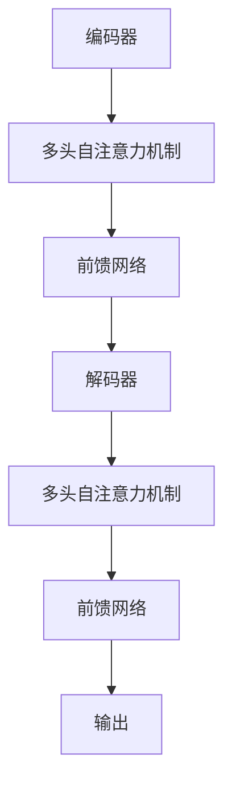

                 

# Transformer大模型实战 前馈网络层

## 关键词
- Transformer
- 前馈网络层
- 实战应用
- 自注意力机制
- 机器翻译
- 语言模型
- 文本分类

## 摘要
本文将深入探讨Transformer大模型中的前馈网络层，通过对其基础概念、核心算法原理、数学模型以及实战应用的详细讲解，帮助读者全面理解前馈网络层在Transformer模型中的重要性。我们将从理论基础出发，逐步引导读者进入实际项目实战，通过具体案例展示前馈网络层的实际应用效果，并提供优化策略和最佳实践，以提升模型性能。

---

## 第一部分：Transformer大模型基础

### 第1章：Transformer简介与原理

#### 1.1 Transformer基本概念

**Transformer的定义**  
Transformer是一种基于自注意力机制的序列到序列模型，最初由Vaswani等人于2017年提出，以其并行计算能力和优秀的性能在机器翻译任务上取得了突破性进展。

**Transformer的核心特点**  
- 并行计算：Transformer通过自注意力机制，可以在一个步骤内处理整个序列，大幅提高了计算效率。
- 模型结构：Transformer由编码器和解码器组成，它们通过自注意力机制和前馈网络层处理输入和输出序列。

#### 1.2 Transformer架构与Mermaid流程图

**Transformer的结构**  
- 编码器（Encoder）：输入序列经过嵌入层、多头自注意力层和前馈网络层处理后，生成编码特征。
- 解码器（Decoder）：编码特征经过嵌入层、多头自注意力层和前馈网络层处理后，生成输出序列。

**自注意力机制**  
自注意力机制允许模型在序列中的每个位置都能考虑到其他所有位置的信息，从而捕捉序列之间的长距离依赖关系。

**前馈网络**  
前馈网络是对自注意力机制的补充，其基本结构是一个线性变换层，用于处理每个位置的特征，增强模型的非线性能力。

#### 1.3 Transformer的工作流程

- **输入编码**：将输入序列转换为向量表示。
- **自注意力计算**：通过自注意力机制计算序列中的依赖关系。
- **前馈网络处理**：对自注意力结果进行前馈网络处理，增强特征表示。
- **输出解码**：解码器将处理后的特征序列解码为输出序列。

### 第2章：核心算法原理讲解

#### 2.1 自注意力机制

**自注意力公式**

$$
\text{Attention}(Q, K, V) = \text{softmax}\left(\frac{QK^T}{\sqrt{d_k}}\right) V
$$

**自注意力计算过程**  
- **查询（Query）**：每个位置生成的向量，用于计算与其他位置的相关性。
- **键（Key）**：序列中的每个位置生成的向量，用于计算与其他位置的相关性。
- **值（Value）**：序列中的每个位置生成的向量，用于加权聚合。

#### 2.2 前馈网络

**前馈网络公式**

$$
\text{FFN}(x) = \max(0, xW_1 + b_1)W_2 + b_2
$$

**前馈网络计算过程**  
- **激活函数**：通常使用ReLU函数作为激活函数，增加模型的非线性能力。

#### 2.3 残差连接与层归一化

**残差连接的作用**  
残差连接可以防止网络层数增加时梯度消失问题，同时提高模型的训练效率。

**层归一化的原理**  
层归一化（Layer Normalization）通过标准化每个位置的激活值，使得模型的训练更加稳定。

### 第3章：数学模型与公式

#### 3.1 Transformer的损失函数

**多头自注意力损失函数**  
多头自注意力层的损失函数是标准交叉熵损失函数。

$$
\text{Loss} = -\frac{1}{N}\sum_{i=1}^{N}\sum_{j=1}^{M}\log p(y_{ij})
$$

**前馈网络损失函数**  
前馈网络层的损失函数也是标准交叉熵损失函数。

$$
\text{Loss} = -\frac{1}{N}\sum_{i=1}^{N}\sum_{j=1}^{M}\log p(y_{ij})
$$

#### 3.2 梯度下降与优化算法

**梯度下降算法**  
梯度下降是一种常用的优化算法，用于最小化损失函数。

$$
\theta_{t+1} = \theta_{t} - \alpha \nabla_\theta J(\theta)
$$

**优化算法（如Adam）**  
Adam算法结合了AdaGrad和RMSProp的优点，在训练深度神经网络时表现良好。

$$
m_t = \beta_1 m_{t-1} + (1 - \beta_1) [g_t - m_{t-1}]
$$
$$
v_t = \beta_2 v_{t-1} + (1 - \beta_2) [g_t^2 - v_{t-1}]
$$
$$
\theta_{t+1} = \theta_{t} - \frac{\alpha}{\sqrt{1 - \beta_2^t}(1 - \beta_1^t)} \frac{m_t}{\sqrt{v_t} + \epsilon}
$$

## 第二部分：Transformer大模型实战

### 第4章：项目实战一 - 语言模型构建

#### 4.1 数据准备与预处理

- **数据集选择**：选择合适的语料库，如Wikipedia。
- **数据预处理步骤**：
  - 分词：将文本拆分为单词或子词。
  - 嵌入：将分词后的文本转换为向量表示。

#### 4.2 模型构建

- **模型结构设计**：使用Transformer编码器和解码器构建语言模型。
- **参数配置**：
  - 嵌入维度：512。
  - 自注意力头数：8。
  - 前馈网络尺寸：2048。

#### 4.3 模型训练与评估

- **训练过程**：
  - 使用梯度下降优化算法训练模型。
  - 调整学习率，避免过拟合。

- **评估指标**：
  - 损失函数：交叉熵损失函数。
  - 评估指标：词汇表中的未登录词概率。

#### 4.4 结果分析与优化

- **结果分析**：分析模型在测试集上的表现。
- **优化策略**：
  - 调整模型参数。
  - 使用数据增强技术。

### 第5章：项目实战二 - 机器翻译

#### 5.1 项目背景

- **机器翻译的重要性**：跨语言交流的桥梁。
- **Transformer在机器翻译中的应用**：提高了翻译的准确性和流畅性。

#### 5.2 模型构建

- **模型设计**：使用Transformer编码器和解码器构建机器翻译模型。
- **参数调整**：
  - 嵌入维度：1024。
  - 自注意力头数：16。
  - 前馈网络尺寸：4096。

#### 5.3 模型训练与评估

- **训练过程**：
  - 使用梯度下降优化算法训练模型。
  - 调整学习率，避免过拟合。

- **评估指标**：
  - 损失函数：交叉熵损失函数。
  - 评估指标：BLEU评分。

#### 5.4 结果分析与优化

- **结果分析**：分析模型在测试集上的表现。
- **优化策略**：
  - 调整模型参数。
  - 使用数据增强技术。

### 第6章：项目实战三 - 文本分类

#### 6.1 项目背景

- **文本分类的重要性**：情感分析、新闻分类等。
- **Transformer在文本分类中的应用**：提高了分类的准确性和鲁棒性。

#### 6.2 模型构建

- **模型设计**：使用Transformer编码器构建文本分类模型。
- **参数调整**：
  - 嵌入维度：512。
  - 自注意力头数：8。
  - 前馈网络尺寸：2048。

#### 6.3 模型训练与评估

- **训练过程**：
  - 使用梯度下降优化算法训练模型。
  - 调整学习率，避免过拟合。

- **评估指标**：
  - 损失函数：交叉熵损失函数。
  - 评估指标：准确率、召回率、F1分数。

#### 6.4 结果分析与优化

- **结果分析**：分析模型在测试集上的表现。
- **优化策略**：
  - 调整模型参数。
  - 使用数据增强技术。

## 第三部分：前馈网络层深入研究

### 第7章：前馈网络层优化策略

#### 7.1 前馈网络层的作用与优化目标

- **前馈网络层的作用**：增强特征表示，提高模型的非线性能力。
- **前馈网络层的优化目标**：减少过拟合，提高模型泛化能力。

#### 7.2 前馈网络层优化方法

- **梯度裁剪**：限制梯度大小，防止梯度爆炸。
- **活性函数调整**：选择合适的激活函数，如ReLU。
- **残差连接的应用**：缓解梯度消失问题，提高模型稳定性。

### 第8章：前馈网络层在多模态学习中的应用

#### 8.1 多模态学习简介

- **多模态学习的定义**：处理包含多个数据模态（如文本、图像、音频）的学习任务。
- **多模态学习的挑战**：模态融合、模态对齐、数据不平衡。

#### 8.2 前馈网络层在多模态学习中的应用

- **图像与文本融合**：使用Transformer的前馈网络层融合图像和文本特征。
- **视频与音频处理**：处理视频和音频序列，提取多模态特征。

#### 8.3 案例研究

- **多模态情感分析**：结合图像、文本和音频的情感信息，进行情感分析。
- **多模态图像识别**：使用多模态特征进行图像分类。

## 附录

### 附录A：Transformer开源框架与工具

#### A.1 TensorFlow 2.x

- **Transformer模型实现**：使用TensorFlow 2.x实现Transformer模型。

#### A.2 PyTorch

- **Transformer模型实现**：使用PyTorch实现Transformer模型。

#### A.3 其他开源框架

- **开源Transformer框架列表**：其他流行的开源Transformer框架，如Hugging Face的Transformers库。

### 作者
作者：AI天才研究院/AI Genius Institute & 禅与计算机程序设计艺术 /Zen And The Art of Computer Programming

本文详细讲解了Transformer大模型中的前馈网络层，包括其基本概念、核心算法原理、数学模型以及实战应用。通过具体的项目实战，展示了前馈网络层在语言模型构建、机器翻译和文本分类中的应用，并提供了优化策略和最佳实践。希望本文能帮助读者全面理解前馈网络层在Transformer模型中的重要性，并掌握其实战技巧。在多模态学习中的应用也为未来研究提供了新的思路。

