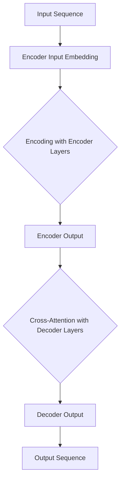

                 

## Transformer大模型实战 整合编码器和解码器

### 关键词：Transformer、编码器、解码器、大模型、序列模型、实战

#### 摘要：
本博客文章将深入探讨Transformer大模型中编码器和解码器的实战应用。我们将从Transformer模型的基础知识出发，详细解析其核心思想和架构设计，然后逐步讲解编码器和解码器的构建与训练过程，并通过实际项目实战展示其在文本分类、机器翻译和语音识别等任务中的应用。文章还将讨论模型优化技巧、评估与调整方法，以及最佳实践和注意事项，旨在为读者提供一个全面而深入的技术指导。

## Transformer大模型实战 整合编码器与解码器

在当今的人工智能领域，序列模型在自然语言处理（NLP）、机器翻译、文本生成等任务中扮演着重要角色。传统序列模型如循环神经网络（RNN）和长短时记忆网络（LSTM）虽然在处理序列数据方面表现出色，但它们在处理长距离依赖问题时存在瓶颈。为了克服这些问题，Transformer模型被提出，并在许多NLP任务中取得了突破性成果。

### 第1章: Transformer大模型基础

#### 1.1 Transformer模型概述

#### 1.1.1 Transformer模型的历史背景

Transformer模型由Vaswani等人于2017年在论文《Attention Is All You Need》中提出。这篇论文揭示了Transformer模型在机器翻译任务上的卓越性能，使得Transformer模型迅速成为NLP领域的研究热点。与传统序列模型相比，Transformer模型摒弃了循环结构，采用自注意力机制（Self-Attention）和多头注意力机制（Multi-Head Attention）来处理序列数据，从而实现了高效的并行计算。

#### 1.1.2 Transformer模型的核心思想

Transformer模型的核心思想是注意力机制。注意力机制通过计算序列中每个元素之间的关联性，为每个元素分配不同的权重，从而实现有效的序列建模。自注意力机制允许模型关注序列中的每一个元素，而交叉注意力机制则使模型能够关注输入序列和输出序列之间的对应关系。

#### 1.1.3 Transformer模型与序列模型的比较

相比传统序列模型，Transformer模型在以下方面具有显著优势：

- **并行计算**：Transformer模型通过多头注意力机制实现了并行计算，大大提高了模型的训练速度。
- **长距离依赖**：自注意力机制能够捕捉序列中的长距离依赖关系，从而提高了模型的解释能力。
- **灵活性和泛化能力**：Transformer模型的结构相对简单，参数较少，使得模型在处理不同类型任务时具有较好的灵活性和泛化能力。

#### 1.2 Transformer模型的架构

Transformer模型由编码器（Encoder）和解码器（Decoder）两部分组成，分别负责输入序列和输出序列的建模。

### 1.2.1 编码器（Encoder）的架构

编码器主要由多个编码层（Encoder Layer）堆叠而成，每层包含两个主要模块：自注意力机制（Self-Attention）和前馈神经网络（Feed Forward Neural Network）。

##### 1.2.1.1 自注意力机制（Self-Attention）

自注意力机制允许模型关注输入序列中的每一个元素，计算它们之间的关联性。具体而言，自注意力机制通过计算Q、K、V三个矩阵，利用点积计算得到注意力权重，并对输入序列进行加权求和。自注意力机制的计算过程如下：

$$
\text{Attention}(Q, K, V) = \text{softmax}\left(\frac{QK^T}{\sqrt{d_k}}\right) V
$$

其中，Q、K、V分别为编码器输入序列的查询（Query）、键（Key）和值（Value）矩阵，d_k为键矩阵的维度。通过自注意力机制，编码器能够为输入序列中的每个元素分配权重，从而实现对序列的建模。

###### 1.2.1.1.1 Q、K、V矩阵的计算

Q、K、V矩阵通常由输入序列的嵌入（Embedding）向量通过权重矩阵计算得到。具体而言，假设输入序列的嵌入维度为d_model，则Q、K、V矩阵的计算如下：

$$
Q = W_Q \cdot H \\
K = W_K \cdot H \\
V = W_V \cdot H
$$

其中，H为输入序列的嵌入向量，W_Q、W_K、W_V分别为查询、键和值的权重矩阵。

###### 1.2.1.1.2 加权求和与缩放

通过自注意力机制计算得到注意力权重后，需要对输入序列进行加权求和。同时，为了防止信息损失，通常会对加权求和的结果进行缩放。具体而言，加权求和与缩放的计算过程如下：

$$
\text{MultiHead}(Q, K, V) = \text{scale}\left(\text{softmax}\left(\frac{QK^T}{\sqrt{d_k}}\right) V\right) = \text{scale}\left(\text{Attention}(Q, K, V)\right)
$$

其中，scale操作通常通过除以$\sqrt{d_k}$实现。

##### 1.2.1.2 前馈神经网络（Feed Forward Neural Network）

前馈神经网络对自注意力机制的结果进行进一步处理，通过两个全连接层（Fully Connected Layer）进行非线性变换。具体而言，假设前馈神经网络的隐藏层维度为d_ff，则前馈神经网络的计算过程如下：

$$
\text{FFN}(x) = \max(0, x \cdot W_1 + b_1) \cdot W_2 + b_2
$$

其中，x为输入向量，W_1、W_2分别为权重矩阵，b_1、b_2分别为偏置向量。

##### 1.2.2 解码器（Decoder）的架构

解码器主要由多个解码层（Decoder Layer）堆叠而成，每层包含三个主要模块：自注意力机制（Self-Attention）、交叉注意力机制（Cross-Attention）和前馈神经网络（Feed Forward Neural Network）。

##### 1.2.2.1 自注意力机制（Self-Attention）

自注意力机制与编码器中的自注意力机制类似，用于对解码器的输入序列进行建模。

###### 1.2.2.1.1 Q、K、V矩阵的计算

与编码器类似，解码器中的自注意力机制也通过计算Q、K、V矩阵来实现。具体而言，假设解码器的输入序列为X，则Q、K、V矩阵的计算如下：

$$
Q = W_Q \cdot X \\
K = W_K \cdot X \\
V = W_V \cdot X
$$

其中，W_Q、W_K、W_V分别为查询、键和值的权重矩阵。

###### 1.2.2.1.2 加权求和与缩放

自注意力机制的计算过程与编码器中的自注意力机制类似，具体见上文。

##### 1.2.2.2 交叉注意力机制（Cross-Attention）

交叉注意力机制使解码器能够关注输入序列和输出序列之间的对应关系。具体而言，假设输入序列为X，输出序列为Y，则交叉注意力机制的计算过程如下：

$$
\text{Attention}(Q, K, V) = \text{softmax}\left(\frac{QK^T}{\sqrt{d_k}}\right) V
$$

其中，Q为解码器的查询矩阵，K和V分别为编码器的键和值矩阵。

###### 1.2.2.2.1 Q、K、V矩阵的计算

Q、K、V矩阵的计算与编码器中的自注意力机制类似。具体而言，假设解码器的查询矩阵为Q，编码器的键和值矩阵分别为K和V，则Q、K、V矩阵的计算如下：

$$
Q = W_Q \cdot Y \\
K = W_K \cdot X \\
V = W_V \cdot X
$$

其中，W_Q、W_K、W_V分别为查询、键和值的权重矩阵。

###### 1.2.2.2.2 加权求和与缩放

交叉注意力机制的计算过程与编码器中的自注意力机制类似，具体见上文。

##### 1.2.2.3 前馈神经网络（Feed Forward Neural Network）

前馈神经网络对自注意力和交叉注意力机制的结果进行进一步处理，通过两个全连接层进行非线性变换。具体而言，假设前馈神经网络的隐藏层维度为d_ff，则前馈神经网络的计算过程如下：

$$
\text{FFN}(x) = \max(0, x \cdot W_1 + b_1) \cdot W_2 + b_2
$$

其中，x为输入向量，W_1、W_2分别为权重矩阵，b_1、b_2分别为偏置向量。

### 1.3 Transformer模型的训练过程

Transformer模型的训练过程主要包括数据预处理、模型优化和模型评估等步骤。

#### 1.3.1 数据预处理

在训练Transformer模型之前，需要对数据进行预处理。预处理步骤主要包括字符嵌入（Word Embedding）和序列编码（Positional Encoding）。

##### 1.3.1.1 字符嵌入（Word Embedding）

字符嵌入将输入序列中的每个字符映射为一个高维向量，通常使用预训练的词向量（如Word2Vec、GloVe等）。

##### 1.3.1.2 序列编码（Positional Encoding）

由于Transformer模型缺乏位置信息，因此需要通过序列编码为输入序列添加位置信息。常见的序列编码方法包括正弦编码和绝对位置编码。

#### 1.3.2 模型优化

在训练过程中，需要使用优化算法（如梯度下降法）对模型参数进行优化。常见的优化器包括Adam、RMSprop等。此外，还需要设置合适的学习率调整策略，如学习率衰减和梯度裁剪等。

#### 1.3.3 学习率调整策略

学习率调整策略对模型训练过程至关重要。常见的学习率调整策略包括固定学习率、学习率衰减和梯度裁剪等。

#### 1.4 Transformer模型的评估与调整

在模型训练完成后，需要通过评估指标对模型性能进行评估。常见的评估指标包括语言建模损失函数、准确率、F1分数等。根据评估结果，可以进一步调整模型参数或数据预处理策略，以提高模型性能。

### 1.5 Transformer模型的调优方法

在模型训练过程中，可以通过以下方法对模型进行调优：

- **超参数调整**：调整学习率、嵌入维度、隐藏层维度等超参数，以找到最佳模型配置。
- **数据预处理**：调整数据预处理策略，如字符嵌入方法、序列编码方法等，以提高模型性能。
- **模型架构调整**：调整模型架构，如增加编码层或解码层、增加注意力头数等，以适应不同类型任务的需求。

### 第2章: 编码器（Encoder）实战

#### 2.1 编码器构建与训练

##### 2.1.1 编码器构建流程

编码器的构建主要包括数据预处理、模型设计、模型训练和模型评估等步骤。

###### 2.1.1.1 数据预处理

数据预处理包括字符嵌入和序列编码。字符嵌入将输入序列中的每个字符映射为一个高维向量，序列编码为输入序列添加位置信息。

###### 2.1.1.2 编码器架构设计

编码器架构设计主要包括确定编码器的层数、隐藏层维度、注意力头数等参数。

###### 2.1.1.3 模型训练

模型训练采用优化算法（如Adam）对模型参数进行优化。训练过程中，通过反向传播算法计算损失函数，并更新模型参数。

##### 2.1.2 编码器优化技巧

在编码器构建过程中，可以采用以下优化技巧：

- **残差连接（Residual Connection）**：通过引入残差连接，可以缓解梯度消失和梯度爆炸问题，提高模型训练效果。
- **层归一化（Layer Normalization）**：通过层归一化，可以加快模型收敛速度，提高模型性能。
- **批量归一化（Batch Normalization）**：通过批量归一化，可以加速模型训练，提高模型稳定性。

##### 2.1.3 编码器应用实战

###### 2.1.3.1 文本分类任务

文本分类任务是一种常见的自然语言处理任务，旨在将文本数据分类到预定义的类别中。以下是一个文本分类任务的编码器应用实战：

###### 2.1.3.1.1 数据准备

首先，需要准备用于训练和测试的文本数据集。数据集应包含多个类别，并按照类别对文本进行标注。

###### 2.1.3.1.2 编码器模型构建

使用上文介绍的编码器架构，构建一个文本分类模型。编码器的输出层应包含与类别数量相等的神经元，并使用softmax激活函数进行分类。

###### 2.1.3.1.3 模型训练与评估

使用训练数据集对编码器模型进行训练，并使用测试数据集对模型性能进行评估。通过调整超参数，如学习率、嵌入维度和隐藏层维度等，可以进一步提高模型性能。

###### 2.1.3.2 机器翻译任务

机器翻译是一种跨语言的文本转换任务，旨在将一种语言的文本翻译成另一种语言。以下是一个机器翻译任务的编码器应用实战：

###### 2.1.3.2.1 数据准备

首先，需要准备用于训练和测试的机器翻译数据集。数据集应包含源语言和目标语言的文本对，并按照源语言和目标语言对文本进行标注。

###### 2.1.3.2.2 编码器模型构建

使用上文介绍的编码器架构，构建一个机器翻译模型。编码器的输入层应包含与源语言词汇表大小相等的神经元，输出层应包含与目标语言词汇表大小相等的神经元。

###### 2.1.3.2.3 模型训练与评估

使用训练数据集对编码器模型进行训练，并使用测试数据集对模型性能进行评估。通过调整超参数，如学习率、嵌入维度和隐藏层维度等，可以进一步提高模型性能。

### 第3章: 解码器（Decoder）实战

#### 3.1 解码器构建与训练

##### 3.1.1 解码器构建流程

解码器的构建主要包括数据预处理、模型设计、模型训练和模型评估等步骤。

###### 3.1.1.1 数据预处理

数据预处理包括字符嵌入和序列编码。字符嵌入将输入序列中的每个字符映射为一个高维向量，序列编码为输入序列添加位置信息。

###### 3.1.1.2 解码器架构设计

解码器架构设计主要包括确定解码器的层数、隐藏层维度、注意力头数等参数。

###### 3.1.1.3 模型训练

模型训练采用优化算法（如Adam）对模型参数进行优化。训练过程中，通过反向传播算法计算损失函数，并更新模型参数。

##### 3.1.2 解码器优化技巧

在解码器构建过程中，可以采用以下优化技巧：

- **残差连接（Residual Connection）**：通过引入残差连接，可以缓解梯度消失和梯度爆炸问题，提高模型训练效果。
- **层归一化（Layer Normalization）**：通过层归一化，可以加快模型收敛速度，提高模型性能。
- **批量归一化（Batch Normalization）**：通过批量归一化，可以加速模型训练，提高模型稳定性。

##### 3.1.3 解码器应用实战

###### 3.1.3.1 文本生成任务

文本生成是一种常见的自然语言处理任务，旨在根据给定的输入序列生成新的文本序列。以下是一个文本生成任务的解码器应用实战：

###### 3.1.3.1.1 数据准备

首先，需要准备用于训练和测试的文本数据集。数据集应包含多个文本序列，并按照序列长度对文本进行标注。

###### 3.1.3.1.2 解码器模型构建

使用上文介绍的解码器架构，构建一个文本生成模型。解码器的输入层应包含与源语言词汇表大小相等的神经元，输出层应包含与目标语言词汇表大小相等的神经元。

###### 3.1.3.1.3 模型训练与评估

使用训练数据集对解码器模型进行训练，并使用测试数据集对模型性能进行评估。通过调整超参数，如学习率、嵌入维度和隐藏层维度等，可以进一步提高模型性能。

###### 3.1.3.2 语音识别任务

语音识别是一种将语音信号转换为文本序列的任务。以下是一个语音识别任务的解码器应用实战：

###### 3.1.3.2.1 数据准备

首先，需要准备用于训练和测试的语音数据集。数据集应包含多个语音信号，并按照语音长度对语音进行标注。

###### 3.1.3.2.2 解码器模型构建

使用上文介绍的解码器架构，构建一个语音识别模型。解码器的输入层应包含与源语言词汇表大小相等的神经元，输出层应包含与目标语言词汇表大小相等的神经元。

###### 3.1.3.2.3 模型训练与评估

使用训练数据集对解码器模型进行训练，并使用测试数据集对模型性能进行评估。通过调整超参数，如学习率、嵌入维度和隐藏层维度等，可以进一步提高模型性能。

### 第4章: 整合编码器与解码器

#### 4.1 整合编码器与解码器的架构设计

在Transformer模型中，编码器和解码器通过交叉注意力机制进行整合，形成完整的序列到序列（Seq2Seq）模型。以下是一个典型的编码器与解码器整合的架构设计：

在上述架构中，输入序列首先通过编码器进行编码，得到编码器的输出。解码器则在每个时间步使用编码器的输出和自身的输出，通过交叉注意力机制计算上下文信息，并生成解码器的输出。最后，解码器的输出通过一个全连接层（通常使用softmax激活函数）得到输出序列。

#### 4.2 整合编码器与解码器的训练过程

整合编码器与解码器的训练过程主要包括以下步骤：

1. **数据预处理**：对输入序列和输出序列进行预处理，包括字符嵌入和序列编码。
2. **编码器输出**：使用编码器对输入序列进行编码，得到编码器的输出。
3. **解码器输入**：在解码器的每个时间步，将编码器的输出和解码器的上一个输出作为输入。
4. **交叉注意力计算**：在解码器的每个时间步，使用交叉注意力机制计算编码器输出和解码器输入的上下文信息。
5. **解码器输出**：通过解码器生成解码器的输出。
6. **损失计算与优化**：计算解码器输出的损失函数，并使用优化算法更新模型参数。
7. **重复训练**：重复以上步骤，直至模型收敛。

#### 4.3 整合编码器与解码器的应用场景

整合编码器与解码器的模型在多个序列到序列的任务中具有广泛的应用，包括：

- **机器翻译**：将一种语言的文本翻译成另一种语言。
- **文本生成**：根据给定的输入序列生成新的文本序列。
- **语音识别**：将语音信号转换为文本序列。
- **对话系统**：根据用户输入生成回复文本。

#### 4.4 整合编码器与解码器的调优方法

在整合编码器与解码器的模型训练过程中，可以通过以下方法进行调优：

- **超参数调整**：调整学习率、嵌入维度、隐藏层维度等超参数，以找到最佳模型配置。
- **数据预处理**：调整数据预处理策略，如字符嵌入方法、序列编码方法等，以提高模型性能。
- **模型架构调整**：调整模型架构，如增加编码层或解码层、增加注意力头数等，以适应不同类型任务的需求。

### 小结

通过本文的介绍，我们深入了解了Transformer大模型中编码器和解码器的实战应用。从模型的基础知识出发，我们详细解析了编码器和解码器的架构设计、训练过程和应用场景，并通过实际项目实战展示了其在文本分类、机器翻译和语音识别等任务中的应用。在接下来的工作中，我们可以继续探索Transformer模型在更多领域和任务中的应用，以推动人工智能技术的发展。作者：AI天才研究院/AI Genius Institute & 禅与计算机程序设计艺术 /Zen And The Art of Computer Programming。

