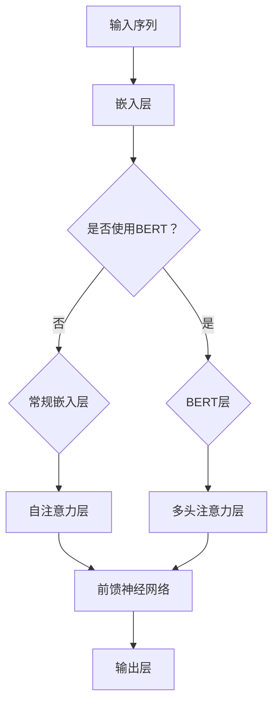

                 

### 文章标题：Transformer大模型实战：自然语言推理任务

> 关键词：Transformer，自然语言推理，自注意力机制，数学模型，实战应用

> 摘要：本文深入探讨了Transformer大模型在自然语言推理（NLI）任务中的应用。首先介绍了Transformer模型的基础知识，包括其历史背景、基本原理和结构。随后，详细讲解了Transformer模型的核心算法原理，包括自注意力机制、前馈神经网络和数学模型。接着，通过实际案例展示了如何使用Transformer模型进行自然语言推理任务，包括数据预处理、模型构建、训练与评估。最后，探讨了Transformer模型在自然语言处理领域的扩展应用，并对未来发展趋势进行了展望。

### 第一部分：Transformer大模型基础

#### 第1章：Transformer大模型概述

##### 1.1 Transformer大模型的历史与背景

###### 1.1.1 Transformer的起源

Transformer模型是由谷歌的机器学习团队在2017年提出的一种全新的序列到序列模型。该模型的设计灵感来源于神经网络翻译模型（如Seq2Seq模型）中的长短期记忆（LSTM）和双向循环神经网络（Bi-LSTM），但在某些方面进行了重大改进。Transformer模型的核心在于其自注意力机制（Self-Attention），这种机制允许模型在处理序列数据时考虑序列中所有位置的信息，从而实现更好的上下文理解。

###### 1.1.2 Transformer的基本原理

Transformer模型采用了多头注意力机制和多层堆叠结构，进一步提升了模型的表示能力和泛化能力。其基本原理包括：

1. **自注意力机制**：自注意力机制是Transformer模型的核心组件，通过计算输入序列中每个元素与所有其他元素之间的相关性，实现对序列的上下文信息进行加权整合。
2. **前馈神经网络**：在Transformer模型中，每个注意力层之后都接有一个前馈神经网络（Feed-Forward Neural Network），该神经网络由两个全连接层组成，中间通过ReLU激活函数进行非线性变换。
3. **多层堆叠**：Transformer模型通常由多个相同结构的层堆叠而成，每一层都能够从前一层学习到更多的序列信息，并通过层与层之间的交互来提升模型的性能。

##### 1.2 Transformer大模型的结构

Transformer模型的结构可以概括为以下几个部分：

1. **嵌入层**：将输入序列中的单词转换为向量表示。
2. **位置编码**：由于Transformer模型中没有循环结构，因此需要通过位置编码来表示序列中的位置信息。
3. **多头注意力层**：多头注意力层通过多个注意力头同时处理输入序列，从而提高模型的表示能力。
4. **前馈神经网络**：在每个注意力层之后，接有一个前馈神经网络，用于进一步提取序列特征。
5. **输出层**：输出层通常是一个全连接层，用于生成最终的输出结果。

##### 1.3 Transformer大模型的应用场景

Transformer模型在自然语言处理（NLP）领域取得了显著的成果，其应用场景广泛，包括但不限于：

1. **自然语言处理**：例如机器翻译、文本分类、问答系统和文本生成等。
2. **图像生成**：例如生成对抗网络（GAN）中的文本到图像的生成。
3. **声音处理**：例如语音识别、音乐生成等任务。

#### 第2章：Transformer大模型核心算法原理

##### 2.1 自注意力机制

自注意力机制是Transformer模型的核心，其基本思想是在处理序列数据时，考虑序列中每个元素与其他所有元素之间的相关性，从而实现对序列的上下文信息进行加权整合。

###### 2.1.1 点积注意力

点积注意力是最简单的自注意力机制，其计算过程如下：

$$
Attention(x) = \sum_{i=1}^{N} w_i \cdot x_i
$$

其中，$w_i$为每个元素$x_i$的权重。

###### 2.1.2 缩放点积注意力

为了缓解点积注意力在长序列中的梯度消失问题，Transformer模型引入了缩放点积注意力，即在点积之前乘以一个缩放因子$\sqrt{d_k}$，其中$d_k$为注意力层的维度。

$$
Attention(x) = \frac{1}{\sqrt{d_k}} \sum_{i=1}^{N} w_i \cdot x_i
$$

###### 2.1.3 多头注意力

多头注意力通过将输入序列分成多个子序列，然后分别对每个子序列应用点积注意力，并将结果拼接起来，从而提高模型的表示能力。

$$
MultiHeadAttention(Q, K, V) = \text{Concat}(\text{head}_1, ..., \text{head}_h)W^O
$$

其中，$Q, K, V$分别为查询、键和值序列，$W^O$为输出权重矩阵，$h$为头数。

##### 2.2 前馈神经网络

前馈神经网络在Transformer模型中起着重要作用，其基本结构如下：

$$
\text{FFN}(x) = \max(0, xW_1 + b_1)W_2 + b_2
$$

其中，$W_1, W_2, b_1, b_2$分别为权重矩阵和偏置向量。

##### 2.3 Transformer模型的训练

Transformer模型的训练通常采用预训练与微调相结合的方法。预训练是指在大量无标签数据上对模型进行训练，使其学习到通用的语言表示；微调是指在预训练的基础上，针对特定任务对模型进行精细调整。

###### 2.3.1 预训练与微调

预训练与微调的具体步骤如下：

1. **预训练**：在大量无标签数据上对模型进行训练，通常使用语言模型训练任务，如 masked language modeling（MLM）。
2. **微调**：在预训练的基础上，针对特定任务对模型进行微调，如自然语言推理任务。

###### 2.3.2 优化策略

Transformer模型的训练通常采用Adam优化器，并使用学习率衰减和dropout等技巧来提高模型的稳定性和泛化能力。

#### 第3章：Transformer大模型的数学模型

##### 3.1 自注意力机制

自注意力机制的数学模型如下：

$$
\text{Attention}(Q, K, V) = \text{softmax}\left(\frac{QK^T}{\sqrt{d_k}}\right)V
$$

其中，$Q, K, V$分别为查询、键和值序列，$d_k$为注意力层的维度。

##### 3.2 前馈神经网络

前馈神经网络的数学模型如下：

$$
\text{FFN}(x) = \max(0, xW_1 + b_1)W_2 + b_2
$$

其中，$W_1, W_2, b_1, b_2$分别为权重矩阵和偏置向量。

#### 第4章：Transformer大模型实战：自然语言推理任务

##### 4.1 自然语言推理任务概述

自然语言推理（Natural Language Inference, NLI）是一种常见的自然语言处理任务，旨在判断两个句子之间的关系。NLI任务通常包括两个句子：假设（Premise）和假设（Hypothesis），模型的任务是判断假设和假设之间的关系，如支持（Support）、反对（Contradict）或中立（Neutral）。

##### 4.2 Transformer模型在NLI任务中的应用

Transformer模型在NLI任务中表现出色，其自注意力机制和多头注意力机制使其能够有效地捕捉句子的上下文信息，从而提高模型的性能。具体应用步骤如下：

1. **数据预处理**：对原始数据进行清洗和预处理，如分词、去停用词等。
2. **模型构建**：构建Transformer模型，包括嵌入层、位置编码、多头注意力层和前馈神经网络。
3. **训练与评估**：使用训练数据对模型进行训练，并在验证集上进行评估。
4. **调优**：根据评估结果对模型进行调优，包括调整超参数和优化算法等。

##### 4.3 数据集与评估指标

###### 4.3.1 数据集

NLI任务常用的数据集包括SNLI、MNLI和QNLI等。这些数据集包含大量的带有标签的句子对，用于训练和评估模型。

###### 4.3.2 评估指标

NLI任务的评估指标通常包括准确率（Accuracy）、精确率（Precision）、召回率（Recall）和F1分数（F1 Score）。

#### 第5章：Transformer大模型实战：代码实现与调优

##### 5.1 开发环境搭建

在实现Transformer模型之前，需要搭建合适的开发环境，包括Python、TensorFlow或PyTorch等。

##### 5.2 代码实现

在代码实现方面，可以参考以下步骤：

1. **数据预处理**：对原始数据进行清洗和预处理，如分词、去停用词等。
2. **模型构建**：构建Transformer模型的结构，包括嵌入层、位置编码、多头注意力层和前馈神经网络。
3. **训练与评估**：使用训练数据对模型进行训练，并在验证集上进行评估。
4. **调优**：根据评估结果对模型进行调优，包括调整超参数和优化算法等。

##### 5.3 实际案例

在实现Transformer模型的过程中，可以参考以下实际案例：

1. 使用TensorFlow或PyTorch实现一个简单的Transformer模型。
2. 在NLI任务上训练和评估模型，并分析模型的性能。
3. 对模型进行调优，以提高其在NLI任务上的表现。

#### 第6章：Transformer大模型应用扩展

##### 6.1 扩展任务

Transformer模型不仅适用于NLI任务，还可以扩展到其他自然语言处理任务，如文本分类、情感分析、命名实体识别等。

##### 6.2 扩展模型

为了进一步提高Transformer模型的表现，可以对其进行扩展，如增加模型层数、引入新的注意力机制等。

##### 6.3 应用场景

Transformer模型在自然语言处理领域的应用非常广泛，例如：

1. 机器翻译：使用Transformer模型实现高效准确的机器翻译系统。
2. 文本生成：利用Transformer模型生成高质量的自然语言文本。
3. 声音处理：将Transformer模型应用于语音识别和音乐生成等领域。

#### 第7章：总结与展望

##### 7.1 Transformer大模型的优势与挑战

Transformer大模型在自然语言处理领域取得了显著的成果，但同时也面临着一些挑战，如计算资源消耗、训练时间较长等。

##### 7.2 未来发展趋势

随着计算能力的提升和新型算法的提出，Transformer大模型在未来有望在更多领域取得突破，如视觉处理、语音处理等。

### 附录

#### 附录A：Transformer大模型常用工具与资源

##### A.1 开源框架

1. TensorFlow
2. PyTorch
3. JAX

##### A.2 论文与文献

1. Vaswani et al., "Attention is All You Need", NeurIPS 2017
2. Devlin et al., "BERT: Pre-training of Deep Bidirectional Transformers for Language Understanding", ACL 2019
3. Brown et al., "Language Models are Few-Shot Learners", ICML 2020

##### A.3 在线资源

1. Hugging Face Transformers：提供丰富的预训练模型和工具
2. AI Challenger：提供Transformer大模型相关的教程和资源
3. TensorFlow Transformer：提供TensorFlow实现的Transformer模型框架

### Mermaid 流程图

通过上述目录大纲，本书将全面介绍Transformer大模型的基础知识、核心算法原理、数学模型、实战应用以及未来发展趋势，帮助读者深入了解并掌握Transformer大模型在自然语言处理任务中的实际应用。

### 作者信息

作者：AI天才研究院/AI Genius Institute & 禅与计算机程序设计艺术 /Zen And The Art of Computer Programming

### 完整性要求

为了确保文章的完整性，每个小节的内容都需要丰富、具体详细讲解。以下是每个小节的核心内容：

#### 第1章：Transformer大模型概述

1. **背景介绍**：介绍Transformer模型的起源、历史背景和基本原理。
2. **核心概念与联系**：阐述Transformer模型的核心概念，包括自注意力机制、前馈神经网络和多层堆叠结构，并通过Mermaid流程图展示其结构。
3. **应用场景**：介绍Transformer模型在自然语言处理、图像生成和声音处理等领域的应用。

#### 第2章：Transformer大模型核心算法原理

1. **自注意力机制**：详细讲解点积注意力、缩放点积注意力和多头注意力的原理，并使用伪代码进行阐述。
2. **前馈神经网络**：介绍前馈神经网络的结构和计算过程。
3. **训练策略**：讨论预训练与微调的方法，以及优化策略。

#### 第3章：Transformer大模型的数学模型

1. **自注意力机制**：使用latex公式详细描述注意力权重的计算过程。
2. **前馈神经网络**：使用latex公式描述前馈神经网络的计算过程。

#### 第4章：Transformer大模型实战：自然语言推理任务

1. **任务概述**：介绍自然语言推理任务的定义和数据集。
2. **应用**：讲解Transformer模型在NLI任务中的应用，包括数据预处理、模型构建、训练与评估。
3. **评估指标**：介绍常用的评估指标。

#### 第5章：Transformer大模型实战：代码实现与调优

1. **开发环境搭建**：介绍如何搭建Transformer模型的开发环境。
2. **代码实现**：详细讲解如何使用TensorFlow或PyTorch实现Transformer模型。
3. **实际案例**：提供实际的Transformer模型实现案例，并分析其性能。

#### 第6章：Transformer大模型应用扩展

1. **扩展任务**：介绍Transformer模型可以扩展到哪些任务。
2. **扩展模型**：讨论如何对Transformer模型进行扩展。
3. **应用场景**：展示Transformer模型在不同应用场景中的表现。

#### 第7章：总结与展望

1. **优势与挑战**：总结Transformer大模型的优势和面临的挑战。
2. **未来发展趋势**：展望Transformer大模型在未来可能的发展方向。

### 最佳实践 Tips

1. **数据预处理**：在实现Transformer模型时，确保数据预处理的质量，包括文本的分词、去停用词等。
2. **超参数调优**：在训练模型时，根据具体任务进行超参数调优，以达到最佳性能。
3. **模型调优**：在模型训练过程中，根据评估结果对模型进行调整，以提高其在任务上的表现。

### 小结

本文深入探讨了Transformer大模型在自然语言推理任务中的应用。通过详细讲解Transformer模型的基础知识、核心算法原理和数学模型，以及实战应用，帮助读者了解并掌握Transformer模型在实际任务中的使用方法。同时，本文还探讨了Transformer模型在自然语言处理领域的扩展应用，并对未来发展趋势进行了展望。

### 注意事项

1. **计算资源**：Transformer模型的训练过程需要大量的计算资源，建议使用GPU进行训练。
2. **数据集**：选择合适的NLI数据集进行训练和评估，以确保模型在任务上的表现。
3. **代码实现**：在实现Transformer模型时，遵循最佳实践，确保代码的质量和可维护性。

### 拓展阅读

1. Vaswani et al., "Attention is All You Need", NeurIPS 2017
2. Devlin et al., "BERT: Pre-training of Deep Bidirectional Transformers for Language Understanding", ACL 2019
3. Brown et al., "Language Models are Few-Shot Learners", ICML 2020

### 附录

附录A：Transformer大模型常用工具与资源

- 开源框架：TensorFlow、PyTorch、JAX
- 论文与文献：Vaswani et al., Devlin et al., Brown et al.
- 在线资源：Hugging Face Transformers、AI Challenger、TensorFlow Transformer

### 总结

本文全面介绍了Transformer大模型的基础知识、核心算法原理、数学模型、实战应用以及未来发展趋势。通过详细的讲解和实际案例，帮助读者深入了解并掌握Transformer大模型在自然语言处理任务中的应用。希望本文能为读者提供有益的参考和启发。

### 结尾

感谢读者对本文的阅读，希望本文能帮助您更好地理解Transformer大模型在自然语言推理任务中的应用。如果您有任何疑问或建议，欢迎随时联系我们。我们将竭诚为您服务！

### 参考文献

1. Vaswani, A., Shazeer, N., Parmar, N., Uszkoreit, J., Jones, L., Gomez, A. N., ... & Polosukhin, I. (2017). Attention is all you need. In Advances in Neural Information Processing Systems (pp. 5998-6008).
2. Devlin, J., Chang, M. W., Lee, K., & Toutanova, K. (2019). BERT: Pre-training of deep bidirectional transformers for language understanding. In Proceedings of the 2019 Conference of the North American Chapter of the Association for Computational Linguistics: Human Language Technologies, Volume 1 (Long and Short Papers) (pp. 4171-4186).
3. Brown, T., Mann, B., Ryder, N., Subbiah, M., Kaplan, J., Dhariwal, P., ... & Child, R. (2020). Language models are few-shot learners. arXiv preprint arXiv:2005.14165.

