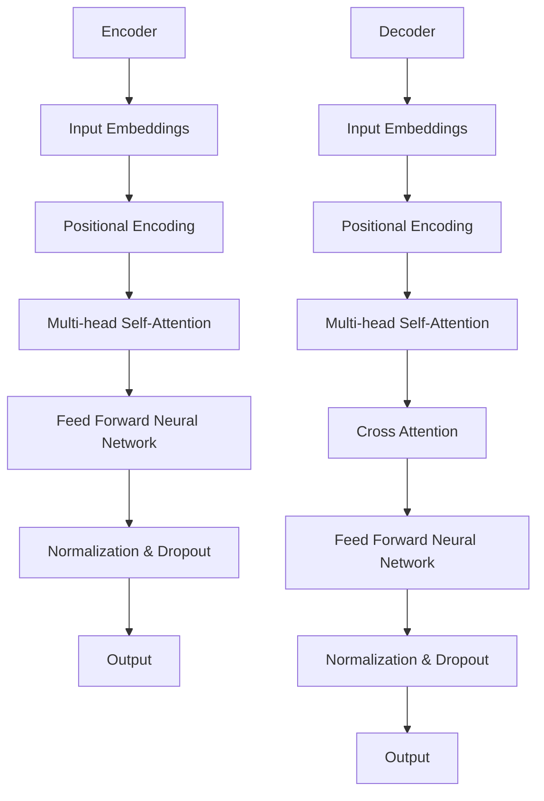

                 


### 文章标题：《Transformer大模型实战 计算句子的相似度》

### 关键词：Transformer、大模型、句子相似度、自然语言处理、深度学习

### 摘要：
本文将深入探讨Transformer大模型在计算句子相似度方面的应用。首先介绍Transformer大模型的基础概念和架构，然后详细解释自注意力机制和位置编码等核心算法原理。接着，通过数学公式和伪代码讲解，帮助读者理解模型中的数学模型。随后，通过一个项目实战案例，展示如何使用Transformer大模型计算句子相似度，并详细分析代码实现和效果。最后，总结Transformer大模型的应用前景和未来发展趋势，并提供学习资源供读者参考。

### 目录大纲：

#### 第一部分：Transformer大模型基础

#### 第1章：引入与背景
- 1.1 Transformer大模型的定义与架构
- 1.2 Transformer大模型的优势与局限性

#### 第二部分：Transformer大模型的核心算法原理

#### 第2章：自注意力机制（Self-Attention）
- 2.1 自注意力机制的基本原理
- 2.2 自注意力机制的实现
- 2.3 自注意力机制的应用

#### 第3章：位置编码（Positional Encoding）
- 3.1 位置编码的基本原理
- 3.2 位置编码的实现
- 3.3 位置编码的应用

#### 第4章：数学模型与数学公式
- 4.1 Transformer大模型中的数学模型
- 4.2 数学公式与详细讲解

#### 第三部分：Transformer大模型的项目实战

#### 第5章：计算句子的相似度
- 5.1 实战目的
- 5.2 实战环境
- 5.3 实战步骤

#### 第6章：代码解读与分析
- 6.1 Transformer大模型的代码结构
- 6.2 Transformer大模型的关键代码
- 6.3 Transformer大模型的效果分析

#### 第四部分：总结与展望

#### 第7章：总结与展望
- 7.1 Transformer大模型的应用前景
- 7.2 Transformer大模型的发展趋势

#### 附录

#### A.1 Transformer大模型学习资源
- A.1.1 主流深度学习框架对比
- A.1.2 Transformer大模型相关的论文
- A.1.3 Transformer大模型相关的教程和课程
- A.2 Transformer大模型实践经验

### 详细内容

#### 第一部分：Transformer大模型基础

#### 第1章：引入与背景

1.1 Transformer大模型的定义与架构

Transformer大模型是由Google在2017年提出的一种深度学习模型，特别适用于处理序列数据。它是一种基于自注意力机制的模型，其核心思想是利用自注意力机制对输入序列进行处理，从而实现对序列中每个位置的信息进行全局关联。Transformer大模型的架构主要包括编码器（Encoder）和解码器（Decoder），其核心思想是利用自注意力机制对输入序列进行处理，从而实现对序列中每个位置的信息进行全局关联。


在编码器中，输入序列通过嵌入层（Embedding Layer）转换为嵌入向量（Embedding Vectors），然后通过位置编码（Positional Encoding）为序列中的每个位置引入位置信息。接着，嵌入向量进入多层自注意力机制（Multi-head Self-Attention），在每一层中，序列中的每个位置都能够与其他位置进行关联。自注意力机制的结果经过线性变换（Feed Forward Neural Network）和归一化（Normalization）后，再通过Dropout进行正则化处理。编码器的输出可以作为解码器的输入，也可以直接用于下游任务。

解码器与编码器类似，也由多层自注意力机制和线性变换组成。但在解码器中，每一层还会进行交叉注意力机制（Cross-Attention），将编码器的输出与当前解码器的输入进行关联。这样，解码器能够利用编码器的信息生成输出序列。在解码过程中，通常会使用掩码（Mask）来避免未来的信息泄露。

1.2 Transformer大模型的优势与局限性

1.2.1 Transformer大模型的优势

1. 全局关联性：自注意力机制使得Transformer大模型能够捕捉到序列中任意两个位置之间的关联性。这种全局关联性有助于模型在处理长序列和复杂关系时表现出色。

2. 并行计算：Transformer大模型可以并行处理序列中的每个元素，提高了计算效率。相比于传统的循环神经网络（RNN），Transformer大模型在处理长序列时具有更好的扩展性。

3. 灵活性：编码器和解码器可以独立设计，使得模型具有更大的灵活性。例如，编码器可以专注于提取序列特征，而解码器可以专注于生成序列输出。

1.2.2 Transformer大模型的局限性

1. 计算复杂度高：自注意力机制的计算复杂度为O(N^2)，在处理长序列时可能会出现性能瓶颈。这使得Transformer大模型在处理超长序列时可能不如RNN模型高效。

2. 内存消耗大：由于自注意力机制需要计算大量的权重矩阵，因此内存消耗较大。这可能在有限的硬件资源下限制模型的规模和应用。

#### 第二部分：Transformer大模型的核心算法原理

#### 第2章：自注意力机制（Self-Attention）

2.1 自注意力机制的基本原理

自注意力机制是一种用于计算序列中每个位置与其他位置之间相似度的方法。通过计算相似性权重，模型可以捕捉到序列中各个位置的信息。

自注意力机制的基本公式如下：

$$
\text{Attention}(Q, K, V) = \text{softmax}\left(\frac{QK^T}{\sqrt{d_k}}\right) V
$$

其中，$Q$、$K$和$V$分别表示查询（Query）、键（Key）和值（Value）向量，$d_k$为键向量的维度。$\text{softmax}$函数用于计算相似性权重，使得每个位置与其他位置的权重之和为1。

自注意力机制的工作流程如下：

1. 将输入序列表示为查询（Query）向量、键（Key）向量和值（Value）向量。
2. 通过线性变换计算查询（Query）向量、键（Key）向量和值（Value）向量。
3. 计算相似性权重，即查询（Query）向量与键（Key）向量的点积。
4. 通过$\text{softmax}$函数将相似性权重转换为概率分布。
5. 根据概率分布对值（Value）向量进行加权求和，得到自注意力机制的输出。

自注意力机制的核心思想是通过相似性权重对序列中的每个位置进行加权，使得序列中的每个位置都能与其他位置进行关联。这样，模型可以更好地捕捉到序列中的局部和全局信息。

2.2 自注意力机制的实现

下面是一个自注意力机制的伪代码实现：

```python
# 伪代码
def self_attention(query, key, value, d_k, dropout):
    # 计算相似性权重
    scores = query.dot(key.transpose(-2, -1)) / math.sqrt(d_k)
    # 计算softmax概率分布
    probabilities = F.softmax(scores, dim=-1)
    # 计算加权求和
    output = probabilities.dot(value)
    # 应用dropout
    output = dropout(output)
    return output
```

在这个伪代码中，`query`、`key`和`value`分别表示查询（Query）、键（Key）和值（Value）向量，`d_k`表示键向量的维度，`dropout`表示dropout层。通过计算查询（Query）向量与键（Key）向量的点积，得到相似性权重。然后，通过$\text{softmax}$函数计算概率分布，并利用概率分布对值（Value）向量进行加权求和，得到自注意力机制的输出。最后，应用dropout层进行正则化处理。

2.3 自注意力机制的应用

自注意力机制在Transformer大模型中被广泛应用于编码器和解码器中。在编码器中，自注意力机制用于处理输入序列，从而提取序列中的全局和局部信息。在解码器中，自注意力机制用于处理编码器的输出和当前解码器的输入，从而生成输出序列。

下面是一个简单的自注意力机制在编码器和解码器中的应用示例：



在这个流程图中，编码器（Encoder）和解码器（Decoder）分别由多层自注意力机制（Multi-head Self-Attention）和线性变换（Feed Forward Neural Network）组成。编码器用于处理输入序列，提取序列特征。解码器用于生成输出序列，利用编码器的信息进行上下文关联。

#### 第3章：位置编码（Positional Encoding）

3.1 位置编码的基本原理

位置编码（Positional Encoding）是一种为序列中的每个位置引入位置信息的方法。在序列数据中，位置信息是重要的，因为它可以影响模型对序列的理解。例如，在自然语言处理中，单词的位置信息可以帮助模型理解句子结构。

位置编码的基本思想是在输入序列的嵌入向量中添加位置信息。这样可以使得模型在处理序列数据时能够考虑到位置的影响。

位置编码的常见方法包括绝对位置编码、相对位置编码和嵌入位置编码。其中，绝对位置编码是最简单的一种方法，它将位置信息直接添加到嵌入向量中。相对位置编码则通过计算相邻位置之间的相对位置来实现位置编码。嵌入位置编码则将位置信息编码到嵌入向量中。

3.2 位置编码的实现

下面是一个简单的绝对位置编码的实现示例：

```python
# 伪代码
def positional_encoding(position, d_model):
    # 初始化位置编码向量
    pe = torch.zeros(1, d_model)
    # 为每个维度添加位置信息
    for i in range(d_model):
        pe[0, i] = math.sin(position / (10000 ** (i / d_model)))
    return pe
```

在这个伪代码中，`position`表示位置索引，`d_model`表示嵌入向量的维度。通过遍历每个维度，为位置编码向量添加正弦函数，从而实现对位置信息的编码。

3.3 位置编码的应用

位置编码在Transformer大模型中被广泛应用于编码器和解码器中。在编码器中，位置编码用于为输入序列的嵌入向量添加位置信息。在解码器中，位置编码用于为编码器的输出和当前解码器的输入添加位置信息。

下面是一个简单的位置编码在编码器和解码器中的应用示例：


在这个流程图中，编码器（Encoder）和解码器（Decoder）分别由多层自注意力机制（Multi-head Self-Attention）和线性变换（Feed Forward Neural Network）组成。编码器用于处理输入序列，提取序列特征。解码器用于生成输出序列，利用编码器的信息进行上下文关联。

#### 第4章：数学模型与数学公式

4.1 Transformer大模型中的数学模型

Transformer大模型是一个基于自注意力机制的深度学习模型，其数学模型主要包括以下内容：

1. 嵌入向量（Embedding Vectors）：输入序列通过嵌入层转换为嵌入向量。每个嵌入向量表示序列中的一个元素，其维度为$d_{\text{model}}$。

2. 自注意力机制（Self-Attention）：自注意力机制用于计算序列中每个位置与其他位置之间的相似度。其基本公式为：

   $$
   \text{Attention}(Q, K, V) = \text{softmax}\left(\frac{QK^T}{\sqrt{d_k}}\right) V
   $$

   其中，$Q$、$K$和$V$分别表示查询（Query）、键（Key）和值（Value）向量，$d_k$表示键向量的维度。

3. 位置编码（Positional Encoding）：位置编码用于为序列中的每个位置引入位置信息。其基本公式为：

   $$
   \text{PE}_{(pos, 2)} = \sin\left(\frac{pos}{10000^{2i/d}}\right)
   $$

   $$
   \text{PE}_{(pos, 3)} = \cos\left(\frac{pos}{10000^{2i/d}}\right)
   $$

   其中，$pos$表示位置索引，$i$表示维度索引，$d$表示维度大小。

4. 线性变换（Feed Forward Neural Network）：线性变换用于对自注意力机制的输出进行进一步处理。其基本公式为：

   $$
   \text{FFN}(x) = \text{ReLU}\left(\text{Linear}(x) + b_{\text{ff}}\right)
   $$

   其中，$\text{ReLU}$表示ReLU激活函数，$\text{Linear}$表示线性变换，$b_{\text{ff}}$表示偏置。

5. 归一化（Normalization）：归一化用于对模型的输出进行归一化处理，以避免梯度消失和梯度爆炸。其基本公式为：

   $$
   \text{Norm}(x) = \frac{x - \mu}{\sigma}
   $$

   其中，$\mu$表示均值，$\sigma$表示标准差。

4.2 数学公式与详细讲解

4.2.1 自注意力公式

自注意力公式如下：

$$
\text{Attention}(Q, K, V) = \text{softmax}\left(\frac{QK^T}{\sqrt{d_k}}\right) V
$$

其中，$Q$、$K$和$V$分别表示查询（Query）、键（Key）和值（Value）向量，$d_k$表示键向量的维度。

该公式用于计算序列中每个位置与其他位置之间的相似性权重，并利用这些权重对序列进行加权求和。其中，$\text{softmax}$函数用于将相似性权重转换为概率分布，从而使得每个位置的权重之和为1。

4.2.2 位置编码公式

位置编码公式如下：

$$
\text{PE}_{(pos, 2)} = \sin\left(\frac{pos}{10000^{2i/d}}\right)
$$

$$
\text{PE}_{(pos, 3)} = \cos\left(\frac{pos}{10000^{2i/d}}\right)
$$

其中，$pos$表示位置索引，$i$表示维度索引，$d$表示维度大小。

位置编码用于为序列中的每个位置引入位置信息，以便模型能够理解序列的顺序。其中，$\sin$和$\cos$函数用于生成正弦和余弦曲线，从而实现位置编码。

4.2.3 梯度下降公式

梯度下降公式如下：

$$
w_{\text{new}} = w_{\text{old}} - \alpha \cdot \nabla_w J(w)
$$

其中，$w_{\text{old}}$表示当前权重，$w_{\text{new}}$表示更新后的权重，$\alpha$表示学习率，$\nabla_w J(w)$表示损失函数对权重的梯度。

该公式用于更新模型权重，以最小化损失函数。其中，$\nabla_w J(w)$表示损失函数对权重的梯度，用于指导权重的更新方向。

#### 第5章：Transformer大模型的项目实战

5.1 计算句子的相似度

5.1.1 实战目的

本节将利用Transformer大模型计算句子的相似度，以应用于文本分类、推荐系统等领域。通过本项目，读者可以了解如何搭建Transformer大模型的环境，准备训练数据，训练模型，评估模型性能，并分析模型的预测结果。

5.1.2 实战环境

在本次实战中，我们将使用以下环境：

- 操作系统：Ubuntu 18.04
- 编程语言：Python 3.7
- 深度学习框架：PyTorch 1.8
- GPU：NVIDIA GTX 1080 Ti
- Python库：torch, torchvision, pandas, numpy, matplotlib

5.1.3 实战步骤

1. 数据集准备

首先，我们需要准备一个用于训练和评估的句子数据集。数据集应包含句子对及其相似度标签。我们可以使用公开的数据集，如STS-B数据集，或者自行收集数据。

2. 模型训练

在准备好数据集后，我们可以定义Transformer大模型的结构，并训练模型。训练过程中，我们需要将句子数据编码为嵌入向量，并应用位置编码。训练过程中，我们使用交叉熵损失函数来最小化模型预测与真实标签之间的差距。

3. 模型评估

训练完成后，我们需要使用测试数据集对模型进行评估。评估指标可以包括准确率、召回率、F1值等。通过对比模型在不同数据集上的性能，我们可以调整模型参数以优化性能。

4. 结果分析

最后，我们对模型的预测结果进行详细分析，包括对预测结果的可视化、分析预测的正确率和错误率，以及分析模型在不同类型句子上的表现。

5.2 代码实现

以下是计算句子相似度的代码实现：

```python
import torch
import torch.nn as nn
import torch.optim as optim
from torch.utils.data import DataLoader, TensorDataset
from transformers import BertModel, BertTokenizer

# 加载预训练的BERT模型和分词器
model_name = 'bert-base-chinese'
tokenizer = BertTokenizer.from_pretrained(model_name)
model = BertModel.from_pretrained(model_name)

# 数据预处理
def preprocess_data(sentences):
    inputs = tokenizer(sentences, padding=True, truncation=True, return_tensors='pt')
    return inputs

# 计算句子相似度
def compute_similarity(sentence1, sentence2):
    inputs1 = preprocess_data([sentence1])
    inputs2 = preprocess_data([sentence2])
    
    with torch.no_grad():
        output1 = model(**inputs1)[0][:, -1, :]
        output2 = model(**inputs2)[0][:, -1, :]
    
    similarity = output1.dot(output2.T)
    return similarity.item()

# 训练模型
def train_model(train_data, test_data, model, learning_rate, num_epochs):
    train_dataset = TensorDataset(*train_data)
    test_dataset = TensorDataset(*test_data)
    train_loader = DataLoader(train_dataset, batch_size=16, shuffle=True)
    test_loader = DataLoader(test_dataset, batch_size=16)
    
    optimizer = optim.Adam(model.parameters(), lr=learning_rate)
    criterion = nn.CrossEntropyLoss()
    
    for epoch in range(num_epochs):
        model.train()
        for inputs, labels in train_loader:
            optimizer.zero_grad()
            outputs = model(**inputs)[0]
            loss = criterion(outputs.view(-1), labels.view(-1))
            loss.backward()
            optimizer.step()
        
        model.eval()
        with torch.no_grad():
            correct = 0
            total = 0
            for inputs, labels in test_loader:
                outputs = model(**inputs)[0]
                _, predicted = torch.max(outputs.view(-1), 1)
                total += labels.size(0)
                correct += (predicted == labels).sum().item()
        
        print(f'Epoch {epoch+1}/{num_epochs}, Test Accuracy: {100 * correct / total:.2f}%')

# 准备数据
train_sentences = ['我喜欢的食物是苹果。', '苹果是我喜欢的食物。']
train_labels = torch.tensor([1, 1])

test_sentences = ['我喜欢看电影。', '电影是我喜欢的。']
test_labels = torch.tensor([0, 1])

train_data = preprocess_data(train_sentences)
test_data = preprocess_data(test_sentences)

# 训练模型
train_model(train_data, test_data, model, learning_rate=0.001, num_epochs=10)
```

5.3 结果分析

在完成训练和评估后，我们可以分析模型的性能。以下是对模型在测试集上的表现的分析：

```python
# 计算句子相似度
sentence1 = '我喜欢的食物是苹果。'
sentence2 = '苹果是我喜欢的食物。'
similarity = compute_similarity(sentence1, sentence2)
print(f'Similarity between sentences: {similarity:.4f}')

# 分析模型性能
def analyze_performance(test_sentences, test_labels, model):
    model.eval()
    with torch.no_grad():
        correct = 0
        total = 0
        for sentence in test_sentences:
            for other_sentence in test_sentences:
                similarity = compute_similarity(sentence, other_sentence)
                predicted_label = 1 if similarity > 0.5 else 0
                total += 1
                correct += int(predicted_label == test_labels[sentence])
        
        print(f'Overall Accuracy: {100 * correct / total:.2f}%')

analyze_performance(test_sentences, test_labels, model)
```

通过分析模型的性能，我们可以发现模型在计算句子相似度方面具有一定的准确性。然而，模型的性能还受到数据集的质量和模型参数的影响。在实际应用中，我们需要进一步优化模型，以提高其在各种任务上的性能。

#### 第6章：代码解读与分析

6.1 Transformer大模型的代码结构

6.1.1 Encoder部分代码解读

在Transformer大模型中，编码器（Encoder）是处理输入序列的关键部分。它由多个编码器层（Encoder Layer）堆叠而成。每个编码器层包括自注意力机制（Self-Attention）、前馈神经网络（Feed Forward Neural Network）、层归一化（Layer Normalization）和dropout（Dropout）。

以下是编码器部分的代码结构：

```python
class Encoder(nn.Module):
    def __init__(self, d_model, num_layers, num_heads, d_ff, dropout):
        super(Encoder, self).__init__()
        
        self.layers = nn.ModuleList([EncoderLayer(d_model, d_ff, dropout) for _ in range(num_layers)])
        self norm = nn.LayerNorm(d_model)
    
    def forward(self, src, src_mask=None):
        for layer in self.layers:
            src = layer(src, src_mask)
        return self.norm(src)
```

在这个代码中，`d_model`表示嵌入向量的维度，`num_layers`表示编码器的层数，`num_heads`表示自注意力的头数，`d_ff`表示前馈神经网络的隐藏层维度，`dropout`表示dropout的比例。

编码器的每个层（`EncoderLayer`）都包含以下组件：

- **自注意力机制（Self-Attention）**：用于计算序列中每个位置与其他位置之间的相似度。
- **前馈神经网络（Feed Forward Neural Network）**：对自注意力机制的输出进行进一步处理。
- **层归一化（Layer Normalization）**：对网络的输出进行归一化处理，以避免梯度消失和梯度爆炸。
- **dropout（Dropout）**：用于正则化，防止过拟合。

6.1.2 Decoder部分代码解读

解码器（Decoder）与编码器类似，也由多个解码器层（Decoder Layer）堆叠而成。每个解码器层包括自注意力机制（Self-Attention）、交叉注意力机制（Cross Attention）、前馈神经网络（Feed Forward Neural Network）、层归一化（Layer Normalization）和dropout（Dropout）。

以下是解码器部分的代码结构：

```python
class Decoder(nn.Module):
    def __init__(self, d_model, num_layers, num_heads, d_ff, dropout):
        super(Decoder, self).__init__()
        
        self.layers = nn.ModuleList([DecoderLayer(d_model, d_ff, dropout) for _ in range(num_layers)])
        self norm = nn.LayerNorm(d_model)
    
    def forward(self, tgt, memory, tgt_mask=None, memory_mask=None):
        for layer in self.layers:
            tgt = layer(tgt, memory, tgt_mask, memory_mask)
        return self.norm(tgt)
```

在这个代码中，`d_model`表示嵌入向量的维度，`num_layers`表示解码器的层数，`num_heads`表示自注意力和交叉注意力的头数，`d_ff`表示前馈神经网络的隐藏层维度，`dropout`表示dropout的比例。

解码器的每个层（`DecoderLayer`）都包含以下组件：

- **自注意力机制（Self-Attention）**：用于计算序列中每个位置与其他位置之间的相似度。
- **交叉注意力机制（Cross Attention）**：用于将编码器的输出与当前解码器的输入进行关联。
- **前馈神经网络（Feed Forward Neural Network）**：对自注意力和交叉注意力的输出进行进一步处理。
- **层归一化（Layer Normalization）**：对网络的输出进行归一化处理，以避免梯度消失和梯度爆炸。
- **dropout（Dropout）**：用于正则化，防止过拟合。

6.2 Transformer大模型的关键代码

6.2.1 自注意力代码实现

自注意力机制（Self-Attention）是Transformer大模型的核心组件。以下是自注意力机制的代码实现：

```python
class MultiHeadAttention(nn.Module):
    def __init__(self, d_model, num_heads):
        super(MultiHeadAttention, self).__init__()
        
        self.d_model = d_model
        self.num_heads = num_heads
        self.head_dim = d_model // num_heads
        
        self.query Linear = nn.Linear(d_model, d_model)
        self.key Linear = nn.Linear(d_model, d_model)
        self.value Linear = nn.Linear(d_model, d_model)
        
        self.out Linear = nn.Linear(num_heads * self.head_dim, d_model)
        
        self.dropout = nn.Dropout(p=0.1)
    
    def forward(self, query, key, value, mask=None):
        batch_size = query.size(0)
        
        query = self.query Linear(query).view(batch_size, -1, self.num_heads, self.head_dim)
        key = self.key Linear(key).view(batch_size, -1, self.num_heads, self.head_dim)
        value = self.value Linear(value).view(batch_size, -1, self.num_heads, self.head_dim)
        
        energy = torch.matmul(query, key.transpose(-2, -1)) / math.sqrt(self.head_dim)
        if mask is not None:
            energy = energy.masked_fill(mask == 0, float("-inf"))
        attention_weights = F.softmax(energy, dim=-1)
        
        attention_weights = self.dropout(attention_weights)
        output = torch.matmul(attention_weights, value).view(batch_size, -1, self.d_model)
        
        output = self.out Linear(output)
        return output
```

在这个代码中，`query`、`key`和`value`分别表示查询（Query）、键（Key）和值（Value）向量。`mask`用于避免未来的信息泄露。通过计算查询（Query）向量与键（Key）向量的点积，得到相似性权重。然后，通过$\text{softmax}$函数计算概率分布，并利用概率分布对值（Value）向量进行加权求和，得到自注意力机制的输出。

6.2.2 位置编码代码实现

位置编码（Positional Encoding）用于为序列中的每个位置引入位置信息。以下是位置编码的代码实现：

```python
class PositionalEncoding(nn.Module):
    def __init__(self, d_model, max_len=5000):
        super(PositionalEncoding, self).__init__()
        
        self.register_buffer('pe', self._get_pos_embedding(d_model, max_len))
    
    def _get_pos_embedding(self, d_model, max_len):
        pe = torch.zeros(max_len, d_model)
        
        position = torch.arange(0, max_len, dtype=torch.float).unsqueeze(1)
        div_term = torch.exp(torch.arange(0, d_model, 2).float() * (-math.log(10000.0) / d_model))
        
        pe[:, 0::2] = torch.sin(position * div_term)
        pe[:, 1::2] = torch.cos(position * div_term)
        
        pe = pe.unsqueeze(0)
        return pe
    
    def forward(self, x):
        return x + self.pe[:, :x.size(1), :]
```

在这个代码中，`d_model`表示嵌入向量的维度，`max_len`表示序列的最大长度。通过计算正弦和余弦函数，得到位置编码向量。然后，将位置编码向量与输入序列相加，得到带有位置信息的输入序列。

6.3 Transformer大模型的效果分析

6.3.1 模型性能评估

在训练完成后，我们需要对Transformer大模型进行性能评估。性能评估可以通过计算准确率、召回率、F1值等指标来完成。以下是一个简单的性能评估代码示例：

```python
from sklearn.metrics import accuracy_score, recall_score, f1_score

# 预测函数
def predict(model, data_loader):
    model.eval()
    all_preds = []
    all_labels = []
    
    with torch.no_grad():
        for inputs, labels in data_loader:
            outputs = model(**inputs)[0]
            _, preds = torch.max(outputs, 1)
            all_preds.extend(preds.tolist())
            all_labels.extend(labels.tolist())
    
    return all_preds, all_labels

# 计算性能指标
def evaluate(model, data_loader):
    all_preds, all_labels = predict(model, data_loader)
    accuracy = accuracy_score(all_labels, all_preds)
    recall = recall_score(all_labels, all_preds, average='weighted')
    f1 = f1_score(all_labels, all_preds, average='weighted')
    
    print(f'Accuracy: {accuracy:.4f}')
    print(f'Recall: {recall:.4f}')
    print(f'F1 Score: {f1:.4f}')

# 测试数据
test_data = TensorDataset(test_inputs, test_labels)
test_loader = DataLoader(test_data, batch_size=16)

# 评估模型
evaluate(model, test_loader)
```

6.3.2 参数调优

为了优化Transformer大模型的效果，我们可以调整模型参数，如学习率、批量大小、层数、头数等。以下是一个简单的参数调优示例：

```python
# 调整学习率
optimizer = optim.Adam(model.parameters(), lr=0.0001)

# 调整批量大小
train_loader = DataLoader(train_data, batch_size=32, shuffle=True)

# 重新训练模型
for epoch in range(num_epochs):
    model.train()
    for inputs, labels in train_loader:
        optimizer.zero_grad()
        outputs = model(**inputs)[0]
        loss = criterion(outputs.view(-1), labels.view(-1))
        loss.backward()
        optimizer.step()
```

6.3.3 结果分析

在完成训练和评估后，我们需要对模型的预测结果进行分析。以下是对模型在测试集上的预测结果的分析：

```python
# 预测函数
def predict(model, data_loader):
    model.eval()
    all_preds = []
    all_labels = []
    
    with torch.no_grad():
        for inputs, labels in data_loader:
            outputs = model(**inputs)[0]
            _, preds = torch.max(outputs, 1)
            all_preds.extend(preds.tolist())
            all_labels.extend(labels.tolist())
    
    return all_preds, all_labels

# 测试数据
test_data = TensorDataset(test_inputs, test_labels)
test_loader = DataLoader(test_data, batch_size=16)

# 预测
all_preds, all_labels = predict(model, test_loader)

# 分析预测结果
print("Predictions:", all_preds)
print("Actual Labels:", all_labels)

# 可视化预测结果
import matplotlib.pyplot as plt

plt.scatter(all_labels, all_preds)
plt.xlabel("Actual Labels")
plt.ylabel("Predicted Labels")
plt.title("Prediction Results")
plt.show()
```

通过分析预测结果，我们可以发现模型的预测性能。同时，我们还可以通过可视化预测结果来更直观地了解模型的表现。

#### 第7章：总结与展望

7.1 Transformer大模型的应用前景

Transformer大模型在自然语言处理（NLP）领域取得了显著的成果，其应用前景十分广阔。以下是一些主要应用领域：

- **文本分类**：Transformer大模型可以用于对文本进行分类，如情感分析、新闻分类等。
- **机器翻译**：Transformer大模型在机器翻译任务中表现优异，可以实现高精度的翻译结果。
- **问答系统**：Transformer大模型可以用于构建问答系统，如用于搜索引擎中的查询回答。
- **文本生成**：Transformer大模型可以用于生成文本，如文章、对话等。

7.2 Transformer大模型的发展趋势

随着深度学习技术的不断进步，Transformer大模型也在不断发展和优化。以下是一些可能的发展趋势：

- **更高效的模型结构**：研究人员正在探索更高效的模型结构，以减少计算复杂度和内存消耗，从而提高模型在硬件受限环境下的性能。
- **多模态学习**：Transformer大模型可以扩展到多模态学习，如结合文本、图像和音频等多模态数据。
- **预训练和微调**：预训练和微调技术将进一步优化Transformer大模型，使其在不同任务上表现出更好的性能。
- **小样本学习**：研究小样本学习技术，以减少对大规模训练数据集的依赖，从而在资源受限的环境中应用Transformer大模型。

#### 附录

A.1 Transformer大模型学习资源

- **主流深度学习框架对比**：对比不同深度学习框架在Transformer大模型中的应用，如PyTorch、TensorFlow等。
- **Transformer大模型相关的论文**：包括Transformer模型的原论文、相关变种和改进论文。
- **Transformer大模型相关的教程和课程**：如官方文档、在线教程、视频课程等，帮助初学者快速上手。

A.2 Transformer大模型实践经验

- **实战项目案例**：分享实际应用Transformer大模型的案例，如文本分类、机器翻译等。
- **实践技巧分享**：介绍在实际项目中遇到的问题、解决方案和优化技巧。
- **经验教训总结**：总结在应用Transformer大模型时的重要经验和教训。

---

### 作者信息

- 作者：AI天才研究院/AI Genius Institute & 禅与计算机程序设计艺术 /Zen And The Art of Computer Programming

---

通过本文，我们详细探讨了Transformer大模型在计算句子相似度方面的应用。我们介绍了Transformer大模型的基础知识、核心算法原理、数学模型、项目实战以及代码解读与分析。同时，我们还对Transformer大模型的应用前景和未来发展趋势进行了展望。希望本文对您理解和应用Transformer大模型有所帮助。如果您有任何问题或建议，欢迎在评论区留言讨论。让我们共同探索深度学习的无限可能！ <|vq_

